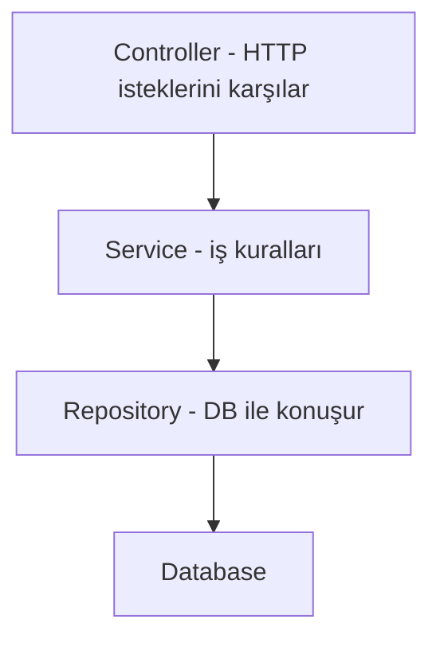
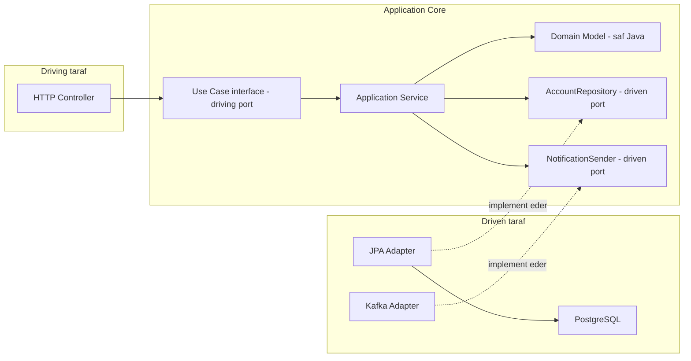
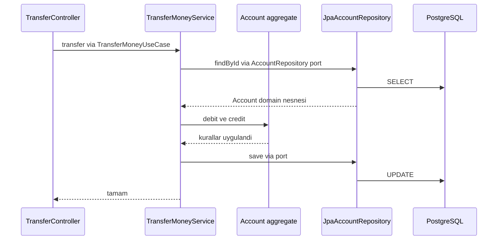
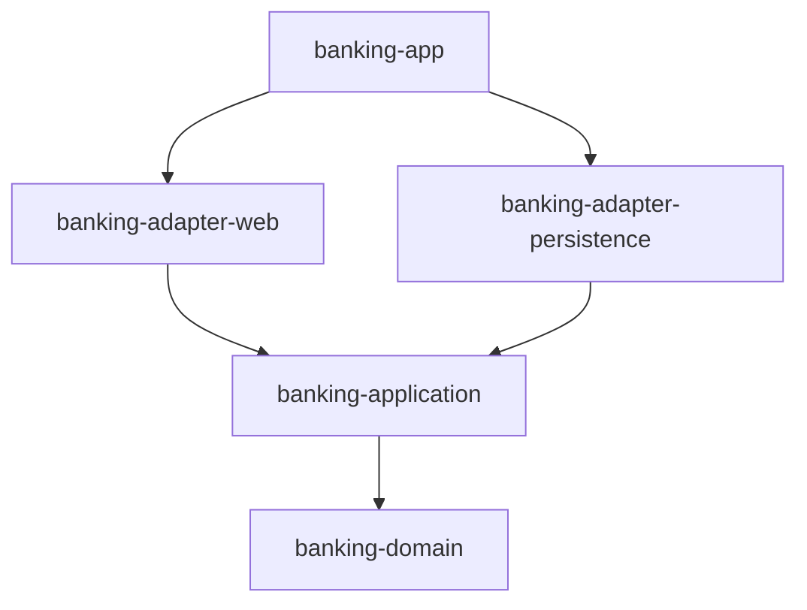

# Topic 1.1 — Mimari: Hexagonal, Ports & Adapters, Layered

```admonish info title="Bu bölümde"
- Layered ve hexagonal mimarilerin farkını ve **bağımlılık yönünün** neden kritik olduğunu öğreneceksin
- Port ve adapter kavramlarını (driving / driven) banking örnekleri üzerinden tanıyacaksın
- DDD'nin temel yapı taşlarını göreceksin: value object, entity, aggregate root, domain event
- Feature-first package yapısını ve ADR yazma alışkanlığını kazanacaksın
- Anemic Domain Model başta olmak üzere yaygın anti-pattern'leri tanımayı öğreneceksin
```

## Hedef

"Bir Java backend uygulamasının kodunu neye göre organize edersin?" sorusuna derinlemesine cevap vermek — ve banking domain'inde bu kararın uygulamayı neden "taşınabilir ve test edilebilir" yaptığını görmek.

## Süre

Okuma: 1.5-2 saat • Mini task'ler: 2 saat • Test: 30 dk • Toplam: ~4.5 saat

## Önbilgi

- Spring Boot temel (controller, service, repository annotation'larını gördün)
- Maven hakkında genel fikir

---

## Kavramlar

### 1. Neden mimari kararları önemli — banking perspektifi

Bankada bir hesap servisi 10 yıl yaşar. O sürede veritabanı değişir (Oracle → PostgreSQL), framework değişir (Spring 5 → 6 → ?), arayüz değişir (SOAP → REST → gRPC). Değişmeyen tek şey **domain logic**: bakiye negatife düşemez, her transfer iki kayıt üretir, faiz hesabı kesin kurallara tabidir.

Yanlış mimaride teknoloji değişikliği "uygulamayı sıfırdan yaz" demektir. Doğru mimaride teknoloji çevre katmanlarda değişir, çekirdek sağlam kalır.

Bu yüzden mimarinin can damarı **bağımlılık yönü**: çekirdek kod çevreye mi bağlı, yoksa çevre çekirdeğe mi? Bu bölümdeki her şey bu tek sorunun etrafında dönüyor.

---

### 2. Layered Architecture (3-katmanlı / N-tier)

Spring Boot tutorial'larının %95'i bu yapıdadır, o yüzden buradan başlıyoruz. Fikir basit: kodu yatay katmanlara böl, her katman bir alttakini çağırsın.



Bağımlılık yönü yukarıdan aşağı: Controller → Service → Repository → DB. Hızlı başlanır, junior'ın aşina olduğu yapıdır.

**Basit örnek:**

```java
// Controller — HTTP'i bilir
@RestController
@RequestMapping("/accounts")
class AccountController {
    private final AccountService service;
    
    @PostMapping
    ResponseEntity<AccountResponse> create(@RequestBody CreateAccountRequest req) {
        return ResponseEntity.ok(service.create(req));
    }
}

// Service — business logic
@Service
class AccountService {
    private final AccountRepository repo;
    
    public AccountResponse create(CreateAccountRequest req) {
        var account = new Account(req.ownerId(), req.currency());
        account = repo.save(account);
        return new AccountResponse(account.getId(), account.getBalance());
    }
}

// Repository — DB'i bilir
interface AccountRepository extends JpaRepository<Account, Long> { }
```

Peki sorun ne? Dikkat et: Service, JPA repository'e bağımlı. Yani iş kurallarını taşıyan katman, **persistence teknolojisini tanıyor**. Banking'de bu şu tuzaklara dönüşür:

```admonish warning title="Dikkat — Layered'ın banking için tuzakları"
1. **Domain modeli framework'e yapışır.** `Account` entity'si `@Entity`, `@Id`, `@Column` ile JPA'ya bağlı. JPA bırakırsan domain modelini yeniden yazarsın.

2. **Service'i unit test etmek zor.** Repository Spring bean olduğu için mock veya `@DataJpaTest` gerekir; saf Java birim testi yazamazsın.

3. **İş kuralları her yere dağılır.** Bakiye kontrolü Service'te, validation Controller'da, audit trigger Repository'de — kim hangi kuralı uyguluyor karışır.

4. **Dış sistem entegrasyonu sızar.** External bank API'sini servise enjekte ettiğin anda domain logic ile network detayları birbirine girer.
```

---

### 3. Hexagonal Architecture (Ports & Adapters)

Şimdi bağımlılık yönünü ters çevirelim. Alistair Cockburn'ün 2005'te önerdiği fikir: **çekirdek domain logic ortada durur**, tüm dış dünya (DB, HTTP, Kafka) çevrede. Çekirdek dış dünyaya bağımlı değildir — dış dünya çekirdeğe bağımlıdır.

İki anahtar kavram var:

- **Port:** Çekirdeğin dış dünyayla konuşma **kontratı** — bir interface, ve onu çekirdek tanımlar.
  - *Driving port:* "Beni dışarıdan çağırın" — use case interface'i
  - *Driven port:* "Bana bunları sağlayın" — repository, message sender interface'i
- **Adapter:** Port'u gerçek bir teknolojiyle somutlaştıran kod.
  - *Driving adapter:* HTTP controller, gRPC handler, Kafka consumer — uygulamayı **çağıran** taraf
  - *Driven adapter:* JPA implementation, Kafka producer, SMS gateway client — uygulamanın **çağırdığı** taraf

Resmin tamamı: driving taraf solda çekirdeği çağırır, driven taraf sağda çekirdeğin tanımladığı port'ları implement eder.



Kesikli oklara dikkat: JPA adapter sağda durur ama ok **çekirdeğe doğru** akar. Çekirdek bir interface tanımlar, adapter onu implement eder; çekirdek adapter'ın varlığını bile bilmez. Buna **dependency inversion** denir ve hexagonal'in bütün sırrı budur.

**Banking domain örneği:**

```java
// === DOMAIN === (framework yok, Spring yok, JPA yok)
// banking/domain/account/Account.java
public class Account {
    private final AccountId id;
    private final OwnerId ownerId;
    private Money balance;
    
    public void debit(Money amount) {
        if (balance.isLessThan(amount)) {
            throw new InsufficientFundsException(id);
        }
        balance = balance.subtract(amount);
    }
    
    public void credit(Money amount) {
        balance = balance.add(amount);
    }
    // ... getters, no setters
}

// === PORT === (interface, domain'in dışarıdan istediği)
// banking/application/port/out/AccountRepository.java
public interface AccountRepository {
    Optional<Account> findById(AccountId id);
    void save(Account account);
}

// === PORT (use case) === (driving)
// banking/application/port/in/TransferMoneyUseCase.java
public interface TransferMoneyUseCase {
    void transfer(AccountId from, AccountId to, Money amount);
}

// === APPLICATION SERVICE === (orchestration)
// banking/application/service/TransferMoneyService.java
public class TransferMoneyService implements TransferMoneyUseCase {
    private final AccountRepository accountRepository;  // ← port, ne JPA bilir ne Spring
    
    public TransferMoneyService(AccountRepository accountRepository) {
        this.accountRepository = accountRepository;
    }
    
    @Override
    public void transfer(AccountId from, AccountId to, Money amount) {
        var fromAccount = accountRepository.findById(from).orElseThrow();
        var toAccount = accountRepository.findById(to).orElseThrow();
        fromAccount.debit(amount);
        toAccount.credit(amount);
        accountRepository.save(fromAccount);
        accountRepository.save(toAccount);
    }
}

// === ADAPTER (driven) === (JPA implementation)
// banking/adapter/out/persistence/JpaAccountRepository.java
@Component
class JpaAccountRepository implements AccountRepository {
    private final AccountJpaRepository jpaRepo;          // Spring Data JPA
    private final AccountPersistenceMapper mapper;
    
    @Override
    public Optional<Account> findById(AccountId id) {
        return jpaRepo.findById(id.value()).map(mapper::toDomain);
    }
    
    @Override
    public void save(Account account) {
        var entity = mapper.toEntity(account);
        jpaRepo.save(entity);
    }
}

// JPA entity'si domain'in dışında, sadece persistence katmanında
@Entity
@Table(name = "accounts")
class AccountJpaEntity {
    @Id Long id;
    Long ownerId;
    BigDecimal balanceAmount;
    String balanceCurrency;
    // ...
}

// === ADAPTER (driving) === (HTTP controller)
// banking/adapter/in/web/TransferController.java
@RestController
@RequestMapping("/transfers")
class TransferController {
    private final TransferMoneyUseCase transferMoney;    // ← port, somutu bilmez
    
    public TransferController(TransferMoneyUseCase transferMoney) {
        this.transferMoney = transferMoney;
    }
    
    @PostMapping
    public ResponseEntity<Void> transfer(@Valid @RequestBody TransferRequest req) {
        transferMoney.transfer(
            new AccountId(req.fromAccountId()),
            new AccountId(req.toAccountId()),
            Money.of(req.amount(), req.currency())
        );
        return ResponseEntity.ok().build();
    }
}
```

Bir transfer isteğinin uçtan uca akışı:



Controller sadece port interface'ini bilir, service persistence'a sadece port üzerinden ulaşır — hiçbir ok domain'den dışarı çıkmaz.

**Kazandıkların:**

1. **Domain saf Java.** Spring ve JPA olmadan çalışır; unit test'ler mock'sız yazılır.
2. **Adapter değiştirilebilir.** JPA → MongoDB geçişinde sadece adapter değişir.
3. **Test piramidi sağlıklı:** domain unit test (hızlı, çok), adapter test (TestContainers), integration test (az).
4. **Açık kontrat:** port'lar, "uygulamanın dış dünyadan ihtiyaçları neler" sorusunun tek cevabı.

**Bedeli:** mapper kodu yazarsın (daha fazla kod), ilk bakışta over-engineering gibi gelir ve küçük bir CRUD admin paneli için gerçekten de ağırdır.

```admonish tip title="İpucu — banking için neden değer"
Domain kuralları (negative balance, double-entry invariant, faiz formülü) **on yıllarca yaşayacak**. Teknoloji 3 yılda bir değişir. Hexagonal seni yaşatır.
```

---

### 4. Onion Architecture & Clean Architecture (kısaca)

Bu isimleri iş ilanlarında ve mülakatlarda göreceksin, paniğe gerek yok:

- **Onion Architecture** (Jeffrey Palermo): aynı fikir, "soğan halkaları" görseliyle — merkezde Domain, sonra Application Services, sonra Infrastructure.
- **Clean Architecture** (Uncle Bob): katmanları "Entities → Use Cases → Interface Adapters → Frameworks & Drivers" diye adlandırır ve **"The Dependency Rule"** der: bağımlılıklar sadece dışarıdan içeri akar.

Üçü de pratikte aynı yapıyı önerir: **domain merkez, framework çevre, bağımlılık içe doğru.**

---

### 5. Domain-Driven Design (DDD) — mimari değil ama bağlantılı

Hexagonal sana "domain'i ortaya koy" der ama o domain'i **nasıl modelleyeceğini** söylemez. Orada DDD devreye girer (Eric Evans, 2003). DDD bir mimari değil, modelleme yaklaşımıdır — hexagonal ile çok iyi eşleşir.

Faz 1'de bilmen gereken parçaları:

- **Ubiquitous language:** Kodda iş diliyle aynı kelimeleri kullan. Bankacı "EFT" diyorsa kod da `Eft` der, `Transfer` değil.
- **Bounded context:** Büyük domain'i parçalara böl — Account context, Card context, Transfer context. Her birinin kendi modeli olabilir.
- **Aggregate:** Bir tutarlılık sınırı. Aggregate root (örn. `Account`) kendi child'larını (`JournalEntry`'leri) yönetir ve **dışarıdan yegane giriş noktasıdır**.
- **Entity vs Value Object:** *Entity*'nin kimliği vardır (`Account`, `Customer`) — iki müşterinin adı aynı olsa da farklı entity'dir. *Value object* değeriyle tanımlanır — her `Money(100.00, TRY)` birbirine eşittir ve **immutable** olmalıdır.
- **Domain event:** Domain'de bir şey olduğunda yayılan mesaj: `MoneyTransferred`, `AccountOpened`.

**Banking örneği — value object:**

```java
public record Money(BigDecimal amount, Currency currency) {
    public Money {
        if (amount == null || currency == null) throw new IllegalArgumentException();
        if (amount.scale() > currency.getDefaultFractionDigits()) {
            throw new IllegalArgumentException("Too many decimal places for " + currency);
        }
    }
    
    public Money add(Money other) {
        requireSameCurrency(other);
        return new Money(amount.add(other.amount), currency);
    }
    
    public Money subtract(Money other) {
        requireSameCurrency(other);
        return new Money(amount.subtract(other.amount), currency);
    }
    
    public boolean isLessThan(Money other) {
        requireSameCurrency(other);
        return amount.compareTo(other.amount) < 0;
    }
    
    private void requireSameCurrency(Money other) {
        if (!currency.equals(other.currency)) {
            throw new CurrencyMismatchException(currency, other.currency);
        }
    }
}
```

Dikkat: currency mismatch kuralı `Money`'nin **içinde** yaşıyor. Onu kullanan hiçbir servis bu kontrolü unutamaz.

**Banking örneği — aggregate root:**

```java
public class Account {
    private final AccountId id;
    private final OwnerId ownerId;
    private final Currency currency;
    private Money balance;
    private final List<DomainEvent> events = new ArrayList<>();
    
    public void deposit(Money amount, TransferId transferId) {
        if (!amount.currency().equals(this.currency)) {
            throw new CurrencyMismatchException(this.currency, amount.currency());
        }
        balance = balance.add(amount);
        events.add(new MoneyDeposited(id, amount, transferId, Instant.now()));
    }
    
    public void withdraw(Money amount, TransferId transferId) {
        if (!amount.currency().equals(this.currency)) {
            throw new CurrencyMismatchException(this.currency, amount.currency());
        }
        if (balance.isLessThan(amount)) {
            throw new InsufficientFundsException(id);
        }
        balance = balance.subtract(amount);
        events.add(new MoneyWithdrawn(id, amount, transferId, Instant.now()));
    }
    
    public List<DomainEvent> pullEvents() {
        var pulled = List.copyOf(events);
        events.clear();
        return pulled;
    }
    // ...
}
```

```admonish warning title="Dikkat"
`Account` saf Java. `@Entity` yok. JPA ayrı bir `AccountJpaEntity` ile temsil edilir, mapper ile dönüşür.
```

---

### 6. Package yapısı — nasıl klasörleyeceksin

Hexagonal'i package'a yansıtmanın iki ana yolu var:

**Variant A — "feature first, then layer":**

```
com.mavibank.banking
├── account
│   ├── domain
│   │   ├── Account.java
│   │   ├── AccountId.java
│   │   └── Money.java
│   ├── application
│   │   ├── port
│   │   │   ├── in
│   │   │   │   └── OpenAccountUseCase.java
│   │   │   └── out
│   │   │       └── AccountRepository.java
│   │   └── service
│   │       └── OpenAccountService.java
│   └── adapter
│       ├── in
│       │   └── web
│       │       └── AccountController.java
│       └── out
│           └── persistence
│               ├── JpaAccountRepository.java
│               └── AccountJpaEntity.java
└── transfer
    ├── domain
    ├── application
    └── adapter
```

**Variant B — "layer first, then feature":**

```
com.mavibank.banking
├── domain
│   ├── account
│   └── transfer
├── application
│   ├── account
│   └── transfer
└── adapter
    ├── in.web
    │   ├── account
    │   └── transfer
    └── out.persistence
        ├── account
        └── transfer
```

```admonish tip title="İpucu — hangisini seçmeli?"
A (feature-first). Sebep:
- Bir feature'a dokunmak istediğinde tüm kod aynı yerde
- Microservice'e ayırmak gerektiğinde feature'ı tek klasör çıkarırsın
- Bounded context fikriyle daha iyi eşleşir

Bu projede Variant A kullanacağız.
```

---

### 7. Maven multi-module ile fiziksel ayrılık (opsiyonel ama güçlü)

Package ayrımı bir söz; multi-module ise **derleyicinin zorladığı** bir sözleşme. Katmanları ayrı Maven module'lerine bölersin:

```
core-banking/
├── pom.xml                          (parent)
├── banking-domain/                  (sadece domain)
│   └── pom.xml
├── banking-application/             (use cases + ports)
│   └── pom.xml                      (banking-domain'e depend)
├── banking-adapter-persistence/     (JPA adapter)
│   └── pom.xml                      (application'a depend, Spring Data JPA dep)
├── banking-adapter-web/             (HTTP adapter)
│   └── pom.xml                      (application'a depend, Spring Web dep)
└── banking-app/                     (main class, configuration)
    └── pom.xml                      (tüm adapter'lara depend)
```

Modüller arası bağımlılık yönü — tüm oklar domain'e doğru akar:



Avantajı compile-time enforcement: domain modülünde Spring dependency'si olmadığı için derleyici Spring import'una **izin vermez**. Bedeli biraz daha ağır setup — bu yüzden başlangıçta **tek module + package separation** kullanacağız, Faz 7'de microservices'e bölerken multi-module'a geçeceğiz.

---

### 8. Architectural Decision Records (ADR)

Altı ay sonra "biz neden hexagonal seçmiştik?" diye soran olacak — belki de o kişi sen olacaksın. ADR, mimari kararları yazılı kayıt altına alma alışkanlığıdır: `core-banking/docs/adr/` klasörü, her karar için bir markdown dosyası.

Template:

```markdown
# ADR-001: Hexagonal architecture seçimi

Date: 2025-MM-DD
Status: Accepted

## Context
TR bank backend rolü hedefli core-banking projesi. Domain (account, transfer, ledger) uzun ömürlü olacak. Adapter'lar (DB, mesajlaşma) değişebilir.

## Decision
Hexagonal architecture (Ports & Adapters) kullanılacak. Domain saf Java tutulacak, JPA entity'leri ayrı persistence katmanında olacak.

## Consequences
+ Domain unit test'leri mock'suz yazılır
+ JPA değişikliği domain'i etkilemez
- Mapper kodu yazma yükü
- Junior için ilk başta karmaşık
```

```admonish tip title="İpucu"
Banking şirketlerinde ADR çok yaygın — production'a giren her major karar belgelenir. Bu alışkanlığı şimdiden kazan.
```

---

### 9. Anti-pattern'ler — ne yapma

**Anti-pattern 1: Anemic Domain Model**

Domain class'ı sadece getter/setter'dan oluşur, hiçbir davranışı yoktur; tüm logic Service'e dağılır.

```java
// ❌ Kötü
class Account {
    private BigDecimal balance;
    public BigDecimal getBalance() { return balance; }
    public void setBalance(BigDecimal b) { balance = b; }
}

class AccountService {
    public void withdraw(Long id, BigDecimal amount) {
        Account a = repo.findById(id);
        if (a.getBalance().compareTo(amount) < 0) throw new ...;
        a.setBalance(a.getBalance().subtract(amount));
        repo.save(a);
    }
}
```

Sorun: `Account`'un iç tutarlılığı dışarıdan korunmak zorunda. Başka bir servis aynı kontrolü unutursa bakiye negatife düşer. Doğrusu: `account.withdraw(amount)` — kural nesnenin içinde yaşar.

**Anti-pattern 2: Her şeyi yapan Service**

Service hem orchestration yapar, hem DB sorgusu yazar, hem matematik yapar, hem HTTP çağrısı atar. Çözüm: orchestration servise, kural domain'e, DB adapter'a, HTTP başka bir adapter'a.

**Anti-pattern 3: Entity'i HTTP'ye sızdırma**

```java
// ❌ Kötü
@GetMapping("/{id}")
public AccountJpaEntity get(@PathVariable Long id) { ... }
```

Sonuçları: lazy loading patlaması, internal field'ların dışarı sızması, JSON formatının DB schema'sına bağlanması ve yüksek breaking change riski. Çözüm: ayrı `AccountResponse` DTO'su (sonraki topic'te detaylı).

**Anti-pattern 4: Katmanlar arası circular dependency**

```admonish warning title="Dikkat"
Domain, persistence adapter'a import yapar. Bu hexagonal'i çürütür. Domain hiçbir şeye bağımlı olmamalı.
```

---

## Önemli olabilecek araştırma kaynakları (kuralın gereği: senin için keyword, kendi bul)

- "Hexagonal Architecture" Alistair Cockburn original article
- "Get Your Hands Dirty on Clean Architecture" Tom Hombergs (kitap — küçük ve odaklı)
- "Domain-Driven Design" Eric Evans (mavi kitap — referans, baştan sona okumak şart değil)
- "Implementing Domain-Driven Design" Vaughn Vernon (kırmızı kitap — daha pratik)
- Reflectoring.io blog (Tom Hombergs) — hexagonal Spring Boot örnekleri
- "Clean Architecture" Robert C. Martin
- ArchUnit dokümantasyonu (mimariyi test etme)

---

## Mini task'ler

Bunları sırayla `~/projects/core-banking/` içinde yap. Henüz Spring Boot kurmaya gerek yok, sadece domain sınıfları yazıyoruz.

### Task 1.1.1 — `Money` value object'i yaz (30 dk)

`banking/domain/common/Money.java` oluştur. Şu kuralları sağlasın:

- `amount` (BigDecimal) ve `currency` (java.util.Currency) tutar
- Immutable (record kullanabilirsin)
- `add(Money other)` ve `subtract(Money other)` metodları
- Farklı para birimleriyle aritmetik → `CurrencyMismatchException` fırlat
- Negatif amount construction'da kabul edilebilir (refund senaryosu için) ama dikkatli ol
- `isLessThan`, `isGreaterThanOrEqual`, `isZero`, `isNegative` metodları
- `Money.zero(Currency)` static factory
- `Money.of(BigDecimal, Currency)` static factory
- Scale, currency'nin default fraction digits'i ile sınırlı (TRY: 2, JPY: 0, BHD: 3)

### Task 1.1.2 — `AccountId`, `OwnerId`, `TransferId` value object'leri (15 dk)

Hepsi `record` olarak yaz. Null kabul etmesin. UUID veya Long bazlı — seçimin senin.

### Task 1.1.3 — `Account` aggregate root'u (45 dk)

`banking/domain/account/Account.java` oluştur:

- `id` (AccountId), `ownerId` (OwnerId), `currency` (Currency), `balance` (Money) tutar
- Constructor private veya factory ile çağrılır: `Account.open(OwnerId owner, Currency currency)` → balance 0 ile başlar
- `deposit(Money amount)` ve `withdraw(Money amount)` metodları
- Currency mismatch ve insufficient funds için kendi exception'larını fırlat
- `domain/account/exception/` paketine `InsufficientFundsException`, `CurrencyMismatchException` koy
- Setter yok. Tüm değişiklik metot ile.

### Task 1.1.4 — Klasör yapısını oluştur (10 dk)

`~/projects/core-banking/` içinde **henüz boş** olsa bile şu klasörleri oluştur (Maven yapısı henüz değil, sadece package planı):

```
core-banking/
└── src/
    └── main/
        └── java/
            └── com/
                └── mavibank/
                    └── banking/
                        ├── account/
                        │   ├── domain/
                        │   ├── application/
                        │   │   ├── port/
                        │   │   │   ├── in/
                        │   │   │   └── out/
                        │   │   └── service/
                        │   └── adapter/
                        │       ├── in/
                        │       │   └── web/
                        │       └── out/
                        │           └── persistence/
                        ├── transfer/
                        │   └── ... (account ile aynı yapı)
                        └── common/
                            └── domain/
```

### Task 1.1.5 — ADR yaz (15 dk)

`core-banking/docs/adr/0001-use-hexagonal-architecture.md` oluştur. Yukarıdaki template'i kullan. Kendi kararını kendi cümlelerinle yaz.

---

## Test yazma rehberi

Bu topic'te framework olmadığı için **saf JUnit 5 + AssertJ** ile başlıyoruz. Test class'larını `src/test/java/com/mavibank/banking/...` altında entity ile aynı paket yapısında yaz.

### Test 1.1.1 — `MoneyTest`

Şu senaryoları yaz (her biri ayrı `@Test`):

1. `Money.of(100.00, TRY)` + `Money.of(50.00, TRY)` = `Money.of(150.00, TRY)` ✓
2. `Money.of(100.00, TRY).add(Money.of(50.00, USD))` → `CurrencyMismatchException` fırlatır
3. `Money.zero(TRY).isZero()` true döner
4. `Money.of(-10.00, TRY).isNegative()` true döner
5. `Money.of(100.00, TRY).isLessThan(Money.of(50.00, TRY))` false
6. `Money.of(100.123, TRY)` construction → exception (scale > 2)
7. `Money.of(100, JPY)` → scale 0 OK
8. `Money.of(100.000, BHD)` → scale 3 OK
9. `null` currency ile construction → NullPointerException veya IllegalArgumentException

AssertJ kullan:
```java
import static org.assertj.core.api.Assertions.*;

assertThat(result).isEqualTo(Money.of(new BigDecimal("150.00"), TRY));
assertThatThrownBy(() -> money1.add(money2)).isInstanceOf(CurrencyMismatchException.class);
```

### Test 1.1.2 — `AccountTest`

1. `Account.open(ownerId, TRY)` → balance 0 TRY
2. Account'a `deposit(100 TRY)` → balance 100 TRY
3. Account'a `deposit(100 USD)` → `CurrencyMismatchException` (account TRY ise)
4. Account balance 100 TRY iken `withdraw(150 TRY)` → `InsufficientFundsException`
5. Account balance 100 TRY iken `withdraw(40 TRY)` → balance 60 TRY
6. Birden fazla deposit/withdraw kombinasyonu sonrası balance doğru
7. Withdraw amount 0 ise → IllegalArgumentException (sınır durumu)

### Test 1.1.3 — Pattern öğrenmek için: Test Data Builder

Test'lerinde her sefer `Account.open(new OwnerId(UUID.randomUUID()), Currency.getInstance("TRY"))` yazmak yorucu. Test helper class'ı yaz:

```java
class AccountTestBuilder {
    private OwnerId ownerId = new OwnerId(UUID.randomUUID());
    private Currency currency = Currency.getInstance("TRY");
    private Money balance = Money.zero(currency);
    
    public static AccountTestBuilder anAccount() { return new AccountTestBuilder(); }
    public AccountTestBuilder withCurrency(String code) { 
        this.currency = Currency.getInstance(code); 
        return this; 
    }
    public AccountTestBuilder withBalance(String amount) {
        this.balance = Money.of(new BigDecimal(amount), currency);
        return this;
    }
    public Account build() {
        var account = Account.open(ownerId, currency);
        if (balance.amount().compareTo(BigDecimal.ZERO) > 0) {
            account.deposit(balance, new TransferId(UUID.randomUUID()));
        }
        return account;
    }
}
```

Kullanım:
```java
var account = anAccount().withCurrency("TRY").withBalance("100.00").build();
```

```admonish tip title="İpucu"
Bu pattern (Object Mother / Test Data Builder) banka tarafında **çok yaygın**, alışkanlık kazan.
```

---

## Claude-verify prompt

Topic'i bitirdiğinde, kodunu Claude'a verify ettir. **Sadece verify**, kod yazdırma. Aşağıdaki prompt'u kopyala, kodunu (yapıştırarak veya repo linki ile) ver:

```
Aşağıdaki Java kodum hexagonal architecture & DDD prensiplerine göre yazılmış bir 
banking domain modülü. Lütfen şu kriterlere göre değerlendir ve EKSİKLERİ söyle, 
düzeltmek için kod yazma:

1. Domain class'larında hiç framework annotation'ı (@Entity, @Component, @Autowired, 
   vb.) var mı? Olmamalı.

2. `Money` value object:
   - Immutable mi (record veya tüm field'lar final)?
   - `add` ve `subtract` farklı currency'ler için exception fırlatıyor mu?
   - Scale validation (currency'nin default fraction digits'ine göre) var mı?
   - Construction'da null kontrolü var mı?
   - `equals` ve `hashCode` doğru çalışıyor mu (record ise otomatik)?

3. `Account` aggregate root:
   - `balance` field'ı dışarıya setter ile expose ediliyor mu? (Olmamalı)
   - `deposit` ve `withdraw` metotları currency mismatch ve insufficient funds 
     durumlarını kontrol ediyor mu?
   - Constructor public mi yoksa factory method (`Account.open(...)`) var mı?
   - Anemic domain model'e kaymış mı (sadece getter/setter)?

4. Paket yapısı:
   - `domain/`, `application/`, `adapter/` ayrımı yapılmış mı?
   - `application/port/in/` ve `application/port/out/` var mı?

5. Exception'lar:
   - Domain-specific exception class'ları var mı (`InsufficientFundsException` gibi) 
     yoksa generic `RuntimeException` mu kullanılmış?

6. Test'ler:
   - `MoneyTest` ve `AccountTest` var mı?
   - AssertJ kullanılmış mı?
   - Currency mismatch ve insufficient funds için ayrı test'ler var mı?
   - Test Data Builder pattern uygulanmış mı?

7. ADR:
   - `docs/adr/0001-use-hexagonal-architecture.md` var mı?
   - Context, Decision, Consequences bölümleri yazılmış mı?

Her madde için PASS / FAIL / EKSIK olarak işaretle ve kısa açıklama yap. Kod yazıp 
düzeltme. Sadece neyin eksik/yanlış olduğunu söyle. Ben düzelteceğim.
```

---

## Tamamlama kriterleri (kendine sor)

- [ ] `Money`, `AccountId`, `OwnerId`, `TransferId`, `Account` class'larını yazdım
- [ ] Domain class'larımın hiçbirinde `@Entity` veya Spring annotation'ı yok
- [ ] `InsufficientFundsException` ve `CurrencyMismatchException` yazdım, kullanıyorum
- [ ] Paket yapısı `account/domain`, `account/application/port/{in,out}`, `account/application/service`, `account/adapter/{in/web, out/persistence}` şeklinde
- [ ] `MoneyTest` ve `AccountTest` yazdım, AssertJ kullandım
- [ ] Test Data Builder pattern'i öğrendim ve kullandım
- [ ] `docs/adr/0001-use-hexagonal-architecture.md` yazdım
- [ ] Hexagonal architecture'ın "dependency direction"ını birine 2 dakikada anlatabilirim
- [ ] Anti-pattern'leri tanıyabiliyorum (Anemic Domain Model özellikle)

Hepsi onaylı → Topic 1.2'ye geç → [02-project-setup/](../02-project-setup/index.md)

---

## Notlar (defterine yaz)

Aşağıdaki cümleleri **kendi kelimelerinle** doldur:

1. "Hexagonal architecture'ın temel prensibi ____ ve bunun banking projesinde önemi ____ çünkü ____."
2. "Bir port ve bir adapter farkı şu: ____. Driving port örneği ____, driven port örneği ____."
3. "Anemic Domain Model'in problemi ____. Bunun yerine ____ yaparım."
4. "DDD'nin Entity ve Value Object farkı ____. `Money` value object'tir çünkü ____."
5. "Aggregate root nedir, neden önemli? ____."

---

```admonish success title="Bölüm Özeti"
- Mimarinin can damarı **bağımlılık yönüdür**: hexagonal'de dış dünya çekirdeğe bağımlıdır, çekirdek dış dünyayı bilmez
- **Port** çekirdeğin tanımladığı interface, **adapter** onu bir teknolojiyle somutlaştıran koddur; driving taraf uygulamayı çağırır, driven taraf uygulama tarafından çağrılır
- Domain modeli **saf Java** kalır: `@Entity` gibi framework annotation'ları domain'e girmez, JPA entity'si ayrı tutulup mapper ile dönüştürülür
- `Money` gibi **value object'ler immutable** olur ve kendi kurallarını (currency mismatch, scale) içinde taşır; `Account` gibi **aggregate root'lar** iç tutarlılığı kendi metotlarıyla korur
- Package yapısında **feature-first** (Variant A) tercih edilir; bounded context ile eşleşir ve microservice'e bölünmeyi kolaylaştırır
- **Anemic Domain Model**'den kaç: logic getter/setter'la dışarıda değil, `account.withdraw(amount)` gibi davranış olarak domain'in içinde yaşar
```
