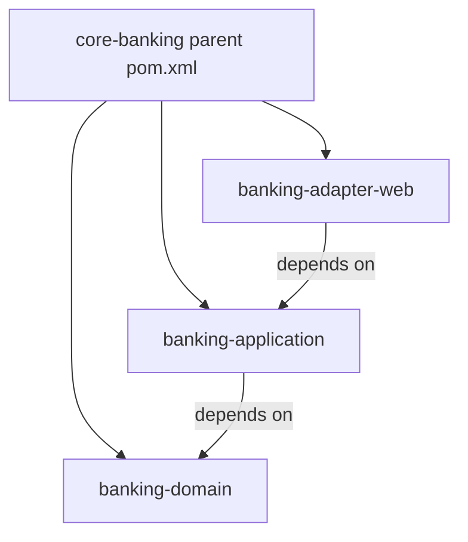
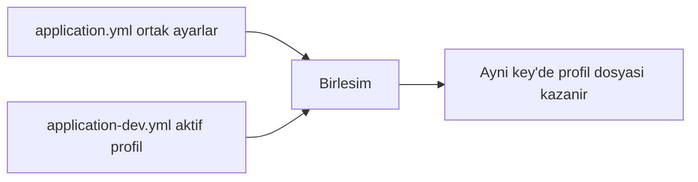
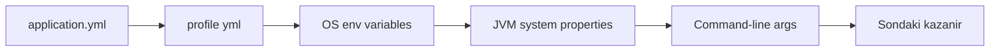
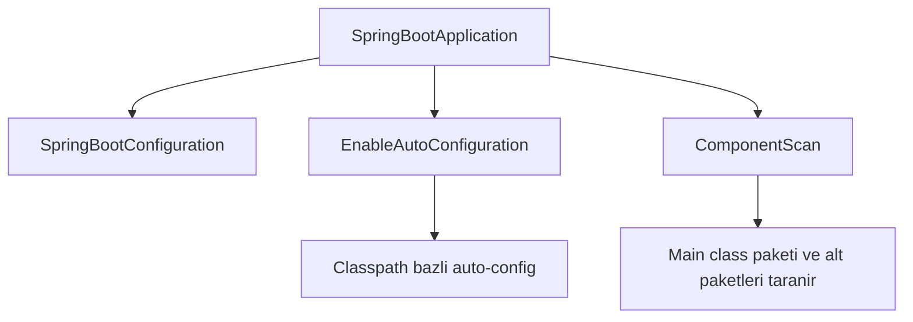

# Topic 1.2 — Proje Setup: Spring Boot 3 + Maven + Profiles

```admonish info title="Bu bölümde"
- Spring Boot 3 felsefesini ve auto-configuration mantığını kavrayacaksın
- `pom.xml` anatomisini ve günlük Maven komutlarını öğreneceksin
- dev / test / prod profile sistemi ile ortam bazlı konfigürasyon kuracaksın
- `@ConfigurationProperties` ile type-safe config binding yazacaksın
- Secret'ları yml'den uzak tutmanın banking standardını göreceksin
```

## Hedef

Boş bir klasörden çalışan bir Spring Boot 3 uygulamasına gelmek. Ama sadece "çalıştır" değil — **production-grade konfigürasyon** ile: profil ayrımı, type-safe config binding, secret'ları yml'den uzakta tutma.

## Süre

Okuma: 1 saat • Mini task: 2 saat • Test: 30 dk • Toplam: ~3.5 saat

## Önbilgi

- Topic 1.1 tamamlandı
- Java 21 kurulu (virtual thread için Java 21 hedefleyeceğiz)
- Maven kurulu (`mvn -version`)

---

## Kavramlar

### 1. Spring Boot felsefesi

Spring Framework güçlü ama çıplak haliyle kurulumu zahmetli — Spring Boot bu zahmeti senin yerine üstlenir. Bunu üç taahhütle yapar:

1. **Opinionated defaults:** "Çoğu durum için doğru olanı varsayılan yap." Logging, JSON, embedded server sıfır config çalışır.
2. **Auto-configuration:** Classpath'te `spring-boot-starter-data-jpa` görürse Hibernate'i kurar, DataSource bekler, EntityManager bean'ini hazırlar.
3. **Production-ready:** Actuator ile health/metrics, externalized config, profile management hazır gelir.

Sık karışan bir ayrım: **Spring Boot ≠ Spring Framework.** Framework (Core, MVC, Data, Security) altyapıdır; Boot bu altyapının üstüne **starter dependency + auto-config + opinionated default** ekler.

### 2. Spring Initializr vs manuel Maven

Projeye başlamanın iki yolu var, ve biri açıkça junior tuzağı.

- **Spring Initializr (önerilen):** [start.spring.io](https://start.spring.io)'da bağımlılıkları tıklayarak seçersin, hazır `pom.xml` + boş main class indirirsin. Hızlı ve hatasız.
- **Manuel:** `pom.xml`'i elinle yazarsın. Tüm versiyon ve plugin'leri bilmen gerekir; sonuç genelde yanlış versiyon, eksik plugin, çalışmayan setup.

Bu projede **Initializr ile başla.** Sonra `pom.xml`'i inceleyip "Initializr ne kurdu?" sorusunu kendin cevapla — öğrenme orada.

### 3. `pom.xml` anatomisi

`pom.xml` projenin kimliği: hangi Java, hangi Spring Boot, hangi kütüphaneler. Bir Spring Boot uygulamasınınki şöyle görünür:

```xml
<?xml version="1.0" encoding="UTF-8"?>
<project xmlns="http://maven.apache.org/POM/4.0.0" ...>
    <modelVersion>4.0.0</modelVersion>

    <!-- Spring Boot parent — versiyon yönetimi buradan gelir -->
    <parent>
        <groupId>org.springframework.boot</groupId>
        <artifactId>spring-boot-starter-parent</artifactId>
        <version>3.3.4</version>  <!-- Bu projedeki Spring Boot versiyonu -->
        <relativePath/>
    </parent>

    <groupId>com.mavibank</groupId>
    <artifactId>core-banking</artifactId>
    <version>0.1.0-SNAPSHOT</version>
    <name>core-banking</name>

    <properties>
        <java.version>21</java.version>
    </properties>

    <dependencies>
        <!-- Web (Tomcat + Spring MVC) -->
        <dependency>
            <groupId>org.springframework.boot</groupId>
            <artifactId>spring-boot-starter-web</artifactId>
        </dependency>

        <!-- Validation (Hibernate Validator) -->
        <dependency>
            <groupId>org.springframework.boot</groupId>
            <artifactId>spring-boot-starter-validation</artifactId>
        </dependency>

        <!-- JPA + Hibernate -->
        <dependency>
            <groupId>org.springframework.boot</groupId>
            <artifactId>spring-boot-starter-data-jpa</artifactId>
        </dependency>

        <!-- PostgreSQL driver -->
        <dependency>
            <groupId>org.postgresql</groupId>
            <artifactId>postgresql</artifactId>
            <scope>runtime</scope>
        </dependency>

        <!-- Flyway -->
        <dependency>
            <groupId>org.flywaydb</groupId>
            <artifactId>flyway-core</artifactId>
        </dependency>

        <!-- Actuator (health, metrics) -->
        <dependency>
            <groupId>org.springframework.boot</groupId>
            <artifactId>spring-boot-starter-actuator</artifactId>
        </dependency>

        <!-- Test -->
        <dependency>
            <groupId>org.springframework.boot</groupId>
            <artifactId>spring-boot-starter-test</artifactId>
            <scope>test</scope>
        </dependency>

        <!-- TestContainers (Topic 1.4'te kullanılacak) -->
        <dependency>
            <groupId>org.testcontainers</groupId>
            <artifactId>postgresql</artifactId>
            <version>1.20.1</version>
            <scope>test</scope>
        </dependency>
        <dependency>
            <groupId>org.testcontainers</groupId>
            <artifactId>junit-jupiter</artifactId>
            <version>1.20.1</version>
            <scope>test</scope>
        </dependency>
    </dependencies>

    <build>
        <plugins>
            <plugin>
                <groupId>org.springframework.boot</groupId>
                <artifactId>spring-boot-maven-plugin</artifactId>
            </plugin>
        </plugins>
    </build>
</project>
```

Bu dosyada üç şeye dikkat et:

- **`<parent>`:** Spring Boot'un parent POM'u `dependencyManagement` getirir — Spring Boot dependency'lerine versiyon yazmazsın, parent yönetir. Versiyon uyumsuzluğu derdi biter.
- **`spring-boot-starter-*`:** Starter = bir grup ilgili dependency. `starter-web` tek satır ama arkada Spring MVC + Tomcat + Jackson dahil ~30 jar gelir.
- **`spring-boot-maven-plugin`:** `mvn spring-boot:run` ve fat JAR build bunun sayesinde.

### 4. Maven temel komutlar

Banking'de günlük hayatın bir parçası olacak komutlar:

```bash
mvn clean              # target/ klasörünü siler
mvn compile            # sadece compile
mvn test               # test'leri çalıştırır (unit + integration)
mvn package            # JAR oluşturur
mvn install            # local Maven repo'na koyar
mvn spring-boot:run    # uygulamayı başlatır

mvn dependency:tree    # bağımlılık ağacı (versiyon çakışması bulmak için)
mvn versions:display-dependency-updates  # güncel olmayan dep'leri listeler

mvn -DskipTests package      # test'siz build
mvn test -Dtest=AccountTest  # sadece bir test class
```

```admonish tip title="İpucu"
TR bankalarında çoğu yerde Maven kullanılır; Gradle bazı modern startup'larda. Maven'a hakim ol.
```

### 5. Single module vs Multi-module

Proje büyüdükçe "tek pom mu, çok pom mu?" sorusu gelir. İki model:

- **Single module:** Tek `pom.xml`, tüm kod `src/main/java/` altında, package'larla organize.
- **Multi-module:** Parent `pom.xml` + her biri kendi `pom.xml`'ine sahip alt modüller.



Phase 1'de **single module + iyi package yapısı** kullanacağız. Multi-module Maven karmaşıklığı şu an ekstra yük; `domain` package'ında package-private görünürlük zaten ayrışmayı sağlar. Phase 7'de microservice'e ayırırken multi-module'a geçeriz.

### 6. `application.yml` — externalized configuration

Konfigürasyonu koda gömmek yerine dışarıda tutarsın — böylece aynı JAR farklı ortamlarda farklı davranır. Spring Boot bunu `src/main/resources/application.yml` (veya `.properties`) dosyasından okur; YAML daha okunabilir, onu kullanacağız.

```yaml
spring:
  application:
    name: core-banking
  
  datasource:
    url: jdbc:postgresql://localhost:5432/banking
    username: ${DB_USERNAME:banking_app}
    password: ${DB_PASSWORD:}
    hikari:
      maximum-pool-size: 10
      connection-timeout: 5000
      leak-detection-threshold: 30000
  
  jpa:
    hibernate:
      ddl-auto: validate   # Flyway yönetir, Hibernate dokunmasın
    properties:
      hibernate:
        format_sql: true
        jdbc:
          batch_size: 50
        order_inserts: true
  
  flyway:
    enabled: true
    locations: classpath:db/migration

server:
  port: 8080
  shutdown: graceful

management:
  endpoints:
    web:
      exposure:
        include: health,info,metrics,prometheus
  endpoint:
    health:
      show-details: when_authorized

logging:
  level:
    root: INFO
    com.mavibank: DEBUG
    org.hibernate.SQL: DEBUG    # sadece development'ta
```

Üç satır özellikle önemli:

- **`${DB_PASSWORD:}`:** Environment variable set edilmemişse boş string. Production'da password yml'de olmaz — env var veya secret manager'dan gelir.
- **`ddl-auto: validate`:** Hibernate schema'ya dokunmasın, sadece doğrulasın. Migration Flyway'in işi.
- **`exposure.include`:** Actuator'da neyi expose edeceğini sen seçersin. Production'da `health,info,prometheus` kâfi.

### 7. Profile sistemi (dev / test / prod)

Banking projelerinde en az üç ortam var ve her biri farklı config ister:

- **dev:** developer laptop'u — lokal PostgreSQL, verbose log
- **test:** CI'daki integration test'ler — TestContainers ile geçici DB
- **prod:** gerçek DB, encrypted password, sıkı log

Spring Boot bunu **profile** sistemiyle çözer. Dosya hiyerarşisi:

```
src/main/resources/
├── application.yml              ← ortak, tüm profile'lerde geçerli
├── application-dev.yml          ← `dev` profile aktifken eklenir
├── application-test.yml         ← `test` profile aktifken eklenir
└── application-prod.yml         ← `prod` profile aktifken eklenir
```

Override mekaniği basit: önce `application.yml` yüklenir, üzerine aktif profile'in dosyası biner. Aynı key varsa profile-specific olan kazanır.



**Örnek `application-dev.yml`:**

```yaml
spring:
  datasource:
    url: jdbc:postgresql://localhost:5432/banking_dev
    username: banking_dev
    password: dev_password    # local dev için OK, production'da ASLA

logging:
  level:
    com.mavibank: DEBUG
    org.hibernate.SQL: DEBUG
    org.hibernate.orm.jdbc.bind: TRACE   # parametre değerlerini de logla
```

**Örnek `application-prod.yml`:**

```yaml
spring:
  datasource:
    url: ${DB_URL}              # env var'dan gelir
    username: ${DB_USERNAME}
    password: ${DB_PASSWORD}    # secret manager'dan
  jpa:
    show-sql: false

logging:
  level:
    root: WARN
    com.mavibank: INFO
```

Profile'i aktifleştirmenin dört yolu var:

```bash
# 1. Komut satırı
mvn spring-boot:run -Dspring-boot.run.profiles=dev

# 2. Environment variable
SPRING_PROFILES_ACTIVE=dev mvn spring-boot:run

# 3. application.yml'da default
spring:
  profiles:
    active: dev

# 4. Java -jar
java -jar -Dspring.profiles.active=prod core-banking.jar
```

Birden fazla profile de verebilirsin: `SPRING_PROFILES_ACTIVE=prod,monitoring,debug`. Sırasıyla uygulanır, sondaki kazanır.

### 8. Configuration source precedence (kim kazanır)

Aynı key birden fazla kaynaktan geldiğinde kim kazanır? Spring Boot'un net bir öncelik sırası var — sondaki en güçlü:



Banking'de pratik kural şu şekilde oturur:

- Sabit default'lar → `application.yml`
- Profile-specific override → `application-{profile}.yml`
- Secret (password, API key) → environment variable, **asla yml'de değil**
- Acil prod override → komut satırı argümanı

### 9. `@Value` vs `@ConfigurationProperties`

Config'i koda bağlamanın iki yolu var; hangisini seçtiğin, kodun büyüdükçe fark yaratır.

**`@Value` — basit ama kötü scale eder:**

```java
@Service
public class TransferService {
    @Value("${banking.transfer.max-amount:10000}")
    private BigDecimal maxAmount;
    
    @Value("${banking.transfer.fee.percentage}")
    private BigDecimal feePercentage;
}
```

Sorunları: field başına annotation, validation yok, refactor'da string key kırılır, typo ancak runtime'da patlar, test için her field'a ayrı `@TestPropertySource` gerekir.

**`@ConfigurationProperties` — type-safe, banking standardı:**

```java
@ConfigurationProperties(prefix = "banking.transfer")
@Validated
public record TransferProperties(
    @NotNull @DecimalMin("1.00") BigDecimal maxAmount,
    @NotNull @DecimalMin("0.00") @DecimalMax("100.00") BigDecimal feePercentage,
    @NotNull Duration timeoutDuration,
    Map<String, BigDecimal> currencyLimits
) {}
```

Karşılığı `application.yml`:

```yaml
banking:
  transfer:
    max-amount: 50000.00
    fee-percentage: 0.5
    timeout-duration: PT30S
    currency-limits:
      TRY: 100000.00
      USD: 10000.00
      EUR: 10000.00
```

Aktive etmek için main class'a `@ConfigurationPropertiesScan` ekle (veya per-class `@EnableConfigurationProperties(TransferProperties.class)`):

```java
@SpringBootApplication
@ConfigurationPropertiesScan
public class CoreBankingApplication {
    public static void main(String[] args) {
        SpringApplication.run(CoreBankingApplication.class, args);
    }
}
```

Kullanımı sıradan constructor injection:

```java
@Service
class TransferService {
    private final TransferProperties props;
    
    TransferService(TransferProperties props) {
        this.props = props;
    }
    
    void transfer(...) {
        if (amount.isGreaterThan(props.maxAmount())) {
            throw new ExceedsTransferLimitException(...);
        }
    }
}
```

**Banking kuralı:** Tüm business rule config'leri için `@ConfigurationProperties`. `@Value` sadece çok basit, tekil durumlarda.

### 10. Property naming — kebab-case ↔ camelCase

YAML'da `kebab-case`, Java'da `camelCase` yazılır; Spring Boot ikisini otomatik eşler (**relaxed binding**):

```yaml
banking:
  transfer:
    max-amount: 1000      # YAML: kebab-case
```

```java
record TransferProperties(BigDecimal maxAmount) {}  // Java: camelCase
```

Ekip tutarlılığı için YAML'da hep kebab-case yaz.

### 11. Profile activation testi

Test'ler de ortam ister — `@ActiveProfiles` ile test profile'ini aktifleştirirsin:

```java
@SpringBootTest
@ActiveProfiles("test")
class TransferServiceIntegrationTest {
    // ...
}
```

`application-test.yml`:

```yaml
spring:
  datasource:
    url: jdbc:tc:postgresql:16:///banking_test   # TestContainers JDBC URL

logging:
  level:
    org.hibernate.SQL: DEBUG
```

### 12. Secret management — banking gerçeği

Bir bankada sızmış bir DB password'ü regülasyon olayıdır — o yüzden credential yönetimi pazarlık konusu değil.

```admonish warning title="Dikkat"
**Asla:**
- `application.yml`'de plain password
- Git'e commit edilmiş secret
- Slack/email üzerinden paylaşılan password
```

Üretimde secret'lar bir secret manager'dan gelir: HashiCorp Vault, AWS Secrets Manager, Kubernetes Secrets (dikkat: base64'tür, encrypted değil) veya Sealed Secrets. Local dev için ara çözüm: gitignored `.env` dosyası veya `application-local.yml`.

Spring Boot 3.2+ ile Vault entegrasyonu tek satır:

```yaml
spring:
  config:
    import: "vault://secret/banking"
```

Bunu Phase 8'de (Security) detaylı yapacağız; şimdilik environment variable yeterli.

### 13. Spring Boot DevTools

Her kod değişikliğinde uygulamayı elle restart etmek zaman yer — DevTools bunu otomatikleştirir:

```xml
<dependency>
    <groupId>org.springframework.boot</groupId>
    <artifactId>spring-boot-devtools</artifactId>
    <scope>runtime</scope>
    <optional>true</optional>
</dependency>
```

Getirdikleri: classpath değişikliğinde otomatik restart, LiveReload (browser auto-refresh), H2 console gibi development-only auto-config. **Production'da otomatik kapanır** — `scope=runtime` + Spring Boot'un kendi kontrolü sayesinde.

### 14. Component scanning ve auto-configuration mekaniği

"Bean'lerim neden bulunmuyor?" sorusunun cevabı hep buradadır. `@SpringBootApplication` aslında üç annotation'ın birleşimi:

```java
@SpringBootConfiguration  // ≈ @Configuration
@EnableAutoConfiguration  // classpath bazlı auto-config
@ComponentScan            // bu class'ın paketi + alt paketleri taranır
public @interface SpringBootApplication { }
```



Kural net: sadece main class'ın **paketi ve alt paketleri** taranır. Main class `com.mavibank.banking`'deyse:

- `com.mavibank.banking.account.adapter.in.web.*` ✓ taranır
- `com.mavibank.banking.transfer.adapter.out.persistence.*` ✓ taranır
- `com.mavibank.other.*` ✗ taranmaz

```admonish tip title="İpucu"
**Sonuç:** Main class'ını **en üst paketin altına** koy — component scan gerisini halleder.
```

---

## Önemli olabilecek araştırma kaynakları

- Spring Boot 3 reference doc (docs.spring.io)
- "Spring Boot in Action" (eski versiyon ama temel mantık aynı)
- Baeldung Spring Boot tutorial serisi
- "Spring Boot 3 and Spring Framework 6" Dan Vega (YouTube)
- TestContainers official documentation
- HikariCP GitHub README (banka tarafında kritik)
- Reflectoring.io — production-grade Spring Boot
- "12-Factor App" (12factor.net) — config yönetimi prensipleri

---

## Mini task'ler

Tüm task'leri `~/projects/core-banking/` içinde yap. Topic 1.1'deki domain class'ları kalsın, üzerine Spring Boot ekliyoruz.

### Task 1.2.1 — Spring Initializr ile proje oluştur (15 dk)

[start.spring.io](https://start.spring.io)'a git:

- Project: Maven
- Language: Java
- Spring Boot: 3.3.x veya 3.4.x (en güncel stabil)
- Group: `com.mavibank`
- Artifact: `core-banking`
- Name: `core-banking`
- Description: `Banking backend learning project`
- Package name: `com.mavibank.banking`
- Packaging: Jar
- Java: 21

Dependencies:

- Spring Web
- Spring Data JPA
- Validation
- Spring Boot Actuator
- PostgreSQL Driver
- Flyway Migration
- Spring Boot DevTools
- Lombok (opsiyonel — Topic 1.5'te tartışacağız)

İndir, zip'i `~/projects/core-banking/` içine aç. **Önemli:** Topic 1.1'de yazdığın `Account`, `Money`, vb. class'larını Initializr'ın oluşturduğu `src/main/java/com/mavibank/banking/` altına taşı (paket yapın korunsun).

`mvn spring-boot:run` ile boş bir Spring Boot ayağa kalkmalı.

### Task 1.2.2 — `pom.xml`'i inceleyerek not al (20 dk)

`pom.xml`'i aç. Şunları kendine sor ve **defterine cevap yaz**:

1. `<parent>` neden var, neyi sağlıyor?
2. `spring-boot-starter-web`'in transitive olarak getirdiği ana kütüphaneler neler? (`mvn dependency:tree | head -50`)
3. `spring-boot-maven-plugin`'in `repackage` goal'u ne yapar?
4. `spring-boot-starter-test` hangi test kütüphanelerini getirir?
5. Tomcat versiyonu kaç? Bunu nereden tespit ettin?

### Task 1.2.3 — `application.yml` ile profile yapısı kur (30 dk)

`src/main/resources/` altında:

- `application.yml` — ortak ayarlar
- `application-dev.yml` — local PostgreSQL
- `application-test.yml` — TestContainers
- `application-prod.yml` — env vars

`application.yml`'da default profile'i `dev` yap:

```yaml
spring:
  profiles:
    active: dev
```

Test:

```bash
mvn spring-boot:run                              # dev profile (default)
SPRING_PROFILES_ACTIVE=prod mvn spring-boot:run  # prod profile (DB env var yoksa hata)
```

```admonish warning title="Dikkat"
**Anti-pattern uyarısı:** `application.yml`'a default profile yazmak — production'da unutursun. Bunu Phase 1'de pedagojik amaçla yapıyoruz; gerçek üretimde **profile aktivasyonu deployment'tan gelmeli** (env var, K8s ConfigMap).
```

### Task 1.2.4 — `@ConfigurationProperties` class yaz (30 dk)

`banking/account/config/AccountProperties.java`:

```java
@ConfigurationProperties(prefix = "banking.account")
@Validated
public record AccountProperties(
    @NotNull @DecimalMin("0.00") BigDecimal minOpeningBalance,
    @NotEmpty Set<String> supportedCurrencies,
    @NotNull Duration accountInactivityThreshold
) {}
```

`application.yml`:

```yaml
banking:
  account:
    min-opening-balance: 0.00
    supported-currencies:
      - TRY
      - USD
      - EUR
    account-inactivity-threshold: P365D    # ISO-8601 duration
```

`CoreBankingApplication`'a `@ConfigurationPropertiesScan` ekle. Bir test class'tan inject ederek değerlerin doğru bind olduğunu doğrula.

### Task 1.2.5 — Health check ve actuator (15 dk)

`application.yml`'a:

```yaml
management:
  endpoints:
    web:
      exposure:
        include: health,info,metrics,env
  endpoint:
    health:
      show-details: always   # dev için OK, prod'da `when_authorized`
```

Uygulamayı çalıştır, `curl http://localhost:8080/actuator/health` ile UP cevabını al.
`http://localhost:8080/actuator/env` ile property kaynaklarını incele.

### Task 1.2.6 — Logging configuration (15 dk)

`application.yml` log seviyelerini ayarla:

```yaml
logging:
  level:
    root: INFO
    com.mavibank: DEBUG
    org.springframework.web: INFO
    org.hibernate.SQL: DEBUG     # dev'de SQL'i gör
  pattern:
    console: "%d{HH:mm:ss.SSS} %-5level [%thread] %logger{36} - %msg%n"
```

Logger inject et:

```java
@Service
class AccountService {
    private static final Logger log = LoggerFactory.getLogger(AccountService.class);
    
    void doSomething() {
        log.debug("Doing something for account {}", accountId);
    }
}
```

`DEBUG` ve `INFO` log'larının görünür olduğunu doğrula.

### Task 1.2.7 — `.gitignore` ve `.env` (10 dk)

Project root'a `.gitignore`:

```
# Maven
target/
*.iml
.idea/
.vscode/

# Spring Boot
HELP.md
application-local.yml
.env

# OS
.DS_Store
Thumbs.db
```

`application-local.yml` (gitignored — secret'larınla aynı yere):

```yaml
spring:
  datasource:
    password: my_local_dev_password
```

```admonish warning title="Dikkat"
Bunu commit ediyor musun? Hayır. **`.env`/`*-local.*` asla git'e gitmesin.**
```

---

## Test yazma rehberi

### Test 1.2.1 — `@SpringBootTest` smoke test

`src/test/java/com/mavibank/banking/CoreBankingApplicationTests.java`:

```java
@SpringBootTest
@ActiveProfiles("test")
class CoreBankingApplicationTests {

    @Test
    void contextLoads() {
        // Sadece Spring context'in yüklendiğini doğrular
        // Boş test olsa da değerli — config hatalarını yakalar
    }
}
```

`application-test.yml`:

```yaml
spring:
  datasource:
    url: jdbc:h2:mem:test    # TestContainers'ı Topic 1.4'te kullanacağız
    driver-class-name: org.h2.Driver
    username: sa
    password: ""
  jpa:
    database-platform: org.hibernate.dialect.H2Dialect
  flyway:
    enabled: false
```

H2 dependency'sini test scope'ta ekle:

```xml
<dependency>
    <groupId>com.h2database</groupId>
    <artifactId>h2</artifactId>
    <scope>test</scope>
</dependency>
```

### Test 1.2.2 — `@ConfigurationProperties` binding test

```java
@SpringBootTest
@ActiveProfiles("test")
class AccountPropertiesTest {
    
    @Autowired
    private AccountProperties props;
    
    @Test
    void shouldBindSupportedCurrenciesFromYml() {
        assertThat(props.supportedCurrencies())
            .containsExactlyInAnyOrder("TRY", "USD", "EUR");
    }
    
    @Test
    void minOpeningBalanceShouldNotBeNegative() {
        assertThat(props.minOpeningBalance())
            .isGreaterThanOrEqualTo(BigDecimal.ZERO);
    }
}
```

### Test 1.2.3 — Validation hata fırlatması

`application-test.yml`'da `min-opening-balance: -1.00` koy (yanlış config), uygulamanın **boot olmamasını** bekle. Bunu test class olarak değil, manuel `mvn spring-boot:run` ile dene. Validation hatası ile fail olmalı.

Otomatik test için:

```java
@Test
void shouldFailWhenMinOpeningBalanceIsNegative() {
    ConfigurableApplicationContext ctx = null;
    try {
        ctx = new SpringApplicationBuilder(CoreBankingApplication.class)
            .properties("banking.account.min-opening-balance=-1.00",
                       "banking.account.supported-currencies=TRY",
                       "banking.account.account-inactivity-threshold=P365D")
            .web(WebApplicationType.NONE)
            .run();
        fail("Should have failed validation");
    } catch (Exception e) {
        assertThat(e).hasCauseInstanceOf(ConstraintViolationException.class);
    } finally {
        if (ctx != null) ctx.close();
    }
}
```

---

## Claude-verify prompt

```
Aşağıdaki Spring Boot 3 + Maven projemin yapısını ve konfigürasyonunu değerlendir. 
Sadece eksiklikleri ve hataları işaretle, kod yazma.

1. pom.xml:
   - Spring Boot 3.3.x veya 3.4.x parent kullanılmış mı?
   - Java 21 hedeflenmiş mi?
   - Gereksiz dependency var mı?
   - Versiyon yönetimi parent POM'a bırakılmış mı (manuel <version> yok)?

2. Proje yapısı:
   - Main class en üst paket altında mı (component scan doğru çalışsın)?
   - Topic 1.1'deki domain class'ları doğru paket yapısında mı?
   - test/main paketleri eşleşiyor mu?

3. application.yml:
   - Profile dosyaları (dev, test, prod) ayrılmış mı?
   - Hassas bilgi (password) yml'de YAZILMIŞ MI? Yazılmışsa fail.
   - `spring.jpa.hibernate.ddl-auto: validate` veya `none` mu (create/update OLMAMALI)?
   - Actuator endpoint exposure kontrolünde mi (her şey expose edilmemiş)?
   - Datasource bilgileri env variable referansları ile mi geliyor?

4. @ConfigurationProperties:
   - `record` veya immutable class olarak yazılmış mı?
   - `@Validated` annotation'ı var mı?
   - Field validation (`@NotNull`, `@DecimalMin`, vb.) eklenmiş mi?
   - `@ConfigurationPropertiesScan` veya `@EnableConfigurationProperties` ile aktive edilmiş mi?

5. .gitignore:
   - `target/`, `*.iml`, `.idea/` var mı?
   - `application-local.yml` ve `.env` var mı?

6. Test:
   - `contextLoads()` smoke test var mı?
   - `@ActiveProfiles("test")` kullanılmış mı?
   - ConfigurationProperties binding testi var mı?

Her madde için PASS / FAIL / EKSIK işaretle ve nedenini söyle. Kod düzeltmeleri 
yapma, sadece açıklama yap.
```

---

## Tamamlama kriterleri

- [ ] `mvn spring-boot:run` ile uygulama ayağa kalkıyor
- [ ] 3 profile dosyası ayrı, ortak ayarlar `application.yml`'da
- [ ] `application-prod.yml`'da hiçbir secret YAZILI değil, hepsi `${ENV_VAR}` referansı
- [ ] `.gitignore`'da `application-local.yml` ve `.env` var
- [ ] `@ConfigurationProperties` ile en az 1 typed config class
- [ ] `mvn test` geçiyor (en az `contextLoads` testi)
- [ ] `/actuator/health` UP dönüyor
- [ ] Logger ile DEBUG ve INFO log'ları ayırt edebiliyorum
- [ ] `mvn dependency:tree`'yi okuyup nereden ne geldiğini anlayabiliyorum

---

## Defter notları

1. "Spring Boot'un üç temel taahhüdü: ____, ____, ____."
2. "`@Value` yerine `@ConfigurationProperties` tercih etmemin sebebi ____, ____, ____."
3. "Configuration source precedence: en güçlüden zayıfa ____."
4. "Banking projesinde secret'ları neden yml'de tutmam? ____."
5. "Bir profile aktifleştirmenin 4 yolu: ____, ____, ____, ____."
6. "Spring Boot'un component scan'i hangi paketleri tarar? ____."

---

```admonish success title="Bölüm Özeti"
- Spring Boot = Spring Framework + starter dependency'ler + auto-config + opinionated defaults; parent POM versiyon yönetimini senin yerine yapar
- Ortam ayrımı profile sistemiyle: `application.yml` ortak, `application-{profile}.yml` override eder; aynı key'de profile-specific kazanır
- Config precedence sondan güçlü: yml < profile yml < env variable < JVM property < command-line argümanı
- Business rules için `@Value` değil `@ConfigurationProperties` + `record` + `@Validated` — type-safe, test edilebilir, banking standardı
- Secret'lar asla yml'de veya git'te olmaz: env variable, Vault veya secret manager; local için gitignored `.env` / `application-local.yml`
- Main class en üst pakette durur — component scan sadece kendi paketi ve alt paketlerini tarar
```
