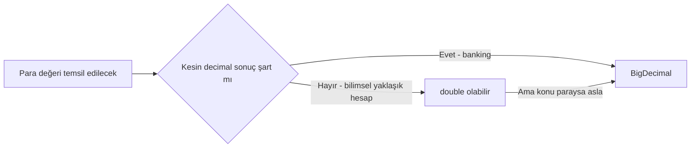
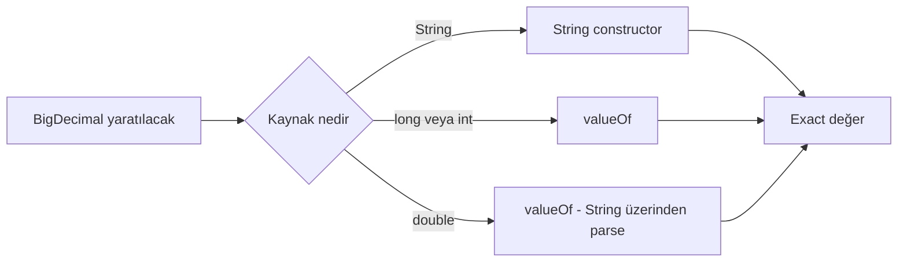
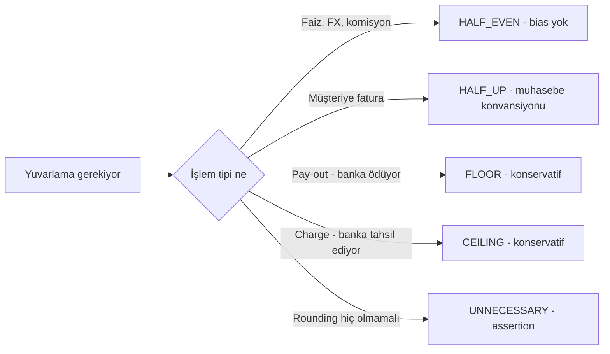
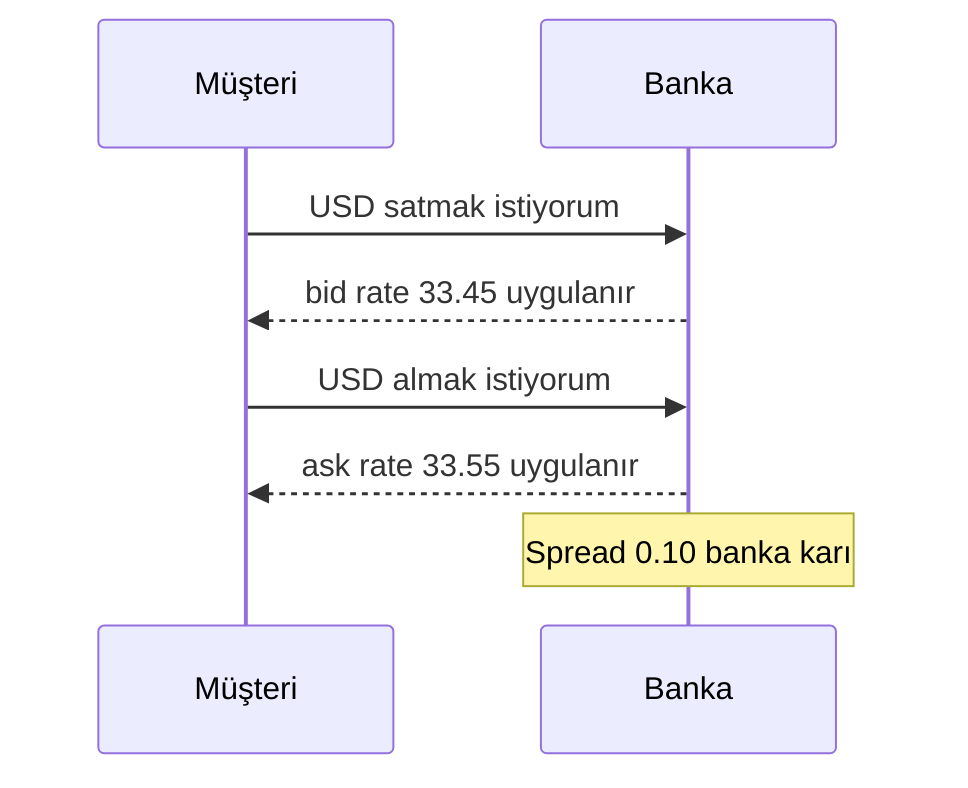
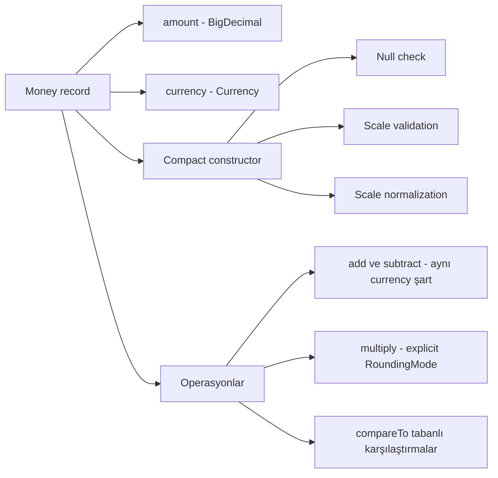

# Topic 1.3 — Para İşleme: BigDecimal, RoundingMode, Currency

```admonish info title="Bu bölümde"
- Para için `double`/`float` neden kullanılamaz — IEEE 754'ün banking'deki gerçek maliyeti
- `BigDecimal` iç yapısı: unscaled value + scale modeli, construction ve equality tuzakları
- 8 `RoundingMode`'un farkları ve banking standardı olan HALF_EVEN (banker's rounding)
- `Currency`, fraction digits farkları (JPY, BHD) ve TR'ye özgü TRY/TL/TRL normalizasyonu
- Multi-currency conversion tuzakları: round-trip loss, cross rate, bid/ask spread
- Production-grade `Money` value object: scale validation, normalization, currency-aware aritmetik
```

## Hedef

Para tipinin Java'da neden `double` veya `float` olmaması gerektiğini, `BigDecimal`'ın derin detaylarını, rounding mode tuzaklarını ve multi-currency handling'i banking-grade seviyede öğrenmek. Bölüm sonunda Topic 1.1'deki `Money` taslağını production-ready hale getireceksin.

## Süre

Okuma: 2 saat • Mini task: 2 saat • Test: 1 saat • Toplam: ~5 saat

## Önbilgi

- Topic 1.1'de `Money` value object'i taslağı yazıldı
- Java primitive types ve `BigDecimal`'a temel düzeyde aşinalık

---

## Kavramlar

### 1. Neden `double`/`float` para için ölüm

Şu iki satırı çalıştır ve sonuca bak:

```java
System.out.println(0.1 + 0.2);          // 0.30000000000000004
System.out.println(0.1 + 0.2 == 0.3);   // false
```

Neden? IEEE 754 floating-point standardı **binary** tabanlı. 0.1 gibi decimal sayıların binary'de kesin temsili yok — tıpkı 1/3'ün decimal'de 0.3333... olarak sonsuza gitmesi gibi. `float` 7 basamak hassasiyet sunar, `double` 15-17; ikisi de finansal kesinlik için yetersiz.

Peki banking'de bu ne demek? Bir hesaba günde 10.000 işlem gelsin, her biri 0.1 TL eklesin. Beklenen toplam 1000.00 TL; `double` ile 999.9999999... veya 1000.0000001 çıkabilir. Milyonlarca müşteride bu kuruş hataları birikir — gerçek para kaybı ya da fazla yazım. TCMB/BDDK denetiminde yakalandığında ceza, lisans riski ve müşteri itirazları kapıda.

```admonish warning title="Dikkat"
**Kural:** Banking projelerinde **hiçbir yerde** para için `double` veya `float` kullanılmaz. Code review'da doğrudan reject sebebi.
```

Tip seçimi kararı aslında çok basit:



### 2. `BigDecimal` — kesin decimal aritmetik

Çözüm `java.math.BigDecimal`: decimal sayıları **kesin** temsil eder. İçinde iki parça var:

- **unscaled value** — `BigInteger`, ondalık noktasız tam sayı
- **scale** — ondalık basamak sayısı

Yani `123.45` → unscaled `12345`, scale `2`. Ve `100.00` → unscaled `10000`, scale `2`; ama `100` → unscaled `100`, scale `0`. **Dikkat: BigDecimal gözünde `100` ile `100.00` aynı nesne değil** — birazdan bunun equality'yi nasıl bozduğunu göreceğiz.

#### Construction tuzakları

İlk tuzak daha nesneyi yaratırken karşına çıkar:

```java
// ❌ KÖTÜ — double argument floating-point hatasını taşır
BigDecimal a = new BigDecimal(0.1);
// a = 0.1000000000000000055511151231257827021181583404541015625

// ✅ İYİ — String constructor exact
BigDecimal b = new BigDecimal("0.1");   // exactly 0.1

// ✅ İYİ — valueOf static factory
BigDecimal c = BigDecimal.valueOf(0.1); // String'e çevirip parse eder
BigDecimal d = BigDecimal.valueOf(100); // long argument exact
```

```admonish warning title="Dikkat"
**Kural:** Money değerini **String veya `valueOf` ile** yarat. `new BigDecimal(double)` constructor'ını asla kullanma — code review'da kırmızı bayrak.
```



#### Equality vs comparison

`100` ile `100.00` farkı burada patlar:

```java
BigDecimal a = new BigDecimal("100");      // scale 0
BigDecimal b = new BigDecimal("100.00");   // scale 2

a.equals(b);            // FALSE — scale farklı
a.compareTo(b) == 0;    // TRUE — değer aynı
```

`equals` scale'i de karşılaştırır; `compareTo` sadece değeri. Bu yüzden `compareTo`, `equals` ile **consistent değildir** — `HashSet`/`HashMap` key'i olarak BigDecimal kullanırken bunu unutan çok junior gördüm.

```admonish tip title="İpucu"
**Banking pratiği:** İki para miktarını her zaman `compareTo` ile karşılaştır, `equals` ile asla. Map key olarak BigDecimal kullanma — string veya normalize edilmiş scale kullan.
```

#### Immutability tuzağı

BigDecimal **immutable**: aritmetik metotlar nesneyi değiştirmez, yeni nesne döner.

```java
BigDecimal a = new BigDecimal("100.00");
a.add(new BigDecimal("50.00"));                    // a hâlâ 100.00! Sonuç kayboldu.
BigDecimal sum = a.add(new BigDecimal("50.00"));   // ✓ sum = 150.00
```

Sonucu **mutlaka değişkene ata**. Klasik junior tuzağı.

#### Scale operations

Scale değiştirmek çoğu zaman rounding gerektirir; hangi yöne yuvarlanacağını sen söylemelisin:

```java
BigDecimal value = new BigDecimal("100.123456");
BigDecimal rounded = value.setScale(2, RoundingMode.HALF_EVEN);  // 100.12
```

Banking'de **her zaman** rounding mode belirt, default'a güvenme. Peki hangi mode? Sıradaki konu tam olarak bu.

### 3. RoundingMode — banking'in en kritik konularından

"Yuvarlama" kulağa detay gibi gelir ama milyonlarca işlemde yanlış mode seçmek sistematik para kayması demek. `java.math.RoundingMode` 8 mode tanımlar; tek tek bakalım.

#### a) `HALF_UP` — okul matematiği (yaygın yanlış seçim)

5 ve üzeri yukarı:

```
2.5  → 3
2.4  → 2
2.6  → 3
-2.5 → -3
```

Vergi hesabı ve fatura toplamı gibi yerlerde bazı ülke standartlarınca kullanılır. Banking'deki sorunu: 5'ler hep yukarı gider → **bias**. Müşterilerin lehine veya aleyhine sistematik sapma birikir.

#### b) `HALF_DOWN` — 5 aşağı

```
2.5  → 2
2.6  → 3
```

HALF_UP'ın aynadaki hali; aynı bias sorunu ters yönde.

#### c) `HALF_EVEN` (banker's rounding) — **banking standardı**

5, en yakın **çift** sayıya gider:

```
2.5  → 2  (en yakın çift)
3.5  → 4  (en yakın çift)
2.6  → 3
-2.5 → -2
```

Neden standart? Çok sayıda işlemde yukarı ve aşağı yuvarlamalar dengelenir — **bias'sız**. IEEE 754'ün default'u ve çoğu finans standardına (IFRS, US GAAP'a uygun durumlar) uyar. TR bankacılığında da TCMB/BDDK genel anlamda banker's rounding'i benimser; faiz hesabı ve FX conversion'da HALF_EVEN kullan.

#### d-g) Yön bazlı mode'lar

| Mode | Davranış | Örnek |
|---|---|---|
| `UP` | Sıfırdan uzaklaş | 2.1 → 3, -2.1 → -3 |
| `DOWN` | Sıfıra doğru (truncate) | 2.9 → 2, -2.9 → -2 |
| `CEILING` | Pozitif sonsuza | 2.1 → 3, -2.9 → -2 |
| `FLOOR` | Negatif sonsuza | 2.9 → 2, -2.1 → -3 |

`DOWN` bilimsel hesaplarda görülür, finansta nadiren doğru seçim. `FLOOR` ise banking'de karşına çıkar: banka müşteriye ödeme yaparken müşteri aleyhine yukarı yuvarlamamak için bazı senaryolarda tercih edilir.

#### h) `UNNECESSARY` — kesin olmalı

Rounding gerekirse `ArithmeticException` fırlatır. "Burada rounding olmamalı" assertion'ı olarak kontrollü yerlerde kullan.

#### Pratik karar matrisi (banking)



| İşlem | RoundingMode | Sebep |
|---|---|---|
| Faiz hesabı (sürekli işlem) | HALF_EVEN | Bias'sızlık |
| FX conversion | HALF_EVEN | Çift yönlü dönüşümde tutarlılık |
| Müşteriye fatura tutarı | HALF_UP | Yaygın muhasebe konvansiyonu |
| Komisyon hesabı | HALF_EVEN | Bias'sızlık |
| Pay-out (banka müşteriye ödüyor) | FLOOR | Konservatif, müşteri haklarına saygı |
| Charge (banka müşteriden tahsilat) | CEILING | Konservatif, banka eksik tahsil etmesin |

```admonish tip title="İpucu"
**Kural:** Her finans hesap kodunda RoundingMode'u **explicit** ver, default'a güvenme. Hangi mode kullanılacağını domain expert / business analyst ile doğrula.
```

#### `divide` özel durumu

`divide` rounding konusunun en sert öğretmeni — 10/3 gibi sonsuz haneli sonuçlarda mode vermezsen exception yersin:

```java
BigDecimal a = new BigDecimal("10");
BigDecimal b = new BigDecimal("3");

a.divide(b);                                       // ArithmeticException — sonsuz hane
a.divide(b, 4, RoundingMode.HALF_EVEN);            // 3.3333
a.divide(b, new MathContext(10, RoundingMode.HALF_EVEN));  // 10 significant digits
```

**Kural:** `divide` çağrısında her zaman scale ve roundingMode belirt.

### 4. `Currency` — para birimi bir string değil

Miktarı çözdük; peki "100.00 neyin 100.00'ı?" `java.util.Currency`, ISO 4217 standardındaki para birimlerini temsil eder — ve her birimin ondalık hane sayısı farklıdır:

```java
Currency tl  = Currency.getInstance("TRY");
Currency jpy = Currency.getInstance("JPY");
Currency bhd = Currency.getInstance("BHD");

tl.getDefaultFractionDigits();   // 2
jpy.getDefaultFractionDigits();  // 0  (Japon Yeni'nde kuruş yok!)
bhd.getDefaultFractionDigits();  // 3  (Bahrain Dinar 1/1000)
```

Bunun pratik sonucu: `Money` value object'in scale'i **currency'nin default fraction digits'ine göre zorlamalı**. 100.123 TRY illegal; 100 JPY geçerli; 100.123 BHD geçerli.

#### TR'ye özgü dikkat

- ISO kodu **TRY**, 2 decimal — **TL** veya **TRL** diye kod yok
- Tarihçe: 2005 öncesi TRL → YTL → 2009'da "TL" rebrand; ISO kodu hep TRY kaldı
- TR sistemleri yine de "TL" string'i gönderir → ISO 4217'ye dönüştüren bir katman yaz (aşağıda `CurrencyNormalizer`)

#### Currency-aware aritmetik

100 TRY + 100 USD kaç eder? Cevap yok — bu bir **bug**. Farklı currency'ler arası aritmetik otomatik hata olmalı; önce conversion yapılır:

```java
public Money add(Money other) {
    if (!currency.equals(other.currency)) {
        throw new CurrencyMismatchException(currency, other.currency);
    }
    return new Money(amount.add(other.amount), currency);
}
```

### 5. Multi-currency conversion

Conversion'ın kalbi basit bir çarpma, ama etrafı tuzak dolu. Önce temel model:

```java
public class ExchangeRate {
    private final Currency from;
    private final Currency to;
    private final BigDecimal rate;     // 1 unit of `from` = rate units of `to`
    private final Instant timestamp;

    public Money convert(Money source) {
        if (!source.currency().equals(from)) {
            throw new IllegalArgumentException("Wrong source currency");
        }
        BigDecimal converted = source.amount()
            .multiply(rate)
            .setScale(to.getDefaultFractionDigits(), RoundingMode.HALF_EVEN);
        return Money.of(converted, to);
    }
}
```

**Tuzak 1 — round-trip loss.** Çevirip geri çevirince aynı sayıyı bulacağını varsayma:

```
100 USD → 3,350 TRY (rate 33.50)
3,350 TRY → 100.00 USD (rate 0.02985...)
```

HALF_EVEN ile geri dönüş çoğu zaman tutar, ama büyük sayılarda 1 kuruş kayıp olabilir. Round-trip'i asla expectation olarak kabul etme; testlerde tolerance ile assert et.

**Tuzak 2 — cross rate.** Direct rate yoksa (TRY → JPY için TRY → USD → JPY) iki ayrı conversion iki ayrı rounding demek → **kümülatif hata**:

```java
Money try500 = Money.of("500.00", TRY);
Money usd = usdRate.convert(try500);   // birinci rounding
Money jpy = jpyRate.convert(usd);      // ikinci rounding
```

Doğrusu tek bir cross-rate hesabı — ara adımda rounding yapma, son adımda yap:

```java
BigDecimal crossRate = tryToUsdRate.rate().multiply(usdToJpyRate.rate());
// scale'i koru, rounding'i son adımda uygula
```

**Tuzak 3 — bid/ask spread.** Banka tek rate kullanmaz: müşteriden alırken **bid**, müşteriye satarken **ask** uygular.

```
USD/TRY bid: 33.45 (banka USD alıyor, müşteriye 33.45 TRY veriyor)
USD/TRY ask: 33.55 (banka USD satıyor, müşteriden 33.55 TRY alıyor)
```

Spread = ask - bid = 0.10 — banka karı buradan gelir.



Bu yüzden conversion API'ne **direction** bilgisi ekle: işlem `BUY` mu `SELL` mi?

### 6. Alternatif kütüphaneler: JSR-354 ve Joda-Money

Madem para bu kadar tuzaklı, hazır bir kütüphane kullansak? İki aday var.

**JSR-354 (`javax.money`)** — Java Money & Currency API; standart `MonetaryAmount`, `CurrencyUnit`, `MonetaryRounding` tanımlar. Artısı: standart API, plugin'le conversion provider (ECB rates vs.), zengin formatting. Eksisi: Spring entegrasyonu ekstra, ekiplerin alışkın olmadığı bir API ve TR bankalarının çoğunda kullanılmıyor.

**Joda-Money (`org.joda:joda-money`)** — Stephen Colebourne'un (joda-time yazarı) hafif kütüphanesi:

```java
import org.joda.money.Money;
import org.joda.money.CurrencyUnit;

Money cost = Money.of(CurrencyUnit.of("TRY"), 100.50);
Money tax = cost.multipliedBy(0.18, RoundingMode.HALF_EVEN);
```

Olgun ve kanıtlanmış; ama domain'ine external dependency sokar.

**Karar:** Bu projede **kendi `Money` record'unu** yazıyoruz — domain temiz kalır, mekanizmayı öğrenirsin. Production'da JSR-354 veya Joda-Money ile karşılaşırsan yadırgamazsın.

### 7. Currency code normalization

Gerçek TR sistemlerinde kullanıcı input'u kitaptaki gibi gelmez: `"TRY"` yanında `"TL"`, `"TRL"` (2005'te silinen kod), `"₺"`, hatta `"tl"` görürsün. Bunu domain'e sokmadan bir adapter'da normalize et:

```java
public class CurrencyNormalizer {
    private static final Map<String, String> ALIASES = Map.of(
        "TL", "TRY",
        "TRL", "TRY",
        "₺", "TRY",
        "$", "USD",
        "€", "EUR"
    );

    public static Currency normalize(String input) {
        if (input == null || input.isBlank()) {
            throw new IllegalArgumentException("Currency cannot be blank");
        }
        String upper = input.trim().toUpperCase();
        String iso = ALIASES.getOrDefault(upper, upper);
        try {
            return Currency.getInstance(iso);
        } catch (IllegalArgumentException e) {
            throw new InvalidCurrencyException(input);
        }
    }
}
```

Bu adapter `application` katmanında veya request DTO'da yaşar. **Domain `Money`'si direkt `Currency` alır, string almaz.**

### 8. Money serialization — JSON ve DB

Para sınırda da (API, database) bozulabilir; iki cepheyi de sağlama al.

**JSON:** Default Jackson `amount`'u JSON number yazar (`100.50`). Jackson `BigDecimal`'ı doğru handle eder ama JSON spec precision garanti etmez — ve JavaScript client'larda sayılar 64-bit float'tır, BigDecimal yoktur. Güvenli yol amount'u **string** olarak serialize etmek:

```json
{
  "amount": "100.50",
  "currency": "TRY"
}
```

Configuration:

```yaml
spring:
  jackson:
    serialization:
      WRITE_BIGDECIMAL_AS_PLAIN: true
```

Veya custom serializer yaz.

**DB:** PostgreSQL'de `NUMERIC(19, 4)`, Oracle'da `NUMBER(19, 4)`. İki kolon yaklaşımı:

```sql
amount NUMERIC(19, 4) NOT NULL,
currency VARCHAR(3) NOT NULL
```

Alternatif tek `Money` user type (Hibernate `@Embeddable`) — Topic 2'de göreceğiz.

```admonish warning title="Dikkat"
Asla `FLOAT` veya `DOUBLE PRECISION` kolonu ile para tutma — `double` yasağının DB karşılığı budur.
```

### 9. Money formatting — locale aware

Aynı tutar farklı ülkelerde farklı yazılır; gösterim işini `NumberFormat` yapsın:

```java
Locale tr = new Locale("tr", "TR");
NumberFormat formatter = NumberFormat.getCurrencyInstance(tr);
formatter.format(1234.56);  // "₺1.234,56"  (TR formatting)

NumberFormat usFormatter = NumberFormat.getCurrencyInstance(Locale.US);
usFormatter.format(1234.56);  // "$1,234.56"
```

Banking'de nerede lazım? Mail/SMS template'leri, PDF dekont, web UI.

```admonish tip title="İpucu"
API response'ta **format etme** — raw `amount` + `currency` ver, formatting client'ın işi.
```

### 10. Edge case'ler — bilmen gereken tuzaklar

Son olarak, mülakatta ve production'da karşına çıkan küçük ama sinsi davranışlar.

**Negative zero:**

```java
BigDecimal a = new BigDecimal("-0.00");
a.signum();                    // 0
a.equals(BigDecimal.ZERO);     // FALSE (scale farklı)
a.compareTo(BigDecimal.ZERO);  // 0
```

**Performans:** `BigDecimal` sınırsızdır ama bedava değildir. Hot path'te (her transaction'da çağrılan kod) gereksiz operasyon yapma.

**`stripTrailingZeros` tuzağı:**

```java
new BigDecimal("100.00").stripTrailingZeros();  // 1E+2 (scientific notation!)
new BigDecimal("100.10").stripTrailingZeros();  // 100.1
```

```admonish warning title="Dikkat"
`stripTrailingZeros` scale'i negatife düşürebilir → sonuç `1E+2` gibi scientific notation olur. Para gösteriminde bunu kullanma; kullanacaksan `toPlainString()` ile birleştir.
```

**`precision()` vs `scale()`:** Karıştırma — banking'de asıl kullandığın `scale`.

```java
new BigDecimal("100.50").precision();  // 5 (toplam basamak)
new BigDecimal("100.50").scale();      // 2 (decimal sonrası)
```

### 11. `Money` value object — production-grade revize

Bölümde öğrendiğin her şeyi şimdi tek bir sınıfta topluyoruz. Önce yapıyı kuşbakışı gör:



```java
package com.mavibank.banking.common.domain;

import java.math.BigDecimal;
import java.math.RoundingMode;
import java.util.Currency;
import java.util.Objects;

public record Money(BigDecimal amount, Currency currency) {
    
    public Money {
        Objects.requireNonNull(amount, "amount must not be null");
        Objects.requireNonNull(currency, "currency must not be null");
        
        if (amount.scale() > currency.getDefaultFractionDigits()) {
            throw new IllegalArgumentException(
                "Scale %d exceeds default fraction digits %d for %s"
                    .formatted(amount.scale(), 
                              currency.getDefaultFractionDigits(),
                              currency.getCurrencyCode())
            );
        }
        // Normalize: scale below default → bring up
        if (amount.scale() < currency.getDefaultFractionDigits()) {
            amount = amount.setScale(currency.getDefaultFractionDigits(), 
                                     RoundingMode.UNNECESSARY);
        }
    }
    
    public static Money of(BigDecimal amount, Currency currency) {
        return new Money(amount, currency);
    }
    
    public static Money of(String amount, Currency currency) {
        return new Money(new BigDecimal(amount), currency);
    }
    
    public static Money of(String amount, String currencyCode) {
        return of(amount, Currency.getInstance(currencyCode));
    }
    
    public static Money zero(Currency currency) {
        return new Money(
            BigDecimal.ZERO.setScale(currency.getDefaultFractionDigits()),
            currency
        );
    }
    
    public Money add(Money other) {
        requireSameCurrency(other);
        return new Money(amount.add(other.amount), currency);
    }
    
    public Money subtract(Money other) {
        requireSameCurrency(other);
        return new Money(amount.subtract(other.amount), currency);
    }
    
    public Money multiply(BigDecimal factor, RoundingMode roundingMode) {
        BigDecimal result = amount.multiply(factor)
            .setScale(currency.getDefaultFractionDigits(), roundingMode);
        return new Money(result, currency);
    }
    
    public Money negate() {
        return new Money(amount.negate(), currency);
    }
    
    public boolean isZero() {
        return amount.signum() == 0;
    }
    
    public boolean isPositive() {
        return amount.signum() > 0;
    }
    
    public boolean isNegative() {
        return amount.signum() < 0;
    }
    
    public boolean isLessThan(Money other) {
        requireSameCurrency(other);
        return amount.compareTo(other.amount) < 0;
    }
    
    public boolean isGreaterThan(Money other) {
        requireSameCurrency(other);
        return amount.compareTo(other.amount) > 0;
    }
    
    public boolean isGreaterThanOrEqual(Money other) {
        requireSameCurrency(other);
        return amount.compareTo(other.amount) >= 0;
    }
    
    private void requireSameCurrency(Money other) {
        if (!currency.equals(other.currency)) {
            throw new CurrencyMismatchException(currency, other.currency);
        }
    }
    
    @Override
    public String toString() {
        return amount.toPlainString() + " " + currency.getCurrencyCode();
    }
}
```

İki inceliğe dikkat:

- Compact constructor'da `amount = amount.setScale(...)` ile parameter'ı değiştiriyoruz — record syntax'ında bu geçerli.
- `equals`/`hashCode` record tarafından üretilir ve BigDecimal'ın scale'e duyarlı `equals`'ını kullanır. Ama compact constructor scale'i normalize ettiği için `Money.of("100", TRY)` da `Money.of("100.00", TRY)` da içeride `100.00 TRY` olur — equals **true**. Normalization tam da bu yüzden var.

---

## Önemli olabilecek araştırma kaynakları

- Java BigDecimal Javadoc (resmi)
- "Effective Java" Item 60 — "Avoid float and double if exact answers are required"
- "Java Money & Currency API (JSR-354)" — Anatole Tresch
- Joda-Money GitHub README
- "Banker's Rounding" Wikipedia
- ECB exchange rate API (gerçek conversion için)
- TCMB döviz kuru API'si (TR perspektif)
- "Hibernate User Type for Money" örnekleri
- IEEE 754 floating-point standard (neden double yetersiz)

---

## Mini task'ler

### Task 1.3.1 — Topic 1.1'deki `Money`'i revize et (45 dk)

Yukarıdaki production-grade `Money` record'unu yaz. Topic 1.1'deki taslağın yerine geçer.

Eklenenler:
- Scale validation ve normalization (compact constructor'da)
- `multiply(BigDecimal, RoundingMode)` metodu
- `negate()` metodu
- `isPositive()`, `isLessThan()`, `isGreaterThanOrEqual()` karşılaştırmaları
- `String` factory methodları
- Düzgün `toString()`

### Task 1.3.2 — `RoundingMode` deney (30 dk)

`src/main/java/com/mavibank/banking/playground/RoundingPlayground.java` (geçici bir class, sonra silersin):

```java
public class RoundingPlayground {
    public static void main(String[] args) {
        BigDecimal[] values = {
            new BigDecimal("2.5"), new BigDecimal("3.5"), 
            new BigDecimal("-2.5"), new BigDecimal("2.4")
        };
        
        for (BigDecimal v : values) {
            System.out.printf("%s -> HALF_UP: %s, HALF_DOWN: %s, HALF_EVEN: %s, " +
                            "CEILING: %s, FLOOR: %s%n",
                v, 
                v.setScale(0, RoundingMode.HALF_UP),
                v.setScale(0, RoundingMode.HALF_DOWN),
                v.setScale(0, RoundingMode.HALF_EVEN),
                v.setScale(0, RoundingMode.CEILING),
                v.setScale(0, RoundingMode.FLOOR)
            );
        }
    }
}
```

Çalıştır, çıktıyı **defterine yapıştır**. Her satırın neden o şekilde olduğunu kendine açıkla. HALF_EVEN'in 2.5 → 2 ama 3.5 → 4 sonucunu **anlamadan** geçme.

### Task 1.3.3 — `CurrencyNormalizer` adapter'ı yaz (30 dk)

`banking/common/adapter/CurrencyNormalizer.java`:

- `TRY`, `TL`, `TRL`, `₺`, `tl`, `try` (lowercase) hepsi `Currency.getInstance("TRY")` döndürsün
- Bilinmeyen kod → `InvalidCurrencyException`
- Null veya empty → `IllegalArgumentException`

Test'ini de yaz (Test 1.3.3'te detayı var).

### Task 1.3.4 — `ExchangeRate` ve conversion (45 dk)

`banking/common/domain/ExchangeRate.java`:

```java
public record ExchangeRate(
    Currency from,
    Currency to,
    BigDecimal rate,
    Instant timestamp
) {
    public ExchangeRate {
        Objects.requireNonNull(from);
        Objects.requireNonNull(to);
        Objects.requireNonNull(rate);
        Objects.requireNonNull(timestamp);
        if (from.equals(to)) {
            throw new IllegalArgumentException("from and to cannot be same");
        }
        if (rate.signum() <= 0) {
            throw new IllegalArgumentException("Rate must be positive");
        }
    }
    
    public Money convert(Money source) {
        if (!source.currency().equals(from)) {
            throw new IllegalArgumentException(
                "Source currency must be " + from + " but got " + source.currency()
            );
        }
        BigDecimal converted = source.amount()
            .multiply(rate)
            .setScale(to.getDefaultFractionDigits(), RoundingMode.HALF_EVEN);
        return Money.of(converted, to);
    }
    
    public ExchangeRate inverse() {
        BigDecimal inverseRate = BigDecimal.ONE.divide(
            rate, 
            10,  // significant precision
            RoundingMode.HALF_EVEN
        );
        return new ExchangeRate(to, from, inverseRate, timestamp);
    }
}
```

### Task 1.3.5 — Bid/ask spread modeli (30 dk)

`banking/common/domain/ExchangeQuote.java`:

```java
public record ExchangeQuote(
    Currency base,
    Currency quote,
    BigDecimal bidRate,   // banka base alır, müşteriye quote verir
    BigDecimal askRate,   // banka base satar, müşteriden quote alır
    Instant timestamp
) {
    public Money convertForCustomerBuy(Money source) {
        // müşteri base satın alıyor → banka SAT → ask rate
        // ...
    }
    
    public Money convertForCustomerSell(Money source) {
        // müşteri base satıyor → banka AL → bid rate
        // ...
    }
    
    public BigDecimal spread() {
        return askRate.subtract(bidRate);
    }
}
```

Tamamla. Bid/ask logic'i konfüze edici — kafan karışırsa **defterine** şu cümleyi yaz: "Müşterinin işlemine değil, bankanın pozisyonuna bakarak rate seç."

---

## Test yazma rehberi

### Test 1.3.1 — `MoneyTest` (gelişmiş)

Topic 1.1'deki testleri genişlet. Yeni testler:

```java
@Test
void shouldNormalizeScaleToCurrencyDefault() {
    var m = Money.of(new BigDecimal("100"), Currency.getInstance("TRY"));
    assertThat(m.amount().scale()).isEqualTo(2);
    assertThat(m.amount()).isEqualByComparingTo("100.00");
}

@Test
void shouldRejectAmountWithTooManyDecimals() {
    assertThatThrownBy(() -> 
        Money.of(new BigDecimal("100.123"), Currency.getInstance("TRY"))
    ).isInstanceOf(IllegalArgumentException.class);
}

@Test
void shouldAcceptIntegerAmountForJpy() {
    var jpy = Currency.getInstance("JPY");
    var m = Money.of(new BigDecimal("100"), jpy);
    assertThat(m.amount().scale()).isEqualTo(0);
}

@Test
void shouldAcceptThreeDecimalsForBhd() {
    var bhd = Currency.getInstance("BHD");
    var m = Money.of(new BigDecimal("100.123"), bhd);
    assertThat(m.amount().scale()).isEqualTo(3);
}

@Test
void multiplyShouldUseProvidedRoundingMode() {
    var m = Money.of("100.00", "TRY");
    var result = m.multiply(new BigDecimal("0.185"), RoundingMode.HALF_EVEN);
    // 100.00 * 0.185 = 18.5000 → scale 2 → 18.50
    assertThat(result).isEqualTo(Money.of("18.50", "TRY"));
}

@Test
void multiplyShouldDifferentiateRoundingModes() {
    var m = Money.of("100.00", "TRY");
    // 100.00 * 0.005 = 0.5000 → scale 2 with HALF_EVEN → 0.00 (banker's: 5→even)
    var halfEven = m.multiply(new BigDecimal("0.005"), RoundingMode.HALF_EVEN);
    var halfUp = m.multiply(new BigDecimal("0.005"), RoundingMode.HALF_UP);
    
    assertThat(halfEven).isEqualTo(Money.of("0.00", "TRY"));
    assertThat(halfUp).isEqualTo(Money.of("0.01", "TRY"));
}

@Test
void equalsHonorsCurrency() {
    var tl100 = Money.of("100.00", "TRY");
    var usd100 = Money.of("100.00", "USD");
    assertThat(tl100).isNotEqualTo(usd100);
}

@ParameterizedTest
@CsvSource({
    "100.00, 50.00, 150.00",
    "100.00, -50.00, 50.00",
    "0.00, 100.00, 100.00",
    "999.99, 0.01, 1000.00"
})
void shouldAddCorrectly(String a, String b, String expected) {
    var result = Money.of(a, "TRY").add(Money.of(b, "TRY"));
    assertThat(result).isEqualTo(Money.of(expected, "TRY"));
}
```

### Test 1.3.2 — `ExchangeRateTest`

```java
@Test
void shouldConvertCurrency() {
    var rate = new ExchangeRate(
        Currency.getInstance("USD"),
        Currency.getInstance("TRY"),
        new BigDecimal("33.50"),
        Instant.now()
    );
    
    var converted = rate.convert(Money.of("100.00", "USD"));
    assertThat(converted).isEqualTo(Money.of("3350.00", "TRY"));
}

@Test
void shouldRejectWrongSourceCurrency() {
    var rate = new ExchangeRate(
        Currency.getInstance("USD"),
        Currency.getInstance("TRY"),
        new BigDecimal("33.50"),
        Instant.now()
    );
    
    assertThatThrownBy(() -> rate.convert(Money.of("100.00", "EUR")))
        .isInstanceOf(IllegalArgumentException.class);
}

@Test
void inverseRateShouldRoundTrip() {
    var rate = new ExchangeRate(
        Currency.getInstance("USD"),
        Currency.getInstance("TRY"),
        new BigDecimal("33.50"),
        Instant.now()
    );
    
    var original = Money.of("100.00", "USD");
    var converted = rate.convert(original);
    var roundTripped = rate.inverse().convert(converted);
    
    // Round-trip kayıpsız değil — assert isEqualByComparingTo with tolerance
    var difference = original.subtract(roundTripped).amount().abs();
    assertThat(difference).isLessThanOrEqualTo(new BigDecimal("0.01"));
}
```

### Test 1.3.3 — `CurrencyNormalizerTest`

```java
@ParameterizedTest
@CsvSource({
    "TRY, TRY",
    "TL, TRY",
    "TRL, TRY",
    "tl, TRY",
    "try, TRY",
    "USD, USD",
    "$, USD",
    "EUR, EUR",
    "€, EUR"
})
void shouldNormalizeAliases(String input, String expected) {
    assertThat(CurrencyNormalizer.normalize(input))
        .isEqualTo(Currency.getInstance(expected));
}

@Test
void shouldThrowOnUnknownCurrency() {
    assertThatThrownBy(() -> CurrencyNormalizer.normalize("XYZ"))
        .isInstanceOf(InvalidCurrencyException.class);
}

@Test
void shouldThrowOnNullOrBlank() {
    assertThatThrownBy(() -> CurrencyNormalizer.normalize(null))
        .isInstanceOf(IllegalArgumentException.class);
    assertThatThrownBy(() -> CurrencyNormalizer.normalize(""))
        .isInstanceOf(IllegalArgumentException.class);
    assertThatThrownBy(() -> CurrencyNormalizer.normalize("   "))
        .isInstanceOf(IllegalArgumentException.class);
}
```

### Test 1.3.4 — Aritmetik patolojiler (öğretici)

Junior'ın görmesi gereken test'ler:

```java
@Test
void bigDecimalEqualsIsScaleSensitive() {
    // Bu davranışı bilmek lazım — defterine yaz!
    assertThat(new BigDecimal("100"))
        .isNotEqualTo(new BigDecimal("100.00"));
    
    assertThat(new BigDecimal("100").compareTo(new BigDecimal("100.00")))
        .isZero();
}

@Test
void doubleConstructorIsDangerous() {
    BigDecimal dangerous = new BigDecimal(0.1);
    BigDecimal safe = new BigDecimal("0.1");
    
    // dangerous = 0.1000000000000000055511151231257827021181583404541015625
    assertThat(dangerous).isNotEqualByComparingTo(safe);
    
    // Banking'de bu kabul edilemez
}
```

---

## Claude-verify prompt

```
Aşağıdaki `Money`, `ExchangeRate`, `CurrencyNormalizer` Java kodumu banking-grade 
money handling perspektifinden değerlendir. Sadece eksik veya yanlışları söyle, 
kod yazma:

1. `Money` value object:
   - `record` veya immutable mi?
   - Compact constructor scale validation yapıyor mu?
   - Scale, currency'nin default fraction digits'ine göre normalize ediliyor mu?
   - `new BigDecimal(double)` constructor'ı KULLANILMIŞ MI? Kullanılmışsa fail.
   - `multiply` metodu RoundingMode parameter alıyor mu?
   - `equals` ve `hashCode` doğru (record otomatik veya manuel doğru) mu?
   - Currency mismatch exception throwing var mı?

2. `RoundingMode` kullanımları:
   - Tüm matematik operasyonlarda explicit RoundingMode var mı?
   - Default RoundingMode'a güvenilen yer var mı? (Olmamalı)
   - HALF_EVEN banking standardı kullanılmış mı (veya gerekçesi açıklanmış mı)?

3. `ExchangeRate`:
   - Rate negatif veya sıfır olabilir mi (Olmamalı)?
   - From ve to currency aynı olabilir mi (Olmamalı)?
   - `convert` metodu source currency'i kontrol ediyor mu?
   - Conversion sonrası scale doğru ayarlanmış mı (target currency'nin fraction digits)?
   - `inverse` round-trip'te kayba neden olabilir mi (test'le doğrulanmış mı)?

4. `CurrencyNormalizer`:
   - TR'ye özgü alias'lar (TL, TRL, ₺) ele alınmış mı?
   - Lowercase input kabul ediyor mu?
   - Bilinmeyen currency için domain-specific exception fırlıyor mu?
   - Null/blank input için exception var mı?

5. Test coverage:
   - Scale normalization test edilmiş mi?
   - HALF_EVEN ve HALF_UP'ın farkını gösteren test var mı?
   - JPY (0 decimal) ve BHD (3 decimal) edge case'leri test edilmiş mi?
   - BigDecimal equals vs compareTo farkını gösteren öğretici test var mı?
   - `new BigDecimal(double)` tehlikesini gösteren test var mı?
   - Currency mismatch test edilmiş mi?
   - Round-trip conversion tolerance ile test edilmiş mi?

6. Anti-pattern kontrolü:
   - Domain class'larda `double` veya `float` var mı? (Olmamalı)
   - Banking projesinde `Money` veya `BigDecimal` yerine `double` kullanan yer var mı?
   - `stripTrailingZeros` kullanılmış ve scientific notation'a sebep olabilir mi?

Her madde için PASS / FAIL / EKSIK işaretle. Kod yazma, düzeltme. Sadece neyin 
yanlış olduğunu açıkla.
```

---

## Tamamlama kriterleri

- [ ] `Money` record production-grade (scale validation, normalization, multiply with rounding mode)
- [ ] `ExchangeRate` ve conversion logic implement edildi
- [ ] `CurrencyNormalizer` TR-specific alias'larıyla yazıldı
- [ ] `RoundingMode` farklarını canlı kodda gördüm (`RoundingPlayground`)
- [ ] `MoneyTest`'te 15+ test, AssertJ + ParameterizedTest kullanıldı
- [ ] BigDecimal equals vs compareTo farkını biliyorum (test yazıp gördüm)
- [ ] HALF_EVEN'in 2.5 → 2 ama 3.5 → 4 sonucunu açıklayabiliyorum
- [ ] Bid/ask spread konseptini kendi cümlemle anlatabiliyorum
- [ ] Banking projesinde **hiçbir yerde** `double` para olarak kullanmıyorum

---

## Defter notları

1. "`double` para için neden kullanılmaz: ____."
2. "`new BigDecimal(0.1)` neden tehlikeli: ____."
3. "`BigDecimal.equals` ve `compareTo` farkı: ____."
4. "HALF_EVEN'in bias-free olmasının sebebi: ____."
5. "Banking'de RoundingMode kararı için domain expert ile konuşmak gerekir çünkü: ____."
6. "Multi-currency conversion'da round-trip kaybının kaynağı: ____."
7. "Bid/ask spread = ____. Banka karı buradadır çünkü ____."
8. "TR'de TRY, TL, TRL kodlarının tarihi: ____."
9. "JPY scale 0, BHD scale 3 — `Money` class'ım bunu nasıl handle ediyor: ____."

```admonish success title="Bölüm Özeti"
- Para için asla `double`/`float` kullanma — IEEE 754 binary temsili decimal kesinliği garanti edemez; `BigDecimal` (String veya `valueOf` ile yaratılmış) tek doğru seçim
- `BigDecimal.equals` scale'e duyarlıdır; iki para miktarını her zaman `compareTo` ile karşılaştır
- Banking standardı HALF_EVEN (banker's rounding) — bias'sızdır; her hesapta RoundingMode'u explicit ver, default'a güvenme
- Her currency'nin fraction digits'i farklıdır (TRY 2, JPY 0, BHD 3); `Money` scale'i currency'ye göre valide ve normalize etmeli
- Multi-currency conversion'da round-trip kaybı, cross-rate kümülatif hatası ve bid/ask spread'i hesaba kat
- DB'de `NUMERIC(19,4)` kullan, JSON'da amount'u string olarak serialize et; farklı currency'ler arası aritmetik otomatik hata olmalı
```
