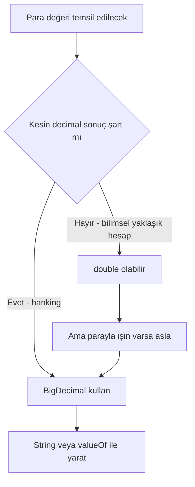
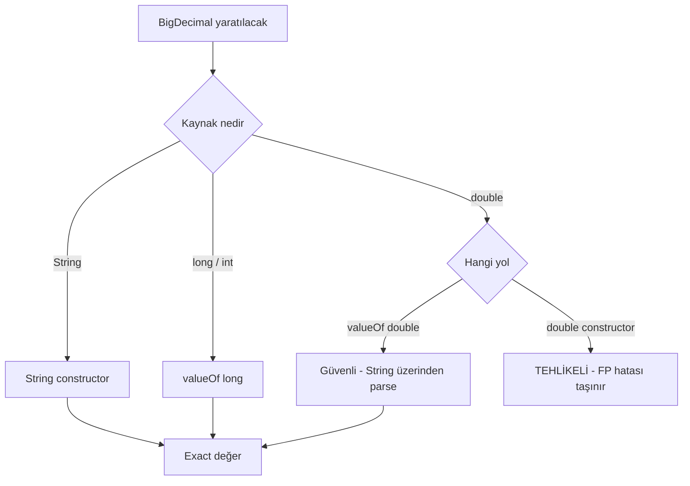
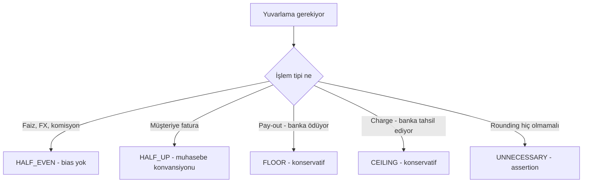
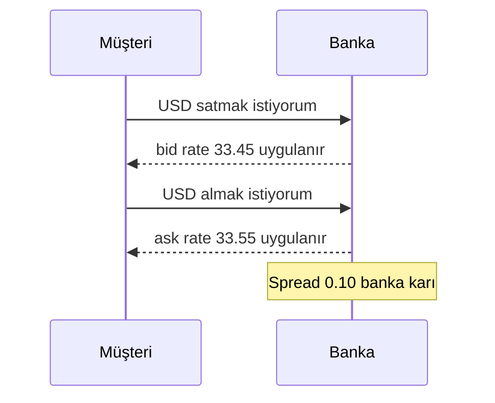

# Topic 1.3 — Para İşleme: BigDecimal, RoundingMode, Currency

```admonish info title="Bu bölümde"
- Para için `double`/`float` neden kullanılamaz — IEEE 754'ün banking'deki gerçek maliyeti
- `BigDecimal` iç yapısı: unscaled value + scale modeli, construction ve equality tuzakları
- 8 `RoundingMode`'un farkları ve banking standardı olan HALF_EVEN (banker's rounding)
- `Currency`, fraction digits farkları (JPY, BHD) ve TR'ye özgü TRY/TL/TRL normalizasyonu
- Multi-currency conversion tuzakları: round-trip loss, cross rate, bid/ask spread
- Production-grade `Money` value object: scale validation, normalization, currency-aware aritmetik
```

## Hedef

Para tipinin Java'da neden `double` veya `float` olmaması gerektiğini, `BigDecimal`'ın derin detaylarını, rounding mode tuzaklarını, multi-currency handling'i banking-grade seviyede öğrenmek. `Money` value object'ini production-ready hale getirmek.

## Süre

Okuma: 2 saat • Mini task: 2 saat • Test: 1 saat • Toplam: ~5 saat

## Önbilgi

- Topic 1.1'de `Money` value object'i taslağı yazıldı
- Java primitive types ve `BigDecimal`'a aşinalık temel düzeyde

---

## Kavramlar

### 1. Neden `double`/`float` para için ölüm

IEEE 754 floating-point standard binary tabanlı. Decimal sayıların **kesin** temsili çoğu zaman mümkün değil.

```java
System.out.println(0.1 + 0.2);  // 0.30000000000000004
System.out.println(0.1 + 0.2 == 0.3);  // false
```

**Banking gerçekliğinde sonucu:**

Bir hesaba günde 10.000 işlem geliyor, her birinde 0.1 TL eklendiğini düşün. Beklenen toplam: 1000.00 TL. `double` ile gerçek toplam: 999.9999999999... veya 1000.0000001 olabilir. Bir ay sonra hesap bakiyesi **kuruşlar mertebesinde hatalı**. Yıllık 12 hesapta hataların toplamı milyonlarca müşteride **gerçek para kaybı** veya **fazla yazım**.

**TCMB ve BDDK denetiminde bu hata yakalandığında ceza, lisans riski, müşteri itirazları yağar.**

`float` daha kötü — 7 basamak hassasiyet. `double` 15-17 basamak ama yine de finansal kesinlik için yetersiz.

```admonish warning title="Dikkat"
**Kural:** Banking projelerinde **HİÇBİR YERDE** para için `double` veya `float` görme. Code review'da reject sebebi.
```

Tip seçimi kararını akışta görelim:



### 2. `BigDecimal` — kesin decimal aritmetik

`java.math.BigDecimal` decimal sayıları **kesin** temsil eder. İçinde:
- **unscaled value** — `BigInteger` (ondalık nokta olmayan tam sayı)
- **scale** — ondalık basamak sayısı (kaç hane sağa kayacak)

`123.45` → unscaled `12345`, scale `2`.
`100.00` → unscaled `10000`, scale `2`.
`100` → unscaled `100`, scale `0`. **Dikkat: `100` ve `100.00` aynı sayı değil BigDecimal'da!**

#### Construction tuzakları

```java
// ❌ KÖTÜ — double argument floating-point hatasını taşır
BigDecimal a = new BigDecimal(0.1);
// a = 0.1000000000000000055511151231257827021181583404541015625

// ✅ İYİ — String constructor exact
BigDecimal b = new BigDecimal("0.1");  // exactly 0.1

// ✅ İYİ — valueOf static factory
BigDecimal c = BigDecimal.valueOf(0.1);  // String'e çevirip parse eder
BigDecimal d = BigDecimal.valueOf(100);  // long argument exact
```

```admonish warning title="Dikkat"
**Kural:** Money değerini **String veya `valueOf` ile** yarat. `new BigDecimal(double)` constructor'ını **asla kullanma** (kod review'da kırmızı bayrak).
```



#### Equality vs comparison

```java
BigDecimal a = new BigDecimal("100");      // scale 0
BigDecimal b = new BigDecimal("100.00");   // scale 2

a.equals(b);            // FALSE — scale farklı
a.compareTo(b) == 0;    // TRUE — değer aynı
```

`equals` scale'i hesaba katar. `compareTo` sadece değeri karşılaştırır.

```admonish tip title="İpucu"
**Banking pratiği:** İki para miktarını **`compareTo` ile** karşılaştır, `equals` ile asla.
```

#### Arithmetic — BigDecimal immutable

```java
BigDecimal a = new BigDecimal("100.00");
a.add(new BigDecimal("50.00"));     // a hâlâ 100.00! Sonuç dönen değer.
BigDecimal sum = a.add(new BigDecimal("50.00"));  // ✓ sum = 150.00
```

**Mutable değil.** Sonucu **mutlaka değişkene ata**. Junior tuzağı.

#### Scale operations

```java
BigDecimal value = new BigDecimal("100.123456");
BigDecimal rounded = value.setScale(2, RoundingMode.HALF_EVEN);  // 100.12
```

Banking'de **her zaman** rounding mode belirt. Scale değişikliği rounding gerektirir; default'a güvenme.

### 3. RoundingMode — banking'in en kritik konularından

`java.math.RoundingMode` 8 farklı mode tanımlar. Hangisi hangisi?

#### a) `HALF_UP` — okul matematiği (yaygın yanlış seçim)

5 veya daha büyük → yukarı.

```
2.5  → 3
2.4  → 2
2.6  → 3
-2.5 → -3
```

**Kullanılır:** Vergi hesabı, fatura toplamı (bazı ülke standartları).

**Banking'de sorun:** Sürekli yukarı yuvarlama → **bias**. Müşterilerin lehine veya aleyhine sistematik sapma.

#### b) `HALF_DOWN` — 5 aşağı

5 → aşağı, 6+ → yukarı.

```
2.5  → 2
2.6  → 3
```

#### c) `HALF_EVEN` (banker's rounding) — **banking standardı**

5 → en yakın çift sayıya.

```
2.5  → 2  (en yakın çift)
3.5  → 4  (en yakın çift)
2.6  → 3
-2.5 → -2
```

**Neden banker's rounding?** Çok sayıda işlem yapıldığında **bias'sız** — yukarı yuvarlanma ve aşağı yuvarlama sayısı dengelenir. IEEE 754 default'u, çoğu finans standardı (IFRS, US GAAP'a uygun durumlar).

**TR bankacılığında:** TCMB, BDDK genel anlamda banker's rounding'i benimser. Faiz hesabı, FX conversion gibi yerlerde HALF_EVEN kullan.

#### d) `UP` — sıfırdan uzaklaş

```
2.1  → 3
-2.1 → -3
```

#### e) `DOWN` — sıfıra doğru (truncate)

```
2.9  → 2
-2.9 → -2
```

Bilimsel hesaplarda kullanılır. Finansal hesapta nadiren doğru seçim.

#### f) `CEILING` — pozitif sonsuza doğru

```
2.1  → 3
-2.9 → -2
```

#### g) `FLOOR` — negatif sonsuza doğru

```
2.9  → 2
-2.1 → -3
```

**Banking örneği:** Faiz oranı müşterinin lehine "tam tutar" göstermek için bazı senaryolarda FLOOR (yukarı yuvarlamamak).

#### h) `UNNECESSARY` — kesin olmalı

Rounding gerekirse `ArithmeticException` fırlatır. Kontrollü yerlerde kullan ("burada rounding olmamalı" assertion'ı).

#### Pratik karar matrisi (banking)



| İşlem | RoundingMode | Sebep |
|---|---|---|
| Faiz hesabı (sürekli işlem) | HALF_EVEN | Bias'sızlık |
| FX conversion | HALF_EVEN | Çift yönlü dönüşümde tutarlılık |
| Müşteriye fatura tutarı | HALF_UP | Yaygın muhasebe konvansiyonu |
| Komisyon hesabı | HALF_EVEN | Bias'sızlık |
| Pay-out (banka müşteriye ödüyor) | FLOOR | Konservatif, müşteri haklarına saygı |
| Charge (banka müşteriden tahsilat) | CEILING | Konservatif, banka eksik tahsil etmesin |

```admonish tip title="İpucu"
**Kural:** Her finans hesap kodunda RoundingMode **explicit** ver. Default'a güvenme. Domain expert/business analyst ile hangi mode kullanılacağını doğrula.
```

### 4. `divide` ve hassasiyet kaybı

```java
BigDecimal a = new BigDecimal("10");
BigDecimal b = new BigDecimal("3");

a.divide(b);  // ArithmeticException — sonuç sonsuz hane
a.divide(b, 4, RoundingMode.HALF_EVEN);  // 3.3333
a.divide(b, new MathContext(10, RoundingMode.HALF_EVEN));  // 10 significant digits
```

**Kural:** `divide` çağrısında **her zaman** scale ve roundingMode belirt.

### 5. `Currency` — `java.util.Currency`

ISO 4217 standardı para birimleri.

```java
Currency tl = Currency.getInstance("TRY");
Currency usd = Currency.getInstance("USD");
Currency jpy = Currency.getInstance("JPY");
Currency bhd = Currency.getInstance("BHD");

tl.getDefaultFractionDigits();   // 2
jpy.getDefaultFractionDigits();  // 0  (Japon Yeni kuruş yok!)
bhd.getDefaultFractionDigits();  // 3  (Bahrain Dinar 1/1000)
```

**Bilmen gereken:** Her para biriminin **default decimal places** farklı. JPY 100 (kuruşsuz), USD/TRY 100.00, BHD 100.000.

`Money` value object'inde **scale'i currency'nin default fraction digit'ine göre** zorla. 100.123 TRY illegal. 100 JPY ile 100.00 TRY arasında matematiksel anlamda fark var.

#### TR'ye özgü dikkat

- **TRY** (Turkish Lira) — 2 decimal
- **TL** veya **TRL** **YOK** — TRY kullan
- 2005 öncesi "Türk Lirası" → "Yeni Türk Lirası" (YTL) → 2009'da geri "TL" rebrand → ISO kodu hâlâ TRY
- TR sistemler bazen "TL" string'i kullanır → ISO 4217 ile dönüştürme katmanı yaz

#### Currency-aware money operations

```java
public Money add(Money other) {
    if (!currency.equals(other.currency)) {
        throw new CurrencyMismatchException(currency, other.currency);
    }
    return new Money(amount.add(other.amount), currency);
}
```

**Different currency'ler arası aritmetik = otomatik hata.** Conversion önce yapılmalı.

### 6. Multi-currency conversion

```java
public class ExchangeRate {
    private final Currency from;
    private final Currency to;
    private final BigDecimal rate;     // 1 unit of `from` = rate units of `to`
    private final Instant timestamp;
    
    public Money convert(Money source) {
        if (!source.currency().equals(from)) {
            throw new IllegalArgumentException("Wrong source currency");
        }
        BigDecimal converted = source.amount()
            .multiply(rate)
            .setScale(to.getDefaultFractionDigits(), RoundingMode.HALF_EVEN);
        return Money.of(converted, to);
    }
}
```

**Tuzak 1 — round-trip loss:**

```
100 USD → 3,350 TRY (rate 33.50)
3,350 TRY → 100.00 USD (rate 0.02985...)
```

`HALF_EVEN` ile geri dönüş çoğu zaman aynı verir, ama büyük sayılarda 1 kuruş kayıp olabilir. Round-trip'i hiçbir zaman expectation olarak kabul etme.

**Tuzak 2 — cross rate:**

Direct rate yoksa: TRY → JPY için TRY → USD → JPY.

```java
Money try500 = Money.of("500.00", TRY);
Money usd = usdRate.convert(try500);     // first conversion
Money jpy = jpyRate.convert(usd);        // second conversion, two rounding events
```

Her conversion'da rounding → **kümülatif hata**. Daha doğrusu **tek bir cross-rate hesabı**:

```java
BigDecimal crossRate = tryToUsdRate.rate().multiply(usdToJpyRate.rate());
// scale'i koru, yapma round, son adımda yap
```

**Tuzak 3 — bid/ask spread:**

Banka müşteriye satış (ask) ve müşteriden alış (bid) farklı rate kullanır.

```
USD/TRY bid: 33.45 (banka USD alıyor, müşteriye 33.45 TRY veriyor)
USD/TRY ask: 33.55 (banka USD satıyor, müşteriden 33.55 TRY alıyor)
```

Spread = ask - bid = 0.10. Banka karı buradan.



Conversion API'ne **direction** bilgisi ekle: `BUY` veya `SELL` perspektifinden.

### 7. JSR-354 (`javax.money`) — alternatif Money API

Java Money & Currency API (JSR 354) `javax.money` paketinde standart `MonetaryAmount`, `CurrencyUnit`, `MonetaryRounding` tanımlar.

**Avantaj:**
- Standard API
- Plugin'lerle conversion provider (ECB rates vs.)
- Daha zengin formatting

**Dezavantaj:**
- Spring entegrasyonu ekstra
- Ekibin alışkın olmadığı API
- TR bankalarının çoğunda kullanılmıyor

**Pratik tavsiye:** Phase 1'de **kendi `Money` record'unu** yaz. JSR-354 ile production'da karşılaşırsan onu da öğreneceksin, ama bu projede kendi yazımız.

### 8. Joda-Money kütüphanesi — alternatif #2

`org.joda:joda-money` — Stephen Colebourne'ın (joda-time yazarı) hafif money kütüphanesi.

```java
import org.joda.money.Money;
import org.joda.money.CurrencyUnit;

Money cost = Money.of(CurrencyUnit.of("TRY"), 100.50);
Money tax = cost.multipliedBy(0.18, RoundingMode.HALF_EVEN);
```

**Avantaj:** Olgun, sabit API, kanıtlanmış.

**Dezavantaj:** Domain'inde external dependency. Domain'i temiz tutmak istiyorsan kendi `Money`'ni yaz.

**Karar:** Banking projende kendi `Money`'ni yaz, ama joda-money'i okumuş olmak iyi.

### 9. Currency code normalization

TR sistemleri kullanıcı input'larında çok form görür:
- `"TRY"` ✓ ISO
- `"TL"` ✗ legacy
- `"TRL"` ✗ pre-2005 currency code (silindi)
- `"₺"` symbol
- `"tl"`, `"try"` lowercase

Normalization adapter'ı yaz:

```java
public class CurrencyNormalizer {
    private static final Map<String, String> ALIASES = Map.of(
        "TL", "TRY",
        "TRL", "TRY",
        "₺", "TRY",
        "$", "USD",
        "€", "EUR"
    );
    
    public static Currency normalize(String input) {
        if (input == null || input.isBlank()) {
            throw new IllegalArgumentException("Currency cannot be blank");
        }
        String upper = input.trim().toUpperCase();
        String iso = ALIASES.getOrDefault(upper, upper);
        try {
            return Currency.getInstance(iso);
        } catch (IllegalArgumentException e) {
            throw new InvalidCurrencyException(input);
        }
    }
}
```

Bu adapter'ı `application` katmanında veya request DTO'da kullan. **Domain `Money`'si direkt `Currency` alır, string almaz.**

### 10. Money serialization — JSON ve DB

#### JSON

Default Jackson behavior:

```json
{
  "amount": 100.50,
  "currency": "TRY"
}
```

`100.50` JSON number. JSON spec'i BigDecimal precision'u garanti etmez ama Jackson default'ta `BigDecimal` tipini doğru handle eder. Yine de güvenli olmak için **JSON string** olarak serialize et:

```json
{
  "amount": "100.50",
  "currency": "TRY"
}
```

Bu özellikle JavaScript client'lar için kritik (JS sayıları 64-bit float, BigDecimal yok).

Configuration:

```yaml
spring:
  jackson:
    serialization:
      WRITE_BIGDECIMAL_AS_PLAIN: true
```

Veya custom serializer.

#### DB

PostgreSQL: `NUMERIC(19, 4)` veya `NUMERIC(20, 4)` (19-20 toplam basamak, 4 decimal).
Oracle: `NUMBER(19, 4)`.

```admonish warning title="Dikkat"
**Asla `FLOAT` veya `DOUBLE PRECISION` kolonu ile para tutma.**
```

İki kolon yaklaşımı:
```sql
amount NUMERIC(19, 4) NOT NULL,
currency VARCHAR(3) NOT NULL
```

Veya tek `Money` user type (Hibernate `@Embeddable` ile) — Topic 2'de göreceğiz.

### 11. Money formatting — locale aware

```java
import java.text.NumberFormat;
import java.util.Locale;

Locale tr = new Locale("tr", "TR");
NumberFormat formatter = NumberFormat.getCurrencyInstance(tr);
formatter.format(1234.56);  // "₺1.234,56"  (TR formatting)

Locale us = Locale.US;
NumberFormat usFormatter = NumberFormat.getCurrencyInstance(us);
usFormatter.format(1234.56);  // "$1,234.56"
```

**Banking'de ne zaman lazım:**
- Mail/SMS template'leri
- PDF dekont
- Web UI

```admonish tip title="İpucu"
API response'ta **format etme** — raw `amount` + `currency` ver, formatting client'ın işi.
```

### 12. Edge case'ler — bilmen gereken tuzaklar

#### a) Negative zero

```java
BigDecimal a = new BigDecimal("-0.00");
a.signum();  // 0
a.equals(BigDecimal.ZERO);  // FALSE (scale farklı)
a.compareTo(BigDecimal.ZERO);  // 0
```

#### b) Very small / very large numbers

`BigDecimal` sınırsızdır ama performans cezası. Hot path'te (her transaction'da çağrılan kod) gereksiz operasyon yapma.

#### c) `stripTrailingZeros` tuzağı

```java
new BigDecimal("100.00").stripTrailingZeros();  // 1E+2 (scientific notation!)
new BigDecimal("100.10").stripTrailingZeros();  // 100.1
```

```admonish warning title="Dikkat"
`stripTrailingZeros` scale'i -2 yapabilir → sonuç `1E+2`. Para olarak göstermek istemediğin scientific notation. **Bunu kullanma**, kullanırsan `toPlainString()` ile birleştir.
```

#### d) `precision()` vs `scale()`

```java
new BigDecimal("100.50").precision();  // 5 (toplam basamak)
new BigDecimal("100.50").scale();      // 2 (decimal sonrası)
```

Karıştırma. Banking'de `scale` daha çok kullanılır.

#### e) `compareTo` consistency

`BigDecimal`'in `compareTo` is consistent with `equals` **DEĞİL**:

```java
BigDecimal a = new BigDecimal("100");
BigDecimal b = new BigDecimal("100.00");
a.compareTo(b) == 0;  // true
a.equals(b);          // false
```

```admonish warning title="Dikkat"
`HashSet<BigDecimal>`, `HashMap<BigDecimal, ?>` kullanırken **dikkat**. Map key olarak BigDecimal kullanma — string veya normalize edilmiş scale ile kullan.
```

### 13. `Money` value object — production-grade revize

Topic 1.1'deki `Money`'i şimdi geliştir. Önce yapıyı kuşbakışı gör:


```java
package com.mavibank.banking.common.domain;

import java.math.BigDecimal;
import java.math.RoundingMode;
import java.util.Currency;
import java.util.Objects;

public record Money(BigDecimal amount, Currency currency) {
    
    public Money {
        Objects.requireNonNull(amount, "amount must not be null");
        Objects.requireNonNull(currency, "currency must not be null");
        
        if (amount.scale() > currency.getDefaultFractionDigits()) {
            throw new IllegalArgumentException(
                "Scale %d exceeds default fraction digits %d for %s"
                    .formatted(amount.scale(), 
                              currency.getDefaultFractionDigits(),
                              currency.getCurrencyCode())
            );
        }
        // Normalize: scale below default → bring up
        if (amount.scale() < currency.getDefaultFractionDigits()) {
            amount = amount.setScale(currency.getDefaultFractionDigits(), 
                                     RoundingMode.UNNECESSARY);
        }
    }
    
    public static Money of(BigDecimal amount, Currency currency) {
        return new Money(amount, currency);
    }
    
    public static Money of(String amount, Currency currency) {
        return new Money(new BigDecimal(amount), currency);
    }
    
    public static Money of(String amount, String currencyCode) {
        return of(amount, Currency.getInstance(currencyCode));
    }
    
    public static Money zero(Currency currency) {
        return new Money(
            BigDecimal.ZERO.setScale(currency.getDefaultFractionDigits()),
            currency
        );
    }
    
    public Money add(Money other) {
        requireSameCurrency(other);
        return new Money(amount.add(other.amount), currency);
    }
    
    public Money subtract(Money other) {
        requireSameCurrency(other);
        return new Money(amount.subtract(other.amount), currency);
    }
    
    public Money multiply(BigDecimal factor, RoundingMode roundingMode) {
        BigDecimal result = amount.multiply(factor)
            .setScale(currency.getDefaultFractionDigits(), roundingMode);
        return new Money(result, currency);
    }
    
    public Money negate() {
        return new Money(amount.negate(), currency);
    }
    
    public boolean isZero() {
        return amount.signum() == 0;
    }
    
    public boolean isPositive() {
        return amount.signum() > 0;
    }
    
    public boolean isNegative() {
        return amount.signum() < 0;
    }
    
    public boolean isLessThan(Money other) {
        requireSameCurrency(other);
        return amount.compareTo(other.amount) < 0;
    }
    
    public boolean isGreaterThan(Money other) {
        requireSameCurrency(other);
        return amount.compareTo(other.amount) > 0;
    }
    
    public boolean isGreaterThanOrEqual(Money other) {
        requireSameCurrency(other);
        return amount.compareTo(other.amount) >= 0;
    }
    
    private void requireSameCurrency(Money other) {
        if (!currency.equals(other.currency)) {
            throw new CurrencyMismatchException(currency, other.currency);
        }
    }
    
    @Override
    public String toString() {
        return amount.toPlainString() + " " + currency.getCurrencyCode();
    }
}
```

**Dikkat:** `record` compact constructor'ında `amount = amount.setScale(...)` ile parameter'i değiştiriyoruz. Bu record syntax'ında geçerli.

`equals` ve `hashCode`: Record tarafından otomatik üretiliyor. Ancak **BigDecimal'in `equals` scale'e duyarlı** olduğunu unutma. `Money.of("100", TRY).equals(Money.of("100.00", TRY))` — compact constructor scale'i normalize ettiği için, ikisi de `100.00 TRY` olarak saklanır, equals **true**. İyi.

---

## Önemli olabilecek araştırma kaynakları

- Java BigDecimal Javadoc (resmi)
- "Effective Java" Item 60 — "Avoid float and double if exact answers are required"
- "Java Money & Currency API (JSR-354)" — Anatole Tresch
- Joda-Money GitHub README
- "Banker's Rounding" Wikipedia
- ECB exchange rate API (gerçek conversion için)
- TCMB döviz kuru API'si (TR perspektif)
- "Hibernate User Type for Money" örnekleri
- IEEE 754 floating-point standard (neden double yetersiz)

---

## Mini task'ler

### Task 1.3.1 — Topic 1.1'deki `Money`'i revize et (45 dk)

Yukarıdaki production-grade `Money` record'unu yaz. Topic 1.1'deki taslağın yerine geçirir.

Eklenenler:
- Scale validation ve normalization (compact constructor'da)
- `multiply(BigDecimal, RoundingMode)` metodu
- `negate()` metodu
- `isPositive()`, `isLessThan()`, `isGreaterThanOrEqual()` karşılaştırmaları
- `String` factory methodları
- Düzgün `toString()`

### Task 1.3.2 — `RoundingMode` deney (30 dk)

`src/main/java/com/mavibank/banking/playground/RoundingPlayground.java` (geçici bir class, sonra silersin):

```java
public class RoundingPlayground {
    public static void main(String[] args) {
        BigDecimal[] values = {
            new BigDecimal("2.5"), new BigDecimal("3.5"), 
            new BigDecimal("-2.5"), new BigDecimal("2.4")
        };
        
        for (BigDecimal v : values) {
            System.out.printf("%s -> HALF_UP: %s, HALF_DOWN: %s, HALF_EVEN: %s, " +
                            "CEILING: %s, FLOOR: %s%n",
                v, 
                v.setScale(0, RoundingMode.HALF_UP),
                v.setScale(0, RoundingMode.HALF_DOWN),
                v.setScale(0, RoundingMode.HALF_EVEN),
                v.setScale(0, RoundingMode.CEILING),
                v.setScale(0, RoundingMode.FLOOR)
            );
        }
    }
}
```

Çalıştır, çıktıyı **defterine yapıştır**. Her satırın neden o şekilde olduğunu kendine açıkla. HALF_EVEN'in 2.5 → 2 ama 3.5 → 4 sonucunu **anlamadan** geçme.

### Task 1.3.3 — `CurrencyNormalizer` adapter'ı yaz (30 dk)

`banking/common/adapter/CurrencyNormalizer.java`:

- `TRY`, `TL`, `TRL`, `₺`, `tl`, `try` (lowercase) hepsi `Currency.getInstance("TRY")` döndürsün
- Bilinmeyen kod → `InvalidCurrencyException`
- Null veya empty → `IllegalArgumentException`

Test'ini de yaz (Test 1.3.3'te detayı var).

### Task 1.3.4 — `ExchangeRate` ve conversion (45 dk)

`banking/common/domain/ExchangeRate.java`:

```java
public record ExchangeRate(
    Currency from,
    Currency to,
    BigDecimal rate,
    Instant timestamp
) {
    public ExchangeRate {
        Objects.requireNonNull(from);
        Objects.requireNonNull(to);
        Objects.requireNonNull(rate);
        Objects.requireNonNull(timestamp);
        if (from.equals(to)) {
            throw new IllegalArgumentException("from and to cannot be same");
        }
        if (rate.signum() <= 0) {
            throw new IllegalArgumentException("Rate must be positive");
        }
    }
    
    public Money convert(Money source) {
        if (!source.currency().equals(from)) {
            throw new IllegalArgumentException(
                "Source currency must be " + from + " but got " + source.currency()
            );
        }
        BigDecimal converted = source.amount()
            .multiply(rate)
            .setScale(to.getDefaultFractionDigits(), RoundingMode.HALF_EVEN);
        return Money.of(converted, to);
    }
    
    public ExchangeRate inverse() {
        BigDecimal inverseRate = BigDecimal.ONE.divide(
            rate, 
            10,  // significant precision
            RoundingMode.HALF_EVEN
        );
        return new ExchangeRate(to, from, inverseRate, timestamp);
    }
}
```

### Task 1.3.5 — Bid/ask spread modeli (30 dk)

`banking/common/domain/ExchangeQuote.java`:

```java
public record ExchangeQuote(
    Currency base,
    Currency quote,
    BigDecimal bidRate,   // banka base alır, müşteriye quote verir
    BigDecimal askRate,   // banka base satar, müşteriden quote alır
    Instant timestamp
) {
    public Money convertForCustomerBuy(Money source) {
        // müşteri base satın alıyor → banka SAT → ask rate
        // ...
    }
    
    public Money convertForCustomerSell(Money source) {
        // müşteri base satıyor → banka AL → bid rate
        // ...
    }
    
    public BigDecimal spread() {
        return askRate.subtract(bidRate);
    }
}
```

Tamamla. Bid/ask logic'i konfüze edici — kafan karışırsa **defterine** şu cümleyi yaz: "Müşterinin işlemine değil, bankanın pozisyonuna bakarak rate seç."

---

## Test yazma rehberi

### Test 1.3.1 — `MoneyTest` (gelişmiş)

Topic 1.1'deki testleri genişlet. Yeni testler:

```java
@Test
void shouldNormalizeScaleToCurrencyDefault() {
    var m = Money.of(new BigDecimal("100"), Currency.getInstance("TRY"));
    assertThat(m.amount().scale()).isEqualTo(2);
    assertThat(m.amount()).isEqualByComparingTo("100.00");
}

@Test
void shouldRejectAmountWithTooManyDecimals() {
    assertThatThrownBy(() -> 
        Money.of(new BigDecimal("100.123"), Currency.getInstance("TRY"))
    ).isInstanceOf(IllegalArgumentException.class);
}

@Test
void shouldAcceptIntegerAmountForJpy() {
    var jpy = Currency.getInstance("JPY");
    var m = Money.of(new BigDecimal("100"), jpy);
    assertThat(m.amount().scale()).isEqualTo(0);
}

@Test
void shouldAcceptThreeDecimalsForBhd() {
    var bhd = Currency.getInstance("BHD");
    var m = Money.of(new BigDecimal("100.123"), bhd);
    assertThat(m.amount().scale()).isEqualTo(3);
}

@Test
void multiplyShouldUseProvidedRoundingMode() {
    var m = Money.of("100.00", "TRY");
    var result = m.multiply(new BigDecimal("0.185"), RoundingMode.HALF_EVEN);
    // 100.00 * 0.185 = 18.5000 → scale 2 → 18.50
    assertThat(result).isEqualTo(Money.of("18.50", "TRY"));
}

@Test
void multiplyShouldDifferentiateRoundingModes() {
    var m = Money.of("100.00", "TRY");
    // 100.00 * 0.005 = 0.5000 → scale 2 with HALF_EVEN → 0.00 (banker's: 5→even)
    var halfEven = m.multiply(new BigDecimal("0.005"), RoundingMode.HALF_EVEN);
    var halfUp = m.multiply(new BigDecimal("0.005"), RoundingMode.HALF_UP);
    
    assertThat(halfEven).isEqualTo(Money.of("0.00", "TRY"));
    assertThat(halfUp).isEqualTo(Money.of("0.01", "TRY"));
}

@Test
void equalsHonorsCurrency() {
    var tl100 = Money.of("100.00", "TRY");
    var usd100 = Money.of("100.00", "USD");
    assertThat(tl100).isNotEqualTo(usd100);
}

@ParameterizedTest
@CsvSource({
    "100.00, 50.00, 150.00",
    "100.00, -50.00, 50.00",
    "0.00, 100.00, 100.00",
    "999.99, 0.01, 1000.00"
})
void shouldAddCorrectly(String a, String b, String expected) {
    var result = Money.of(a, "TRY").add(Money.of(b, "TRY"));
    assertThat(result).isEqualTo(Money.of(expected, "TRY"));
}
```

### Test 1.3.2 — `ExchangeRateTest`

```java
@Test
void shouldConvertCurrency() {
    var rate = new ExchangeRate(
        Currency.getInstance("USD"),
        Currency.getInstance("TRY"),
        new BigDecimal("33.50"),
        Instant.now()
    );
    
    var converted = rate.convert(Money.of("100.00", "USD"));
    assertThat(converted).isEqualTo(Money.of("3350.00", "TRY"));
}

@Test
void shouldRejectWrongSourceCurrency() {
    var rate = new ExchangeRate(
        Currency.getInstance("USD"),
        Currency.getInstance("TRY"),
        new BigDecimal("33.50"),
        Instant.now()
    );
    
    assertThatThrownBy(() -> rate.convert(Money.of("100.00", "EUR")))
        .isInstanceOf(IllegalArgumentException.class);
}

@Test
void inverseRateShouldRoundTrip() {
    var rate = new ExchangeRate(
        Currency.getInstance("USD"),
        Currency.getInstance("TRY"),
        new BigDecimal("33.50"),
        Instant.now()
    );
    
    var original = Money.of("100.00", "USD");
    var converted = rate.convert(original);
    var roundTripped = rate.inverse().convert(converted);
    
    // Round-trip kayıpsız değil — assert isEqualByComparingTo with tolerance
    var difference = original.subtract(roundTripped).amount().abs();
    assertThat(difference).isLessThanOrEqualTo(new BigDecimal("0.01"));
}
```

### Test 1.3.3 — `CurrencyNormalizerTest`

```java
@ParameterizedTest
@CsvSource({
    "TRY, TRY",
    "TL, TRY",
    "TRL, TRY",
    "tl, TRY",
    "try, TRY",
    "USD, USD",
    "$, USD",
    "EUR, EUR",
    "€, EUR"
})
void shouldNormalizeAliases(String input, String expected) {
    assertThat(CurrencyNormalizer.normalize(input))
        .isEqualTo(Currency.getInstance(expected));
}

@Test
void shouldThrowOnUnknownCurrency() {
    assertThatThrownBy(() -> CurrencyNormalizer.normalize("XYZ"))
        .isInstanceOf(InvalidCurrencyException.class);
}

@Test
void shouldThrowOnNullOrBlank() {
    assertThatThrownBy(() -> CurrencyNormalizer.normalize(null))
        .isInstanceOf(IllegalArgumentException.class);
    assertThatThrownBy(() -> CurrencyNormalizer.normalize(""))
        .isInstanceOf(IllegalArgumentException.class);
    assertThatThrownBy(() -> CurrencyNormalizer.normalize("   "))
        .isInstanceOf(IllegalArgumentException.class);
}
```

### Test 1.3.4 — Aritmetik patolojiler (öğretici)

Junior'ın görmesi gereken test'ler:

```java
@Test
void bigDecimalEqualsIsScaleSensitive() {
    // Bu davranışı bilmek lazım — defterine yaz!
    assertThat(new BigDecimal("100"))
        .isNotEqualTo(new BigDecimal("100.00"));
    
    assertThat(new BigDecimal("100").compareTo(new BigDecimal("100.00")))
        .isZero();
}

@Test
void doubleConstructorIsDangerous() {
    BigDecimal dangerous = new BigDecimal(0.1);
    BigDecimal safe = new BigDecimal("0.1");
    
    // dangerous = 0.1000000000000000055511151231257827021181583404541015625
    assertThat(dangerous).isNotEqualByComparingTo(safe);
    
    // Banking'de bu kabul edilemez
}
```

---

## Claude-verify prompt

```
Aşağıdaki `Money`, `ExchangeRate`, `CurrencyNormalizer` Java kodumu banking-grade 
money handling perspektifinden değerlendir. Sadece eksik veya yanlışları söyle, 
kod yazma:

1. `Money` value object:
   - `record` veya immutable mi?
   - Compact constructor scale validation yapıyor mu?
   - Scale, currency'nin default fraction digits'ine göre normalize ediliyor mu?
   - `new BigDecimal(double)` constructor'ı KULLANILMIŞ MI? Kullanılmışsa fail.
   - `multiply` metodu RoundingMode parameter alıyor mu?
   - `equals` ve `hashCode` doğru (record otomatik veya manuel doğru) mu?
   - Currency mismatch exception throwing var mı?

2. `RoundingMode` kullanımları:
   - Tüm matematik operasyonlarda explicit RoundingMode var mı?
   - Default RoundingMode'a güvenilen yer var mı? (Olmamalı)
   - HALF_EVEN banking standardı kullanılmış mı (veya gerekçesi açıklanmış mı)?

3. `ExchangeRate`:
   - Rate negatif veya sıfır olabilir mi (Olmamalı)?
   - From ve to currency aynı olabilir mi (Olmamalı)?
   - `convert` metodu source currency'i kontrol ediyor mu?
   - Conversion sonrası scale doğru ayarlanmış mı (target currency'nin fraction digits)?
   - `inverse` round-trip'te kayba neden olabilir mi (test'le doğrulanmış mı)?

4. `CurrencyNormalizer`:
   - TR'ye özgü alias'lar (TL, TRL, ₺) ele alınmış mı?
   - Lowercase input kabul ediyor mu?
   - Bilinmeyen currency için domain-specific exception fırlıyor mu?
   - Null/blank input için exception var mı?

5. Test coverage:
   - Scale normalization test edilmiş mi?
   - HALF_EVEN ve HALF_UP'ın farkını gösteren test var mı?
   - JPY (0 decimal) ve BHD (3 decimal) edge case'leri test edilmiş mi?
   - BigDecimal equals vs compareTo farkını gösteren öğretici test var mı?
   - `new BigDecimal(double)` tehlikesini gösteren test var mı?
   - Currency mismatch test edilmiş mi?
   - Round-trip conversion tolerance ile test edilmiş mi?

6. Anti-pattern kontrolü:
   - Domain class'larda `double` veya `float` var mı? (Olmamalı)
   - Banking projesinde `Money` veya `BigDecimal` yerine `double` kullanan yer var mı?
   - `stripTrailingZeros` kullanılmış ve scientific notation'a sebep olabilir mi?

Her madde için PASS / FAIL / EKSIK işaretle. Kod yazma, düzeltme. Sadece neyin 
yanlış olduğunu açıkla.
```

---

## Tamamlama kriterleri

- [ ] `Money` record production-grade (scale validation, normalization, multiply with rounding mode)
- [ ] `ExchangeRate` ve conversion logic implement edildi
- [ ] `CurrencyNormalizer` TR-specific alias'larıyla yazıldı
- [ ] `RoundingMode` farklarını canlı kodda gördüm (`RoundingPlayground`)
- [ ] `MoneyTest`'te 15+ test, AssertJ + ParameterizedTest kullanıldı
- [ ] BigDecimal equals vs compareTo farkını biliyorum (test yazıp gördüm)
- [ ] HALF_EVEN'in 2.5 → 2 ama 3.5 → 4 sonucunu açıklayabiliyorum
- [ ] Bid/ask spread konseptini kendi cümlemle anlatabiliyorum
- [ ] Banking projesinde **hiçbir yerde** `double` para olarak kullanmıyorum

---

## Defter notları

1. "`double` para için neden kullanılmaz: ____."
2. "`new BigDecimal(0.1)` neden tehlikeli: ____."
3. "`BigDecimal.equals` ve `compareTo` farkı: ____."
4. "HALF_EVEN'in bias-free olmasının sebebi: ____."
5. "Banking'de RoundingMode kararı için domain expert ile konuşmak gerekir çünkü: ____."
6. "Multi-currency conversion'da round-trip kaybının kaynağı: ____."
7. "Bid/ask spread = ____. Banka karı buradadır çünkü ____."
8. "TR'de TRY, TL, TRL kodlarının tarihi: ____."
9. "JPY scale 0, BHD scale 3 — `Money` class'ım bunu nasıl handle ediyor: ____."

```admonish success title="Bölüm Özeti"
- Para için asla `double`/`float` kullanma — IEEE 754 binary temsili decimal kesinliği garanti edemez; `BigDecimal` (String veya `valueOf` ile yaratılmış) tek doğru seçim
- `BigDecimal.equals` scale'e duyarlıdır; iki para miktarını her zaman `compareTo` ile karşılaştır
- Banking standardı HALF_EVEN (banker's rounding) — bias'sızdır; her hesapta RoundingMode'u explicit ver, default'a güvenme
- Her currency'nin fraction digits'i farklıdır (TRY 2, JPY 0, BHD 3); `Money` scale'i currency'ye göre valide ve normalize etmeli
- Multi-currency conversion'da round-trip kaybı, cross-rate kümülatif hatası ve bid/ask spread'i hesaba kat
- DB'de `NUMERIC(19,4)` kullan, JSON'da amount'u string olarak serialize et; farklı currency'ler arası aritmetik otomatik hata olmalı
```
