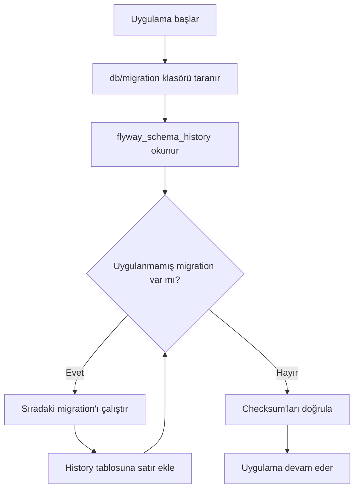
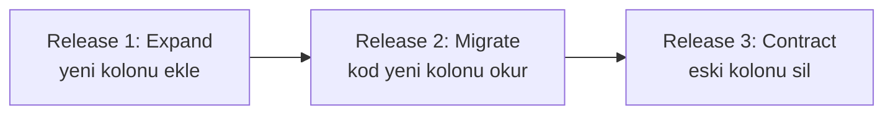
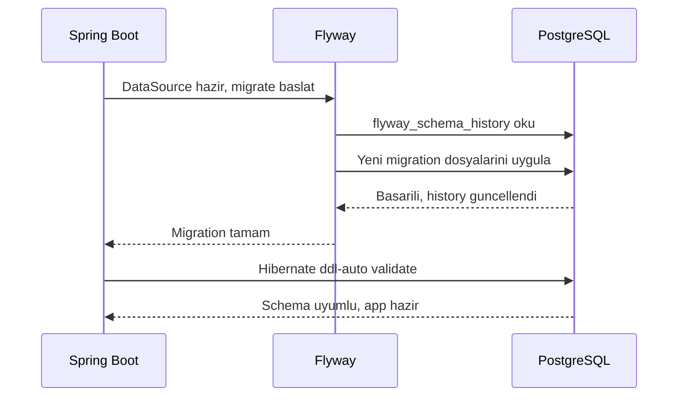
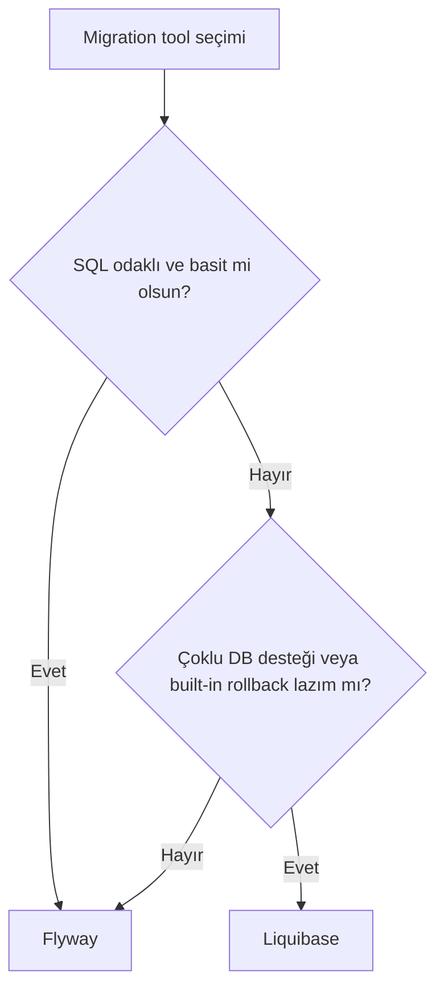

# Topic 1.4 — Database Migration: Flyway

```admonish info title="Bu bölümde"
- Schema değişikliklerini versiyonlu SQL dosyalarıyla kod gibi yönetmeyi öğreneceksin
- Flyway'in çalışma prensibini, dosya adlandırma kurallarını ve migration türlerini (Versioned / Repeatable / Undo) kavrayacaksın
- Banking-grade migration kurallarını göreceksin: checksum disiplini, expand-contract pattern, forward-only rollback
- PostgreSQL'i Docker ile lokal kurup TestContainers ile gerçek DB üzerinde migration testleri yazacaksın
- Flyway ile Liquibase'i karşılaştırıp hangi durumda hangisinin seçildiğini anlayacaksın
```

## Hedef

Bir banking projesinde **schema değişiklikleri**ni kod gibi yönetmek. Flyway'i derinlemesine anlayıp banking-grade migration kuralları öğrenmek. PostgreSQL'i Docker ile lokal kurmak, TestContainers ile test'leri gerçek DB üzerinde çalıştırmak.

## Süre

Okuma: 1.5 saat • Mini task: 2.5 saat • Test: 1 saat • Toplam: ~5 saat

## Önbilgi

- Topic 1.1-1.3 tamamlandı
- SQL temel (CREATE TABLE, INSERT, ALTER) biliyorsun
- Docker temel kurulu (`docker --version`)

---

## Kavramlar

### 1. Neden migration tool gerekli — banking gerçeği

Bir banking schema'sı 10 yılda yüzlerce değişir:
- Yeni kolon (`risk_score`)
- Index ekleme (performans için)
- Yeni tablo (yeni feature)
- Tip değişikliği (`VARCHAR(50)` → `VARCHAR(100)`)
- Constraint ekleme/kaldırma

**Yapma yolu (kötü):**
- DBA elle production'da SQL çalıştırır
- Dev environment ile prod arasında schema farkı oluşur
- "Hangi script'i çalıştırdık, hangisini çalıştırmadık?" karmaşası
- Rollback nedir, nasıl olur?
- Yeni developer'a "lokali kur" demek = 4 saat çile

**Yapma yolu (iyi):**
- Schema değişiklikleri **versiyonlu SQL dosyaları** olarak repo'da
- Uygulama başladığında veya pipeline'da otomatik çalıştırılır
- Hangi versiyona kadar uygulandığı **DB'de bir tabloda** yazılı
- Yeni developer: `mvn spring-boot:run` → DB otomatik kurulur

Bu disiplin **migration tool**'ları sağlar. En yaygın ikisi:

- **Flyway** — basit, dosya-bazlı, SQL odaklı (TR bankalarında yaygın)
- **Liquibase** — XML/YAML/JSON desteği, daha karmaşık ama daha esnek

Bu projede **Flyway** kullanıyoruz. Liquibase'i de tanıyacaksın (sondaki karşılaştırma bölümü).

### 2. Flyway temelleri

#### Çalışma prensibi

1. `src/main/resources/db/migration/` klasörü taranır
2. Dosya adı `V{version}__{description}.sql` formatında
3. DB'de `flyway_schema_history` tablosu otomatik yaratılır
4. Henüz uygulanmamış migration'lar **sırayla** çalıştırılır
5. Her başarılı uygulamada history tablosuna satır eklenir
6. Aynı dosya **bir kez** uygulanır — script'i değiştirmek = checksum hatası



#### Dosya adlandırma

```
V1__create_accounts_table.sql
V2__add_balance_column.sql
V3__create_journal_entries_table.sql
V4.1__add_index_on_account_owner.sql
V20251215.1__add_iban_column.sql
```

Format kuralları:
- `V` prefix (versioned migration)
- Version number — dot ile ayrılabilir (`1`, `1.1`, `1.1.1`)
- **İki underscore** (`__`)
- Description — `_` veya space kabul
- `.sql` extension

**Version sıralama:**
- `V1`, `V2`, `V2.1`, `V2.10`, `V3` — string değil **numeric** sıralanır
- `V1.10` > `V1.2` (10 > 2)

```admonish tip title="İpucu"
**Banking pratiği:** Timestamp-based versioning (`V20251215_120000__add_iban.sql`) — ekip içinde aynı versiyon çakışmasını engeller. Veya sequential (`V1`, `V2`, ...) — küçük ekipte iyi.
```

#### Migration türleri

**Versioned (`V`):** En yaygın. Bir kez uygulanır. Checksum kontrolü var.

**Repeatable (`R`):** Her değişiklikte tekrar çalıştırılır. Stored procedure, view, function gibi tanımlar için ideal.

```
R__create_balance_summary_view.sql
```

Bu dosyayı düzenleyebilirsin — checksum değişince Flyway yeniden uygular.

**Undo (`U`):** Flyway Pro/Teams (paralı) özelliği. Open source'ta YOK. Banking'de rollback'i farklı yöntemle yaparız (forward migration ile düzeltme — sonra anlatacağım).

### 3. İlk migration — `accounts` tablosu

`src/main/resources/db/migration/V1__create_accounts_table.sql`:

```sql
CREATE TABLE accounts (
    id              UUID PRIMARY KEY,
    owner_id        UUID NOT NULL,
    currency        CHAR(3) NOT NULL,
    balance_amount  NUMERIC(19, 4) NOT NULL DEFAULT 0.00,
    status          VARCHAR(20) NOT NULL DEFAULT 'ACTIVE',
    opened_at       TIMESTAMP WITH TIME ZONE NOT NULL DEFAULT CURRENT_TIMESTAMP,
    closed_at       TIMESTAMP WITH TIME ZONE,
    version         BIGINT NOT NULL DEFAULT 0,
    
    CONSTRAINT chk_account_status CHECK (status IN ('ACTIVE', 'FROZEN', 'CLOSED')),
    CONSTRAINT chk_balance_currency_match CHECK (currency ~ '^[A-Z]{3}$')
);

CREATE INDEX idx_accounts_owner_id ON accounts(owner_id);
CREATE INDEX idx_accounts_status ON accounts(status) WHERE status != 'CLOSED';
```

**Anahtar noktalar:**

- **`UUID` primary key** — distributed sistem için iyi (Phase 7'de microservice'e bölünce). Sequential ID (`BIGSERIAL`) de yaygın, banka tercihine bağlı.
- **`NUMERIC(19, 4)`** — `BigDecimal` karşılığı. 4 decimal yer ileride mikro-faiz için. 19 toplam basamak → ~10^15 TRY (yeterli).
- **`CHAR(3)`** — currency ISO kodu sabit 3 karakter.
- **`status` CHECK constraint** — domain enum'una karşılık DB-level guarantee.
- **`version` BIGINT** — optimistic locking için (Phase 2'de detay).
- **`TIMESTAMP WITH TIME ZONE`** — banka multi-region olabilir, timezone-aware lazım. Bare `TIMESTAMP` yerine **her zaman** `TIMESTAMPTZ`.
- **Partial index** (`WHERE status != 'CLOSED'`) — kapalı hesaplara index ayırmak gereksiz, daha küçük index daha hızlı.

### 4. Banking schema migration kuralları (zor öğrenilenler)

#### Kural 1: Migration'ı **edit etme** (production'a gittikten sonra)

```admonish warning title="Dikkat"
Bir migration uygulandıktan sonra dosyayı değiştirme. Flyway checksum tutar — dosya içeriği değişirse validate aşamasında hata alırsın.
```

Flyway checksum tutar:

```
V2__add_status_column.sql  (checksum: abc123)
```

Sonradan içeriği değiştirirsen:
```
ERROR: Validate failed: Migration checksum mismatch for migration version 2
```

**Doğru yol:** Yeni migration ekle (`V3__alter_status_column.sql`).

#### Kural 2: Migration'lar **idempotent değildir** ama defensive yaz

`CREATE TABLE accounts` ikinci kez çalıştırılırsa hata. Flyway her migration'ı bir kez çalıştırır, ama yine de **defensive yaz**:

```sql
CREATE TABLE IF NOT EXISTS accounts (...);
```

```admonish tip title="İpucu"
Defensive yazım (`IF NOT EXISTS` gibi) acil onarımda elle çalıştırırken hayatını kurtarır.
```

#### Kural 3: Migration **atomic olmayabilir**

DDL statement'leri çoğu DB'de transaction içinde çalışmaz veya kısmen çalışır. Multi-statement migration **yarıda kalabilir**. Flyway'in onu nasıl handle ettiğini bilmek lazım:

- **Auto-commit DB (Oracle 11g, MySQL 5.x):** Her DDL statement implicit commit. Yarıda kalma → manuel temizlik.
- **PostgreSQL:** DDL transaction içinde, rollback mümkün. Flyway tüm migration'ı tek transaction'da çalıştırır (default).

Banking'de Oracle yaygın → migration'larını **küçük parçalara böl**, her biri 1-2 statement.

#### Kural 4: Production'da migration **yarış kuralı** var

`Application 1` ve `Application 2` aynı anda başlarsa, ikisi de migration uygulamaya çalışır. Flyway DB-level lock kullanır → ikinci bekler, sonra hiçbir şey uygulamadığını görür. Genelde sorunsuz.

Ama **çok büyük migration** (örn. 1M satırlık tabloya kolon ekleme + populate) sırasında diğer app'ler timeout alabilir. Banking'de bu yüzden **migration ayrı job'da** çalıştırılır, app'ler "schema hazır" varsayar:

```yaml
spring:
  flyway:
    enabled: false   # app'te kapat
```

CI/CD pipeline'da explicit Flyway job çalıştır.

#### Kural 5: Backward-compatible migration

Banking'de **zero-downtime deployment** standardır. Migration backward-compatible olmalı:

**Yanlış:**
```sql
ALTER TABLE accounts RENAME COLUMN balance_amount TO balance;
```

Sonuç: Eski versiyon "balance_amount" arıyor, yeni "balance" — eski hâlâ çalışıyorsa patlar.

**Doğru — 3 adımlı expand-contract:**
1. **Expand:** `ALTER TABLE accounts ADD COLUMN balance NUMERIC(19,4); UPDATE accounts SET balance = balance_amount;` (uygulamanın iki kolon da yazmasını sağla)
2. **Migrate code:** Yeni versiyon `balance` kolonunu okuyacak şekilde deploy
3. **Contract:** Eski versiyon retire olunca `ALTER TABLE accounts DROP COLUMN balance_amount;`

3 ayrı release.



#### Kural 6: Rollback strategy

Banking'de migration rollback = **forward migration ile düzeltme**, geri alma değil.

```
V5__add_fee_column.sql              ← üretime gitti
V6__revert_fee_column.sql           ← V5'i geri al (DROP COLUMN fee)
```

Sebep:
- Migration history tutarlı kalır
- Audit trail temiz
- "Önceki versiyona dön" gerçek dünyada problemli

#### Kural 7: Schema migration ≠ data migration

```admonish warning title="Dikkat"
Büyük data migration (örn. 10M satırı yeniden hesapla) Flyway'de **çalıştırma**. Sebep:
- Uzun sürer (saatlerce) → app boot block olur
- Atomic değil
- Hata durumunda parçalı
```

Onun yerine:
- Schema değişikliğini Flyway'le yap (`ADD COLUMN`)
- Data populate'i ayrı **batch job** (Phase 5'te Spring Batch ile)
- Job idempotent, restartable

### 5. PostgreSQL Docker ile local setup

`~/projects/core-banking/docker-compose.yml`:

```yaml
services:
  postgres:
    image: postgres:16-alpine
    container_name: banking-postgres
    environment:
      POSTGRES_DB: banking_dev
      POSTGRES_USER: banking_dev
      POSTGRES_PASSWORD: dev_password
    ports:
      - "5432:5432"
    volumes:
      - postgres_data:/var/lib/postgresql/data
    healthcheck:
      test: ["CMD-SHELL", "pg_isready -U banking_dev -d banking_dev"]
      interval: 5s
      timeout: 5s
      retries: 5

volumes:
  postgres_data:
```

```bash
docker compose up -d        # başlat
docker compose ps           # durum
docker compose logs -f      # log akışı
docker compose down         # durdur
docker compose down -v      # durdur + volume sil (sıfırdan başla)
```

`application-dev.yml`:
```yaml
spring:
  datasource:
    url: jdbc:postgresql://localhost:5432/banking_dev
    username: banking_dev
    password: dev_password
```

### 6. Flyway'in `flyway_schema_history` tablosu

İlk migration sonrası DB'de:

```sql
SELECT * FROM flyway_schema_history;
```

| installed_rank | version | description | type | script | checksum | installed_by | installed_on | execution_time | success |
|---|---|---|---|---|---|---|---|---|---|
| 1 | 1 | create accounts table | SQL | V1__create_accounts_table.sql | -1234567890 | banking_dev | 2025-... | 45 | true |

```admonish warning title="Dikkat"
Bu tabloyu **elle değiştirme** (production'da locked permissions ile koruman lazım). Sadece okumak için.
```

### 7. Flyway Spring Boot otomatik entegrasyon

`pom.xml`'da `flyway-core` ve `postgresql` driver → Spring Boot otomatik:

1. App başlangıcında DataSource hazırlar
2. Flyway'i çalıştırır (datasource ile)
3. `db/migration` klasörünü tarar
4. Yeni migration'ları uygular
5. Sonra Hibernate'i başlatır (`ddl-auto: validate` ile schema'yı doğrular)



**Önemli config:**

```yaml
spring:
  flyway:
    enabled: true
    locations: classpath:db/migration
    baseline-on-migrate: false      # production'da false bırak
    validate-on-migrate: true       # checksum kontrol
    out-of-order: false             # numara atlanamaz
    placeholder-replacement: false  # ${} yer tutucu kullanmıyoruz (security)
    fail-on-missing-locations: true # locations bulunamazsa fail
```

```admonish warning title="Dikkat"
`spring.jpa.hibernate.ddl-auto: validate` ile Hibernate **şemayı oluşturmaz**, sadece entity ile DB schema uyumunu doğrular. Schema'yı **Flyway** yönetir. `create`, `update`, `create-drop` değerleri **banking'de yasak**.
```

### 8. Migration testing

Migration script'leri **test edilir**. Test stratejileri:

1. **TestContainers ile gerçek PostgreSQL** — her test'te taze container, migration'lar otomatik uygulanır → assertion'lar yaz
2. **Test profili ile shared TestContainer** — daha hızlı, ama isolation azalır
3. **H2 in-memory** — hızlı ama PostgreSQL dialect'i tam taklit etmez (banking için **uygun değil**)

Banking projesinde **TestContainers + PostgreSQL** standard.

```java
@Testcontainers
@SpringBootTest
@ActiveProfiles("test")
class MigrationIntegrationTest {
    
    @Container
    @ServiceConnection
    static PostgreSQLContainer<?> postgres = new PostgreSQLContainer<>("postgres:16-alpine");
    
    @Autowired
    private JdbcTemplate jdbcTemplate;
    
    @Test
    void accountsTableShouldExist() {
        Integer count = jdbcTemplate.queryForObject(
            "SELECT COUNT(*) FROM information_schema.tables WHERE table_name = 'accounts'",
            Integer.class
        );
        assertThat(count).isEqualTo(1);
    }
    
    @Test
    void accountsShouldHaveBalanceColumn() {
        String dataType = jdbcTemplate.queryForObject(
            """
            SELECT data_type FROM information_schema.columns 
            WHERE table_name = 'accounts' AND column_name = 'balance_amount'
            """,
            String.class
        );
        assertThat(dataType).isEqualTo("numeric");
    }
    
    @Test
    void accountStatusCheckShouldRejectInvalidValue() {
        assertThatThrownBy(() ->
            jdbcTemplate.update(
                "INSERT INTO accounts (id, owner_id, currency, status) VALUES (?, ?, ?, ?)",
                UUID.randomUUID(), UUID.randomUUID(), "TRY", "INVALID"
            )
        ).isInstanceOfAny(DataIntegrityViolationException.class);
    }
}
```

`@ServiceConnection` Spring Boot 3.1+ — TestContainer'ın connection bilgilerini otomatik Spring DataSource'una bağlar. Manuel `@DynamicPropertySource` gerekmez.

### 9. Banking-specific schema design — Topic 1.4'te yazacaklarımız

`accounts` (Task 1.4.1'de detayı):
- id, owner_id, currency, balance_amount, status, opened_at, closed_at, version

`journal_entries` — bir mali olayı temsil eder (transfer, faiz, ücret):
- id, transaction_id (idempotency key), description, occurred_at

`journal_lines` — journal_entry'nin alt kalemleri (debit/credit):
- id, journal_entry_id, account_id, direction (DEBIT/CREDIT), amount, currency

Double-entry kuralı: Bir `journal_entry`'nin tüm `journal_lines`'larının toplam DEBIT = toplam CREDIT olmalı.

```sql
CREATE TABLE journal_entries (
    id              UUID PRIMARY KEY,
    transaction_id  UUID NOT NULL UNIQUE,    -- idempotency key
    description     VARCHAR(500),
    occurred_at     TIMESTAMP WITH TIME ZONE NOT NULL DEFAULT CURRENT_TIMESTAMP,
    created_by      VARCHAR(100) NOT NULL
);

CREATE TABLE journal_lines (
    id                  UUID PRIMARY KEY,
    journal_entry_id    UUID NOT NULL REFERENCES journal_entries(id),
    account_id          UUID NOT NULL REFERENCES accounts(id),
    direction           VARCHAR(6) NOT NULL CHECK (direction IN ('DEBIT', 'CREDIT')),
    amount              NUMERIC(19, 4) NOT NULL CHECK (amount > 0),
    currency            CHAR(3) NOT NULL
);

CREATE INDEX idx_journal_lines_account ON journal_lines(account_id);
CREATE INDEX idx_journal_lines_entry ON journal_lines(journal_entry_id);
```

**Banking detayı:** `journal_lines.amount` her zaman pozitif. Yönü `direction` belirler. Bu konvansiyon — accountant'lar böyle düşünür.

### 10. Repeatable migration örneği

`R__refresh_balance_summary_view.sql`:

```sql
DROP VIEW IF EXISTS account_balance_summary;

CREATE VIEW account_balance_summary AS
SELECT 
    a.id AS account_id,
    a.currency,
    COALESCE(SUM(
        CASE 
            WHEN jl.direction = 'CREDIT' THEN jl.amount
            WHEN jl.direction = 'DEBIT' THEN -jl.amount
        END
    ), 0) AS calculated_balance,
    a.balance_amount AS stored_balance
FROM accounts a
LEFT JOIN journal_lines jl ON jl.account_id = a.id
GROUP BY a.id, a.currency, a.balance_amount;
```

Bu view'i değiştirmek istediğinde aynı dosyayı edit edip Flyway'i çalıştırırsın → otomatik yeniden yaratılır.

### 11. Liquibase — kısaca karşılaştırma (bilgi olsun)

Liquibase'in farkları:

```xml
<changeSet id="1" author="ahmet">
    <createTable tableName="accounts">
        <column name="id" type="uuid">
            <constraints primaryKey="true"/>
        </column>
        ...
    </createTable>
</changeSet>
```

**Liquibase artı'ları:**
- DB-agnostic (XML/YAML değişiklikleri → birden fazla DB'de çalışır)
- Built-in rollback (`<rollback>` tag)
- Change preview, dry-run
- Daha esnek

**Liquibase eksi'leri:**
- Daha karmaşık
- SQL'i bilen developer'ın doğal yolu değil
- YAML/XML disipliniyle hata yapması kolay



**TR banking gerçeği:** Flyway daha yaygın. Bazı eski enterprise sistemler Liquibase. İkisini de bil, projende Flyway kullan.

### 12. SQL versioning kuralları (banking)

**Naming convention:**
- Tablo: `snake_case` plural (`accounts`, `journal_entries`)
- Kolon: `snake_case` (`owner_id`, `balance_amount`)
- Foreign key kolon: `<referenced_table_singular>_id` (`account_id`)
- Index: `idx_<table>_<col>` (`idx_accounts_owner_id`)
- Constraint: `chk_<table>_<rule>` (`chk_account_status`)
- Trigger: `trg_<table>_<event>` (`trg_accounts_update_audit`)

**Migration content kuralları:**
- Bir migration **bir konuya** odaklansın
- Migration'lar **küçük** olsun (rollback'i kolaylaştırır)
- Migration'da **production data'yı UPDATE etme** (idempotent olmayabilir, audit kaybı)
- Comment yaz: dosya başında ne yaptığını anlat

---

## Önemli olabilecek araştırma kaynakları

- Flyway documentation (flywaydb.org/documentation/)
- "Refactoring Databases" Scott Ambler (DB değişiklik pattern'leri)
- PostgreSQL official docs (postgresql.org/docs/)
- TestContainers documentation (testcontainers.com)
- "Database Reliability Engineering" Laine Campbell
- Liquibase documentation (karşılaştırma için)
- "Zero downtime deployments with Flyway" blog yazıları

---

## Mini task'ler

### Task 1.4.1 — PostgreSQL Docker setup (15 dk)

`core-banking/docker-compose.yml` yaz (yukarıda örnek). Çalıştır:
```bash
docker compose up -d
docker compose ps        # postgres healthy mi?
docker compose logs postgres | head
```

PostgreSQL container'ına gir, DB'i incele:
```bash
docker exec -it banking-postgres psql -U banking_dev -d banking_dev
\dt           # tabloları listele (boş)
\q
```

### Task 1.4.2 — V1: accounts table migration (30 dk)

`src/main/resources/db/migration/V1__create_accounts_table.sql` yaz.

Spec:
- UUID primary key
- `owner_id` UUID NOT NULL
- `currency` CHAR(3) NOT NULL
- `balance_amount` NUMERIC(19, 4) NOT NULL DEFAULT 0.0000
- `status` VARCHAR(20) NOT NULL DEFAULT 'ACTIVE' with CHECK ('ACTIVE', 'FROZEN', 'CLOSED')
- `opened_at` TIMESTAMPTZ NOT NULL DEFAULT CURRENT_TIMESTAMP
- `closed_at` TIMESTAMPTZ (nullable)
- `version` BIGINT NOT NULL DEFAULT 0

Index: `owner_id` üzerinde (partial: status != 'CLOSED').

App'i çalıştır (`mvn spring-boot:run`), migration'ın otomatik uygulandığını görsele bir şekilde doğrula:

```bash
docker exec -it banking-postgres psql -U banking_dev -d banking_dev
\dt                       # accounts ve flyway_schema_history görünmeli
\d accounts               # schema'yı incele
SELECT * FROM flyway_schema_history;
```

### Task 1.4.3 — V2: journal tables migration (30 dk)

`V2__create_journal_tables.sql`:
- `journal_entries` tablosu (id, transaction_id UNIQUE, description, occurred_at, created_by)
- `journal_lines` tablosu (id, journal_entry_id FK, account_id FK, direction CHECK, amount > 0, currency)
- Index'ler

App'i restart et, V2'nin uygulandığını doğrula.

### Task 1.4.4 — V3: extra ALTER migration (15 dk)

V1'de unutulan bir şeyi V3 ile ekle. Örnek: account adına `customer_reference` kolonu (banka müşterisinin dış sistemden referans no).

`V3__add_customer_reference_to_accounts.sql`:
```sql
ALTER TABLE accounts ADD COLUMN customer_reference VARCHAR(50);
CREATE INDEX idx_accounts_customer_reference ON accounts(customer_reference) 
    WHERE customer_reference IS NOT NULL;
```

App'i restart et.

### Task 1.4.5 — Migration'ı edit et ve sonuçları gör (10 dk)

V1 dosyasını **kasten** edit et. Örneğin bir comment ekle:
```sql
-- yeni comment satırı
CREATE TABLE accounts (...);
```

App'i restart et. Aldığın hatayı **defterine yaz** (`FlywayValidateException` veya `checksum mismatch`).

Sonra dosyayı eski haline getir, restart et — düzelmeli.

```admonish tip title="İpucu"
**Bu deneyimi geçirmek lazım.** Production'da bu hatayı bir kere yedikten sonra migration'a saygın artar.
```

### Task 1.4.6 — Repeatable migration: balance summary view (30 dk)

`R__create_balance_summary_view.sql` yaz (yukarıda örnek var). Bir test query'si yaz:

```sql
SELECT * FROM account_balance_summary;
```

Boş tablo → boş sonuç. Manuel bir kaç account insert et:

```sql
INSERT INTO accounts (id, owner_id, currency, balance_amount, status)
VALUES (gen_random_uuid(), gen_random_uuid(), 'TRY', 1000.00, 'ACTIVE');
```

Query'i tekrar çalıştır, view'ün sonucunu gör.

Sonra view'i değiştir (örn. bir kolon ekle), restart et, otomatik yeniden yaratıldığını doğrula.

### Task 1.4.7 — Forward-only rollback örneği (15 dk)

`V3__add_customer_reference_to_accounts.sql`'ı silmek istediğini varsay (yanlış karar verdik). V4 yaz:

`V4__drop_customer_reference_from_accounts.sql`:
```sql
DROP INDEX IF EXISTS idx_accounts_customer_reference;
ALTER TABLE accounts DROP COLUMN customer_reference;
```

Bu yaklaşım banking pratiği — geri alma yerine ileri düzeltme.

---

## Test yazma rehberi

### Test 1.4.1 — TestContainers entegrasyonu

`pom.xml`'da var (Topic 1.2'de eklendi):
```xml
<dependency>
    <groupId>org.testcontainers</groupId>
    <artifactId>postgresql</artifactId>
    <scope>test</scope>
</dependency>
```

`src/test/java/com/mavibank/banking/migration/MigrationIntegrationTest.java`:

```java
@Testcontainers
@SpringBootTest
@ActiveProfiles("test")
class MigrationIntegrationTest {
    
    @Container
    @ServiceConnection
    static PostgreSQLContainer<?> postgres = 
        new PostgreSQLContainer<>("postgres:16-alpine");
    
    @Autowired
    private JdbcTemplate jdbcTemplate;
    
    @Test
    void accountsTableExists() {
        Integer count = jdbcTemplate.queryForObject(
            "SELECT COUNT(*) FROM information_schema.tables WHERE table_name = 'accounts'",
            Integer.class
        );
        assertThat(count).isEqualTo(1);
    }
    
    @Test
    void accountsHasCorrectColumns() {
        List<String> columns = jdbcTemplate.queryForList(
            "SELECT column_name FROM information_schema.columns WHERE table_name = 'accounts' ORDER BY ordinal_position",
            String.class
        );
        assertThat(columns).contains("id", "owner_id", "currency", "balance_amount",
                                     "status", "opened_at", "closed_at", "version");
    }
    
    @Test
    void balanceAmountIsNumericNineteenFour() {
        Map<String, Object> column = jdbcTemplate.queryForMap(
            """
            SELECT data_type, numeric_precision, numeric_scale 
            FROM information_schema.columns 
            WHERE table_name = 'accounts' AND column_name = 'balance_amount'
            """
        );
        assertThat(column).containsEntry("data_type", "numeric");
        assertThat(column).containsEntry("numeric_precision", 19);
        assertThat(column).containsEntry("numeric_scale", 4);
    }
    
    @Test
    void statusCheckRejectsInvalidValue() {
        assertThatThrownBy(() ->
            jdbcTemplate.update(
                "INSERT INTO accounts (id, owner_id, currency, status) VALUES (?::uuid, ?::uuid, ?, ?)",
                UUID.randomUUID().toString(), UUID.randomUUID().toString(), "TRY", "INVALID_STATUS"
            )
        ).isInstanceOf(DataIntegrityViolationException.class);
    }
    
    @Test
    void journalLineDirectionCheckRejectsInvalidValue() {
        // önce bir account ve journal_entry insert et, sonra invalid direction
        // ...
    }
    
    @Test
    void journalLineAmountMustBePositive() {
        // amount = 0 veya negative INSERT'i fail etsin
    }
    
    @Test
    void foreignKeyConstraintWorks() {
        // var olmayan account_id ile journal_line insert et, fail etsin
        UUID fakeAccountId = UUID.randomUUID();
        UUID journalEntryId = insertJournalEntry();
        
        assertThatThrownBy(() ->
            jdbcTemplate.update(
                "INSERT INTO journal_lines (id, journal_entry_id, account_id, direction, amount, currency) " +
                "VALUES (?, ?, ?, ?, ?, ?)",
                UUID.randomUUID(), journalEntryId, fakeAccountId, "DEBIT", new BigDecimal("100.00"), "TRY"
            )
        ).isInstanceOf(DataIntegrityViolationException.class);
    }
    
    private UUID insertJournalEntry() {
        // helper method
    }
    
    @Test
    void flywaySchemaHistoryHasAllMigrations() {
        Integer count = jdbcTemplate.queryForObject(
            "SELECT COUNT(*) FROM flyway_schema_history WHERE success = true",
            Integer.class
        );
        assertThat(count).isGreaterThanOrEqualTo(3);  // V1, V2, V3 at least
    }
}
```

### Test 1.4.2 — `application-test.yml` config

```yaml
spring:
  jpa:
    hibernate:
      ddl-auto: validate
  flyway:
    enabled: true

logging:
  level:
    org.flywaydb: INFO
    org.testcontainers: INFO
```

---

## Claude-verify prompt

```
Aşağıdaki Flyway migration setup'umu banking-grade kriterlere göre değerlendir. 
Sadece sorunları belirt, kod yazma:

1. Dosya naming:
   - Migration dosyaları `V{version}__{description}.sql` formatında mı?
   - Versiyon numaraları çakışmıyor mu?
   - Description anlamlı, snake_case veya boşluk-ile-olabilir mi?
   - Repeatable migration'lar `R__` prefix'i kullanıyor mu?

2. SQL kalitesi:
   - Tablo/kolon naming snake_case mi?
   - Plural tablo, singular kolon mu?
   - Primary key her tabloda var mı?
   - Foreign key constraint'ler var mı?
   - CHECK constraint'ler enum-benzeri kolonlarda var mı (status, direction)?
   - TIMESTAMP WITH TIME ZONE kullanılmış mı (bare TIMESTAMP DEĞİL)?
   - Para kolonu NUMERIC(19, 4) veya benzer kesin tip mi (FLOAT/DOUBLE PRECISION DEĞİL)?
   - Index'ler eklenmiş mi (özellikle foreign key kolonları için)?

3. Banking-specific:
   - `accounts` tablosu version kolonu var mı (optimistic locking için)?
   - `journal_entries` tablosunda `transaction_id` UNIQUE constraint'i var mı (idempotency için)?
   - `journal_lines.amount` CHECK > 0 mı (negatif amount = direction'la ifade)?
   - `journal_lines.direction` CHECK ('DEBIT', 'CREDIT') var mı?

4. Configuration:
   - `spring.jpa.hibernate.ddl-auto` `validate` veya `none` mu (create/update DEĞİL)?
   - Flyway `validate-on-migrate: true` mu?
   - Production'da `baseline-on-migrate: false` mu?

5. Test:
   - TestContainers ile PostgreSQL test yapıyor musun (H2 DEĞİL)?
   - `@ServiceConnection` veya `@DynamicPropertySource` ile bağlanmış mı?
   - Tablo varlığı, kolon tipi, constraint'ler test edilmiş mi?
   - Constraint violation testleri var mı (status invalid, amount negative, foreign key)?
   - flyway_schema_history kontrolü var mı?

6. Anti-pattern:
   - Migration dosyası uygulandıktan sonra edit edilmiş mi? (Olmamalı, V3 yapılmalı)
   - Schema migration'da büyük data UPDATE var mı? (Olmamalı)
   - Production data'yı modify eden migration var mı (mass UPDATE)? (Olmamalı)
   - Migration rollback için `V*` yerine Flyway Pro'nun U* özelliği denenmiş mi (open source'ta yok)?

Her madde için PASS / FAIL / EKSIK işaretle. Kod yazma. Sadece neyi düzeltmem 
gerektiğini söyle.
```

---

## Tamamlama kriterleri

- [ ] Docker ile PostgreSQL local çalışıyor
- [ ] V1: `accounts` table migration yazılı, uygulanmış
- [ ] V2: `journal_entries` ve `journal_lines` tables migration yazılı
- [ ] V3: bir ALTER migration eklenmiş
- [ ] R: balance summary view repeatable migration
- [ ] V4: forward-fix migration (V3'ü geri alan) yazılmış, kavram anlaşılmış
- [ ] Migration'ı edit edip checksum hatası alındı (bilinçli deneyim)
- [ ] TestContainers ile migration integration test yazılı
- [ ] Tüm test'ler `mvn test` ile geçiyor
- [ ] `flyway_schema_history` tablosunu inceleyip anlamış
- [ ] "Migration rollback nasıl yapılır?" sorusuna "forward-fix" cevabı verebilirim
- [ ] H2 yerine TestContainers PostgreSQL kullanma sebebini biliyorum

---

## Defter notları

1. "Flyway'in çalışma prensibi: ____."
2. "Migration dosyası adlandırma kuralı: ____."
3. "Versioned (V) ve Repeatable (R) migration farkı: ____."
4. "Migration uygulandıktan sonra edit edersem ne olur: ____."
5. "Banking'de schema rollback nasıl yapılır (forward-fix nedir): ____."
6. "Expand-contract pattern (zero-downtime migration) 3 adımı: ____."
7. "`spring.jpa.hibernate.ddl-auto: validate` neden gerekli, neden create değil: ____."
8. "TestContainers H2'den daha iyi çünkü ____."
9. "TIMESTAMP WITH TIME ZONE ve bare TIMESTAMP farkı: ____."
10. "`flyway_schema_history` tablosunu manuel düzenlemek nasıl olur, neden tehlikelidir: ____."

```admonish success title="Bölüm Özeti"
- Flyway, migration'ları `V{version}__{description}.sql` dosyaları olarak sırayla uygular; uygulanma durumu `flyway_schema_history` tablosunda tutulur
- Uygulanmış bir migration asla edit edilmez — checksum mismatch hatası alırsın; düzeltme her zaman yeni bir migration ile yapılır
- Rollback = forward-fix: geri alma yerine ileri düzeltme migration'ı yazılır, audit trail temiz kalır
- Zero-downtime için expand-contract pattern: önce ekle (expand), sonra kodu geçir (migrate), en son eskiyi sil (contract) — 3 ayrı release
- Schema'yı Flyway yönetir; Hibernate `ddl-auto: validate` ile sadece doğrular — `create`/`update` banking'de yasak
- Migration testleri H2 ile değil, TestContainers + gerçek PostgreSQL ile yazılır
```
