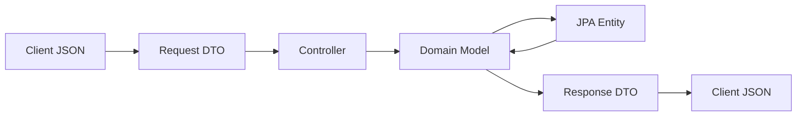
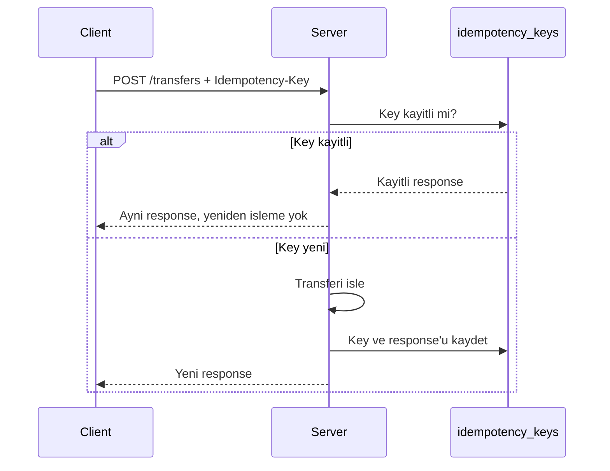
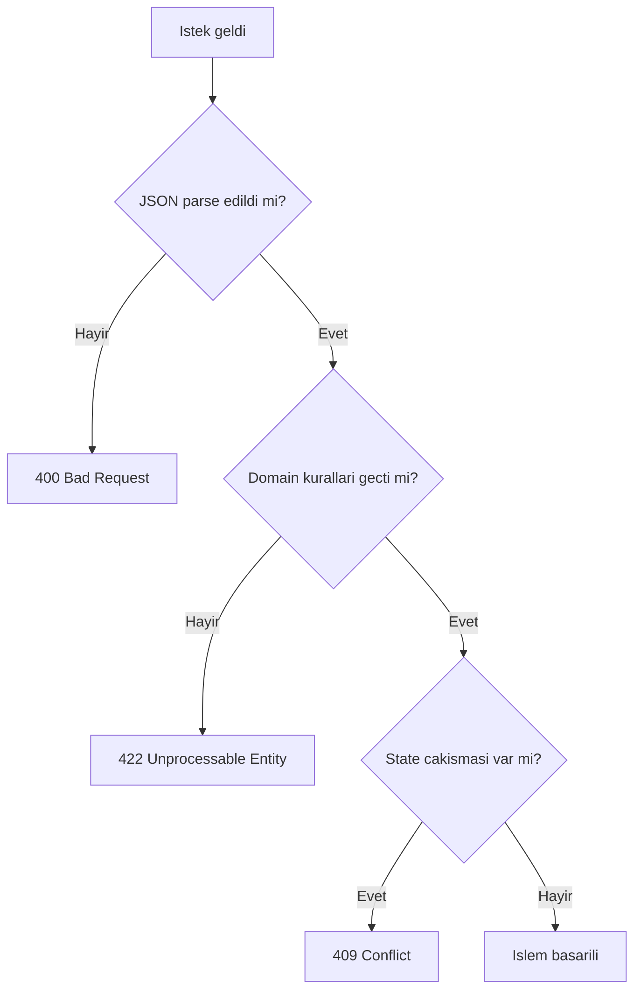
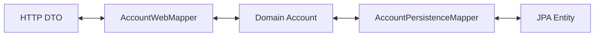

# Topic 1.5 — API Design: DTO, MapStruct, Lombok kararı

```admonish info title="Bu bölümde"
- Entity'i API'den dışarı sızdırmanın neden tehlikeli olduğunu ve DTO ayrımının gerekçesini öğreneceksin
- Request/Response DTO'larını yön bazlı tasarlamayı ve modern Java `record` kullanımını kavrayacaksın
- Banking'e uygun RESTful kaynak tasarımı, status code seçimi ve idempotency kavramını göreceksin
- MapStruct ile compile-time mapper üretmeyi ve mapper'ların adapter katmanındaki yerini öğreneceksin
- Lombok'u nerede kullanıp nerede kullanmayacağına bilinçli karar vereceksin
```

## Hedef

Bir REST API'i tasarlarken **entity sızıntısı**ndan kaçınmak; request/response DTO'larını doğru ayrıştırmak; MapStruct ile compile-time mapper'lar üretmek; Lombok kullanıp kullanmamayı **bilinçli** karar olarak almak; banking domain'inde RESTful kaynakları nasıl modelleyeceğini öğrenmek.

## Süre

Okuma: 1.5 saat • Mini task: 2 saat • Test: 1 saat • Toplam: ~4.5 saat

## Önbilgi

- Topic 1.1-1.4 tamamlandı
- HTTP method'lar (GET/POST/PUT/PATCH/DELETE) ve status code'lara aşinasın
- JSON yapısına alışkın

---

## Kavramlar

### 1. Entity ≠ DTO — neden ayrı tutuyoruz

En kestirme yol, domain entity'ni doğrudan controller'dan dönmek. Kısa vadede işe yarar ama bir bankada bu, güvenlik açığıyla eşdeğerdir. Önce hataya bak:

```java
@RestController
@RequestMapping("/accounts")
class AccountController {
    
    @GetMapping("/{id}")
    public Account get(@PathVariable UUID id) {            // ← Domain entity
        return accountService.findById(id);
    }
    
    @PostMapping
    public Account create(@RequestBody Account account) {  // ← Domain entity
        return accountService.create(account);
    }
}
```

```admonish warning title="Dikkat"
Bu kodun problemleri:

1. **Internal field'lar dışarı sızar.** `version` (optimistic lock), `created_by`, sensitive bilgiler API'den çıkar.
2. **JSON kontrat schema'ya bağlanır.** DB kolonu rename edersen client'ı kırarsın.
3. **Lazy loading patlamaları.** Serializer lazy proxy'leri trigger eder → N+1, LazyInitializationException.
4. **Validation karışır.** Entity'de `@Email` = domain'i framework'e bağladın.
5. **Mass assignment vulnerability.** Client `status=APPROVED` gönderir, Jackson deserialize eder → yetkisiz field değiştirme.
6. **API evolution zor.** Aynı entity = aynı JSON = backward compat kırılır.
```

Çözüm basit: HTTP sınırında **ayrı DTO'lar** kullan. <mark>Entity hiçbir zaman bu sınırı geçmez</mark>; veri katmanlar arasında şöyle akar:



Doğru yaklaşım kodda böyle görünür:

```java
// Request DTO (client → server)
public record OpenAccountRequest(
    @NotNull UUID ownerId,
    @NotBlank @Size(min=3, max=3) String currency
) {}

// Response DTO (server → client)
public record AccountResponse(
    UUID id,
    UUID ownerId,
    String currency,
    BigDecimal balance,
    String status,
    Instant openedAt
) {}

@RestController
@RequestMapping("/accounts")
class AccountController {
    
    @PostMapping
    public ResponseEntity<AccountResponse> open(
        @Valid @RequestBody OpenAccountRequest request
    ) {
        Account account = accountService.open(
            new OwnerId(request.ownerId()),
            Currency.getInstance(request.currency())
        );
        return ResponseEntity.status(201).body(toResponse(account));
    }
    
    @GetMapping("/{id}")
    public AccountResponse get(@PathVariable UUID id) {
        Account account = accountService.findById(new AccountId(id));
        return toResponse(account);
    }
    
    private AccountResponse toResponse(Account account) {
        return new AccountResponse(
            account.getId().value(),
            account.getOwnerId().value(),
            account.getCurrency().getCurrencyCode(),
            account.getBalance().amount(),
            account.getStatus().name(),
            account.getOpenedAt()
        );
    }
}
```

Buradaki `toResponse` gibi manuel mapping kodunu aklında tut — Bölüm 8'de MapStruct ile bundan kurtulacağız.

### 2. Request vs Response DTO ayrımı

DTO'ya geçtin, güzel. Ama sık yapılan ikinci hata: request ve response için **tek DTO** kullanmak.

```java
public class AccountDto {
    private UUID id;          // response'da gelir, request'te olmamalı
    private UUID ownerId;     // request'te gerekli, response'da da var
    private String currency;
    private BigDecimal balance;  // response'da, request'te olmamalı
    private String status;       // response'da, request'te ASLA
}
```

```admonish warning title="Dikkat"
Tek DTO'nun sorunları:
- Hangi field hangi yönde gidiyor belirsiz
- Validation karışır (request'te zorunlu olan response'da nullable, vb.)
- Mass assignment riski geri gelir
```

Kural şu: <mark>her endpoint için **yön bazlı** DTO yaz</mark> — `OpenAccountRequest` / `AccountResponse`, `TransferRequest` / `TransferResponse`, `UpdateAccountStatusRequest` gibi.

```admonish tip title="İpucu"
Bu yaklaşım PR'da daha çok dosya yaratır ama **explicit > implicit**.
```

### 3. RESTful resource design — banking

URL'ler API'nin vitrinidir; **kaynak (resource)** odaklı düşünürsen tutarlı kalır:

- `/accounts` — hesap collection
- `/accounts/{id}` — tek hesap
- `/accounts/{id}/transactions` — hesabın transaction'ları (read)
- `/transfers` ve `/transfers/{id}` — transfer collection ve detayı

HTTP method'ların semantiği banking'de şöyle oturur:

- `GET /accounts/{id}` — oku (cacheable, safe, idempotent)
- `POST /accounts` — yeni kaynak yarat (NOT idempotent — aynı body iki kere = iki kayıt)
- `POST /transfers` — operasyon başlat (idempotent yapmak için `Idempotency-Key` header)
- `PUT /accounts/{id}` — full replace (banking'de **nadiren doğru** — account'un tüm field'ı replace edilmez)
- `PATCH /accounts/{id}` — partial update (status değişikliği)
- `DELETE /accounts/{id}` — hesap kapat (banking'de **soft delete** — status CLOSED olur, fiziksel silme yok)

**Tuzak — "action verb in URL":**

```
POST /accounts/123/close          # ❌ kötü
POST /transfers/456/cancel        # ❌ kötü
POST /cards/789/block             # ❌ kötü
```

REST puristleri "noun-based" der. Bankacılıkta bu kural **pragmatik olarak ihlal edilir**, çünkü bu işlemler basit CRUD değil, **command**'dır. Kabul edilebilir alternatifler:

```
POST /transfers/456/cancellations   # cancellation resource'u yarat
PATCH /accounts/123 {"status": "CLOSED"}  # patch yaklaşımı
```

Karar ekibe ait — ama hangisini seçersen seç, **tutarlı ol**.

### 4. Idempotency — banking için kritik

Neden önemli, tek cümle: <mark>bir transfer iki kez işlenirse çift ödeme olur</mark>, çift ödeme felakettir. Network timeout'ta client retry yapar ve aynı istek iki kez gelir — buna hazır olmalısın.

Çözüm: `POST /transfers` endpoint'inde **`Idempotency-Key` header** zorunlu olsun.

```http
POST /transfers HTTP/1.1
Content-Type: application/json
Idempotency-Key: 550e8400-e29b-41d4-a716-446655440000

{
  "fromAccountId": "...",
  "toAccountId": "...",
  "amount": "100.00",
  "currency": "TRY"
}
```

Server tarafında mantık üç adım: key kayıtlı mı bak; kayıtlıysa saklanan response'u dön (yeniden işleme yok); değilse işle, key + response'u kaydet, dön.



`idempotency_keys` tablosu:
```sql
CREATE TABLE idempotency_keys (
    key                 UUID PRIMARY KEY,
    request_hash        VARCHAR(64) NOT NULL,
    response_body       JSONB NOT NULL,
    response_status     INTEGER NOT NULL,
    created_at          TIMESTAMP WITH TIME ZONE NOT NULL DEFAULT CURRENT_TIMESTAMP,
    expires_at          TIMESTAMP WITH TIME ZONE NOT NULL
);
```

```admonish tip title="İpucu"
`request_hash` bir tuzağı yakalar: aynı key + farklı body = client hata yaptı → 422 fırlat.
```

Bunu Phase 2'de tam implement edeceğiz. Phase 1'de **kavramı oturt**, basit versiyonu yaz.

### 5. Status code'lar — banking için kullanım

Client'ın hata handling'i status code'lara dayanır; yanlış code = client'ta yanlış davranış. Banking'de en çok kullanacakların:

| Code | Anlamı | Banking örneği |
|---|---|---|
| 200 OK | Read başarılı | `GET /accounts/{id}` |
| 201 Created | Resource yaratıldı | `POST /accounts` |
| 202 Accepted | Async işleme alındı | `POST /transfers` (queue'ya atıldı) |
| 204 No Content | Body'siz başarılı | `DELETE` |
| 400 Bad Request | Malformed input | JSON parse hatası |
| 401 Unauthorized | Auth yok/yanlış | Token süresi dolmuş |
| 403 Forbidden | Auth var, izin yok | Müşteri başkasının hesabını okumaya çalışıyor |
| 404 Not Found | Resource yok | `GET /accounts/{nonexistent-id}` |
| 409 Conflict | State conflict | İki transfer aynı anda, optimistic lock fail |
| 422 Unprocessable Entity | Validation hatası | Insufficient funds, currency mismatch |
| 429 Too Many Requests | Rate limit | Aynı IP saniyede 100 istek |
| 500 Internal Server Error | Bilinmeyen hata | NPE, DB down |
| 503 Service Unavailable | Geçici sorun | Downstream service down |

En çok karıştırılan üçlü 400 / 422 / 409:

- **400**: HTTP/JSON seviyesinde malformed (parse bile edilemedi)
- **422**: input semantik olarak yanlış — domain validation hatası (negatif transfer amount)
- **409**: state conflict (concurrent modification)

Karar akışı şöyle:



### 6. Response shape — tutarlılık

Her endpoint farklı response shape üretirse client her endpoint için ayrı handling yazar — bakım kâbusu. Üç standart shape yeter:

**Single resource:**
```json
{
  "id": "...",
  "ownerId": "...",
  "currency": "TRY",
  "balance": "1000.00",
  "status": "ACTIVE"
}
```

**Collection (pagination ile):**
```json
{
  "items": [
    { "id": "...", "balance": "..." },
    { "id": "...", "balance": "..." }
  ],
  "page": 0,
  "size": 20,
  "totalElements": 142,
  "totalPages": 8
}
```

**Error** — RFC 7807 ProblemDetail (Topic 1.7'de detaylı):
```json
{
  "type": "https://api.mavibank.com/problems/insufficient-funds",
  "title": "Insufficient funds",
  "status": 422,
  "detail": "Account TRY1234 has 500.00, requested 600.00",
  "instance": "/transfers"
}
```

### 7. Pagination — banking'de standart

Bir hesabın milyonlarca transaction'ı olabilir; hepsini tek response'ta dönemezsin. Standart page/size yaklaşımı:

`GET /accounts/{id}/transactions?page=0&size=20&sort=occurredAt,desc`

```java
@GetMapping("/{id}/transactions")
public PageResponse<TransactionResponse> getTransactions(
    @PathVariable UUID id,
    @PageableDefault(size=20, sort="occurredAt", direction=Sort.Direction.DESC) Pageable pageable
) {
    Page<Transaction> page = transactionService.findByAccount(id, pageable);
    return new PageResponse<>(
        page.getContent().stream().map(this::toResponse).toList(),
        page.getNumber(),
        page.getSize(),
        page.getTotalElements(),
        page.getTotalPages()
    );
}
```

Alternatif olarak **cursor-based pagination** var:
```
GET /transactions?cursor=eyJpZCI6Ii4uLiJ9&limit=20
```

```admonish tip title="İpucu"
Çok büyük datasette (10M satır transaction) `OFFSET` performans kırar. Cursor stabil ve hızlı. Phase 2'de detaylandıracağız.
```

### 8. MapStruct — compile-time mapper'lar

Bölüm 1'deki manuel `toResponse` metodunu hatırla: sıkıcı, tekrarlı ve hata-prone. Entity'e yeni field ekleyip mapper'ı güncellemeyi unutursan response'da o field eksik kalır — sessiz bir bug.

**MapStruct** bu kodu **annotation-processor** ile compile-time'da senin yerine üretir:

```java
@Mapper(componentModel = "spring")
public interface AccountMapper {
    
    @Mapping(source = "id.value", target = "id")
    @Mapping(source = "ownerId.value", target = "ownerId")
    @Mapping(source = "currency", target = "currency", qualifiedByName = "currencyToCode")
    @Mapping(source = "balance.amount", target = "balance")
    @Mapping(source = "status", target = "status", qualifiedByName = "enumToString")
    AccountResponse toResponse(Account account);
    
    @Named("currencyToCode")
    default String currencyToCode(Currency currency) {
        return currency.getCurrencyCode();
    }
    
    @Named("enumToString")
    default String enumToString(Enum<?> e) {
        return e.name();
    }
}
```

Kazandıkların: eksik mapping'de **compile-time hata**, reflection'sız hızlı generated code, type-safety. Bedeli: annotation processor setup'ı ve custom mapping'lerde biraz boilerplate.

**Maven setup:**
```xml
<dependencies>
    <dependency>
        <groupId>org.mapstruct</groupId>
        <artifactId>mapstruct</artifactId>
        <version>1.6.2</version>
    </dependency>
</dependencies>

<build>
    <plugins>
        <plugin>
            <groupId>org.apache.maven.plugins</groupId>
            <artifactId>maven-compiler-plugin</artifactId>
            <configuration>
                <annotationProcessorPaths>
                    <path>
                        <groupId>org.mapstruct</groupId>
                        <artifactId>mapstruct-processor</artifactId>
                        <version>1.6.2</version>
                    </path>
                </annotationProcessorPaths>
            </configuration>
        </plugin>
    </plugins>
</build>
```

Lombok ile birlikte kullanacaksan annotation processor sırası önemli — `lombok-mapstruct-binding` ekle:

```xml
<path>
    <groupId>org.projectlombok</groupId>
    <artifactId>lombok-mapstruct-binding</artifactId>
    <version>0.2.0</version>
</path>
```

Peki mapper'lar nerede yaşar? <mark>**Adapter katmanında**, domain'de değil</mark>:

```
banking/account/adapter/in/web/AccountWebMapper.java
banking/account/adapter/out/persistence/AccountPersistenceMapper.java
```



```admonish warning title="Dikkat"
İki farklı mapper var — biri HTTP DTO ↔ domain, diğeri JPA entity ↔ domain. **Karıştırma.**
```

### 9. Lombok — kullan veya kullanma kararı

[Project Lombok](https://projectlombok.org/), `@Data`, `@Getter`, `@Builder` gibi annotation'larla boilerplate'i kısaltan bir annotation processor:

```java
@Data                       // getter+setter+toString+equals+hashCode
@AllArgsConstructor
@NoArgsConstructor
@Builder
public class AccountEntity {
    private UUID id;
    private String currency;
    // ... no getter/setter code
}
```

Artıları net: daha az kod, düşük hata oranı, kolay refactoring. Eksileri de ciddi:

- IDE plugin'i gerekir; generated kod görünmez → debug zor
- `@Data` mutable yapı yaratır → **domain modelinde tehlikeli** (setter eklenmesin!)
- `@Builder` constructor'daki invariant kontrollerini bypass eder

Banking'de pragmatik karar tablosu:

| Yer | Lombok? |
|---|---|
| Domain class (`Account`, `Money`) | **HAYIR** — `record` veya manuel, immutability korunur |
| JPA entity (`AccountJpaEntity`) | Evet — `@Getter`, `@Setter` OK, `@Data` riskli |
| DTO | `record` tercih, gerekirse Lombok `@Value` (immutable) |
| Test helper | Evet — `@Builder` özellikle iyi |

Domain'de Lombok **tartışmalı** — bazı ekipler görünmezlik yüzünden hiç istemiyor. Bu projedeki kararımız: domain'de `record` veya manuel (Lombok yok); DTO'lar `record`; Lombok sadece JPA entity'de `@Getter`/`@Setter` için, `@Data` asla.

### 10. `record` vs class vs Lombok — modern Java kararı

Java 16+ ile **`record`**, immutable data class'ı dile gömdü — çoğu DTO için Lombok'a gerek kalmadı:

```java
public record AccountResponse(
    UUID id,
    UUID ownerId,
    String currency,
    BigDecimal balance,
    String status,
    Instant openedAt
) {}
```

Otomatik gelenler: final field'lar (setter yok), all-args constructor, accessor'lar (`id()` — getter ismi farklı), `equals`/`hashCode`/`toString`. DTO'lar immutable ve veri-odaklı olduğu için **banking'e ideal**.

Sınırları da bil: inheritance yok (record final), mutability yok, built-in builder yok. Modern Java standardı buna göre şekillenir:

- DTO ve domain value object → `record`
- Domain entity (mutable) → manuel class
- JPA entity → manuel class (record JPA ile sorunlu — proxy gerektirir, record final)

### 11. JSON serialization tuning — Jackson

DTO'yu yazdın; ama JSON'a nasıl çevrildiği de kontrat parçası. Dört ayar noktası var.

**Date/time:** Jackson default'u `Instant` için ISO-8601 — `"openedAt": "2025-05-12T10:30:00Z"`. Bu iyi; custom format gerekirse `@JsonFormat`.

**BigDecimal:** scientific notation tuzağına dikkat:

```yaml
spring:
  jackson:
    serialization:
      WRITE_BIGDECIMAL_AS_PLAIN: true   # 1.5E2 yerine 150
```

JavaScript client'lar float precision kaybettiği için `BigDecimal`'i **string olarak yazmak** daha güvenli:

```java
@JsonProperty("amount")
@JsonSerialize(using = ToStringSerializer.class)
private BigDecimal amount;
```

Bunu her DTO'da tekrarlamak yerine custom `ObjectMapper` configuration ile merkezi yap.

**Null handling:**

```yaml
spring:
  jackson:
    default-property-inclusion: NON_NULL    # null field'lar JSON'a dahil olmaz
```

Banking'de tercih genelde **explicit null** (`"closedAt": null` daha okunabilir). Karar ekibe ait — tutarlı ol.

**Property naming:** Java `camelCase`, JSON convention farklı olabilir:

```yaml
spring:
  jackson:
    property-naming-strategy: SNAKE_CASE    # JSON'da owner_id, Java'da ownerId
```

TR bankalarında çoğunlukla **camelCase JSON** kullanılır; bu projede de camelCase ile devam ediyoruz.

### 12. API versioning

API yayınlandığı an client'lar ona bağımlı olur; breaking change yapmanın tek güvenli yolu **versioning**. Banking'de **şart**. Üç yöntem:

1. **URL versioning:** `/v1/accounts`, `/v2/accounts` — en explicit, banking'de yaygın
2. **Header versioning:** `Accept: application/vnd.mavibank.v2+json`
3. **Query parameter:** `?version=2` (kötü, kaçın)

Bu projede `/v1/` prefix kullanacağız:

```java
@RestController
@RequestMapping("/v1/accounts")
class AccountController { ... }
```

Yeni versiyon geldiğinde `/v1/accounts` çalışmaya devam eder (backward compat), `/v2/accounts` yeni özellikleri taşır.

### 13. HATEOAS — ne, neden, ne zaman?

REST'in en üst seviyesi (Richardson Maturity Model) **HATEOAS**: response'ta ilgili kaynakların link'leri gelir.

```json
{
  "id": "...",
  "balance": "1000.00",
  "_links": {
    "self": { "href": "/v1/accounts/123" },
    "transactions": { "href": "/v1/accounts/123/transactions" },
    "close": { "href": "/v1/accounts/123", "method": "DELETE" }
  }
}
```

Spring HATEOAS kütüphanesi bunu destekler. Ama **banking'de yaygın değil**: client zaten URL pattern'lerini biliyor, overhead'i değmez. Bu projede kullanmayacağız — ama mülakatlarda ve mimari tartışmalarda karşına çıkar, tanı.

### 14. OpenAPI / Swagger — API documentation

API'ni kimse dokümansız kullanamaz; elle doküman yazmak da hızla eskir. `springdoc-openapi` dokümantasyonu koddan otomatik üretir:

```xml
<dependency>
    <groupId>org.springdoc</groupId>
    <artifactId>springdoc-openapi-starter-webmvc-ui</artifactId>
    <version>2.6.0</version>
</dependency>
```

`http://localhost:8080/swagger-ui.html` adresinde otomatik UI açılır. Kaliteyi artırmak için DTO'lara `@Schema` ekle:

```java
public record OpenAccountRequest(
    @Schema(description = "Owner customer ID", example = "550e8400-e29b-41d4-a716-446655440000")
    @NotNull UUID ownerId,
    
    @Schema(description = "ISO 4217 currency code", example = "TRY")
    @NotBlank @Size(min=3, max=3) String currency
) {}
```

Endpoint'lere de `@Operation`:

```java
@Operation(summary = "Open a new account", 
           description = "Creates a new account for the given owner with the specified currency")
@PostMapping
public ResponseEntity<AccountResponse> open(...) { ... }
```

Banking'de OpenAPI dokümantasyonu **standart** — internal team, client team, external partner hepsi kullanır.

---

## Önemli olabilecek araştırma kaynakları

- "RESTful Web Services" Leonard Richardson
- "REST API Design Rulebook" Mark Massé
- "API Design Patterns" JJ Geewax (kitap)
- MapStruct documentation (mapstruct.org)
- Project Lombok docs (sınırlamalar bölümünü oku)
- Spring HATEOAS docs (kullanmayacağız ama tanı)
- OpenAPI 3 specification
- "RFC 7807 — Problem Details for HTTP APIs"
- Stripe API documentation (en iyi banking REST API örneklerinden)
- Plaid API documentation
- BKM, Garanti, İşbank açık API dokümantasyonları (TR örneği)

---

## Mini task'ler

### Task 1.5.1 — Request/Response DTO'larını yaz (30 dk)

`banking/account/adapter/in/web/dto/`:

- `OpenAccountRequest.java` (record): `ownerId UUID`, `currency String`
- `AccountResponse.java` (record): `id`, `ownerId`, `currency`, `balance`, `status`, `openedAt`
- `DepositRequest.java`, `WithdrawRequest.java`: `amount BigDecimal`
- `TransferRequest.java`: `fromAccountId`, `toAccountId`, `amount`, `currency`
- `TransferResponse.java`: `transferId`, `fromAccountId`, `toAccountId`, `amount`, `currency`, `executedAt`

Tümü `record`. Hiçbir setter yok. Hiçbir mutable state yok.

### Task 1.5.2 — MapStruct setup ve mapper yaz (45 dk)

`pom.xml`'a MapStruct ekle (yukarıda örnek).

`banking/account/adapter/in/web/mapper/AccountWebMapper.java`:

```java
@Mapper(componentModel = "spring")
public interface AccountWebMapper {
    
    @Mapping(source = "id.value", target = "id")
    @Mapping(source = "ownerId.value", target = "ownerId")
    @Mapping(source = "currency", target = "currency", qualifiedByName = "currencyToCode")
    @Mapping(source = "balance.amount", target = "balance")
    AccountResponse toResponse(Account account);
    
    @Named("currencyToCode")
    default String currencyToCode(Currency currency) {
        return currency.getCurrencyCode();
    }
}
```

`mvn clean compile` ile generated source'u `target/generated-sources/annotations/`'da bulup **incele**. Bir mapper'ın aslında basit bir class olduğunu gör.

### Task 1.5.3 — `AccountController` yaz (45 dk)

`banking/account/adapter/in/web/AccountController.java`:

```java
@RestController
@RequestMapping("/v1/accounts")
class AccountController {
    
    private final OpenAccountUseCase openAccountUseCase;
    private final GetAccountUseCase getAccountUseCase;
    private final AccountWebMapper mapper;
    
    AccountController(OpenAccountUseCase openAccountUseCase, 
                      GetAccountUseCase getAccountUseCase,
                      AccountWebMapper mapper) {
        this.openAccountUseCase = openAccountUseCase;
        this.getAccountUseCase = getAccountUseCase;
        this.mapper = mapper;
    }
    
    @PostMapping
    @ResponseStatus(HttpStatus.CREATED)
    public AccountResponse openAccount(@Valid @RequestBody OpenAccountRequest request) {
        Account account = openAccountUseCase.execute(
            new OwnerId(request.ownerId()),
            Currency.getInstance(request.currency())
        );
        return mapper.toResponse(account);
    }
    
    @GetMapping("/{id}")
    public AccountResponse getAccount(@PathVariable UUID id) {
        Account account = getAccountUseCase.execute(new AccountId(id));
        return mapper.toResponse(account);
    }
}
```

`OpenAccountUseCase`, `GetAccountUseCase` interface'lerini `application/port/in/` altına yaz. Onların implementation'ı `application/service/` altında.

### Task 1.5.4 — `TransferController` yaz (30 dk)

`banking/transfer/adapter/in/web/TransferController.java`:

```java
@RestController
@RequestMapping("/v1/transfers")
class TransferController {
    
    @PostMapping
    @ResponseStatus(HttpStatus.CREATED)
    public TransferResponse transfer(
        @Valid @RequestBody TransferRequest request,
        @RequestHeader("Idempotency-Key") UUID idempotencyKey
    ) {
        // Phase 2'de idempotency tam implement edilecek
        // Şimdilik header'ı al ama hâlâ kullanma
        ...
    }
}
```

### Task 1.5.5 — OpenAPI dokümantasyonu (30 dk)

`pom.xml`'a `springdoc-openapi-starter-webmvc-ui` ekle.

DTO'larına `@Schema` annotation'ları ekle (yukarıda örnek).

Endpoint'lere `@Operation` ekle.

`http://localhost:8080/swagger-ui.html`'a git, otomatik dokümantasyonu incele. **Defterine** ekran görüntüsü gibi açıklamasını yaz.

### Task 1.5.6 — Lombok'a karar ver (deney) (15 dk)

Bir `AccountJpaEntity` class'ı yaz (henüz JPA bilgin yok, sadece sınıf):

```java
import lombok.Data;
import lombok.NoArgsConstructor;
import lombok.AllArgsConstructor;
import lombok.Builder;

@Data
@NoArgsConstructor
@AllArgsConstructor
@Builder
public class AccountJpaEntity {
    private UUID id;
    private UUID ownerId;
    private String currency;
    private BigDecimal balanceAmount;
    private String status;
    private Instant openedAt;
}
```

Aynı class'ı **Lombok olmadan** yaz:

```java
public class AccountJpaEntity {
    private UUID id;
    private UUID ownerId;
    // ... getters, setters, no-args, all-args, equals, hashCode, toString
}
```

İkisini karşılaştır. Hangisinin testin/refactor'ın daha kolay olduğunu **defterine** yaz.

`record` ile alternatif:
```java
public record AccountJpaEntity(
    UUID id, UUID ownerId, String currency, ...
) {}
```

```admonish warning title="Dikkat"
JPA entity'sinin `record` olamayacağını bil — JPA proxy gerektirir, record final. Bu yüzden JPA entity'leri için Lombok mantıklı olabilir.
```

---

## Test yazma rehberi

### Test 1.5.1 — Controller test (`@WebMvcTest`)

`AccountControllerTest.java`:

```java
@WebMvcTest(AccountController.class)
class AccountControllerTest {
    
    @Autowired
    private MockMvc mockMvc;
    
    @MockBean
    private OpenAccountUseCase openAccountUseCase;
    
    @MockBean
    private GetAccountUseCase getAccountUseCase;
    
    @MockBean
    private AccountWebMapper mapper;
    
    @Test
    void shouldReturn201WhenOpenAccountSucceeds() throws Exception {
        UUID accountId = UUID.randomUUID();
        UUID ownerId = UUID.randomUUID();
        Account account = AccountTestBuilder.anAccount()
            .withId(accountId)
            .withOwnerId(ownerId)
            .withCurrency("TRY")
            .build();
        AccountResponse response = new AccountResponse(
            accountId, ownerId, "TRY", BigDecimal.ZERO, "ACTIVE", Instant.now()
        );
        
        when(openAccountUseCase.execute(any(), any())).thenReturn(account);
        when(mapper.toResponse(account)).thenReturn(response);
        
        mockMvc.perform(post("/v1/accounts")
                .contentType(MediaType.APPLICATION_JSON)
                .content("""
                    {
                      "ownerId": "%s",
                      "currency": "TRY"
                    }
                    """.formatted(ownerId)))
            .andExpect(status().isCreated())
            .andExpect(jsonPath("$.id").value(accountId.toString()))
            .andExpect(jsonPath("$.currency").value("TRY"))
            .andExpect(jsonPath("$.status").value("ACTIVE"));
    }
    
    @Test
    void shouldReturn400WhenCurrencyMissing() throws Exception {
        mockMvc.perform(post("/v1/accounts")
                .contentType(MediaType.APPLICATION_JSON)
                .content("""
                    {
                      "ownerId": "%s"
                    }
                    """.formatted(UUID.randomUUID())))
            .andExpect(status().isBadRequest());
    }
    
    @Test
    void shouldReturn400WhenOwnerIdMissing() throws Exception {
        mockMvc.perform(post("/v1/accounts")
                .contentType(MediaType.APPLICATION_JSON)
                .content("""
                    {
                      "currency": "TRY"
                    }
                    """))
            .andExpect(status().isBadRequest());
    }
    
    @Test
    void shouldReturn400WhenCurrencyTooShort() throws Exception {
        mockMvc.perform(post("/v1/accounts")
                .contentType(MediaType.APPLICATION_JSON)
                .content("""
                    {
                      "ownerId": "%s",
                      "currency": "TR"
                    }
                    """.formatted(UUID.randomUUID())))
            .andExpect(status().isBadRequest());
    }
}
```

### Test 1.5.2 — Mapper test

```java
class AccountWebMapperTest {
    
    private final AccountWebMapper mapper = new AccountWebMapperImpl();
    
    @Test
    void shouldMapAccountToResponse() {
        UUID accountId = UUID.randomUUID();
        UUID ownerId = UUID.randomUUID();
        Account account = AccountTestBuilder.anAccount()
            .withId(accountId)
            .withOwnerId(ownerId)
            .withCurrency("TRY")
            .withBalance("1000.00")
            .build();
        
        AccountResponse response = mapper.toResponse(account);
        
        assertThat(response.id()).isEqualTo(accountId);
        assertThat(response.ownerId()).isEqualTo(ownerId);
        assertThat(response.currency()).isEqualTo("TRY");
        assertThat(response.balance()).isEqualByComparingTo("1000.00");
    }
}
```

### Test 1.5.3 — JSON serialization smoke

```java
@Test
void shouldSerializeBigDecimalAsString() throws Exception {
    AccountResponse response = new AccountResponse(
        UUID.randomUUID(), UUID.randomUUID(), "TRY",
        new BigDecimal("1000.00"), "ACTIVE", Instant.now()
    );
    
    String json = objectMapper.writeValueAsString(response);
    
    // Karar ekibe ait — string mi number mı?
    // Bu test ekibinin kararını belgele
    assertThat(json).contains("\"balance\":\"1000.00\"");
}
```

---

## Claude-verify prompt

```
Aşağıdaki Spring Boot REST API kodumu banking-grade kriterlere göre değerlendir. 
Sadece eksik veya yanlışları işaretle:

1. DTO yapısı:
   - Request ve Response için ayrı DTO'lar var mı (tek class DEĞİL)?
   - DTO'lar `record` olarak yazılmış mı (immutable)?
   - DTO'larda hiç JPA annotation'ı (`@Entity`, `@Column`) var mı? (Olmamalı)
   - Domain entity (`Account`) controller'dan direkt dönülüyor mu? (Olmamalı)
   - Mass assignment riski olan field'lar (status, version, balance) request DTO'da var mı? (Olmamalı)

2. URL design:
   - `/v1/` prefix versioning var mı?
   - Resource isimleri plural ve noun-based mi?
   - HTTP method semantik doğru mu (POST yarat, GET oku, PATCH partial update)?

3. Status code'lar:
   - POST yaratma → 201 Created mı?
   - Validation hatası → 400 ya da 422 mi (consistent şekilde)?
   - Resource not found → 404 mü?

4. Idempotency:
   - `POST /transfers`'te `Idempotency-Key` header alınıyor mu?
   - Implement değil olsa bile header bekleniyor mu?

5. MapStruct:
   - Mapper'lar adapter katmanında mı (web ve persistence ayrı)?
   - `componentModel = "spring"` ile DI yapılmış mı?
   - Custom mapping (Currency, Enum) `@Named` ile tanımlı mı?
   - Generated source incelenmiş mi (`target/generated-sources/`)?

6. Validation:
   - Request DTO'larda Bean Validation annotation'ları var mı (`@NotNull`, `@NotBlank`, `@Size`)?
   - Controller'da `@Valid` annotation'ı ile etkinleştirilmiş mi?

7. OpenAPI:
   - `springdoc-openapi` eklenmiş mi?
   - `@Schema` annotation'ları DTO'larda var mı?
   - `@Operation` annotation'ları endpoint'lerde var mı?
   - `/swagger-ui.html` çalışıyor mu?

8. Lombok kullanımı:
   - Domain class'larında Lombok var mı? (Olmamalı — `record` veya manuel)
   - JPA entity'lerinde `@Data` kullanılmış mı? (Mutable, riskli — `@Getter`/`@Setter` daha iyi)
   - Lombok + MapStruct binding yapılmış mı?

9. Test:
   - `@WebMvcTest` ile controller layer test edilmiş mi?
   - `MockMvc` kullanılmış mı?
   - Validation hatası senaryoları test edilmiş mi (400)?
   - Mapper unit test'i var mı?
   - JSON serialization format test edilmiş mi?

10. Banking-specific:
    - Money değerleri BigDecimal mi (double değil)?
    - Currency code string olarak alınıp Currency.getInstance ile parse ediliyor mu?
    - Account.status enum mu yoksa string mi?

Her madde için PASS / FAIL / EKSIK işaretle ve neden olduğunu açıkla. Kod yazma.
```

---

## Tamamlama kriterleri

- [ ] `OpenAccountRequest`, `AccountResponse`, `TransferRequest`, `TransferResponse` record olarak yazıldı
- [ ] DTO'larda hiç JPA annotation'ı YOK
- [ ] `AccountController` ve `TransferController` `/v1/` prefix'i ile
- [ ] MapStruct kurulu, `AccountWebMapper` çalışıyor
- [ ] Generated source'u inceledim, ne yapıldığını anladım
- [ ] OpenAPI / Swagger UI çalışıyor, dokümantasyon görünür
- [ ] Lombok kullanım kararı (defterimde net olarak yazılı)
- [ ] `@WebMvcTest` ile controller test edildi (`MockMvc`)
- [ ] Mapper unit test'i yazıldı
- [ ] `Idempotency-Key` header'ı transfer endpoint'inde **bekleniyor** (implement Phase 2)
- [ ] Status code'ları doğru kullanıyorum (201 create, 400 bad request, vb.)

---

## Defter notları

1. "Entity'i HTTP'ye sızdırmanın 5 sorunu: ____."
2. "Request ve Response DTO neden ayrı: ____."
3. "Banking'de POST /transfers idempotent yapmak için: ____."
4. "MapStruct'ın manual mapping'e göre avantajları: ____."
5. "MapStruct + Lombok birlikte çalıştırmak için gereken konfigürasyon: ____."
6. "Lombok'u domain class'ında neden istemiyoruz: ____."
7. "`record` JPA entity için neden uygun değil: ____."
8. "URL versioning vs header versioning farkı: ____."
9. "RFC 7807 nedir, ne işe yarar (kısaca): ____."
10. "Banking API'sinde 422 ve 400 farkı: ____."

```admonish success title="Bölüm Özeti"
- Domain entity asla HTTP'ye sızmaz — her endpoint için yön bazlı Request/Response DTO yaz
- DTO'lar için modern standart `record`: immutable, setter yok, boilerplate yok
- Banking'de `POST /transfers` gibi kritik uçlarda `Idempotency-Key` header şart — çift ödeme felakettir
- Status code ayrımı net olsun: 400 malformed input, 422 domain validation hatası, 409 state conflict
- MapStruct compile-time mapper üretir; web ve persistence mapper'ları adapter katmanında ayrı tut
- Lombok'u domain'de kullanma; JPA entity'de `@Getter`/`@Setter` OK, `@Data` riskli
```
