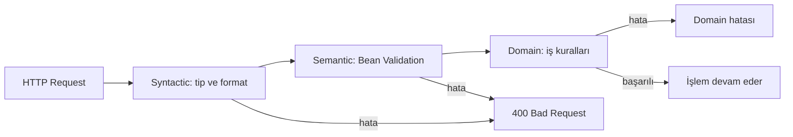
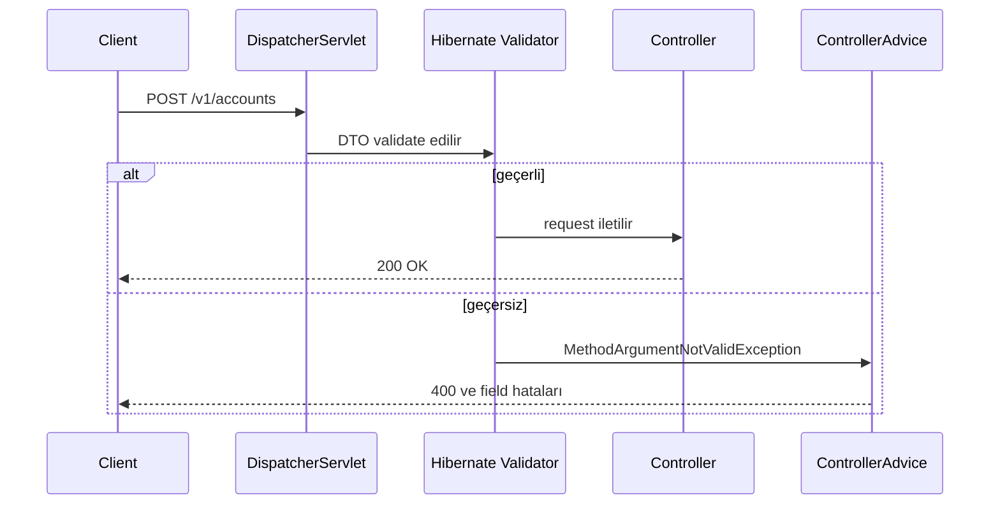
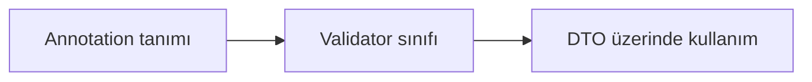
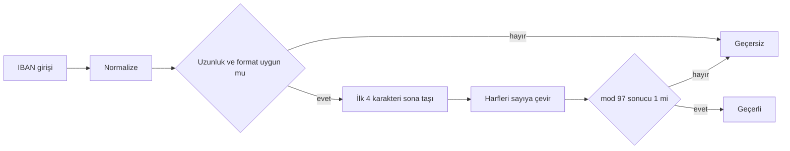

# Topic 1.6 — Validation: Bean Validation, custom validators

```admonish info title="Bu bölümde"
- Validation'ın 3 katmanını (syntactic, semantic, domain) ayırt edip her kuralı doğru katmana yerleştireceksin
- Jakarta Bean Validation'ın standart constraint'lerini banking DTO'larında kullanacaksın
- IBAN ve T.C. Kimlik No gibi banking-specific custom validator'lar yazacaksın
- Cross-field validation, validation group'ları ve composite annotation tekniklerini öğreneceksin
- Validation anti-pattern'lerini tanıyıp business logic'in validation'a sızmasını engelleyeceksin
```

## Hedef

Input validasyonunu **deklaratif** ve **kod-temiz** uygulamak: Jakarta Bean Validation'ın derin özellikleri, banking-specific validator'lar (IBAN, T.C. Kimlik No) ve aynı DTO'yu farklı senaryolarda farklı kurallarla kontrol etmek.

## Süre

Okuma: 1.5 saat • Kendini Sına: 30 dk • Pratik (opsiyonel): ~2.5 saat • Toplam: ~4.5 saat

## Önbilgi

- Topic 1.1-1.5 tamamlandı
- DTO ayrımı yapıldı
- `@Valid` ne anlama geldiğini sezgisel olarak biliyorsun

---

## Kavramlar

### 1. Neden validation katmanlı (input'a güvenmeme)

Banking'de "input'a güvenmek" bir güvenlik açığıdır. Client-side validation bypass edilebilir, API curl ile direkt çağrılabilir, hatta internal sistemler bile bug'lı veri üretebilir. Üstelik audit trail için "neden reddedildi" bilgisinin loglanması gerekir — yani reddetme işi sunucuda, kontrollü bir şekilde olmalı.

Peki her kuralı nereye yazacaksın? Validation'ı 3 katmana ayırıyoruz:

| Katman | Sorumluluğu | Örnek |
|---|---|---|
| **Syntactic** (input parser) | Tip, format, length | "amount sayı mı?", "currency 3 karakter mi?" |
| **Semantic** (DTO validation) | State'ten bağımsız değer kuralları | "amount > 0 mı?", "currency ISO listesinde mi?" |
| **Domain** (aggregate) | İş kuralları, state-bağımlı | "bakiye yeterli mi?", "hesap kapalı mı?" |

İlk iki katman **Bean Validation** ile, üçüncü katman **domain code** ile yapılır. Bu ayrımı karıştırmak bu bölümün en büyük tuzağı — bölüm sonundaki anti-pattern'lerde tekrar göreceğiz.



### 2. Jakarta Bean Validation — temel

Standart: JSR 380 (Jakarta Bean Validation 3.0). Implementation: **Hibernate Validator** — Spring Boot'un default'u, ekstra kurulum gerekmez.

İşin büyük kısmını **standart constraint'ler** karşılar. Tabloyu ezberleme; hangi ihtiyaca hangi annotation'ın karşılık geldiğini bil:

| Annotation | Anlamı |
|---|---|
| `@NotNull` | null olmamalı |
| `@NotBlank` | null veya boş string olmamalı (whitespace trim'leyerek) |
| `@NotEmpty` | null veya empty collection/string olmamalı (trim YAPMAZ) |
| `@Size(min=, max=)` | string/collection length |
| `@Min(value)`, `@Max(value)` | sayı için (long bazlı) |
| `@DecimalMin`, `@DecimalMax` | BigDecimal için |
| `@Positive`, `@PositiveOrZero` | sayı > 0 veya >= 0 |
| `@Negative`, `@NegativeOrZero` | sayı < 0 veya <= 0 |
| `@Digits(integer=, fraction=)` | sayı basamak kontrolü |
| `@Email` | email format (basit regex) |
| `@Pattern(regexp=)` | regex |
| `@Past`, `@PastOrPresent` | tarih geçmişte |
| `@Future`, `@FutureOrPresent` | tarih gelecekte |
| `@AssertTrue`, `@AssertFalse` | boolean |
| `@Valid` | nested object'i de validate et |

### 3. Banking örnekleri — built-in constraint'lerle

Kuru tablodan gerçek hayata geçelim. Hesap açma isteği şöyle görünür:

```java
public record OpenAccountRequest(
    @NotNull(message = "Owner ID is required")
    UUID ownerId,
    
    @NotBlank(message = "Currency is required")
    @Size(min = 3, max = 3, message = "Currency must be 3 characters")
    @Pattern(regexp = "^[A-Z]{3}$", message = "Currency must be uppercase ISO 4217")
    String currency,
    
    @DecimalMin(value = "0.00", message = "Opening balance cannot be negative")
    @Digits(integer = 19, fraction = 4, message = "Invalid amount format")
    BigDecimal openingBalance
) {}
```

Transfer isteği de aynı mantık — para field'ında `@DecimalMin` + `@DecimalMax` + `@Digits` üçlüsüne dikkat:

```java
public record TransferRequest(
    @NotNull UUID fromAccountId,
    @NotNull UUID toAccountId,
    
    @NotNull
    @DecimalMin(value = "0.01", message = "Amount must be positive")
    @DecimalMax(value = "999999999.99", message = "Amount exceeds maximum")
    @Digits(integer = 19, fraction = 4)
    BigDecimal amount,
    
    @NotBlank
    @Pattern(regexp = "^[A-Z]{3}$")
    String currency,
    
    @Size(max = 500, message = "Description too long")
    String description
) {}
```

<mark>BigDecimal için `@Min`/`@Max` değil `@DecimalMin`/`@DecimalMax` kullanıyoruz</mark> — long bazlı olanlar ondalık kesinliği kaybettirir.

### 4. `@Valid` etkinleştirme

Annotation'ları yazdın, ama tek başlarına hiçbir şey yapmazlar. Spring'e "bu parametreyi validate et" demen gerekir:

```java
@PostMapping
public AccountResponse openAccount(
    @Valid @RequestBody OpenAccountRequest request
) { ... }
```

```admonish warning title="Dikkat"
`@Valid` olmadan validation annotation'ları **çalışmaz**. Bu klasik bir junior tuzağı: DTO'ya annotation'ları yazarsın, testte her şey geçer, çünkü validation hiç tetiklenmemiştir.
```

Validation'ın request yaşam döngüsündeki yeri — controller'ına gelmeden önce olur:



### 5. Validation hata handling

Validation başarısız olunca Spring `MethodArgumentNotValidException` fırlatır. Default response şöyle bir şeydir:

```json
{
  "timestamp": "...",
  "status": 400,
  "error": "Bad Request",
  "trace": "...",
  "path": "/v1/accounts"
}
```

```admonish warning title="Dikkat"
Default response'ta stacktrace expose olabiliyor ve hangi field'ın neden reddedildiği belli değil — **banking için yeterli değil.** Topic 1.7'de RFC 7807 ProblemDetail ile düzgün handle edeceğiz.
```

Şimdilik geçici çözüm: field bazlı hataları toplayan basit bir `@RestControllerAdvice` — fikir şu: `ex.getBindingResult().getFieldErrors()` üzerinden dön, `field → message` map'i oluştur, 400 ile dön:

```java
@RestControllerAdvice
class ValidationExceptionHandler {
    
    @ExceptionHandler(MethodArgumentNotValidException.class)
    public ResponseEntity<Map<String, Object>> handleValidation(MethodArgumentNotValidException ex) {
        Map<String, String> fieldErrors = new HashMap<>();
        ex.getBindingResult().getFieldErrors().forEach(error ->
            fieldErrors.put(error.getField(), error.getDefaultMessage())
        );
        return ResponseEntity.badRequest().body(Map.of(
            "status", 400,
            "errors", fieldErrors
        ));
    }
}
```

### 6. Custom validation — `@IbanFormat`

Standart constraint'ler "3 büyük harf" gibi kuralları karşılar, ama IBAN checksum'ı gibi domain'e özgü format kurallarını karşılamaz. Banking'de IBAN doğrulamak o kadar yaygın ki, ilk custom validator'ın bu olacak.

**Custom validator** her zaman aynı 3 adımdır:



#### Adım 1: Annotation tanımı

```java
package com.mavibank.banking.common.validation;

import jakarta.validation.Constraint;
import jakarta.validation.Payload;
import java.lang.annotation.ElementType;
import java.lang.annotation.Retention;
import java.lang.annotation.RetentionPolicy;
import java.lang.annotation.Target;

@Target({ElementType.FIELD, ElementType.PARAMETER, ElementType.RECORD_COMPONENT})
@Retention(RetentionPolicy.RUNTIME)
@Constraint(validatedBy = IbanFormatValidator.class)
public @interface IbanFormat {
    String message() default "Invalid IBAN format";
    Class<?>[] groups() default {};
    Class<? extends Payload>[] payload() default {};
}
```

`message`, `groups`, `payload` üçlüsü Bean Validation kontratının zorunlu parçası — her custom annotation'da aynen bulunur.

#### Adım 2: Validator implementation

IBAN'ın matematiği: ilk 4 karakteri sona taşı, harfleri sayıya çevir (A=10, B=11, ...), çıkan dev sayının **mod 97**'si 1 olmalı.

Validator, `ConstraintValidator<IbanFormat, String>`'i implement eder. İlk iş guard clause'lar: null'a izin ver, boşlukları temizleyip uppercase'e normalize et, uzunluk ve kaba formatı kontrol et:

```java
public class IbanFormatValidator implements ConstraintValidator<IbanFormat, String> {
    
    @Override
    public boolean isValid(String iban, ConstraintValidatorContext context) {
        if (iban == null) return true;  // null kontrolü @NotNull işi
        
        String normalized = iban.replaceAll("\\s+", "").toUpperCase();
        if (normalized.length() < 15 || normalized.length() > 34) return false;
        if (!normalized.matches("^[A-Z]{2}\\d{2}[A-Z0-9]+$")) return false;
```

Kaba format geçtiyse asıl algoritma başlar: ilk 4 karakter (ülke kodu + kontrol hanesi) sona taşınır, sonra her harf sayısal karşılığına açılır — böylece IBAN tek bir dev sayıya dönüşür:

```java
        // Move first 4 chars to end
        String rearranged = normalized.substring(4) + normalized.substring(0, 4);
        
        // Replace letters with numbers (A=10, B=11, ...)
        StringBuilder numericForm = new StringBuilder();
        for (char c : rearranged.toCharArray()) {
            if (Character.isDigit(c)) {
                numericForm.append(c);
            } else {
                numericForm.append(c - 'A' + 10);
            }
        }
```

Sayı 34 haneye kadar çıkabildiği için `long`'a sığmaz — `BigInteger` şart. Son adım mod-97 kontrolü:

```java
        // Validate mod-97 == 1
        try {
            BigInteger value = new BigInteger(numericForm.toString());
            return value.mod(BigInteger.valueOf(97)).intValue() == 1;
        } catch (NumberFormatException e) {
            return false;
        }
    }
}
```

<details>
<summary>Tam kod: IbanFormatValidator (~39 satır)</summary>

```java
package com.mavibank.banking.common.validation;

import jakarta.validation.ConstraintValidator;
import jakarta.validation.ConstraintValidatorContext;
import java.math.BigInteger;

public class IbanFormatValidator implements ConstraintValidator<IbanFormat, String> {
    
    @Override
    public boolean isValid(String iban, ConstraintValidatorContext context) {
        if (iban == null) return true;  // null kontrolü @NotNull işi
        
        String normalized = iban.replaceAll("\\s+", "").toUpperCase();
        if (normalized.length() < 15 || normalized.length() > 34) return false;
        if (!normalized.matches("^[A-Z]{2}\\d{2}[A-Z0-9]+$")) return false;
        
        // Move first 4 chars to end
        String rearranged = normalized.substring(4) + normalized.substring(0, 4);
        
        // Replace letters with numbers (A=10, B=11, ...)
        StringBuilder numericForm = new StringBuilder();
        for (char c : rearranged.toCharArray()) {
            if (Character.isDigit(c)) {
                numericForm.append(c);
            } else {
                numericForm.append(c - 'A' + 10);
            }
        }
        
        // Validate mod-97 == 1
        try {
            BigInteger value = new BigInteger(numericForm.toString());
            return value.mod(BigInteger.valueOf(97)).intValue() == 1;
        } catch (NumberFormatException e) {
            return false;
        }
    }
}
```

</details>

Akışı görselleştirelim:



Buradaki incelik: validator null'a **izin verir**. <mark>Null kontrolü `@NotNull`'ın sorumluluğu</mark> — her constraint tek bir şeyi kontrol eder, böylece "optional ama girilirse geçerli IBAN" gibi kombinasyonlar kurulabilir.

#### Adım 3: Kullanım

```java
public record InternationalTransferRequest(
    @NotBlank @IbanFormat String fromIban,
    @NotBlank @IbanFormat String toIban,
    @NotNull @DecimalMin("0.01") BigDecimal amount,
    @NotBlank @Pattern(regexp = "^[A-Z]{3}$") String currency
) {}
```

### 7. Custom validation — `@TcKimlikNo` (TR'ye özgü)

TR bankacılığında müşteri kimliği demek T.C. Kimlik No demek: 11 hane, ilk hane 0 olamaz, son 2 hane checksum. Aynı 3 adımlı reçeteyle ikinci validator'ını yaz. Annotation tanımı IBAN'dakiyle birebir aynı kalıp:

```java
@Target({ElementType.FIELD, ElementType.PARAMETER, ElementType.RECORD_COMPONENT})
@Retention(RetentionPolicy.RUNTIME)
@Constraint(validatedBy = TcKimlikNoValidator.class)
public @interface TcKimlikNo {
    String message() default "Geçersiz T.C. Kimlik Numarası";
    Class<?>[] groups() default {};
    Class<? extends Payload>[] payload() default {};
}
```

Validator önce yapısal kontrolleri yapar (11 hane, hepsi rakam, ilk hane 0 değil) ve haneleri bir int dizisine açar:

```java
public class TcKimlikNoValidator implements ConstraintValidator<TcKimlikNo, String> {
    
    @Override
    public boolean isValid(String value, ConstraintValidatorContext context) {
        if (value == null) return true;
        if (value.length() != 11) return false;
        if (!value.matches("\\d{11}")) return false;
        if (value.charAt(0) == '0') return false;
        
        int[] digits = new int[11];
        for (int i = 0; i < 11; i++) {
            digits[i] = Character.getNumericValue(value.charAt(i));
        }
```

Asıl iş iki checksum'da: 10. hane tek/çift sıralı hanelerin ağırlıklı farkından, 11. hane ilk 10 hanenin toplamından türetilir:

```java
        // 10. hane checksum: (1+3+5+7+9. haneler toplamı * 7 - 2+4+6+8. haneler toplamı) mod 10
        int oddSum = digits[0] + digits[2] + digits[4] + digits[6] + digits[8];
        int evenSum = digits[1] + digits[3] + digits[5] + digits[7];
        int digit10 = ((oddSum * 7) - evenSum) % 10;
        if (digit10 < 0) digit10 += 10;
        if (digit10 != digits[9]) return false;
        
        // 11. hane checksum: ilk 10 hane toplamı mod 10
        int totalSum = 0;
        for (int i = 0; i < 10; i++) totalSum += digits[i];
        if (totalSum % 10 != digits[10]) return false;
        
        return true;
    }
}
```

<details>
<summary>Tam kod: TcKimlikNo + TcKimlikNoValidator (~40 satır)</summary>

```java
@Target({ElementType.FIELD, ElementType.PARAMETER, ElementType.RECORD_COMPONENT})
@Retention(RetentionPolicy.RUNTIME)
@Constraint(validatedBy = TcKimlikNoValidator.class)
public @interface TcKimlikNo {
    String message() default "Geçersiz T.C. Kimlik Numarası";
    Class<?>[] groups() default {};
    Class<? extends Payload>[] payload() default {};
}

public class TcKimlikNoValidator implements ConstraintValidator<TcKimlikNo, String> {
    
    @Override
    public boolean isValid(String value, ConstraintValidatorContext context) {
        if (value == null) return true;
        if (value.length() != 11) return false;
        if (!value.matches("\\d{11}")) return false;
        if (value.charAt(0) == '0') return false;
        
        int[] digits = new int[11];
        for (int i = 0; i < 11; i++) {
            digits[i] = Character.getNumericValue(value.charAt(i));
        }
        
        // 10. hane checksum: (1+3+5+7+9. haneler toplamı * 7 - 2+4+6+8. haneler toplamı) mod 10
        int oddSum = digits[0] + digits[2] + digits[4] + digits[6] + digits[8];
        int evenSum = digits[1] + digits[3] + digits[5] + digits[7];
        int digit10 = ((oddSum * 7) - evenSum) % 10;
        if (digit10 < 0) digit10 += 10;
        if (digit10 != digits[9]) return false;
        
        // 11. hane checksum: ilk 10 hane toplamı mod 10
        int totalSum = 0;
        for (int i = 0; i < 10; i++) totalSum += digits[i];
        if (totalSum % 10 != digits[10]) return false;
        
        return true;
    }
}
```

</details>

Java'da `%` operatörü negatif sonuç dönebilir — `digit10 < 0` düzeltmesi o yüzden var. Bu tarz köşe durumları için `@ParameterizedTest` şart (bölüm sonundaki "Pratik yapmak istersen" kısmında hazır test iskeletleri var).

### 8. Cross-field validation

Bazen kural tek field'a değil, iki field'ın **ilişkisine** bağlıdır: transfer'de `fromAccountId != toAccountId` gibi. Field-level annotation bunu göremez; iki yöntemin var.

**Yöntem 1: `@AssertTrue` method on DTO** — küçük işler için hızlı:

```java
public record TransferRequest(
    @NotNull UUID fromAccountId,
    @NotNull UUID toAccountId,
    @NotNull @DecimalMin("0.01") BigDecimal amount,
    @NotBlank @Pattern(regexp = "^[A-Z]{3}$") String currency
) {
    @AssertTrue(message = "From and to accounts must be different")
    @JsonIgnore
    public boolean isDifferentAccounts() {
        return fromAccountId != null && !fromAccountId.equals(toAccountId);
    }
}
```

```admonish warning title="Dikkat"
`@JsonIgnore` koy — yoksa Jackson `isDifferentAccounts` getter'ını serialize edip response JSON'ına `differentAccounts: true` diye yazar.
```

**Yöntem 2: Class-level custom annotation** — büyük projede daha temiz, çünkü kural DTO'nun içine gömülmez, yeniden kullanılabilir:

```java
@Target(ElementType.TYPE)
@Retention(RetentionPolicy.RUNTIME)
@Constraint(validatedBy = DifferentAccountsValidator.class)
public @interface DifferentAccounts {
    String message() default "Source and destination accounts must differ";
    Class<?>[] groups() default {};
    Class<? extends Payload>[] payload() default {};
}

public class DifferentAccountsValidator 
    implements ConstraintValidator<DifferentAccounts, TransferRequest> {
    
    @Override
    public boolean isValid(TransferRequest req, ConstraintValidatorContext ctx) {
        if (req == null) return true;
        return req.fromAccountId() == null || 
               !req.fromAccountId().equals(req.toAccountId());
    }
}

@DifferentAccounts
public record TransferRequest(...) {}
```

### 9. Validation group'ları — aynı DTO, farklı senaryolar

Aynı DTO bazen farklı endpoint'lerde farklı kurallara tabidir: "hesap aç"ta `id` olmamalı, "hesap güncelle"de zorunlu. **Validation group**'ları bunu tek DTO ile çözer:

```java
public interface OnCreate {}
public interface OnUpdate {}

public record AccountRequest(
    @Null(groups = OnCreate.class)
    @NotNull(groups = OnUpdate.class)
    UUID id,
    
    @NotNull(groups = OnCreate.class)
    UUID ownerId,
    
    @NotBlank(groups = OnCreate.class)
    @Pattern(regexp = "^[A-Z]{3}$", groups = OnCreate.class)
    String currency
) {}
```

Controller'da hangi group'un aktif olduğunu `@Validated` seçer:

```java
@PostMapping
public AccountResponse create(
    @Validated(OnCreate.class) @RequestBody AccountRequest request
) { ... }

@PutMapping("/{id}")
public AccountResponse update(
    @PathVariable UUID id,
    @Validated(OnUpdate.class) @RequestBody AccountRequest request
) { ... }
```

Fark önemli: <mark>`@Valid` standarttır ama group bilmez; `@Validated` Spring'e özgüdür ve group destekler</mark>.

```admonish tip title="İpucu"
**Banking pratiği:** Tek DTO + group genelde **karışıklığa** sebep olur — hangi field hangi senaryoda zorunlu, kod okuyarak anlaşılmaz. Daha temiz yol: her senaryo için ayrı DTO. Group'ları biliyor ol ama **kullanırken iki kere düşün.**
```

### 10. Constraint composition — birleşik annotation

`currency` field'ına her seferinde aynı 3 annotation'ı yazmak hem tekrar hem tutarsızlık riski. Kombinasyonu tek annotation'a topla:

```java
@NotBlank
@Size(min = 3, max = 3)
@Pattern(regexp = "^[A-Z]{3}$")
@Target({ElementType.FIELD, ElementType.PARAMETER, ElementType.RECORD_COMPONENT})
@Retention(RetentionPolicy.RUNTIME)
@Constraint(validatedBy = {})
public @interface IsoCurrencyCode {
    String message() default "Invalid ISO currency code";
    Class<?>[] groups() default {};
    Class<? extends Payload>[] payload() default {};
}
```

**Composite annotation**'da validator class yok (`validatedBy = {}`) — işi üzerindeki constraint'ler yapar. Kullanımı:

```java
public record OpenAccountRequest(
    @NotNull UUID ownerId,
    @IsoCurrencyCode String currency
) {}
```

```admonish tip title="İpucu"
Üç annotation tek annotation'a düştü. Aynı kombinasyonu 10 DTO'da kullanıyorsan değer; tek yerde kullanıyorsan gereksiz soyutlama.
```

### 11. Nested validation — `@Valid` ile cascade

DTO içinde başka DTO varsa validation otomatik içeri inmez — **cascade**'i açıkça istemen gerekir:

```java
public record AddressDto(
    @NotBlank String street,
    @NotBlank String city,
    @Pattern(regexp = "^\\d{5}$") String postalCode
) {}

public record CustomerRequest(
    @NotBlank String name,
    @TcKimlikNo String tcKimlikNo,
    @Valid AddressDto address          // ← @Valid cascade
) {}
```

```admonish warning title="Dikkat"
Field üzerinde `@Valid` olmadan `address`'in içindeki annotation'lar sessizce atlanır — hata da almazsın, validation da olmaz.
```

### 12. Programmatic validation — Validator bean'i

Input her zaman controller'dan gelmez: Kafka consumer, batch job, internal API. Bu akışlarda `Validator` bean'ini inject edip elle validate etmek banking'de standarttır:

```java
@Service
class TransferService {
    
    private final Validator validator;
    
    TransferService(Validator validator) {
        this.validator = validator;
    }
    
    public void someInternalMethod(TransferRequest req) {
        Set<ConstraintViolation<TransferRequest>> violations = validator.validate(req);
        if (!violations.isEmpty()) {
            throw new ConstraintViolationException(violations);
        }
    }
}
```

### 13. Method-level validation — `@Validated` class-level

Class'a `@Validated` koyarsan Spring, method parametrelerindeki constraint'leri de kontrol eder:

```java
@Service
@Validated
class AccountService {
    
    public Account openAccount(
        @NotNull OwnerId ownerId,
        @NotNull Currency currency,
        @DecimalMin("0.00") BigDecimal openingBalance
    ) {
        // ...
    }
}
```

İki tuzak: burada fırlatılan exception `ConstraintViolationException`'dır (`@Valid`'in tetiklediği `MethodArgumentNotValidException` değil — handler'ını ona göre yaz). Ve banking pratiğinde service layer'da method-level validation **tartışmalıdır**: çoğu ekip "domain code kendi precondition'ını kendi kontrol eder, Bean Validation DTO katmanında kalır" der.

### 14. Validation message i18n

TR bankalarında Türkçe + İngilizce mesaj desteği yaygın; hardcoded mesaj yerine **message key** kullan.

`messages.properties`:
```
account.currency.required=Para birimi zorunlu
account.currency.invalid=Geçersiz para birimi
```

DTO'da key'i süslü parantezle referansla:
```java
@NotBlank(message = "{account.currency.required}")
@Pattern(regexp = "^[A-Z]{3}$", message = "{account.currency.invalid}")
String currency
```

Spring'in `MessageSource`'unu validator'a bağlamak için:

```java
@Configuration
class ValidationConfig {
    
    @Bean
    MessageSource messageSource() {
        ReloadableResourceBundleMessageSource ms = new ReloadableResourceBundleMessageSource();
        ms.setBasename("classpath:messages");
        ms.setDefaultEncoding("UTF-8");
        return ms;
    }
    
    @Bean
    LocalValidatorFactoryBean validator(MessageSource messageSource) {
        LocalValidatorFactoryBean bean = new LocalValidatorFactoryBean();
        bean.setValidationMessageSource(messageSource);
        return bean;
    }
}
```

### 15. Validation anti-pattern'ler

Araçları öğrendin; şimdi yanlış kullanımlarını tanı.

**Anti-pattern 1: Business logic'i validation'a koymak**

```java
// ❌ Kötü
@AssertTrue
public boolean isWithinTransferLimit() {
    // External service çağrısı yapma!
    return limitService.getDailyLimit(fromAccountId).compareTo(amount) >= 0;
}
```

```admonish warning title="Dikkat"
Bean Validation **stateless** olmalı. External call yok, DB sorgusu yok. State'e dayalı kurallar (bakiye, limit, hesap durumu) domain logic'e aittir — bölüm başındaki 3 katman tablosunu hatırla.
```

**Anti-pattern 2: Her şeyi regex'e yıkmak**

```java
// ❌ Kötü
@Pattern(regexp = "^.{1,500}$")
String description;
```

`@Size(max = 500)` aynı işi yapar ve niyeti okuyana anlatır. Regex'i sadece gerçekten format kuralı olan yerlerde kullan.

**Anti-pattern 3: `@Email`'e fazla güvenmek**

`@Email` basit bir regex'tir, RFC 5322'yi tam uygulamaz. Banking'de gerçek email doğrulaması için `commons-validator` ya da DNS lookup gerekir.

**Anti-pattern 4: Validation'ı atlayıp input'a güvenmek**

```java
// ❌ Tehlikeli
public void process(String userInput) {
    // güveniyorum, hiç temizleme
    sql.execute("SELECT * FROM accounts WHERE name = '" + userInput + "'");
}
```

Banking'de **her input** validate + sanitize edilir: prepared statement, escape, whitelist. <mark>Validation güvenlik zincirinin ilk halkasıdır, son halkası değil</mark>.

---

## Önemli olabilecek araştırma kaynakları

- Jakarta Bean Validation 3.0 spec
- Hibernate Validator documentation
- Spring Boot validation reference
- "Spring Boot Validation" Baeldung serisi
- Apache Commons Validator (IBAN, ISIN, ISBN validators)
- IBAN format spec (ECBS)
- T.C. Kimlik No algoritması (NVI / İçişleri Bakanlığı)
- "Hexagonal Architecture" perspektifinden validation ne nerede olur tartışması

---

## Kendini Sına

Cevabı açmadan önce kendi cevabını sesli ya da yazılı olarak formüle et — mülakatta da öyle yapacaksın.

**S1. `@NotNull`, `@NotBlank` ve `@NotEmpty` arasındaki fark nedir? Bir string field için hangisini seçerdin?**

<details>
<summary>Cevabı göster</summary>

`@NotNull` sadece null olmamasını kontrol eder — `""` ve `"   "` geçer. `@NotEmpty` null ve boş olmamayı kontrol eder ama trim yapmaz — `"   "` yine geçer. `@NotBlank` ise null, boş ve sadece-whitespace string'leri reddeder. Bu yüzden kullanıcıdan gelen string field'lar için doğru seçim neredeyse her zaman `@NotBlank`'tir. `@NotEmpty` daha çok collection'lar için anlamlıdır ("liste en az 1 eleman içersin" gibi).

</details>

**S2. DTO'ya validation annotation'larını yazdın ama hiçbiri çalışmıyor. En olası iki sebep nedir?**

<details>
<summary>Cevabı göster</summary>

Birincisi: controller parametresinde `@Valid` (veya `@Validated`) yok — annotation'lar tek başına hiçbir şey yapmaz, Spring'e "bu parametreyi validate et" demen gerekir. İkincisi: kural nested bir DTO'nun içindeyse ve field üzerinde cascade `@Valid` yoksa, içerideki annotation'lar sessizce atlanır — hata da almazsın. İkisi de klasik junior tuzağıdır çünkü test yazmadıysan her şey "çalışıyor" görünür; validation hiç tetiklenmemiştir.

```java
public AccountResponse open(@Valid @RequestBody OpenAccountRequest req) { ... }

public record CustomerRequest(@Valid AddressDto address) {}  // cascade şart
```

</details>

**S3. Para tutan `BigDecimal` field'ında neden `@Min`/`@Max` değil `@DecimalMin`/`@DecimalMax` kullanılır?**

<details>
<summary>Cevabı göster</summary>

`@Min` ve `@Max` long bazlı çalışır; `BigDecimal`'e uygulandığında ondalık kesinlik kaybedilir — banking'de kuruş kaybı demektir. `@DecimalMin("0.01")` gibi string tabanlı sınırlar tam ondalık kesinlikle karşılaştırma yapar. Tipik banking üçlüsü: `@DecimalMin` + `@DecimalMax` + `@Digits(integer = 19, fraction = 4)` — hem aralığı hem basamak formatını zorlar.

</details>

**S4. Custom validator'lar (ör. `IbanFormatValidator`) null input için neden `true` döner?**

<details>
<summary>Cevabı göster</summary>

Çünkü her constraint tek bir şeyi kontrol etmelidir: null kontrolü `@NotNull`'ın sorumluluğudur, format kontrolü validator'ın. Validator null'a izin verince "optional ama girilirse geçerli IBAN olmalı" gibi kombinasyonlar kurabilirsin: sadece `@IbanFormat` yazarsın, zorunluysa yanına `@NotNull`/`@NotBlank` eklersin. Validator null'ı reddetseydi bu iki senaryoyu tek annotation'la ayrıştıramazdın.

</details>

**S5. Validator içinde neden DB'ye gidilmez veya external servis çağrılmaz? "Bakiye yeterli mi" kontrolü nereye ait?**

<details>
<summary>Cevabı göster</summary>

Bean Validation **stateless** olmalıdır: aynı input her zaman aynı sonucu vermeli, yan etkisi ve dış bağımlılığı olmamalıdır. Validation her request'te (bazen aynı DTO için birden fazla kez) çalışır — DB çağrısı hem performans sorunu yaratır hem de sonucu state'e bağlar. "Bakiye yeterli mi", "hesap kapalı mı" gibi state-bağımlı kurallar 3 katman modelinde **domain** katmanına aittir; Bean Validation sadece syntactic ve semantic katmanları kapsar. Ayrıca domain kuralının 400 yerine anlamlı bir domain hatası dönmesi gerekir — audit için de doğru yer orasıdır.

</details>

**S6. `@Valid` ile `@Validated` arasındaki fark nedir?**

<details>
<summary>Cevabı göster</summary>

`@Valid` Jakarta standardıdır; cascade (nested) validation'ı tetikler ama validation group bilmez. `@Validated` Spring'e özgüdür ve iki ek yetenek getirir: group seçimi (`@Validated(OnCreate.class)`) ve class-level kullanıldığında method parametrelerinin validate edilmesi. Dikkat: `@Validated` method-level validation'da `MethodArgumentNotValidException` değil `ConstraintViolationException` fırlatır — exception handler'ını ona göre yazman gerekir.

</details>

**S7. Cross-field validation'da `@AssertTrue` metoduna neden `@JsonIgnore` eklenir?**

<details>
<summary>Cevabı göster</summary>

`@AssertTrue` bir getter'a benzeyen method üzerinde çalışır (`isDifferentAccounts()` gibi). Jackson, bean convention gereği `is...` ile başlayan methodları property sanır ve serialize eder — response JSON'ında `"differentAccounts": true` gibi API kontratında olmayan bir alan belirir. `@JsonIgnore` bunu engeller. Alternatif ve büyük projede daha temiz yol: kuralı class-level custom annotation'a (`@DifferentAccounts`) taşımak — o zaman DTO'ya method eklenmez, kural yeniden kullanılabilir olur.

</details>

**S8. Composite annotation nedir? `@Constraint(validatedBy = {})` neden boş bırakılır ve ne zaman composite yazmaya değer?**

<details>
<summary>Cevabı göster</summary>

Composite annotation, tekrar eden constraint kombinasyonunu tek annotation'a toplar: `@IsoCurrencyCode` = `@NotBlank` + `@Size(3,3)` + `@Pattern("^[A-Z]{3}$")`. `validatedBy` boş kalır çünkü kendi validator logic'i yoktur — işi üzerine konan constraint'ler yapar. Değer analizi basit: aynı kombinasyonu 10 DTO'da kullanıyorsan hem tekrar hem tutarsızlık riskini yok eder; tek yerde kullanıyorsan gereksiz soyutlamadır.

</details>

---

## Tamamlama kriterleri

- [ ] Tüm request DTO'larda field-level validation annotation'ları
- [ ] `@IsoCurrencyCode` composite annotation yazıldı ve kullanılıyor
- [ ] `@IbanFormat` validator yazıldı, mod-97 algoritması anlaşıldı (defterimde yazılı)
- [ ] `@TcKimlikNo` validator yazıldı
- [ ] `TransferRequest`'te cross-field validation (different accounts)
- [ ] Validation `@ControllerAdvice` ile 400 response veriyor
- [ ] Curl ile manuel test yapıp 400 + field errors aldım
- [ ] Custom validator'lar için `@ParameterizedTest`'lerle test yazıldı
- [ ] Controller validation'ı `@WebMvcTest` ile test edildi
- [ ] Bean Validation içinde external call YOK
- [ ] Business rule validation'a sızdırılmamış (domain'de durur)

---

## Defter notları

1. "3 validation katmanı (syntactic, semantic, domain) farkları: ____."
2. "`@NotNull` ile `@NotBlank` farkı: ____."
3. "Custom validator yazmak için 3 adım: ____."
4. "IBAN mod-97 algoritması neden çalışır (kısaca): ____."
5. "T.C. Kimlik No checksum'ı neden son 2 hane: ____."
6. "Bean Validation içinde external call neden yapılmaz: ____."
7. "`@AssertTrue` ile `@JsonIgnore` neden birlikte: ____."
8. "Composite annotation ne işe yarar (örnek senaryo): ____."
9. "`@Valid` ile `@Validated` farkı: ____."
10. "Banking'de neden client-side validation'a güvenilmez: ____."

```admonish success title="Bölüm Özeti"
- Validation 3 katmandır: syntactic ve semantic Bean Validation ile, domain kuralları domain code ile — karıştırma
- Controller parametresinde `@Valid` olmadan hiçbir validation annotation'ı çalışmaz; nested DTO'lar için de cascade `@Valid` şart
- Custom validator 3 adımdır: annotation tanımı, `ConstraintValidator` implementasyonu, DTO'da kullanım — null kontrolü `@NotNull`'ın işidir, validator null'a izin verir
- IBAN mod-97 ve T.C. Kimlik No checksum gibi banking-specific kurallar custom validator olarak yazılır ve `@ParameterizedTest` ile test edilir
- Cross-field kontrol için `@AssertTrue` + `@JsonIgnore` veya class-level custom annotation kullan; tekrarlanan kombinasyonları composite annotation'a topla
- Bean Validation stateless kalmalı: external service çağrısı ve business kuralı validation'a asla sızmamalı
```

---

## Pratik yapmak istersen

Okuduklarını koda dökmek istersen aşağıdaki iki ek elinin altında: test iskeletleri ve yazdığın kodu Claude'a denetletmek için hazır prompt.

<details>
<summary>Test yazma rehberi</summary>

### Test 1.6.1 — `IbanFormatValidatorTest`

```java
class IbanFormatValidatorTest {
    
    private final IbanFormatValidator validator = new IbanFormatValidator();
    
    @ParameterizedTest
    @ValueSource(strings = {
        "TR320010009999901234567890",   // gerçek-format TR IBAN
        "DE89370400440532013000",       // Alman
        "GB29NWBK60161331926819",       // İngiltere
        "FR1420041010050500013M02606"   // Fransa
    })
    void shouldAcceptValidIbans(String iban) {
        assertThat(validator.isValid(iban, null)).isTrue();
    }
    
    @ParameterizedTest
    @ValueSource(strings = {
        "TR320010009999901234567891",   // checksum yanlış
        "TR3200100099999",              // çok kısa
        "tr320010009999901234567890",   // lowercase
        "TR32 0010 0099 9990 1234 5678 90",  // boşluklu - normalize edip kabul edebilir, karara göre
        "TR-32-..."                     // ayraçlı
    })
    void shouldRejectInvalidIbans(String iban) {
        // Bazıları normalization sonrası kabul edilebilir - test'in kararını yansıtsın
        boolean valid = validator.isValid(iban, null);
        // Eğer normalize ediyorsan: 4. test kabul edilebilir
        // Eğer etmiyorsan: hepsi reject
    }
    
    @Test
    void nullShouldBeAllowed() {
        // @NotNull ayrı kontrol — null'a izin ver
        assertThat(validator.isValid(null, null)).isTrue();
    }
}
```

### Test 1.6.2 — `TcKimlikNoValidatorTest`

```java
class TcKimlikNoValidatorTest {
    
    private final TcKimlikNoValidator validator = new TcKimlikNoValidator();
    
    @ParameterizedTest
    @ValueSource(strings = {
        "10000000146",  // sample valid (algoritma çıkışı)
        // Gerçek test verisi internet'te bulabilirsin — algorithm consistent
    })
    void shouldAcceptValidTcNos(String tcNo) {
        assertThat(validator.isValid(tcNo, null)).isTrue();
    }
    
    @ParameterizedTest
    @ValueSource(strings = {
        "00000000000",     // 0 ile başlar
        "1234567890",      // 10 hane
        "123456789012",    // 12 hane
        "abcdefghijk",     // harf
        "12345678901"      // checksum hatalı (büyük ihtimal)
    })
    void shouldRejectInvalidTcNos(String tcNo) {
        assertThat(validator.isValid(tcNo, null)).isFalse();
    }
    
    @Test
    void nullShouldBeAllowed() {
        assertThat(validator.isValid(null, null)).isTrue();
    }
}
```

### Test 1.6.3 — DTO-level validation (`@SpringBootTest` veya bağımsız `Validator`)

```java
class OpenAccountRequestValidationTest {
    
    private static Validator validator;
    
    @BeforeAll
    static void setUpValidator() {
        try (ValidatorFactory factory = Validation.buildDefaultValidatorFactory()) {
            validator = factory.getValidator();
        }
    }
    
    @Test
    void validRequestShouldPass() {
        var req = new OpenAccountRequest(UUID.randomUUID(), "TRY");
        Set<ConstraintViolation<OpenAccountRequest>> violations = validator.validate(req);
        assertThat(violations).isEmpty();
    }
    
    @Test
    void missingOwnerIdShouldFail() {
        var req = new OpenAccountRequest(null, "TRY");
        var violations = validator.validate(req);
        assertThat(violations).hasSize(1);
        assertThat(violations.iterator().next().getPropertyPath().toString()).isEqualTo("ownerId");
    }
    
    @Test
    void lowercaseCurrencyShouldFail() {
        var req = new OpenAccountRequest(UUID.randomUUID(), "try");
        var violations = validator.validate(req);
        assertThat(violations).isNotEmpty();
    }
    
    @Test
    void shortCurrencyShouldFail() {
        var req = new OpenAccountRequest(UUID.randomUUID(), "TR");
        var violations = validator.validate(req);
        assertThat(violations).isNotEmpty();
    }
}
```

### Test 1.6.4 — Controller validation integration (`@WebMvcTest`)

Topic 1.5'te yazdığın `AccountControllerTest`'i genişlet:

```java
@Test
void shouldReturn400WithFieldErrorWhenCurrencyInvalid() throws Exception {
    mockMvc.perform(post("/v1/accounts")
            .contentType(MediaType.APPLICATION_JSON)
            .content("""
                {
                  "ownerId": "%s",
                  "currency": "tr"
                }
                """.formatted(UUID.randomUUID())))
        .andExpect(status().isBadRequest())
        .andExpect(jsonPath("$.errors.currency").exists());
}
```

### Test 1.6.5 — Cross-field validation

```java
@Test
void transferRequestShouldRejectSameAccountIds() throws Exception {
    UUID sameId = UUID.randomUUID();
    
    mockMvc.perform(post("/v1/transfers")
            .header("Idempotency-Key", UUID.randomUUID().toString())
            .contentType(MediaType.APPLICATION_JSON)
            .content("""
                {
                  "fromAccountId": "%s",
                  "toAccountId": "%s",
                  "amount": "100.00",
                  "currency": "TRY"
                }
                """.formatted(sameId, sameId)))
        .andExpect(status().isBadRequest());
}
```

</details>

<details>
<summary>Claude-verify prompt</summary>

```
Aşağıdaki Bean Validation kodumu banking-grade kriterlere göre değerlendir. 
Sadece eksik veya yanlışları işaretle, kod yazma:

1. DTO validation kapsama:
   - Tüm request DTO'larda field'lara uygun validation annotation'ı var mı?
   - `@NotNull` ile `@NotBlank` doğru ayırt edilmiş mi (string için NotBlank)?
   - BigDecimal field'lar için `@DecimalMin`, `@Digits` kullanılmış mı (Min/Max DEĞİL)?
   - Currency code için `@Pattern("^[A-Z]{3}$")` veya composite annotation var mı?

2. Custom validator: IBAN
   - `@IbanFormat` annotation tanımı doğru mu (target, retention, validatedBy)?
   - `IbanFormatValidator` mod-97 algoritmasını implement ediyor mu?
   - Null kabul ediyor mu (`@NotNull` ayrı sorumluluktur)?
   - Length kontrolü 15-34 arasında mı?

3. Custom validator: TC Kimlik No
   - 11 hane kontrolü var mı?
   - İlk hane 0 olmaması kontrol ediliyor mu?
   - 10. ve 11. hane checksum algoritması uygulanmış mı?
   - Test edilmiş mi (gerçek geçerli + geçersiz)?

4. Composite annotation (`@IsoCurrencyCode`):
   - Annotation üstüne `@NotBlank`, `@Size`, `@Pattern` doğru kombine edilmiş mi?
   - Validator class belirtilmemiş (`@Constraint(validatedBy = {})`) mi (composite olduğu için)?

5. Cross-field validation:
   - `TransferRequest`'te `fromAccountId == toAccountId` kontrolü yapılıyor mu?
   - `@AssertTrue` ile yapılıyorsa `@JsonIgnore` eklenmiş mi (getter serialize edilmesin)?
   - Veya class-level custom annotation tercih edilmiş mi?

6. Controller setup:
   - Controller method'larında `@Valid` annotation'ı var mı?
   - `@RequestBody` doğru kullanılmış mı?
   - Validation exception handler (`@RestControllerAdvice`) yazılmış mı?
   - Hata response'unda field bazlı detay var mı?

7. Anti-pattern kontrolü:
   - Validation içinde external service çağrısı var mı? (Olmamalı — Bean Validation stateless)
   - Business kuralı validation'a yazılmış mı (örn. "yeterli bakiye var mı")? (Olmamalı — domain logic'e ait)
   - `@Email` ile gerçek email doğrulaması bekleniyor mu? (Yetersiz, banking için commons-validator)

8. Test coverage:
   - Custom validator'lar için unit test var mı?
   - Geçerli ve geçersiz örnekler `@ParameterizedTest` ile test edilmiş mi?
   - DTO-level validation Validator factory ile test edilmiş mi?
   - Controller test'inde validation 400 response'u test edilmiş mi?
   - Null input için validator'ın true döndürdüğü test edilmiş mi?

9. Banking-specific:
   - Para field'larında `@Digits(integer=19, fraction=4)` veya benzer kesinlik kontrolü var mı?
   - Description gibi uzun text field'lar için `@Size(max=...)` var mı?
   - Currency code regex (`^[A-Z]{3}$`) ile zorlanmış mı?

Her madde için PASS / FAIL / EKSIK işaretle. Kod yazmadan, sadece neyi düzeltmem 
gerektiğini söyle.
```

</details>
