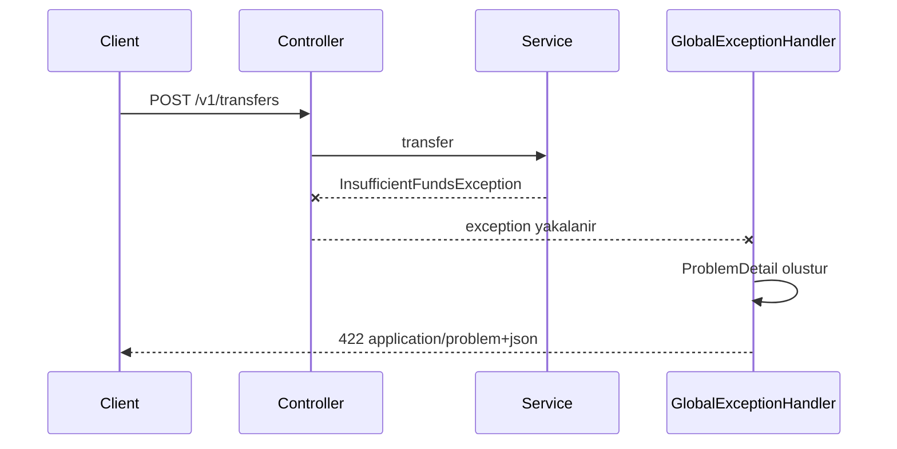
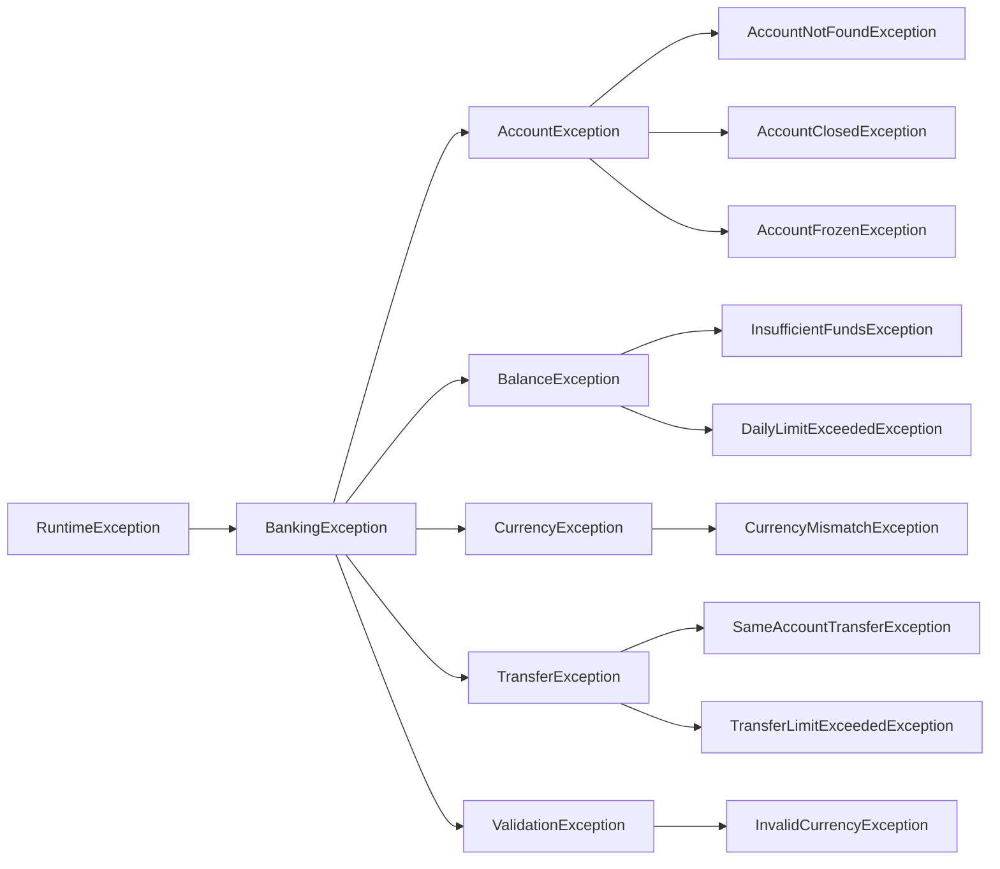
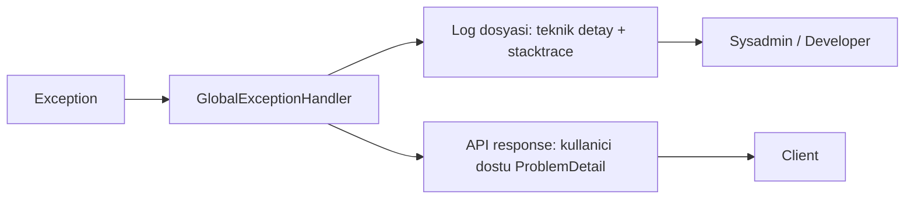
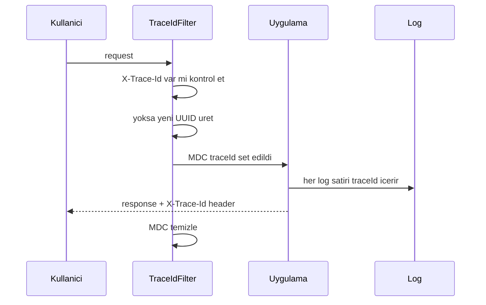

# Topic 1.7 — Hata Yönetimi: RFC 7807 ProblemDetail + @ControllerAdvice

```admonish info title="Bu bölümde"
- RFC 7807 Problem Details standardını ve 5 temel alanını (`type`, `title`, `status`, `detail`, `instance`) öğreneceksin
- Spring 6'nın `ProblemDetail` API'si ve `@RestControllerAdvice` ile global exception handler yazacaksın
- Banking'e uygun exception hiyerarşisi (`BankingException` base) ve stabil error code kataloğu tasarlayacaksın
- Information leak tuzaklarını (stacktrace, account enumeration) tanıyıp korunmayı göreceksin
- `TraceIdFilter` ile traceId üretip log ve response arasında iz sürmeyi kuracaksın
```

## Hedef

Hatalar için **tutarlı, standartlara uyumlu ve information-leak'siz** response'lar üretmek. RFC 7807 ProblemDetail'i Spring 6 API'siyle uygulayacak, domain exception'larını HTTP error'a haritalayacak ve banking-specific bir error catalog tasarlayacaksın.

## Süre

Okuma: 1.5 saat • Mini task: 2 saat • Test: 1 saat • Toplam: ~4.5 saat

## Önbilgi

- Topic 1.1-1.6 tamamlandı
- Validation handler'ı çalışıyor (Topic 1.6'nın basit handler'ı)
- Domain exception'larını biliyorsun (`InsufficientFundsException`, `CurrencyMismatchException`)

---

## Kavramlar

### 1. Hatanın anatomisi — kötü vs iyi

Bir API'nin kalitesi en çok hata anında belli olur: mutlu yol herkeste benzer, ama hata response'u ya kullanıcıyı kurtarır ya da saldırgana yol gösterir. Önce Spring Boot'un default davranışına bak:

```json
{
  "timestamp": "2025-05-12T10:30:00.123+00:00",
  "status": 500,
  "error": "Internal Server Error",
  "trace": "java.lang.NullPointerException...\n  at com.mavibank...",  // ← stacktrace
  "message": "Cannot invoke \"...\"",
  "path": "/v1/transfers"
}
```

Bunun neresi kötü?

- **Stacktrace expose** — internal class isimleri ve package yapısı sızıyor
- **Generic 500** — istemci ne yapacağını bilmiyor
- **Mesaj teknik ve İngilizce** — son kullanıcıya gösterilemez
- **Hata kodu yok** — programmatic karşılama imkânsız
- **Kategori yok** — retry mi, kullanıcıya soru mu, support çağrısı mı?

Aynı hata, RFC 7807'ye uyarlanmış banking versiyonuyla:

```json
{
  "type": "https://api.mavibank.com/problems/insufficient-funds",
  "title": "Yetersiz bakiye",
  "status": 422,
  "detail": "Hesabınızdaki bakiye yapmak istediğiniz işlem için yetersiz.",
  "instance": "/v1/transfers/abc-123",
  "code": "ACCOUNT_INSUFFICIENT_FUNDS",
  "accountId": "550e8400-...",
  "availableBalance": "500.00",
  "requestedAmount": "600.00",
  "currency": "TRY",
  "traceId": "abc12345-..."
}
```

Fark net: standart bir format, stacktrace yerine `traceId`, kullanıcıya gösterilebilir Türkçe `detail`, programmatic `code` ve client'ın ekranda kullanabileceği structured data (`availableBalance`, `requestedAmount`). Bu bölümün tamamı, bu ikinci response'u sistematik olarak üretmeyi öğretiyor.

### 2. RFC 7807 — Problem Details for HTTP APIs

Herkes kendi error formatını uydurursa her client her API için ayrı parser yazar; [RFC 7807](https://tools.ietf.org/html/rfc7807) bu kaosu bitiren standart. Beş standart alan tanımlar:

| Alan | Anlamı |
|---|---|
| `type` | Hata tipinin tanımına link veren URI (örn. `https://api.mavibank.com/problems/insufficient-funds`) |
| `title` | Kısa, insan-okur özet (örn. "Yetersiz bakiye") |
| `status` | HTTP status code (response status ile aynı) |
| `detail` | Bu özel hataya özgü, kullanıcıya gösterilebilir açıklama |
| `instance` | Hatanın oluştuğu kaynak URI'si (request path) |

Bunun üstüne **extension** alanları serbest: `code`, `traceId`, `availableBalance` gibi istediğini eklersin.

Dikkat edilecek detay: content type `application/problem+json` olmalı. Client bunu görünce "bu bir problem detail" deyip özel handle edebilir.

### 3. Spring 6 `ProblemDetail` API

Bu standardı elle JSON kurarak uygulamana gerek yok: Spring 6+ (Spring Boot 3+) `org.springframework.http.ProblemDetail` class'ıyla RFC 7807'yi hazır veriyor.

```java
ProblemDetail problem = ProblemDetail.forStatusAndDetail(
    HttpStatus.UNPROCESSABLE_ENTITY,
    "Hesabınızdaki bakiye yapmak istediğiniz işlem için yetersiz."
);
problem.setType(URI.create("https://api.mavibank.com/problems/insufficient-funds"));
problem.setTitle("Yetersiz bakiye");
problem.setInstance(URI.create("/v1/transfers/abc-123"));
problem.setProperty("code", "ACCOUNT_INSUFFICIENT_FUNDS");
problem.setProperty("availableBalance", "500.00");
problem.setProperty("requestedAmount", "600.00");
problem.setProperty("currency", "TRY");
```

Standart alanlar setter'la, extension'lar `setProperty` ile. Content type'ı da otomatik `application/problem+json` olur — elle uğraşmazsın.

### 4. `@RestControllerAdvice` — global exception handler

Her controller'da try-catch yazmak hem tekrar hem tutarsızlık üretir; çözüm, tüm exception'ları tek merkezde yakalamak. Domain exception fırlatıldığında controller'a değil, merkezi handler'a düşer ve orada ProblemDetail'e dönüşür:



Handler'ın iskeleti şöyle. İki örnek yeter — domain exception ve catch-all; diğer domain exception'lar (`AccountNotFoundException` → 404, `CurrencyMismatchException` → 422 vb.) birebir aynı kalıbı izler, validation'ı da bölüm 11'de göreceğiz:

```java
@RestControllerAdvice
class GlobalExceptionHandler {

    private static final Logger log = LoggerFactory.getLogger(GlobalExceptionHandler.class);

    @ExceptionHandler(InsufficientFundsException.class)
    ProblemDetail handle(InsufficientFundsException ex, HttpServletRequest request) {
        ProblemDetail problem = ProblemDetail.forStatusAndDetail(
            HttpStatus.UNPROCESSABLE_ENTITY,
            "Hesabınızdaki bakiye yetersiz."
        );
        problem.setType(URI.create("https://api.mavibank.com/problems/insufficient-funds"));
        problem.setTitle("Yetersiz bakiye");
        problem.setInstance(URI.create(request.getRequestURI()));
        problem.setProperty("code", "ACCOUNT_INSUFFICIENT_FUNDS");
        problem.setProperty("accountId", ex.getAccountId().value());
        problem.setProperty("availableBalance", ex.getAvailable().amount().toPlainString());
        problem.setProperty("requestedAmount", ex.getRequested().amount().toPlainString());
        problem.setProperty("currency", ex.getRequested().currency().getCurrencyCode());
        problem.setProperty("traceId", MDC.get("traceId"));
        return problem;
    }

    @ExceptionHandler(Exception.class)
    ProblemDetail handleUnexpected(Exception ex, HttpServletRequest request) {
        log.error("Unexpected error", ex);     // ← stacktrace log'a
        ProblemDetail problem = ProblemDetail.forStatusAndDetail(
            HttpStatus.INTERNAL_SERVER_ERROR,
            "Beklenmedik bir hata oluştu. Lütfen daha sonra tekrar deneyin."   // ← stacktrace YOK
        );
        problem.setType(URI.create("https://api.mavibank.com/problems/internal-error"));
        problem.setTitle("Sunucu hatası");
        problem.setInstance(URI.create(request.getRequestURI()));
        problem.setProperty("code", "INTERNAL_ERROR");
        problem.setProperty("traceId", MDC.get("traceId"));
        return problem;
    }
}
```

Catch-all handler'daki kalıba dikkat et: stacktrace **log'a** gider, response'a sadece generic mesaj + `traceId` yazılır. Bu, bölümün en kritik refleksi.

### 5. Exception hierarchy — banking için tasarım

Handler'ların düzgün çalışması için exception'ların da düzenli olması gerekir. Banking domain'inde ortak bir root (`BankingException`) ve kategori bazlı ara sınıflar kullanıyoruz:



Her exception bir HTTP status'a karşılık gelir — bu haritayı ezberleme, mantığını kavra: "kaynak yok" 404, "state uygun değil" 409, "istek anlaşıldı ama iş kuralı engelledi" 422, "istek bozuk" 400.

| Exception | Status |
|---|---|
| `AccountNotFoundException` | 404 Not Found |
| `AccountClosedException` | 409 Conflict (state conflict) |
| `AccountFrozenException` | 403 Forbidden (yetki sorunu gibi düşün) |
| `InsufficientFundsException` | 422 Unprocessable Entity |
| `CurrencyMismatchException` | 422 |
| `DailyLimitExceededException` | 422 |
| `InvalidCurrencyException` | 400 |

Yerleşim de önemli: exception'lar **domain'de** (`banking/.../domain/exception/`) durur, handler `adapter/in/web/`'de. Domain HTTP'den habersiz kalır.

### 6. `BankingException` — base class

Ortak base class'ın tek görevi var: her exception'ı stabil bir `code` ile fırlatmaya zorlamak.

```java
package com.mavibank.banking.common.domain.exception;

public abstract class BankingException extends RuntimeException {

    private final String code;

    protected BankingException(String code, String message) {
        super(message);
        this.code = code;
    }

    protected BankingException(String code, String message, Throwable cause) {
        super(message, cause);
        this.code = code;
    }

    public String getCode() {
        return code;
    }
}
```

Concrete exception, handler'ın kullanacağı context'i field olarak taşır:

```java
public class InsufficientFundsException extends BankingException {

    private final AccountId accountId;
    private final Money available;
    private final Money requested;

    public InsufficientFundsException(AccountId accountId, Money available, Money requested) {
        super("ACCOUNT_INSUFFICIENT_FUNDS",
              "Account %s has %s, requested %s".formatted(
                  accountId.value(), available, requested));
        this.accountId = accountId;
        this.available = available;
        this.requested = requested;
    }

    public AccountId getAccountId() { return accountId; }
    public Money getAvailable() { return available; }
    public Money getRequested() { return requested; }
}
```

```admonish warning title="Dikkat"
Exception message **internal log için**. Kullanıcıya gösterilecek mesaj `ProblemDetail.detail`'da durur — **i18n + lokalize**. İkisini karıştırma.
```

### 7. Error code catalog — banking standartı

Client (mobile/web) hata mesajı parse ederek karar veremez — mesaj değişir, çevirisi değişir. Karar mekanizması **stabil, programmatic code**'dur:

```java
public final class ErrorCodes {
    public static final String ACCOUNT_NOT_FOUND = "ACCOUNT_NOT_FOUND";
    public static final String ACCOUNT_CLOSED = "ACCOUNT_CLOSED";
    public static final String ACCOUNT_FROZEN = "ACCOUNT_FROZEN";
    public static final String INSUFFICIENT_FUNDS = "ACCOUNT_INSUFFICIENT_FUNDS";
    public static final String CURRENCY_MISMATCH = "CURRENCY_MISMATCH";
    public static final String DAILY_LIMIT_EXCEEDED = "DAILY_LIMIT_EXCEEDED";
    public static final String SAME_ACCOUNT_TRANSFER = "SAME_ACCOUNT_TRANSFER";
    public static final String VALIDATION_FAILED = "VALIDATION_FAILED";
    public static final String INVALID_CURRENCY = "INVALID_CURRENCY";
    public static final String IDEMPOTENCY_CONFLICT = "IDEMPOTENCY_CONFLICT";
    public static final String INTERNAL_ERROR = "INTERNAL_ERROR";

    private ErrorCodes() {}
}
```

Client bu code'lara göre özel ekran açar — örneğin `ACCOUNT_INSUFFICIENT_FUNDS` gelince "para yükle" butonu gösterir.

```admonish tip title="İpucu"
**Code naming kuralı:**
- UPPER_SNAKE_CASE
- Stabil — bir kez yayınlandı mı **asla değiştirme** (client'lar buna bağımlı)
- Açıklayıcı, kategori prefix'li (`ACCOUNT_`, `TRANSFER_`, `CARD_`)
```

### 8. Information leak — neyi göstermeyeceğin

Banking'de hata response'u aynı zamanda bir saldırı yüzeyidir: response'a yazdığın her detay, saldırganın haritasına eklenir.

```admonish warning title="Dikkat"
Banking'de **asla** API response'a sızdırılmayacak şeyler:

- **Stacktrace** (production'da)
- **Internal class/package isimleri**
- **DB schema isimleri** ("`column accounts.balance_amount` doesn't exist")
- **JVM versiyonu, OS bilgisi**
- **Connection string, hostname**
- **Başka kullanıcının bilgileri** (örn. "Account 123 belongs to user X — but you're user Y")
- **Sistemde bir hesabın varlığı/yokluğu** (account enumeration attack)
```

Production stratejisi tek cümle: `Exception.class` catch-all yakalanır, log'a tam detay, response'a generic mesaj + `traceId`.

Listenin son maddesi ayrı bir tuzak hak ediyor: **account enumeration**. Şu masum görünen handler'a bak:

```java
@ExceptionHandler(AccountNotFoundException.class)
ProblemDetail handle(AccountNotFoundException ex, ...) {
    ProblemDetail p = ProblemDetail.forStatusAndDetail(NOT_FOUND, "Hesap bulunamadı");
    p.setProperty("accountId", ex.getAccountId().value());  // ← TEHLİKE
    return p;
}
```

```admonish warning title="Dikkat"
Saldırgan farklı `accountId`'ler dener: hangileri 404, hangileri 401/403 dönüyor diye bakar. Status ayrımından, sistemde hangi hesapların **var olduğunu** öğrenir.
```

Çözüm iki adım. Önce authentication kontrol edilir — başarısızsa **401 önce döner**. Sonra "erişim yok" ile "kaynak yok" aynı yanıtı verir:

```java
// Better
@ExceptionHandler({AccountNotFoundException.class, AccessDeniedException.class})
ProblemDetail handleNotFoundOrForbidden(...) {
    return ProblemDetail.forStatusAndDetail(NOT_FOUND, "İstenilen kaynak bulunamadı.");
    // Erişim yok mu, kaynak yok mu — ayrım yapma
}
```

Phase 8'de (Security) bunu tam olarak handle edeceğiz; şimdilik refleksi kazan.

### 9. Logging vs response — iki muhatap

Peki detayları response'a yazamıyorsak sorunu nasıl çözeceğiz? Cevap: bir exception'ın iki muhatabı olduğunu kabul ederek. **Client** kullanıcı dostu response alır, **sysadmin/developer** log'da teknik detayı bulur.



Kod düzeyinde ayrım şöyle görünür — beklenen domain hatası WARN + structured context, beklenmedik hata ERROR + stacktrace:

```java
@ExceptionHandler(InsufficientFundsException.class)
ProblemDetail handle(InsufficientFundsException ex, HttpServletRequest request) {
    log.warn("Insufficient funds: account={}, available={}, requested={}",
        ex.getAccountId(), ex.getAvailable(), ex.getRequested());

    ProblemDetail problem = ProblemDetail.forStatusAndDetail(...);  // user-friendly
    return problem;
}
```

Catch-all tarafını bölüm 4'te zaten gördün: `log.error("Unexpected error", ex)` ile stacktrace log'a, response'a generic mesaj. İki muhatabı birbirine bağlayan köprü ise `traceId` — sıradaki konu.

### 10. Trace ID propagation

Production'da kullanıcı "hata aldım" dediğinde log yığınında o hatayı nasıl bulacaksın? Akış şu:

1. Kullanıcı response'taki `traceId`'yi (veya `code`'u) paylaşır
2. Sysadmin log'larda `traceId`'yi arar
3. Tam stacktrace'i bulur, sorunu çözer

`traceId` her request'in başında üretilir, MDC ile her log satırına girer, response'a da yazılır:



Filter implementasyonu:

```java
@Component
@Order(Ordered.HIGHEST_PRECEDENCE)
class TraceIdFilter implements Filter {

    @Override
    public void doFilter(ServletRequest req, ServletResponse res, FilterChain chain)
            throws IOException, ServletException {
        String traceId = ((HttpServletRequest) req).getHeader("X-Trace-Id");
        if (traceId == null || traceId.isBlank()) {
            traceId = UUID.randomUUID().toString();
        }
        MDC.put("traceId", traceId);
        ((HttpServletResponse) res).setHeader("X-Trace-Id", traceId);
        try {
            chain.doFilter(req, res);
        } finally {
            MDC.remove("traceId");
        }
    }
}
```

`finally` bloğundaki `MDC.remove`'a dikkat: thread'ler pool'dan geri dönüşümlü kullanılır, temizlemezsen bir sonraki request eski traceId'yi miras alır.

Logback pattern'ine MDC'yi ekle:

```yaml
logging:
  pattern:
    console: "%d{HH:mm:ss.SSS} [%X{traceId:-no-trace}] %-5level [%thread] %logger{36} - %msg%n"
```

Phase 9'da (Observability) full distributed tracing'i OpenTelemetry ile kuracağız; Phase 1'de bu basit traceId yeterli.

### 11. Spring Boot 3 — ResponseEntityExceptionHandler

Spring'in kendi fırlattığı exception'lar (`MethodArgumentNotValidException`, `HttpMessageNotReadableException` vb.) için sıfırdan handler yazmak yerine `ResponseEntityExceptionHandler` extend etmek daha temiz — built-in exception'ların hepsi için override edilebilir hazır metotlar sunar:

```java
@RestControllerAdvice
class GlobalExceptionHandler extends ResponseEntityExceptionHandler {

    // Override built-in handlers if needed
    @Override
    protected ResponseEntity<Object> handleMethodArgumentNotValid(
        MethodArgumentNotValidException ex,
        HttpHeaders headers,
        HttpStatusCode status,
        WebRequest request) {

        ProblemDetail problem = ProblemDetail.forStatusAndDetail(
            HttpStatus.BAD_REQUEST,
            "İstek doğrulama hatalı."
        );
        problem.setType(URI.create("https://api.mavibank.com/problems/validation-failed"));
        problem.setTitle("Doğrulama hatası");
        problem.setProperty("code", "VALIDATION_FAILED");

        Map<String, String> errors = new HashMap<>();
        ex.getBindingResult().getFieldErrors().forEach(e ->
            errors.put(e.getField(), e.getDefaultMessage())
        );
        problem.setProperty("fieldErrors", errors);
        problem.setProperty("traceId", MDC.get("traceId"));

        return ResponseEntity.badRequest()
            .contentType(MediaType.APPLICATION_PROBLEM_JSON)
            .body(problem);
    }

    // Domain exception'ları için ayrı @ExceptionHandler'lar
    @ExceptionHandler(InsufficientFundsException.class)
    ResponseEntity<ProblemDetail> handle(InsufficientFundsException ex, HttpServletRequest req) {
        // ...
    }
}
```

### 12. Error response example collection — kataloğun

Error code'lar sadece kodda yaşamaz; client ve partner ekipleri için dokümante edilir. `docs/error-catalog.md` dosyası tut, her error code için şu formatta bir bölüm yaz:

````markdown
## ACCOUNT_INSUFFICIENT_FUNDS
**Status:** 422 Unprocessable Entity
**Description:** Hesapta yapılmak istenen işlem için yeterli bakiye yok.
**HTTP Response Example:**
```json
{
  "type": "https://api.mavibank.com/problems/insufficient-funds",
  "title": "Yetersiz bakiye",
  "status": 422,
  "detail": "Hesabınızdaki bakiye yapmak istediğiniz işlem için yetersiz.",
  "code": "ACCOUNT_INSUFFICIENT_FUNDS",
  "accountId": "550e8400-...",
  "availableBalance": "500.00",
  "requestedAmount": "600.00",
  "currency": "TRY",
  "traceId": "abc12345"
}
```

**Client handling:** Show "Insufficient funds" screen with "Top up" button.
**Retry:** Not automatic — user action required.
````

Banking ekiplerinde error catalog **publicly documented** olur; client ve partner ekipleri entegrasyonu buradan yazar.

### 13. Logging levels — banking pratiği

Her hatayı ERROR'la loglamak, hiçbirini loglamamak kadar kötü — alarm yorgunluğu yaratır. Hangi exception hangi level'da:

| Exception | Log level |
|---|---|
| Domain validation hatası (`InsufficientFundsException`) | WARN |
| 4xx (client hatası) | INFO veya DEBUG |
| 500 unexpected | ERROR + stacktrace |
| Security violation (`AccessDeniedException`) | WARN veya ERROR (security team monitoring) |
| Recoverable infra issue (DB connection timeout, retried) | WARN |
| Unrecoverable | ERROR |

```admonish tip title="İpucu"
**Kural:** ERROR sadece operator'ın bakması gereken durumlar için. Her 422'yi ERROR yazarsan log'lar yararsızlaşır.
```

### 14. Exception throwing kuralları — banking

Kapanış olarak, exception fırlatırken uyacağın 5 kural:

1. **Domain-specific exception fırlat**, generic `RuntimeException` değil
2. **Context bilgisi ekle** (accountId, amount) — handler kullanabilsin
3. **Unchecked exception** kullan — checked exception'lar boilerplate yaratır, banking domain akışında da kazandırdığı bir şey yok
4. **`toString` implementasyonunu sıkı tut** — sensitive bilgi sızıyor mu kontrol et
5. **Stacktrace'i log'a yaz, response'a asla yazma**

---

## Önemli olabilecek araştırma kaynakları

- RFC 7807 — "Problem Details for HTTP APIs" (full text)
- Spring `ProblemDetail` Javadoc
- Spring `ResponseEntityExceptionHandler` source code (Spring 6'da incelenmeli)
- "Designing Web APIs" — error handling chapter
- OWASP "Improper Error Handling" guide
- "Information Disclosure" OWASP A01:2021 öncesi
- Stripe API documentation — error model (banking reference)
- Anthropic / OpenAI API error model (modern API tasarım örneği)
- SLF4J MDC documentation
- Spring Boot 3 Migration Guide — `ProblemDetail` adoption section

---

## Mini task'ler

### Task 1.7.1 — Domain exception'larını yaz (30 dk)

`banking/common/domain/exception/BankingException.java` (abstract base).

`banking/account/domain/exception/`:
- `AccountNotFoundException(AccountId)`
- `AccountClosedException(AccountId)`
- `AccountFrozenException(AccountId)`
- `InsufficientFundsException(AccountId, Money available, Money requested)`

`banking/common/domain/exception/`:
- `CurrencyMismatchException(Currency expected, Currency actual)`

`banking/transfer/domain/exception/`:
- `SameAccountTransferException(AccountId)`

Hepsi `BankingException` extend etsin, `code` field'ı set etsin.

### Task 1.7.2 — `ErrorCodes` catalog class'ı (10 dk)

`banking/common/error/ErrorCodes.java` yaz (yukarıda örnek). Tüm error code'ları tek yerde topla.

### Task 1.7.3 — `GlobalExceptionHandler` yaz (60 dk)

`banking/common/adapter/in/web/GlobalExceptionHandler.java`:

- `extends ResponseEntityExceptionHandler`
- `@RestControllerAdvice`
- `@ExceptionHandler` her domain exception için
- Override `handleMethodArgumentNotValid` (validation 400)
- `@ExceptionHandler(Exception.class)` catch-all → 500, stacktrace log, generic response

Her handler:
- `ProblemDetail` döndür
- `type`, `title`, `detail`, `instance` set
- `code` property
- `traceId` property (MDC'den)
- Domain-specific property'ler (accountId, available, requested)

### Task 1.7.4 — `TraceIdFilter` (20 dk)

`banking/common/adapter/in/web/filter/TraceIdFilter.java` yaz. `@Component @Order(HIGHEST_PRECEDENCE)` ile en başta çalışsın.

Logback pattern'ini güncelle:
```yaml
logging:
  pattern:
    console: "%d{HH:mm:ss.SSS} [%X{traceId:-no-trace}] %-5level [%thread] %logger{36} - %msg%n"
```

Bir endpoint çağır, response'da `X-Trace-Id` header'ını gör. Log'da aynı traceId'nin geçtiğini doğrula.

### Task 1.7.5 — Tamamlama: tüm exception'ları map et (30 dk)

Bu listede her birini handle et:

- `InsufficientFundsException` → 422 + tüm detay
- `AccountNotFoundException` → 404 + accountId
- `AccountClosedException` → 409 (state conflict)
- `AccountFrozenException` → 403
- `CurrencyMismatchException` → 422
- `SameAccountTransferException` → 422
- `InvalidCurrencyException` → 400
- `HttpMessageNotReadableException` (JSON parse hatası — Spring built-in) → 400
- `MethodArgumentTypeMismatchException` (UUID parse fail) → 400
- `NoHandlerFoundException` (404 endpoint) → 404
- `Exception.class` (catch-all) → 500

Her biri için **ayrı `@ExceptionHandler` method** yaz.

### Task 1.7.6 — Error catalog dökümanı (15 dk)

`docs/error-catalog.md` yaz. Yukarıdaki örnek formatı kullan. **Her ErrorCode için** bir bölüm. Banking'in real-life dokümantasyonu bu — alışkanlık kazan.

### Task 1.7.7 — Manuel test (15 dk)

Curl ile error scenarios test et:

```bash
# 1. Validation error (currency invalid)
curl -X POST http://localhost:8080/v1/accounts \
  -H "Content-Type: application/json" \
  -d '{"currency": "tr"}'

# 2. Not found
curl http://localhost:8080/v1/accounts/00000000-0000-0000-0000-000000000000

# 3. Bad JSON
curl -X POST http://localhost:8080/v1/accounts \
  -H "Content-Type: application/json" \
  -d 'not even json'

# 4. UUID parse fail
curl http://localhost:8080/v1/accounts/not-a-uuid
```

Her response için:
- Content-Type `application/problem+json` mı?
- `type`, `title`, `status`, `detail`, `instance` doğru mu?
- `code` ve `traceId` var mı?
- 500 hatasında stacktrace **YOK** mu (yalnızca log'da)?

Sonuçları **defterine** yapıştır.

---

## Test yazma rehberi

### Test 1.7.1 — Exception handler integration (`@WebMvcTest`)

```java
@WebMvcTest(controllers = {AccountController.class, GlobalExceptionHandler.class})
class GlobalExceptionHandlerTest {

    @Autowired
    private MockMvc mockMvc;

    @MockBean
    private OpenAccountUseCase openAccountUseCase;

    @MockBean
    private GetAccountUseCase getAccountUseCase;

    @MockBean
    private AccountWebMapper mapper;

    @Test
    void insufficientFundsShouldReturn422() throws Exception {
        UUID accountId = UUID.randomUUID();
        when(getAccountUseCase.execute(any())).thenThrow(
            new InsufficientFundsException(
                new AccountId(accountId),
                Money.of("500.00", "TRY"),
                Money.of("600.00", "TRY")
            )
        );

        mockMvc.perform(get("/v1/accounts/" + accountId))
            .andExpect(status().isUnprocessableEntity())
            .andExpect(content().contentType(MediaType.APPLICATION_PROBLEM_JSON))
            .andExpect(jsonPath("$.type").value("https://api.mavibank.com/problems/insufficient-funds"))
            .andExpect(jsonPath("$.title").value("Yetersiz bakiye"))
            .andExpect(jsonPath("$.status").value(422))
            .andExpect(jsonPath("$.code").value("ACCOUNT_INSUFFICIENT_FUNDS"))
            .andExpect(jsonPath("$.accountId").value(accountId.toString()))
            .andExpect(jsonPath("$.availableBalance").value("500.00"))
            .andExpect(jsonPath("$.requestedAmount").value("600.00"))
            .andExpect(jsonPath("$.currency").value("TRY"))
            .andExpect(jsonPath("$.traceId").exists());
    }

    @Test
    void accountNotFoundShouldReturn404() throws Exception {
        UUID accountId = UUID.randomUUID();
        when(getAccountUseCase.execute(any())).thenThrow(
            new AccountNotFoundException(new AccountId(accountId))
        );

        mockMvc.perform(get("/v1/accounts/" + accountId))
            .andExpect(status().isNotFound())
            .andExpect(content().contentType(MediaType.APPLICATION_PROBLEM_JSON))
            .andExpect(jsonPath("$.code").value("ACCOUNT_NOT_FOUND"));
    }

    @Test
    void validationErrorShouldReturn400() throws Exception {
        mockMvc.perform(post("/v1/accounts")
                .contentType(MediaType.APPLICATION_JSON)
                .content("{}"))
            .andExpect(status().isBadRequest())
            .andExpect(content().contentType(MediaType.APPLICATION_PROBLEM_JSON))
            .andExpect(jsonPath("$.code").value("VALIDATION_FAILED"))
            .andExpect(jsonPath("$.fieldErrors").exists());
    }

    @Test
    void invalidJsonShouldReturn400() throws Exception {
        mockMvc.perform(post("/v1/accounts")
                .contentType(MediaType.APPLICATION_JSON)
                .content("not json"))
            .andExpect(status().isBadRequest())
            .andExpect(jsonPath("$.title").exists());
    }

    @Test
    void invalidUuidShouldReturn400() throws Exception {
        mockMvc.perform(get("/v1/accounts/not-a-uuid"))
            .andExpect(status().isBadRequest());
    }

    @Test
    void unexpectedExceptionShouldReturn500WithoutStacktrace() throws Exception {
        when(getAccountUseCase.execute(any())).thenThrow(
            new RuntimeException("Unexpected DB error with sensitive info")
        );

        UUID id = UUID.randomUUID();
        mockMvc.perform(get("/v1/accounts/" + id))
            .andExpect(status().isInternalServerError())
            .andExpect(jsonPath("$.code").value("INTERNAL_ERROR"))
            // detail her zaman generic olmalı — exception message'ı LEAK ETMEMELİ
            .andExpect(jsonPath("$.detail").value("Beklenmedik bir hata oluştu. Lütfen daha sonra tekrar deneyin."))
            .andExpect(content().string(not(containsString("Unexpected DB error"))));
    }

    @Test
    void responseShouldIncludeTraceId() throws Exception {
        UUID id = UUID.randomUUID();
        when(getAccountUseCase.execute(any())).thenThrow(
            new AccountNotFoundException(new AccountId(id))
        );

        mockMvc.perform(get("/v1/accounts/" + id))
            .andExpect(header().exists("X-Trace-Id"))
            .andExpect(jsonPath("$.traceId").exists());
    }
}
```

### Test 1.7.2 — `TraceIdFilterTest`

```java
class TraceIdFilterTest {

    @Test
    void shouldGenerateNewTraceIdWhenNotProvided() throws Exception {
        TraceIdFilter filter = new TraceIdFilter();
        var req = new MockHttpServletRequest();
        var res = new MockHttpServletResponse();
        var chain = new MockFilterChain();

        filter.doFilter(req, res, chain);

        String traceId = res.getHeader("X-Trace-Id");
        assertThat(traceId).isNotNull();
        assertThat(UUID.fromString(traceId)).isNotNull();   // valid UUID
    }

    @Test
    void shouldPreserveProvidedTraceId() throws Exception {
        TraceIdFilter filter = new TraceIdFilter();
        var req = new MockHttpServletRequest();
        req.addHeader("X-Trace-Id", "incoming-trace-id");
        var res = new MockHttpServletResponse();
        var chain = new MockFilterChain();

        filter.doFilter(req, res, chain);

        assertThat(res.getHeader("X-Trace-Id")).isEqualTo("incoming-trace-id");
    }

    @Test
    void shouldCleanUpMdcAfterRequest() throws Exception {
        TraceIdFilter filter = new TraceIdFilter();
        var req = new MockHttpServletRequest();
        var res = new MockHttpServletResponse();
        var chain = new MockFilterChain();

        filter.doFilter(req, res, chain);

        assertThat(MDC.get("traceId")).isNull();
    }
}
```

---

## Claude-verify prompt

```
Aşağıdaki hata yönetimi kodumu banking-grade kriterlere göre değerlendir. Sadece 
eksik veya yanlışları işaretle, kod yazma:

1. Exception hierarchy:
   - `BankingException` base abstract class var mı?
   - Her domain exception code field'ı ile yapılandırılmış mı?
   - Generic `RuntimeException` direkt fırlatılan yer var mı? (Olmamalı)
   - Exception'lar domain paketinde mi?
   - Context bilgisi (accountId, amount, vb.) exception field'larına eklenmiş mi?

2. ProblemDetail / RFC 7807:
   - `ProblemDetail` API'si Spring 6'dan kullanılmış mı (custom error response class DEĞİL)?
   - `type` field'ı stable URL mu (api.mavibank.com/problems/...)?
   - `title` insan-okuyabilir mi?
   - `detail` kullanıcıya gösterilebilir mi (teknik jargon, internal info YOK)?
   - `instance` request path'i içeriyor mu?
   - `code` property'si her response'ta var mı?
   - `traceId` property'si var mı?

3. Status code'lar:
   - InsufficientFunds → 422 mi?
   - CurrencyMismatch → 422 mi?
   - AccountNotFound → 404 mü?
   - AccountClosed → 409 mu?
   - Validation error → 400 mü?
   - Unexpected → 500 mü?

4. Information leak:
   - 500 response'unda stacktrace VAR MI? (Olmamalı)
   - 500 response'unda exception message VAR MI? (Olmamalı — generic mesaj)
   - DB schema/internal class isimleri response'ta sızıyor mu? (Olmamalı)
   - Account enumeration koruması var mı (404 vs 403 ayrımı yok)?

5. Logging:
   - 500 hatasında log'a stacktrace yazılıyor mu (`log.error("...", ex)`)?
   - Domain validation hatalarında WARN seviyesi mi (ERROR DEĞİL)?
   - traceId log pattern'ine MDC ile eklenmiş mi?

6. Trace ID:
   - `TraceIdFilter` `@Order(HIGHEST_PRECEDENCE)` ile en başta mı?
   - Incoming `X-Trace-Id` header varsa korunuyor mu?
   - Yoksa yeni UUID üretiliyor mu?
   - Response header'a `X-Trace-Id` yazılıyor mu?
   - MDC `traceId` request sonunda temizleniyor mu (memory leak)?

7. Error catalog:
   - `ErrorCodes` class'ı public static final string'lerle tüm code'ları topluyor mu?
   - Code naming UPPER_SNAKE_CASE mi?
   - Kategorize prefix var mı (`ACCOUNT_`, `TRANSFER_`)?
   - `docs/error-catalog.md` dokümantasyonu yazılmış mı?

8. Test:
   - Her exception için handler test edilmiş mi?
   - 500 response'ta stacktrace olmadığını DOĞRULAYAN test var mı?
   - `Content-Type: application/problem+json` test edilmiş mi?
   - `traceId` response'ta varlığı test edilmiş mi?
   - Validation 400 detayı (fieldErrors) test edilmiş mi?
   - Bad JSON, invalid UUID gibi Spring built-in exception'lar handle ediliyor mu?

9. Banking-specific:
   - Bütün domain exception'ları ele alınmış mı (handler eksik kalmamış)?
   - Generic `Exception.class` catch-all en son mu (specific'ler önce)?
   - `BindingResult` field error'ları structured olarak property'ye eklenmiş mi?

Her madde için PASS / FAIL / EKSIK işaretle, sebep açıkla. Kod yazma.
```

---

## Tamamlama kriterleri

- [ ] `BankingException` abstract base ve concrete exception'lar yazıldı
- [ ] `ErrorCodes` catalog class'ı
- [ ] `GlobalExceptionHandler` tüm domain exception'larını ProblemDetail ile handle ediyor
- [ ] Spring built-in exception'lar (`MethodArgumentNotValid`, `HttpMessageNotReadable`, `MethodArgumentTypeMismatch`) handle ediliyor
- [ ] `Exception.class` catch-all 500 + generic mesaj, stacktrace log'a, NO LEAK
- [ ] `TraceIdFilter` çalışıyor, log pattern'inde traceId görünüyor
- [ ] Response header `X-Trace-Id` set ediliyor
- [ ] `docs/error-catalog.md` her error code için bölüm
- [ ] Curl ile manuel test yapıldı, response'lar **defterimde**
- [ ] `@WebMvcTest` ile handler integration test yazıldı (8+ test)
- [ ] 500 hatası test edildi — stacktrace response'ta YOK
- [ ] Content-Type `application/problem+json` her error response'ta

---

## Defter notları

1. "RFC 7807'nin 5 standart alanı: ____."
2. "Banking'de stacktrace response'a neden yazılmaz: ____."
3. "Account enumeration attack nedir, nasıl korunulur: ____."
4. "ProblemDetail'da kullanılan `application/problem+json` content type'ın amacı: ____."
5. "`traceId` neden gerekli, nereden gelir, nereye gider: ____."
6. "Error code naming convention ve neden değiştirilemez: ____."
7. "Banking exception'larında context bilgisi (accountId, amount) neden field olarak tutulur: ____."
8. "`Exception.class` catch-all'ın sıralama önemi (specific önce mi catch-all önce mi): ____."
9. "Log level kararı: 422 hatası neden ERROR değil de WARN/INFO: ____."
10. "ProblemDetail extension property'leri ne için kullanılır: ____."

---

```admonish success title="Bölüm Özeti"
- RFC 7807, hata response'ları için standart: `type`, `title`, `status`, `detail`, `instance` + istediğin extension alanları; content type `application/problem+json`
- Spring 6'nın `ProblemDetail` API'si + `@RestControllerAdvice` ile tüm exception'lar tek merkezde HTTP error'a haritalanır — controller'lar temiz kalır
- Exception'lar domain paketinde, `BankingException` base'inden türer; her biri stabil bir error code taşır ve doğru HTTP status'a (404, 409, 422, 400, 500) map edilir
- Stacktrace ve internal detaylar **asla** response'a yazılmaz — log'a tam detay, response'a generic mesaj + `traceId`
- Account enumeration'a karşı 404 ve 403 ayrımı yapılmaz; erişim yok ile kaynak yok aynı yanıtı döner
- `TraceIdFilter` her request'e traceId verir: MDC ile log'lara, `X-Trace-Id` header ile response'a yazılır — production'da hata izinin anahtarı budur
```
