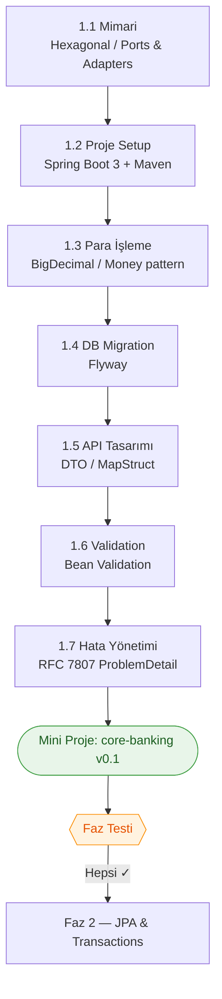

<div class="phase-cover-kicker">Birinci Bölüm</div>

# Faz 1 — Foundation

<div class="phase-cover-meta">
<div><strong>Süre</strong> 2 hafta</div>
<div><strong>Topic</strong> 7 konu + mini proje</div>
<div><strong>Çıktı</strong> core-banking v0.1</div>
<div><strong>Ön koşul</strong> Java temelleri</div>
</div>

```admonish info title="Bu fazda ne öğreneceksin?"
Bir banka backend'inin temel taşlarını döşemek: mimari, proje yapısı, para işleme,
DB migration, API tasarımı, validation ve hata yönetimi. Fazın sonunda elinde
**double-entry ledger ile çalışan**, hesap aç/yatır/çek/transfer eden,
tam test coverage'lı bir Spring Boot servisi olacak.
```

## Hedef

Bir banka backend'inin temel taşlarını döşemek:

- Mimari (hexagonal / ports & adapters)
- Proje yapısı (Spring Boot 3 + Maven multi-module)
- Para işleme (BigDecimal, RoundingMode, Currency)
- DB migration (Flyway)
- API tasarımı (DTO, MapStruct, Lombok kararı)
- Validation (Bean Validation)
- Hata yönetimi (RFC 7807 ProblemDetail)

Sonunda elinde: `Account`, `JournalEntry`, `JournalLine` entity'lerini olan, **double-entry ledger ile çalışan**, hesap aç/yatır/çek/transfer eden bir Spring Boot servisi. Tam test coverage ile.

## Fazın haritası



## Süre

2 hafta (günde 2-3 saat). Acele etme, temel iyi atılırsa sonraki fazlar kolay.

## Topic sırası

1. **[Mimari: Hexagonal / Ports & Adapters / Layered](./01-architecture/README.md)** — kodun nasıl organize olacağını anlama
2. **[Proje setup: Spring Boot 3 + Maven multi-module + profiles](./02-project-setup/README.md)** — iskeleti kurma
3. **[Para işleme: BigDecimal, RoundingMode, Currency, Money pattern](./03-money-handling/README.md)** — para tipinin neden `double` olmadığı
4. **[DB migration: Flyway (Liquibase karşılaştırması ile)](./04-database-migration/README.md)** — schema'yı kod olarak yönetme
5. **[API tasarımı: DTO ayrımı, MapStruct, Lombok](./05-api-design/README.md)** — entity'i HTTP'ye sızdırmama
6. **[Validation: Bean Validation, custom validator](./06-validation/README.md)** — input'a güvenmeme
7. **[Hata yönetimi: ProblemDetail (RFC 7807), @ControllerAdvice](./07-error-handling/README.md)** — tutarlı error response

Sonra:

- **[Mini-project: `core-banking` v0.1](./mini-project/README.md)** — Tüm topic'leri birleştir
- **[PHASE_TEST.md](./PHASE_TEST.md)** — Kendini sına

## Faz 1'in sonunda olman gereken yer

Test edip kontrol et — şu soruları net cevaplayabiliyor musun?

- [ ] "Hexagonal architecture'ı 3 cümleyle nasıl anlatırsın?" → cevabın hazır
- [ ] "Neden `double` ile para işlemi yapılmaz?" → BigDecimal'ı doğru kullanıyorsun
- [ ] "Flyway migration'ları nasıl versiyonlanır, rollback nasıl yapılır?" → biliyorsun
- [ ] "Bean Validation custom annotation nasıl yazılır?" → bir tane yazmış olmalısın
- [ ] "`@ControllerAdvice` neye yarar, `ProblemDetail` ile nasıl kullanılır?" → API'nde uygulanmış
- [ ] Code coverage `core-banking` projende %75+

```admonish success title="Faza geçiş kuralı"
Yukarıdaki maddelerin **hepsine** "evet" diyebiliyorsan → [Faz 2 — JPA & Transactions](../02-jpa-transactions/README.md)'a geç.
Bir maddede takıldıysan ilgili topic'e geri dön; temel sağlam olmadan üst kat çıkılmaz.
```
