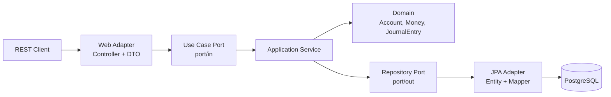
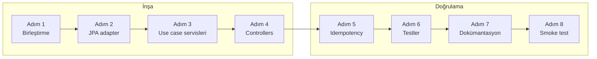
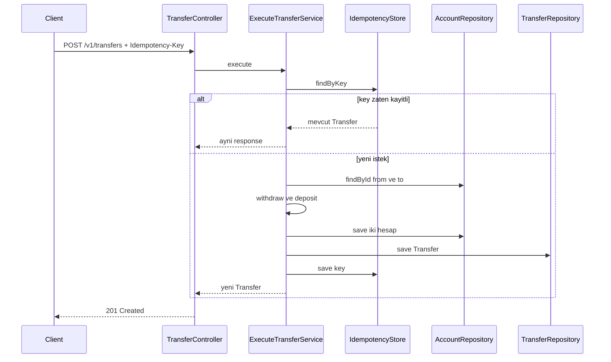
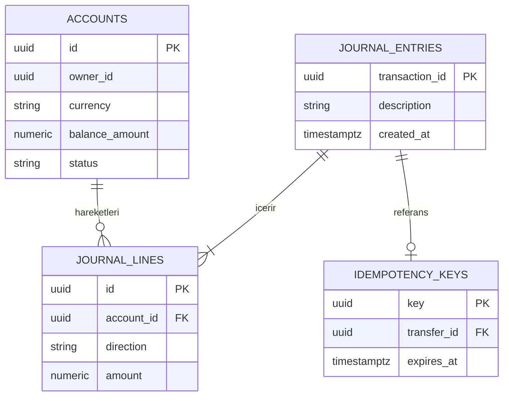

# Mini-Project: `core-banking` v0.1

```admonish info title="Bu projede"
- Faz 1'in 7 topic'inde yazdığın parçaları tek bir çalışan serviste birleştiriyorsun: `core-banking` v0.1
- Hexagonal architecture ile `account` ve `transfer` bounded context'lerini inşa ediyorsun
- Double-entry ledger (journal_entries, journal_lines) ile transferleri atomic ve idempotent yapıyorsun
- REST API, Bean Validation, ProblemDetail error handling ve OpenAPI docs'u uçtan uca bağlıyorsun
- Unit, controller ve TestContainers integration testleriyle coverage'ı %75'in üstüne çıkarıyorsun
```

## Hedef

Faz 1'de her topic için ayrı ayrı kod yazdın. Bu projede yeni bir şey öğrenmiyoruz — öğrendiklerini **tatbik edip** çalışan, test edilmiş, GitHub'a koyulabilir bir banking servisine dönüştürüyoruz. Projenin sonunda elinde şunlar olacak:

- Spring Boot 3 + Java 21 backend
- PostgreSQL + Flyway migration
- Hexagonal architecture (`account`, `transfer` bounded context)
- Double-entry ledger (journal_entries, journal_lines)
- REST API (`/v1/accounts`, `/v1/transfers`) + ProblemDetail error response
- Bean Validation (built-in + custom IBAN/TC)
- Test coverage ≥ %75
- OpenAPI docs + Docker compose ile lokal stack

Hedef mimarinin genel görünümü:



Bu proje Phase 2-12'nin **temeli** — her sonraki faz buradan devam edecek. O yüzden burada attığın temizlik ve düzen, aylarca seninle gelecek.

```admonish tip title="Süre"
3-5 gün ayır (Phase 1'in son haftası civarı). Acele etme; her adımın sonunda kontrol noktasını geçmeden ilerleme.
```

---

## Acceptance criteria (bitirme şartları)

Proje bittiğinde aşağıdaki listelerin **tamamı** işaretlenebilir olmalı. Başlamadan bir kez oku, bitince tek tek geç.

### Functional

- [ ] `POST /v1/accounts` — yeni hesap aç, owner ID + currency + opening balance ile
- [ ] `GET /v1/accounts/{id}` — hesap detayı (id, ownerId, currency, balance, status, openedAt)
- [ ] `GET /v1/accounts?ownerId={ownerId}` — owner'a göre hesapları listele
- [ ] `POST /v1/accounts/{id}/deposit` — para yatır
- [ ] `POST /v1/accounts/{id}/withdraw` — para çek
- [ ] `POST /v1/transfers` — transfer yap (Idempotency-Key header zorunlu)
- [ ] `PATCH /v1/accounts/{id}/status` — hesap kapama (status = CLOSED)
- [ ] `GET /v1/accounts/{id}/transactions` — hesabın journal_line geçmişi (basit pagination)
- [ ] Tüm endpoint'lerde validation çalışıyor (400)
- [ ] Tüm domain exception'lar 422 / 404 / 409 olarak ProblemDetail dönüyor
- [ ] Bilinmeyen hata 500 + generic mesaj (stacktrace LEAK YOK)

### Non-functional

- [ ] Double-entry invariant: her transfer için 2 journal_line, toplam debit = toplam credit
- [ ] Idempotency-Key tekrar gönderildiğinde **aynı** response döner (simple version)
- [ ] PostgreSQL Docker'da çalışıyor, app'ten erişiliyor
- [ ] Flyway migration'ları otomatik uygulanıyor
- [ ] OpenAPI/Swagger UI çalışıyor (`/swagger-ui.html`)
- [ ] Health endpoint UP (`/actuator/health`)
- [ ] traceId her request'te üretiliyor, response header + log'da görünüyor
- [ ] `mvn test` ile tüm testler geçiyor
- [ ] JaCoCo coverage ≥ %75 (`mvn verify`, raporu `target/site/jacoco/index.html`)
- [ ] README.md projenin nasıl çalıştırılacağını, mimarisini anlatıyor
- [ ] ADR (Architectural Decision Records) en az 3 karar yazılı
- [ ] `error-catalog.md` her error code'u dokümante ediyor

### Code quality

- [ ] Hexagonal architecture: domain, application, adapter ayrımı yapılmış
- [ ] Domain class'larda hiç framework annotation'ı YOK
- [ ] Tüm DTO'lar `record`
- [ ] Tüm para field'lar `BigDecimal` (double YOK)
- [ ] Tüm test'ler AssertJ + JUnit 5 ile yazılmış
- [ ] No commented-out code, no `System.out.println`
- [ ] `.gitignore`, `.env.example`, `docker-compose.yml`, `README.md` git'e dahil

---

## Klasör yapısı (hedef)

Kodu yerleştirirken bu iskeleti referans al. `common/` paylaşılan parçaları, `account/` ve `transfer/` birer bounded context'i taşıyor; her context içinde `domain → application → adapter` katmanları aynı düzende tekrar ediyor.

```
core-banking/
├── .gitignore
├── .env.example
├── docker-compose.yml
├── pom.xml
├── README.md
├── docs/
│   ├── adr/
│   │   ├── 0001-use-hexagonal-architecture.md
│   │   ├── 0002-use-flyway-for-migrations.md
│   │   ├── 0003-use-problem-detail-for-errors.md
│   │   └── ...
│   └── error-catalog.md
├── src/
│   ├── main/
│   │   ├── java/com/mavibank/banking/
│   │   │   ├── CoreBankingApplication.java
│   │   │   ├── common/
│   │   │   │   ├── domain/
│   │   │   │   │   ├── Money.java
│   │   │   │   │   ├── ExchangeRate.java
│   │   │   │   │   └── exception/
│   │   │   │   │       ├── BankingException.java
│   │   │   │   │       └── CurrencyMismatchException.java
│   │   │   │   ├── error/
│   │   │   │   │   └── ErrorCodes.java
│   │   │   │   ├── adapter/
│   │   │   │   │   ├── in/web/
│   │   │   │   │   │   ├── GlobalExceptionHandler.java
│   │   │   │   │   │   └── filter/TraceIdFilter.java
│   │   │   │   │   └── CurrencyNormalizer.java
│   │   │   │   └── validation/
│   │   │   │       ├── IsoCurrencyCode.java
│   │   │   │       ├── IbanFormat.java
│   │   │   │       ├── IbanFormatValidator.java
│   │   │   │       ├── TcKimlikNo.java
│   │   │   │       └── TcKimlikNoValidator.java
│   │   │   ├── account/
│   │   │   │   ├── domain/
│   │   │   │   │   ├── Account.java
│   │   │   │   │   ├── AccountId.java
│   │   │   │   │   ├── OwnerId.java
│   │   │   │   │   ├── AccountStatus.java
│   │   │   │   │   └── exception/
│   │   │   │   │       ├── AccountNotFoundException.java
│   │   │   │   │       └── ... (AccountClosed, AccountFrozen, InsufficientFunds)
│   │   │   │   ├── application/
│   │   │   │   │   ├── port/
│   │   │   │   │   │   ├── in/
│   │   │   │   │   │   │   ├── OpenAccountUseCase.java
│   │   │   │   │   │   │   ├── GetAccountUseCase.java
│   │   │   │   │   │   │   ├── DepositUseCase.java
│   │   │   │   │   │   │   └── ... (Withdraw, CloseAccount, ListAccountTransactions)
│   │   │   │   │   │   └── out/
│   │   │   │   │   │       └── AccountRepository.java
│   │   │   │   │   └── service/
│   │   │   │   │       ├── OpenAccountService.java
│   │   │   │   │       └── ... (her use case için bir service)
│   │   │   │   ├── config/
│   │   │   │   │   └── AccountProperties.java
│   │   │   │   └── adapter/
│   │   │   │       ├── in/web/
│   │   │   │       │   ├── AccountController.java
│   │   │   │       │   ├── dto/
│   │   │   │       │   │   ├── OpenAccountRequest.java
│   │   │   │       │   │   ├── AccountResponse.java
│   │   │   │       │   │   └── ... (Deposit, Withdraw, UpdateAccountStatus request'leri)
│   │   │   │       │   └── mapper/
│   │   │   │       │       └── AccountWebMapper.java
│   │   │   │       └── out/persistence/
│   │   │   │           ├── AccountJpaEntity.java
│   │   │   │           ├── AccountJpaRepository.java
│   │   │   │           ├── JpaAccountRepository.java   ← AccountRepository implementer
│   │   │   │           └── mapper/
│   │   │   │               └── AccountPersistenceMapper.java
│   │   │   ├── transfer/
│   │   │   │   ├── domain/
│   │   │   │   │   ├── Transfer.java
│   │   │   │   │   ├── TransferId.java
│   │   │   │   │   ├── JournalEntry.java
│   │   │   │   │   ├── JournalLine.java
│   │   │   │   │   ├── JournalDirection.java
│   │   │   │   │   └── exception/
│   │   │   │   │       └── SameAccountTransferException.java
│   │   │   │   ├── application/
│   │   │   │   │   ├── port/in/
│   │   │   │   │   │   └── ExecuteTransferUseCase.java
│   │   │   │   │   ├── port/out/
│   │   │   │   │   │   ├── TransferRepository.java
│   │   │   │   │   │   └── IdempotencyStore.java
│   │   │   │   │   └── service/
│   │   │   │   │       └── ExecuteTransferService.java
│   │   │   │   └── adapter/
│   │   │   │       ├── in/web/
│   │   │   │       │   ├── TransferController.java
│   │   │   │       │   └── dto/
│   │   │   │       │       ├── TransferRequest.java
│   │   │   │       │       └── TransferResponse.java
│   │   │   │       └── out/persistence/
│   │   │   │           ├── JournalEntryJpaEntity.java
│   │   │   │           ├── JournalLineJpaEntity.java
│   │   │   │           ├── IdempotencyKeyJpaEntity.java
│   │   │   │           └── ...
│   │   └── resources/
│   │       ├── application.yml (+ dev, test, prod profil dosyaları)
│   │       ├── messages.properties, messages_tr.properties
│   │       └── db/migration/
│   │           ├── V1__create_accounts_table.sql
│   │           ├── V2__create_journal_tables.sql
│   │           ├── V3__create_idempotency_keys_table.sql
│   │           └── R__create_balance_summary_view.sql
│   └── test/
│       ├── java/com/mavibank/banking/
│       │   └── ... (paralel paket yapısı, her class için test)
│       └── resources/
│           └── application-test.yml
```

---

## Adım adım build plan

Sekiz adım var: ilk dört adımda kodu inşa ediyorsun, son dört adımda doğrulayıp paketliyorsun.



### Adım 1 — Temizlik ve birleştirme (1-2 saat)

**Ne yapacaksın:** Topic'lerde yazdığın kod parçalarını tek projede, doğru paketlerde topla. **Neden:** Sonraki adımlar bu iskelet üstüne kurulacak; dağınık başlarsan her adımda geri döneceksin.

Kontrol noktası — devam etmeden şu listeyi geç:

- [ ] Tüm dosyalar doğru pakette mi?
- [ ] Topic 1.1'deki domain class'ları, Topic 1.3'teki Money revize edilmiş hâlleriyle birleşmiş mi?
- [ ] `Account` aggregate'i domain method'larına sahip mi (deposit, withdraw, close)?
- [ ] `JournalEntry` ve `JournalLine` domain class'ları yazıldı mı?
- [ ] Migration dosyaları doğru sırada mı (V1, V2, V3)?
- [ ] DTO'lar `record` ve validation annotation'lı mı?
- [ ] `GlobalExceptionHandler` tüm domain exception'larını cover ediyor mu?

### Adım 2 — JPA persistence adapter (3-4 saat)

**Ne yapacaksın:** Domain'i PostgreSQL'e bağlayan adapter katmanını yazacaksın: JPA entity, mapper ve port implementation'ı. **Neden:** Hexagonal'da domain veritabanını bilmez; araya bu adapter girer ve dönüşümü üstlenir.

```admonish warning title="Dikkat"
Bu, Phase 1'in en zor kısmı — JPA'yı henüz derinlemesine bilmiyorsun. Aşağıdaki dört parçayı sırayla, örnekleri takip ederek yaz; derinlik Phase 2'de gelecek.
```

**Parça 1 — `AccountJpaEntity`** (tablo karşılığı, domain'den ayrı bir class):

```java
@Entity
@Table(name = "accounts")
class AccountJpaEntity {
    @Id
    private UUID id;
    
    @Column(name = "owner_id", nullable = false)
    private UUID ownerId;
    
    @Column(nullable = false)
    private String currency;
    
    @Column(name = "balance_amount", nullable = false, precision = 19, scale = 4)
    private BigDecimal balanceAmount;
    
    @Enumerated(EnumType.STRING)
    @Column(nullable = false)
    private AccountStatusEntity status;
    
    @Column(name = "opened_at", nullable = false)
    private Instant openedAt;
    
    @Column(name = "closed_at")
    private Instant closedAt;
    
    @Version
    private Long version;
    
    // package-private setters, JPA için
    protected AccountJpaEntity() {}
    
    // ... getters, setters
}
```

**Parça 2 — `AccountPersistenceMapper`** (MapStruct ile domain ↔ entity dönüşümü):

```java
@Mapper(componentModel = "spring")
public interface AccountPersistenceMapper {
    
    @Mapping(source = "id.value", target = "id")
    @Mapping(source = "ownerId.value", target = "ownerId")
    @Mapping(source = "currency", target = "currency", qualifiedByName = "currencyToCode")
    @Mapping(source = "balance.amount", target = "balanceAmount")
    AccountJpaEntity toEntity(Account account);
    
    // Reverse — domain'i entity'den construct etmek tricky, factory ile yap
    default Account toDomain(AccountJpaEntity entity) {
        return Account.reconstruct(
            new AccountId(entity.getId()),
            new OwnerId(entity.getOwnerId()),
            Currency.getInstance(entity.getCurrency()),
            new Money(entity.getBalanceAmount(), Currency.getInstance(entity.getCurrency())),
            AccountStatus.valueOf(entity.getStatus().name()),
            entity.getOpenedAt(),
            entity.getClosedAt(),
            entity.getVersion()
        );
    }
    
    @Named("currencyToCode")
    default String currencyToCode(Currency currency) {
        return currency.getCurrencyCode();
    }
}
```

Bunun çalışması için `Account` domain class'ına `static reconstruct(...)` factory ekle. Bu public constructor değil — sadece persistence'ın domain'i yeniden oluşturması için var:

```java
public static Account reconstruct(AccountId id, OwnerId ownerId, Currency currency,
                                  Money balance, AccountStatus status,
                                  Instant openedAt, Instant closedAt, Long version) {
    var account = new Account(id, ownerId, currency);
    account.balance = balance;
    account.status = status;
    account.openedAt = openedAt;
    account.closedAt = closedAt;
    account.version = version;
    return account;
}
```

**Parça 3 — `JpaAccountRepository`** (port'un adapter implementation'ı):

```java
@Component
class JpaAccountRepository implements AccountRepository {
    
    private final AccountJpaRepository jpaRepo;       // Spring Data
    private final AccountPersistenceMapper mapper;
    
    JpaAccountRepository(AccountJpaRepository jpaRepo, AccountPersistenceMapper mapper) {
        this.jpaRepo = jpaRepo;
        this.mapper = mapper;
    }
    
    @Override
    public Optional<Account> findById(AccountId id) {
        return jpaRepo.findById(id.value()).map(mapper::toDomain);
    }
    
    @Override
    public Account save(Account account) {
        AccountJpaEntity entity = mapper.toEntity(account);
        AccountJpaEntity saved = jpaRepo.save(entity);
        return mapper.toDomain(saved);
    }
    
    @Override
    public List<Account> findByOwnerId(OwnerId ownerId) {
        return jpaRepo.findByOwnerId(ownerId.value()).stream()
            .map(mapper::toDomain)
            .toList();
    }
}
```

**Parça 4 — `AccountJpaRepository`** (Spring Data interface):

```java
interface AccountJpaRepository extends JpaRepository<AccountJpaEntity, UUID> {
    List<AccountJpaEntity> findByOwnerId(UUID ownerId);
}
```

Kontrol noktası: aynı dört parçayı **transfer için de** yaz — `JournalEntryJpaEntity`, `JournalLineJpaEntity`, mapper ve repository implementation. App ayağa kalkıyor ve Flyway migration'ları hatasız uygulanıyorsa bu adım tamam.

### Adım 3 — Use case / application service'ler (2-3 saat)

**Ne yapacaksın:** `port/in` interface'lerini implement eden service'leri yazacaksın. **Neden:** İş akışının orkestrasyonu (repository çağır, domain method'u çalıştır, kaydet) burada yaşar; domain kuralları ise domain'de kalır.

Basit olandan başla — `OpenAccountService`:

```java
@Service
@Transactional
class OpenAccountService implements OpenAccountUseCase {
    
    private final AccountRepository accountRepository;
    private final AccountProperties properties;
    
    OpenAccountService(AccountRepository accountRepository, AccountProperties properties) {
        this.accountRepository = accountRepository;
        this.properties = properties;
    }
    
    @Override
    public Account execute(OwnerId ownerId, Currency currency, Money openingBalance) {
        if (!properties.supportedCurrencies().contains(currency.getCurrencyCode())) {
            throw new InvalidCurrencyException(currency.getCurrencyCode());
        }
        if (openingBalance.isLessThan(Money.zero(currency))) {
            throw new IllegalArgumentException("Opening balance cannot be negative");
        }
        
        Account account = Account.open(ownerId, currency);
        if (!openingBalance.isZero()) {
            account.deposit(openingBalance, TransferId.generate());
        }
        return accountRepository.save(account);
    }
}
```

En complex olanı `ExecuteTransferService`. Koda geçmeden akışı sindir:



```java
@Service
@Transactional
class ExecuteTransferService implements ExecuteTransferUseCase {
    
    private final AccountRepository accountRepository;
    private final TransferRepository transferRepository;
    private final IdempotencyStore idempotencyStore;
    
    @Override
    public Transfer execute(UUID idempotencyKey, AccountId from, AccountId to,
                           Money amount, String description) {
        
        // Idempotency check (basit)
        Optional<Transfer> existing = idempotencyStore.findByKey(idempotencyKey);
        if (existing.isPresent()) {
            return existing.get();
        }
        
        if (from.equals(to)) {
            throw new SameAccountTransferException(from);
        }
        
        Account fromAccount = accountRepository.findById(from)
            .orElseThrow(() -> new AccountNotFoundException(from));
        Account toAccount = accountRepository.findById(to)
            .orElseThrow(() -> new AccountNotFoundException(to));
        
        if (fromAccount.getStatus() != AccountStatus.ACTIVE) {
            throw new AccountClosedException(from);
        }
        if (toAccount.getStatus() != AccountStatus.ACTIVE) {
            throw new AccountClosedException(to);
        }
        
        TransferId transferId = TransferId.generate();
        fromAccount.withdraw(amount, transferId);
        toAccount.deposit(amount, transferId);
        
        accountRepository.save(fromAccount);
        accountRepository.save(toAccount);
        
        Transfer transfer = Transfer.execute(transferId, from, to, amount, description);
        transferRepository.save(transfer);
        idempotencyStore.save(idempotencyKey, transfer);
        
        return transfer;
    }
}
```

```admonish warning title="Dikkat"
`@Transactional` sayesinde tüm operasyon atomic: bir adımda exception fırlarsa **tümü rollback** olur. Para bir hesaptan çıkıp diğerine girmeden asla kaybolmamalı — bu, banking'in en temel invariant'ı.
```

Kontrol noktası: tüm use case service'leri yazıldı, proje derleniyor.

### Adım 4 — Controllers (1-2 saat)

**Ne yapacaksın:** Topic 1.5'te taslak olarak yazdığın controller'ları gerçek use case'lere bağlayacaksın. **Neden:** Controller sadece çevirmendir — HTTP'yi domain diline çevirir, iş kuralı barındırmaz.

```java
@RestController
@RequestMapping("/v1/accounts")
class AccountController {
    
    private final OpenAccountUseCase openAccountUseCase;
    private final GetAccountUseCase getAccountUseCase;
    private final DepositUseCase depositUseCase;
    private final WithdrawUseCase withdrawUseCase;
    private final CloseAccountUseCase closeAccountUseCase;
    private final AccountWebMapper mapper;
    
    // ... constructor
    
    @PostMapping
    @ResponseStatus(HttpStatus.CREATED)
    AccountResponse openAccount(@Valid @RequestBody OpenAccountRequest request) {
        Account account = openAccountUseCase.execute(
            new OwnerId(request.ownerId()),
            Currency.getInstance(request.currency()),
            Money.of(request.openingBalance(), Currency.getInstance(request.currency()))
        );
        return mapper.toResponse(account);
    }
    
    @GetMapping("/{id}")
    AccountResponse getAccount(@PathVariable UUID id) {
        return mapper.toResponse(getAccountUseCase.execute(new AccountId(id)));
    }
    
    @GetMapping
    List<AccountResponse> listByOwner(@RequestParam UUID ownerId) {
        return getAccountUseCase.listByOwner(new OwnerId(ownerId)).stream()
            .map(mapper::toResponse)
            .toList();
    }
    
    @PostMapping("/{id}/deposit")
    AccountResponse deposit(@PathVariable UUID id,
                            @Valid @RequestBody DepositRequest request) {
        Account account = depositUseCase.execute(
            new AccountId(id),
            Money.of(request.amount(), Currency.getInstance(request.currency()))
        );
        return mapper.toResponse(account);
    }
    
    // withdraw endpoint'i deposit ile aynı kalıp — withdrawUseCase ile yaz
    
    @PatchMapping("/{id}/status")
    AccountResponse updateStatus(@PathVariable UUID id,
                                 @Valid @RequestBody UpdateAccountStatusRequest request) {
        if (request.status().equals("CLOSED")) {
            return mapper.toResponse(closeAccountUseCase.execute(new AccountId(id)));
        }
        throw new UnsupportedOperationException("Only CLOSED status supported");
    }
}
```

```java
@RestController
@RequestMapping("/v1/transfers")
class TransferController {
    
    private final ExecuteTransferUseCase executeTransferUseCase;
    private final TransferWebMapper mapper;
    
    @PostMapping
    @ResponseStatus(HttpStatus.CREATED)
    TransferResponse transfer(
        @RequestHeader("Idempotency-Key") UUID idempotencyKey,
        @Valid @RequestBody TransferRequest request
    ) {
        Transfer transfer = executeTransferUseCase.execute(
            idempotencyKey,
            new AccountId(request.fromAccountId()),
            new AccountId(request.toAccountId()),
            Money.of(request.amount(), Currency.getInstance(request.currency())),
            request.description()
        );
        return mapper.toResponse(transfer);
    }
}
```

Kontrol noktası: app'i ayağa kaldır, Swagger UI'da tüm endpoint'ler görünüyor ve basit bir `POST /v1/accounts` isteği 201 dönüyor.

### Adım 5 — Idempotency persistence (1 saat)

**Ne yapacaksın:** Idempotency key'leri veritabanında saklayacaksın. **Neden:** Client aynı transferi iki kez gönderirse (retry, timeout) para iki kez gitmemeli — key'i kalıcı tutmadan bunu garanti edemezsin.

`V3__create_idempotency_keys_table.sql`:

```sql
CREATE TABLE idempotency_keys (
    key                 UUID PRIMARY KEY,
    transfer_id         UUID NOT NULL REFERENCES journal_entries(transaction_id),
    request_hash        VARCHAR(64) NOT NULL,
    response_status     INTEGER NOT NULL,
    response_body       TEXT NOT NULL,
    created_at          TIMESTAMP WITH TIME ZONE NOT NULL DEFAULT CURRENT_TIMESTAMP,
    expires_at          TIMESTAMP WITH TIME ZONE NOT NULL DEFAULT CURRENT_TIMESTAMP + INTERVAL '24 hours'
);
```

`IdempotencyStore` port:

```java
public interface IdempotencyStore {
    Optional<Transfer> findByKey(UUID key);
    void save(UUID key, Transfer transfer);
}
```

```admonish tip title="İpucu"
JPA adapter'ı implement et ama **basit versiyonla** yetin: sadece key + transferId tut. Gerçek response cache'lemeyi Phase 2'de yapacağız.
```

Bu tabloyla birlikte veri modelinin tamamı şöyle görünüyor:



Kontrol noktası: aynı key ile iki kez transfer isteği attığında ikinci istek yeni journal_entry yaratmıyor.

### Adım 6 — Test coverage (3-4 saat)

**Ne yapacaksın:** Dört seviyede test yazacaksın: unit, service (mock'lu), controller, integration. **Neden:** Her seviye farklı bir hatayı yakalar — unit test domain kuralını, integration test gerçek PostgreSQL üstünde uçtan uca akışı doğrular.

**Seviye 1 — Unit testler** (her topic'ten):
- `MoneyTest`, `AccountTest`, `ExchangeRateTest`
- `IbanFormatValidatorTest`, `TcKimlikNoValidatorTest`
- `OpenAccountRequestValidationTest`
- `CurrencyNormalizerTest`
- Domain exception'ların test'leri

**Seviye 2 — Application service testler** (Mockito ile):
- `OpenAccountServiceTest` — `AccountRepository` mock'lu
- `ExecuteTransferServiceTest` — mock'lu, double-entry'nin doğru çalıştığını test et

```java
@ExtendWith(MockitoExtension.class)
class ExecuteTransferServiceTest {
    
    @Mock AccountRepository accountRepository;
    @Mock TransferRepository transferRepository;
    @Mock IdempotencyStore idempotencyStore;
    
    @InjectMocks ExecuteTransferService service;
    
    @Test
    void shouldExecuteTransferSuccessfully() {
        UUID idempotencyKey = UUID.randomUUID();
        AccountId fromId = new AccountId(UUID.randomUUID());
        AccountId toId = new AccountId(UUID.randomUUID());
        
        Account fromAccount = AccountTestBuilder.anAccount()
            .withId(fromId.value())
            .withCurrency("TRY")
            .withBalance("1000.00")
            .build();
        Account toAccount = AccountTestBuilder.anAccount()
            .withId(toId.value())
            .withCurrency("TRY")
            .build();
        
        when(idempotencyStore.findByKey(idempotencyKey)).thenReturn(Optional.empty());
        when(accountRepository.findById(fromId)).thenReturn(Optional.of(fromAccount));
        when(accountRepository.findById(toId)).thenReturn(Optional.of(toAccount));
        
        Transfer transfer = service.execute(
            idempotencyKey, fromId, toId,
            Money.of("100.00", "TRY"), "test"
        );
        
        assertThat(transfer).isNotNull();
        assertThat(fromAccount.getBalance()).isEqualTo(Money.of("900.00", "TRY"));
        assertThat(toAccount.getBalance()).isEqualTo(Money.of("100.00", "TRY"));
        verify(accountRepository, times(2)).save(any());
    }
    
    @Test
    void shouldReturnExistingTransferOnIdempotencyKeyHit() { ... }
    
    @Test
    void shouldThrowOnSameAccountTransfer() { ... }
    
    @Test
    void shouldThrowOnInsufficientFunds() { ... }
    
    @Test
    void shouldThrowOnClosedAccount() { ... }
}
```

**Seviye 3 — Controller testler** (`@WebMvcTest`):
- `AccountControllerTest` — open, get, deposit, withdraw, close, list
- `TransferControllerTest` — transfer, idempotency, validation hatları

**Seviye 4 — Integration testler** (`@SpringBootTest` + TestContainers):
- `AccountIntegrationTest` — full HTTP roundtrip, gerçek PostgreSQL
- `TransferIntegrationTest` — double-entry invariant assertion
- `MigrationIntegrationTest` — schema doğrulaması

```java
@SpringBootTest
@AutoConfigureMockMvc
@Testcontainers
@ActiveProfiles("test")
class TransferIntegrationTest {
    
    @Container
    @ServiceConnection
    static PostgreSQLContainer<?> postgres = new PostgreSQLContainer<>("postgres:16-alpine");
    
    @Autowired MockMvc mockMvc;
    @Autowired JdbcTemplate jdbc;
    
    @Test
    void transferShouldCreateBalancedJournalEntries() throws Exception {
        // Setup
        UUID fromOwner = createAccountAndReturnId("TRY", "1000.00");
        UUID toOwner = createAccountAndReturnId("TRY", "0.00");
        UUID idempotencyKey = UUID.randomUUID();
        
        // Action
        mockMvc.perform(post("/v1/transfers")
                .header("Idempotency-Key", idempotencyKey.toString())
                .contentType(MediaType.APPLICATION_JSON)
                .content(...))
            .andExpect(status().isCreated());
        
        // Assertion — double-entry invariant
        BigDecimal totalDebit = jdbc.queryForObject(
            "SELECT COALESCE(SUM(amount), 0) FROM journal_lines WHERE direction = 'DEBIT'",
            BigDecimal.class
        );
        BigDecimal totalCredit = jdbc.queryForObject(
            "SELECT COALESCE(SUM(amount), 0) FROM journal_lines WHERE direction = 'CREDIT'",
            BigDecimal.class
        );
        assertThat(totalDebit).isEqualByComparingTo(totalCredit);
    }
    
    @Test
    void idempotencyKeyShouldNotCreateDuplicateTransfer() throws Exception {
        // İki kez aynı key ile transfer at — sadece bir kez işlenmiş olmalı
    }
}
```

Kontrol noktası: `mvn verify` yeşil ve `target/site/jacoco/index.html` raporunda coverage ≥ %75.

### Adım 7 — README, ADR, error catalog (1 saat)

**Ne yapacaksın:** Projenin dokümantasyonunu yazacaksın. **Neden:** GitHub'da projeni açan biri (recruiter dahil) önce README'yi görür — kod kadar dokümantasyon da vitrindir.

`README.md` için şablon:

````markdown
# core-banking

TR bank backend learning project. Spring Boot 3 + Java 21 + PostgreSQL.

## Çalıştırma

```bash
docker compose up -d
mvn spring-boot:run
```

API: http://localhost:8080
Swagger UI: http://localhost:8080/swagger-ui.html
Health: http://localhost:8080/actuator/health

## Mimari

Hexagonal Architecture (Ports & Adapters). Bounded contexts: account, transfer.
Detaylar için `docs/adr/` klasörüne bak.

## Test

```bash
mvn test                    # tüm testler
mvn verify                  # + JaCoCo coverage raporu
```

Coverage raporu: `target/site/jacoco/index.html`

## Endpoint'ler

`docs/error-catalog.md` — error kataloğu.
OpenAPI: `/v3/api-docs`, Swagger UI: `/swagger-ui.html`.

## Lisans

Eğitim projesidir.
````

Kontrol noktası: README hazır, `docs/adr/` altında en az 3 ADR var (aday konular: hexagonal, Flyway, ProblemDetail, BigDecimal, validation) ve `error-catalog.md` her error code'u listeliyor.

### Adım 8 — Manuel smoke test (30 dk)

**Ne yapacaksın:** Uygulamayı gerçek bir kullanıcı gibi curl ile uçtan uca deneyeceksin. **Neden:** Testler yeşil olsa da "gerçekten çalışıyor mu?" sorusunun cevabı ancak canlı istekle verilir.

Aşağıdaki 9 senaryoyu sırayla çalıştır:

```bash
# 1. Hesap aç (owner 1)
OWNER1=$(uuidgen)
curl -X POST http://localhost:8080/v1/accounts \
  -H "Content-Type: application/json" \
  -d "{\"ownerId\":\"$OWNER1\",\"currency\":\"TRY\",\"openingBalance\":\"1000.00\"}"

# 2. Hesap aç (owner 2)
OWNER2=$(uuidgen)
curl -X POST http://localhost:8080/v1/accounts \
  -H "Content-Type: application/json" \
  -d "{\"ownerId\":\"$OWNER2\",\"currency\":\"TRY\",\"openingBalance\":\"0.00\"}"

# 3. Hesap detayı oku, ID'leri al
curl "http://localhost:8080/v1/accounts?ownerId=$OWNER1"
curl "http://localhost:8080/v1/accounts?ownerId=$OWNER2"

# (ID'leri elle yakala, ACCOUNT1 ve ACCOUNT2'ye ata)

# 4. Transfer yap
IDEMPOTENCY_KEY=$(uuidgen)
curl -X POST http://localhost:8080/v1/transfers \
  -H "Content-Type: application/json" \
  -H "Idempotency-Key: $IDEMPOTENCY_KEY" \
  -d "{\"fromAccountId\":\"$ACCOUNT1\",\"toAccountId\":\"$ACCOUNT2\",\"amount\":\"100.00\",\"currency\":\"TRY\"}"

# 5. Balance'ları kontrol et (900 + 100)
curl http://localhost:8080/v1/accounts/$ACCOUNT1
curl http://localhost:8080/v1/accounts/$ACCOUNT2

# 6. Aynı idempotency key ile tekrar transfer → aynı response, balance değişmez
curl -X POST http://localhost:8080/v1/transfers \
  -H "Content-Type: application/json" \
  -H "Idempotency-Key: $IDEMPOTENCY_KEY" \
  -d "{\"fromAccountId\":\"$ACCOUNT1\",\"toAccountId\":\"$ACCOUNT2\",\"amount\":\"100.00\",\"currency\":\"TRY\"}"

# 7. Yetersiz bakiye
curl -X POST http://localhost:8080/v1/transfers \
  -H "Content-Type: application/json" \
  -H "Idempotency-Key: $(uuidgen)" \
  -d "{\"fromAccountId\":\"$ACCOUNT1\",\"toAccountId\":\"$ACCOUNT2\",\"amount\":\"99999.00\",\"currency\":\"TRY\"}"
# 422 + ACCOUNT_INSUFFICIENT_FUNDS

# 8. Validation hatası
curl -X POST http://localhost:8080/v1/accounts \
  -H "Content-Type: application/json" \
  -d '{"currency":"tr"}'
# 400 + VALIDATION_FAILED + fieldErrors

# 9. 404
curl http://localhost:8080/v1/accounts/00000000-0000-0000-0000-000000000000
# 404 + ACCOUNT_NOT_FOUND
```

```admonish tip title="İpucu"
9 senaryonun tamamı beklenen sonucu veriyorsa **proje hazır**. Bir tanesi bile sapıyorsa acceptance criteria listesine dön ve eksiği bul.
```

---

## Claude-verify prompt (full project)

Projeyi bitirdim dediğin an, aşağıdaki prompt'la Claude'a kapsamlı bir audit yaptır. Kendi kör noktalarını böyle yakalarsın.

```
Aşağıdaki Spring Boot banking projemi (`core-banking`) tüm Phase 1 öğretileri 
çerçevesinde değerlendir. Çok kapsamlı bir audit istiyorum:

ARKAPLAN:
Phase 1 Foundation'ın mini-projesi. Hexagonal architecture, BigDecimal money, 
double-entry ledger, Flyway migrations, Bean Validation (custom + built-in), 
RFC 7807 error handling, OpenAPI docs, TestContainers integration testing, 
JaCoCo coverage hedefli.

DEĞERLENDIRME KRITERLERI:

A. Architecture
   1. Hexagonal/Ports & Adapters tutarlı uygulanmış mı?
   2. Domain class'larında framework annotation'ı (Spring, JPA) var mı? (Olmamalı)
   3. Mapper'lar adapter katmanında mı (web ve persistence ayrı)?
   4. Use case interface'leri application/port/in/ altında mı?
   5. Repository interface'i application/port/out/ altında mı (JPA değil, port)?

B. Domain modeli
   1. Money record immutable, scale normalization yapıyor mu?
   2. Account aggregate setter'sız, sadece deposit/withdraw/close ile değişiyor mu?
   3. JournalEntry + JournalLine double-entry'i temsil ediyor mu (amount > 0, direction)?
   4. Domain exception'lar specific (BankingException extend) mi?
   5. Value object'ler (AccountId, OwnerId, TransferId) record mu, null kabul etmiyor mu?

C. Persistence
   1. Schema migration Flyway ile, V1/V2/V3 sırayla?
   2. ddl-auto: validate (create değil)?
   3. Para kolonu NUMERIC(19, 4) mi?
   4. JPA entity domain'den ayrı dosyada mı?
   5. Mapper ile domain ↔ entity dönüşüm yapılıyor mu?
   6. AccountRepository interface'i (port) ile JpaAccountRepository (adapter) ayrı mı?

D. API
   1. URL versioning /v1/ var mı?
   2. POST 201, 422 validation, 404 not found, 409 conflict tutarlı mı?
   3. Idempotency-Key header /v1/transfers'da zorunlu mu, tekrar gönderildiğinde aynı response mu?
   4. Request ve response DTO'lar ayrı record'lar mı?
   5. OpenAPI/Swagger UI çalışıyor mu, @Schema/@Operation annotation'ları var mı?

E. Validation
   1. Tüm request DTO'larda Bean Validation annotation'ları var mı?
   2. Custom validator @IbanFormat ve @TcKimlikNo yazılmış mı?
   3. @IsoCurrencyCode composite annotation kullanılıyor mu?
   4. TransferRequest cross-field (different accounts) doğrulaması var mı?
   5. Validation 400 response field bazlı detay döndürüyor mu?

F. Error handling
   1. GlobalExceptionHandler ResponseEntityExceptionHandler extend mi?
   2. ProblemDetail ile RFC 7807 uyumlu response mı?
   3. 500 hatasında stacktrace response'ta YOK mu (log'da var)?
   4. Tüm domain exception'lar handle edilmiş mi?
   5. traceId her response'ta var mı, header + body?
   6. TraceIdFilter HIGHEST_PRECEDENCE ile mi?

G. Tests
   1. Unit test'ler her domain class için var mı?
   2. Service test'leri Mockito ile, repository mock'lu mu?
   3. Controller test'leri @WebMvcTest + MockMvc mu?
   4. Integration test'ler @SpringBootTest + TestContainers + gerçek PostgreSQL mi?
   5. Double-entry invariant test'i var mı (sum debit = sum credit)?
   6. Idempotency test'i var mı (aynı key 2 kez → tek işlem)?
   7. JaCoCo coverage %75+ mi?

H. Documentation
   1. README projeyi nasıl çalıştıracağımı açıklıyor mu?
   2. docs/adr/ altında en az 3 ADR var mı?
   3. docs/error-catalog.md var mı?
   4. application.yml'da secret YAZILMIŞ MI (env var olmalı)?
   5. .gitignore application-local.yml ve .env'i kapsıyor mu?

I. Banking domain
   1. BigDecimal her yerde, double hiçbir yerde mi?
   2. Currency ISO 4217 ile çalışıyor mu, "TL" gibi alias normalize ediliyor mu?
   3. Transfer atomic mi (one fail = both fail, @Transactional)?
   4. CHECK constraint'ler DB'de (status, direction, amount > 0) var mı?

Her madde için PASS / FAIL / EKSIK işaretle ve **kanıt göster** (dosya yolu veya 
kod referansı). Yanlış olanların düzeltme yolunu işaret et ama kod yazma.
```

---

## Bitirme

Audit'ten geçtin mi? O zaman GitHub'a push at:

```bash
cd ~/projects/core-banking
git add .
git status                      # neyi commit ediyorum?
git commit -m "Phase 1: Foundation complete

- Hexagonal architecture (account, transfer contexts)
- BigDecimal-based Money with currency-aware scale
- Double-entry journal ledger
- Flyway migrations (V1-V3 + R balance summary view)
- REST API with Bean Validation + custom validators (IBAN, TC)
- RFC 7807 ProblemDetail error handling
- TraceId filter with MDC propagation
- TestContainers integration tests
- JaCoCo coverage 75%+
- OpenAPI / Swagger UI

Ready for Phase 2."

git push origin main
```

LinkedIn'de "side project" olarak ekle. Bu, CV'nde **yazılı kanıt** — junior pozisyonunda nadiren görülen kalitede bir iş.

→ Sonraki: [PHASE_TEST.md](../PHASE_TEST.md)

```admonish success title="Proje Tamamlama Kriterleri"
- Tüm functional acceptance criteria endpoint'leri çalışıyor; validation 400, domain hataları 422/404/409, bilinmeyen hata 500 dönüyor
- Double-entry invariant sağlanıyor: her transferde 2 journal_line, toplam debit = toplam credit
- Aynı Idempotency-Key ile tekrar istekte aynı response dönüyor, duplicate işlem oluşmuyor
- `mvn verify` yeşil, JaCoCo coverage ≥ %75, integration testler TestContainers ile gerçek PostgreSQL üzerinde geçiyor
- README, en az 3 ADR ve `error-catalog.md` yazılmış; domain class'larında framework annotation'ı yok
- Manuel smoke test senaryolarının tamamı başarılı ve proje GitHub'a push'lanmış
```
