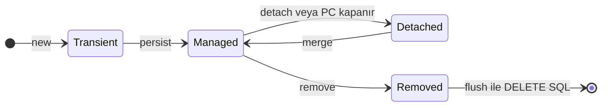
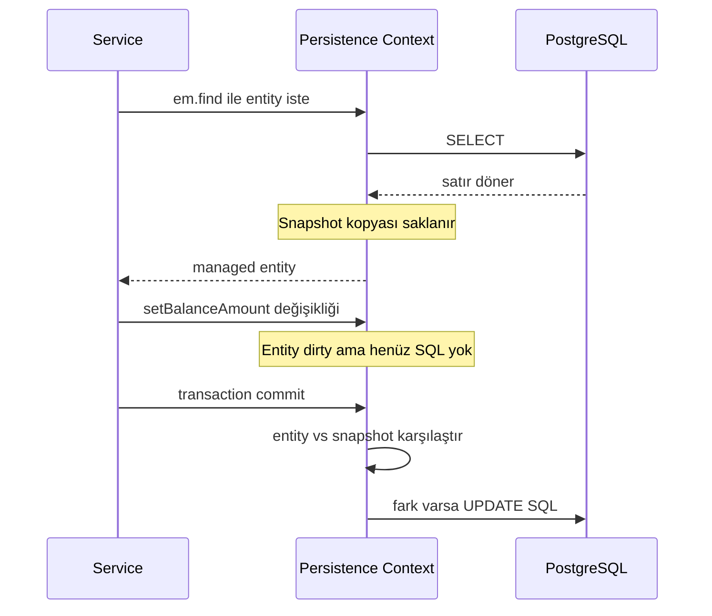
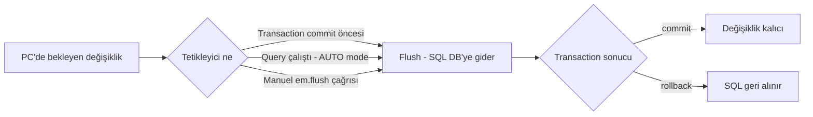

# Topic 2.1 — JPA Fundamentals & Entity Lifecycle

```admonish info title="Bu bölümde"
- `EntityManager` ve Persistence Context: first-level cache'in gerçekte ne tuttuğu
- Entity lifecycle: transient → managed → detached → removed geçişleri ve tetikleyicileri
- Dirty checking ve flush mekaniği — UPDATE SQL'in "kendiliğinden" çıkma sebebi
- Cascade, fetch type ve `@GeneratedValue` seçimlerinin banking'deki sonuçları
- `LazyInitializationException`'ın kök sebebi ve OSIV'i neden kapatman gerektiği
```

## Hedef

JPA'nın (Hibernate'in) **iç çalışmasını** anlamak. Bir nesne ne zaman "managed", ne zaman "detached"? Hibernate session ne tutuyor, neden? Dirty checking nasıl çalışıyor, performans cezası nedir? Flush ne zaman tetikleniyor? Bunları cevaplamadan JPA'yla banking yazmak = mayın tarlasında dans etmek.

## Süre

Okuma: 2 saat • Kendini Sına: 30 dk • Pratik (opsiyonel): 2-3 saat • Toplam: ~2.5 saat (+ pratik)

## Önbilgi

- Phase 1 bitti
- JPA temel annotation'ları gördün (`@Entity`, `@Id`, `@Column`)
- Basit bir `JpaRepository.findById(...)` çağrısı yaptın

---

## Kavramlar

### 1. JPA ≠ Hibernate (kısaca)

İleride "Hibernate şöyle yapıyor" dediğimizde neyin spec neyin implementation olduğunu bilmen gerekiyor — ikisini karıştıran junior, Stack Overflow cevaplarını yanlış bağlamda uygular.

**JPA (Jakarta Persistence API):** Standart; sadece interface'ler ve annotation'lar. Spec.

**Hibernate:** JPA'nın en yaygın implementation'ı. Spring Boot default'u, bizim kullanacağımız. Diğerleri (EclipseLink, OpenJPA) var ama TR bankalarında %95+ Hibernate.

JPA spec'ine sadık kalmak, ileride implementation değiştirmeyi mümkün kılar. Hibernate-specific feature (örn. `@DynamicUpdate`) kullanırsan bu kapı kapanır. **Kural:** Önce JPA-standard çözüm dene, gerekirse Hibernate-specific'e çık.

### 2. EntityManager — kalbin atışı

Repository'lerin altında dönen her şey tek bir API'den geçer; onu tanımadan JPA davranışlarını debug edemezsin. **`EntityManager`** JPA'nın merkezi API'sidir ve şu sorumlulukları taşır:

- Entity persist et (`em.persist(account)`)
- Entity bul (`em.find(Account.class, id)`)
- Entity sil (`em.remove(account)`)
- Query çalıştır (`em.createQuery(...)`)
- Transaction yönetimi (`em.getTransaction().begin()`)

Spring Boot'ta `EntityManager`'ı direkt çok az kullanırsın — `JpaRepository` üzerinden dolaylı kullanırsın. Ama arka planda ne olduğunu bilmek şart.

```java
@Service
class AccountReportingService {

    @PersistenceContext
    private EntityManager em;

    public Account findByIdNative(UUID id) {
        return em.find(AccountJpaEntity.class, id);
    }

    public List<Account> complexQuery() {
        return em.createQuery(
            "SELECT a FROM AccountJpaEntity a WHERE a.balanceAmount > :minBalance",
            AccountJpaEntity.class
        )
        .setParameter("minBalance", new BigDecimal("10000"))
        .getResultList();
    }
}
```

`@PersistenceContext`, Spring'in EntityManager inject etmesi içindir. `@Autowired` da çalışır ama persistence-specific olduğundan `@PersistenceContext` daha doğru.

### 3. Persistence Context — kavramların kavramı

Bu bölümdeki her tuzağın (dirty checking, detached entity, LazyInitializationException) kökü tek bir kavrama iner. **Persistence Context (PC)** = bir transaction boyunca yönetilen entity'lerin tutulduğu **in-memory cache**. EntityManager bir PC'i kontrol eder; PC'i bir `Map<Class, Map<Id, Entity>>` gibi düşün.

```java
@Transactional
public void example(UUID id) {
    Account a1 = em.find(AccountJpaEntity.class, id);   // DB'den fetch, PC'e koy
    Account a2 = em.find(AccountJpaEntity.class, id);   // PC'ten al, DB'ye gitmez

    assertThat(a1 == a2).isTrue();   // SAME REFERENCE
}
```

İlk sorgu DB'ye gider, ikincisi PC'ten gelir — buna **first-level cache** denir. PC bir transaction (`@Transactional` method) boyunca yaşar; transaction biterse PC kapanır, içindeki entity'ler detached olur.

### 4. Entity State Machine — 4 hâl

"Değişikliğim neden DB'ye yazılmadı?" sorusunun cevabı neredeyse her zaman entity'nin hangi hâlde olduğudur. Bir JPA entity 4 farklı state'te yaşar:



**TRANSIENT:** Sadece Java nesnesi. DB'de yok, JPA'nın haberi yok. ID henüz set edilmemiş (`@GeneratedValue` ise null).

```java
AccountJpaEntity a = new AccountJpaEntity();
a.setOwnerId(UUID.randomUUID());
// transient — JPA'nın haberi yok
```

**MANAGED:** Persistence context içinde; Hibernate her flush'ta dirty check yapar.

```java
em.persist(a);   // managed oldu, ID set edildi
a.setBalanceAmount(new BigDecimal("100"));   // dirty
// Transaction commit → UPDATE SQL otomatik fırlar
```

**DETACHED:** Daha önce managed'dı, PC kapandığı için artık değil. State'i hâlâ Java'da ama JPA takip etmiyor.

```java
@Transactional
public Account loadAccount(UUID id) {
    return em.find(AccountJpaEntity.class, id);
    // transaction biter → return edilen entity detached
}

// Caller'da:
Account a = svc.loadAccount(id);
a.setBalanceAmount(...);   // detached — UPDATE FIRLAMAZ
```

```admonish warning title="Dikkat"
Service'ten dönen entity üzerinde değişiklik yapıp başka bir service çağırırsan iki ihtimal var: caller `@Transactional` değilse değişiklik sessizce kaybolur; caller `@Transactional` ise ve aynı entity yeniden load ediliyorsa değişikliğin üzerine yazılır. İkisi de banking'de sessiz veri kaybı demektir.
```

Doğru pratik baştan belli: <mark>Service'ten JPA entity asla dönme — domain object veya DTO dön</mark>. Phase 1'in hexagonal arch kararı da tam olarak budur.

**REMOVED:** `em.remove(entity)` çağrıldı; hâlâ PC'de ama "silinecek" işaretli. Flush'ta DELETE SQL'i çıkar.

### 5. Dirty Checking — sihir nasıl çalışıyor

Explicit `save()` çağırmadan UPDATE'in çıkması sihir değil, mekanik — ve bu mekaniğin bir bedeli var. Managed bir entity'nin field'ları değişirse Hibernate commit'te otomatik UPDATE SQL fırlatır; buna **dirty checking** denir.

```java
@Transactional
public void deposit(UUID accountId, BigDecimal amount) {
    AccountJpaEntity a = em.find(AccountJpaEntity.class, accountId);
    a.setBalanceAmount(a.getBalanceAmount().add(amount));
    // explicit save() ÇAĞIRMADIN — yine de UPDATE çıkar
}
```

Sihrin altı üç adımdır:



Bedeli: her snapshot hafıza yükü, her karşılaştırma CPU yükü. 1000 entity'i PC'de tutarsan 1000 snapshot + 1000 karşılaştırma yaparsın.

```admonish tip title="İpucu"
PC'i küçük tut. Büyük batch işlemlerde periodic `em.flush()` + `em.clear()` ile PC'i temizle — detayı hemen aşağıda, derinlemesine hali Faz 5 batch konusunda.
```

### 6. Flush — DB'ye ne zaman yazılıyor

"UPDATE ne zaman gerçekten DB'ye gitti?" sorusu, debug'da ve locking konularında hayati. **Flush** = PC'deki değişiklikleri DB'ye SQL olarak gönderme. <mark>Flush commit değildir — flush sonrası rollback hâlâ mümkündür</mark>.



Flush mode'lar:

```java
em.setFlushMode(FlushModeType.AUTO);     // default — query öncesi otomatik
em.setFlushMode(FlushModeType.COMMIT);   // sadece commit öncesi
```

`AUTO` ile şu durum olur:

```java
@Transactional
public void example() {
    AccountJpaEntity a = em.find(AccountJpaEntity.class, id);
    a.setBalanceAmount(...);

    // Yeni query çalıştır
    Long count = (Long) em.createQuery("SELECT COUNT(a) FROM AccountJpaEntity a WHERE a.balanceAmount > 0")
        .getSingleResult();
    // ← Bu noktada flush oldu, UPDATE SQL DB'ye gitti
    // Yoksa count yanlış olabilirdi (pending update SQL henüz uygulanmadı)
}
```

Hibernate'in akıllı kısmı: sadece query'nin etkilediği tabloları flush eder (Hibernate 5+). **Banking pratiği:** Çoğu zaman `AUTO` ile yaşa; sadece performans-kritik batch'lerde `COMMIT`'e geç.

### 7. `flush()` ve `clear()` — manuel kontrol

100.000 entity'i tek PC'de tutmak OOM (OutOfMemory) demektir — snapshot'ları hatırla. Çözüm, periyodik flush + clear ile PC'i küçük tutmak:

```java
@Transactional
public void batchInsertAccounts(List<NewAccountRequest> requests) {
    int counter = 0;
    for (NewAccountRequest req : requests) {
        AccountJpaEntity a = new AccountJpaEntity();
        // ... set fields
        em.persist(a);

        if (++counter % 50 == 0) {
            em.flush();   // SQL'leri DB'ye gönder
            em.clear();   // PC'i boşalt — eski entity'ler detach
        }
    }
}
```

Tehlike: clear sonrası eski entity reference'ları **detached** olur. Yeniden manage etmek gerekirse `em.merge()` kullan.

### 8. Cascade Types

Bir journal entry'yi persist ederken satırlarını (lines) tek tek persist etmek hem zahmet hem hata kaynağı — cascade bu iş için var. Bir entity'i persist/remove ederken ilişkili entity'lere ne olacağını cascade belirler:

```java
@Entity
class JournalEntryJpaEntity {
    @Id UUID id;

    @OneToMany(mappedBy = "journalEntry", cascade = CascadeType.ALL, orphanRemoval = true)
    private List<JournalLineJpaEntity> lines = new ArrayList<>();
}
```

| Type | Davranış |
|---|---|
| `PERSIST` | parent persist → child da persist |
| `MERGE` | parent merge → child da merge |
| `REMOVE` | parent remove → child da remove |
| `REFRESH` | parent refresh → child da refresh |
| `DETACH` | parent detach → child da detach |
| `ALL` | hepsi |

**`orphanRemoval = true`:** Parent'ın collection'ından bir child çıkarıldığında DB'den de silinir.

```java
JournalEntryJpaEntity entry = new JournalEntryJpaEntity();
entry.getLines().add(new JournalLineJpaEntity(...));   // debit
entry.getLines().add(new JournalLineJpaEntity(...));   // credit
em.persist(entry);   // CASCADE PERSIST sayesinde lines'lar da kaydedilir
```

Tuzak: `CascadeType.REMOVE` ile `orphanRemoval = true` farklıdır. Birincisi sadece parent'ın silinmesini izler; ikincisi child'ın collection'dan çıkarılmasını da. **Banking pratiği:** Journal entry → journal lines ilişkisinde `CascadeType.ALL + orphanRemoval = true` mantıklı — lines, aggregate'in parçası.

### 9. Identity & Equality — entity için tehlikeli

İki `AccountJpaEntity` ne zaman eşittir? Bu soruyu cevaplamadan entity'i bir `Set`'e koyarsan sessizce yanlış davranan koleksiyonlar elde edersin.

```java
AccountJpaEntity a1 = em.find(AccountJpaEntity.class, id);
AccountJpaEntity a2 = em.find(AccountJpaEntity.class, id);
a1 == a2;       // true (aynı PC, aynı entity)
a1.equals(a2);  // ??? default Object.equals → identity check
```

Equals'ı override etmediysen default **identity-based equality** çalışır. Çoğu zaman sorun çıkmaz — ta ki farklı PC'lerden gelen aynı entity karşılaşana kadar:

```java
Set<AccountJpaEntity> accounts = new HashSet<>();
accounts.add(em.find(AccountJpaEntity.class, id));
em.clear();
accounts.contains(em.find(AccountJpaEntity.class, id));   // FALSE!
// Farklı PC'lerden geldi, identity farklı, equals false
```

Doğru çözüm: <mark>entity'de `equals` ID-based, `hashCode` class-based olmalı</mark>.

```java
@Entity
class AccountJpaEntity {
    @Id UUID id;

    @Override
    public boolean equals(Object o) {
        if (this == o) return true;
        if (!(o instanceof AccountJpaEntity other)) return false;
        return id != null && id.equals(other.id);
    }

    @Override
    public int hashCode() {
        // ID null olabilir (transient state) — class hash kullan
        return getClass().hashCode();
    }
}
```

Neden `hashCode` ID'ye dayalı değil: transient state'te ID null. HashSet'e koyduktan sonra persist ile ID atanırsa hashCode değişir → set bozulur. **Banking pratiği:** Entity'i Set'e koymadan önce iki kere düşün; equality problemi collection'a girdiği an başlar.

### 10. `@GeneratedValue` strategies

Primary key üretim stratejisi masum bir detay gibi görünür ama batch insert performansını doğrudan belirler.

```java
@Id
@GeneratedValue(strategy = GenerationType.IDENTITY)
private Long id;
```

| Strategy | Davranış | Banking için |
|---|---|---|
| `AUTO` | Hibernate karar verir | Belirsiz, kullanma |
| `IDENTITY` | DB auto-increment column | PostgreSQL OK, **batch insert kötü** |
| `SEQUENCE` | DB sequence | PostgreSQL/Oracle, **batch insert için ideal** |
| `TABLE` | id_generator tablosu | Yavaş, kullanma |
| `UUID` | Java UUID (JPA 3.1+) | Distributed system için iyi |

Bizim seçimimiz:

```java
@Id
@GeneratedValue(strategy = GenerationType.UUID)
private UUID id;
```

**Neden UUID:** Distributed sistem (Phase 7'de microservices'e böleceğiz), DB-bağımsız, çakışma yok. **Neden IDENTITY tehlikeli:** Hibernate her INSERT'in dönen ID'sini beklemek zorunda kalır, bu da batching'i kırar — 100 hesap insert'i 100 ayrı round-trip demek.

SEQUENCE alternatifi:

```java
@Id
@GeneratedValue(strategy = GenerationType.SEQUENCE, generator = "account_seq")
@SequenceGenerator(name = "account_seq", sequenceName = "account_id_seq", allocationSize = 50)
private Long id;
```

`allocationSize = 50` → Hibernate sequence'i 50'şer atlayarak çeker; 50 insert için 1 sequence call. Banking'de yaygın.

### 11. Lazy vs Eager loading

Bir hesabı çekerken binlerce journal line'ın da JOIN'le gelmesini ister misin? Fetch type tam olarak bunu kontrol eder.

```java
@Entity
class AccountJpaEntity {
    @Id UUID id;

    @OneToMany(mappedBy = "account", fetch = FetchType.LAZY)   // default
    private List<JournalLineJpaEntity> journalLines;
}
```

**LAZY:** Collection'a erişene kadar DB'den çekilmez; `account.getJournalLines()` çağrılınca SQL fırlar. **EAGER:** Ana entity fetch'inde JOIN ile birlikte çekilir.

```admonish warning title="Dikkat"
Default'lar tuzaklı: `@OneToOne` ve `@ManyToOne` default EAGER, `@OneToMany` ve `@ManyToMany` default LAZY. Yani her hesap çekiminde `Customer`, her transaction çekiminde `Account` da çekilir — cascade fetch felaketleri buradan doğar.
```

Banking kuralı: EAGER kullanma, her ilişkide explicit yaz.

```java
@ManyToOne(fetch = FetchType.LAZY)   // her zaman explicit LAZY
@JoinColumn(name = "customer_id")
private CustomerJpaEntity customer;
```

Gerekirse query'de `JOIN FETCH` ile ad-hoc fetch yap. N+1 problem'in temeli de LAZY'dir — Topic 2.5'te detaylandıracağız.

### 12. `@Transient` vs JPA transient state

Aynı kelime, iki farklı kavram — mülakatta karıştıranı hemen belli eder.

```java
@Entity
class AccountJpaEntity {
    @Id UUID id;

    @Transient   // ← JPA annotation
    private String formattedBalance;   // DB'de kolon yok, JPA görmezden gel
}
```

`@Transient` annotation'ı = "bu field DB'ye yazılmasın". **Transient state** = "bu entity henüz persist edilmemiş". Bağlamdan hangisi kastedildiğini ayırt et.

### 13. `LazyInitializationException` — junior'ın baş ağrısı

JPA'yla ilk ciddi tanışma genelde bu exception'la olur; sebebini anlamak, bu bölümdeki her kavramı birleştirir.

```java
@Transactional
public AccountJpaEntity loadAccount(UUID id) {
    return em.find(AccountJpaEntity.class, id);
}

// caller (no transaction)
AccountJpaEntity a = svc.loadAccount(id);
a.getJournalLines();   // ← BAM! LazyInitializationException
```

**Sebep:** Service'te transaction bitti, PC kapandı, entity detached. Caller LAZY collection'a erişmek istiyor ama fetch edecek PC yok.

Yanlış çözümler: `fetch = FetchType.EAGER` yapmak (her fetch'te tüm lines gelir), `open-session-in-view` açmak (aşağıda neden felaket olduğunu göreceksin), transaction'ı caller'a taşımak (sorunu erteler). Doğru çözüm iki yoldan biri:

**1. JOIN FETCH veya `@EntityGraph`** ile transaction içinde fetch et:

```java
@Query("SELECT a FROM AccountJpaEntity a LEFT JOIN FETCH a.journalLines WHERE a.id = :id")
Optional<AccountJpaEntity> findByIdWithLines(UUID id);
```

**2. DTO projection** — service entity değil DTO dönsün:

```java
@Transactional
public AccountReport loadAccountReport(UUID id) {
    AccountJpaEntity entity = em.find(AccountJpaEntity.class, id);
    return new AccountReport(
        entity.getId(),
        entity.getBalanceAmount(),
        entity.getJournalLines().stream()        // ← transaction içindeyken
            .map(JournalLineDto::from)
            .toList()
    );
}
```

### 14. `open-session-in-view` (OSIV) — neden kapatmalısın

Spring Boot default'ta `spring.jpa.open-in-view = true` gelir: HTTP request boyunca transaction-less bir PC açık tutulur, lazy collection'lar request'in her yerinde fetch edilebilir. Görünüşte rahatlık, aslında üç yönlü felaket:

1. **N+1 query**'ler controller/view layer'da gizli kalır — transaction sınırında görünmez
2. **Performans** kötüleşir — her lazy access bir SQL, gözünle göremezsin
3. **Architecture leakage** — controller layer DB ile konuşur

```yaml
spring:
  jpa:
    open-in-view: false
```

```admonish warning title="Dikkat"
OSIV'i mutlaka kapat. İlk başta LazyInitializationException patlar — bu iyidir: seni fetch'i transaction içinde bilinçli yapmaya, yani doğru architecture'a zorlar.
```

### 15. `EntityManager` vs `JpaRepository`

Günlük işlerin %85'inde `JpaRepository` yeterlidir. `EntityManager`'a inen %15'lik dilim şunlardır: complex dynamic query (CriteriaBuilder), multi-tenancy, custom result mapping'li native SQL, fine-grained batch kontrolü.

İkisini bir method'da **karıştırma**: hem `repository.save(...)` hem `em.persist(...)` aynı akışta kafa karıştırır. Birini seç.

### 16. JPA + Records — neden olmaz

Record'ları domain'de sevdik; peki entity olarak?

```java
@Entity
public record AccountJpaEntity(UUID id, ...) {}   // ❌ Çalışmaz
```

JPA spec gereği entity'nin public/protected no-arg constructor'ı olmalı, proxy üretilebilmesi için **final olmamalı** ve field'ları JPA'nın erişebileceği yapıda olmalı. `record` final'dır ve no-arg constructor'ı yoktur — entity olamaz. **Çözüm:** JPA entity manuel class, domain object record; arada mapper.

### 17. Banking anti-pattern'leri

Bölümü kapatmadan önce sahada en çok gördüğüm beş hatayı topluca gör.

**1. Entity'i HTTP response'a sızdırma.** Phase 1'de detaylı anlattık — JPA entity Controller'dan asla dönmez.

**2. Service'ten entity dönme.**

```java
@Service
class AccountService {
    @Transactional
    public AccountJpaEntity getById(UUID id) {   // ❌ entity döndü
        return em.find(...);
    }
}
```

Caller detached entity ile çalışmaya zorlanır → LazyInitializationException, kaybolan değişiklikler. Domain object veya DTO dön.

**3. Manuel ID set.**

```java
AccountJpaEntity a = new AccountJpaEntity();
a.setId(UUID.randomUUID());   // ← manuel ID
em.persist(a);
```

`@GeneratedValue` ile çakışırsa davranış unpredictable. Manuel ID istiyorsan `@GeneratedValue` koyma.

**4. Equals/hashCode bypass.** Entity'i collection'a koyup ID-based equals yazmamak — Kavram 9'da anlattım.

**5. Her yerde `cascade = CascadeType.ALL`.** `@ManyToOne(cascade = ALL)` çocuğun parent'ı silmesini sağlar — felaket. Cascade her zaman düşünerek, sadece aggregate child ilişkilerinde seçilir.

---

## Önemli olabilecek araştırma kaynakları

- "Java Persistence with Hibernate" (Christian Bauer) — referans kitap
- "High-Performance Java Persistence" (Vlad Mihalcea) — banking için altın
- Vlad Mihalcea blog (vladmihalcea.com) — günde 1 yazı okumak yıllık eğitim
- Hibernate User Guide
- Spring Data JPA reference
- "Java Persistence Performance" blog yazıları (Hibernate ekibi)
- IBM Developer "JPA Best Practices"

---

## Kendini Sına

Aşağıdaki soruları önce **cevaba bakmadan** kendi cümlelerinle yanıtlamayı dene — hepsi mülakatta karşına çıkabilecek tarzda. Takıldığın soru olursa ilgili Kavramlar başlığına dön, sonra tekrar dene.

**S1. Aynı `@Transactional` method içinde `em.find` aynı ID ile iki kez çağrılırsa ikinci çağrıda ne olur? Bu davranışın adı nedir?**

<details>
<summary>Cevabı göster</summary>

İkinci çağrı DB'ye gitmez; entity persistence context'ten (first-level cache) döner ve **aynı referans** gelir (`a1 == a2` true). PC, transaction boyunca yaşayan bir `Map<Class, Map<Id, Entity>>` gibi çalışır: ilk `find` DB'den okuyup PC'e koyar, sonrakiler PC'ten okur. Transaction bitince PC kapanır ve içindeki entity'ler detached olur — cache'in ömrü transaction'la sınırlıdır.

</details>

**S2. Bir JPA entity'nin 4 state'ini ve her state'e nasıl geçildiğini say.**

<details>
<summary>Cevabı göster</summary>

**Transient:** `new` ile yaratıldı, JPA'nın haberi yok, ID atanmamış. **Managed:** `persist()` (veya `find`/`merge` sonucu) ile PC'e girdi; dirty checking aktif. **Detached:** `detach()`, `clear()` veya PC'in kapanmasıyla (transaction bitti) yönetim dışı kaldı; `merge()` ile yeniden managed olur. **Removed:** `remove()` ile silinecek işaretlendi; flush'ta DELETE SQL çıkar.

Kritik nokta: dirty checking sadece managed entity'de çalışır — detached entity üzerindeki değişiklik hiçbir SQL üretmez.

</details>

**S3. Explicit `save()` çağırmadan UPDATE SQL nasıl çıkıyor? Bu mekanizmanın maliyeti nedir?**

<details>
<summary>Cevabı göster</summary>

Dirty checking: Hibernate, `em.find` anında entity'nin bir **snapshot** kopyasını saklar. Flush/commit anında mevcut entity ile snapshot'ı field field karşılaştırır; fark varsa UPDATE SQL üretir.

Maliyet iki yönlü: her managed entity için snapshot hafıza tüketir, her flush'ta karşılaştırma CPU tüketir. 1000 entity = 1000 snapshot + 1000 karşılaştırma. Bu yüzden PC küçük tutulur; büyük batch'lerde periodic `flush()` + `clear()` yapılır.

</details>

**S4. Flush ile commit arasındaki fark nedir? Flush hangi üç durumda tetiklenir?**

<details>
<summary>Cevabı göster</summary>

Flush, PC'deki değişiklikleri **SQL olarak DB'ye gönderir** ama transaction'ı bitirmez — flush sonrası rollback hâlâ mümkündür. Commit ise transaction'ı kalıcılaştırır (ve öncesinde flush tetikler).

Üç tetikleyici: (1) transaction commit öncesi, (2) query çalıştırılırken — flush mode `AUTO` ise, pending değişikliklerin query sonucunu bozmaması için, (3) manuel `em.flush()` çağrısı. Hibernate 5+ akıllıdır: query öncesi sadece o query'nin etkilediği tabloları flush eder.

</details>

**S5. `LazyInitializationException`'ın gerçek sebebi nedir? Hangi çözümler yanlış, doğrusu ne?**

<details>
<summary>Cevabı göster</summary>

Sebep: entity'yi yükleyen transaction bitti, PC kapandı, entity **detached** oldu; caller LAZY collection'a erişmek istiyor ama fetch edecek açık PC yok.

Yanlış çözümler: `EAGER` yapmak (her fetch'te tüm ilişkiler gelir), OSIV açmak (N+1'i gizler, architecture leakage), transaction'ı caller'a taşımak (sorunu erteler). Doğru çözümler: transaction içinde `JOIN FETCH` / `@EntityGraph` ile bilinçli fetch, veya service'in entity yerine DTO/domain object dönmesi — collection'a transaction içindeyken erişip DTO'ya map edersin.

</details>

**S6. JPA entity'de `equals` neden ID-based ama `hashCode` neden class-based olmalı?**

<details>
<summary>Cevabı göster</summary>

`equals` ID-based olmalı çünkü aynı DB satırını temsil eden iki nesne farklı PC'lerden gelirse referansları farklıdır — default identity equality `HashSet.contains` gibi yerlerde false döner.

`hashCode` ID'ye dayanamaz çünkü transient state'te ID null'dır: entity'yi set'e koyduktan sonra persist ile ID atanırsa hashCode değişir ve set bozulur (nesne bulunamaz). Class-based sabit hashCode bu sorunu çözer; hash dağılımı kötüleşir ama entity'ler zaten büyük set'lerde tutulmamalıdır.

</details>

**S7. PostgreSQL'de `IDENTITY` strategy batch insert'i neden kırar? Alternatifin nedir?**

<details>
<summary>Cevabı göster</summary>

`IDENTITY`'de ID'yi DB üretir ve Hibernate her `persist` için INSERT'i hemen çalıştırıp dönen ID'yi almak zorundadır — INSERT'ler biriktirilemez, batching kırılır. 100 kayıt = 100 ayrı round-trip.

Alternatif: `SEQUENCE` + `allocationSize` (örn. 50) — Hibernate ID bloğunu önceden çeker, INSERT'leri batch'ler; 50 insert için 1 sequence call. Distributed sistemlerde `GenerationType.UUID` da iyi bir seçim: DB-bağımsız, çakışmasız ve ID insert öncesi bellidir.

</details>

**S8. `CascadeType.REMOVE` ile `orphanRemoval = true` farkı nedir? Journal entry → lines ilişkisinde ne kullanırsın?**

<details>
<summary>Cevabı göster</summary>

`CascadeType.REMOVE` sadece **parent silindiğinde** child'ları da siler. `orphanRemoval = true` ek olarak child'ın **parent'ın collection'ından çıkarılmasını** da izler: `entry.getLines().remove(line)` sonrası flush'ta DELETE SQL çıkar.

Journal entry → lines ilişkisinde `CascadeType.ALL + orphanRemoval = true` doğru seçimdir çünkü lines aggregate'in parçasıdır — parent olmadan anlamı yoktur. Ama bu kombinasyonu her yerde kullanma: `@ManyToOne(cascade = ALL)` çocuğun parent'ı silmesine yol açar, felakettir.

</details>

---

## Tamamlama kriterleri

- [ ] "Kendini Sına" bölümündeki tüm soruları cevaba bakmadan açıklayabiliyorum
- [ ] PC first-level cache davranışını (aynı ID → aynı referans) açıklayabiliyorum
- [ ] 4 entity state'i ve geçiş tetikleyicilerini sayabiliyorum
- [ ] Dirty checking'in snapshot mekaniğini ve maliyetini anlatabiliyorum
- [ ] Flush ile commit farkını ve 3 flush tetikleyicisini biliyorum
- [ ] `LazyInitializationException`'ın sebebini ve doğru çözümlerini biliyorum; OSIV'i neden kapattığımı gerekçelendirebiliyorum
- [ ] `@GeneratedValue` strategy seçimimi (UUID/SEQUENCE vs IDENTITY) savunabiliyorum
- [ ] Entity'ye `record` kullanmama sebebini ve equals/hashCode kuralını biliyorum
- [ ] (Opsiyonel) "Pratik yapmak istersen" bölümündeki deneyleri ve testleri yazdım, Claude-verify prompt'uyla doğrulattım

---

## Defter notları

1. "JPA ve Hibernate ilişkisi: ____."
2. "Persistence context = ____. Yaşam süresi = ____."
3. "Entity'nin 4 state'i ve geçiş tetikleyicileri: ____."
4. "Dirty checking nasıl çalışır (snapshot mekaniği): ____."
5. "Flush ne zaman tetiklenir (3 senaryo): ____."
6. "OSIV'i neden kapatıyorum: ____."
7. "LazyInitializationException'ın gerçek sebebi ve doğru çözüm: ____."
8. "JPA entity için equals'i ID-based, hashCode'u class-based yapmamın sebebi: ____."
9. "`@OneToMany` default LAZY ama `@ManyToOne` default EAGER — bu ne gibi sorunlar yaratır: ____."
10. "Entity'ye `record` neden kullanılamaz: ____."

```admonish success title="Bölüm Özeti"
- Persistence context, transaction boyunca yaşayan first-level cache'tir; aynı ID'ye iki `find` aynı referansı döner ve transaction bitince entity'ler detached olur
- Entity 4 state'te yaşar (transient, managed, detached, removed); dirty checking sadece managed entity'de çalışır — snapshot karşılaştırmasıyla UPDATE otomatik üretilir
- Flush SQL'i DB'ye gönderir ama commit değildir; commit öncesi, AUTO mode'da query öncesi ve manuel `em.flush()` ile tetiklenir
- Service'ten asla JPA entity dönme (DTO/domain dön) ve `open-in-view: false` yap — LazyInitializationException'ın doğru çözümü JOIN FETCH / DTO projection'dır
- `@ManyToOne`/`@OneToOne` default EAGER'dır — her ilişkiye explicit LAZY; ID üretiminde UUID veya SEQUENCE (`allocationSize` 50), PostgreSQL'de IDENTITY batching'i kırar
- Entity'de `equals` ID-based, `hashCode` class-based; `record` entity olamaz; büyük batch'lerde periodic `flush()` + `clear()` ile PC'i küçük tut
```

---

## Pratik yapmak istersen

Kavramları koda dökmek istersen aşağıdaki iki ek hazır: test yazma rehberi persistence context, dirty checking ve lazy loading davranışlarını canlı görmen için örnek testler içerir; Claude-verify prompt'u ile yazdığın kodu banking-grade perspektiften denetletebilirsin.

<details>
<summary>Test yazma rehberi</summary>

Önce SQL'leri gözünle görebilmek için dev/test profile'ında logging'i aç:

```yaml
spring:
  jpa:
    show-sql: true
    properties:
      hibernate:
        format_sql: true
        generate_statistics: true

logging:
  level:
    org.hibernate.SQL: DEBUG
    org.hibernate.orm.jdbc.bind: TRACE
    org.hibernate.stat: DEBUG
```

### Test 2.1.1 — Persistence context cache testleri

Test sınıfının iskeleti — Testcontainers ile gerçek PostgreSQL üzerinde çalışır:

```java
@DataJpaTest
@Testcontainers
@AutoConfigureTestDatabase(replace = AutoConfigureTestDatabase.Replace.NONE)
class PersistenceContextTest {

    @Container
    @ServiceConnection
    static PostgreSQLContainer<?> postgres = new PostgreSQLContainer<>("postgres:16-alpine");

    @Autowired EntityManager em;
    @Autowired TestEntityManager testEm;
}
```

İlk test first-level cache'in referans eşitliğini kanıtlar — `clear()` sonrası iki `find` aynı nesneyi dönmeli:

```java
@Test
void firstLevelCacheReturnsSameReference() {
    UUID id = UUID.randomUUID();
    AccountJpaEntity entity = createAccount(id);
    testEm.persist(entity);
    testEm.flush();
    testEm.clear();   // PC'i sıfırla

    AccountJpaEntity a1 = em.find(AccountJpaEntity.class, id);
    AccountJpaEntity a2 = em.find(AccountJpaEntity.class, id);

    assertThat(a1).isSameAs(a2);   // referans eşitliği
}
```

İkinci test dirty checking'i gösterir — explicit save olmadan UPDATE fırlamalı:

```java
@Test
void dirtyCheckingTriggersUpdate() {
    UUID id = UUID.randomUUID();
    testEm.persist(createAccount(id));
    testEm.flush();
    testEm.clear();

    AccountJpaEntity managed = em.find(AccountJpaEntity.class, id);
    managed.setBalanceAmount(new BigDecimal("100.00"));
    // setBalanceAmount sonrası explicit save YOK
    em.flush();   // UPDATE fırlamalı

    testEm.clear();
    AccountJpaEntity reloaded = em.find(AccountJpaEntity.class, id);
    assertThat(reloaded.getBalanceAmount()).isEqualByComparingTo("100.00");
}
```

Üçüncü test madalyonun öbür yüzü — detached entity'deki değişiklik DB'ye gitmemeli:

```java
@Test
void detachedEntityChangeDoesNotPersist() {
    UUID id = UUID.randomUUID();
    testEm.persist(createAccount(id));
    testEm.flush();
    testEm.clear();

    AccountJpaEntity managed = em.find(AccountJpaEntity.class, id);
    em.detach(managed);

    managed.setBalanceAmount(new BigDecimal("999.00"));
    em.flush();   // UPDATE çıkmamalı (detached)

    testEm.clear();
    AccountJpaEntity reloaded = em.find(AccountJpaEntity.class, id);
    assertThat(reloaded.getBalanceAmount()).isNotEqualByComparingTo("999.00");
}
```

### Test 2.1.2 — Equals/hashCode test

```java
@Test
void shouldUseIdBasedEquality() {
    UUID id = UUID.randomUUID();
    AccountJpaEntity a1 = new AccountJpaEntity();
    a1.setId(id);
    AccountJpaEntity a2 = new AccountJpaEntity();
    a2.setId(id);

    assertThat(a1).isEqualTo(a2);
    assertThat(a1).hasSameHashCodeAs(a2);
}

@Test
void shouldUseClassHashCodeForTransient() {
    AccountJpaEntity a1 = new AccountJpaEntity();   // ID null
    AccountJpaEntity a2 = new AccountJpaEntity();   // ID null

    // Hash aynı olmalı (class bazlı), equals false
    assertThat(a1.hashCode()).isEqualTo(a2.hashCode());
    assertThat(a1).isNotEqualTo(a2);   // farklı transient entity
}
```

### Test 2.1.3 — LazyInitializationException

```java
@SpringBootTest
class LazyLoadingTest {

    @Autowired AccountService accountService;
    @Autowired EntityManager em;

    @Test
    void lazyAccessOutsideTransactionShouldThrow() {
        // service entity dönsün (bilerek anti-pattern test ediyor)
        AccountJpaEntity loaded = accountService.findEntityById(testAccountId);   // detached
        
        assertThatThrownBy(() -> loaded.getJournalLines().size())
            .isInstanceOf(LazyInitializationException.class);
    }

    @Test
    void joinFetchShouldAvoidLazyException() {
        AccountWithLines result = accountService.findWithLinesById(testAccountId);
        // service içinde JOIN FETCH yapıldı, DTO döndü
        assertThat(result.lines()).isNotNull();
    }
}
```

### Ek deneyler (isteğe bağlı)

> **Batch insert deneyi:** 10.000 account insert eden iki versiyon yaz — biri flush/clear'sız, diğeri her 50 kayıtta `em.flush()` + `em.clear()` yapan. `-Xmx128m` ile çalıştır: ilki OOM ile patlar, ikincisi çalışır. Snapshot maliyetini gözünle görürsün.
>
> **Cascade deneyi:** `JournalEntryJpaEntity`'ye `@OneToMany(cascade = ALL, orphanRemoval = true)` ile `lines` ekle. Bir entry + 2 line persist et, SQL log'da kaç INSERT çıktığını gör. Sonra lines listesinden bir line çıkar, flush et — DELETE SQL'i izle.
>
> **OSIV deneyi:** `open-in-view: false` yap, bir reporting endpoint'te lazy collection'a controller'da erişmeye çalış. `LazyInitializationException`'ı canlı gör, sonra service'te fetch ederek çöz.

</details>

<details>
<summary>Claude-verify prompt</summary>

```
Aşağıdaki JPA kodumu banking-grade JPA fundamentals kriterlerine göre değerlendir. 
Sadece eksik veya yanlışları işaretle, kod yazma:

1. EntityManager kullanımı:
   - `@PersistenceContext` ile inject ediliyor mu (`@Autowired` DEĞİL — gerçi çalışır)?
   - EntityManager ve JpaRepository karışık kullanılıyor mu (Olmamalı)?

2. Entity state'ler:
   - Service method'larda transient → managed → detached geçişleri bilinçli mi?
   - Service'ten entity döndürülüyor mu (Olmamalı — DTO veya domain dön)?
   - Detached entity'lerle çalışmaya zorlanan bir akış var mı?

3. Equals/hashCode:
   - Entity'lerde equals ID bazlı mi?
   - hashCode CLASS bazlı mı (ID DEĞİL — transient state için)?
   - Lombok `@Data` veya `@EqualsAndHashCode` ile yanlış eq/hash üretilmiş mi?

4. Cascade ve orphanRemoval:
   - `cascade = ALL` gereksiz yere her yerde mi (sadece aggregate child için olmalı)?
   - `orphanRemoval = true` ile `CascadeType.REMOVE` farkı doğru kullanılmış mı?

5. Fetch type'lar:
   - `@ManyToOne` ve `@OneToOne` default EAGER'a güveniliyor mu? Explicit `fetch = LAZY` var mı?
   - LAZY collection access'leri transaction içinde mi?
   - JOIN FETCH veya `@EntityGraph` kullanılmış mı?

6. Konfigürasyon:
   - `spring.jpa.open-in-view: false` mu? (Mutlaka false)
   - `ddl-auto: validate` mu? (create/update OLMAMALI)
   - SQL logging dev/test profile'da aktif mi?
   - `generate_statistics: true` ile Hibernate stats görünüyor mu?

7. ID generation:
   - `@GeneratedValue` strategy ne (IDENTITY, SEQUENCE, UUID)?
   - PostgreSQL IDENTITY ile batch insert kullanılıyorsa performans bilinçli mi?
   - SEQUENCE ile `allocationSize` 1'den fazla mı (50+)?

8. Record ile JPA entity:
   - Hiçbir entity `record` mı (yanlış — record entity olmaz)?
   - Entity'ler `final` mı (olmamalı — proxy gerekiyor)?

9. Batch processing:
   - 1000+ entity insert eden method'da periodic flush/clear var mı?
   - Yok mu — OOM riski var mı?

10. Anti-pattern:
    - Entity HTTP response'a dönüyor mu?
    - Controller layer'da lazy collection'a erişim var mı (OSIV kapalı olmasa bile yanlış)?
    - Manuel ID set + `@GeneratedValue` karışık mı?

Her madde için PASS / FAIL / EKSIK işaretle. Kod yazmadan açıklama yap.
```

</details>
