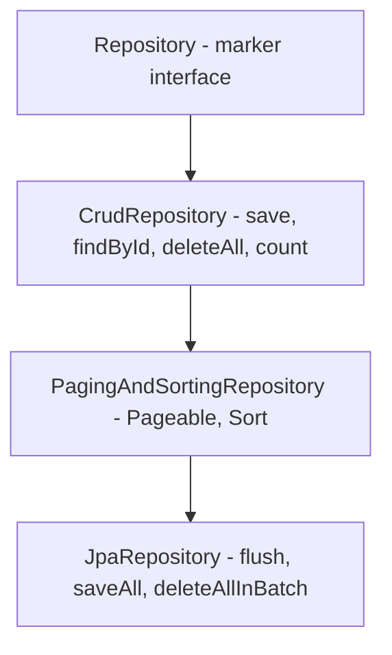
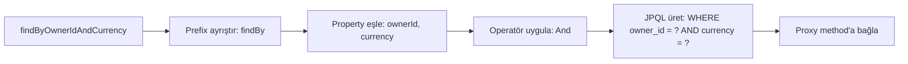
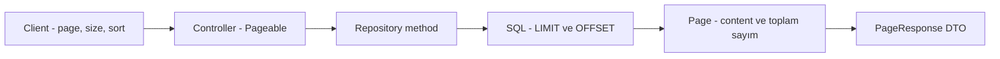

# Topic 2.2 — Spring Data JPA & Repositories

```admonish info title="Bu bölümde"
- Repository interface hiyerarşisi ve Spring'in proxy mekanizması — sen interface yazarsın, Spring implement eder
- Derived query'lerin metod adından SQL'e çözümlenmesi, sınırları ve `@Query` ile JPQL/native SQL
- Pagination'ın iç yüzü: `Page` vs `Slice` vs `List`, cursor-based alternatif, Sort whitelist'leme
- Specification pattern ile dinamik arama ve projection türleriyle efficient reporting
- Auditing, soft delete ve banking'e özgü repository anti-pattern'leri
```

## Hedef

Spring Data JPA'nın `JpaRepository` üzerinden sağladığı abstraction'ları **iç mekanikleriyle** öğrenmek. Derived query'lerin sınırlarını, JPQL ve native SQL'in ne zaman gerektiğini, Specification'ı, projection türlerini, pagination ve sort'u, ve auditing pattern'i banking örnekleriyle kavramak.

## Süre

Okuma: 1.5 saat • Kendini Sına: 30 dk • Pratik (opsiyonel): 2-3 saat • Toplam: ~2 saat (+ pratik)

## Önbilgi

- Topic 2.1 (JPA Fundamentals) bitti
- EntityManager, persistence context, entity state'leri biliyorsun
- Basit `JpaRepository.findById`, `save` çağrıları yaptın

---

## Kavramlar

### 1. Spring Data JPA mimarisi

Topic 2.1'de her query için EntityManager ile boğuştun; Spring Data JPA tam bu boilerplate'i yok etmek için var. JPA üzerine **opinion'lı abstraction** kurar ve sana üç hediye verir:

1. **Repository interface'leri** — sen interface yazıyorsun, Spring implement ediyor (proxy)
2. **Derived query'ler** — method ismini okuyarak SQL üretiyor (`findByOwnerId`)
3. **Pagination & Sorting** — built-in

Hiyerarşi yukarıdan aşağı zenginleşir:



`JpaRepository` JPA-specific en zengin interface; genelde bunu extend ederiz.

**Banking pratiği:** Domain'in adapter katmanında `JpaRepository`'leri **package-private** tut — persistence detayı dışarıya sızmasın:

```java
package com.mavibank.banking.account.adapter.out.persistence;

interface AccountJpaRepository extends JpaRepository<AccountJpaEntity, UUID> {
    // package-private, dışarıya sızmasın
}
```

Domain port (`AccountRepository`) public kalır; JPA repository sadece implementation detayıdır.

### 2. Derived query method'lar

Basit query'ler için SQL bile yazmana gerek yok: method ismi konvansiyonuna uyarsa Spring, ismi parse edip SQL üretir. Çözümleme akışı şöyle işler:



En temel form, eşitlik ve mantık operatörleri:

```java
interface AccountJpaRepository extends JpaRepository<AccountJpaEntity, UUID> {

    // SELECT * FROM accounts WHERE owner_id = ?
    List<AccountJpaEntity> findByOwnerId(UUID ownerId);

    // SELECT * FROM accounts WHERE owner_id = ? AND currency = ?
    List<AccountJpaEntity> findByOwnerIdAndCurrency(UUID ownerId, String currency);

    // SELECT * FROM accounts WHERE owner_id = ? OR currency = ?
    List<AccountJpaEntity> findByOwnerIdOrCurrency(UUID ownerId, String currency);
```

Sadece `find` değil: sayım ve varlık kontrolü de prefix'le çözülür — entity yüklemeden DB'de cevaplanır:

```java
    // SELECT COUNT(*) FROM accounts WHERE status = ?
    long countByStatus(AccountStatusEntity status);

    // SELECT EXISTS(... WHERE owner_id = ?)
    boolean existsByOwnerId(UUID ownerId);
```

Karşılaştırma, aralık ve koleksiyon operatörleri property adının sonuna eklenir:

```java
    // SELECT * FROM accounts WHERE balance_amount > ?
    List<AccountJpaEntity> findByBalanceAmountGreaterThan(BigDecimal threshold);

    // SELECT * FROM accounts WHERE balance_amount BETWEEN ? AND ?
    List<AccountJpaEntity> findByBalanceAmountBetween(BigDecimal min, BigDecimal max);

    // SELECT * FROM accounts WHERE currency IN (?, ?, ?)
    List<AccountJpaEntity> findByCurrencyIn(Collection<String> currencies);

    // SELECT * FROM accounts WHERE opened_at > ?
    List<AccountJpaEntity> findByOpenedAtAfter(Instant date);
```

Sıralama, limit, null kontrolü ve delete de isimden türetilir:

```java
    // SELECT * FROM accounts WHERE status = ? ORDER BY opened_at DESC
    List<AccountJpaEntity> findByStatusOrderByOpenedAtDesc(AccountStatusEntity status);

    // SELECT * FROM accounts WHERE status = ? LIMIT 10
    List<AccountJpaEntity> findTop10ByStatusOrderByOpenedAtDesc(AccountStatusEntity status);

    // SELECT * FROM accounts WHERE customer_reference IS NULL
    List<AccountJpaEntity> findByCustomerReferenceIsNull();

    // DELETE FROM accounts WHERE status = ?
    @Modifying
    @Transactional
    long deleteByStatus(AccountStatusEntity status);   // Banking'de fiziksel silme genelde anti-pattern
}
```

<details>
<summary>Tam kod: AccountJpaRepository derived query'leri (~44 satır)</summary>

```java
interface AccountJpaRepository extends JpaRepository<AccountJpaEntity, UUID> {

    // SELECT * FROM accounts WHERE owner_id = ?
    List<AccountJpaEntity> findByOwnerId(UUID ownerId);

    // SELECT * FROM accounts WHERE owner_id = ? AND currency = ?
    List<AccountJpaEntity> findByOwnerIdAndCurrency(UUID ownerId, String currency);

    // SELECT * FROM accounts WHERE owner_id = ? OR currency = ?
    List<AccountJpaEntity> findByOwnerIdOrCurrency(UUID ownerId, String currency);

    // SELECT COUNT(*) FROM accounts WHERE status = ?
    long countByStatus(AccountStatusEntity status);

    // SELECT EXISTS(... WHERE owner_id = ?)
    boolean existsByOwnerId(UUID ownerId);

    // SELECT * FROM accounts WHERE balance_amount > ?
    List<AccountJpaEntity> findByBalanceAmountGreaterThan(BigDecimal threshold);

    // SELECT * FROM accounts WHERE balance_amount BETWEEN ? AND ?
    List<AccountJpaEntity> findByBalanceAmountBetween(BigDecimal min, BigDecimal max);

    // SELECT * FROM accounts WHERE currency IN (?, ?, ?)
    List<AccountJpaEntity> findByCurrencyIn(Collection<String> currencies);

    // SELECT * FROM accounts WHERE opened_at > ?
    List<AccountJpaEntity> findByOpenedAtAfter(Instant date);

    // SELECT * FROM accounts WHERE status = ? ORDER BY opened_at DESC
    List<AccountJpaEntity> findByStatusOrderByOpenedAtDesc(AccountStatusEntity status);

    // SELECT * FROM accounts WHERE status = ? LIMIT 10
    List<AccountJpaEntity> findTop10ByStatusOrderByOpenedAtDesc(AccountStatusEntity status);

    // SELECT * FROM accounts WHERE customer_reference IS NULL
    List<AccountJpaEntity> findByCustomerReferenceIsNull();

    // DELETE FROM accounts WHERE status = ?
    @Modifying
    @Transactional
    long deleteByStatus(AccountStatusEntity status);   // Banking'de fiziksel silme genelde anti-pattern
}
```

</details>

**Anahtar kelimeler:**

| Keyword | SQL eşdeğeri |
|---|---|
| `findBy`, `getBy`, `queryBy`, `readBy` | SELECT |
| `countBy` | SELECT COUNT |
| `existsBy` | SELECT EXISTS |
| `deleteBy` (with `@Modifying`) | DELETE |
| `And`, `Or` | AND, OR |
| `Is`, `Equals` | = |
| `GreaterThan`, `LessThan` | >, < |
| `GreaterThanEqual` | >= |
| `Between` | BETWEEN |
| `In`, `NotIn` | IN |
| `Like`, `NotLike` | LIKE |
| `IsNull`, `IsNotNull` | IS NULL |
| `OrderBy<Field>Asc/Desc` | ORDER BY |
| `Top<n>`, `First<n>` | LIMIT n |
| `Distinct` | SELECT DISTINCT |

Sınırlarını bil: method ismi 3-4 koşuldan sonra okunmaz olur, dinamik filtre (kullanıcının seçtiği alanlar) isimle anlatılamaz, aggregation ve complex JOIN için `@Query` veya native gerekir. <mark>Banking pratiği: 2-3 koşula kadar derived query, daha fazlası `@Query`</mark>.

### 3. `@Query` — JPQL ve native SQL

Derived query'nin yetmediği yerde query'yi kendin yazarsın — ama iki dilden hangisiyle yazacağın bilinçli bir karar.

#### JPQL

```java
@Query("""
    SELECT a FROM AccountJpaEntity a 
    WHERE a.ownerId = :ownerId 
    AND a.status = 'ACTIVE'
    AND a.balanceAmount > :minBalance
    ORDER BY a.openedAt DESC
""")
List<AccountJpaEntity> findActiveAccountsAboveBalance(
    @Param("ownerId") UUID ownerId,
    @Param("minBalance") BigDecimal minBalance
);
```

**JPQL** SQL değildir: table yerine **entity class ismi**, kolon yerine **field ismi** kullanır. JOIN'ler entity ilişkileri üzerinden yürür (`a.journalLines`) ve query veritabanı-bağımsızdır. Named parameters (`:name`) tercih edilir; positional (`?1`) anti-pattern.

#### Native SQL

```java
@Query(value = """
    SELECT * FROM accounts 
    WHERE owner_id = :ownerId 
    AND balance_amount > :minBalance
""", nativeQuery = true)
List<AccountJpaEntity> findActiveNative(
    @Param("ownerId") UUID ownerId,
    @Param("minBalance") BigDecimal minBalance
);
```

Ne zaman native? DB-specific feature (PostgreSQL window functions, MERGE, JSON operators), JPQL'in üretemediği optimum SQL, ya da JPQL'le anlatılamayacak kadar complex query. Tuzağı: native query DB değişikliğine kapalıdır — PostgreSQL'den Oracle'a geçersen rewrite.

#### `@Modifying` — UPDATE/DELETE

Bulk update'te satırları tek tek yükleyip dirty checking beklemek israf; direkt SQL atarsın:

```java
@Modifying
@Transactional
@Query("UPDATE AccountJpaEntity a SET a.status = :status WHERE a.id = :id")
int updateStatus(@Param("id") UUID id, @Param("status") AccountStatusEntity status);
```

`@Modifying` UPDATE/DELETE için zorunludur, `@Transactional` olmadan çağrılırsa hata alırsın; dönen `int` etkilenen satır sayısıdır. Asıl kritik nokta: <mark>bulk UPDATE/DELETE persistence context'i bypass eder — managed entity'lerin state'i güncellenmez</mark>.

```admonish warning title="Dikkat"
`@Modifying` query'den sonra persistence context'teki entity'ler **stale** kalır: DB'de status değişti ama memory'deki nesne eskiyi gösterir. `@Modifying(clearAutomatically = true)` ile PC'yi temizle veya `em.refresh()` çağır. Banking'de bulk update hızlıdır ama bu tutarsızlığı yönetmeden kullanma.
```

### 4. Pagination — `Pageable` ve `Page`

Banking tablosunda milyonlarca satır olur; "hepsini getir" diye bir seçenek yok. Akış uçtan uca şöyle:



Repository tarafı tek parametre eklemek kadar basit:

```java
interface AccountJpaRepository extends JpaRepository<AccountJpaEntity, UUID> {
    Page<AccountJpaEntity> findByStatus(AccountStatusEntity status, Pageable pageable);
}
```

Controller'da `Pageable` otomatik bind edilir; entity'yi asla direkt dönme, response DTO'ya çevir:

```java
@GetMapping
PageResponse<AccountResponse> list(
    @PageableDefault(size = 20, sort = "openedAt", direction = Sort.Direction.DESC)
    Pageable pageable
) {
    Page<AccountJpaEntity> page = repository.findByStatus(ACTIVE, pageable);
    return new PageResponse<>(
        page.getContent().stream().map(mapper::toResponse).toList(),
        page.getNumber(),
        page.getSize(),
        page.getTotalElements(),
        page.getTotalPages()
    );
}
```

**Dönüş tipi seçimi** performansı belirler:

- `Page<T>` — toplam sayım yapar (ekstra `SELECT COUNT(*)` query). Toplam page bilgisi var.
- `Slice<T>` — sayım yapmaz; sadece "sonraki sayfa var mı" (`hasNext()`). Performansı daha iyi.
- `List<T>` — sayfalama yapar ama metadata yok.

```admonish tip title="İpucu"
Transaction history (milyonlarca kayıt) için `Slice` — COUNT query'si pahalıdır. Hesap listesi (az kayıt) için `Page`. `List<T>` döndürüyorsan limit'i mutlaka clamp et (max 1000) — yoksa client'ı OOM yaparsın.
```

#### Cursor-based pagination (alternatif)

`OFFSET 1000000 LIMIT 20` çok yavaştır — DB 1M kaydı okuyup atlar. Transaction history için **cursor-based** yaklaşım daha iyi: son görülen kaydın (`occurredAt`, `id`) çiftinden devam edersin.

```java
@Query("""
    SELECT t FROM TransactionJpaEntity t 
    WHERE t.accountId = :accountId 
    AND (t.occurredAt < :cursorTime OR (t.occurredAt = :cursorTime AND t.id < :cursorId))
    ORDER BY t.occurredAt DESC, t.id DESC
    LIMIT :limit
""")
List<TransactionJpaEntity> findByAccountAfterCursor(
    @Param("accountId") UUID accountId,
    @Param("cursorTime") Instant cursorTime,
    @Param("cursorId") UUID cursorId,
    @Param("limit") int limit
);
```

Phase 2'de detaylandırmayacağız, ama konsepti bil.

### 5. `Sort` — dinamik sıralama

Sıralamayı da client belirleyebilir; Spring URL'deki `sort` parametrelerini otomatik parse eder:

```java
Page<AccountJpaEntity> page = repository.findAll(
    PageRequest.of(0, 20, Sort.by("openedAt").descending().and(Sort.by("currency").ascending()))
);
```

```
GET /v1/accounts?sort=openedAt,desc&sort=currency,asc&page=0&size=20
```

```admonish warning title="Dikkat"
Kullanıcının istediği herhangi bir field'da sort yapmasına izin verme — sensitive bilgi sızdırabilir (sıralama davranışından değer çıkarımı) veya index'siz kolonda performans katliamı yapar. Sort field'larını mutlaka whitelist'le.
```

```java
private static final Set<String> ALLOWED_SORT_FIELDS = Set.of("openedAt", "balanceAmount", "currency");

private Sort sanitize(Sort sort) {
    return Sort.by(sort.stream()
        .filter(o -> ALLOWED_SORT_FIELDS.contains(o.getProperty()))
        .toList());
}
```

### 6. Specifications — dinamik query

Kullanıcı 5 farklı filtre seçebilir (currency, status, balance min/max, owner) ve hangisini göndereceğini bilmiyorsun. Derived query'yle anlatılamaz; JPQL'de string concat anti-pattern. Çözüm **Specification pattern** — repository'ye tek interface eklersin:

```java
interface AccountJpaRepository extends 
    JpaRepository<AccountJpaEntity, UUID>,
    JpaSpecificationExecutor<AccountJpaEntity> { }   // ← ek interface
```

Her filtre kendi static method'unda yaşar; `null` gelen filtre `null` predicate döner ve otomatik ignore edilir:

```java
public class AccountSpecifications {

    public static Specification<AccountJpaEntity> hasOwnerId(UUID ownerId) {
        return (root, query, cb) -> 
            ownerId == null ? null : cb.equal(root.get("ownerId"), ownerId);
    }

    public static Specification<AccountJpaEntity> hasCurrency(String currency) {
        return (root, query, cb) -> 
            currency == null ? null : cb.equal(root.get("currency"), currency);
    }

    public static Specification<AccountJpaEntity> hasStatus(AccountStatusEntity status) {
        return (root, query, cb) -> 
            status == null ? null : cb.equal(root.get("status"), status);
    }
```

Aralık filtresi biraz daha zengin — min/max kombinasyonlarını tek method karşılar:

```java
    public static Specification<AccountJpaEntity> balanceBetween(BigDecimal min, BigDecimal max) {
        return (root, query, cb) -> {
            if (min != null && max != null) return cb.between(root.get("balanceAmount"), min, max);
            if (min != null) return cb.greaterThanOrEqualTo(root.get("balanceAmount"), min);
            if (max != null) return cb.lessThanOrEqualTo(root.get("balanceAmount"), max);
            return null;
        };
    }
}
```

Kullanımda specification'ları zincirlersin; sonuç type-safe (refactoring güvenli):

```java
public Page<Account> search(AccountFilter filter, Pageable pageable) {
    Specification<AccountJpaEntity> spec = Specification
        .where(AccountSpecifications.hasOwnerId(filter.ownerId()))
        .and(AccountSpecifications.hasCurrency(filter.currency()))
        .and(AccountSpecifications.hasStatus(filter.status()))
        .and(AccountSpecifications.balanceBetween(filter.minBalance(), filter.maxBalance()));

    return repository.findAll(spec, pageable);
}
```

**Banking pratiği:** Search/filter endpoint'leri, reporting filtreleri ve admin panelleri için ideal.

### 7. Criteria API — düşük seviyeli

Specification'ın altında **JPA Criteria API** çalışır — Hibernate-specific değil, JPA standardı. Aynı dinamik query'yi elle kurmak şöyle görünür:

```java
public List<AccountJpaEntity> findAccountsCriteria(UUID ownerId, BigDecimal minBalance) {
    CriteriaBuilder cb = em.getCriteriaBuilder();
    CriteriaQuery<AccountJpaEntity> cq = cb.createQuery(AccountJpaEntity.class);
    Root<AccountJpaEntity> root = cq.from(AccountJpaEntity.class);

    List<Predicate> predicates = new ArrayList<>();
    if (ownerId != null) predicates.add(cb.equal(root.get("ownerId"), ownerId));
    if (minBalance != null) predicates.add(cb.greaterThanOrEqualTo(root.get("balanceAmount"), minBalance));

    cq.where(predicates.toArray(new Predicate[0]));
    cq.orderBy(cb.desc(root.get("openedAt")));

    return em.createQuery(cq).getResultList();
}
```

Çoğu zaman Specification > Criteria: Criteria daha verbose, daha düşük seviye. Yine de bil — JPA spec'inin parçası ve Specification'ın motoru.

### 8. Projection türleri

Reporting endpoint'inde tüm entity field'larını çekmek israf — 3 kolon lazımken 15 kolon SELECT etme. Çözüm **DTO projection**.

#### Interface-based projection

```java
public interface AccountSummary {
    UUID getId();
    String getCurrency();
    BigDecimal getBalanceAmount();
}

interface AccountJpaRepository extends JpaRepository<AccountJpaEntity, UUID> {
    List<AccountSummary> findByOwnerId(UUID ownerId);
}
```

Spring otomatik proxy üretir ve **sadece istenen kolonları SELECT eder** — performans kazancı doğrudan SQL log'da görünür. Nested projection da mümkün:

```java
public interface AccountWithOwnerSummary {
    UUID getId();
    BigDecimal getBalanceAmount();
    OwnerSummary getOwner();

    interface OwnerSummary {
        String getName();
        String getEmail();
    }
}
```

#### Class-based (DTO) projection

```java
public record AccountSummaryDto(
    UUID id,
    String currency,
    BigDecimal balanceAmount
) {}

@Query("""
    SELECT new com.mavibank.banking.account.adapter.out.persistence.AccountSummaryDto(
        a.id, a.currency, a.balanceAmount
    )
    FROM AccountJpaEntity a
    WHERE a.ownerId = :ownerId
""")
List<AccountSummaryDto> findSummariesByOwner(@Param("ownerId") UUID ownerId);
```

JPQL constructor expression. Performansı interface-based ile aynı, üstelik proxy yerine gerçek nesne — tip-güvenli. **Banking pratiği:** Record DTO + constructor expression tercih et.

#### Dynamic projection

```java
<T> List<T> findByOwnerId(UUID ownerId, Class<T> type);

// Çağrı:
List<AccountSummary> summaries = repo.findByOwnerId(ownerId, AccountSummary.class);
List<AccountJpaEntity> full = repo.findByOwnerId(ownerId, AccountJpaEntity.class);
```

Aynı method farklı projection döner. Aşırı esnek ama nadiren gerekli.

### 9. Auditing — kim ne zaman değiştirdi

Banking'de her satır için "kim oluşturdu, ne zaman, son güncelleyen kim, ne zaman" sorularına cevap vermek zorundasın — regülatör de müşteri itirazı da bunu ister. Spring Data JPA bunu built-in destekler.

Önce feature'ı aç:

```java
@SpringBootApplication
@EnableJpaAuditing
public class CoreBankingApplication { }
```

Audit kolonlarını her entity'de tekrarlamak yerine bir `@MappedSuperclass`'ta topla:

```java
@MappedSuperclass
@EntityListeners(AuditingEntityListener.class)
public abstract class AuditableEntity {

    @CreatedDate
    @Column(name = "created_at", nullable = false, updatable = false)
    private Instant createdAt;

    @LastModifiedDate
    @Column(name = "updated_at", nullable = false)
    private Instant updatedAt;

    @CreatedBy
    @Column(name = "created_by", nullable = false, updatable = false, length = 100)
    private String createdBy;

    @LastModifiedBy
    @Column(name = "updated_by", nullable = false, length = 100)
    private String updatedBy;

    // getters
}
```

Entity'ler sadece extend eder:

```java
@Entity
class AccountJpaEntity extends AuditableEntity {
    @Id UUID id;
    // ...
}
```

"Kim" bilgisini `AuditorAware` provider sağlar — security context'ten user'ı okur:

```java
@Component
class SecurityAuditorAware implements AuditorAware<String> {

    @Override
    public Optional<String> getCurrentAuditor() {
        return Optional.ofNullable(SecurityContextHolder.getContext().getAuthentication())
            .filter(Authentication::isAuthenticated)
            .map(Authentication::getName)
            .or(() -> Optional.of("system"));
    }
}
```

Provider'ı aktive et:

```java
@Configuration
@EnableJpaAuditing(auditorAwareRef = "securityAuditorAware")
class AuditingConfig { }
```

Sonuç: her `save` çağrısında dört kolon otomatik dolar. **Banking pratiği:** Tüm entity'ler `AuditableEntity` extend etsin; audit kolonları DB'de NOT NULL olsun.

### 10. Soft delete pattern

Banking'de hesap "silinmez" — kapanır, kayıt kalır. Fiziksel DELETE yerine bir işaret kolonu kullanırız:

```java
@Entity
class AccountJpaEntity {
    @Id UUID id;

    @Column(name = "deleted_at")
    private Instant deletedAt;   // null → aktif, dolu → silinmiş

    // getters
}
```

Hibernate `@SQLDelete` ve `@Where` ile bunu transparent yapar:

```java
@Entity
@SQLDelete(sql = "UPDATE accounts SET deleted_at = NOW() WHERE id = ?")
@Where(clause = "deleted_at IS NULL")
class AccountJpaEntity {
    // ...
}
```

Artık `repo.delete(account)` DELETE değil UPDATE çıkarır; default query'lere `deleted_at IS NULL` filtresi otomatik eklenir.

```admonish warning title="Dikkat"
`@Where` Hibernate-specific — JPA standardında yok. Spring Boot 3 + Hibernate 6 ile `@SoftDelete` (deneysel) geliyor. Vendor'a bağımlılığın farkında ol.
```

Account/Customer için soft delete idealdir. <mark>Audit kayıtları için fiziksel delete ASLA yapılmaz — regülatör kaydın kalmasını ister</mark>.

### 11. Custom repository implementation

Bazen Spring Data'nın sağlamadığı bir şey gerekir (çok complex query, custom JDBC). Üçlü pattern ile kendi implementation'ını Spring Data repository'ye eklersin:

```java
// 1. Public repository
interface AccountJpaRepository extends 
    JpaRepository<AccountJpaEntity, UUID>,
    AccountJpaRepositoryCustom { }

// 2. Custom interface
interface AccountJpaRepositoryCustom {
    Page<AccountJpaEntity> findByComplexCriteria(SearchCriteria criteria);
}

// 3. Implementation — naming convention: <RepoName>Impl
class AccountJpaRepositoryImpl implements AccountJpaRepositoryCustom {

    @PersistenceContext
    private EntityManager em;

    @Override
    public Page<AccountJpaEntity> findByComplexCriteria(SearchCriteria criteria) {
        // Custom logic with em
        ...
    }
}
```

Spring naming convention'dan (`Impl` suffix) implementation'ı bulur ve otomatik birleştirir. Kullanan taraf tek bir `AccountJpaRepository` görür.

### 12. `@Transactional(readOnly = true)`

Sadece okuyan kod için Hibernate'e "değişiklik takip etme" demek bedava performans kazancıdır:

```java
@Service
@Transactional(readOnly = true)   // class-level default read-only
class AccountReportingService {

    public Account getById(AccountId id) { ... }

    @Transactional   // method-level override — write için
    public void updateStatus(AccountId id, Status status) { ... }
}
```

Faydaları: Hibernate dirty checking yapmaz (snapshot tutmaz), DB driver bazı durumlarda read-only optimization uygular (Oracle bunu hisseder), read-only replica'ya yönlendirme mümkün olur (Phase 9). **Banking pratiği:** Reporting service'lerinin tümü `readOnly = true`; write service'ler default.

### 13. `findById` vs `getReferenceById` (eski `getOne`)

Sadece foreign key kurmak için entity'nin tamamını SELECT etmek israftır — Spring iki farklı araç verir:

```java
Optional<AccountJpaEntity> opt = repo.findById(id);       // SELECT fırlatır
AccountJpaEntity proxy = repo.getReferenceById(id);       // Lazy proxy döner
```

<mark>`getReferenceById` DB'ye gitmez — sadece ID taşıyan lazy proxy döner</mark>. Field'a erişirsen o an lazy load tetiklenir. Banking örneği:

```java
public void createJournalLine(UUID journalId, UUID accountId, BigDecimal amount) {
    JournalLineJpaEntity line = new JournalLineJpaEntity();
    line.setJournalEntry(journalRepo.getReferenceById(journalId));   // SELECT YOK
    line.setAccount(accountRepo.getReferenceById(accountId));         // SELECT YOK
    line.setAmount(amount);
    lineRepo.save(line);
}
```

3 SELECT yerine sadece 1 INSERT — hot path'te ciddi kazanç.

```admonish tip title="İpucu"
`getReferenceById` ID DB'de yoksa **save zamanında** patlar (foreign key constraint) — erken ve net hata istiyorsan `findById` ile varlığı doğrula. Kural: varlığından eminsen ve sadece FK kuruyorsan `getReferenceById`; entity verisi lazımsa veya varlık belirsizse `findById`.
```

### 14. Entity callbacks — `@PrePersist`, `@PreUpdate`

Lifecycle olaylarına küçük kancalar takabilirsin — ID ve default değer atamak için idealdir:

```java
@Entity
class AccountJpaEntity {
    @Id UUID id;

    @PrePersist
    void prePersist() {
        if (id == null) id = UUID.randomUUID();
        if (openedAt == null) openedAt = Instant.now();
    }

    @PreUpdate
    void preUpdate() {
        // örnek: status değişikliğinde audit log
    }
}
```

Mevcut callback'ler: `@PrePersist`/`@PostPersist`, `@PreUpdate`/`@PostUpdate`, `@PreRemove`/`@PostRemove`, `@PostLoad`.

**Banking tuzağı:** Callback içinde başka entity manage etme, DI servisi çağırma. Callback minimal kalsın (basit default'lar, validation) — business logic burada **olmamalı**.

### 15. Banking anti-pattern'leri

Bölümü kapatmadan, code review'da en sık yakalanan beş hatayı tanı.

**Anti-pattern 1: Repository'yi Controller'a inject etme**

```java
@RestController
class AccountController {
    private final AccountJpaRepository repo;   // ❌ persistence sızdı

    @GetMapping("/{id}")
    AccountJpaEntity get(@PathVariable UUID id) { ... }   // ❌ entity döndü
}
```

Hexagonal mimari kuralı: Controller → Service (use case) → Repository (port). Direkt JPA repo kullanma.

**Anti-pattern 2: `findAll()` korkusuzca**

```java
List<AccountJpaEntity> all = repo.findAll();   // 10M kayıt = OOM
```

Banking'de bir tablo milyonlarca satır olur; `findAll` asla `Pageable`'sız çağrılmaz.

**Anti-pattern 3: N+1 üreten loop**

```java
List<UUID> ids = ...;
List<AccountJpaEntity> accounts = ids.stream()
    .map(id -> repo.findById(id).orElseThrow())   // N+1!
    .toList();
```

Çözüm: `findAllById(ids)` — tek query, IN clause.

**Anti-pattern 4: `@Query` string concat**

```java
@Query("SELECT a FROM AccountJpaEntity a WHERE a.id = " + accountId)   // SQL injection!
```

Her zaman `:param` named parameters.

**Anti-pattern 5: Spring Data'yı bırakıp her şeye native SQL**

Junior bazen "JPA çok karışık" deyip her şeyi native yazar; dirty checking, identity map, cascade gibi faydalar kaybolur. **Önce JPQL, gerekirse native.**

---

## Önemli olabilecek araştırma kaynakları

- Spring Data JPA reference documentation
- "Spring Data JPA: Beyond CRUD" (Eugen Paraschiv)
- Vlad Mihalcea JPA Performance series
- "Spring Data Specifications" Baeldung
- Hibernate ORM 6 user guide
- "Effective Java" — record immutability for DTO projection

---

## Kendini Sına

Aşağıdaki soruları önce **cevaba bakmadan** kendi cümlelerinle yanıtlamayı dene — hepsi mülakatta karşına çıkabilecek tarzda. Takıldığın soru olursa ilgili Kavramlar başlığına dön, sonra tekrar dene.

**S1. Spring Data repository hiyerarşisini anlat. Banking projesinde JPA repository interface'ini neden package-private tutarız?**

<details>
<summary>Cevabı göster</summary>

Hiyerarşi: `Repository` (marker) → `CrudRepository` (save, findById, count, deleteAll) → `PagingAndSortingRepository` (Pageable, Sort) → `JpaRepository` (flush, saveAll, deleteAllInBatch gibi JPA-specific method'lar). Genelde en zengini olan `JpaRepository` extend edilir; Spring bu interface için runtime'da bir proxy implementation üretir.

Package-private tutmanın sebebi hexagonal mimari: JPA repository bir implementation detayıdır ve adapter package'ının dışına sızmamalıdır. Public olan, domain'in tanımladığı port'tur (`AccountRepository`); adapter class bu port'u implement edip JPA repository'yi içeride kullanır. Böylece controller veya service yanlışlıkla JPA'ya bağımlı hale gelemez.

</details>

**S2. Derived query mekanizması nasıl çalışır? Sınırları neler ve ne zaman `@Query`'ye geçersin?**

<details>
<summary>Cevabı göster</summary>

Spring, method ismini parse eder: prefix (`findBy`, `countBy`, `existsBy`, `deleteBy`) operasyonu, sonrasındaki property isimleri WHERE koşullarını, aradaki keyword'ler (`And`, `Or`, `GreaterThan`, `Between`, `In`, `OrderBy...`) operatörleri belirler. Bu isimden JPQL üretilir ve proxy method'a bağlanır — sen hiç SQL yazmazsın.

Sınırları: 3-4 koşuldan sonra method ismi okunmaz olur; dinamik filtre (kullanıcının seçtiği alanlar) isimle ifade edilemez; aggregation ve complex JOIN üretilemez. Banking kuralı: 2-3 koşula kadar derived query, daha fazlası `@Query` ile JPQL; dinamik filtreler için Specification.

</details>

**S3. `@Modifying` bulk update persistence context'te nasıl bir tutarsızlık yaratır ve bunu nasıl önlersin?**

<details>
<summary>Cevabı göster</summary>

`@Modifying` query doğrudan DB'ye SQL atar, persistence context'i **bypass eder**. PC'de zaten yüklü managed entity'ler varsa onların state'i güncellenmez: DB'de `status = CLOSED` oldu ama memory'deki nesne hâlâ `ACTIVE` gösterir. Aynı transaction'da bu entity'yi okuyan kod stale data ile çalışır.

Önlemler: `@Modifying(clearAutomatically = true)` ile query sonrası PC'yi temizlemek (sonraki okuma DB'den taze gelir) veya ilgili entity'de `em.refresh()` çağırmak. Ayrıca `@Modifying` UPDATE/DELETE için zorunludur ve transaction içinde çağrılmalıdır; dönen `int` etkilenen satır sayısıdır.

</details>

**S4. `Page`, `Slice` ve `List` arasındaki fark nedir? Milyonlarca kayıtlık transaction history için hangisini seçersin?**

<details>
<summary>Cevabı göster</summary>

`Page<T>` içeriğe ek olarak toplam element/sayfa sayısını taşır — bunun için ekstra bir `SELECT COUNT(*)` query çalıştırır. `Slice<T>` sayım yapmaz, sadece `hasNext()` ile "sonraki sayfa var mı" bilgisi verir (bunu size+1 kayıt çekerek anlar) — daha performanslı. `List<T>` sayfalamayı uygular ama hiçbir metadata dönmez.

Transaction history gibi milyonlarca satırlık tabloda `Slice` seçilir çünkü her istekte COUNT çalıştırmak pahalıdır ve kullanıcı zaten "toplam 4.812.339 sayfa" bilgisine ihtiyaç duymaz. Az kayıtlı hesap listesi gibi yerlerde `Page` uygundur. `List` dönüyorsan limit'i clamp etmeyi (max 1000) unutma.

</details>

**S5. Offset-based pagination büyük offset'lerde neden yavaşlar? Cursor-based pagination bunu nasıl çözer?**

<details>
<summary>Cevabı göster</summary>

`OFFSET 1000000 LIMIT 20` sorgusunda DB, atlayacağı 1M satırı yine de okuyup saymak zorundadır — offset büyüdükçe maliyet lineer artar. Ayrıca sayfalar arasında yeni kayıt girerse satır kaymaları olur (aynı kaydı iki kez görme / atlama).

Cursor-based yaklaşımda client son gördüğü kaydın (`occurredAt`, `id`) çiftini cursor olarak gönderir; query `WHERE occurredAt < :cursorTime OR (occurredAt = :cursorTime AND id < :cursorId)` koşuluyla index üzerinden doğrudan devam noktasına atlar — offset yok, sabit maliyet. `id`'nin koşula eklenmesi, aynı timestamp'li kayıtlarda deterministik sıra sağlar. Banking'de transaction history için standart tercihtir.

</details>

**S6. Specification pattern hangi problemi çözer? Null gelen filtre nasıl handle edilir?**

<details>
<summary>Cevabı göster</summary>

Dinamik query problemini çözer: kullanıcı 5 filtreden hangilerini göndereceği belli olmayan bir search endpoint'inde derived query yazamazsın, JPQL string concat ise injection ve bakım felaketidir. Her filtre `Specification<T>` dönen bir static method olur ve `Specification.where(...).and(...).and(...)` ile type-safe şekilde birleştirilir; altta JPA Criteria API çalışır.

Null handling konvansiyonu: filtre değeri null ise lambda `null` predicate döner ve Spring o koşulu query'ye hiç eklemez — "filtre yok" anlamına gelir.

```java
public static Specification<AccountJpaEntity> hasCurrency(String currency) {
    return (root, query, cb) ->
        currency == null ? null : cb.equal(root.get("currency"), currency);
}
```

</details>

**S7. Interface-based projection ile class-based (DTO) projection farkı nedir? Reporting için hangisini tercih edersin?**

<details>
<summary>Cevabı göster</summary>

İkisi de tam entity yerine sadece gereken kolonları SELECT eder — performansları aynıdır. Interface-based'de getter'lı bir interface tanımlarsın, Spring runtime'da proxy üretir; derived query ile bile çalışır, nested projection destekler. Class-based'de bir record/class tanımlar ve JPQL constructor expression ile (`SELECT new com.x.AccountSummaryDto(a.id, ...)`) doldurursun — proxy yok, gerçek immutable nesne.

Banking tercihi: record DTO + constructor expression. Tip-güvenli, debug'ı kolay, proxy sürprizi yok. Dynamic projection (`<T> List<T> findByOwnerId(UUID id, Class<T> type)`) aynı method'dan farklı projection döndürür ama nadiren gerekir.

</details>

**S8. `getReferenceById` ile `findById` farkı nedir? `getReferenceById`'nin tuzağı ne?**

<details>
<summary>Cevabı göster</summary>

`findById` hemen SELECT atar ve `Optional<T>` döner. `getReferenceById` DB'ye gitmez — sadece ID taşıyan lazy proxy döner; herhangi bir field'a eriştiğin an lazy load tetiklenir. Foreign key kurarken idealdir: journal line yaratırken iki hesabı `getReferenceById` ile referanslarsan 2 SELECT tasarruf edip sadece 1 INSERT atarsın.

Tuzağı: ID DB'de yoksa hata anında değil, **save/flush zamanında** foreign key constraint ihlaliyle patlar — hata geç ve dolaylı gelir. Varlığı belirsizse veya entity verisine ihtiyacın varsa `findById`; varlığından eminsen ve sadece ilişki kuruyorsan `getReferenceById`.

</details>

---

## Tamamlama kriterleri

- [ ] "Kendini Sına" bölümündeki tüm soruları cevaba bakmadan açıklayabiliyorum
- [ ] Repository hiyerarşisini ve JPA repository'nin neden package-private olduğunu biliyorum
- [ ] Derived query sınırlarını biliyorum; 2-3 koşuldan fazlasında `@Query`'ye geçiyorum
- [ ] `@Modifying`'in persistence context'i bypass ettiğini ve çözümünü açıklayabiliyorum
- [ ] `Page` / `Slice` / `List` seçimini ve cursor-based pagination'ın avantajını gerekçelendirebiliyorum
- [ ] Sort field'larını whitelist'lemeden client input'una açmıyorum
- [ ] Specification ile dinamik search kurabiliyor, projection ile SELECT'i küçültebiliyorum
- [ ] Auditing ve soft delete pattern'lerini banking gerekçeleriyle anlatabiliyorum
- [ ] (Opsiyonel) "Pratik yapmak istersen" bölümündeki testleri yazdım ve Claude-verify prompt'uyla doğrulattım

---

## Defter notları

1. "JpaRepository hierarchy: ____."
2. "Derived query method ismi 4+ koşulla yazınca ne yapmalı: ____."
3. "JPQL ile native SQL arasında karar verirken bakacağım kriter: ____."
4. "`Page` vs `Slice` vs `List` ne zaman hangisi: ____."
5. "Cursor-based pagination'ın offset-based'a göre avantajı: ____."
6. "Specification pattern'in derived query'e göre avantajı: ____."
7. "Interface projection vs DTO projection (class) farkı: ____."
8. "`getReferenceById` ile `findById` farkı + ne zaman: ____."
9. "Auditing için 4 standart kolon ve `updatable = false` neden: ____."
10. "Banking'de soft delete sebebi, hangi tablolar HARIÇ: ____."

```admonish success title="Bölüm Özeti"
- Spring Data JPA'da sen interface yazarsın, Spring proxy üretir; JPA repository package-private kalır, dışarıya domain port açılır
- Derived query 2-3 koşula kadar; fazlası `@Query` (JPQL, named parameters), DB-specific ihtiyaçta native SQL
- `@Modifying` bulk update persistence context'i bypass eder — `clearAutomatically = true` veya `em.refresh()` ile tutarlılığı koru
- Büyük tablolarda `Slice` veya cursor-based pagination; `findAll()` asla Pageable'sız, sort field'ları whitelist'li
- Dinamik filtreler Specification ile, reporting record DTO projection ile — gereksiz kolon SELECT etme
- Auditing (4 kolon, `AuditorAware`) ve soft delete banking'in vazgeçilmezi; audit kayıtları asla fiziksel silinmez
```

---

## Pratik yapmak istersen

Kavramları koda dökmek istersen aşağıdaki iki ek hazır: test yazma rehberi repository, projection ve auditing için `@DataJpaTest` + TestContainers örnekleri içerir; Claude-verify prompt'u ile yazdığın kodu banking-grade perspektiften denetletebilirsin.

<details>
<summary>Test yazma rehberi</summary>

### Test 2.2.1 — Repository test (`@DataJpaTest` + TestContainers)

```java
@DataJpaTest
@Testcontainers
@AutoConfigureTestDatabase(replace = AutoConfigureTestDatabase.Replace.NONE)
class AccountJpaRepositoryTest {
    
    @Container
    @ServiceConnection
    static PostgreSQLContainer<?> postgres = new PostgreSQLContainer<>("postgres:16-alpine");
    
    @Autowired AccountJpaRepository repo;
    @Autowired TestEntityManager em;
    
    @Test
    void findByOwnerIdShouldReturnMatching() {
        UUID owner = UUID.randomUUID();
        em.persist(createAccountEntity(owner, "TRY"));
        em.persist(createAccountEntity(owner, "USD"));
        em.persist(createAccountEntity(UUID.randomUUID(), "TRY"));   // başka owner
        em.flush();
        
        List<AccountJpaEntity> result = repo.findByOwnerId(owner);
        
        assertThat(result).hasSize(2);
        assertThat(result).allMatch(a -> a.getOwnerId().equals(owner));
    }
    
    @Test
    void pagingShouldWork() {
        UUID owner = UUID.randomUUID();
        for (int i = 0; i < 25; i++) {
            em.persist(createAccountEntity(owner, "TRY"));
        }
        em.flush();
        
        Page<AccountJpaEntity> page0 = repo.findByOwnerId(owner, 
            PageRequest.of(0, 10, Sort.by("openedAt")));
        
        assertThat(page0.getContent()).hasSize(10);
        assertThat(page0.getTotalElements()).isEqualTo(25);
        assertThat(page0.getTotalPages()).isEqualTo(3);
    }
    
    @Test
    void specificationShouldFilter() {
        // ...
    }
}
```

### Test 2.2.2 — Projection test

```java
@Test
void summaryProjectionShouldOnlyFetchProjectedFields() {
    // Setup
    em.persist(createAccountEntity());
    em.flush();
    em.clear();
    
    // Reset Hibernate statistics
    SessionFactory sf = em.getEntityManagerFactory().unwrap(SessionFactory.class);
    sf.getStatistics().clear();
    
    List<AccountSummaryDto> summaries = repo.findSummariesByOwner(ownerId);
    
    // Bir tane prepare statement ama hiç entity load değil
    assertThat(sf.getStatistics().getPrepareStatementCount()).isEqualTo(1);
    assertThat(sf.getStatistics().getEntityLoadCount()).isZero();
}
```

### Test 2.2.3 — Auditing test

```java
@SpringBootTest
@AutoConfigureTestDatabase(replace = AutoConfigureTestDatabase.Replace.NONE)
@Testcontainers
class AuditingTest {
    
    @MockBean SecurityAuditorAware auditorAware;
    
    @Test
    void shouldPopulateAuditFieldsOnInsert() {
        when(auditorAware.getCurrentAuditor()).thenReturn(Optional.of("test-user"));
        
        Account account = Account.open(ownerId, Currency.getInstance("TRY"));
        Account saved = accountRepository.save(account);
        
        AccountJpaEntity entity = jpaRepo.findById(saved.getId().value()).orElseThrow();
        assertThat(entity.getCreatedAt()).isNotNull();
        assertThat(entity.getCreatedBy()).isEqualTo("test-user");
        assertThat(entity.getUpdatedAt()).isNotNull();
        assertThat(entity.getUpdatedBy()).isEqualTo("test-user");
    }
    
    @Test
    void shouldUpdateOnlyUpdatedFieldsOnModify() {
        // createdAt initial save'de set olsun, update'te değişmesin
        // updatedAt update'te değişsin
    }
}
```

</details>

<details>
<summary>Claude-verify prompt</summary>

```
Aşağıdaki Spring Data JPA kodumu banking-grade kriterlere göre değerlendir. 
Eksik veya yanlışları işaretle, kod yazma:

1. Repository pattern:
   - `JpaRepository` extend eden interface package-private mi (dışarıya sızmıyor)?
   - Domain port (`AccountRepository`) ayrı, public mi?
   - Adapter class (`JpaAccountRepository`) port'u implement edip JPA repo'yu inject ediyor mu?
   - Controller'a JPA repo direkt inject edilmiş mi? (Olmamalı)

2. Derived queries:
   - Method ismi 4+ koşula uzanmış mı (okunmaz)?
   - Bunlar `@Query` ile JPQL'e çevrilmiş mi?
   - Pagination eklenmiş mi (`Pageable` parameter)?

3. `@Query`:
   - Named parameters (`:param`) mu, positional (`?1`) mu (named tercih)?
   - SQL string concat (`+`) ile parameter eklemiş mi? (Olmamalı — injection)
   - JPQL mi yoksa native mi — gerekçeli mi?

4. Pagination:
   - `Page` ve `Slice` kullanım yerleri bilinçli ayrılmış mı?
   - `findAll()` Pageable olmadan kullanılmış mı? (Olmamalı)
   - Endpoint'lerde `PageResponse` veya benzeri sınırlı response dönülüyor mu?

5. Sort:
   - Kullanıcı input'undan gelen sort field'lar whitelist'le filtreleniyor mu?
   - Sensitive field'larda sort'a izin var mı (sızıntı riski)?

6. Specification:
   - Dinamik filter'lı search endpoint Specification ile mi?
   - Specification helper class temiz mi (her field için ayrı static method)?
   - Null check'ler doğru (null → no filter, predicate null dön)?

7. Projection:
   - Reporting endpoint'lerde tam entity yerine projection (interface veya DTO) kullanılmış mı?
   - DTO projection `record` ile mi yapılmış?
   - JPQL constructor expression doğru mu (paket yolu tam)?

8. Auditing:
   - `@EnableJpaAuditing` aktif mi?
   - Tüm entity'ler `AuditableEntity` extend ediyor mu?
   - `AuditorAware` provider security context'ten user okuyor mu?
   - Audit kolonları DB'de NOT NULL mu?
   - `updatable = false` createdAt/createdBy'da var mı?

9. Soft delete:
   - Banking entity'lerinde fiziksel DELETE yerine soft delete kullanılmış mı?
   - `@SQLDelete` ve `@Where` ile transparent mi?
   - Audit kayıtlarında soft delete YOK mu (regülatör için fiziksel kayıt kalmalı)?

10. Performance:
    - `findById` ile FK kurmak için kullanılmış mı (gereksiz SELECT)?
    - `getReferenceById` performans-kritik yerlerde kullanılıyor mu?
    - `@Transactional(readOnly = true)` reporting service'lerinde var mı?
    - Loop içinde `findById` kullanılmış mı (N+1 sebebi)? `findAllById(ids)` tercih mi?

11. Anti-pattern:
    - SQL injection riski (string concat) var mı?
    - `findAll()` Pageable'sız var mı?
    - Tüm query'ler native mi (JPQL'i bilinçli mi atlamış)?
    - Entity callback'lerde business logic var mı (olmamalı)?

Her madde için PASS / FAIL / EKSIK işaretle ve neden olduğunu belirt. Kod yazma.
```

</details>
