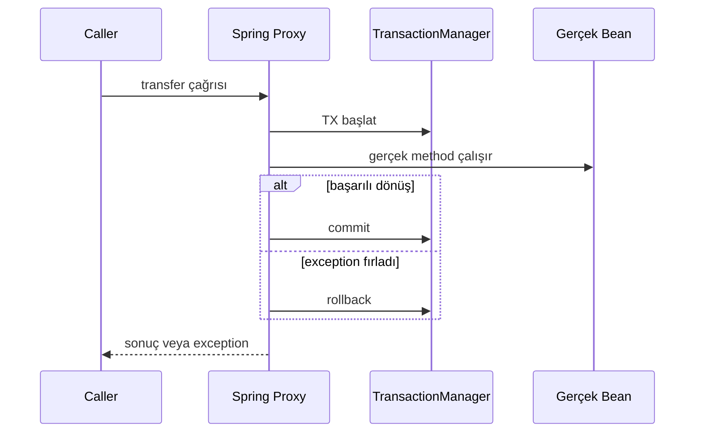
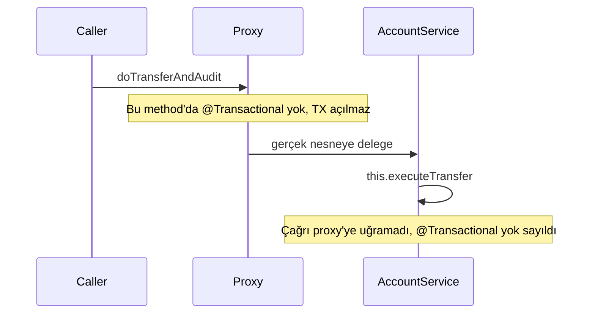
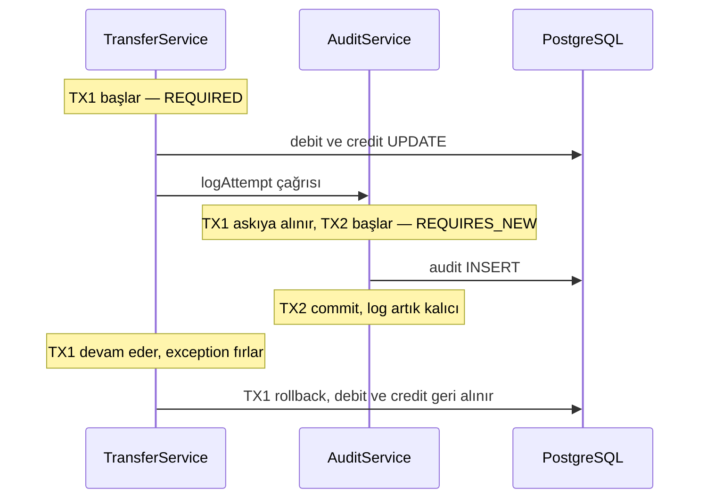
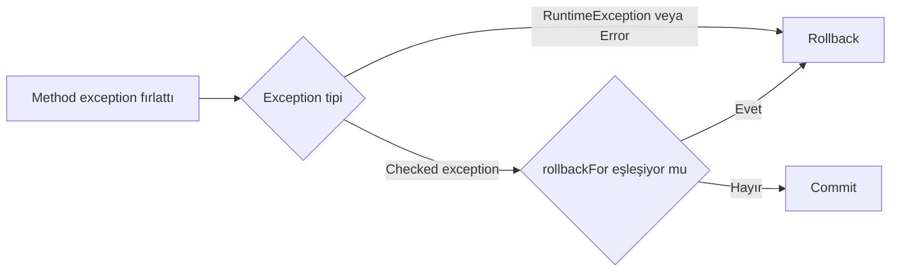

# Topic 2.3 — Transaction Management

```admonish info title="Bu bölümde"
- `@Transactional`'ın altındaki proxy mekanizması (JDK vs CGLIB) ve mülakat klasiği self-invocation tuzağı
- 7 propagation davranışı — ezber değil, banking senaryolarıyla sebep-sonuç
- 4 isolation level ve 3 read anomalisi: dirty read, non-repeatable read, phantom read
- Rollback kuralları: checked vs unchecked exception, `rollbackFor`, `readOnly`, `timeout`
- TR bank mülakatlarının bel kemiği: debit + credit + audit log + notification transfer tasarımı
```

## Hedef

`@Transactional` annotation'ının **iç mekanizmasını** (Spring proxy, AOP, advisor) öğrenmek. 7 propagation davranışını ve 4 isolation level'ı banking senaryoları üzerinden ezberlemeden — sebep–sonuç olarak kavramak. Self-invocation problemini, rollback default davranışını (checked vs unchecked), readOnly, timeout, rollbackFor / noRollbackFor parametrelerini hatasız anlatabilmek. Banking'in en sık mülakat sorusu olan "para transferi transaction tasarımı"nı (debit + credit + audit log, mixed propagation ile) hatasız çizebilmek.

## Süre

Okuma: 2-2.5 saat • Kendini Sına: 45 dk • Pratik (opsiyonel): 3-4 saat • Toplam: ~3 saat (+ pratik)

## Önbilgi

- Topic 2.1 (JPA Fundamentals) bitti — persistence context, entity state, flush biliyorsun
- Topic 2.2 (Spring Data JPA) bitti — `JpaRepository`, `@Query` rahat kullanabiliyorsun
- `@Transactional` annotation'ını gördün ama nasıl çalıştığını "auto-rollback" seviyesinde biliyorsun
- ACID kısaltmasını duydun, "Atomicity, Consistency, Isolation, Durability" diye ezberden söyleyebiliyorsun

---

## Kavramlar

### 1. ACID — banking için ne demek

Klasik ACID tanımları ezberlenir ama banking pratiğine düşmez; her harfi somut bir senaryoya bağlayalım.

**Atomicity (atomik olma):** Bir işlem ya **tamamen** olur, ya hiç olmaz. Müşteri 100 TL'yi A hesabından B'ye gönderiyor — SQL açısından bu iki UPDATE'tir:

```sql
UPDATE accounts SET balance = balance - 100 WHERE id = 'A';
UPDATE accounts SET balance = balance + 100 WHERE id = 'B';
```

İlk UPDATE çalıştı, ikincide DB bağlantısı koptu. Atomicity yoksa A'dan 100 düştü, B'ye geçmedi — 100 TL buharlaştı. Bu bir bankada dakikalar içinde regülatör cezası demektir; transaction ile ya iki UPDATE de commit olur, ya ikisi de rollback.

**Consistency (tutarlılık):** Transaction veritabanını bir geçerli state'ten başka bir geçerli state'e götürür — tüm constraint'ler, foreign key'ler ve business invariant'lar yerinde kalır. Banking'deki karşılığı "toplam debit = toplam credit" double-entry invariant'ı: commit anında bu eşitlik bozulamaz. Consistency'i DB tek başına sağlamaz; CHECK constraint (DB) + domain logic (uygulama) + transaction (atomicity) birlikte çalışır.

**Isolation (yalıtım):** Eşzamanlı transaction'lar birbirini karıştırmaz; bir transaction'ın yarım kalmış değişiklikleri başkasına görünmez. A'nın bakiyesi 1000, aynı anda iki çekme talebi: T1 "800 çek", T2 "500 çek". Isolation yoksa ikisi de "1000 var" der, ikisi de geçer, bakiye -300'e düşer; isolation varsa biri "200 kaldı" görür ve reddeder.

**Durability (kalıcılık):** Commit edildi → diske yazıldı → güç gitse bile kayıp yok. WAL (write-ahead log) ile sağlanır — sistem 2 saat aşağıda kalsa bile commit ettiğin transfer hâlâ orada.

Banking pratiğinde günlük tasarımda en çok Atomicity ve Isolation'ı düşünürsün; Durability genelde DB'nin işi, Consistency hem DB hem uygulama. Mülakatta "ACID'i anlat" sorusunun ardından gelen "bir banking senaryosu ile" cümlesini bekle.

### 2. JDBC transaction — Spring'in altında ne var

`@Transactional` sihir gibi durur ama altında sıradan bir **JDBC `Connection`** var; sihri çözmenin ilk adımı bu katmanı görmek. Klasik bir transaction:

```java
Connection conn = dataSource.getConnection();
try {
    conn.setAutoCommit(false);                    // transaction başlat
    try (var ps = conn.prepareStatement("UPDATE accounts SET balance = balance - ? WHERE id = ?")) {
        ps.setBigDecimal(1, amount);
        ps.setString(2, fromId);
        ps.executeUpdate();
    }
    try (var ps = conn.prepareStatement("UPDATE accounts SET balance = balance + ? WHERE id = ?")) {
        ps.setBigDecimal(1, amount);
        ps.setString(2, toId);
        ps.executeUpdate();
    }
    conn.commit();                                // başarılı → commit
} catch (Exception e) {
    conn.rollback();                              // hata → rollback
    throw e;
} finally {
    conn.close();                                 // bağlantıyı pool'a iade et
}
```

Bu çalışır ama her servis method'una bu boilerplate'i yazmak istemiyoruz. Spring `@Transactional` tam olarak bunun **AOP wrapper**'ıdır.

### 3. Spring `@Transactional` proxy mekanizması

Neden umursamalısın: proxy'nin nasıl çalıştığını bilmeyen, bir sonraki bölümdeki self-invocation tuzağına production'da düşer. Spring, `@Transactional` işaretli class için bir **proxy** üretir; proxy ilgili method'u begin–commit/rollback döngüsüyle sarar:



İki proxy türü var:

**JDK dynamic proxy:** Class bir interface implement ediyorsa Spring **interface bazlı proxy** üretir (`java.lang.reflect.Proxy`). Proxy nesnesi interface'i implement eder; her method çağrısı bir `InvocationHandler`'a düşer.

```java
public interface TransferService { Transfer execute(...); }

@Service
class TransferServiceImpl implements TransferService {
    @Transactional
    public Transfer execute(...) { ... }
}

// Spring proxy üretir: $Proxy42 implements TransferService
// Bean container'da TransferService olarak kayıtlı
```

**CGLIB proxy:** Class interface implement etmiyorsa Spring **subclass proxy** üretir — CGLIB ile gerçek class'tan extend eden bir subclass yaratıp method'ları override eder.

```java
@Service
class TransferService {                          // interface yok
    @Transactional
    public Transfer execute(...) { ... }
}

// Spring CGLIB ile: TransferService$$EnhancerBySpringCGLIB$$xxx extends TransferService
```

Spring Boot 2.6+ default olarak CGLIB kullanır — interface olsa bile, AOP davranışı her zaman tutarlı olsun diye. `spring.aop.proxy-target-class=false` ile JDK proxy'e döndürebilirsin.

Bu mekanizmanın en önemli sonucu: <mark>proxy sadece dışarıdan gelen çağrıları görür; aynı bean içinden `this.` üzerinden yapılan çağrı `@Transactional`'ı yok sayar</mark>. Sıradaki konu tam olarak bu tuzak.

### 4. Self-invocation problemi (mülakat klasiği)

Bu problem o kadar sık soruluyor ki neredeyse her TR bank mülakatında bir varyantı çıkar. Şu kod ÇALIŞMAZ:

```java
@Service
class AccountService {
    
    public void doTransferAndAudit(...) {
        executeTransfer(...);       // ❌ aynı class içinden çağrı
        writeAuditLog(...);
    }
    
    @Transactional
    public void executeTransfer(...) {
        // ...
    }
    
    @Transactional(propagation = Propagation.REQUIRES_NEW)
    public void writeAuditLog(...) {
        // ...
    }
}
```

`doTransferAndAudit` çağrıldığında bir TX başlamaz. Sebep: içerideki `executeTransfer()` çağrısı proxy nesnesine değil, gerçek `this`'e gider — proxy ortadan kayboldu, `@Transactional` ignored:



```admonish warning title="Dikkat"
Mülakat sorusu: "Aynı service'in iki method'u var, biri diğerini çağırıyor, ikisi de `@Transactional` — niye ikinci method yeni TX açmıyor?" Cevap tek kelime: self-invocation. Proxy sadece bean sınırından geçen çağrıları sarabilir.
```

**Çözümler:**

**A — Sınıfları ayır (en temiz):**

```java
@Service
class TransferOrchestrator {
    private final TransferService transferService;
    private final AuditService auditService;
    
    public void doTransferAndAudit(...) {
        transferService.executeTransfer(...);   // başka bean, proxy üzerinden ✓
        auditService.writeAuditLog(...);
    }
}
```

**B — Self-injection:** Proxy'i kendine inject et; `@Lazy` circular dependency'i bypass için. Hack gibi durur ama meşrudur.

```java
@Service
class AccountService {
    
    @Autowired
    @Lazy
    private AccountService self;       // proxy'i kendine inject et
    
    public void doTransferAndAudit(...) {
        self.executeTransfer(...);     // proxy üzerinden ✓
        self.writeAuditLog(...);
    }
    
    @Transactional
    public void executeTransfer(...) { ... }
    
    @Transactional(propagation = Propagation.REQUIRES_NEW)
    public void writeAuditLog(...) { ... }
}
```

**C — `AopContext.currentProxy()`:** Çalışır ama okunmaz, statik bağımlılık doğurur. Tercih etme.

```java
@EnableAspectJAutoProxy(exposeProxy = true)
public class Config {}

// içinde:
((AccountService) AopContext.currentProxy()).executeTransfer(...);
```

**D — AspectJ load-time weaving:** Proxy'leri tamamen unut, bytecode-level weaving. Çok güçlü ama kurulum yorucu; banking'de yaygın değil.

Banking pratiği: A varyantı her zaman tercih. Transfer orchestrator + transfer service + audit service ayrımı zaten DDD ile uyumlu.

### 5. `@Transactional` annotation'ının tüm parametreleri

Annotation'ın tam yüzeyini bir kez görüp, sonra her parametreyi tek tek deşeceğiz:

```java
@Transactional(
    propagation = Propagation.REQUIRED,            // default
    isolation = Isolation.DEFAULT,                  // DB default
    readOnly = false,                               // default
    timeout = -1,                                   // saniye, -1 = sınırsız
    rollbackFor = {},                               // ek class'lar
    noRollbackFor = {},                             // hariç tutulanlar
    transactionManager = "transactionManager"       // birden fazla DB varsa
)
public void method() { ... }
```

### 6. Propagation — 7 davranış

**Propagation** = bir method çağrıldığında mevcut transaction ile ne yapacağı. Yanlış propagation seçimi banking'de "audit log kayboldu" veya "connection pool tükendi" olarak geri döner — o yüzden 7 davranışın hepsini sebep-sonuç olarak bileceksin.

#### 6.1. `REQUIRED` (default)

> "Mevcut TX varsa katıl, yoksa yeni başlat."

%90 senaryoda bunu kullanırsın: service method'u TX açar, çağırdığı diğer service'ler aynı TX'e katılır, hepsi atomik olur.

```java
@Service
class TransferService {
    
    @Transactional   // REQUIRED default — TX başlatır
    public void transfer(AccountId from, AccountId to, Money amount) {
        accountService.debit(from, amount);    // aynı TX'e katılır
        accountService.credit(to, amount);     // aynı TX'e katılır
        // hepsi commit → ya tümü, ya hiçbiri
    }
}

@Service
class AccountService {
    @Transactional   // REQUIRED — caller TX varsa katıl
    public void debit(AccountId id, Money amount) { ... }
    
    @Transactional
    public void credit(AccountId id, Money amount) { ... }
}
```

**Logical vs physical TX** ayrımına dikkat: REQUIRED'da iç method "logical transaction"a katılır ama physical olarak tek TX vardır. İç method'da exception fırlarsa dış TX de rollback-only işaretlenir; dış katman yine de commit denerse `UnexpectedRollbackException` patlar.

#### 6.2. `REQUIRES_NEW`

> "Mevcut TX'i askıya al, yeni bir bağımsız TX başlat, bitince eskisini devam ettir."

İki ayrı physical TX oluşur: içerideki commit veya rollback olabilir, dışarıdaki etkilenmez. Banking'in klasik senaryosu audit log — transfer rollback olsa bile regülatör için log yazılı kalmalı:

```java
@Service
class TransferService {
    
    @Transactional   // ana TX
    public void transfer(...) {
        debit(from, amount);
        credit(to, amount);
        // Hata olursa transfer rollback olmalı
        // AMA audit log YAZILMALI — regülatör için
        auditService.logAttempt(...);     // REQUIRES_NEW
    }
}

@Service
class AuditService {
    @Transactional(propagation = Propagation.REQUIRES_NEW)
    public void logAttempt(...) {
        auditRepo.save(...);   // bağımsız TX, ana TX rollback olsa da kalır
    }
}
```

Akışı zaman çizgisinde gör — TX1 rollback olsa bile TX2 çoktan commit olmuştur:



Mülakat sorusu (klasik): "Transfer başarısız olduğunda audit log da rollback oluyor — neden, nasıl düzeltirsin?" Cevap: `REQUIRES_NEW`.

```admonish warning title="REQUIRES_NEW tuzakları"
- Her REQUIRES_NEW **yeni bir DB bağlantısı** alır. İç içe çok sayıda REQUIRES_NEW = connection pool tükenir, deadlock.
- Dış TX beklerken içeride yeni TX başlattın → pool'dan aynı anda 2 connection tutuyorsun. Pool size 2 ise hemen blok.
- İç TX commit olur ama dış TX rollback olabilir: "audit log yazıldı, transfer atılmadı" durumu — bilinçli bir karar olmalı.
```

Banking pratiği: audit log ve failed-attempt log için REQUIRES_NEW; notification (SMS, email kuyruğa atma) için REQUIRES_NEW veya event-based async (Phase 4).

#### 6.3. `NESTED`

> "Aynı TX içinde bir **savepoint** oluştur. Hata olursa savepoint'e kadar rollback, dış TX devam edebilir."

JDBC `Connection.setSavepoint()` kullanır; DB'nin savepoint desteği gerekir (PostgreSQL, MySQL InnoDB, Oracle var). Banking senaryosu: 1000 transferlik batch işliyorsun, birinde hesap kapalı → o tek transfer rollback, kalan 999 devam:

```java
@Service
class BatchPaymentService {
    
    @Transactional   // REQUIRED — ana TX
    public BatchResult processBatch(List<Payment> payments) {
        var results = new ArrayList<PaymentResult>();
        for (Payment p : payments) {
            try {
                results.add(processSingle(p));    // NESTED — savepoint
            } catch (PaymentFailedException e) {
                // savepoint'e geri dönüldü, ana TX devam ediyor
                results.add(PaymentResult.failed(p, e.getMessage()));
            }
        }
        return new BatchResult(results);
    }
    
    @Transactional(propagation = Propagation.NESTED)
    public PaymentResult processSingle(Payment p) {
        // ... rollback olursa sadece bu kayıt
    }
}
```

REQUIRES_NEW ile farkı:

- REQUIRES_NEW: iki ayrı physical TX, iki ayrı connection; iç commit dış commit'ten bağımsız
- NESTED: tek physical TX, savepoint; iç commit hâlâ dışa bağlı — dış rollback → iç de rollback

Hibernate'le NESTED tüm DB'lerde sorunsuz çalışmaz; Hibernate 6 ile destek daha iyi ama yine de test et.

#### 6.4. `MANDATORY`

> "Mevcut TX varsa katıl, yoksa **exception fırlat**."

API'yı sağlamlaştırmak için: "bu method sadece bir TX içinde çalışabilir" sözleşmesini runtime'da zorlar (`IllegalTransactionStateException`).

```java
@Transactional(propagation = Propagation.MANDATORY)
public void postJournalLine(JournalLine line) {
    // double-entry'nin yarısı — atomicity başka birinin sorumluluğu
    // bunu TX'siz çağırmak isteyene "açık TX olmadan kullanma" der
}
```

#### 6.5. `SUPPORTS`

> "TX varsa katıl, yoksa TX'siz çalış."

Genelde okuma yapan esnek helper'lar için; banking'de nadiren ihtiyaç olur, daha çok altyapı kodu.

```java
@Transactional(propagation = Propagation.SUPPORTS, readOnly = true)
public Optional<Account> findById(AccountId id) {
    // TX varsa o TX'in PC'sini kullan, yoksa TX'siz oku
}
```

#### 6.6. `NOT_SUPPORTED`

> "Mevcut TX'i askıya al, TX'siz çalış, bitince eskiyi devam ettir."

TX içinde uzun bir query çalıştırmak isolation/lock perspektifinden problemlidir; heavy reporting'i TX dışına almak için kullanılır:

```java
@Service
class ReportingService {
    
    @Transactional   // ana TX
    public void generateReport(...) {
        var summary = heavyAggregation();    // çok yavaş, lock tutmayalım
    }
    
    @Transactional(propagation = Propagation.NOT_SUPPORTED)
    public Summary heavyAggregation() {
        // TX dışında — 30 saniyelik query lock tutmaz
    }
}
```

Tuzak: içeride DB call'lar autoCommit mode'da çalışır — repeatable read garantisi yok.

#### 6.7. `NEVER`

> "TX varsa **exception fırlat**, yoksa TX'siz çalış."

Kesin TX dışı çalışması gereken kod için — banking'de external call koruması:

```java
@Transactional(propagation = Propagation.NEVER)
public void sendToExternalSystem(...) {
    // TX içinde external HTTP call YAPMA — DB lock'larını uzatma
}
```

External HTTP call'ları zaten TX dışında yapmalıyız (lock tutarak HTTP bekleme = felaket); NEVER bunu runtime garantisine çevirir.

#### Propagation özet tablosu

| Propagation | TX var | TX yok | Banking use case |
|---|---|---|---|
| REQUIRED | Katıl | Yeni başlat | Default — her şey |
| REQUIRES_NEW | Askıya al + yeni başlat | Yeni başlat | Audit log, notification |
| NESTED | Savepoint oluştur | Yeni başlat | Batch processing partial fail |
| MANDATORY | Katıl | Exception | TX zorunlu helper |
| SUPPORTS | Katıl | TX'siz | Esnek read helper |
| NOT_SUPPORTED | Askıya al + TX'siz | TX'siz | Heavy read TX dışı |
| NEVER | Exception | TX'siz | External call koruma |

### 7. Isolation level — 4 standart + DEFAULT

**Isolation level** = eşzamanlı transaction'ların birbirini ne kadar gördüğü. ANSI SQL 4 level tanımlar; her biri belirli "read phenomenon"ları engeller. Önce anomalileri tanı:

| Phenomenon | Açıklama | Banking örneği |
|---|---|---|
| Dirty read | Başka TX'in henüz commit olmamış değişikliğini okumak | T1 bakiyeyi 1000 → 500 yaptı (commit YOK), T2 500 okuyup karar verdi, T1 rollback → T2 yanlış kararla devam |
| Non-repeatable read | Aynı TX içinde aynı satırı iki kez okuyunca farklı değer | T1 bakiyeyi okudu 1000, T2 100 yatırdı + commit, T1 tekrar okudu 1100 |
| Phantom read | Aynı TX içinde aynı sorguda yeni satırlar belirir | T1 "owner=X olan hesapları" listeledi (3 kayıt), T2 yeni hesap açtı + commit, T1 tekrar listeledi (4 kayıt) |

Lost update ve write skew gibi başkaları da var; bunları locking topic'inde göreceğiz.

#### Isolation level → phenomenon engelleme

| Level | Dirty read | Non-repeatable | Phantom |
|---|---|---|---|
| READ_UNCOMMITTED | ✗ olabilir | ✗ olabilir | ✗ olabilir |
| READ_COMMITTED | ✓ engellenir | ✗ olabilir | ✗ olabilir |
| REPEATABLE_READ | ✓ engellenir | ✓ engellenir | ✗ olabilir¹ |
| SERIALIZABLE | ✓ engellenir | ✓ engellenir | ✓ engellenir |

¹ MySQL InnoDB REPEATABLE_READ phantom'u da engeller (next-key locking). PostgreSQL REPEATABLE_READ snapshot isolation kullanır, phantom riskini ek mekanizma ile çözer.

#### Banking için pratik seçim

<mark>Isolation level yükseltmek anomali riskini azaltır ama concurrency ve performans maliyeti getirir</mark> — seçim her zaman bu takasın bilinçli kararıdır.

**PostgreSQL default: READ_COMMITTED.** Çoğu banking servisi bu seviyede çalışır: dirty read zaten engellenir; aynı TX'te aynı satırı iki kez okuyunca farklı değer gelebilir ama transfer kısa sürdüğü için pratikte sorun olmaz; phantom okuyabilirsin — reporting query'lerinde dikkat.

**REPEATABLE_READ ne zaman:** Bir TX içinde aynı veriyi birden fazla kez okuyup karar veriyorsan ("bakiyeyi oku, hesapla, tekrar oku, karşılaştır") veya snapshot bazlı reporting'de.

**SERIALIZABLE ne zaman:** En sıkı seviye — concurrent transaction'lar birbirine yol verir veya **serialization failure** alır, performans düşer. PostgreSQL'in SSI implementasyonu çok zekidir; yine de banking'in kritik para hareketlerinde nadiren kullanılır, genelde locking ile çözüm tercih edilir.

```java
@Transactional(isolation = Isolation.SERIALIZABLE)
public void criticalReconciliation() {
    // ...
}
```

Mülakat sorusu (klasik): "REPEATABLE_READ ile READ_COMMITTED arasında ne fark var?" → Non-repeatable read'i engelleyip engellememesi.

Mülakat sorusu (zor): "PostgreSQL'de REPEATABLE_READ kullanıyorsun. İki TX aynı satırı UPDATE etmeye çalışıyor. Ne olur?" → İkinci TX serialization failure alır (`could not serialize access due to concurrent update`), retry gerekir. (Topic 2.4'te detaylanacak.)

#### Isolation level set ederken dikkat

```java
@Transactional(isolation = Isolation.REPEATABLE_READ)
public void method() { ... }
```

Spring her TX başında `connection.setTransactionIsolation(...)` çağırır. Ama bağlantı pool'a iade edildiğinde isolation eski seviyeye dönmez (default PostgreSQL JDBC driver) — sonraki TX bu connection'ı alırsa yanlış isolation'la çalışır.

```admonish tip title="İpucu"
HikariCP'ye connection-level default isolation ver ki pool'a dönen bağlantılar öngörülebilir seviyede kalsın. Yeni Spring/Hibernate sürümlerinde `hibernate.connection.handling_mode` ile de kontrol edebilirsin.
```

```yaml
spring.datasource.hikari.transaction-isolation: TRANSACTION_READ_COMMITTED  # connection-level default
```

### 8. `readOnly = true` — performans ve niyet

Sadece okuyan bir method neden TX parametresi taşısın? Çünkü **readOnly** hem performans hem niyet beyanıdır:

```java
@Transactional(readOnly = true)
public Account findById(AccountId id) { ... }
```

**A — Hibernate optimizasyonu:** Persistence context dirty checking yapmaz, snapshot tutmaz, flush atılmaz — memory + CPU tasarrufu.

**B — DB driver hint:** Bazı driver'lar `Connection.setReadOnly(true)` çağırır; DB bunu hint olarak alabilir (Oracle, PostgreSQL). Read replica routing yapılıyorsa (Phase 9) replica'ya yönlendirme yapılır.

Tuzak: readOnly gerçek bir lock değil. Yanlışlıkla yazma yaparsan exception almayabilirsin (Hibernate bazen) — sadece flush atılmaz. Banking'de asıl değeri niyet beyanı olmasıdır.

```java
@Service
@Transactional(readOnly = true)        // class-level default
public class AccountReportingService {
    
    public Page<Account> search(...) { ... }       // readOnly = true
    public Account getById(AccountId id) { ... }   // readOnly = true
    
    @Transactional                                   // method-level override
    public void recordReadAccess(AccountId id) {     // write için readOnly = false
        // ...
    }
}
```

Class-level read-only default, write için method-level override — çok temiz bir kalıp.

### 9. `timeout` — TX süresi sınırı

Sınırsız süren bir TX, lock'ları ve connection'ı da sınırsız tutar; her TX'e bir tavan koy.

```java
@Transactional(timeout = 5)        // 5 saniye
public void transfer(...) { ... }
```

5 saniye içinde commit veya rollback olmazsa `TransactionTimedOutException` — sıradaki SQL call'ında patlar.

Banking pratiği: para hareketleri kısa olmalı (< 1-2 saniye), timeout 5 saniye = güvenlik kemeri. Long-running batch için ayrı TX manager veya REQUIRES_NEW + uzun timeout. Default sınırsızdır ve production'da kötüdür; `spring.transaction.default-timeout: 30` ile global default ver.

### 10. Rollback — checked vs unchecked exception

Spring'in default rollback kuralı çoğu junior'ı şaşırtır, sebebi EJB tarihidir:

- **Unchecked exception** (`RuntimeException`, `Error`) → rollback ✓
- **Checked exception** (`Exception` subclass, RuntimeException değil) → commit (!) ⚠



Yani <mark>checked exception default'ta rollback tetiklemez — transaction commit olur</mark>. Banking'de bunun bedeli yarım transferin DB'ye yazılmasıdır:

```java
@Transactional
public void transfer(...) throws InsufficientFundsException {
    // InsufficientFundsException unchecked ise → rollback ✓
    // InsufficientFundsException checked (Exception extend) ise → commit (kötü!)
}
```

```admonish tip title="İpucu"
Banking'de domain exception'larını her zaman unchecked yap (`RuntimeException` extend). Hem rollback davranışı doğru olur, hem method signature gürültüsü kalkar: `public class InsufficientFundsException extends RuntimeException { }`
```

#### `rollbackFor` — checked'ı da rollback yap

```java
@Transactional(rollbackFor = SomeCheckedException.class)
public void method() throws SomeCheckedException {
    // ...
}
```

Veya hepsi için `@Transactional(rollbackFor = Exception.class)`. Domain exception'lar zaten unchecked ise gerek yok; external library checked exception fırlatıyorsa ve rollback istiyorsan ekle.

#### `noRollbackFor` — bazı durumlarda rollback istemiyorum

```java
@Transactional(noRollbackFor = NotificationFailedException.class)
public void transferAndNotify(...) {
    // transfer yap
    // notification gönderme dene — fail olursa transfer'i rollback ETME
}
```

Genelde "transfer fail = rollback" isteriz; noRollbackFor'u dikkatli kullan. Notification gibi yan etkileri zaten event-based (Phase 4) yapacağız.

### 11. Banking money transfer transaction tasarımı (klasik mülakat sorusu)

Hazırlan: "Bir para transferi servisi tasarla — debit, credit, audit log, notification." Bu soruyu tahtada parça parça çizeceğiz; tam listing bölüm sonunda katlanmış duruyor.

Ana servis `@Transactional` (REQUIRED) ile başlar — transfer atomik olacak:

```java
@Service
public class TransferService {
    
    private final AccountRepository accountRepository;
    private final JournalRepository journalRepository;
    private final AuditService auditService;
    private final NotificationPublisher notificationPublisher;
    
    @Transactional                                    // REQUIRED — atomic transfer
    public Transfer execute(TransferRequest request) {
        var transferId = TransferId.generate();
```

İlk adımlar doğrulama: aynı hesaba transfer reddi, hesapları çekme, status kontrolü. Hepsi domain exception fırlatır — unchecked oldukları için otomatik rollback:

```java
        try {
            if (request.from().equals(request.to())) {
                throw new SameAccountTransferException();
            }
            var from = accountRepository.findById(request.from())
                .orElseThrow(() -> new AccountNotFoundException(request.from()));
            var to = accountRepository.findById(request.to())
                .orElseThrow(() -> new AccountNotFoundException(request.to()));
            
            if (from.getStatus() != ACTIVE) throw new AccountClosedException(from.getId());
            if (to.getStatus() != ACTIVE) throw new AccountClosedException(to.getId());
```

Sonra işin kalbi: debit + credit domain logic'i, persist ve double-entry journal kaydı — hepsi aynı TX içinde:

```java
            from.withdraw(request.amount(), transferId);   // InsufficientFundsException patlayabilir
            to.deposit(request.amount(), transferId);
            
            accountRepository.save(from);
            accountRepository.save(to);
            
            var journalEntry = JournalEntry.builder()
                .transferId(transferId)
                .addLine(from.getId(), DEBIT, request.amount())
                .addLine(to.getId(), CREDIT, request.amount())
                .build();
            journalRepository.save(journalEntry);
```

Kapanış: success audit'i REQUIRES_NEW ile, notification event ile; hata durumunda failure audit'i yazılır ve exception re-throw edilir ki ana TX rollback olsun:

```java
            auditService.logSuccess(transferId, request);   // REQUIRES_NEW
            notificationPublisher.publish(new TransferCompleted(transferId, request));
            return new Transfer(transferId, ...);
            
        } catch (BankingException e) {
            // Ana TX rollback olacak ama log kalmalı
            auditService.logFailure(transferId, request, e);   // REQUIRES_NEW
            throw e;   // re-throw → ana TX rollback
        }
    }
}
```

`AuditService` ayrı bir bean — hem self-invocation'dan kaçınmak hem REQUIRES_NEW'un proxy üzerinden çalışması için:

```java
@Service
public class AuditService {
    
    @Transactional(propagation = Propagation.REQUIRES_NEW)
    public void logSuccess(TransferId id, TransferRequest req) {
        auditRepo.save(AuditLog.success(id, req));
    }
    
    @Transactional(propagation = Propagation.REQUIRES_NEW)
    public void logFailure(TransferId id, TransferRequest req, BankingException cause) {
        auditRepo.save(AuditLog.failure(id, req, cause.getMessage()));
    }
}
```

<details>
<summary>Tam kod: TransferService + AuditService (~75 satır)</summary>

```java
@Service
public class TransferService {
    
    private final AccountRepository accountRepository;
    private final JournalRepository journalRepository;
    private final AuditService auditService;
    private final NotificationPublisher notificationPublisher;
    
    @Transactional                                    // REQUIRED — atomic transfer
    public Transfer execute(TransferRequest request) {
        var transferId = TransferId.generate();
        
        // 1. Try-catch içinde attempt log
        try {
            // 2. Doğrula
            if (request.from().equals(request.to())) {
                throw new SameAccountTransferException();
            }
            
            // 3. Hesapları çek
            var from = accountRepository.findById(request.from())
                .orElseThrow(() -> new AccountNotFoundException(request.from()));
            var to = accountRepository.findById(request.to())
                .orElseThrow(() -> new AccountNotFoundException(request.to()));
            
            // 4. Status kontrol
            if (from.getStatus() != ACTIVE) throw new AccountClosedException(from.getId());
            if (to.getStatus() != ACTIVE) throw new AccountClosedException(to.getId());
            
            // 5. Domain logic — debit + credit
            from.withdraw(request.amount(), transferId);   // InsufficientFundsException patlayabilir
            to.deposit(request.amount(), transferId);
            
            // 6. Persist
            accountRepository.save(from);
            accountRepository.save(to);
            
            // 7. Journal entry (double-entry)
            var journalEntry = JournalEntry.builder()
                .transferId(transferId)
                .addLine(from.getId(), DEBIT, request.amount())
                .addLine(to.getId(), CREDIT, request.amount())
                .build();
            journalRepository.save(journalEntry);
            
            // 8. Audit log — REQUIRES_NEW, transfer fail olsa bile yazılı kalsın
            auditService.logSuccess(transferId, request);
            
            // 9. Notification — event publish (Phase 4 detay)
            notificationPublisher.publish(new TransferCompleted(transferId, request));
            
            return new Transfer(transferId, ...);
            
        } catch (BankingException e) {
            // 10. Failed attempt log — REQUIRES_NEW
            // Ana TX rollback olacak ama log kalmalı
            auditService.logFailure(transferId, request, e);
            throw e;   // re-throw → ana TX rollback
        }
    }
}

@Service
public class AuditService {
    
    @Transactional(propagation = Propagation.REQUIRES_NEW)
    public void logSuccess(TransferId id, TransferRequest req) {
        auditRepo.save(AuditLog.success(id, req));
    }
    
    @Transactional(propagation = Propagation.REQUIRES_NEW)
    public void logFailure(TransferId id, TransferRequest req, BankingException cause) {
        auditRepo.save(AuditLog.failure(id, req, cause.getMessage()));
    }
}
```

</details>

**Tasarım kararları:**

1. Ana TX `REQUIRED` (default) — transfer atomic.
2. Audit log `REQUIRES_NEW` — transfer rollback olsa bile log yazılır.
3. Domain exception'lar `RuntimeException` → otomatik rollback.
4. Notification **event** — TX'in dışına çık (Phase 4'te `@TransactionalEventListener` ile detay).
5. Idempotency-key bu örnekte gösterilmedi ama gerçek implementasyonda en başta.

Mülakatçı follow-up: "Audit log REQUIRES_NEW dedin. Audit DB'si yazılamazsa ne olur, transfer rollback mi?" Cevap: Audit log fail olduğunda transfer rollback olmamalı (audit ana akışı bloklamaz). `try-catch` ile audit fail'ini yut, log'la (operator'a alert), veya audit'i asynchronous yap.

### 12. Nested transaction tuzakları

NESTED kağıt üzerinde zarif, pratikte dört ayrı tuzak barındırır:

**Tuzak 1 — Driver desteği:** Hibernate `Connection.setSavepoint()` kullanır; bazı eski JDBC driver'larında destek eksik. PostgreSQL, MySQL, Oracle modern sürümlerde sorun yok.

**Tuzak 2 — Performans:** Her NESTED bir savepoint sayar. Loop içinde 10000 NESTED = 10000 savepoint = DB yorulur; batch için alternatif yöntemler düşün.

**Tuzak 3 — Hata yakalama:** İçeride exception fırlarsa savepoint rollback olur; ama sen exception'ı yakalamazsan dış TX'e iletilir ve tüm ana TX rollback olur:

```java
@Transactional
public void batch(List<X> items) {
    for (X x : items) {
        try {
            processOne(x);   // NESTED
        } catch (BusinessException e) {
            // sadece bu kayıt rollback, devam
            logError(x, e);
        }
        // catch yoksa → ana TX rollback
    }
}
```

**Tuzak 4 — JPA flush davranışı:** Hibernate persistence context'i NESTED için tam doğru yönetmeyebilir; NESTED rollback sonrası PC kirli kalabilir. Kullanıyorsan kapsamlı test, gerekirse manuel `em.clear()`.

Banking pratiği: mümkünse NESTED yerine REQUIRES_NEW veya batch'i parçala. NESTED'ı tek bir sebep için kullan: "tek TX'te kalmak istiyorum ama belli bir alt-iş rollback olsa diğerleri devam etsin."

### 13. Transaction içinde external call ETME — neden

Kural net: <mark>transaction içinde external sisteme (HTTP, SWIFT, Kafka, SMS) çağrı yapma</mark>. Önce ihlalin nasıl göründüğüne bak:

```java
@Transactional
public void transfer(...) {
    // ... DB iş
    
    swiftClient.sendMessage(...);   // ❌ HTTP call TX içinde
    
    // ... DB iş devam
}
```

Üç sebep:

1. **DB lock'ları açıkken HTTP bekliyorsun.** External 30 saniye yanıt verirse lock'lar 30 saniye duruyor; diğer transaction'lar bekliyor, connection pool tükeniyor.
2. **External fail olursa rollback davranışı belirsiz.** SWIFT mesajı gitti mi? Sen TX'i commit edersen DB ile external desync olur.
3. **Timeout zincirleme patlama:** External 30 sn yanıt, TX timeout 10 sn → TX timeout patlar ama external mesaj belki gönderildi.

Doğrusu external call'ları TX'in dışına çıkarmak:

```java
@Transactional
public Transfer execute(...) {
    // ... saf DB iş
    return transferRepo.save(transfer);
}

// Caller seviyesi:
public void executeAndNotify(...) {
    var transfer = transferService.execute(...);   // TX commit
    swiftClient.sendMessage(transfer);              // TX dışında
}
```

Veya `@TransactionalEventListener(phase = AFTER_COMMIT)` ile event-driven — sıradaki konu.

### 14. Transaction içinde event publish — `@TransactionalEventListener`

"Commit başarılıysa notification gönder" ihtiyacını elle if-else ile çözmek kırılgandır; Spring 4.2+ event listener'ı doğrudan transaction phase'ine bağlar:

```java
@Service
class TransferService {
    private final ApplicationEventPublisher publisher;
    
    @Transactional
    public void execute(...) {
        // ... iş
        publisher.publishEvent(new TransferCompleted(transferId, ...));
        // event bekler, commit sonrası listener'a gider
    }
}

@Component
class NotificationListener {
    
    @TransactionalEventListener(phase = TransactionPhase.AFTER_COMMIT)
    public void onTransferCompleted(TransferCompleted event) {
        // Burası TX commit ETTİKTEN sonra çalışır
        // Hata fırlarsa ana TX'e dönmez (zaten commit oldu)
    }
}
```

**Phase seçenekleri:**

- `BEFORE_COMMIT` — commit'ten hemen önce (validation gibi)
- `AFTER_COMMIT` (default) — commit başarılıysa
- `AFTER_ROLLBACK` — rollback olursa
- `AFTER_COMPLETION` — her durumda (commit veya rollback)

Banking pratiği: notification, audit-log-async, downstream-system-sync için AFTER_COMMIT — çok yaygın pattern.

### 15. Banking anti-pattern'leri

Mülakatta "bu kodda ne yanlış?" sorusunun cephaneliği burası. Yedi klasik:

**Anti-pattern 1: Controller'a `@Transactional`**

```java
@RestController
class TransferController {
    @PostMapping
    @Transactional   // ❌ TX scope = HTTP request süresi
    public TransferResponse transfer(...) { ... }
}
```

TX HTTP süresi boyunca açık kalır (lazy loading, serialization hepsi TX içinde), service ayrımı kaybolur, connection 50 ms yerine 500 ms tutulur. Doğrusu: `@Transactional` service'te.

**Anti-pattern 2: Domain method'una `@Transactional`** — Domain class'lar Spring bilmemeli; `@Transactional` orchestration sorumluluğudur, domain'in değil.

**Anti-pattern 3: `catch (Exception e) { ... }` ile TX yutmak**

```java
@Transactional
public void transfer(...) {
    try {
        from.withdraw(...);
        to.deposit(...);
    } catch (Exception e) {
        log.error("Failed", e);   // ❌ exception yutuldu, TX commit olur
    }
}
```

```admonish warning title="Dikkat"
Spring rollback'i sadece exception proxy'ye ulaşırsa veya TX `setRollbackOnly()` ile işaretlenirse yapar. Exception'ı yutarsan TX commit olur — yarım transfer DB'ye yazılır. Doğrusu: re-throw veya `TransactionAspectSupport.currentTransactionStatus().setRollbackOnly()`.
```

**Anti-pattern 4: Uzun TX**

```java
@Transactional
public void process() {
    var list = repo.findAll();              // 1M kayıt
    for (var item : list) {
        externalApi.call(item);              // her biri 200 ms
        repo.save(item);
    }
}
```

TX 200000 saniye açık kalır — lock'lar, connection, PC memory, felaket. Doğrusu: batch'i parçala, her batch ayrı TX, external call TX dışı.

**Anti-pattern 5: `@Transactional` her yere** — Controller → Service → Calculator → ... her layer'da annotation. Default REQUIRED'ın join davranışı bilinmeyince debug imkansızlaşır. TX boundary'sini bilinçli koy; genelde service entry point'i.

**Anti-pattern 6: Self-invocation tuzaklı kod** — Bölüm 4'te detaylandı; `this.` üzerinden `@Transactional` method çağrısı proxy'yi bypass eder. Ayrı bean'e taşı.

**Anti-pattern 7: Read-only method'da yazma**

```java
@Transactional(readOnly = true)
public Account getAndUpdateLastSeen(AccountId id) {
    var account = repo.findById(id).orElseThrow();
    account.setLastSeenAt(Instant.now());     // ❌ readOnly = true ama yazıyorsun
    return account;
}
```

Hibernate flush atmayabilir, değişiklik kaybolabilir; veya driver `Connection.setReadOnly(true)` yapmışsa DB hata fırlatır. Niyet yazma ise `readOnly = false`.

---

## Önemli olabilecek araştırma kaynakları

- Spring Framework Reference — Transaction Management bölümü
- "High-Performance Java Persistence" Vlad Mihalcea — transaction internals
- "Java Transaction Design Strategies" Mark Richards (kısa kitap)
- PostgreSQL Documentation — Concurrency Control
- "Designing Data-Intensive Applications" Martin Kleppmann — Chapter 7 (Transactions)
- Baeldung — Spring Transactional Propagation
- Thorben Janssen blog — JPA transaction posts
- Marco Behler — "Spring Boot Transactions Tutorial"

---

## Kendini Sına

Aşağıdaki soruları önce **cevaba bakmadan** kendi cümlelerinle yanıtlamayı dene — hepsi TR bank mülakatlarında karşına çıkabilecek tarzda. Takıldığın soru olursa ilgili Kavramlar başlığına dön, sonra tekrar dene.

**S1. Aynı service class'ında iki method var, biri diğerini çağırıyor, ikisi de `@Transactional`. İçteki method neden yeni TX açmıyor ve nasıl düzeltirsin?**

<details>
<summary>Cevabı göster</summary>

Bu self-invocation problemi. Spring `@Transactional`'ı proxy ile uygular: TX'i başlatan kod proxy'nin içindedir ve proxy sadece bean sınırından geçen (dışarıdan gelen) çağrıları görür. Aynı class içinden yapılan çağrı `this.` üzerinden gerçek nesneye gider — proxy devreye girmez, annotation yok sayılır.

En temiz çözüm method'u ayrı bir bean'e taşımak: çağrı bean sınırından geçer, proxy devreye girer. Alternatifler: `@Lazy` self-injection (proxy'i kendine inject edip `self.method()` çağırmak), `AopContext.currentProxy()` (okunmaz, tercih etme) veya AspectJ weaving (kurulumu ağır). Banking'de orchestrator + service + audit ayrımı zaten DDD ile uyumlu olduğu için sınıf ayırma standarttır.

</details>

**S2. Transfer başarısız olup rollback olduğunda audit log da siliniyor. Neden ve nasıl düzeltirsin? Peki audit DB'si yazılamazsa transfer rollback olmalı mı?**

<details>
<summary>Cevabı göster</summary>

Audit method'u default REQUIRED ile çalışıyorsa ana TX'e katılır — ana TX rollback olunca audit kaydı da gider. Çözüm: audit method'una `@Transactional(propagation = Propagation.REQUIRES_NEW)` ver. Ana TX askıya alınır, audit bağımsız bir TX'te commit olur; ana TX sonradan rollback olsa bile log kalıcıdır. Audit service'in ayrı bir bean olması şart, yoksa self-invocation yüzünden REQUIRES_NEW hiç devreye girmez.

Follow-up'ın cevabı: hayır, audit fail'i transferi bloklamamalı. Audit çağrısını try-catch ile sar, hatayı yut ve operator'a alert üret — veya audit'i asynchronous yap. Ters yönde de bilinçli ol: REQUIRES_NEW ile "audit yazıldı ama transfer atılmadı" durumu mümkündür ve bu kabul edilen bir trade-off'tur.

</details>

**S3. REQUIRES_NEW ile NESTED arasındaki fark nedir? Hangi banking senaryosunda hangisini seçersin?**

<details>
<summary>Cevabı göster</summary>

REQUIRES_NEW iki ayrı physical TX açar (iki ayrı connection): iç TX dıştan bağımsız commit olur, dış TX rollback olsa bile iç kalır. NESTED ise tek physical TX içinde bir savepoint oluşturur: hata olursa savepoint'e kadar rollback olur ama iç kısmın kalıcılığı hâlâ dış commit'e bağlıdır — dış rollback olursa iç de gider.

Seçim: "dış TX ne olursa olsun bu yazılsın" (audit log) → REQUIRES_NEW. "Tek TX'te kalayım ama batch'in bozuk kaydı diğerlerini bozmasın" (1000 transferlik batch'te bir hesap kapalı) → NESTED. REQUIRES_NEW'un bedeli ekstra connection (pool tükenme riski); NESTED'ın bedeli DB savepoint desteği gereksinimi ve Hibernate ile her DB'de sorunsuz çalışmaması.

</details>

**S4. Dirty read, non-repeatable read ve phantom read'i birer banking örneğiyle tanımla. Hangi isolation level hangisini engeller?**

<details>
<summary>Cevabı göster</summary>

Dirty read: commit olmamış veriyi okumak — T1 bakiyeyi 1000'den 500'e çekti ama commit etmedi, T2 500'ü okuyup karar verdi, T1 rollback etti → T2 hiç var olmamış bir değerle işlem yaptı. Non-repeatable read: aynı TX'te aynı satırı iki kez okuyunca farklı değer — arada başka TX commit etti. Phantom read: aynı sorguyu iki kez çalıştırınca yeni satırlar belirmesi — arada başka TX yeni hesap ekledi.

Engelleme merdiveni: READ_UNCOMMITTED hiçbirini engellemez; READ_COMMITTED dirty read'i engeller; REPEATABLE_READ non-repeatable'ı da engeller; SERIALIZABLE üçünü de engeller. İnce nokta: MySQL InnoDB REPEATABLE_READ next-key locking ile phantom'u da engeller, PostgreSQL REPEATABLE_READ ise snapshot isolation kullanır.

</details>

**S5. PostgreSQL'de REPEATABLE_READ altında iki TX aynı satırı UPDATE etmeye çalışırsa ne olur? READ_COMMITTED'da fark eder miydi?**

<details>
<summary>Cevabı göster</summary>

REPEATABLE_READ'de ikinci TX `could not serialize access due to concurrent update` hatası (serialization failure) alır — snapshot'ı başladığı andaki veriye sabitlendiği için, birinci TX'in commit ettiği satırı sessizce ezemez. Uygulamanın bu hatayı yakalayıp transaction'ı retry etmesi gerekir.

READ_COMMITTED'da davranış farklıdır: ikinci TX birinci commit edene kadar lock'ta bekler, sonra satırın güncel halini görüp UPDATE'ini onun üzerine uygular — hata almaz ama lost update riski doğabilir. Bu yüzden "oku-hesapla-yaz" akışlarında ya REPEATABLE_READ + retry ya da explicit locking (Topic 2.4) gerekir.

</details>

**S6. `@Transactional` bir method checked exception fırlatırsa Spring ne yapar? Bu default neden tehlikeli ve banking'de nasıl çözersin?**

<details>
<summary>Cevabı göster</summary>

Spring default'ta sadece unchecked exception'larda (`RuntimeException`, `Error`) rollback yapar; checked exception fırlarsa transaction commit olur. Bu EJB tarihinden gelen bir konvansiyon. Tehlikesi: `InsufficientFundsException` checked ise, exception fırladığı ana kadar yapılmış debit DB'ye commit edilir — yarım transfer yazılır.

İki çözüm var: en temizi domain exception'ları `RuntimeException`'dan türetmek — hem rollback doğru çalışır hem signature gürültüsü kalkar. External library'nin checked exception'ı için ise `@Transactional(rollbackFor = SomeCheckedException.class)` eklersin. Bir de ters tuzak: exception'ı catch edip yutarsan proxy'ye hiç ulaşmaz ve TX yine commit olur — re-throw şart.

</details>

**S7. Transaction içinde external HTTP call (SWIFT, SMS) yapmanın üç sakıncasını say. Doğru tasarım nedir?**

<details>
<summary>Cevabı göster</summary>

Bir: DB lock'ları açıkken HTTP beklersin — external 30 saniye sürerse lock'lar 30 saniye tutulur, diğer TX'ler bekler, connection pool tükenir. İki: external fail olursa tutarlılık belirsizleşir — SWIFT mesajı gitti mi gitmedi mi bilemezsin, commit edersen DB ile external desync olur. Üç: timeout zincirlemesi — TX timeout external'dan önce patlarsa mesaj belki gönderilmiştir ama DB rollback olmuştur.

Doğru tasarım: TX saf DB işi yapar ve commit eder; external call caller seviyesinde TX dışında yapılır. Daha şık alternatifi `@TransactionalEventListener(phase = AFTER_COMMIT)`: TX içinde event publish edersin, listener sadece commit başarılıysa çalışır — rollback olursa notification hiç gitmez.

</details>

**S8. Controller method'una `@Transactional` koymak neden anti-pattern? TX boundary'sini nereye koyarsın?**

<details>
<summary>Cevabı göster</summary>

TX scope HTTP request'in tamamına yayılır: request parsing, lazy loading, response serialization hepsi TX içinde kalır ve connection 50 ms yerine 500 ms tutulur — yük altında pool tükenir. Ayrıca transaction yönetimi bir orchestration sorumluluğudur; controller'a koymak katman ayrımını bozar, aynı sebeple domain class'larına da konmaz.

TX boundary'si bilinçli olarak service entry point'ine konur: use case'i başlatan service method'u `@Transactional` taşır, çağırdığı diğer service'ler default REQUIRED ile aynı TX'e katılır. Her layer'a annotation serpiştirmek de anti-pattern'dir — REQUIRED'ın join davranışı bilinmeyince debug imkansızlaşır.

</details>

---

## Tamamlama kriterleri

- [ ] "Kendini Sına" bölümündeki tüm soruları cevaba bakmadan açıklayabiliyorum
- [ ] `@Transactional` proxy mekanizmasını (JDK vs CGLIB) 2 dakikada anlatabilirim
- [ ] Self-invocation probleminin sebebini ve en az iki çözümünü sayabiliyorum
- [ ] 7 propagation tipi için banking use case'i söyleyebilirim
- [ ] 4 isolation level ve 3 phenomenon (dirty, non-repeatable, phantom) eşleştirmesini biliyorum
- [ ] Checked vs unchecked exception default rollback davranışını ve `rollbackFor` çözümünü açıklayabiliyorum
- [ ] Transfer tasarımını (ana TX REQUIRED + audit REQUIRES_NEW + notification AFTER_COMMIT) tahtada çizebilirim
- [ ] Transaction içinde external HTTP call yapmamamın 3 sebebini sayabilirim
- [ ] (Opsiyonel) "Pratik yapmak istersen" bölümündeki testleri yazdım ve Claude-verify prompt'uyla doğrulattım

---

## Defter notları

1. "Spring `@Transactional` proxy: ____ (JDK vs CGLIB ne zaman hangisi)."
2. "Self-invocation problemi neden olur, 2 ayrı çözüm: ____ ve ____."
3. "Propagation.REQUIRES_NEW vs NESTED farkı: ____, banking use case farkı: ____."
4. "Bir TX REQUIRES_NEW açtı, dış TX rollback oldu — iç TX commit mi rollback mi: ____."
5. "READ_COMMITTED ile REPEATABLE_READ farkı: ____ (engellediği phenomenon)."
6. "PostgreSQL REPEATABLE_READ ile MySQL InnoDB REPEATABLE_READ farkı: ____."
7. "Checked exception default'ta rollback YAPMAZ çünkü ____. Banking'de domain exception'ları nasıl yazarım: ____."
8. "TX içinde external HTTP call yapmamamın 3 sebebi: ____, ____, ____."
9. "`@TransactionalEventListener(AFTER_COMMIT)` ne zaman kullanılır, alternatifleri: ____."
10. "Banking transfer'inde ana TX, audit, notification için propagation seçimleri: ____."

```admonish success title="Bölüm Özeti"
- `@Transactional` bir proxy'dir: TX'i saran kod proxy'de yaşar, bu yüzden aynı bean içinden yapılan çağrı (self-invocation) annotation'ı yok sayar — çözüm sınıfları ayırmak
- 7 propagation davranışının bel kemiği üçlü: REQUIRED (default, katıl veya başlat), REQUIRES_NEW (bağımsız TX — audit log), NESTED (savepoint — batch partial fail)
- Isolation merdiveni READ_UNCOMMITTED → SERIALIZABLE anomalileri sırayla engeller; PostgreSQL default READ_COMMITTED çoğu banking servisi için yeterlidir
- Spring default'ta sadece unchecked exception'da rollback yapar — domain exception'ları `RuntimeException` extend etmeli, checked için `rollbackFor`
- Transfer tasarımı ezberi: ana TX REQUIRED + audit REQUIRES_NEW + notification `@TransactionalEventListener(AFTER_COMMIT)` + domain exception unchecked
- TX içinde external call yapma, controller'a `@Transactional` koyma, exception yutma — üçü de production'da para kaybettiren anti-pattern'ler
```

---

## Pratik yapmak istersen

Kavramları koda dökmek istersen aşağıdaki iki ek hazır: test yazma rehberi self-invocation, REQUIRES_NEW audit, isolation ve rollback davranışları için örnek testler içerir; Claude-verify prompt'u ile yazdığın transaction kodunu banking-grade perspektiften denetletebilirsin.

<details>
<summary>Test yazma rehberi</summary>

### Test 2.3.1 — Self-invocation tespiti

```java
@SpringBootTest
@Testcontainers
class SelfInvocationTest {
    
    @Container
    @ServiceConnection
    static PostgreSQLContainer<?> postgres = new PostgreSQLContainer<>("postgres:16-alpine");
    
    @Autowired TransferAuditServiceBroken brokenService;
    @Autowired TransferAuditServiceFixed fixedService;
    @Autowired AuditLogRepository auditRepo;
    
    @Test
    void brokenServiceShouldNotOpenTransactionForInnerMethod() {
        // Hibernate statistics ile TX sayımı veya SQL log capture
        var statsBefore = getCommitCount();
        
        brokenService.doTransferAndLog(testRequest());
        
        var statsAfter = getCommitCount();
        
        // Beklenen: 0 commit (TX yok) veya 1 (default TX'de hepsi)
        // Asla 2 commit (REQUIRES_NEW devreye girmedi)
        assertThat(statsAfter - statsBefore).isLessThan(2);
    }
    
    @Test
    void fixedServiceShouldOpenSeparateTransactions() {
        var statsBefore = getCommitCount();
        
        fixedService.doTransferAndLog(testRequest());
        
        var statsAfter = getCommitCount();
        assertThat(statsAfter - statsBefore).isEqualTo(2);   // outer + inner REQUIRES_NEW
    }
}
```

### Test 2.3.2 — REQUIRES_NEW audit log persistence

```java
@Test
void auditLogShouldPersistEvenWhenTransferFails() {
    var fromAccount = createAccountWithBalance(BigDecimal.valueOf(100));
    var toAccount = createAccountWithBalance(BigDecimal.ZERO);
    
    var req = new TransferRequest(fromAccount.getId(), toAccount.getId(), 
                                   Money.of("1000.00", "TRY"), "test");
    
    // Insufficient funds expected
    assertThatThrownBy(() -> transferService.execute(req))
        .isInstanceOf(InsufficientFundsException.class);
    
    // Audit log YAZILMIŞ olmalı (REQUIRES_NEW)
    var logs = auditLogRepo.findAll();
    assertThat(logs).hasSize(1);
    assertThat(logs.get(0).getStatus()).isEqualTo("FAILED");
    assertThat(logs.get(0).getReason()).contains("INSUFFICIENT_FUNDS");
    
    // Balance'lar DEĞİŞMEMİŞ olmalı (ana TX rollback)
    var fromReloaded = accountRepo.findById(fromAccount.getId()).orElseThrow();
    assertThat(fromReloaded.getBalance()).isEqualTo(Money.of("100.00", "TRY"));
}
```

### Test 2.3.3 — Non-repeatable read reprodüksiyon

```java
@Test
void nonRepeatableReadShouldOccurInReadCommitted() throws Exception {
    var accountId = createAccount("TRY", "1000.00").getId();
    
    var firstRead = new AtomicReference<BigDecimal>();
    var secondRead = new AtomicReference<BigDecimal>();
    
    var t1 = new Thread(() -> {
        transactionTemplate(Isolation.READ_COMMITTED).execute(status -> {
            firstRead.set(accountRepo.findById(accountId).orElseThrow().getBalanceAmount());
            sleep(2000);
            secondRead.set(accountRepo.findById(accountId).orElseThrow().getBalanceAmount());
            return null;
        });
    });
    
    var t2 = new Thread(() -> {
        sleep(500);   // T1'in ilk okumasından sonra
        transactionTemplate(Isolation.READ_COMMITTED).execute(status -> {
            var a = accountRepo.findById(accountId).orElseThrow();
            a.setBalanceAmount(new BigDecimal("1500.00"));
            return accountRepo.save(a);
        });
    });
    
    t1.start(); t2.start();
    t1.join(); t2.join();
    
    // READ_COMMITTED'da firstRead != secondRead
    assertThat(firstRead.get()).isEqualByComparingTo("1000.00");
    assertThat(secondRead.get()).isEqualByComparingTo("1500.00");
}

@Test
void repeatableReadShouldPreventNonRepeatable() {
    // Aynı setup, Isolation.REPEATABLE_READ
    // firstRead = secondRead = 1000.00 olmalı
}
```

> Not: PostgreSQL READ_UNCOMMITTED'ı kabul eder ama internal olarak READ_COMMITTED gibi davranır — dirty read'i PostgreSQL'de reprodüksiyon edemezsin, anekdot olarak bil. Phantom read için: PostgreSQL REPEATABLE_READ snapshot isolation kullandığından phantom da görünmez (MVCC); MySQL InnoDB REPEATABLE_READ'de next-key lock phantom'u bloklar.

### Test 2.3.4 — Rollback davranışı (checked vs unchecked)

İki exception class hazırla: `CheckedBusinessException extends Exception` ve `UncheckedBusinessException extends RuntimeException`. Her biri için `accountRepo.save(...)` sonrası exception fırlatan `@Transactional` method yaz, sonra:

```java
@Test
void uncheckedExceptionShouldTriggerRollback() {
    var startCount = accountRepo.count();
    
    assertThatThrownBy(() -> service.saveAndThrowUnchecked())
        .isInstanceOf(UncheckedBusinessException.class);
    
    assertThat(accountRepo.count()).isEqualTo(startCount);   // rollback
}

@Test
void checkedExceptionShouldNotTriggerDefaultRollback() {
    var startCount = accountRepo.count();
    
    assertThatThrownBy(() -> service.saveAndThrowChecked())
        .isInstanceOf(CheckedBusinessException.class);
    
    assertThat(accountRepo.count()).isEqualTo(startCount + 1);   // commit (!) — kötü
}

@Test
void checkedWithRollbackForShouldTriggerRollback() {
    var startCount = accountRepo.count();
    
    assertThatThrownBy(() -> service.saveAndThrowCheckedWithRollbackFor())
        .isInstanceOf(CheckedBusinessException.class);
    
    assertThat(accountRepo.count()).isEqualTo(startCount);   // rollback
}
```

### Test 2.3.5 — `@TransactionalEventListener` AFTER_COMMIT

```java
@Test
void listenerShouldRunAfterCommit() {
    var counter = new AtomicInteger(0);
    
    // Listener'ı counter increment edecek şekilde mock veya spy
    
    transferService.execute(validTransferRequest());
    
    await().atMost(2, SECONDS).untilAsserted(() -> {
        assertThat(counter.get()).isEqualTo(1);   // bir kez çalıştı
    });
}

@Test
void listenerShouldNotRunOnRollback() {
    var counter = new AtomicInteger(0);
    
    assertThatThrownBy(() -> transferService.execute(invalidRequest()))
        .isInstanceOf(BankingException.class);
    
    sleep(1000);
    assertThat(counter.get()).isZero();   // listener çalışmadı (AFTER_COMMIT phase)
}
```

### Bonus — Propagation deney matrisi

Her propagation tipi için iki senaryo test et: dış TX yokken ve dış TX içindeyken inner method çağır. Beklenen sonuçları önce tahmin et, sonra SQL log'da (BEGIN, COMMIT, ROLLBACK) doğrula:

| Propagation | TX yok | TX var |
|---|---|---|
| REQUIRED | yeni TX | join |
| REQUIRES_NEW | yeni TX | suspend + new |
| NESTED | yeni TX | savepoint |
| MANDATORY | exception | join |
| SUPPORTS | no TX | join |
| NOT_SUPPORTED | no TX | suspend + no TX |
| NEVER | no TX | exception |

### Bonus — readOnly performans gözlemi

Aynı query'yi `@Transactional` (default) ve `@Transactional(readOnly = true)` iki method'da yaz. Hibernate statistics aç, her ikisini 10000 kez çağır, `FlushCount` farkını gözlemle — readOnly = true'da flush count 0 olmalı.

</details>

<details>
<summary>Claude-verify prompt</summary>

```
Aşağıdaki Spring transaction management kodumu banking-grade kriterlere göre 
değerlendir. Eksikleri işaretle, kod yazma:

1. @Transactional yerleştirme:
   - Service katmanında mı (controller veya domain'de değil)?
   - Class-level mi yoksa method-level mi — bilinçli mi?
   - Read-only method'larda readOnly = true var mı?

2. Propagation:
   - Default REQUIRED kullanılmış mı?
   - REQUIRES_NEW audit log gibi "her zaman yazılmalı" işler için kullanılmış mı?
   - Self-invocation problemi var mı (aynı bean içinden @Transactional method çağrısı)?
   - Eğer var, ayrı bean'e taşınmış mı?

3. Isolation:
   - Default kullanılmış mı (genelde READ_COMMITTED)?
   - Daha sıkı isolation gerekiyorsa gerekçesi yorum olarak var mı?

4. Rollback davranışı:
   - Domain exception'lar RuntimeException extend ediyor mu?
   - Checked exception fırlatan method'larda rollbackFor eklenmiş mi?
   - Exception yutan catch blokları var mı (anti-pattern)?

5. readOnly:
   - Reporting servislerinin tümü readOnly = true mu?
   - readOnly method içinde yanlışlıkla yazma yapan kod var mı?

6. Timeout:
   - @Transactional'lara timeout konmuş mu (en azından class-level default)?
   - Long-running TX riski olan yerlerde özel timeout var mı?

7. Transaction içinde external call:
   - HTTP / Kafka / SMS call'ları TX içinde mi (yapılmamalı)?
   - Notification için @TransactionalEventListener(AFTER_COMMIT) kullanılmış mı?
   - REQUIRES_NEW veya event-based yaklaşım tercih edilmiş mi?

8. NESTED kullanımı:
   - NESTED bilinçli mi (REQUIRES_NEW alternatif)?
   - Loop içinde NESTED kullanılıyorsa performans değerlendirilmiş mi?

9. Banking transfer transaction tasarımı:
   - Debit + credit + journal_entry aynı TX'te mi (atomicity)?
   - Audit log REQUIRES_NEW mu?
   - Notification AFTER_COMMIT mi (TX dışında)?
   - Idempotency key TX başında check ediliyor mu?

10. Anti-pattern:
    - Controller'a @Transactional konmuş mu? (Olmamalı)
    - Domain class'ına @Transactional konmuş mu? (Olmamalı)
    - Self-invocation pattern var mı?
    - "catch (Exception e) { log... }" ile TX yutan kod var mı?
    - 1M+ kayıt üzerinde tek TX ile çalışan kod var mı?

11. Test coverage:
    - Self-invocation reprodüksiyon test'i var mı?
    - REQUIRES_NEW audit log test'i (transfer fail + audit kalma) var mı?
    - Rollback davranışı test edildi mi (checked vs unchecked)?
    - Isolation level test'leri var mı (non-repeatable read reprodüksiyon)?

Her madde için PASS / FAIL / EKSIK işaretle, kanıt göster, kod yazma.
```

</details>
