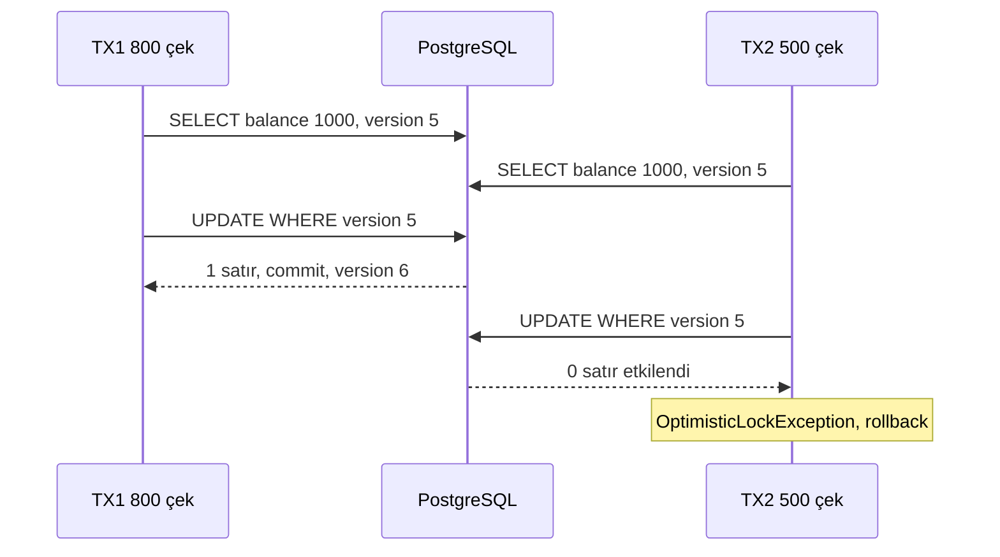
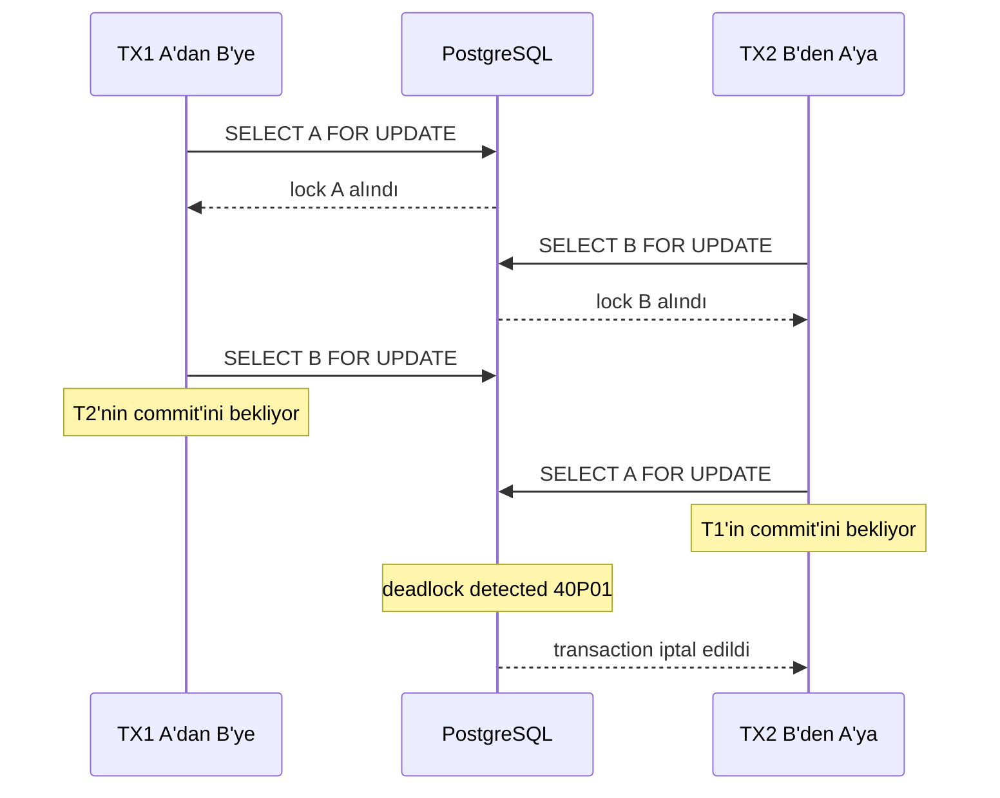
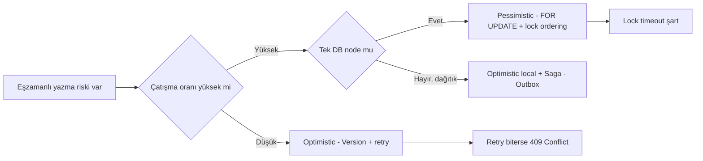

# Topic 2.4 — Locking: Optimistic & Pessimistic

```admonish info title="Bu bölümde"
- Lost update probleminin banking'deki gerçek maliyeti ve isolation level'ların neden tek başına yetmediği
- Optimistic locking: `@Version` mekaniği, `OptimisticLockingFailureException` ve retry pattern'leri
- Pessimistic locking: `SELECT FOR UPDATE`, `LockModeType` seçenekleri, `NOWAIT` ve `SKIP LOCKED`
- Deadlock'u kasten üretme, `jstack` ile gözlemleme ve lock ordering ile kalıcı çözüm
- PostgreSQL SERIALIZABLE (SSI) alternatifi ve banking-grade retry: exponential backoff + jitter + metrics
```

## Hedef

Concurrency'nin banking domain'inde yarattığı problemleri (lost update, double withdraw, deadlock) **gerçek reprodüksiyon kodlarıyla** görmek. Optimistic locking (`@Version`) ve pessimistic locking (`LockModeType.PESSIMISTIC_WRITE`) arasında karar verebilmek. Deadlock'u Java kodunda **kasten üretip** `jstack` ile gözlemleyip, **lock ordering** ile çözmek. PostgreSQL `SERIALIZABLE` serialization failure pattern'ini ve retry strategy'lerini (exponential backoff, `@Retryable`) banking-grade yazabilmek. `SELECT FOR UPDATE NOWAIT`, `SKIP LOCKED` gibi SQL primitiflerini bilinçli kullanmak.

## Süre

Okuma: 2 saat • Kendini Sına: 30 dk • Pratik (opsiyonel): 3-4 saat • Toplam: ~2.5 saat (+ pratik)

## Önbilgi

- Topic 2.3 (Transactions) bitti — propagation, isolation level, `@Transactional` mekaniği biliyorsun
- ACID'in "I"sının (isolation) neden tam çözüm olmadığını biliyorsun (lost update phenomenon REPEATABLE_READ'te bile mümkün, isolation level'a göre)
- `OptimisticLockException`, `PessimisticLockException` isimlerini duydun ama ne zaman fırlatıldığını net görmedin

---

## Kavramlar

### 1. Concurrency'nin banking'deki yüzü — lost update senaryosu

Bir hesapta 1000 TL var ve aynı anda iki para çekme isteği geliyor — bu bölümdeki her şeyin motivasyonu bu tek an. İki paralel API call düşün:

- **T1:** "Hesaptan 800 çek" — SELECT balance (1000) → balance - 800 = 200 → UPDATE
- **T2:** "Hesaptan 500 çek" — SELECT balance (1000) → balance - 500 = 500 → UPDATE

İki transaction da READ_COMMITTED'ta `SELECT` → uygulama katmanında matematik → `UPDATE` şeklinde işlerse, ikisi de **kendi snapshot'ında 1000** görür. Son commit hangisi olursa onun yazdığı değer kalır; ötekinin update'i kaybolur. Bu **lost update** problemi.

Sonuç: hesaptan toplam 1300 TL çekildi (kaynak yetersiz olduğu halde her iki işlem de "başarılı" dedi), bakiye 500 veya 200 kaldı. Banka 800 TL veya 500 TL açık.

Peki isolation level bunu çözmüyor mu?

- READ_COMMITTED: Hayır (iki SELECT de 1000 görür, lock yok).
- REPEATABLE_READ (MySQL InnoDB): Hayır — MySQL `SELECT` salt okuyucu, lock almaz.
- REPEATABLE_READ (PostgreSQL): "Could not serialize access" hatası bazı durumlarda, ama UPDATE-only pattern'de garantili değil.
- SERIALIZABLE: Evet, ama performans cezası ağır ve hâlâ serialization failure retry'ı gerektirir.

Pratik çözüm locking: ya **optimistic** (`@Version`), ya **pessimistic** (`SELECT FOR UPDATE`). <mark>Lost update'i isolation level değil, bilinçli seçilmiş bir locking stratejisi çözer</mark> — banking'de bu seçim iş kuralları + tahmini contention seviyesine göre yapılır.

### 2. Optimistic Locking — `@Version`

**Felsefe:** "Çatışma az olur — biri olduğunda işlemi reddederim, gerekirse retry ederim." Yani iyimser. **Optimistic locking** DB'de lock tutmaz; çatışmayı yazma anında yakalar.

Mekanik üç adım:

1. Entity'ye `@Version` ile bir integer (genelde `long`) kolon eklenir.
2. Her UPDATE'te Hibernate bu kolonu WHERE'e koyar ve değerini bir artırır:
   ```sql
   UPDATE accounts 
   SET balance_amount = ?, version = ? + 1 
   WHERE id = ? AND version = ?
   ```
3. Etkilenen satır sayısı 0 ise (başka biri version'u değiştirdi), Hibernate `OptimisticLockException` fırlatır.

Aynı senaryo `@Version` ile şöyle akar:



**Banking örneği:**

```java
@Entity
@Table(name = "accounts")
public class AccountJpaEntity extends AuditableEntity {
    
    @Id
    private UUID id;
    
    @Column(name = "owner_id", nullable = false)
    private UUID ownerId;
    
    @Column(name = "currency", nullable = false, length = 3)
    private String currency;
    
    @Column(name = "balance_amount", nullable = false, precision = 19, scale = 4)
    private BigDecimal balanceAmount;
    
    @Version
    @Column(name = "version", nullable = false)
    private long version;
    
    // getters/setters (no setter for version — Hibernate yönetir)
}
```

Migration:

```sql
ALTER TABLE accounts ADD COLUMN version BIGINT NOT NULL DEFAULT 0;
```

**Reprodüksiyon — lost update artık olmuyor.** Test iki paralel withdraw çalıştırır; her runnable kendi transaction'ında entity'yi okur, kısa bir delay sonrası günceller:

```java
Runnable withdraw800 = () -> transactionTemplate.executeWithoutResult(tx -> {
    try {
        startLatch.await();
        AccountJpaEntity a = repo.findById(accountId).orElseThrow();
        Thread.sleep(100);   // simulate processing delay
        a.setBalanceAmount(a.getBalanceAmount().subtract(new BigDecimal("800.00")));
        repo.saveAndFlush(a);
    } catch (Exception e) { ex1.set(e); }
});
```

İki thread de aynı version'u okuduğu için ikinci flush 0 satır etkiler — birinin exception alması garantilidir:

```java
// Birinin OptimisticLockException alması garantili
assertThat(
    ex1.get() instanceof OptimisticLockingFailureException
    || ex2.get() instanceof OptimisticLockingFailureException
).isTrue();

BigDecimal finalBalance = repo.findById(accountId).orElseThrow().getBalanceAmount();
// Sadece bir update kaldı: ya 200 ya 500
assertThat(finalBalance).isIn(new BigDecimal("200.00"), new BigDecimal("500.00"));
```

<details>
<summary>Tam kod: optimisticLockingShouldPreventLostUpdate testi (~47 satır)</summary>

```java
@Test
@Transactional(propagation = Propagation.NOT_SUPPORTED)
void optimisticLockingShouldPreventLostUpdate() throws Exception {
    UUID accountId = createAccountWithBalance("1000.00");
    
    ExecutorService executor = Executors.newFixedThreadPool(2);
    CountDownLatch startLatch = new CountDownLatch(1);
    AtomicReference<Exception> ex1 = new AtomicReference<>();
    AtomicReference<Exception> ex2 = new AtomicReference<>();
    
    Runnable withdraw800 = () -> transactionTemplate.executeWithoutResult(tx -> {
        try {
            startLatch.await();
            AccountJpaEntity a = repo.findById(accountId).orElseThrow();
            Thread.sleep(100);   // simulate processing delay
            a.setBalanceAmount(a.getBalanceAmount().subtract(new BigDecimal("800.00")));
            repo.saveAndFlush(a);
        } catch (Exception e) { ex1.set(e); }
    });
    
    Runnable withdraw500 = () -> transactionTemplate.executeWithoutResult(tx -> {
        try {
            startLatch.await();
            AccountJpaEntity a = repo.findById(accountId).orElseThrow();
            Thread.sleep(100);
            a.setBalanceAmount(a.getBalanceAmount().subtract(new BigDecimal("500.00")));
            repo.saveAndFlush(a);
        } catch (Exception e) { ex2.set(e); }
    });
    
    executor.submit(withdraw800);
    executor.submit(withdraw500);
    startLatch.countDown();
    executor.shutdown();
    executor.awaitTermination(5, TimeUnit.SECONDS);
    
    // Birinin OptimisticLockException alması garantili
    assertThat(
        ex1.get() instanceof OptimisticLockingFailureException
        || ex2.get() instanceof OptimisticLockingFailureException
    ).isTrue();
    
    BigDecimal finalBalance = repo.findById(accountId).orElseThrow().getBalanceAmount();
    // Sadece bir update kaldı: ya 200 ya 500
    assertThat(finalBalance).isIn(new BigDecimal("200.00"), new BigDecimal("500.00"));
}
```

</details>

Exception zinciri: Hibernate `StaleObjectStateException` fırlatır → Spring bunu `OptimisticLockingFailureException` ile sarmalar (DataAccessException hierarchy).

**Trade-off özeti:**

- Artı: DB lock yok → throughput yüksek; read-heavy workload'da ideal; deadlock olmaz (lock yok)
- Eksi: çatışma anında işlem reddedilir → retry gerekir; çatışma yoğunsa retry storm → ters performans

**Banking'de ne zaman:** hesap profili güncelleme (telefon, adres — çatışma çok düşük), kullanıcı edit ekranları (5 dk düzeltir, save'ler), microservice'te dağıtık veri (pessimistic lock kurumsal olarak imkânsız).

### 3. Optimistic Lock + Retry pattern

`OptimisticLockingFailureException` kullanıcıya "hata" olarak dönmemeli — çatışma geçicidir, otomatik retry çoğu zaman ikinci denemede başarır. İki strateji var.

#### Strateji A — Spring Retry (`@Retryable`)

```xml
<dependency>
    <groupId>org.springframework.retry</groupId>
    <artifactId>spring-retry</artifactId>
</dependency>
<dependency>
    <groupId>org.springframework</groupId>
    <artifactId>spring-aspects</artifactId>
</dependency>
```

`@EnableRetry` ekle, sonra:

```java
@Service
public class WithdrawService {
    
    @Retryable(
        retryFor = OptimisticLockingFailureException.class,
        maxAttempts = 3,
        backoff = @Backoff(delay = 50, multiplier = 2.0, maxDelay = 500)
    )
    @Transactional
    public void withdraw(AccountId accountId, Money amount) {
        Account account = accountRepository.findById(accountId).orElseThrow();
        account.withdraw(amount);   // domain rule
        accountRepository.save(account);
    }
    
    @Recover
    public void recover(OptimisticLockingFailureException ex, AccountId accountId, Money amount) {
        // 3 deneme de başarısız oldu — kullanıcıya 409 Conflict dön
        throw new ConcurrentModificationException(
            "Hesap üzerinde eşzamanlı işlem var, lütfen tekrar deneyin"
        );
    }
}
```

```admonish warning title="İki @Retryable tuzağı"
1. `@Retryable` AOP proxy ile çalışır — **self-invocation tuzağı geçerli** (Topic 2.3'teki gibi). Aynı sınıf içinden çağrılırsa retry aktif değildir.
2. Retry'ın işe yaraması için TX her denemede **yeniden açılmalı**: method'a giriş → TX açılır → fail → rollback → retry → yeni TX. Bu yüzden `@Transactional` method seviyesinde olmalı; outer TX zaten açıksa retry işe yaramaz (aynı TX içinde version stale kalır).
```

#### Strateji B — Manuel retry loop

Kütüphane istemiyorsan veya finer control gerekiyorsa loop'u kendin yazarsın. Backoff hesabının çekirdeği şu üç satır:

```java
long delay = BASE_DELAY_MS * (long) Math.pow(2, attempt - 1);
long jitter = ThreadLocalRandom.current().nextLong(0, delay / 2);
Thread.sleep(delay + jitter);
```

Retry edilen iş, her denemede yeni TX açılsın diye ayrı bir `@Transactional` method'da durur — self-invocation'dan kaçınmak için self-injection ile çağrılır:

```java
@Transactional
public void doWithdraw(AccountId id, Money amount) {
    Account account = accountRepository.findById(id).orElseThrow();
    account.withdraw(amount);
    accountRepository.save(account);
}
```

<details>
<summary>Tam kod: manuel retry loop ile WithdrawService (~40 satır)</summary>

```java
@Service
public class WithdrawService {
    
    private static final int MAX_ATTEMPTS = 3;
    private static final long BASE_DELAY_MS = 50;
    
    @Autowired
    private WithdrawService self;   // self-injection (Topic 2.3)
    
    public void withdraw(AccountId id, Money amount) {
        OptimisticLockingFailureException lastEx = null;
        for (int attempt = 1; attempt <= MAX_ATTEMPTS; attempt++) {
            try {
                self.doWithdraw(id, amount);
                return;   // success
            } catch (OptimisticLockingFailureException ex) {
                lastEx = ex;
                long delay = BASE_DELAY_MS * (long) Math.pow(2, attempt - 1);
                long jitter = ThreadLocalRandom.current().nextLong(0, delay / 2);
                try {
                    Thread.sleep(delay + jitter);
                } catch (InterruptedException ie) {
                    Thread.currentThread().interrupt();
                    throw new RuntimeException(ie);
                }
            }
        }
        throw new ConcurrentModificationException(
            "Hesap güncellenemiyor — 3 deneme başarısız",
            lastEx
        );
    }
    
    @Transactional
    public void doWithdraw(AccountId id, Money amount) {
        Account account = accountRepository.findById(id).orElseThrow();
        account.withdraw(amount);
        accountRepository.save(account);
    }
}
```

</details>

Neden jitter? Birden fazla worker aynı anda retry yaparsa hepsi aynı delay'de geri gelir — buna **thundering herd** denir. **Exponential backoff** dalgaları seyreltir, random jitter aynı ana denk gelmelerini önler.

**Banking pratiği:** 3 denemeden sonra fail → 409 Conflict, kullanıcıya "tekrar deneyin" mesajı. Retry, idempotency ile birleşince güvenli — aynı işlem iki kere uygulanmaz.

### 4. `@Version` data type seçimi ve tuzaklar

Version kolonu masum görünür ama tip seçimi ve kullanım şekli production'da fark yaratır.

**Type tercihleri:**

- `long` / `Long` — en yaygın, overflow problemi yok
- `int` / `Integer` — ~2.1 milyar update sonrası overflow (banking için yetersiz)
- `Instant` / `Timestamp` — JPA destekler ama saat senkronizasyon problemi olabilir
- `Short` — anti-pattern

**Tuzak 1: Detached entity'i save**

```java
AccountJpaEntity entity = repo.findById(id).orElseThrow();  // version = 5
em.detach(entity);
// ... başka request entity'i update etti, DB'de version = 6
entity.setBalanceAmount(...);
repo.save(entity);   // → OptimisticLockingFailureException (DB version 6, entity version 5)
```

**Tuzak 2: Manuel version değiştirme**

```java
entity.setVersion(0);   // ❌ HİÇBİR ZAMAN
```

Bu Hibernate'i karıştırır. `@Version` field'a Java tarafından dokunulmaz.

**Tuzak 3: Version olmayan entity'i optimistic test etme**

```java
@Lock(LockModeType.OPTIMISTIC)   // ama @Version yok
Optional<AccountJpaEntity> findWithLock(UUID id);   
// Hibernate hiçbir şey yapmaz — version olmadan lock yok
```

### 5. Pessimistic Locking — `SELECT FOR UPDATE`

Transfer gibi yüksek çatışmalı money movement'ta her çatışmada reject + retry pahalıya gelir — burada devreye **pessimistic locking** girer. Felsefe: "Çatışma sık olur — okurken kilitlerim, kimse aynı anda alamaz."

Mekanik: DB seviyesinde **row-level lock**. `SELECT ... FOR UPDATE` çalıştırırsın, satır kilitlenir; aynı satırı başka transaction `FOR UPDATE` veya UPDATE ile almak isterse bekler (veya timeout / hata, konfigürasyona göre).

**LockModeType seçenekleri (JPA standardı):**

| LockMode | SQL eşdeğeri | Anlam |
|---|---|---|
| `NONE` | (yok) | Lock yok |
| `OPTIMISTIC` | (yok) | `@Version` check at flush |
| `OPTIMISTIC_FORCE_INCREMENT` | UPDATE version | Read-only erişimde bile version artır |
| `PESSIMISTIC_READ` | `SELECT FOR SHARE` (PostgreSQL) | Shared lock — başkaları okuyabilir, yazamaz |
| `PESSIMISTIC_WRITE` | `SELECT FOR UPDATE` | Exclusive lock — başkaları okuyamaz da, yazamaz da (DB'ye göre) |
| `PESSIMISTIC_FORCE_INCREMENT` | `SELECT FOR UPDATE` + version++ | Lock + optimistic version |

Banking'in en yaygın seçimi: `PESSIMISTIC_WRITE`.

#### `@Lock` annotation — Spring Data JPA

```java
interface AccountJpaRepository extends JpaRepository<AccountJpaEntity, UUID> {
    
    @Lock(LockModeType.PESSIMISTIC_WRITE)
    @Query("SELECT a FROM AccountJpaEntity a WHERE a.id = :id")
    Optional<AccountJpaEntity> findByIdForUpdate(@Param("id") UUID id);
}
```

Üretilen SQL (PostgreSQL):

```sql
SELECT a.id, a.balance_amount, a.version, ... 
FROM accounts a 
WHERE a.id = ? 
FOR UPDATE;
```

#### Banking transfer örneği — pessimistic ile

```java
@Service
public class TransferService {
    
    @Transactional
    public void transfer(AccountId fromId, AccountId toId, Money amount) {
        // İki hesabı da kilitleyerek al
        AccountJpaEntity from = jpaRepo.findByIdForUpdate(fromId.value())
            .orElseThrow(() -> new AccountNotFoundException(fromId));
        AccountJpaEntity to = jpaRepo.findByIdForUpdate(toId.value())
            .orElseThrow(() -> new AccountNotFoundException(toId));
        
        if (from.getBalanceAmount().compareTo(amount.value()) < 0) {
            throw new InsufficientFundsException(fromId);
        }
        
        from.setBalanceAmount(from.getBalanceAmount().subtract(amount.value()));
        to.setBalanceAmount(to.getBalanceAmount().add(amount.value()));
        
        jpaRepo.save(from);
        jpaRepo.save(to);
        
        // journal_entry + 2 journal_line oluştur ...
    }
}
```

Paralel iki transfer aynı `from` hesabına gelirse biri kilitler, diğeri bekler; ilki commit ettiğinde ikincisi güncel bakiyeyle çalışır. <mark>Pessimistic lock altında lost update imkânsızdır — ikinci transaction ilkinin commit'ini beklemek zorundadır</mark>.

Trade-off: throughput düşer (bekleyen var). Banking'de para transferinde bu OK — doğruluk hızdan önemli.

### 6. Lock timeout — `NOWAIT`, `WAIT n`, `SKIP LOCKED`

`FOR UPDATE`'ı süresiz beklemek tehlikeli — bir transaction lock'ı tutarken bekleyenler connection pool'u tüketebilir. Lock timeout şart.

#### `NOWAIT` — beklemeden hata

```java
@Lock(LockModeType.PESSIMISTIC_WRITE)
@QueryHints({
    @QueryHint(name = "javax.persistence.lock.timeout", value = "0")  // 0 ms = NOWAIT
})
@Query("SELECT a FROM AccountJpaEntity a WHERE a.id = :id")
Optional<AccountJpaEntity> findByIdForUpdateNoWait(@Param("id") UUID id);
```

PostgreSQL SQL:

```sql
SELECT ... FROM accounts WHERE id = ? FOR UPDATE NOWAIT;
```

Satır kilitliyse anında `PessimisticLockException` fırlatır, bekleme yok. Banking use case: hızlı API çağrısı — beklemektense reddedip kullanıcıyı tekrar denemeye yönlendirmek.

#### `WAIT n` (Oracle terminolojisi) / `lock_timeout` (PostgreSQL)

```java
@QueryHints({
    @QueryHint(name = "javax.persistence.lock.timeout", value = "3000")  // 3 saniye bekle
})
```

PostgreSQL'de bu hint genelde `SET LOCAL lock_timeout` ile uygulanır. 3 saniyede lock alınamazsa exception.

```admonish tip title="Banking timeout kalibrasyonu"
API endpoint'lerinde 2-5 saniye lock timeout kullan — kullanıcı zaten beklemez. Batch job'larda 30+ saniye OK. Timeout'suz `FOR UPDATE` production'a çıkmamalı.
```

#### `SKIP LOCKED` — queue pattern

```java
@Query(value = """
    SELECT * FROM pending_transactions 
    WHERE status = 'PENDING' 
    ORDER BY created_at 
    LIMIT :limit 
    FOR UPDATE SKIP LOCKED
""", nativeQuery = true)
List<PendingTransactionEntity> claimNextBatch(@Param("limit") int limit);
```

Birden fazla worker aynı tabloyu çekiyor. Kilit gördüğü satırı atlar, başkasını alır — her worker farklı batch alır, çatışma sıfır. Banking use case: pending transfer queue, asenkron fee hesaplama, retry kuyruğu. Multi-worker job processing'in altın standardı.

Pratikte tablo ve worker şöyle görünür:

```sql
CREATE TABLE pending_transactions (
    id UUID PRIMARY KEY,
    payload JSONB NOT NULL,
    status VARCHAR(20) NOT NULL DEFAULT 'PENDING',
    created_at TIMESTAMP WITH TIME ZONE NOT NULL DEFAULT NOW(),
    claimed_at TIMESTAMP WITH TIME ZONE,
    claimed_by VARCHAR(100)
);

CREATE INDEX idx_pending_status ON pending_transactions(status, created_at);
```

```java
@Scheduled(fixedDelay = 1000)
@Transactional
public void processNextBatch() {
    List<PendingTransactionEntity> batch = repo.claimBatch(10);
    for (var pending : batch) {
        pending.setStatus("PROCESSING");
        pending.setClaimedAt(Instant.now());
        pending.setClaimedBy(workerId);
        // ... process
    }
}
```

İki instance aynı anda çalışsa bile aynı kayıt iki yerde görünmez — `SKIP LOCKED` kilitli satırı diğer instance'a hiç göstermez.

Tuzak: destek PostgreSQL 9.5+, Oracle, SQL Server 2016+, MySQL InnoDB 8.0.1+ — daha eski sürümlerde yok.

### 7. Deadlock — banking'in klasik tuzağı

Pessimistic lock'un bedeli var: iki transaction aynı kaynakları **farklı sırada** kilitlerse **deadlock** oluşur. Banking'deki klasik senaryo, A→B ve B→A transferlerinin aynı anda gelmesi:



DB deadlock'ı tespit eder (PostgreSQL ~1 saniye sonra) ve birini öldürür: `40P01: deadlock detected`. Spring tarafında bu `CannotAcquireLockException` (DataAccessException) olarak yakalanır.

#### Reprodüksiyon kodu

Test, 20 thread'lik pool'da 100 iterasyon boyunca iki yönde transfer submit eder. Her iterasyonda A→B ve B→A birlikte kuyruğa girer:

```java
// A → B yönü — aynı döngüde B → A da simetrik şekilde submit ediliyor
futures.add(executor.submit(() -> {
    try {
        transferService.transfer(
            new AccountId(accountA),
            new AccountId(accountB),
            Money.of("10.00", "TRY")
        );
        successes.incrementAndGet();
    } catch (CannotAcquireLockException e) {
        deadlocks.incrementAndGet();
    } catch (Exception e) {
        otherErrors.incrementAndGet();
    }
}));
```

Sonunda sayaçlar toplanır — lock ordering yokken deadlock kaçınılmazdır:

```java
for (Future<?> f : futures) f.get(30, TimeUnit.SECONDS);
executor.shutdown();

System.out.println("Success: " + successes.get());
System.out.println("Deadlock: " + deadlocks.get());
System.out.println("Other: " + otherErrors.get());

// Sıralama yokken deadlock kaçınılmaz
assertThat(deadlocks.get()).isGreaterThan(0);
```

<details>
<summary>Tam kod: DeadlockReproductionTest (~72 satır)</summary>

```java
@SpringBootTest
@Testcontainers
class DeadlockReproductionTest {
    
    @Container
    @ServiceConnection
    static PostgreSQLContainer<?> postgres = new PostgreSQLContainer<>("postgres:16-alpine");
    
    @Autowired TransferService transferService;
    @Autowired AccountRepository accountRepository;
    
    UUID accountA, accountB;
    
    @BeforeEach
    void setup() {
        accountA = createAccountWithBalance("10000.00");
        accountB = createAccountWithBalance("10000.00");
    }
    
    @Test
    void shouldReproduceDeadlock() throws Exception {
        int iterations = 100;
        ExecutorService executor = Executors.newFixedThreadPool(20);
        AtomicInteger successes = new AtomicInteger();
        AtomicInteger deadlocks = new AtomicInteger();
        AtomicInteger otherErrors = new AtomicInteger();
        
        List<Future<?>> futures = new ArrayList<>();
        for (int i = 0; i < iterations; i++) {
            // A → B
            futures.add(executor.submit(() -> {
                try {
                    transferService.transfer(
                        new AccountId(accountA),
                        new AccountId(accountB),
                        Money.of("10.00", "TRY")
                    );
                    successes.incrementAndGet();
                } catch (CannotAcquireLockException e) {
                    deadlocks.incrementAndGet();
                } catch (Exception e) {
                    otherErrors.incrementAndGet();
                }
            }));
            // B → A
            futures.add(executor.submit(() -> {
                try {
                    transferService.transfer(
                        new AccountId(accountB),
                        new AccountId(accountA),
                        Money.of("10.00", "TRY")
                    );
                    successes.incrementAndGet();
                } catch (CannotAcquireLockException e) {
                    deadlocks.incrementAndGet();
                } catch (Exception e) {
                    otherErrors.incrementAndGet();
                }
            }));
        }
        
        for (Future<?> f : futures) f.get(30, TimeUnit.SECONDS);
        executor.shutdown();
        
        System.out.println("Success: " + successes.get());
        System.out.println("Deadlock: " + deadlocks.get());
        System.out.println("Other: " + otherErrors.get());
        
        // Sıralama yokken deadlock kaçınılmaz
        assertThat(deadlocks.get()).isGreaterThan(0);
    }
}
```

</details>

Bu test'i çalıştırdığında PostgreSQL log'da:

```
ERROR: deadlock detected
DETAIL: Process 1234 waits for ShareLock on transaction 567; blocked by process 5678.
        Process 5678 waits for ShareLock on transaction 568; blocked by process 1234.
HINT: See server log for query details.
```

#### `jstack` ile deadlock analizi (uygulama tarafında)

Bazen deadlock DB seviyesinde değil, Java thread seviyesinde olur (lock objesi, monitor). Bunu `jstack` ile görürsün:

```bash
jps                                  # PID'i bul
jstack -l <pid> > thread-dump.txt    # full dump
```

Çıktıda:

```
Found one Java-level deadlock:
=============================
"Thread-1":
  waiting to lock monitor 0x00007fbe9c008f78 (object 0x00000007abc...,
  a com.mavibank.banking.Account),
  which is held by "Thread-2"
"Thread-2":
  waiting to lock monitor 0x00007fbe9c008e38 (object 0x00000007def...,
  a com.mavibank.banking.Account),
  which is held by "Thread-1"
```

DB deadlock için `pg_stat_activity` ve `pg_locks` view'larından okursun. Banking üretim ortamında bunu monitoring'e bağlamak şart.

### 8. Deadlock fix — Lock Ordering

Deadlock'un panzehiri şaşırtıcı derecede basit: **lock ordering** — tüm transaction'lar kaynakları aynı sırada kilitlesin. `account.id`'ye göre sırala, küçük olanı önce al.

Transfer method'unun başında sıralamayı belirle:

```java
// Lock ordering: küçük ID önce
AccountId firstLockId, secondLockId;
if (fromId.value().compareTo(toId.value()) < 0) {
    firstLockId = fromId;
    secondLockId = toId;
} else {
    firstLockId = toId;
    secondLockId = fromId;
}
```

Sonra bu sırayla kilitle ve hangisinin `from`, hangisinin `to` olduğunu geri çöz:

```java
AccountJpaEntity first = jpaRepo.findByIdForUpdate(firstLockId.value()).orElseThrow();
AccountJpaEntity second = jpaRepo.findByIdForUpdate(secondLockId.value()).orElseThrow();

// Hangisi from, hangisi to olduğunu ayırt et
AccountJpaEntity from = firstLockId.equals(fromId) ? first : second;
AccountJpaEntity to = firstLockId.equals(fromId) ? second : first;
```

<details>
<summary>Tam kod: lock ordering ile TransferService (~38 satır)</summary>

```java
@Service
public class TransferService {
    
    @Transactional
    public void transfer(AccountId fromId, AccountId toId, Money amount) {
        if (fromId.equals(toId)) {
            throw new SelfTransferException();
        }
        
        // Lock ordering: küçük ID önce
        AccountId firstLockId, secondLockId;
        if (fromId.value().compareTo(toId.value()) < 0) {
            firstLockId = fromId;
            secondLockId = toId;
        } else {
            firstLockId = toId;
            secondLockId = fromId;
        }
        
        AccountJpaEntity first = jpaRepo.findByIdForUpdate(firstLockId.value()).orElseThrow();
        AccountJpaEntity second = jpaRepo.findByIdForUpdate(secondLockId.value()).orElseThrow();
        
        // Hangisi from, hangisi to olduğunu ayırt et
        AccountJpaEntity from = firstLockId.equals(fromId) ? first : second;
        AccountJpaEntity to = firstLockId.equals(fromId) ? second : first;
        
        if (from.getBalanceAmount().compareTo(amount.value()) < 0) {
            throw new InsufficientFundsException(fromId);
        }
        
        from.setBalanceAmount(from.getBalanceAmount().subtract(amount.value()));
        to.setBalanceAmount(to.getBalanceAmount().add(amount.value()));
        
        jpaRepo.save(from);
        jpaRepo.save(to);
    }
}
```

</details>

Şimdi A→B ve B→A senaryosunda ikisi de önce min(A,B), sonra max(A,B) kilitler. <mark>Tüm transaction'lar kaynakları aynı sırada kilitlerse deadlock oluşamaz</mark> — ikinci transaction birincinin bitmesini bekler, döngüsel bekleme hiç kurulamaz.

Çoklu hesap senaryosunda (örnek: 5 hesabı kilitleyen bir batch) prensip aynı — hepsini ID'ye göre sort et, sırayla kilitle:

```java
List<AccountId> sortedIds = accountIds.stream()
    .sorted(Comparator.comparing(AccountId::value))
    .toList();

List<AccountJpaEntity> locked = new ArrayList<>();
for (AccountId id : sortedIds) {
    locked.add(jpaRepo.findByIdForUpdate(id.value()).orElseThrow());
}
```

### 9. PostgreSQL SERIALIZABLE — serialization failure ve retry

Lock ordering ile uğraşmak istemiyorsan lock-free bir alternatif var. PostgreSQL'in SERIALIZABLE isolation'ı **SSI** (Serializable Snapshot Isolation) algoritmasını kullanır: lock almaz, ama transaction'lar geçerli bir sıraya oturmuyorsa commit'i reddeder:

```
ERROR: could not serialize access due to read/write dependencies among transactions
SQLSTATE: 40001
```

Spring tarafında bu `CannotSerializeTransactionException`. Retry edilmeli — pattern manuel retry loop'un aynısı:

```java
public void transfer(TransferRequest req) {
    for (int attempt = 1; attempt <= MAX_ATTEMPTS; attempt++) {
        try {
            self.doTransfer(req);
            return;
        } catch (CannotSerializeTransactionException ex) {
            if (attempt == MAX_ATTEMPTS) {
                throw new TransferRetryExhaustedException(req.idempotencyKey(), ex);
            }
            sleepWithBackoff(attempt);
        }
    }
}
```

Asıl iş SERIALIZABLE isolation'da, `FOR UPDATE`'siz döner:

```java
@Transactional(isolation = Isolation.SERIALIZABLE)
public void doTransfer(TransferRequest req) {
    // ... transfer logic, lock-free
}
```

<details>
<summary>Tam kod: SerializableTransferService (~39 satır)</summary>

```java
@Service
public class SerializableTransferService {
    
    private static final int MAX_ATTEMPTS = 5;
    
    @Autowired
    private SerializableTransferService self;
    
    public void transfer(TransferRequest req) {
        for (int attempt = 1; attempt <= MAX_ATTEMPTS; attempt++) {
            try {
                self.doTransfer(req);
                return;
            } catch (CannotSerializeTransactionException ex) {
                if (attempt == MAX_ATTEMPTS) {
                    throw new TransferRetryExhaustedException(req.idempotencyKey(), ex);
                }
                sleepWithBackoff(attempt);
            }
        }
    }
    
    @Transactional(isolation = Isolation.SERIALIZABLE)
    public void doTransfer(TransferRequest req) {
        // ... transfer logic, lock-free
    }
    
    private void sleepWithBackoff(int attempt) {
        long base = 20L * (1L << (attempt - 1));   // 20, 40, 80, 160, 320 ms
        long jitter = ThreadLocalRandom.current().nextLong(0, base);
        try {
            Thread.sleep(base + jitter);
        } catch (InterruptedException e) {
            Thread.currentThread().interrupt();
            throw new RuntimeException(e);
        }
    }
}
```

</details>

**Pessimistic lock'a göre karşılaştırma:**

- Artı: lock yok → DB tarafında deadlock yok; read-heavy workload'da daha iyi; uygulama lock ordering ile uğraşmaz
- Eksi: retry oranı contention'a göre yüksek olabilir; SSI PostgreSQL-specific — Oracle/MySQL'de SERIALIZABLE lock-based çalışır, deadlock olabilir

```admonish tip title="Güçlü kombinasyon"
PostgreSQL'de SERIALIZABLE + idempotency-key + retry üçlüsü banking'de çok güçlü bir pattern — birçok TR fintech transfer akışını tam bu kombinasyonla kurar.
```

### 10. Pessimistic vs Optimistic — karar matrisi

İki stratejinin hangisini seçeceğin mülakatlarda da production'da da en çok sorulan karar. Matris:

| Kriter | Optimistic | Pessimistic |
|---|---|---|
| Çatışma oranı | Düşük (< %10) | Yüksek (> %10) |
| TX süresi | Uzun (kullanıcı düşünür, edit eder) | Kısa (atomik DB işlemi) |
| Cluster içi mi? | Tek node — pessimistic OK | Distributed → optimistic (veya distributed lock) |
| Deadlock toleransı | Sıfır (lock yok) | Var (lock ordering şart) |
| Retry stratejisi | Mutlaka | Opsiyonel |
| Throughput | Yüksek | Düşük |
| Banking örnekleri | Profile update, hesap detay edit | Para transferi, bakiye kontrolü |



**Banking pratiği:**

- **Money movement** (transfer, deposit, withdraw): Pessimistic + lock ordering
- **Account configuration** (limit değişimi, isim): Optimistic + retry
- **Reporting** (read-only): Lock yok, `readOnly = true`, snapshot isolation
- **Distributed transaction** (microservice): Saga / Outbox + optimistic local

### 11. Lock granularity — row vs table vs custom

**Row-level lock:** `SELECT FOR UPDATE` — sadece o satırlar kilitlenir. Yaygın olan.

**Table-level lock:** `LOCK TABLE accounts IN EXCLUSIVE MODE;` — tüm tablo kilitli. Sadece migration veya DDL benzeri operasyon için; banking'de operasyonel kullanımı yok.

**Advisory lock** (PostgreSQL özelliği): custom semantic lock — `pg_advisory_xact_lock(hash)`. Transaction içinde alınır, commit/rollback'te bırakılır; uygulama-seviyesi mutex gibi çalışır.

```sql
-- Aynı transaction'da
SELECT pg_advisory_xact_lock(hashtext('transfer-' || :idempotencyKey));
-- ... transfer işlemi ...
```

Banking'de idempotency lock için faydalı: aynı idempotency-key ile iki istek geldiğinde advisory lock ikincinin beklemesini sağlar.

### 12. `LockModeType.OPTIMISTIC_FORCE_INCREMENT` — kullanım senaryosu

Bir transaction bir aggregate'i sadece **okuyor** ama version'unu artırmak istiyor — parent-child invariant'ı korumak için.

Banking örneği: `Account` (parent) ve `JournalLine` (child). Yeni bir journal line eklediğinde Account aggregate root'unun version'u artmalı — başka bir transaction Account'u eski snapshot'ta görüp inconsistent değişiklik yapmasın.

```java
@Lock(LockModeType.OPTIMISTIC_FORCE_INCREMENT)
@Query("SELECT a FROM AccountJpaEntity a WHERE a.id = :id")
Optional<AccountJpaEntity> findAndIncrementVersion(@Param("id") UUID id);
```

Account hiç değişmese bile flush zamanında `UPDATE accounts SET version = version + 1 WHERE id = ? AND version = ?` çıkar. DDD aggregate invariant pattern'in JPA implementasyonu.

### 13. Banking-grade retry — exponential backoff + jitter + metrics

Buraya kadarki retry parçalarını production kalitesinde birleştirelim: exception ayrımı, backoff cap'i ve Micrometer metrics tek serviste. Kalbi, retry edilecek ve edilmeyecek exception'ları ayıran catch zinciri:

```java
try {
    self.doTransfer(req);
    meterRegistry.counter("transfer.success",
        "attempts", String.valueOf(attempt)).increment();
    sample.stop(meterRegistry.timer("transfer.duration"));
    return;
} catch (OptimisticLockingFailureException
       | CannotSerializeTransactionException
       | CannotAcquireLockException ex) {
    lastEx = ex;
    meterRegistry.counter("transfer.retry",
        "reason", ex.getClass().getSimpleName()).increment();
    if (attempt == MAX_ATTEMPTS) break;
    sleepWithBackoff(attempt);
} catch (InsufficientFundsException | AccountNotFoundException ex) {
    throw ex;   // business exception — retry etme
}
```

Backoff bu kez cap'li — exponential büyüme bir üst sınırda durdurulur:

```java
private void sleepWithBackoff(int attempt) {
    long exponential = BASE_DELAY_MS * (1L << (attempt - 1));
    long capped = Math.min(exponential, MAX_DELAY_MS);
    long jitter = ThreadLocalRandom.current().nextLong(0, capped);
    long total = capped + jitter;
    
    try {
        Thread.sleep(total);
    } catch (InterruptedException ie) {
        Thread.currentThread().interrupt();
        throw new RuntimeException(ie);
    }
}
```

<details>
<summary>Tam kod: ResilientTransferService (~63 satır)</summary>

```java
@Service
public class ResilientTransferService {
    
    private static final int MAX_ATTEMPTS = 5;
    private static final long BASE_DELAY_MS = 50;
    private static final long MAX_DELAY_MS = 2000;
    
    @Autowired
    private ResilientTransferService self;
    
    @Autowired
    private MeterRegistry meterRegistry;
    
    public void transfer(TransferRequest req) {
        Timer.Sample sample = Timer.start(meterRegistry);
        Exception lastEx = null;
        
        for (int attempt = 1; attempt <= MAX_ATTEMPTS; attempt++) {
            try {
                self.doTransfer(req);
                meterRegistry.counter("transfer.success", 
                    "attempts", String.valueOf(attempt)).increment();
                sample.stop(meterRegistry.timer("transfer.duration"));
                return;
            } catch (OptimisticLockingFailureException 
                   | CannotSerializeTransactionException 
                   | CannotAcquireLockException ex) {
                lastEx = ex;
                meterRegistry.counter("transfer.retry", 
                    "reason", ex.getClass().getSimpleName()).increment();
                
                if (attempt == MAX_ATTEMPTS) break;
                sleepWithBackoff(attempt);
            } catch (InsufficientFundsException | AccountNotFoundException ex) {
                // Business exception — retry etme
                throw ex;
            }
        }
        
        meterRegistry.counter("transfer.failure", "reason", "retry_exhausted").increment();
        throw new TransferRetryExhaustedException(req.idempotencyKey(), lastEx);
    }
    
    @Transactional
    public void doTransfer(TransferRequest req) {
        // ... lock ordering + transfer logic
    }
    
    private void sleepWithBackoff(int attempt) {
        long exponential = BASE_DELAY_MS * (1L << (attempt - 1));
        long capped = Math.min(exponential, MAX_DELAY_MS);
        long jitter = ThreadLocalRandom.current().nextLong(0, capped);
        long total = capped + jitter;
        
        try {
            Thread.sleep(total);
        } catch (InterruptedException ie) {
            Thread.currentThread().interrupt();
            throw new RuntimeException(ie);
        }
    }
}
```

</details>

Kritik noktalar:

1. <mark>Business exception asla retry edilmez — retry'a sadece concurrency exception'ları girer</mark>. Insufficient funds sonsuza kadar aynı hatayı verir.
2. Jitter şart — aynı anda 100 retry, hepsi aynı delay sonrası gelirse ikinci dalga deadlock.
3. Max delay cap — 2^10 × 50ms = 51 saniye; banking'de bu çok uzun, cap koy.
4. Idempotency-key — retry sırasında aynı kayıt iki kere oluşmasın (Phase 5'te detaylı).
5. Metrics — retry sayısı, hangi exception, hangi attempt success; Prometheus'a yaz, SLO için kritik.

### 14. Anti-pattern'ler

**Anti-pattern 1: `@Version` olmadan optimistic test etmek** — `@Lock(LockModeType.OPTIMISTIC)` ama entity'de `@Version` yok → hiçbir şey yapmaz. Sessiz fail.

**Anti-pattern 2: Lock'lu okumanın sonucunu cache'lemek**

```java
@Cacheable("accounts")
@Lock(LockModeType.PESSIMISTIC_WRITE)
Account findById(...);   // ❌
```

Cache hit'te lock alınmaz, garantisiz davranış.

**Anti-pattern 3: Long-running pessimistic lock**

```java
@Transactional
public void process() {
    AccountJpaEntity a = repo.findByIdForUpdate(id).orElseThrow();
    externalService.callApi(...);   // 10 saniye sürer
    // Lock 10 saniye boyunca açık → pool'u tüketir
}
```

```admonish warning title="Lock süresi kuralı"
Pessimistic lock'lu transaction mümkün olduğunca kısa olmalı. Lock açıkken external HTTP call, mesaj kuyruğu bekleyişi veya kullanıcı etkileşimi kesinlikle yasak — connection pool tükenir, sistem geneli durur.
```

**Anti-pattern 4: Lock ordering'i unutmak** — A→B ve B→A senaryosunda her zaman lock ordering. Test et.

**Anti-pattern 5: Retry'da business exception yutmak**

```java
for (...) {
    try { ... } 
    catch (Exception e) { ... }   // ❌ InsufficientFunds da retry edilir
}
```

Sadece concurrency exception'larını yakala.

**Anti-pattern 6: Retry sonsuza kadar**

```java
while (true) { try { ... } catch (...) { ... } }
```

Her zaman max attempt + delay cap + fail-fast yol. Sonsuz retry = canlı kilitlenme (livelock).

**Anti-pattern 7: `findById` sonra `findByIdForUpdate`**

```java
Optional<Account> a = repo.findById(id);   // SELECT (lock yok)
// ...
Optional<Account> locked = repo.findByIdForUpdate(id);   // 2. SELECT, lock
```

Race condition: ikisi arasında başka biri güncelleyebilir. İlk SELECT'i `FOR UPDATE` ile yap.

**Anti-pattern 8: Distributed lock için DB tabanlı çözümü hafife almak** — mikroservislerde "DB'de lock tablosu yaparım" idempotency için OK, ama gerçek dağıtık lock için Redis Redlock, Zookeeper, etcd gibi araçlar daha sağlam (Phase 7'de detay).

---

## Önemli olabilecek araştırma kaynakları

- Hibernate ORM User Guide — Locking chapter
- PostgreSQL docs — Explicit Locking, Serialization Failure
- Vlad Mihalcea "High-Performance Java Persistence" — Concurrency Control
- "Designing Data-Intensive Applications" Martin Kleppmann — Chapter 7 (Transactions)
- Spring Retry official docs
- "Concurrency Control in Distributed Systems" — Vogels (Werner) blog
- PostgreSQL "Serializable Snapshot Isolation" — Kevin Grittner paper
- `pg_locks`, `pg_stat_activity` views

---

## Kendini Sına

Aşağıdaki soruları önce **cevaba bakmadan** kendi cümlelerinle yanıtlamayı dene — hepsi mülakatta karşına çıkabilecek tarzda. Takıldığın soru olursa ilgili Kavramlar başlığına dön, sonra tekrar dene.

**S1. Lost update nedir ve neden READ_COMMITTED hatta REPEATABLE_READ isolation level bile bunu güvenilir şekilde engellemez?**

<details>
<summary>Cevabı göster</summary>

Lost update, iki transaction'ın aynı satırı okuyup uygulama katmanında hesap yaparak geri yazması sonucu birinin update'inin kaybolmasıdır: ikisi de 1000 görür, biri 200 biri 500 yazar, son commit kazanır. READ_COMMITTED'ta SELECT lock almaz, iki transaction da aynı snapshot'ı görür. MySQL InnoDB'nin REPEATABLE_READ'inde de düz SELECT salt okuyucudur; PostgreSQL REPEATABLE_READ bazı durumlarda serialization hatası verir ama UPDATE-only pattern'de garanti değildir. Güvenilir çözüm isolation değil locking'dir: `@Version` ile optimistic veya `SELECT FOR UPDATE` ile pessimistic.

</details>

**S2. `@Version` mekaniği tam olarak nasıl çalışır? Hibernate hangi SQL'i üretir ve çatışmayı nereden anlar?**

<details>
<summary>Cevabı göster</summary>

Hibernate her UPDATE'in WHERE'ine version kolonunu ekler ve SET'te bir artırır: `UPDATE accounts SET balance_amount = ?, version = ? + 1 WHERE id = ? AND version = ?`. Başka bir transaction araya girip version'u değiştirmişse WHERE tutmaz, etkilenen satır sayısı 0 olur — Hibernate bunu `StaleObjectStateException` olarak fırlatır, Spring de `OptimisticLockingFailureException` ile sarmalar. Version field'ı `long` olmalı (int ~2.1 milyar update'te taşar) ve Java tarafından asla set edilmemeli — Hibernate yönetir. `@Version` olmadan `@Lock(OPTIMISTIC)` hiçbir şey yapmaz.

</details>

**S3. Optimistic retry pattern'inde neden sadece concurrency exception'ları retry edilir ve jitter neden şarttır?**

<details>
<summary>Cevabı göster</summary>

Business exception (örn. `InsufficientFundsException`) deterministic'tir — kaç kere denersen dene aynı sonucu verir, retry sadece kaynak israfıdır ve hatayı geciktirir. Retry'a yalnızca geçici olan concurrency exception'ları girer: `OptimisticLockingFailureException`, `CannotSerializeTransactionException`, `CannotAcquireLockException`. Jitter ise thundering herd'e karşıdır: 100 worker aynı anda çakışıp hepsi aynı sabit delay sonrası geri gelirse ikinci dalga çatışma yaratır. Random jitter denemeleri zamana yayar. Buna max attempt ve max delay cap de eklenir — sonsuz retry livelock demektir.

</details>

**S4. `@Retryable` + `@Transactional` kombinasyonundaki iki klasik tuzak nedir?**

<details>
<summary>Cevabı göster</summary>

Birincisi self-invocation: `@Retryable` AOP proxy ile çalışır; method aynı sınıf içinden `this` üzerinden çağrılırsa proxy devreye girmez, retry hiç olmaz. Çözüm self-injection veya ayrı bean. İkincisi TX ömrü: retry'ın işe yaraması için her denemede transaction'ın yeniden açılması gerekir — fail → rollback → yeni TX → taze SELECT. `@Transactional` retry edilen method'un üzerinde olmalı; dışarıda zaten açık bir TX varsa retry aynı stale version ile döner ve her deneme aynı hatayı alır.

</details>

**S5. A→B ve B→A transferleri aynı anda gelirse deadlock nasıl oluşur? Nasıl reproduce eder, nasıl çözersin?**

<details>
<summary>Cevabı göster</summary>

T1 A'yı `FOR UPDATE` ile kilitler, T2 B'yi kilitler; sonra T1 B'yi ister (T2'yi bekler), T2 A'yı ister (T1'i bekler) — döngüsel bekleme kuruldu, PostgreSQL ~1 saniyede tespit edip birini `40P01 deadlock detected` ile öldürür (Spring'de `CannotAcquireLockException`). Reproduce etmek için 20 thread'lik pool'da 100 iterasyon A→B ve B→A transferi paralel koşturursun — sıralama yokken deadlock kaçınılmazdır. Çözüm lock ordering: her transaction hesapları account ID'ye göre sıralayıp hep küçükten büyüğe kilitler; sıra herkes için aynı olunca döngüsel bekleme matematiksel olarak imkânsızlaşır ve aynı test 0 deadlock verir.

</details>

**S6. `NOWAIT` ile `SKIP LOCKED` arasındaki fark nedir? Hangi banking senaryosunda hangisi?**

<details>
<summary>Cevabı göster</summary>

`FOR UPDATE NOWAIT` kilitli satırla karşılaşınca beklemeden anında `PessimisticLockException` fırlatır — hızlı API çağrılarında beklemek yerine 409 dönüp kullanıcıyı tekrar denemeye yönlendirmek için idealdir. `FOR UPDATE SKIP LOCKED` ise kilitli satırı hata vermeden atlar ve sonraki uygun satırı alır — multi-worker job queue'nun altın standardı: her worker `claimBatch` ile farklı satırları claim eder, aynı kayıt iki instance'ta asla görünmez. Aradaki üçüncü seçenek `lock_timeout` (örn. 3000 ms): sınırlı süre bekle, sonra hata. API'de 2-5 sn, batch'te 30+ sn tipiktir.

</details>

**S7. PostgreSQL SERIALIZABLE (SSI) pessimistic locking'e göre ne vaat eder, bedeli nedir?**

<details>
<summary>Cevabı göster</summary>

SSI lock almaz; transaction'ların read/write bağımlılıklarını izler ve geçerli bir serial sıraya oturmayan commit'i `40001 could not serialize access` ile reddeder. Avantaj: DB tarafında deadlock yok, lock ordering derdi yok, read-heavy workload'da iyi. Bedel: reddedilen transaction'ı uygulamanın retry etmesi şart (`CannotSerializeTransactionException` + exponential backoff) ve contention arttıkça retry oranı büyür. Ayrıca SSI PostgreSQL-specific'tir — Oracle/MySQL'de SERIALIZABLE lock-based çalışır ve deadlock üretebilir. SERIALIZABLE + idempotency-key + retry üçlüsü banking'de güçlü bir pattern'dir.

</details>

**S8. Money movement için pessimistic, profile update için optimistic seçilmesinin gerekçesi nedir?**

<details>
<summary>Cevabı göster</summary>

Karar üç boyutta verilir: çatışma oranı, TX süresi ve dağıtıklık. Transfer/withdraw yüksek contention'lı, kısa ve atomik DB işlemidir — pessimistic lock kısa süre tutulur, lost update fiziksel olarak imkânsızlaşır ve doğruluk hızdan önemlidir; bedeli lock ordering disiplinidir. Profile update ise düşük contention'lıdır ve kullanıcı dakikalarca edit ekranında kalabilir — bu süre boyunca DB lock'u tutmak pool'u öldürür; optimistic `@Version` lock'suz çalışır, nadir çatışmada retry veya 409 yeterlidir. Distributed senaryoda pessimistic zaten mümkün değildir — optimistic local + Saga/Outbox kullanılır.

</details>

---

## Tamamlama kriterleri

- [ ] "Kendini Sına" bölümündeki tüm soruları cevaba bakmadan açıklayabiliyorum
- [ ] Lost update'in isolation level ile neden güvenilir çözülmediğini anlatabiliyorum
- [ ] `@Version` mekaniğini (UPDATE WHERE version) ve exception zincirini (StaleObjectState → OptimisticLockingFailure) biliyorum
- [ ] Optimistic vs pessimistic kararını çatışma oranı, TX süresi ve dağıtıklık boyutlarında verebiliyorum
- [ ] Deadlock'un nasıl oluştuğunu ve lock ordering'in neden kesin çözüm olduğunu açıklayabiliyorum
- [ ] Banking-grade retry'ın beş unsurunu sayabiliyorum: max attempt, exponential backoff, delay cap, jitter, sadece concurrency exception
- [ ] `NOWAIT`, `lock_timeout`, `SKIP LOCKED` üçlüsünün hangi senaryoda hangisi olduğunu biliyorum
- [ ] (Opsiyonel) "Pratik yapmak istersen" bölümündeki testleri yazdım ve Claude-verify prompt'uyla doğrulattım

---

## Defter notları

1. "Optimistic locking'in temeli `@Version` kolonu + UPDATE WHERE version = ?. Çatışma olursa ____ exception fırlatılır."
2. "Pessimistic locking'in SQL karşılığı ____. PostgreSQL'de `FOR UPDATE` ile `FOR SHARE` farkı ____."
3. "`NOWAIT` ile `lock_timeout` farkı ____. Banking'de hangi senaryoda hangisi: ____."
4. "`SKIP LOCKED`'ın asıl kullanım senaryosu ____ (queue pattern). Hangi DB versiyonlarında destekli: ____."
5. "Deadlock üretmek için minimum şart: ____. Lock ordering ile çözüm prensibi: ____."
6. "Exponential backoff formülü ____. Jitter neden eklenir: ____."
7. "PostgreSQL SERIALIZABLE algoritması (SSI) lock yerine ____ kullanır. Pessimistic'e göre avantajı: ____."
8. "Optimistic vs Pessimistic karar matrisi 3 boyutta: ____, ____, ____."
9. "`OPTIMISTIC_FORCE_INCREMENT` ne zaman kullanılır (DDD aggregate pattern): ____."
10. "Banking-grade retry pattern'in 5 zorunlu unsuru: ____, ____, ____, ____, ____."

```admonish success title="Bölüm Özeti"
- Lost update isolation level ile güvenilir çözülmez — çözüm bilinçli locking: optimistic (`@Version`) veya pessimistic (`SELECT FOR UPDATE`)
- `@Version` her UPDATE'in WHERE'ine girer; 0 satır etkilenirse `OptimisticLockingFailureException` — retry pattern olmadan optimistic locking yarımdır
- Money movement için pessimistic + lock ordering; düşük çatışmalı configuration işleri için optimistic + retry; dağıtıkta optimistic local + Saga/Outbox
- Deadlock'un panzehiri lock ordering: tüm transaction'lar hesapları ID sırasıyla kilitler, döngüsel bekleme kurulamaz hale gelir
- Banking-grade retry: sadece concurrency exception, max attempt, exponential backoff + jitter + max delay cap, Micrometer metrics
- `NOWAIT` hızlı fail, `lock_timeout` sınırlı bekleme, `SKIP LOCKED` multi-worker queue; PostgreSQL SERIALIZABLE (SSI) + retry lock-free alternatiftir
```

---

## Pratik yapmak istersen

Kavramları koda dökmek istersen aşağıdaki iki ek hazır: test yazma rehberi optimistic conflict, retry, deadlock ve `SKIP LOCKED` için örnek testler içerir; Claude-verify prompt'u ile yazdığın locking kodunu banking-grade perspektiften denetletebilirsin. Önerilen pratik sırası: `@Version` + migration → manuel retry loop ve `@Retryable` karşılaştırması → `PESSIMISTIC_WRITE` + lock ordering ile `TransferService` → deadlock reprodüksiyonu (ordering'siz versiyon) + `jstack` analizi → SERIALIZABLE alternatifi ve performans kıyası → `SKIP LOCKED` job queue → Micrometer metrics'li `ResilientTransferService`.

<details>
<summary>Test yazma rehberi</summary>

### Test 2.4.1 — Optimistic lock conflict

```java
@SpringBootTest
@Testcontainers
class OptimisticLockTest {
    
    @Container @ServiceConnection
    static PostgreSQLContainer<?> pg = new PostgreSQLContainer<>("postgres:16-alpine");
    
    @Autowired AccountJpaRepository repo;
    @Autowired TransactionTemplate tx;
    
    @Test
    void parallelUpdatesShouldFailOne() throws Exception {
        UUID id = createAccount("1000.00");
        CountDownLatch latch = new CountDownLatch(1);
        AtomicReference<Exception> ex1 = new AtomicReference<>(), ex2 = new AtomicReference<>();
        
        Runnable r1 = () -> tx.executeWithoutResult(s -> {
            try {
                AccountJpaEntity a = repo.findById(id).orElseThrow();
                latch.await();
                a.setBalanceAmount(a.getBalanceAmount().subtract(new BigDecimal("100")));
                repo.saveAndFlush(a);
            } catch (Exception e) { ex1.set(e); }
        });
        
        Runnable r2 = () -> tx.executeWithoutResult(s -> {
            try {
                AccountJpaEntity a = repo.findById(id).orElseThrow();
                latch.await();
                a.setBalanceAmount(a.getBalanceAmount().subtract(new BigDecimal("200")));
                repo.saveAndFlush(a);
            } catch (Exception e) { ex2.set(e); }
        });
        
        Thread t1 = new Thread(r1), t2 = new Thread(r2);
        t1.start(); t2.start();
        Thread.sleep(100);
        latch.countDown();
        t1.join(); t2.join();
        
        boolean oneFailed = 
            ex1.get() instanceof OptimisticLockingFailureException
            || ex2.get() instanceof OptimisticLockingFailureException;
        assertThat(oneFailed).isTrue();
    }
}
```

### Test 2.4.2 — Retry success on second attempt

```java
@Test
void retryShouldSucceedAfterTransientConflict() {
    UUID id = createAccount("1000.00");
    
    // İlk SELECT sonrası başka bir thread version'u artırsın
    doAnswer(invocation -> {
        UUID accountId = invocation.getArgument(0);
        Optional<AccountJpaEntity> result = repo.findById(accountId);
        // İlk denemede stale entity dön — gerçek kullanım simülasyonu yok ama
        // unit test düzeyinde mock'la veya integration test'te race koş
        return result;
    }).when(/*...*/);
    
    // Daha temiz: integration test'te paralel iki withdraw, biri retry'da geçecek
    // ... (yukarıdaki gibi)
}
```

### Test 2.4.3 — Deadlock zero with lock ordering

```java
@Test
void lockOrderingShouldEliminateDeadlock() throws Exception {
    UUID a = createAccount("100000.00");
    UUID b = createAccount("100000.00");
    
    ExecutorService exec = Executors.newFixedThreadPool(20);
    AtomicInteger deadlocks = new AtomicInteger();
    int iterations = 100;
    CountDownLatch done = new CountDownLatch(iterations * 2);
    
    for (int i = 0; i < iterations; i++) {
        exec.submit(() -> {
            try {
                transferService.transfer(new AccountId(a), new AccountId(b), Money.of("1", "TRY"));
            } catch (CannotAcquireLockException e) {
                deadlocks.incrementAndGet();
            } finally { done.countDown(); }
        });
        exec.submit(() -> {
            try {
                transferService.transfer(new AccountId(b), new AccountId(a), Money.of("1", "TRY"));
            } catch (CannotAcquireLockException e) {
                deadlocks.incrementAndGet();
            } finally { done.countDown(); }
        });
    }
    
    done.await(30, TimeUnit.SECONDS);
    exec.shutdown();
    
    assertThat(deadlocks.get()).isZero();
}
```

Aynı testi lock ordering'siz `TransferService` versiyonuna karşı da koştur: orada `deadlocks.get()` sıfırdan büyük çıkmalı. İki sonucu (deadlock sayısı, success oranı) karşılaştırıp not al; ordering'siz versiyon çalışırken `jps` ile PID bulup `jstack -l <pid>` çıktısını incelemek analiz alışkanlığı kazandırır.

### Test 2.4.4 — `SKIP LOCKED` queue test

İki transaction simultaneously aynı `claimBatch(5)` çağrısı yapsın, sonuçların **kesişimi boş** olmalı. PostgreSQL gerçek behavior'u TestContainers ile test. İstersen iki uygulama instance'ı aç (farklı port), 50 pending kayıt insert et, log'larda aynı kaydın iki instance'ta görünmediğini doğrula.

</details>

<details>
<summary>Claude-verify prompt</summary>

```
Banking domain'inde yazdığım concurrency / locking kodumu aşağıdaki kriterlere göre 
değerlendir. PASS / FAIL / EKSIK işaretle, KOD YAZMA, sadece neyin yanlış olduğunu söyle:

1. Optimistic locking:
   - `@Version` field'ı tüm domain entity'lerde var mı (Account, JournalEntry)?
   - `@Version` data type long mu (int değil)?
   - Field'a Java tarafından setter var mı? (Olmamalı)
   - DB migration ile version kolonu eklenmiş mi? Default 0?
   - `OptimisticLockingFailureException` test ile reprodüksiyon edildi mi?

2. Optimistic retry:
   - Sadece concurrency exception'ları (OptimisticLocking, CannotSerialize, CannotAcquireLock) 
     retry ediliyor mu?
   - Business exception (InsufficientFunds) retry ediliyor mu? (Olmamalı)
   - Max attempts + max delay cap var mı?
   - Jitter ekli mi (thundering herd önleme)?
   - Manuel veya @Retryable — self-invocation problemi çözülmüş mü?

3. Pessimistic locking:
   - `@Lock(LockModeType.PESSIMISTIC_WRITE)` ile `findByIdForUpdate` method'u var mı?
   - Method `@Query` ile yazılmış mı (derived query yetmez)?
   - Lock timeout (`javax.persistence.lock.timeout` query hint) var mı?
   - TransferService bunu kullanıyor mu?

4. Lock ordering:
   - Birden fazla hesap kilitlenirken ID sırasıyla mı?
   - Comparator hatasız mı (compareTo)?
   - 100 iterasyon A↔B test'i 0 deadlock üretiyor mu?

5. Deadlock analizi:
   - jstack çıktısı alınıp analiz notu yazıldı mı?
   - Lock ordering öncesi vs sonrası deadlock sayıları karşılaştırılmış mı?

6. PostgreSQL SERIALIZABLE alternatifi:
   - SerializableTransferService implementasyonu var mı?
   - CannotSerializeTransactionException yakalanıp retry mı?
   - Performans karşılaştırması (pessimistic vs serializable) not edilmiş mi?

7. SKIP LOCKED:
   - pending_transactions tablosu + claimBatch native query mevcut mu?
   - İki instance'lı test ile aynı kayıt iki yerde görülmüyor mu?

8. Retry pattern:
   - Exponential backoff doğru mu (2^n)?
   - Max delay cap ile sonsuz büyüme önlenmiş mi?
   - Jitter random aralıkta mı?
   - Metric (transfer.retry, transfer.success) Micrometer'a yazılıyor mu?

9. Anti-pattern:
   - `@Version` olmadan @Lock(OPTIMISTIC) var mı? (Olmamalı)
   - `findById` sonra `findByIdForUpdate` race condition var mı?
   - Pessimistic TX içinde external HTTP call var mı? (Olmamalı)
   - Retry sonsuza kadar mı? Cap var mı?
   - Cache'lenen entity üzerinde lock kullanılmış mı?

10. Banking-grade kalite:
    - Idempotency-key concurrency korumasıyla birleştirilmiş mi?
    - Money movement (transfer/withdraw/deposit) pessimistic + lock ordering mi?
    - Read-only reporting `readOnly = true` mu?
    - Retry exhausted sonrası exception 409 Conflict'e map ediliyor mu?

Her madde için PASS / FAIL / EKSIK ve kısa gerekçe. Kod yazma.
```

</details>

Hepsi tamam → Topic 2.5'e geç → [05-n-plus-one/](../05-n-plus-one/index.md)
