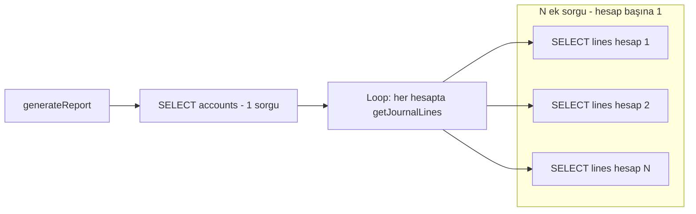
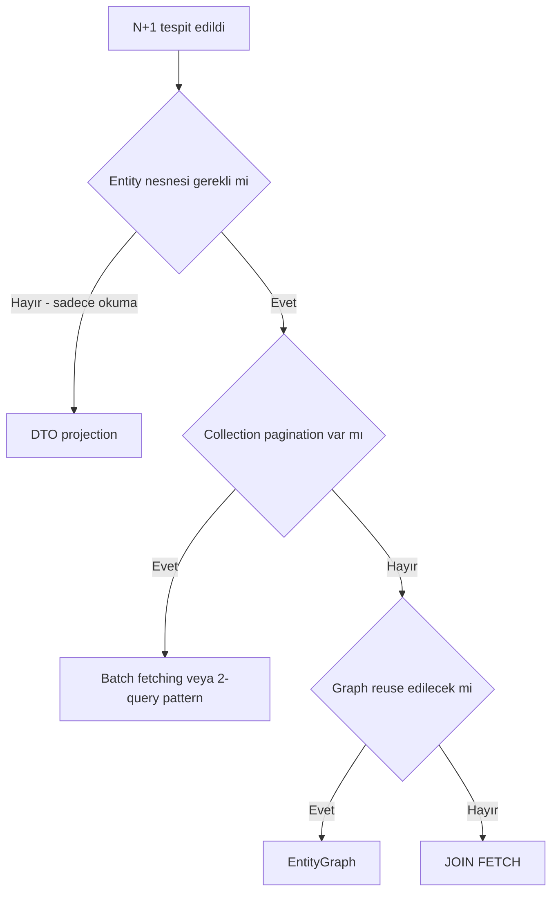
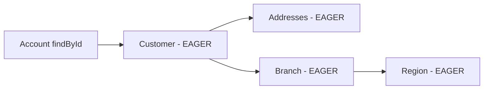

# Topic 2.5 — N+1 Query Problem

```admonish info title="Bu bölümde"
- N+1 probleminin mekaniği: LAZY association'a loop içinde dokunmanın sorgu patlamasına dönüşmesi
- Tespit araçları: SQL log, Hibernate Statistics, test'te query count assertion, APM
- 4 çözüm yolu — `JOIN FETCH`, `@EntityGraph`, batch fetching, DTO projection — ve hangisini ne zaman seçeceğin
- `FetchType.EAGER` cascade fetch explosion ve OSIV'in N+1'i nasıl gizlediği
- Pagination + collection JOIN FETCH çakışması ve 2-query pattern
```

## Hedef

JPA/Hibernate'in en sık karşılaşılan ve en yıkıcı performans problemi olan **N+1 query problemini** banking domain'inde reprodüksiyon kodu ile göreceksin. Sebebini (LAZY association'a loop içinde dokunma) netleştirecek, 4 çözüm yöntemini karşılaştırıp hangisinin ne zaman doğru olduğunu öğreneceksin. Hibernate statistics ve SQL log ile N+1'i tespit edip `GET /accounts/{id}/transactions` endpoint'i üzerinde 4 yaklaşımı SQL count'ları ile kıyaslayacaksın.

## Süre

Okuma: 1.5 saat • Kendini Sına: 30 dk • Pratik (opsiyonel): 3-4 saat • Toplam: ~2 saat (+ pratik)

## Önbilgi

- Topic 2.1 (JPA Fundamentals) ve 2.2 (Spring Data JPA) bitti
- `FetchType.LAZY` ve `FetchType.EAGER` arasındaki temel farkı duydun
- Hibernate'in `@OneToMany`, `@ManyToOne` association tiplerini kullandın
- "Hibernate niye bu kadar query atıyor?" sorusunu en az bir kere sordun

---

## Kavramlar

### 1. N+1 nedir — somut bir banking örneği

100 hesaplık bir liste sayfası neden 101 sorgu atıyor? Cevap bu bölümün tamamı — ama önce problemi kendi domain'imizde üretelim. Senaryo: bir müşterinin tüm hesaplarını ve her hesabın transaction sayısını rapor olarak listelemek istiyorsun.

```java
@Entity
@Table(name = "accounts")
public class AccountJpaEntity {
    @Id UUID id;
    @Column UUID ownerId;
    @Column String currency;
    @Column BigDecimal balanceAmount;

    @OneToMany(mappedBy = "account", fetch = FetchType.LAZY)
    private List<JournalLineJpaEntity> journalLines = new ArrayList<>();

    // getters
}
```

Karşı taraftaki child entity de klasik bir `@ManyToOne`:

```java
@Entity
@Table(name = "journal_lines")
public class JournalLineJpaEntity {
    @Id UUID id;

    @ManyToOne(fetch = FetchType.LAZY)
    @JoinColumn(name = "account_id")
    private AccountJpaEntity account;

    @Column BigDecimal amount;
    @Column String direction;   // DEBIT or CREDIT
    @Column Instant occurredAt;

    // getters
}
```

Naif servis şöyle görünür — ilk bakışta gayet masum:

```java
@Service
@Transactional(readOnly = true)
public class CustomerReportService {

    public List<CustomerAccountReport> generateReport(UUID ownerId) {
        List<AccountJpaEntity> accounts = accountRepo.findByOwnerId(ownerId);   // ① 1 query

        return accounts.stream()
            .map(acc -> new CustomerAccountReport(
                acc.getId(),
                acc.getBalanceAmount(),
                acc.getJournalLines().size()    // ② her hesap için 1 query  → N query
            ))
            .toList();
    }
}
```

SQL log'a bakınca gerçek ortaya çıkar:

```sql
-- ① Tüm hesapları çek
SELECT * FROM accounts WHERE owner_id = ?;
-- ② Her hesap için ayrı query (örnek: 50 hesap)
SELECT * FROM journal_lines WHERE account_id = ?;   -- account 1
SELECT * FROM journal_lines WHERE account_id = ?;   -- account 2
SELECT * FROM journal_lines WHERE account_id = ?;   -- account 3
-- ... 50 kere
```

**Toplam:** 1 + 50 = 51 query. "N+1" adı tam buradan: 1 ana query + N child query.



Banking'de bu neden yıkıcı? Ölçekle çarp: 1000 müşterilik bir batch report → 1000 + 1000×50 = **51.000 query**. Her query 2ms olsa 102 saniye sadece SQL round-trip. P95 latency artar, DB CPU patlar, connection pool tükenir, başka request'ler bekler — **outage senaryosu**.

### 2. Kök sebep — LAZY association'a loop içinde dokunmak

Peki Hibernate bunu neden yapıyor? `@OneToMany(fetch = LAZY)` deyince parent load edilirken child collection bir **proxy** olarak bırakılır. Collection'a ilk dokunduğunda (`size()`, `iterator()`) Hibernate bir SELECT atar.

Java tarafında bir döngüyle her parent'a dokunursan, her birinin collection'ı ayrı SELECT ile yüklenir. <mark>N+1'in mekaniği budur: LAZY association'a loop içinde dokunmak</mark>. Sorun LAZY'nin kendisi değil, dokunma şeklin.

Aynı sorun `@ManyToOne` yönünde de var:

```java
List<JournalLineJpaEntity> lines = lineRepo.findByOccurredAtAfter(yesterday);   // ① 1 query
for (var line : lines) {
    System.out.println(line.getAccount().getCurrency());   // ② her line için account SELECT
}
```

100 journal_line → 1 + 100 = 101 query. İşte 100 satırlık listenin 101 sorgusu.

### 3. N+1'i tespit etme

Çözmeden önce görmen lazım — N+1 genelde sessizce yaşar, kimse fark etmeden prod'a gider. Beş tespit yöntemi var, ucuzdan pahalıya.

**Yöntem A — SQL log.** `application.yml`:

```yaml
spring:
  jpa:
    show-sql: false
    properties:
      hibernate:
        format_sql: true

logging:
  level:
    org.hibernate.SQL: DEBUG
    org.hibernate.orm.jdbc.bind: TRACE
```

Endpoint'i çağır, log'da **tekrarlayan SELECT'leri** ara. Aynı SELECT şablonu 50 kere art arda geliyorsa N+1 alarmı. `show-sql` yerine `org.hibernate.SQL=DEBUG` tercih edilir — sistemli logger, formatlanabilir, dinamik açılıp kapanır.

**Yöntem B — Hibernate slow query log.**

```yaml
spring:
  jpa:
    properties:
      hibernate:
        session:
          events:
            log:
              LOG_QUERIES_SLOWER_THAN_MS: 10
```

10ms'ten uzun süren her query log'a düşer. Tuzak: N+1'deki her küçük query 1-2ms olduğu için bu yöntem N+1'i **görmez** — yine de genel slow query monitoring olarak değerli.

**Yöntem C — Hibernate Statistics.**

```yaml
spring:
  jpa:
    properties:
      hibernate:
        generate_statistics: true
```

Endpoint çağrısından sonra sayaçları oku:

```java
@Autowired EntityManagerFactory emf;

SessionFactory sf = emf.unwrap(SessionFactory.class);
Statistics stats = sf.getStatistics();
System.out.println("Query execution count: " + stats.getQueryExecutionCount());
System.out.println("Entity load count: " + stats.getEntityLoadCount());
System.out.println("Collection load count: " + stats.getCollectionLoadCount());
```

Tek endpoint için query execution count > 10 ise alarm.

**Yöntem D — test'te query count assertion.**

```java
@Test
void shouldNotProduceNPlusOne() {
    // setup: 1 müşteri + 10 hesap + her hesaba 5 transaction

    Statistics stats = sessionFactory.getStatistics();
    stats.clear();

    customerReportService.generateReport(ownerId);

    // 1 (accounts) + 1 (joined journal_lines) = 2 ideal
    assertThat(stats.getQueryExecutionCount()).isLessThanOrEqualTo(2);
}
```

**Yöntem E — üretim profiler.** Banking ortamlarında **APM araçları** (Datadog, New Relic, Dynatrace, Elastic APM) endpoint başına SQL query count metric'i tutar; N+1 anomalisi grafik olarak görünür.

```admonish tip title="İpucu"
En güvenli yol D: N+1'i production'a girmeden **test'te yakala**. Query count assertion CI'de her PR'da koşar — N+1 regresyonu build'i kırar, kimsenin dikkatine kalmaz.
```

### 4. Çözüm haritası

Dört çözüm yolun var; hangisini seçeceğin iki soruya bağlı: entity nesnesine gerçekten ihtiyacın var mı, ve pagination işin içinde mi?



Şimdi dördünü tek tek, avantaj/dezavantajlarıyla görelim.

### 5. Çözüm 1 — `JOIN FETCH` (JPQL)

İhtiyaç duyduğun association'ı **explicit** olarak JOIN'le, tek SQL ile yükle:

```java
interface AccountJpaRepository extends JpaRepository<AccountJpaEntity, UUID> {

    @Query("""
        SELECT DISTINCT a FROM AccountJpaEntity a 
        LEFT JOIN FETCH a.journalLines 
        WHERE a.ownerId = :ownerId
    """)
    List<AccountJpaEntity> findByOwnerIdWithLines(@Param("ownerId") UUID ownerId);
}
```

Üretilen SQL:

```sql
SELECT DISTINCT a.*, jl.* 
FROM accounts a 
LEFT OUTER JOIN journal_lines jl ON jl.account_id = a.id 
WHERE a.owner_id = ?;
```

**Tek query.** N+1 çözüldü. Peki `DISTINCT` neden var? Bir hesabın 5 journal_line'ı varsa JOIN sonucu satır 5 kere tekrar eder. JPQL'in `DISTINCT` keyword'ü Hibernate'e *Java tarafında* duplicate parent'ları kaldırmasını söyler — SQL DISTINCT'i değildir. Modern Hibernate'te (`hibernate.query.passDistinctThrough = false`, Hibernate 6'da otomatik) bu DISTINCT SQL'e geçmez.

**Avantajlar:** tek query; tam tipli entity döner; Hibernate'in tüm feature'ları (cascade, dirty tracking) çalışır.

**Dezavantajlar:**

- `MultipleBagFetchException`: aynı parent'ın **iki ayrı collection**'ını JOIN FETCH yapamazsın (Bölüm 11'de detay)
- Pagination ile sorunlu: JOIN sonrası satır sayısı parent sayısı değil, `LIMIT` anlamsızlaşır
- 1-N JOIN'lerde data inflation: 5 line = 5 satır, hepsi parent kolonlarını tekrar taşır → network/memory yükü

**Banking pratiği:** Tek collection fetch için ideal. İki collection için `@EntityGraph` veya iki ayrı query.

### 6. Çözüm 2 — `@EntityGraph`

JPQL yazmadan aynı sonucu almak istersen? `@EntityGraph` JPA standardıdır (Hibernate-specific değil) ve bir entity'nin **hangi association'larının load edileceğini** declare eder — `JOIN FETCH`'in deklaratif versiyonu.

Ad-hoc kullanım:

```java
interface AccountJpaRepository extends JpaRepository<AccountJpaEntity, UUID> {

    @EntityGraph(attributePaths = {"journalLines"})
    List<AccountJpaEntity> findByOwnerId(UUID ownerId);
}
```

Spring Data JPA derived query'ye otomatik JOIN ekler. Nested attribute path ile iki seviye derin gidebilirsin:

```java
@EntityGraph(attributePaths = {"journalLines", "journalLines.journalEntry"})
List<AccountJpaEntity> findByOwnerId(UUID ownerId);
```

Reuse gerekiyorsa graph'ı entity üzerinde isimlendir:

```java
@Entity
@NamedEntityGraph(
    name = "Account.withLines",
    attributeNodes = @NamedAttributeNode("journalLines")
)
public class AccountJpaEntity {
    // ...
}

@EntityGraph("Account.withLines")
List<AccountJpaEntity> findByOwnerId(UUID ownerId);
```

Derin hiyerarşiler için sub-graph tanımlanır:

```java
@NamedEntityGraph(
    name = "Account.deep",
    attributeNodes = {
        @NamedAttributeNode(value = "journalLines", subgraph = "lines-subgraph")
    },
    subgraphs = {
        @NamedSubgraph(
            name = "lines-subgraph",
            attributeNodes = {
                @NamedAttributeNode("journalEntry"),
                @NamedAttributeNode("createdAt")
            }
        )
    }
)
```

**`@EntityGraph` vs `JOIN FETCH`:**

| Kriter | `JOIN FETCH` | `@EntityGraph` |
|---|---|---|
| Standart | JPA + Hibernate | JPA standard |
| Yazım | JPQL içinde | Deklaratif annotation |
| Reusability | Düşük | Yüksek (named) |
| Dinamik | Hayır | Evet (ad-hoc) |
| Kontrol | Granular (alias, WHERE) | Sadece attribute paths |

**Banking pratiği:** Reporting endpoint'lerinde `@EntityGraph` deklaratif olduğu için tercih edilir. Kompleks WHERE / dinamik JOIN gerekiyorsa `JOIN FETCH` daha güçlü.

### 7. Çözüm 3 — Batch Fetching

Kod değiştirmeden N+1'i yumuşatmak mümkün mü? Batch fetching N+1'i "**N+(N/batch_size)**"e çevirir: 100 ek query yerine 100/25 = 4 query. Mükemmel değil ama dramatik gelişme.

Entity seviyesinde `@BatchSize`:

```java
@Entity
public class AccountJpaEntity {

    @OneToMany(mappedBy = "account", fetch = FetchType.LAZY)
    @BatchSize(size = 25)
    private List<JournalLineJpaEntity> journalLines = new ArrayList<>();
}
```

Mekanik şu: ilk hesabın `journalLines`'ına dokunduğunda Hibernate, hâlâ proxy halinde bekleyen diğer 24 hesabın collection'larını da aynı `IN` clause ile yükler:

```sql
SELECT * FROM journal_lines WHERE account_id IN (?, ?, ?, ..., 25 adet);
```

100 hesap için toplam: 1 (accounts) + 4 (batch) = 5 query, 101 yerine. Global config ile tüm LAZY association'lara uygulayabilirsin:

```yaml
spring:
  jpa:
    properties:
      hibernate:
        default_batch_fetch_size: 25
```

**Avantajlar:** kod değişikliği yok (config veya tek annotation); pagination'la uyumlu (parent sayısı değişmiyor); `MultipleBagFetchException` riski yok.

**Dezavantajlar:** `JOIN FETCH` kadar hızlı değil (multiple round-trip); ideal batch size bağlama göre değişir (10? 25? 50?); cache pattern karmaşıklaşır.

**Banking pratiği:** Default 16-25 batch size güvenlik ağı olarak + spesifik N+1 noktalarında JOIN FETCH. İkili yaklaşım.

### 8. Çözüm 4 — DTO Projection (entity bypass)

Rapor ekranı entity'nin 20 field'ından 6'sını kullanıyorsa neden hepsini yüklüyorsun? En **performant** yaklaşım entity'yi hiç load etmemek: ihtiyacın olan kolonları tek query ile doğrudan DTO'ya çek.

```java
public record CustomerAccountReportDto(
    UUID accountId,
    String currency,
    BigDecimal balance,
    long lineCount,
    BigDecimal totalCredit,
    BigDecimal totalDebit
) {}
```

Repository'de JPQL constructor expression ile doldur — aggregation'ı da DB'ye yaptırıyoruz:

```java
interface AccountJpaRepository extends JpaRepository<AccountJpaEntity, UUID> {

    @Query("""
        SELECT new com.mavibank.banking.account.adapter.out.persistence.CustomerAccountReportDto(
            a.id,
            a.currency,
            a.balanceAmount,
            COUNT(jl.id),
            COALESCE(SUM(CASE WHEN jl.direction = 'CREDIT' THEN jl.amount ELSE 0 END), 0),
            COALESCE(SUM(CASE WHEN jl.direction = 'DEBIT' THEN jl.amount ELSE 0 END), 0)
        )
        FROM AccountJpaEntity a 
        LEFT JOIN a.journalLines jl 
        WHERE a.ownerId = :ownerId 
        GROUP BY a.id, a.currency, a.balanceAmount
    """)
    List<CustomerAccountReportDto> findReportByOwner(@Param("ownerId") UUID ownerId);
}
```

**Tek query, tek round-trip, sadece istediğin kolonlar.**

**Avantajlar:** maksimum performans; memory efficient (entity yok, lazy proxy yok); DB-level aggregation (COUNT, SUM); dirty checking maliyeti yok.

**Dezavantajlar:** domain bypass — sadece reporting için; read-only (DTO'ya UPDATE yapamazsın); constructor expression sözdizimi uzun; DTO domain'e karışmamalı (ayrı package).

**Banking pratiği:** <mark>Reporting endpoint'lerinin çoğunluğu DTO projection olmalı — domain mutasyonu varsa entity, sadece okuma varsa DTO</mark>.

### 9. `FetchType.LAZY` vs `EAGER` — cascade fetch explosion

Buraya kadar hep LAZY'nin tuzaklarını gördük; "o zaman EAGER yapayım, hep yüklü gelsin" demek çözüm mü? Tam tersi — daha kötüsü.

**LAZY** (`@OneToMany` ve `@ManyToMany` default'u, **önerilen**): parent load olur, child collection proxy'dir, ilk dokunmada SELECT. Avantaj: gereksiz veri yok. Dezavantaj: persistence context kapandıktan sonra dokunursan `LazyInitializationException`.

**EAGER** (`@ManyToOne` ve `@OneToOne` default'u, **banking'de sakıncalı**): parent yüklenirken association da her seferinde yüklenir.

```java
@Entity
public class AccountJpaEntity {

    @ManyToOne(fetch = FetchType.EAGER)   // default
    @JoinColumn(name = "owner_id")
    private CustomerJpaEntity owner;
}
```

Her `findById` bir `JOIN customer` yapar; `findAll()` tüm customer'ları da yükler. Asıl felaket zincirleme geldiğinde başlar:

```java
@Entity
public class AccountJpaEntity {
    @ManyToOne(fetch = EAGER) CustomerJpaEntity owner;
}

@Entity
public class CustomerJpaEntity {
    @OneToMany(fetch = EAGER) List<AddressJpaEntity> addresses;
    @ManyToOne(fetch = EAGER) BranchJpaEntity branch;
}

@Entity
public class BranchJpaEntity {
    @ManyToOne(fetch = EAGER) RegionJpaEntity region;
}
```

`accountRepo.findById(id)` aslında account + customer + addresses + branch + region — **5 ayrı JOIN veya 5 ayrı query**. Bir hesap detayı için tüm hiyerarşi yüklenir:



İlk geliştirmede masum, prod'da yıkıcı — ve geri alması zor, çünkü her yer bu davranışa yaslanmıştır. <mark>Banking kuralı: hiçbir association EAGER olmamalı</mark>. Her `@ManyToOne`'ı explicit LAZY yap:

```java
@ManyToOne(fetch = FetchType.LAZY)
@JoinColumn(name = "owner_id")
private CustomerJpaEntity owner;
```

İhtiyaç noktasında `JOIN FETCH` veya `@EntityGraph` ile yükle. Fetching kararı sorgu bazında verilir — bu **deklaratif performans** sağlar.

```admonish warning title="Dikkat"
`@ManyToOne` ve `@OneToOne` default'u EAGER'dır — hiçbir şey yazmazsan tuzaktasın. Her ikisini de her zaman explicit `FetchType.LAZY` yap ve bunu ArchUnit veya checkstyle ile compile-time enforce et.
```

### 10. Banking endpoint reprodüksiyon: `GET /accounts/{id}/transactions`

Teoriyi gerçek bir endpoint'te birleştirelim: bir hesabın paginated transaction geçmişi. Naif controller'ın kalbi şu mapping — iki ayrı N+1 aynı satırlarda saklanıyor:

```java
.map(line -> new TransactionResponse(
    line.getId(),
    line.getDirection(),
    line.getAmount(),
    line.getJournalEntry().getOccurredAt(),       // ❶ N+1: JournalEntry LAZY
    line.getJournalEntry().getDescription(),
    line.getJournalEntry().getCounterparty().getName()   // ❷ Daha derin N+1
))
```

<details>
<summary>Tam kod: AccountController.getTransactions (~30 satır)</summary>

```java
@RestController
@RequestMapping("/v1/accounts")
public class AccountController {

    @GetMapping("/{id}/transactions")
    public PageResponse<TransactionResponse> getTransactions(
        @PathVariable UUID id,
        @PageableDefault(size = 20) Pageable pageable
    ) {
        AccountJpaEntity account = jpaRepo.findById(id).orElseThrow();
        Page<JournalLineJpaEntity> lines = lineRepo.findByAccountId(id, pageable);

        return new PageResponse<>(
            lines.getContent().stream()
                .map(line -> new TransactionResponse(
                    line.getId(),
                    line.getDirection(),
                    line.getAmount(),
                    line.getJournalEntry().getOccurredAt(),       // ❶ N+1: JournalEntry LAZY
                    line.getJournalEntry().getDescription(),
                    line.getJournalEntry().getCounterparty().getName()   // ❷ Daha derin N+1
                ))
                .toList(),
            pageable.getPageNumber(),
            pageable.getSize(),
            lines.getTotalElements(),
            lines.getTotalPages()
        );
    }
}
```

</details>

Hesap: 1 (account findById) + 1 (lines page) + 20 (journal_entry per line) + 20 (counterparty per entry) = **42 query** — tek sayfa, 20 kayıt için (pagination'ın total count query'si de cabası). P95 ölçümü: 42 query × 1ms = 42ms minimum; ağ ve concurrency ile 100-200ms.

Şimdi 4 yöntemi aynı endpoint üzerinde karşılaştıralım.

**A — `JOIN FETCH`:**

```java
@Query("""
    SELECT jl FROM JournalLineJpaEntity jl 
    JOIN FETCH jl.journalEntry je 
    JOIN FETCH je.counterparty 
    WHERE jl.account.id = :accountId 
    ORDER BY je.occurredAt DESC
""")
Page<JournalLineJpaEntity> findByAccountIdWithEntry(@Param("accountId") UUID id, Pageable p);
```

SQL: 1 (lines + entry + counterparty JOIN) + 1 (count for page) = **2 query**. Dikkat: burada fetch edilen association'lar `@ManyToOne` — collection değil, o yüzden pagination güvenli.

**B — `@EntityGraph`:**

```java
@EntityGraph(attributePaths = {"journalEntry", "journalEntry.counterparty"})
@Query("SELECT jl FROM JournalLineJpaEntity jl WHERE jl.account.id = :accountId ORDER BY jl.journalEntry.occurredAt DESC")
Page<JournalLineJpaEntity> findByAccountId(@Param("accountId") UUID id, Pageable p);
```

SQL: **2 query** (data + count).

**C — Batch fetching:**

```java
@Entity
public class JournalLineJpaEntity {
    @ManyToOne(fetch = LAZY)
    @BatchSize(size = 25)
    private JournalEntryJpaEntity journalEntry;
}

@Entity
public class JournalEntryJpaEntity {
    @ManyToOne(fetch = LAZY)
    @BatchSize(size = 25)
    private CounterpartyJpaEntity counterparty;
}
```

20 line için: 1 (lines) + 1 (journal_entries IN 20) + 1 (counterparties IN 20) + 1 (count) = **4 query**.

**D — DTO projection:**

```java
public record TransactionDto(
    UUID lineId,
    String direction,
    BigDecimal amount,
    Instant occurredAt,
    String description,
    String counterpartyName
) {}

@Query("""
    SELECT new com.mavibank.banking.account.adapter.out.persistence.TransactionDto(
        jl.id, jl.direction, jl.amount, 
        je.occurredAt, je.description, c.name
    )
    FROM JournalLineJpaEntity jl 
    JOIN jl.journalEntry je 
    JOIN je.counterparty c 
    WHERE jl.account.id = :accountId 
    ORDER BY je.occurredAt DESC
""")
Page<TransactionDto> findTransactionDtos(@Param("accountId") UUID id, Pageable p);
```

SQL: **2 query** (data + count) — ama SELECT'te sadece ihtiyaç duyulan kolonlar var.

**Karşılaştırma (20 kayıtlık page için):**

| Yöntem | Query sayısı | Yüklenen field | Bytes | Kompleksite |
|---|---|---|---|---|
| Naif | 42 | Tüm entity field'ları | Yüksek | Düşük |
| JOIN FETCH | 2 | Tüm entity field'ları | Orta-yüksek | Orta |
| @EntityGraph | 2 | Tüm entity field'ları | Orta-yüksek | Düşük |
| Batch fetch | 4 | Tüm entity field'ları | Orta | Çok düşük |
| DTO projection | 2 | Sadece DTO field'ları | Düşük | Orta |

**Banking pratiği:** reporting endpoint = DTO projection; mutation öncesi read = JOIN FETCH veya @EntityGraph (entity gerekli); genel default = `default_batch_fetch_size: 25`; spesifik N+1 noktası = JOIN FETCH.

### 11. `MultipleBagFetchException` — iki collection JOIN FETCH

Bir hesabın hem journal line'larını hem kartlarını tek query'de çekmek istesen ne olur?

```java
@Query("""
    SELECT a FROM AccountJpaEntity a 
    JOIN FETCH a.journalLines 
    JOIN FETCH a.cards 
    WHERE a.id = :id
""")
```

Hibernate fırlatır: `MultipleBagFetchException: cannot simultaneously fetch multiple bags`. **Sebep:** iki `@OneToMany` JOIN'i Cartesian product üretir — 10 line × 5 card = 50 satır; Hibernate `List` (bag) semantiğiyle doğru parent grouping yapamaz.

**Çözüm 1 — collection'ları `Set` yap** (sıra önemli değilse):

```java
@OneToMany(mappedBy = "account", fetch = LAZY)
private Set<JournalLineJpaEntity> journalLines = new HashSet<>();

@OneToMany(mappedBy = "account", fetch = LAZY)
private Set<CardJpaEntity> cards = new HashSet<>();
```

Set Cartesian'ı tolere eder — ama data inflation kalır (50 satır yine geliyor, network yükü).

**Çözüm 2 — iki ayrı query** (daha temiz):

```java
@EntityGraph(attributePaths = "journalLines")
Optional<AccountJpaEntity> findAccountWithLines(UUID id);

@EntityGraph(attributePaths = "cards")
Optional<AccountJpaEntity> findAccountWithCards(UUID id);
```

İkisini ayrı çağır, service'te birleştir.

**Çözüm 3 — versiyon:** Hibernate 6'da `MultipleBagFetchException` davranışı gevşetildi; Spring Boot 3+ ile bu hata belirgin şekilde azaldı. Yine de Cartesian inflation problemi mantıksal olarak yerinde durur.

### 12. OSIV (Open Session In View) — N+1'i gizleyen tuzak

Service'ten dönen entity'ye Controller'da dokununca neden exception almıyorsun? Cevap **OSIV**: `spring.jpa.open-in-view: true` (Spring Boot default'u!) Hibernate session'ı HTTP request boyunca açık tutar. LAZY collection'a Controller'da dokunmak çalışır — ama her dokunma yeni query demektir: **N+1, controller seviyesine taşınır**.

Sorunları:

1. Controller/view layer'da DB query'leri patlar — transaction boundary belirsizleşir
2. TX kapalı: lock yok, isolation yok — anormal davranış
3. N+1, geliştiricinin hiç bakmadığı katmanda oluşur
4. Her request session'ı (dolayısıyla connection'ı) tutar — pool tükenir

Çözüm, production'da kapatmak:

```yaml
spring:
  jpa:
    open-in-view: false
```

Kapattıktan sonra Controller'da lazy access → `LazyInitializationException`. Bu **iyi bir şey** — N+1'i fail-fast yapar. Service'te ihtiyacın olan her şeyi yükle veya DTO döndür.

```admonish tip title="İpucu"
`open-in-view: false` banking'de pazarlıksız kuraldır. Phase 1'in `application.yml`'inde olmalıydı — değilse şimdi düzelt. Sonrasında fırlayan her `LazyInitializationException` gizli bir N+1'in adresidir.
```

### 13. Anti-pattern'ler ve sık hatalar

**1 — `@ManyToOne` default EAGER'ı kabul etmek.** Bölüm 9'da gördük: her zaman explicit `FetchType.LAZY`, ArchUnit/checkstyle ile enforce.

**2 — LAZY collection'a domain'de erişim:**

```java
public class Account {   // domain class
    public BigDecimal totalDebit() {
        return journalLines.stream()    // ❌ N+1 ihtimali
            .filter(l -> l.getDirection() == DEBIT)
            .map(JournalLine::getAmount)
            .reduce(BigDecimal.ZERO, BigDecimal::add);
    }
}
```

Domain class JPA'yı bilmemeli. Aggregation logic application service'te ya da DB'de (`COALESCE(SUM)`) olmalı.

**3 — `findAll().stream().map(...)` fetch stratejisi olmadan:**

```java
accountRepo.findAll().stream()
    .map(a -> a.getJournalLines().size())   // N+1!
    .toList();
```

İlk refleks: `JOIN FETCH` ekle ya da DTO projection'a geç.

**4 — Controller'da entity döndürmek.** OSIV açıkken entity field erişimi → lazy load → N+1. Phase 1'de DTO öğrenildi; bir dev "shortcut" yapıyorsa kaynak burasıdır.

**5 — Pagination + collection JOIN FETCH:**

```java
@Query("SELECT a FROM AccountJpaEntity a JOIN FETCH a.journalLines")
Page<AccountJpaEntity> findAll(Pageable p);   // ❌
```

Hibernate uyarır: `firstResult/maxResults specified with collection fetch; applying in memory`. SQL'e LIMIT konmaz — **tüm sonuç memory'ye çekilir**, Java'da sayfalanır. Milyon satırlık tabloda OutOfMemory adayı. <mark>Pagination ile collection JOIN FETCH asla birlikte kullanılmaz — 2-query pattern uygula</mark>:

```java
@Query("SELECT a.id FROM AccountJpaEntity a WHERE a.ownerId = :ownerId")
Page<UUID> findIds(@Param("ownerId") UUID id, Pageable p);

@Query("SELECT a FROM AccountJpaEntity a LEFT JOIN FETCH a.journalLines WHERE a.id IN :ids")
List<AccountJpaEntity> findByIdsWithLines(@Param("ids") List<UUID> ids);
```

Önce parent ID'leri LIMIT'le çek, sonra `IN` clause + JOIN FETCH ile child'ları getir.

```admonish warning title="Dikkat"
Bu tuzağın sinsi yanı: kod çalışır, testler geçer, küçük dataset'te fark edilmez. Log'daki `applying in memory` uyarısını CI'de fail'e çeviren ekipler var — banking'de haklı bir paranoya.
```

**6 — `hibernate.enable_lazy_load_no_trans = true`.** "Lazy load detached entity'de de çalışsın" der; çalışır ama her access yeni session açar → N+1 saklanır. **Kullanma.**

**7 — `@Fetch(FetchMode.SUBSELECT)` her yerde.** SUBSELECT child'ları tek query'de çeker (`WHERE parent_id IN (SELECT ...)`); yerinde faydalı, her yerde kullanmak memory patlaması.

### 14. Best practices özeti

1. **Tüm `@ManyToOne` explicit LAZY.** Default EAGER'ı asla kabul etme.
2. **OSIV kapalı** (`open-in-view: false`).
3. **Test'lerde Hibernate statistics assertion** — N+1 build'i patlatsın.
4. **Default batch fetch size = 16 veya 25** baseline olarak.
5. **Reporting endpoint'lerinde DTO projection.**
6. **Mutation endpoint'lerinde JOIN FETCH veya @EntityGraph.**
7. **Pagination + collection JOIN FETCH yasak** — 2-query pattern.
8. **APM monitoring:** endpoint başına query count, P95 latency.

---

## Önemli olabilecek araştırma kaynakları

- Vlad Mihalcea "N+1 query problem" article series
- Vlad Mihalcea "High-Performance Java Persistence" book — Fetching chapter
- Hibernate User Guide — Fetching strategies
- Thorben Janssen "How to detect and fix N+1 query problem"
- Spring Data JPA reference — Entity Graphs
- "Java Persistence with Hibernate" Christian Bauer
- Hypersistence Utils library (Hibernate types, query plan cache helpers)
- `hibernate.session.events.log.LOG_QUERIES_SLOWER_THAN_MS` property

---

## Kendini Sına

Aşağıdaki soruları önce **cevaba bakmadan** kendi cümlelerinle yanıtlamayı dene — hepsi mülakatta karşına çıkabilecek tarzda. Takıldığın soru olursa ilgili Kavramlar başlığına dön, sonra tekrar dene.

**S1. Production log'unda bir endpoint'in N+1 ürettiğinden şüpheleniyorsun. Hangi işaretlere bakarsın ve bunu nasıl kesinleştirirsin?**

<details>
<summary>Cevabı göster</summary>

İlk işaret, `org.hibernate.SQL: DEBUG` log'unda **aynı SELECT şablonunun art arda onlarca kez tekrarlanması** — sadece bind parametresi değişir (`WHERE account_id = ?`). Kesinleştirmek için `hibernate.generate_statistics: true` açıp aynı endpoint çağrısında `getQueryExecutionCount()` değerine bakarsın: tek istek için 10'un üzerindeyse alarm. Üçüncü katman APM (Datadog, New Relic): endpoint başına SQL query count metric'inde anomali görünür.

Kalıcı çözüm ise tespiti CI'ye taşımak: test'te `Statistics.clear()` sonrası servisi çağırıp `assertThat(stats.getQueryExecutionCount()).isLessThanOrEqualTo(2)` gibi bir assertion yazmak — N+1 regresyonu build'i kırar.

</details>

**S2. N+1'in kök sebebi nedir? "LAZY fetching kötü, EAGER yapalım" diyen bir takım arkadaşına ne dersin?**

<details>
<summary>Cevabı göster</summary>

Kök sebep LAZY'nin kendisi değil, **LAZY association'a loop içinde dokunmak**: parent listesi tek query ile gelir, ama döngüde her parent'ın proxy collection'ına (`size()`, `iterator()`) dokunuldukça Hibernate her biri için ayrı SELECT atar → 1 + N.

EAGER daha kötüdür: fetching kararını sorgu bazından alıp **entity tanımına gömer** — artık her `findById` o association'ı ister istemez yükler ve zincirleme EAGER'larda tek hesap detayı için customer + addresses + branch + region gibi tüm hiyerarşi gelir (cascade fetch explosion). Doğru yaklaşım: her şey LAZY kalır, ihtiyaç duyulan noktada `JOIN FETCH` / `@EntityGraph` ile explicit yüklenir.

</details>

**S3. Bir raporlama endpoint'inde N+1 buldun. Üç farklı çözüm yolunu, hangi koşulda hangisini seçeceğinle birlikte say.**

<details>
<summary>Cevabı göster</summary>

1. **JOIN FETCH / @EntityGraph** — entity nesnesine gerçekten ihtiyaç varsa (ör. read-for-update): tek query'de association'ı JOIN'ler. JOIN FETCH granular kontrol (alias, WHERE) verir; @EntityGraph deklaratiftir ve named graph ile reuse edilir.
2. **Batch fetching** (`@BatchSize` / `default_batch_fetch_size`) — kod değiştirmeden güvenlik ağı: N+1'i N/batch_size'a indirir, pagination'la uyumludur, ama JOIN kadar hızlı değildir.
3. **DTO projection** — sadece okuma varsa en performant yol: entity hiç yüklenmez, JPQL constructor expression ile yalnızca gereken kolonlar (ve COUNT/SUM aggregation'ları DB'de) çekilir.

Raporlama endpoint'i için doğru cevap çoğunlukla DTO projection; mutasyon içeren akışta entity gerektiği için JOIN FETCH / @EntityGraph.

</details>

**S4. `Page<Account>` dönen bir query'ye `JOIN FETCH a.journalLines` eklersen ne olur? Doğru çözüm nedir?**

<details>
<summary>Cevabı göster</summary>

Hibernate `firstResult/maxResults specified with collection fetch; applying in memory` uyarısı verir: JOIN sonrası satır sayısı parent sayısıyla eşleşmediği için SQL'e LIMIT koyamaz — **tüm sonuç kümesini memory'ye çeker**, sayfalamayı Java'da yapar. Küçük dataset'te fark edilmez, production'da OutOfMemory ve latency felaketidir.

Doğru çözüm **2-query pattern**: birinci query sadece parent ID'lerini Pageable ile çeker (LIMIT SQL'de çalışır), ikinci query `WHERE a.id IN :ids` + `LEFT JOIN FETCH` ile o sayfanın child'larını yükler. Alternatif: collection'ı fetch etmeyip batch fetching'e bırakmak — parent sayısı değişmediği için pagination'la uyumludur. Not: `@ManyToOne` fetch'i (collection değil) pagination için güvenlidir.

</details>

**S5. Batch fetching'in mekaniğini anlat: `@BatchSize(size = 25)` ile 100 hesaplık listede kaç query atılır?**

<details>
<summary>Cevabı göster</summary>

İlk hesabın collection'ına dokunulduğunda Hibernate sadece onu değil, session'da proxy halinde bekleyen **diğer 24 hesabın** collection'larını da tek `SELECT ... WHERE account_id IN (?, ?, ..., 25 adet)` ile yükler. 100 hesap için: 1 (accounts) + 100/25 = 4 (batch) = **5 query** — naif 101 yerine.

Avantajı kod değişikliği gerektirmemesi (global `hibernate.default_batch_fetch_size: 25` yeter), pagination'la uyumlu olması ve `MultipleBagFetchException` riski taşımaması. Dezavantajı JOIN FETCH'e göre fazladan round-trip. Banking pratiği: global 16-25 default + sıcak noktalarda explicit JOIN FETCH.

</details>

**S6. OSIV nedir, N+1 ile ilişkisi ne? Kapattıktan sonra fırlayan `LazyInitializationException` neden "iyi haber"?**

<details>
<summary>Cevabı göster</summary>

Open Session In View, Hibernate session'ını HTTP request'in tamamı boyunca açık tutar (Spring Boot'ta `spring.jpa.open-in-view: true` default'tur). Böylece Controller'da bile lazy collection'a dokunmak çalışır — ama her dokunma yeni query'dir: N+1, geliştiricinin hiç bakmadığı controller/serialization katmanında oluşur. Üstelik TX kapalıdır (lock/isolation yok) ve her request bir connection'ı rehin tutar.

`open-in-view: false` sonrası TX dışı lazy access anında `LazyInitializationException` fırlatır — bu **fail-fast**: gizli N+1'i sessiz performans sorunu olmaktan çıkarıp görünür bug'a çevirir. Çözüm exception'ı yutmak değil, service içinde ihtiyaç duyulan her şeyi yüklemek veya DTO döndürmektir.

</details>

**S7. `MultipleBagFetchException` ne zaman fırlar? İki pratik çözümünü ve trade-off'larını anlat.**

<details>
<summary>Cevabı göster</summary>

Aynı parent'ın **iki ayrı `List` collection'ını** aynı query'de JOIN FETCH etmeye çalışınca fırlar: iki `@OneToMany` JOIN'i Cartesian product üretir (10 line × 5 card = 50 satır) ve Hibernate bag semantiğiyle doğru parent grouping yapamaz.

Çözüm 1: collection'ları `Set`'e çevirmek — exception kalkar ama Cartesian inflation kalır (50 satır yine network'ten geçer). Çözüm 2 (genelde daha temiz): iki ayrı query — her collection kendi `@EntityGraph`'lı method'uyla çekilir, service'te birleştirilir; toplam 2 query, inflation yok. Not: Hibernate 6 / Spring Boot 3+ bu exception'ı büyük ölçüde kaldırdı, ama Cartesian maliyeti mantıksal olarak hâlâ geçerli.

</details>

**S8. JPQL'de `SELECT DISTINCT a ... JOIN FETCH a.journalLines` yazdın. Bu DISTINCT SQL'e gider mi, ne işe yarar?**

<details>
<summary>Cevabı göster</summary>

1-N JOIN'de her child satırı parent'ı tekrarlar: 5 line'lı hesap result set'te 5 kere görünür. JPQL'deki `DISTINCT` burada SQL DISTINCT'i değildir — Hibernate'e **Java tarafında** duplicate parent referanslarını elemesini söyler.

Modern Hibernate'te (`hibernate.query.passDistinctThrough = false`; Hibernate 6'da otomatik davranış) bu DISTINCT SQL'e geçmez — yani DB'ye gereksiz sort/dedup maliyeti yüklenmez, sadece entity listesi tekilleştirilir. Mülakat bonusu: bu, JOIN FETCH'in data inflation dezavantajını ortadan kaldırmaz; satırlar yine şişkin gelir, sadece Java listesi temizlenir.

</details>

---

## Tamamlama kriterleri

- [ ] "Kendini Sına" bölümündeki tüm soruları cevaba bakmadan açıklayabiliyorum
- [ ] N+1'in kök sebebini (LAZY association + loop) ve SQL log'da nasıl göründüğünü anlatabiliyorum
- [ ] JOIN FETCH, @EntityGraph, batch fetching ve DTO projection'ın farklarını ve seçim kriterlerini biliyorum
- [ ] Pagination + collection JOIN FETCH tuzağını ve 2-query pattern'i açıklayabiliyorum
- [ ] OSIV'in neden kapatılması gerektiğini ve `LazyInitializationException`'ın neden fail-fast olduğunu biliyorum
- [ ] Tüm `@ManyToOne`'ların explicit LAZY olması gerektiğini ve EAGER cascade explosion'ı anladım
- [ ] `MultipleBagFetchException`'ın sebebini ve çözüm yollarını sayabiliyorum
- [ ] (Opsiyonel) "Pratik yapmak istersen" bölümündeki testleri yazdım ve Claude-verify prompt'uyla doğrulattım

Hepsi onaylı → Topic 2.6'ya geç → [06-connection-pool/](../06-connection-pool/index.md)

---

## Defter notları

1. "N+1 problem temel sebebi: ____ (LAZY association'a loop içinde dokunma)."
2. "N+1'i tespit etmenin 3 yolu: ____, ____, ____."
3. "JOIN FETCH ile @EntityGraph farkı: ____. Hangisini ne zaman: ____."
4. "Pagination + collection JOIN FETCH neden problemli: ____. Çözüm: ____."
5. "Batch fetching mekaniği: ____ (IN clause). Default `default_batch_fetch_size` değerim: ____."
6. "DTO projection ne zaman tercih: ____. Entity'e göre avantajları: ____."
7. "OSIV açık olunca neden gizli N+1 olur: ____. Production'da OSIV: ____."
8. "FetchType.LAZY vs EAGER default farkı (association type'a göre): @ManyToOne ____, @OneToMany ____."
9. "MultipleBagFetchException sebebi: ____. 2 çözüm: ____ ve ____."
10. "Banking-grade N+1 koruması (test + monitoring) için checklist: ____."

```admonish success title="Bölüm Özeti"
- N+1'in mekaniği: 1 ana query + LAZY association'a loop içinde dokunmaktan doğan N ek query — 50 hesap = 51 sorgu, batch report'ta on binlerce
- Tespit: SQL log'da tekrarlayan SELECT'ler, Hibernate Statistics query count, test'te assertion (en güvenlisi — CI'de regresyonu yakalar), APM
- 4 çözüm: JOIN FETCH (tek query, entity), @EntityGraph (deklaratif, reusable), batch fetching (config ile güvenlik ağı), DTO projection (reporting için en performant)
- Hiçbir association EAGER olmamalı — @ManyToOne/@OneToOne default EAGER'dır, explicit LAZY yap; ihtiyacı sorgu bazında JOIN FETCH/@EntityGraph ile karşıla
- Pagination + collection JOIN FETCH yasak: LIMIT in-memory'ye düşer — 2-query pattern (IDs + IN clause) kullan
- OSIV'i kapat (`open-in-view: false`): LazyInitializationException gizli N+1'i fail-fast görünür bug'a çevirir
```

---

## Pratik yapmak istersen

Kavramları koda dökmek istersen aşağıdaki iki ek hazır: test yazma rehberi N+1 tespiti, endpoint query count'u ve OSIV doğrulaması için örnek testler içerir; Claude-verify prompt'u ile yazdığın fetching kodunu banking-grade perspektiften denetletebilirsin.

<details>
<summary>Test yazma rehberi</summary>

### Test 2.5.1 — Query count assertion (`@DataJpaTest`)

```java
@DataJpaTest
@Testcontainers
@AutoConfigureTestDatabase(replace = AutoConfigureTestDatabase.Replace.NONE)
class NPlusOneDetectionTest {

    @Container @ServiceConnection
    static PostgreSQLContainer<?> pg = new PostgreSQLContainer<>("postgres:16-alpine");

    @Autowired EntityManagerFactory emf;
    @Autowired AccountJpaRepository accountRepo;
    @Autowired CustomerReportService service;

    @BeforeEach
    void setup() {
        UUID owner = UUID.randomUUID();
        for (int i = 0; i < 10; i++) {
            AccountJpaEntity a = createAccount(owner);
            for (int j = 0; j < 5; j++) {
                createJournalLine(a);
            }
        }
    }

    @Test
    void naiveCodeShouldShowNPlusOne() {
        SessionFactory sf = emf.unwrap(SessionFactory.class);
        Statistics stats = sf.getStatistics();
        stats.clear();

        service.generateReportNaive(owner);

        // 1 (parent) + 10 (children) = 11
        assertThat(stats.getQueryExecutionCount()).isGreaterThanOrEqualTo(11);
    }

    @Test
    void joinFetchShouldEliminateNPlusOne() {
        SessionFactory sf = emf.unwrap(SessionFactory.class);
        Statistics stats = sf.getStatistics();
        stats.clear();

        service.generateReportWithJoinFetch(owner);

        // 1 query (JOIN ile)
        assertThat(stats.getQueryExecutionCount()).isLessThanOrEqualTo(2);
    }

    @Test
    void dtoProjectionShouldUseSingleQuery() {
        SessionFactory sf = emf.unwrap(SessionFactory.class);
        Statistics stats = sf.getStatistics();
        stats.clear();

        service.generateReportDto(owner);

        assertThat(stats.getQueryExecutionCount()).isEqualTo(1);
        // Entity load count 0 olmalı (DTO sadece)
        assertThat(stats.getEntityLoadCount()).isZero();
    }
}
```

### Test 2.5.2 — SQL count'ı endpoint seviyesinde

```java
@SpringBootTest(webEnvironment = RANDOM_PORT)
@Testcontainers
class AccountTransactionsEndpointTest {

    @Autowired TestRestTemplate rest;
    @Autowired EntityManagerFactory emf;

    @Test
    void getTransactionsShouldUseAtMostTwoQueries() {
        UUID accountId = setupAccountWith20Transactions();
        SessionFactory sf = emf.unwrap(SessionFactory.class);
        sf.getStatistics().clear();

        var response = rest.getForEntity(
            "/v1/accounts/{id}/transactions?page=0&size=20", 
            String.class, accountId
        );

        assertThat(response.getStatusCode()).isEqualTo(HttpStatus.OK);
        assertThat(sf.getStatistics().getQueryExecutionCount()).isLessThanOrEqualTo(3);
    }
}
```

### Test 2.5.3 — `LazyInitializationException` ile OSIV kapalı doğrulama

```java
@Test
void osIvDisabledShouldFailOnLazyAccessOutsideTx() {
    Account account = accountRepository.findById(id).orElseThrow();
    // Service dışına çıktık, TX kapalı

    assertThatThrownBy(() -> account.getJournalLines().size())
        .isInstanceOf(LazyInitializationException.class);
}
```

Bu test başarılıysa `open-in-view: false` aktif demektir. OSIV açıksa exception fırlamaz — test fail.

### Ek deneyler (öğretici)

> Naif `CustomerReportService.generateReport` üzerinde çeşitleme yap: `@BatchSize(size = 25)` ekleyip 10 hesapta 2 query, 50 hesapta 3 query (1 + 50/25) gördüğünü assert et; sonra annotation'ı kaldırıp `hibernate.default_batch_fetch_size: 25` global config ile aynı sonucu al. `Account`'a ikinci bir `@OneToMany cards` collection'ı ekleyip çift JOIN FETCH ile `MultipleBagFetchException`'ı reprodüksiyon et (Hibernate 6'da başarılı olabilir). Son olarak DTO projection versiyonunda `getEntityLoadCount()`'ın sıfır kaldığını doğrula.

</details>

<details>
<summary>Claude-verify prompt</summary>

```
Aşağıda banking domain'inde JPA fetching kodum var. N+1 problem'ine yönelik şu kriterlerle 
değerlendir, PASS / FAIL / EKSIK işaretle, KOD YAZMA:

1. EAGER kullanımı:
   - Hiç bir `@ManyToOne` default EAGER mı kalmış? (Olmamalı, hepsi explicit LAZY)
   - Hiç bir `@OneToOne` EAGER mı?
   - Bunlar code review checklist'ine eklenmiş mi (ADR veya doc)?

2. OSIV:
   - `spring.jpa.open-in-view: false` mü?
   - Service'lerden Controller'a entity döndürülüyor mu (DTO mu)?
   - LazyInitializationException test ile doğrulanmış mı?

3. N+1 tespiti:
   - SQL log aktif (DEBUG level)?
   - Hibernate generate_statistics açık mı (en azından test'lerde)?
   - Test'lerde `assertQueryCount` benzeri assertion var mı?

4. Çözüm yöntemleri:
   - Reporting endpoint'leri DTO projection mu kullanıyor?
   - Mutation öncesi read'lerde JOIN FETCH veya @EntityGraph mi?
   - `default_batch_fetch_size` config'de set mi?
   - Spesifik N+1 noktalarında JOIN FETCH yazılmış mı?

5. JOIN FETCH:
   - JPQL'de DISTINCT keyword'ü var mı (gerekli olduğunda)?
   - Pagination ile JOIN FETCH kullanılmış mı (LIMIT in-memory tuzağı)? — eğer kullanıldıysa 
     2-query pattern (IDs + IN clause) tercih edilmiş mi?

6. @EntityGraph:
   - Named graph veya ad-hoc seçimi mantıklı mı (reuse durumu)?
   - Nested attribute path doğru yazılmış mı?
   - Sub-graphs gerekiyorsa kullanılmış mı?

7. Batch fetching:
   - Banking-grade default size (16 veya 25) mü?
   - Hot path'te @BatchSize override edilmiş mi (özel ihtiyaç varsa)?

8. DTO projection:
   - JPQL constructor expression doğru paket yoluyla mı?
   - Record kullanılmış mı (immutable)?
   - DTO'lar persistence package'da, domain'e karışmamış mı?

9. MultipleBagFetchException:
   - İki @OneToMany JOIN FETCH durumu kontrol edilmiş mi?
   - Çözüm: Set'e çevirme mi yoksa 2 ayrı query mi (banking'de hangi daha uygun)?

10. Endpoint-spesifik:
    - GET /v1/accounts/{id}/transactions endpoint'i hangi yöntem kullanıyor?
    - Endpoint query count'u test ile garanti altında mı?
    - Pagination 20 kayıt için maksimum 3 query mi (data + count + ek)?

11. Anti-pattern:
    - Domain class'ta LAZY collection iterasyonu var mı? (Olmamalı)
    - `hibernate.enable_lazy_load_no_trans` açık mı? (Kapalı olmalı)
    - Pagination + JOIN FETCH (collection) memory in-memory yapıyor mu?
    - `findAll()` Pageable'sız çağrılıyor mu (Phase 2.2 tekrar)?

12. Banking-grade kalite:
    - APM (Datadog/New Relic) ile endpoint query count monitor ediliyor mu?
    - Slow query log etkin mi (production'da log_min_duration_statement)?
    - N+1 regresyonu için CI'de test koşuyor mu?

Her madde için PASS / FAIL / EKSIK ve kanıt. Kod yazma.
```

</details>
