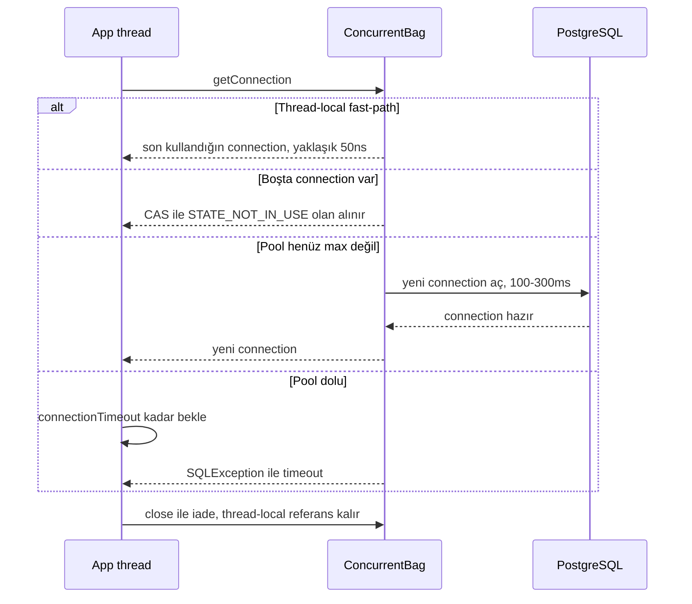
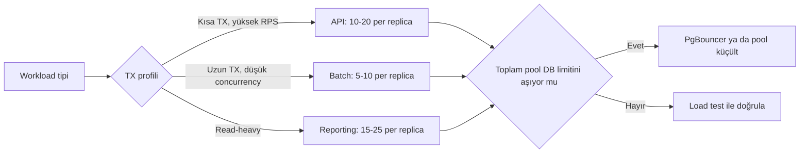
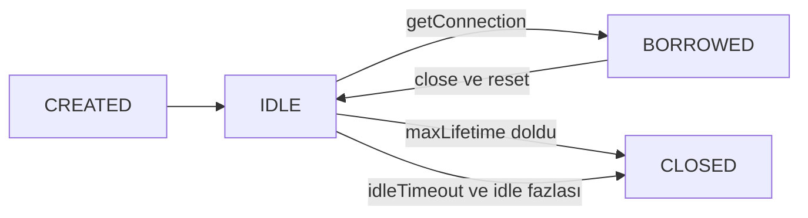
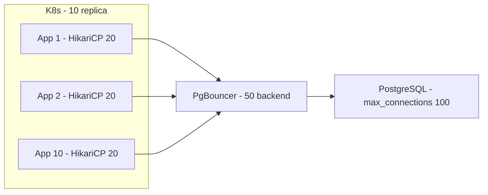

# Topic 2.6 — HikariCP & Connection Pool Tuning

```admonish info title="Bu bölümde"
- Connection açmanın gerçek maliyeti ve pool'un banking SLA'sındaki rolü
- HikariCP iç mekaniği: ConcurrentBag, thread-local fast-path, housekeeping
- Brian Goetz sizing formülü ve K8s multi-replica banking adaptasyonu
- Pool exhaustion teşhisi (metrics + `jstack`) ve connection leak yakalama
- PgBouncer transaction pooling: 200 client connection'ı 50 backend'e indirmek
```

## Hedef

Connection pool'un (özellikle HikariCP) iç mekaniğini anlamak ve banking workload'una uygun pool sizing yapabilmek. Tüm kritik HikariCP parametrelerini (`maximumPoolSize`, `connectionTimeout`, `maxLifetime`, `keepaliveTime`, `leakDetectionThreshold` vb.) banking context'inde doğru ayarlamak; connection leak'i ve pool exhaustion'ı teşhis edebilmek. Micrometer ile pool metric'lerini gözlemlemek ve K8s multi-replica deployment'larında PgBouncer'ın transaction pooling mode'unu neden/nasıl kullandığını öğrenmek.

## Süre

Okuma: 2 saat • Kendini Sına: 30 dk • Pratik (opsiyonel): 3-4 saat • Toplam: ~2.5 saat (+ pratik)

## Önbilgi

- Topic 2.1-2.5 bitti — JPA mekaniği, transaction, locking, N+1 konularını biliyorsun
- "Connection pool" deyimini duydun, Spring Boot'un default'ta HikariCP kullandığını biliyorsun
- DB'ye bağlanmanın TCP handshake + TLS + authentication ile maliyetli olduğunu en az bir kere düşündün
- Threading'de pool kavramına aşinasın (`ExecutorService`, thread pool)

---

## Kavramlar

### 1. Neden connection pool — banking perspektifi

50ms SLA hedefi olan bir endpoint, her request'te 100-300ms'lik bir bedeli ödeyemez — pool tam bu yüzden var. Her yeni DB connection'ın maliyeti:

- TCP 3-way handshake (~1-50ms, network'e göre)
- TLS handshake (varsa, +50-200ms)
- DB authentication (PostgreSQL pg_hba check, password verify, ~5-20ms)
- DB session initialization (timezone, search_path, ~5ms)

**Pool çözümü** basit bir ödünç alma modelidir: uygulama açılışta N connection açar (`minimumIdle`), her request pool'dan bir connection ödünç alır, iş bitince kapatmak yerine iade eder. İhtiyaç olursa pool `maximumPoolSize`'a kadar büyür.

Banking'de bu üç nedenle kritik. Saniyede binlerce request'te her seferinde connection açmak imkânsız; DB connection limit'i sınırlı (PostgreSQL default `max_connections = 100`) ve savurganlık DB'yi öldürür; predictable latency için ödünç alma 0.5ms iken açma 100-300ms.

### 2. HikariCP — Spring Boot default

Pool seçimi bir tartışma konusu değil: **HikariCP** (Hikari = Japonca "ışık", Brett Wooldridge) en hızlı connection pool ve Spring Boot 2.0+'ın default'u. Hızının dört sebebi var:

1. **ConcurrentBag** — özel bir lock-free data structure; birden fazla thread aynı anda connection alıp iade edebilir.
2. **Thread-local fast-path** — son kullanılan thread, son kullandığı connection'a öncelikli erişir. Cache-friendly.
3. **Bytecode optimization** — proxy class'lar `Wrapper` pattern yerine custom Javassist ile, minimum overhead.
4. **Lazy connection acquisition** — connection request anında bağlanır, batch acquisition yok.

Kıyas için diğerleri: Apache DBCP2 ve C3P0 eski ve yavaş, Tomcat JDBC Pool HikariCP öncesi yaygındı, Oracle UCP ise Oracle DB'ye özel (RAC awareness). **Banking pratiği:** HikariCP, tartışmasız.

### 3. `getConnection()` akışı — ConcurrentBag içgörü

Pool'un performans karakterini anlamak için tek bir soruya bak: bir thread connection istediğinde ne olur?



İade tarafında `close()` connection'ı kapatmaz: ConcurrentBag'a `STATE_NOT_IN_USE` olarak geri koyar ve thread-local'a referans bırakır — bir sonraki `getConnection` fast-path'ten döner. Arka planda bir **housekeeping thread** idle timeout ve max lifetime kontrollerini yürütür.

**Banking implikasyonu:** Saniyede binlerce `getConnection` için thread-local fast-path çok değerli. Yine de yanlış sizing → ConcurrentBag'da bekleme → kuyruk. Sıradaki konu tam olarak bu.

### 4. Kritik parametreler — banking-grade kalibrasyon

#### `maximumPoolSize`

Pool'un maksimum connection sayısı — **en önemli parametre**. Neden 200 değil de 20? Çünkü DB'nin paralel iş yapabilme kapasitesi CPU core ve disk sayısıyla sınırlı; fazlası sadece kuyruk ve context switching üretir.

**Brian Goetz formülü:**

```
connections = ((core_count * 2) + effective_spindle_count)
```

- `core_count` = DB sunucusunun CPU core sayısı (Java app'inin değil!)
- `effective_spindle_count` = disk paralelliği (HDD: 1, SSD: 4-8, NVMe: 8-16)

Örnek: DB 8 core, SSD → `(8 * 2) + 4 = 20`. <mark>Pool'u uygulama thread sayısına göre değil, DB'nin kaldırabileceği paralelliğe göre boyutlandır.</mark>

**Banking adaptasyonu:** Bu formül DB'nin toplam kapasitesi; K8s'te 4 replica varsa ve her biri 20 alırsa DB'ye 80 connection gider. DB `max_connections = 100` ise kalan 20 diğer servislere kalmalı. Plan:

```
per_replica_pool_size = (db_max_connections - reserved) / replica_count
```

`reserved` = admin, monitoring, diğer uygulamalar için (~10-20%). Örnek: `20 = (100 - 20) / 4`.

**Banking kuralı** workload tipine göre değişir:



Aşırı büyük pool dört şekilde vurur: DB sunucusunda context switching overhead, connection limit aşımı (DB diğer servisleri reddeder), memory (her PostgreSQL connection ~10MB shared memory + 5-50MB query plan cache) ve replica üzerinde write çakışması. Aşırı küçük pool ise `getConnection` timeout, P99 latency patlaması ve throughput tavanı demek.

**Sizing süreci:** Gatling/k6 ile load test → `HikariPool.PendingThreads` artıyorsa pool dar → P95 latency artıyorsa pool dar → DB CPU saturate ise darboğaz DB'dedir, pool büyütmek yardım etmez.

#### `minimumIdle`

Pool'da minimum kaç connection idle bekler. **HikariCP önerisi:** `maximumPoolSize` ile aynı — yani fixed-size pool.

```yaml
hikari:
  maximum-pool-size: 20
  minimum-idle: 20
```

```admonish tip title="Neden fixed-size pool"
Pool'un büyüme-küçülme döngüsü her seferinde 100-300ms gecikme yaratır (yeni bağlantı açma). Banking gibi predictable latency isteyen sistemlerde pool'u sürekli max'ta tutmak doğru tercihtir. Dinamik pool sadece belirgin gece/gündüz trafik farkı olan cost-saving senaryolarında mantıklı.
```

#### `connectionTimeout`

Pool dolduğunda `getConnection()` free connection için ne kadar bekler? **Default 30000ms (30 saniye) — banking API için çok yüksek**; kullanıcı ve HTTP timeout'lar 30 saniye beklemez.

- API endpoint: 2-5 saniye
- Batch job: 30-60 saniye OK

```yaml
hikari:
  connection-timeout: 3000   # 3 saniye
```

Timeout aşımında `SQLException` fırlar ("Connection is not available, request timed out after 3000ms"), Spring tarafında `CannotGetJdbcConnectionException`. Request 503 dönmeli — sorun downstream'de.

#### `idleTimeout`

Idle bir connection ne kadar boşta kalırsa kapanır; sadece `minimumIdle < maximumPoolSize` iken anlamlı. Default 600000ms (10 dk). **Banking önerisi:** fixed-size pool'da 0 (off), dynamic pool'da 5-10 dk.

#### `maxLifetime` — en sık kaçırılan parametre

Bir connection maksimum kaç ms yaşar; kapanış nazikçe yapılır (idle olduğunda ya da iade edildiğinde). Neden bir connection'ı hiç kapatmayasın ki? Üç sebep:

1. **DB-side timeout protection** — PostgreSQL'in `idle_in_transaction_session_timeout`'una veya firewall'un session timeout'una takılmadan önce pool kendisi kapatır.
2. **JDBC driver memory leak'leri** — connection'ı recycle etmek driver bug'larının biriktirdiğini temizler.
3. **DB upgrade** — eski versiyonun connection'larını yenilemek.

**Banking formülü:** `maxLifetime = DB-side timeout - 30 saniye`. Örnek: AWS RDS proxy 5 dakika timeout uyguluyorsa:

```yaml
hikari:
  max-lifetime: 270000    # 4.5 dk (RDS proxy 5dk - 30s safety)
```

Default 1800000ms (30 dk) çoğu durumda OK.

```admonish warning title="Dikkat"
`maxLifetime` asla DB-side timeout'tan büyük olmasın — yoksa DB connection'ı sizden önce keser ve "connection has been closed" hataları başlar.
```

#### `keepaliveTime`

Firewall'lar idle bağlantıyı sessizce düşürür; keep-alive ping bunu engeller (Spring Boot 2.3+, HikariCP 4.0+).

```yaml
hikari:
  keepalive-time: 30000    # 30 saniye
```

**Banking pratiği:** K8s + cloud provider firewall (idle 60s drop) varsa zorunlu.

#### `leakDetectionThreshold`

Bir connection bu süreden uzun ödünçte kalırsa (iade edilmediyse) log'a stack trace düşer. Default 0 (off). **Banking önerisi:** dev'de 30000 (30s), prod'da 60000+ (cron job'lar uzun TX gerektirebilir).

```yaml
hikari:
  leak-detection-threshold: 30000
```

Çıktı:

```
WARN  c.z.h.p.ProxyLeakTask - Connection leak detection triggered for 
connection org.postgresql.jdbc.PgConnection@7a8c, stack trace follows:
  at com.mavibank.banking.account.service.AccountService.someMethod(AccountService.java:42)
  ...
```

**Tuzak:** Bu log gelirse kod bug'u var — connection ödünç alınıp `close()` çağrılmamış (genelde `try-with-resources` eksikliği). Hemen düzelt; detayı §9'da.

#### `validationTimeout`

Pool connection'ı validate ederken kaç ms bekler. Default 5000ms — **banking pratiği:** default OK.

#### `autoCommit`

```yaml
hikari:
  auto-commit: true   # default
```

Spring `@Transactional` kullanıyorsa TX süresince autoCommit zaten false'a çekilir. Yani bu parametre büyük etki yapmaz — Spring transaction abstraction kontrolü elinde tutar.

#### `transaction-isolation`

```yaml
hikari:
  transaction-isolation: TRANSACTION_READ_COMMITTED
```

Pool seviyesinde default isolation. PostgreSQL'in default'u zaten READ_COMMITTED ama banking'de bunu açıkça yazmak iyi — explicit is better than implicit.

### 5. Pool connection lifecycle

Bir connection'ın pool içindeki hayatı dört durumdan geçer:



**Reset davranışı:** HikariCP connection'ı iade alırken default'ları restore eder (`autoCommit`, transaction isolation, `read-only` vb.). Bu sayede bir kullanıcının değiştirdiği state, sonraki kullanıcıya sızmaz — herkes tutarlı bir connection alır.

### 6. Banking workload tipleri ve sizing

Tek bir "doğru pool size" yok; workload tipi belirler. Üç tipik profil:

**Tip A — API service (kısa transaction):** endpoint başına 50-200ms execution, ~10-50ms TX, yüksek RPS. **Pool size formülü:** `RPS * avg_tx_time_seconds = concurrent_connections` — örneğin 500 RPS * 0.05s = 25 connection per replica.

```yaml
spring:
  datasource:
    hikari:
      maximum-pool-size: 25
      minimum-idle: 25
      connection-timeout: 3000
      max-lifetime: 270000
      keepalive-time: 30000
      leak-detection-threshold: 60000
```

**Tip B — Batch service (uzun transaction):** job başına 5 dakika - 1 saat, düşük concurrency (1-10 paralel job). Her connection uzun süre ödünçte kaldığı için pool küçük tutulur:

```yaml
spring:
  datasource:
    hikari:
      maximum-pool-size: 5
      minimum-idle: 2
      connection-timeout: 30000    # batch için tolerans
      max-lifetime: 1800000        # 30 dk OK
      leak-detection-threshold: 600000   # 10 dk
```

**Tip C — Reporting service (read-heavy):** çok sayıda concurrent select, kısa TX, read replica'ya yönlendirilebilir (Phase 9 detay):

```yaml
spring:
  datasource:
    hikari:
      maximum-pool-size: 30
      minimum-idle: 30
      connection-timeout: 5000
      max-lifetime: 270000
```

### 7. Monitoring — Micrometer + Prometheus + Grafana

Görmediğin pool'u tune edemezsin. HikariCP `MetricRegistry` ile entegredir; Spring Boot Actuator + Micrometer ile otomatik çalışır.

`pom.xml`:

```xml
<dependency>
    <groupId>io.micrometer</groupId>
    <artifactId>micrometer-registry-prometheus</artifactId>
</dependency>
```

`application.yml`:

```yaml
management:
  endpoints:
    web:
      exposure:
        include: health, metrics, prometheus
  metrics:
    enable:
      hikaricp: true
```

**Önemli metric'ler:**

| Metric | Anlam | Alarm eşiği |
|---|---|---|
| `hikaricp.connections.active` | Şu anda kullanılan | `> pool_size * 0.9` |
| `hikaricp.connections.idle` | Boş bekleyenler | `< 1` (pool tükeniyor) |
| `hikaricp.connections.pending` | Connection bekleyen thread | `> 0` darboğaz |
| `hikaricp.connections.timeout` | Timeout sayısı (cumulative) | `> 0/min` |
| `hikaricp.connections.acquire` | Connection alma süresi histogram | P95 > 100ms |
| `hikaricp.connections.usage` | Connection ödünç süresi histogram | P95 > 500ms (uzun TX uyarısı) |
| `hikaricp.connections.creation` | Yeni connection açma süresi | İlk açılışta ölçülür |

`/actuator/prometheus` endpoint'inde scrape edilen örnek:

```
hikaricp_connections_active{pool="HikariPool-1"} 18.0
hikaricp_connections_idle{pool="HikariPool-1"} 2.0
hikaricp_connections_pending{pool="HikariPool-1"} 5.0
```

**Grafana dashboard fikirleri:** active vs idle stack chart; pending threads alert (> 0 → uyarı); acquire P95/P99 (pool throughput sağlığı); ortalama connection age (`maxLifetime` çalışıyor mu kontrolü).

### 8. Pool exhaustion troubleshooting

Production'da en korkulan senaryo: pool tükendi, endpoint'ler 503/504 dönüyor. Belirtiler: sporadic 503/504, log'da `HikariPool-1 - Connection is not available`, P95 latency'de dramatik spike.

**Tanı 1 — Metrics:**

```
hikaricp_connections_active = max_pool_size
hikaricp_connections_pending > 0
hikaricp_connections_timeout artıyor
```

**Tanı 2 — `jstack`:** connection'ları kim tutuyor?

```bash
jps                                     # Java PID bul
jstack -l <pid> > thread-dump.txt
```

Dump'ta iki grup ararsın. Bekleyenler `at com.zaxxer.hikari.pool.HikariPool.getConnection` satırında BLOCKED durur. Tutanlar ise genelde uzun süreli DB call içindedir:

```
"http-nio-8080-exec-5" #45 prio=5 ...
   java.lang.Thread.State: RUNNABLE
        at java.net.SocketInputStream.socketRead0(Native Method)
        at java.net.SocketInputStream.read(SocketInputStream.java:171)
        ...
        at org.postgresql.jdbc.PgPreparedStatement.executeQuery
        ...
        at com.mavibank.banking.report.ReportService.generateLongQuery
```

Bu thread `generateLongQuery` içinde 30 saniye bekliyor — pool tüketicisi bu.

**Çözüm yolları:** long query'i optimize et (index, JOIN, batch fetching); query timeout koy (`@QueryHints` veya `statement_timeout`); uzun TX'i parçalara kır; pool size'ı artır (geçici!); long-running query'i ayrı reporting service'e taşı.

<mark>Pool exhaustion'da daima kök nedeni ara — uzun TX, N+1, lock contention. Pool size artırmak sadece palyatiftir.</mark>

### 9. Connection leak — gerçek bug

Pool exhaustion'ın sinsi kuzeni: connection alınıyor ama hiç iade edilmiyor.

```java
@Service
public class BadService {
    @Autowired DataSource dataSource;
    
    public void badMethod() {
        try {
            Connection conn = dataSource.getConnection();   // ❌ try-with-resources yok
            // ... use conn
        } catch (SQLException e) {
            log.error(e);
        }
        // conn.close() çağrılmadı → leak
    }
}
```

`leakDetectionThreshold` ile yakalanır. Düzeltme:

```java
public void goodMethod() {
    try (Connection conn = dataSource.getConnection()) {   // ✅ try-with-resources
        // ...
    } catch (SQLException e) {
        // ...
    }
    // conn.close() otomatik
}
```

```admonish warning title="Dikkat"
Modern Java/Spring uygulamasında doğrudan `dataSource.getConnection()` çağırma — `JdbcTemplate`, `TransactionManager`, `JpaRepository` lifecycle'ı zaten yönetir. Manuel `getConnection` bir code smell'dir; leak log'u gördüğünde ilk bunu ara.
```

**Tuzak:** `JpaRepository` veya `EntityManager` ile leak yapmak zordur — Spring yönetir. Ama bazen developer "direkt SQL gerek" diye `JdbcTemplate` veya `dataSource.getConnection` çağırır → code review'da bunu kontrol et.

### 10. PgBouncer — K8s multi-replica deployment için

#### Problem

Pool'unu mükemmel ayarladın ama K8s scale-out matematiği acımasız: app 10 replica, her replica HikariCP 20 connection → **toplam 200 connection**. PostgreSQL `max_connections = 100`. Patlama.

Pool size'ı düşürmek? 8 connection per replica → çok az, istemciler bekler.

#### Çözüm: PgBouncer

**PgBouncer**, uygulama ile DB arasında lightweight bir proxy'dir: uygulama PgBouncer'a bağlanır, PgBouncer DB'ye az sayıda gerçek connection açar ve 200 "client connection"ı 50 "server connection"a multiplex eder.



#### Pooling mode'ları

**Session pooling:** client bağlı kaldığı sürece aynı backend connection. En transparent (PostgreSQL session feature'ları çalışır) ama multiplexing sınırlı.

**Transaction pooling** (banking için en yaygın): backend connection sadece transaction süresince bağlı; TX bitince backend serbest kalır, başka client kullanır. Çok daha iyi multiplexing. **Limit:** session-level state (prepared statements, temp tables, advisory locks) çalışmaz veya dikkat gerektirir.

**Statement pooling:** her statement için backend swap — en agresif multiplexing ama transaction izolasyonu çalışmaz. <mark>Statement pooling banking için YASAK — transaction bütünlüğünü kırar.</mark>

**Banking pratiği:** transaction pooling (`pool_mode = transaction`); client-side prepared statement cache kapalı (JDBC URL'de `prepareThreshold=0`); session-level config'i (search_path vb.) connection init'te yap.

#### `pgbouncer.ini` örneği

```ini
[databases]
core_banking = host=postgres-primary port=5432 dbname=core_banking pool_size=50

[pgbouncer]
listen_port = 6432
listen_addr = 0.0.0.0
auth_type = scram-sha-256
pool_mode = transaction
max_client_conn = 500
default_pool_size = 50
reserve_pool_size = 5
server_lifetime = 3600
server_idle_timeout = 600
```

Uygulama JDBC URL:

```
jdbc:postgresql://pgbouncer:6432/core_banking?prepareThreshold=0
```

#### Deployment

K8s'te PgBouncer pod'u sidecar veya StatefulSet olarak koşar. Local geliştirmede docker-compose ile denemek kolaydır:

```yaml
pgbouncer:
  image: edoburu/pgbouncer:1.21.0
  environment:
    DB_HOST: postgres
    DB_USER: banking
    DB_PASSWORD: banking_password
    POOL_MODE: transaction
    MAX_CLIENT_CONN: 500
    DEFAULT_POOL_SIZE: 25
  ports:
    - "6432:6432"
```

```admonish tip title="PgBouncer uyum kontrol listesi"
- HikariCP `max-lifetime` < PgBouncer `server_lifetime` olsun — proxy connection'ı sizden önce kesmesin.
- Transaction mode'da JDBC URL'de `prepareThreshold=0` şart; yoksa backend swap sonrası "prepared statement does not exist" hataları alırsın.
- PgBouncer gerekmediği durumlar: tek instance küçük load, AWS RDS Proxy zaten kullanılıyorsa, toplam connection sayısı yönetilebilirse (< 100).
```

### 11. AWS RDS Proxy, GCP SQL Proxy alternatifleri

**AWS RDS Proxy:** cloud-native; PgBouncer + failover + IAM auth. AWS'nin serverless/Lambda önerisi. **GCP Cloud SQL Auth Proxy:** authentication + connection routing, pooling sınırlı.

**Banking pratiği:** self-hosted PgBouncer daha esnek (transaction mode kontrolü sende), cloud proxy'ler daha managed (kolay) ama mode kısıtlı.

### 12. Anti-pattern'ler

1. **Pool çok büyük** (`maximum-pool-size: 200`) — DB'yi bunaltır; Brian Goetz formülüne sadık kal.
2. **`connectionTimeout: 0` veya çok yüksek** — sonsuza kadar veya 60 saniye beklemek banking API için kabul edilemez; 2-5 saniye.
3. **`maxLifetime` DB timeout'tan büyük** — "connection has been closed" hataları.
4. **Doğrudan `dataSource.getConnection()`** — Spring abstraction bypass, leak riski.
5. **Pool monitoring yok** — exhaustion'ı metric yerine kullanıcı bildirir (geç).
6. **HikariCP'yi sebepsiz değiştirmek** — DBCP2/C3P0 = kayıp performans.
7. **Replica başına aynı pool size ile scale etmek** — DB connection overflow; PgBouncer ekle veya pool küçült.
8. **TX içinde external HTTP call:**

```java
@Transactional
public void method() {
    repo.save(entity);            // connection ödünç alındı
    externalApi.call();           // 5 saniye sürdü
    repo.save(other);
}
```

Connection 5 saniye boyunca rehin, başka request'ler bekler. External call TX dışına.

### 13. Pool sizing experiment — Gatling ile

Pool sizing teori değil, **deneyseldir**. Gatling load test ile aynı yük (örn. 50 req/sec) altında pool = 5, 10, 20, 40 için P95 ölç.

**Eğri:** pool artarken P95 düşer, bir noktada plato olur (DB darboğaz), sonra artmaya başlar (context switching). **Sweet spot** P95 platosunun başlangıcıdır. Banking'de bunu environment'a göre kalibre et — pre-prod'da load test, prod'da metric'lerle doğrula.

---

## Önemli olabilecek araştırma kaynakları

- HikariCP wiki — https://github.com/brettwooldridge/HikariCP/wiki
- "About Pool Sizing" HikariCP wiki sayfası (Brian Goetz formülü)
- Vlad Mihalcea "Connection Pool Sizing"
- PgBouncer official documentation
- PostgreSQL `max_connections` and `shared_buffers` tuning
- AWS RDS Proxy documentation
- Spring Boot Actuator + Micrometer guide
- Grafana HikariCP dashboard (community 6083, 19062)
- "Why You Don't Need 100s of Connections" Heroku Postgres blog

---

## Kendini Sına

Aşağıdaki soruları önce **cevaba bakmadan** kendi cümlelerinle yanıtlamayı dene — hepsi mülakatta karşına çıkabilecek tarzda. Takıldığın soru olursa ilgili Kavramlar başlığına dön, sonra tekrar dene.

**S1. Brian Goetz pool sizing formülü nedir ve formüldeki `core_count` neden uygulamanın değil DB sunucusunun core sayısıdır?**

<details>
<summary>Cevabı göster</summary>

Formül: `connections = (core_count * 2) + effective_spindle_count` — `core_count` DB sunucusunun CPU core'u, `effective_spindle_count` disk paralelliği (HDD 1, SSD 4-8, NVMe 8-16). Örnek: 8 core + SSD → `(8 * 2) + 4 = 20`.

DB core'u kullanılır çünkü darboğaz DB tarafındadır: bir PostgreSQL sunucusu aynı anda ancak core sayısı kadar query'yi gerçekten paralel çalıştırabilir; disk I/O beklerken biraz fazlası tolere edilir (bu yüzden çarpan 2 ve spindle eklemesi var). Uygulama tarafında kaç thread olduğu DB'nin kapasitesini değiştirmez — fazla connection sadece DB'de kuyruk oluşturur.

</details>

**S2. "Pool size'ı 200 yapalım, garantili olsun" diyen ekip arkadaşına ne dersin?**

<details>
<summary>Cevabı göster</summary>

Büyük pool daha fazla throughput demek değildir; genelde tam tersi. 200 connection DB sunucusunda 200 backend process demek: scheduler context switching'e boğulur, her PostgreSQL connection ~10MB shared memory + 5-50MB query plan cache tüketir, `max_connections` limitine dayanınca diğer servisler reddedilir.

DB'nin gerçek paralellik kapasitesi core + disk ile sınırlıdır — 8 core'lu bir DB için ~20 connection sweet spot'tur. Fazlası query'leri hızlandırmaz, sadece bekleme kuyruğunu DB içine taşır. Doğru cevap: Brian Goetz formülüyle başla, Gatling load test ile P95 eğrisinde platoyu bul, oraya sabitle.

</details>

**S3. `maxLifetime` neden her zaman DB-side timeout'tan küçük olmalı? Banking formülü nedir?**

<details>
<summary>Cevabı göster</summary>

Bir connection'ı iki taraf da kapatabilir: pool (nazikçe, idle'ken) veya DB/firewall (aniden, timeout'ta). `maxLifetime` DB-side timeout'tan büyükse DB connection'ı pool'dan önce keser ve uygulama elindeki ölü connection'ı kullanmaya çalışınca "connection has been closed" hataları patlar.

Formül: `maxLifetime = DB-side timeout - 30 saniye`. Örnek: AWS RDS proxy 5 dakika idle timeout uyguluyorsa `max-lifetime: 270000` (4.5 dk). Ayrıca `maxLifetime` recycle mekanizması JDBC driver memory leak'lerini temizler ve DB upgrade sonrası eski connection'ları yeniler — bu yüzden hiçbir zaman 0 (sınırsız) yapılmaz.

</details>

**S4. HikariCP'nin default `connectionTimeout` değeri banking API için neden yanlış? Timeout gerçekleştiğinde ne olur ve uygulama ne dönmeli?**

<details>
<summary>Cevabı göster</summary>

Default 30 saniyedir. 50-200ms SLA'lı bir banking API'de kullanıcı ve upstream HTTP timeout'ları 30 saniye beklemez — pool doluysa request'in hızlıca fail edip anlamlı hata dönmesi, 30 saniye askıda kalmasından iyidir. Banking önerisi API için 2-5 saniye, batch job için 30-60 saniye.

Timeout aşımında HikariCP `SQLException` fırlatır ("Connection is not available, request timed out after 3000ms"), Spring bunu `CannotGetJdbcConnectionException`'a çevirir. Endpoint 503 dönmeli — sorun client'ta değil downstream kapasitede, retry-after mantığı kurulabilir.

</details>

**S5. Connection leak nedir, `leakDetectionThreshold` bunu nasıl yakalar ve log'da leak uyarısı gördüğünde ilk ne yaparsın?**

<details>
<summary>Cevabı göster</summary>

Leak, ödünç alınan connection'ın hiç iade edilmemesidir — tipik sebep manuel `dataSource.getConnection()` çağrısında `try-with-resources` eksikliği. Pool sessizce küçülür ve sonunda exhaustion'a gider.

`leakDetectionThreshold` (örn. dev'de 30000ms), bir connection bu süreden uzun ödünçte kalırsa `ProxyLeakTask` WARN log'una connection'ın alındığı yerin stack trace'ini düşer. Bu log her zaman bir kod bug'unun kanıtıdır: stack trace'teki metoda git, `try-with-resources` ekle veya daha iyisi manuel `getConnection`'ı Spring abstraction'ıyla (`JdbcTemplate`, `JpaRepository`) değiştir. Prod'da threshold daha yüksek tutulur (60s+) çünkü meşru uzun TX'ler false positive üretebilir.

</details>

**S6. Production'da endpoint'ler sporadic 503 dönüyor ve log'da "Connection is not available" var. Teşhis adımların neler?**

<details>
<summary>Cevabı göster</summary>

Önce metric'ler: `hikaricp_connections_active = max_pool_size`, `pending > 0` ve `timeout` artıyorsa pool exhaustion kesinleşir. Sonra `jps` ile PID bulup `jstack -l <pid>` ile thread dump alırım.

Dump'ta iki grup ararım: `HikariPool.getConnection`'da BLOCKED olanlar (bekleyenler) ve connection'ı tutanlar — bunlar genelde `SocketInputStream.read` + `PgPreparedStatement.executeQuery` içinde uzun DB call yapan thread'lerdir; stack trace hangi servis metodunun suçlu olduğunu gösterir.

Çözüm kök nedene göre: query optimize et, `statement_timeout` koy, uzun TX'i parçala, sorguyu reporting service'e taşı. Pool size artırmak sadece geçici nefes aldırır — kök neden (uzun TX, N+1, lock contention) çözülmeden sorun geri gelir.

</details>

**S7. PgBouncer transaction pooling 200 client connection'ı 50 backend'e nasıl indirir? Bu mode'un kısıtları neler ve statement pooling neden banking'de yasak?**

<details>
<summary>Cevabı göster</summary>

Transaction pooling'de backend connection client'a sadece bir transaction süresince bağlanır; TX commit/rollback olur olmaz backend serbest kalır ve başka client'ın TX'ine atanır. Client'ların çoğu her an TX içinde olmadığı için 200 client 50 backend ile rahatça multiplex edilir — K8s'te 10 replica * 20 HikariCP connection'ın PostgreSQL `max_connections = 100`'ü patlatmasının çözümü budur.

Kısıt: session-level state (prepared statements, temp tables, advisory locks) backend swap'ta kaybolur; bu yüzden JDBC URL'de `prepareThreshold=0` şarttır, yoksa "prepared statement does not exist" hataları gelir. Ayrıca HikariCP `max-lifetime` < PgBouncer `server_lifetime` tutulmalı.

Statement pooling ise her statement'ta backend değiştirir — aynı transaction'ın iki statement'ı farklı backend'lere düşebilir, yani transaction izolasyonu ve atomicity kırılır. Para transferinin debit'i bir connection'da, credit'i başkasında olamaz: banking'de yasak.

</details>

**S8. `minimumIdle = maximumPoolSize` (fixed-size pool) önerisinin gerekçesi nedir? Dinamik pool ne zaman mantıklı?**

<details>
<summary>Cevabı göster</summary>

Pool küçülüp büyüdüğünde her büyüme yeni connection açmak demektir: TCP + TLS + auth ile 100-300ms. Trafik dalgalanan bir banking API'de bu, tam yük geldiği anda latency spike'ı yaşatır. Fixed-size pool'da (`minimum-idle = maximum-pool-size`, `idle-timeout: 0`) connection'lar hep hazır bekler — predictable latency, HikariCP'nin de resmi önerisi.

Dinamik pool sadece belirgin trafik döngüsü olan cost-saving senaryolarında mantıklıdır: gece 1-2 connection yetiyor, gündüz 20 gerekiyor ve DB kaynağı başka işlere kaydırılmak isteniyorsa. Banking core API'lerinde default tercih fixed-size'dır.

</details>

---

## Tamamlama kriterleri

- [ ] "Kendini Sına" bölümündeki tüm soruları cevaba bakmadan açıklayabiliyorum
- [ ] Brian Goetz formülünü ve K8s multi-replica adaptasyonunu (`per_replica = (max_conn - reserved) / replicas`) ezbere kurabiliyorum
- [ ] `maxLifetime < DB-side timeout - 30s` kuralını gerekçesiyle biliyorum
- [ ] Pool exhaustion belirtilerini (metrics + log) ve `jstack` teşhis adımlarını sayabiliyorum
- [ ] Connection leak'in kök nedenini ve `leakDetectionThreshold` + try-with-resources düzeltmesini biliyorum
- [ ] PgBouncer pooling mode'larını, transaction mode kısıtlarını ve `prepareThreshold=0` gerekliliğini açıklayabiliyorum
- [ ] Anti-pattern listesi rahat — özellikle "TX içinde external call" ve "pool size > 100"
- [ ] (Opsiyonel) "Pratik yapmak istersen" bölümündeki testleri yazdım ve Claude-verify prompt'uyla doğrulattım

Hepsi onaylı → Topic 2.7'ye geç → [07-hibernate-performance/](../07-hibernate-performance/index.md)

---

## Defter notları

1. "Connection pool'un temel amacı: ____. Banking'de neden kritik: ____."
2. "HikariCP'nin hızının 3 sebebi: ConcurrentBag, ____, ____."
3. "Brian Goetz formülü: ____. Banking'de adaptasyon nasıl yapıyorum: ____."
4. "`maxLifetime` neden DB-side timeout'tan küçük tutulur: ____."
5. "`connectionTimeout` banking API için tavsiye edilen aralık: ____."
6. "`leakDetectionThreshold` ne yapar: ____. Dev/prod ayrımı: ____."
7. "Pool exhaustion 3 belirti: ____, ____, ____."
8. "`jstack` analizinde aranması gereken pattern: ____."
9. "PgBouncer transaction pooling mode'unun avantajı: ____. Banking için neden statement pooling YASAK: ____."
10. "Pool sizing experiment'in 5 ölçüm boyutu: P50, P95, P99, error rate, ____."

```admonish success title="Bölüm Özeti"
- Connection açmak 100-300ms, pool'dan ödünç almak 0.5ms — banking SLA'sı pool'suz tutmaz; Spring Boot default'u HikariCP tartışmasız doğru seçim
- Pool sizing DB kapasitesine göre yapılır: Brian Goetz formülü `(core * 2) + spindle`, K8s'te `per_replica = (max_conn - reserved) / replicas`; büyük pool hızlandırmaz, boğar
- `maxLifetime` her zaman DB-side timeout'tan 30s kısa; `connectionTimeout` API için 2-5s; fixed-size pool (`minimumIdle = maximumPoolSize`) predictable latency getirir
- `leakDetectionThreshold` her leak log'unda bir kod bug'una işaret eder — try-with-resources veya Spring abstraction ile düzelt
- Pool exhaustion'da metric'ler + `jstack` ile connection'ı tutan uzun TX'i bul; pool büyütmek palyatif, kök neden çözümü esastır
- K8s multi-replica'da toplam connection DB limitini aşıyorsa PgBouncer transaction pooling kullan; `prepareThreshold=0` ve `max-lifetime < server_lifetime` şart, statement pooling yasak
```

---

## Pratik yapmak istersen

Kavramları koda dökmek istersen aşağıdaki iki ek hazır: test yazma rehberi pool config doğrulama, exhaustion ve leak detection için örnek testler içerir; Claude-verify prompt'u ile yazdığın config ve kodu banking-grade perspektiften denetletebilirsin.

<details>
<summary>Test yazma rehberi</summary>

### Test 2.6.1 — Pool config verification

```java
@SpringBootTest
@Testcontainers
class HikariConfigTest {
    
    @Container @ServiceConnection
    static PostgreSQLContainer<?> pg = new PostgreSQLContainer<>("postgres:16-alpine");
    
    @Autowired DataSource dataSource;
    
    @Test
    void hikariConfigShouldMatchBankingStandards() {
        assertThat(dataSource).isInstanceOf(HikariDataSource.class);
        HikariDataSource hikari = (HikariDataSource) dataSource;
        
        assertThat(hikari.getMaximumPoolSize()).isBetween(5, 30);
        assertThat(hikari.getConnectionTimeout()).isLessThanOrEqualTo(5000);
        assertThat(hikari.getMaxLifetime()).isLessThanOrEqualTo(1800000);
        assertThat(hikari.getLeakDetectionThreshold()).isGreaterThan(0);
    }
}
```

### Test 2.6.2 — Pool exhaustion timeout

```java
@SpringBootTest
@TestPropertySource(properties = {
    "spring.datasource.hikari.maximum-pool-size=2",
    "spring.datasource.hikari.connection-timeout=1000"
})
class PoolExhaustionTest {
    
    @Autowired DataSource ds;
    
    @Test
    void shouldThrowTimeoutWhenPoolExhausted() throws Exception {
        Connection c1 = ds.getConnection();
        Connection c2 = ds.getConnection();
        
        long start = System.currentTimeMillis();
        assertThatThrownBy(() -> ds.getConnection())
            .isInstanceOf(SQLTransientConnectionException.class)
            .hasMessageContaining("Connection is not available");
        long elapsed = System.currentTimeMillis() - start;
        
        assertThat(elapsed).isBetween(900L, 1500L);
        
        c1.close();
        c2.close();
    }
}
```

### Test 2.6.3 — Leak detection

```java
@Test
@Slf4j
void leakDetectionShouldTriggerWarning() throws Exception {
    Logger hikariLogger = (Logger) LoggerFactory.getLogger("com.zaxxer.hikari.pool.ProxyLeakTask");
    ListAppender<ILoggingEvent> appender = new ListAppender<>();
    appender.start();
    hikariLogger.addAppender(appender);
    
    Connection conn = dataSource.getConnection();
    // Kasten kapatmıyoruz
    
    Thread.sleep(5500);   // leakDetectionThreshold + buffer
    
    boolean leakLogged = appender.list.stream()
        .anyMatch(e -> e.getFormattedMessage().contains("Connection leak detection"));
    assertThat(leakLogged).isTrue();
    
    conn.close();   // cleanup
}
```

</details>

<details>
<summary>Claude-verify prompt</summary>

```
Aşağıdaki HikariCP + connection pool kodumu banking-grade kriterlere göre değerlendir. 
PASS / FAIL / EKSIK işaretle, KOD YAZMA:

1. Pool sizing:
   - `maximum-pool-size` Brian Goetz formülüne göre kalibre edilmiş mi (gerekçeli)?
   - K8s replica sayısı * pool size DB max_connections'ı aşıyor mu?
   - Banking workload tipi (API/Batch/Reporting) için doğru pool size mı?

2. Kritik parametreler:
   - `connection-timeout` 2-5 saniye arası mı (API için)?
   - `max-lifetime` DB-side timeout - 30s formülüne uygun mu?
   - `keepalive-time` set edilmiş mi (firewall idle koruması)?
   - `leak-detection-threshold` aktif mi (en azından dev'de)?
   - `minimum-idle = maximum-pool-size` (fixed-size) mı, dynamic mi (gerekçeli)?

3. Configuration:
   - `pool-name` set mi (log/metric'te ayırt etmek için)?
   - `register-mbeans` JMX için aktif mi (dev'de)?
   - JDBC URL `prepareThreshold=0` mı (PgBouncer transaction mode varsa)?
   - `socketTimeout` JDBC URL'de var mı?

4. Monitoring:
   - Micrometer Prometheus registry aktif mi?
   - `/actuator/prometheus` endpoint'inde hikaricp_* metric'leri görünüyor mu?
   - Grafana dashboard kurulmuş mu?
   - Alert kuralları (pending > 0, timeout > 0/min) tanımlı mı?

5. Pool exhaustion:
   - Reprodüksiyon test'i yazılmış mı?
   - `jstack` analizi `docs/` altında mı?
   - Long TX nedeni tespit edilmiş mi (N+1, external call, lock contention)?

6. Connection leak:
   - `leak-detection-threshold` log alarmı test ile doğrulanmış mı?
   - Manuel `dataSource.getConnection()` kullanımı var mı (olmamalı)?
   - try-with-resources alışkanlığı yerleşmiş mi?

7. PgBouncer / proxy:
   - Multi-replica deployment varsa PgBouncer veya RDS Proxy kullanımı düşünülmüş mü?
   - Transaction pooling mode mu (banking için)?
   - HikariCP `max-lifetime` < PgBouncer `server_lifetime` mi?
   - `prepareThreshold=0` ile prepared statement uyumu var mı?

8. Anti-pattern:
   - Pool size > 100 mü (çok büyük)?
   - `connection-timeout = 0` veya çok uzun mu?
   - `max-lifetime` > DB session timeout mu?
   - TX içinde external HTTP call var mı?

9. Banking-grade kalite:
   - Gatling/k6 ile load test yapılmış mı?
   - Pool sizing experiment dokümante mi (`docs/pool-sizing-experiment.md`)?
   - Pre-prod ve prod environment'larda farklı pool config var mı (sizing'e göre)?
   - Pool config ADR'da yazılı mı (karar gerekçesi)?

10. Sağlık kontrolü:
    - `/actuator/health` HikariCP health indicator'ı kontrol ediyor mu?
    - DB unavailable senaryosunda 503 dönüyor mu (K8s liveness probe için)?

Her madde için PASS / FAIL / EKSIK ve kısa gerekçe. Kod yazma.
```

</details>
