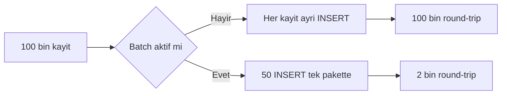
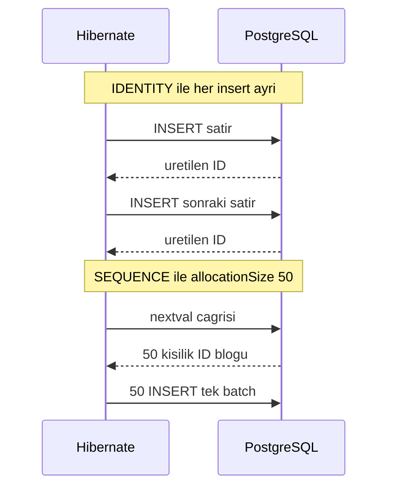
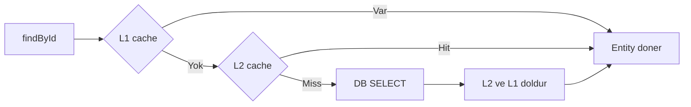

# Topic 2.7 — Hibernate Performance Tuning

```admonish info title="Bu bölümde"
- Batch insert'in default'ta neden çalışmadığı: IDENTITY vs SEQUENCE ve `allocationSize` mekaniği
- Büyük hacimli işler için `@Modifying` bulk update, chunk yönetimi ve `StatelessSession`
- Query plan cache leak senaryosu ve JDBC statement caching'in PgBouncer ile etkileşimi
- Second-level cache ve query cache: banking'de ne zaman değerli, ne zaman yasak
- Hibernate Statistics, PostgreSQL slow query log ve `pg_stat_statements` ile production izleme
```

## Hedef

Hibernate'in performans karakteristiğini production-grade banking workload'larında bilinçli optimize edebilmek. Batch insert'in neden default olarak çalışmadığını (IDENTITY problemi) ve SEQUENCE + `allocationSize` ile nasıl düzeltileceğini öğreneceksin. Query plan cache leak'i, statement caching, second-level cache ve query cache için "banking'de kullan / kullanma" karar matrisini kuracak; Hibernate Statistics ve PostgreSQL araçlarıyla production'ı izleyeceksin. Burada öğrenilenler her banking projesinde günlük kullanılır.

## Süre

Okuma: 2 saat • Kendini Sına: 30 dk • Pratik (opsiyonel): 2.5 saat • Toplam: ~2.5 saat (+ pratik)

## Önbilgi

- Topic 2.1-2.6 bitti — JPA mekaniği, transactions, locking, N+1, pool sizing biliyorsun
- Spring Boot uygulamanda PostgreSQL ve TestContainers ile çalışıyor
- `application.yml`'da Hibernate property'lerini set etmeyi gördün (`spring.jpa.properties.hibernate.*`)
- Performans deyince "P50, P95, P99 latency" ve "throughput RPS" terimlerine aşinasın

---

## Kavramlar

### 1. Batch insert — Hibernate'in en pahalı operasyonu

Gece 01:00, EOD (end-of-day) job'ın 100.000 transaction kaydını içeri basacak. Naif yaklaşım şöyle görünür:

```java
@Transactional
public void importTransactions(List<TransactionDto> transactions) {
    for (TransactionDto dto : transactions) {
        TransactionJpaEntity entity = mapper.toEntity(dto);
        repo.save(entity);
    }
}
```

Her `save` ayrı bir `INSERT` üretir: 100.000 INSERT × 2ms = **200 saniye**. **Batch insert** aktif olsa aynı iş 100.000 / 50 = 2000 round-trip'e iner — teorik 20 saniye. Ama pratikte çoğu zaman çalışmaz. Neden?



#### Batching aktif değil — sebep çoğu zaman ID generation

```java
@Entity
public class TransactionJpaEntity {
    @Id
    @GeneratedValue(strategy = GenerationType.IDENTITY)   // ❌ batch'i kırar
    private Long id;
    // ...
}
```

**IDENTITY** strategy DB'nin auto-increment'ini kullanır: ID ancak insert *sonrasında* var olur, Hibernate de onu okumak zorundadır. <mark>IDENTITY seçtiğin an batch insert imkânsız hale gelir — Hibernate her insert'i tek tek göndermek zorunda kalır</mark>.



#### `SEQUENCE` ile batch fix

**SEQUENCE** strategy'de ID'yi Hibernate önceden bilir, bu yüzden INSERT'leri biriktirip toplu gönderebilir:

```java
@Entity
public class TransactionJpaEntity {
    @Id
    @GeneratedValue(strategy = GenerationType.SEQUENCE, generator = "txn_seq")
    @SequenceGenerator(
        name = "txn_seq",
        sequenceName = "transaction_sequence",
        allocationSize = 50   // ← kritik
    )
    private Long id;
}
```

Migration:

```sql
CREATE SEQUENCE transaction_sequence
    START WITH 1 
    INCREMENT BY 50 
    NO CYCLE;
```

**Mekanik:** Hibernate tek `nextval` çağrısıyla DB'den 50 ID'lik blok alır, Java tarafında bir bir kullanır. **allocationSize** değeri bu blok boyutudur:

- 1 → her insert için DB round-trip → batch yine çalışmaz
- 50 → 50 insert için 1 sequence call, batch için yeterli
- 1000 → uygulama restart'larında büyük "ID kaybı"

Banking pratiği: `allocationSize = 50` veya `100`.

```admonish warning title="Dikkat"
Sequence'in DB tarafındaki `INCREMENT BY` değeri, entity'deki `allocationSize` ile **aynı olmak zorunda**. Farklı olursa iki instance aynı ID bloğunu hesaplayıp çakışan primary key üretebilir.
```

#### Batch config — `application.yml`

ID stratejisi tek başına yetmez; JDBC batching'i açıkça açman gerekir:

```yaml
spring:
  jpa:
    properties:
      hibernate:
        jdbc:
          batch_size: 50
        order_inserts: true
        order_updates: true
        batch_versioned_data: true
```

- `jdbc.batch_size = 50` — PreparedStatement'a 50 INSERT eklenir, bir kerede execute edilir.
- `order_inserts = true` — INSERT'ler **table'a göre sıralanır**; farklı tabloya gidip gelmek batch'i bozar.
- `order_updates = true` — aynı mantık UPDATE'ler için.
- `batch_versioned_data = true` — `@Version`'lı entity'lerde batch update aktif (default false).

#### UUID ID ile batch

UUID kullanıyorsan IDENTITY problemi hiç yok: Hibernate UUID'yi Java tarafında üretir (JPA 3.0+, Hibernate 6.2+), batch sorunsuz çalışır.

```java
@Entity
public class JournalLineJpaEntity {
    @Id
    @GeneratedValue(strategy = GenerationType.UUID)
    private UUID id;
}
```

Banking pratiği: yeni entity'lerde UUID (distributed sistem, debug edilebilir ID); eski sistemlerde Long + SEQUENCE.

#### Verifikasyon — batch gerçekten çalışıyor mu?

"Config'i ekledim, çalışıyordur" demek yetmez; log'dan kanıt iste:

```yaml
logging:
  level:
    org.hibernate.engine.jdbc.batch.internal.BatchingBatch: DEBUG
```

Log'da şunu aramalısın:

```
DEBUG ... BatchingBatch - Reusing batch statement
INFO ... StatementInspector - SELECT nextval('transaction_sequence')
DEBUG ... BatchingBatch - Adding to batch (batch size: 50)
DEBUG ... BatchingBatch - Executing batch (size: 50)
```

```admonish tip title="İpucu"
`Executing batch (size: 50)` satırı → batching aktif. Her satır için ayrı `INSERT INTO ...` görüyorsan batch çalışmıyor demektir — ilk şüphelin ID generation strategy olsun.
```

#### `saveAll` ile `save` farkı

```java
repo.saveAll(entities);   // ✅ batch'e uygun
entities.forEach(repo::save);   // ⚠️ flush davranışına göre
```

`saveAll` Spring Data'da `EntityManager.persist` döngüsüdür, flush sona kadar ertelenir. Tek `save` döngüsü de `@Transactional` sınırında flush'lanır — pratikte benzer ama `saveAll` niyeti net gösterir.

**Tuzak:** Yarıda `flush()` çağırma — `saveAll(batch1); em.flush(); saveAll(batch2);` batch1'in batch'ini bozabilir.

---

### 2. Bulk update / delete — `@Modifying` ile JPQL

100.000 entity'nin status'ünü değiştirmek için hepsini yükleyip dirty checking'e bırakmak aşırı yavaş. **Bulk update** tek SQL ile hepsini halleder:

```java
@Modifying
@Query("UPDATE TransactionJpaEntity t SET t.status = :newStatus WHERE t.batchId = :batchId")
int markAsProcessed(@Param("batchId") UUID batchId, @Param("newStatus") String newStatus);
```

DB'ye tek `UPDATE` gider; 100.000 satır saniye altında güncellenir.

<mark>Bulk update persistence context'i bypass eder — aynı TX'te sonra `findById` yaparsan PC'deki eski state'i görürsün</mark>. Çözüm `clearAutomatically`:

```java
@Modifying(clearAutomatically = true, flushAutomatically = true)
@Query("UPDATE ...")
int bulkUpdate(...);
```

Banking pratiği: batch fee deduction, statement generation gibi mass operasyonlar `@Modifying` ile; PC tutarlılığına dikkat.

---

### 3. `StatelessSession` — Hibernate'in unutulan armağanı

Milyonluk ETL/import job'ında persistence context'in kendisi yüke dönüşür: her entity PC'de tutulur, heap şişer. **StatelessSession** PC'yi hiç kullanmaz — dirty checking yok, cascade yok, insert anında gider.

Kullanımı iki adımda kurulur. Önce `SessionFactory`'den stateless session aç:

```java
SessionFactory sf = emf.unwrap(SessionFactory.class);
try (StatelessSession session = sf.openStatelessSession()) {
    Transaction tx = session.beginTransaction();
    // insert döngüsü buraya
}
```

Sonra döngüde `insert` çağır — flush/clear derdi yok, çünkü biriktirilen bir context yok:

```java
for (TransactionDto dto : dtos) {
    session.insert(mapper.toEntity(dto));   // anında INSERT, PC yok
}
tx.commit();
```

<details>
<summary>Tam kod: BulkImportService (~26 satır)</summary>

```java
@Service
public class BulkImportService {
    
    @Autowired EntityManagerFactory emf;
    
    public void importHugeBatch(List<TransactionDto> dtos) {
        SessionFactory sf = emf.unwrap(SessionFactory.class);
        try (StatelessSession session = sf.openStatelessSession()) {
            Transaction tx = session.beginTransaction();
            try {
                for (int i = 0; i < dtos.size(); i++) {
                    TransactionJpaEntity entity = mapper.toEntity(dtos.get(i));
                    session.insert(entity);
                    if (i % 1000 == 0) {
                        // No flush needed; insert is immediate
                    }
                }
                tx.commit();
            } catch (Exception e) {
                tx.rollback();
                throw e;
            }
        }
    }
}
```

</details>

Kazandıkların ve kaybettiklerin:

- PC yok → memory şişmez
- Dirty checking yok → CPU tasarrufu
- Cascade çalışmaz → her entity manuel
- L1 cache yok → aynı entity tekrar load edilirse ikinci SELECT
- L2 cache yok

Banking pratiği: statement generation, monthly aggregation, partition migration gibi büyük ETL. Normal request handling'te kullanma.

---

### 4. Hibernate query plan cache

Her JPQL/HQL/Criteria query'sini parse etmek pahalıdır; Hibernate bu yüzden parse sonucunu bir "plan" olarak cache'ler. **Query plan cache** default `hibernate.query.plan_cache_max_size = 2048` entry tutar.

Buradaki tuzak bir memory leak'tir. Query'yi dinamik string concat ile üretirsen:

```java
String hql = "SELECT a FROM AccountJpaEntity a WHERE a.id = " + accountId;   // ❌
```

Her farklı `accountId` yeni bir plan demektir. 1 milyon farklı ID → 1 milyon plan → OOM. <mark>JPQL'i asla string concat ile üretme — her zaman parameterized query kullan (plan cache leak + SQL injection, ikisi birden)</mark>:

```java
@Query("SELECT a FROM AccountJpaEntity a WHERE a.id = :id")
Optional<AccountJpaEntity> findById(@Param("id") UUID id);
```

Aynı plan, farklı parameter — cache'te 1 entry kalır.

**Cache tuning:**

```yaml
spring:
  jpa:
    properties:
      hibernate:
        query:
          plan_cache_max_size: 4096
          plan_parameter_metadata_max_size: 256
```

Banking'de yüzlerce repository method var, her biri 1 plan — 4096 yeterli. Dinamik Specification kullanıyorsan her predicate kombinasyonu ayrı plandır; o zaman 8192+ düşün.

**İzleme:**

```yaml
spring.jpa.properties.hibernate.generate_statistics: true
```

```java
Statistics stats = sf.getStatistics();
System.out.println("Query plan cache hit count: " + stats.getQueryPlanCacheHitCount());
System.out.println("Query plan cache miss count: " + stats.getQueryPlanCacheMissCount());
```

Hit ratio > %95 → sağlıklı. < %50 → dinamik query problemin var.

---

### 5. Statement caching — JDBC PreparedStatement

Bu Hibernate'in değil **JDBC driver'ının** feature'ı: PgJDBC, PreparedStatement'ları cache'leyerek tekrarlanan SQL'de compilation'ı atlatır.

```
jdbc:postgresql://localhost:5432/db?prepareThreshold=5
```

`prepareThreshold = 5` → aynı SQL 5 kez kullanıldıktan sonra DB-side prepared statement'a dönüşür (`PREPARE`/`EXECUTE`). Kazanç: plan re-use DB tarafında, parameter binding hızlı.

```admonish warning title="Dikkat"
PgBouncer transaction pooling mode'da `prepareThreshold > 0` patlamalara yol açar (Topic 2.6): prepared statement bir connection'a bağlıdır, transaction mode'da connection her TX'te değişir. PgBouncer arkasında **`prepareThreshold = 0`**. AWS RDS Proxy'de de genelde `0` öneriliyor — kontrol et. Direkt PostgreSQL'de `5` uygundur.
```

---

### 6. Second-level cache (2L) — banking'de neye yarar, neye yaramaz

Her request'te `Currency` tablosundan "TRY" satırını tekrar SELECT etmek israf — bu veri yıllardır değişmedi. **L1 cache** (persistence context) session/TX bazlıdır, TX kapanınca biter. **Second-level cache** ise SessionFactory bazlıdır: birden fazla TX/thread arasında paylaşılır, entity tekrar load edildiğinde DB'ye gidilmez.

Okuma yolu şöyle işler:



#### Konfigürasyon

```xml
<dependency>
    <groupId>org.hibernate.orm</groupId>
    <artifactId>hibernate-jcache</artifactId>
</dependency>
<dependency>
    <groupId>org.ehcache</groupId>
    <artifactId>ehcache</artifactId>
    <classifier>jakarta</classifier>
</dependency>
```

`application.yml`:

```yaml
spring:
  jpa:
    properties:
      hibernate:
        cache:
          use_second_level_cache: true
          use_query_cache: true
          region:
            factory_class: org.hibernate.cache.jcache.JCacheRegionFactory
        javax:
          cache:
            provider: org.ehcache.jsr107.EhcacheCachingProvider
```

Entity üzerinde:

```java
@Entity
@org.hibernate.annotations.Cache(usage = CacheConcurrencyStrategy.READ_WRITE)
public class CurrencyJpaEntity {
    @Id String code;     // "TRY", "USD"
    String name;
    int fractionDigits;
}
```

Ehcache tarafında region'ı TTL ve boyutla sınırla (`ehcache.xml`):

```xml
<config xmlns:jsr107="http://www.ehcache.org/v3/jsr107">
    <cache alias="com.mavibank.banking.currency.adapter.out.persistence.CurrencyJpaEntity">
        <expiry><ttl unit="hours">1</ttl></expiry>
        <heap unit="entries">200</heap>
    </cache>
</config>
```

Artık `currencyRepo.findById("TRY")` ilk çağrıda DB'ye gider, sonrakiler cache'ten okur.

#### Cache concurrency strategy'leri

- `READ_ONLY` — değişmeyen veri (currency, country codes). En hızlı.
- `READ_WRITE` — değişebilir, transaction-aware. Bizim case.
- `NONSTRICT_READ_WRITE` — stale'e tolerans var.
- `TRANSACTIONAL` — JTA transaction. Banking için overkill.

```admonish warning title="Dikkat"
`NONSTRICT_READ_WRITE` banking'de **yasak**: stale okuma ihtimalini kabul eder. Stale balance gören bir para transferi = mali kayıp + regülasyon problemi. Mutable veri cache'lenecekse yalnız `READ_WRITE`.
```

#### Cache provider seçimi

| Provider | Özellik | Banking kullanımı |
|---|---|---|
| **Ehcache** | Local JVM heap + disk. Off-heap opsiyonu. | Tek-instance servisler için ideal |
| **Caffeine** | High-performance local. Sadece in-memory. | Lookup data için (currency, country) |
| **Hazelcast** | Distributed, multi-instance senkronize. | K8s multi-replica için |
| **Redis** | Distributed, network. Hibernate'in resmi entegrasyonu sınırlı. | Genelde Spring Cache'le manuel |
| **Infinispan** | Red Hat. Banking enterprise sık seçim. | JBoss/WildFly ortamlarında |

Karar kuralı: tek instance → Ehcache/Caffeine; K8s 5-10 replica → Hazelcast (invalidation tüm node'lara yayılır); 50+ replica veya büyük cache → Redis (dedicated memory).

#### Banking'de ne cache, ne cache'leme

**Cache:**

- `CurrencyJpaEntity` (TRY, USD, EUR... — 200 satır, hiç değişmez) ✅
- `CountryJpaEntity` (ISO 3166 listesi) ✅
- `BranchJpaEntity` (banka şubeleri — yılda 1-2 değişir) ✅
- `FeeScheduleJpaEntity` (ücret yapısı — günde 1 değişir, expire kısa) ✅
- `ConfigurationJpaEntity` (sistem parametreleri) ✅

**Cache'leme:**

- `AccountJpaEntity` — bakiye dinamik, stale = problem ❌
- `JournalLineJpaEntity` — sık eklenir, append-only, cache faydası az ❌
- `CustomerJpaEntity` — PII, regülatör cache'i istemez ❌
- `CardJpaEntity` — security state'i hızlı değişir ❌

<mark>Para değişen hiçbir entity'yi 2L cache'e koyma; sadece lookup veya konfigürasyon türü statik veriyi cache'le</mark>. Stale cache'in banking'deki gerçek maliyeti: cache 1000 TL diyor, DB'de 500 var → withdraw "yetersiz bakiye" döner ama ekran 1000 gösteriyordu → tutarsız hata; ya da eski FeeSchedule tarifesiyle fee yanlış hesaplanır → mali rapor hatası. Çare: kısa TTL + invalidation event'leri — banking'de cache dikkatli kullanılan bir araçtır.

---

### 7. Query cache — bambaşka bir hayvan

Entity cache'lemek yetmedi, query sonuçlarını da cache'leyelim mi? **Query cache** belirli bir query'nin sonuç ID'lerini cache'ler; entity'leri sonra 2L cache'ten okur.

```java
@Query("SELECT a FROM AccountJpaEntity a WHERE a.ownerId = :ownerId")
@QueryHints(@QueryHint(name = "org.hibernate.cacheable", value = "true"))
List<AccountJpaEntity> findByOwnerId(@Param("ownerId") UUID ownerId);
```

Avantaj: aynı query aynı parametreyle tekrar çağrıldığında sonuç cache'ten. Tuzaklar daha ağır basar:

1. **Invalidation aşırı agresif:** tabloya herhangi bir kayıt girince/silinince o tabloyu ilgilendiren tüm query cache entry'leri silinir. Banking'in append-heavy yapısında cache sürekli invalidate olur, kazanç sıfır.
2. **Memory leak:** her farklı parameter kombinasyonu yeni entry — plan cache benzeri risk.
3. **Sadece exact match:** parametre sırası ve pagination farklıysa farklı entry.

Banking pratiği: query cache nadiren değerli. Sadece read-only lookup query'lerinde (tüm aktif currency'leri listele gibi); journal_lines, accounts gibi append-heavy tablolar için kapalı.

---

### 8. Hibernate statistics — production izleme

Optimize ettiğini ölçmeden bilemezsin; Hibernate Statistics bunun için var:

```yaml
spring:
  jpa:
    properties:
      hibernate:
        generate_statistics: true
```

Metric'leri periyodik olarak Micrometer'a aktar. Çekirdek gauge'lar:

```java
Statistics stats = sessionFactory.getStatistics();

meterRegistry.gauge("hibernate.query.count", stats.getQueryExecutionCount());
meterRegistry.gauge("hibernate.query.slowestTime", stats.getQueryExecutionMaxTime());
meterRegistry.gauge("hibernate.entity.load.count", stats.getEntityLoadCount());
meterRegistry.gauge("hibernate.second_level_cache.hit.ratio", 
    (double) stats.getSecondLevelCacheHitCount() / 
    (stats.getSecondLevelCacheHitCount() + stats.getSecondLevelCacheMissCount() + 1));
```

En yavaş query'yi alarm konusu yap:

```java
String slowestQuery = stats.getQueryExecutionMaxTimeQueryString();
if (slowestQuery != null && stats.getQueryExecutionMaxTime() > 100) {
    log.warn("Slow Hibernate query ({}ms): {}", 
        stats.getQueryExecutionMaxTime(), slowestQuery);
}
```

<details>
<summary>Tam kod: HibernateMetricsRecorder (~33 satır)</summary>

```java
@Component
public class HibernateMetricsRecorder {
    
    private final SessionFactory sessionFactory;
    private final MeterRegistry meterRegistry;
    
    @Scheduled(fixedDelay = 30000)
    public void recordMetrics() {
        Statistics stats = sessionFactory.getStatistics();
        
        meterRegistry.gauge("hibernate.query.count", stats.getQueryExecutionCount());
        meterRegistry.gauge("hibernate.query.slowestTime", stats.getQueryExecutionMaxTime());
        meterRegistry.gauge("hibernate.entity.load.count", stats.getEntityLoadCount());
        meterRegistry.gauge("hibernate.entity.insert.count", stats.getEntityInsertCount());
        meterRegistry.gauge("hibernate.entity.update.count", stats.getEntityUpdateCount());
        meterRegistry.gauge("hibernate.second_level_cache.hit.ratio", 
            (double) stats.getSecondLevelCacheHitCount() / 
            (stats.getSecondLevelCacheHitCount() + stats.getSecondLevelCacheMissCount() + 1));
        meterRegistry.gauge("hibernate.flush.count", stats.getFlushCount());
        meterRegistry.gauge("hibernate.connection.count", stats.getConnectCount());
        meterRegistry.gauge("hibernate.transaction.count", stats.getTransactionCount());
        meterRegistry.gauge("hibernate.session.open.count", stats.getSessionOpenCount());
        meterRegistry.gauge("hibernate.prepare.statement.count", stats.getPrepareStatementCount());
        
        // Slow query
        String slowestQuery = stats.getQueryExecutionMaxTimeQueryString();
        if (slowestQuery != null && stats.getQueryExecutionMaxTime() > 100) {
            log.warn("Slow Hibernate query ({}ms): {}", 
                stats.getQueryExecutionMaxTime(), slowestQuery);
        }
    }
}
```

</details>

**Banking-relevant metrics:**

- `query.count` — total query sayısı, throughput proxy
- `query.slowestTime` — en yavaş query'nin ms'i
- `entity.load.count / query.count` — query başına entity yükü (N+1 göstergesi)
- `second_level_cache.hit.ratio` — L2 cache etkisi
- `flush.count / transaction.count` — TX başına flush (1 ideal)

Performans alarmı: `slowestTime > 500ms` → log.warn, devops'a bildir.

---

### 9. PostgreSQL slow query log

Hibernate ne derse desin, asıl kanıt DB tarafındadır. `postgresql.conf`:

```
log_min_duration_statement = 100   # 100ms üzeri her query log
log_statement_stats = on            # statistical info (CPU, IO)
log_lock_waits = on                 # lock bekleme uyarısı
deadlock_timeout = 1s
```

Local'de docker-compose ile aynı ayarlar:

```yaml
postgres:
  command: |
    postgres
    -c shared_preload_libraries=pg_stat_statements
    -c log_min_duration_statement=100
    -c log_lock_waits=on
```

Log'da şöyle görünür:

```
2025-05-12 14:30:00 UTC [12345] LOG: duration: 2543.123 ms 
statement: SELECT ... FROM accounts a LEFT JOIN journal_lines jl ... WHERE a.owner_id = $1
```

Banking pratiği: production'da `log_min_duration_statement = 250` — daha düşük eşik log explosion yaratır.

---

### 10. `pg_stat_statements` — aggregate query analiz

Slow query log tek tek olayları gösterir; "hangi query toplamda en çok zaman yiyor" sorusunun cevabı **pg_stat_statements** extension'ındadır — execution count, total time, mean time özetler.

```sql
CREATE EXTENSION pg_stat_statements;

-- En yavaş 10 query (total time'a göre)
SELECT query, calls, total_exec_time, mean_exec_time, rows
FROM pg_stat_statements
ORDER BY total_exec_time DESC
LIMIT 10;
```

Banking-grade analiz:

```sql
-- Mean time > 50ms olanlar (slow individually)
SELECT query, calls, mean_exec_time, total_exec_time
FROM pg_stat_statements
WHERE mean_exec_time > 50
ORDER BY total_exec_time DESC;

-- Çok sık çağrılan query'ler (top calls)
SELECT query, calls, mean_exec_time, total_exec_time
FROM pg_stat_statements
ORDER BY calls DESC
LIMIT 10;
```

Banking pratiği: weekly query budget review. CI'de yakalanmayan yeni N+1 veya slow query burada yakalanır.

---

### 11. JPQL/Native SQL ne zaman hangisi — performans bakışı

| Senaryo | JPQL | Native SQL |
|---|---|---|
| Standard CRUD | ✅ Tercih | ❌ Overkill |
| Complex JOIN (3+ tablo) | ✅ Çoğu zaman | ⚠️ Performans gerekiyorsa |
| DB-specific feature (window functions, CTE) | ❌ Desteklemez | ✅ Zorunlu |
| Aggregation (SUM, COUNT, AVG) | ✅ Destekler | ⚠️ Karmaşıksa |
| Bulk update | ✅ `@Modifying` JPQL | ⚠️ Performans için bazen |
| Multi-row INSERT (INSERT ... SELECT) | ❌ Desteklemez | ✅ Native |
| MERGE / UPSERT | ❌ JPQL'da yok | ✅ Native + ON CONFLICT |
| PostgreSQL JSONB queries | ❌ JPQL'da yok | ✅ Native + JSONB operators |
| Recursive CTE | ❌ | ✅ |

Banking pratiği: JPQL %85, native %15. Native gerektiğinde adapter katmanında izole — domain'e sızmasın.

#### PostgreSQL UPSERT örneği

```java
@Modifying
@Query(value = """
    INSERT INTO idempotency_keys (key, response_body, created_at)
    VALUES (:key, :body, NOW())
    ON CONFLICT (key) DO NOTHING
""", nativeQuery = true)
int upsertIdempotencyKey(@Param("key") String key, @Param("body") String body);
```

Return değeri 1 = yeni kayıt, 0 = zaten vardı (idempotency-key bulundu).

---

### 12. Connection-level query optimization

Bir query kaçınılmaz olarak yavaşladığında kullanıcıyı sonsuza kadar bekletme — timeout'lar bunun sigortası.

#### `statement_timeout`

PostgreSQL'in DB tarafı query timeout'u; süre aşılınca DB query'yi öldürür:

```sql
SET statement_timeout = '5s';
```

Driver tarafı:

```yaml
spring:
  datasource:
    hikari:
      data-source-properties:
        socketTimeout: 30
        loginTimeout: 5
```

Veya Spring/JPA seviyesinde:

```yaml
spring:
  jpa:
    properties:
      jakarta.persistence.query.timeout: 5000   # 5 saniye
```

Banking pratiği: API endpoint için 5 saniye, batch için 5 dakika.

#### `idle_in_transaction_session_timeout`

"TX açtı ama dakikalardır hiçbir şey yapmıyor" senaryosunun panzehiri:

```sql
SET idle_in_transaction_session_timeout = '30s';
```

Aşıldığında PostgreSQL session'ı kill eder — open TX leak'i fail-fast olur, lock'lar ve vacuum serbest kalır.

---

### 13. Hibernate 6 yenilikleri (Spring Boot 3.x)

Spring Boot 2.x → 3.x geçişi seni Hibernate 6'ya taşır; bilmen gereken değişiklikler:

1. **Yeni query parser** — JPA Criteria desteği daha sıkı, eski Hibernate-specific feature'lar bazen kırıldı
2. **SQM (Semantic Query Model)** — JPQL'in iç temsili yenilendi
3. **`@Cache` annotation Jakarta migration** — `jakarta.persistence` namespace
4. **`@SoftDelete` annotation (experimental)** — `@SQLDelete` + `@Where`'in standardı
5. **Yeni `@JdbcType` annotation** — custom type mapping (PostgreSQL JSONB, ENUM)
6. **MultipleBagFetchException artık fırlatılmıyor** — bazı durumlarda Cartesian product gelir, dikkat

Banking migration notu: geçişte Hibernate 6 query'leri yeniden test edilmeli; eski `JOIN FETCH DISTINCT` davranışı farklı (gerek kalmadı).

---

### 14. Profiling — JFR + flame graph

Metric'ler "yavaş" der ama "neresi yavaş" demez; onun için profiler gerekir. JVM Flight Recorder ile:

```bash
java -XX:StartFlightRecording=duration=60s,filename=banking.jfr -jar core-banking.jar
```

`banking.jfr` dosyasını **JDK Mission Control** veya async-profiler ile aç. CPU flame graph'ta:

- `Hibernate.SQL` çok zaman alıyor → JPA optimization gerek
- `JDBC.getConnection` → pool darboğaz
- `PostgreSQL.Socket.read` → DB darboğaz veya network

Banking'de production profiling opsiyonel ama altın değer. Phase 9'da APM ile detay.

---

### 15. Anti-pattern'ler

**Anti-pattern 1: IDENTITY ID + batch beklemek** — IDENTITY + batch = imkânsız; SEQUENCE veya UUID.

**Anti-pattern 2: String concat ile JPQL/HQL** — plan cache leak + SQL injection; daima `:param`:

```java
em.createQuery("SELECT a FROM AccountJpaEntity a WHERE a.id = " + id)   // ❌
```

**Anti-pattern 3: 2L cache balance veya money field'larda** — `@Cache` Account, JournalLine üzerinde yasak; stale balance = banking faciası.

**Anti-pattern 4: `findAll()` pageable'sız** — Topic 2.2'de değinildi; 1M+ row tabloda OOM.

**Anti-pattern 5: 1 TX'te 1M satır işlemek** — PC'de 1M entity birikir, OOM:

```java
@Transactional
public void process() {
    for (int i = 0; i < 1_000_000; i++) {
        repo.save(...);   // PC 1M entity → OOM
    }
}
```

Çare: 10.000'lik chunk'lar + her chunk sonunda `em.flush(); em.clear();` — veya `StatelessSession`.

**Anti-pattern 6: Batch'te persistence context'i temizlememek** — `flush` var ama `clear` yoksa PC yine şişer:

```java
for (int i = 0; i < 100_000; i++) {
    repo.save(entity);
    if (i % 1000 == 0) {
        em.flush();
        // em.clear() ← burada eksik → PC şişer
    }
}
```

**Anti-pattern 7: 2L cache invalidation eventi yok** — veri external source'tan değişince (DB'ye direkt UPDATE) cache stale kalır; domain event veya scheduled refresh şart.

**Anti-pattern 8: `@Modifying` sonrası PC bypass'ı unutmak** — `clearAutomatically = true` eksik → sonraki `findById` eski version döner.

**Anti-pattern 9: Native SQL her yerde** — PC, cascade, dirty checking faydalarını kaybedersin; native sadece gerektiği yerde.

---

## Önemli olabilecek araştırma kaynakları

- Vlad Mihalcea "High-Performance Java Persistence" (kitap)
- Hibernate User Guide — Performance chapter
- Vlad Mihalcea blog — batch insert, SEQUENCE, allocation size series
- "Practical Hibernate" Thorben Janssen (Patreon + blog)
- PostgreSQL `pg_stat_statements` documentation
- `log_min_duration_statement` PostgreSQL config
- Hibernate 6 migration guide
- "Java Performance" Scott Oaks (kitap)
- JFR + flame graph workflow
- Ehcache, Caffeine, Hazelcast documentation

---

## Kendini Sına

Aşağıdaki soruları önce **cevaba bakmadan** kendi cümlelerinle yanıtlamayı dene — hepsi mülakatta karşına çıkabilecek tarzda. Takıldığın soru olursa ilgili Kavramlar başlığına dön, sonra tekrar dene.

**S1. IDENTITY ID strategy batch insert'i neden kırar? SEQUENCE bunu nasıl çözer?**

<details>
<summary>Cevabı göster</summary>

IDENTITY'de ID'yi DB'nin auto-increment'i üretir — yani ID ancak INSERT çalıştıktan sonra var olur. Hibernate, persistence context'e koyduğu her entity'nin ID'sini bilmek zorunda olduğu için her insert'i tek tek gönderip ID'yi geri okumak zorundadır; INSERT'leri biriktirip toplu göndermek imkânsız hale gelir.

SEQUENCE'ta ise Hibernate ID'yi INSERT'ten önce `nextval` ile alır. `allocationSize = 50` ile tek round-trip'te 50 ID'lik blok çekilir, ID'ler önceden bilindiği için INSERT'ler `hibernate.jdbc.batch_size` kadar biriktirilip tek pakette gönderilebilir. UUID de aynı sebepten batch-dostudur: ID Java tarafında üretilir.

</details>

**S2. `allocationSize = 50` tam olarak nasıl çalışır? DB tarafında nelere dikkat etmen gerekir?**

<details>
<summary>Cevabı göster</summary>

Hibernate tek `nextval` çağrısıyla 50 ID'lik bir blok rezerve eder ve Java tarafında bir bir tüketir — 50 insert için 1 sequence round-trip. `allocationSize = 1` olsaydı her insert için ayrı `nextval` gerekir, batch fiilen çalışmazdı; 1000 gibi çok büyük değerler ise uygulama restart'larında büyük ID boşlukları bırakır.

Kritik DB kuralı: sequence'in `INCREMENT BY` değeri entity'deki `allocationSize` ile aynı olmalı. Farklı olursa iki uygulama instance'ı aynı ID aralığını hesaplayıp primary key çakışması üretebilir. Banking pratiği 50 veya 100'dür.

</details>

**S3. `hibernate.order_inserts = true` ne işe yarar, ne zaman fark yaratır?**

<details>
<summary>Cevabı göster</summary>

JDBC batch'i yalnız aynı statement'ın (aynı tabloya aynı INSERT şablonu) tekrarında çalışır. Flush sırasında Hibernate entity'leri persist sırasıyla yazarsa, farklı tablolara gidip gelen INSERT'ler batch'i sürekli böler: A, B, A, B... dizisinde her geçiş yeni statement demektir.

`order_inserts = true` INSERT'leri tabloya göre gruplar: önce tüm A'lar, sonra tüm B'ler — her grup tek batch olur. Parent + child entity'leri birlikte kaydeden import job'larında fark dramatiktir. `order_updates` aynı şeyi UPDATE'ler için yapar; `batch_versioned_data = true` da `@Version`'lı entity'lerin batch update'ine izin verir.

</details>

**S4. `StatelessSession` ne zaman doğru araçtır? Kullanınca nelerden vazgeçersin?**

<details>
<summary>Cevabı göster</summary>

Milyonluk ETL/import job'larında doğru araçtır: persistence context hiç kullanılmadığı için heap şişmez, dirty checking olmadığı için CPU harcanmaz, `insert` çağrısı anında DB'ye gider — flush/clear ritüeli gerekmez.

Vazgeçtiklerin: cascade çalışmaz (her entity'yi manuel insert edersin), L1 cache yok (aynı entity'yi iki kez load edersen iki SELECT), L2 cache yok, lifecycle event'leri yok. Bu yüzden normal request handling'te kullanılmaz; statement generation, monthly aggregation, partition migration gibi büyük toplu işlere saklanır.

</details>

**S5. Query plan cache memory leak'i nasıl oluşur, nasıl önlenir?**

<details>
<summary>Cevabı göster</summary>

Hibernate her farklı JPQL string'i için bir query planı üretip cache'ler. Query'yi string concat ile kurarsan (`"... WHERE a.id = " + accountId`) her farklı değer yeni bir string, yani yeni bir plan demektir — 1 milyon farklı ID, 1 milyon plan entry'si ve sonunda OOM.

Önleme: her zaman parameterized query (`WHERE a.id = :id`) — plan tektir, sadece parameter değişir. Bonus olarak SQL injection da kapanır. İzlemek için `generate_statistics: true` ile plan cache hit/miss sayılarına bak: hit ratio %95 üstü sağlıklıdır, %50 altı dinamik query problemine işaret eder. Dinamik Specification kullanan projelerde `plan_cache_max_size` 8192+ yapılmalıdır.

</details>

**S6. Second-level cache banking'de neden riskli? Hangi entity'ler cache'lenir, hangileri asla?**

<details>
<summary>Cevabı göster</summary>

L2 cache SessionFactory bazlıdır ve TX'ler arası paylaşılır — yani DB'deki güncel değer ile cache'teki kopya ayrışabilir (stale read). Banking'de bunun bedeli somuttur: cache 1000 TL derken DB'de 500 varsa müşteri tutarsız hata görür; eski FeeSchedule tarifesiyle fee yanlış hesaplanır ve mali rapor bozulur.

Kural: para değişen hiçbir şey cache'lenmez. Cache'lenebilecekler lookup/config verisidir — Currency, Country, Branch, FeeSchedule (kısa TTL ile), sistem parametreleri. Asla cache'lenmeyecekler: Account (bakiye dinamik), JournalLine (append-only, fayda yok), Customer (PII, regülatör istemez), Card (security state hızlı değişir). Mutable veri cache'lenecekse strategy `READ_WRITE` olmalı; `NONSTRICT_READ_WRITE` stale'e tolerans tanıdığı için banking'de yasaktır.

</details>

**S7. Query cache ile second-level cache arasındaki fark nedir? Banking'de query cache neden nadiren değerlidir?**

<details>
<summary>Cevabı göster</summary>

2L cache entity'leri ID bazında saklar; query cache ise belirli bir query + parametre kombinasyonunun sonuç ID listesini saklar, entity'leri yine 2L cache'ten okur. Yani query cache 2L cache'e bağımlı ek bir katmandır.

Banking'de değersiz olmasının sebebi invalidation'ın agresifliği: ilgili tabloya tek bir kayıt bile eklense o tablonun tüm query cache entry'leri silinir. journal_lines gibi append-heavy tablolarda cache sürekli invalidate olur, hiç kazanç sağlamaz — üstelik her parametre kombinasyonu ayrı entry olduğu için memory leak riski de taşır. Sadece read-only lookup query'lerinde (aktif currency listesi gibi) mantıklıdır.

</details>

**S8. `@Modifying` bulk update sonrası aynı TX'te `findById` neden eski değeri dönebilir? Çözümü nedir?**

<details>
<summary>Cevabı göster</summary>

`@Modifying` JPQL UPDATE doğrudan DB'ye gider ve persistence context'i bypass eder. Entity daha önce aynı TX'te yüklendiyse PC'de eski haliyle durur; sonraki `findById` DB'ye gitmez, PC'deki cached kopyayı döner — yani UPDATE'i görmeyen stale bir entity alırsın.

Çözüm: `@Modifying(clearAutomatically = true)` update sonrası PC'yi temizler, sonraki find fresh load yapar; `flushAutomatically = true` da update öncesi bekleyen değişiklikleri flush'lar. Alternatif manuel `em.clear()`. Banking'de batch fee deduction gibi mass operasyonlardan sonra entity okuyan her akışta bu şarttır.

</details>

---

## Tamamlama kriterleri

- [ ] "Kendini Sına" bölümündeki tüm soruları cevaba bakmadan açıklayabiliyorum
- [ ] IDENTITY'nin batch'i neden kırdığını ve SEQUENCE + `allocationSize` çözümünü anlatabiliyorum
- [ ] `hibernate.jdbc.batch_size`, `order_inserts/updates`, `batch_versioned_data` ayarlarının ne yaptığını biliyorum
- [ ] `@Modifying(clearAutomatically = true)` gereksinimini ve `StatelessSession`'ın yerini biliyorum
- [ ] Query plan cache leak senaryosunu ve parameterized query çözümünü açıklayabiliyorum
- [ ] 2L cache'in banking'de hangi entity'lerde uygun, hangilerinde yasak olduğunu gerekçesiyle sayabiliyorum
- [ ] Hibernate Statistics, slow query log ve `pg_stat_statements` ile izleme kurabileceğimi biliyorum
- [ ] Anti-pattern listesi rahat (IDENTITY+batch, string concat, money cache, vs.)
- [ ] (Opsiyonel) "Pratik yapmak istersen" bölümündeki testleri yazdım ve Claude-verify prompt'uyla doğrulattım

Hepsi onaylı → Phase 2 mini-project'e geç → [../mini-project/](../mini-project/index.md)

---

## Defter notları

1. "IDENTITY ID strategy'sinin batch insert'i neden kırdığını açıklayan tek cümle: ____."
2. "`allocationSize` 50 olunca Hibernate nasıl davranır: ____. 1 olsa fark: ____."
3. "`hibernate.order_inserts = true` ne zaman değer ekler: ____."
4. "`StatelessSession` PC kullanmadığı için elde ettiğin 2 fayda: ____, ____. Kaybettiklerin: ____."
5. "`@Modifying(clearAutomatically = true)` neden gerek: ____."
6. "Query plan cache leak senaryosu: ____. Önleme: ____."
7. "L2 cache banking'de hangi entity'lerde uygundur (3 örnek): ____. Hangilerine YASAK (gerekçeli): ____."
8. "Cache concurrency strategy seçimi: lookup data ____, mutable data ____."
9. "PostgreSQL `pg_stat_statements`'in `slow query log`'a göre avantajı: ____."
10. "`idle_in_transaction_session_timeout` neden banking için kritik: ____."

```admonish success title="Bölüm Özeti"
- IDENTITY batch insert'i kırar; SEQUENCE + `allocationSize = 50` (DB'de aynı `INCREMENT BY`) ve `hibernate.jdbc.batch_size` ile batch aktifleşir — kanıtı BatchingBatch DEBUG log'unda ara
- Büyük hacimli işlerde `@Modifying` bulk update (`clearAutomatically = true` ile), chunk + `flush/clear`, ya da `StatelessSession` — asla 1 TX'te 1M satır
- JPQL'i string concat ile üretme: plan cache leak + SQL injection; her zaman `:param`, hit ratio > %95 hedefle
- 2L cache sadece lookup/config verisi için (Currency, Country, Branch); money taşıyan entity'lerde yasak, query cache append-heavy tablolarda değersiz
- PgBouncer transaction mode arkasında `prepareThreshold = 0`; direkt PostgreSQL'de 5 uygundur
- Hibernate Statistics + Micrometer, `log_min_duration_statement` ve `pg_stat_statements` production'daki gözlerin
```

---

## Pratik yapmak istersen

Kavramları koda dökmek istersen aşağıdaki iki ek hazır: test yazma rehberi batch insert, bulk update, L2 cache ve plan cache için örnek testler içerir; Claude-verify prompt'u ile yazdığın kodu banking-grade perspektiften denetletebilirsin.

<details>
<summary>Test yazma rehberi</summary>

### Test 2.7.1 — Batch insert verification

```java
@SpringBootTest
@Testcontainers
class BatchInsertTest {
    
    @Container @ServiceConnection
    static PostgreSQLContainer<?> pg = new PostgreSQLContainer<>("postgres:16-alpine");
    
    @Autowired TransactionJpaRepository repo;
    @Autowired EntityManagerFactory emf;
    
    @Test
    @Transactional
    void should_execute_inserts_in_batches() {
        SessionFactory sf = emf.unwrap(SessionFactory.class);
        sf.getStatistics().clear();
        
        List<TransactionJpaEntity> batch = IntStream.range(0, 1000)
            .mapToObj(i -> createEntity())
            .toList();
        
        repo.saveAll(batch);
        repo.flush();
        
        Statistics stats = sf.getStatistics();
        // 1000 entity, batch_size=50 → ~20 prepared statement çağrısı
        assertThat(stats.getEntityInsertCount()).isEqualTo(1000);
        assertThat(stats.getPrepareStatementCount()).isLessThanOrEqualTo(25);  // ~20 batch + biraz sequence
    }
}
```

### Test 2.7.2 — Bulk update PC bypass davranışı

```java
@Test
@Transactional
void bulkUpdate_shouldClearPersistenceContext_whenAnnotated() {
    UUID id = createEntityWithStatus("PENDING");
    TransactionJpaEntity entity = repo.findById(id).orElseThrow();
    assertThat(entity.getStatus()).isEqualTo("PENDING");
    
    repo.markAsProcessedBulk(id);   // @Modifying(clearAutomatically = true)
    
    // Aynı TX'te tekrar findById — PC clear edildi, fresh load
    TransactionJpaEntity afterUpdate = repo.findById(id).orElseThrow();
    assertThat(afterUpdate.getStatus()).isEqualTo("PROCESSED");
}
```

### Test 2.7.3 — L2 cache hit/miss

```java
@Test
void l2CacheShouldHitOnSecondLoad() {
    SessionFactory sf = emf.unwrap(SessionFactory.class);
    sf.getStatistics().clear();
    
    // İlk find — DB hit
    currencyRepo.findById("TRY").orElseThrow();
    long missAfter1 = sf.getStatistics().getSecondLevelCacheMissCount();
    
    // İkinci find — cache hit (TX kapanmış, yeni TX)
    transactionTemplate.executeWithoutResult(s -> 
        currencyRepo.findById("TRY").orElseThrow()
    );
    long hitAfter2 = sf.getStatistics().getSecondLevelCacheHitCount();
    
    assertThat(missAfter1).isEqualTo(1);
    assertThat(hitAfter2).isGreaterThanOrEqualTo(1);
}
```

### Test 2.7.4 — Plan cache stability

```java
@Test
void parameterizedQuery_shouldNotInflatePlanCache() {
    SessionFactory sf = emf.unwrap(SessionFactory.class);
    
    for (int i = 0; i < 1000; i++) {
        UUID randomId = UUID.randomUUID();
        accountRepo.findById(randomId);   // parametric query
    }
    
    // Plan cache'te sadece 1 entry olmalı
    long planCount = sf.getStatistics().getQueryPlanCacheHitCount() 
                   + sf.getStatistics().getQueryPlanCacheMissCount();
    assertThat(sf.getStatistics().getQueryPlanCacheHitCount()).isGreaterThan(900);
}
```

</details>

<details>
<summary>Claude-verify prompt</summary>

```
Aşağıdaki Hibernate performans kodumu banking-grade kriterlere göre değerlendir. 
PASS / FAIL / EKSIK işaretle, KOD YAZMA:

1. Batch insert:
   - ID generation strategy IDENTITY mi (batch'i kırıyor) yoksa SEQUENCE/UUID mi?
   - SEQUENCE kullanılıyorsa `allocationSize` >= 50 mi?
   - `hibernate.jdbc.batch_size` set mi (>= 25)?
   - `order_inserts` ve `order_updates` true mu?
   - `batch_versioned_data` versionlu entity'ler için true mu?
   - Test'te `Executing batch (size: X)` log'u görülüyor mu?

2. Persistence context yönetimi:
   - Büyük loop'larda `em.flush(); em.clear();` her batch sonu var mı?
   - `StatelessSession` ETL job'larda kullanılıyor mu?
   - 1M+ kayıt tek TX'te işleniyor mu? (Olmamalı)

3. Bulk update/delete:
   - `@Modifying` JPQL bulk update için var mı?
   - `clearAutomatically = true` PC tutarlılığı için set mi?
   - `flushAutomatically = true` gerektiği yerde mi?

4. Query plan cache:
   - JPQL string concat var mı? (Olmamalı, SQL injection + plan leak)
   - Parameterized query'ler `:param` ile mi?
   - `plan_cache_max_size` 4096+ mı (banking için)?
   - Plan cache hit ratio test'te > %95 mi?

5. Statement caching:
   - JDBC URL `prepareThreshold` ayarı var mı?
   - PgBouncer transaction mode varsa `prepareThreshold = 0` mı?

6. Second-level cache:
   - L2 cache aktif mi (`use_second_level_cache: true`)?
   - Provider seçimi mantıklı mı (Ehcache tek instance, Hazelcast multi-replica)?
   - Hangi entity'ler cache'li (lookup data: currency, country)?
   - Hangi entity'ler cache'siz (Account, JournalLine — banking kuralı)?
   - Cache concurrency strategy money entity'lerde NONSTRICT_READ_WRITE değil mi? (Olmamalı)

7. Query cache:
   - Banking'in append-heavy yapısı için query cache **kapalı** mı? (Default kapalı OK)
   - Açıksa, sadece read-only lookup query'lerinde mi?

8. Statistics & monitoring:
   - `hibernate.generate_statistics: true` aktif mi?
   - Micrometer'a hibernate metric'leri yazılıyor mu?
   - Slowest query log alarmı kuruldu mu?

9. PostgreSQL tarafı:
   - `log_min_duration_statement` set mi (100-250 ms)?
   - `pg_stat_statements` extension yüklü mü?
   - `log_lock_waits` aktif mi?
   - `idle_in_transaction_session_timeout` set mi?

10. JPQL vs Native SQL:
    - JPQL dominant (~%85) mi, gerektiğinde native mi?
    - Native SQL gerekçeli mi (CTE, JSONB, UPSERT)?
    - Native query DB-agnostic mi (kaçınılmazsa) yoksa PostgreSQL-specific ve dokümante mi?

11. Anti-pattern:
    - IDENTITY + batch beklemek? (Olmamalı)
    - String concat JPQL/SQL? (Olmamalı)
    - 2L cache money/balance entity'de? (Olmamalı)
    - `findAll()` pageable'sız? (Olmamalı)
    - 1 TX'te 1M+ satır? (Olmamalı)
    - PC clear'sız bulk update + sonra find? (Olmamalı)
    - 2L cache invalidation event'i eksik? (Stale risk)

12. Banking-grade kalite:
    - Performance ADR yazılı mı (allocationSize, batch_size, L2 cache stratejisi)?
    - Slow query CI'de yakalanır mı (test'te Hibernate Statistics assertion)?
    - Production'da JFR profile aldın mı?
    - APM (Datadog/New Relic) entegrasyonu hazır mı (Phase 9'da detay)?

Her madde için PASS / FAIL / EKSIK ve kısa gerekçe. Kod yazma.
```

</details>
