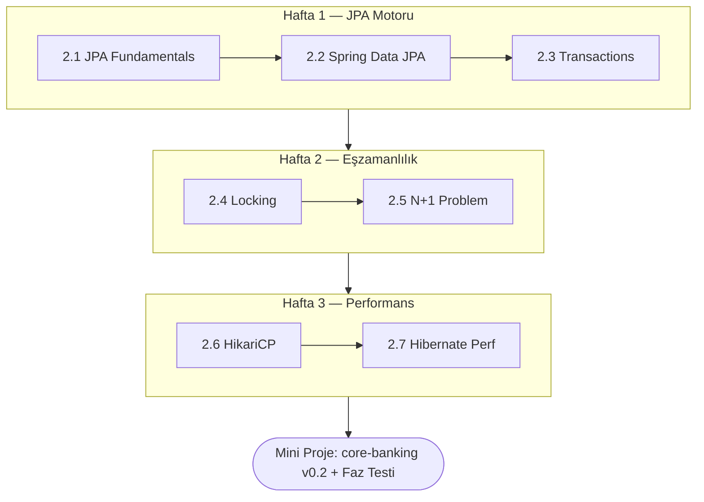

<div class="phase-cover-kicker">İkinci Bölüm</div>

# Faz 2 — JPA & Transactions

<div class="phase-cover-meta">
<div><strong>Süre</strong> 3 hafta</div>
<div><strong>Topic</strong> 7 konu + mini proje</div>
<div><strong>Çıktı</strong> core-banking v0.2</div>
<div><strong>Ön koşul</strong> Faz 1 tamamlandı</div>
</div>

```admonish info title="Bu fazda ne öğreneceksin?"
Spring Data JPA'nın iç çalışmasını, transaction propagation ve isolation kurallarını,
optimistic/pessimistic locking'i, N+1 problemini ve HikariCP tuning'i **banking-grade**
seviyede öğreneceksin. Fazın sonunda `core-banking`, race condition'a dirençli,
locking ile korunan, N+1'siz ve bilinçli tune edilmiş bir uygulama olacak.
```

## Hedef

Spring Data JPA'nın iç çalışmasını, transaction propagation ve isolation kurallarını, optimistic ve pessimistic locking'i, N+1 problemini ve HikariCP connection pool tuning'i banking-grade seviyede öğrenmek.

Sonunda elinde: `core-banking` projesinde **race condition'a karşı dirençli**, optimistic + pessimistic locking ile korunan, N+1'siz reporting endpoint'leri olan, HikariCP'i bilinçli tune edilmiş bir uygulama.

## Fazın haritası



## Süre

3 hafta (günde 2-3 saat). Bu faz **TR bank mülakatlarında en çok sorulan** konuları kapsar — özellikle transaction propagation ve locking.

## Topic sırası

1. **[JPA Fundamentals & Entity Lifecycle](./01-jpa-fundamentals/index.md)** — persistence context, entity states, dirty checking, flush modes
2. **[Spring Data JPA & Repositories](./02-spring-data-jpa/index.md)** — JpaRepository, derived queries, projections, pagination
3. **[Transaction Management](./03-transactions/index.md)** — `@Transactional` propagation (7 türü), isolation level, banking senaryoları
4. **[Locking](./04-locking/index.md)** — optimistic (`@Version`), pessimistic (`SELECT FOR UPDATE`), deadlock fix, retry pattern
5. **[N+1 Problem & Fetch Strategies](./05-n-plus-one/index.md)** — tespit, `@EntityGraph`, JOIN FETCH, DTO projection
6. **[HikariCP Connection Pool](./06-connection-pool/index.md)** — pool sizing formula, banking pattern, leak detection, PgBouncer
7. **[Hibernate Performance](./07-hibernate-performance/index.md)** — batch insert, statement cache, second-level cache, identity vs sequence

Sonra:

- **[Mini-project](./mini-project/index.md)** — `core-banking`'i locking + N+1 fix + pool tuning ile genişlet, **deadlock'u canlı reprodüksiyon + fix**
- **[PHASE_TEST.md](./PHASE_TEST.md)** — Phase 3'e geçmeden kendini sına

## Faz 2'nin sonunda olman gereken yer

Test et — şu soruları net cevaplayabiliyor musun?

- [ ] "Spring `@Transactional` proxy mekanizması nasıl çalışır, self-invocation neden patlar?"
- [ ] "REQUIRES_NEW ne zaman REQUIRED yerine kullanılır — para transferi audit log örneğiyle anlat"
- [ ] "READ_COMMITTED ile REPEATABLE_READ farkı, hangi anomali hangisinde olur?"
- [ ] "Optimistic locking ile pessimistic locking arasında karar verirken neye bakarsın?"
- [ ] "İki concurrent transfer A→B ve B→A neden deadlock olur, nasıl çözülür?"
- [ ] "N+1 problem'i log'da nasıl tespit ederim, üç farklı çözüm yöntemi nedir?"
- [ ] "HikariCP `maximumPoolSize`'ı hangi formülle belirlersin, neden 200 yapmazsın?"
- [ ] "PgBouncer'ı niye HikariCP'in önüne koyarsın?"

```admonish success title="Faza geçiş kuralı"
Yukarıdaki soruların **hepsine** net cevap verebiliyorsan → [Faz 3 — Concurrency & JVM](../03-concurrency/index.md)'a geç.
Takıldığın soru hangi topic'e aitse oraya geri dön — bu fazın konuları mülakatların bel kemiği.
```
