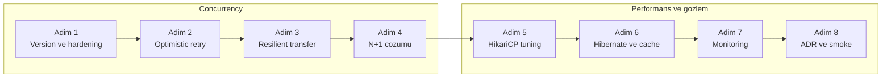
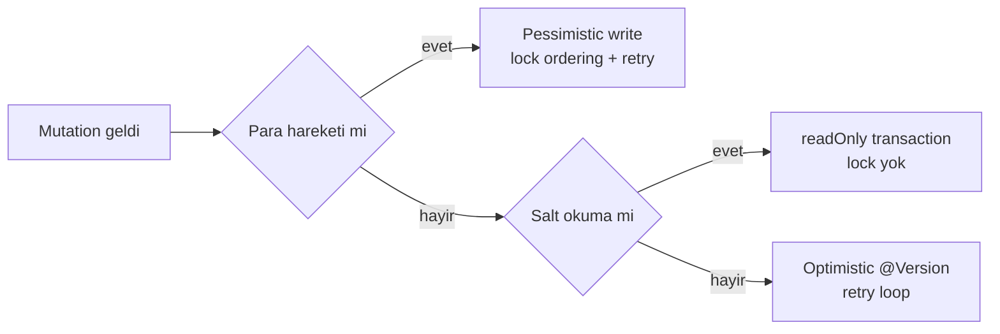
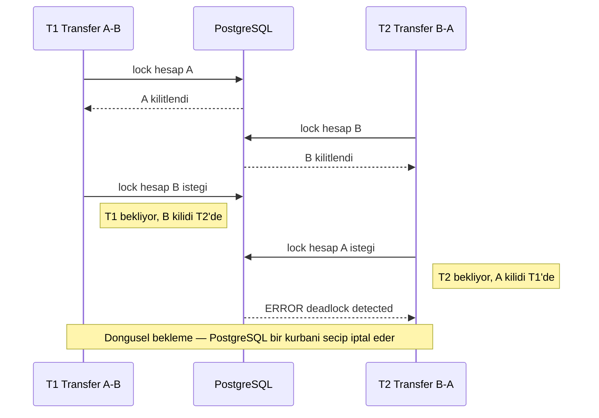

# Phase 2 Mini-Project — `core-banking` v0.2 (Concurrency & Performance Hardening)

```admonish info title="Bu projede"
- Phase 1'in `core-banking` v0.1'ini optimistic + pessimistic locking, lock ordering ve retry ile deadlock-free hale getiriyorsun
- N+1 problemini CI'da yakalayan testler yazıyor, 4 yöntemi karşılaştırıp production endpoint'ini DTO projection'a taşıyorsun
- HikariCP'i banking-grade tune ediyor, pool exhaustion ve connection leak'i bilerek üretip düzeltiyorsun
- Batch insert, SEQUENCE allocation ve second-level cache ile Hibernate performansını ölçerek artırıyorsun
- Prometheus + Grafana ile HikariCP, Hibernate ve business metric'lerini canlı izliyorsun
```

## Hedef

Phase 1'de `core-banking` v0.1'i inşa ettin; Phase 2'nin 7 topic'inde JPA internals, transaction yönetimi, locking, N+1, pool tuning ve Hibernate performance çalıştın. Bu projede hepsini tek serviste birleştirip v0.1'i **savaşa hazır** hale getiriyorsun. Bu mini-project Phase 2'nin **synthesis**'i — yeni teori yok, **uygulama** var; bir adımda takılırsan ilgili topic'e geri dön, oku, düzelt.

Projenin sonunda `core-banking` şunlara sahip olacak:

- JPA/Hibernate internals'a göre doğru modellenmiş entity'ler
- Spring Data JPA pattern'leriyle repository katmanı
- Doğru transaction boundary, propagation, isolation seçimleri
- Optimistic + pessimistic locking, deadlock'a karşı **lock ordering**
- N+1 problem'in CI'da yakalanması ve 4 yöntemle çözüldüğü endpoint'ler
- HikariCP banking-grade tuning + monitoring
- Hibernate performance: batch insert, sequence allocation, 2L cache, slow query log

```admonish tip title="Süre ve önbilgi"
5-7 gün ayır. Başlamadan önce: Phase 2'nin 7 topic'i (2.1-2.7) bitmiş, defter notların yazılmış, mini-task'lerin çoğu `core-banking`'de yapılmış ve `mvn test` yeşil olmalı. Buradaki işin çoğu **birleştirme** + 2-3 yeni reprodüksiyon görevi.
```

---

## Acceptance criteria (bitirme şartları)

Başlamadan bir kez oku, bitince tek tek işaretle.

### Functional (Phase 1'den miras + Phase 2 eklemeleri)

- [ ] Phase 1'in tüm endpoint'leri çalışıyor (`/v1/accounts`, `/v1/transfers`, vs.)
- [ ] `GET /v1/accounts/{id}/transactions?page=0&size=20` paginated transaction history
- [ ] `POST /v1/transfers` artık pessimistic locking + lock ordering ile çalışıyor
- [ ] `PATCH /v1/accounts/{id}` (profil güncelleme) optimistic locking + retry ile çalışıyor
- [ ] Idempotency-Key + advisory lock ile aynı key 2 paralel istekte 1 işlem üretiyor
- [ ] Bulk import endpoint `POST /v1/transactions/import` (test/admin), `StatelessSession` + batch ile

### Non-functional — concurrency

- [ ] 100 iterasyon A→B + B→A paralel transfer test'i **0 deadlock** ile geçiyor
- [ ] Pessimistic vs. optimistic vs. SERIALIZABLE versiyonlar arası latency/error rate karşılaştırması `docs/concurrency-comparison.md`'da
- [ ] Retry strategy: exponential backoff + jitter + max delay cap, metrics Micrometer'da

### Non-functional — performance

- [ ] N+1 problemi reprodüksiyon test'i (`assertQueryCount`) **CI'da koşuyor**
- [ ] `GET /accounts/{id}/transactions` endpoint'i 4 yöntem karşılaştırması `docs/n-plus-one-comparison.md`'da, final implementasyon DTO projection veya @EntityGraph
- [ ] Batch insert benchmark: 10.000 entity için < 5 saniye (SEQUENCE allocationSize=50, batch_size=50)
- [ ] HikariCP banking-grade config (`max-pool-size`, `connection-timeout`, `max-lifetime`, vs.)
- [ ] Pool exhaustion + leak detection test'leri geçiyor
- [ ] Hibernate Statistics Micrometer'a entegre, Grafana dashboard'da görünüyor
- [ ] PostgreSQL `log_min_duration_statement = 250` aktif, `pg_stat_statements` extension yüklü

### Non-functional — gözlemlenebilirlik

- [ ] Grafana dashboard: HikariCP metric'leri (active, idle, pending, timeout)
- [ ] Grafana dashboard: Hibernate metric'leri (query.count, slowestTime, L2 cache hit ratio)
- [ ] Grafana dashboard: Business metric'leri (transfer.success, transfer.retry, transfer.failure)
- [ ] Application log'larda traceId, slow query log JSON formatlı

### Code quality

- [ ] Tüm `@ManyToOne` explicit `FetchType.LAZY`
- [ ] `spring.jpa.open-in-view: false`
- [ ] `@Version` tüm money-movement entity'lerde
- [ ] Domain class'larda hâlâ hiç JPA annotation yok (Phase 1 kuralı korunmuş)
- [ ] Native SQL kullanımı sadece adapter katmanında, dokümante edilmiş
- [ ] Hiç bir test mock'lu DB ile çalışmıyor — TestContainers PostgreSQL

### Documentation

- [ ] `docs/adr/` altında en az 4 yeni ADR:
  - 0005 — Concurrency control strategy (pessimistic for money, optimistic for config)
  - 0006 — Connection pool sizing (Brian Goetz + banking adapt)
  - 0007 — Second-level cache strategy (which entities, why)
  - 0008 — Batch insert with SEQUENCE allocationSize
- [ ] `docs/deadlock-analysis.md` jstack çıktısı ile
- [ ] `docs/n-plus-one-comparison.md` 4 yöntem karşılaştırması
- [ ] `docs/pool-sizing-experiment.md` Gatling sonuçları
- [ ] `docs/slow-queries.md` `pg_stat_statements` raporu

---

## Klasör yapısı (Phase 1'in üstüne ekleme)

Yeni dosyalar mevcut hexagonal iskelete ekleniyor: `docs/` altına 4 ADR + 4 analiz dokümanı, service katmanına `ResilientTransferService` / `UpdateAccountProfileService` / `BulkImportService`, `common/` altına concurrency ve observability helper'ları, `resources/` altına HikariCP tuning + `ehcache.xml` + 3 yeni migration. Dosya bazında tam iskelet aşağıda — kod yazarken açıp bak.

<details>
<summary>Tüm klasör yapısı (~57 satır)</summary>

```
core-banking/
├── ... (Phase 1'den miras)
├── docs/
│   ├── adr/
│   │   ├── 0005-concurrency-control-strategy.md
│   │   ├── 0006-connection-pool-sizing.md
│   │   ├── 0007-l2-cache-strategy.md
│   │   └── 0008-batch-insert-sequence-allocation.md
│   ├── deadlock-analysis.md
│   ├── n-plus-one-comparison.md
│   ├── pool-sizing-experiment.md
│   └── slow-queries.md
├── src/main/java/com/mavibank/banking/
│   ├── account/
│   │   ├── domain/                  ← (Phase 1)
│   │   ├── application/
│   │   │   └── service/
│   │   │       ├── OpenAccountService.java
│   │   │       ├── UpdateAccountProfileService.java   ← NEW (optimistic + retry)
│   │   │       └── ...
│   │   └── adapter/out/persistence/
│   │       ├── AccountJpaEntity.java   ← @Version eklendi
│   │       ├── AccountJpaRepository.java   ← findByIdForUpdate eklendi
│   │       └── ...
│   ├── transfer/
│   │   ├── application/service/
│   │   │   ├── ResilientTransferService.java   ← NEW (pessimistic + lock ordering + retry)
│   │   │   ├── SerializableTransferService.java   ← NEW (alternatif)
│   │   │   └── ...
│   │   └── ...
│   ├── transaction/
│   │   ├── application/service/
│   │   │   ├── BulkImportService.java   ← NEW (StatelessSession)
│   │   │   └── ...
│   │   └── adapter/out/persistence/
│   │       ├── TransactionJpaEntity.java   ← SEQUENCE ID
│   │       └── ...
│   ├── common/
│   │   ├── concurrency/
│   │   │   ├── RetryWithBackoff.java   ← util
│   │   │   └── LockOrdering.java   ← helper
│   │   └── observability/
│   │       └── HibernateMetricsRecorder.java   ← NEW
│   └── ...
├── src/main/resources/
│   ├── application.yml   ← HikariCP + Hibernate tuning
│   ├── application-test.yml
│   ├── ehcache.xml   ← NEW (2L cache config)
│   └── db/migration/
│       ├── V1__... (Phase 1)
│       ├── V5__add_version_columns.sql   ← NEW
│       ├── V6__sequence_for_transactions.sql   ← NEW
│       └── V7__add_pending_transactions_queue.sql   ← NEW
├── docker-compose.yml   ← Prometheus + Grafana + PgBouncer eklendi
├── prometheus.yml
└── pom.xml   ← spring-retry, micrometer, ehcache, hibernate-jcache
```

</details>

---

## Adım adım build plan

Sekiz adım var: ilk dördü concurrency'yi sağlamlaştırıyor, son dördü performans ve gözlemlenebilirliği kuruyor.



### Adım 1 — `@Version` ve entity hardening (1 gün)

**Ne yapacaksın:** Tüm money-movement entity'lere `@Version` kolonu, transaction tablolarına SEQUENCE ekleyeceksin. **Neden:** Optimistic locking'in temeli version kolonu; batch insert'in temeli SEQUENCE — sonraki tüm adımlar bu ikisine yaslanıyor.

Önce migration V5:

```sql
-- V5__add_version_columns.sql
ALTER TABLE accounts ADD COLUMN version BIGINT NOT NULL DEFAULT 0;
ALTER TABLE journal_entries ADD COLUMN version BIGINT NOT NULL DEFAULT 0;
ALTER TABLE customers ADD COLUMN version BIGINT NOT NULL DEFAULT 0;

-- Transactions için SEQUENCE
CREATE SEQUENCE IF NOT EXISTS transaction_sequence START WITH 100000 INCREMENT BY 50;
CREATE SEQUENCE IF NOT EXISTS journal_line_sequence START WITH 100000 INCREMENT BY 50;
```

Sonra entity'ye `@Version` field'ı:

```java
@Entity
@Table(name = "accounts")
public class AccountJpaEntity extends AuditableEntity {
    
    @Id
    private UUID id;
    
    // ... mevcut field'lar
    
    @Version
    @Column(name = "version", nullable = false)
    private long version;
}
```

Son parça, pessimistic locking için repository method'u — lock timeout'u 3 saniye ile sınırlıyoruz ki bekleyen istekler sonsuza kadar asılı kalmasın:

```java
interface AccountJpaRepository extends JpaRepository<AccountJpaEntity, UUID> {
    
    @Lock(LockModeType.PESSIMISTIC_WRITE)
    @QueryHints({
        @QueryHint(name = "jakarta.persistence.lock.timeout", value = "3000")
    })
    @Query("SELECT a FROM AccountJpaEntity a WHERE a.id = :id")
    Optional<AccountJpaEntity> findByIdForUpdate(@Param("id") UUID id);
}
```

Kontrol noktası: `OptimisticLockingIT` test class'ını yaz (Topic 2.4 örneği) — optimistic conflict'i reprodükte ediyor ve geçiyor.

### Adım 2 — `UpdateAccountProfileService`: optimistic + retry (1 gün)

**Ne yapacaksın:** Profil güncelleme endpoint'ini `@Version` + manuel retry loop ile yazacaksın. **Neden:** Profil güncellemede conflict nadirdir — pessimistic lock almak gereksiz maliyet; optimistic + retry burada doğru araç. Hangi mutation'a hangi stratejinin gittiğini şu karar haritası özetliyor:



Endpoint basit bir PATCH:

```java
@PatchMapping("/v1/accounts/{id}")
public AccountResponse updateProfile(
    @PathVariable UUID id,
    @Valid @RequestBody UpdateAccountProfileRequest req
) {
    return mapper.toResponse(updateProfileService.update(new AccountId(id), req));
}
```

Service'in kalbi retry loop: `doUpdate` her denemede **yeni bir transaction** açar, `OptimisticLockingFailureException` yakalanırsa backoff ile bekleyip tekrar dener, her sonuç Micrometer'a sayılır:

```java
for (int attempt = 1; attempt <= MAX_ATTEMPTS; attempt++) {
    try {
        Account result = self.doUpdate(id, req);
        meterRegistry.counter("account.update.success", 
            "attempts", String.valueOf(attempt)).increment();
        return result;
    } catch (OptimisticLockingFailureException ex) {
        lastEx = ex;
        meterRegistry.counter("account.update.retry").increment();
        if (attempt < MAX_ATTEMPTS) sleepWithBackoff(attempt);
    }
}
```

Backoff **exponential + jitter**: `50ms * 2^(attempt-1)` taban gecikme, üstüne rastgele jitter — böylece çakışan istekler aynı anda tekrar deneyip yeniden çakışmaz (thundering herd).

```admonish warning title="Self-injection zorunlu"
Retry loop ile `@Transactional doUpdate` aynı class'ta. Method'u `this.doUpdate(...)` ile çağırırsan Spring proxy devreye girmez ve transaction açılmaz — bu yüzden service kendini inject edip `self.doUpdate(...)` çağırıyor. Topic 2.3'teki proxy tuzağının ta kendisi.
```

<details>
<summary>Tam kod: UpdateAccountProfileService (~50 satır)</summary>

```java
@Service
public class UpdateAccountProfileService {
    
    private static final int MAX_ATTEMPTS = 3;
    private static final long BASE_DELAY_MS = 50;
    
    @Autowired private UpdateAccountProfileService self;
    @Autowired private MeterRegistry meterRegistry;
    
    public Account update(AccountId id, UpdateAccountProfileRequest req) {
        OptimisticLockingFailureException lastEx = null;
        for (int attempt = 1; attempt <= MAX_ATTEMPTS; attempt++) {
            try {
                Account result = self.doUpdate(id, req);
                meterRegistry.counter("account.update.success", 
                    "attempts", String.valueOf(attempt)).increment();
                return result;
            } catch (OptimisticLockingFailureException ex) {
                lastEx = ex;
                meterRegistry.counter("account.update.retry").increment();
                if (attempt < MAX_ATTEMPTS) sleepWithBackoff(attempt);
            }
        }
        meterRegistry.counter("account.update.failure", 
            "reason", "retry_exhausted").increment();
        throw new ConcurrentModificationException(
            "Hesap üzerinde eşzamanlı işlem var, lütfen tekrar deneyin",
            lastEx
        );
    }
    
    @Transactional
    public Account doUpdate(AccountId id, UpdateAccountProfileRequest req) {
        Account account = accountRepository.findById(id).orElseThrow();
        account.updateProfile(req.label(), req.description());
        return accountRepository.save(account);
    }
    
    private void sleepWithBackoff(int attempt) {
        long delay = BASE_DELAY_MS * (1L << (attempt - 1));
        long jitter = ThreadLocalRandom.current().nextLong(0, delay / 2);
        try {
            Thread.sleep(delay + jitter);
        } catch (InterruptedException e) {
            Thread.currentThread().interrupt();
            throw new RuntimeException(e);
        }
    }
}
```

</details>

Kontrol noktası: `ConcurrentProfileUpdateTest` — 2 thread aynı anda farklı field'ı güncelliyor. Birinin retry sonrası başarılı olduğunu, ikisinin de değişikliğinin kaldığını doğrula.

### Adım 3 — `ResilientTransferService`: pessimistic + lock ordering + retry (1.5 gün)

**Ne yapacaksın:** Para transferini production-grade hale getireceksin: pessimistic write lock, deterministik lock sırası, retry, idempotency ve audit event. **Neden:** Para hareketinde lost update kabul edilemez; ama iki hesabı kilitleyen iki transfer ters sırayla kilit alırsa deadlock doğar. Çözüm: <mark>iki hesabı her zaman ID'ye göre küçükten büyüğe kilitle</mark> — sıra deterministik olunca döngüsel bekleme imkânsızlaşır.

Servisin en kritik bloğu tam da bu sıralama:

```java
AccountJpaEntity firstLocked, secondLocked;
if (fromUuid.compareTo(toUuid) < 0) {
    firstLocked = jpaRepo.findByIdForUpdate(fromUuid).orElseThrow(
        () -> new AccountNotFoundException(cmd.fromAccountId()));
    secondLocked = jpaRepo.findByIdForUpdate(toUuid).orElseThrow(
        () -> new AccountNotFoundException(cmd.toAccountId()));
} else {
    firstLocked = jpaRepo.findByIdForUpdate(toUuid).orElseThrow(
        () -> new AccountNotFoundException(cmd.toAccountId()));
    secondLocked = jpaRepo.findByIdForUpdate(fromUuid).orElseThrow(
        () -> new AccountNotFoundException(cmd.fromAccountId()));
}
```

Kilitler alındıktan sonra sıra business akışında: currency + bakiye kontrolü, debit + credit, double-entry için journal entry + 2 line, idempotency kaydı ve `AFTER_COMMIT` audit event'i — hepsi tek `@Transactional doTransfer` içinde.

Retry loop'ta exception sınıflandırması hayati: `CannotAcquireLockException` ve `OptimisticLockingFailureException` transient'tır, backoff ile tekrar denenir; ama <mark>business hatalarını asla retry etme</mark> — yetersiz bakiye ikinci denemede de yetersizdir:

```java
} catch (CannotAcquireLockException | OptimisticLockingFailureException ex) {
    lastEx = ex;
    meterRegistry.counter("transfer.retry", 
        "reason", ex.getClass().getSimpleName()).increment();
    if (attempt < MAX_ATTEMPTS) sleepWithBackoff(attempt);
} catch (InsufficientFundsException | AccountNotFoundException ex) {
    meterRegistry.counter("transfer.failure", 
        "reason", ex.getClass().getSimpleName()).increment();
    throw ex;
}
```

Backoff'ta Adım 2'den farklı olarak `MAX_DELAY_MS = 2000` cap'i var — exponential büyüme sınırsız beklemeye dönüşmesin.

<details>
<summary>Tam kod: ResilientTransferService (~128 satır)</summary>

```java
@Service
public class ResilientTransferService implements TransferMoneyUseCase {
    
    private static final int MAX_ATTEMPTS = 5;
    private static final long BASE_DELAY_MS = 50;
    private static final long MAX_DELAY_MS = 2000;
    
    @Autowired private ResilientTransferService self;
    @Autowired private AccountJpaRepository jpaRepo;
    @Autowired private JournalEntryRepository journalRepo;
    @Autowired private IdempotencyService idempotencyService;
    @Autowired private MeterRegistry meterRegistry;
    @Autowired private ApplicationEventPublisher events;
    
    @Override
    public TransferResult transfer(TransferCommand cmd) {
        // 1) Idempotency check (TX dışında)
        Optional<TransferResult> existing = idempotencyService.find(cmd.idempotencyKey());
        if (existing.isPresent()) return existing.get();
        
        Timer.Sample sample = Timer.start(meterRegistry);
        Exception lastEx = null;
        
        for (int attempt = 1; attempt <= MAX_ATTEMPTS; attempt++) {
            try {
                TransferResult result = self.doTransfer(cmd);
                meterRegistry.counter("transfer.success", 
                    "attempts", String.valueOf(attempt)).increment();
                sample.stop(meterRegistry.timer("transfer.duration"));
                return result;
            } catch (CannotAcquireLockException | OptimisticLockingFailureException ex) {
                lastEx = ex;
                meterRegistry.counter("transfer.retry", 
                    "reason", ex.getClass().getSimpleName()).increment();
                if (attempt < MAX_ATTEMPTS) sleepWithBackoff(attempt);
            } catch (InsufficientFundsException | AccountNotFoundException ex) {
                meterRegistry.counter("transfer.failure", 
                    "reason", ex.getClass().getSimpleName()).increment();
                throw ex;
            }
        }
        
        meterRegistry.counter("transfer.failure", "reason", "retry_exhausted").increment();
        throw new TransferRetryExhaustedException(cmd.idempotencyKey(), lastEx);
    }
    
    @Transactional
    public TransferResult doTransfer(TransferCommand cmd) {
        // Lock ordering: ID'ye göre küçükten büyüğe
        UUID fromUuid = cmd.fromAccountId().value();
        UUID toUuid = cmd.toAccountId().value();
        
        AccountJpaEntity firstLocked, secondLocked;
        if (fromUuid.compareTo(toUuid) < 0) {
            firstLocked = jpaRepo.findByIdForUpdate(fromUuid).orElseThrow(
                () -> new AccountNotFoundException(cmd.fromAccountId()));
            secondLocked = jpaRepo.findByIdForUpdate(toUuid).orElseThrow(
                () -> new AccountNotFoundException(cmd.toAccountId()));
        } else {
            firstLocked = jpaRepo.findByIdForUpdate(toUuid).orElseThrow(
                () -> new AccountNotFoundException(cmd.toAccountId()));
            secondLocked = jpaRepo.findByIdForUpdate(fromUuid).orElseThrow(
                () -> new AccountNotFoundException(cmd.fromAccountId()));
        }
        
        AccountJpaEntity from = firstLocked.getId().equals(fromUuid) ? firstLocked : secondLocked;
        AccountJpaEntity to = firstLocked.getId().equals(fromUuid) ? secondLocked : firstLocked;
        
        // Business rules
        if (!from.getCurrency().equals(to.getCurrency())) {
            throw new CurrencyMismatchException(from.getCurrency(), to.getCurrency());
        }
        if (from.getBalanceAmount().compareTo(cmd.amount().value()) < 0) {
            throw new InsufficientFundsException(cmd.fromAccountId());
        }
        
        // Debit + credit
        from.setBalanceAmount(from.getBalanceAmount().subtract(cmd.amount().value()));
        to.setBalanceAmount(to.getBalanceAmount().add(cmd.amount().value()));
        
        // Journal entry + 2 lines (double-entry invariant)
        JournalEntryJpaEntity entry = new JournalEntryJpaEntity();
        entry.setId(UUID.randomUUID());
        entry.setOccurredAt(Instant.now());
        entry.setDescription("Transfer " + cmd.idempotencyKey());
        
        JournalLineJpaEntity debitLine = new JournalLineJpaEntity();
        debitLine.setAccount(from);
        debitLine.setDirection("DEBIT");
        debitLine.setAmount(cmd.amount().value());
        debitLine.setJournalEntry(entry);
        
        JournalLineJpaEntity creditLine = new JournalLineJpaEntity();
        creditLine.setAccount(to);
        creditLine.setDirection("CREDIT");
        creditLine.setAmount(cmd.amount().value());
        creditLine.setJournalEntry(entry);
        
        entry.getLines().add(debitLine);
        entry.getLines().add(creditLine);
        journalRepo.save(entry);
        
        // Idempotency-Key kaydı
        idempotencyService.recordWithinTx(cmd.idempotencyKey(), cmd, entry.getId());
        
        TransferResult result = new TransferResult(
            entry.getId(), cmd.fromAccountId(), cmd.toAccountId(), cmd.amount()
        );
        
        // Audit log REQUIRES_NEW (Topic 2.3)
        events.publishEvent(new TransferCompletedEvent(result));
        
        return result;
    }
    
    private void sleepWithBackoff(int attempt) {
        long exponential = BASE_DELAY_MS * (1L << (attempt - 1));
        long capped = Math.min(exponential, MAX_DELAY_MS);
        long jitter = ThreadLocalRandom.current().nextLong(0, capped);
        try {
            Thread.sleep(capped + jitter);
        } catch (InterruptedException e) {
            Thread.currentThread().interrupt();
            throw new RuntimeException(e);
        }
    }
}
```

</details>

Audit log dinleyicisi transfer transaction'ının dışında, commit sonrası çalışır:

```java
@Component
public class TransferAuditListener {
    
    @TransactionalEventListener(phase = TransactionPhase.AFTER_COMMIT)
    public void onTransferCompleted(TransferCompletedEvent event) {
        // Audit log'a yaz, notification gönder (TX dışı)
    }
}
```

Kontrol noktası: `DeadlockFreeTransferIT` — 20 thread'lik pool'da 100 iterasyon A→B + B→A paralel transfer. Testin can alıcı assertion'ları: 200 transferin hepsi başarılı, 0 deadlock ve iki bakiyenin toplamı değişmemiş (double-entry invariant):

```java
assertThat(success.get()).isEqualTo(200);
assertThat(deadlock.get()).isZero();

// Double-entry invariant
AccountJpaEntity accA = jpaRepo.findById(a).orElseThrow();
AccountJpaEntity accB = jpaRepo.findById(b).orElseThrow();
BigDecimal total = accA.getBalanceAmount().add(accB.getBalanceAmount());
assertThat(total).isEqualByComparingTo(new BigDecimal("200000.00"));
```

<details>
<summary>Tam kod: DeadlockFreeTransferIT (~47 satır)</summary>

```java
@Test
void parallelBidirectionalTransfersShouldNotDeadlock() throws Exception {
    UUID a = createAccount("100000.00");
    UUID b = createAccount("100000.00");
    
    int iterations = 100;
    ExecutorService exec = Executors.newFixedThreadPool(20);
    AtomicInteger success = new AtomicInteger();
    AtomicInteger deadlock = new AtomicInteger();
    AtomicInteger other = new AtomicInteger();
    CountDownLatch done = new CountDownLatch(iterations * 2);
    
    for (int i = 0; i < iterations; i++) {
        exec.submit(() -> {
            try {
                resilientService.transfer(transferCmd(a, b, "10.00"));
                success.incrementAndGet();
            } catch (TransferRetryExhaustedException ex) {
                deadlock.incrementAndGet();
            } catch (Exception ex) {
                other.incrementAndGet();
            } finally { done.countDown(); }
        });
        exec.submit(() -> {
            try {
                resilientService.transfer(transferCmd(b, a, "10.00"));
                success.incrementAndGet();
            } catch (TransferRetryExhaustedException ex) {
                deadlock.incrementAndGet();
            } catch (Exception ex) {
                other.incrementAndGet();
            } finally { done.countDown(); }
        });
    }
    
    done.await(60, TimeUnit.SECONDS);
    exec.shutdown();
    
    assertThat(success.get()).isEqualTo(200);
    assertThat(deadlock.get()).isZero();
    
    // Double-entry invariant
    AccountJpaEntity accA = jpaRepo.findById(a).orElseThrow();
    AccountJpaEntity accB = jpaRepo.findById(b).orElseThrow();
    BigDecimal total = accA.getBalanceAmount().add(accB.getBalanceAmount());
    assertThat(total).isEqualByComparingTo(new BigDecimal("200000.00"));
}
```

</details>

### Adım 4 — Transaction history endpoint + N+1 karşılaştırması (1 gün)

**Ne yapacaksın:** Paginated transaction history endpoint'ini 4 farklı fetch stratejisiyle yazıp query count'larını ölçeceksin. **Neden:** **N+1 problem**'i teoriden değil ölçümden öğrenilir — aynı endpoint'in 4 versiyonunu yan yana koyunca fark sayıyla görünür.

Endpoint:

```java
@GetMapping("/v1/accounts/{id}/transactions")
public PageResponse<TransactionResponse> getTransactions(
    @PathVariable UUID id,
    @PageableDefault(size = 20, sort = "occurredAt", direction = DESC) Pageable pageable
) {
    return service.getTransactions(new AccountId(id), pageable);
}
```

`TransactionQueryService` içinde 4 method:

```java
public PageResponse<TransactionResponse> getTransactionsNaive(...) { ... }
public PageResponse<TransactionResponse> getTransactionsWithJoinFetch(...) { ... }
public PageResponse<TransactionResponse> getTransactionsWithEntityGraph(...) { ... }
public PageResponse<TransactionResponse> getTransactionsWithDtoProjection(...) { ... }
```

Test'te her birinin query count'unu assert et:

```java
@Test
void naiveImplShouldShowNPlusOne() {
    assertThat(queryCountFor(() -> service.getTransactionsNaive(...))).isGreaterThan(20);
}
@Test
void joinFetchImplShouldUseAtMostTwoQueries() {
    assertThat(queryCountFor(() -> service.getTransactionsWithJoinFetch(...))).isLessThanOrEqualTo(2);
}
// ...
```

Production endpoint **DTO projection** kullansın (final implementasyon). Ölçüm sonuçlarını `docs/n-plus-one-comparison.md`'a şu formatta yaz:

| Yöntem | Query count (20 line) | Bytes | P95 latency | Kompleksite |
|---|---|---|---|---|
| Naïve | 42 | 80 KB | 120 ms | Düşük |
| JOIN FETCH | 2 | 60 KB | 25 ms | Orta |
| @EntityGraph | 2 | 60 KB | 26 ms | Düşük |
| Batch fetch (size 25) | 4 | 60 KB | 30 ms | Çok düşük |
| DTO projection | 2 | 12 KB | 15 ms | Orta |

Kontrol noktası: 4 versiyonun query count testleri CI'da koşuyor ve tablo kendi ölçümlerinle dolu.

### Adım 5 — HikariCP banking-grade config + pool tuning (1 gün)

**Ne yapacaksın:** Connection pool'u banking değerleriyle yapılandırıp doğru boyutu deneyle bulacaksın. **Neden:** Pool yanlış boyutlanırsa ya bağlantı açlığından timeout yersin ya da DB'yi gereksiz bağlantıyla boğarsın — doğru sayı formülle başlar, load test ile doğrulanır.

Config'in kalbi HikariCP bloğu. Fixed pool (`minimum-idle` = `maximum-pool-size`), 3 saniye connection timeout, leak detection ve <mark>max-lifetime altyapıdaki her bağlantı kesme süresinden en az 30 saniye kısa</mark> olacak şekilde 270 saniye:

```yaml
hikari:
  pool-name: CoreBankingHikariCP
  maximum-pool-size: 15
  minimum-idle: 15
  connection-timeout: 3000
  idle-timeout: 0
  max-lifetime: 270000
  keepalive-time: 30000
  leak-detection-threshold: 30000
  validation-timeout: 3000
  register-mbeans: true
  auto-commit: true
  transaction-isolation: TRANSACTION_READ_COMMITTED
```

JPA tarafında `open-in-view: false`, batch ayarları (`batch_size: 50`, `order_inserts`, `order_updates`), `default_batch_fetch_size: 25`, statistics ve 2L cache konfigürasyonu aynı dosyada.

<details>
<summary>Tam kod: application.yml banking-grade (~38 satır)</summary>

```yaml
spring:
  datasource:
    url: jdbc:postgresql://localhost:5432/core_banking?prepareThreshold=0&socketTimeout=30
    hikari:
      pool-name: CoreBankingHikariCP
      maximum-pool-size: 15
      minimum-idle: 15
      connection-timeout: 3000
      idle-timeout: 0
      max-lifetime: 270000
      keepalive-time: 30000
      leak-detection-threshold: 30000
      validation-timeout: 3000
      register-mbeans: true
      auto-commit: true
      transaction-isolation: TRANSACTION_READ_COMMITTED
  jpa:
    open-in-view: false
    properties:
      hibernate:
        jdbc:
          batch_size: 50
          time_zone: UTC
        order_inserts: true
        order_updates: true
        batch_versioned_data: true
        default_batch_fetch_size: 25
        generate_statistics: true
        query:
          plan_cache_max_size: 4096
          plan_parameter_metadata_max_size: 256
        cache:
          use_second_level_cache: true
          use_query_cache: false
          region.factory_class: org.hibernate.cache.jcache.JCacheRegionFactory
        javax.cache.provider: org.ehcache.jsr107.EhcacheCachingProvider
        session.events.log.LOG_QUERIES_SLOWER_THAN_MS: 100
```

</details>

Sonra Topic 2.6'daki pool exhaustion + leak detection testlerini bu projede koştur, tümünün geçtiğini doğrula.

Son iş pool boyutunu deneyle bulmak — Gatling ile transfer senaryosunu yükle:

```scala
val transferScenario = scenario("Banking transfer")
    .feed(accountFeeder)
    .exec(http("create transfer")
        .post("/v1/transfers")
        .header("Idempotency-Key", "${idempotencyKey}")
        .body(StringBody("""{
          "fromAccountId": "${fromId}",
          "toAccountId": "${toId}",
          "amount": "10.00",
          "currency": "TRY"
        }""")).asJson
        .check(status.is(201))
    )

setUp(
    transferScenario.inject(rampUsersPerSec(10) to 50 during (1 minute))
).protocols(httpProtocol)
```

Kontrol noktası: pool size = 5, 10, 15, 20, 30 ile beş ayrı koşu yaptın; sonuç tablosu `docs/pool-sizing-experiment.md`'da ve sweet spot'un gerekçesi yazılı.

### Adım 6 — Hibernate performance + 2L cache + bulk import (1 gün)

**Ne yapacaksın:** Read-heavy lookup verisini second-level cache'e alacak, bulk import'u `StatelessSession` ile yazacaksın. **Neden:** Cache doğru yerde mucize, yanlış yerde felakettir — kural net: lookup entity'ler (Currency gibi) cache'lenir, ama <mark>para taşıyan entity'ler asla second-level cache'e girmez</mark>.

2L cache için yeni `Currency` entity'si:

```java
@Entity
@Table(name = "currencies")
@org.hibernate.annotations.Cache(usage = CacheConcurrencyStrategy.READ_WRITE)
public class CurrencyJpaEntity {
    @Id String code;
    String name;
    int fractionDigits;
}
```

`ehcache.xml` konfigürasyonu:

```xml
<config xmlns:jsr107="http://www.ehcache.org/v3/jsr107">
    <cache alias="com.mavibank.banking.currency.adapter.out.persistence.CurrencyJpaEntity">
        <expiry><ttl unit="hours">1</ttl></expiry>
        <heap unit="entries">200</heap>
    </cache>
</config>
```

Migration V8 tabloyu kurup seed'liyor:

```sql
CREATE TABLE currencies (
    code VARCHAR(3) PRIMARY KEY,
    name VARCHAR(100) NOT NULL,
    fraction_digits INT NOT NULL
);

INSERT INTO currencies (code, name, fraction_digits) VALUES
    ('TRY', 'Turkish Lira', 2),
    ('USD', 'US Dollar', 2),
    ('EUR', 'Euro', 2),
    ('GBP', 'British Pound', 2),
    ('JPY', 'Japanese Yen', 0);
```

Ardından Topic 2.7'deki `HibernateMetricsRecorder`'ı aktif et; test ile Micrometer'a metric yazıldığını doğrula.

Bulk import (`POST /v1/transactions/import`, test/admin only) için **StatelessSession** kullan: persistence context yok, dirty checking yok, 1L cache yok — sadece hızlı insert. Kritik döngü:

```java
try (StatelessSession session = sf.openStatelessSession()) {
    Transaction tx = session.beginTransaction();
    try {
        for (TransactionDto dto : req.transactions()) {
            TransactionJpaEntity entity = mapper.toEntity(dto);
            session.insert(entity);
            count++;
        }
        tx.commit();
    } catch (Exception e) {
        tx.rollback();
        throw e;
    }
}
```

<details>
<summary>Tam kod: BulkImportService + endpoint (~36 satır)</summary>

```java
@PostMapping("/v1/transactions/import")
public ImportResult importBulk(@RequestBody BulkImportRequest req) {
    return bulkImportService.import(req);
}
```

```java
@Service
public class BulkImportService {
    
    @Autowired EntityManagerFactory emf;
    
    public ImportResult import(BulkImportRequest req) {
        SessionFactory sf = emf.unwrap(SessionFactory.class);
        long start = System.currentTimeMillis();
        int count = 0;
        
        try (StatelessSession session = sf.openStatelessSession()) {
            Transaction tx = session.beginTransaction();
            try {
                for (TransactionDto dto : req.transactions()) {
                    TransactionJpaEntity entity = mapper.toEntity(dto);
                    session.insert(entity);
                    count++;
                }
                tx.commit();
            } catch (Exception e) {
                tx.rollback();
                throw e;
            }
        }
        
        return new ImportResult(count, System.currentTimeMillis() - start);
    }
}
```

</details>

Kontrol noktası: 10.000 entity insert testi < 5 saniyede geçiyor (lokal Docker'da).

### Adım 7 — Monitoring stack (0.5 gün)

**Ne yapacaksın:** Prometheus + Grafana + PgBouncer'ı docker-compose'a ekleyip 3 panelli dashboard kuracaksın. **Neden:** Tuning'in kanıtı metric'tir — pool ve Hibernate davranışını göremediğin sürece "iyileşti" demek tahminden ibaret.

Compose'un kritik kısmı PostgreSQL'in gözlem bayrakları — slow query log, lock wait log ve idle transaction timeout:

```yaml
postgres:
  image: postgres:16-alpine
  command: |
    postgres
    -c shared_preload_libraries=pg_stat_statements
    -c log_min_duration_statement=250
    -c log_lock_waits=on
    -c idle_in_transaction_session_timeout=30000
```

<details>
<summary>Tam kod: docker-compose.yml monitoring servisleri (~32 satır)</summary>

```yaml
services:
  postgres:
    image: postgres:16-alpine
    command: |
      postgres
      -c shared_preload_libraries=pg_stat_statements
      -c log_min_duration_statement=250
      -c log_lock_waits=on
      -c idle_in_transaction_session_timeout=30000
    # ...
  
  pgbouncer:
    image: edoburu/pgbouncer:1.21.0
    environment:
      DB_HOST: postgres
      POOL_MODE: transaction
      MAX_CLIENT_CONN: 500
      DEFAULT_POOL_SIZE: 25
    ports: ["6432:6432"]
  
  prometheus:
    image: prom/prometheus:latest
    volumes: ["./prometheus.yml:/etc/prometheus/prometheus.yml"]
    ports: ["9090:9090"]
  
  grafana:
    image: grafana/grafana:latest
    ports: ["3000:3000"]
    environment:
      GF_SECURITY_ADMIN_PASSWORD: admin
```

</details>

Grafana dashboard'u 3 panel:

- HikariCP (active, idle, pending, timeout)
- Hibernate (query.count, slowestTime, L2 cache hit ratio)
- Business (transfer.success, retry, failure)

Kontrol noktası: 3 panel canlı veri gösteriyor; dashboard JSON'u `docs/grafana-dashboard.json` olarak repo'da.

### Adım 8 — ADR + manuel smoke test (0.5 gün)

**Ne yapacaksın:** 4 ADR yazıp uygulamayı gözünle test edeceksin. **Neden:** Kararların gerekçesi yazılmazsa 6 ay sonra "neden pessimistic?" sorusuna cevabın kalmaz; smoke test de "testler yeşil ama çalışıyor mu?" sorusunu kapatır.

`docs/adr/0005-concurrency-control-strategy.md` şablonu:

```markdown
# ADR 0005 — Concurrency Control Strategy

## Status
Accepted, 2025-MM-DD

## Context
core-banking projesinde para hareketi (transfer/deposit/withdraw) ve hesap profil güncelleme
gibi iki ana mutation türü var. Concurrency kontrolünü her ikisi için aynı yöntemle yapmak 
performans/correctness dengesinde optimal değil.

## Decision
- **Money movement** (TransferService): PESSIMISTIC_WRITE + lock ordering (ID asc) + retry on 
  CannotAcquireLockException.
- **Account profile update**: @Version optimistic + manuel retry loop (3 attempt, exp backoff + jitter).
- **Reporting**: @Transactional(readOnly = true), no lock.

## Consequences
+ Money movement deadlock-free, correctness garantili.
+ Profile update yüksek throughput, conflict çok düşük.
+ Retry storm jitter ile önlenmiş.
- İki ayrı pattern → developer'ın hangisini ne zaman kullanacağını bilmesi gerek (eğitim yükü).
- Lock ordering manuel — ArchUnit test ile compile-time check.
```

0006 (pool sizing), 0007 (2L cache) ve 0008'i (SEQUENCE batch) aynı Context/Decision/Consequences formatıyla yaz.

Sonra Phase 1'in smoke test senaryolarını çalıştır + 5 yeni senaryo:

1. **Optimistic conflict** — 2 thread aynı account profile update, biri retry'da geçer
2. **Pessimistic transfer + lock ordering** — A→B + B→A 50 paralel, 0 deadlock
3. **N+1 endpoint test** — /accounts/{id}/transactions query count assertion
4. **HikariCP exhaustion** — pool 2, 3 paralel slow endpoint, 3. timeout
5. **Bulk import** — 10.000 entity < 5 saniye

```admonish tip title="Kanıt topla"
Her senaryoyu **görmen** lazım — log'u gözünle izle, screenshot al ve `docs/smoke-test-evidence/` altına koy. Mülakatta "yaptım" demek ile kanıt göstermek arasındaki fark budur.
```

---

## Kasten kırma görevleri (intentional break + fix)

Bu görevler bilerek bug'lı kod yazıp düzelttiğini ispat eder. Banking'de **deneyim = bug'la dans** — production'da göreceğin hataları burada kontrollü ortamda üret, teşhis et, düzelt ve dokümante et.

### Görev K1 — Kasten deadlock üret, sonra fix

Lock ordering'i kaldırınca ne olacağını önce diyagramda gör — iki transfer aynı iki hesabı ters sırayla kilitlemeye kalkınca döngüsel bekleme oluşur:



Dört adımda ilerle:

1. **Bug:** `TransferService`'in lock ordering YOK versiyonunu yaz (her zaman `from` önce, `to` sonra). Commit et: "WIP: intentional deadlock for learning".
2. **Reprodüksiyon:** 100 iterasyon A↔B test'ini koş. Deadlock sayısı > 0 ve PostgreSQL log'da `deadlock detected` mesajı görünmeli.
3. **jstack analizi:** Test çalışırken `jps` + `jstack` al, çıktıyı `docs/deadlock-analysis.md`'a yapıştır. "Aşağıdaki dump'ta T1 ve T2 hangi kaynak için bekliyor?" sorusunu kendine sor, defterinde cevapla.
4. **Fix:** Lock ordering ekle, aynı test 0 deadlock dönsün. Commit: "Fix: lock ordering eliminates A↔B deadlock".

### Görev K2 — Kasten N+1 üret, sonra fix

1. **Bug:** Naif `getTransactionsNaive` versiyonu (LAZY collection loop'ta iterate ediliyor). `assertQueryCount(2)` test'i fail etsin (count 42 dönüyor).
2. **JOIN FETCH ile fix:** `@Query` JOIN FETCH + DISTINCT ile yeniden yaz, test geçsin.
3. **@EntityGraph versiyonu:** Aynı sonuç, deklaratif syntax.
4. **DTO projection versiyonu:** En performant versiyon — production'da bunu kullan.

Dört versiyonun karşılaştırması `docs/n-plus-one-comparison.md`'da.

### Görev K3 — Kasten connection leak üret, sonra fix

Bug bilinçli olarak basit:

```java
@GetMapping("/test/leak")
public void leak() throws SQLException {
    Connection conn = dataSource.getConnection();
    // conn.close() çağrılmadı
}
```

Sonra `leakDetectionThreshold` ile yakala: log'da `ProxyLeakTask - Connection leak detection triggered` görmeli, screenshot al. Fix: try-with-resources — leak alarmı kaybolsun.

### Görev K4 — Kasten pool exhaustion, sonra tuning

1. **Bug:** Pool size 2 + slow endpoint. 5 paralel istek → 3 timeout.
2. **Gatling experiment:** Pool 5, 10, 15, 20 ile koş, sweet spot bul.
3. **Banking-grade size:** Sonuç tablosunu `docs/pool-sizing-experiment.md`'a yaz, gerekçeyi ADR 0006'ya bağla.

### Görev K5 — Kasten IDENTITY ile batch bekle, sonra SEQUENCE'a geç

1. **Bug:** `TransactionJpaEntity.id` IDENTITY olsun. 1000 entity insert et — log'da batch göremezsin, çünkü IDENTITY her insert'te ID için DB'ye gitmeye zorlar.
2. **Profile:** `-XX:StartFlightRecording=duration=30s,filename=batch-insert.jfr` ile koş, JDK Mission Control'de aç. CPU time'ın çoğunluğu PreparedStatement açma kapamada.
3. **Fix:** SEQUENCE + allocationSize=50. Aynı 1000 entity için batch log'unda 20 batch görmeli.
4. **Ölçüm:** Süre karşılaştırması yap (IDENTITY 30s, SEQUENCE 1.5s gibi), defterine not et.

---

## Acceptance test'leri (`mvn verify` ile çalışsın)

`tests/` paketinde tüm reprodüksiyon test'leri:

- `OptimisticLockingIT` — Topic 2.4
- `DeadlockFreeTransferIT` — Topic 2.4 + lock ordering
- `NPlusOneDetectionIT` — Topic 2.5
- `PoolExhaustionIT` — Topic 2.6
- `BatchInsertPerformanceIT` — Topic 2.7
- `L2CacheIT` — Topic 2.7

JaCoCo coverage ≥ %75 hâlâ geçerli.

---

## Pratik desteği

Projeyi bitirdim dediğin an, aşağıdaki prompt'la Claude'a kapsamlı bir audit yaptır — kör noktalarını böyle yakalarsın.

<details>
<summary>Claude-verify prompt (mini-project bütünü için)</summary>

```
core-banking v0.2 Phase 2 mini-project'imi banking-grade kriterlere göre değerlendir. 
PASS / FAIL / EKSIK işaretle, KOD YAZMA, sadece neyin eksik veya yanlış olduğunu söyle:

1. Concurrency:
   - @Version money-movement entity'lerde var mı?
   - TransferService PESSIMISTIC_WRITE + lock ordering mı?
   - UpdateProfileService optimistic + retry mı?
   - Lock ordering helper (LockOrdering.java) var mı?
   - Retry exponential backoff + jitter + max delay cap?
   - 100 iterasyon A↔B 0 deadlock test'i geçiyor mu?

2. N+1:
   - assertQueryCount helper'ı test'lerde var mı?
   - 4 yöntem karşılaştırması docs/'da mı?
   - Production endpoint DTO projection veya @EntityGraph mu?
   - open-in-view: false aktif mi?
   - LazyInitializationException test'i geçiyor mu?

3. HikariCP:
   - Banking-grade config (max-pool 10-30, conn-timeout 2-5s, max-lifetime ≤ DB timeout - 30s)?
   - leak-detection-threshold aktif mi?
   - keepalive-time set mi?
   - Pool sizing experiment docs/'da mı?
   - Micrometer + Grafana entegrasyonu var mı?

4. Hibernate performance:
   - SEQUENCE ID + allocationSize 50 mi?
   - batch_size 25-50 set mi?
   - order_inserts ve order_updates true mu?
   - default_batch_fetch_size 16-25 mi?
   - Hibernate Statistics Micrometer'a yazılıyor mu?
   - StatelessSession bulk import'ta kullanılıyor mu?

5. L2 cache:
   - Lookup entity'ler (Currency) cache'li mi?
   - Money entity'ler (Account, JournalLine) cache'siz mi?
   - Ehcache config ehcache.xml'de mi?
   - Cache concurrency strategy READ_WRITE veya READ_ONLY mi?

6. PostgreSQL tuning:
   - log_min_duration_statement aktif mi?
   - pg_stat_statements extension yüklü mü?
   - idle_in_transaction_session_timeout set mi?
   - PgBouncer transaction mode yapılandırılmış mı?

7. Observability:
   - Hibernate slow query log alarmı kuruldu mu?
   - HibernateMetricsRecorder her 30s metric yazıyor mu?
   - Grafana dashboard 3 panel (HikariCP, Hibernate, Business) var mı?
   - traceId tüm log'larda görünüyor mu?

8. Documentation:
   - 4 yeni ADR yazılı mı (0005-0008)?
   - docs/deadlock-analysis.md, n-plus-one-comparison.md, pool-sizing-experiment.md, 
     slow-queries.md var mı?
   - Her ADR Context/Decision/Consequences formatında mı?

9. Code quality:
   - Tüm @ManyToOne explicit LAZY mi?
   - Domain class'larda hiç JPA annotation yok mu (Phase 1 kuralı)?
   - Native SQL adapter katmanında izole, dokümante mi?
   - Test'ler TestContainers PostgreSQL ile mi (mock DB değil)?

10. Kasten kırma görevleri:
    - K1 (deadlock) jstack çıktısı docs/'da, fix uygulanmış mı?
    - K2 (N+1) 4 versiyon karşılaştırması var mı?
    - K3 (connection leak) reprodüksiyon ve fix logged mi?
    - K4 (pool exhaustion) Gatling sonucu docs/'da mı?
    - K5 (IDENTITY + batch) profile JFR ve fix dokümante mi?

11. Banking-grade:
    - Double-entry invariant (sum debit = sum credit) test ile garanti mi?
    - Idempotency-Key + advisory lock paralel istekte 1 işlem mi?
    - 5 yeni smoke test senaryosu (manuel + screenshot) yapılmış mı?

Her madde için PASS / FAIL / EKSIK ve kısa kanıt (dosya path, test ismi, ADR no). Kod yazma.
```

</details>

---

## Tamamlama kriterleri (kendine sor)

- [ ] Phase 2'nin 7 topic'inde öğrendiğim her şey bu projede uygulandı
- [ ] `mvn verify` tüm test'leri geçiyor, JaCoCo ≥ %75
- [ ] 100 iterasyon A↔B test'i 0 deadlock dönüyor
- [ ] N+1 reprodüksiyon test'i ve fix test'i CI'da koşuyor
- [ ] Pool exhaustion + leak detection test'leri geçiyor
- [ ] Gatling load test ile pool sweet spot belirlendi, ADR yazıldı
- [ ] 5 kasten kırma görevi (K1-K5) tamamlandı, dokümante edildi
- [ ] Grafana dashboard'da 3 panel canlı veri gösteriyor
- [ ] 4 yeni ADR (0005-0008) yazıldı, gerekçeli
- [ ] Manuel smoke test 5 yeni senaryo screenshot'larıyla kaydedildi
- [ ] Defter notları Phase 2'nin 7 topic'i için tam
- [ ] Cevabı **rahatça** verebileceğim sorular: "Para transferinde hangi locking?", "N+1'i nasıl tespit ettin?", "HikariCP pool size'ı nasıl belirledin?", "Deadlock'u nasıl önledin?"

Hepsi onaylı → Faz 2 PHASE_TEST'e geç → [PHASE_TEST.md](../PHASE_TEST.md)

---

## Bu mini-project'in mid-junior seviyesine işareti

Bunu bitirdiğinde, bir TR banking mülakatında şu cümleleri **rahat** söylersin:

- "Para transferi servisinde pessimistic write + lock ordering ile deadlock'u eliminate ettim, 100 iterasyon stress test geçti."
- "@Version + retry loop ile profile update'te lost update'i önledim, exponential backoff + jitter ile thundering herd problemi yaşamadan."
- "N+1 problem'i hem SQL log hem Hibernate statistics ile tespit ettim, 4 yöntem karşılaştırdım, production'da DTO projection seçtim."
- "HikariCP'i Brian Goetz formülü + K8s replica sayısı + DB max_connections ile boyutlandırdım, Gatling load test ile doğruladım."
- "Batch insert için IDENTITY → SEQUENCE allocationSize=50 geçişi yaptım, 30s → 1.5s performans kazancı ölçtüm."
- "Production'da Hibernate Statistics + Prometheus + Grafana ile slow query alarm'ı kuruyorum."

Bu ifadeler **mid-level developer**'ın bilgi seviyesi. Phase 1 + Phase 2 birlikte = mid-junior+. Phase 3'te concurrency'nin JVM seviyesini (volatile, Lock, Atomic, CompletableFuture, virtual threads) öğreneceksin.

```admonish success title="Proje Tamamlama Kriterleri"
- `mvn verify` yeşil: OptimisticLockingIT, DeadlockFreeTransferIT, NPlusOneDetectionIT, PoolExhaustionIT, BatchInsertPerformanceIT ve L2CacheIT geçiyor; JaCoCo ≥ %75
- 100 iterasyon A→B + B→A paralel transfer testi 0 deadlock dönüyor, double-entry invariant korunuyor
- N+1 reprodüksiyon testi CI'da koşuyor; production endpoint DTO projection veya @EntityGraph kullanıyor
- HikariCP banking-grade config aktif; pool exhaustion + leak detection testleri geçiyor; batch insert 10.000 entity < 5 saniye
- Grafana'da HikariCP, Hibernate ve business panelleri canlı veri gösteriyor
- 4 yeni ADR (0005-0008) + deadlock, N+1, pool sizing ve slow query dokümanları yazılmış; 5 kasten kırma görevi (K1-K5) tamamlanmış
```
