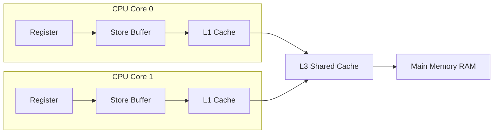
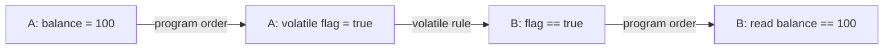
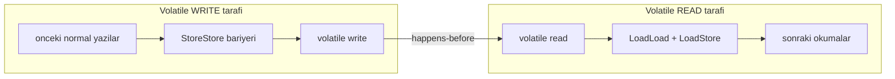
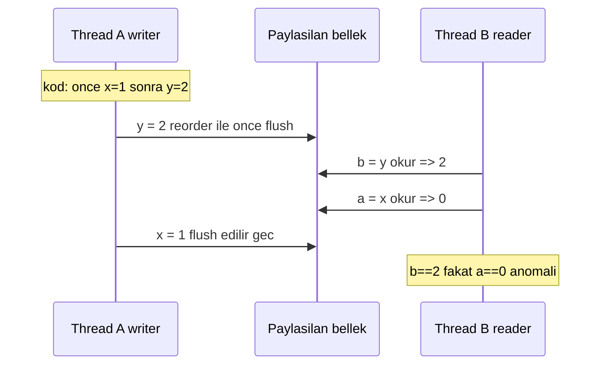

# Topic 3.1 — Java Memory Model (JMM) & Happens-Before

```admonish info title="Bu bölümde"
- Donanım gerçekliği: store buffer, cache hiyerarşisi ve stale read neden kaçınılmaz
- `happens-before` ilişkisinin yedi kuralı — ezber değil, mantıksal çıkarımla
- `volatile`'in tam olarak ne sağladığı (visibility + ordering) ve ne sağlamadığı (atomicity)
- Instruction reordering, memory barrier'lar ve MESI cache coherency somut örneklerle
- Banking visibility bug'ını reproduce etme ve `AtomicReference` + immutable record ile çözme
```

## Hedef

Java Memory Model'i (JMM) banking-grade seviyede kavramak. "Bir thread'in yazdığı değeri başka bir thread ne zaman ve hangi koşullarda görür?" sorusuna kesin cevap verebilmek. `happens-before` ilişkisinin yedi kuralını mantıksal olarak çıkarabilmek, `volatile`'in **ne sağladığını** ve özellikle **ne sağlamadığını** ayırt etmek. Cache coherency, instruction reordering ve memory barrier'ları concrete görmek; banking domain'inde gerçek bir visibility bug'ını reproduce edip çözebilmek.

## Süre

Okuma: 2.5-3 saat • Kendini Sına: 45 dk • Pratik (opsiyonel): 3-4 saat • Toplam: ~3 saat (+ pratik)

Bu Phase 3'ün en yoğun teorik topic'i. Acele etme; anlamadığın paragrafı bir kez daha oku, sonra koda dök.

## Önbilgi

- Phase 1 ve Phase 2 tamamlandı
- Java threading'in temel sözdizimi (`Thread`, `Runnable`, `start`, `join`) tanıdık
- "Race condition" terimi en azından duyulmuş (detay burada)
- Donanım perspektifi: CPU, L1/L2/L3 cache, RAM hiyerarşisi hakkında genel fikir

---

## Kavramlar

### 1. Memory Model neden var — donanım gerçekliği

Neden önemli: bir field'ın bir core'da yazılıp başka bir core'da okunması, sandığından çok daha az garantilidir. Sebep donanımın "saf tek RAM" modeli kullanmamasıdır — her core'un kendi register'ları, store buffer'ı ve L1/L2 cache'i vardır.



Bir thread bir field'a yazdığında olan sıra şudur:

1. Önce **register**'a yazar.
2. Sonra **store buffer**'a (asenkron, henüz cache'e bile değil).
3. Store buffer drain edilince **L1 cache**'e.
4. Cache coherency protokolü (MESI) diğer core'ların kopyasını invalidate eder.
5. Eventually RAM'e iner.

Tuzak: diğer thread aynı anda kendi register/cache'inden okuyorsa **eski değeri (stale read)** görür. Banking'de bu şuna dönüşür: bir thread transfer status'unu `COMPLETED` yaptı ama bilgi sorgulayan thread'in cache'ine ulaşmadı; müşteri ekranda hâlâ "beklemede" görür, panikleyip çağrı merkezini arar.

JMM işte bunu formalize eder: hangi koşullarda Thread B, Thread A'nın yazdığını **görmek zorundadır**.

### 2. Memory Model'in iki yüzü — visibility + ordering

JMM iki ayrı problemi çözer; ikisini karıştırmamak şart.

**a) Visibility (görünürlük):** Thread A'nın yazdığı değer Thread B'ye ne zaman görünür? Aşağıdaki `set`/`get` çifti hiçbir senkronizasyon içermiyor:

```java
class BalanceHolder {
    private long balance = 0;
    public void set(long v) { balance = v; }   // Thread A
    public long get() { return balance; }      // Thread B
}
```

`set(100)` çağrısından sonra Thread B'nin `get()`'i **0 döndürebilir** — spec'e göre sonsuza kadar bile. Bu donanım hatası değil, dilin izin verdiği davranış.

**b) Ordering (sıralama):** İki thread'in gözlediği olay sırası ne kadar tutarlı? Klasik flag+value örneği:

```java
class FlagAndValue {
    int value = 0;
    boolean ready = false;
    void writer() {
        value = 42;       // (1)
        ready = true;     // (2)
    }
    void reader() {
        if (ready) {                    // (3)
            System.out.println(value);  // (4)
        }
    }
}
```

Naif beklenti: `reader` `ready=true` görürse `value=42` görür. JMM yeterli senkronizasyon yoksa bu garantiyi vermez; çünkü compiler `(1)`-`(2)`'yi swap'layabilir, CPU out-of-order çalıştırabilir, store buffer farklı sırada flush edebilir. Sonuç: <mark>reader `ready=true` görüp `value=0` okuyabilir</mark> — öğrenmesi en zor concurrency tuzaklarından biri.

### 3. Happens-Before — JMM'in çekirdek kavramı

**Happens-before** iki memory operasyonu arasındaki ilişkidir. "A happens-before B" demek: A'nın yazdıkları B'ye görünür, ve A, B'den önce gerçekleşmiş gibi muamele edilir. Bu salt zamansal "önce-sonra" değil — **görünürlük + sıra garantisi**.

<mark>Happens-before ilişkisi yoksa iki thread arasında hiçbir görme garantisi yoktur.</mark> Aşağıdaki yedi kural (biri deprecated) bu ilişkiyi kurmanın tek yoludur.

**3.1 Program order rule.** Aynı thread içindeki ifadeler program sırasına göre happens-before'dur:

```java
void method() {
    int a = 1;      // A
    int b = 2;      // B
    int c = a + b;  // C
}
```

A ⟶ B ⟶ C (geçişli). Compiler reorder etse bile tek-thread'de **gözlenebilir sonuç değişmez**. Ama bu garanti sadece kendi thread'i için; başka thread gözlüyorsa ek senkronizasyon olmadan reorder'lar sızar.

**3.2 Monitor lock rule (synchronized).** Bir `synchronized` block'unun unlock'u, aynı monitor'a sonradan giren thread'in lock'una happens-before'dur:

```java
class Counter {
    private int count = 0;
    public synchronized void increment() { count++; }  // Thread A
    public synchronized int read() { return count; }   // Thread B
}
```

A release eder, B acquire eder → release happens-before acquire → A'nın yazdığı her şey B'ye görünür.

**3.3 Volatile rule.** Bir `volatile` field'a yazma, aynı field'ı sonradan okuyan her thread'e happens-before'dur. `ready`'yi volatile yaparsak Section 2'nin bug'ı kapanır:

```java
class FlagAndValue {
    int value = 0;
    volatile boolean ready = false;
    void writer() {
        value = 42;    // (1)
        ready = true;  // (2) volatile write
    }
    void reader() {
        if (ready) {              // (3) volatile read
            assert value == 42;   // ✓ artık garanti
        }
    }
}
```

Volatile write `(2)` happens-before volatile read `(3)`. Kilit nokta **piggyback** etkisidir: volatile field, kendisinden önceki tüm normal yazıları (`value = 42` dahil) taşır ve reader'a görünür yapar.

**3.4 Thread start rule.** `thread.start()` çağrısı, başlatılan thread'in ilk aksiyonuna happens-before'dur. `start()` öncesi yazdığın her şey yeni thread'e görünür:

```java
int shared = 0;
Thread t = new Thread(() -> System.out.println(shared));  // garantili 42
shared = 42;
t.start();  // start happens-before run()
```

**3.5 Thread termination rule (join).** Bir thread'in `run()` bitişi, `thread.join()` döndüğüne happens-before'dur:

```java
final int[] result = new int[1];
Thread t = new Thread(() -> result[0] = compute());
t.start();
t.join();
System.out.println(result[0]);  // garantili compute() sonucu
```

**3.6 Interruption rule.** `thread.interrupt()`, hedefin interrupt'ı fark ettiği noktaya (örn. `Thread.interrupted()` true dönmesi, `InterruptedException`) happens-before'dur.

**3.7 Finalizer rule (deprecated).** Object constructor'ının bitişi, finalizer'ının başlangıcına happens-before'dur. Modern Java'da `finalize()` deprecated — bu kuralı pratikte göz ardı et.

**3.8 Transitivity.** A ⟶ B ve B ⟶ C ise A ⟶ C. Banking'de en çok kullandığın kombinasyon budur: program order + volatile rule + program order zinciri.



### 4. `volatile` — visibility + ordering ama atomicity DEĞİL

Neden önemli: `volatile`'i "her şeyi thread-safe yapan sihir" sanan çok junior var; sınırını bilmek para kaybını önler.

**a) Görünürlük:** yazılan değer anında tüm thread'lere görünür (cache flush + invalidation). **b) Ordering:** volatile write'tan önceki yazılar öteye, volatile read'den sonraki okumalar beriye reorder edilmez. **c) Atomicity YOK:** işte kritik sınır burada.

```admonish warning title="volatile atomicity sağlamaz"
`volatile int count; count++;` atomik değildir. `count++` üç adımdır: read, increment, write. İki thread aynı anda `5` okur, ikisi de `6` yazar; bir artış kaybolur. Read-modify-write gerektiren her şey için `AtomicInteger`/`AtomicLong` veya `synchronized` kullan.
```

`volatile`'in doğru kullanımı: **tek yazar, çok okuyucu** ya da **bayrak**. Graceful shutdown bunun ders kitabı örneği:

```java
class GracefulShutdown {
    private volatile boolean shutdown = false;
    public void requestShutdown() { shutdown = true; }   // controller thread
    public void run() {
        while (!shutdown) { processNextTask(); }         // worker thread
    }
}
```

`shutdown` volatile olmasaydı worker kendi cache'inde `false` okumaya devam eder, **sonsuza kadar dönerdi**. Banking'de aynı hatanın para kaybettiren hali:

```java
class AccountBalanceHolder {
    private volatile long balance = 0;
    public void deposit(long amount) {
        balance += amount;  // ❌ ATOMIC DEĞİL — read-modify-write
    }
}
```

1000 thread eş zamanlı `deposit` çağırınca balance **kaybolan transfer'ler** içerir; `volatile` yetmez. Bir de tip davranışı notu: `volatile long`/`volatile double` her zaman atomic read/write'tır; non-volatile `long`/`double` 32-bit JVM'de iki yarımda yazılabilir (nadir ama spec'te var).

### 5. Memory barrier'lar — donanım perspektifi

`happens-before` JVM soyutlamasıdır; altında **memory barrier (fence)** denen CPU enstrüksiyonları yatar. JVM dört tip kullanır (JSR-133 cookbook):

| Barrier | İşlevi |
|---|---|
| `LoadLoad` | Sonraki load'lar önceki load'lardan **sonra** yapılır |
| `StoreStore` | Sonraki store'lar önceki store'lardan **sonra** yapılır |
| `LoadStore` | Sonraki store'lar önceki load'lardan **sonra** yapılır |
| `StoreLoad` | Sonraki load'lar önceki store'lardan **sonra** yapılır (en pahalı) |

Volatile write öncesine `StoreStore`, sonrasına `StoreLoad`; volatile read sonrasına `LoadLoad` + `LoadStore` emit edilir. `synchronized` enter'da acquire fence, exit'te release fence çalışır. İki thread arasında bariyerlerin nasıl köprü kurduğu:



Tuzak (platform bağımlılığı): x86_64 TSO (Total Store Ordering) sayesinde bu bariyerlerin çoğu **zaten implicit**; sadece `StoreLoad` explicit (`MFENCE`). ARM ve POWER daha gevşektir.

```admonish warning title="x86'da çalışan kod ARM'de patlayabilir"
Bir Java programı x86'da (Intel/AMD) bug göstermezken, ARM'de (Apple Silicon, AWS Graviton production server'lar) aynı kod **race'e düşebilir** — çünkü gevşek memory ordering implicit bariyerleri vermez. Çözüm: donanıma değil, JMM'e göre yaz; volatile/synchronized/atomic ile platform-bağımsız doğru kod üret.
```

### 6. Cache coherency — MESI protokolü kısaca

Neden önemli: false sharing gibi performans tuzaklarını ve invalidation maliyetini ancak MESI'yi bilirsen fark edersin. Modern CPU'lar cache line'ların (tipik 64 byte) state'ini takip eder; **MESI** dört state tanımlar:

- **M**odified — bu core'da değişmiş, RAM'e yazılmamış, tek kopya
- **E**xclusive — sadece bu core'da, değişmemiş
- **S**hared — birden fazla core'da, değişmemiş
- **I**nvalid — geçersiz

Core 0 bir cache line'a yazınca MESI diğer core'lardaki kopyaları **Invalid** yapar; diğer core okuyunca cache miss alıp günceli ister. **False sharing tuzağı:** iki farklı değişken aynı cache line'a düşerse biri değişince diğerinin core'unda gereksiz invalidation tetiklenir.

```java
class FalseSharing {
    long a;   // cache line 1, offset 0
    long b;   // cache line 1, offset 8
}
```

Thread A `a`'ya, Thread B `b`'ye yazıyorsa mantıken bağımsız ama aynı cache line üzerinde yarışırlar. Çözüm padding: `@jdk.internal.vm.annotation.Contended` (JDK internal) veya manuel padding. Banking'de `LongAdder` (Topic 3.2) tam olarak `Striped64` ile bu false sharing'i önlemek için padding yapar.

### 7. Instruction reordering — derleyici ve CPU iş birliği

Spec, derleyici ve CPU'ya **tek-thread davranışını koruduğu sürece** reorder izni verir ("as-if-serial"). `int c = a + b` için `readField2()`'yi `readField1()`'den önce çağırmak tek thread'de fark etmez. Multi-thread'de ise gözlemlenebilir hale gelir:

```java
class WriteOrdering {
    int x = 0, y = 0;
    void writer() {   // Thread A
        x = 1;
        y = 2;
    }
    void reader() {   // Thread B
        int b = y;
        int a = x;
        if (b == 2 && a == 0) { /* writer'ın yarısı görüldü mü? */ }
    }
}
```

Reader gerçekten `b==2` görüp `a==0` görebilir; çünkü writer'ın atamaları veya reader'ın okumaları reorder edilebilir.



Banking'de bu şuna dönüşür: bir thread `account.balance = newBalance; account.lastUpdated = now;` yazar, başka thread `if (account.lastUpdated > X) check(account.balance);` yapar ve **eski balance** okur. Çözüm her zaman aynı: volatile, synchronized veya lock ile reorder'ları kısıtla.

### 8. Final field semantics — safe publication

`final` field için JMM özel garanti verir: bir object'in constructor'ı bittiğinde, `final` field'ların değerleri — object'in referansını gören her thread için — görünürdür. Ekstra senkronizasyon gerekmez.

```java
class ImmutableAccount {
    private final long id;
    private final long openingBalance;
    public ImmutableAccount(long id, long openingBalance) {
        this.id = id;
        this.openingBalance = openingBalance;
    }
}
```

Bu object'i yaratıp referansını başka thread'e güvenli geçirirsen (volatile field, `BlockingQueue`, `ConcurrentHashMap`), o thread `id` ve `openingBalance`'ı doğru okur.

```admonish warning title="Constructor'da this sızdırma garantiyi bozar"
Constructor daha bitmeden `this` referansını dışarı verirsen (örn. `someStaticMap.put(id, this)` ya da `bus.register(this)` constructor içinde), **final field görünürlük garantisi bozulur** ve yarı-construct edilmiş object başka thread'e açılır. Doğrusu: nesneyi factory method'da tamamen kurup öyle publish et.
```

Banking pratiği: `Money`, `AccountId`, `Transfer` gibi value object'lerini `record` yap. Record'ların tüm field'ları implicit `final`, yani JMM safe publication garantisi otomatik gelir.

### 9. Double-checked locking ve volatile

Klasik DCL pattern'i lazy singleton için yazılır ama volatile olmadan **bozuktur**:

```java
class FxRateService {
    private static FxRateService instance;   // ❌ volatile yok
    public static FxRateService getInstance() {
        if (instance == null) {                          // 1st check
            synchronized (FxRateService.class) {
                if (instance == null) {                  // 2nd check
                    instance = new FxRateService();      // ❌ broken
                }
            }
        }
        return instance;
    }
}
```

Sorun: `instance = new FxRateService()` üç adımdır — memory allocate, constructor çalıştır, referans ata. Compiler bunu 1-3-2 sıralayabilir; başka thread `instance != null` görüp **yarı-construct edilmiş** object'i kullanır. Düzeltme tek satır:

```java
private static volatile FxRateService instance;
```

`volatile`, `instance` write'ından önceki tüm yazıları (constructor'daki tüm field assignment'ları) görünür yapar ve reorder'ı engeller. Modern Java'da singleton için ya `enum` (en güvenli) ya da Spring bean kullan; DCL yine de bilinmesi gereken klasik tuzak.

### 10. Banking visibility bug — concrete reproduction

Şimdi teoriyi çalışır bir bug'a dökelim. Aşağıdaki holder, iki field'ı da `volatile` yapmadan tutuyor — hem visibility hem ordering açık:

```java
public class BalanceCheckBug {
    private long balance = 1000;               // ❌ volatile yok
    private boolean overdraftEnabled = false;  // ❌ volatile yok

    public void enableOverdraft() {
        balance = -500;
        overdraftEnabled = true;
    }

    public boolean canWithdraw(long amount) {
        if (overdraftEnabled) return true;
        return balance >= amount;
    }
}
```

`main` içinde bir reader thread `canWithdraw`'ı döngüde çağırır, main thread 500 ms sonra `enableOverdraft()` yapar. x86'da bu çoğu zaman çalışır (TSO), ama ARM'de reader **sonsuza takılabilir**. Daha kötüsü JIT: HotSpot, `overdraftEnabled`'ın değişmeyeceğini varsayıp okumayı **loop dışına hoist** edebilir; döngü fiilen `while (true)` olur ve hiç çıkmaz.

<details>

<summary>Tam kod: BalanceCheckBug reproduction (~45 satır)</summary>

```java
package com.mavibank.banking.bug;

public class BalanceCheckBug {

    private long balance = 1000;               // ❌ volatile yok
    private boolean overdraftEnabled = false;  // ❌ volatile yok

    public void enableOverdraft() {
        balance = -500;
        overdraftEnabled = true;
    }

    public boolean canWithdraw(long amount) {
        if (overdraftEnabled) {
            return true;
        }
        return balance >= amount;
    }

    public static void main(String[] args) throws InterruptedException {
        var holder = new BalanceCheckBug();

        Thread reader = new Thread(() -> {
            int iterations = 0;
            while (true) {
                iterations++;
                if (holder.canWithdraw(2000)) {
                    System.out.println("Iteration " + iterations +
                        ": canWithdraw=true, balance=" + holder.balance +
                        ", overdraft=" + holder.overdraftEnabled);
                    return;
                }
            }
        });
        reader.start();

        Thread.sleep(500);  // reader döngüye girsin
        holder.enableOverdraft();

        reader.join(5000);
        if (reader.isAlive()) {
            System.out.println("Reader hâlâ döngüde — visibility bug!");
            reader.interrupt();
        }
    }
}
```

</details>

En basit düzeltme iki field'ı da `volatile` yapmak (ya da her şeyi tek `synchronized` block'a almak):

```java
private volatile long balance = 1000;
private volatile boolean overdraftEnabled = false;
```

Ama daha temiz banking yaklaşımı, iki field'ı bir immutable `record`'da paketleyip `AtomicReference` ile değiştirmektir — böylece balance ve overdraftEnabled her zaman **tutarlı snapshot** olarak okunur:

```java
public class BalancePolicy {
    private final AtomicReference<State> state =
        new AtomicReference<>(new State(1000, false));

    private record State(long balance, boolean overdraftEnabled) {}

    public void enableOverdraft() {
        state.set(new State(-500, true));
    }

    public boolean canWithdraw(long amount) {
        var s = state.get();
        return s.overdraftEnabled() || s.balance() >= amount;
    }
}
```

`AtomicReference` volatile-gibi davranır; immutable `State` sayesinde iki field asla yarı-güncel görülmez.

### 11. Anti-pattern'ler

Mülakatta "bu kodun nesi yanlış?" sorusunun cephaneliği. Beş klasik:

**1 — Bağımlı iki volatile field.** `volatile long balance; volatile long lastUpdated;` iki bağımsız volatile'dır; reader balance'ı güncel görürken lastUpdated'ı eski görebilir, **tutarlılık garantisi yoktur**. Çözüm: ikisini `record State(long balance, long lastUpdated)` içine koy, `AtomicReference<State>` ile değiştir.

**2 — Volatile counter ile increment.** `volatile int count; count++;` — read-modify-write atomik değil. `AtomicInteger` veya `synchronized` kullan.

**3 — Constructor'da `this` sızdırma.** `bus.register(this)` constructor içinde çağrılırsa yarı-construct nesne dışarı açılır:

```java
public static Account create(EventBus bus) {
    var a = new Account();   // önce tamamen kur
    bus.register(a);         // sonra publish et
    return a;
}
```

**4 — `synchronized`'i sadece yazana koymak.** Yazan `synchronized`, okuyan değilse reader eski değeri görebilir:

```java
class WrongBalance {
    private long balance;
    public synchronized void deposit(long a) { balance += a; }
    public long getBalance() { return balance; }   // ❌ visibility yok
}
```

Read tarafına da `synchronized` koy veya field'ı `volatile` yap.

**5 — Publication'sız lazy init.** Section 9'daki volatile'sız DCL. Çözüm `volatile` veya `enum singleton`.

### 12. JMM ve modern Java

**`record`:** all-final by design → safe publication otomatik. `Money`, `Transfer`, `JournalEntry` hep record olmalı. **Sealed classes:** concurrency garantisi getirmez, sadece type system; JMM açısından normal class. **Virtual threads (Topic 3.7):** JMM aynen geçerli — volatile, synchronized, atomic hepsi virtual thread'de aynı semantiğe sahiptir.

---

## Önemli olabilecek araştırma kaynakları (kuralın gereği: senin için keyword, kendin bul)

- "JSR-133 Java Memory Model and Thread Specification"
- "JSR-133 Cookbook for Compiler Writers" — Doug Lea
- "Java Concurrency in Practice" — Brian Goetz (özellikle Chapter 3 ve 16)
- "Java Memory Model Pragmatics" — Aleksey Shipilev
- Shipilev — "Close encounters of the Java Memory Model kind" (talk)
- "The Java Language Specification" Chapter 17
- jcstress (Java Concurrency Stress Tests) — OpenJDK
- "Memory Barriers: a Hardware View for Software Hackers" — Paul McKenney
- "What every systems programmer should know about concurrency" — Matt Kline
- Aleksey Shipilev blog (shipilev.net) — JMM, volatile, fence örnekleri

---

## Kendini Sına

Aşağıdaki soruları önce **cevaba bakmadan** kendi cümlelerinle yanıtlamayı dene — hepsi concurrency mülakatlarında karşına çıkabilecek tarzda. Takıldığın yerde ilgili Kavramlar başlığına dön, sonra tekrar dene.

**S1. Happens-before ilişkisi tam olarak neyi garanti eder ve olmadığında ne olur? Bir örnekle transitivity'yi göster.**

<details>

<summary>Cevabı göster</summary>

Happens-before iki garantiyi birden verir: **görünürlük** (A'nın yazdıkları B'ye görünür) ve **sıra** (A, B'den önce olmuş gibi muamele edilir). Salt zamansal "önce çalıştı" demek değildir; iki thread arasında bu ilişki kurulmamışsa B, A'nın yazdığını hiç görmeyebilir — spec'e göre sonsuza kadar bile.

Transitivity örneği: Thread A `balance = 100` (program order) → `volatile flag = true` (volatile write). Thread B `flag == true` görür (volatile read) → `read balance` (program order). Zincir: program order + volatile rule + program order = A'nın balance yazısı B'ye görünür. Bu piggyback, JMM'de en sık kullandığın kalıptır.

</details>

**S2. `volatile` bir field için tam olarak neyi sağlar, neyi sağlamaz? `volatile int count; count++;` neden hâlâ race condition?**

<details>

<summary>Cevabı göster</summary>

Sağladıkları: **visibility** (yazılan değer anında tüm thread'lere görünür, cache flush + invalidation) ve **ordering** (volatile write öncesi yazılar öteye, volatile read sonrası okumalar beriye reorder edilmez). Sağlamadığı: **atomicity**.

`count++` tek bir işlem gibi görünse de üç adımdır: read, increment, write. Volatile her adımı görünür yapar ama üçünü bölünmez kılmaz. İki thread aynı anda `5` okuyup ikisi de `6` yazabilir; bir artış kaybolur. Read-modify-write için `AtomicInteger` (CAS tabanlı) veya `synchronized` gerekir. Kural: volatile sadece **tek yazar + çok okuyucu** ya da **bayrak** senaryosunda yeterlidir.

</details>

**S3. Yeterli senkronizasyon olmadan reader, `ready=true` görüp `value=0` görebilir mi? Neden, ve nasıl engellenir?**

<details>

<summary>Cevabı göster</summary>

Evet, görebilir. İki bağımsız sebep var: **compiler/CPU reordering** — writer'ın `value=42` ve `ready=true` yazıları as-if-serial kuralı bozulmadan swap'lanabilir (tek thread'de fark etmez); ya da reader tarafındaki okumalar reorder edilebilir. **Cache/store buffer** — yazılar farklı sırada flush olabilir. Sonuç: reader bayrağı set görür ama korumaya çalıştığı veriyi eski görür.

Engellemek için `ready`'yi `volatile` yaparsın: volatile write happens-before volatile read olur ve piggyback ile `value=42` de reader'a taşınır. Alternatifler: her iki erişimi `synchronized` ile sarmak veya iki değeri immutable bir record'a koyup `AtomicReference` ile atomik publish etmek.

</details>

**S4. Double-checked locking'de `volatile` neden zorunlu? Olmadığında hangi somut hata oluşur?**

<details>

<summary>Cevabı göster</summary>

`instance = new FxRateService()` atomik değildir: memory allocate, constructor çalıştır, referansı ata — üç adım. Compiler/CPU bunu allocate-ata-construct sırasına reorder edebilir. Böyle bir reorder'da `instance` alanı **non-null** olur ama constructor henüz bitmemiştir; ilk `if (instance == null)` kontrolünü lock'suz geçen başka bir thread yarı-construct edilmiş object'i alır ve kullanır.

`volatile`, `instance` write'ından önceki tüm yazıların (constructor'daki tüm field assignment'ları) görünür olmasını ve reorder edilmemesini garanti eder. Modern Java'da bu tuzağı tamamen atlatmak için ya `enum singleton` ya da container-managed Spring bean tercih edilir.

</details>

**S5. Aynı Java kodu x86 sunucuda çalışırken ARM (Apple Silicon / AWS Graviton) sunucuda race'e düşüyor. Neden, ve doğru yaklaşım nedir?**

<details>

<summary>Cevabı göster</summary>

Fark memory ordering modelinden gelir. x86 **TSO (Total Store Ordering)** kullanır; birçok memory bariyeri donanımda implicit olduğundan senkronizasyon eksikliği çoğu zaman görünmez kalır — kod "şans eseri" doğru çalışır. ARM ve POWER daha **gevşek (weakly ordered)**; store'lar ve load'lar çok daha serbestçe reorder olur, o yüzden eksik bariyerler gerçek anomaliye dönüşür.

Doğru yaklaşım: donanımın verdiği implicit garantilere değil, **JMM'e göre** yazmak. volatile/synchronized/atomic ile happens-before'u açıkça kurarsan JVM her platformda gereken bariyeri (x86'da genelde ucuz, ARM'de explicit) emit eder ve kod platform-bağımsız doğru olur.

</details>

**S6. İki bağımsız `volatile` field (`balance`, `lastUpdated`) tutmanın problemi nedir? Nasıl düzeltirsin?**

<details>

<summary>Cevabı göster</summary>

Her field ayrı ayrı visibility/ordering garantisine sahiptir ama **aralarında atomiklik yoktur**. Reader, writer'ın yeni yazdığı `balance`'ı görürken henüz güncellenmemiş `lastUpdated`'ı (veya tersi) okuyabilir — yani tutarsız bir ara-state yakalar. Banking'de "yeni balance ama eski timestamp" yanlış kararlara yol açar.

Çözüm: iki değeri tek bir immutable `record State(long balance, long lastUpdated)` içine koyup `AtomicReference<State>` ile değiştirmek. `state.get()` her zaman **tutarlı bir snapshot** döndürür; `updateAndGet`/`compareAndSet` ile atomik geçiş yaparsın. Record'un all-final olması safe publication'ı da otomatik verir.

</details>

**S7. Final field semantics ne garanti eder ve neden banking value object'leri `record` olmalı? Bu garantiyi ne bozar?**

<details>

<summary>Cevabı göster</summary>

JMM'e göre bir object'in constructor'ı bittiğinde `final` field'larının değerleri, o object'in referansını gören her thread için ekstra senkronizasyon olmadan görünürdür (safe publication). Bu yüzden `Money`, `AccountId`, `Transfer` gibi value object'leri `record` yapmak idealdir: record'ların tüm field'ları implicit `final` olduğu için garanti otomatik gelir.

Garantiyi bozan tek şey **constructor'dan `this` sızdırmaktır** — constructor daha bitmeden `this`'i bir static map'e koymak, event bus'a register etmek veya bir listener'a vermek. O anda başka thread yarı-construct edilmiş nesneyi görür ve final garantisi geçersizleşir. Doğrusu: nesneyi factory method'da tamamen kurup öyle publish etmek.

</details>

---

## Tamamlama kriterleri

- [ ] Happens-before'un yedi kuralını (biri deprecated) sırayla sayabiliyorum
- [ ] `volatile`'in **ne sağladığını** (visibility + ordering) ve **ne sağlamadığını** (atomicity) ayrı ayrı söyleyebiliyorum
- [ ] `count++`'ın volatile ile neden hâlâ race olduğunu açıklayabiliyorum
- [ ] Memory barrier'ların 4 tipini (LoadLoad/StoreStore/LoadStore/StoreLoad) ve en pahalısını tanıyorum
- [ ] Final field semantics + safe publication kavramını ve `this` sızdırma tuzağını açıklayabiliyorum
- [ ] DCL pattern'inde volatile'in neden zorunlu olduğunu biliyorum
- [ ] Instruction reordering'in iki thread'de yarattığı anomaliyi (`b==2 && a==0`) örnekle anlatabiliyorum
- [ ] İki bağımsız volatile yerine `AtomicReference<record>` ile tutarlı snapshot'ı gerekçelendirebiliyorum
- [ ] Cache coherency MESI'yi ve false sharing'i en azından bir cümleyle anlatabiliyorum
- [ ] (Opsiyonel) "Pratik yapmak istersen" bölümündeki bug'ı reproduce ettim ve stress test'i geçen holder'ı yazdım

Hepsi onaylı → Topic 3.2'ye geç → [02-synchronization-primitives/](../02-synchronization-primitives/index.md)

---

## Defter notları (kendi cümlelerinle doldur)

1. "Java Memory Model'in çözdüğü iki ana problem ____ ve ____. Birincisi ____, ikincisi ____."
2. "Happens-before ilişkisinin pratik anlamı şu: ____. Bu olmadan ____ olur."
3. "Volatile write'ın yaptıkları: ____. Yapmadıkları: ____."
4. "synchronized release happens-before synchronized acquire — bu bana ____ garantisi verir."
5. "DCL pattern'inde volatile olmadan ____ problemi olur çünkü ____."
6. "Memory barrier'ların 4 tipinden en pahalısı ____ çünkü ____."
7. "Cache coherency MESI'nin temel fikri ____. False sharing ____ demek."
8. "Final field semantics bana ____ garantisi verir, bu yüzden record kullanmak ____."
9. "İki bağımsız volatile field tutmanın problemi ____. Çözüm: ____."
10. "Banking'de visibility bug'ının iş etkisi: ____ ve ____."

```admonish success title="Bölüm Özeti"
- JMM iki problemi çözer: **visibility** (bir yazı diğer thread'e ne zaman görünür) ve **ordering** (gözlenen olay sırası); senkronizasyon yoksa ikisi de garantisizdir
- `happens-before` çekirdek kavramdır; yedi kuralın en çok kullandığın kombinasyonu program order + volatile/monitor rule + transitivity zinciridir
- `volatile` visibility + ordering verir ama **atomicity vermez** — `count++` ve `balance += x` hâlâ race'tir, `AtomicX`/`synchronized` gerekir
- Reordering gerçektir: reader `ready=true` görüp `value=0` okuyabilir; x86 TSO gizler, ARM (Graviton/Apple Silicon) ortaya çıkarır — JMM'e göre yaz, donanıma değil
- `final` field + `record` safe publication'ı otomatik verir; tek düşman constructor'da `this` sızdırmaktır
- Banking kalıbı: bağımlı state'i immutable `record` + `AtomicReference` ile tut → her okuma tutarlı snapshot, DCL için `volatile` veya `enum singleton`
```

---

## Pratik yapmak istersen

Kavramları koda dökmek istersen aşağıdaki iki ek hazır: test/deney rehberi visibility bug reproduction, bağımlı field tutarsızlığı, DCL ve `AtomicReference` snapshot davranışları için örnekler içerir; Claude-verify prompt'u ile yazdığın JMM kodunu banking-grade perspektiften denetletebilirsin. Önerilen atılabilir çalışma alanı: `~/projects/core-banking/concurrency-playground/` altında ayrı bir package.

<details>

<summary>Test ve deney rehberi</summary>

> Not: JMM bug'larını **deterministically test etmek zordur** — JIT, OS scheduling ve donanıma bağlıdır. Kesin sonuç için OpenJDK **jcstress** kullan; aşağıdakiler kavramı gözlemlemeye ve fix'i doğrulamaya yönelik.

### Deney 1 — Visibility bug reproduction + volatile fix

`boolean ready` field'ı (volatile **YOK**), worker `while (!ready) {}` döngüsünde, main 1 saniye uyuyup `ready = true` yapar; worker 5 saniyede çıkamazsa bug tetiklenmiştir.

```java
public class VisibilityBug {
    private static boolean ready = false;
    private static int value = 0;

    public static void main(String[] args) throws InterruptedException {
        Thread worker = new Thread(() -> {
            while (!ready) { /* spin */ }
            System.out.println("Worker saw ready=true, value=" + value);
        });
        worker.start();

        Thread.sleep(1000);
        value = 42;
        ready = true;

        worker.join(5000);
        if (worker.isAlive()) {
            System.out.println("BUG REPRODUCED: worker stuck despite ready=true");
            worker.interrupt();
        }
    }
}
```

`java -Xcomp VisibilityBug` ile çalıştır — `-Xcomp` JIT'i full-force devreye sokar, hoisting'i hızlandırır. Sonra `ready`'i `volatile boolean` yap; worker anında çıkmalı. İki output'u karşılaştır.

### Deney 2 — Bağımlı field tutarsızlığı → AtomicReference fix

İki volatile field (`balance`, `lastUpdated`), writer döngüde `balance = X; lastUpdated = now;` yazar, reader snapshot alıp `(balance, lastUpdated)` yazdırır. Reader bazen balance yeni ama lastUpdated eski (veya tersi) yakalar. Sonra ikisini `record State(long balance, long lastUpdated)` içine koyup `AtomicReference<State>` ile düzelt; artık her okuma tutarlı.

### Deney 3 — DCL singleton

volatile **olmadan** klasik double-checked locking yaz; singleton constructor'ında 100 ms sleep + `loaded = true` set et, 50 thread aynı anda `getInstance().isLoaded()` çağırsın. Yarı-construct gözlemi modern JVM'de zordur — spec'e güven, "bu hata teorik olarak neden mümkün?" sorusunu yaz. Sonra `volatile` ekleyerek düzelt.

### Deney 4 — Banking AccountSnapshot consistency

```java
public record AccountSnapshot(long balance, long version, Instant lastUpdated) {}

public class AccountSnapshotHolder {
    private final AtomicReference<AccountSnapshot> current;

    public AccountSnapshotHolder(AccountSnapshot initial) {
        this.current = new AtomicReference<>(initial);
    }

    public AccountSnapshot read() { return current.get(); }

    public void update(long newBalance) {
        current.updateAndGet(s -> new AccountSnapshot(
            newBalance, s.version() + 1, Instant.now()));
    }
}
```

10 writer + 10 reader thread, 5 saniye. Reader'ın gördüğü `version` ve `balance` her zaman **aynı snapshot'tan** gelmeli. Stress test ile version monotonicity'sini doğrula:

```java
@Test
void readersShouldAlwaysSeeConsistentSnapshot() throws Exception {
    var holder = new AccountSnapshotHolder(new AccountSnapshot(0, 0, Instant.now()));
    var stop = new AtomicBoolean(false);
    var violations = new AtomicInteger(0);
    var executor = Executors.newFixedThreadPool(8);

    for (int i = 0; i < 4; i++) {
        executor.submit(() -> {
            long counter = 0;
            while (!stop.get()) { holder.update(counter++); }
        });
    }
    for (int i = 0; i < 4; i++) {
        executor.submit(() -> {
            while (!stop.get()) {
                var s1 = holder.read();
                var s2 = holder.read();
                if (s2.version() < s1.version()) violations.incrementAndGet();
            }
        });
    }

    Thread.sleep(3000);
    stop.set(true);
    executor.shutdown();
    assertThat(executor.awaitTermination(5, TimeUnit.SECONDS)).isTrue();
    assertThat(violations.get()).isZero();
}
```

### Deney 5 — record safe publication

`AtomicReference<Money>` üzerinden bir record'u bir thread'den diğerine publish et; reader spin edip null olmayan referansı alınca alanların doğru okunduğunu doğrula. Record + AtomicReference yeterlidir; ek volatile/synchronized gerekmez.

```java
@Test
void recordIsSafelyPublished() throws Exception {
    var publisher = new AtomicReference<Money>();
    var reader = new Thread(() -> {
        Money m;
        while ((m = publisher.get()) == null) { /* spin */ }
        assertThat(m.amount()).isEqualByComparingTo("100.00");
        assertThat(m.currency().getCurrencyCode()).isEqualTo("TRY");
    });
    reader.start();

    Thread.sleep(10);
    publisher.set(Money.of("100.00", "TRY"));
    reader.join();
}
```

Tamamlama kriterleri (bu bölüm için):

- VisibilityBug'ı en az bir kez `-Xcomp` ile takıldı halde gözlemledim, volatile ile fix ettim
- InconsistentSnapshot'ı reproduce edip `AtomicReference<record>` ile düzelttim
- AccountSnapshotHolder'ı yazdım ve version-monotonicity stress test'i geçiyor
- record + AtomicReference'ın ek senkronizasyon olmadan safe publication verdiğini test ettim

</details>

<details>

<summary>Claude-verify prompt</summary>

```
Aşağıda Java Memory Model'i kavramaya yönelik kodum var. Lütfen şu kriterlere
göre değerlendir ve EKSİKLERİ söyle, kod yazma:

1. VisibilityBug reproduction:
   - `ready` field'ı volatile DEĞİL mi (kasten)?
   - Worker thread'in döngüsü hoisting'e açık mı?
   - `-Xcomp` veya yeterli iterasyonla JIT'in optimize edebileceği yapı kuruldu mu?
   - Bug reproduce eden ve volatile ile fix eden iki ayrı versiyon var mı?

2. InconsistentSnapshot:
   - İki bağımsız volatile field kullanılmış mı (kasten yanlış)?
   - Reader'ın iki field'ı atomic olmayan biçimde okuduğu gözlemlenmiş mi?
   - AtomicReference<record> ile düzeltme yapılmış mı?
   - Record kullanılmış mı (final field semantics)?

3. AccountSnapshotHolder:
   - AtomicReference + immutable record kullanılmış mı?
   - updateAndGet veya compareAndSet ile state transition yapılmış mı?
   - Reader-writer stres testi yazılmış mı?
   - Test'te violation counter (version monotonicity) kontrolü var mı?

4. Happens-before anlayışı (kavram testi):
   - Volatile write happens-before volatile read kuralı açıklanabilir mi?
   - synchronized release/acquire happens-before açıklanabilir mi?
   - Thread.start happens-before run() kuralı var mı?
   - Transitivity örneği verilebilir mi?

5. Anti-pattern kontrolü:
   - volatile counter increment ile race condition gösterilmiş mi?
   - synchronized sadece yazana koyma anti-pattern'i fark edilmiş mi?
   - Constructor'da this leak örneği görülmüş mü?

6. Banking perspektifi:
   - Balance check + balance write race senaryosu reproduce edilmiş mi?
   - Volatile vs AtomicReference tradeoff'u anlaşılmış mı?

Her madde için PASS / FAIL / EKSIK işaretle. Kod yazma, sadece eksiklikleri söyle.
```

</details>
