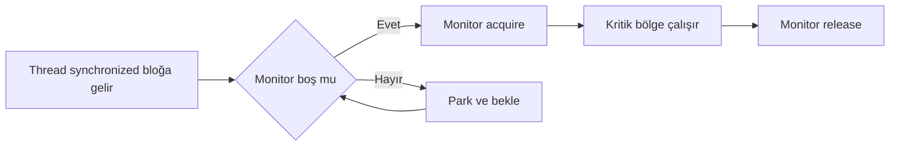
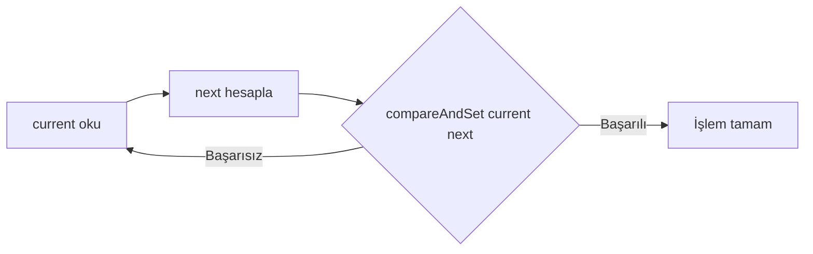
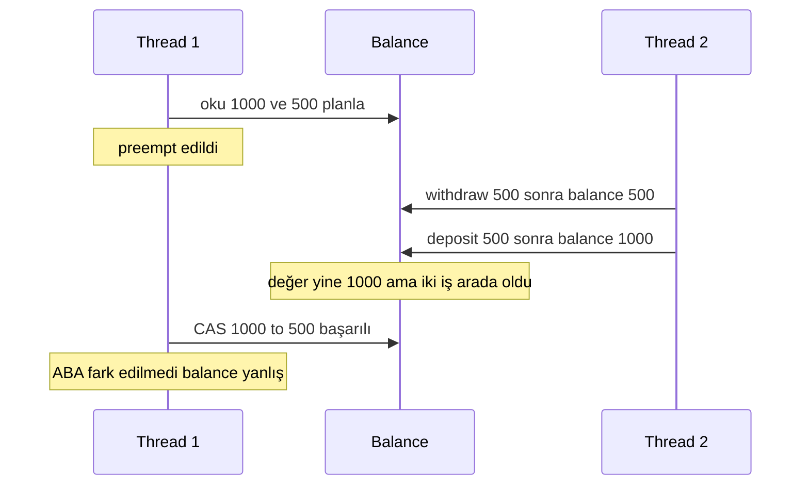
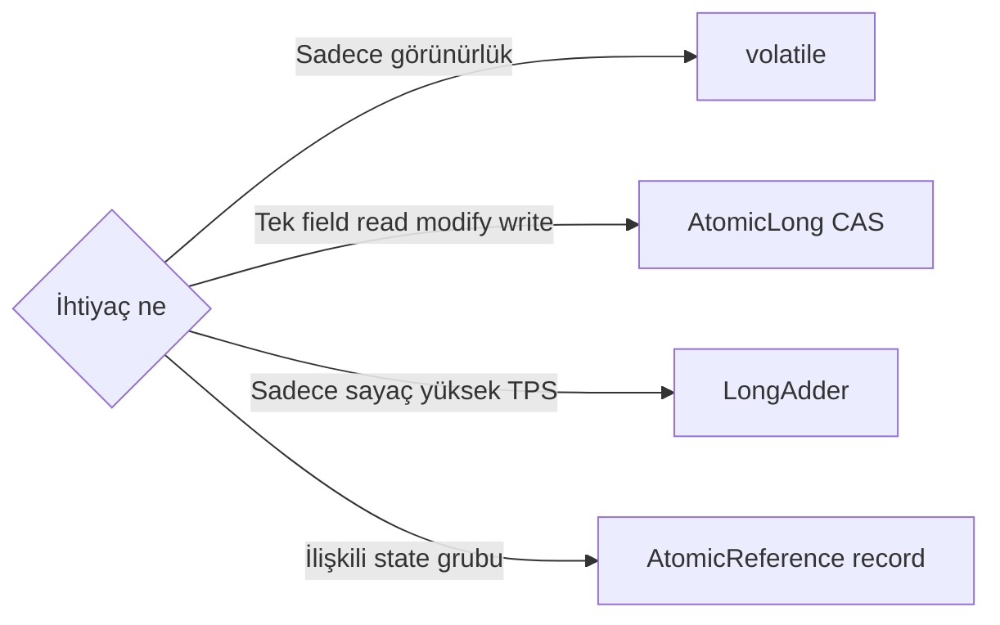

# Topic 3.2 — Synchronization Primitives: synchronized, volatile, Atomics, CAS

```admonish info title="Bu bölümde"
- `synchronized` monitor lock semantiği: acquire/release, reentrancy, memory fence ve biased locking'in neden kaldırıldığı
- `volatile`'in sınırı (atomicity yok) ve atomic class ailesi: `AtomicLong`, `AtomicReference`, FieldUpdater, `AtomicBoolean`
- CAS'ın donanım seviyesi mekaniği, CAS-loop pattern'i ve lock-free progress
- ABA problemi ve `AtomicStampedReference` / `AtomicMarkableReference` ile çözümü
- High-contention counter (`LongAdder`), `LockSupport.park/unpark` ve modern `VarHandle` API
```

## Hedef

Java'nın **temel senkronizasyon araçlarını** banking-grade derinlikte kavramak. `synchronized`'ın monitor lock semantiğini, `volatile`'in sınırlarını, atomic class ailesini (`AtomicInteger`, `AtomicLong`, `AtomicReference`, FieldUpdater), **CAS** (Compare-And-Swap) ve ABA problemini, `LongAdder`/`DoubleAdder`'ı, `LockSupport.park/unpark`'ı ve modern `VarHandle` API'sini öğrenmek. Bir **balance update race condition**'ını adım adım reproduce edip her primitivle çözmek.

## Süre

Okuma: 2.5 saat • Kendini Sına: 45 dk • Pratik (opsiyonel): 3-4 saat • Toplam: ~3 saat (+ pratik)

## Önbilgi

- Topic 3.1 (JMM, happens-before, volatile semantics) tamamlandı
- `BigDecimal`, `Money` value object'i (Phase 1)
- Spring Boot service'lerinde basit business logic yazabiliyorsun

---

## Kavramlar

### 1. `synchronized` — monitor lock derinlemesine

Kilitlemenin en temeli buysa, önce dilin kendi primitivesini tanı. `synchronized` Java'nın **dilden gelen** kilitleme aracıdır. Her object'in bir **intrinsic monitor** (mutex) vardır; block'a giren thread o monitor'u **acquire** eder, çıkarken **release** eder.

#### Kullanım formları

Üç biçimi de görmek, hangisini seçeceğine karar vermenin ön koşulu:

```java
class AccountSafe {
    private long balance;

    // Instance method'a sync: monitor = `this`
    public synchronized void deposit(long amount) {
        balance += amount;
    }

    // Static method'a sync: monitor = Class object
    public static synchronized void resetGlobalCounter() { /* ... */ }

    // Block sync: explicit monitor
    private final Object lock = new Object();
    public void slowDeposit(long amount) {
        synchronized (lock) {
            balance += amount;
        }
    }
}
```

Karşılaştırma:

- **Instance method**: en basit, ama monitor `this` olduğu için dışarıdan `synchronized (account) { ... }` ile aynı monitor'da yarış oluşturulabilir.
- **Static method**: monitor `Class` object'i; sınıfın tüm static çağrıları tek monitor'ı paylaşır. Genellikle istenmez.
- **Block + private final lock**: tercih edilen biçim. Dışarıdan çakışmaz, scope dar tutulur.

Banking pratiği: <mark>kritik kaynak başına kendi private final lock object'ini kullan, `this`'i asla lock yapma</mark> — dış kod yanlışlıkla aynı monitor'da bekler.

#### Reentrant özelliği

`synchronized` **reentrant**'tır: aynı thread sahip olduğu monitor'ı tekrar acquire edebilir, deadlock olmaz. İçeride bir lock count tutulur; her çıkış sayacı azaltır, sıfıra inince gerçekten release olur.

```java
class Reentrant {
    public synchronized void outer() {
        inner();  // aynı monitor reacquire — OK
    }
    public synchronized void inner() { /* ... */ }
}
```

#### Memory semantics (Topic 3.1 tekrar)

Monitor sadece kilit değil, aynı zamanda bir memory fence'tir. Block'a **giriş → acquire fence**: sonraki okumalar, önceki release'in yazdığı her şeyi görür. Block'tan **çıkış → release fence**: önceki yazılar flush edilir, sonraki acquire eden görür.

Yani `synchronized` **hem mutual exclusion hem visibility** sağlar; `volatile` sadece visibility. `synchronized` daha güçlü ama daha pahalıdır.

#### Biased locking (HISTORICAL — JDK 15+ kaldırıldı)

Bu bir mülakat klasiği, o yüzden tarihçesini bil. JDK 8-14 arası: aynı thread monitor'ı tekrar tekrar alıyorsa monitor "biased to that thread" işaretlenir, sonraki acquire'lar çok ucuz olurdu (CAS bile değil).

JDK 15'te `-XX:UseBiasedLocking` default kapatıldı, JDK 18'de tamamen kaldırıldı. Sebep: modern multi-thread iş yüklerinde bakım maliyeti faydadan büyük. Bugünkü uygulamalar contention'a karşı `ReentrantLock`, atomic veya lock-free yaklaşımlar kullanır.

#### Monitor implementation seviyeleri

JVM monitor'ı transparently üç seviyede yönetir; sen sadece `synchronized` yazarsın:

- **Biased lock** (kaldırıldı)
- **Lightweight lock**: contention yokken CAS ile object header'a thread ID yazılır
- **Heavyweight lock**: contention varsa OS-level mutex (futex / Mach kernel), thread'ler park'a alınır

Monitor'a giriş/çıkışın kavramsal akışı şöyle:



#### Ne zaman `synchronized`, ne zaman değil?

**Seç:** kısa kritik bölge (mikrosaniye) + low contention, kod basitliği önemli, reader-writer ayrımı yok.

**Seçme:** yüksek contention (`ReentrantLock`/atomic daha hızlı), lock timeout/interrupt gerek (`synchronized` desteklemez), reader ≫ writer (`ReentrantReadWriteLock`), tek field artırma (atomic), virtual thread + JDBC (Topic 3.7 — `synchronized` virtual thread'i carrier'a **pinler**).

### 2. `volatile` — tekrar ama derin

Topic 3.1'de gördün; burada pratik tuzaklara odaklanalım, çünkü en sık hata `volatile`'i atomicity sanmaktan doğar.

#### Atomicity'nin olmaması

`volatile` sadece yazma → görünürlük ve okuma → en güncel garantisi verir. Read-modify-write **atomik değildir**:

```java
volatile long counter;
counter++;  // ❌ read, increment, write — üç adım
```

İki thread aynı anda `counter=5` okur, ikisi de `6` yazar; bir artış kaybolur. <mark>Read-modify-write veya check-and-act için `volatile` yetmez, CAS şarttır</mark>.

#### Array ve compound check tuzakları

`volatile` bir array referansını volatile yapar, elemanları değil:

```java
volatile int[] arr;   // referans volatile, arr[i] değil
```

Eleman bazında atomicity için `AtomicIntegerArray` veya `VarHandle` kullan. Aynı şekilde `if (enabled) { enabled = false; ... }` gibi check-then-set atomic değildir — arada başka thread araya girer.

#### Nerede doğru kullanım

`volatile`'i tek-yazan / çok-okuyan ve tek-field senaryolarda kullan:

- **Flag (boolean)**: shutdown signal, config reload trigger
- **Configuration reference**: tek thread güncellet → `volatile Configuration config`
- **Sequence number**: TEK thread artırır, ÇOK thread okur
- **State machine state**: değişim tek field ise

### 3. Atomic class ailesi — `java.util.concurrent.atomic`

Kilitten kaçınmak istiyorsan giriş kapın bu paket. Tüm sınıflar **lock-free**'dir ve `compareAndSet` (altında `VarHandle`/`Unsafe` CAS) üzerine kuruludur.

#### `AtomicInteger` ve `AtomicLong`

Zengin bir atomik operasyon seti sunarlar:

```java
var counter = new AtomicLong(0);

counter.incrementAndGet();              // ++counter
counter.getAndIncrement();              // counter++
counter.addAndGet(5);                   // counter += 5
counter.compareAndSet(10, 20);          // if (counter == 10) counter = 20;
counter.updateAndGet(v -> v * 2);       // counter = f(counter) atomically
counter.accumulateAndGet(5, Long::sum); // counter = sum(counter, 5)
```

Banking örneği — atomic transfer counter'ları tek bir metric holder'da:

```java
public class TransferMetrics {
    private final AtomicLong successCount = new AtomicLong();
    private final AtomicLong failureCount = new AtomicLong();
    private final AtomicLong totalAmount = new AtomicLong();

    public void recordSuccess(long amountKurus) {
        successCount.incrementAndGet();
        totalAmount.addAndGet(amountKurus);
    }

    public void recordFailure() {
        failureCount.incrementAndGet();
    }

    public Snapshot snapshot() {
        return new Snapshot(successCount.get(), failureCount.get(), totalAmount.get());
    }

    public record Snapshot(long success, long failure, long total) {}
}
```

#### `AtomicReference<T>` — lock-free state holder

Referansa atomic CAS yapar; banking'de **immutable state holder** olarak çok değerlidir. `synchronized` olmadan lock-free bir debit yazmanı sağlar:

```java
public class AccountStateHolder {
    private final AtomicReference<AccountState> ref;

    public AccountStateHolder(AccountState initial) {
        this.ref = new AtomicReference<>(initial);
    }

    public boolean tryDebit(long amount) {
        while (true) {
            var current = ref.get();
            if (current.balance() < amount) return false;
            var next = current.withBalance(current.balance() - amount);
            if (ref.compareAndSet(current, next)) {
                return true;
            }
            // CAS fail → retry
        }
    }

    public record AccountState(long balance, long version) {
        AccountState withBalance(long newBalance) {
            return new AccountState(newBalance, version + 1);
        }
    }
}
```

Concurrent transfer'lar CAS ile yarışır; başarısız olan retry yapar. Pratik notlar:

- Retry loop'u **bounded** yapmak iyi olabilir (örn. max 1000 retry, sonra lock fallback).
- `updateAndGet(Function<T,T>)` aynı işi içinde retry ile yapar; daha kısa kod.
- Lambda **side-effect free** olmalı — CAS fail'de tekrar çağrılır.

#### Atomic array'ler

`AtomicIntegerArray`, `AtomicLongArray`, `AtomicReferenceArray` her eleman için atomicity verir:

```java
var slots = new AtomicLongArray(16);
slots.incrementAndGet(5);     // index 5
slots.compareAndSet(0, expected, newValue);
```

Banking'de örnek: ledger balance'ları için fixed-size cache. Dikkat, `getAndUpdate` **eski** değeri döner:

```java
public class AccountBalanceCache {
    private final AtomicLongArray balances;

    public AccountBalanceCache(int size) {
        this.balances = new AtomicLongArray(size);
    }

    public boolean tryDebit(int accountIdx, long amount) {
        return balances.getAndUpdate(accountIdx, b ->
            b >= amount ? b - amount : b
        ) >= amount;  // dönen değer ESKI balance; check ona göre
    }
}
```

(Production'da bu kadar primitif değil ama fikri gösteriyor.)

#### `AtomicReferenceFieldUpdater` / `AtomicLongFieldUpdater`

`AtomicReference` her field için ekstra wrapper allocation demektir. Var olan bir field'a atomic CAS yapmak istersen **FieldUpdater** allocation'dan kurtarır — field `volatile` olmak zorundadır:

```java
class Account {
    private volatile long balance;  // ← volatile zorunlu

    private static final AtomicLongFieldUpdater<Account> BALANCE_UPDATER =
        AtomicLongFieldUpdater.newUpdater(Account.class, "balance");

    public boolean tryDebit(long amount) {
        while (true) {
            long current = balance;
            if (current < amount) return false;
            if (BALANCE_UPDATER.compareAndSet(this, current, current - amount)) {
                return true;
            }
        }
    }
}
```

**Avantaj:** tek static updater milyon Account için yeter (memory tasarrufu). **Dezavantaj:** reflection kullanır, yanlış field ismi runtime'da patlar. Modern alternatif **`VarHandle`** (madde 8).

#### `AtomicBoolean` — tek-sefer garantisi

Singleton init veya "tek kez çalıştır" kontrolünde CAS'lı boolean idealdir:

```java
class OnceInitializer {
    private final AtomicBoolean initialized = new AtomicBoolean(false);

    public void initialize() {
        if (initialized.compareAndSet(false, true)) {
            doExpensiveInit();   // sadece BIR kez çalışır
        }
    }
}
```

```admonish tip title="Atomic seçim ipucu"
İlişkili birden çok değeri (balance + version + timestamp) tek bir `record` içine al ve `AtomicReference<record>` kullan. İki ayrı `AtomicLong` her biri atomiktir ama ikisi birlikte tutarlı okunmaz.
```

### 4. CAS (Compare-And-Swap) — donanım seviyesinde

Tüm lock-free dünyanın tek bir enstrüksiyona dayandığını görmeden atomic'leri gerçekten anlamış sayılmazsın. CAS, modern CPU'ların sağladığı **atomik talimattır**:

> "Bellek konumundaki değer X ise Y yaz, değilse yapma — tek atomik adımda."

x86 bunu `CMPXCHG` (multi-core için `LOCK CMPXCHG`), ARM `LDREX/STREX` çiftiyle yapar. Java'da `Atomic*.compareAndSet(expected, new)` doğrudan bu enstrüksiyona iner:

```
boolean cas(memory, expected, newValue) {
    atomic {
        if (memory == expected) {
            memory = newValue;
            return true;
        }
        return false;
    }
}
```

#### CAS-loop pattern

Tüm lock-free algoritmaların temeli budur: oku, hesapla, CAS; başarısızsa retry.

```java
long current;
do {
    current = atom.get();
    long next = compute(current);
} while (!atom.compareAndSet(current, next));
```

Başarısız CAS "**başka bir thread başarılı oldu**" demektir; yani en az bir thread her zaman ilerler — buna **lock-free progress** denir. Akış şöyle görünür:



#### Artı ve eksileri

**Artı:** lock yok → blocking, priority inversion, deadlock yok; yüksek contention'da bile bazı thread'ler ilerler; donanım hızında.

**Eksi:** high contention'da çok retry → CPU spinning; ABA problemi (sıradaki madde); read-modify-write tek field'la sınırlı; lock-free veri yapıları yazmak çok zordur.

### 5. ABA problemi ve `AtomicStampedReference`

CAS'ın ünlü tuzağı: bir değişken A→B→A olabilir ve CAS bunu fark etmez, çünkü sadece "**mevcut değer == beklenen**" kontrol eder. Klasik örnek lock-free stack:

```java
class LockFreeStack<T> {
    private final AtomicReference<Node<T>> head = new AtomicReference<>();

    public void push(T value) {
        var newNode = new Node<>(value);
        Node<T> oldHead;
        do {
            oldHead = head.get();
            newNode.next = oldHead;
        } while (!head.compareAndSet(oldHead, newNode));
    }

    public T pop() {
        Node<T> oldHead, newHead;
        do {
            oldHead = head.get();
            if (oldHead == null) return null;
            newHead = oldHead.next;
        } while (!head.compareAndSet(oldHead, newHead));
        return oldHead.value;
    }
}
```

**ABA senaryosu:** T1 `pop()` içinde `head=A`, `newHead=B` hesaplar, sonra preempt edilir. T2 A ve B'yi pop eder, sonra A'yı geri push eder (recycled). T1 uyanır, `compareAndSet(A, B)` **başarılı** olur — ama B artık geçersiz, stack korupte.

Aynı tuzak banking'de balance üzerinde de yaşanır:



**Çözüm — `AtomicStampedReference`:** değere bir version (stamp) ekle; her güncelleme stamp'i artırır, ABA artık yakalanır:

```java
var ref = new AtomicStampedReference<Node<T>>(initialHead, 0);

int[] stampHolder = new int[1];
var current = ref.get(stampHolder);
int currentStamp = stampHolder[0];

boolean success = ref.compareAndSet(current, newHead, currentStamp, currentStamp + 1);
```

Banking'de pratik çözümler: <mark>eş zamanlı balance güncellemesinde ya `version`'lı state ya da lock kullan</mark> — `AtomicStampedReference`, record içinde `version` field, `synchronized`/`ReentrantLock`, veya JPA `@Version` optimistic lock (Phase 2, distributed çözüm).

#### `AtomicMarkableReference` — alternatif

ABA'nın özel hâli: field'ı `(value, boolean marked)` olarak tut. Version yerine "deleted/active" flag; CAS hem değeri hem flag'i kontrol eder. Linked list'lerde node'u logical delete etmek için kullanılır.

### 6. `LongAdder`, `DoubleAdder` — high-contention counter

`AtomicLong.incrementAndGet()` yüksek contention'da yavaşlar, çünkü tüm thread'ler **aynı cache line**'a yarışır ve CAS retry'ları patlar. `LongAdder` çözümü değeri **birçok cell**'e böler (striped sum): her thread kendi cell'ine yazar, `sum()` hepsini toplar.

```java
var counter = new LongAdder();
counter.increment();
counter.add(5);
counter.sum();      // tüm cell'lerin toplamı
counter.reset();    // sıfırla
```

50k TPS'lik bir sistemde istatistik counter için idealdir:

```java
public class HighThroughputMetrics {
    private final LongAdder transferCount = new LongAdder();
    private final LongAdder failureCount = new LongAdder();
    private final DoubleAdder totalAmount = new DoubleAdder();  // dikkat: gerçek para long!

    public void recordTransfer(long amount) {
        transferCount.increment();
        totalAmount.add(amount);
    }

    public Snapshot snapshot() {
        return new Snapshot(transferCount.sum(), failureCount.sum(), totalAmount.sum());
    }
}
```

```admonish warning title="LongAdder ile check-and-act yapma"
`LongAdder.sum()` tutarlı ama point-in-time yaklaşık bir değerdir; kesin anlık snapshot vermez. Bu yüzden `if (balance.sum() >= amount) balance.add(-amount)` gibi check-then-act **yanlıştır** — overdraft'a yol açar. Sayaç (TPS, error count) için `LongAdder`; check + action (rate limiter, withdraw) için `AtomicLong` CAS veya `Semaphore`.
```

#### `LongAccumulator` / `DoubleAccumulator`

Generalize edilmiş Adder; custom combine function alır. Örneğin en uzun transfer süresi (latency monitoring):

```java
var maxLatency = new LongAccumulator(Long::max, 0);
maxLatency.accumulate(50);
maxLatency.accumulate(120);
maxLatency.accumulate(30);
maxLatency.get();  // 120
```

### 7. `LockSupport.park` ve `unpark`

`ReentrantLock`, `Semaphore`, `BlockingQueue` gibi yüksek seviye sınıfların altında ne olduğunu merak ediyorsan cevap burada. `LockSupport` **düşük seviye** thread durdurma/uyandırma primitivesidir:

```java
LockSupport.park();                  // mevcut thread'i parka al
LockSupport.unpark(thread);          // belirli thread'i uyandır
LockSupport.parkNanos(100_000_000);  // 100ms timeout
```

Anahtar kavram **permit modeli**: her thread'in 0 veya 1 permit'i vardır. `unpark` permit'i 1 yapar; `park` permit varsa hemen alır (parka girmez), yoksa bekler. Bu yüzden `unpark` önce gelirse "hatırlanır" — `notify`'da böyle değildir.

| Özellik | park/unpark | wait/notify |
|---|---|---|
| Monitor gereksinimi | YOK | Monitor sahibi olmak gerek |
| Permit semantics | ✓ (unpark önce gelirse hatırlanır) | ✗ (dinleyen yoksa notify kaybolur) |
| Spesifik thread uyandırma | ✓ (`unpark(t)`) | ✗ (notify random; notifyAll hepsi) |
| Interrupt'a duyarlı | ✓ (park çıkar, status set) | ✓ (`InterruptedException`) |

Tipik kullanım basit bir custom lock iskeletidir (production-grade değil — spurious wakeup ve cancellation eksik):

```java
class SimpleLock {
    private final AtomicReference<Thread> owner = new AtomicReference<>();
    private final Queue<Thread> waiters = new ConcurrentLinkedQueue<>();

    public void lock() {
        while (!owner.compareAndSet(null, Thread.currentThread())) {
            waiters.add(Thread.currentThread());
            if (!owner.compareAndSet(null, Thread.currentThread())) {
                LockSupport.park(this);
            }
            waiters.remove(Thread.currentThread());
        }
    }

    public void unlock() {
        owner.set(null);
        var next = waiters.peek();
        if (next != null) LockSupport.unpark(next);
    }
}
```

Banking'de `LockSupport`'u doğrudan çağırmazsın; concurrent kütüphane içinde görürsün. Mülakat sorusu: "`ReentrantLock` altında nasıl çalışır?" → AQS (AbstractQueuedSynchronizer) + park/unpark.

### 8. `VarHandle` — modern `Unsafe` replacement

Field-level CAS'a ihtiyacın olduğunda 2026'da doğru araç FieldUpdater değil, Java 9'la gelen `VarHandle`'dır — `sun.misc.Unsafe`'in standart ve güvenli halefidir:

```java
class Account {
    private long balance;

    private static final VarHandle BALANCE_VH;
    static {
        try {
            BALANCE_VH = MethodHandles.lookup()
                .findVarHandle(Account.class, "balance", long.class);
        } catch (ReflectiveOperationException e) {
            throw new ExceptionInInitializerError(e);
        }
    }

    public boolean tryDebit(long amount) {
        while (true) {
            long current = (long) BALANCE_VH.getVolatile(this);
            if (current < amount) return false;
            if (BALANCE_VH.compareAndSet(this, current, current - amount)) {
                return true;
            }
        }
    }
}
```

#### Access modes

`VarHandle` "ne kadar güçlü senkronizasyon" seçenekleri sunar; çoğu banking kodunda `getVolatile/setVolatile` + `compareAndSet` yeter:

| Mode | Açıklama |
|---|---|
| `get`, `set` | Plain — JMM garantisi yok |
| `getOpaque`, `setOpaque` | Aynı thread'de bitwise garanti (nadiren gerekir) |
| `getAcquire`, `setRelease` | C++ acquire/release semantics — kısmi barrier |
| `getVolatile`, `setVolatile` | Full volatile semantics |
| `compareAndSet`, `compareAndExchange` | CAS varyantları |
| `getAndAdd`, `getAndSet`, `getAndBitwiseOr` | atomik RMW |

Acquire/release pattern'i performance-critical concurrent veri yapılarında işe yarar; sıradan kodda `getVolatile`/`compareAndSet` yeterli.

#### `VarHandle` vs `Atomic*FieldUpdater`

`VarHandle` tip güvenli (runtime exact match), JIT için daha optimize, hem array element'lerine hem static field'lara erişebilir. `FieldUpdater` reflection-based eski API'dir; Java 8'de kullanılırdı. Modern kodda tercih **`VarHandle`**.

### 9. Banking race condition reproduction — adım adım

Teoriyi tek bir senaryoda pekiştirelim: `Account.balance`'a eş zamanlı 100 thread × 1000 `deposit`. Aynı problemi beş versiyonla çözeceğiz.

#### Versiyon 1 — naif, race kaybı

```java
public class RaceyAccount {
    private long balance = 0;
    public void deposit(long amount) { balance += amount; }  // ❌ race
    public long getBalance() { return balance; }
}
```

Test 100 thread × 1000 artışla koşulur; beklenen `100000` ama çıktı genelde çok daha az (ör. `Actual: 87432`, ~%12 kayıp) çünkü `balance += amount` read-modify-write yarışır:

```java
@Test
void shouldShowRaceCondition() throws Exception {
    var account = new RaceyAccount();
    int threads = 100, perThread = 1000;
    var pool = Executors.newFixedThreadPool(threads);
    var latch = new CountDownLatch(threads);
    for (int i = 0; i < threads; i++) {
        pool.submit(() -> {
            for (int j = 0; j < perThread; j++) account.deposit(1);
            latch.countDown();
        });
    }
    latch.await();
    pool.shutdown();
    long expected = (long) threads * perThread;
    System.out.println("Expected: " + expected + ", Actual: " + account.getBalance());
}
```

#### Versiyon 2 — synchronized

Doğru ama lock contention nedeniyle yavaş:

```java
public synchronized void deposit(long amount) { balance += amount; }
```

Test: `balance == 100000` ✓

#### Versiyon 3 — AtomicLong

CAS-based, lock-free; `synchronized`'tan hızlı:

```java
private final AtomicLong balance = new AtomicLong();
public void deposit(long amount) { balance.addAndGet(amount); }
public long getBalance() { return balance.get(); }
```

Test: `100000` ✓

#### Versiyon 4 — LongAdder (high throughput)

Çok yüksek contention'da en hızlı. **Ama** withdraw / check-before-write için uygun değil (`sum()` tek anlık snapshot vermez):

```java
private final LongAdder balance = new LongAdder();
public void deposit(long amount) { balance.add(amount); }
public long getBalance() { return balance.sum(); }
```

Test: `100000` ✓

#### Versiyon 5 — withdraw + check (compound op)

Burada `balance >= amount` kontrolü + subtract **atomik** olmalı; `LongAdder` yetersiz, `AtomicLong` CAS-loop şart. Uzun ve kısa hâli aynı işi yapar:

```java
private final AtomicLong balance = new AtomicLong();

public boolean tryWithdraw(long amount) {
    while (true) {
        long current = balance.get();
        if (current < amount) return false;
        if (balance.compareAndSet(current, current - amount)) return true;
    }
}

// Kısa hâli:
public boolean tryWithdrawShort(long amount) {
    long previous = balance.getAndUpdate(b -> b >= amount ? b - amount : b);
    return previous >= amount;
}
```

Başlangıç balance 500, 100 thread `tryWithdraw(10)` çağırırsa sonuç **kesin** 50 başarı, 50 başarısızlık, balance 0 — hiç overdraft yok:

```java
@Test
void noOverdraftAllowed() throws Exception {
    var account = new AtomicAccount(500);
    int threads = 100;
    var successes = new AtomicInteger();
    var pool = Executors.newFixedThreadPool(threads);
    var latch = new CountDownLatch(threads);
    for (int i = 0; i < threads; i++) {
        pool.submit(() -> {
            if (account.tryWithdraw(10)) successes.incrementAndGet();
            latch.countDown();
        });
    }
    latch.await();
    pool.shutdown();
    assertThat(successes.get()).isEqualTo(50);
    assertThat(account.getBalance()).isZero();
}
```

Doğru primitivi seçmenin özeti bir karar akışıdır:



### 10. Anti-pattern'ler

Mülakatta "bu kodda ne yanlış?" sorusunun cephaneliği burasıdır; yedi klasik:

**1 — synchronized + this leak:** `public synchronized void deposit(...)` yazıp dışarıdan `synchronized (account) { ... }` ile aynı monitor'da yarış oluşturmak. Çözüm: private final lock object.

**2 — Atomic ama atomic değil:** iki ayrı atomic field tek tek atomiktir ama PAIR olarak değil:

```java
public void record(long amount) {
    count.incrementAndGet();   // atomik
    total.addAndGet(amount);   // atomik — ama (count, total) çifti atomik değil
}
public Snapshot snapshot() {
    return new Snapshot(count.get(), total.get());  // arada record yapılmış olabilir
}
```

Tutarlı snapshot şartsa `synchronized` veya `AtomicReference<record>`.

**3 — Volatile + read-modify-write:** `volatile int counter; counter++;` → race.

**4 — CAS retry'da side-effect:** lambda retry'da tekrar çağrılır; yan etki çoğalır. <mark>CAS lambda'sı pure function olmalı, yan etkileri (log, notification) retry loop'unun dışına al</mark>:

```java
ref.updateAndGet(state -> {
    log.info("Updating");  // ❌ retry'da çoklu log
    return state.withBalance(...);
});
```

**5 — LongAdder ile check-and-act:** `if (balance.sum() >= amount) balance.add(-amount)` → `sum()` snapshot atomik değil. Check-and-act için `AtomicLong` CAS.

**6 — Biased locking için optimize etme:** modern JDK'da biased locking yok; "fast path" varsayımı yapma, genel atomic/concurrent yapıları kullan.

**7 — Atomic field tek başına yeterli sanma:** `AtomicLong balance` + normal `LocalDateTime lastTxn` birlikte tutarsız okunur. State'i bir `record` içine al, `AtomicReference<State>` kullan.

### 11. Banking pratik karar matrisi

Ezberlenmesi gereken tablo bu; hangi senaryoda hangi primitif:

| Senaryo | Primitif |
|---|---|
| Tek bir sayaç (TPS metrics) | `LongAdder` |
| Balance read-modify-write | `AtomicLong` + CAS / `synchronized` |
| Konfigürasyon flag (hot reload) | `volatile boolean` |
| Account state (balance + version + lastUpdated) | `AtomicReference<record>` |
| Singleton initialization (tek-sefer) | `AtomicBoolean.compareAndSet` |
| Shutdown signal | `volatile boolean` |
| Stack/Queue lock-free | `ConcurrentLinkedQueue` (kendin yazma) |
| Çok-thread yazar+okur (compound state) | `synchronized` / `ReentrantLock` (Topic 3.3) |
| Tek-thread yazar, çok-thread okur | `volatile` |
| Field-level CAS, allocation kaçınma | `VarHandle` |

---

## Önemli olabilecek araştırma kaynakları

- "Java Concurrency in Practice" Brian Goetz, Chapter 15 (atomics)
- "The Art of Multiprocessor Programming" Herlihy & Shavit (lock-free algorithms)
- Doug Lea `j.u.concurrent` kaynak kodu (`AtomicLong`, `LongAdder` source)
- `VarHandle` JEP 193
- Aleksey Shipilev — "Atomic*::lazySet is a Special Tool"
- "Compare-and-Swap" ve "ABA problem" (Wikipedia)
- Maurice Herlihy — "Wait-free synchronization" (1991 paper)
- "Lock-free programming considerations" (Microsoft article)
- jcstress test örnekleri

---

## Kendini Sına

Aşağıdaki soruları önce **cevaba bakmadan** kendi cümlelerinle yanıtlamayı dene — hepsi TR bank mülakatlarında karşına çıkabilecek tarzda. Takıldığın soruda ilgili Kavramlar başlığına dön, sonra tekrar dene.

**S1. `synchronized`'ın memory semantics'ini açıkla. Neden `volatile`'den daha güçlüdür?**

<details>
<summary>Cevabı göster</summary>

`synchronized` block'a giriş bir **acquire fence**, çıkış bir **release fence**'tir. Release eden thread'in yaptığı tüm yazılar, aynı monitor'ı sonra acquire eden thread'e görünür olur (happens-before). Bu sayede `synchronized` hem **mutual exclusion** hem **visibility** sağlar.

`volatile` yalnızca visibility verir — bir thread'in yazdığını diğeri güncel okur — ama mutual exclusion yoktur, dolayısıyla read-modify-write'ı atomik yapmaz. `synchronized` daha güçlüdür ama monitor acquire/release maliyeti yüzünden daha pahalıdır; sadece görünürlük yetiyorsa `volatile` daha ucuzdur.

</details>

**S2. `volatile long counter; counter++;` neden thread-safe değil? Nasıl düzeltirsin?**

<details>
<summary>Cevabı göster</summary>

`counter++` tek işlem değil, üç adımdır: read, increment, write. `volatile` her adımın görünürlüğünü garanti eder ama üçünü tek atomik birim yapmaz. İki thread aynı anda `5` okur, ikisi de `6` yazar — bir artış kaybolur (lost update).

Düzeltme: read-modify-write'ı atomik yapan bir primitif kullan. Tek sayaç için `AtomicLong.incrementAndGet()` veya yüksek contention'da `LongAdder.increment()`; genel bir dönüşüm için `AtomicLong` + CAS-loop.

</details>

**S3. CAS (Compare-And-Swap) donanım seviyesinde nasıl çalışır? CAS-loop pattern'i neden "lock-free progress" garanti eder?**

<details>
<summary>Cevabı göster</summary>

CAS tek bir atomik CPU enstrüksiyonudur (x86 `CMPXCHG`, ARM `LDREX/STREX`): "bellekteki değer beklenen X ise Y yaz ve true dön, değilse dokunma ve false dön". Java'da `Atomic*.compareAndSet(expected, new)` doğrudan buna iner.

CAS-loop `do { current = get(); next = f(current); } while (!compareAndSet(current, next))` şeklindedir. Bir CAS başarısız olduysa, bu **başka bir thread'in başarılı olduğu** anlamına gelir — yani sistemde her zaman en az bir thread ilerler. Lock yoktur; bu yüzden deadlock ve priority inversion olmaz, buna lock-free progress denir.

</details>

**S4. ABA problemi nedir, banking'de neden tehlikeli? `AtomicStampedReference` bunu nasıl çözer?**

<details>
<summary>Cevabı göster</summary>

CAS sadece "mevcut değer == beklenen" kontrolü yapar; değer A→B→A döndüyse bunu fark etmez. Banking örneği: T1 balance'ı 1000 okur ve 500'e düşürmeyi planlar, preempt edilir. T2 500 çekip 500 yatırır (balance yine 1000). T1 uyanır, `CAS(1000, 500)` başarılı olur — ama arada iki işlem oldu, sonuç tutarsız (iki çekiliş kayboldu).

`AtomicStampedReference` değere bir **stamp/version** ekler ve CAS hem değeri hem stamp'i kontrol eder. Her güncelleme stamp'i artırdığı için A→B→A'da stamp değişmiş olur; T1'in eski stamp'li CAS'ı başarısız olur ve retry eder. Alternatifler: record içinde `version` field, `synchronized`/`ReentrantLock` ile read+write'ı tek transaction yapmak, ya da JPA `@Version`.

</details>

**S5. `AtomicLong` ile `synchronized` performansını karşılaştır. `LongAdder` bu resme nerede giriyor?**

<details>
<summary>Cevabı göster</summary>

`synchronized` blocking bir mutex'tir: contention'da thread'ler park'a alınır, OS-level bekleme maliyeti yüksektir. `AtomicLong` lock-free CAS kullanır; low/orta contention'da `synchronized`'tan belirgin hızlıdır çünkü blocking yoktur. Ama çok yüksek contention'da tüm thread'ler aynı cache line'a yarışır, CAS retry'ları artar ve `AtomicLong` da yavaşlar.

İşte burada `LongAdder` devreye girer: değeri birçok cell'e böler (striped sum), her thread kendi cell'ine yazar, contention dağılır — yüksek contention'da `AtomicLong`'tan 2-5x hızlı olabilir. Bedeli: `sum()` kesin anlık snapshot vermez ve read-modify-write/check-and-act için uygun değildir. Yani: saf sayaç → `LongAdder`; check + action → `AtomicLong` CAS; kısa kritik bölge + basitlik → `synchronized`.

</details>

**S6. İki bağımsız `AtomicLong` field'ı (count ve total) tutarlı bir snapshot için okumak neden yanlış? Doğru yaklaşım ne?**

<details>
<summary>Cevabı göster</summary>

Her field tek başına atomiktir ama ikisi **birlikte** atomik değildir. `snapshot()` içinde `count.get()` ile `total.get()` arasında başka thread `record()` çağırıp ikisini de değiştirebilir; sonuç iki farklı ana ait tutarsız bir çift olur.

Doğru yaklaşım: ilişkili değerleri tek bir immutable `record` içinde toplayıp `AtomicReference<record>` kullanmak. Tek referans atomik olarak set/CAS edildiği için okuma her zaman tutarlı bir bütün görür. Güncelleme `updateAndGet` veya CAS-loop ile yapılır; lambda side-effect free olmalı.

</details>

**S7. Field-level CAS için `AtomicReferenceFieldUpdater`, `VarHandle` ve `Unsafe` arasında nasıl seçersin? Biased locking neden kaldırıldı?**

<details>
<summary>Cevabı göster</summary>

`Unsafe` internal/desteklenmeyen bir API'dir, doğrudan kullanılmamalı. `FieldUpdater` reflection-based eski çözümdür (field `volatile` olmalı) ve `AtomicReference` wrapper allocation'ından kaçınır. Modern seçim **`VarHandle`**'dır: JIT için daha optimize, hem array hem static field'a erişir, `getVolatile`/`compareAndSet`/`getAcquire` gibi access mode'lar sunar.

Biased locking, tek thread'in bir monitor'ı tekrar tekrar aldığı senaryoyu ucuzlatan bir optimizasyondu. JDK 15'te default kapatıldı, 18'de kaldırıldı; çünkü modern multi-thread iş yüklerinde faydası azaldı, JVM'deki bakım/karmaşıklık maliyeti ise büyüktü. Bugün contention'a karşı doğru cevap atomic/lock-free veya `ReentrantLock`'tur.

</details>

---

## Tamamlama kriterleri

- [ ] `synchronized` instance / static / block farkını ve `this` leak riskini anlatabiliyorum
- [ ] Reentrant özelliğini ve monitor'ın acquire/release memory semantics'ini açıklayabiliyorum
- [ ] `volatile`'in 3 garantisi ve 1 NON-garantisi (atomicity yok) ezberimde
- [ ] `AtomicLong` ile race-free counter ve `tryWithdraw` CAS-loop'unu yazabiliyorum
- [ ] CAS'ın donanım mekaniğini ve lock-free progress'i açıklayabiliyorum
- [ ] ABA problemini örnekle anlatıp `AtomicStampedReference` ile fix'i gösterebiliyorum
- [ ] `LongAdder` vs `AtomicLong` trade-off'unu (contention, snapshot, check-and-act) biliyorum
- [ ] `AtomicReference<record>` ile tutarlı snapshot pattern'ini uygulayabiliyorum
- [ ] `VarHandle` ile field CAS yapabiliyorum ve neden `Unsafe`/FieldUpdater'dan iyi olduğunu biliyorum
- [ ] Biased locking'in JDK 15/18 hikâyesini ve `LockSupport` permit semantics'ini biliyorum
- [ ] Banking karar matrisini ezberledim (hangi senaryoda hangi primitif)
- [ ] (Opsiyonel) "Pratik yapmak istersen" testlerini yazdım ve Claude-verify prompt'uyla doğrulattım

---

## Defter notları

1. "synchronized'ın memory semantics: enter = ____, exit = ____."
2. "`volatile` 3 garantisi: ____, ____, ____. Bir non-garantisi: ____."
3. "CAS donanım enstrüksiyonu: ____. Pseudo-code'u: ____."
4. "ABA problemi nedir, neden tehlikeli: ____. Çözüm: ____."
5. "`LongAdder` neden `AtomicLong`'tan high contention'da hızlıdır: ____."
6. "`updateAndGet` lambda'sında side-effect olmamasının sebebi: ____."
7. "Biased locking JDK ____ kaldırıldı. Sebep: ____."
8. "`VarHandle` neden `Unsafe`'ten daha iyi: ____, ____, ____."
9. "`AtomicReference<State>` pattern'inin tutarlı snapshot avantajı: ____."
10. "100 thread balance update: `synchronized`/`AtomicLong`/`LongAdder` karşılaştırması (final değer + hız): ____."

```admonish success title="Bölüm Özeti"
- `synchronized` hem mutual exclusion hem visibility verir (acquire/release fence); `volatile` sadece visibility — read-modify-write'ı atomik yapmaz
- Atomic sınıflar CAS üzerine kuruludur: `compareAndSet` başarısızsa retry, başarısız olan thread "başkası ilerledi" demektir (lock-free progress)
- ABA problemi CAS'ın "değer aynı ama durum değişti" tuzağıdır; çözüm version'lı `AtomicStampedReference` veya lock
- Yüksek contention'da tek sayaç için `LongAdder` (striped sum); read-modify-write ve check-and-act için `AtomicLong` + CAS-loop
- İlişkili field'ları tek `AtomicReference<record>`'ta topla — iki bağımsız atomic field tutarlı snapshot vermez
- Field-level CAS için modern seçim `VarHandle`; biased locking JDK 15'te disabled, 18'de kaldırıldı
```

---

## Pratik yapmak istersen

Kavramları koda dökmek istersen aşağıdaki iki ek hazır: test yazma rehberi race condition, CAS-loop, ABA ve `LongAdder` benchmark için örnek testler içerir; Claude-verify prompt'u ile yazdığın synchronization kodunu banking-grade perspektiften denetletebilirsin.

<details>
<summary>Test yazma rehberi</summary>

> Süre rehberi: her testi ~30-45 dk'da yazabilirsin; tamamı bittiğinde bir race condition'ı beş primitivle çözmüş olursun.

### Test 3.2.1 — Race condition gösteren test (eğitici, kasten flaky)

```java
@Test
void naiveAccountLosesUpdates() throws Exception {
    var account = new RaceyAccount();
    int threads = 100, perThread = 1000;
    var pool = Executors.newFixedThreadPool(threads);
    var latch = new CountDownLatch(threads);
    for (int i = 0; i < threads; i++) {
        pool.submit(() -> {
            for (int j = 0; j < perThread; j++) account.deposit(1);
            latch.countDown();
        });
    }
    latch.await();
    pool.shutdown();
    // KASTEN race gösteriyor — flaky olabilir
    assertThat(account.getBalance()).isLessThan((long) threads * perThread);
}
```

### Test 3.2.2 — AtomicAccount kesin doğru

```java
@Test
void atomicAccountIsCorrect() throws Exception {
    var account = new AtomicAccount(0);
    int threads = 100, perThread = 1000;
    var pool = Executors.newFixedThreadPool(threads);
    var latch = new CountDownLatch(threads);
    for (int i = 0; i < threads; i++) {
        pool.submit(() -> {
            for (int j = 0; j < perThread; j++) account.deposit(1);
            latch.countDown();
        });
    }
    latch.await();
    pool.shutdown();
    assertThat(account.getBalance()).isEqualTo((long) threads * perThread);
}
```

### Test 3.2.3 — `tryWithdraw` no-overdraft invariant

```java
@Test
void noOverdraftEvenUnderContention() throws Exception {
    var account = new AtomicAccount(500);
    int threads = 100;
    var successes = new AtomicInteger();
    var pool = Executors.newFixedThreadPool(threads);
    var latch = new CountDownLatch(threads);
    for (int i = 0; i < threads; i++) {
        pool.submit(() -> {
            if (account.tryWithdraw(10)) successes.incrementAndGet();
            latch.countDown();
        });
    }
    latch.await();
    pool.shutdown();
    assertThat(successes.get()).isEqualTo(50);
    assertThat(account.getBalance()).isZero();
}
```

### Test 3.2.4 — `AccountStateHolder` version monotonicity

`record AccountState(long balance, long version, Instant lastUpdated)` ve `AtomicReference<AccountState>` ile state tut; `tryDebit` (CAS-loop), `credit` (updateAndGet), `snapshot` yaz. Her başarılı update'te version artsın.

```java
@Test
void versionMonotonicUnderConcurrentUpdates() throws Exception {
    var holder = new AccountStateHolder(new AccountState(10000, 0, Instant.now()));
    int writers = 10, readers = 10;
    var stop = new AtomicBoolean(false);
    var versionViolations = new AtomicInteger();
    var pool = Executors.newFixedThreadPool(writers + readers);
    for (int i = 0; i < writers; i++) {
        pool.submit(() -> { while (!stop.get()) holder.credit(1); });
    }
    for (int i = 0; i < readers; i++) {
        pool.submit(() -> {
            long lastVersion = 0;
            while (!stop.get()) {
                var snap = holder.snapshot();
                if (snap.version() < lastVersion) versionViolations.incrementAndGet();
                lastVersion = snap.version();
            }
        });
    }
    Thread.sleep(2000);
    stop.set(true);
    pool.shutdown();
    pool.awaitTermination(5, TimeUnit.SECONDS);
    assertThat(versionViolations.get()).isZero();
}
```

### Test 3.2.5 — `AtomicStampedReference` ABA fix

Önce naif `AtomicReference` ile ABA'nın yanlışlıkla **başarılı** olduğunu üret (T1 oku → uyu → T2 A→B→A → T1 CAS), sonra `AtomicStampedReference` ile aynı senaryonun **başarısız** olduğunu göster:

```java
@Test
void atomicStampedRefDetectsAba() {
    var ref = new AtomicStampedReference<Integer>(100, 0);
    int[] stamp = new int[1];
    Integer initial = ref.get(stamp);
    int initialStamp = stamp[0];

    // başka thread A → B → A yaptı (simulated)
    ref.compareAndSet(initial, 200, initialStamp, initialStamp + 1);
    ref.compareAndSet(200, 100, initialStamp + 1, initialStamp + 2);

    // T1 hâlâ initial stamp'iyle CAS denesin
    boolean success = ref.compareAndSet(100, 999, initialStamp, initialStamp + 1);
    assertThat(success).isFalse();  // stamp uyumsuz, ABA tespit edildi
}
```

### Test 3.2.6 — `LongAdder` vs `AtomicLong` benchmark (sanity check)

200 thread, her biri 10000 increment; bir kez `AtomicLong`, bir kez `LongAdder`. `System.nanoTime()` ile elapsed karşılaştır — yüksek contention'da `LongAdder` 2-5x hızlı beklenir. (Gerçek JMH benchmark Topic 3.11.)

### Test 3.2.7 — `VarHandle` ile field CAS

`private volatile long balance` + `findVarHandle` ile bağlanmış bir `VarHandleAccount.tryDebit` yaz; `getVolatile` + `compareAndSet` kullan. `AtomicAccount` ile aynı behavior beklenir (no-overdraft invariant testini tekrar koş).

</details>

<details>
<summary>Claude-verify prompt</summary>

Yazdığın kodu doğrulatmak istersen, aşağıdaki prompt'u kodunla birlikte Claude'a ver. Kriter listesi task referansı değil, kavram bazlıdır; her madde için PASS / FAIL / EKSIK ister.

```
Aşağıdaki kod synchronization primitives'i öğrenmek için yazıldı. Şu kriterlere
göre değerlendir ve EKSİKLERİ söyle, kod yazma:

1. RaceyAccount + SyncAccount:
   - Race condition gösteren naif versiyon var mı?
   - synchronized'lı versiyon test ile karşılaştırılmış mı?
   - synchronized block/method tercihi (this leak var mı) doğru mu?

2. AtomicAccount:
   - AtomicLong kullanılmış mı?
   - tryWithdraw için CAS-loop veya getAndUpdate var mı?
   - Negative balance'a düşmüyor mu (CAS koşulu doğru mu)?

3. AccountStateHolder:
   - AtomicReference<record> kullanılmış mı, state record immutable mi?
   - updateAndGet/compareAndSet ile state transition var mı?
   - Lambda pure function mı? Version monotonic artıyor mu (test ile)?

4. ABA problem:
   - Naif AtomicReference'ın ABA'ya açık olduğu gösterilmiş mi?
   - AtomicStampedReference ile fix yapılmış mı?
   - "Neden ABA tehlikeli" not edilmiş mi?

5. LongAdder:
   - Counter senaryosu için LongAdder kullanılmış mı?
   - AtomicLong'un check-and-act için gerekli olduğu durum açıklanmış mı?
   - check-and-act için LongAdder kullanma anti-pattern'i farkında mı?

6. VarHandle:
   - Field VarHandle ile bağlanmış mı, field volatile mı?
   - getVolatile / compareAndSet access modes kullanılmış mı?

7. Anti-pattern kontrolü:
   - volatile counter increment yapılmış mı? (yapılmamalı)
   - synchronized + this leak var mı?
   - CAS retry lambda'sında side-effect var mı?
   - İki bağımsız atomic field tutarlı snapshot için kullanılmaya çalışılmış mı?

8. Banking perspektifi:
   - Balance race condition reproduce edilmiş mi?
   - Racey/Sync/Atomic/Adder dört versiyon karşılaştırılmış mı?
   - no-overdraft invariant test edilmiş mi?

Her madde için PASS / FAIL / EKSIK. Kod yazma, sadece eksiklikleri söyle.
```

</details>
