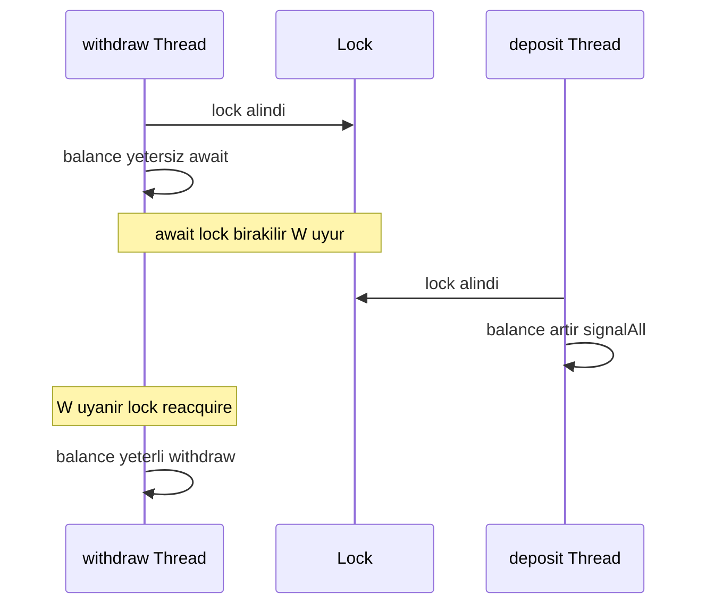
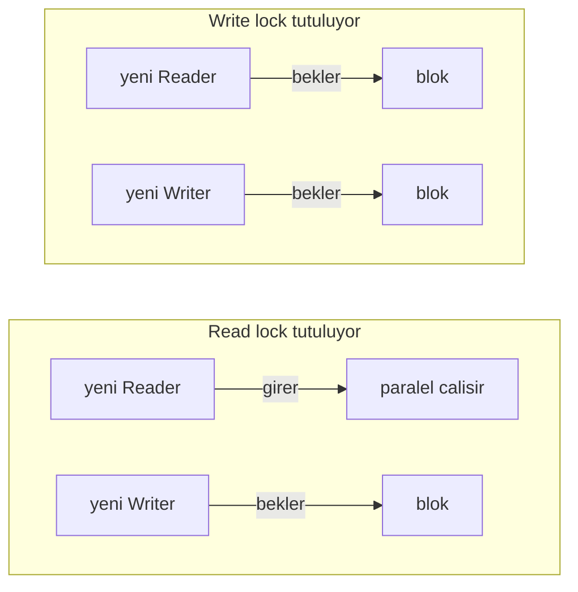
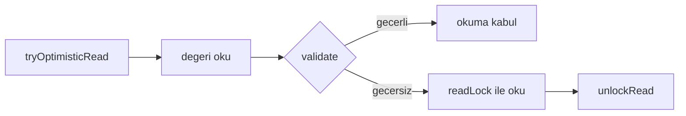
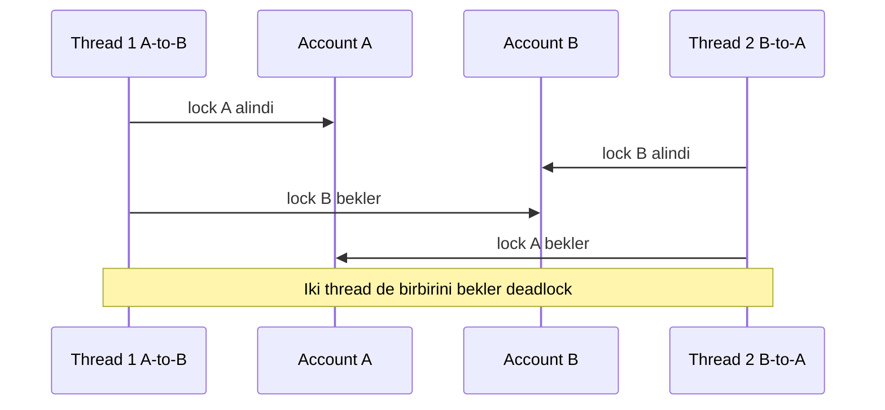

# Topic 3.3 — Lock Family: ReentrantLock, ReadWriteLock, StampedLock, Condition, Deadlock

```admonish info title="Bu bölümde"
- `synchronized`'ın 5 zaafı ve `ReentrantLock`'un çözümleri: `tryLock`, `lockInterruptibly`, fairness
- `Condition` ile `await`/`signal` ve `synchronized`'ın yazamadığı multiple-condition pattern'i
- `ReentrantReadWriteLock` (FX cache) ve `StampedLock` optimistic read — hangisi ne zaman, hangisi hiç
- Lock striping ile milyonlarca hesap için contention'ı N lock'a dağıtmak
- Coffman'ın 4 koşulu, banking transfer deadlock'u, `jstack` teşhisi, lock ordering ve `tryLock` ile çözüm
```

## Hedef

`java.util.concurrent.locks` paketinin **explicit lock API'sini** banking-grade kavramak. `ReentrantLock` ile `synchronized` arasındaki 5+ farkı tek tek anlamak; `tryLock`, `lockInterruptibly`, fairness, `Condition` variable'ları, `ReentrantReadWriteLock` (config/FX cache pattern'i), `StampedLock` (optimistic read), lock striping ve **deadlock**'un 4 koşulunu kavramak. Banking'de gerçek bir **iki-yönlü transfer deadlock**'unu reproduce edip, `jstack` ile analiz edip, **lock ordering** veya `tryLock` ile çözmek.

## Süre

Okuma: ~2.5 saat • Kendini Sına: 45 dk • Pratik (opsiyonel): 3-4 saat • Toplam: ~3 saat (+ pratik)

## Önbilgi

- Topic 3.1 (JMM) ve Topic 3.2 (`synchronized`, atomic, volatile) tamamlandı
- `Thread`, `Runnable`, `ExecutorService` ile basit concurrent kod yazılabiliyor
- Banking transfer kavramı (debit + credit) Phase 1'den
- `jstack` komut satırı aracının varlığı duyulmuş (Topic 3.10'da detay)

---

## Kavramlar

### 1. Neden `synchronized`'a ek olarak `Lock` API?

`synchronized` Java 1.0'dan beri var ve basit senaryolarda hâlâ en temiz araç. Ama bazı ihtiyaçları **hiç** karşılayamaz — Java 5 bu yüzden `java.util.concurrent.locks.Lock` interface'ini getirdi.

`synchronized`'ın zaafları şunlar:

- Lock'u **kesin** acquire eder; beklemeden dene veya "en fazla 500ms bekle" diyemezsin.
- Beklerken **interrupt edilemez**; `interrupt()` edilen thread monitor'ı beklemeye devam eder.
- **Scope'a bağlıdır**; method başında acquire, sonunda release. Bir method'da acquire edip başka method'da release edemezsin.
- **Fair değildir**; bekleyenlerden hangisinin gireceği belirsiz, bazı thread'ler aç kalabilir (starvation).
- **Reader-writer ayrımı yapamaz**; her erişim mutual-exclusive.

**`Lock` API** bunların hepsini çözer: `tryLock()` / `tryLock(timeout)` beklemeden veya sınırlı bekler, `lockInterruptibly()` interrupt'a duyarlıdır, `lock()`/`unlock()` kodun her yerinde çağrılabilir, fair seçeneği vardır ve `ReadWriteLock` reader-writer ayrımı sunar.

---

### 2. `ReentrantLock` — `synchronized`'ın güçlü kuzeni

En sık kullanacağın explicit lock bu. `synchronized`'la aynı reentrant semantiği taşır ama kontrolü sana verir.

```java
import java.util.concurrent.locks.ReentrantLock;

public class AccountWithLock {
    private final ReentrantLock lock = new ReentrantLock();
    private long balance;

    public void deposit(long amount) {
        lock.lock();
        try {
            balance += amount;
        } finally {
            lock.unlock();   // ← ASLA finally dışına çıkarma!
        }
    }
}
```

Buradaki kural pazarlık konusu değil: <mark>lock.unlock() her zaman finally block'unda çağrılmalı</mark>. İstisna olursa lock asla release edilmez, diğer thread'ler sonsuza bekler — banking'de bu bir **production outage**'dır.

#### `tryLock` — beklemeden dene

```java
public boolean tryDeposit(long amount) {
    if (lock.tryLock()) {
        try {
            balance += amount;
            return true;
        } finally {
            lock.unlock();
        }
    }
    return false;  // başka thread tutuyor, beklemeden dön
}
```

`tryLock()` başka thread tutuyorsa hemen `false` döner. Banking pratiği: "hesaba aynı anda tek işlem" tarzı rate-limit senaryoları.

#### `tryLock(timeout)` — sınırlı bekle

```java
public boolean depositOrTimeout(long amount, long timeoutMs) throws InterruptedException {
    if (lock.tryLock(timeoutMs, TimeUnit.MILLISECONDS)) {
        try {
            balance += amount;
            return true;
        } finally {
            lock.unlock();
        }
    }
    return false;
}
```

Zaman duyarlı işlemler için — transfer 500ms'de tamamlanmazsa fail. Ayrıca deadlock'tan çıkış yolu (Bölüm 10).

#### `lockInterruptibly` — bekleyen thread interrupt'a duyarlı

```java
public void deposit(long amount) throws InterruptedException {
    lock.lockInterruptibly();
    try {
        balance += amount;
    } finally {
        lock.unlock();
    }
}
```

Thread beklerken interrupt edilirse `InterruptedException` fırlatır. Graceful shutdown'da kritik — takılı thread'ler kapanışı bloklamaz.

#### `synchronized` vs `ReentrantLock` — 5+ fark

| Özellik | `synchronized` | `ReentrantLock` |
|---|---|---|
| Sözdizimi | Dil seviyesi (keyword) | Kütüphane (class) |
| Acquire/release | Implicit (scope) | Explicit (lock/unlock) |
| Timeout / tryLock | YOK | VAR |
| Interrupt edilebilir bekleme | YOK | VAR (lockInterruptibly) |
| Fairness | Bias (FIFO garantisi yok) | Optional fair (constructor) |
| Multiple condition variables | YOK (tek monitor wait/notify) | VAR (newCondition()) |
| Farklı scope'ta acquire/release | YOK (block sonu release) | VAR (method A acquire, B release) |
| Virtual thread pinning | EVET (sorun) | YOK |
| Reentrant | EVET | EVET |
| Memory semantics | Acquire/release | Acquire/release |
| Performans (low contention) | Çok yakın | Çok yakın |
| Performans (high contention) | Çok yakın (modern JVM) | Genellikle hafif üstün |

**Mülakat — ne zaman hangisi?** Basit, kısa kritik bölge, fair gerekmiyorsa `synchronized`. Timeout/interrupt/fair/multiple-condition gerekiyorsa `ReentrantLock`. Virtual thread + uzun blocking varsa `ReentrantLock` (pinning yok).

---

### 3. Fairness — adil sıralama

Lock release olduğunda sıradaki thread'i kim belirler? Cevabı fairness parametresi verir.

```java
ReentrantLock fair = new ReentrantLock(true);     // FIFO
ReentrantLock unfair = new ReentrantLock(false);  // default, throughput-optimized
```

**Fair lock** bekleyenleri sıraya alır, en uzun bekleyen ilk geçer — adil ama performans cezalı. **Unfair lock** ise release anında yeni gelen thread'in "kuyruğa girmeden" barging yapmasına izin verir — throughput yüksek ama teoride starvation mümkün.

Banking pratiğinde fair lock genellikle gerekmez: lock holding süresi kısa olduğunda starvation pratikte görülmez. Ama bir thread "hiç giremiyorum" diye açlık çekiyorsa fair'e geç. Kabaca maliyet: unfair acquire ~30 ns, fair acquire ~150 ns.

---

### 4. `Condition` variable — wait/notify'ın gelişmişi

`Object.wait()`/`notify()`'ın `Lock` API karşılığıdır; bir lock'a birden fazla bekleme kuyruğu bağlamana izin verir. Önce klasik "para gelene kadar bekle" örneğine bakalım — `deposit` gelen parayı ekler ve bekleyenleri uyandırır:

```java
private final ReentrantLock lock = new ReentrantLock();
private final Condition fundsAvailable = lock.newCondition();
private long balance = 0;

public void deposit(long amount) {
    lock.lock();
    try {
        balance += amount;
        fundsAvailable.signalAll();   // bekleyen withdraw'ları uyandır
    } finally {
        lock.unlock();
    }
}
```

`withdrawBlocking` ise yeterli bakiye olana kadar `await` eder. Kritik detay: `await()` lock'u **release eder**, thread uyur, uyanınca lock'u **reacquire** eder:

```java
public void withdrawBlocking(long amount) throws InterruptedException {
    lock.lock();
    try {
        while (balance < amount) {
            fundsAvailable.await();   // lock'u bırak, bekle, dönünce reacquire
        }
        balance -= amount;
    } finally {
        lock.unlock();
    }
}
```

<details>
<summary>Tam kod: BlockingAccount (~27 satır)</summary>

```java
import java.util.concurrent.locks.Condition;
import java.util.concurrent.locks.ReentrantLock;

public class BlockingAccount {
    private final ReentrantLock lock = new ReentrantLock();
    private final Condition fundsAvailable = lock.newCondition();
    private long balance = 0;

    public void deposit(long amount) {
        lock.lock();
        try {
            balance += amount;
            fundsAvailable.signalAll();  // bekleyen withdraw'ları uyandır
        } finally {
            lock.unlock();
        }
    }

    public void withdrawBlocking(long amount) throws InterruptedException {
        lock.lock();
        try {
            while (balance < amount) {
                fundsAvailable.await();  // ← await lock'u release eder, bekler, dönünce reacquire
            }
            balance -= amount;
        } finally {
            lock.unlock();
        }
    }
}
```

</details>

Akışı zaman çizgisinde gör — `await` lock'u bırakır, `deposit` girer ve `signalAll` ile uyandırır:



**Kritik kurallar:**

- `await()` ve `signal()` **sahip lock'la** çağrılmalı, yoksa `IllegalMonitorStateException`.
- `await()` lock'u release eder; uyanınca reacquire eder.
- <mark>Condition.await() daima while döngüsünde çağrılır</mark>, `if` ile değil — **spurious wakeup** (sebepsiz uyanma) mümkündür ve uyanan thread koşulu tekrar doğrulamak zorundadır.

#### Multiple condition — `synchronized`'ın yapamadığı

Tek lock'a iki ayrı bekleme kuyruğu bağlayabilirsin. Bounded queue'da producer "doluyken" bekler:

```java
public void offer(Transfer t) throws InterruptedException {
    lock.lock();
    try {
        while (queue.size() == capacity) notFull.await();
        queue.offer(t);
        notEmpty.signal();
    } finally {
        lock.unlock();
    }
}
```

Consumer ise "boşken" bekler — aynı lock, farklı condition:

```java
public Transfer take() throws InterruptedException {
    lock.lock();
    try {
        while (queue.isEmpty()) notEmpty.await();
        var t = queue.poll();
        notFull.signal();
        return t;
    } finally {
        lock.unlock();
    }
}
```

<details>
<summary>Tam kod: BoundedAccountQueue (~30 satır)</summary>

```java
public class BoundedAccountQueue {
    private final ReentrantLock lock = new ReentrantLock();
    private final Condition notFull = lock.newCondition();
    private final Condition notEmpty = lock.newCondition();
    private final Deque<Transfer> queue = new ArrayDeque<>();
    private final int capacity;

    public void offer(Transfer t) throws InterruptedException {
        lock.lock();
        try {
            while (queue.size() == capacity) notFull.await();
            queue.offer(t);
            notEmpty.signal();
        } finally {
            lock.unlock();
        }
    }

    public Transfer take() throws InterruptedException {
        lock.lock();
        try {
            while (queue.isEmpty()) notEmpty.await();
            var t = queue.poll();
            notFull.signal();
            return t;
        } finally {
            lock.unlock();
        }
    }
}
```

</details>

`synchronized` tek monitor'a sahip olduğu için bunu bu kadar temiz yazamaz. **`signal()`** tek bir bekleyeni uyandırır (hangisi belirsiz), **`signalAll()`** hepsini. Güvenli varsayılan `signalAll()`'dır; `signal()`'i yalnızca uyandırdığın thread'in koşulu kesin karşıladığından eminken kullan, aksi halde tek thread bile aç kalabilir.

---

### 5. `ReentrantReadWriteLock` — okuyucu-yazıcı ayrımı

Çok okuma + nadir yazma senaryosunda mutual exclusion israftır; okuyucular birbirini bloklamamalı. **`ReentrantReadWriteLock`** okuyuculara **eş zamanlı** giriş verir, yazıcıya **tek başına**.

```java
private final ReentrantReadWriteLock lock = new ReentrantReadWriteLock();
private final Lock readLock = lock.readLock();
private final Lock writeLock = lock.writeLock();
private Map<CurrencyPair, BigDecimal> rates = Map.of();

public BigDecimal getRate(CurrencyPair pair) {
    readLock.lock();
    try {
        return rates.get(pair);
    } finally {
        readLock.unlock();
    }
}
```

Yazma tarafı write lock alır ve immutable bir kopya set eder:

```java
public void reloadRates(Map<CurrencyPair, BigDecimal> newRates) {
    writeLock.lock();
    try {
        this.rates = Map.copyOf(newRates);  // immutable copy
    } finally {
        writeLock.unlock();
    }
}
```

<details>
<summary>Tam kod: FxRateCache (~27 satır)</summary>

```java
import java.util.concurrent.locks.ReentrantReadWriteLock;

public class FxRateCache {
    private final ReentrantReadWriteLock lock = new ReentrantReadWriteLock();
    private final Lock readLock = lock.readLock();
    private final Lock writeLock = lock.writeLock();

    private Map<CurrencyPair, BigDecimal> rates = Map.of();

    public BigDecimal getRate(CurrencyPair pair) {
        readLock.lock();
        try {
            return rates.get(pair);
        } finally {
            readLock.unlock();
        }
    }

    public void reloadRates(Map<CurrencyPair, BigDecimal> newRates) {
        writeLock.lock();
        try {
            this.rates = Map.copyOf(newRates);  // immutable copy
        } finally {
            writeLock.unlock();
        }
    }
}
```

</details>

**Banking örneği — FX rate cache:** saniyede binlerce rate sorgusu (read), 30 saniyede bir batch reload (write). RWLock ile reader'lar paralel çalışır. Erişim kuralları şöyle: read lock varken write bekler, write lock varken read bekler, read'ler kendi aralarında paralel.



**Downgrade serbest, upgrade yasak.** Write lock'tan read lock'a geçiş (downgrade) güvenli ve klasik bir pattern; ama <mark>read lock tutarken write lock istemek (upgrade) deadlock üretir</mark> — thread, kendi tuttuğu read'in bırakılmasını bekler ve kilitlenir. Doğru downgrade önce read dener, cache-miss olursa write'a çıkar:

```java
public BigDecimal getOrCompute(CurrencyPair pair) {
    readLock.lock();
    try {
        var cached = rates.get(pair);
        if (cached != null) return cached;
    } finally {
        readLock.unlock();
    }
    // read release edildi, şimdi write acquire → double-check gerekiyor
    ...
}
```

Write bölümünde başka thread'in arada eklemiş olabileceğini double-check eder, hesaplar, sonra write'ı bırakmadan **önce** read alarak atomik downgrade yapar:

```java
    writeLock.lock();
    try {
        var cached = rates.get(pair);   // double-check
        if (cached != null) return cached;
        var fresh = computeRate(pair);
        rates.put(pair, fresh);
        readLock.lock();                // downgrade: write bırakılmadan read al
        return fresh;
    } finally {
        writeLock.unlock();             // read hâlâ tutulu, race yok
        readLock.unlock();
    }
```

<details>
<summary>Tam kod: getOrCompute downgrade (~27 satır)</summary>

```java
public BigDecimal getOrCompute(CurrencyPair pair) {
    readLock.lock();
    try {
        var cached = rates.get(pair);
        if (cached != null) return cached;
    } finally {
        readLock.unlock();
    }

    writeLock.lock();
    try {
        // double-check (başka thread arada eklemiş olabilir)
        var cached = rates.get(pair);
        if (cached != null) return cached;

        var fresh = computeRate(pair);
        rates.put(pair, fresh);

        // downgrade: write → read (atomically by acquiring read before releasing write)
        readLock.lock();
        return fresh;
    } finally {
        writeLock.unlock();
        // not: writeLock release sırasında read hâlâ tutulu, no race
        readLock.unlock();
    }
}
```

</details>

```admonish warning title="RWLock her zaman kazandırmaz"
Read lock acquire/release maliyeti, kritik bölgenin işinden uzunsa RWLock avantaj sağlamaz. Çok kısa read'ler için `ConcurrentHashMap` veya `AtomicReference<Map>` daha hızlıdır (allocation-free, contention-free read). RWLock'un tatlı noktası **orta-uzun read'ler + nadir write**'lardır; write sıksa `synchronized` daha basittir.
```

---

### 6. `StampedLock` — optimistic reading

RWLock'ta read bile bir atomic write (reader sayacı) yapar; yüksek read yükünde bu contention yaratır. **`StampedLock`** (Java 8) optimistic read ile bunu aşar: okuma sırasında lock **almaz**, sadece bir stamp alır ve sonradan doğrular.

```java
public double readOptimistic() {
    long stamp = lock.tryOptimisticRead();     // stamp 0 olabilir
    double local = rate;                        // unsafe read
    if (!lock.validate(stamp)) {                // arada write oldu mu?
        stamp = lock.readLock();                // oldu → gerçek read lock'a düş
        try {
            local = rate;
        } finally {
            lock.unlockRead(stamp);
        }
    }
    return local;
}
```

Yazma tarafı klasik exclusive write lock alır:

```java
public void write(double newRate) {
    long stamp = lock.writeLock();
    try {
        rate = newRate;
    } finally {
        lock.unlockWrite(stamp);
    }
}
```

<details>
<summary>Tam kod: StampedFxCache (~27 satır)</summary>

```java
import java.util.concurrent.locks.StampedLock;

public class StampedFxCache {
    private final StampedLock lock = new StampedLock();
    private double rate;       // long bazlı double, sadece örnek için

    public double readOptimistic() {
        long stamp = lock.tryOptimisticRead();    // stamp 0 olabilir
        double local = rate;                       // unsafe read
        if (!lock.validate(stamp)) {               // optimistic fail
            stamp = lock.readLock();               // fall-back to read lock
            try {
                local = rate;
            } finally {
                lock.unlockRead(stamp);
            }
        }
        return local;
    }

    public void write(double newRate) {
        long stamp = lock.writeLock();
        try {
            rate = newRate;
        } finally {
            lock.unlockWrite(stamp);
        }
    }
}
```

</details>

Akış: stamp al, oku, `validate(stamp)` çağır. Stamp geçerliyse (arada write olmadıysa) okuma kabul edilir — **çok hızlı**; geçersizse klasik read lock'a düşülür.



Avantajı yüksek read throughput'tur (lock-free read). Ama ciddi kısıtları var: **reentrant değildir**, **`Condition` desteği yoktur**, API stamp taşıdığı için daha karmaşıktır, `tryOptimisticRead()` 0 dönerse stamp yoktur (write tutulu olabilir) ve validate'den önce yapılan iş tutarsız olabilir — okuduğun değere güvenip başka iş yapmadan önce mutlaka validate et.

```admonish tip title="Çoğu zaman daha basiti yeter"
StampedLock çok yüksek read throughput'lu **immutable snapshot**'lar (FX rate, config) için biçilmiş kaftandır. Ama pratikte `AtomicReference<ImmutableSnapshot>` veya `ConcurrentHashMap` çoğu zaman hem daha basit hem yeterince hızlıdır. StampedLock'u ancak ölçüp gerçekten gerektiğini görünce seç.
```

---

### 7. Lock striping — contention dağıtma

Milyonlarca hesap için tek lock contention bombası, hesap başına lock ise memory bombasıdır. **Lock striping** ortayı bulur: N adet lock tutulur, hesap ID'si hash'lenerek bir stripe seçilir.

```java
public class StripedAccountLocks {
    private static final int STRIPE_COUNT = 64;
    private final ReentrantLock[] stripes = new ReentrantLock[STRIPE_COUNT];

    public StripedAccountLocks() {
        for (int i = 0; i < STRIPE_COUNT; i++) {
            stripes[i] = new ReentrantLock();
        }
    }

    public Lock lockFor(long accountId) {
        int idx = (int) (Long.hashCode(accountId) & (STRIPE_COUNT - 1));  // power of 2
        return stripes[idx];
    }
}
```

Kullanımı sıradan lock gibi:

```java
var lock = stripeLocks.lockFor(account.getId());
lock.lock();
try {
    // hesap işlemi
} finally {
    lock.unlock();
}
```

Trade-off nettir: az stripe → contention (iki farklı hesap aynı stripe'ı paylaşır), çok stripe → memory + cache footprint. 64-128 stripe banking workload için yeterlidir; Guava'nın `Striped<Lock>` sınıfı production-ready bir implementation sunar. Not: ConcurrentHashMap'in Java 7 hâli tam olarak bu fikirle 16 segment kullanıyordu (Java 8'den sonra lock-free oldu ama fikir aynı).

---

### 8. Deadlock — 4 koşul, klasik banking örneği

Deadlock, thread'lerin birbirinin tuttuğu lock'u sonsuza beklemesidir. **Coffman koşulları** deadlock'un dört zorunlu şartını verir; dördü birden sağlanmadıkça deadlock olamaz:

1. **Mutual Exclusion**: kaynak (lock) tek thread tarafından tutulabilir.
2. **Hold and Wait**: thread bir lock tutarken başka lock için bekler.
3. **No Preemption**: lock zorla alınamaz, thread kendi bırakmalı.
4. **Circular Wait**: bekleme bir döngü oluşturur (T1 → L1 tutar L2 bekler; T2 → L2 tutar L1 bekler).

Klasik banking örneği eş zamanlı A→B ve B→A transferidir. Kod hesapları geliş sırasına göre kilitler:

```java
public void transfer(Account from, Account to, long amount) {
    synchronized (from) {            // L1
        synchronized (to) {           // L2
            if (from.getBalance() >= amount) {
                from.debit(amount);
                to.credit(amount);
            }
        }
    }
}
// T1: transfer(A, B) → A kilitlendi, B bekleniyor
// T2: transfer(B, A) → B kilitlendi, A bekleniyor  → DEADLOCK
```

İki thread ters sırada acquire ettiğinde döngü kapanır:



Bunu kasıtlı reproduce etmek için iki thread ters yönde binlerce transfer koştururuz:

```java
var t1 = new Thread(() -> {
    for (int i = 0; i < 1000; i++) bank.transfer(a, b, 1);
}, "transfer-A-to-B");

var t2 = new Thread(() -> {
    for (int i = 0; i < 1000; i++) bank.transfer(b, a, 1);
}, "transfer-B-to-A");
```

`join(5000)` ile bekleyip thread'ler hâlâ `isAlive()` ise deadlock oluşmuştur — o an `jstack` çekeriz:

```java
t1.start(); t2.start();
t1.join(5000); t2.join(5000);
if (t1.isAlive() || t2.isAlive()) {
    System.out.println("DEADLOCK detected — running jstack now");
}
```

<details>
<summary>Tam kod: demonstrateDeadlock testi (~30 satır)</summary>

```java
@Test
@Timeout(value = 10, unit = TimeUnit.SECONDS)
void demonstrateDeadlock() throws Exception {
    var bank = new DeadlockyBank();
    var a = new Account(1, 1000);
    var b = new Account(2, 1000);

    var t1 = new Thread(() -> {
        for (int i = 0; i < 1000; i++) {
            bank.transfer(a, b, 1);
        }
    }, "transfer-A-to-B");

    var t2 = new Thread(() -> {
        for (int i = 0; i < 1000; i++) {
            bank.transfer(b, a, 1);
        }
    }, "transfer-B-to-A");

    t1.start();
    t2.start();

    t1.join(5000);
    t2.join(5000);

    if (t1.isAlive() || t2.isAlive()) {
        System.out.println("DEADLOCK detected — running jstack now");
        // jstack <pid> ile incele
    }
}
```

</details>

`jstack <pid>` çıktısı cycle'ı otomatik teşhis eder — production deadlock'unda **ilk adım** budur:

```
"transfer-B-to-A" waiting to lock monitor 0x...b3c1f80 (a Account),
  which is held by "transfer-A-to-B"
"transfer-A-to-B" waiting to lock monitor 0x...b3c1fa0 (a Account),
  which is held by "transfer-B-to-A"

Found 1 deadlock.
```

---

### 9. Deadlock fix — lock ordering

En şık çözüm circular wait koşulunu kırmaktır: lock'ları her thread'in **aynı deterministik sırayla** acquire etmesini sağla. Banking'de account ID doğal bir sıralama anahtarıdır.

```java
public void transfer(Account from, Account to, long amount) {
    Account first, second;
    if (from.getId() < to.getId()) {
        first = from; second = to;
    } else if (from.getId() > to.getId()) {
        first = to; second = from;
    } else {
        throw new IllegalArgumentException("Same account");
    }

    synchronized (first) {
        synchronized (second) {
            if (from.getBalance() >= amount) {
                from.debit(amount);
                to.credit(amount);
            }
        }
    }
}
```

Artık T1 ve T2 her zaman önce **küçük ID**'yi kilitler; iki thread aynı yönde ilerlediği için döngü kapanamaz. Böylece <mark>lock'ları her zaman deterministik bir sırayla acquire ederek circular wait koşulu kırılır</mark>.

Pratik notlar: ID monoton ve **unique** olmalı (UUID ise lexicographic compare); ID eşitliği aynı hesaba transfer demektir, business rule ile reddedilir; 3+ hesaplı senaryolarda da kural aynı — tümünü ID'ye göre sırala.

---

### 10. Deadlock fix — `tryLock` + timeout

Lock ordering için deterministik bir anahtar yoksa (dış sistem mutex'i, heterojen kaynaklar) hold-and-wait koşulunu kır: ilk lock alındı ama ikincisi gelmiyorsa **ilkini de bırak** ve retry et. `tryLock(timeout)` bunu sağlar.

Dış döngü deadline'a kadar döner ve ilk lock'u sınırlı süreyle dener:

```java
while (System.nanoTime() < deadline) {
    if (from.getLock().tryLock(50, TimeUnit.MILLISECONDS)) {
        try {
            // ikinci lock denemesi burada
        } finally {
            from.getLock().unlock();
        }
    }
    TimeUnit.MILLISECONDS.sleep(ThreadLocalRandom.current().nextInt(10));  // backoff
}
```

İçeride ikinci lock da `tryLock` ile denenir; alınamazsa `finally` ilkini bırakır ve döngü baştan dener — kimse elinde lock tutarak beklemez:

```java
if (to.getLock().tryLock(50, TimeUnit.MILLISECONDS)) {
    try {
        if (from.getBalance() >= amount) {
            from.debit(amount);
            to.credit(amount);
        }
        return true;
    } finally {
        to.getLock().unlock();
    }
}
// to lock alınamadı → from serbest bırakılır (dış finally), retry
```

<details>
<summary>Tam kod: tryTransfer (~28 satır)</summary>

```java
public boolean tryTransfer(Account from, Account to, long amount,
                           long timeoutMs) throws InterruptedException {
    long deadline = System.nanoTime() + TimeUnit.MILLISECONDS.toNanos(timeoutMs);

    while (System.nanoTime() < deadline) {
        if (from.getLock().tryLock(50, TimeUnit.MILLISECONDS)) {
            try {
                if (to.getLock().tryLock(50, TimeUnit.MILLISECONDS)) {
                    try {
                        if (from.getBalance() >= amount) {
                            from.debit(amount);
                            to.credit(amount);
                        }
                        return true;
                    } finally {
                        to.getLock().unlock();
                    }
                }
                // toLock failed → unlock from and retry
            } finally {
                from.getLock().unlock();
            }
        }
        // small backoff
        TimeUnit.MILLISECONDS.sleep(ThreadLocalRandom.current().nextInt(10));
    }
    return false;  // timeout
}
```

</details>

Trade-off: retry overhead ve daha karmaşık kod, ama hiçbir lock-order convention'ına bağlı değil. Pratik karar: mümkünse **lock ordering** (ID-based) — şık ve hızlı; ordering kurulamıyorsa tryLock pattern.

---

### 11. Diğer concurrency tuzakları

Deadlock en ünlüsü ama tek başına değil; şu dört akrabası da production'da karşına çıkar.

**Livelock:** Thread'ler aktif çalışır ama ilerleme yoktur. Klasik örnek "kibar transfer" — ikisi de lock alamayınca nazikçe geri çekilir ve aynı anda tekrar dener:

```java
public void politeTransfer(Account from, Account to, long amount) {
    while (true) {
        if (from.tryLock()) {
            try {
                if (to.tryLock()) {
                    try {
                        from.debit(amount);
                        to.credit(amount);
                        return;
                    } finally {
                        to.unlock();
                    }
                }
            } finally {
                from.unlock();
            }
        }
        // ikisi de sürekli try → fail → release → retry: ilerleme yok
    }
}
```

Çözüm **randomized backoff**: retry aralığını rastgele farklılaştır ki thread'ler senkronize kalmasın.

**Starvation:** Bir thread lock'a hiç giremez; unfair lock + sürekli akan thread'ler bekleyeni aç bırakır. Fair lock veya queue-based scheduling çözer.

**Priority inversion:** Düşük öncelikli thread lock tutarken yüksek öncelikli bekler; araya giren orta-öncelikli thread düşüğü preempt edince yüksek dolaylı olarak kilitlenir. Java'da OS scheduling üzerinde kontrolün az; real-time JVM'ler dışında nadir.

**Lock convoy:** Çok thread aynı lock'u sırayla ister; release sonrası hepsi aynı anda uyanır, çoğu retry'da reddedilir, CPU israf olur. Çözüm: contention'ı azalt (striping, lock-free).

---

### 12. Lock observability — banking pratiği

Production'da lock contention'ı ölçemezsen yönetemezsin; birkaç ucuz gözlem noktası var. `ReentrantLock` doğrudan sorgu sunar:

```java
log.info("Lock queue length: {}", lock.getQueueLength());   // kaç thread bekliyor
if (lock.hasQueuedThreads()) {
    log.warn("Lock contention detected");                   // kuyrukta thread var mı
}
```

Daha derin analiz için: JFR'ın `jdk.JavaMonitorEnter` event'i tüm `synchronized` enter'larını yakalar (`jcmd JFR.start`, Topic 3.10); `async-profiler --lock` mode contention flame graph üretir. Custom metric için lock süresini bir `Timer` ile ölç:

```java
public void lock() {
    var sample = Timer.start();
    lock.lock();
    sample.stop(lockTime);
}
```

Banking pratiği: p99 lock wait > 100ms → alert.

---

### 13. Banking pratik karar matrisi

Doğru primitive'i senaryodan seç; ezber değil, sebep-sonuç:

| Senaryo | Lock seçimi |
|---|---|
| Basit balance update | `synchronized` veya `AtomicLong` |
| Multi-step transfer (debit + credit) | `synchronized` (account başına, ID-ordered) veya `ReentrantLock` |
| Transfer timeout gerekli | `ReentrantLock` + `tryLock(timeout)` |
| Milyonlarca hesapta per-account lock | Striped lock veya optimistic versioning (`@Version`) |
| FX rate cache (read-heavy) | `ConcurrentHashMap` (genelde yeterli) veya `ReadWriteLock` |
| Configuration reload (rare write) | `volatile reference` veya `AtomicReference<ImmutableSnapshot>` |
| Producer-consumer queue | `BlockingQueue` (Topic 3.6) — kendin yazma |
| Multiple condition ile wait-notify | `ReentrantLock` + multiple `Condition` |
| Virtual thread + JDBC | `ReentrantLock` (synchronized pinning) |
| En yüksek read throughput, nadir write | `StampedLock` optimistic read veya immutable `AtomicReference` |

---

### 14. Anti-pattern'ler

Mülakatta "bu kodda ne yanlış?" sorusunun cephaneliği. Yedi klasik:

**1 — `unlock` `finally`'de değil:** erken `return` veya exception unlock'ı atlar → lock sızar. Çözüm: `try-finally`.

```java
lock.lock();
balance += amount;
if (somethingWrong) return;     // ❌ unlock atlanır
lock.unlock();
```

**2 — `lock` sonrası exception, no unlock:** aynı kök sebep, yine `try-finally` şart.

```java
lock.lock();
business();    // throws → unlock hiç çağrılmaz ❌
lock.unlock();
```

**3 — Reader-to-writer upgrade:** `ReentrantReadWriteLock` upgrade desteklemez, deadlock olur. Önce read release, sonra write acquire, sonra double-check.

```java
readLock.lock();
try {
    if (needWrite) {
        writeLock.lock();   // ❌ DEADLOCK
    }
}
```

**4 — Virtual thread içinde `synchronized` + JDBC:** virtual thread pinning'e yol açar. Çözüm: `ReentrantLock` (Topic 3.7).

```java
public synchronized void process() {
    jdbc.query(...);   // ❌ virtual thread pinning
}
```

**5 — Lock object olarak `this` sızıntısı:** dış kod `synchronized (account)` yaparsa iç lock'la çakışır. Çözüm: private final lock object.

**6 — External library object üzerinde `synchronized`:** `httpClient` gibi bir nesnenin iç implementasyonu da sync kullanabilir. Çözüm: kendi lock nesnen.

**7 — Lock altında IO:** lock tutarken HTTP beklemek throughput'u çökertir. State değişikliğini lock altında, IO'yu lock dışında yap.

```java
synchronized (this) {
    sendHttpRequest();    // ❌ IO sırasında lock tutuluyor
}
```

---

## Önemli olabilecek araştırma kaynakları

- "Java Concurrency in Practice" Goetz, Chapter 13 (Explicit Locks)
- Doug Lea — "Concurrent Programming in Java" (kitap)
- `AbstractQueuedSynchronizer` (AQS) JavaDoc + source code
- Google Guava `Striped<Lock>` source
- "Effective Concurrency" series Herb Sutter (article)
- "StampedLock idioms" Heinz Kabutz article
- Coffman conditions Wikipedia
- "Deadlock prevention" textbook chapters
- jstack manual (Oracle docs)
- Aleksey Shipilev — "JMM workshop" lock visibility detayları

---

## Kendini Sına

Aşağıdaki soruları önce **cevaba bakmadan** kendi cümlelerinle yanıtlamayı dene — hepsi TR bank mülakatlarında karşına çıkabilecek tarzda. Takıldığın soruda ilgili Kavramlar başlığına dön, sonra tekrar dene.

**S1. `synchronized` ile `ReentrantLock` arasındaki en az 5 farkı say. Her biri için bir banking gerekçesi ver.**

<details>
<summary>Cevabı göster</summary>

Beş temel fark: (1) Acquire/release — `synchronized` implicit (scope), `ReentrantLock` explicit `lock()`/`unlock()`. (2) Timeout — sadece `ReentrantLock` `tryLock(timeout)` sunar; transfer 500ms'de bitmezse fail edebilirsin. (3) Interruptibility — `lockInterruptibly` beklerken interrupt'a duyarlıdır, graceful shutdown'da takılı thread'i kurtarır. (4) Fairness — `ReentrantLock` opsiyonel fair (FIFO) verir, starvation şikayetinde işe yarar. (5) Multiple condition — `ReentrantLock` bir lock'a birden çok `Condition` bağlar, `synchronized` tek monitor'la sınırlı.

Bonus: virtual thread + uzun blocking'de `synchronized` pinning yaratır, `ReentrantLock` yaratmaz; ayrıca `ReentrantLock` bir method'da acquire edip başkasında release edebilir. Karar: basit kısa kritik bölge → `synchronized`; timeout/interrupt/fair/multiple-condition/virtual-thread → `ReentrantLock`.

</details>

**S2. `lock.unlock()` neden mutlaka `finally` block'unda çağrılır? Yapılmazsa banking'de ne olur?**

<details>
<summary>Cevabı göster</summary>

`synchronized`'ın aksine `ReentrantLock` otomatik release etmez; kritik bölgede exception fırlarsa veya erken `return` olursa `unlock()` satırına hiç ulaşılmaz. `try-finally` release'i her çıkış yolunda garantiler.

Yapılmazsa lock sonsuza tutulu kalır: o lock'u bekleyen tüm thread'ler kilitlenir, connection pool ve request thread'leri birikir, servis yanıt veremez hale gelir. Banking'de bu doğrudan bir production outage'dır — para hareketleri durur. Kural istisnasızdır: `lock()` hemen ardından `try`, release `finally`'de.

</details>

**S3. `Condition.await()` neden `if` değil `while` döngüsünde çağrılır? `signal()` ile `signalAll()` arasında nasıl seçim yaparsın?**

<details>
<summary>Cevabı göster</summary>

Çünkü **spurious wakeup** (sebepsiz uyanma) mümkündür ve `signalAll()` birden çok thread'i uyandırdığında koşul senin thread'in sırası gelene kadar bir başkası tarafından bozulmuş olabilir. `while` uyandıktan sonra koşulu yeniden doğrular; koşul hâlâ sağlanmıyorsa thread tekrar `await` eder. `if` kullanırsan yanlış koşulda ilerlersin (ör. bakiye yokken withdraw).

`signalAll()` tüm bekleyenleri uyandırır — güvenli varsayılan. `signal()` yalnızca birini uyandırır, daha ucuzdur ama uyandırılan thread koşulu karşılamıyorsa (farklı condition'a ait) tek thread bile aç kalabilir. Bu yüzden `signal()`'i yalnızca uyanan thread'in koşulu kesin karşıladığından eminken kullan.

</details>

**S4. `ReentrantReadWriteLock`'ta reader-to-writer upgrade neden yasak, write-to-read downgrade neden serbest? RWLock'u ne zaman `ConcurrentHashMap`'e tercih etmezsin?**

<details>
<summary>Cevabı göster</summary>

Upgrade yasak çünkü read lock'u tutan thread write lock isterken kendi read'inin bırakılmasını bekler — ama bırakmaz, kendini kilitler (deadlock). Doğrusu önce read'i release edip write acquire etmek, sonra durumu double-check etmektir (başka thread arada değiştirmiş olabilir). Downgrade serbesttir çünkü write lock zaten exclusive'dir; write'ı bırakmadan önce read alırsan hiçbir writer araya giremez, geçiş atomik ve güvenlidir.

RWLock'u tercih etmezsin: read çok kısaysa read lock'un acquire/release maliyeti işin kendisinden pahalıdır → `ConcurrentHashMap` veya `AtomicReference<Map>` daha hızlı (allocation-free, contention-free read). Write sık ise `synchronized` daha basit. RWLock'un tatlı noktası orta-uzun read'ler + nadir write'lardır.

</details>

**S5. `StampedLock` optimistic read nasıl çalışır? Avantajı ve en az iki dezavantajı nedir?**

<details>
<summary>Cevabı göster</summary>

`tryOptimisticRead()` bir stamp döner ama **lock almaz**; değeri okursun, sonra `validate(stamp)` çağırırsın. Arada write olmadıysa stamp geçerlidir ve okuma çok hızlı kabul edilir; write olduysa validate `false` döner ve klasik `readLock()`'a düşersin. Avantaj: read tarafında hiçbir atomic write yoktur, çok yüksek read throughput sağlar (RWLock'un reader sayacı contention'ını ortadan kaldırır).

Dezavantajları: reentrant değildir; `Condition` desteği yoktur; API stamp taşıdığı için karmaşıktır; `tryOptimisticRead()` 0 dönerse stamp yoktur (write tutulu); ve en önemlisi validate'den önce okuduğun değere güvenip iş yapamazsın — tutarsız olabilir. Pratikte çoğu zaman `AtomicReference<ImmutableSnapshot>` hem daha basit hem yeterince hızlıdır.

</details>

**S6. Coffman'ın 4 koşulunu say. İki-yönlü transfer deadlock'unu lock ordering ile nasıl çözersin, hangi koşulu kırar?**

<details>
<summary>Cevabı göster</summary>

Dört koşul: Mutual Exclusion (lock tek thread'de), Hold and Wait (lock tutarken başka lock bekle), No Preemption (lock zorla alınamaz), Circular Wait (bekleme döngüsü). Dördü birden sağlanmazsa deadlock olamaz. Klasik senaryo: T1 `transfer(A,B)` A'yı kilitleyip B'yi bekler; T2 `transfer(B,A)` B'yi kilitleyip A'yı bekler → döngü.

Lock ordering **Circular Wait**'i kırar: her thread lock'ları aynı deterministik sırayla (ör. account ID küçükten büyüğe) acquire eder. Böylece iki thread de önce küçük ID'yi kilitler, aynı yönde ilerledikleri için döngü kapanamaz. ID unique ve monoton olmalı; eşit ID aynı hesaba transfer demektir, business rule ile reddedilir. Banking'de en şık çözüm budur.

</details>

**S7. Lock ordering ile `tryLock` + timeout arasındaki fark nedir? Her biri hangi Coffman koşulunu kırar, hangisini tercih edersin?**

<details>
<summary>Cevabı göster</summary>

Lock ordering **Circular Wait**'i kırar: sabit sırayla acquire edildiği için döngü oluşamaz — statik, overhead'siz, ama deterministik bir sıralama anahtarı (ID) gerektirir. `tryLock` + timeout ise **Hold and Wait**'i kırar: ikinci lock sınırlı sürede gelmezse ilk lock da bırakılır ve retry yapılır — kimse elinde lock tutarak beklemez.

Tercih: ID gibi bir ordering anahtarı varsa **lock ordering** — şık, hızlı, retry yok. Anahtar kurulamıyorsa (heterojen kaynaklar, dış sistem mutex'i) `tryLock` + timeout + randomized backoff. tryLock'un bedeli retry overhead ve daha karmaşık koddur, ama hiçbir convention'a bağlı değildir.

</details>

**S8. Lock striping nedir, hangi problemi çözer? Kaç stripe kullanırsın ve stripe seçiminde neden power-of-2 boyut tercih edilir?**

<details>
<summary>Cevabı göster</summary>

Lock striping, milyonlarca hesap için tek lock (contention bombası) ile hesap başına lock (memory bombası) arasındaki orta yoldur: N adet lock tutulur, hesap ID'si hash'lenip bir stripe'a maplenir. Aynı stripe'a düşen iki hesap lock paylaşır (kabul edilebilir false contention), farklı stripe'lardakiler paralel çalışır.

Banking workload için 64-128 stripe yeterlidir. Power-of-2 boyut seçilir çünkü `hash & (STRIPE_COUNT - 1)` maskeleme, pahalı modulo yerine tek bir bitwise AND ile stripe indeksi verir — hızlı ve dengeli dağılım. Guava'nın `Striped<Lock>` sınıfı production-ready bir implementasyondur; ConcurrentHashMap'in Java 7 hâli de aynı fikirle 16 segment kullanıyordu.

</details>

---

## Tamamlama kriterleri

- [ ] `ReentrantLock.lock()/unlock()` try-finally pattern'ini her zaman uyguluyorum
- [ ] `tryLock(timeout)` ile bekleme süresi sınırlı transfer, `lockInterruptibly` ile interrupt-safe lock yazabiliyorum
- [ ] `synchronized` vs `ReentrantLock` 5+ farkı ezberimde
- [ ] `Condition` variable'ı multiple-condition senaryosunda kullanabiliyorum, `await`'i her zaman `while` içinde yazıyorum
- [ ] `ReentrantReadWriteLock` downgrade pattern'ini ve reader-upgrade yasağını biliyorum
- [ ] `StampedLock` optimistic read pattern'ini avantaj/dezavantajıyla açıklayabiliyorum
- [ ] Lock striping ile per-account lock'u ve power-of-2 masking'i açıklayabiliyorum
- [ ] Coffman 4 koşulunu ve deadlock reproduce → `jstack` → "Found 1 deadlock" akışını biliyorum
- [ ] Lock ordering (Circular Wait) ve tryLock+timeout (Hold and Wait) çözümlerinin hangi koşulu kırdığını biliyorum
- [ ] Livelock'u deadlock'tan ayırt edebiliyorum
- [ ] (Opsiyonel) "Pratik yapmak istersen" bölümündeki testleri yazdım ve Claude-verify prompt'uyla doğrulattım

Hepsi onaylı → Topic 3.4'e geç → [04-executor-framework/](../04-executor-framework/index.md)

---

## Defter notları

1. "ReentrantLock'un synchronized'e göre 5 avantajı: ____, ____, ____, ____, ____."
2. "Lock'u finally bloğunda release etmemenin sonucu: ____. Production banking'de bu ____ demek."
3. "Fair lock vs unfair lock — performans/adalet trade-off: ____."
4. "`Condition.await` her zaman `while` içinde çünkü: ____."
5. "Multiple condition variable kullanmanın senaryosu (banking): ____."
6. "ReadWriteLock'u ConcurrentHashMap'ten tercih ettiğim senaryo: ____."
7. "Reader-to-writer upgrade neden yasak: ____. Downgrade neden serbest: ____."
8. "StampedLock'un Reentrant lock'a göre avantajı: ____. Dezavantajı: ____."
9. "Coffman 4 koşulu: ____, ____, ____, ____. Bunlardan birini kırmak deadlock'u önler."
10. "Banking transfer'de lock ordering: hangi field'a göre sırala, neden: ____."

```admonish success title="Bölüm Özeti"
- `Lock` API, `synchronized`'ın 5 zaafını çözer: `tryLock`/`tryLock(timeout)`, `lockInterruptibly`, opsiyonel fairness, multiple `Condition` ve cross-scope acquire/release
- İki kural production outage'ı önler: `unlock()` daima `finally`'de, `Condition.await()` daima `while` döngüsünde (spurious wakeup)
- `ReentrantReadWriteLock` read-heavy cache için (downgrade serbest, reader-upgrade yasak); `StampedLock` optimistic read en yüksek read throughput için — ama çoğu zaman `ConcurrentHashMap`/`AtomicReference` yeterli ve daha basit
- Lock striping, milyonlarca hesap için contention'ı N lock'a dağıtır; power-of-2 boyut hızlı masking sağlar
- Deadlock'un 4 Coffman koşulundan biri kırılınca deadlock olamaz: lock ordering (ID-based) Circular Wait'i, tryLock+timeout Hold and Wait'i kırar
- Production deadlock'unda ilk adım `jstack`: cycle'ı otomatik teşhis eder ve "Found 1 deadlock" satırını verir
```

---

## Pratik yapmak istersen

Kavramları koda dökmek istersen aşağıdaki iki ek hazır: test yazma rehberi `AccountWithLock`, `Condition`, `ReadWriteLock` ve deadlock reproduce/fix senaryoları için örnek testler içerir; Claude-verify prompt'u ile yazdığın lock kodunu banking-grade perspektiften denetletebilirsin. Öngörülen efor: ~3-4 saat. Tamamlandı sayman için her lock primitive'ini en az bir çalışan test ile göstermen ve deadlock'u hem reproduce edip hem iki yolla (ordering + tryLock) çözmen yeterli.

<details>
<summary>Test yazma rehberi</summary>

### Test 3.3.1 — `AccountWithLock` thread-safety

```java
@Test
void accountWithLockIsThreadSafe() throws Exception {
    var account = new AccountWithLock();
    int threads = 100;
    int perThread = 1000;

    var pool = Executors.newFixedThreadPool(threads);
    var latch = new CountDownLatch(threads);
    for (int i = 0; i < threads; i++) {
        pool.submit(() -> {
            for (int j = 0; j < perThread; j++) account.deposit(1);
            latch.countDown();
        });
    }
    latch.await();
    pool.shutdown();

    assertThat(account.getBalance()).isEqualTo((long) threads * perThread);
}
```

### Test 3.3.2 — `tryLock` timeout

```java
@Test
void tryDepositReturnsFalseWhenLockHeld() throws Exception {
    var account = new AccountWithLock();
    var t1Acquired = new CountDownLatch(1);
    var t1Release = new CountDownLatch(1);

    Thread t1 = new Thread(() -> {
        account.lock();
        try {
            t1Acquired.countDown();
            t1Release.await();
        } catch (InterruptedException e) {
            Thread.currentThread().interrupt();
        } finally {
            account.unlock();
        }
    });
    t1.start();
    t1Acquired.await();

    boolean result = account.tryDeposit(100, 100);
    assertThat(result).isFalse();

    t1Release.countDown();
    t1.join();
}
```

### Test 3.3.3 — `Condition.await` ile withdraw blocking

```java
@Test
void withdrawBlocksUntilDeposit() throws Exception {
    var account = new BlockingAccount();
    var withdrawn = new CountDownLatch(1);

    Thread t = new Thread(() -> {
        try {
            account.withdrawBlocking(100);
            withdrawn.countDown();
        } catch (InterruptedException e) {
            Thread.currentThread().interrupt();
        }
    });
    t.start();

    // önce withdraw yapamamalı
    assertThat(withdrawn.await(200, TimeUnit.MILLISECONDS)).isFalse();

    account.deposit(150);

    // şimdi withdraw yapmalı
    assertThat(withdrawn.await(1, TimeUnit.SECONDS)).isTrue();
}
```

### Test 3.3.4 — `ReadWriteLock` ile concurrent reader'lar

```java
@Test
void readersDoNotBlockEachOther() throws Exception {
    var cache = new FxRateCache();
    cache.reloadRates(Map.of(USD_TRY, new BigDecimal("33.50")));

    var pool = Executors.newFixedThreadPool(50);
    var startedReaders = new CountDownLatch(50);
    var done = new CountDownLatch(50);

    for (int i = 0; i < 50; i++) {
        pool.submit(() -> {
            startedReaders.countDown();
            cache.getRate(USD_TRY);
            done.countDown();
        });
    }

    assertThat(startedReaders.await(2, TimeUnit.SECONDS)).isTrue();
    assertThat(done.await(2, TimeUnit.SECONDS)).isTrue();
    pool.shutdown();
}
```

### Test 3.3.5 — Deadlock detection (kasıtlı, timeout ile)

```java
@Test
@Timeout(value = 10, unit = TimeUnit.SECONDS)
void deadlockIsReproducible() throws Exception {
    var bank = new DeadlockyBank();
    var a = new Account(1, 10000);
    var b = new Account(2, 10000);

    var t1 = new Thread(() -> {
        for (int i = 0; i < 10000; i++) bank.transfer(a, b, 1);
    }, "T1");
    var t2 = new Thread(() -> {
        for (int i = 0; i < 10000; i++) bank.transfer(b, a, 1);
    }, "T2");
    t1.start();
    t2.start();

    t1.join(5000);
    t2.join(5000);

    // Beklenti: deadlock — en azından biri hâlâ alive
    assertThat(t1.isAlive() || t2.isAlive())
        .as("Deadlock beklenmiyordu mı?")
        .isTrue();

    t1.interrupt();
    t2.interrupt();
}
```

### Test 3.3.6 — `OrderedBank` no deadlock

```java
@Test
@Timeout(value = 10, unit = TimeUnit.SECONDS)
void orderedBankCompletesWithoutDeadlock() throws Exception {
    var bank = new OrderedBank();
    var a = new Account(1, 10000);
    var b = new Account(2, 10000);

    var t1 = new Thread(() -> {
        for (int i = 0; i < 10000; i++) bank.transfer(a, b, 1);
    });
    var t2 = new Thread(() -> {
        for (int i = 0; i < 10000; i++) bank.transfer(b, a, 1);
    });
    t1.start();
    t2.start();
    t1.join();
    t2.join();

    // Sum invariant: a + b = 20000
    assertThat(a.getBalance() + b.getBalance()).isEqualTo(20000);
}
```

> Bonus deneyler: `StampedFxCache` vs `FxRateCache` için 100 thread read benchmark'ı koş ve throughput'u karşılaştır; `StripedAccountLocks` ile tek lock vs 64 stripe arasında 1000 hesap + 100 thread random transfer throughput'unu ölç; `TryLockBank` ile aynı deadlock senaryosunu tryLock+timeout ile deadlock-free koştur.

</details>

<details>
<summary>Claude-verify prompt</summary>

```
Aşağıdaki Java kodum Lock API'lerini öğrenmeye yönelik. Lütfen şu kriterlere
göre değerlendir ve EKSİKLERİ söyle, kod yazma:

1. AccountWithLock:
   - `lock.lock()` ve `unlock()` try-finally ile sarmalanmış mı?
   - tryLock ve tryLock(timeout) örneği var mı?
   - `getBalance()` thread-safe mi (ya lock ya volatile ya atomic)?

2. synchronized vs ReentrantLock farkları:
   - 5+ farkı listeli olarak yazılmış mı?
   - Her farkın pratik banking örneği var mı?

3. BlockingAccount:
   - ReentrantLock + Condition kullanılmış mı?
   - `await()` WHILE loop içinde mi (spurious wakeup'a karşı)?
   - `signal` vs `signalAll` arasında bilinçli seçim yapılmış mı?
   - Lock sahip değilken await/signal çağırma anti-pattern'i farkında mı?

4. FxRateCache (RWLock):
   - ReadLock ve WriteLock ayrı kullanılmış mı?
   - Reader downgrade pattern denenmiş mi?
   - Reader-to-writer upgrade anti-pattern'i farkında mı?
   - ConcurrentHashMap ile karşılaştırma yapılmış mı?

5. StampedLock:
   - tryOptimisticRead + validate pattern var mı?
   - Fallback to readLock var mı?
   - Reentrant DEĞİL olduğu not edilmiş mi?
   - Condition variable olmadığı biliniyor mu?

6. Lock striping:
   - 64 veya 128 stripe array yazılmış mı?
   - Hash + masking ile stripe seçimi (power of 2) yapılmış mı?
   - Performance karşılaştırma testi yapılmış mı (single vs striped)?

7. Deadlock:
   - DeadlockyBank reproduce edilebilir mi (test timeout ile)?
   - jstack çıktısı kaydedilmiş mi (deadlock-jstack.txt)?
   - "Found 1 deadlock" satırı not edilmiş mi?
   - 4 Coffman koşulu yazılmış mı?
   - Hangi koşul kırılarak deadlock çözüldüğü açıklanmış mı?

8. Deadlock fix:
   - OrderedBank ID-ordered locking ile yazılmış mı?
   - TryLockBank tryLock + timeout + retry pattern ile yazılmış mı?
   - Aynı senaryo iki fix ile çalışmış mı (deadlock yok)?

9. Livelock:
   - LivelockDemo örneği var mı?
   - Randomized backoff ile fix yapılmış mı?
   - Livelock != deadlock farkı defterine yazılmış mı?

10. Anti-pattern kontrolü:
    - Unlock try-finally dışında kullanılmış mı?
    - synchronized this leak var mı?
    - Lock altında IO yapan kod var mı?
    - Reader-to-writer upgrade denenmiş mi?

Her madde için PASS / FAIL / EKSIK. Kod yazma, sadece eksiklikleri söyle.
```

</details>
