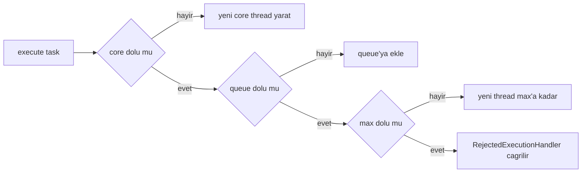
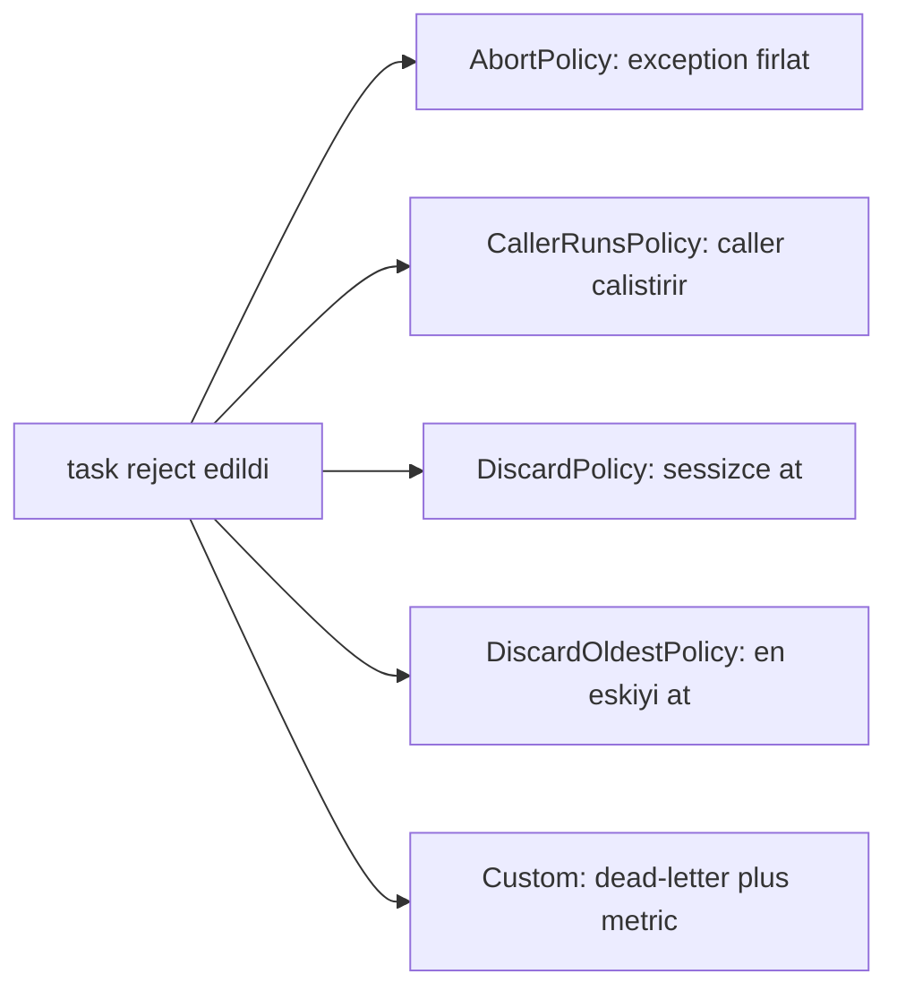
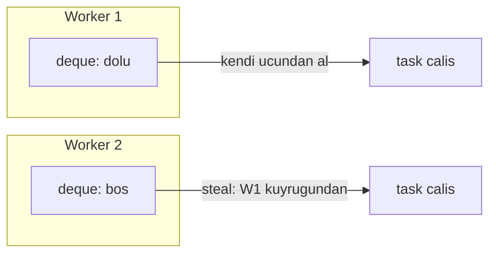

# Topic 3.4 — Executor Framework: ThreadPoolExecutor, Queues, ForkJoinPool

```admonish info title="Bu bölümde"
- `ThreadPoolExecutor`'ün 7 parametresi ve task submit karar sırası: core → queue → max → reject
- `Executors` factory tuzakları: gizli unbounded queue (OOM) ve sınırsız thread patlaması
- `BlockingQueue` aileleri ve `RejectedExecutionHandler` stratejileri — banking'de hangisi yasak, neden
- `ForkJoinPool` work-stealing ve `commonPool` blocking tuzağı (parallelStream)
- Banking pratiği: domain başına ayrı pool, named `ThreadFactory`, graceful shutdown
```

## Hedef

Java'nın **`Executor` ailesini** banking-grade kavramak. Thread lifecycle ve interrupt semantiği, `ExecutorService` API'si, `ThreadPoolExecutor`'ün 7 parametresi, bounded vs unbounded queue tuzakları (özellikle `Executors.newFixedThreadPool`'un gizli `LinkedBlockingQueue` tuzağı), `RejectedExecutionHandler` stratejileri, `ScheduledExecutorService`, `ForkJoinPool` ve common pool tuzakları, custom `ThreadFactory` (jstack için isimlendirme), graceful shutdown. Banking için: domain başına ayrı pool (transfer, notification, audit) tasarımı.

## Süre

Okuma: 2.5 saat • Kendini Sına: 45 dk • Pratik (opsiyonel): 4 saat • Toplam: ~3.5 saat (+ pratik)

## Önbilgi

- Topic 3.1, 3.2, 3.3 tamamlandı (JMM, sync, lock)
- Spring Boot service'lerde basit `@Async` veya `Thread` kullanımı duyuldu
- `Runnable`, `Callable`, `Future` interface'leri tanıdık

---

## Kavramlar

### 1. Thread lifecycle ve interrupt

Pool'ları anlamadan önce altında çalışan thread'in yaşam döngüsünü ve interrupt semantiğini bilmen gerekir — graceful shutdown tam olarak bunun üstüne kurulu. Java thread'in **`Thread.State`** enum'ı 6 değer alır:

| State | Anlam |
|---|---|
| `NEW` | Thread yaratıldı ama `start()` çağrılmadı |
| `RUNNABLE` | Çalışmaya hazır veya çalışıyor |
| `BLOCKED` | Monitor lock bekliyor (synchronized) |
| `WAITING` | Bir sinyali sınırsız bekliyor (`wait`, `join`, `park`) |
| `TIMED_WAITING` | Sınırlı süre bekliyor (`sleep`, `wait(t)`, `join(t)`, `parkNanos`) |
| `TERMINATED` | `run()` bitti veya exception |

State machine basit ama üç incelik banking için kritik:

- `RUNNABLE` **çalışıyor demek değildir** — OS scheduler'ın hazır kuyruğunda da olabilir. Gerçek CPU kullanımını JFR `jdk.ThreadCPULoad` event'i verir.
- `BLOCKED` thread cache/JIT avantajını kaybeder — uzun blok performans cezası doğurur.
- `WAITING` ve `TIMED_WAITING` ayrı state'ler ama programatik fark azdır; `jstack`'te `parking to wait for ...` veya `sleeping` görürsün.

#### Interrupt semantiği

`thread.interrupt()` thread'i **öldürmez** — sadece **interrupt flag**'ini set eder. Thread bunu kendisi kontrol etmelidir:

- `Thread.interrupted()` — flag'i okur ve **temizler**
- `Thread.currentThread().isInterrupted()` — flag'i okur, **temizlemez**

Blocking metotlar (`Thread.sleep`, `Object.wait`, `BlockingQueue.take`, `Future.get`, `lock.lockInterruptibly`) flag set ise **`InterruptedException`** fırlatır ve flag'i temizler. İşte interrupt'a uyumlu, düzgün kapanan bir worker:

```java
public class InterruptAwareWorker implements Runnable {
    @Override
    public void run() {
        try {
            while (!Thread.currentThread().isInterrupted()) {
                var task = takeNextTask();  // BlockingQueue.take throws InterruptedException
                process(task);
            }
        } catch (InterruptedException e) {
            Thread.currentThread().interrupt();  // flag'i geri set et (çok önemli!)
            log.info("Worker interrupted, shutting down gracefully");
        }
    }
}
```

Buradaki tuzak, en sık yapılan concurrency hatası: interrupt'ı yutmak. Flag'i silip hiçbir şey yapmazsan, üst katman thread'in kapanması gerektiğini asla öğrenemez.

```admonish warning title="Interrupt swallow = sessiz sızıntı"
Aşağıdaki gibi `catch (InterruptedException e) {}` boş bırakmak flag'i kaybettirir; graceful shutdown çalışmaz, thread sonsuza kadar döner. Doğrusu: ya rethrow (`throw new RuntimeException(e)`), ya da `Thread.currentThread().interrupt()` ile flag'i geri set edip kontrollü çık.
```

<mark>InterruptedException yakalayınca flag'i asla yutma — ya rethrow et ya da `Thread.currentThread().interrupt()` ile geri set et.</mark>

```java
// ❌ Yanlış — flag kaybedildi, üst seviye fark etmiyor
try {
    Thread.sleep(100);
} catch (InterruptedException e) {
    // sessizce yutuldu
}

// ✓ Doğru
try {
    Thread.sleep(100);
} catch (InterruptedException e) {
    Thread.currentThread().interrupt();  // ← anahtar
    return;  // veya gerekli graceful kapanış
}
```

---

### 2. `Executor` ve `ExecutorService` interface'leri

Framework'ün tamamı iki interface üzerine oturur; en küçük abstraction'dan başlayalım. **`Executor`** tek metotlu bir soyutlamadır — "bir işi çalıştır" der, nasıl çalıştıracağını gizler:

```java
public interface Executor {
    void execute(Runnable command);
}
```

**`ExecutorService`** bunu extend eder ve yönetim metotlarını ekler — sonuç alma, toplu çalıştırma, kapatma:

- `submit(Callable<T>)` → `Future<T>` (sonuç + exception alma), `submit(Runnable)` → `Future<?>`
- `invokeAll(Collection<Callable>)` — hepsi bitince dön; `invokeAny(...)` — ilki bitince dön
- `shutdown()` — yeni iş kabul etme, mevcutları tamamla
- `shutdownNow()` — yeni iş kabul etme, mevcutlara interrupt gönder
- `awaitTermination(timeout)` — task'ler bitene kadar bekle (timeout ile)

**`Future`** ise async sonucun taşıyıcısıdır. `get()` blocking'tir ve exception'ı unwrap eder:

```java
Future<Money> future = executor.submit(() -> fxService.fetchRate("USD/TRY"));
Money rate = future.get();                            // blocking, exception unwrap
Money rateTimeout = future.get(5, TimeUnit.SECONDS);  // timeout — her zaman tercih et
boolean cancelled = future.cancel(true);              // mayInterruptIfRunning
```

Tuzak: `future.get()`'i timeout'suz çağırmak sonsuza kadar bekleyebilir. Non-blocking chain'leri `CompletableFuture` çözer (Topic 3.5).

---

### 3. `Executors` factory'leri ve TUZAKLARI

`java.util.concurrent.Executors` factory class'ı kullanışlıdır ama production'da tehlikeli birkaç metot içerir — hepsinin ortak paydası gizli **unbounded** bir davranıştır. Önce tek tek görelim, sonra kuralı koyalım.

**`newFixedThreadPool(int n)`** — sabit thread, ama backing queue `LinkedBlockingQueue` ve capacity **`Integer.MAX_VALUE`**:

```java
ExecutorService pool = Executors.newFixedThreadPool(10);
```

Görünüşte 10 thread ile iş yapar. Gerçekte, thread'ler yetişemezse kuyruk **sınırsız büyür** → OutOfMemoryError. Somut örnek: 100 TPS gelir, 10 worker saniyede 50 iş bitirir; kuyruk saniyede 50 task büyür, 1 saatte 180.000, 1 günde 4.3 milyon pending task → heap dolar, GC döngüye girer, JVM crash.

**`newCachedThreadPool()`** — bu sefer thread sayısı unbounded, `SynchronousQueue` ile direct handoff:

```java
ExecutorService pool = Executors.newCachedThreadPool();
```

Her task için (60 sn idle thread yoksa) **yeni thread yaratır**, cap yoktur. Burst trafiği thread sayısını patlatır → OS thread limit (Linux ~32k) veya RAM (her thread ~1MB stack) tükenir. Black Friday'de 10k concurrent transfer → 10k thread → OOM.

**`newSingleThreadExecutor()`** aynı unbounded queue tuzağını taşır ama **sıralı işleme garantisi** verir (audit log, tek hesap sequential update). **`newScheduledThreadPool(int n)`** periyodik iş içindir, internal `DelayedWorkQueue` delay bazlı sıralı. **`newWorkStealingPool()`** arkada `ForkJoinPool` döndürür (bölüm 8). **`newVirtualThreadPerTaskExecutor()`** her task'e yeni virtual thread verir (Java 21+, Topic 3.7).

```admonish warning title="Factory'lerin gizli unbounded'ı"
`newFixedThreadPool` ve `newSingleThreadExecutor` → unbounded **queue** (OOM). `newCachedThreadPool` → unbounded **thread** (OOM). İkisinde de tek burst production'ı düşürebilir; hiçbiri backpressure sağlamaz.
```

<mark>Banking production'da `Executors` factory'lerini doğrudan kullanma (`newVirtualThreadPerTaskExecutor` hariç); `ThreadPoolExecutor` constructor'ını explicit kur.</mark>

---

### 4. `ThreadPoolExecutor` — explicit constructor

Kontrolü ele almanın tek yolu constructor'ı 7 parametresiyle açıkça kurmaktır — her parametre bir güvenlik kararıdır:

```java
new ThreadPoolExecutor(
    int corePoolSize,                   // min thread
    int maximumPoolSize,                // max thread
    long keepAliveTime,                 // idle thread yaşam süresi (max-core arası)
    TimeUnit unit,                      // keepAlive birimi
    BlockingQueue<Runnable> workQueue,  // pending task queue
    ThreadFactory threadFactory,        // thread naming, daemon flag
    RejectedExecutionHandler handler    // queue full / shutdown senaryosu
);
```

#### Task submit karar sırası — en kritik konu

`execute(task)` çağrıldığında pool şu sırayı izler: önce **`corePoolSize`**'a kadar thread yaratır, sonra kuyruğa iter, kuyruk dolunca **`maximumPoolSize`**'a kadar thread yaratır, o da dolunca reddeder.



Buradaki incelik banking için hayati: sıra "core → queue → max → reject" olduğundan, **queue unbounded ise ikinci adım hiç fail etmez**, üçüncü adıma hiç geçilmez.

<mark>Unbounded queue kullanırsan `maximumPoolSize` pratikte devre dışı kalır — pool asla core'un üstüne çıkmaz.</mark>

Yani `LinkedBlockingQueue` (unbounded default) ile `core = 10, max = 100` yazsan, pool **hiç 100'e çıkmaz**, 10'da kalır. Çözüm queue'ya cap koymaktır:

```java
BlockingQueue<Runnable> queue = new LinkedBlockingQueue<>(500);  // capacity 500
// veya
BlockingQueue<Runnable> queue = new ArrayBlockingQueue<>(500);   // sabit boyut array
```

#### `corePoolSize` ne kadar olmalı?

İşin doğası boyutu belirler. **CPU-bound** iş: `Runtime.availableProcessors()` veya `+1`. **IO-bound** iş: daha yüksek, Little's Law'e göre = (hedef throughput) × (ortalama request süresi).

```admonish tip title="corePoolSize'ı Little's Law ile boyutlandır"
IO-bound örnek: 100 TPS, her request 200 ms → 100 × 0.2 = 20 thread minimum. Pratik tampon için 1.5x = 30 thread. CPU-bound'da tam tersi: thread sayısını core sayısına yakın tut, fazlası context-switch israfıdır.
```

Banking pratiğinde her domain'e ayrı pool ve ayrı boyut verilir: transfer 50 (yüksek throughput), notification 10 (SMS/email IO-bound), audit 5 (DB write, low priority), FX pricing 20, report 5. Domain'i karıştırma — bir alandaki overload diğerini etkilemesin.

#### `keepAliveTime`, `allowCoreThreadTimeOut`, `prestartAllCoreThreads`

`keepAliveTime`: core'un üstündeki thread'ler bu kadar idle kalırsa termine olur; core thread'ler default'ta ölmez. `allowCoreThreadTimeOut(true)` core'ları da timeout'a tabi tutar (düşük yükte memory tasarrufu). `prestartAllCoreThreads()` lazy creation yerine core thread'leri hemen yaratır, cold start latency'sini azaltır.

```java
pool.allowCoreThreadTimeOut(true);  // trafik geceleri düşüyorsa
pool.prestartAllCoreThreads();      // cold start latency'yi kes
```

---

### 5. `BlockingQueue` ailesi — pool'un kalbi

Queue seçimi, pool'un burst karşısındaki davranışını belirler — yanlış queue ya OOM ya gereksiz reject demektir:

| Sınıf | Özellik |
|---|---|
| `ArrayBlockingQueue` | Sabit boyut, FIFO, bounded |
| `LinkedBlockingQueue` | Linked list, optional bounded (default unbounded) |
| `SynchronousQueue` | Capacity 0, direct hand-off |
| `PriorityBlockingQueue` | Priority order, **unbounded** |
| `DelayQueue` | Element'in delay'i bitince available |
| `LinkedTransferQueue` | Producer-consumer transfer semantic |

**`SynchronousQueue`** capacity 0'dır: `offer()` karşıda bekleyen `take()` yoksa hemen fail eder. `CachedThreadPool` bunu kullanır — task gelir, ya bekleyen idle thread'e handoff olur ya da fail edip yeni thread yaratılır. Bounded ve güvenli variant'ı burst'e çok iyi cevap verir:

```java
new ThreadPoolExecutor(0, 50, 60L, TimeUnit.SECONDS,
    new SynchronousQueue<>(), threadFactory, rejectionHandler);
```

Özet seçim rehberi: yüksek throughput + backpressure → `LinkedBlockingQueue(N)`; düşük latency + burst → `SynchronousQueue` + yüksek max; CPU-bound → bounded queue, thread = core; öncelikli iş (premium müşteri transferi) → `PriorityBlockingQueue` (ama unbounded olduğuna dikkat).

---

### 6. `RejectedExecutionHandler` stratejileri

Queue dolduğunda veya pool shutdown edildiğinde ne olacağını bu handler belirler — banking'de bu karar "para kayboldu mu" sorusuyla eşdeğerdir. Interface tek metotludur:

```java
public interface RejectedExecutionHandler {
    void rejectedExecution(Runnable task, ThreadPoolExecutor executor);
}
```

JDK dört default sağlar; banking'de ikisi kullanılabilir, ikisi yasaktır:



**`AbortPolicy`** (default) `RejectedExecutionException` fırlatır — caller fail'i görür, kendi error handling'ini yapar ("kuyruk dolu, retry'a alındı"). **`CallerRunsPolicy`** task'i caller thread'e çalıştırır; caller bloke olur, upstream'e doğal **backpressure** yayılır (audit gibi durdurulamayan iş için ideal).

**`DiscardPolicy`** task'i sessizce atar (hata yok), **`DiscardOldestPolicy`** en eski queued task'i atıp yeniyi ekler. İkisi de banking'de **yasaktır** — para işlemi sessizce kaybedilemez; müşteri "transferim nerede?" diye sorar. Doğru yaklaşım domain-aware bir custom handler'dır:

```java
RejectedExecutionHandler customHandler = (task, executor) -> {
    metrics.increment("transfer.rejected");
    log.error("Transfer queue full, task rejected. Queue size: {}, pool size: {}",
        executor.getQueue().size(), executor.getPoolSize());
    deadLetterQueue.offer(task);   // manual review için sakla
    throw new RejectedExecutionException("Transfer queue overloaded");
};
```

---

### 7. `ScheduledExecutorService` — zamanlı işler

Periyodik işler (FX reload, health check, reconciliation) için ayrı bir servis vardır; kurulumu explicit yapıp scheduling metotlarını görelim:

```java
ScheduledExecutorService scheduler = new ScheduledThreadPoolExecutor(
    4, namedThreadFactory("scheduler"), new ThreadPoolExecutor.AbortPolicy());

scheduler.schedule(() -> reloadFxRates(), 30, TimeUnit.SECONDS);              // one-shot
scheduler.scheduleAtFixedRate(this::reloadFxRates, 0, 30, TimeUnit.SECONDS);  // sabit aralık
scheduler.scheduleWithFixedDelay(this::healthCheck, 0, 10, TimeUnit.SECONDS); // bitince + N
```

#### `scheduleAtFixedRate` vs `scheduleWithFixedDelay`

**FixedRate** işi T, T+30, T+60... anlarında başlatır; iş 35 sn sürerse sıradaki hemen başlar (catch-up), iş uzunsa queue birikir. **FixedDelay** ise bir iş bitince N saniye bekleyip başlar — overlap asla olmaz, polling/heartbeat için idealdir.

Banking pratiği: FX rate reload (idempotent, sabit aralık) → FixedRate; health check ve reconciliation (yarım iş tehlikeli, overlap istenmez) → FixedDelay.

#### Silent kill tuzağı

En sinsi tuzak burada: periyodik task exception fırlatırsa `ScheduledExecutorService` o task'i **bir daha çağırmaz** — sessizce susar.

```admonish warning title="Scheduled task tek exception'da sonsuza kadar susar"
`scheduleAtFixedRate` içindeki task uncaught bir exception fırlatırsa periyodik çağrı tamamen durur; log'da tek satır bile görmeyebilirsin. Banking için bu ölümcül bir silent failure'dır — FX rate güncellenmeyi durdurur, kimse fark etmez. Çözüm: task gövdesini try-catch ile sar, `Throwable` yakala, log + metric üret, **rethrow etme**.
```

```java
scheduler.scheduleAtFixedRate(() -> {
    try {
        doActualWork();
    } catch (Throwable t) {
        log.error("Scheduled task failed", t);
        metrics.increment("scheduler.failure");
        // rethrow YOK → sonraki iterasyon çalışır
    }
}, 0, 10, TimeUnit.SECONDS);
```

Spring `@Scheduled` kullanıyorsan aynı korumayı `ErrorHandler` configure ederek sağla.

---

### 8. `ForkJoinPool` ve work-stealing

CPU-bound recursive işlerde (parçala-fethet) klasik pool verimsizdir; `ForkJoinPool` bunun için **work-stealing** kullanır. Her thread'in kendi **deque**'i vardır; boş kalan thread başkasının deque'sinin arka ucundan iş **çalar**:



`RecursiveTask` ile bir örnek — `fork()` işi başka thread'e gönderir, `join()` sonucu bekler:

```java
ForkJoinPool pool = new ForkJoinPool(8);

class FibonacciTask extends RecursiveTask<Long> {
    private final long n;
    FibonacciTask(long n) { this.n = n; }

    @Override
    protected Long compute() {
        if (n <= 1) return n;
        var f1 = new FibonacciTask(n - 1);
        var f2 = new FibonacciTask(n - 2);
        f1.fork();                        // başka thread'e gönder
        return f2.compute() + f1.join();  // biri burada, diğeri paralel
    }
}
long result = pool.invoke(new FibonacciTask(30));
```

#### Common pool — gizli tuzak

`ForkJoinPool.commonPool()` JVM çapında paylaşılan default pool'dur ve **`parallelStream()` ile `CompletableFuture`'ın default executor'ıdır**. Sorun şudur: bu pool'daki bir thread blocking iş yaparsa (JDBC, HTTP), tüm JVM'in parallel stream'lerini bloke eder — cascading failure.

```admonish warning title="parallelStream = commonPool = paylaşılan risk"
`ids.parallelStream().forEach(id -> processTransfer(id))` common pool'da çalışır. `processTransfer` JDBC/HTTP çağırıyorsa common pool thread'lerini bloke eder; aynı JVM'deki başka feature'ların parallel stream'leri de durur. Common pool boyutu da küçüktür: `Runtime.availableProcessors() - 1`.
```

<mark>`parallelStream` veya `CompletableFuture.xxxAsync` çağırırken her zaman kendi executor'ını pass et.</mark>

```java
CompletableFuture.supplyAsync(() -> fetchRate(), myCustomExecutor);
```

Common pool boyutunu `-Djava.util.concurrent.ForkJoinPool.common.parallelism=32` ile artırabilirsin ama gerçekten doğru çözüm kendi izole pool'unu kullanmaktır. Detay Topic 3.5'te.

---

### 9. Custom `ThreadFactory` — banking için zorunlu

Default `Executors.defaultThreadFactory()` thread'leri `pool-N-thread-M` adlandırır; production'da `jstack` çıktısında "hangi pool ne yapıyor" hiç anlaşılmaz. Custom bir **`ThreadFactory`** ile thread'lere anlamlı isim, daemon flag ve uncaught handler verirsin:

```java
public class NamedThreadFactory implements ThreadFactory {
    private final String namePrefix;
    private final boolean daemon;
    private final AtomicInteger counter = new AtomicInteger(1);
    private final Thread.UncaughtExceptionHandler uncaught;

    public NamedThreadFactory(String namePrefix, boolean daemon,
                              Thread.UncaughtExceptionHandler uncaught) {
        this.namePrefix = namePrefix;
        this.daemon = daemon;
        this.uncaught = uncaught;
    }

    @Override
    public Thread newThread(Runnable r) {
        var t = new Thread(r, namePrefix + "-" + counter.getAndIncrement());
        t.setDaemon(daemon);
        t.setUncaughtExceptionHandler(uncaught);
        return t;
    }
}
```

Kullanınca `jstack` çıktısında `transfer-pool-1`, `transfer-pool-2`... görürsün ve "transfer pool bloke" tespitini saniyeler içinde yaparsın:

```java
ThreadFactory tf = new NamedThreadFactory(
    "transfer-pool",
    false,  // non-daemon — shutdown'da bekle
    (thread, ex) -> log.error("Uncaught in {}: {}", thread.getName(), ex.getMessage(), ex)
);

var transferPool = new ThreadPoolExecutor(
    50, 100, 60L, TimeUnit.SECONDS,
    new LinkedBlockingQueue<>(500), tf, new CustomRejectionHandler());
```

Üç ayar üzerinde dur. **Daemon thread**: JVM başka non-daemon kalmayınca kapanır ve daemon'ları zorla terminate eder — banking'de tamamlanmamış transfer kaybolmasın diye **non-daemon** kullan. **`UncaughtExceptionHandler`**: pool içinde fırlayan unchecked exception'ları yakalayıp alert sistemine bağla, yoksa sessizce loglanır.

---

### 10. Graceful shutdown semantiği

Deploy/restart anında yarım kalan transfer kaybolmasın diye pool'u kontrollü kapatman gerekir; standart pattern "önce nazik, sonra zorla" akışıdır:

```java
public void shutdownGracefully(ExecutorService pool) {
    pool.shutdown();   // yeni iş kabul etme
    try {
        if (!pool.awaitTermination(30, TimeUnit.SECONDS)) {
            log.warn("Pool did not terminate in 30s, forcing shutdown");
            pool.shutdownNow();    // pending iş list döner
            if (!pool.awaitTermination(10, TimeUnit.SECONDS)) {
                log.error("Pool did not terminate even after force");
            }
        }
    } catch (InterruptedException e) {
        pool.shutdownNow();
        Thread.currentThread().interrupt();
    }
}
```

#### `shutdown()` vs `shutdownNow()`

İkisi de **async**'tir (bloke etmez); farkı mevcut ve kuyruktaki işlere ne yaptıklarıdır:

| | `shutdown()` | `shutdownNow()` |
|---|---|---|
| Yeni iş kabul | ❌ | ❌ |
| Mevcut iş | ✓ tamamlatır | ⚠️ interrupt gönderir |
| Queue'daki iş | ✓ çalışır | ❌ atar, list döner |
| Karakter | graceful | immediate |

Spring Boot'ta lifecycle'a bağlamak için `DisposableBean` veya `destroyMethod = "shutdown"` kullanılır:

```java
@Component
public class TransferPoolManager implements DisposableBean {
    private final ExecutorService transferPool;

    @Override
    public void destroy() {
        log.info("Shutting down transfer pool gracefully");
        transferPool.shutdown();
        if (!transferPool.awaitTermination(60, TimeUnit.SECONDS)) {
            log.warn("Transfer pool did not terminate gracefully, forcing");
            var pending = transferPool.shutdownNow();
            log.warn("Pending tasks: {}", pending.size());
        }
    }
}
```

Spring'in kendi task executor'ları için `application.yml`'de global await ayarı da vardır:

```yaml
spring:
  task:
    execution:
      shutdown:
        await-termination: true
        await-termination-period: 60s
```

---

### 11. Banking örneği — domain-specific pool layout

Şimdi hepsini birleştirelim: her domain'e parametreleri kendi karakterine göre ayarlanmış ayrı bir pool. Önce transfer pool'u — yüksek throughput, bounded queue, dead-letter'lı rejection:

```java
@Bean(name = "transferExecutor", destroyMethod = "shutdown")
public ExecutorService transferExecutor() {
    return new ThreadPoolExecutor(
        50, 100, 60L, TimeUnit.SECONDS,   // core 50, max 100
        new LinkedBlockingQueue<>(500),   // bounded — OOM koruması
        new NamedThreadFactory("transfer", false, transferUncaughtHandler()),
        new TransferRejectedHandler()     // dead-letter queue
    );
}
```

Notification ve audit farklı karakterde: notification daemon olabilir ve kayıp tolere edilebilir; audit ise kaybedilmemeli, o yüzden büyük queue + `CallerRunsPolicy` (backpressure) alır:

```java
@Bean(name = "notificationExecutor", destroyMethod = "shutdown")
public ExecutorService notificationExecutor() {
    return new ThreadPoolExecutor(
        10, 30, 60L, TimeUnit.SECONDS,
        new LinkedBlockingQueue<>(1000),
        new NamedThreadFactory("notify", true, defaultUncaught()),  // daemon
        new ThreadPoolExecutor.CallerRunsPolicy());
}

@Bean(name = "auditExecutor", destroyMethod = "shutdown")
public ExecutorService auditExecutor() {
    return new ThreadPoolExecutor(
        5, 5, 0L, TimeUnit.MILLISECONDS,  // fixed
        new LinkedBlockingQueue<>(5000),  // büyük queue, audit kaybolmasın
        new NamedThreadFactory("audit", false, auditUncaught()),
        new ThreadPoolExecutor.CallerRunsPolicy());  // backpressure
}
```

Bu tasarımın altında yatan altı prensip: domain başına ayrı pool (izolasyon), naming convention (jstack), bounded queue (OOM koruması), uncaught handler (log + metric), domain-aware rejection policy ve graceful shutdown.

<details>
<summary>Tam kod: ThreadPoolConfig (~48 satır)</summary>

```java
@Configuration
public class ThreadPoolConfig {

    @Bean(name = "transferExecutor", destroyMethod = "shutdown")
    public ExecutorService transferExecutor() {
        return new ThreadPoolExecutor(
            50,                              // core
            100,                             // max
            60L, TimeUnit.SECONDS,           // keep alive
            new LinkedBlockingQueue<>(500),  // bounded queue
            new NamedThreadFactory("transfer", false, transferUncaughtHandler()),
            new TransferRejectedHandler()    // dead-letter queue
        );
    }

    @Bean(name = "notificationExecutor", destroyMethod = "shutdown")
    public ExecutorService notificationExecutor() {
        return new ThreadPoolExecutor(
            10, 30, 60L, TimeUnit.SECONDS,
            new LinkedBlockingQueue<>(1000),
            new NamedThreadFactory("notify", true, defaultUncaught()),  // daemon — kaybolabilir
            new ThreadPoolExecutor.CallerRunsPolicy()
        );
    }

    @Bean(name = "auditExecutor", destroyMethod = "shutdown")
    public ExecutorService auditExecutor() {
        return new ThreadPoolExecutor(
            5, 5, 0L, TimeUnit.MILLISECONDS,  // fixed
            new LinkedBlockingQueue<>(5000),  // büyük queue, audit kaybedilmemeli
            new NamedThreadFactory("audit", false, auditUncaught()),
            new ThreadPoolExecutor.CallerRunsPolicy()  // backpressure
        );
    }

    @Bean(name = "scheduledExecutor", destroyMethod = "shutdown")
    public ScheduledExecutorService scheduledExecutor() {
        var s = new ScheduledThreadPoolExecutor(
            4,
            new NamedThreadFactory("scheduler", false, defaultUncaught())
        );
        s.setRemoveOnCancelPolicy(true);
        return s;
    }
}
```

</details>

---

### 12. Pool monitoring — banking observability

Bounded pool ancak izlenirse güvenlidir; queue dolmaya başladığını alert almadan öğrenmek istemezsin. `ThreadPoolExecutor` introspection metotları bunu sağlar:

```java
pool.getActiveCount();        // şu an çalışan thread
pool.getPoolSize();           // toplam thread (idle dahil)
pool.getQueue().size();       // pending task
pool.getCompletedTaskCount(); // tamamlanan
pool.getTaskCount();          // toplam görev (queue'dakiler dahil)
```

Bunları Micrometer/Prometheus'a gauge olarak bağlarsın:

```java
@Bean
public MeterBinder threadPoolMetrics(ThreadPoolExecutor transferPool) {
    return registry -> {
        Gauge.builder("transfer.pool.active", transferPool, ThreadPoolExecutor::getActiveCount)
            .register(registry);
        Gauge.builder("transfer.pool.queue.size", transferPool, p -> p.getQueue().size())
            .register(registry);
    };
}
```

Alert eşikleri: `queue.size > capacity * 0.8` → warning, `> 0.95` → critical; `active == max` sürekli ise pool yetmiyor demektir (ölçeklendir); `completed/elapsed` düşüyorsa contention veya downstream slowdown vardır.

---

### 13. Anti-pattern'ler

Mülakatta "bu kodda ne yanlış?" sorusunun cephaneliği burası; onunu sırala:

1. **`newCachedThreadPool` production'da** — unbounded thread, OOM riski. Custom `ThreadPoolExecutor`'a geç.
2. **`newFixedThreadPool` production'da** — unbounded queue, burst OOM.
3. **`parallelStream` banking'de** — common pool blocking, başka feature'ları etkiler. Kendi executor'ını kullan.
4. **Pool naming yok** — `pool-3-thread-7` jstack'te debugging cehennemi.
5. **Scheduled task'te exception silent kill** — try-catch ile sar, log, devam et.
6. **Aynı pool'a karışık iş** — transfer + notification + audit tek pool'da → head-of-line blocking.
7. **`Future.get()` timeout'suz** — sonsuza kadar bekler; her zaman `get(timeout, unit)`.
8. **Submit edilen task'te exception swallow** — `future.get()` ile al veya uncaught handler bağla.
9. **`shutdown` çağrılmamış** — non-daemon thread varsa JVM kapanmaz.
10. **Virtual thread olmadan thread-per-request** — Java 21 öncesi classical bounded pool doğru; virtual thread detayı Topic 3.7.

```java
// Anti-pattern 7 ve 8 örneği
future.get();                    // ❌ sonsuza kadar bekler → get(5, SECONDS) kullan
pool.submit(() -> {
    try { doWork(); }
    catch (Exception e) { /* ❌ sessizce kaybediliyor */ }
});
```

---

## Önemli olabilecek araştırma kaynakları

- "Java Concurrency in Practice" Goetz, Chapter 6 (Task Execution) ve 8 (Applying Thread Pools)
- ThreadPoolExecutor JavaDoc (resmi, çok bilgi)
- "Modern Java in Action" Manning, executor framework chapter
- Brian Goetz — "Java concurrency, in retrospect" talk
- Doug Lea — "Concurrent programming in Java" (kitap)
- "Little's Law" Wikipedia (queueing theory)
- ForkJoinPool JEP ve JavaDoc
- Spring Boot AsyncConfigurer, TaskExecutor docs
- Micrometer thread pool metrics docs
- Heinz Kabutz — "Newsletter on executor pitfalls" (article series)

---

## Kendini Sına

Aşağıdaki soruları önce **cevaba bakmadan** kendi cümlelerinle yanıtlamayı dene — hepsi TR bank mülakatlarında karşına çıkabilecek tarzda. Takıldığın soruda ilgili Kavramlar başlığına dön, sonra tekrar dene.

**S1. `ThreadPoolExecutor`'de core, max ve queue arasındaki ilişki nedir? Bir task submit edildiğinde thread yaratma sırası nasıl işler?**

<details>
<summary>Cevabı göster</summary>

Sıra şudur: önce `corePoolSize`'a kadar yeni thread yaratılır; core doluysa task kuyruğa itilir; kuyruk da doluysa `maximumPoolSize`'a kadar yeni thread yaratılır; o da doluysa `RejectedExecutionHandler` çağrılır. Yani "core → queue → max → reject".

Kritik nokta: queue adımı max adımından önce gelir. Bu yüzden queue büyükse pool önce kuyruğu doldurmayı tercih eder, max'a geç ulaşır. Pratikte core normal yükü, max burst'ü, queue ise aradaki tamponu karşılar.

</details>

**S2. `Executors.newFixedThreadPool(10)` çağırdın. Bu kodun production'da hangi gizli tehlikesi var?**

<details>
<summary>Cevabı göster</summary>

Backing queue capacity'si `Integer.MAX_VALUE` olan bir `LinkedBlockingQueue`'dur, yani pratikte **unbounded**. 10 thread gelen yükü karşılayamazsa kuyruk sınırsız büyür ve heap dolunca OutOfMemoryError ile JVM crash olur.

Somut hesap: 100 TPS gelir, 10 worker saniyede 50 iş bitirir → kuyruk saniyede 50 task büyür, 1 günde ~4.3 milyon pending task. Görünürde "sabit 10 thread" güvenli sanılır ama backpressure yoktur; bir trafik artışı sessizce belleği tüketir.

</details>

**S3. Neden banking production'da `Executors` factory metotlarından kaçınıp `ThreadPoolExecutor` constructor'ını explicit kullanırız?**

<details>
<summary>Cevabı göster</summary>

Çünkü factory metotlarının hepsinde gizli bir unbounded davranış vardır: `newFixedThreadPool` ve `newSingleThreadExecutor` unbounded **queue** (OOM), `newCachedThreadPool` unbounded **thread** (OOM) kullanır. Hiçbiri backpressure sağlamaz ve queue capacity, rejection policy, thread naming gibi kritik parametreleri kontrol etmene izin vermez.

Explicit constructor 7 parametrenin tümünü açar: bounded queue ile OOM'u önlersin, custom `RejectedExecutionHandler` ile reddi domain'e göre yönetirsin (dead-letter), named `ThreadFactory` ile jstack'i okunur yaparsın. Tek istisna `newVirtualThreadPerTaskExecutor` (Java 21+), çünkü orada pool semantiği farklıdır.

</details>

**S4. Bir pool'a `core=10, max=100` ve `new LinkedBlockingQueue<>()` (capacity'siz) verdin. Yük altında pool kaç thread'e çıkar?**

<details>
<summary>Cevabı göster</summary>

Sadece 10'da kalır, 100'e asla çıkmaz. Sebep task submit sırasıdır: core dolunca task kuyruğa itilir ve kuyruk unbounded olduğu için `offer()` hiç fail etmez. Max thread yaratımı ancak kuyruk dolduğunda tetiklendiğinden, o adıma hiç ulaşılmaz.

Sonuç: `maximumPoolSize` pratikte devre dışı kalır ve fazla task sessizce kuyrukta birikir (OOM riski). Çözüm queue'ya cap koymaktır: `new LinkedBlockingQueue<>(500)` veya `new ArrayBlockingQueue<>(500)`.

</details>

**S5. `RejectedExecutionHandler`'ın 4 default stratejisi nedir? Banking'de hangileri yasaktır, neden?**

<details>
<summary>Cevabı göster</summary>

`AbortPolicy` (default) `RejectedExecutionException` fırlatır; caller fail'i görüp handle eder. `CallerRunsPolicy` task'i caller thread'e çalıştırır, upstream'e backpressure yayar. `DiscardPolicy` task'i sessizce atar; `DiscardOldestPolicy` en eski queued task'i atıp yeniyi ekler.

Banking'de `DiscardPolicy` ve `DiscardOldestPolicy` **yasaktır** — bir para işlemi sessizce kaybedilemez veya en eski transfer atılamaz; müşteri "transferim nerede?" diye sorar. Doğrusu custom bir handler'dır: metric artır, hata logla, task'i dead-letter queue'ya yaz, sonra exception fırlat.

</details>

**S6. `scheduleAtFixedRate` ile çalışan periyodik bir task exception fırlatırsa ne olur? Nasıl korunursun?**

<details>
<summary>Cevabı göster</summary>

Task uncaught bir exception fırlatırsa `ScheduledExecutorService` o periyodik task'i **bir daha çağırmaz** — sessizce durur, çoğu zaman görünür bir log bile üretmez. Banking'de bu ölümcül bir silent failure'dır (örn. FX rate reload durur, kimse fark etmez).

Korunma: task gövdesini try-catch ile sarıp `Throwable` yakala, log + metric üret ve **rethrow etme** — böylece sonraki iterasyon çalışmaya devam eder. Spring `@Scheduled` kullanıyorsan aynı korumayı `ErrorHandler` configure ederek sağlarsın.

</details>

**S7. `parallelStream()` banking iş yükünde neden tehlikeli olabilir? Doğru yaklaşım nedir?**

<details>
<summary>Cevabı göster</summary>

`parallelStream()` ve `CompletableFuture.xxxAsync()` default olarak JVM çapında paylaşılan `ForkJoinPool.commonPool()`'da çalışır. İçindeki task JDBC/HTTP gibi blocking iş yaparsa common pool thread'lerini bloke eder ve aynı JVM'deki tüm parallel stream'leri durdurur — cascading failure. Ayrıca common pool küçüktür (`availableProcessors() - 1`).

Doğrusu kendi izole executor'ını pass etmektir: `CompletableFuture.supplyAsync(() -> fetchRate(), myExecutor)`. Common pool parallelism'ini `-D` flag'iyle artırmak da mümkündür ama gerçek çözüm domain'e ait ayrı bir bounded pool kullanmaktır.

</details>

**S8. `shutdown()` ile `shutdownNow()` arasındaki fark nedir? Banking'de graceful shutdown nasıl yapılır?**

<details>
<summary>Cevabı göster</summary>

`shutdown()` yeni iş kabulünü keser ama mevcut ve kuyruktaki işleri tamamlatır (graceful). `shutdownNow()` yeni iş kabulünü keser, çalışan işlere interrupt gönderir ve kuyruktakileri atıp bir liste olarak döner (immediate). İkisi de async'tir, bloke etmez.

Banking pattern'i "önce nazik, sonra zorla": `shutdown()` → `awaitTermination(30-60s)` → hâlâ bitmediyse `shutdownNow()` → tekrar kısa `awaitTermination`. Spring'de bunu `DisposableBean.destroy()` veya `destroyMethod = "shutdown"` ile lifecycle'a bağlarsın ki deploy sırasında yarım transfer kaybolmasın; bu yüzden pool thread'leri de non-daemon olmalıdır.

</details>

---

## Tamamlama kriterleri

- [ ] `Executors` factory metotlarının tuzaklarını (unbounded queue vs thread) ezberimde
- [ ] `ThreadPoolExecutor`'un 7 constructor parametresini tek tek tanımlayabiliyorum
- [ ] Thread yaratma sırasını (core → queue → max → reject) ve unbounded queue'nun max'ı nasıl devre dışı bıraktığını anlatabiliyorum
- [ ] Bounded queue ile pool tasarımını ve queue full reject davranışını açıklayabiliyorum
- [ ] `NamedThreadFactory`'nin jstack açısından önemini biliyorum
- [ ] 4 default `RejectedExecutionHandler`'ı ve banking için yasak olanları söyleyebiliyorum
- [ ] `ScheduledExecutor` silent kill bug'ını ve wrapper çözümünü anlatabiliyorum
- [ ] `fixedRate` vs `fixedDelay` farkını örnekle açıklayabiliyorum
- [ ] `ForkJoinPool.commonPool` blocking tuzağını ve kendi pool ile izolasyonu biliyorum
- [ ] Domain-specific pool layout'u (transfer/notification/audit/scheduled) tasarlayabiliyorum
- [ ] Graceful shutdown pattern'ini (`shutdown` → `awaitTermination` → `shutdownNow`) biliyorum
- [ ] Pool monitoring metric'i ile alert eşiği belirleyebiliyorum
- [ ] `Future.get()` timeout'unu ve interrupt flag re-set kuralını her zaman uyguluyorum
- [ ] (Opsiyonel) "Pratik yapmak istersen" bölümündeki testleri yazdım ve Claude-verify prompt'uyla doğrulattım

Hepsi onaylı → Topic 3.5'e geç → [05-completable-future/](../05-completable-future/index.md)

---

## Defter notları

1. "`Executors.newFixedThreadPool`'un gizli tuzağı: ____. Banking'de bunun anlamı: ____."
2. "`ThreadPoolExecutor`'un 7 parametresi: ____."
3. "Thread yaratma sırası: ____ → ____ → ____ → ____. Unbounded queue'da hangi adım atlanır: ____."
4. "`NamedThreadFactory`'nin önemi (jstack perspektifi): ____."
5. "`RejectedExecutionHandler` 4 default'u: ____. Banking için yasak olanlar: ____."
6. "`scheduleAtFixedRate` exception fırlatınca: ____. Çözüm: ____."
7. "`parallelStream` ve `CompletableFuture` default executor: ____. Banking'de tuzağı: ____."
8. "`shutdown()` vs `shutdownNow()` farkı: ____."
9. "Banking için domain-specific pool layout: ____ ve gerekçesi: ____."
10. "Interrupt swallow neden yasak: ____. Doğru yaklaşım: ____."

```admonish success title="Bölüm Özeti"
- Task submit sırası core → queue → max → reject; unbounded queue max parametresini devre dışı bırakır, o yüzden queue her zaman bounded olmalı
- `Executors` factory'leri gizli unbounded (fixed/single → queue, cached → thread) davranışıyla OOM riski taşır — production'da `ThreadPoolExecutor` constructor'ını explicit kur
- `RejectedExecutionHandler`: Abort ve CallerRuns banking'de kullanılır, Discard/DiscardOldest yasaktır; kritik iş için dead-letter'lı custom handler
- `ScheduledExecutorService` tek exception'da periyodik task'i sessizce durdurur — gövdeyi try-catch ile sar, rethrow etme
- `parallelStream`/`CompletableFuture` default `commonPool`'u paylaşır; blocking iş cascading failure yaratır — kendi executor'ını pass et
- Banking pratiği: domain başına ayrı pool + bounded queue + named non-daemon `ThreadFactory` + graceful shutdown (`shutdown` → `awaitTermination` → `shutdownNow`)
```

---

## Pratik yapmak istersen

Kavramları koda dökmek istersen aşağıdaki iki ek hazır: test yazma rehberi bounded queue reject, scheduled silent kill, thread naming ve graceful shutdown için örnek testler içerir; Claude-verify prompt'u ile yazdığın executor kodunu banking-grade perspektiften denetletebilirsin. Süre: testler ~2 saat, verify ~30 dk. Tamamlama kriteri: en az bir bounded pool + named factory + custom rejection yazıp reject sayısını doğrulamak ve scheduled silent kill'i reprodüksiyon edip wrapper ile düzeltmek.

<details>
<summary>Test yazma rehberi</summary>

### Test 3.4.1 — Bounded queue reject

```java
@Test
void boundedPoolRejectsAfterCapacity() throws Exception {
    int core = 2, max = 4, queue = 5;
    var rejected = new AtomicInteger();

    var pool = new ThreadPoolExecutor(
        core, max, 60L, TimeUnit.SECONDS,
        new LinkedBlockingQueue<>(queue),
        new NamedThreadFactory("test", false, (t, e) -> {}),
        (r, exec) -> rejected.incrementAndGet()
    );

    var latch = new CountDownLatch(1);
    // 4 thread busy + 5 queued = 9 task'e kadar OK
    for (int i = 0; i < 20; i++) {
        pool.execute(() -> {
            try { latch.await(); } catch (InterruptedException e) {
                Thread.currentThread().interrupt();
            }
        });
    }

    // 20 - 9 = 11 reject
    assertThat(rejected.get()).isEqualTo(11);

    latch.countDown();
    pool.shutdown();
    assertThat(pool.awaitTermination(5, TimeUnit.SECONDS)).isTrue();
}
```

### Test 3.4.2 — `ScheduledExecutor` silent kill ve fix

```java
@Test
void scheduledTaskStopsOnException_butWrapperFixes() throws Exception {
    var scheduler = new ScheduledThreadPoolExecutor(1);
    var counter = new AtomicInteger();

    // Wrap to ensure continuation
    scheduler.scheduleAtFixedRate(() -> {
        try {
            counter.incrementAndGet();
            if (counter.get() == 3) throw new RuntimeException("boom");
        } catch (Throwable t) {
            // swallowed → next iteration runs
        }
    }, 0, 50, TimeUnit.MILLISECONDS);

    Thread.sleep(500);

    // wrapper sayesinde sayaç 5'ten büyük olmalı
    assertThat(counter.get()).isGreaterThan(5);
    scheduler.shutdown();
}

@Test
void scheduledTaskWithoutWrapperStopsAtFirstException() throws Exception {
    var scheduler = new ScheduledThreadPoolExecutor(1);
    var counter = new AtomicInteger();

    scheduler.scheduleAtFixedRate(() -> {
        counter.incrementAndGet();
        if (counter.get() == 3) throw new RuntimeException("boom");
    }, 0, 50, TimeUnit.MILLISECONDS);

    Thread.sleep(500);

    // 3'te dururdu — wrapper yok
    assertThat(counter.get()).isEqualTo(3);
    scheduler.shutdown();
}
```

### Test 3.4.3 — Thread naming jstack uyumlu

```java
@Test
void threadFactoryNamesThreadsCorrectly() throws Exception {
    var factory = new NamedThreadFactory("test-pool", false, (t, e) -> {});
    var pool = Executors.newFixedThreadPool(3, factory);
    var names = new CopyOnWriteArrayList<String>();

    for (int i = 0; i < 3; i++) {
        pool.submit(() -> names.add(Thread.currentThread().getName()));
    }

    pool.shutdown();
    assertThat(pool.awaitTermination(2, TimeUnit.SECONDS)).isTrue();

    assertThat(names).allMatch(n -> n.startsWith("test-pool-"));
}
```

### Test 3.4.4 — Graceful shutdown completes pending tasks

```java
@Test
void shutdownCompletesPendingTasks() throws Exception {
    var pool = Executors.newFixedThreadPool(2);
    var completed = new AtomicInteger();

    for (int i = 0; i < 5; i++) {
        pool.submit(() -> {
            try { Thread.sleep(200); } catch (InterruptedException e) {
                Thread.currentThread().interrupt();
                return;
            }
            completed.incrementAndGet();
        });
    }

    pool.shutdown();
    assertThat(pool.awaitTermination(5, TimeUnit.SECONDS)).isTrue();

    assertThat(completed.get()).isEqualTo(5);
}
```

### Bonus — Manuel deneyler

> `parallelStream` common pool blocking: `IntStream.range(0, 100).boxed().toList().parallelStream().forEach(id -> sleep(1000))` çalışırken aynı anda başka thread'de `IntStream.range(0, 100).parallel().sum()` çağır — ikincinin bloke olduğunu gözlemle. Sonra aynı işi `new ForkJoinPool(16).submit(...)` ile izole çalıştırıp karşılaştır.
>
> Domain-specific pool + jstack: bölümdeki `ThreadPoolConfig`'i kurup 1000 task submit et, `jstack <pid>` çıktısında `transfer-1`, `notify-1`, `audit-1` isimlerini gör. Pool monitoring için `getActiveCount()` / `getQueue().size()` / `getCompletedTaskCount()`'u her saniye logla ve queue size'ın zamanla nasıl değiştiğini izle.

</details>

<details>
<summary>Claude-verify prompt</summary>

```
Aşağıdaki Java kodum executor framework'ünü öğrenmeye yönelik. Lütfen değerlendir
ve EKSİKLERİ söyle, kod yazma:

1. Executors factory tuzakları:
   - `newFixedThreadPool`'un unbounded queue tuzağı not edilmiş mi?
   - `newCachedThreadPool`'un unbounded thread tuzağı not edilmiş mi?
   - Production'da `Executors`'i değil custom `ThreadPoolExecutor` kullanma kuralı uygulanmış mı?

2. ThreadPoolExecutor parametreleri:
   - Core, max, keepAlive, queue, factory, rejection hepsi explicit set edilmiş mi?
   - Bounded queue kullanılmış mı (LinkedBlockingQueue(N) veya ArrayBlockingQueue)?
   - Thread yaratma sırası (core → queue → max → reject) anlaşılmış mı?

3. NamedThreadFactory:
   - Thread isimleri "<pool>-<n>" formatında mı?
   - Daemon flag set edilmiş mi (banking için non-daemon default)?
   - UncaughtExceptionHandler ile log + metric var mı?

4. RejectedExecutionHandler:
   - 4 default strategy'nin (Abort, CallerRuns, Discard, DiscardOldest) farkları bilinmiyor mu?
   - Banking için DiscardPolicy/DiscardOldest yasak — uyulmuş mu?
   - Custom handler dead-letter queue + metric ile yazılmış mı?

5. ScheduledExecutorService:
   - fixedRate vs fixedDelay farkı bilinmiyor mu?
   - Exception silent kill problemi anlaşılmış mı?
   - Wrapper try-catch ile fix var mı?

6. ForkJoinPool:
   - Common pool tuzağı (parallelStream blocking) reproduce edilmiş mi?
   - Kendi ForkJoinPool ile izolasyon yapılmış mı?
   - Common pool boyutu (-D flag) ayarlama bilgisi var mı?

7. Domain-specific pool layout:
   - Transfer / notification / audit / scheduled ayrı pool'lar tasarlanmış mı?
   - Her pool'un parametreleri (core, max, queue, rejection) domain'e uygun mu?
   - Naming convention pool başına farklı mı?

8. Graceful shutdown:
   - shutdown() → awaitTermination → shutdownNow pattern var mı?
   - @PreDestroy veya destroyMethod="shutdown" ile lifecycle bağlı mı?
   - Timeout makul mü (30-60s)?

9. Pool monitoring:
   - getActiveCount, getQueue().size(), getCompletedTaskCount kullanılmış mı?
   - Metric binding (Micrometer veya custom) yapılmış mı?
   - Alert eşikleri (queue > 80%) düşünülmüş mü?

10. Anti-pattern kontrolü:
    - Future.get() timeout'suz çağrılmış mı?
    - Submit edilen task içinde exception swallowing mı?
    - parallelStream banking iş yükünde kullanılmış mı?
    - Aynı pool'da karışık domain task'leri var mı?

Her madde için PASS / FAIL / EKSIK. Kod yazma, sadece eksiklikleri söyle.
```

</details>
