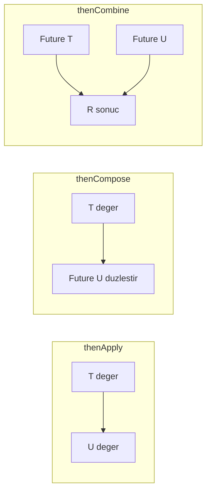
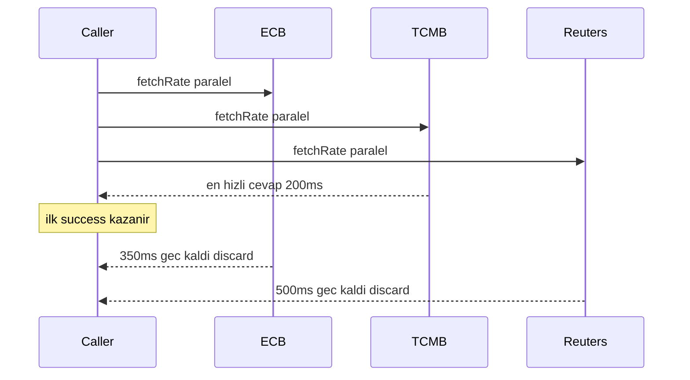
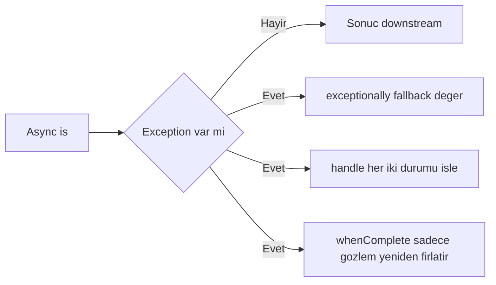

# Topic 3.5 — CompletableFuture & Async Composition

```admonish info title="Bu bölümde"
- `Future`'ın neden yetmediği ve `CompletableFuture`'ın `CompletionStage` chain modeli ile non-blocking pipeline kurması
- `thenApply` vs `thenCompose` vs `thenCombine` — sync transform, async chain, iki paralel future'ı birleştirme
- `allOf` vs `anyOf` farkı, custom executor zorunluluğu (common pool tuzağı) ve `CompletionException` unwrap pattern'i
- `exceptionally` / `handle` / `whenComplete` ve `orTimeout` / `completeOnTimeout` ile fail-soft async tasarım
- Banking klasiği: 3 FX provider'dan paralel fetch + first-wins + fallback + uçtan uca transfer pipeline
```

## Hedef

`CompletableFuture` API'sini banking-grade kullanabilmek. `supplyAsync` vs `runAsync`, `thenApply` vs `thenCompose` vs `thenCombine` farkları, `allOf` vs `anyOf` koşullarını net ayırmak, exception handling (`exceptionally`, `handle`, `whenComplete`), timeout (`orTimeout`, `completeOnTimeout`), **custom executor pass etmenin neden zorunlu olduğunu** (common pool tuzağı), `CompletionException` unwrap pattern'i. Banking örneği: **3 FX rate provider'dan paralel fetch + anyOf first-wins + fallback**.

## Süre

Okuma: 2.5 saat • Kendini Sına: 45 dk • Pratik (opsiyonel): 3-4 saat • Toplam: ~3.5 saat (+ pratik)

## Önbilgi

- Topic 3.1-3.4 tamamlandı (JMM, sync, locks, executor)
- Lambda ve method reference syntax tanıdık
- `Future` interface'i (`get`, `cancel`) tanıdık
- `ExecutorService` ile basit task submit yapabiliyorsun

---

## Kavramlar

### 1. `Future` neden yetmiyor?

Birden fazla FX rate'i paralel çekip sonuçları zincirlemek istediğinde `Future` seni yarı yolda bırakır. Çünkü tek yaptığı, sonucu **bloke ederek** beklemek:

```java
Future<Money> future = executor.submit(() -> fxService.fetchRate("USD/TRY"));
Money rate = future.get();   // ❌ BLOCKING
```

`Future` API'sinin sınırları:

- `get()` blocking — caller thread bekler
- Chain edemezsin — "result geldiğinde X yap" diye non-blocking pattern yok
- Exception handling primitive — try-catch `get()` etrafında
- Multiple future combine zor — manuel logic
- Cancel semantik kısıtlı

**`CompletableFuture` (Java 8+)** bunu çözer:

- `CompletionStage` interface'ini implement eder, chain'lenebilir
- `thenApply`, `thenAccept`, `thenRun` — sonuca callback
- `thenCompose` — async chain
- `allOf` / `anyOf` — combinator'lar
- `exceptionally` / `handle` — error transform
- `orTimeout` — declarative timeout

---

### 2. `CompletableFuture` yaratma yolları

Bir future'ı elde etmenin dört yolu var; hangisinin ne zaman doğru olduğunu bilmek pipeline'ın başlangıç noktasını belirler.

#### Hazır değer

Elinde sonuç zaten varsa (test/mock) doğrudan tamamlanmış bir future üret:

```java
var ready = CompletableFuture.completedFuture(Money.of("100", "TRY"));
// ya da
var failed = CompletableFuture.failedFuture(new RuntimeException("boom"));
```

#### Manuel complete

Callback-based bir API'yi future'a çevirmek gibi custom async source'lar için:

```java
var future = new CompletableFuture<Money>();
// başka yerde:
future.complete(Money.of("100", "TRY"));
// veya
future.completeExceptionally(new RuntimeException("fail"));
```

#### `supplyAsync` — değer üretir

En yaygın giriş noktası. Bir `Supplier` alır, sonucu future'a koyar:

```java
CompletableFuture<Money> future = CompletableFuture.supplyAsync(() -> 
    fxService.fetchRate("USD/TRY")
);
```

Default `ForkJoinPool.commonPool()` üzerinde çalışır — **banking'de yasak** (bir sonraki bölüm).

#### `runAsync` — değer dönmez (`Runnable`)

Sonuç üretmeyen yan-etki işleri için:

```java
CompletableFuture<Void> future = CompletableFuture.runAsync(() -> 
    auditService.log("Transfer completed")
);
```

Fire-and-forget benzeri ama future'ı await edebilirsin.

---

### 3. Custom executor pass etme — banking zorunluluğu

Bu bölümün en kritik kuralı burada. `supplyAsync`'e executor vermezsen tüm uygulamanın paylaştığı ortak havuza düşersin:

```java
CompletableFuture.supplyAsync(() -> fetchRate(), myExecutor);
```

**Neden zorunlu:**

- Default **common pool** boyutu: `processors - 1` (8 core'da 7 thread)
- **Tüm parallel stream + tüm CompletableFuture** common pool'u paylaşır
- IO bound iş (FX fetch HTTP çağrısı) common pool thread'ini **bloke eder**
- Diğer parallel iş yavaşlar veya durur
- Cascading slowdown / outage

Banking pratiği: domain başına ayrı pool, her async çağrıda pass et.

```java
@Component
public class FxService {
    private final ExecutorService fxExecutor;  // Topic 3.4'te yarattık
    
    public CompletableFuture<Money> fetchRateAsync(CurrencyPair pair) {
        return CompletableFuture.supplyAsync(() -> fetchRate(pair), fxExecutor);
    }
}
```

Sadece `supplyAsync` değil — **`Async` ekli her metot** (`thenApplyAsync`, `thenAcceptAsync`, `thenRunAsync`, `thenComposeAsync`, `thenCombineAsync`, ...) executor almazsa yine common pool'a düşer:

```java
future.thenApplyAsync(rate -> convertAmount(rate), myExecutor);
```

<mark>Banking'de her async çağrıya (`supplyAsync` ve tüm `*Async` metotları) custom executor pass et — common pool asla</mark>. `Async` eki olmayan `thenApply`, `thenAccept` ise **çağıran thread'de** veya **önceki future'ın bittiği thread'de** çalışır; hızlı transformasyonlar için kabul edilebilir ama davranışı bilmek şart.

```admonish warning title="Common pool tuzağı"
Common pool JVM'de tektir ve `parallelStream()` ile paylaşılır. Bir FX HTTP çağrısı burada 30 saniye bloke olursa, alakasız bir rapor üreten `parallelStream` de durur. Banking'de bir domain'in yavaşlığı diğerini boğmamalı — izolasyon için domain-specific pool tek çözüm.
```

---

### 4. `thenApply` vs `thenCompose` vs `thenCombine`

Bir future'ın sonucunu dönüştürmenin veya başka future'larla birleştirmenin üç yolu var; aralarındaki fark tip imzasında saklı.



#### `thenApply(Function<T, U>)` — sync transform

`T` alır, `U` döner; `Optional.map` benzeri zihinsel model. Lambda **blocking olmamalı**:

```java
CompletableFuture<Money> rateFuture = fxService.fetchRateAsync("USD/TRY");

CompletableFuture<Money> convertedAmount = rateFuture.thenApply(rate -> {
    return Money.of(rate.amount().multiply(new BigDecimal("100")), rate.currency());
});
```

#### `thenCompose(Function<T, CompletableFuture<U>>)` — async chain

`T` alır, **future** döner; `Optional.flatMap` benzeri. Pratik anlamı: "ilk async iş bitti, sonucuna göre **başka** bir async iş başlat":

```java
CompletableFuture<Account> accountFuture = accountService.findAsync(id);

CompletableFuture<Money> balanceConverted = accountFuture.thenCompose(account -> {
    return fxService.fetchRateAsync(account.currency())
        .thenApply(rate -> rate.multiply(account.balance().amount(), HALF_EVEN));
});
```

**`thenApply` vs `thenCompose` farkı** — özü nesting'de:

- `thenApply(rate -> heavyComputation)` → `CompletableFuture<Money>` — sync iş, doğru
- `thenApply(rate -> callOtherService())` → `CompletableFuture<CompletableFuture<Money>>` — **nested**, kötü
- `thenCompose(rate -> callOtherService())` → `CompletableFuture<Money>` — düzleştirilmiş

<mark>Lambda `CompletableFuture` döndürüyorsa `thenCompose` kullan; aksi halde `thenApply`</mark>.

#### `thenCombine(other, BiFunction<T, U, R>)` — iki future birleştir

İki future paralel çalışır, **her ikisi de bittiğinde** combiner devreye girer:

```java
CompletableFuture<Money> usdRate = fxService.fetchRateAsync("USD/TRY");
CompletableFuture<Money> eurRate = fxService.fetchRateAsync("EUR/TRY");

CompletableFuture<Money> spread = usdRate.thenCombine(eurRate, (usd, eur) -> {
    return usd.subtract(eur);
});
```

3+ future söz konusuysa `allOf` daha temiz (bir sonraki madde).

---

### 5. `thenAccept` ve `thenRun` — yan etki

Sonucu dönüştürmeyip sadece kullanacaksan (log, metric, notify) chain'in **sonunu** bu ikisi kapatır:

```java
future.thenAccept(rate -> log.info("Got rate: {}", rate));    // T → void

future.thenRun(() -> log.info("Future completed"));            // no input → void
```

**Return value yok** — bu yüzden ikisi de chain'in ucudur.

---

### 6. `allOf` — hepsi bittiğinde

Bağımsız birden fazla sorguyu paralel çekip **hepsi bittikten sonra** birleştirmek istediğinde `allOf` kullanılır:

```java
var f1 = fxService.fetchRateAsync("USD/TRY");
var f2 = fxService.fetchRateAsync("EUR/TRY");
var f3 = fxService.fetchRateAsync("GBP/TRY");

CompletableFuture<Void> all = CompletableFuture.allOf(f1, f2, f3);

CompletableFuture<List<Money>> rates = all.thenApply(v -> List.of(
    f1.join(), f2.join(), f3.join()
));
```

Dikkat: **`allOf(...)`** `CompletableFuture<Void>` döner — sonuçları **kendin toplaman** gerekir (`f1.join()`, `f2.join()`...).

**`join()` vs `get()`:** Aynı işi yapar ama `join` checked exception fırlatmaz (`CompletionException` ile wrap eder). Chain içinde `join` tercih edilir.

`allOf` sonrası hata yönetimi de tek noktadan yapılabilir:

```java
CompletableFuture<Void> all = CompletableFuture.allOf(f1, f2, f3);
all.exceptionally(ex -> {
    log.error("At least one rate failed", ex);
    return null;
});
```

```admonish warning title="allOf cancel etmez"
`allOf` içindeki herhangi biri fail ederse `exceptionally` çağrılır ama **diğer future'lar çalışmaya devam eder**. Otomatik cancel yoktur; erken durdurmak istiyorsan manuel cancelation gerekir.
```

Banking örneği — bağımsız async işleri paralel çalıştırıp raporu birleştir:

```java
public CompletableFuture<TransferReport> generateReport(TransferId id) {
    var transferF = transferService.fetchAsync(id);
    var senderF = customerService.fetchSenderAsync(id);
    var receiverF = customerService.fetchReceiverAsync(id);
    var auditF = auditService.fetchTrailAsync(id);
    
    return CompletableFuture.allOf(transferF, senderF, receiverF, auditF)
        .thenApply(v -> new TransferReport(
            transferF.join(),
            senderF.join(),
            receiverF.join(),
            auditF.join()
        ));
}
```

4 paralel sorgu, hepsi bittiğinde rapor. Sekansiyel (4 × 100ms = 400ms) yerine paralel (~100ms).

---

### 7. `anyOf` — ilk bittiğinde

Aynı veriyi birden fazla kaynaktan isteyip **en hızlı cevabı** kullanmak istediğinde `anyOf` devreye girer:

```java
var ecbF = ecbProvider.fetchRateAsync("USD/TRY");
var tcmbF = tcmbProvider.fetchRateAsync("USD/TRY");
var reutersF = reutersProvider.fetchRateAsync("USD/TRY");

CompletableFuture<Object> first = CompletableFuture.anyOf(ecbF, tcmbF, reutersF);
CompletableFuture<Money> rate = first.thenApply(r -> (Money) r);
```

**`anyOf(...)` `CompletableFuture<Object>`** döner — type-safe değil, cast gerekir. **İlk** completes eden future kazanır; ama burada gizli bir tuzak var: <mark>`anyOf` bir future'ın exception ile bitmesini de "completed" sayar, yani ilk **başarısız** olan kazanırsa downstream exception alır</mark>.

Bu diyagramda first-wins mantığı ve geç gelenlerin discard edilmesi görünüyor:



Banking örneği — first-wins FX fetch. Her future'a `exceptionally(ex -> null)` fallback koyup exception'ın kazanmasını engelliyoruz:

```java
public CompletableFuture<Money> fetchRateFastest(CurrencyPair pair) {
    var providers = List.of(ecbProvider, tcmbProvider, reutersProvider);
    
    var futures = providers.stream()
        .map(p -> p.fetchRateAsync(pair).exceptionally(ex -> null))
        .toList();
    
    return CompletableFuture.anyOf(futures.toArray(CompletableFuture[]::new))
        .thenApply(r -> (Money) r);
}
```

3 provider'dan paralel iste, en hızlısı kullanılır; diğerleri background'da biter, sonuçları discard edilir.

Naif `anyOf` yerine daha temiz bir yaklaşım "ilk **başarılı** olanı" seçen custom pattern:

```java
public <T> CompletableFuture<T> firstSuccessful(List<CompletableFuture<T>> futures) {
    var result = new CompletableFuture<T>();
    var remaining = new AtomicInteger(futures.size());
    
    for (var f : futures) {
        f.whenComplete((value, ex) -> {
            if (ex == null) {
                result.complete(value);  // ilk success kazansın
            } else if (remaining.decrementAndGet() == 0) {
                result.completeExceptionally(new RuntimeException("All failed"));
            }
        });
    }
    
    return result;
}
```

---

### 8. Exception handling — `exceptionally`, `handle`, `whenComplete`

Async pipeline'da hata yönetiminin üç farklı aracı var; her biri farklı bir soruya cevap verir.



#### `exceptionally(Function<Throwable, T>)` — error → fallback value

Exception varsa lambda çağrılır, dönen değer success result'a dönüşür; exception **swallowed**, downstream success görür:

```java
CompletableFuture<Money> rate = fxService.fetchRateAsync("USD/TRY")
    .exceptionally(ex -> {
        log.warn("FX fetch failed, using cached", ex);
        return cachedFxService.lastKnownRate("USD/TRY");
    });
```

#### `handle(BiFunction<T, Throwable, R>)` — her durumu işle

Hem success hem exception path'ini aynı yerde yönetir; Result wrapper pattern için ideal:

```java
CompletableFuture<Result> result = rate.handle((value, ex) -> {
    if (ex != null) {
        metrics.increment("fx.fetch.failure");
        return Result.failure(ex.getMessage());
    }
    metrics.increment("fx.fetch.success");
    return Result.success(value);
});
```

#### `whenComplete(BiConsumer<T, Throwable>)` — yan etki, sonucu değiştirme

Sadece **gözlem**: sonuç downstream'e olduğu gibi geçer, exception hâlâ yayılır:

```java
rate.whenComplete((value, ex) -> {
    if (ex != null) {
        log.error("FX fetch failed", ex);
    } else {
        log.info("FX fetched: {}", value);
    }
});
```

#### `exceptionallyCompose` — async fallback

Fallback'in kendisi de async ise (Java 12+):

```java
rate.exceptionallyCompose(ex -> {
    log.warn("Primary failed, calling backup", ex);
    return backupFxService.fetchRateAsync("USD/TRY");
});
```

```admonish tip title="Hangisini seç"
Fallback değer üretecekse `exceptionally`, hem başarı hem hatayı tek yerde işleyip Result döneceksen `handle`, sadece log/metric alıp sonucu değiştirmeyeceksen `whenComplete`. `whenComplete` exception'ı yutmaz — bu yüzden gözlem için güvenlidir.
```

---

### 9. `CompletionException` — wrapping problemi

Async lambda içinde fırladığı exception sana **çıplak gelmez**; bir wrapper içine sarılır. Bunu bilmemek `instanceof` kontrollerini sessizce başarısız yapar.

```java
try {
    Money rate = future.get();
} catch (ExecutionException e) {
    Throwable cause = e.getCause();   // gerçek exception
    // ...
}
```

`Future.get()` her exception'ı **`ExecutionException`** içine wrap eder; `CompletableFuture.join()` ise **`CompletionException`** içine (unchecked). `thenApply` lambda'sında fırlayan exception da `exceptionally` lambda'sına **wrapped** gelir:

```java
future.exceptionally(ex -> {
    Throwable cause = ex.getCause();   // ← unwrap
    if (cause instanceof InsufficientFundsException ife) {
        return Money.zero(TRY);
    }
    throw new RuntimeException(cause);
});
```

Banking pratiği — iç içe wrap'leri açan bir utility yaz:

```java
public static Throwable unwrap(Throwable t) {
    while (t instanceof CompletionException || t instanceof ExecutionException) {
        t = t.getCause();
    }
    return t;
}

// Kullanım:
future.exceptionally(ex -> {
    var cause = unwrap(ex);
    if (cause instanceof InsufficientFundsException) {
        return fallback;
    }
    throw new RuntimeException(cause);
});
```

---

### 10. Timeout — `orTimeout`, `completeOnTimeout`

Async bir çağrının sonsuza kadar asılı kalması banking'de connection tükenmesi demek. Java 9 ile gelen bu iki metot declarative timeout sağlar (öncesinde manuel `ScheduledExecutorService` gerekiyordu).

#### `orTimeout(long, TimeUnit)` — exception ile timeout

Süre dolarsa **`TimeoutException`** ile complete olur:

```java
CompletableFuture<Money> rate = fxService.fetchRateAsync("USD/TRY")
    .orTimeout(2, TimeUnit.SECONDS);
```

#### `completeOnTimeout(T value, long, TimeUnit)` — fallback değer ile

Süre dolarsa exception yerine verdiğin değeri kullanır:

```java
CompletableFuture<Money> rate = fxService.fetchRateAsync("USD/TRY")
    .completeOnTimeout(Money.of("33.50", "TRY"), 2, TimeUnit.SECONDS);
```

Banking pratiği — timeout + fallback zincirini katmanlayarak **defense in depth** kur:

```java
public CompletableFuture<Money> fetchRateSafe(CurrencyPair pair) {
    return primaryFxProvider.fetchRateAsync(pair)
        .orTimeout(500, TimeUnit.MILLISECONDS)
        .exceptionallyCompose(ex -> {
            log.warn("Primary FX failed/timeout: {}", ex.getMessage());
            return backupFxProvider.fetchRateAsync(pair)
                .orTimeout(1, TimeUnit.SECONDS)
                .exceptionally(ex2 -> cachedFxService.lastKnownRate(pair));
        });
}
```

Primary 500ms timeout → fail/timeout → backup 1s timeout → fail → cached.

---

### 11. Banking örneği — parallel FX fetch (3 provider anyOf)

Şimdi öğrendiklerimizi tek bir production-grade component'te birleştirelim: 3 provider'dan paralel FX rate iste, ilk başarılıyı döndür, hepsi fail ise anlamlı bir exception fırlat.

Executor ve provider listesi inject edilir; boş liste erken fail eder:

```java
@Component
public class ParallelFxFetcher {
    private final List<FxProvider> providers;
    private final ExecutorService fxExecutor;
    
    public ParallelFxFetcher(List<FxProvider> providers, 
                              @Qualifier("fxExecutor") ExecutorService fxExecutor) {
        this.providers = providers;
        this.fxExecutor = fxExecutor;
    }
```

Ana metodun kalbi: her provider'ı **kendi executor'ında** ve **kendi timeout'uyla** başlat, ilk başarılı `result`'ı complete etsin, son fail de tümünü bitirsin:

```java
    for (var provider : providers) {
        CompletableFuture.supplyAsync(() -> provider.fetchRate(pair), fxExecutor)
            .orTimeout(2, TimeUnit.SECONDS)
            .whenComplete((rate, ex) -> {
                if (ex == null && rate != null) {
                    result.complete(rate);     // ilk success kazandı
                } else if (failuresRemaining.decrementAndGet() == 0) {
                    result.completeExceptionally(
                        new FxFetchException("All providers failed")
                    );
                }
            });
    }
```

`AtomicInteger` sayacı sayesinde son fail eden thread `completeExceptionally` çağırır — race yok. Tam listing katlanmış duruyor:

<details>
<summary>Tam kod: ParallelFxFetcher (~37 satır)</summary>

```java
@Component
public class ParallelFxFetcher {
    private final List<FxProvider> providers;
    private final ExecutorService fxExecutor;
    
    public ParallelFxFetcher(List<FxProvider> providers, 
                              @Qualifier("fxExecutor") ExecutorService fxExecutor) {
        this.providers = providers;
        this.fxExecutor = fxExecutor;
    }
    
    public CompletableFuture<Money> fetchFastest(CurrencyPair pair) {
        if (providers.isEmpty()) {
            return CompletableFuture.failedFuture(
                new IllegalStateException("No FX providers configured"));
        }
        
        var result = new CompletableFuture<Money>();
        var failuresRemaining = new AtomicInteger(providers.size());
        
        for (var provider : providers) {
            CompletableFuture.supplyAsync(() -> provider.fetchRate(pair), fxExecutor)
                .orTimeout(2, TimeUnit.SECONDS)
                .whenComplete((rate, ex) -> {
                    if (ex == null && rate != null) {
                        result.complete(rate);     // ilk success kazandı
                    } else if (failuresRemaining.decrementAndGet() == 0) {
                        result.completeExceptionally(
                            new FxFetchException("All providers failed")
                        );
                    }
                });
        }
        
        return result;
    }
}
```

</details>

**Davranış:**

- 3 provider paralel istenir (her biri kendi timeout'u ile)
- İlk **başarılı** olan kazanır, downstream onunla çalışır
- Hepsi fail ise `FxFetchException`
- Geç gelen başarılı sonuçlar **discard** edilir
- Toplam latency = en hızlı provider'ın latency'si (genellikle 200-500ms)

Sequential alternatif (her provider sırayla) en kötü durumda 3 × 2 = 6 saniye sürerdi; paralel yaklaşımda maksimum 2 saniye.

---

### 12. CompletableFuture pipelining örneği — banking transfer

Gerçek bir transfer akışı birden fazla async adımı zincirler ve her adım **kendi executor'unda** çalışır. Adımları tek tek görelim, sonra tam pipeline'ı.

Önce iki hesabı paralel çek ve `thenCombineAsync` ile senkron validate et:

```java
public CompletableFuture<TransferResult> executeTransfer(TransferRequest req) {
    return accountService.findAsync(req.fromAccountId())
        .thenCombineAsync(
            accountService.findAsync(req.toAccountId()),
            (from, to) -> validate(from, to, req.amount()),
            validationExecutor
        )
```

Fraud check async ve fail-soft: 500ms'de gelmezse timeout'u yutup "skipped" ile devam:

```java
        .thenComposeAsync(validated -> 
            fraudService.checkAsync(validated)
                .orTimeout(500, TimeUnit.MILLISECONDS)
                .exceptionally(ex -> FraudCheckResult.skipped("timeout")),
            fraudExecutor
        )
```

Fraud sonucu bloke ise fail-hard, değilse transferi execute et:

```java
        .thenComposeAsync(fraud -> {
            if (fraud.isBlocked()) {
                return CompletableFuture.failedFuture(new FraudBlockedException());
            }
            return transferService.executeAsync(req);
        }, transferExecutor)
```

Son adımda audit + notification paralel, en dışta 10s timeout ve exception → failure:

```java
        .thenComposeAsync(result -> 
            CompletableFuture.allOf(
                auditService.recordAsync(result),
                notificationService.notifyAsync(result)
            ).thenApply(v -> result),
            auditExecutor
        )
        .orTimeout(10, TimeUnit.SECONDS)
        .exceptionally(ex -> TransferResult.failure(unwrap(ex).getMessage()));
}
```

<details>
<summary>Tam kod: executeTransfer pipeline (~30 satır)</summary>

```java
public CompletableFuture<TransferResult> executeTransfer(TransferRequest req) {
    return accountService.findAsync(req.fromAccountId())
        .thenCombineAsync(
            accountService.findAsync(req.toAccountId()),
            (from, to) -> validate(from, to, req.amount()),
            validationExecutor
        )
        .thenComposeAsync(validated -> 
            fraudService.checkAsync(validated)
                .orTimeout(500, TimeUnit.MILLISECONDS)
                .exceptionally(ex -> FraudCheckResult.skipped("timeout")),
            fraudExecutor
        )
        .thenComposeAsync(fraud -> {
            if (fraud.isBlocked()) {
                return CompletableFuture.failedFuture(new FraudBlockedException());
            }
            return transferService.executeAsync(req);
        }, transferExecutor)
        .thenComposeAsync(result -> 
            CompletableFuture.allOf(
                auditService.recordAsync(result),
                notificationService.notifyAsync(result)
            ).thenApply(v -> result),
            auditExecutor
        )
        .orTimeout(10, TimeUnit.SECONDS)
        .exceptionally(ex -> TransferResult.failure(unwrap(ex).getMessage()));
}
```

</details>

**Akış:**

1. Source ve target account paralel fetch
2. Validation (sync, fast)
3. Fraud check (async, 500ms timeout, fail → skipped)
4. Fraud OK ise transfer execute
5. Audit + notification paralel
6. Toplam 10s timeout
7. Exception → `TransferResult.failure`

Her async iş kendi executor'unda; pipeline okunabilir, fail-soft (fraud, audit) ve fail-hard (transfer execute) noktaları belli.

---

### 13. Anti-pattern'ler

Aşağıdakiler code review'da en sık kırmızı bayrak çeken hatalar; her birini bir kez görüp reflekse çevir.

**Anti-pattern 1: Default common pool kullanma**

```java
CompletableFuture.supplyAsync(() -> fetchRate());   // ❌ common pool
```

Banking'de **her async**'e custom executor pass et.

**Anti-pattern 2: `thenApply` içinde `CompletableFuture` dönmek**

```java
future.thenApply(rate -> anotherService.fetchAsync(rate));
// → CompletableFuture<CompletableFuture<X>> — nested mess
```

Çözüm: `thenCompose`.

**Anti-pattern 3: `join()` chain ortasında**

```java
future
    .thenApply(rate -> {
        var other = otherFuture.join();   // ❌ blocking, pool thread'i tutar
        return combine(rate, other);
    });
```

Çözüm: `thenCombine` veya `allOf`.

**Anti-pattern 4: Exception swallow + log only**

```java
future.exceptionally(ex -> null);   // ❌ caller "success" gördü, hata kayboldu
```

Çözüm: Result wrapper veya rethrow.

**Anti-pattern 5: `get()` timeout'suz**

```java
future.get();   // ❌ sonsuza kadar
```

`get(timeout, unit)` veya üst seviyede `orTimeout`.

**Anti-pattern 6: Side-effect'leri üst üste zincirlemek**

```java
future
    .thenAccept(rate -> log.info("got rate"))
    .thenAccept(v -> metric.increment());   // ❌ v hep null (thenAccept void)
```

Çözüm: `whenComplete` ile birleştir veya `thenApply` ile değer geri al.

**Anti-pattern 7: Mutable state lambda içinde**

```java
List<Money> results = new ArrayList<>();
futures.forEach(f -> f.thenAccept(results::add));   // ❌ race
```

Çözüm: `allOf` + `join()` ile result al, ya da `ConcurrentLinkedQueue` kullan.

```admonish warning title="cancel garantisi yok"
`future.cancel(true)` — `CompletableFuture` için `mayInterruptIfRunning` **etkisizdir**. Çalışan task'i durdurmaz, sadece dependent chain'i fail eder. Banking'de "cancel ederim, task durur" varsayımıyla kod yazma; task background'da bitmeye devam eder.
```

---

### 14. Reactive streams (kısa not)

`CompletableFuture` **tek değer** (one-shot) taşır. Akış (stream of values) gerektiğinde başka araçlara bakılır:

- **Project Reactor**: `Mono<T>` (0-1 değer) ve `Flux<T>` (0-N değer)
- **RxJava**: `Single`, `Observable`
- **Spring WebFlux**: Reactor üstüne kurulu

Reactive'e geçmek **büyük yatırım** — error semantics, debugging, ecosystem değişir. Çoğu TR bankası **CompletableFuture + virtual thread** (Java 21+) ile yetiniyor; reactive bir bonus. Bu topic'te reactive'e girmiyoruz — `CompletableFuture` master'lığı banking için yeterli.

---

## Önemli olabilecek araştırma kaynakları

- `CompletableFuture` JavaDoc (resmi)
- "Modern Java in Action" Manning, Chapter 16 (CompletableFuture)
- "Java Concurrency in Practice" — kısmen, eski (CF Java 8'de geldi)
- Heinz Kabutz — CompletableFuture pitfalls articles
- Tomasz Nurkiewicz — "Mastering CompletableFuture" talk
- Project Reactor docs (reference)
- Adam Bien — async patterns
- "Java Async Programming" Aleksey Shipilev articles
- `CompletionStage` interface JavaDoc

---

## Kendini Sına

Aşağıdaki soruları önce **cevaba bakmadan** kendi cümlelerinle yanıtlamayı dene — hepsi TR bank mülakatlarında karşına çıkabilecek tarzda. Takıldığın soru olursa ilgili Kavramlar başlığına dön, sonra tekrar dene.

**S1. `thenApply` ile `thenCompose` arasındaki fark nedir? Hangi durumda hangisini kullanırsın?**

<details>
<summary>Cevabı göster</summary>

`thenApply(Function<T,U>)` senkron bir transform yapar: `T` alır, `U` döner — `Optional.map` gibi. `thenCompose(Function<T,CompletableFuture<U>>)` ise async chain kurar: `T` alır, bir **future** döner ve sonucu düzleştirir — `Optional.flatMap` gibi.

Kritik ayrım nesting'de: lambda başka bir async servis çağırıp `CompletableFuture` döndürüyorsa `thenApply` kullanırsan `CompletableFuture<CompletableFuture<U>>` elde edersin (nested mess). Bu durumda `thenCompose` düzleştirir. Kural: lambda future döndürüyorsa `thenCompose`, düz değer döndürüyorsa `thenApply`.

</details>

**S2. `allOf` ile `anyOf` arasındaki fark nedir? Dönüş tipleri ve exception davranışları nasıl?**

<details>
<summary>Cevabı göster</summary>

`allOf(...)` tüm future'lar bittiğinde tamamlanır ve `CompletableFuture<Void>` döner — sonuç taşımaz, her future'ın değerini kendin `join()` ile toplaman gerekir. Bir tanesi fail ederse `exceptionally` tetiklenir ama diğerleri çalışmaya devam eder (otomatik cancel yok). Banking use case: 4 bağımsız sorguyu paralel çekip raporu birleştirmek.

`anyOf(...)` ilk tamamlanan future ile biter ve `CompletableFuture<Object>` döner (cast gerekir). Tuzağı: exception ile bitmeyi de "completed" sayar, yani ilk **başarısız** olan kazanırsa downstream exception alır. Banking use case: en hızlı FX provider'ı seçmek — ama her future'a `exceptionally` fallback koymak veya `firstSuccessful` pattern kullanmak gerekir.

</details>

**S3. Default `ForkJoinPool.commonPool()` tuzağı nedir? Banking'de neden her async çağrıda custom executor pass edilir?**

<details>
<summary>Cevabı göster</summary>

`supplyAsync` ve tüm `*Async` metotları executor verilmezse `ForkJoinPool.commonPool()` üzerinde çalışır. Bu havuz JVM'de tektir, boyutu `processors - 1` civarındadır ve **tüm parallel stream ile tüm CompletableFuture** onu paylaşır. IO bound bir iş (örneğin FX HTTP çağrısı) bu thread'leri bloke ederse alakasız işler (bir rapor üreten `parallelStream` gibi) yavaşlar veya durur — cascading slowdown.

Banking pratiği: domain başına ayrı bir `ExecutorService` yarat (fxExecutor, transferExecutor, auditExecutor...) ve her async çağrıda pass et. Böylece bir domain'in yavaşlığı diğerini boğmaz. `Async` eki olmayan `thenApply`/`thenAccept` çağıran veya önceki thread'de çalışır; hızlı, non-blocking transformasyonlar için kabul edilebilir.

</details>

**S4. `exceptionally`, `handle` ve `whenComplete` arasındaki farklar nelerdir? Hangisi ne zaman?**

<details>
<summary>Cevabı göster</summary>

`exceptionally(Function<Throwable,T>)` sadece hata durumunda çalışır ve bir fallback değer üretir; exception'ı yutar, downstream success görür. `handle(BiFunction<T,Throwable,R>)` hem success hem exception path'ini aynı yerde işler — Result wrapper üretmek için idealdir. `whenComplete(BiConsumer<T,Throwable>)` sadece gözlemdir: sonucu değiştirmez, exception varsa hâlâ yayılır — log/metric için güvenlidir çünkü hatayı yutmaz.

Seçim: fallback değer üreteceksen `exceptionally`, hem başarı hem hatayı tek yerde işleyip dönüştüreceksen `handle`, sadece izleyip sonucu olduğu gibi geçireceksen `whenComplete`.

</details>

**S5. `CompletionException` ve `ExecutionException` ne zaman ortaya çıkar? Neden ve nasıl unwrap edersin?**

<details>
<summary>Cevabı göster</summary>

Async lambda içinde fırlayan exception çıplak gelmez, bir wrapper'a sarılır. `Future.get()` her exception'ı `ExecutionException` (checked) içine, `CompletableFuture.join()` ise `CompletionException` (unchecked) içine wrap eder. `thenApply` lambda'sında fırlayan hata da `exceptionally` lambda'sına wrapped ulaşır.

Bu yüzden `ex instanceof InsufficientFundsException` kontrolü doğrudan başarısız olur — önce `ex.getCause()` ile gerçek exception'a inmek gerekir. Banking pratiği: `while (t instanceof CompletionException || t instanceof ExecutionException) t = t.getCause();` döngüsüyle iç içe wrap'leri açan bir `unwrap` utility yazıp her `exceptionally` bloğunda kullanmak.

</details>

**S6. `orTimeout` ile `completeOnTimeout` arasındaki fark nedir? Banking'de fail-soft timeout zinciri nasıl kurulur?**

<details>
<summary>Cevabı göster</summary>

İkisi de Java 9 ile geldi. `orTimeout(süre, unit)` verilen sürede tamamlanmazsa future'ı `TimeoutException` ile complete eder — fail-hard. `completeOnTimeout(değer, süre, unit)` ise süre dolduğunda exception yerine verdiğin fallback değeri kullanır — fail-soft.

Banking'de defense in depth için katmanlanır: primary provider `orTimeout(500ms)` → fail/timeout olursa `exceptionallyCompose` ile backup provider `orTimeout(1s)` → o da fail ederse `exceptionally` ile cached rate. Böylece hiçbir katman sonsuza kadar asılı kalmaz ve müşteri her zaman bir cevap alır.

</details>

**S7. Naif `anyOf` ile "first-wins FX fetch" yazarsan hangi tehlike var? `firstSuccessful` pattern bunu nasıl çözer?**

<details>
<summary>Cevabı göster</summary>

`anyOf` bir future'ın exception ile bitmesini de "completed" sayar. Üç provider'dan biri çok hızlı ama **başarısız** dönerse, `anyOf` onu kazanan ilan eder ve downstream exception alır — halbuki diğer iki provider başarılı cevap verebilirdi. Yani en hızlı hata, en yavaş başarıyı bastırır.

`firstSuccessful` pattern bunu çözer: her future'a `whenComplete` bağlanır, `ex == null` olan **ilk başarılı** sonuç ortak bir `result` future'ını complete eder. Bir `AtomicInteger` sayacı ile son fail eden thread — hepsi başarısızsa — `completeExceptionally` çağırır. Böylece exception'lar atlanır, sadece gerçek başarı kazanır.

</details>

---

## Tamamlama kriterleri

- [ ] `supplyAsync` ve `runAsync` farkını, dört yaratma yolunu açıklayabiliyorum
- [ ] **Her async** çağrıda custom executor pass etmenin sebebini (common pool tuzağı) anlatabiliyorum
- [ ] `thenApply` / `thenCompose` / `thenCombine` üçünün farkını örnekle açıklayabiliyorum
- [ ] `allOf` (`Void`, `join` ile topla) ve `anyOf` (`Object`, ilk completes) farkını biliyorum
- [ ] `anyOf`'un exception tuzağını ve `firstSuccessful` pattern'ini anlatabiliyorum
- [ ] `exceptionally` / `handle` / `whenComplete` üçünü senaryolarıyla ayırt edebiliyorum
- [ ] `CompletionException` ve `ExecutionException`'ı ne zaman çıktığını ve unwrap'i açıklayabiliyorum
- [ ] `orTimeout` ve `completeOnTimeout` ile fail-soft timeout zinciri kurabiliyorum
- [ ] Banking transfer pipeline'ının fail-soft (fraud, audit) ve fail-hard (execute) noktalarını gösterebiliyorum
- [ ] Anti-pattern'leri (chain ortasında `join`, timeout'suz `get`, mutable state, cancel garantisi) tanıyorum
- [ ] (Opsiyonel) "Pratik yapmak istersen" bölümündeki testleri yazdım ve Claude-verify prompt'uyla doğrulattım

Hepsi onaylı → Topic 3.6'ya geç → [06-concurrent-collections/](../06-concurrent-collections/index.md)

---

## Defter notları

1. "`Future` API'sinin yetmediği 3 yer: ____, ____, ____."
2. "`thenApply` ve `thenCompose` farkı: ____. Hangi durumda hangisi: ____."
3. "`thenCombine` ile `allOf` arasındaki fark: ____."
4. "`anyOf`'un exception tehlikesi: ____. Çözüm: ____."
5. "Default common pool tuzağı: ____. Banking kuralı: ____."
6. "`exceptionally` ile `handle` farkı: ____."
7. "`whenComplete` neden yan etki için (sonucu değiştirmez): ____."
8. "`CompletionException` ve `ExecutionException` ne zaman çıkar, unwrap nasıl: ____."
9. "`orTimeout` ve `completeOnTimeout` farkı: ____."
10. "Banking transfer pipeline'da fail-soft yerleri: ____ ve ____ (fraud, audit). Fail-hard yerleri: ____ (transfer execute)."

```admonish success title="Bölüm Özeti"
- `Future` blocking ve chain'lenemez; `CompletableFuture` `CompletionStage` ile non-blocking pipeline kurar (`thenApply`, `thenCompose`, `allOf`, `exceptionally`, `orTimeout`)
- `thenApply` sync transform, `thenCompose` async chain (nesting'i düzleştirir), `thenCombine` iki paralel future'ı birleştirir
- `allOf` → `CompletableFuture<Void>`, sonuçları `join()` ile topla; `anyOf` → `CompletableFuture<Object>`, ilk completes edeni (success VEYA exception) döner
- Banking altın kuralı: her async çağrıda custom executor pass et — common pool IO blocking'i cascading outage yapar
- `exceptionally` / `handle` / `whenComplete` ile hata yönet, `orTimeout` / `completeOnTimeout` ile fail-soft; `CompletionException` / `ExecutionException` unwrap et
- 3 FX provider first-wins + timeout + cached fallback = defense in depth; timeout'suz `get()`, chain ortasında `join()`, cancel garantisi yok = klasik tuzaklar
```

---

## Pratik yapmak istersen

Kavramları koda dökmek istersen aşağıdaki iki ek hazır: test yazma rehberi basic chain, `allOf` timing, `anyOf` first-wins, `exceptionally` fallback, `orTimeout` ve `firstSuccessful` için örnek testler içerir; Claude-verify prompt'u ile yazdığın async kodunu banking-grade perspektiften denetletebilirsin.

<details>
<summary>Test yazma rehberi</summary>

### Test 3.5.1 — Basic chain

```java
@Test
void supplyAndApplyChain() throws Exception {
    var executor = Executors.newSingleThreadExecutor();
    var future = CompletableFuture
        .supplyAsync(() -> Money.of("100", "TRY"), executor)
        .thenApply(m -> m.add(Money.of("50", "TRY")));
    
    var result = future.get(2, TimeUnit.SECONDS);
    assertThat(result).isEqualTo(Money.of("150.00", "TRY"));
    
    executor.shutdown();
}
```

### Test 3.5.2 — allOf timing

```java
@Test
void allOfRunsInParallel() throws Exception {
    var executor = Executors.newFixedThreadPool(4);
    var start = System.nanoTime();
    
    var f1 = CompletableFuture.supplyAsync(() -> { 
        sleep(200); return "a"; 
    }, executor);
    var f2 = CompletableFuture.supplyAsync(() -> { 
        sleep(200); return "b"; 
    }, executor);
    var f3 = CompletableFuture.supplyAsync(() -> { 
        sleep(200); return "c"; 
    }, executor);
    
    CompletableFuture.allOf(f1, f2, f3).get(1, TimeUnit.SECONDS);
    long elapsedMs = TimeUnit.NANOSECONDS.toMillis(System.nanoTime() - start);
    
    // Sequential would be 600ms; parallel ~200ms
    assertThat(elapsedMs).isLessThan(500);
    
    executor.shutdown();
}

private void sleep(long ms) {
    try { Thread.sleep(ms); } catch (InterruptedException e) {
        Thread.currentThread().interrupt();
    }
}
```

### Test 3.5.3 — anyOf first wins

```java
@Test
void anyOfReturnsFirstCompletion() throws Exception {
    var executor = Executors.newFixedThreadPool(3);
    
    var slow = CompletableFuture.supplyAsync(() -> { sleep(500); return "slow"; }, executor);
    var fast = CompletableFuture.supplyAsync(() -> { sleep(100); return "fast"; }, executor);
    var mid = CompletableFuture.supplyAsync(() -> { sleep(300); return "mid"; }, executor);
    
    var winner = CompletableFuture.anyOf(slow, fast, mid).get(1, TimeUnit.SECONDS);
    assertThat(winner).isEqualTo("fast");
    
    executor.shutdown();
}
```

### Test 3.5.4 — exceptionally fallback

```java
@Test
void exceptionallyProvidesFallback() throws Exception {
    var future = CompletableFuture.<Money>supplyAsync(() -> {
        throw new RuntimeException("FX provider down");
    });
    
    var result = future
        .exceptionally(ex -> Money.of("33.50", "TRY"))
        .get(1, TimeUnit.SECONDS);
    
    assertThat(result).isEqualTo(Money.of("33.50", "TRY"));
}
```

### Test 3.5.5 — orTimeout

```java
@Test
void orTimeoutFiresTimeoutException() {
    var future = CompletableFuture.supplyAsync(() -> {
        try { Thread.sleep(1000); } catch (InterruptedException e) {}
        return "late";
    }).orTimeout(100, TimeUnit.MILLISECONDS);
    
    assertThatThrownBy(() -> future.get(2, TimeUnit.SECONDS))
        .isInstanceOf(ExecutionException.class)
        .hasCauseInstanceOf(TimeoutException.class);
}
```

### Test 3.5.6 — firstSuccessful pattern

```java
@Test
void firstSuccessfulIgnoresFailures() throws Exception {
    var executor = Executors.newFixedThreadPool(3);
    
    var failing = CompletableFuture.<Money>supplyAsync(() -> {
        throw new RuntimeException("p1 down");
    }, executor);
    var slow = CompletableFuture.supplyAsync(() -> {
        sleep(300); return Money.of("33.50", "TRY");
    }, executor);
    var fast = CompletableFuture.supplyAsync(() -> {
        sleep(100); return Money.of("33.40", "TRY");
    }, executor);
    
    var fetcher = new ParallelFxFetcher();
    var result = fetcher.firstSuccessful(List.of(failing, slow, fast))
        .get(2, TimeUnit.SECONDS);
    
    assertThat(result).isEqualTo(Money.of("33.40", "TRY"));
    
    executor.shutdown();
}
```

> Not: `allOf` timing testinde `assertThat(elapsedMs).isLessThan(500)` gibi gevşek eşik kullan; CI makinelerinde thread scheduling değişkendir, sıkı eşik flaky test üretir. `anyOf` first-wins testinde de latency farkını yeterince açarak (100ms vs 500ms) kazananı deterministik yap.

### Bonus — common pool blocking gözlemi

Default executor ile 16 `supplyAsync` task (her biri 2s sleep) başlat, aynı anda `Stream.parallel().mapToInt(...)` çalıştır: common pool dolduğu için parallel stream bloke olur. Aynı kodu custom `newFixedThreadPool` ile tekrar yaz ve izolasyonu gözlemle — parallel stream artık etkilenmez.

</details>

<details>
<summary>Claude-verify prompt</summary>

```
Aşağıdaki CompletableFuture kodum banking-grade async kullanım perspektifinde. 
Lütfen değerlendir ve EKSİKLERİ söyle, kod yazma:

1. Custom executor passing:
   - Her `supplyAsync`, `thenApplyAsync`, `thenComposeAsync`, vb. çağrısında 
     custom executor pass edilmiş mi?
   - Default common pool kullanılan yer var mı (yasak)?

2. thenApply vs thenCompose:
   - thenApply içinde CompletableFuture dönen lambda var mı (yasak)?
   - thenCompose async chain için kullanılmış mı?
   - thenCombine iki paralel future birleştirmek için kullanılmış mı?

3. allOf:
   - allOf sonrası f1.join() / f2.join() pattern doğru kullanılmış mı?
   - Exception path düşünülmüş mü (allOf'da bir tane fail ise behavior)?

4. anyOf:
   - anyOf'un exception'ı da "completed" saydığı bilinmiyor mu?
   - firstSuccessful pattern (failure'ı atla) implement edilmiş mi?
   - Banking örneği (3 FX provider) yazılmış mı?

5. Exception handling:
   - exceptionally, handle, whenComplete üçü de denenmiş mi?
   - CompletionException unwrap utility var mı?
   - Banking'de exception swallow + log only anti-pattern'i farkında mı?

6. Timeout:
   - orTimeout veya completeOnTimeout kullanılmış mı?
   - Fallback chain (primary timeout → backup → cached) var mı?

7. Banking pipeline:
   - Multi-step transfer pipeline (validate → fraud → execute → audit + notify) yazılmış mı?
   - Her async iş için domain-specific executor pass edilmiş mi?
   - Toplam timeout (10s) ile sarmalanmış mı?

8. Common pool tuzağı:
   - parallelStream + supplyAsync default ile bloke gösterilmiş mi?
   - Custom executor ile izolasyon yapılmış mı?

9. Anti-pattern kontrolü:
   - join() chain ortasında blocking call?
   - Mutable state lambda içinde?
   - Future.get() timeout'suz?
   - thenAccept zinciri yanlış kullanılmış mı?

10. Test coverage:
    - allOf timing testi (parallel < sequential)?
    - anyOf first-wins testi?
    - exceptionally fallback testi?
    - orTimeout testi?
    - CompletionException unwrap testi?

Her madde için PASS / FAIL / EKSIK. Kod yazma, sadece eksiklikleri söyle.
```

</details>
