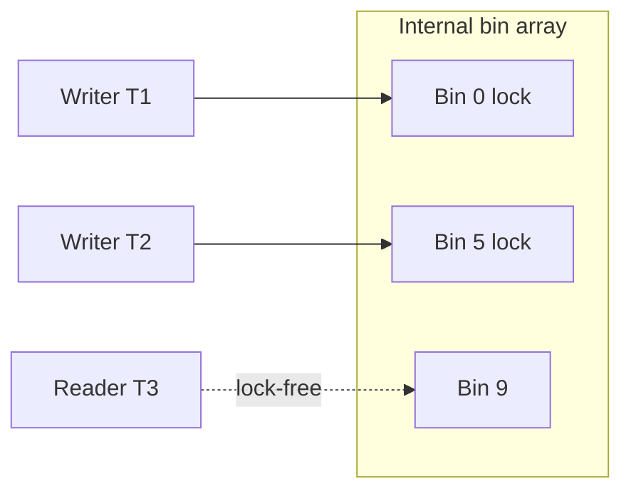
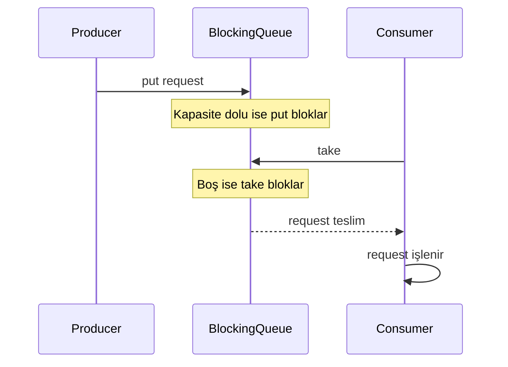
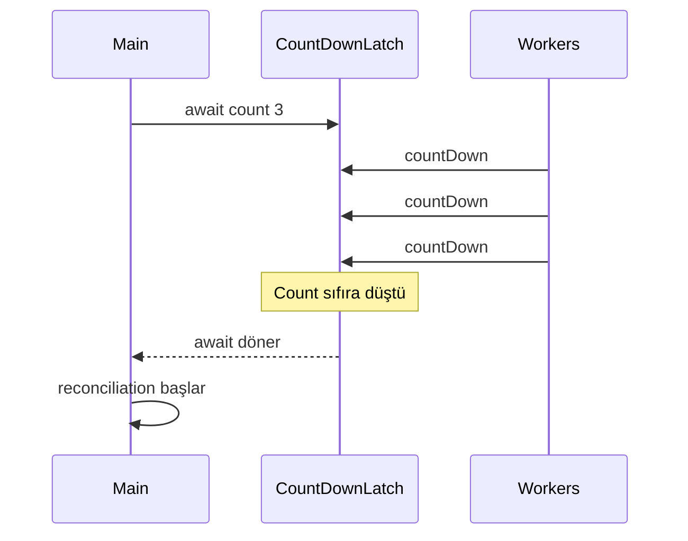
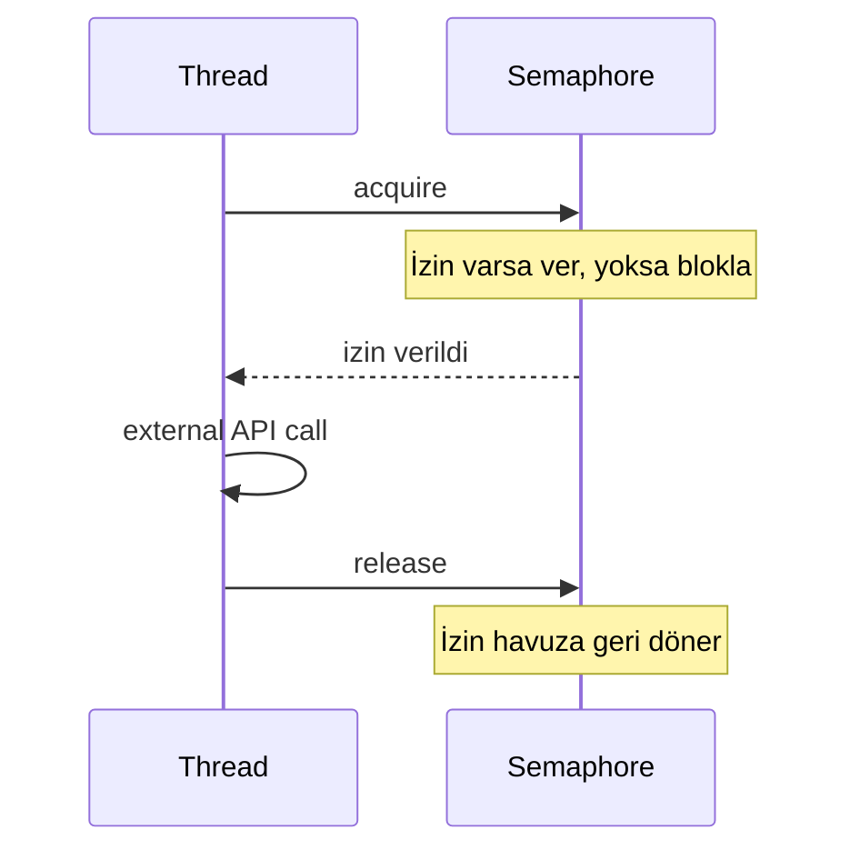

# Topic 3.6 — Concurrent Collections

```admonish info title="Bu bölümde"
- `HashMap`/`ArrayList` concurrent ortamda neden bozulur, `Collections.synchronizedMap` neden yetersiz kalır
- `ConcurrentHashMap`'in Java 8+ iç mekanizması (segment-free, CAS, bin-level lock) ve atomic operasyonları: `merge`, `compute`, `computeIfAbsent`, `putIfAbsent`
- `BlockingQueue` ailesinin producer/consumer pattern'i ve her üyenin en uygun banking senaryosu — bounded vs unbounded kararı
- Senkronizasyon aidleri: `CountDownLatch`, `CyclicBarrier`, `Semaphore`, `Phaser`, `Exchanger` — hangi problem hangisini çözer
- `CopyOnWriteArrayList` ve `ConcurrentSkipListMap` ne zaman doğru, ne zaman felaket + 6 banking anti-pattern'i
```

## Hedef

Java'nın **thread-safe collection** kütüphanesini derinlemesine öğrenmek. `ConcurrentHashMap`'in iç mekanizmasını (segment-free, CAS-based), `BlockingQueue` ailesinin kullanım pattern'lerini, `CountDownLatch`/`CyclicBarrier`/`Semaphore`/`Phaser`'ın hangi senaryoda ne çözdüğünü banking örnekleriyle kavramak. `synchronizedMap` gibi legacy yöntemlerden neden uzaklaştığımızı anlamak.

## Süre

Okuma: 2 saat • Kendini Sına: 45 dk • Pratik (opsiyonel): 2-3 saat • Toplam: ~2.5 saat (+ pratik)

## Önbilgi

- Topic 3.1-3.5 bitti — JMM, atomic, lock, executor, CompletableFuture biliyorsun
- `HashMap`, `ArrayList` gibi single-threaded collection'lar tanıdık
- "Thread-safe" kavramının ne demek olduğunu sezgisel anlıyorsun

---

## Kavramlar

### 1. Single-threaded collection'lar neden thread-safe değil

Önce tehlikeyi görelim: neden hiç uğraşmayıp `HashMap`'i paylaşamıyoruz? Çünkü `HashMap`, `ArrayList`, `LinkedList` eşzamanlı yazmaya **dayanıksızdır** ve sessizce bozulur.

- **Lost update:** İki thread put yapar, biri kaybolur
- **Infinite loop (Java 7 ve öncesi `HashMap` resize):** Resize sırasında linked list döngülenir, `get()` sonsuza spin eder
- **`ConcurrentModificationException`:** Iteration sırasında başka thread modify ederse fail-fast

Banking örneği — yanlış kod:

```java
private final Map<UUID, BigDecimal> accountBalances = new HashMap<>();

public void deposit(UUID accountId, BigDecimal amount) {
    BigDecimal current = accountBalances.getOrDefault(accountId, BigDecimal.ZERO);
    accountBalances.put(accountId, current.add(amount));
}
```

İki paralel `deposit(id, 100)` şu sırayla ilerlerse: T1 current=0 okur, T2 current=0 okur, T1 100 yazar, T2 100 yazar. Sonuç 100 (oysa 200 olmalı) — **atomicity yok**, 100 TL bankaya hediye edildi.

<mark>Birden fazla thread'in paylaştığı state'te `HashMap` asla kullanılmaz</mark> — bozulma olasılık değil, zaman meselesidir.

### 2. Eski çözüm: `Collections.synchronizedMap`

İlk akla gelen çare her metodu kilitlemek — çalışır ama iki nedenle yetersizdir.

```java
Map<UUID, BigDecimal> sync = Collections.synchronizedMap(new HashMap<>());
```

Her metot `synchronized` ile sarılır. Sorun ikili: **tüm map için tek lock** vardır (100 paralel okuma 100 kez sıraya girer — performans katili), ve **compound action'lar hâlâ atomik değildir** (`get + put` arasında race açık kalır).

```java
// HÂLÂ YANLIŞ
synchronized (sync) {   // explicit external lock gerekli
    BigDecimal current = sync.getOrDefault(id, BigDecimal.ZERO);
    sync.put(id, current.add(amount));
}
```

**Tuzak:** Compound action'ı doğru yapmak için external synchronization sorumluluğu kullanıcıya kalır — ve kolayca unutulur.

### 3. `ConcurrentHashMap` — banking standardı

Peki neden `ConcurrentHashMap` tek lock'lu çözümden dramatik olarak hızlı? Cevap iç mimaride. Java 5'te tanıtıldı, Java 8'de segment-free olarak yeniden yazıldı.

**Iç çalışma (Java 8+):** Internal bir bin array (default 16, büyür) tutulur. Her bin **bağımsız CAS-based lock** kullanır — write sırasında yalnızca o bin'in ilk node'u üzerinde `synchronized` olunur. Read operasyonları ise **tamamen lock-free** (volatile read). Collision threshold'u aşan bin (8 eleman) `TreeMap` gibi tree-bin'e döner.

Aşağıda iki writer farklı bin'lere yazdığı için birbirini beklemez; reader hiçbir kilit almaz:



Sonuç: 16 ayrı bin'e yazan thread'ler birbirini engellemez, read'ler lock'suz, throughput `synchronizedMap`'ten 5-10x. **Banking örneği — doğru kod:**

```java
private final ConcurrentHashMap<UUID, BigDecimal> accountBalances = new ConcurrentHashMap<>();

public void deposit(UUID accountId, BigDecimal amount) {
    accountBalances.merge(accountId, amount, BigDecimal::add);
}
```

`merge` **atomic** — get + compute + put tek operasyondur, race condition yok.

**Tuzak — `size()` yaklaşıktır:** Concurrent bir map'te `size()` çağrıldığı an başka thread'ler ekliyor/siliyor olabilir. Dönen değer **weakly consistent**'tir; kesin sayım gerektiren kontrol (örn. "tam 1000 kayıt olunca dur") için güvenilmez.

### 4. `ConcurrentHashMap` atomic operasyonları

Asıl güç bu atomic metotlarda: her biri check-then-act race'ini tek adıma indirir. <mark>`merge`, `compute`, `computeIfAbsent` ve `putIfAbsent` bin-level lock altında tek atomik operasyondur; manuel `if (contains) put` pattern'i değildir</mark>.

**`putIfAbsent(K, V)`** — yoksa koy, varsa dokunma, tek adımda:

```java
BigDecimal previous = accountBalances.putIfAbsent(accountId, BigDecimal.ZERO);
// previous == null → biz koyduk
// previous != null → zaten varmış, biz dokunmadık
```

Eski `if (!map.containsKey(id)) map.put(id, value)` yazımı iki adım arasında race barındırır — `putIfAbsent` bunu kapatır.

**`compute(K, BiFunction)`** — get + compute + put atomik; `v` null gelirse key yok demektir:

```java
accountBalances.compute(accountId, (k, v) ->
    (v == null ? BigDecimal.ZERO : v).add(amount)
);
```

**`computeIfAbsent(K, Function)`** — yoksa üret + koy + dön. Banking'in per-account collection pattern'inin kalbi:

```java
List<Transaction> txList = transactionsByAccount
    .computeIfAbsent(accountId, k -> new ArrayList<>());
txList.add(transaction);
```

**`computeIfPresent`** varsa günceller, yoksa dokunmaz; **`merge`** yoksa değeri koyar, varsa fonksiyonla birleştirir:

```java
accountBalances.computeIfPresent(accountId, (k, v) -> v.add(amount));  // yoksa no-op
accountBalances.merge(accountId, amount, BigDecimal::add);             // yoksa koy, varsa add
```

Bunları birleştiren günlük transaction sayacı — `computeIfAbsent` ile `AtomicLong` üret (atomik), sonra `incrementAndGet` (atomik):

```java
private final ConcurrentHashMap<LocalDate, AtomicLong> dailyTxCount = new ConcurrentHashMap<>();

public void recordTransaction(Instant occurredAt) {
    LocalDate date = LocalDate.ofInstant(occurredAt, ZoneId.systemDefault());
    dailyTxCount.computeIfAbsent(date, k -> new AtomicLong()).incrementAndGet();
}
```

İki ayrı atomik adım arasında race var mı? Hayır — `incrementAndGet` zaten thread-safe, hangi thread çağırırsa doğru artırır.

```admonish warning title="computeIfAbsent lambda'sı kısa olmalı"
Compute lambda'sı bin lock tutarken çalışır. İçinde DB call, HTTP çağrısı veya `sleep` yaparsan o bin'e düşen tüm thread'ler beklemek zorunda kalır — throughput çöker. Lambda yalnızca hafif, hızlı üretim yapmalı; ağır işi lock dışına taşı.
```

### 5. `computeIfAbsent` vs `putIfAbsent` — lazy yaratım

İkisi yakın görünür ama kritik bir farkla ayrışır: obje ne zaman yaratılır?

```java
// A — putIfAbsent: ExpensiveObject HER ZAMAN yaratılır
map.putIfAbsent(key, new ExpensiveObject());
```

`new ExpensiveObject()` argüman olarak önce değerlendirilir; atomicity sadece put içindir. Key zaten varsa yarattığın obje **çöpe gider**.

```java
// B — computeIfAbsent: lambda yalnızca yoksa çağrılır
map.computeIfAbsent(key, k -> new ExpensiveObject());
```

Lambda **lazy**'dir, sadece gerektiğinde çalışır. Yüksek volume bir map'te (her transaction için per-customer state) `computeIfAbsent` gereksiz yaratımı önler.

```admonish tip title="Kural"
Değer yaratımı ucuz değilse veya key genelde zaten mevcutsa `computeIfAbsent` seç. `putIfAbsent`'ı yalnızca hazırda tuttuğun (zaten var olan) bir değeri koyarken kullan.
```

### 6. `ConcurrentSkipListMap` — sıralı concurrent

`ConcurrentHashMap` sıra tutmaz; sıralı erişim + concurrent modification birlikte gerekiyorsa bu devreye girer. `TreeMap`'in thread-safe versiyonudur, internal olarak lock-free skip list kullanır.

```java
// Order book pattern
ConcurrentSkipListMap<BigDecimal, Order> bidOrders = new ConcurrentSkipListMap<>();
bidOrders.put(price, order);
Map.Entry<BigDecimal, Order> highestBid = bidOrders.lastEntry();   // O(log n)
```

Banking: order matching engine, time-series cache. **Tuzak:** Çoğu banking app'inde sıra gerekmez — gereksiz yere seçme, `ConcurrentHashMap` daha hızlıdır.

### 7. `CopyOnWriteArrayList` — read-heavy / write-rare

Bazı collection'lar neredeyse hiç değişmez ama çok okunur; işte tam onlar için. Yazma yapıldığında **tüm internal array kopyalanır**, buna karşılık okuma tamamen lock'suzdur.

```java
// Banking: subscriber list (nadiren değişir, her event'te okunur)
CopyOnWriteArrayList<EventSubscriber> subscribers = new CopyOnWriteArrayList<>();

public void onEvent(Event e) {
    for (EventSubscriber sub : subscribers) {   // lock-free iteration
        sub.notify(e);
    }
}
```

<mark>`CopyOnWriteArrayList`'i yalnızca read >>> write (örn. 1000:1) olduğunda kullan</mark>. Sık yazılan bir collection'da her yazım full copy = O(n) maliyet demektir — anti-pattern.

### 8. `BlockingQueue` ailesi — producer/consumer

İş üreten ile işleyen thread'leri ayırmak istediğinde temel araç budur: producer queue'ya atar, consumer alır, aradaki bloklama akışı doğal olarak dengeler.



```java
BlockingQueue<TransferRequest> queue = new LinkedBlockingQueue<>(1000);
queue.put(request);                       // producer: doluysa bloklar
TransferRequest req = queue.take();       // consumer: boşsa bloklar
```

#### Aile üyeleri

**`ArrayBlockingQueue`** — sabit kapasite, array-backed, FIFO, opsiyonel fairness:

```java
new ArrayBlockingQueue<>(1000);         // 1000 capacity
new ArrayBlockingQueue<>(1000, true);   // fair (FIFO strict)
```

**`LinkedBlockingQueue`** — linked node-based, opsiyonel bounded. Default'u **unbounded**'dır ve tehlikelidir:

```java
new LinkedBlockingQueue<>();          // UNBOUNDED — OOM riski
new LinkedBlockingQueue<>(10000);     // bounded
```

<mark>Banking'de her `BlockingQueue` bounded olmalı</mark> — consumer yavaşlarsa unbounded queue sınırsız büyür ve OOM ile sistemi düşürür.

**`SynchronousQueue`** — 0 kapasite, her `put` bir `take` bekler (direct handoff). Producer-consumer arası back-pressure için:

```java
new SynchronousQueue<>();
```

**`PriorityBlockingQueue`** — unbounded, priority-ordered. Fraud check queue'da yüksek risk skorlu transaction'lar öne alınır:

```java
PriorityBlockingQueue<FraudCheck> queue = new PriorityBlockingQueue<>(
    100, Comparator.comparingInt(FraudCheck::priority).reversed()
);
```

**`DelayQueue`** — element belirli süre sonra alınabilir hale gelir; failed transaction retry (5 sn → 30 sn → 5 dk backoff) için ideal:

```java
public class DelayedRetry implements Delayed {
    private final long executeAt;

    @Override
    public long getDelay(TimeUnit unit) {
        return unit.convert(executeAt - System.currentTimeMillis(), TimeUnit.MILLISECONDS);
    }

    @Override
    public int compareTo(Delayed o) {
        return Long.compare(this.executeAt, ((DelayedRetry) o).executeAt);
    }
}

DelayQueue<DelayedRetry> retryQueue = new DelayQueue<>();
retryQueue.put(new DelayedRetry(System.currentTimeMillis() + 5000));  // 5 sn sonra al
DelayedRetry next = retryQueue.take();                                // hazır olana kadar bloklar
```

**`LinkedTransferQueue`** — `BlockingQueue` + `transfer(element)` metodu, bir consumer alana kadar bekler:

```java
LinkedTransferQueue<Notification> queue = new LinkedTransferQueue<>();
queue.transfer(notification);   // bir consumer alana kadar block
```

#### Banking pattern — bounded queue + thread pool

Bounded queue'yu bir `ThreadPoolExecutor` ile birleştirince doğal backpressure elde edersin:

```java
ThreadPoolExecutor executor = new ThreadPoolExecutor(
    5, 10,
    60L, TimeUnit.SECONDS,
    new ArrayBlockingQueue<>(1000),   // bounded — backpressure
    Executors.defaultThreadFactory(),
    new ThreadPoolExecutor.CallerRunsPolicy()   // queue dolu → caller işler
);
```

`CallerRunsPolicy`: queue dolduğunda task'ı submit eden thread çalıştırır. Producer yavaşlar, sistem stabil kalır.

### 9. `CountDownLatch` — one-shot bariyer

Bir thread'in **n bağımsız event'in bitmesini** beklemesi gerektiğinde kullanılır. Sayaç sıfıra düşene kadar `await()` bloklar:



```java
CountDownLatch latch = new CountDownLatch(3);

new Thread(() -> { doWork1(); latch.countDown(); }).start();
new Thread(() -> { doWork2(); latch.countDown(); }).start();
new Thread(() -> { doWork3(); latch.countDown(); }).start();

latch.await();   // count = 0 olana kadar bloklar
System.out.println("All done");
```

Banking: EOD reconciliation — 3 farklı sistem rapor üretir, hepsi bittiğinde mutabakat başlar.

```admonish warning title="CountDownLatch tek kullanımlıktır"
Sayaç sıfıra düşünce latch yeniden kullanılamaz. İkinci faz için aynı latch'te `await()` çağırırsan anında döner (zaten 0). Tekrarlı senkronizasyon gerekiyorsa yeni bir latch yarat veya `CyclicBarrier` kullan.
```

### 10. `CyclicBarrier` — yeniden kullanılabilir senkronizasyon

`CountDownLatch`'in aksine tekrar tekrar kullanılabilir: n thread aynı noktaya geldiğinde hep birlikte devam eder.

```java
CyclicBarrier barrier = new CyclicBarrier(3, () -> System.out.println("Tüm faz bitti"));

for (int i = 0; i < 3; i++) {
    new Thread(() -> {
        for (int phase = 0; phase < 5; phase++) {
            doPhase(phase);
            barrier.await();   // diğer 2'yi bekle
        }
    }).start();
}
```

Her `await()`'da 3 thread toplanır, varsa **barrier action** çalışır, sonra devam ederler. Banking: multi-step batch — 3 worker her adımda senkronize ilerler.

### 11. `Semaphore` — kaynak sayısı sınırı

Sınırlı bir kaynağa (bağlantı, external API slot) aynı anda kaç thread erişebileceğini kısıtlar: n izin vardır, alan girer, alamayan bekler.



```java
Semaphore connectionLimit = new Semaphore(5);   // 5 izin

public void callExternalApi() throws InterruptedException {
    connectionLimit.acquire();   // izin al (0 ise bloklar)
    try {
        // external API call
    } finally {
        connectionLimit.release();   // izni iade et
    }
}
```

Banking'in klasik kullanımı — token bucket rate limiter (örn. TCMB'nin 100 req/sn limiti):

```java
public class TokenBucketRateLimiter {
    private final Semaphore tokens;
    private final ScheduledExecutorService refiller;

    public TokenBucketRateLimiter(int maxTokens, int refillPerSecond) {
        this.tokens = new Semaphore(maxTokens);
        this.refiller = Executors.newSingleThreadScheduledExecutor();
        refiller.scheduleAtFixedRate(() -> {
            int available = tokens.availablePermits();
            int toAdd = Math.min(refillPerSecond, maxTokens - available);
            tokens.release(toAdd);
        }, 1, 1, TimeUnit.SECONDS);
    }

    public boolean tryAcquire() {
        return tokens.tryAcquire();   // hemen dön — yoksa false
    }
}
```

Burada `acquire()` yerine `tryAcquire()` kullanmak bilinçli: rate limit'e takılan çağrı beklemez, anında `false` alır ve reddedilir. **Fairness:** `new Semaphore(5, true)` FIFO garantiler; default `false` throughput odaklıdır.

### 12. `Phaser` — dinamik CountDownLatch

`CountDownLatch` ve `CyclicBarrier`'ın esnek hibridi: phase'ler arasında kayıtlı thread sayısı runtime'da **değişebilir**.

```java
Phaser phaser = new Phaser(1);   // 1 main thread registered

for (int i = 0; i < 5; i++) {
    phaser.register();   // her worker register
    new Thread(() -> {
        doWork();
        phaser.arriveAndDeregister();   // bitti, çıktım
    }).start();
}

phaser.arriveAndAwaitAdvance();   // diğerlerinin bitmesini bekle
```

Banking: dinamik worker pool, runtime'da sayısı değişen senaryolar. **Tuzak:** Phaser karmaşıktır — `CountDownLatch` veya `CyclicBarrier` yetiyorsa onları tercih et.

### 13. `Exchanger` — iki thread arası nesne takası

Nadir ama zarif bir araç: iki thread aynı `Exchanger`'da `exchange(x)` çağırır, verdikleri nesneleri değiş tokuş ederler.

```java
Exchanger<Buffer> exchanger = new Exchanger<>();

// Filler thread
Buffer filled = exchanger.exchange(filledBuffer);   // boş bir tane al

// Drainer thread
Buffer empty = exchanger.exchange(emptyBuffer);     // dolu bir tane al
```

Banking: nadiren gerekir, tipik kullanım double-buffering pattern'idir.

### 14. Banking anti-pattern'leri

Mülakatta "bu kodda ne yanlış?" sorusunun cephaneliği. Altı klasik:

**Anti-pattern 1 — `HashMap` concurrent kullanımı:** Paylaşılan `new HashMap<>()` corruption, infinite loop, NPE üretir. **Çözüm:** `ConcurrentHashMap` veya `ThreadLocal`.

**Anti-pattern 2 — Iteration sırasında modification:**

```java
for (Map.Entry<UUID, Account> entry : accounts.entrySet()) {
    if (someCondition(entry)) {
        accounts.remove(entry.getKey());   // ConcurrentModificationException
    }
}
```

**Çözüm:** `accounts.entrySet().removeIf(...)` veya `ConcurrentHashMap`'in weakly-consistent iteration'ı.

**Anti-pattern 3 — Unbounded queue:** `new LinkedBlockingQueue<>()` production'da OOM eder. **Çözüm:** her zaman capacity belirle.

**Anti-pattern 4 — `CountDownLatch` reuse:** Sıfıra düşmüş latch'i ikinci faz için beklemek — `await()` anında döner. **Çözüm:** yeni latch veya `CyclicBarrier`.

**Anti-pattern 5 — `Collections.synchronizedXxx` modern banking'de:** Tüm map için tek lock → contention. **Çözüm:** `ConcurrentHashMap`.

**Anti-pattern 6 — `computeIfAbsent` lambda'sında ağır iş:**

```java
accounts.computeIfAbsent(id, k -> repository.findById(k).orElseThrow());   // DB call!
```

Bin lock tutulurken yavaş DB call = diğer thread'ler bekler. **Çözüm:** lambda hızlı olsun, DB call dışarıda.

---

## Önemli olabilecek araştırma kaynakları

- "Java Concurrency in Practice" (Brian Goetz) — Chapter 5 (Building Blocks)
- ConcurrentHashMap source code (OpenJDK, doğru iç anlama için)
- "ConcurrentHashMap analysis" blog posts (multi-author)
- BlockingQueue Javadoc
- Vlad Mihalcea blog — concurrency-related posts
- LMAX Disruptor (alternatif yüksek-throughput queue)
- Aeron messaging library (Real Logic) — low-latency

---

## Kendini Sına

Aşağıdaki soruları önce **cevaba bakmadan** kendi cümlelerinle yanıtlamayı dene — hepsi TR bank mülakatlarında karşına çıkabilecek tarzda. Takıldığın soru olursa ilgili Kavramlar başlığına dön, sonra tekrar dene.

**S1. Paylaşılan `HashMap`'i concurrent kullanmak neden tehlikeli, ve `Collections.synchronizedMap` bu sorunu neden tam çözmez?**

<details>
<summary>Cevabı göster</summary>

`HashMap` concurrent yazmaya dayanıksızdır: lost update (iki put'tan biri kaybolur), Java 7 resize'ında infinite loop, ve iteration sırasında `ConcurrentModificationException`. `synchronizedMap` her metodu tek bir lock'la sarar; bu iki yeni sorun getirir: tüm map için tek lock olduğundan paralel okumalar bile sıraya girer (contention), ve `get + put` gibi compound action'lar hâlâ atomik değildir — aralarında race açıktır.

Compound action'ı doğru yapmak için kullanıcının `synchronized (map) { ... }` ile external lock koyması gerekir, bu da kolayca unutulur. Modern çözüm `ConcurrentHashMap`: bin-level lock ile contention'ı kırar, `merge`/`compute` gibi atomic metotlarla compound action'ı tek adıma indirir.

</details>

**S2. `computeIfAbsent` ile `putIfAbsent` arasındaki fark nedir? Yüksek volume bir map'te hangisini seçersin ve neden?**

<details>
<summary>Cevabı göster</summary>

`putIfAbsent(key, new ExpensiveObject())` çağrısında `new ExpensiveObject()` argüman olarak **her zaman** değerlendirilir; atomicity sadece put içindir. Key zaten varsa yarattığın nesne çöpe gider. `computeIfAbsent(key, k -> new ExpensiveObject())` ise lambda'yı **lazy** çağırır — yalnızca key yoksa yaratır.

Yüksek volume bir map'te (her transaction için per-customer state) `computeIfAbsent` seçilir; çünkü key genelde zaten mevcuttur ve gereksiz nesne yaratımı önlenir. `putIfAbsent`'ı sadece hazırda tuttuğun, üretim maliyeti olmayan bir değeri koyarken kullan.

</details>

**S3. `ConcurrentHashMap.size()` neden "yaklaşık" kabul edilir? Bu hangi durumda seni yanıltır?**

<details>
<summary>Cevabı göster</summary>

`ConcurrentHashMap` global bir kilit tutmadığından, `size()` çağrıldığı anda başka thread'ler aynı anda ekliyor/siliyor olabilir. Dönen değer o anlık bir tahmindir (weakly consistent), çağrının bittiği an bile eskimiş olabilir. Ayrıca `size()` int döner; çok büyük map'lerde `mappingCount()` (long) tercih edilir.

Seni yanıltacağı yer: kesin sayıma dayalı kontrol mantığı — "tam 1000 kayıt olunca dur" veya `size()` ile capacity kararı. Concurrent ortamda böyle kontroller için `size()`'a güvenme; atomik sayaç (`AtomicLong`) veya bounded queue gibi yapısal sınırlar kullan.

</details>

**S4. `BlockingQueue` ailesinde `ArrayBlockingQueue`, `LinkedBlockingQueue`, `SynchronousQueue` ve `PriorityBlockingQueue` hangi senaryoda tercih edilir?**

<details>
<summary>Cevabı göster</summary>

`ArrayBlockingQueue`: kapasite tahmin edilebilir, sabit bounded queue gerektiğinde — array-backed, FIFO, opsiyonel fairness. `LinkedBlockingQueue`: linked node-based, opsiyonel bounded; ama default'u unbounded olduğu için banking'de mutlaka capacity vererek kullanılır. `SynchronousQueue`: 0 kapasite, direct handoff — producer ile consumer'ı birebir eşlemek ve sıkı back-pressure istediğinde. `PriorityBlockingQueue`: elemanların önceliğe göre alınması gerektiğinde (fraud check queue'da yüksek risk skoru öne).

Ortak kural: banking'de queue her zaman bounded olmalı. Unbounded queue consumer yavaşlayınca sınırsız büyür ve OOM ile sistemi düşürür.

</details>

**S5. `CopyOnWriteArrayList` ne zaman doğru seçimdir, ne zaman felaket olur?**

<details>
<summary>Cevabı göster</summary>

Doğru olduğu yer: read çok, write neredeyse hiç (örn. 1000:1). Yazma yapıldığında tüm internal array kopyalanır ama okuma tamamen lock'suzdur — event subscriber listesi gibi "nadiren değişir, her event'te iterate edilir" senaryosunda mükemmeldir; iteration sırasında `ConcurrentModificationException` de riski yoktur (snapshot üzerinde iterate eder).

Felaket olduğu yer: sık yazılan collection. Her `add`/`remove` full array copy demek — O(n) yazma maliyeti. Yüksek write hacminde CPU ve GC'yi öldürür. Böyle durumda `ConcurrentLinkedQueue` veya lock'lu yapılar tercih edilir.

</details>

**S6. `CountDownLatch` ile `CyclicBarrier` arasındaki temel fark nedir? `CountDownLatch`'i reuse etmeye çalışırsan ne olur?**

<details>
<summary>Cevabı göster</summary>

`CountDownLatch` one-shot'tır: bir thread'in n event'in bitmesini beklemesi için, sayaç sıfıra düşünce açılır ve bir daha kullanılamaz — tipik olarak "n görev bitince başla" (EOD reconciliation). `CyclicBarrier` yeniden kullanılabilir: n thread aynı noktaya geldiğinde birlikte devam eder, her turda sıfırlanır — multi-phase batch'te her adımda senkronizasyon için.

`CountDownLatch`'i reuse etmeye çalışırsan: sayaç zaten 0 olduğu için ikinci `await()` anında döner, hiç beklemez. Bu sessiz bir bug'dır. Tekrarlı senkronizasyon gerekiyorsa ya her fazda yeni bir latch yarat ya da `CyclicBarrier` kullan.

</details>

**S7. `Semaphore` ile rate limiter nasıl kurulur? `acquire()` yerine `tryAcquire()` kullanmak neyi değiştirir?**

<details>
<summary>Cevabı göster</summary>

`Semaphore` n izinle başlar; her çağrı `acquire()` ile izin alır, işini bitince `release()` ile iade eder — böylece aynı anda en fazla n thread kaynağa erişir. Token bucket rate limiter'da izin sayısı token'ları temsil eder; bir `ScheduledExecutorService` periyodik olarak `release(toAdd)` ile token'ları geri doldurur (max'ı aşmadan).

`acquire()` izin yoksa **bloklar** (thread bekler), `tryAcquire()` ise **hemen `false` döner**. Rate limiter'da `tryAcquire()` bilinçli seçilir: limite takılan isteği bekletmek yerine anında reddetmek istersin (fail-fast). Fairness gerekiyorsa `new Semaphore(n, true)` FIFO garantiler; default `false` throughput odaklıdır.

</details>

**S8. `computeIfAbsent` lambda'sının içinde DB call yapmak neden ciddi bir sorundur?**

<details>
<summary>Cevabı göster</summary>

`computeIfAbsent` lambda'sı ilgili bin'in lock'u tutulurken çalışır. İçine `repository.findById(...)` gibi yavaş bir DB call koyarsan, o bin'e hash'lenen tüm diğer thread'ler lambda bitene kadar beklemek zorunda kalır — throughput çöker, latency patlar. Ağır I/O'da bu pratikte bir mikro-deadlock gibi davranır.

Çözüm: lambda'yı hafif ve hızlı tut (sadece bellekte nesne üretimi). DB call gibi ağır işi lock dışında yap; örneğin önce `get` ile kontrol et, yoksa lock dışında yükle, sonra `putIfAbsent` ile yerleştir — veya cache-aside pattern kullan.

</details>

---

## Tamamlama kriterleri

- [ ] `HashMap` concurrent kullanımının 3 somut riskini (lost update, resize infinite loop, `ConcurrentModificationException`) sayabiliyorum
- [ ] `synchronizedMap`'in iki zayıflığını (tek lock contention + compound action atomik değil) açıklayabiliyorum
- [ ] `ConcurrentHashMap` Java 8+ iç mekanizmasını (bin array, CAS, bin-level lock, lock-free read) 2 dakikada anlatabilirim
- [ ] `merge`, `compute`, `computeIfAbsent`, `putIfAbsent`'ın atomicity garantisini ve `computeIfAbsent` vs `putIfAbsent` lazy farkını biliyorum
- [ ] `BlockingQueue` ailesinin her üyesi için doğru banking senaryosunu ve bounded vs unbounded kararını söyleyebilirim
- [ ] `CountDownLatch` vs `CyclicBarrier` farkını ve `CountDownLatch`'in one-shot olduğunu açıklayabiliyorum
- [ ] `Semaphore` ile token bucket rate limiter pattern'ini ve `tryAcquire`/`acquire` farkını biliyorum
- [ ] `CopyOnWriteArrayList`'in ne zaman doğru ne zaman felaket olduğunu ayırt edebiliyorum
- [ ] `computeIfAbsent` lambda'sında DB call yapmamamın sebebini (bin lock) açıklayabiliyorum
- [ ] (Opsiyonel) "Pratik yapmak istersen" bölümündeki testleri yazdım ve Claude-verify prompt'uyla doğrulattım

---

## Defter notları

1. "`ConcurrentHashMap` Java 8 öncesi vs sonrası iç farkı: ____."
2. "`merge`, `compute`, `computeIfAbsent`'ın atomic guarantee'si: ____."
3. "`putIfAbsent` ile `computeIfAbsent` farkı (lazy yaratım): ____."
4. "`Collections.synchronizedMap`'i neden production'da kullanmıyorum: ____."
5. "`BlockingQueue` ailesinde her birinin en uygun senaryosu: ____."
6. "Bounded vs unbounded queue: banking için doğru karar: ____."
7. "`CountDownLatch` ile `CyclicBarrier` farkı + reuse: ____."
8. "`Semaphore` ile rate limiter pattern (token bucket): ____."
9. "`CopyOnWriteArrayList` ne zaman doğru, ne zaman felaket: ____."
10. "`computeIfAbsent` lambda'sında DB call yapmamamın sebebi: ____."

```admonish success title="Bölüm Özeti"
- Paylaşılan state'te `HashMap`/`ArrayList` asla kullanılmaz; `synchronizedMap` tek lock contention'ı ve atomik olmayan compound action nedeniyle yetersizdir
- `ConcurrentHashMap` bin-level CAS lock ile write'ları paralelleştirir, read'i lock-free yapar; `merge`/`compute`/`computeIfAbsent`/`putIfAbsent` compound action'ı tek atomik adıma indirir (`computeIfAbsent` lazy, `putIfAbsent` değil)
- `BlockingQueue` producer/consumer'ı ayırır ve doğal backpressure verir — banking'de her queue bounded, tercihen `CallerRunsPolicy` ile
- Senkronizasyon aidleri: `CountDownLatch` one-shot (n event bekle), `CyclicBarrier` reusable (n thread buluş), `Semaphore` kaynak sınırı + rate limiter, `Phaser` dinamik
- `CopyOnWriteArrayList` yalnızca read >>> write; sık yazımda O(n) copy ile felaket. `ConcurrentSkipListMap` sıra + concurrency gerekince, çoğu app'te gereksiz
- Anti-pattern'ler: concurrent `HashMap`, iteration'da modification, unbounded queue, latch reuse, `synchronizedMap`, `computeIfAbsent` lambda'sında DB call — hepsi production'da corruption ya da OOM getirir
```

---

## Pratik yapmak istersen

Kavramları koda dökmek istersen aşağıdaki iki ek hazır: test yazma rehberi `ConcurrentHashMap` thread safety, BlockingQueue back-pressure, priority ordering, `CountDownLatch` ve `Semaphore` davranışları için örnek testler içerir; Claude-verify prompt'u ile yazdığın concurrent collections kodunu banking-grade perspektiften denetletebilirsin.

<details>
<summary>Test yazma rehberi</summary>

### Test 3.6.1 — `ConcurrentHashMap` thread safety

```java
@Test
void mergeShouldBeAtomicUnderConcurrency() throws InterruptedException {
    InMemoryBalanceCache cache = new InMemoryBalanceCache();
    UUID accountId = UUID.randomUUID();
    int threadCount = 100;
    int incrementsPerThread = 1000;

    ExecutorService exec = Executors.newFixedThreadPool(threadCount);
    CountDownLatch start = new CountDownLatch(1);
    CountDownLatch done = new CountDownLatch(threadCount);

    for (int i = 0; i < threadCount; i++) {
        exec.submit(() -> {
            try {
                start.await();
                for (int j = 0; j < incrementsPerThread; j++) {
                    cache.credit(accountId, BigDecimal.ONE);
                }
            } catch (InterruptedException e) {
                Thread.currentThread().interrupt();
            } finally {
                done.countDown();
            }
        });
    }

    start.countDown();   // herkes aynı anda başlasın
    done.await();
    exec.shutdown();

    BigDecimal expected = BigDecimal.valueOf((long) threadCount * incrementsPerThread);
    assertThat(cache.getBalance(accountId)).isEqualByComparingTo(expected);
}
```

### Test 3.6.2 — BlockingQueue back-pressure

```java
@Test
void boundedQueueShouldBlockWhenFull() throws InterruptedException {
    BlockingQueue<Integer> queue = new ArrayBlockingQueue<>(2);
    queue.put(1);
    queue.put(2);

    AtomicBoolean blocked = new AtomicBoolean(true);
    Thread producer = new Thread(() -> {
        try {
            queue.put(3);   // blocks
            blocked.set(false);
        } catch (InterruptedException e) {
            Thread.currentThread().interrupt();
        }
    });
    producer.start();

    Thread.sleep(100);
    assertThat(blocked).isTrue();   // hâlâ block

    queue.take();   // birini al, producer kurtulsun
    producer.join(1000);
    assertThat(blocked).isFalse();
}
```

### Test 3.6.3 — PriorityBlockingQueue order

```java
@Test
void priorityQueueShouldDeliverHighestRiskFirst() throws InterruptedException {
    PriorityBlockingQueue<FraudCheck> queue = new PriorityBlockingQueue<>();
    queue.put(new FraudCheck(UUID.randomUUID(), 3));
    queue.put(new FraudCheck(UUID.randomUUID(), 9));
    queue.put(new FraudCheck(UUID.randomUUID(), 1));

    assertThat(queue.take().riskScore()).isEqualTo(9);
    assertThat(queue.take().riskScore()).isEqualTo(3);
    assertThat(queue.take().riskScore()).isEqualTo(1);
}
```

`FraudCheck` `Comparable`'ını descending (yüksek risk önce) sıralayacak şekilde yaz:

```java
record FraudCheck(UUID txId, int riskScore) implements Comparable<FraudCheck> {
    @Override
    public int compareTo(FraudCheck o) {
        return Integer.compare(o.riskScore, this.riskScore);   // descending
    }
}
```

### Test 3.6.4 — CountDownLatch tek-shot

```java
@Test
void latchShouldReleaseWhenCountReachesZero() throws InterruptedException {
    CountDownLatch latch = new CountDownLatch(3);
    AtomicBoolean released = new AtomicBoolean(false);

    Thread waiter = new Thread(() -> {
        try {
            latch.await();
            released.set(true);
        } catch (InterruptedException e) { /* */ }
    });
    waiter.start();

    latch.countDown();
    Thread.sleep(50);
    assertThat(released).isFalse();

    latch.countDown();
    latch.countDown();
    waiter.join(1000);
    assertThat(released).isTrue();
}
```

### Test 3.6.5 — Semaphore concurrent permit

```java
@Test
void semaphoreShouldLimitConcurrentAccess() throws InterruptedException {
    Semaphore sem = new Semaphore(2);
    AtomicInteger maxConcurrent = new AtomicInteger();
    AtomicInteger currentConcurrent = new AtomicInteger();

    ExecutorService exec = Executors.newFixedThreadPool(10);
    CountDownLatch done = new CountDownLatch(10);

    for (int i = 0; i < 10; i++) {
        exec.submit(() -> {
            try {
                sem.acquire();
                int now = currentConcurrent.incrementAndGet();
                maxConcurrent.updateAndGet(prev -> Math.max(prev, now));
                Thread.sleep(50);
                currentConcurrent.decrementAndGet();
                sem.release();
            } catch (InterruptedException e) { /* */ }
            finally { done.countDown(); }
        });
    }

    done.await();
    exec.shutdown();

    assertThat(maxConcurrent.get()).isLessThanOrEqualTo(2);
}
```

</details>

<details>
<summary>Claude-verify prompt</summary>

```
Aşağıdaki Java concurrent collections kodumu banking-grade kriterlere göre
değerlendir. Sadece eksikleri ve yanlışları işaretle, kod yazma:

1. ConcurrentHashMap kullanımı:
   - `HashMap` thread-shared yerlerde kullanılmış mı? (Olmamalı)
   - `merge`, `compute`, `computeIfAbsent` ile atomic update yapılmış mı?
   - `get + put` race condition pattern'i hâlâ var mı?
   - `computeIfAbsent` lambda'sında DB call veya I/O var mı? (Olmamalı, bin lock tutuluyor)

2. BlockingQueue:
   - Queue'lar bounded mı (capacity belirli)?
   - `new LinkedBlockingQueue<>()` unbounded kullanılmış mı? (Olmamalı production'da)
   - Producer/consumer pattern doğru mu (put/take BlockingQueue API, queue/poll değil)?
   - `RejectedExecutionHandler` belirli mi (CallerRunsPolicy gibi)?

3. Priority queue:
   - `Comparable` veya `Comparator` doğru sıralıyor mu?
   - Reverse order (yüksek öncelik önce) açıkça belirtilmiş mi?

4. Synchronization aidleri:
   - `CountDownLatch` reuse edilmek istenmiş mi? (Hatalı — one-shot)
   - `CyclicBarrier`'a karşı `CountDownLatch` doğru seçilmiş mi?
   - `Semaphore` rate limiter'da tryAcquire/acquire farkı bilinçli mi?

5. Banking pattern'ler:
   - Balance tracking gibi yüksek-frekans operasyonda ConcurrentHashMap kullanılmış mı?
   - Rate limiter Semaphore ile implement edilmiş mi?
   - Per-account collection için computeIfAbsent pattern'i kullanılmış mı?

6. Anti-pattern:
   - `Collections.synchronizedMap` modern code'da var mı?
   - Iteration sırasında modification var mı?
   - Compound action (check-then-act) atomik değil mi?

7. Test:
   - 100+ thread'le concurrent stress test yapılmış mı?
   - CountDownLatch ile "herkes aynı anda başlasın" pattern'i test'lerde kullanılmış mı?
   - Final assertion expected = thread count × ops per thread mu?

Her madde için PASS / FAIL / EKSIK işaretle.
```

</details>
