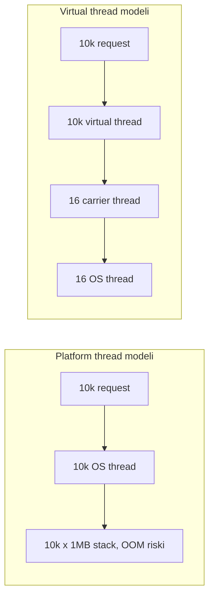
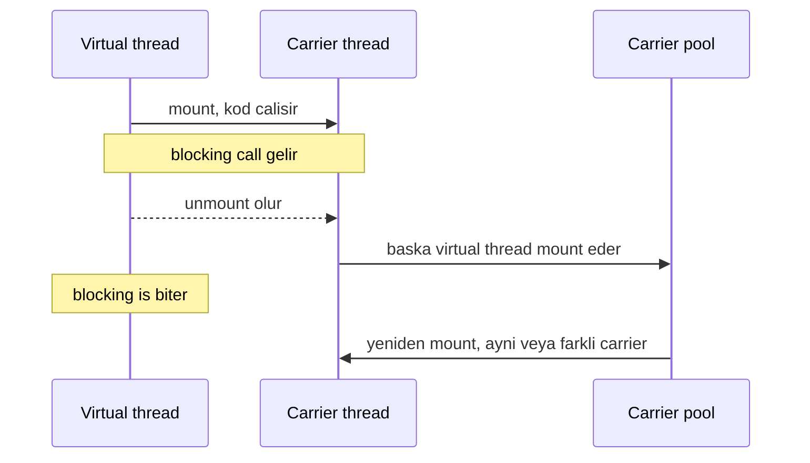

# Topic 3.7 — Virtual Threads (Project Loom)

```admonish info title="Bu bölümde"
- Platform thread neden pahalı, virtual thread bir carrier üstünde nasıl mount/unmount olur
- Pinning — virtual thread'in en büyük tuzağı: 3 sebebi, JFR ile tespiti, `ReentrantLock` çözümü
- Virtual thread ne zaman kullanılır (I/O-bound), ne zaman kullanılmaz (CPU-bound), neden pool'lanmaz
- `ScopedValue` ile ThreadLocal alternatifi ve 10k virtual thread + sınırlı DB connection mismatch'inin çözümü
- Spring Boot 3.2+ tek satır config ile per-request virtual thread
```

## Hedef

Java 21'in en önemli yeniliği virtual thread'i banking-grade seviyede anlamak. Platform thread vs virtual thread farkını, carrier thread mekanizmasını, **pinning** tuzağını ve bunu nasıl tespit edip çözeceğini öğrenmek. `ScopedValue` ile ThreadLocal alternatifini, banking domain'inde 10k+ concurrent transfer senaryosunu virtual thread ile çözmeyi kavramak.

## Süre

Okuma: 2 saat • Kendini Sına: 45 dk • Pratik (opsiyonel): 4-5 saat • Toplam: ~3 saat (+ pratik)

## Önbilgi

- Topic 3.1-3.6 bitti (JMM, executor, locks, concurrent collections biliyorsun)
- "Thread = OS thread" varsayımıyla yıllardır yaşıyorsun
- `ExecutorService` kullanıyorsun
- Java 21 SDK kurulu (`java -version`)

---

## Kavramlar

### 1. Platform thread'in maliyeti — neden Loom var

Loom'u anlamak için önce eski modelin neden duvara tosladığını görmek gerekir.

Geleneksel bir Java thread = bir **platform thread** = bir **OS thread**. Bu 1:1 eşleme pahalıdır:

- **~1-2 MB stack** (varsayılan)
- **OS kernel'in scheduling unit'i** — her context switch kernel-mode geçişi
- **Kaynak sınırlı** (Linux'ta `ulimit -u` tipik 4096-65k)

Banking'in "1 thread per request" modeli bu maliyeti katlar:

```
1000 concurrent request → 1000 OS thread
1000 × 1MB stack = 1GB sadece thread stack
+ kernel scheduler + context switch overhead
```

Sonuç: Java backend'leri 10k+ concurrent request'i tutamadı. NIO ve reactive programming (Project Reactor, RxJava) bu yüzden doğdu — az thread ile çok bağlantı tutmak. Ama reactive'in bedeli ağırdır:

```java
Mono.fromCallable(() -> accountRepo.findById(id))
    .flatMap(account -> Mono.fromCallable(() -> transferRepo.save(...)))
    .subscribeOn(Schedulers.boundedElastic())
    .doOnError(e -> log.error(...))
    .subscribe();
```

Reactive çalışır ama stack trace okumak imkânsız, debug zor, imperative mental model kaybolur. Yani "ölçek" uğruna kod okunabilirliğini feda ederiz.

### 2. Project Loom — virtual thread fikri

Çözüm: thread'i JVM-managed yap; OS thread ile 1:1 değil **çok-1** ilişki kur.

- **Platform thread:** geleneksel OS thread, 1:1 OS eşlemesi.
- **Virtual thread:** JVM içinde yaşar, bir **carrier** platform thread üstünde çalışır. Bloklayıcı işlemde carrier'dan **unmount** olur, carrier başka virtual thread'e geçer.

10k concurrent request → 10k virtual thread → 16 platform thread → 16 OS thread. **Imperative kod ama scale.** İki modelin ölçeklenme farkını yan yana gör:



### 3. Virtual thread oluşturma

Virtual thread yaratmanın dört yolu var; günlük kodda çoğunlukla executor formunu kullanırsın:

```java
// Method 1: factory
Thread vt = Thread.ofVirtual().start(() -> {
    System.out.println("Hello from virtual thread");
});

// Method 2: short form
Thread vt = Thread.startVirtualThread(() -> System.out.println("Hi"));

// Method 3: ExecutorService (en yaygın)
try (ExecutorService exec = Executors.newVirtualThreadPerTaskExecutor()) {
    exec.submit(() -> doWork());
}

// Method 4: explicit factory
ThreadFactory factory = Thread.ofVirtual().name("banking-vt-", 0).factory();
```

Spring Boot 3.2+ ile her HTTP request'i bir virtual thread'de çalıştırmak tek satırdır:

```yaml
spring:
  threads:
    virtual:
      enabled: true
```

### 4. Carrier thread mekanizması — mount/unmount

Virtual thread'in sihri **mount/unmount** döngüsünde saklı. Bir virtual thread çalışırken:

1. Bir **carrier** (platform) thread üzerine **mount** olur ve kod çalışır.
2. **Blocking call** (I/O, sleep, lock acquire) ile karşılaşınca carrier'dan **unmount** olur.
3. Carrier serbest kalır ve başka bir virtual thread'i mount eder.
4. Blocking operasyon bitince virtual thread yeniden mount olur — aynı veya farklı carrier'a.



Carrier pool default olarak `ForkJoinPool.commonPool()` ile aynı boyuttadır (genelde CPU core sayısı). VM flag'leriyle ayarlanır:

```java
-Djdk.virtualThreadScheduler.parallelism=16   // carrier count
-Djdk.virtualThreadScheduler.maxPoolSize=256   // max
```

### 5. Pinning — virtual thread'in en büyük tuzağı

**Pinning:** virtual thread carrier'dan unmount **olamaz**. Carrier bloklanır, arkadaki virtual thread'ler bekler ve throughput çöker.


Java 21'de pinning'in üç sebebi var. **Sebep 1 — `synchronized` blok içinde blocking call:**

```java
synchronized (lock) {
    Thread.sleep(1000);   // ← PINNING — carrier 1 sn kilitli
}
```

JVM monitor lock'ı (Java 21'de) virtual thread parking için yeniden tasarlanmadı. `synchronized` blok içinde `Thread.sleep`, network I/O, file I/O veya lock acquire → virtual thread **pinned** kalır. **Sebep 2 — native method:** JNI çağrıları doğal olarak pinning yapar. **Sebep 3 — class initialization:** `static { ... }` bloğu içinde blocking call.

```admonish warning title="Pinning carrier'ı kilitler"
Java 21'de `synchronized` blok içinde `Thread.sleep`, network/file I/O, lock acquire veya native call yaparsan virtual thread carrier'dan unmount olamaz. Carrier platform thread bloklanır, arkadaki virtual thread'ler bekler ve throughput çöker. En tehlikeli kombinasyon `synchronized` + blocking I/O'dur.
```

#### Banking örneği — pinning bug

Klasik banking kodu farkında olmadan pinning üretir:

```java
public class AccountService {

    @Transactional
    public synchronized void transfer(UUID from, UUID to, BigDecimal amount) {
        Account fromAcc = repo.findById(from);   // ← JDBC blocking
        Account toAcc = repo.findById(to);       // ← JDBC blocking
        fromAcc.withdraw(amount);
        toAcc.deposit(amount);
        repo.save(fromAcc);                       // ← JDBC blocking
        repo.save(toAcc);                         // ← JDBC blocking
    }
}
```

`synchronized` method + içinde JDBC call'ları → her transfer süresince carrier thread kilitli. Throughput yükselmez.

#### Tespit — JFR ve tracePinnedThreads

Pinning'i çalışırken yakalamak için iki araç var. `jdk.tracePinnedThreads=full` her pinning olayında stack trace basar:

```bash
java -XX:StartFlightRecording=duration=60s,filename=app.jfr \
     -XX:+UnlockDiagnosticVMOptions \
     -Djdk.tracePinnedThreads=full \
     -jar app.jar
```

```
[VirtualThread[#42]/runnable@ForkJoinPool-1-worker-3] Thread is pinned
  at com.example.AccountService.transfer(AccountService.java:25)
  at java.base/java.util.concurrent...
```

JFR'da ise `jdk.VirtualThreadPinned` event'i doğar; CLI veya JMC ile açarsın:

```bash
jfr print --events jdk.VirtualThreadPinned app.jfr
```

#### Çözüm — `ReentrantLock`

`synchronized` yerine `ReentrantLock` virtual thread-aware'dir; lock tutarken bile virtual thread blocking call'da unmount olabilir:

```java
private final ReentrantLock lock = new ReentrantLock();

@Transactional
public void transfer(UUID from, UUID to, BigDecimal amount) {
    lock.lock();
    try {
        Account fromAcc = repo.findById(from);   // I/O OK — unmount olur
        // ...
    } finally {
        lock.unlock();
    }
}
```

<mark>Virtual thread çağıran service kodunda `synchronized` kullanma, `ReentrantLock` tercih et.</mark>

### 6. Pinning — Java 23+ güncellemesi

Java 21'de `synchronized` pinning yaratır; **Java 24** ile bu büyük ölçüde çözüldü (JEP 491): `synchronized` içinde virtual thread artık unmount olabilir. Ancak hâlâ pinning yaratan durumlar var:

- **Native method calls** (JNI)
- **`MethodHandle.invokeExact`** belirli koşullarda
- Bazı I/O primitive'leri (henüz uygun parking yerleştirilmemiş)

Banking gerçeği: bazı eski library'ler hâlâ `synchronized` ile JDBC connection yönetir. Bunları kullanırken çalıştığın JDK sürümü davranışı doğrudan değiştirir — Java 21 pinler, 24 pinlemez.

### 7. ThreadLocal vs ScopedValue

Virtual thread çok fazla olabildiğinden, her birinde ThreadLocal değeri tutmak hafıza tüketir ve cleanup unutulursa leak olur:

```java
private static final ThreadLocal<UserContext> userContext = new ThreadLocal<>();

userContext.set(ctx);   // her request'te
try {
    doWork();
} finally {
    userContext.remove();   // ← unutursan memory leak
}
```

**ScopedValue** (Java 21 incubator) immutable ve scope-bound bir alternatiftir:

```java
private static final ScopedValue<UserContext> USER_CONTEXT = ScopedValue.newInstance();

ScopedValue.where(USER_CONTEXT, ctx).run(() -> {
    doWork();
    UserContext current = USER_CONTEXT.get();
});
// scope dışına çıkınca otomatik unbinding
```

Değer sadece `run()` scope'u boyunca yaşar, child scope'lara yapısal olarak akar ama dışarı sızmaz:


**Avantajları:** immutable (bir kez set, scope içinde değişmez), otomatik cleanup (scope sonunda kaybolur), yapısal aktarım (child scope parent value'sunu okur, dışarı sızmaz) ve ThreadLocal'dan hızlı lookup.

#### Banking örneği — request context

Bir servlet filter ile her request'e bir `BankingContext` bağlarsın; scope içindeki tüm kod bunu okuyabilir:

```java
public record BankingContext(UUID userId, String traceId, String tenantId) {}
private static final ScopedValue<BankingContext> CONTEXT = ScopedValue.newInstance();

@Component
class RequestContextFilter implements Filter {
    @Override
    public void doFilter(ServletRequest req, ServletResponse res, FilterChain chain) {
        BankingContext ctx = extractContext((HttpServletRequest) req);
        ScopedValue.where(CONTEXT, ctx).run(() -> {
            try { chain.doFilter(req, res); }
            catch (Exception e) { throw new RuntimeException(e); }
        });
    }
}
```

Service katmanında `set`/`remove` derdi olmadan doğrudan okursun — scope bittiğinde değer kendiliğinden gider:

```java
@Service
class TransferService {
    public void transfer(...) {
        BankingContext ctx = CONTEXT.get();
        log.info("Transfer by user {} in tenant {}", ctx.userId(), ctx.tenantId());
    }
}
```

```admonish warning title="ScopedValue henüz preview"
ScopedValue Java 21'de preview/incubator API'dir; production'da `--enable-preview` flag gerekir ve API ileride değişebilir. Spring Framework 6.1+ entegrasyonu vardır ama sürüm bağımlılığını göz önünde tut. Kararlılaşana kadar kritik path'te dikkatli kullan.
```

### 8. Virtual thread doğru kullanım pattern'leri

Virtual thread'in tatlı noktası I/O bekleyen, çok sayıda kısa görevdir. Üç tipik banking pattern'i:

**Pattern 1 — HTTP request handling.** Spring Boot 3.2+ config'i Tomcat'in her request'i virtual thread'de çalıştırmasını sağlar. Tek satır config, instant scaling:

```yaml
spring:
  threads:
    virtual:
      enabled: true
```

**Pattern 2 — massive parallel I/O.** 10k DB call'ı paralel yap; throughput DB-bound olur, eski modelde 10k OS thread patlardı:

```java
try (ExecutorService exec = Executors.newVirtualThreadPerTaskExecutor()) {
    List<Future<Account>> futures = accountIds.stream()   // 10.000 hesap
        .map(id -> exec.submit(() -> repo.findById(id)))
        .toList();

    List<Account> accounts = futures.stream()
        .map(f -> { try { return f.get(); } catch (Exception e) { throw new RuntimeException(e); } })
        .toList();
}
```

**Pattern 3 — external API fan-out.** Structured concurrency (Topic 3.8) ile en temiz hali:

```java
try (var scope = new StructuredTaskScope.ShutdownOnSuccess<FxRate>()) {
    providers.forEach(p -> scope.fork(() -> p.getRate("USD", "TRY")));
    scope.join();
    FxRate fastest = scope.result();
}
```

### 9. Virtual thread anti-pattern'leri

**Anti-pattern 1 — CPU-bound iş için virtual thread.** Blocking olmayan, saf hesaplama işi virtual thread'den **fayda görmez** — carrier zaten CPU'yu doldurur, virtual thread sadece overhead ekler:

```java
try (ExecutorService exec = Executors.newVirtualThreadPerTaskExecutor()) {
    IntStream.range(0, 1000).forEach(i -> exec.submit(() -> {
        heavyMatrix.multiply();   // CPU-intensive, no blocking
    }));
}
```

CPU-bound iş için CPU core sayısı kadar thread tutan **`ForkJoinPool`** veya bounded pool kullan.

**Anti-pattern 2 — pool'lamak.** "Virtual thread expensive, pool'ayım" yanlış bir reflekstir:

```java
ExecutorService pool = Executors.newFixedThreadPool(100);   // ❌ amacı öldürür
```

Virtual thread ucuzdur; onu sabit bir havuzda sınırlamak concurrency'i geri kısar. <mark>Virtual thread'i asla pool'lama; `newVirtualThreadPerTaskExecutor()` kullan, lifecycle JVM'in işi.</mark>

**Anti-pattern 3 — `synchronized` + I/O.** Yukarıda detaylandırıldı: pinning üretir.

**Anti-pattern 4 — ThreadLocal leak.** `remove()` unutulursa virtual thread sonlanana kadar heavy object referansta kalır; scope-dışı taşımayı `ScopedValue` ile çöz.

**Anti-pattern 5 — carrier name'ine güvenmek.** Virtual thread'in default ismi boştur; log'da ayırt etmek istiyorsan explicit name ver:

```java
Thread.ofVirtual().name("transfer-vt-", 0).start(...);
```

```admonish tip title="Pool'lama, executor'ı doğru seç"
Virtual thread yaratmak neredeyse bedavadır; onları `newFixedThreadPool` gibi bir havuzda sınırlamak amacı öldürür. I/O-bound iş için `newVirtualThreadPerTaskExecutor()`, CPU-bound iş için ise CPU çekirdeği kadar thread tutan `ForkJoinPool` veya bounded pool kullan.
```

### 10. JMH benchmark — virtual vs platform

İki executor'ı yüksek I/O-wait senaryosunda karşılaştıralım. Benchmark'ın kalbi aynı işi iki farklı executor'a vermek:

```java
@Benchmark
public void platformThreads() throws InterruptedException {
    ExecutorService exec = Executors.newFixedThreadPool(concurrency);
    runTransfers(exec);
    exec.shutdown();
    exec.awaitTermination(1, TimeUnit.MINUTES);
}

@Benchmark
public void virtualThreads() throws InterruptedException {
    try (ExecutorService exec = Executors.newVirtualThreadPerTaskExecutor()) {
        runTransfers(exec);
    }
}
```

`runTransfers` her task'ta 10 ms'lik blocking I/O simüle eder; concurrency `@Param` ile 100/1000/10000 arasında değişir.

<details>
<summary>Tam kod: TransferBenchmark (~37 satır)</summary>

```java
@State(Scope.Benchmark)
public class TransferBenchmark {

    @Param({"100", "1000", "10000"})
    int concurrency;

    @Benchmark
    public void platformThreads() throws InterruptedException {
        ExecutorService exec = Executors.newFixedThreadPool(concurrency);
        runTransfers(exec);
        exec.shutdown();
        exec.awaitTermination(1, TimeUnit.MINUTES);
    }

    @Benchmark
    public void virtualThreads() throws InterruptedException {
        try (ExecutorService exec = Executors.newVirtualThreadPerTaskExecutor()) {
            runTransfers(exec);
        }
    }

    private void runTransfers(ExecutorService exec) {
        CountDownLatch latch = new CountDownLatch(concurrency);
        for (int i = 0; i < concurrency; i++) {
            exec.submit(() -> {
                simulateIo();   // 10ms blocking
                latch.countDown();
            });
        }
        try { latch.await(); } catch (InterruptedException e) {}
    }

    private void simulateIo() {
        try { Thread.sleep(10); } catch (InterruptedException e) {}
    }
}
```

</details>

Beklenen sonuçlar (yüksek I/O wait):

- 100 concurrency: virtual ≈ platform
- 1000 concurrency: virtual 5-10x daha iyi
- 10000 concurrency: platform thread OOM olur, virtual çalışır

### 11. Spring Boot 3.2+ virtual thread integration

Tek satır config Tomcat connector'ı virtual thread per request'e, `@Async` method'ları ve scheduled task'ları virtual thread executor'a çevirir:

```yaml
spring:
  threads:
    virtual:
      enabled: true
```

Daha ince kontrol istersen executor'ı manuel yapılandırırsın:

```java
@Configuration
class VirtualThreadConfig {

    @Bean
    AsyncTaskExecutor virtualThreadExecutor() {
        return new TaskExecutorAdapter(Executors.newVirtualThreadPerTaskExecutor());
    }

    @Bean
    TomcatProtocolHandlerCustomizer<?> protocolHandlerVirtualThreadExecutorCustomizer() {
        return protocolHandler -> protocolHandler.setExecutor(
            Executors.newVirtualThreadPerTaskExecutor()
        );
    }
}
```

### 12. Banking pattern — high-throughput service

Senaryo: notification service, 1k notification/sec, her biri SMS gateway'e external call yapıyor (300 ms latency).

```
Eski (100 thread pool):
1000 req/s × 0.3s = 300 thread gerekli ama 100 var → queue dolar, latency artar

Virtual thread:
Her notification → virtual thread → SMS gateway call → unmount → carrier başkasına geçer
Throughput limit: SMS gateway'in ve DB connection pool'unun dayanabildiği kadar
```

10k concurrent notification'ı ~16 carrier thread ile rahatça taşırsın — çünkü asıl bekleyen zaman network'te geçer, CPU'da değil.

### 13. Connection pool tuning + virtual threads

Virtual thread çok olabilir ama **DB connection** hâlâ sınırlıdır. HikariCP `maximumPoolSize`'ı körlemesine yükseltmek çözüm değildir. Tehlike:

```java
ExecutorService exec = Executors.newVirtualThreadPerTaskExecutor();
for (int i = 0; i < 10000; i++) {
    exec.submit(() -> repo.findById(...));   // 10k connection isteği
}
```

10.000 thread, 10.000 connection isteği → `maximumPoolSize=10` → 9990 thread kuyrukta bekler. Çözüm: Semaphore ile DB call'larını rate limit et:

```java
private final Semaphore dbLimit = new Semaphore(50);   // max 50 concurrent DB call

public Account findAccount(UUID id) throws InterruptedException {
    dbLimit.acquire();
    try {
        return repo.findById(id);
    } finally {
        dbLimit.release();
    }
}
```

<mark>Virtual thread sayısını değil, DB connection erişimini Semaphore ile sınırla.</mark>

```admonish tip title="Darboğaz DB, thread değil"
Virtual thread sayısı sınırsıza yakın olabilir ama HikariCP connection sayısı sınırlıdır. 10k virtual thread hepsi aynı anda `getConnection()` çağırırsa 9990'ı kuyrukta bekler. `maximumPoolSize`'ı körlemesine yükseltmek yerine DB'ye giden concurrent çağrıyı Semaphore veya bir job queue ile sınırla.
```

---

## Önemli olabilecek araştırma kaynakları

- JEP 444: Virtual Threads (Java 21 final)
- JEP 491: Synchronize Virtual Threads without Pinning (Java 24)
- "Java Loom" — Inside Java podcast series
- Project Loom official documentation
- Cay Horstmann — "Modern Java in Action" — Virtual Threads chapter
- Brian Goetz — JavaOne talks on Project Loom
- Spring Boot 3.2 virtual thread integration docs
- `--enable-preview` flag usage (ScopedValue)

---

## Kendini Sına

Aşağıdaki soruları önce **cevaba bakmadan** kendi cümlelerinle yanıtlamayı dene — hepsi TR bank mülakatlarında karşına çıkabilecek tarzda. Takıldığın soru olursa ilgili Kavramlar başlığına dön, sonra tekrar dene.

**S1. Platform thread ile virtual thread arasındaki fark nedir? Carrier ilişkisini mount/unmount üzerinden anlat.**

<details>
<summary>Cevabı göster</summary>

Platform thread bir OS thread ile 1:1 eşleşir — ~1-2 MB stack tutar ve kernel'in scheduling unit'idir, bu yüzden pahalıdır. Virtual thread ise JVM içinde yaşar; çalışmak için bir carrier (platform) thread üstüne mount olur. Blocking call ile karşılaşınca carrier'dan unmount olur, carrier serbest kalıp başka bir virtual thread'i mount eder; blocking bitince virtual thread yeniden mount olur (aynı veya farklı carrier'a).

Bunun sonucu çok-1 ilişkidir: 10k virtual thread ~16 carrier (CPU core kadar) üstünde koşar. Böylece imperative kod yazarken reactive'in ölçeğine ulaşırsın — asıl kazanç, thread'in bloklandığı I/O süresince OS thread'i işgal etmemesidir.

</details>

**S2. Pinning nedir, hangi durumlarda oluşur ve nasıl tespit edilir?**

<details>
<summary>Cevabı göster</summary>

Pinning, virtual thread'in carrier'dan unmount olamamasıdır: carrier platform thread bloke kalır, arkadaki virtual thread'ler ilerleyemez, throughput çöker. Java 21'de üç sebebi var — `synchronized` blok içinde blocking call (sleep, network/file I/O, lock acquire), native (JNI) method çağrısı ve `static` initializer bloğu içinde blocking call.

Tespit için iki araç var: `-Djdk.tracePinnedThreads=full` her pinning olayında stack trace basar; JFR ise `jdk.VirtualThreadPinned` event'i üretir, `jfr print --events jdk.VirtualThreadPinned app.jfr` veya JMC ile hangi `synchronized` bloğunun pinlediğini bulursun.

</details>

**S3. `synchronized` yerine neden `ReentrantLock`? Aralarındaki fark virtual thread için neyi değiştirir?**

<details>
<summary>Cevabı göster</summary>

Java 21'de JVM monitor lock'ı (`synchronized`) virtual thread parking için tasarlanmadığından, lock'u tutarken blocking call yapan virtual thread carrier'a pinlenir. `ReentrantLock` ise virtual thread-aware'dir: lock tutarken bile içeride blocking I/O yaparsan virtual thread carrier'dan unmount olabilir, carrier başka işe geçer.

Bu yüzden banking kuralı nettir: virtual thread çağıran service kodunda `synchronized` kullanma, `ReentrantLock` tercih et. Java 24 (JEP 491) `synchronized` pinning'ini büyük ölçüde çözse de, çalıştığın JDK sürümüne bağımlı kalmamak için `ReentrantLock` daha güvenli varsayılandır.

</details>

**S4. Virtual thread'leri pool'lamak neden anlamsız? Doğrusu ne?**

<details>
<summary>Cevabı göster</summary>

Thread pool'lamanın amacı pahalı thread'leri tekrar kullanmaktır — platform thread yaratmak (stack ayırmak, OS'e kaydolmak) maliyetli olduğu için havuzlarız. Virtual thread ise neredeyse bedavadır; yaratma maliyeti yok denecek kadar azdır. Onları `newFixedThreadPool(100)` gibi sabit bir havuza koymak concurrency'i geri 100'e kısar, yani virtual thread'in tüm faydasını öldürür.

Doğrusu her task için yeni bir virtual thread açmaktır: `Executors.newVirtualThreadPerTaskExecutor()`. Lifecycle yönetimi JVM'in işidir; sen sadece "her iş kendi thread'inde" der geçersin. Pool mantığı yalnızca sınırlı bir kaynağı (örn. DB connection) korumak istediğinde geçerlidir — o zaman da thread'i değil, Semaphore ile kaynağa erişimi sınırlarsın.

</details>

**S5. Virtual thread ne zaman kullanılır, ne zaman kullanılmaz?**

<details>
<summary>Cevabı göster</summary>

Virtual thread I/O-bound iş içindir: DB call, HTTP/external API, dosya, kuyruk — yani thread'in çoğu zaman bir şey **beklediği** işler. Bekleme sırasında virtual thread unmount olur, carrier başka işe geçer, böylece az sayıda OS thread ile on binlerce concurrent bekleyen iş taşınır. Banking'de per-request handling, massive parallel I/O ve external fan-out tam bu profildedir.

CPU-bound iş için (matrix çarpımı, ağır hesaplama, kriptografi) kullanılmaz: bu işler bloklamaz, sürekli CPU tüketir. Carrier zaten CPU'yu doldurur; virtual thread sadece mount/unmount overhead'i ekler. CPU-bound için CPU core sayısı kadar thread tutan `ForkJoinPool` veya bounded pool doğru seçimdir.

</details>

**S6. 10k virtual thread aç ama DB'de sadece 10 connection var. Ne olur, nasıl çözersin?**

<details>
<summary>Cevabı göster</summary>

Virtual thread sayısı DB connection'ı otomatik ölçeklemez. 10k virtual thread aynı anda `getConnection()` çağırırsa, HikariCP `maximumPoolSize=10` ile 9990'ı kuyrukta bekletir; connection wait time patlar, timeout'lar başlar. `maximumPoolSize`'ı körlemesine yükseltmek çözüm değil — DB'nin dayanabileceği bir sınır vardır ve fazla connection DB'yi de yorar.

Doğrusu virtual thread sayısını değil, DB'ye giden concurrent çağrıyı sınırlamaktır: bir `Semaphore(50)` ile aynı anda en fazla 50 virtual thread'in DB call yapmasına izin verirsin, gerisi kısa süre bekler. Alternatif olarak bir `BlockingQueue` tabanlı job queue pattern'i kullanılır. Böylece binlerce virtual thread rahatça koşarken DB katmanı korunur.

</details>

**S7. `ScopedValue` ile `ThreadLocal` arasındaki farklar neler, virtual thread dünyasında hangisini tercih edersin?**

<details>
<summary>Cevabı göster</summary>

`ThreadLocal` mutable'dır ve `remove()` ile elle temizlenmesi gerekir; on binlerce virtual thread'de her biri bir değer tutarsa hafıza tüketir, cleanup unutulursa memory leak olur. `ScopedValue` ise immutable'dır (bir kez `where().run()` ile bağlanır), scope bitince otomatik silinir, child scope'lara yapısal olarak akar ama dışarı sızmaz ve lookup'ı ThreadLocal'dan hızlıdır.

Modern kodda, özellikle virtual thread yoğun servislerde, request context (userId, traceId, tenantId) taşımak için `ScopedValue` tercih edilir — cleanup derdi ve leak riski ortadan kalkar. Tek dikkat: Java 21'de preview/incubator'dır, `--enable-preview` gerektirir ve API değişebilir; production'da bu sürüm bağımlılığını göz önünde tut.

</details>

---

## Tamamlama kriterleri

- [ ] Platform vs virtual thread farkını ve carrier mount/unmount mekanizmasını anlatabiliyorum
- [ ] Pinning'in ne olduğunu, 3 sebebini ve `jdk.tracePinnedThreads` / JFR ile nasıl tespit edileceğini biliyorum
- [ ] `synchronized` yerine `ReentrantLock`'un neden virtual thread-friendly olduğunu açıklayabiliyorum
- [ ] Virtual thread'i pool'lamanın neden anlamsız olduğunu söyleyebiliyorum
- [ ] CPU-bound vs I/O-bound iş ayrımını ve virtual thread'in hangisi için olduğunu biliyorum
- [ ] 10k virtual thread + sınırlı DB connection mismatch'ini Semaphore ile çözmeyi anlatabiliyorum
- [ ] `ScopedValue` vs `ThreadLocal` farkını ve ne zaman hangisini seçeceğimi biliyorum
- [ ] Spring Boot 3.2+ tek satır config ile virtual thread enable etmeyi biliyorum
- [ ] (Opsiyonel) "Pratik yapmak istersen" bölümündeki testleri yazdım ve Claude-verify prompt'uyla doğrulattım

---

## Defter notları

1. "Platform thread'in maliyeti (stack, kernel overhead): ____."
2. "Virtual thread - carrier ilişkisi (mount/unmount): ____."
3. "Pinning nedir, hangi durumlarda olur (3 sebep): ____."
4. "Pinning'i JFR ile nasıl yakalarım: ____."
5. "`synchronized` yerine `ReentrantLock` neden virtual thread için iyi: ____."
6. "ScopedValue vs ThreadLocal (3 fark): ____."
7. "Virtual thread CPU-bound iş için neden uygun değil: ____."
8. "Spring Boot 3.2+ virtual thread enable etmek için tek satır config: ____."
9. "10k virtual thread + 10 DB connection mismatch'i nasıl çözerim: ____."
10. "Java 21 vs Java 24 virtual thread + synchronized davranış farkı: ____."

```admonish success title="Bölüm Özeti"
- Virtual thread JVM-managed, ucuz bir thread'dir: 10k+ tanesini birkaç carrier platform thread üstünde çalıştırıp imperative kodla scale edersin
- Blocking call'da virtual thread carrier'dan unmount olur, carrier başka virtual thread'e geçer — I/O-bound iş için ideal, CPU-bound iş için faydasız
- Pinning virtual thread'i carrier'a kilitler: Java 21'de `synchronized` + blocking call ana sebep; `jdk.tracePinnedThreads` ve JFR `jdk.VirtualThreadPinned` ile tespit, `ReentrantLock` ile çözüm
- Virtual thread pool'lanmaz — `newVirtualThreadPerTaskExecutor()` kullan, lifecycle JVM'in işi
- ScopedValue ThreadLocal'a göre immutable, otomatik cleanup'lı ve daha hızlıdır; request context taşımanın modern yolu
- Virtual thread sayısı DB connection'ı otomatik ölçeklemez; connection erişimini Semaphore ile sınırla
```

---

## Pratik yapmak istersen

Kavramları koda dökmek istersen aşağıdaki iki ek hazır: test yazma rehberi `isVirtual` assertion, pinning timing karşılaştırması, massive concurrency ve Spring Boot integration testleri içerir; Claude-verify prompt'u ile yazdığın virtual thread kodunu banking-grade perspektiften denetletebilirsin.

<details>
<summary>Test yazma rehberi</summary>

### Test 3.7.1 — Virtual thread isVirtual assertion

```java
@Test
void virtualThreadShouldReportIsVirtual() throws InterruptedException {
    AtomicBoolean isVirtual = new AtomicBoolean();
    CountDownLatch done = new CountDownLatch(1);

    Thread.startVirtualThread(() -> {
        isVirtual.set(Thread.currentThread().isVirtual());
        done.countDown();
    });

    done.await();
    assertThat(isVirtual).isTrue();
}

@Test
void platformThreadShouldNotBeVirtual() throws InterruptedException {
    AtomicBoolean isVirtual = new AtomicBoolean(true);
    Thread t = new Thread(() -> {
        isVirtual.set(Thread.currentThread().isVirtual());
    });
    t.start();
    t.join();
    assertThat(isVirtual).isFalse();
}
```

### Test 3.7.2 — Pinning indirect test (timing)

```java
@Test
void synchronizedShouldPinVirtualThread() throws InterruptedException {
    int taskCount = 100;
    long sleepMs = 100;

    long start1 = System.currentTimeMillis();
    runTasksSynchronized(taskCount, sleepMs, true);    // virtual
    long virtualSyncTime = System.currentTimeMillis() - start1;

    long start2 = System.currentTimeMillis();
    runTasksWithLock(taskCount, sleepMs, true);        // virtual, ReentrantLock
    long virtualLockTime = System.currentTimeMillis() - start2;

    // Virtual + lock çok daha hızlı olmalı (concurrency yüksek, pinning yok)
    assertThat(virtualLockTime).isLessThan(virtualSyncTime / 2);
}
```

### Test 3.7.3 — Massive concurrency

```java
@Test
void virtualThreadsShouldHandleMassiveConcurrency() throws Exception {
    int taskCount = 10_000;
    CountDownLatch done = new CountDownLatch(taskCount);
    AtomicInteger completed = new AtomicInteger();

    try (ExecutorService exec = Executors.newVirtualThreadPerTaskExecutor()) {
        for (int i = 0; i < taskCount; i++) {
            exec.submit(() -> {
                try { Thread.sleep(50); } catch (InterruptedException e) {}
                completed.incrementAndGet();
                done.countDown();
            });
        }
        boolean finished = done.await(5, TimeUnit.SECONDS);
        assertThat(finished).isTrue();
    }

    assertThat(completed).hasValue(taskCount);
}
```

### Test 3.7.4 — Spring Boot virtual thread integration

```java
@SpringBootTest
@AutoConfigureMockMvc
class VirtualThreadControllerTest {

    @Autowired MockMvc mockMvc;

    @Test
    void requestShouldRunOnVirtualThread() throws Exception {
        mockMvc.perform(get("/v1/accounts/_thread-info"))
            .andExpect(status().isOk())
            .andExpect(jsonPath("$.virtual").value(true));
    }
}

// Controller'da:
@GetMapping("/_thread-info")
Map<String, Object> threadInfo() {
    Thread t = Thread.currentThread();
    return Map.of("name", t.getName(), "virtual", t.isVirtual());
}
```

> Tamamlama kriteri: `isVirtual` testleri geçiyor, pinning timing testinde `ReentrantLock` versiyonu `synchronized`'ın en az yarısı kadar hızlı, 10k concurrency testi 5 saniye içinde tamamlanıyor ve Spring endpoint'i `virtual=true` dönüyor.

</details>

<details>
<summary>Claude-verify prompt</summary>

```
Aşağıdaki Java virtual thread kodumu banking-grade kriterlere göre değerlendir.
Sadece eksikleri ve yanlışları işaretle:

1. Virtual thread oluşturma:
   - `Executors.newVirtualThreadPerTaskExecutor()` veya `Thread.ofVirtual()`
     kullanılmış mı?
   - Virtual thread'leri pool'lamaya çalışılmış mı? (Olmamalı)
   - Try-with-resources içinde ExecutorService kullanılmış mı?

2. Pinning kontrolü:
   - `synchronized` blok içinde blocking call (sleep, I/O, lock) var mı?
   - `ReentrantLock` tercih edilmiş mi virtual thread çağrılan kodda?
   - `jdk.tracePinnedThreads=full` ile test edilmiş mi?
   - JFR `jdk.VirtualThreadPinned` event'i analiz edilmiş mi?

3. CPU-bound vs I/O-bound:
   - Virtual thread CPU-bound iş için kullanılmış mı? (Olmamalı — ForkJoinPool tercih)
   - I/O-bound iş için doğru kullanılmış mı?

4. ScopedValue:
   - ThreadLocal yerine ScopedValue tercih edilmiş mi modern code'da?
   - ScopedValue.where().run() pattern'i doğru mu?
   - `--enable-preview` flag eklenmiş mi (Java 21'de)?

5. Spring Boot integration:
   - `spring.threads.virtual.enabled: true` config'i eklenmiş mi?
   - Manual override gerekirse `AsyncTaskExecutor` yapılandırılmış mı?

6. Banking pattern'ler:
   - Per-request virtual thread (Tomcat) etkin mi?
   - Massive parallel I/O için virtual thread fan-out kullanılmış mı?
   - DB connection pool + virtual thread mismatch'i (10k vt, 10 connection) Semaphore
     veya benzeri ile yönetilmiş mi?

7. Anti-pattern:
   - `Executors.newFixedThreadPool` virtual thread yerine kullanılmış mı?
   - CPU-bound iş virtual thread'e gönderilmiş mi?
   - ThreadLocal cleanup unutulmuş mu?
   - `synchronized` + JDBC call kombinasyonu var mı?

8. Test:
   - Massive concurrency (10k) test edilmiş mi?
   - `Thread.currentThread().isVirtual()` ile virtual thread doğrulanmış mı?
   - Pinning timing comparison test'i var mı?

Her madde için PASS / FAIL / EKSIK işaretle.
```

</details>
