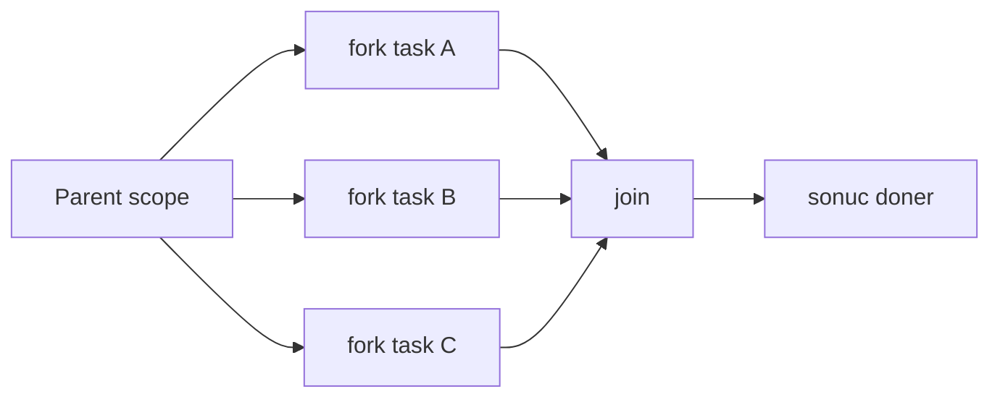
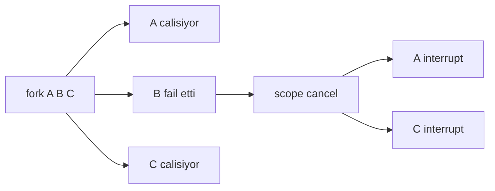
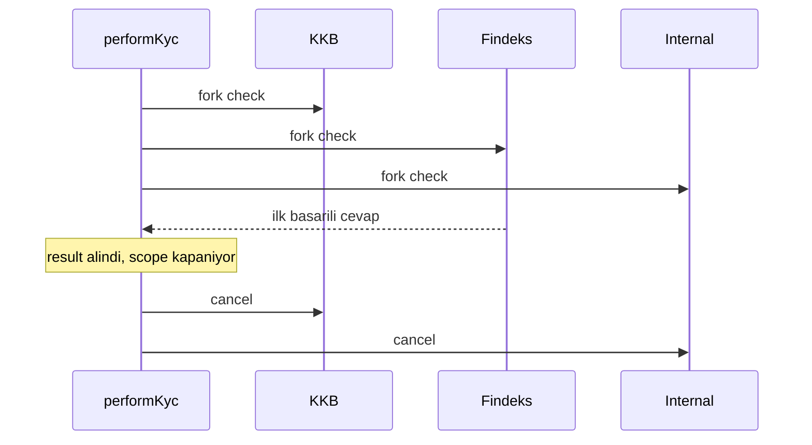

# Topic 3.8 — Structured Concurrency

```admonish info title="Bu bölümde"
- Unstructured concurrency'nin 5 problemi ve structured concurrency'nin "scope = lifetime" prensibiyle bunları nasıl çözdüğü
- `StructuredTaskScope` fork/join iskeleti: `ShutdownOnFailure` (hepsi başarılı olmalı) ve `ShutdownOnSuccess` (ilk başarılı yeter)
- Hata ve iptal yayılımı: bir subtask patlayınca kardeşlerin otomatik interrupt edilmesi
- `joinUntil` ile timeout, `ScopedValue` ile scope-bounded context aktarımı
- Banking pattern'leri (fan-out validation, multi-source aggregation, hedged request) ve `CompletableFuture` ile karar matrisi
```

## Hedef

Java 21'in **structured concurrency** API'sini (preview) kavramak. `StructuredTaskScope` ile scope-bounded concurrent task'ları yönetmek, `ShutdownOnFailure` / `ShutdownOnSuccess` pattern'lerini paralel KYC ve fraud skorlama gibi banking örnekleriyle uygulamak. Hata ve iptal yayılımını, timeout'u, `ScopedValue` kombinasyonunu hatasız anlatabilmek. `CompletableFuture` ile karşılaştırarak ne zaman hangisini seçeceğini bilmek.

## Süre

Okuma: 1.5 saat • Kendini Sına: 30 dk • Pratik (opsiyonel): 3-4 saat • Toplam: ~2 saat (+ pratik)

## Önbilgi

- Topic 3.7 (Virtual Threads) bitti
- `CompletableFuture` (Topic 3.5) biliyorsun
- `ExecutorService` lifecycle (shutdown, awaitTermination) aşinasın
- Java 21+ kurulu, `--enable-preview` flag kullanmaya açıksın

---

## Kavramlar

### 1. Unstructured concurrency — bugünkü problem

Bir transfer öncesi hesabı, karşı hesabı ve fraud skorunu paralel çekmek istiyorsun; klasik `ExecutorService` ile bu işi kurunca ortaya sessizce bozuk bir tablo çıkar. Önce problemi görelim.

```java
ExecutorService exec = Executors.newCachedThreadPool();
Future<Account> fromFuture = exec.submit(() -> repo.findById(from));
Future<Account> toFuture = exec.submit(() -> repo.findById(to));
Future<FxRate> rateFuture = exec.submit(() -> fxClient.getRate(...));

try {
    Account fromAcc = fromFuture.get();   // bloklar
    Account toAcc = toFuture.get();
    FxRate rate = rateFuture.get();
} catch (ExecutionException e) {
    // birinin failure'unu gör — peki diğerleri hâlâ çalışıyor mu?
}
```

Bu kodun beş ayrı problemi var; hepsi banking'de gerçek bir maliyete dönüşür:

1. **Cancellation kontrolsüz:** Biri fail edince diğerleri otomatik durmaz. Manuel `cancel` çağırman gerekir, çoğu zaman unutulur.
2. **Parent-child lifecycle takip edilmez:** Parent return etse bile subtask'lar arka planda çalışmaya devam edebilir.
3. **Stack trace dağınık:** Subtask exception'ları farklı thread'de fırlar, root cause takibi zor.
4. **Resource leak riski:** ExecutorService shutdown unutulursa thread leak.
5. **Error handling fragmente:** Her future için ayrı `try-catch`, kolay yanlış yapılır.

### 2. Structured concurrency — "scope = lifetime"

**Structured concurrency**'nin tek bir merkezi prensibi var: bir subtask'ın yaşam süresi, onu doğuran scope ile sınırlıdır. Scope kapanmadan tüm subtask'lar ya tamamlanmış ya da iptal edilmiş olur; hiçbiri arkada kalmaz.

Bunu **`StructuredTaskScope`** ve `try-with-resources` ile ifade edersin. Aynı transfer senaryosu yeni API ile:

```java
try (var scope = new StructuredTaskScope.ShutdownOnFailure()) {
    Subtask<Account> fromTask = scope.fork(() -> repo.findById(from));
    Subtask<Account> toTask   = scope.fork(() -> repo.findById(to));
    Subtask<FxRate>  rateTask = scope.fork(() -> fxClient.getRate(...));

    scope.join();              // hepsini bekle
    scope.throwIfFailed();     // biri fail ettiyse fırlat

    return doTransfer(fromTask.get(), toTask.get(), rateTask.get());
}
// Scope bitiminde tüm subtask'lar tamamlanmış veya iptal edilmiş
```

Yapı bir fork/join ağacıdır: parent scope task'ları **`scope.fork`** ile dallara ayırır, `join` hepsini bir noktada birleştirir.



Bu iskeletin dört garantisi var. En kritiği: <mark>bir subtask fail ederse ShutdownOnFailure kardeşleri otomatik iptal eder, arka planda kaçak thread kalmaz</mark>.

1. `try-with-resources` blok bitiminde scope kapanır — hiçbir subtask kaçamaz.
2. `ShutdownOnFailure` bir fail'de diğerlerine `Thread.interrupt` çağırır.
3. Parent thread `join()` ile mantıksal olarak çocuk task'ların bitmesini bekler.
4. Hierarchical yapı: bir scope içinde başka scope açabilirsin, doğal bir ağaç oluşur.

### 3. `ShutdownOnFailure` — banking'in en yaygın senaryosu

"Şu 3 şeyi paralel yap, hepsi başarılı olmalı; biri fail ederse hepsini iptal et." Transfer, ödeme, açılış akışlarının neredeyse tamamı bu şekildedir; **`ShutdownOnFailure`** tam bunun için var.

```java
public TransferResult executeTransfer(UUID fromId, UUID toId, Money amount)
        throws InterruptedException, ExecutionException {
    try (var scope = new StructuredTaskScope.ShutdownOnFailure(
            "transfer-scope", Thread.ofVirtual().factory())) {

        Subtask<Account> fromTask = scope.fork(() -> accountService.findById(fromId));
        Subtask<Account> toTask   = scope.fork(() -> accountService.findById(toId));
        Subtask<FraudScore> fraud = scope.fork(() -> fraudService.check(fromId, amount));

        scope.join();               // bekle
        scope.throwIfFailed();      // hata varsa fırlat

        if (fraud.get().isRisky()) throw new HighRiskTransferException();
        return executeTransferInternal(fromTask.get(), toTask.get(), amount);
    }
}
```

Süreçte ne olur: `fork` her görevi bir **virtual thread**'de başlatır, 3 task paralel koşar. `join()` ya hepsinin bitmesini bekler ya da biri fail olunca diğerlerini cancel eder. `throwIfFailed()` ilk fail'i `ExecutionException` ile fırlatır. `try-with-resources` bitiminde scope kapanır; hâlâ çalışan thread varsa interrupt edilir.

İptal yayılımını görselleştirelim — B fail edince A ve C interrupt sinyali alır:



```admonish warning title="İptal kooperatiftir"
`ShutdownOnFailure` kardeş task'lara `Thread.interrupt` gönderir ama zorla öldürmez. Task interrupt'a saygı göstermezse (blocking I/O interrupt'ı yutuyorsa veya tight loop interrupt kontrol etmiyorsa) hemen durmaz. Banking'de fraud/KYC çağrılarının interrupt-aware olması gerekir, yoksa iptal ettiğini sandığın çağrı arkada tamamlanmaya devam eder.
```

### 4. `ShutdownOnSuccess` — ilk başarılı yeter

Bazı senaryolarda tersini istersin: "birden fazla kaynağa sor, ilk doğru cevap veren kazanır, kalanları iptal et." **`ShutdownOnSuccess`** bunu yapar; hedged request ve çoklu büro sorgusunun temelidir.

```java
public FxRate getFxRate(Currency from, Currency to)
        throws InterruptedException, ExecutionException {
    try (var scope = new StructuredTaskScope.ShutdownOnSuccess<FxRate>()) {
        scope.fork(() -> tcmbProvider.getRate(from, to));
        scope.fork(() -> ecbProvider.getRate(from, to));
        scope.fork(() -> fixerProvider.getRate(from, to));

        scope.join();
        return scope.result();   // ilk başarılı olanın sonucu
    }
}
```

Banking'deki klasiği paralel KYC bürosu sorgusu: KKB, Findeks ve internal büroya aynı anda sorup ilk dönen cevabı alırsın.

```java
public KycResult performKyc(UUID customerId)
        throws InterruptedException, ExecutionException {
    try (var scope = new StructuredTaskScope.ShutdownOnSuccess<KycResult>()) {
        scope.fork(() -> kkbBureau.check(customerId));
        scope.fork(() -> findeksBureau.check(customerId));
        scope.fork(() -> internalBureau.check(customerId));

        scope.join();
        return scope.result();   // hangisi önce dönerse
    }
}
```

Akışı zaman ekseninde gör — Findeks ilk cevabı verince kalan iki büro iptal edilir:



`result()` ilk başarılı sonucu döner, diğerleri otomatik iptal edilir. Eğer **hepsi fail ederse** `result()` bir `ExecutionException` fırlatır — bu yüzden tüm-fail senaryosunu her zaman handle et.

### 5. Custom Joiner (Java 24+ API'si)

Java 21'de kutu-hazır iki strateji var: `ShutdownOnFailure` ve `ShutdownOnSuccess`. Java 24 (preview) ile custom **`Joiner`** üzerinden kendi shutdown stratejini yazabilirsin — örneğin "tüm başarılıları topla, ilk fail'de patla".

```java
// Pseudocode — Java 24 preview API
var scope = StructuredTaskScope.open(
    Joiner.allSuccessfulOrThrow()   // tüm başarılı sonuçları topla
);
```

Bu bölümde Java 21'in stable API'siyle devam edeceğiz. Özel shutdown mantığı gerekirse elle `state.cancel()` çağrısıyla benzerini kurabilirsin.

### 6. Subtask state machine

`fork` sana bir **`Subtask`** handle'ı döner; bunun küçük bir state makinesi vardır ve sonuçları buradan okursun.

```java
Subtask<T> task = scope.fork(...);

task.state();       // UNAVAILABLE → SUCCESS / FAILED
task.get();         // SUCCESS ise sonuç, değilse IllegalStateException
task.exception();   // FAILED ise exception
```

State'ler: `UNAVAILABLE` (henüz tamamlanmadı), `SUCCESS` (başarılı), `FAILED` (exception fırlattı). Kritik kural: <mark>`get()` yalnızca `scope.join()` çağrıldıktan sonra çağrılabilir</mark>, yoksa `IllegalStateException` alırsın.

### 7. `ScopedValue` ile bağlamı taşıma

Fork'lanan task'lara user context, trace-id gibi bilgiyi geçirmen gerekir. `ThreadLocal` virtual thread'lerde kötü ölçeklenir; **`ScopedValue`** ise scope-bounded olduğu için structured concurrency ile mükemmel uyum sağlar.

```java
private static final ScopedValue<UserContext> USER_CTX = ScopedValue.newInstance();

public TransferResult transfer(UUID userId, Money amount) throws Exception {
    return ScopedValue.where(USER_CTX, new UserContext(userId)).call(() -> {
        try (var scope = new StructuredTaskScope.ShutdownOnFailure()) {
            scope.fork(this::stepA);   // task USER_CTX.get() ile erişir
            scope.fork(this::stepB);
            scope.join();
            scope.throwIfFailed();
            return computeResult();
        }
    });
}

Account stepA() {
    UserContext ctx = USER_CTX.get();   // parent scope'tan otomatik aktarılır
    return doStepA(ctx);
}
```

`ScopedValue` scope sonunda otomatik unbind edilir; immutable ve tek yönlü aktarım olduğu için `ThreadLocal`'ın leak ve temizlik dertleri yoktur.

### 8. Exception handling

`throwIfFailed()` gerçek hatayı bir `ExecutionException` içine sarar; domain'e özel karar vermek için `cause`'u unwrap etmen gerekir.

```java
try (var scope = new StructuredTaskScope.ShutdownOnFailure()) {
    scope.fork(() -> riskyOp1());
    scope.fork(() -> riskyOp2());
    scope.join();

    try {
        scope.throwIfFailed();
    } catch (ExecutionException e) {
        Throwable cause = e.getCause();   // gerçek hata
        if (cause instanceof InsufficientFundsException) {
            // banking-specific handling
        }
        throw cause;
    }
}
```

```admonish tip title="Multi-failure kaybolur"
`ShutdownOnFailure` yalnızca ilk fail'i saklar; aynı anda patlayan diğer subtask'ların exception'ları kaybolur. Birden fazla hatayı toplamak istersen (ör. "hangi üç servis birden düştü" diye raporlamak) custom joiner ya da her subtask'ın `exception()`'ını `join` sonrası elle taraman gerekir.
```

### 9. Timeout handling

Sonsuza kadar beklemek banking'de kabul edilemez; `join`'in deadline'lı versiyonu **`joinUntil(Instant)`** ile scope'a bir süre tavanı koyarsın.

```java
try (var scope = new StructuredTaskScope.ShutdownOnFailure()) {
    scope.fork(...);
    scope.fork(...);

    boolean finished = scope.joinUntil(Instant.now().plusSeconds(5));
    if (!finished) {
        throw new TimeoutException();   // 5 sn'de bitmedi → scope close + cancel
    }
    scope.throwIfFailed();
}
```

Deadline geçerse `joinUntil` scope'u kapatıp task'ları iptal eder. Tipik banking kullanımı: FX rate fetch için 2 sn timeout, cevap gelmezse fallback kaynağa dön.

### 10. `CompletableFuture` vs Structured Concurrency

İkisi de concurrency aracıdır ama farklı işler için. `CompletableFuture` bir reactive pipeline (compose, map, zincir) için güçlüdür; structured concurrency ise "şu N işi paralel yap, hepsi bitince devam et" batch pattern'i için doğar. Karar matrisi:

| Kriter | CompletableFuture | Structured Concurrency |
|---|---|---|
| Karmaşık async chain (compose, map) | iyi | sınırlı |
| Lifecycle bounded | dağınık | otomatik |
| Exception propagation | wrap'li | daha net |
| Stack trace | parçalı | daha temiz |
| Cancellation | manuel | otomatik |
| Java version | her sürüm | 21+ preview |
| Banking use case | reactive pipeline | scoped batch |

Pratik kural: **CompletableFuture** → reactive chain, complex flow, `CompletionStage` döndüren library API'leri. **Structured Concurrency** → banking transaction'larında "3 şeyi paralel yap, hepsi bitince ilerle" fan-out pattern'i.

### 11. Banking pattern'leri — gerçek senaryolar

**Pattern 1 — Fan-out validation.** Transfer öncesi hesap, limit, fraud ve KYC kontrolünü paralel yap; biri fail ederse hepsini iptal et.

```java
public void preTransferChecks(UUID userId, UUID accountId, Money amount)
        throws InterruptedException, ExecutionException {
    try (var scope = new StructuredTaskScope.ShutdownOnFailure()) {
        Subtask<Boolean> exists   = scope.fork(() -> accountService.exists(accountId));
        Subtask<DailyLimit> limit = scope.fork(() -> limitService.getDailyLimit(userId));
        Subtask<FraudScore> fraud = scope.fork(() -> fraudService.score(userId, amount));
        Subtask<KycStatus> kyc    = scope.fork(() -> kycService.status(userId));

        scope.join();
        scope.throwIfFailed();

        if (!exists.get()) throw new AccountNotFoundException(accountId);
        if (limit.get().exceededBy(amount)) throw new DailyLimitExceededException();
        if (fraud.get().isRisky()) throw new HighRiskException();
        if (!kyc.get().isApproved()) throw new KycNotApprovedException();
    }
}
```

**Pattern 2 — Multi-source aggregation.** Customer dashboard için accounts, cards, loans ve credit score'u paralel çek.

```java
public CustomerDashboard buildDashboard(UUID customerId) throws Exception {
    try (var scope = new StructuredTaskScope.ShutdownOnFailure()) {
        Subtask<List<Account>> accounts = scope.fork(() -> accountService.listByOwner(customerId));
        Subtask<List<Card>> cards       = scope.fork(() -> cardService.listByOwner(customerId));
        Subtask<List<Loan>> loans       = scope.fork(() -> loanService.listByCustomer(customerId));
        Subtask<CreditScore> score      = scope.fork(() -> kkbBureau.getScore(customerId));

        scope.join();
        scope.throwIfFailed();

        return new CustomerDashboard(accounts.get(), cards.get(), loans.get(), score.get());
    }
}
```

Kazanç somut: sequential olsa 200 + 300 + 250 + 500 = 1250 ms; paralel olunca `max(200, 300, 250, 500) = 500 ms`.

**Pattern 3 — Hedged request.** External servisin yedeği varsa ikisine birden sor, hızlı dönen kazansın — `ShutdownOnSuccess`'in doğal alanı.

```java
public FxRate getFxRate(Currency from, Currency to) throws Exception {
    try (var scope = new StructuredTaskScope.ShutdownOnSuccess<FxRate>()) {
        scope.fork(() -> primaryProvider.getRate(from, to));
        scope.fork(() -> secondaryProvider.getRate(from, to));

        scope.join();
        return scope.result();   // hangisi önce dönerse
    }
}
```

### 12. Anti-pattern'ler

**Anti-pattern 1 — Subtask'ı scope dışına sızdırmak.** En sık yapılan hata: scope'un içindeki `Subtask`'ı veya sonucunu dışarıya `Future` olarak döndürmek.

```java
// ❌ KÖTÜ
public Future<Account> badPattern(UUID id) throws Exception {
    try (var scope = new StructuredTaskScope.ShutdownOnFailure()) {
        Subtask<Account> task = scope.fork(() -> repo.findById(id));
        return CompletableFuture.completedFuture(task.get());   // join yok → hata
    }
}
```

<mark>Scope içindeki subtask scope içinde tamamlanmalı; dışarı `Future`/`Subtask` değil, düz değer (Account, Money) döndür</mark>. Aksi halde scope kapanırken `IllegalStateException` veya yarım iş alırsın.

**Anti-pattern 2 — `join()` öncesi `get()`.** `fork` hemen döner ama sonuç hazır değildir; `join`'den önce `get()` çağırmak `IllegalStateException` verir.

```java
Subtask<Account> task = scope.fork(...);
Account a = task.get();   // ❌ henüz join'lenmedi
scope.join();
```

**Anti-pattern 3 — `try-with-resources` unutmak.** Scope'u elle `new`'leyip `close()` çağırmazsan thread leak olur; scope'u her zaman `try (...)` içinde aç.

```java
var scope = new StructuredTaskScope.ShutdownOnFailure();   // ❌ close() garanti değil
scope.fork(...);
scope.join();
```

**Anti-pattern 4 — Nested scope mantığını bozmak.** İç içe scope doğru bir yapıdır; sorun ancak iç scope dışarıya subtask sızdırırsa (Anti-pattern 1) çıkar.

```java
try (var outer = new StructuredTaskScope.ShutdownOnFailure()) {
    outer.fork(() -> {
        try (var inner = new StructuredTaskScope.ShutdownOnSuccess<...>()) {
            // OK — nested doğru, iç scope kendi içinde kapanıyor
            return inner.result();
        }
    });
    outer.join();
}
```

**Anti-pattern 5 — Long-running daemon task.** Structured concurrency scope-bounded çalışmak için tasarlandı. "Always-on background worker" için yanlış araçtır — scope onu kapatmaya çalışır. Böyle işler için `ExecutorService` veya `@Scheduled` kullan.

---

## Önemli olabilecek araştırma kaynakları

- JEP 453: Structured Concurrency (Java 21 preview)
- JEP 480: Structured Concurrency (Java 23 preview, revised)
- "Structured Concurrency in Java" — Inside Java talks
- Project Loom proposal — Structured Concurrency section
- Ron Pressler — JVM Language Summit talks
- `--enable-preview` flag dokümantasyonu
- Trio (Python) — structured concurrency'nin fikir babası

---

## Kendini Sına

Aşağıdaki soruları önce **cevaba bakmadan** kendi cümlelerinle yanıtlamayı dene — hepsi structured concurrency etrafındaki mülakat sorularının tipik varyantları. Takıldığında ilgili Kavramlar başlığına dön, sonra tekrar dene.

**S1. Unstructured concurrency'nin (klasik ExecutorService/Future) başlıca problemleri neler ve structured concurrency bunları hangi tek prensiple çözer?**

<details>
<summary>Cevabı göster</summary>

Beş problem: iptal kontrolsüz (biri fail edince diğerleri otomatik durmaz), parent-child lifecycle takip edilmez (parent return etse bile task'lar arkada koşar), stack trace dağınık (exception farklı thread'de fırlar), resource leak riski (shutdown unutulur) ve error handling fragmente (her future için ayrı try-catch).

Structured concurrency bunları tek bir prensiple çözer: "scope = lifetime". Subtask'ın yaşam süresi onu doğuran scope'la sınırlıdır; `try-with-resources` bloğu kapanmadan tüm subtask'lar ya tamamlanmış ya iptal edilmiştir. Böylece iptal otomatik yayılır, kaçak thread kalmaz, hatalar tek noktada `join`/`throwIfFailed` ile toplanır.

</details>

**S2. `ShutdownOnFailure` ile `ShutdownOnSuccess` arasındaki fark nedir? Her biri için bir banking senaryosu ver.**

<details>
<summary>Cevabı göster</summary>

`ShutdownOnFailure` "hepsi başarılı olmalı" demektir: tüm subtask'ların bitmesini bekler, biri fail ederse kardeşleri iptal edip `throwIfFailed()` ile ilk hatayı fırlatır. Banking'de transfer öncesi fan-out validation (hesap + limit + fraud + KYC) veya customer dashboard aggregation için idealdir.

`ShutdownOnSuccess` "ilk başarılı yeter" demektir: ilk başarılı sonucu döndürüp diğerlerini iptal eder, hepsi fail ederse `result()` bir `ExecutionException` fırlatır. Banking'de paralel KYC bürosu sorgusu (KKB/Findeks/internal) ve hedged FX request (primary + secondary provider yarışı) için kullanılır.

</details>

**S3. `ShutdownOnFailure` altında bir subtask exception fırlatırsa kardeş task'lara tam olarak ne olur? Bu iptal "garantili öldürme" midir?**

<details>
<summary>Cevabı göster</summary>

Bir subtask fail edince scope shutdown tetiklenir ve hâlâ çalışan kardeş task'lara `Thread.interrupt` gönderilir; `join()` erken döner, `throwIfFailed()` ilk hatayı `ExecutionException` içinde verir. `try-with-resources` kapanışında hâlâ canlı thread varsa yine interrupt edilir.

Ama bu garantili öldürme değil, kooperatif iptaldir. Task interrupt'a saygı göstermezse (blocking I/O interrupt'ı yutuyor ya da interrupt flag'ini kontrol etmeyen bir loop) hemen durmaz, arkada tamamlanmaya devam edebilir. Bu yüzden fraud/KYC gibi uzun çağrıların interrupt-aware yazılması gerekir.

</details>

**S4. `scope.join()` ile `scope.throwIfFailed()` ne işe yarar, neden bu sırayla çağrılır ve `subtask.get()` bu ikisiyle nasıl bir ilişki içinde?**

<details>
<summary>Cevabı göster</summary>

`join()` tüm subtask'ların bitmesini (veya iptal edilmesini) bekler — senkronizasyon noktasıdır. `throwIfFailed()` ise `join` sonrası çağrılır ve herhangi bir subtask fail ettiyse ilk hatayı `ExecutionException` içinde fırlatır; başarılıysa sessizce döner. Sıra önemlidir: önce bekle, sonra hata kontrolü yap.

`subtask.get()` yalnızca `join()`'den sonra çağrılabilir. `join` çağrılmadan `get()` çalıştırmak `IllegalStateException` verir, çünkü sonuç henüz hazır değildir. Doğru akış: `fork` → `join` → `throwIfFailed` → `get`.

</details>

**S5. Bir subtask'ı veya sonucunu scope'un dışına `Future` olarak döndürmek neden yanlıştır?**

<details>
<summary>Cevabı göster</summary>

Structured concurrency'nin temel garantisi subtask'ın scope içinde tamamlanmasıdır. Subtask'ı ya da onu saran bir `Future`'ı dışarı döndürürsen, scope kapanırken ya `join` yapılmadığı için `IllegalStateException` alırsın ya da yarım/iptal edilmiş bir iş dışarı sızar — "scope = lifetime" invariant'ı bozulur.

Doğrusu: scope içinde `join` + `throwIfFailed` yap, sonra düz bir değer (Account, Money, KycResult) döndür — asla `Subtask` veya `Future` değil. Paralel işi çağıran katmandan gizlersin; dışarıya yalnızca hazır sonuç çıkar.

</details>

**S6. `joinUntil(Instant)` ile timeout'u nasıl handle edersin ve deadline geçince task'lara ne olur?**

<details>
<summary>Cevabı göster</summary>

`joinUntil(Instant deadline)` verilen ana kadar bekler ve bir boolean döner: `true` ise tüm task'lar bitti, `false` ise deadline'a takılındı. `false` durumunda genelde kendi `TimeoutException`'ını fırlatırsın. Deadline geçtiğinde scope kapanma sürecine girer ve hâlâ çalışan task'lar iptal edilir (interrupt).

Banking örneği: FX rate fetch için `joinUntil(Instant.now().plusSeconds(2))`; 2 saniyede cevap gelmezse timeout fırlatıp fallback kaynağa geçersin. Böylece yavaş bir external servis tüm akışı süresiz bloklayamaz.

</details>

**S7. `ScopedValue` ile `StructuredTaskScope` kombinasyonu neden `ThreadLocal`'a tercih edilir?**

<details>
<summary>Cevabı göster</summary>

Fork'lanan task'lar virtual thread'lerde koşar ve her istekte binlerce virtual thread yaratılabilir. `ThreadLocal` her thread için ayrı bir mutable slot tutar; bu virtual thread yoğunluğunda memory ve temizlik açısından kötü ölçeklenir, leak riski taşır. `ScopedValue` ise immutable ve scope-bounded'dır: `ScopedValue.where(...).call(...)` bloğu boyunca bağlıdır, blok bitince otomatik unbind edilir.

Structured concurrency'de parent scope'ta bind edilen bir `ScopedValue`, fork'lanan child task'lardan otomatik erişilebilir — user context, trace-id gibi bilgiyi tek yönlü ve güvenli aktarırsın. Modern kodda `ThreadLocal` yerine tercih edilir.

</details>

**S8. Aynı işi hem `CompletableFuture` hem structured concurrency ile yapabilirsin. Hangi durumda hangisini seçersin?**

<details>
<summary>Cevabı göster</summary>

`CompletableFuture` bir reactive pipeline için güçlüdür: `thenCompose`, `thenApply`, `thenCombine` ile karmaşık async zincirler kurar, `CompletionStage` döndüren library API'leriyle uyumlu çalışır. Lifecycle ve cancellation'ı elle yönetmen gerekir.

Structured concurrency ise "şu N işi paralel yap, hepsi bitince ilerle" scope-bounded batch pattern'i için doğar: fan-out validation, multi-source aggregation, hedged request. Otomatik iptal, temiz stack trace ve `try-with-resources` ile bounded lifecycle sağlar. Kısaca: complex async chain → CompletableFuture; scoped paralel batch → structured concurrency.

</details>

---

## Tamamlama kriterleri

- [ ] Unstructured concurrency'nin 5 problemini ve structured concurrency'nin "scope = lifetime" prensibini anlatabiliyorum
- [ ] `ShutdownOnFailure` ile `ShutdownOnSuccess` arasındaki farkı ve her biri için bir banking senaryosunu söyleyebilirim
- [ ] Bir subtask fail edince kardeşlere ne olduğunu (interrupt yayılımı) ve iptalin kooperatif olduğunu açıklayabiliyorum
- [ ] `fork → join → throwIfFailed → get` sırasını ve neden bu sırayla çağrıldığını biliyorum
- [ ] Subtask'ı scope dışına sızdırmanın neden yanlış olduğunu gerekçesiyle sayabiliyorum
- [ ] `joinUntil` ile timeout handling'i ve deadline sonrası iptal davranışını çizebilirim
- [ ] `ScopedValue` + `StructuredTaskScope` kombinasyonunun `ThreadLocal`'a üstünlüğünü açıklayabiliyorum
- [ ] CompletableFuture vs structured concurrency arasında bilinçli karar verebiliyorum
- [ ] (Opsiyonel) "Pratik yapmak istersen" bölümündeki testleri yazdım ve Claude-verify prompt'uyla doğrulattım

---

## Defter notları

1. "Unstructured concurrency'nin 5 problemi: ____."
2. "`ShutdownOnFailure` ne zaman, `ShutdownOnSuccess` ne zaman: ____."
3. "`scope.join()` ile `scope.throwIfFailed()` farkı: ____."
4. "Bir subtask fail edince kardeşlere ne olur (interrupt kooperatif mi): ____."
5. "Subtask'ı scope dışına sızdırmamamın sebebi: ____."
6. "Hedged request pattern (banking örneği): ____."
7. "`joinUntil(Instant)` ile timeout nasıl handle edilir: ____."
8. "`ScopedValue` + `StructuredTaskScope` neden `ThreadLocal`'dan iyi: ____."
9. "Long-running daemon task neden structured scope'a girmez: ____."
10. "CompletableFuture vs Structured Concurrency karar matrisi: ____."

```admonish success title="Bölüm Özeti"
- Structured concurrency'nin tek prensibi "scope = lifetime": subtask'ın ömrü scope'la sınırlı, `try-with-resources` kapanmadan hepsi tamamlanır veya iptal edilir — unstructured'ın 5 problemini birden çözer
- `StructuredTaskScope.ShutdownOnFailure` "hepsi başarılı olmalı" (fan-out validation, dashboard), `ShutdownOnSuccess` "ilk başarılı yeter" (paralel KYC, hedged FX) demektir
- Bir subtask fail edince kardeşlere `Thread.interrupt` gider ve `throwIfFailed()` ilk hatayı `ExecutionException` ile verir; iptal kooperatiftir, task interrupt-aware olmalı
- Doğru sıra `fork → join → throwIfFailed → get`; `join`'den önce `get()` ve subtask'ı scope dışına `Future` olarak döndürmek iki temel anti-pattern
- `joinUntil(Instant)` ile timeout tavanı koyulur; `ScopedValue` virtual thread'lerde context'i `ThreadLocal`'dan güvenli aktarır
- CompletableFuture complex async chain için, structured concurrency scope-bounded paralel batch için; long-running daemon işler structured scope'a girmez
```

---

## Pratik yapmak istersen

Kavramları koda dökmek istersen aşağıdaki iki ek hazır: test yazma rehberi `ShutdownOnFailure` iptalini, `ShutdownOnSuccess` yarışını, timeout ve subtask state davranışlarını doğrulayan örnek testler içerir; Claude-verify prompt'u ile yazdığın structured concurrency kodunu banking-grade perspektiften denetletebilirsin.

<details>
<summary>Test yazma rehberi</summary>

Testleri Java 21'de çalıştırmak için `--enable-preview` flag'i gerekir:

```xml
<plugin>
    <groupId>org.apache.maven.plugins</groupId>
    <artifactId>maven-compiler-plugin</artifactId>
    <configuration>
        <release>21</release>
        <compilerArgs><arg>--enable-preview</arg></compilerArgs>
    </configuration>
</plugin>
```

### Test 3.8.1 — ShutdownOnFailure cancellation

Bir task hızlı fail etsin, diğeri uzun uyusun; failure'un kardeşi interrupt ettiğini doğrula.

```java
@Test
void shutdownOnFailureShouldCancelOtherTasks() throws Exception {
    AtomicBoolean task2Completed = new AtomicBoolean(false);
    AtomicBoolean task2Interrupted = new AtomicBoolean(false);

    try (var scope = new StructuredTaskScope.ShutdownOnFailure()) {
        scope.fork(() -> { throw new RuntimeException("fast failure"); });
        scope.fork(() -> {
            try {
                Thread.sleep(2000);
                task2Completed.set(true);
            } catch (InterruptedException e) {
                task2Interrupted.set(true);
            }
            return null;
        });

        scope.join();
        try {
            scope.throwIfFailed();
        } catch (ExecutionException expected) {
            // bekleniyor
        }
    }

    assertThat(task2Completed).isFalse();
    assertThat(task2Interrupted).isTrue();   // diğer task interrupt edilmiş
}
```

### Test 3.8.2 — ShutdownOnSuccess race

En hızlı dönenin kazandığını ve hepsi fail edince exception fırladığını doğrula.

```java
@Test
void shutdownOnSuccessShouldReturnFirstResult() throws Exception {
    try (var scope = new StructuredTaskScope.ShutdownOnSuccess<String>()) {
        scope.fork(() -> { Thread.sleep(100); return "slow"; });
        scope.fork(() -> { Thread.sleep(50); return "fast"; });
        scope.fork(() -> { Thread.sleep(200); return "slowest"; });

        scope.join();
        assertThat(scope.result()).isEqualTo("fast");
    }
}

@Test
void shutdownOnSuccessShouldThrowIfAllFail() throws InterruptedException {
    try (var scope = new StructuredTaskScope.ShutdownOnSuccess<String>()) {
        scope.fork(() -> { throw new RuntimeException("err1"); });
        scope.fork(() -> { throw new RuntimeException("err2"); });

        scope.join();
        assertThatThrownBy(scope::result).isInstanceOf(ExecutionException.class);
    }
}
```

### Test 3.8.3 — joinUntil timeout

Deadline'ı aşan bir task'ta `joinUntil`'in `false` döndüğünü doğrula.

```java
@Test
void joinUntilShouldReturnFalseOnTimeout() throws InterruptedException {
    try (var scope = new StructuredTaskScope.ShutdownOnFailure()) {
        scope.fork(() -> { Thread.sleep(5000); return "slow"; });

        boolean finished = scope.joinUntil(Instant.now().plusMillis(100));
        assertThat(finished).isFalse();
    }
}
```

### Test 3.8.4 — Subtask state

Başarılı ve başarısız task'ların state ve exception değerlerini doğrula.

```java
@Test
void subtaskStateShouldReflectExecutionResult() throws Exception {
    try (var scope = new StructuredTaskScope.ShutdownOnFailure()) {
        Subtask<String> successful = scope.fork(() -> "ok");
        Subtask<String> failed = scope.fork(() -> { throw new RuntimeException("fail"); });

        scope.join();

        // success task iptal yüzünden UNAVAILABLE de olabilir
        assertThat(successful.state()).isIn(Subtask.State.SUCCESS, Subtask.State.UNAVAILABLE);
        assertThat(failed.state()).isEqualTo(Subtask.State.FAILED);
        assertThat(failed.exception()).isInstanceOf(RuntimeException.class);
    }
}
```

### Bonus — Sequential vs structured süre karşılaştırması

Customer dashboard'u önce sequential (accounts + cards + loans + score sırayla), sonra `ShutdownOnFailure` ile paralel çalıştır; her adıma yapay latency ver (200/300/250/500 ms). Sequential'ın toplam süreye, paralelin `max` latency'ye yaklaştığını ölç ve defterine yaz.

**Tamamlama kriterleri (pratik):**

- [ ] `ShutdownOnFailure` iptal testi yeşil: fail eden task kardeşini interrupt ediyor
- [ ] `ShutdownOnSuccess` yarış testi yeşil: en hızlı dönen kazanıyor, hepsi fail edince exception
- [ ] `joinUntil` timeout testi yeşil: deadline aşımında `false`
- [ ] Subtask state testi yeşil: SUCCESS / FAILED / exception doğru
- [ ] Sequential vs paralel süre farkını ölçüp not aldım

</details>

<details>
<summary>Claude-verify prompt</summary>

```
Aşağıdaki Java structured concurrency kodumu banking-grade kriterlere göre
değerlendir. Sadece eksik veya yanlışları işaretle, kod yazma:

1. Scope kullanımı:
   - try-with-resources ile scope açılmış mı?
   - --enable-preview flag eklenmiş mi (Java 21'de)?
   - Subtask'lar scope dışına sızdırılmış mı (Future return)? (Olmamalı)

2. ShutdownOnFailure pattern'i:
   - "Hepsi başarılı olmalı" senaryosunda doğru seçilmiş mi?
   - scope.join() öncesi subtask.get() çağrılmış mı? (Yanlış sıralama)
   - scope.throwIfFailed() çağrılmış mı?

3. ShutdownOnSuccess pattern'i:
   - "İlk başarılı yeter" senaryosunda doğru seçilmiş mi?
   - scope.result() ile sonuç alınmış mı?
   - Tüm fail senaryosunda exception handling var mı?

4. Banking pattern'leri:
   - Fan-out validation (paralel pre-checks) yapılmış mı?
   - Multi-source aggregation (dashboard) için kullanılmış mı?
   - Hedged request (FX, KYC) için ShutdownOnSuccess var mı?

5. Timeout:
   - joinUntil(Instant) ile timeout handling var mı?
   - Timeout sonrası proper exception fırlatılmış mı?

6. ScopedValue ile kombinasyon:
   - Parent scope'tan child task'lara context aktarımı ScopedValue ile mi?
   - ThreadLocal hâlâ kullanılıyor mu? (Modern kodda ScopedValue tercih)

7. Anti-pattern:
   - Subtask scope dışına sızdırılmış mı (CompletableFuture return)?
   - try-with-resources unutulmuş mu?
   - scope.join() öncesi get() çağrılmış mı?
   - Long-running daemon task structured scope'a sokulmuş mu? (Olmamalı)

8. Exception handling:
   - throwIfFailed() ExecutionException'ı unwrap edilmiş mi?
   - Domain-specific exception'lar handle edilmiş mi?
   - Interrupt-aware mı (uzun external çağrılar iptale saygı gösteriyor mu)?

9. CompletableFuture vs Structured Concurrency:
   - Doğru senaryo için doğru araç seçilmiş mi?
   - Complex async chain (compose, map) için CompletableFuture mu?
   - Scope-bounded batch operation için Structured mu?

Her madde için PASS / FAIL / EKSIK işaretle, kanıt göster.
```

</details>
