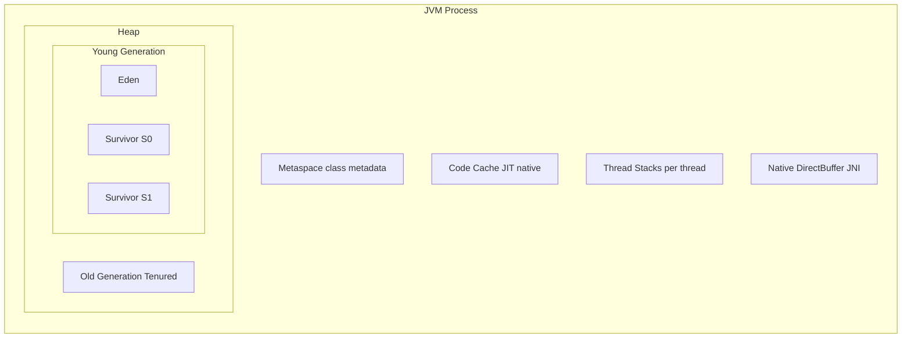
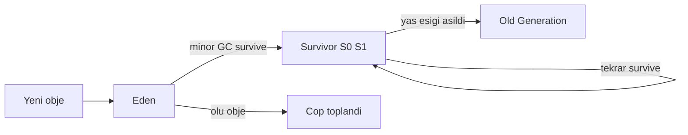
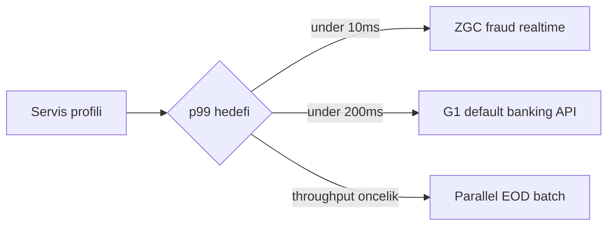
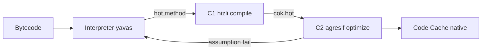

# Topic 3.9 — JVM Internals: Memory, GC, JIT

```admonish info title="Bu bölümde"
- JVM memory area'ları: heap (Young=Eden+Survivor / Old), Metaspace, Code Cache, thread stack, native memory
- Generational hypothesis ve bir objenin Eden → Survivor → Old promotion yolculuğu
- Banking için GC seçimi: Serial, Parallel, G1, ZGC, Shenandoah — hangi profile hangisi ve neden
- JIT tiered compilation (interpreter → C1 → C2) + escape analysis, scalar replacement, inlining
- Production GC log'unu okuyup tune etme ve JFR, Native Memory Tracking ile heap dışını görme
```

## Hedef

JVM'in **iç mekanizmasını** banking-grade derinlikte anlamak. Heap layout, garbage collector seçimi, JIT compilation ve memory area'larını sebep-sonuç olarak kavramak. Production'da bir banking servisinin GC log'unu okuyup tune edebilmek, OOM anında kanıtı toplayabilmek.

## Süre

Okuma: ~2 saat • Kendini Sına: 45 dk • Pratik (opsiyonel): 3-4 saat • Toplam: ~2.5 saat (+ pratik)

## Önbilgi

- Topic 3.1-3.8 bitti
- "Heap, stack" temel ayrımı tanıdık
- `java -Xms... -Xmx...` flag'lerini gördün

---

## Kavramlar

### 1. JVM memory areas — büyük resim

Tune etmeden önce neyi tune ettiğini bilmelisin: JVM belleği tek bir "heap" değildir, birkaç ayrı bölgeden oluşur. **Heap** objelerin yaşadığı yerdir; gerisi (Metaspace, Code Cache, stack'ler, native memory) heap dışındadır ama OS belleğini yer.

Heap'in kendisi generational olarak bölünür: **Young Generation** (Eden + Survivor S0/S1) yeni objeler için, **Old Generation** uzun yaşayanlar için.



Bir banking servisinin 8GB'lık tipik dağılımı, heap'in toplam belleğin sadece bir parçası olduğunu gösterir:

```
8GB JVM:
- Heap: 6GB (Xmx = 6g)
  - Young: 2GB
  - Old: 4GB
- Metaspace: 256MB
- Code Cache: 240MB
- Threads: ~500 thread × 1MB = 500MB
- Native (DirectByteBuffer): 500MB
```

Tuzak: `-Xmx6g` verdin diye process 6GB tüketmez — Metaspace, thread stack'ler ve native buffer'lar üstüne biner. Container memory limit'ini sadece heap'e göre ayarlarsan **OOMKilled** yersin.

### 2. Heap — generational hypothesis

GC'nin neden "generation"lara böldüğünü anlamak için tek bir gözleme dayanır: **generational hypothesis** — "objelerin çoğu kısa ömürlüdür."

Banking'de bu birebir doğru. Bir HTTP request boyunca yaratılan DTO'lar, mapper sonuçları, ara hesaplama nesneleri request bitince çöptür. Sadece azınlık uzun yaşar: cache entry'leri, connection pool objeleri, singleton'lar. <mark>GC ömrü kısa objeleri ucuza toplayabilmek için heap'i yaşa göre böler</mark>.

Bu yüzden heap iki bölgeye ayrılır. **Young Generation**: yeni objeler burada doğar, sık ve hızlı GC (minor GC). **Old Generation**: Young'dan promote olan azınlık, nadir ama maliyetli GC (major GC).

Young'ın içinde de yapı var: **Eden** (yeni allocation buraya) ve iki **Survivor** space (S0, S1). Minor GC'de yaşayan objeler Survivor'lar arasında kopyalanır, ölüler toplanır. Bir objenin Old'a terfisi (promotion) bir eşiğe bağlıdır:



Minor GC akışı adım adım:

1. Eden + dolu Survivor → boş Survivor'a canlı objeleri kopyala
2. Eden ve eski Survivor'ı boşalt
3. Bir sonraki minor GC'de rolleri swap et (S0 ↔ S1)
4. Bir obje N kez survive ederse (default tenuring threshold ~15) → **Old**'a promote

Major GC (Old GC) Old'da yer tükenince tetiklenir ve çok daha yavaştır. Sağlıklı bir serviste minor GC saniyeler içinde, major GC dakikalar-onlarca dakika arayla çalışır.

### 3. Garbage collectors — banking için seçim

GC seçimi tek bir takasın kararıdır: **latency mı, throughput mu?** Banking'de servis profiline göre değişir, o yüzden adayları tek tek tanı.

**Serial GC** (`-XX:+UseSerialGC`) tek thread'li ve tamamen stop-the-world'dür. Banking için uygun değil (latency yüksek); sadece embedded ve çok küçük heap senaryoları içindir.

**Parallel GC** (`-XX:+UseParallelGC`) çok thread'li ve throughput odaklıdır. Hâlâ STW pause var ama daha kısa. Banking'de **batch job'larda** iyi tercih (EOD reconciliation, raporlama); online işlemler için yetersizdir çünkü pause > 1s görülebilir.

**G1 GC** (Garbage First, Java 9+ default) **banking standardıdır**. Heap'i 1-32MB'lık **region**'lara böler, Young ve Old'u aynı heap içinde dağıtır. Concurrent marking yapar ve STW pause'u kısa tutar (genelde < 200ms):

```bash
-XX:+UseG1GC
-XX:MaxGCPauseMillis=200    # hedef max pause
-Xms4g -Xmx4g               # heap sabit (banking pratiği)
```

Kritik nüans: `MaxGCPauseMillis` bir **target**'tır, guarantee değil. <mark>Çok düşük bir hedef (50ms) verirsen G1 Young'ı küçültür, daha sık GC yapar ve throughput düşer</mark>.

**ZGC** (Z Garbage Collector, Java 11+ stable) neredeyse pause-less'tir: pause'ları **< 10ms** garanti eder (concurrent marking + relocation). **TB-ölçek** heap destekler (16TB'ye kadar) ama karşılığında ~%15 throughput maliyeti getirir. Banking'de düşük-latency servisler (örn. real-time fraud detection) için idealdir:

```bash
-XX:+UseZGC
-Xmx16g
```

Java 21'den itibaren **Generational ZGC** (`-XX:+ZGenerational`) gelir — Young/Old ayrımı ekleyerek throughput'u belirgin iyileştirir; modern JVM'de tercih edilen moddur.

**Shenandoah** (Red Hat) ZGC benzeri pause-less bir GC'dir, daha düşük CPU overhead'i vardır. Java 12+ ile resmî (özellikle Red Hat build'lerinde) ve OpenJDK + Red Hat ekosisteminde tercih edilir.

Banking için karar özeti:

| Profil | GC |
|---|---|
| API gateway, online transfer, p99 < 50ms | ZGC |
| Standart banking API (p99 < 200ms OK) | G1 (default) |
| EOD batch, raporlama (throughput) | Parallel |
| Düşük heap (<2GB) servisleri | G1 yine OK |
| Mevcut prod stable, dokunma | G1 |

Karar ağacını tek bakışta görmek istersen:



### 4. GC tuning flag'leri

Doğru GC'yi seçtikten sonra iş boyutlandırma ve gözlemlenebilirliğe kalır. Önce heap boyutu ve generation oranı:

```bash
-Xms6g -Xmx6g          # initial = max (production)
-XX:NewRatio=2         # Old:Young = 2:1
```

G1 için ince ayar flag'leri — çoğu servis default'la iyi çalışır, bunlara ancak GC log kanıt gösterince dokun:

```bash
-XX:+UseG1GC
-XX:MaxGCPauseMillis=200
-XX:G1HeapRegionSize=8m
-XX:G1NewSizePercent=20      # Young min %
-XX:G1MaxNewSizePercent=40   # Young max %
-XX:G1ReservePercent=10      # promotion için yedek
```

ZGC tarafında ayar minimaldir; boyut ver ve generational modu aç:

```bash
-XX:+UseZGC
-XX:+ZGenerational           # Java 21+
```

En kritik ikisi tuning değil, **gözlemlenebilirlik** flag'leridir. Production'da bunlar olmadan çalışmak, kaza anında kayıt cihazı kapalı uçmaktır:

```bash
# GC log (production critical!)
-Xlog:gc*:file=/var/log/banking/gc.log:time,uptime:filecount=10,filesize=100M

# Heap dump on OOM (production critical!)
-XX:+HeapDumpOnOutOfMemoryError
-XX:HeapDumpPath=/var/log/banking/heapdump.hprof
```

```admonish warning title="Banking kuralı: Xms = Xmx"
Production'da heap'i sabitle: `-Xms` ile `-Xmx` aynı olsun. Heap dinamik büyürken JVM ekstra GC pause ve OS'ten memory commit maliyeti öder; sabit heap bu belirsizliği ortadan kaldırır. `-Xms512m -Xmx16g` gibi bir konfig, yük artınca tam en kötü anda pause üretir.
```

### 5. GC log analizi

GC log'u okuyamıyorsan tune de edemezsin — önce sağlıklı bir satırın anatomisini çöz. Tipik bir G1 minor GC satırı:

```
[2.143s][info][gc] GC(0) Pause Young (Normal) (G1 Evacuation Pause)
  100M->20M(2048M) 5.231ms
```

Parçalar: `Pause Young (Normal)` minor GC'dir; `100M->20M` heap kullanımının 100MB'tan 20MB'ye düştüğünü, `(2048M)` toplam kapasiteyi, `5.231ms` pause süresini gösterir. Sağlıklı pattern'de minor GC pause < 100ms, major GC pause < 1s, minor sıklık 10-30 sn, major 5-30 dk.

Sorunlu pattern'leri tanımak asıl beceridir. Full GC + uzun pause fragmentation veya memory leak şüphesidir:

```
GC(42) Pause Full (Allocation Failure) 1800M->1750M(2048M) 8500ms
```

8.5 saniyelik full GC + heap'in neredeyse boşalamaması (1800M → 1750M) klasik leak sinyalidir. Bir başka sorunlu pattern, Young'daki objelerin çoğunun toplanamayıp Old'a akması:

```
GC(43) Pause Young (Normal) 90M->85M(2048M) 250ms
```

90M → 85M yani çok az obje ölüyor, gerisi promote oluyor → tenuring threshold çok düşük veya Young çok küçük demektir. Manuel okuma iyidir ama ölçekte araç kullan: **GCViewer** (open source), **GCEasy.io** (web, ücretsiz, AI öneri), **JClarity Censum** (ticari), **gcplot.com**.

### 6. JIT compilation — interpreter → C1 → C2

Java'nın "yavaş başlayıp hızlanması" JIT yüzündendir; bunu bilmezsen "servis warmup'ta neden yavaş" sorusuna cevap veremezsin. Yaşam döngüsü şöyledir: `javac` bytecode üretir, JVM önce bytecode'u **interpret** eder (yavaş), sıcak method'ları derler.



Bir method yeterince çağrılınca (>10000 invocation) önce **C1** (client compiler) ile hızlı ama basit derlenir; çok daha sıcaksa **C2** (server compiler) ile agresif optimize edilir. **Tiered compilation** (Java 8+ default) ikisini birlikte kullanır: erken C1 ile hız kazanılır, ısındıkça C2 devreye girer.

```bash
-XX:+TieredCompilation       # default
-XX:CompileThreshold=10000   # interpret → compiled (default)
```

C2'nin uyguladığı optimizasyonların banking'de doğrudan karşılığı vardır. **Inlining** küçük method'ları çağrı yerine kopyalar, method call overhead'ini siler:

```java
public BigDecimal getAmount() { return amount; }   // 5 satır method
// JIT bunu çağıran kod'a inline eder, method call kalmaz
```

**Escape analysis** bir nesne sadece tek method içinde kullanılıp dışarı "kaçmıyorsa" onu heap yerine stack'te yaratır — allocation ve GC yükü sıfırlanır:

```java
public BigDecimal compute() {
    Money temp = Money.of("100", "TRY");   // sadece burada
    return temp.amount();
}
// JIT: temp'i stack'te yarat, heap allocation yok, GC yok
```

**Scalar replacement** ise objeyi field'larına parçalar; obje hiç yaratılmaz, alanları local değişkene döner:

```java
Money m = Money.of("100", "TRY");
// JIT: m.amount ve m.currency birer local variable, m heap'te yok
```

Banking etkisi somuttur: inner loop'lardaki `BigDecimal` ara değişkenleri **leak etmiyorsa** JIT bunları stack'e koyar, allocation yükü kaybolur. JIT kararlarını gözlemlemek istersen log aç:

```bash
-XX:+PrintCompilation         # her compile event'i
-XX:+UnlockDiagnosticVMOptions
-XX:+PrintInlining            # inline kararları
```

`PrintCompilation` çıktısında tier numarası derlemeyi anlatır — `3` = C1, `4` = C2:

```
123  45    3   com.mavibank.banking.Money::add (12 bytes)
124  46    4   com.mavibank.banking.Account::deposit (45 bytes)
```

### 7. Class loading & Metaspace

Class metadata'sının nerede tutulduğu Java 8 ile değişti ve bu bir OOM kaynağını yer değiştirdi. Java 7 ve öncesi **PermGen** kullanırdı (sabit boyut, klasik OOM sebebi); Java 8+ ise **Metaspace** kullanır (native memory, dinamik büyür).

Metaspace class metadata'sını, method bytecode'unu, reflection objelerini ve class loader'ları tutar. Boyutunu sınırlamak senin işin:

```bash
-XX:MaxMetaspaceSize=512m    # üst limit
-XX:MetaspaceSize=128m       # initial
```

```admonish warning title="Metaspace tuzağı"
Metaspace default'ta unbounded'dır — sınır koymazsan class'ları sürekli yükleyen bir app (Spring + JPA + ek lib'ler) native memory'yi yiyip OOM olabilir. Her zaman `MaxMetaspaceSize` set et. Klasik leak: Spring DevTools restart'ta classloader leak eder, Metaspace büyür — bu yüzden production'da DevTools bulunmaz.
```

### 8. Code Cache

JIT'in derlediği native kod **Code Cache**'e gider ve bu alan dolarsa derleme sessizce durur. Boyut flag'leri:

```bash
-XX:ReservedCodeCacheSize=240m   # default
-XX:InitialCodeCacheSize=64m
```

Tuzak sessiz olduğu için tehlikelidir: Code Cache full → JIT compilation durur → sıcak method'lar interpreter'da kalır → performans düşer ve hata log'u görmezsin. Doluluğu şu satırdan tanı:

```
CodeCache: size=245760Kb used=243512Kb max_used=245456Kb free=2248Kb
```

`used` ≈ `size` ise genişlet: `-XX:ReservedCodeCacheSize=512m`.

### 9. Thread stack

Her thread kendi stack'ini taşır (method call stack + primitive değerler) ve default boyutu **1MB**'dır. Bu, çok thread'li serviste ciddi native memory demektir:

```bash
-Xss512k   # her thread 512KB stack
```

Banking etkisi: 1000 platform thread × 1MB = 1GB native memory, sadece stack için. Virtual thread'lerde stack çok küçüktür (~kilobyte mertebesi) — Loom'un en büyük kazancı tam da budur.

### 10. Native memory tracking

Heap OK görünse bile process belleği şişebilir; heap dışını görmenin yolu **Native Memory Tracking**'tir. Aç ve sorgula:

```bash
java -XX:NativeMemoryTracking=detail ...
jcmd <pid> VM.native_memory
```

Çıktı belleği kategorilere böler ve heap'in sadece bir dilim olduğunu gösterir:

```
Total: reserved=8GB, committed=6GB
- Java Heap (reserved=6GB, committed=6GB)
- Class (reserved=1GB, committed=200MB)
- Thread (reserved=500MB, committed=500MB)
- Code (reserved=240MB, committed=120MB)
- GC (reserved=100MB, committed=80MB)
- Direct (reserved=512MB, committed=300MB)  ← DirectByteBuffer
```

```admonish tip title="Off-heap'i takip et"
DirectByteBuffer ve Netty gibi off-heap kullanan bileşenler heap dump'ta görünmez ama OS belleğini tüketir. Container'ın memory limit'ini heap + Metaspace + thread + direct toplamına göre boyutla; yoksa heap boşken bile OOMKilled olursun. `jcmd VM.native_memory` bu gizli tüketimi ortaya çıkarır.
```

### 11. JDK Flight Recorder (JFR) — production-safe profiling

Production'da profiler açmaktan korkarsın çünkü çoğu profiler yavaşlatır; JFR bu korkuyu ortadan kaldırır. JFR JVM'in **dahili** profiling sistemidir ve production'da ~%1-2 overhead ile çalışır.

```bash
# Continuous recording
-XX:StartFlightRecording=duration=60s,filename=banking.jfr

# Anlık dump
jcmd <pid> JFR.start name=banking
jcmd <pid> JFR.dump name=banking filename=banking.jfr
```

JFR zengin event toplar: allocation (TLAB içi/dışı), GC events, lock contention, thread state'leri, file/network I/O, JIT compilation, class loading. Banking pratiği: production'da JFR sürekli açık kalır; bir sorun yaşanınca son N dakikanın recording'ini indirip JMC (JDK Mission Control) ile incelersin — canlı sistemi hiç durdurmadan.

### 12. JIT decompile & deoptimization

JIT bazen kendi derlediği kodu **deoptimize** eder — yani interpreter'a geri döner. Sebebi genellikle bir varsayımın bozulmasıdır: bir virtual method monomorphic derlendi ama sonra polymorphic çağrı geldi, ya da bir "uncommon trap" (sıra dışı code path) tetiklendi.

```bash
-XX:+UnlockDiagnosticVMOptions
-XX:+PrintCompilation
-XX:+LogCompilation
```

Banking etkisi nadiren kritiktir ama "uygulama hızlandı, sonra sebepsiz yavaşladı" tipi gizemli senaryolarda deoptimization'a bakman gerekebilir.

### 13. Banking örnekleri — gerçek tuning

Şimdi her şeyi birleştirelim: aynı bilgiyi üç farklı servis profiline uygulayınca GC seçimi ve flag'ler nasıl değişir? Senaryo 1 — standart API servisi, p99 hedef 100ms, G1 ile:

```bash
java -server \
     -Xms4g -Xmx4g \
     -XX:+UseG1GC \
     -XX:MaxGCPauseMillis=50 \
     -XX:+ParallelRefProcEnabled \
     -XX:+HeapDumpOnOutOfMemoryError \
     -XX:HeapDumpPath=/var/log/banking/heap.hprof \
     -Xlog:gc*:file=/var/log/banking/gc.log:time,uptime:filecount=10,filesize=100M \
     -jar core-banking.jar
```

Senaryo 2 — düşük-latency fraud detection, p99 hedef 10ms; burada latency her şeydir, ZGC generational:

```bash
java -server \
     -Xms8g -Xmx8g \
     -XX:+UseZGC \
     -XX:+ZGenerational \
     -XX:-OmitStackTraceInFastThrow \
     -XX:+HeapDumpOnOutOfMemoryError \
     -XX:HeapDumpPath=/var/log/fraud/heap.hprof \
     -jar fraud-service.jar
```

Senaryo 3 — EOD batch, throughput maksimum; latency önemsiz, Parallel GC + büyük heap:

```bash
java -server \
     -Xms16g -Xmx16g \
     -XX:+UseParallelGC \
     -XX:ParallelGCThreads=8 \
     -XX:+HeapDumpOnOutOfMemoryError \
     -jar eod-job.jar
```

Üçünde de ortak olan `HeapDumpOnOutOfMemoryError`'a dikkat et — profil ne olursa olsun bu bırakılmaz.

### 14. Anti-pattern'ler

Mülakatta "bu JVM konfigünde ne yanlış?" sorusunun cephaneliği burasıdır. Beş klasik:

**1 — `-Xmx` büyük, `-Xms` küçük** (`-Xms512m -Xmx16g`): heap büyürken GC pause olur, hep en kötü anda. Production'da `Xms = Xmx`.

**2 — Production'da GC log kapalı**: OOM olunca neden olduğunu asla öğrenemezsin. GC log her zaman aktif ve rotate'li olmalı.

**3 — `HeapDumpOnOutOfMemoryError` yok**: OOM → restart → kanıt yok. Heap dump'ı otomatik kaydet, yoksa aynı hatayı ikinci kez debug edersin.

**4 — Yanlış GC seçimi**: düşük-latency servise Parallel takmak (uzun STW pause) veya batch job'a ZGC takmak (gereksiz %15 CPU overhead).

**5 — `MaxGCPauseMillis` çok düşük** (`-XX:MaxGCPauseMillis=10`): G1 hedefe ulaşmak için Young'ı küçültür, sık minor GC yapar, throughput katlanarak düşer. Realistic hedef 50-200ms.

---

## Önemli olabilecek araştırma kaynakları

- "Java Performance: The Definitive Guide" (Scott Oaks) — bütün JVM internals
- "The Garbage Collection Handbook" — derin GC teorisi
- Oracle G1 GC tuning guide
- "JVM Anatomy Quark" serisi — Aleksey Shipilev (blog)
- ZGC documentation (OpenJDK)
- Shenandoah GC paper (Red Hat)
- GCEasy.io blog arşivi
- JEP 439: Generational ZGC

---

## Kendini Sına

Aşağıdaki soruları önce **cevaba bakmadan** kendi cümlelerinle yanıtlamayı dene — hepsi TR bank ve performance mülakatlarında karşına çıkabilecek tarzda. Takıldığın soru olursa ilgili Kavramlar başlığına dön, sonra tekrar dene.

**S1. Generational hypothesis nedir ve bir banking servisinde neden geçerlidir? GC bu varsayımı nasıl kullanır?**

<details>
<summary>Cevabı göster</summary>

Generational hypothesis "objelerin çoğu kısa ömürlüdür" gözlemidir. Banking'de birebir doğrudur: bir HTTP request boyunca yaratılan DTO'lar, mapper çıktıları ve ara hesaplama nesneleri request bitince çöp olur; sadece cache entry'leri, connection pool objeleri ve singleton'lar uzun yaşar.

GC bu varsayımı heap'i yaşa göre bölerek kullanır: yeni objeler Young Generation'a doğar ve sık, hızlı minor GC ile toplanır; çoğu obje burada ölür, o yüzden tarama ucuzdur. Az sayıda "hayatta kalan" obje Old Generation'a promote olur ve orada nadir ama maliyetli major GC çalışır. Böylece kısa ömürlü objeler için ucuz, uzun ömürlüler için seyrek toplama yapılır.

</details>

**S2. Bir obje Eden'de doğduktan sonra Old Generation'a nasıl terfi eder? Minor GC ve tenuring akışını anlat.**

<details>
<summary>Cevabı göster</summary>

Yeni obje Eden'de yaratılır. Minor GC tetiklendiğinde (Eden dolunca) yaşayan objeler Eden ve dolu Survivor space'ten (S0) boş Survivor'a (S1) kopyalanır, ölüler toplanır ve Eden boşaltılır. Bir sonraki minor GC'de Survivor rolleri swap olur (S0 ↔ S1).

Her survive edişte objenin "yaşı" (age) artar. Yaş default tenuring threshold'u (~15) aşınca obje Old Generation'a promote edilir. Old dolunca daha yavaş bir major GC çalışır. GC log'da 90M→85M gibi az objenin toplandığı Young pause'lar görüyorsan, objeler erken promote oluyor demektir — tenuring threshold düşük veya Young çok küçüktür.

</details>

**S3. Bir API gateway (p99 < 50ms hedef) ile bir fraud detection servisi için G1 mi ZGC mi seçersin? Farkı sebep-sonuç olarak açıkla.**

<details>
<summary>Cevabı göster</summary>

Standart banking API için G1 (Java 9+ default) yeterlidir: heap'i region'lara böler, concurrent marking yapar ve pause'u genelde < 200ms tutar. p99 200ms tolere edilebiliyorsa G1 en dengeli seçimdir, ekstra CPU maliyeti yoktur.

Gerçekten düşük-latency gereken fraud detection gibi servislerde (p99 < 10ms) ZGC tercih edilir: pause'ları < 10ms garanti eder, TB ölçek heap destekler, ama ~%15 throughput/CPU overhead getirir. Yani takas nettir — ZGC latency alır, CPU verir. Java 21+ ise Generational ZGC (`-XX:+ZGenerational`) throughput cezasını belirgin azalttığı için modern default tercihtir. Batch job'a ise ikisini de takmazsın, Parallel GC (throughput) kullanırsın.

</details>

**S4. Stop-the-world (STW) pause nedir? Serial, Parallel, G1 ve ZGC bu açıdan nasıl farklılaşır?**

<details>
<summary>Cevabı göster</summary>

Stop-the-world, GC'nin çalışabilmek için tüm uygulama thread'lerini durdurduğu andır; bu süre boyunca hiçbir request işlenmez, yani doğrudan latency'ye yansır. Amaç STW süresini ve sıklığını minimize etmektir.

Serial GC tamamen tek thread'li ve tamamen STW'dir (en uzun pause). Parallel GC çok thread'li STW yapar — daha kısa ama hâlâ uzayabilir (>1s), o yüzden throughput odaklı batch'e uygundur. G1 işin çoğunu concurrent yapar, sadece kısa STW fazları bırakır (genelde <200ms). ZGC marking ve relocation'ın neredeyse tamamını concurrent yürütür ve STW'yi < 10ms'ye indirir — heap büyüse bile pause büyümez.

</details>

**S5. `-XX:MaxGCPauseMillis=200` ne anlama gelir? Bunu 10ms'ye çekersem ne olur?**

<details>
<summary>Cevabı göster</summary>

`MaxGCPauseMillis` bir hedeftir (target), garanti değil. G1 bu pause hedefini tutturmaya çalışarak Young generation boyutunu ve GC iş miktarını ayarlar, ama her koşulda 200ms altını garanti etmez.

Çok düşük bir değer (10ms) verirsen G1 hedefe ulaşmak için Young'ı küçültür; küçük Young daha sık dolar, dolayısıyla minor GC sıklığı artar. Sonuç: pause başına süre düşse de toplamda daha çok GC çalışır ve throughput ciddi düşer — CPU'nun büyük kısmı GC'ye gider. Realistic banking hedefi 50-200ms arasıdır; 10ms gerçekten gerekiyorsa çözüm G1'i zorlamak değil, ZGC'ye geçmektir.

</details>

**S6. JIT warmup nedir? Interpreter → C1 → C2 akışını ve banking'de neden önemli olduğunu anlat.**

<details>
<summary>Cevabı göster</summary>

JVM kodu önce bytecode olarak interpret eder (yavaş). Bir method yeterince çağrılınca (default ~10000 invocation) "hot" sayılır ve önce C1 (client compiler) ile hızlı ama basit derlenir; daha da sıcaksa C2 (server compiler) ile agresif optimize edilir. Tiered compilation (Java 8+ default) ikisini birlikte kullanır. Bu ısınma sürecine JIT warmup denir.

Banking'de önemi: servis yeni ayağa kalktığında veya deploy sonrası ilk request'ler interpreter/C1 seviyesinde çalışır, bu yüzden ilk saniyelerde latency yüksektir. p99 SLA'i olan bir serviste warmup bitmeden trafik almak veya load balancer'a eklemek yanıltıcı yavaşlık üretir. Çözüm: readiness probe'u warmup'a bağlamak, synthetic warmup request'leri atmak veya kademeli trafik açmak.

</details>

**S7. Production'da neden `Xms = Xmx` kuralı vardır? Aksi durumda ne olur?**

<details>
<summary>Cevabı göster</summary>

`-Xms` (initial heap) ile `-Xmx` (max heap) farklı olduğunda JVM heap'i dinamik olarak büyütüp küçültür. Büyüme anında JVM OS'ten yeni memory commit eder ve genelde bir GC pause tetiklenir; bu tam da yük arttığı (yani heap'in büyüdüğü) en kötü anda olur.

`Xms = Xmx` verince heap baştan tam boyutta commit edilir, bir daha resize olmaz — böylece resize kaynaklı öngörülemeyen pause'lar tamamen ortadan kalkar ve GC davranışı stabilleşir. `-Xms512m -Xmx16g` gibi bir konfig test ortamında sorunsuz görünüp production'da yük altında gizemli pause'lar üretir; banking'de heap sabittir.

</details>

**S8. Escape analysis ve scalar replacement banking kodunda nereden tasarruf sağlar? Kısa bir örnek ver.**

<details>
<summary>Cevabı göster</summary>

Escape analysis, JIT'in bir nesnenin yaratıldığı method dışına "kaçıp kaçmadığını" (başka thread'e, field'a, return'e verilip verilmediğini) analiz etmesidir. Nesne kaçmıyorsa JIT onu heap yerine stack'te yaratabilir; scalar replacement ise bir adım öteye gidip nesneyi hiç yaratmadan field'larını local değişkenlere böler.

Banking etkisi: inner loop'larda bol `BigDecimal` / `Money` ara nesnesi üretilir. Bu ara değişkenler metottan dışarı sızmıyorsa (`Money temp = Money.of("100","TRY"); return temp.amount();` gibi) JIT allocation'ı tamamen eler — heap'e hiç dokunulmaz, GC baskısı ve allocation maliyeti kaybolur. Anahtar koşul objenin leak etmemesidir; bir field'a atarsan veya thread'e geçirirsen optimizasyon devre dışı kalır.

</details>

---

## Tamamlama kriterleri

- [ ] Generational hypothesis'i ve banking'de neden geçerli olduğunu açıklayabiliyorum
- [ ] Bir objenin Eden → Survivor → Old promotion akışını (minor GC + tenuring) anlatabiliyorum
- [ ] Banking için GC seçim matrisini (API/batch/real-time) ve G1 vs ZGC farkını biliyorum
- [ ] `MaxGCPauseMillis` target vs guarantee farkını ve çok düşük vermenin sonucunu açıklayabiliyorum
- [ ] Bir G1 GC log satırını (sağlıklı ve sorunlu) parse edebiliyorum
- [ ] JIT tiered compilation'ı (interpreter → C1 → C2) ve JIT warmup'ın etkisini anlatabiliyorum
- [ ] Escape analysis + scalar replacement'ın banking kodunda nereden tasarruf yaptığını biliyorum
- [ ] Metaspace vs eski PermGen farkını ve `MaxMetaspaceSize` gereğini açıklayabiliyorum
- [ ] Native Memory Tracking ile heap dışı belleği (Direct buffer, thread stack) görebiliyorum
- [ ] `Xms = Xmx` kuralının ve production gözlemlenebilirlik flag'lerinin (GC log, HeapDumpOnOOM) gerekçesini biliyorum

---

## Defter notları

1. "Generational hypothesis ve banking için neden geçerli: ____."
2. "Young → Old promote akışı (minor GC + tenuring threshold): ____."
3. "G1 vs ZGC vs Parallel — banking için karar kriterleri: ____."
4. "MaxGCPauseMillis target vs guarantee farkı, çok düşük verince: ____."
5. "Metaspace vs eski PermGen farkı: ____."
6. "Code Cache full olunca ne olur (sessiz performans düşüşü): ____."
7. "Native Memory Tracking ile heap dışı bellek (Direct buffer, thread stack): ____."
8. "Escape analysis + scalar replacement banking kodunda nereden tasarruf yapar: ____."
9. "JFR'ın production'da güvenli olmasının sebebi (overhead): ____."
10. "Xms = Xmx neden production'da kural: ____."

```admonish success title="Bölüm Özeti"
- Heap generational bölünür (Young=Eden+Survivor / Old) çünkü objelerin çoğu kısa ömürlüdür; minor GC ucuz, major GC pahalıdır
- Bir obje Eden → Survivor arası kopyalana kopyalana yaşlanır, tenuring threshold'u aşınca Old'a promote olur
- GC seçimi latency-throughput takasıdır: standart API için G1 (default), düşük-latency için ZGC (< 10ms pause, ~%15 CPU), batch için Parallel
- `MaxGCPauseMillis` bir target'tır; 10ms gibi düşük değer Young'ı küçültüp throughput'u katleder — gerçekten gerekiyorsa ZGC'ye geç
- JIT interpreter → C1 → C2 tiered compilation ile ısınır; escape analysis + scalar replacement leak etmeyen ara nesnelerin allocation'ını tamamen eler
- Production standardı: `Xms = Xmx`, `MaxMetaspaceSize` set, GC log + HeapDumpOnOutOfMemoryError açık, off-heap için Native Memory Tracking
```

---

## Pratik yapmak istersen

Kavramları elle görmek istersen aşağıdaki iki ek hazır: uygulamalı egzersizler GC log okuma, heap dump analizi, G1 vs ZGC karşılaştırma, JFR ve Native Memory Tracking için adım adım çalışmalar içerir; Claude-verify prompt'u ile yaptığın JVM tuning ve memory analizini banking-grade perspektiften denetletebilirsin.

<details>
<summary>Uygulamalı egzersizler</summary>

> Her egzersizde önce sonucu **tahmin et**, sonra çalıştırıp doğrula. Tamamlanma ölçütü çıktı üretmek değil, çıktıyı **yorumlayabilmektir**.

### Egzersiz 1 — GC log aktif et ve oku (~30 dk)

`core-banking` app'ini GC log açık çalıştır:

```bash
java -Xms2g -Xmx2g \
     -XX:+UseG1GC \
     -Xlog:gc*:file=gc.log:time,uptime \
     -jar core-banking.jar
```

100 transfer request gönder, `gc.log`'u aç ve manuel oku: minor GC pause'ları < 100ms mi, heap her GC'de ne kadar boşalıyor? Sonra `gc.log`'u GCEasy.io'ya yükle ve rapordaki throughput + pause dağılımını yorumla.

Tamamlama ölçütü: bir Young pause satırını (`100M->20M(2048M) 5.2ms` gibi) parça parça açıklayabiliyorsun.

### Egzersiz 2 — Heap dump on OOM (~30 dk)

Kasten küçük heap ve OOM tetikleyen bir endpoint ile heap dump üret:

```java
@GetMapping("/_oom")
String oom() {
    List<byte[]> hold = new ArrayList<>();
    while (true) hold.add(new byte[10_000_000]);   // 10MB her seferde
}
```

```bash
java -Xmx128m \
     -XX:+HeapDumpOnOutOfMemoryError \
     -XX:HeapDumpPath=./oom.hprof \
     -jar core-banking.jar
```

OOM'u tetikle, `oom.hprof` oluştu mu kontrol et, MAT (Eclipse Memory Analyzer) ile aç.

Tamamlama ölçütü: dominator tree'de belleği tutan ana objeyi (burada `byte[]` listesi) tespit edebiliyorsun.

### Egzersiz 3 — G1 vs ZGC karşılaştırma (~45 dk)

`core-banking`'i iki config ile çalıştır ve aynı load altında latency'yi kıyasla:

```bash
# G1
java -Xmx4g -XX:+UseG1GC -XX:MaxGCPauseMillis=100 ...

# ZGC
java -Xmx4g -XX:+UseZGC -XX:+ZGenerational ...
```

Aynı Gatling load test'i (200 req/sec, 5 dk) ile her ikisinde p50, p95, p99 ölç.

Tamamlama ölçütü: ZGC'nin p99'u neden düşük tuttuğunu ve throughput/CPU tarafında ne ödediğini bir cümleyle söyleyebiliyorsun.

### Egzersiz 4 — JFR continuous recording (~30 dk)

```bash
java -XX:StartFlightRecording=duration=2m,filename=banking.jfr \
     -jar core-banking.jar
```

200 transfer request gönder, `banking.jfr`'ı JMC ile aç ve incele: allocation hot path'ler, lock contention, GC events.

Tamamlama ölçütü: en çok allocation yapan bir call path'i ve bir lock contention noktasını isimlendirebiliyorsun.

### Egzersiz 5 — Native memory tracking (~15 dk)

```bash
java -XX:NativeMemoryTracking=detail ...
jcmd <pid> VM.native_memory
```

Çıktıyı incele: heap dışında (Class, Thread, Code, Direct) ne kadar bellek var?

Tamamlama ölçütü: process'in toplam belleğinin neden `-Xmx`'ten büyük olduğunu kategorilerle açıklayabiliyorsun.

### Egzersiz 6 — JIT compile log (~30 dk)

```bash
java -XX:+PrintCompilation ...
```

Çıktının ilk 50 satırını incele: hangi method'lar C1 (tier 3), hangileri C2 (tier 4) oldu? Banking domain method'ları (`Money.add`, `Account.deposit`) derlendi mi?

Tamamlama ölçütü: bir satırdaki tier numarasından method'un hangi compiler'la derlendiğini okuyabiliyorsun.

### Egzersiz 7 — Test iskeleti: allocation ve leak

Heap davranışını test içinde gözlemlemek fragile'dır (System.gc() garanti değil) ama bir başlangıç iskeleti:

```java
@Test
void cacheShouldNotGrowUnboundedly() throws Exception {
    AccountBalanceCache cache = new AccountBalanceCache();
    long before = usedHeap();

    for (int i = 0; i < 100_000; i++) {
        cache.put(UUID.randomUUID(), BigDecimal.valueOf(i));
    }
    System.gc(); Thread.sleep(100); System.gc();

    long growth = usedHeap() - before;
    assertThat(growth).isLessThan(50_000_000);   // cache bounded olmalı
}

private long usedHeap() {
    Runtime r = Runtime.getRuntime();
    return r.totalMemory() - r.freeMemory();
}
```

Not: bu test kırılgandır; gerçek leak analizi için üretimde MAT + heap dump tercih edilir. Allocation profili için JMH + `-prof gc` (Topic 3.11) çok daha kontrollüdür.

</details>

<details>
<summary>Claude-verify prompt</summary>

> Aşağıdaki prompt'u kendi JVM tuning ve memory analizi çalışmanı denetletmek için kullan. Amaç kod yazdırmak değil, eksik ve yanlışları banking-grade kriterle işaretletmek.

```
Aşağıdaki JVM tuning ve memory analizi çalışmamı banking-grade kriterlere göre
değerlendir. Sadece eksikleri ve yanlışları işaretle:

1. Heap konfigürasyonu:
   - Xms = Xmx mi (production)?
   - Heap size servisin profiline uygun mu (API vs batch)?
   - Heap dump on OOM aktif mi?

2. GC seçimi:
   - Online API için G1 veya ZGC kullanılmış mı (Parallel/Serial DEĞİL)?
   - Düşük-latency için ZGC tercih edilmiş mi?
   - Batch için Parallel tercih edilmiş mi?
   - MaxGCPauseMillis realistic mi (10ms çok düşük)?

3. GC log:
   - Production'da GC log aktif mi?
   - Log rotation (filecount, filesize) yapılandırılmış mı?
   - Log analiz edilmiş mi (GCEasy/GCViewer)?

4. Metaspace ve Code Cache:
   - MaxMetaspaceSize set mi (unbounded değil)?
   - ReservedCodeCacheSize yeterli mi?

5. Profiling:
   - JFR continuous recording production'da aktif mi?
   - Native memory tracking ile heap dışı memory görünüyor mu?
   - Allocation hot path'lerin profili çıkarılmış mı?

6. Banking-specific:
   - API gateway için ZGC + düşük pause hedef mi?
   - EOD batch için Parallel GC + büyük heap mi?
   - Fraud detection real-time için ZGC mi?

7. Anti-pattern:
   - Xms küçük + Xmx büyük (heap dynamic grow) var mı?
   - GC log production'da kapalı mı?
   - HeapDumpOnOutOfMemoryError eklenmiş mi?
   - MaxGCPauseMillis çok düşük mü (throughput katlıyor)?
   - DevTools production'da var mı? (Olmamalı — class loader leak)

8. Memory leak handling:
   - Memory leak şüphesinde MAT ile heap dump analiz akışı net mi?
   - Cache'ler bounded mi?
   - ThreadLocal'lar cleanup edilmiş mi?

Her madde için PASS / FAIL / EKSIK işaretle, kanıt göster, kod yazma.
```

</details>
