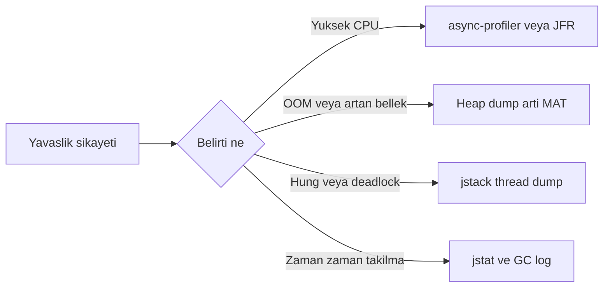
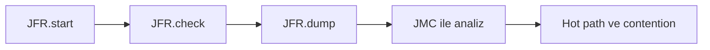
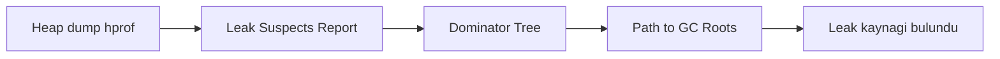

# Topic 3.10 — Performance Tools (JFR, async-profiler, MAT, jstack)

```admonish info title="Bu bölümde"
- Belirti → araç haritası: hangi yavaşlıkta hangi araca uzanacağını 5 dakikada seçmek
- JDK built-in cephanesi: `jps`, `jstack`, `jmap`, `jstat` ve hepsini kapsayan `jcmd`
- JFR (Java Flight Recorder) ile production-safe continuous recording, custom banking event'i, JMC analizi
- MAT ile heap leak avı: Leak Suspects → Dominator Tree → Path to GC Roots akışı
- async-profiler ile flame graph okumak ve banking incident playbook'unu ezberden çıkarmak
```

## Hedef

Production banking servisinde **performans sorunlarını teşhis etme** araçlarını öğrenmek. JFR ile CPU/allocation/lock profiling, MAT ile heap leak hunting, jstack ile deadlock detection. Banking'de "uygulamamız yavaş" şikayeti geldiğinde **5 dakika içinde root cause** bulabilen developer olmak.

## Süre

Okuma: 2 saat • Kendini Sına: 30 dk • Pratik (opsiyonel): 3 saat • Toplam: ~2.5 saat (+ pratik)

## Önbilgi

- Topic 3.9 (JVM Internals) bitti
- Heap dump, thread dump kavramları tanıdık
- Bir process'in `pid`'ini bulmayı biliyorsun (`jps`, `ps`)

---

## Kavramlar

### 1. Performans sorunlarının taksonomisi

Sabah 09:00, Slack'te tek cümle: "Uygulama yavaş." Nereden başlarsın? Önce **ne tür yavaşlık** olduğunu ayırırsın — çünkü her tip farklı bir araca işaret eder.

| Şikayet | İlk şüpheli | İlk araç |
|---|---|---|
| Tüm endpoint yavaş | CPU bottleneck, GC, DB | profiler / jstat |
| Spesifik endpoint yavaş | O endpoint'in kod path'i | profiler |
| Zaman zaman "hıçkırık" | Long GC pause, lock contention | GC log / jstack |
| Yavaşlık zamanla artıyor | Memory leak, connection leak | heap dump + MAT |
| OOM | Memory leak veya yetersiz heap | heap dump + MAT |
| Hiçbir şey ilerlemiyor | Deadlock, thread blocked | jstack |
| Yüksek CPU | Hot method, infinite loop | profiler |

<mark>Her yavaşlık tipinin farklı aracı var; doğru aracı seçmek saatleri dakikaya indirir.</mark> Aşağıdaki karar akışı bu tabloyu bir haritaya çeviriyor:



### 2. JDK built-in araçlar — `jps`, `jstack`, `jmap`, `jstat`, `jcmd`

Hiçbir şey indirmeden, her JDK'de hazır gelen araçlarla başlarsın. İlk soru her zaman: hangi process?

`jps` çalışan Java process'lerini listeler:

```bash
jps -lv

12345 com.mavibank.banking.CoreBankingApplication -Xmx4g -XX:+UseG1GC
67890 com.mavibank.fraud.FraudApplication -Xmx2g
```

**`jstack <pid>`** tek bir snapshot'ta tüm thread'lerin durumunu yazar:

```bash
jstack 12345 > threads.txt
```

En değerli özelliği: **deadlock'u otomatik tespit eder**. Header'da şu bloğu görürsen işin bitmiştir:

```
Found one Java-level deadlock:
=============================
"Thread-1":
  waiting to lock monitor 0x00007f... (object 0x000000076a..., a java.lang.Object),
  which is held by "Thread-2"
"Thread-2":
  waiting to lock monitor 0x00007f... (object 0x000000076a..., a java.lang.Object),
  which is held by "Thread-1"
```

Banking pattern: Concurrent transfer A→B + B→A deadlock'u (Topic 3.3 demosu) tam olarak burada karşına çıkar.

Thread dump'ı okurken asıl bilgi **state dağılımındadır**:

| State | Anlamı |
|---|---|
| RUNNABLE | CPU'da çalışıyor veya hazır |
| BLOCKED | Monitor lock için bekliyor |
| WAITING | `wait()`, `park()` çağrısı bekliyor |
| TIMED_WAITING | `sleep()`, `wait(timeout)` bekliyor |

**Banking yorumu:** Tüm thread'ler BLOCKED → lock contention. Hepsi WAITING → external service yavaş veya idle pool. Çoğu RUNNABLE → CPU bottleneck. Tek tek stack'e bakmadan önce bu dağılıma bak.

**`jmap`** heap dump alır:

```bash
jmap -dump:live,format=b,file=heap.hprof 12345
```

`live` = sadece reachable objeleri dump'la (daha küçük, daha temiz), production'da bunu kullan.

```admonish warning title="jmap production'da Stop-The-World yapar"
`jmap -dump` heap'i tararken uygulamayı duraklatır. Büyük heap'te bu saniyeler sürebilir ve p99 latency'ni bozar. Production'da mümkünse `jcmd <pid> GC.heap_dump` tercih et — daha az invasive'dir.
```

**`jstat`** GC istatistiğini canlı akıtır:

```bash
jstat -gc 12345 1000
```

Her saniye bir satır:

```
 S0C    S1C    S0U    S1U    EC       EU       OC      OU    MC     MU
1024.0 1024.0  0.0   512.0  8192.0   3120.0  16384.0 12340.0  ...
```

`S0C/S1C` survivor capacity, `EC/EU` eden capacity/used, `OC/OU` old capacity/used. Old'un sürekli dolup boşalması ve sık major GC → memory baskısı. Production'da bunu Prometheus + Micrometer ile sürekli izlersin (Phase 9).

**`jcmd`** ise İsviçre çakısı — yukarıdaki araçların çoğunu tek komutta toplar:

```bash
jcmd <pid> help                       # mevcut komutları listele
jcmd <pid> GC.heap_dump heap.hprof    # heap dump (jmap'ten güvenli)
jcmd <pid> GC.run                     # full GC tetikle
jcmd <pid> Thread.print               # jstack equivalent
jcmd <pid> VM.flags                   # JVM flag'leri
jcmd <pid> VM.native_memory           # NMT
jcmd <pid> JFR.start                  # JFR başlat
jcmd <pid> JFR.dump filename=app.jfr
```

<mark>jstack ve jmap yerine jcmd öğren; tek araç thread dump, heap dump, JFR ve GC'yi kapsar.</mark> Pratik bir triaj sırasında ayrı ayrı komut ezberlemek yerine `jcmd`'in alt komutlarını bilmek yeter.

### 3. Java Flight Recorder (JFR)

Profiler denince akla "yavaşlatır, production'da açamam" gelir — JFR bu korkuyu kırar. JVM'in **dahili** profiling sistemidir ve **production-safe**'tir.

<mark>JFR production'da sürekli açık bırakılabilir çünkü overhead'i yaklaşık %1-2'dir.</mark> JVM zaten kendi iç event'lerini üretiyor; JFR bunları düşük maliyetle diske akıtır. Bu yüzden "incident olduğunda profiler açayım" değil, "kayıt zaten dönüyordu, dosyayı alıp bakayım" moduna geçersin.

Continuous recording'i uygulama başlarken açarsın:

```bash
java -XX:StartFlightRecording=settings=profile,duration=2h,filename=banking.jfr \
     -jar app.jar
```

`settings=profile` detaylı örnekleme, `settings=default` neredeyse sıfır overhead'li minimum. Zaten çalışan bir process'e sonradan da takabilirsin:

```bash
jcmd 12345 JFR.start name=banking duration=60s   # başlat
jcmd 12345 JFR.check                             # status
jcmd 12345 JFR.dump name=banking filename=banking.jfr   # dosyaya yaz
```

Bu üç adım JFR'ın yaşam döngüsüdür; dump aldıktan sonra analiz JMC'ye geçer:



JFR neredeyse her şeyi kaydeder: **CPU** method sampling, **memory** TLAB allocation, **GC** pause times, **lock** monitor contention, **thread** sleep/park, **IO** socket/file, **JIT** compilation. Dosyayı **JMC** (JDK Mission Control) ile açarsın — heap allocations hot path'i, latency events yavaş operasyonları, lock contention çekişen monitor'u gösterir.

En güçlü tarafı: kendi **custom event**'ini fırlatabilirsin ve banking-domain tracing yaparsın. Önce event'i tanımlarsın:

```java
import jdk.jfr.*;

@Name("com.mavibank.TransferExecuted")
@Label("Transfer Executed")
@Category("Banking")
public class TransferExecutedEvent extends Event {

    @Label("Amount")
    public double amount;

    @Label("Currency")
    public String currency;

    @Label("Duration ms")
    public long durationMs;
}
```

Sonra iş kodunda `begin()` / `commit()` ile sararsın:

```java
TransferExecutedEvent event = new TransferExecutedEvent();
event.begin();
try {
    transferService.execute(...);
    event.amount = amount.doubleValue();
    event.currency = currency.getCurrencyCode();
} finally {
    event.commit();
}
```

JMC'de bu event'ler ayrı bir kategori olarak görünür — "hangi para birimi transferleri en uzun sürüyor" gibi domain sorularını doğrudan yanıtlarsın.

**Tuzak:** custom event'i `commit()` etmeyi unutursan hiç kaydedilmez; `begin()`/`commit()`'i `finally`'ye almak süre ölçümü için de şarttır.

### 4. async-profiler — alternatif CPU/allocation profiler

JFR JVM'in içinden bakar; bazen native ve kernel katmanını da görmek istersin. async-profiler (https://github.com/async-profiler/async-profiler) Linux'ta `perf_events` kullanır, çok düşük overhead'le tam stack (Java + native) verir ve doğrudan flame graph üretir.

CPU profiling 60 saniyede bir HTML flame graph çıkarır:

```bash
./profiler.sh -d 60 -f cpu.html 12345
```

Aradığın şeye göre event'i değiştirirsin — allocation, lock veya wall-clock:

```bash
./profiler.sh -e alloc -d 60 -f alloc.html 12345   # allocation hot path
./profiler.sh -e lock  -d 60 -f lock.html  12345   # hangi monitor'da blocked
./profiler.sh -e wall  -d 60 -f wall.html  12345   # CPU + blocked time
```

Wall-clock özellikle değerli: bir thread'in CPU'da mı yandığını yoksa bir yerde mi beklediğini ayırır. "Endpoint yavaş ama CPU düşük" durumunda cevap genelde `-e wall`'dadır.

**async-profiler vs JFR:** JFR built-in, production continuous, cross-platform; async-profiler daha derin native/kernel görünürlüğü ve daha zengin flame graph verir ama çoğunlukla Linux'a bağlıdır. İkisi birbirinin rakibi değil, tamamlayıcısı.

### 5. Flame graph okuma

Flame graph korkutucu görünür ama tek bir kuralı vardır: **genişlik = harcanan zaman**. Y-ekseni call stack (yukarı = daha derin çağrı), x-ekseni alfabetik sıralı zaman değil, sadece toplam süredeki payı gösterir.

```
   ┌────────────────────────────────────────┐
   │       Account.deposit (5%)              │
   ├──────────────────────┬─────────────────┤
   │  Money.add (3%)      │ JpaRepo.save (40%)│
   ├──────────────────────┴───────┬─────────┤
   │  Hibernate flush (30%)        │ ...    │
   ├───────────────────────────────┤        │
   │  PreparedStatement.execute    │        │
   │  (28%)                        │        │
   └───────────────────────────────┴────────┘
```

Bu grafikte `JpaRepo.save` toplam zamanın %40'ını alıyor; içinde `Hibernate flush` %30, onun da içinde `PreparedStatement.execute` %28. Yani darboğaz DB tarafında. Renk kodu da ipucu verir: yeşil Java, sarı JVM, kırmızı native/kernel.

<mark>Flame graph'ta en geniş blok darboğazın kendisidir; analize oradan başla.</mark> Slow endpoint'i profile et, en geniş plateau'yu bul, adını oku — optimizasyon hedefin odur.

### 6. MAT (Eclipse Memory Analyzer Tool)

Heap sürekli büyüyor, restart sonrası bir saatte OOM geliyor. Bu bir **memory leak** ve onu bulmanın altın standardı MAT'tır. Akış her zaman aynı: dump al, aç, üç view'da daralt.



Heap dump'ı (`jcmd <pid> GC.heap_dump`) MAT'a yüklediğinde **Leak Suspects Report** otomatik çalışır. Basit bir heuristic "şu nesne abartılı yer kaplıyor, leak şüphesi" der:

```
Problem Suspect 1
The class "java.util.concurrent.ConcurrentHashMap$Node[]"
occupies 850,431,232 (85%) bytes.
The memory is accumulated in one instance of
"java.util.concurrent.ConcurrentHashMap$Node[]"
loaded by "<system class loader>".

Keywords:
java.util.concurrent.ConcurrentHashMap
```

Bir `ConcurrentHashMap` heap'in %85'ini tutuyor — ilk soru: bu cache **bounded mı?**

**Dominator Tree** ise "kim ne kadar bellek retain ediyor" sorusunu yanıtlar. Retained = o nesne GC olursa serbest kalacak toplam bellek:

```
Dominator Tree
├── com.mavibank.AccountCache (700MB retained)
│   └── ConcurrentHashMap (700MB)
│       └── 5,000,000 Node entries
├── HikariCP DataSource (50MB)
└── ...
```

`AccountCache` tek başına 700MB retain ediyor → ana suspect belli. Şimdi son soru: bu nesne neden hâlâ hayatta? **Path to GC Roots** cevabı verir:

```
Path to GC Roots:
java.lang.Thread (main)
  → AccountCache.instance (static field)
    → ConcurrentHashMap
      → Node[5000000]
```

`AccountCache.instance` static bir field → JVM yaşadığı sürece GC edilemez, cache sınırsız büyür. Leak kaynağı bulundu: unbounded static cache. Klasik banking suspect'leri static collection, `ThreadLocal` temizlenmemesi ve eviction'sız cache'tir.

MAT'ın **OQL**'i (Object Query Language) ile heap'te SQL benzeri sorgu da atarsın:

```sql
SELECT * FROM com.mavibank.Account WHERE balance > 1000000
```

"Heap'te kaç hesap var, kaçı 1M+ bakiyeli" gibi soruları doğrudan yanıtlar.

### 7. FastThread.io — thread dump analizi

Bir thread dump okumak yorucu; yüzlerce thread arasında pattern görmek daha da zor. FastThread.io thread dump'ı yükleyip otomatik analiz eder: state dağılımı (kaç RUNNABLE/BLOCKED), hot thread'ler, lock contention, deadlock ve thread pool saturation.

Banking pratiği: "uygulama yanıt vermiyor" şikayetinde 5 dakika arayla 3-4 thread dump al, hepsini yükle, aynı thread'in aynı lock'ta takılı kalması gibi pattern'leri gör. Tek snapshot yanıltır; seri snapshot gerçeği söyler.

### 8. Heap dump alma — production-safe yollar

Aynı dump'ı almanın birkaç yolu var; hangisini seçtiğin production'da fark eder.

En önerileni `jcmd` — az invasive:

```bash
jcmd <pid> GC.heap_dump /tmp/heap.hprof
```

`jmap` de çalışır ama `live` flag'i STW yapar (daha küçük dump karşılığında duraklama):

```bash
jmap -dump:live,format=b,file=/tmp/heap.hprof <pid>
```

OOM anını yakalamak istiyorsan JVM'e "patlarken dump al" dedirtirsin:

```bash
-XX:+HeapDumpOnOutOfMemoryError
-XX:HeapDumpPath=/var/log/heap.hprof
```

Spring Boot Actuator ile HTTP üzerinden de alınabilir:

```yaml
management:
  endpoints:
    web:
      exposure:
        include: heapdump
```

```bash
curl http://localhost:8080/actuator/heapdump > heap.hprof
```

```admonish warning title="Heap dump müşteri verisi taşır"
Heap dump içinde o an bellekteki her şey vardır: hesap numaraları, bakiyeler, TCKN, token'lar. `/actuator/heapdump` endpoint'ini prod'da yalnız internal/admin ağına, auth arkasına aç. Dump dosyalarını da güvenli, erişimi kısıtlı bir dizinde tut ve iş bitince sil.
```

### 9. Banking incident playbook

Teori güzel ama incident anında düşünmek için vaktin yok — sıra ezbere olmalı. Üç klasik senaryo:

**"API yavaş, p99 normalde 100ms şimdi 2s" — 5 dakikalık triaj:**

1. `jcmd <pid> Thread.print` — thread dump al. Çoğu BLOCKED → lock contention. Çoğu WAITING → external service yavaş / pool exhausted. Çoğu RUNNABLE → CPU bottleneck.
2. `jstat -gc <pid> 1000` — sık major GC → memory baskısı.
3. GC log son 5 dakika — pause history.
4. JFR son 60 sn dump — hot method'lar.

**"Memory sürekli büyüyor, 1 saatte OOM":**

1. `jmap -histo <pid>` — class instance sayıları, beklenmeyen büyük collection?
2. `jcmd <pid> GC.heap_dump` — dump al.
3. MAT → Dominator Tree → retained heap.
4. Leak suspect: static collection, ThreadLocal, unbounded cache.

**"Uygulama yanıt vermiyor, hung":**

1. `jcmd <pid> Thread.print` — 30 sn arayla birden fazla.
2. Deadlock header'ı ("Found one Java-level deadlock") ara.
3. Tüm thread WAITING/BLOCKED → external dependency yanıt vermiyor.
4. Tek bir lock'ta yığılma → contention veya zombi lock holder.

### 10. Production'da continuous monitoring (önbakış)

Reaktif teşhis (incident olunca dump alma) tek başına yetmez; olgun bir banking platformu sürekli izler. Phase 9'da detaylandıracağız: Prometheus + Grafana metrik, distributed tracing (Jaeger/Tempo) request flow, continuous JFR sürekli kayıt, APM (Elastic/Datadog) paid alternatif.

Ama bunların hepsi bu bölümdeki temeli varsayar. `jstack`, `jmap`, JFR ve MAT'ı elinle kullanmadan dashboard'lardaki grafikler boş laf kalır — önce aracı tanı, sonra otomatize et.

---

## Önemli olabilecek araştırma kaynakları

- "Java Performance: The Definitive Guide" (Scott Oaks)
- JDK Mission Control documentation
- async-profiler GitHub README
- Eclipse Memory Analyzer Tool documentation
- FastThread.io blog (thread dump örnekleri)
- Brendan Gregg's website (flame graph mucidi)
- Andrei Pangin (async-profiler yazarı) tech talks
- "JVM Anatomy" by Aleksey Shipilev — performance series

---

## Kendini Sına

Aşağıdaki soruları önce **cevaba bakmadan** kendi cümlelerinle yanıtla — hepsi TR bank mülakatlarında ve gerçek incident'lerde karşına çıkacak tarzda. Takılırsan ilgili Kavramlar başlığına dön, sonra tekrar dene.

**S1. Slack'e "uygulama yavaş" düştü, elinde sadece pid var. İlk 5 dakikada hangi araçları hangi sırayla kullanırsın?**

<details>
<summary>Cevabı göster</summary>

Önce belirti tipini ayırırım. `jcmd <pid> Thread.print` ile thread dump alırım: çoğu thread BLOCKED ise lock contention, çoğu WAITING ise external service yavaş veya connection pool tükenmiş, çoğu RUNNABLE ise CPU bottleneck. Ardından `jstat -gc <pid> 1000` ile GC frekansına bakarım — sık major GC memory baskısını gösterir.

Sonra elimdeki JFR dump'ından (veya `jcmd JFR.start` ile 60 sn kayıttan) hot method'ları çıkarırım. Bu üç adım (thread state dağılımı → GC → hot path) hemen hemen her yavaşlık tipini bir aile içine sokar; oradan profiler veya heap dump'a inerim.

</details>

**S2. JFR'ı production'da sürekli açık bırakmak neden güvenli? Overhead neden bu kadar düşük?**

<details>
<summary>Cevabı göster</summary>

Çünkü JFR harici bir profiler değil, JVM'in dahili event mekanizmasıdır. JVM zaten JIT compilation, GC, allocation gibi olayları içeride üretiyor; JFR bunları sampling'le ve buffer üzerinden düşük maliyetle diske akıtır — instrumentation ile her method'a kod enjekte etmez. `settings=profile` ile bile overhead genelde %1-2 seviyesindedir.

Pratik sonucu şudur: incident olduğunda "şimdi profiler açayım" demezsin, kayıt zaten dönüyordur; sadece son N dakikayı `JFR.dump` ile dosyaya alıp JMC'de açarsın. Daha hafif iz için `settings=default` kullanırsın.

</details>

**S3. Heap sürekli büyüyor, bir saatte OOM geliyor. Heap dump aldın; MAT ile leak source'u nasıl bulursun?**

<details>
<summary>Cevabı göster</summary>

Dump'ı MAT'ta açarım, önce otomatik çalışan **Leak Suspects Report**'a bakarım — heuristic "şu class heap'in %85'ini tutuyor" diyerek beni doğru mahalleye götürür. Sonra **Dominator Tree**'ye geçerim: kim ne kadar *retained* bellek tutuyor görürüm, örneğin `AccountCache` tek başına 700MB.

Son adım **Path to GC Roots**: o nesnenin neden GC edilemediğini gösterir — tipik olarak bir static field zinciri (`AccountCache.instance` static → ConcurrentHashMap → milyonlarca entry). Buradan leak kaynağı belli olur: eviction'sız static/unbounded cache, temizlenmeyen ThreadLocal veya biriken collection.

</details>

**S4. Flame graph okumayı 30 saniyede özetle. Genişlik, y-ekseni ve renkler ne anlatır?**

<details>
<summary>Cevabı göster</summary>

Genişlik zaman payıdır: bir blok ne kadar geniş, o kod path'inde o kadar çok süre geçmiş demektir. Y-ekseni call stack derinliğidir — yukarı çıktıkça daha iç çağrıya inersin; bir bloğun üstündekiler onun çağırdıklarıdır. X-ekseni kronolojik değildir, sadece toplama göre gruplanmış süredir.

Okuma stratejisi: en geniş plateau'yu bul, adını oku, darboğaz odur. Renk kabaca katmanı söyler — yeşil Java, sarı JVM, kırmızı native/kernel. `JpaRepo.save` en geniş blok ise ve içi Hibernate flush → PreparedStatement.execute ile doluysa, sorun DB katmanındadır.

</details>

**S5. `jmap` ile `jcmd` arasındaki fark nedir? Production'da heap dump için neden `jcmd GC.heap_dump` tercih edilir?**

<details>
<summary>Cevabı göster</summary>

İkisi de heap dump alır ama `jmap -dump` (özellikle `live` flag'iyle) belirgin bir Stop-The-World duraklaması yapar; büyük heap'te bu saniyeler sürer ve p99 latency'yi bozar. `jcmd <pid> GC.heap_dump` aynı işi daha az invasive şekilde yapar.

Ayrıca `jcmd` kapsayıcıdır: `jstack` (Thread.print), `jmap` (GC.heap_dump), JFR (JFR.start/dump), GC ve VM flag'leri hepsi tek araçta. Pratikte ayrı araçları ezberlemek yerine `jcmd` alt komutlarını öğrenmek daha verimli. Yine de STW toleransın yoksa alternatif olarak `-XX:+HeapDumpOnOutOfMemoryError` ile OOM anını yakalarsın.

</details>

**S6. Bir thread dump'ta tüm thread'ler BLOCKED çıktı; başka bir dump'ta hepsi WAITING. Her biri neyi işaret eder?**

<details>
<summary>Cevabı göster</summary>

Çoğu thread BLOCKED ise thread'ler bir monitor lock için bekliyordur — klasik **lock contention**. Genelde tek bir "hot" lock veya bir zombi lock holder vardır; stack'lere bakıp hangi monitor'da yığıldıklarını bulursun.

Çoğu thread WAITING/TIMED_WAITING ise thread'ler bir şeyin dönmesini bekliyordur — çoğunlukla external service yavaş yanıt veriyor veya connection pool tükenmiş, thread'ler pool'dan connection bekliyor. RUNNABLE yoğunluğu ise CPU bottleneck'e işarettir. Tek snapshot yanıltabileceği için 30 sn arayla birkaç dump alıp aynı pattern'in sürüp sürmediğine bakılır.

</details>

**S7. async-profiler ile JFR arasındaki fark nedir? Hangi durumda hangisini seçersin?**

<details>
<summary>Cevabı göster</summary>

JFR JVM'in içindedir: built-in, cross-platform, production'da sürekli açık kalabilir ve custom event'lerle domain instrumentation yapabilirsin. async-profiler ise `perf_events` gibi OS mekanizmalarını kullanır — Java + native + kernel stack'i birlikte görür, doğrudan zengin flame graph üretir ama çoğunlukla Linux'a bağlıdır.

Seçim: sürekli, düşük overhead'li, taşınabilir kayıt ve banking-domain event'i istiyorsan JFR. Native/kernel katmanını görmek, "CPU düşük ama yavaş" durumunda `-e wall` ile beklemeyi ayırmak veya ayrıntılı flame graph istiyorsan async-profiler. İkisi tamamlayıcıdır; ciddi bir incident'te genelde ikisini de kullanırsın.

</details>

**S8. Custom JFR event ne işe yarar? Banking'de neden değerlidir, hangi tuzağı vardır?**

<details>
<summary>Cevabı göster</summary>

`jdk.jfr.Event`'ten türeyen bir class tanımlayıp `begin()`/`commit()` ile sararak kendi domain olaylarını JFR akışına katarsın. Böylece JMC'de generic JVM event'lerinin yanında "TransferExecuted" gibi banking-specific event'leri görürsün: hangi para birimi, hangi tutar aralığı, ne kadar sürdü. Genel bir CPU profilinin göstermediği iş anlamını verir.

Değeri, teknik metriği domain'e bağlamasıdır — "save() yavaş" yerine "USD transferleri p99'da yavaş" diyebilirsin. Tuzağı: `commit()` çağrılmazsa event hiç kaydedilmez ve süre alanları yanlış olur; bu yüzden `begin()`/`commit()` mutlaka `try/finally` içine konur.

</details>

---

## Tamamlama kriterleri

- [ ] "Kendini Sına" bölümündeki tüm soruları cevaba bakmadan açıklayabiliyorum
- [ ] Belirti → araç eşleşmesini (CPU → profiler, OOM → heap dump + MAT, hung → jstack) ezbere söyleyebiliyorum
- [ ] `jcmd`'in `jstack`/`jmap`'e göre neden tercih edildiğini ve STW farkını anlatabiliyorum
- [ ] `jstack` thread state'lerinin (RUNNABLE/BLOCKED/WAITING) banking yorumunu biliyorum
- [ ] JFR'ın production-safe olma sebebini ve continuous recording konfigürasyonunu açıklayabiliyorum
- [ ] Custom JFR event'in ne işe yaradığını ve `begin()`/`commit()` tuzağını biliyorum
- [ ] MAT akışını (Leak Suspects → Dominator Tree → Path to GC Roots) uçtan uca anlatabiliyorum
- [ ] Flame graph okumayı (genişlik = zaman, en geniş blok = darboğaz) 30 saniyede özetleyebiliyorum
- [ ] async-profiler ile JFR farkını ve hangisini ne zaman seçeceğimi biliyorum
- [ ] Üç incident playbook'unu (slow endpoint, memory leak, hung) sırasıyla uygulayabiliyorum
- [ ] (Opsiyonel) "Pratik yapmak istersen" bölümündeki adımları denedim ve Claude-verify prompt'uyla doğrulattım

---

## Defter notları

1. "Performans sorunu için araç seçim matrisi (memory leak / slow endpoint / deadlock): ____."
2. "`jstack` thread state'leri (RUNNABLE/BLOCKED/WAITING/TIMED_WAITING) banking interpretation: ____."
3. "`jcmd` ile `jmap`/`jstack` farkı (neden jcmd tercih): ____."
4. "JFR'ın production-safe olmasının sebebi (overhead): ____."
5. "MAT Leak Suspects Report'un altında yatan heuristic: ____."
6. "Dominator Tree ile shallow heap vs retained heap farkı: ____."
7. "async-profiler vs JFR farkı, hangisi ne zaman: ____."
8. "Flame graph okumayı 30 saniyede özetle: ____."
9. "Custom JFR event ile banking-specific tracing neden değerli: ____."
10. "Production heap dump için /actuator/heapdump endpoint güvenliği (PII): ____."

```admonish success title="Bölüm Özeti"
- "Uygulama yavaş" şikayeti geldiğinde önce belirti tipini ayır: her yavaşlık tipinin farklı aracı var — yanlış araç saat, doğru araç dakika demek
- JDK built-in cephanesi `jps`/`jstack`/`jmap`/`jstat`'tir ama hepsini `jcmd` kapsar; production heap dump için `jcmd GC.heap_dump` STW yapan `jmap`'ten daha güvenlidir
- JFR JVM'in dahili, ~%1 overhead'li profiler'ıdır — production'da sürekli açık kalır, custom event'le banking-domain tracing yaparsın, JMC ile analiz edersin
- Memory leak avı MAT'ta üç adımdır: Leak Suspects (nerede) → Dominator Tree (kim retain ediyor) → Path to GC Roots (neden ölmüyor); tipik suspect unbounded static cache
- Flame graph'ta genişlik = zaman, en geniş blok darboğazdır; async-profiler native/kernel'i de gösterir, JFR ise built-in ve taşınabilirdir
- Üç incident playbook'unu ezberle: slow endpoint → thread dump + jstat + JFR, memory leak → heap dump + MAT, hung → seri thread dump + deadlock header
```

---

## Pratik yapmak istersen

Araçları elinle çalıştırmak istersen aşağıdaki iki ek hazır: test yazma rehberi programmatic heap dump ve JFR event capture için örnek testler içerir; Claude-verify prompt'u ile performance tooling çalışmanı banking-grade perspektiften denetletebilirsin. Ayrıca tavsiye: `core-banking` çalışırken bir deadlock üretip `jstack` ile yakala, leaky bir cache ile OOM tetikleyip MAT'ta analiz et ve JFR continuous recording alıp JMC'de en hot 3 method'u çıkar.

<details>
<summary>Test yazma rehberi</summary>

Bu topic çoğunlukla manuel diagnostic tool kullanımıdır; test yazımı diğer topic'lerden farklıdır. Yine de bazı davranışları programmatic olarak doğrulayabilirsin.

### Test 3.10.1 — Manual heap dump capture

`HotSpotDiagnosticMXBean` ile kod içinden heap dump alıp sonra MAT'ta incelemek için:

```java
@Test
@Disabled("Manuel — heap dump alıp MAT'la incelemek için")
void manualHeapDumpCapture() throws IOException {
    String pid = ManagementFactory.getRuntimeMXBean().getName().split("@")[0];

    HotSpotDiagnosticMXBean bean = ManagementFactory.newPlatformMXBeanProxy(
        ManagementFactory.getPlatformMBeanServer(),
        "com.sun.management:type=HotSpotDiagnostic",
        HotSpotDiagnosticMXBean.class
    );

    bean.dumpHeap("./manual-heap.hprof", true);
    System.out.println("Heap dump: ./manual-heap.hprof");
}
```

### Test 3.10.2 — Programmatic JFR event capture

Custom JFR event'in gerçekten kaydedildiğini `Recording` API'siyle doğrularsın:

```java
@Test
void jfrCustomEventShouldBeCaptured() throws Exception {
    try (Recording recording = new Recording()) {
        recording.enable("com.mavibank.TransferExecuted");
        recording.start();

        TransferExecutedEvent ev = new TransferExecutedEvent();
        ev.begin();
        ev.amount = 100.0;
        ev.currency = "TRY";
        ev.commit();

        recording.stop();
        recording.dump(Path.of("test.jfr"));

        List<RecordedEvent> events = new ArrayList<>();
        try (RecordingFile file = new RecordingFile(Path.of("test.jfr"))) {
            while (file.hasMoreEvents()) {
                events.add(file.readEvent());
            }
        }

        assertThat(events).hasSize(1);
        assertThat(events.get(0).getDouble("amount")).isEqualTo(100.0);
    }
}
```

### Bonus — Deadlock reprodüksiyon ve jstack

Topic 3.3'teki lock-ordering deadlock'unu çalıştır, `jstack <pid>` ile yakala, header'da "Found one Java-level deadlock" satırını gör. Sonra lock ordering uygula, yeniden çalıştır ve deadlock'un kaybolduğunu doğrula.

### Bonus — Leaky cache ile MAT analizi

Eviction'sız bir cache ekle (`Map<UUID, byte[]>`), her çağrıda 1MB veri koyan bir endpoint yaz, `-Xmx256m -XX:+HeapDumpOnOutOfMemoryError -XX:HeapDumpPath=./oom.hprof` ile başlat, ~300 request gönder → OOM → `oom.hprof`. MAT'ta Leak Suspects → Dominator Tree → Path to GC Roots akışını uygula ve leaky class'ı bul.

</details>

<details>
<summary>Claude-verify prompt</summary>

```
Aşağıdaki performance tooling çalışmamı banking-grade kriterlere göre değerlendir.
Sadece eksikleri ve yanlışları işaretle, kod yazma:

1. JDK built-in tools:
   - jcmd, jstack, jmap, jstat ile pratik deneyim var mı?
   - jcmd Thread.print çıktısını okuyabiliyor musun (state dağılımı)?
   - Heap dump için jcmd GC.heap_dump mu kullandın (jmap STW yerine)?

2. JFR:
   - Production-safe continuous recording konfigürasyonu var mı?
   - settings=profile (detaylı) veya settings=default (minimum) seçimi bilinçli mi?
   - JMC ile analiz akışı denenmiş mi?
   - Custom JFR event ile banking-domain instrumentation var mı, begin/commit finally'de mi?

3. MAT (Memory Analyzer):
   - Bir heap dump'ı MAT ile analiz etmiş misin?
   - Leak Suspects Report yorumlanmış mı?
   - Dominator Tree ile retained heap görülmüş mü?
   - Path to GC Roots ile leak source (static/ThreadLocal/unbounded cache) bulunmuş mu?

4. async-profiler:
   - CPU flame graph oluşturulmuş mu, en geniş blok yorumlanmış mı?
   - Allocation (-e alloc) ve lock (-e lock) profiling yapılmış mı?
   - Wall-clock (-e wall) ile CPU vs blocked ayrımı yapılmış mı?

5. Production safety:
   - jmap STW etkisi bilinçli mi?
   - Heap dump dosyaları PII içerdiği için güvenli yerde mi tutuluyor?
   - Spring Boot Actuator /heapdump endpoint'i auth korumalı mı?

6. Banking incident playbook:
   - Slow endpoint için triaj sırası net mi (thread dump → jstat → JFR)?
   - Memory leak için heap dump → MAT akışı denenmiş mi?
   - Deadlock için jstack analiz akışı uygulanmış mı?

7. Continuous monitoring (Phase 9 önbakış):
   - Production'da JFR sürekli açık mı?
   - GC log rotation yapılandırılmış mı?
   - Heap dump dizini disk space alarmı ile izleniyor mu?

Her madde için PASS / FAIL / EKSIK işaretle, kanıt göster, kod yazma.
```

</details>
