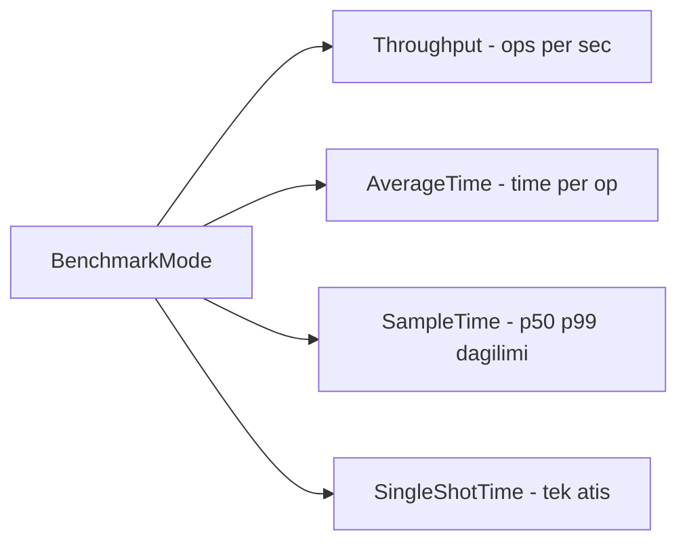
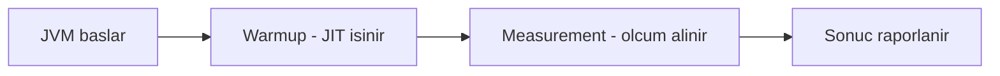
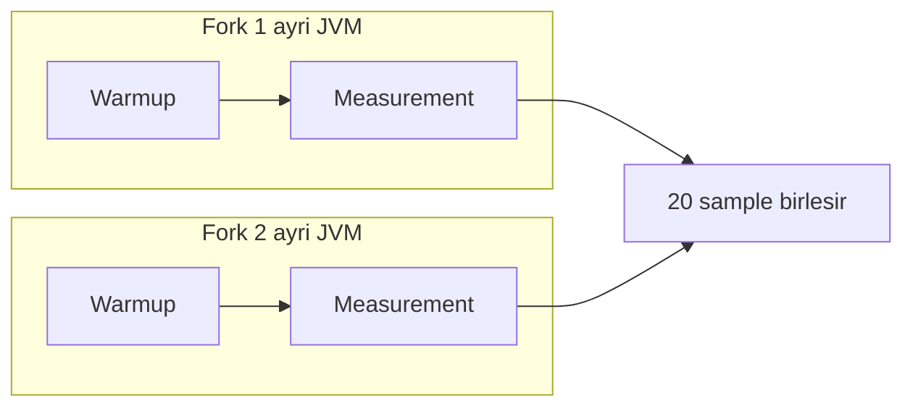
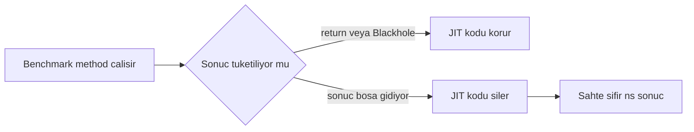

# Topic 3.11 — JMH (Java Microbenchmark Harness)

```admonish info title="Bu bölümde"
- Naive `System.nanoTime()` benchmark'ının neden yalan söylediği: JIT warmup, dead code elimination, constant folding, loop unrolling
- JMH benchmark yaşam döngüsü: fork → warmup → measurement, ve bunun ayrı JVM'lerde neden tekrarlandığı
- DCE'den kaçınmanın iki yolu (return / `Blackhole.consume`) ve constant folding tuzağını `@State` ile kapatmak
- Banking karar destekleyici benchmark'lar: BigDecimal vs long money, virtual vs platform thread, ConcurrentHashMap vs synchronized
- JMH çıktısını okumak: `Score ± Error` confidence interval ile "gerçek fark" mı "noise" mu ayırmak
```

## Hedef

JMH ile **doğru** Java microbenchmark yazmak. Constant folding, dead code elimination, JIT warmup gibi tuzaklara düşmeden; banking domain'inde gerçek karar destekleyici benchmark'lar üretmek (BigDecimal vs long-based money, virtual vs platform thread, ConcurrentHashMap vs synchronized HashMap). Sonucu "hızlı/yavaş" değil "X ns/op ± error" diliyle konuşup, iki ölçümün istatistiksel olarak farklı olup olmadığını söyleyebilmek.

## Süre

Okuma: 1.5 saat • Kendini Sına: 30 dk • Pratik (opsiyonel): 2-3 saat • Toplam: ~2 saat (+ pratik)

## Önbilgi

- Topic 3.1-3.10 bitti — thread, executor, virtual thread, concurrent collection'ları biliyorsun
- Performans hakkında konuşmaya alışkınsın
- "Hızlı / yavaş" demek yerine "X mikrosaniye/op" demek senin için makul

---

## Kavramlar

### 1. Neden JMH — naive benchmark'lar yalan söyler

Bir sayı ölçmek kolay görünür ama JVM'de "elle ölçüm" neredeyse her zaman yanıltır; önce yalanı görelim. Junior'ın klasik benchmark'ı şudur:

```java
long start = System.nanoTime();
for (int i = 0; i < 1_000_000; i++) {
    money.add(other);
}
long elapsed = System.nanoTime() - start;
System.out.println(elapsed + " ns total");
```

**Bu kod yalan söyler.** Çünkü JVM ölçtüğünü sandığın şeyi ölçmene izin vermez:

1. **JIT warmup yok:** İlk ~10000 invocation interpreter'de yavaş çalışır, sonra C2 compile eder — ortalaman bu iki rejimin karışımı olur.
2. **Dead code elimination (DCE):** `add`'in sonucu kullanılmıyor; JIT loop'u tamamen silebilir.
3. **Constant folding:** Argümanlar sabitse JIT sonucu compile time'da hesaplar, runtime'da hiçbir şey yapmaz.
4. **Loop unrolling:** JIT döngüyü yeniden şekillendirir, ölçtüğün senaryodan sapar.
5. **GC / cache / OS noise:** Test ortasında GC, ilk iterasyonda cache miss, OS scheduling — hepsi outlier üretir.

**JMH** bu tuzakların hepsine karşı yapısal önlem alan resmi microbenchmark harness'ıdır; sen benchmark'ın mantığını yazarsın, ölçüm hijyenini o halleder.

```admonish warning title="Elle benchmark = ölçemediğin bir sayı"
Naive `System.nanoTime()` döngüsünün verdiği rakam ölçüm değil, JIT'in o çalıştırmadaki kaprisidir. Aynı kodu iki kez çalıştırınca 10x fark görebilirsin. Bir sayı üretmesi onu "ölçüm" yapmaz — JMH'siz microbenchmark sonucunu asla karara dayanak yapma.
```

### 2. JMH setup — ayrı bir Maven module

JMH'i doğru kurmanın ilk kuralı onu production kodundan uzak tutmaktır. İki dependency yeterli:

```xml
<dependencies>
    <dependency>
        <groupId>org.openjdk.jmh</groupId>
        <artifactId>jmh-core</artifactId>
        <version>1.37</version>
    </dependency>
    <dependency>
        <groupId>org.openjdk.jmh</groupId>
        <artifactId>jmh-generator-annprocess</artifactId>
        <version>1.37</version>
        <scope>provided</scope>
    </dependency>
</dependencies>
```

JMH'in idiomatic yolu benchmark'ları **ayrı bir Maven module**'de (`banking-benchmarks`) tutmaktır. Böylece production JAR'ına JMH sızmaz, benchmark bağımlılıkları prod classpath'ini kirletmez. `jmh-generator-annprocess`'in `provided` scope olması da bu yüzden önemli: annotation processor sadece build sırasında lazım.

### 3. Temel JMH benchmark — anatomisi

Bir JMH benchmark aslında annotation'larla süslenmiş sıradan bir class'tır; önce ölçüm politikasını annotation'larla tanımlarsın. Bu blok "nasıl ölçülecek" sorusunun cevabıdır:

```java
@BenchmarkMode(Mode.AverageTime)
@OutputTimeUnit(TimeUnit.NANOSECONDS)
@Warmup(iterations = 5, time = 1)
@Measurement(iterations = 10, time = 1)
@Fork(2)
@State(Scope.Benchmark)
public class MoneyAddBenchmark {
```

Sonra "ne ölçülecek" kısmı gelir: test verisini `@State` field'larında tutar, `@Setup`'ta hazırlar, `@Benchmark` method'unda tek bir operasyonu çalıştırırsın.

```java
    Money tl100;
    Money tl50;

    @Setup
    public void setup() {
        tl100 = Money.of("100.00", "TRY");
        tl50 = Money.of("50.00", "TRY");
    }

    @Benchmark
    public Money baselineAdd() {
        return tl100.add(tl50);
    }
}
```

Kritik detay: `@Benchmark` method'unun **dönen değeri** JMH tarafından tüketilir — DCE'den kaçınmanın en okunaklı yoludur (return ile).

<details>
<summary>Tam kod: MoneyAddBenchmark (~30 satır)</summary>

```java
import org.openjdk.jmh.annotations.*;
import org.openjdk.jmh.infra.Blackhole;
import java.util.concurrent.TimeUnit;

@BenchmarkMode(Mode.AverageTime)
@OutputTimeUnit(TimeUnit.NANOSECONDS)
@Warmup(iterations = 5, time = 1)
@Measurement(iterations = 10, time = 1)
@Fork(2)
@State(Scope.Benchmark)
public class MoneyAddBenchmark {

    Money tl100;
    Money tl50;

    @Setup
    public void setup() {
        tl100 = Money.of("100.00", "TRY");
        tl50 = Money.of("50.00", "TRY");
    }

    @Benchmark
    public Money baselineAdd() {
        return tl100.add(tl50);
    }
}
```

</details>

### 4. JMH annotation'ları

Benchmark davranışını bu annotation'lar belirler; her birini "hangi soruyu cevaplıyor" diye öğren.

#### `@BenchmarkMode` — neyi ölçüyorsun

- `Mode.Throughput`: ops/saniye
- `Mode.AverageTime`: zaman/op
- `Mode.SampleTime`: zaman distribution (p50, p99)
- `Mode.SingleShotTime`: bir kez ölç (warmup'sız senaryolar)
- `Mode.All`: hepsi

Banking için **AverageTime** (tek operasyon latency'si) ve **Throughput** (yük altında kapasite) en kullanışlı ikilidir.

Benchmark mode seçimi ölçtüğün sorunun şeklini belirler:



#### `@OutputTimeUnit` — hangi birimde raporla

Sonuçlar hangi unit'te raporlansın: `NANOSECONDS`, `MICROSECONDS`, `MILLISECONDS`. Money operasyonu için NANOSECONDS, network çağrısı için MILLISECONDS mantıklıdır.

#### `@Warmup` ve `@Measurement` — JIT'i ısıt, sonra ölç

```java
@Warmup(iterations = 5, time = 1, timeUnit = TimeUnit.SECONDS)
@Measurement(iterations = 10, time = 1, timeUnit = TimeUnit.SECONDS)
```

5 warmup iteration (her biri 1 sn) JIT'in kodu C2 ile compile etmesine zaman tanır; ardından 10 measurement iteration (her biri 1 sn) ısınmış kodun gerçek performansının ortalamasını alır. Warmup'ın rolü kritik: onsuz interpreter yavaşlığını ölçüme karıştırırsın.

#### `@Fork` — ayrı JVM'de tekrarla

```java
@Fork(2)
```

Benchmark'ı 2 ayrı JVM instance'ında çalıştırır, her birinde 10 iteration → toplam 20 sample. Bu neden önemli: tek bir JVM'in JIT compile kararları deterministik değildir (profiling geçmişi, sınıf yükleme sırası çalıştırmadan çalıştırmaya değişir). Ayrı fork'lar bu JVM-özel varyansı yakalar. JVM flag'leri de burada verilir: `@Fork(value = 2, jvmArgs = {"-Xms2g", "-Xmx2g"})`.

Her fork tek başına şu yaşam döngüsünü yaşar — önce JVM ısınır, sonra ölçüm alınır:



`@Fork(2)` ile bu döngü iki bağımsız JVM'de tekrarlanıp sample'lar birleştirilir:



#### `@State(Scope)` — test verisini kim paylaşıyor

- `Scope.Benchmark`: tüm benchmark thread'leri aynı state
- `Scope.Thread`: her thread'in kendi state'i
- `Scope.Group`: thread group bazlı

Banking concurrent benchmark'larında `Scope.Thread` sık kullanılır — thread'ler birbirinin verisini bozmasın diye.

#### `@Setup` ve `@TearDown` — hazırlık düzeyleri

```java
@Setup(Level.Trial)        // tüm benchmark öncesi bir kez
public void setupTrial() { ... }

@Setup(Level.Iteration)    // her iteration öncesi
public void setupIteration() { ... }

@Setup(Level.Invocation)   // her invocation öncesi (riskli — overhead ekler)
public void setupInvocation() { ... }
```

`Level.Invocation`'a dikkat: her invocation'da çalıştığı için setup'ın kendi maliyeti ölçüme sızabilir; gerçekten gerekmedikçe kullanma.

### 5. Blackhole — DCE'den kaçınma

DCE (dead code elimination), JIT'in "sonucu kimse kullanmıyor" dediği kodu silmesidir; benchmark'ı ölümcül biçimde yalanlar. İki savunman var. Birincisi `Blackhole`:

```java
@Benchmark
public void noReturn(Blackhole bh) {
    Money result = tl100.add(tl50);
    bh.consume(result);   // JIT bu çağrıyı kaldıramaz
}
```

İkincisi, daha okunaklı olan **return**:

```java
@Benchmark
public Money withReturn() {
    return tl100.add(tl50);   // dönen değer framework tarafından tüketilir
}
```

İkisi de geçerlidir; tek dönüş değeri varsa return'ü tercih et, birden fazla sonuç üretiyorsan `Blackhole.consume` ile hepsini tüket. Tehlikeli olan üçüncü şık:

```java
@Benchmark
public void wrong() {
    tl100.add(tl50);          // ❌ sonuç hiçbir yere gitmiyor → DCE
}
```

<mark>Bir `@Benchmark` method'unun ürettiği değer return veya Blackhole ile tüketilmezse, JIT o kodu tamamen silebilir ve benchmark anlamsız bir "0 ns" raporlar.</mark>

Kararın DCE riskine göre iki yola ayrıldığını şöyle görebilirsin:



### 6. Constant folding tuzağı

DCE'nin kardeşi constant folding'dir: girdiler sabitse JIT sonucu compile time'da hesaplayıp runtime'da hiçbir iş yapmaz. Şu benchmark bu tuzağa düşer:

```java
@Benchmark
public Money constantFolded() {
    return Money.of("100.00", "TRY").add(Money.of("50.00", "TRY"));   // ❌ compile time hesap
}
```

Tüm değerler literal → JIT `150.00`'ı sabitler, ölçtüğün "add" hiç çalışmaz. <mark>Sabit literal'ları asla `@Benchmark` method'unun içine koyma; test verisini `@State` field'larında tut ve `@Setup`'ta yarat.</mark> Böylece JIT değerlerin runtime'da geldiğini varsayar ve gerçek operasyonu ölçersin.

### 7. Parametrik benchmark — `@Param`

Tek benchmark'ı farklı girdilerle çalıştırmak istersen `@Param` kullanırsın; JMH her değer için ayrı bir ölçüm serisi üretir.

```java
@BenchmarkMode(Mode.AverageTime)
@OutputTimeUnit(TimeUnit.NANOSECONDS)
@State(Scope.Benchmark)
public class MoneyOpsBenchmark {

    @Param({"100.00", "1000.00", "1000000.00"})
    String amountStr;

    Money m1, m2;

    @Setup
    public void setup() {
        m1 = Money.of(amountStr, "TRY");
        m2 = Money.of("0.01", "TRY");
    }

    @Benchmark
    public Money add() {
        return m1.add(m2);
    }
}
```

Sonuç: 3 ayrı benchmark, her amount'ta ayrı skor — büyüklüğün performansı etkileyip etkilemediğini görürsün.

### 8. Concurrent JMH benchmark — `@Threads`

Banking'de asıl merak ettiğin çoğu şey yük altındaki davranıştır; `@Threads(N)` ile N thread aynı benchmark'ı eş zamanlı çalıştırır. Önce ölçüm politikası ve state alanları:

```java
@BenchmarkMode(Mode.Throughput)
@OutputTimeUnit(TimeUnit.MILLISECONDS)
@Threads(8)
@State(Scope.Benchmark)
public class ConcurrentMapBenchmark {

    @Param({"ConcurrentHashMap", "SynchronizedHashMap"})
    String mapType;

    Map<UUID, BigDecimal> map;
    UUID[] keys;
    int idx;
```

`@Setup`'ta seçilen map tipini kurar, 1000 key ile doldurursun:

```java
    @Setup
    public void setup() {
        map = switch (mapType) {
            case "ConcurrentHashMap" -> new ConcurrentHashMap<>();
            case "SynchronizedHashMap" -> Collections.synchronizedMap(new HashMap<>());
            default -> throw new IllegalArgumentException();
        };

        keys = new UUID[1000];
        for (int i = 0; i < 1000; i++) {
            UUID k = UUID.randomUUID();
            keys[i] = k;
            map.put(k, BigDecimal.valueOf(i));
        }
    }
```

`@Benchmark` sadece bir `get` yapar; 8 thread bunu aynı anda döver:

```java
    @Benchmark
    public BigDecimal get() {
        UUID k = keys[(idx++) % keys.length];
        return map.get(k);
    }
}
```

Beklenti: `ConcurrentHashMap` read'leri lock-free olduğu için `synchronizedMap`'ten 5-10x daha yüksek throughput verir. Dikkat: burada `Scope.Benchmark` + `int idx` var; `idx++` thread-safe değil ama benchmark'ın *sonucunu* etkilemez (sadece hangi key okunacağını belirler). <mark>Gerçek sayaç veya mutable state ölçüyorsan onu `Scope.Thread` yap, yoksa thread'ler birbirinin verisini bozup ölçümü kirletir.</mark>

<details>
<summary>Tam kod: ConcurrentMapBenchmark (~37 satır)</summary>

```java
@BenchmarkMode(Mode.Throughput)
@OutputTimeUnit(TimeUnit.MILLISECONDS)
@Threads(8)
@State(Scope.Benchmark)
public class ConcurrentMapBenchmark {

    @Param({"ConcurrentHashMap", "SynchronizedHashMap"})
    String mapType;

    Map<UUID, BigDecimal> map;
    UUID[] keys;
    int idx;

    @Setup
    public void setup() {
        map = switch (mapType) {
            case "ConcurrentHashMap" -> new ConcurrentHashMap<>();
            case "SynchronizedHashMap" -> Collections.synchronizedMap(new HashMap<>());
            default -> throw new IllegalArgumentException();
        };

        keys = new UUID[1000];
        for (int i = 0; i < 1000; i++) {
            UUID k = UUID.randomUUID();
            keys[i] = k;
            map.put(k, BigDecimal.valueOf(i));
        }
    }

    @Benchmark
    public BigDecimal get() {
        UUID k = keys[(idx++) % keys.length];
        return map.get(k);
    }
}
```

</details>

### 9. Banking benchmark örnekleri

Şimdi teoriyi karara çevirelim; bunlar mülakatta ve production'da "gerçekten hızlı mı?" sorusuna sayıyla cevap veren benchmark'lardır.

#### Benchmark 1: BigDecimal vs long-based money

Bazı ekipler "long ile kuruş saklayalım, BigDecimal yavaş" der. Gerçek mi, önyargı mı — ölçelim. Kurulum iki para temsilini yan yana koyar:

```java
@BenchmarkMode(Mode.AverageTime)
@OutputTimeUnit(TimeUnit.NANOSECONDS)
@State(Scope.Benchmark)
public class MoneyImplBenchmark {

    BigDecimal bdA, bdB;
    long longA, longB;

    @Setup
    public void setup() {
        bdA = new BigDecimal("100.50");
        bdB = new BigDecimal("50.25");
        longA = 10050L;   // kuruş olarak
        longB = 5025L;
    }
```

İki `@Benchmark` aynı toplamayı iki temsille yapar:

```java
    @Benchmark
    public BigDecimal bigDecimalAdd() {
        return bdA.add(bdB);
    }

    @Benchmark
    public long longAdd() {
        return longA + longB;
    }
}
```

**Tipik sonuç:** BigDecimal ~30ns, long ~1ns — yaklaşık **30x fark**. Ama karar nettir: banking'de **doğruluk > performans**, BigDecimal kazanır. Fark ancak hot inner loop'larda (örn. milyonlarca kayıt için faiz hesabı) gündeme gelir.

<details>
<summary>Tam kod: MoneyImplBenchmark (~28 satır)</summary>

```java
@BenchmarkMode(Mode.AverageTime)
@OutputTimeUnit(TimeUnit.NANOSECONDS)
@State(Scope.Benchmark)
public class MoneyImplBenchmark {

    BigDecimal bdA, bdB;
    long longA, longB;

    @Setup
    public void setup() {
        bdA = new BigDecimal("100.50");
        bdB = new BigDecimal("50.25");
        longA = 10050L;   // kuruş olarak
        longB = 5025L;
    }

    @Benchmark
    public BigDecimal bigDecimalAdd() {
        return bdA.add(bdB);
    }

    @Benchmark
    public long longAdd() {
        return longA + longB;
    }
}
```

</details>

#### Benchmark 2: Virtual vs platform threads (I/O bound)

Virtual thread'lerin I/O-bound yükte platform thread'leri ne zaman geçtiğini `@Param`'lı concurrency seviyeleriyle ölçeriz. Önce iki executor'ı ayrı `@Benchmark`'larda kurarsın:

```java
@BenchmarkMode(Mode.AverageTime)
@OutputTimeUnit(TimeUnit.MILLISECONDS)
@State(Scope.Benchmark)
public class ThreadBenchmark {

    @Param({"100", "1000", "10000"})
    int concurrency;

    @Benchmark
    public void platformThreads() throws InterruptedException {
        ExecutorService exec = Executors.newFixedThreadPool(concurrency);
        runTasks(exec);
        exec.shutdown();
        exec.awaitTermination(1, TimeUnit.MINUTES);
    }

    @Benchmark
    public void virtualThreads() throws InterruptedException {
        try (ExecutorService exec = Executors.newVirtualThreadPerTaskExecutor()) {
            runTasks(exec);
        }
    }
```

Her ikisi de aynı iş yükünü çalıştırır: `concurrency` kadar task, her biri 10 ms `sleep` ile I/O taklidi yapar:

```java
    private void runTasks(ExecutorService exec) throws InterruptedException {
        CountDownLatch latch = new CountDownLatch(concurrency);
        for (int i = 0; i < concurrency; i++) {
            exec.submit(() -> {
                try { Thread.sleep(10); } catch (InterruptedException e) {}
                latch.countDown();
            });
        }
        latch.await();
    }
}
```

Beklenti: 100 task'ta platform ≈ virtual; 1000'de virtual 2-3x daha hızlı; 10000'de platform ya OOM olur ya da devasa context-switch overhead'i altında ezilir.

<details>
<summary>Tam kod: ThreadBenchmark (~36 satır)</summary>

```java
@BenchmarkMode(Mode.AverageTime)
@OutputTimeUnit(TimeUnit.MILLISECONDS)
@State(Scope.Benchmark)
public class ThreadBenchmark {

    @Param({"100", "1000", "10000"})
    int concurrency;

    @Benchmark
    public void platformThreads() throws InterruptedException {
        ExecutorService exec = Executors.newFixedThreadPool(concurrency);
        runTasks(exec);
        exec.shutdown();
        exec.awaitTermination(1, TimeUnit.MINUTES);
    }

    @Benchmark
    public void virtualThreads() throws InterruptedException {
        try (ExecutorService exec = Executors.newVirtualThreadPerTaskExecutor()) {
            runTasks(exec);
        }
    }

    private void runTasks(ExecutorService exec) throws InterruptedException {
        CountDownLatch latch = new CountDownLatch(concurrency);
        for (int i = 0; i < concurrency; i++) {
            exec.submit(() -> {
                try { Thread.sleep(10); } catch (InterruptedException e) {}
                latch.countDown();
            });
        }
        latch.await();
    }
}
```

</details>

#### Benchmark 3: ConcurrentHashMap vs synchronized

Yukarıdaki `ConcurrentMapBenchmark` tam olarak budur: `@Threads(8)` ile Throughput karşılaştırması. Read-ağırlıklı yükte lock-free okuma farkı burada net görünür.

#### Benchmark 4: HashMap vs ConcurrentHashMap (single thread)

Peki tek thread'de `ConcurrentHashMap` ceza ödetir mi? Ölçelim:

```java
@Benchmark
public BigDecimal hashMapGet() {
    return hashMap.get(key);
}

@Benchmark
public BigDecimal concurrentHashMapGet() {
    return concurrentMap.get(key);
}
```

Sonuç: tek thread'de fark çok az (~%5). `ConcurrentHashMap` single-thread'de bile rakip — bu da "concurrent koleksiyon her zaman pahalıdır" mitini çürütür.

### 10. JMH profiler integration

JMH sadece "ne kadar sürdü"yü değil, "neden bu kadar sürdü"yü de gösterir; `-prof` flag'leri ile GC, stack ve allocation profili çıkarabilirsin.

```bash
mvn clean install
java -jar target/benchmarks.jar -prof gc          # GC profile
java -jar target/benchmarks.jar -prof stack       # stack profiler
java -jar target/benchmarks.jar -prof jfr         # JFR çıkarır
java -jar target/benchmarks.jar -prof async       # async-profiler
```

`-prof gc` çıktısı allocation davranışını açığa çıkarır:

```
MoneyOpsBenchmark.add:gc.alloc.rate     8123 MB/sec
MoneyOpsBenchmark.add:gc.alloc.rate.norm  168 B/op
```

`168 B/op` → her operasyon 168 byte allocate ediyor; BigDecimal immutable olduğundan her `add` yeni instance yaratır. Banking'de bu sayı önemlidir: yüksek allocation rate = sık GC = latency spike'ları.

```admonish tip title="Latency'yi değil, allocation'ı da ölç"
Bir operasyon "hızlı" görünüp yine de sistemi yorabilir: her çağrıda çöp üretiyorsa GC baskısı artar. `-prof gc` ile `gc.alloc.rate.norm` (byte/op) değerini oku; hot path'teki bir money operasyonu için bu sayı çoğu zaman latency'den daha kritiktir.
```

### 11. JMH sonuçlarını yorumlama — `Score ± Error`

JMH'in en değerli çıktısı ortalama değil, ortalamanın etrafındaki güven aralığıdır; onu okumadan karar veremezsin. Örnek çıktı:

```
Benchmark                          Mode  Cnt   Score   Error  Units
MoneyOpsBenchmark.add              avgt   20  28.123 ± 1.245  ns/op
MoneyOpsBenchmark.add:gc.alloc.rate avgt 20  8123.45 ± 145.78  MB/sec
```

- `Cnt`: toplam iteration (fork × measurement = 2×10 = 20)
- `Score`: mean (ortalama)
- `Error`: 99.9% confidence interval yarıçapı (mean ± 1.245 ns)
- Gerçek değer büyük olasılıkla `[Score − Error, Score + Error]` aralığındadır

İki benchmark'ı karşılaştırırken aralıkların **overlap edip etmediğine** bakarsın:

```
BigDecimal.add:  28.123 ± 1.245 ns/op  → aralık [26.878, 29.368]
Long.add:        1.025 ± 0.123 ns/op  → aralık [0.902, 1.148]
```

Aralıklar örtüşmüyor → fark istatistiksel olarak anlamlı; long ~27x daha hızlı. Örtüşselerdi "gördüğün fark noise olabilir, bir şey iddia etme" derdin.

```admonish warning title="Çıplak Score ile karar verme"
İki benchmark'ı yalnızca `Score` sayılarına bakarak karşılaştırmak klasik bir hatadır: `28.1` ile `27.4` arasındaki fark, error payları ±1.2 ise anlamsızdır. Karar vermeden önce her zaman `Score − Error` ve `Score + Error` aralıklarını çıkar; örtüşüyorlarsa "fark yok" de, örtüşmüyorlarsa iddiada bulun.
```

### 12. JMH anti-pattern'leri

Mülakatta "bu benchmark'ta ne yanlış?" sorusunun cephaneliği burasıdır; altı klasik.

**Anti-pattern 1 — Dönen değeri kullanmamak:** Bölüm 5'te anlatıldı; sonuç tüketilmezse DCE benchmark'ı siler.

**Anti-pattern 2 — Benchmark içinde `new`:**

```java
@Benchmark
public BigDecimal benchmarkAdd() {
    BigDecimal a = new BigDecimal("100");   // ❌ her invocation'da yarat
    return a.add(BigDecimal.ONE);
}
```

`new` overhead'i ölçüme karışır; nesneyi `@Setup` ile field'a al.

**Anti-pattern 3 — Fork'suz çalıştırmak:**

```java
@Fork(0)   // ❌ tek JVM
```

Tek JVM'in JIT kararı deterministik değildir; farklı çalıştırmalar farklı skor verir. <mark>Benchmark'ı asla `@Fork(0)` ile çalıştırma; en az `@Fork(2)` kullan ki JVM-özel varyans ortalamaya dahil olsun.</mark>

**Anti-pattern 4 — Çok kısa süre:**

```java
@Warmup(iterations = 1, time = 1, timeUnit = TimeUnit.NANOSECONDS)   // ❌ 1 ns warmup
```

JIT ısınmaya vakit bulamaz; realistic warmup 1-5 saniyedir.

**Anti-pattern 5 — Concurrent'ta `Scope.Benchmark` + mutable state:**

```java
@State(Scope.Benchmark)
public class Bench {
    private int counter;   // ❌ birden fazla thread erişiyor — race

    @Benchmark
    public void inc() { counter++; }
}
```

`Scope.Thread` yap veya atomic kullan.

**Anti-pattern 6 — Production'a JMH sızdırmak:** Benchmark'lar ayrı module'de kalmalı; production JAR'ında JMH dependency olmamalı.

---

## Önemli olabilecek araştırma kaynakları

- JMH official documentation (openjdk.org/projects/code-tools/jmh/)
- JMH Samples (GitHub: openjdk/jmh) — 38 örnek, en iyi öğrenme kaynağı
- "Java Performance: The Definitive Guide" — Microbenchmarking chapter
- Aleksey Shipilev (JMH yazarı) blog posts — "JMH gotchas" serisi
- JMH presentations at JVM Language Summit
- "The art of benchmarking" — Brian Goetz

---

## Kendini Sına

Aşağıdaki soruları önce **cevaba bakmadan** kendi cümlelerinle yanıtlamayı dene — hepsi performans/JMH mülakatlarında karşına çıkabilecek tarzda. Takıldığın soru olursa ilgili Kavramlar başlığına dön, sonra tekrar dene.

**S1. Naive bir `System.nanoTime()` döngüsüyle yazılan benchmark neden güvenilir değildir? En az dört sebep say.**

<details>
<summary>Cevabı göster</summary>

JVM ölçmek istediğin şeyi olduğu gibi çalıştırmaz. Bir: JIT warmup yoktur — ilk binlerce invocation interpreter'de yavaş çalışır, ortalaman interpreter + compiled karışımı olur. İki: dead code elimination — sonucu kullanmıyorsan JIT döngüyü tamamen silebilir. Üç: constant folding — girdiler sabitse JIT sonucu compile time'da hesaplar, runtime'da hiçbir iş yapmaz.

Dört ve sonrası: loop unrolling ölçtüğün senaryodan saptırır; GC noise, CPU cache miss/hit farkı ve OS scheduling outlier üretir. JMH bunların hepsine (warmup, fork, Blackhole, ayrı JVM) yapısal önlem alır; bu yüzden microbenchmark elle değil JMH ile yazılır.

</details>

**S2. Blackhole neden gerekli? DCE'den kaçınmanın iki yolu nedir ve hangisini ne zaman seçersin?**

<details>
<summary>Cevabı göster</summary>

DCE (dead code elimination), JIT'in "bu sonucu kimse kullanmıyor" dediği kodu silmesidir — benchmark'ı "0 ns" gibi anlamsız bir değere düşürür. `Blackhole.consume(x)` JIT'e "bu değer kullanılıyor, kodu silme" der; JIT bu çağrıyı optimize edip kaldıramaz.

İki yol var: `@Benchmark` method'undan değeri `return` etmek (framework onu otomatik tüketir) veya `Blackhole` parametresi alıp `bh.consume(...)` çağırmak. Tek sonuç üretiyorsan return daha okunaklıdır; birden fazla ara sonucu tüketmen gerekiyorsa (hepsi kaybolmasın diye) Blackhole kullanırsın.

</details>

**S3. `@Warmup` neden var? JIT'in interpreter → C1 → C2 yolculuğuyla ilişkisini anlat.**

<details>
<summary>Cevabı göster</summary>

JVM kodu önce interpreter'de yavaş çalıştırır. Method yeterince sık çağrılınca C1 (client compiler) hafif optimize edilmiş kod üretir; daha da sıcaksa C2 (server compiler) agresif optimizasyonlarla (inlining, loop unrolling, escape analysis) en hızlı halini derler. Bu geçişler zaman alır.

Warmup iteration'ları tam bu ısınma süresini ölçümün dışında tutmak içindir: benchmark'ı warmup boyunca çalıştırırsın ama sonucu saymazsın, JIT C2'ye ulaşsın diye. Measurement iteration'ları ise sadece ısınmış (C2 compiled) kodu ölçer. Warmup'sız ölçüm, yavaş interpreter fazını ortalamaya karıştırıp gerçek performansı olduğundan kötü gösterir.

</details>

**S4. `@Fork` benchmark'ı neden ayrı JVM'lerde çalıştırır? `@Fork(0)` neden tehlikelidir?**

<details>
<summary>Cevabı göster</summary>

Tek bir JVM'in JIT compile kararları deterministik değildir: profiling geçmişi, sınıf yükleme sırası, hangi kodun önce ısındığı gibi faktörler çalıştırmadan çalıştırmaya değişir. Aynı benchmark'ı iki kez aynı JVM'de çalıştırınca farklı skorlar alabilirsin. `@Fork(N)` benchmark'ı N ayrı JVM instance'ında çalıştırıp sonuçları birleştirir; böylece bu JVM-özel varyans ölçüme dahil olur ve tek bir "şanslı" çalıştırmaya güvenmezsin.

`@Fork(0)` benchmark'ı JMH'in kendi (zaten ısınmış, önceki benchmark'ların JIT profilini taşıyan) JVM'inde çalıştırır — sonuç kirlenir ve tekrarlanabilir olmaz. Minimum `@Fork(2)` kullan.

</details>

**S5. Constant folding nedir, benchmark'ı nasıl bozar ve nasıl önlersin?**

<details>
<summary>Cevabı göster</summary>

Constant folding, JIT'in tüm girdileri sabit (literal) olan bir hesabı compile time'da bir kez yapıp runtime'da o sabit sonucu döndürmesidir. Benchmark method'un içinde `Money.of("100.00","TRY").add(Money.of("50.00","TRY"))` yazarsan, JIT `150.00`'ı sabitler ve ölçtüğün `add` runtime'da hiç çalışmaz — sahte bir "çok hızlı" sonuç alırsın.

Önlemi: sabit literal'ları benchmark method'unun dışına çıkar. Test verisini `@State` field'larında tut, `@Setup`'ta yarat. JMH `@State`'in runtime'da geldiğini varsaydığı için değerleri sabit kabul edemez ve gerçek operasyonu ölçersin.

</details>

**S6. JMH çıktısındaki `Score ± Error` ne anlatır? İki benchmark'ın "gerçekten" farklı olduğunu nasıl anlarsın?**

<details>
<summary>Cevabı göster</summary>

`Score` ölçümlerin ortalaması, `Error` ise 99.9% confidence interval'in yarıçapıdır. Gerçek performans büyük olasılıkla `[Score − Error, Score + Error]` aralığındadır. Yalnızca `Score`'a bakmak yanıltıcıdır; `28 ns` ile `27 ns` arasındaki fark, error ±3 ns ise anlamsız olabilir.

İki benchmark'ı karşılaştırırken aralıklarının overlap edip etmediğine bakarsın. Aralıklar örtüşmüyorsa fark istatistiksel olarak anlamlıdır ("A gerçekten B'den hızlı" diyebilirsin). Örtüşüyorsa gördüğün fark noise olabilir; daha fazla iteration/fork ile ölç veya "anlamlı fark yok" de.

</details>

**S7. Concurrent bir benchmark'ta `Scope.Thread` ile `Scope.Benchmark` arasındaki farkı ve yanlış seçimin sonucunu anlat.**

<details>
<summary>Cevabı göster</summary>

`Scope.Benchmark`'ta tüm thread'ler aynı `@State` nesnesini paylaşır; `Scope.Thread`'de her thread'in kendi kopyası olur. Fark, state'in mutable olup olmamasında kritikleşir. Read-only paylaşılan veri (örn. önceden doldurulmuş bir map) için `Scope.Benchmark` uygundur ve gerçek concurrent erişimi ölçer.

Ama benchmark'ın kendisi paylaşılan mutable state'i değiştiriyorsa (`counter++` gibi) `Scope.Benchmark` seçmek race condition yaratır: thread'ler birbirinin verisini bozar, ölçtüğün şey artık senaryon değil, tesadüfi çakışmalardır. Böyle durumda `Scope.Thread` yaparsın (her thread kendi state'inde çalışır) veya bilinçli olarak atomic/lock ölçüyorsan onu net biçimde kurgularsın.

</details>

**S8. Banking'de BigDecimal vs long money benchmark'ı ~30x fark gösteriyor. Buna rağmen neden BigDecimal seçersin, ve `-prof gc` bu kararı nasıl zenginleştirir?**

<details>
<summary>Cevabı göster</summary>

Çünkü banking'de birincil kısıt performans değil doğruluktur: long-based money kuruş taşması, para birimi karışması ve yuvarlama hatalarına açıktır; BigDecimal ölçek ve yuvarlama modunu explicit tutar. ~30ns'lik mutlak maliyet çoğu akışta (bir transfer zaten DB + network ile milisaniyeler sürer) fark etmez, o yüzden doğruluğu seçersin. Long'u yalnızca gerçek bir hot inner loop'ta (milyonlarca kayıtlık faiz hesabı gibi) ve ölçümle kanıtladıktan sonra düşünürsün.

`-prof gc` kararı derinleştirir: BigDecimal immutable olduğu için her `add` yeni instance allocate eder (`gc.alloc.rate.norm` byte/op ile görünür). Yüksek allocation rate = sık GC = latency spike'ları. Yani BigDecimal'in gerçek maliyeti sadece CPU değil, GC baskısıdır; hot path'te bu sayı latency'den daha belirleyici olabilir.

</details>

---

## Tamamlama kriterleri

- [ ] Naive `System.nanoTime()` benchmark'ının en az dört yalan söyleme sebebini (warmup, DCE, constant folding, loop unrolling / noise) sayabiliyorum
- [ ] DCE'den kaçınmanın iki yolunu (return / `Blackhole.consume`) biliyor, hangisini ne zaman seçeceğimi açıklayabiliyorum
- [ ] Constant folding'in nasıl olduğunu ve `@State` + `@Setup` ile nasıl önlendiğini anlatabiliyorum
- [ ] `@Warmup`'ı JIT'in interpreter → C1 → C2 yolculuğuyla ilişkilendirebiliyorum
- [ ] `@Fork(2)`'nin neden minimum olduğunu, `@Fork(0)`'ın neden deterministik olmadığını açıklayabiliyorum
- [ ] `@State(Scope.Thread)` ile `Scope.Benchmark` arasında concurrent benchmark için doğru seçimi yapabiliyorum
- [ ] JMH çıktısında `Score ± Error` okuyabiliyor, iki aralığın overlap'ine bakıp "anlamlı fark" ile "noise" ayırabiliyorum
- [ ] Banking kararlarını rakamla savunabiliyorum: BigDecimal vs long (~30x), virtual vs platform thread (hangi concurrency'den itibaren), ConcurrentHashMap vs synchronized
- [ ] `-prof gc` ile `gc.alloc.rate.norm` (byte/op) değerinin banking için anlamını biliyorum
- [ ] (Opsiyonel) "Pratik yapmak istersen" bölümündeki benchmark'ları yazdım ve Claude-verify prompt'uyla doğrulattım

---

## Defter notları

1. "Naive `System.nanoTime()` benchmark'ın 4+ sorunu: ____."
2. "JIT warmup neden gerekli (interpreter → C1 → C2): ____."
3. "Dead code elimination'dan kaçınma yolu (return / Blackhole): ____."
4. "Constant folding nasıl olur, nasıl önlerim: ____."
5. "`@Fork(2)` neden minimum, `@Fork(0)` neden güvensiz: ____."
6. "`@State(Scope.Thread)` ne zaman, `Scope.Benchmark` ne zaman: ____."
7. "Confidence interval (Error) ile mean'in birlikte yorumlanması, overlap kontrolü: ____."
8. "Banking: BigDecimal vs long benchmark sonucum (rakam): ____."
9. "Banking: virtual vs platform thread fark hangi concurrency'den itibaren: ____."
10. "`-prof gc` allocation rate'in banking için anlamı: ____."

```admonish success title="Bölüm Özeti"
- Naive `System.nanoTime()` microbenchmark'ı yalan söyler (warmup, DCE, constant folding, loop unrolling, noise); JMH bu tuzakların hepsine yapısal önlem alan resmi harness'tır
- Yaşam döngüsü: her fork ayrı JVM'de warmup (JIT ısınır) → measurement (ölçüm), `@Fork(2)` ile JVM-özel varyans ortalamaya dahil edilir
- DCE'den kaçınmanın iki yolu return ve `Blackhole.consume`; constant folding'i `@State` field'ları + `@Setup` ile kapatırsın
- Banking kararları: doğruluk için BigDecimal (~30x yavaş ama kazanır), yük için virtual thread, read için ConcurrentHashMap — hepsi rakamla savunulur
- Sonucu `Score` değil `Score ± Error` olarak oku; iki benchmark'ın confidence interval'ları overlap etmiyorsa fark anlamlıdır, ediyorsa noise'dur
- Anti-pattern'ler: dönen değeri tüketmemek, benchmark içinde `new`, `@Fork(0)`, çok kısa warmup, concurrent'ta `Scope.Benchmark` + mutable state, production'a JMH sızdırmak
```

---

## Pratik yapmak istersen

Kavramları koda dökmek istersen aşağıdaki iki ek hazır: test yazma rehberi benchmark logic'inin doğruluğunu ve CI'da performance regression check'ini gösterir; Claude-verify prompt'u ile yazdığın JMH benchmark'ını banking-grade perspektiften denetletebilirsin.

<details>
<summary>Test yazma rehberi</summary>

JMH benchmark'ları bir bakıma kendi test'idir; üstüne performans unit test'i yazmaya gerek yok. Ama benchmark'ın **doğru işi** yaptığını ve CI'da regression'ı yakalamayı test edebilirsin.

### Test 3.11.1 — Benchmark logic sanity test

```java
@Test
void benchmarkSetupShouldCreateExpectedState() {
    MoneyAddBenchmark bench = new MoneyAddBenchmark();
    bench.setup();

    assertThat(bench.tl100).isEqualTo(Money.of("100.00", "TRY"));
    assertThat(bench.tl50).isEqualTo(Money.of("50.00", "TRY"));

    Money result = bench.baselineAdd();
    assertThat(result).isEqualTo(Money.of("150.00", "TRY"));
}
```

Buradaki amaç hızı değil, benchmark'ın **doğru operasyonu** ölçtüğünü doğrulamaktır. Yanlış iş yapan bir benchmark'ın hızlı olması hiçbir şey ifade etmez.

### Test 3.11.2 — CI'da benchmark threshold

```yaml
# .github/workflows/perf.yml
- name: Run JMH benchmarks
  run: |
    cd banking-benchmarks
    mvn clean package
    java -jar target/benchmarks.jar -rf json -rff results.json

- name: Check performance regression
  run: |
    SCORE=$(jq '.[] | select(.benchmark | endswith(".add")) | .primaryMetric.score' results.json)
    if (( $(echo "$SCORE > 50" | bc -l) )); then
      echo "Regression detected: Money.add > 50ns"
      exit 1
    fi
```

Banking'de performance regression CI'da yakalanmalı: JMH sonucunu JSON çıkar (`-rf json -rff`), threshold'u aş → build fail. Threshold'u tek bir sayı değil, tarihsel baseline'a göre belirlemek daha sağlıklıdır (Phase 9 detay).

### Bonus — Confidence interval ile karar deneyi

İki Money implementation için benchmark yaz ve çıktıdaki `± Error` değerlerini oku. İki skorun aralıkları overlap etmiyorsa birinin gerçekten daha hızlı olduğunu kanıtlamış olursun; overlap ediyorsa fark istatistiksel olarak anlamlı değildir — iteration/fork artırıp tekrar ölç. Önce aralıkları tahmin et, sonra çıktıyla karşılaştır.

### Bonus — `-prof gc` allocation gözlemi

`MoneyOpsBenchmark`'ı `-prof gc` ile çalıştır ve `gc.alloc.rate.norm` (byte/op) değerini oku. BigDecimal'in immutable olduğu için her `add`'de allocate ettiğini gözlemle; aynı ölçümü long-based bir operasyonla karşılaştır (long allocate etmez, byte/op ~0 olmalı).

</details>

<details>
<summary>Claude-verify prompt</summary>

```
Aşağıdaki JMH benchmark kodumu banking-grade kriterlere göre değerlendir. Sadece
eksikleri ve yanlışları işaretle, kod yazma:

1. Setup:
   - JMH ayrı Maven module'da mı (production code'una bulaşmıyor mu)?
   - jmh-generator-annprocess provided scope mu?

2. Benchmark structure:
   - @BenchmarkMode doğru mu (AverageTime, Throughput, vs)?
   - @OutputTimeUnit mantıklı mı (operation latency'sine uygun)?
   - @Warmup ve @Measurement realistic süreli mi (1-5 sn)?
   - @Fork(2) veya daha fazla mı (tek fork deterministik değil)?
   - @State(Scope) benchmark için doğru mu?

3. DCE'den kaçınma:
   - Return value var mı veya Blackhole.consume kullanılmış mı?
   - Sonuç hiçbir yere gitmeyen benchmark var mı? (Olmamalı)

4. Constant folding'den kaçınma:
   - Sabit literal'lar benchmark method'unun içinde mi? (Olmamalı — @Setup'a koy)
   - Test data @State field'da mı, dynamic mı?

5. Banking benchmark'ları:
   - BigDecimal vs long karşılaştırması var mı?
   - Virtual vs platform thread benchmark mevcut mu?
   - ConcurrentHashMap vs synchronized karşılaştırması yapılmış mı?
   - Allocation rate (-prof gc) ölçülmüş mü?

6. Concurrent benchmark'lar:
   - @Threads(N) belirli mi?
   - Mutable state Thread scope'ta mı (Benchmark DEĞİL)?

7. Sonuç yorumlama:
   - Confidence interval (± Error) okunup overlap kontrol edilmiş mi?
   - Sonuç sadece "score" değil, "score ± error" tartışılmış mı?

8. Anti-pattern:
   - @Fork(0) veya @Fork(1) mi (deterministik değil)?
   - Çok kısa warmup mı?
   - Benchmark method içinde new ile nesne yaratılıyor mu?
   - Mutable shared state race condition'a açık mı?

9. CI integration:
   - Benchmark sonuçları JSON olarak çıkarılıyor mu?
   - Performance regression threshold check var mı?

Her madde için PASS / FAIL / EKSIK işaretle, kanıt göster, kod yazma.
```

</details>