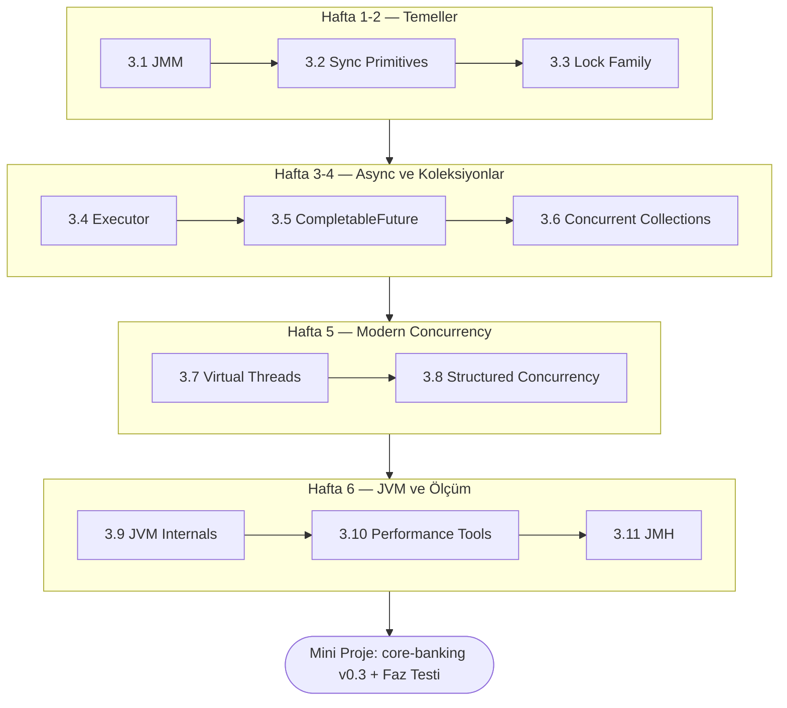

<div class="phase-cover-kicker">Üçüncü Bölüm</div>

# Faz 3 — Concurrency & JVM

<div class="phase-cover-meta">
<div><strong>Süre</strong> 6 hafta</div>
<div><strong>Topic</strong> 11 konu + mini proje</div>
<div><strong>Çıktı</strong> core-banking v0.3</div>
<div><strong>Ön koşul</strong> Faz 2 tamamlandı</div>
</div>

```admonish info title="Bu fazda ne öğreneceksin?"
Java concurrency primitives'ini, JMM (Java Memory Model)'i, lock ailesini, executor
framework'ü, virtual thread'leri ve JVM internals'ı **banking-grade** seviyede
öğreneceksin. Fazın sonunda `core-banking`, race condition'a dirençli, virtual thread'le
ölçeklenen, deadlock-free ve profiling araçlarıyla optimize edilmiş bir servis olacak.
```

## Hedef

Banking backend'inin en kritik teknik fazı. Java concurrency primitives'ini, JMM (Java Memory Model)'i, lock'ları, executor framework'ü, virtual thread'leri ve JVM internals'i banking-grade seviyede öğrenmek.

Bu faz **TR bank mülakatlarında en çok belirleyici olan** kısım — "thread-safe yap", "deadlock üret ve çöz", "GC tune et", "memory leak bul" tipi sorular burada.

Sonunda elinde: race condition'a karşı dirençli, virtual thread'le ölçeklenebilen, deadlock-free, profiling araçlarıyla optimize edilmiş bir banking servisi.

## Fazın haritası



## Süre

6 hafta (günde 2-3 saat). Phase 3 **en büyük faz**. Sabırlı ol. Her kavramı **canlı kod ile** denemeden geçme.

## Topic sırası

1. **[JMM & Memory Model](./01-jmm-memory-model/index.md)** — happens-before, volatile, cache coherency, instruction reordering
2. **[Synchronization Primitives](./02-synchronization-primitives/index.md)** — synchronized, volatile, atomic family, CAS, ABA problem
3. **[Lock Family](./03-locks/index.md)** — ReentrantLock, ReadWrite, StampedLock, Condition, deadlock fix
4. **[Executor Framework](./04-executor-framework/index.md)** — ThreadPoolExecutor, queue strategies, ForkJoinPool, custom thread factory
5. **[CompletableFuture & Async](./05-completable-future/index.md)** — async chains, exception handling, timeout, banking FX fetch
6. **[Concurrent Collections](./06-concurrent-collections/index.md)** — ConcurrentHashMap, BlockingQueue, CountDownLatch, Semaphore
7. **[Virtual Threads (Loom)](./07-virtual-threads-loom/index.md)** — Project Loom, pinning, ScopedValue
8. **[Structured Concurrency](./08-structured-concurrency/index.md)** — StructuredTaskScope, parallel KYC
9. **[JVM Internals](./09-jvm-internals/index.md)** — heap, GC algorithms, JIT, tiered compilation
10. **[Performance Tools](./10-performance-tools/index.md)** — JFR, async-profiler, MAT, jstack, GC log
11. **[JMH Benchmarking](./11-jmh-benchmarking/index.md)** — micro-benchmarks, blackhole, fork, banking benchmarks

Sonra:

- **[Mini-project](./mini-project/index.md)** — rate limiter, virtual thread benchmark, deadlock reproduce+fix, memory leak with MAT
- **[PHASE_TEST.md](./PHASE_TEST.md)** — Phase 4'e geçmeden kendini sına

## Faz 3'ün sonunda olman gereken yer

- [ ] "Happens-before ilişkisi nedir, volatile bunu nasıl sağlar?"
- [ ] "synchronized ve ReentrantLock arasındaki 5 fark nedir?"
- [ ] "ABA problem nedir, AtomicStampedReference ile nasıl çözülür?"
- [ ] "İki concurrent transfer A→B + B→A deadlock'a neden olur, lock ordering ile nasıl çözersin?"
- [ ] "CompletableFuture.allOf ile anyOf arasında ne zaman hangisini kullanırsın?"
- [ ] "ConcurrentHashMap.computeIfAbsent atomicity vs putIfAbsent farkı?"
- [ ] "Virtual thread pinning ne, nasıl tespit eder ve çözersin?"
- [ ] "G1 vs ZGC ne zaman hangisini seçersin?"
- [ ] "Memory leak'i MAT ile nasıl bulursun?"
- [ ] "JMH benchmark'ında blackhole neden gerekli?"

```admonish success title="Faza geçiş kuralı"
Yukarıdaki soruların **hepsine** net cevap verebiliyorsan → [Faz 4 — SQL & Oracle](../04-sql-oracle/index.md)'a geç.
Bu faz uzun ve yoğun; her kavramı canlı kodla denemeden geçme, aceleye getirme.
```
