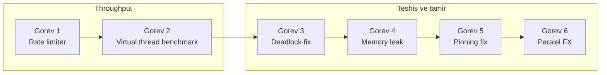
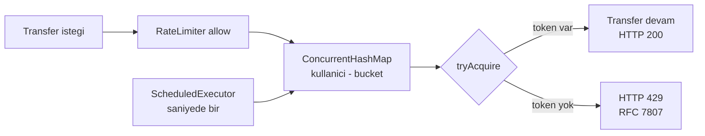
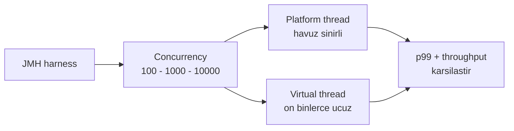
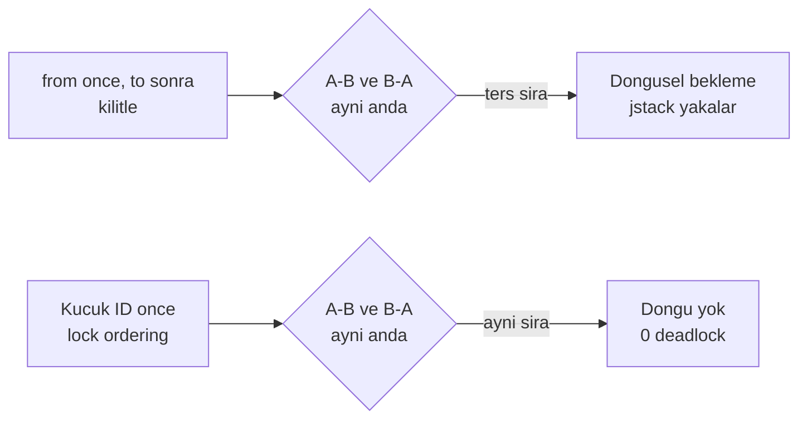

# Phase 3 Mini-Project — Concurrency Hardening

```admonish info title="Bu projede"
- `core-banking`'i concurrent yükler altında ayakta tutan bir rate limiter, virtual thread benchmark'ı ve paralel FX aggregator'ı kuruyorsun
- Deadlock, memory leak ve virtual thread pinning'i **kasten üretip** jstack, MAT ve JFR ile canlı yakalıyorsun
- Her kırılmayı production-grade bir fix'le kapatıyorsun: lock ordering, Caffeine bounded cache, `ReentrantLock`
- Sonunda elinde profiler ile incelenmiş, deadlock-free, pool-safe bir banking servisi ve stack trace okuma refleksi oluyor
```

## Hedef

Phase 3'ün 11 topic'inde JVM seviyesinde concurrency çalıştın: memory model, lock'lar, executor'lar, virtual thread'ler, structured concurrency ve performance tool'lar. Bu projede hepsini `core-banking` üstünde **uyguluyorsun** — yeni teori yok, ölçülen ve kanıtlanan pratik var.

Projenin ruhu tek cümlede: **bir şeyi kasten bozup düzeltmek**. Deadlock üretip jstack ile, memory leak yaratıp MAT ile, pinning oluşturup JFR ile yakalayacaksın; her seferinde gerçek bir stack trace okuyup kök nedeni bulacaksın. Bir adımda takılırsan ilgili topic'e geri dön, oku, düzelt.

```admonish tip title="Süre ve önbilgi"
4-6 gün ayır. Başlamadan önce Phase 3'ün 11 topic'i (3.1-3.11) bitmiş, defter notların yazılmış ve kavramları biliyor olmalısın. Buradaki işin çoğu **birleştirme** + 3 kontrollü kırma-tamir görevi.
```

---

## Acceptance criteria (bitirme şartları)

Başlamadan bir kez oku, bitince tek tek işaretle.

- [ ] Per-user rate limiter çalışıyor, limit aşıldığında **429 + RFC 7807** dönüyor
- [ ] Spring Boot virtual thread enabled, log'da `isVirtual=true`
- [ ] JMH platform vs virtual benchmark sonuçları defterinde tablo
- [ ] Deadlock canlı reproduce edildi (test 30s timeout), jstack'te `Found Java-level deadlock` görüldü
- [ ] Lock ordering fix uygulandı, deadlock kayboldu
- [ ] Bilinçli memory leak yaratıldı, MAT ile analiz edildi (Leak Suspects + Dominator Tree screenshot)
- [ ] Caffeine ile bounded cache fix uygulandı
- [ ] Pinning JFR event'i ile yakalandı (`jdk.VirtualThreadPinned`), `synchronized` → `ReentrantLock` fix'i yapıldı
- [ ] FX aggregator `StructuredTaskScope.ShutdownOnSuccess` ile kuruldu
- [ ] FX latency test: 10 çağrı, hepsi ~200 ms
- [ ] Tüm test'ler `mvn test` ile geçiyor, JaCoCo coverage ≥ %75

---

## Adım adım build plan

Altı görev var: ilk ikisi servisi yük altında sağlamlaştırıyor, son dördü teşhis-tamir refleksini kuruyor.



### Görev 1 — Per-user Rate Limiter (1 gün)

**Ne yapacaksın:** `/v1/transfers` endpoint'ine kullanıcı bazlı rate limit ekleyeceksin. **Neden:** Banking'de tek kullanıcının servisi yükle boğmasını engellemek DoS savunmasının temeli; **token bucket** pattern'i bunu adil ve öngörülebilir yapar.

**Nasıl:** Her kullanıcıya bir bucket ver, `Semaphore` ile token'ları say, `ScheduledExecutorService` ile saniyede bir doldur. İstek geldiğinde token varsa geç, yoksa <mark>limit aşımında HTTP 429 + RFC 7807 ProblemDetail dön</mark>.



Spec net: saniyede max 10 transfer, `ConcurrentHashMap<UUID, TokenBucket>` ile per-user state. Bucket'ın kalbi `Semaphore` — `tryAcquire` token'ı non-blocking düşürür, `refill` eksik token kadar `release` eder:

```java
public boolean tryAcquire() {
    return tokens.tryAcquire();
}

public void refill(int count) {
    int available = tokens.availablePermits();
    int toAdd = Math.min(count, MAX_TOKENS - available);
    tokens.release(toAdd);   // bucket'ı taşırma
}
```

`RateLimiter` bileşeni bucket'ları `computeIfAbsent` ile lazy oluşturur ve scheduled bir task hepsini doldurur.

```admonish warning title="Refill bucket'ı taşırmasın"
`refill`'de `Math.min(count, MAX_TOKENS - available)` kritik. Bunu atlarsan `release` mevcut token'ların üstüne ekler ve bucket kapasitesini aşar — kullanıcı saniyede 10 yerine 20-30 transfer yapabilir hale gelir. Token bucket'ın tavanı her zaman sabit kalmalı.
```

<details>
<summary>Tam kod: TokenBucket + RateLimiter (~36 satır)</summary>

```java
public class TokenBucket {
    private final Semaphore tokens;
    private static final int MAX_TOKENS = 10;

    public TokenBucket(int maxTokens) {
        this.tokens = new Semaphore(maxTokens);
    }

    public boolean tryAcquire() {
        return tokens.tryAcquire();
    }

    public void refill(int count) {
        int available = tokens.availablePermits();
        int toAdd = Math.min(count, MAX_TOKENS - available);
        tokens.release(toAdd);
    }
}

@Component
public class RateLimiter {
    private final ConcurrentHashMap<UUID, TokenBucket> buckets = new ConcurrentHashMap<>();
    private final ScheduledExecutorService refiller = Executors.newSingleThreadScheduledExecutor();

    public RateLimiter() {
        refiller.scheduleAtFixedRate(this::refillAll, 1, 1, TimeUnit.SECONDS);
    }

    public boolean allow(UUID userId) {
        return buckets.computeIfAbsent(userId, k -> new TokenBucket(10)).tryAcquire();
    }

    private void refillAll() {
        buckets.values().forEach(b -> b.refill(10));
    }
}
```

</details>

Controller'a bir interceptor ekle: `allow(currentUserId)` false dönerse `RateLimitExceededException` fırlat, bunu 429'a map'le.

```java
if (!rateLimiter.allow(currentUserId)) {
    throw new RateLimitExceededException();
}
```

**Kontrol noktası:** Gatling ile kullanıcı 1 için 100 req/sec sür — response code dağılımında saniye başına 10 başarılı, ~90 tane 429 görmelisin.

### Görev 2 — Virtual thread enable + benchmark (1 gün)

**Ne yapacaksın:** Spring Boot'ta virtual thread'leri açıp platform thread'e karşı JMH ile ölçeceksin. **Neden:** "Virtual thread hızlıdır" demek yetmez — banking mülakatında hangi concurrency seviyesinde ne kadar kazandığını **sayıyla** söyleyebilmen gerekir.

**Nasıl:** `application.yml`'de tek satırla aç, sonra `TransferEndpointBenchmark`'ı iki thread modeliyle çalıştır.

```yaml
spring:
  threads:
    virtual:
      enabled: true
```

Benchmark'ı 100 / 1000 / 10000 concurrency'de, platform ve virtual thread ile koş; her koşuda average latency + throughput ölç. Düşük concurrency'de (100) iki modelin neredeyse eşit çıkması normaldir — virtual thread'in avantajı I/O-bound yük tavana vurduğunda, yani 10000 concurrency'de belirginleşir; farkı orada ara.



**Kontrol noktası:** Defterine şu tabloyu kendi ölçümlerinle doldur ve log'da `isVirtual=true` gördüğünü doğrula.

| Concurrency | Platform p99 (ms) | Virtual p99 (ms) | Throughput Platform | Throughput Virtual |
|---|---|---|---|---|
| 100 | ? | ? | ? | ? |
| 1000 | ? | ? | ? | ? |
| 10000 | ? | ? | ? | ? |

### Görev 3 — Deadlock reproduction + lock ordering fix (1 gün)

**Ne yapacaksın:** İki hesap arasında ters yönlü transfer'lerle deadlock üretecek, jstack ile canlı yakalayacak, sonra lock ordering ile kapatacaksın. **Neden:** Deadlock teoriden değil, `Found Java-level deadlock` satırını gözünle görünce öğrenilir; çözüm ise banking'in klasik reçetesidir.

**Nasıl:** `transferWithDeadlockBug` iki hesabı **parametre sırasından** kilitler — yani A→B işlemi A'yı, B→A işlemi B'yi önce kilitler. İki yön aynı anda koşunca döngüsel bekleme doğar. Fix bu sırayı deterministik yapar: <mark>her iki hesabı da her zaman küçük ID'yi önce kilitleyecek şekilde sırala</mark>, döngü imkânsızlaşır.



Reprodüksiyon test'i 20 thread'lik pool'da 100 iterasyon iki yönlü transfer koşar; 30 saniyede bitmezse `findDeadlockedThreads()` ile kanıtı alır:

```java
boolean finished = latch.await(30, TimeUnit.SECONDS);
if (!finished) {
    // jstack ile deadlock yakala
    ManagementFactory.getThreadMXBean().findDeadlockedThreads();
}
```

<details>
<summary>Tam kod: shouldReproduceDeadlock (~22 satır)</summary>

```java
@Test
void shouldReproduceDeadlock() throws InterruptedException {
    UUID accountA = createAccount("TRY", "1000.00");
    UUID accountB = createAccount("TRY", "1000.00");

    int iterations = 100;
    CountDownLatch latch = new CountDownLatch(iterations * 2);

    ExecutorService exec = Executors.newFixedThreadPool(20);
    for (int i = 0; i < iterations; i++) {
        exec.submit(() -> { try { transferService.transferWithDeadlockBug(accountA, accountB, Money.of("1", "TRY")); } catch (Exception e) {} latch.countDown(); });
        exec.submit(() -> { try { transferService.transferWithDeadlockBug(accountB, accountA, Money.of("1", "TRY")); } catch (Exception e) {} latch.countDown(); });
    }

    boolean finished = latch.await(30, TimeUnit.SECONDS);
    if (!finished) {
        // jstack ile deadlock yakala
        ManagementFactory.getThreadMXBean().findDeadlockedThreads();
    }
}
```

</details>

Fix'in kalbi karşılaştırmalı sıralama — hesap ID'sine göre küçük olanı `first`, büyük olanı `second` yap ve her zaman bu sırayla kilitle:

```java
public void transferWithFix(UUID from, UUID to, Money amount) {
    UUID first  = from.compareTo(to) < 0 ? from : to;
    UUID second = from.compareTo(to) < 0 ? to : from;

    Account firstAcc  = accountRepo.lockById(first);
    Account secondAcc = accountRepo.lockById(second);
    // ... transfer
}
```

**Kontrol noktası:** Test bug versiyonunda 30s'de timeout'a düşüyor ve `jstack` çıktısında `Found Java-level deadlock` satırını görüyorsun; fix'ten sonra aynı test 0 deadlock ile geçiyor.

### Görev 4 — Memory leak hunting (1 gün)

**Ne yapacaksın:** Bilinçli bir unbounded cache ile OOM tetikleyecek, heap dump'ı MAT ile analiz edip kök nedeni bulacak, sonra bounded cache'e geçeceksin. **Neden:** Production'daki en sinsi hatalar memory leak'lerdir; MAT'ta Dominator Tree ve Path to GC Roots okumayı burada kontrollü ortamda öğrenirsin.

**Nasıl:** `core-banking`'e sınırsız bir `HashMap` cache ekle ve her çağrıda 1000 entry yükleyen bir endpoint aç. Sonra dar heap ile yükle:

```java
@Component
public class UnboundedTransactionCache {
    private final Map<UUID, TransactionDetails> store = new HashMap<>();   // bounded değil

    public void put(UUID id, TransactionDetails details) {
        store.put(id, details);
    }
}
```

JVM'i dump alacak şekilde bayrakla, 100 request sür — OOM tetiklenir ve `oom.hprof` diske düşer:

```bash
-Xmx256m
-XX:+HeapDumpOnOutOfMemoryError
-XX:HeapDumpPath=./oom.hprof
```

```admonish warning title="Bunu asla production'da kullanma"
`HashMap`'i cache olarak kullanmak — TTL yok, boyut sınırı yok — banking'de kaçınılmaz bir OOM reçetesidir. Bu görevde onu **kasten** yazıyorsun ki teşhis edebilesin. Gerçek fix her zaman bounded bir cache (Caffeine) ile gelir; bu pattern'i bir daha yalnızca reprodüksiyon için yaz.
```

MAT ile dört adımlı analizi yap ve fix'i uygula. Sonuçları (screenshot + yorum) defterine koy.

<details>
<summary>MAT analiz adımları ve fix (referans)</summary>

1. `oom.hprof`'u MAT ile aç.
2. **Leak Suspects Report** — `UnboundedTransactionCache` işaret edilmeli.
3. **Dominator Tree** — retained heap görüntüsünü al (screenshot).
4. **Path to GC Roots** ile leak kaynağını bul.
5. **Fix:** Caffeine ile bounded cache — max 10000 entry, TTL 1 dakika.

</details>

**Kontrol noktası:** MAT Leak Suspects raporu `UnboundedTransactionCache`'i işaret ediyor, Dominator Tree screenshot'ı defterinde ve Caffeine bounded cache'e geçtikten sonra aynı yük OOM üretmiyor.

### Görev 5 — Pinning detection + fix (1 gün)

**Ne yapacaksın:** Virtual thread pinning'i kasten yaratacak, JFR ile yakalayacak, `synchronized`'ı `ReentrantLock`'a çevirip throughput farkını ölçeceksin. **Neden:** Görev 2'de açtığın virtual thread'ler `synchronized` blok içinde blocking I/O yaparsa carrier thread'e pin olur ve tüm avantaj kaybolur — bunu görmeden virtual thread'i "açtım" demek yanıltıcıdır.

**Nasıl:** Bir monitor üzerinde `synchronized` blok aç ve içinde JDBC + `Thread.sleep` ile blocking I/O simüle et. <mark>`synchronized` içindeki her blocking çağrı virtual thread'i carrier'a pinler</mark>:

```java
public void transfer(UUID from, UUID to, BigDecimal amount) {
    synchronized (monitor) {
        Account fromAcc = jdbcTemplate.queryForObject(...);   // synchronized içinde blocking
        Account toAcc   = jdbcTemplate.queryForObject(...);
        Thread.sleep(50);   // I/O simülasyonu
    }
}
```

JVM'i pinning'i raporlayacak şekilde bayrakla, 100 paralel virtual thread ile çağır, sonra JFR event'ini oku:

```bash
-Djdk.tracePinnedThreads=full
-XX:StartFlightRecording=duration=60s,filename=pinning.jfr
```

```bash
jfr print --events jdk.VirtualThreadPinned pinning.jfr
```

**Fix:** `synchronized` bloğunu `ReentrantLock` ile değiştir — `lock()`/`unlock()` virtual thread'i pinlemez, thread carrier'ını serbest bırakabilir. Fix öncesi/sonrası throughput'u benchmark'la.

```admonish tip title="Kural: virtual thread + synchronized = pinning riski"
Virtual thread kullanan bir kod tabanında blocking I/O'yu `synchronized` yerine `ReentrantLock` ile koru. Log'da `jdk.tracePinnedThreads` uyarısı veya JFR'de `jdk.VirtualThreadPinned` event'i gördüğün her yer bir pin noktasıdır ve throughput'u sessizce öldürür.
```

**Kontrol noktası:** JFR çıktısında `jdk.VirtualThreadPinned` event'ini yakaladın, `ReentrantLock` fix'inden sonra event kayboldu ve benchmark throughput artışını sayıyla gösteriyor.

### Görev 6 — Parallel FX fetcher (StructuredTaskScope) (45 dk)

**Ne yapacaksın:** 3 mock FX provider'ı `StructuredTaskScope.ShutdownOnSuccess` ile paralel sorgulayıp ilk gelen sonucu döneceksin. **Neden:** Structured concurrency, "en hızlı kaynağı bekle, gerisini otomatik iptal et" pattern'ini temiz ve leak'siz kurar — banking'de FX rate agregasyonunun doğru şeklidir.

**Nasıl:** Üç provider'ı farklı gecikmelerle mock'la (`Tcmb` 1 sn, `Ecb` 200 ms, `Fixer` 500 ms), üçünü `fork` et ve <mark>`ShutdownOnSuccess` ilk başarılı sonucu alınca kalan fork'ları otomatik iptal eder</mark>:

```java
try (var scope = new StructuredTaskScope.ShutdownOnSuccess<FxRate>()) {
    scope.fork(() -> tcmbProvider.getRate(from, to));
    scope.fork(() -> ecbProvider.getRate(from, to));
    scope.fork(() -> fixerProvider.getRate(from, to));

    scope.join();
    return scope.result();   // ilk başarılı ~200 ms (Ecb kazanır)
}
```

`--enable-preview` flag'i aktif olmalı. En hızlı provider (Ecb, 200 ms) yarışı kazanır; scope diğer ikisini bekletmeden kapatır.

**Kontrol noktası:** 10 paralel çağrı yaptın ve her birinin ~200 ms civarında sonuçlandığını ölçtün — yani sonuç 1 sn'lik Tcmb'ye değil, en hızlı provider'a bağlı.

---

## Kasten kırma görevleri

Phase 3'ün özü **bir şeyi kasten bozup düzeltmek**. Yukarıdaki üç teşhis görevi tam da bu döngüyü kurar; her birinde gerçek bir stack trace okuyup kök nedeni bulursun:

1. **Deadlock üret → jstack yakala → lock ordering fix** (Görev 3)
2. **Memory leak yarat → MAT ile bul → Caffeine bounded cache fix** (Görev 4)
3. **Pinning oluştur → JFR ile gör → ReentrantLock fix** (Görev 5)

```admonish tip title="Kanıt topla"
Her kırma-tamir döngüsünde **görmen** lazım: jstack çıktısını, MAT Dominator Tree screenshot'ını ve JFR event'ini defterine/`docs/` altına koy. Mülakatta "deadlock'u çözdüm" demek ile thread dump'ı gösterip "T1 A'yı, T2 B'yi bekliyordu" demek arasındaki fark budur.
```

---

## Pratik desteği

Projeyi bitirdiğin an, aşağıdaki prompt'la Claude'a kapsamlı bir audit yaptır — kör noktalarını böyle yakalarsın.

<details>
<summary>Claude-verify prompt (mini-project bütünü için)</summary>

```
Phase 3 mini-project'imi banking-grade kriterlere göre değerlendir.
PASS / FAIL / EKSIK işaretle, KOD YAZMA, sadece neyin eksik veya yanlış olduğunu söyle:

1. Rate limiter:
   - Token bucket pattern doğru implement edilmiş mi?
   - Per-user ConcurrentHashMap kullanımı thread-safe mi?
   - Refill scheduled task çalışıyor mu?
   - Rate limit aşımında 429 + ProblemDetail RFC 7807 mu?

2. Virtual thread:
   - spring.threads.virtual.enabled: true mu?
   - JMH benchmark sonuçları gerçekçi mi (10k concurrency'de virtual avantajı)?
   - Pinning yok mu (synchronized + JDBC kombinasyonu)?

3. Deadlock:
   - Reproduction canlı oldu mu (test 30s timeout)?
   - jstack'te "Found Java-level deadlock" line görüldü mü?
   - Lock ordering ile fix uygulandı mı (sorted account IDs)?

4. Memory leak:
   - OOM heap dump aldın mı?
   - MAT analizi yapıldı mı (Leak Suspects, Dominator Tree)?
   - Path to GC Roots ile root cause bulundu mu?
   - Caffeine bounded cache ile fix uygulandı mı?

5. Pinning:
   - jdk.tracePinnedThreads=full ile uyarılar görüldü mü?
   - JFR jdk.VirtualThreadPinned event'i yakalandı mı?
   - synchronized -> ReentrantLock fix uygulandı mı?
   - Fix öncesi/sonrası throughput karşılaştırması yapıldı mı?

6. StructuredTaskScope:
   - ShutdownOnSuccess doğru pattern mi?
   - --enable-preview flag aktif mi?
   - 3 provider paralel sorgu doğru kurulmuş mı?
   - Latency en hızlı provider'a göre mi (200ms civarı)?

7. Genel:
   - Tüm test'ler mvn test ile geçiyor mu?
   - JaCoCo coverage Phase 2'deki seviyenin altında değil mi (75%+)?
   - Git commit'leri anlamlı mı?

Her madde için PASS / FAIL / EKSIK ve kısa kanıt (dosya path, test ismi). Kod yazma.
```

</details>

---

## Defter notları

Bitince şunları kendi cümlelerinle doldur — bunlar mülakatta anlatacağın hikâyelerin ham hâli:

1. Token bucket rate limiter'ı `Semaphore` ile implement etme kararı: ____
2. Virtual thread enable etmenin `core-banking` üzerinde ölçülen etkisi: ____
3. Deadlock üretip jstack'le yakalama deneyimi — öğrendiklerim: ____
4. MAT ile memory leak hunting — Dominator Tree + Path to GC Roots: ____
5. Pinning JFR event'ini canlı yakalama — en şaşırtıcı kısım: ____
6. `StructuredTaskScope.ShutdownOnSuccess` pattern'inin banking kullanımı: ____
7. Phase 3'te en zorlandığım kavram: ____
8. Bir senior dev'e en rahat anlatabileceğim konu: ____

---

Hepsi onaylı → Faz 3 PHASE_TEST'e geç → [PHASE_TEST.md](../PHASE_TEST.md)

```admonish success title="Proje Tamamlama Kriterleri"
- Per-user rate limiter çalışıyor; kullanıcı 1 için 100 req/sec yükünde saniyede ~10 başarılı, kalanı 429 + RFC 7807 dönüyor
- Virtual thread enabled (`isVirtual=true`); JMH platform vs virtual benchmark tablosu 100/1000/10000 concurrency için defterde dolu
- Deadlock canlı reproduce edildi (test 30s timeout, jstack'te `Found Java-level deadlock`); lock ordering fix'i ile aynı test 0 deadlock dönüyor
- Memory leak MAT ile analiz edildi (Leak Suspects `UnboundedTransactionCache`'i işaret ediyor, Dominator Tree screenshot alındı); Caffeine bounded cache fix'i uygulandı
- Pinning JFR ile yakalandı (`jdk.VirtualThreadPinned`); `synchronized` → `ReentrantLock` fix'i throughput artışıyla kanıtlandı
- FX aggregator `StructuredTaskScope.ShutdownOnSuccess` ile 10 paralel çağrıda ~200 ms latency veriyor; tüm test'ler `mvn test` ile geçiyor, JaCoCo ≥ %75
```
