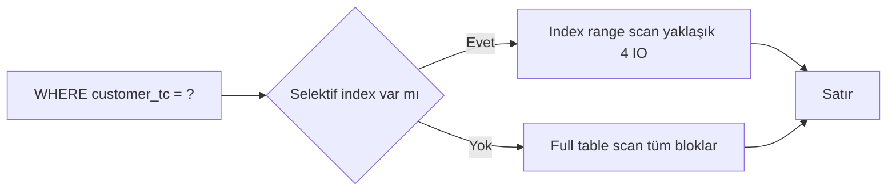
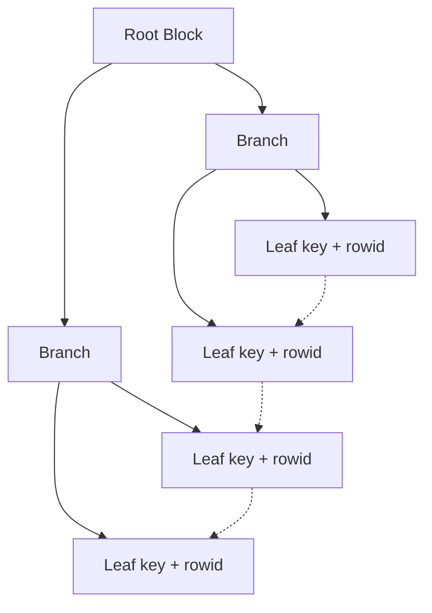
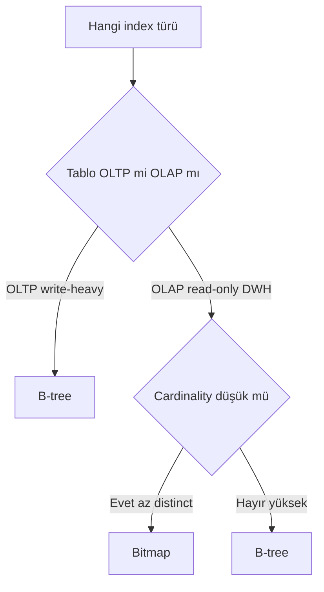
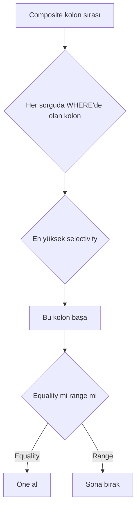

# Topic 4.1 — Index Internals

```admonish info title="Bu bölümde"
- B-tree'nin root/branch/leaf yapısı ve neden lookup'ın `O(log n)` olduğu — 2 milyar satırda ~4 I/O
- Composite index'te leftmost prefix kuralı ve kolon sırasını selectivity'ye göre seçmek
- Selectivity ve cardinality farkı, ve index'in ne zaman sorguyu **yavaşlattığı**
- Function-based, bitmap, covering, partial, reverse-key index'lerin ne zaman doğru araç olduğu
- Banking'in gizli katilleri: FK index'siz tablo ve implicit type conversion
```

## Hedef

Veritabanı index'lerinin **içeride nasıl çalıştığını** derinlemesine anlamak. B-tree'nin yaprak/dal yapısı, bitmap'in ne zaman uygun olduğu, function-based ve composite index'te kolon sırası, selectivity ve cardinality, partial vs covering. Banking domain'inde **hangi sorgu için hangi index** sorusunu kararlı cevaplayabilmek.

## Süre

Okuma: 2 saat • Kendini Sına: 45 dk • Pratik (opsiyonel): 2-3 saat • Toplam: ~3 saat (+ pratik)

## Önbilgi

- SQL temel (SELECT, WHERE, JOIN)
- Faz 2'den JPA tarafında index'in faydasını gördün
- `CREATE INDEX` syntax'ını biliyorsun

---

## Kavramlar

### 1. Index nedir, neden gerekli — banking perspektifi

Bir banka düşün: 50 milyon hesap, 2 milyar transaction. Müşteri çağrı merkezini arıyor, "TC No 12345678901 hesaplarını listele" diyor — ve bu sorgu **300 ms** içinde dönmek zorunda (SLA). İşte index'in var oluş sebebi bu tek cümlede saklı.

Index olmasaydı DB her satırı baştan sona okur (**full table scan**): 2 milyar satır × ~200 byte = ~400GB tarama, disk I/O sınırlı, sorgu **20-40 dakika** sürer. Müşteri telefonu kapatır.

Index ile DB önce küçük bir veri yapısına bakar (TC No → row pointer), birkaç sayfa okur, doğru satıra direkt zıplar — sorgu **5-15 ms**. Aradaki fark iki farklı erişim yolu:



**Index nedir?** Tabloya ait, **sıralı** veya **özel yapıda** bir veri kopyasıdır; sorguyu hızlandırır. Ama bedava değil — disk alanı, write performance (her INSERT/UPDATE/DELETE index'i de günceller) ve maintenance (rebuild, statistics) maliyeti getirir.

Banking'de denge kritik: read-heavy tablolar için index bol, write-heavy/append-only tablolar için index seçici.

### 2. B-tree Index — en yaygın yapı

Bir index'e "sadece CREATE INDEX" dediğinde arkada ne olduğunu bilmezsen kolon sırası ve selectivity kararlarını da sağlam veremezsin — o yüzden en yaygın yapıyla başlıyoruz. **B-tree** (Balanced Tree), Oracle ve PostgreSQL'in **default** index türüdür; `CREATE INDEX foo ON t(c)` dediğinde bir B-tree yaratırsın.

Yapı üç katmandan oluşur: tepede tek **root block**, ortada "şu range için şu dala in" diyen **branch block**'lar, en altta **gerçek key değerleri** ve **rowid pointer**'larını tutan **leaf block**'lar.



Tüm leaf'ler **aynı derinliktedir** — "balanced" adı buradan gelir. Bir satır eklenince blok bölünür (split), gerekirse yukarı yayılır. Bu denge sayesinde lookup **logaritmik** zaman alır: `O(log n)`. **Height** (root'tan leaf'e derinlik) Oracle'da tipik olarak 10M-1B satırda sadece **2-4 seviyedir**.

Bir point lookup böyle ilerler:

```sql
SELECT * FROM accounts WHERE account_no = '1234567890';
```

1. Root block oku → key hangi branch'e gider bul (genelde cache'te)
2. Branch block oku → hangi leaf bul (1 I/O)
3. Leaf block oku → key'in rowid'ini al (1 I/O)
4. Tablodan rowid ile gerçek satırı oku — "table access by index rowid" (1 I/O)

Toplam ~4 I/O. **2 milyar satır için 4 I/O** — index'in gücü tam olarak bu.

Banking örneği, 50M hesapta TC'ye göre arama:

```sql
CREATE TABLE accounts (
    account_id    VARCHAR2(20) PRIMARY KEY,   -- otomatik B-tree
    customer_tc   VARCHAR2(11) NOT NULL,
    branch_code   VARCHAR2(4),
    balance       NUMBER(19,2),
    opened_at     DATE
);

CREATE INDEX idx_accounts_customer_tc ON accounts(customer_tc);

-- Artık bu sorgu index kullanır
SELECT * FROM accounts WHERE customer_tc = '12345678901';
```

Oracle B-tree leaf node'ları **bidirectional linked list** ile birbirine bağlıdır. Bu yüzden **range scan** hızlıdır: ilk leaf bulunur, sonra leaf'ten leaf'e zıplanarak aralık gezilir.

```sql
SELECT * FROM accounts WHERE opened_at BETWEEN DATE '2024-01-01' AND DATE '2024-01-31';
```

Hash index'te bu mümkün değildir. PostgreSQL B-tree de aynı mantıktadır; page boyutu ve sıkıştırma gibi küçük internal farkları var ama API aynı: `CREATE INDEX`.

### 3. Bitmap Index — read-heavy OLAP için

B-tree her şey için doğru araç değildir; çok az distinct değeri olan bir kolonu (status, channel, gender) hızlı toplamak istediğinde **bitmap index** devreye girer. Her distinct değer için bir **bit dizisi** tutar: bit 1 ise o satır o değere sahiptir.

```
status değerleri: 'ACTIVE', 'FROZEN', 'CLOSED'

Satır:    1  2  3  4  5  6  7  8
ACTIVE:   1  0  1  1  0  1  0  1
FROZEN:   0  1  0  0  0  0  1  0
CLOSED:   0  0  0  0  1  0  0  0
```

Avantajı: düşük cardinality kolonlar için **çok küçük**, ve birden fazla filter'ı **bitwise AND/OR** ile birleştirmek çok hızlı — data warehouse / OLAP için ideal.

Dezavantajı ağır: bir UPDATE bitmap'in birçok satırını kilitler → **write performance felaket**. Ayrıca yüksek cardinality'de patlar (1M distinct → 1M bitmap), ve PostgreSQL'de **gerçek bitmap index yoktur** (bitmap heap scan farklı bir şey).

```admonish warning title="Bitmap index OLTP'de kullanılmaz"
Bitmap'in tek bir UPDATE'te aynı bloktaki birçok satırı kilitlemesi, yüksek concurrency'li OLTP tablolarında (accounts, transactions) doğrudan lock contention ve throughput çöküşü demektir. Bitmap sadece nightly batch ile yüklenen, gündüz sadece okunan DWH tablolarında güvenlidir.
```

Bir DWH örneği — düşük cardinality kolonlar üzerinde:

```sql
CREATE TABLE transactions_dwh (
    transaction_id   NUMBER PRIMARY KEY,
    branch_code      VARCHAR2(4),        -- ~500 distinct
    channel          VARCHAR2(20),       -- 'ATM','ONLINE','BRANCH','MOBILE' (4-5)
    transaction_type VARCHAR2(20),       -- 'DEPOSIT','WITHDRAW',... (~10)
    amount           NUMBER(19,2),
    transaction_date DATE
);

-- Sadece batch'le yüklenen DWH → bitmap uygun
CREATE BITMAP INDEX bmi_dwh_channel ON transactions_dwh(channel);
CREATE BITMAP INDEX bmi_dwh_type    ON transactions_dwh(transaction_type);

-- Bitmap AND ile çok hızlı
SELECT COUNT(*), SUM(amount)
FROM transactions_dwh
WHERE channel = 'MOBILE' AND transaction_type = 'TRANSFER';
```

Doğru türü seçme akışı özetle şu:



```admonish tip title="Pratik kural"
OLTP'de B-tree, OLAP/data warehouse'ta bitmap. Bu tek cümle mülakatta bitmap sorusunun %80'ini karşılar.
```

### 4. Function-Based Index

Bir index'in var olması onun kullanılacağı anlamına gelmez; WHERE clause'ta kolonu bir **fonksiyona sokarsan** normal B-tree devre dışı kalır. Sebep basit: index `customer_tc` değerlerini saklar, `UPPER(customer_tc)` değerlerini değil.

```sql
CREATE INDEX idx_customer_tc ON accounts(customer_tc);

-- Bu sorgu full table scan yapar — UPPER index'i invalidate ediyor
SELECT * FROM accounts WHERE UPPER(customer_tc) = '12345678901';
```

Çözüm, index'i tam o ifade üzerine kurmak — **function-based index**:

```sql
CREATE INDEX idx_accounts_customer_tc_upper ON accounts(UPPER(customer_tc));

-- Şimdi index kullanılır
SELECT * FROM accounts WHERE UPPER(customer_tc) = '12345678901';
```

Banking'de sık ihtiyaç duyulan üç desen:

```sql
-- 1) Case-insensitive ad-soyad araması
CREATE INDEX idx_customer_name_upper ON customers(UPPER(first_name), UPPER(last_name));
SELECT * FROM customers WHERE UPPER(first_name) = 'AHMET' AND UPPER(last_name) = 'YILMAZ';

-- 2) Tarihten yıl çıkarma (raporlama)
CREATE INDEX idx_tx_year ON transactions(EXTRACT(YEAR FROM transaction_date));
SELECT * FROM transactions WHERE EXTRACT(YEAR FROM transaction_date) = 2024;

-- 3) IBAN'dan banka kodu (TR IBAN'da pozisyon 5-9)
CREATE INDEX idx_iban_bank ON accounts(SUBSTR(iban, 5, 4));
SELECT * FROM accounts WHERE SUBSTR(iban, 5, 4) = '0046';   -- Akbank
```

PostgreSQL'de aynı şey "expression index" adıyla, parantezlere dikkat ederek:

```sql
CREATE INDEX idx_customer_name_lower ON customers((LOWER(first_name)));
SELECT * FROM customers WHERE LOWER(first_name) = 'ahmet';
```

Tek şart: fonksiyon **deterministic** olmalı. `SYSDATE` gibi her seferinde farklı sonuç veren bir ifade index'lenemez.

### 5. Composite Index & Leftmost Prefix Rule

Birden fazla kolonu tek index'te toplamak güçlüdür ama kolon sırası her şeyi belirler — bu bölüm mülakatların en sık düşülen tuzağıdır. Bir `(A, B, C)` composite index'i düşün:

```sql
CREATE INDEX idx_accounts_branch_currency ON accounts(branch_code, currency);
```

Şu sorgular index'i **kullanır**: `WHERE A=?` (kısmi), `WHERE A=? AND B=?`, `WHERE A=? AND B=? AND C=?`, ve `WHERE A=? AND C=?` (A ile başlar, C için filter). Şu sorgular **kullanmaz**: `WHERE B=?`, `WHERE C=?`, `WHERE B=? AND C=?` — çünkü hepsinde leftmost kolon A atlanmış.

<mark>Composite index'te en soldaki kolon bilinmeden sağdakiler kullanılamaz — telefon rehberi soyada göre sıralıysa, soyadı bilmeden ada göre arama yapamazsın.</mark>

Kolon sırasını neye göre seçersin? **Selectivity-First Rule:** en seçici kolonu başa koy. Selectivity = distinct değer sayısı / toplam satır; 1'e yakın olan seçicidir.

```
customer_tc:  50M'de 30M distinct  → 0.6        → çok selektif
branch_code:  50M'de 500 distinct  → 0.00001    → düşük
status:       50M'de 3 distinct    → 0.0000001  → çok düşük
```

Hem `customer_tc` hem `status` ile filter atıyorsan, `customer_tc`'yi başa koy: önce çok az satıra düşürür, `status` filter'ı zaten küçük kümede çalışır. Karar akışı:



Banking örneği, kolon sırası kararı:

```sql
-- Sık sorgular:
-- 1) WHERE branch_code = ? AND currency = ?
-- 2) WHERE branch_code = ?
-- 3) WHERE currency = ?

CREATE INDEX idx_accounts_branch_currency ON accounts(branch_code, currency);

-- Sorgu 1 ve 2 index kullanır.
-- Sorgu 3 (WHERE currency = ?) → leftmost prefix yok → full table scan.
--   Ya currency için ayrı index ekle, ya bu sorguyu kabul et.
```

Oracle'da bir kaçış kapısı var: leftmost kolon **çok az distinct** ise (örn. 3 değer) Oracle **skip scan** yapabilir — her distinct değer için ayrı range scan dener, birleştirir. Yavaştır ama full scan'den iyidir.

```sql
-- (gender, salary) index'i var, sadece salary filter
SELECT * FROM employees WHERE salary > 100000;
-- Oracle: gender='M' walk + gender='F' walk → birleştir
```

Skip scan garanti değil, CBO karar verir. **Ona güvenme**, doğru kolon sırasını baştan seç.

### 6. Selectivity ve Cardinality

Bu iki terim sürekli karıştırılır ama farkları CBO'nun index'i seçip seçmeme kararının kalbidir.

- **Cardinality:** bir kolondaki **distinct değer sayısı** ya da bir sorgunun döndürdüğü **tahmini satır sayısı**.
- **Selectivity:** bir filter'ın döndürdüğü **satır oranı** (0-1); 1'e yakınsa çok satır, 0'a yakınsa az satır gelir.

```
status kolonu: 3 distinct → Cardinality 3
WHERE status = 'CLOSED' (50M'in 100K'sı) → Selectivity 100K/50M = 0.002 (çok az)
```

Şimdi kritik nokta: selectivity **yüksekse** index kullanmak sorguyu **yavaşlatır**. Diyelim filter yarı satırı getiriyor (0.5) — DB index leaf'ten 25M rowid okur, her biri için tabloya atlar (25M **random** I/O). Halbuki full table scan sıralı disk okumasıdır, çok daha hızlı.

<mark>Yüksek selectivity'de index yerine full table scan daha hızlıdır; CBO bu kararı statistics'e bakarak verir, statistics yanlışsa plan da yanlış olur.</mark>

Banking sezgisi olarak eşikler:

```
Selectivity < 0.01     → Index yararlı (B-tree)
Selectivity 0.01-0.05  → Marjinal, statistics'e bağlı
Selectivity > 0.05     → Çoğunlukla full table scan daha iyi
```

Aynı index, aynı sorgu, **farklı parametre** → farklı plan olabilir:

```sql
SELECT * FROM accounts WHERE status = 'CLOSED';  -- 50M'in 100K'sı (0.002) → index
SELECT * FROM accounts WHERE status = 'ACTIVE';  -- 50M'in 49M'si (0.98)  → full scan
```

Bu "bind variable peeking" konusudur (Topic 4.2).

### 7. Partial Index (PostgreSQL) ve Oracle trick'i

Bazen tablonun sadece küçük bir alt kümesini sorgularsın (kapalı hesaplar, başarısız işlemler); tümünü index'lemek israftır. PostgreSQL bunu **partial index** ile çözer:

```sql
CREATE INDEX idx_accounts_inactive ON accounts(customer_tc)
WHERE status != 'ACTIVE';
```

Kazanç net: index **çok küçük** (50M değil, 500K satır), active hesaplara yazma index'i etkilemez, memory'de az yer tutar.

Oracle'da generic partial index yok (12c+ sadece partitioned tablolar için var). Trick, function-based index ile NULL kullanmaktır — Oracle NULL değerleri tek-kolon B-tree'de tutmaz:

```sql
CREATE INDEX idx_accounts_inactive_oracle ON accounts(
    CASE WHEN status != 'ACTIVE' THEN customer_tc ELSE NULL END
);
-- Sonuç: sadece status != 'ACTIVE' satırlar index'te
```

Tuzak: sorgunun da aynı CASE'i kullanması gerekir, bu yüzden kullanışsızdır. Oracle'da genelde tüm tablo index'lenir, denge partitioning ile kurulur.

### 8. Reverse-Key Index (Oracle özel)

Sequential primary key'lerde (`customer_id` 1, 2, 3, ...) ardışık INSERT'ler hep **son leaf**'e gider; bu bir hot spot yaratır ve özellikle RAC'de contention'a yol açar. **Reverse-key index** key'in byte'larını ters çevirerek insert'leri farklı leaf'lere dağıtır.

```sql
CREATE INDEX idx_customer_id_rev ON customers(customer_id) REVERSE;

-- 100 → '001', 101 → '101', 102 → '201' ...
-- Insert'ler farklı leaf'lere yayılır
```

Bedeli: sıra bozulduğu için **range scan çalışmaz** — `WHERE id BETWEEN 100 AND 200` artık bu index'i kullanamaz. Bu yüzden sadece yüksek-throughput insert alan ve **range scan yapılmayan** tablolarda (audit log gibi) mantıklıdır. Pratikte hot spot'u çözmenin daha kolay yolu genelde **sequence cache'i artırmaktır** (Topic 4.5).

### 9. Covering Index — sorguyu index'ten çözmek

Sorgunun ihtiyaç duyduğu **tüm kolonlar** index'te varsa DB tabloya hiç gitmez, sadece index'i okur — "index-only scan". Bu, en pahalı adımı (table access by index rowid) tamamen ortadan kaldırır.

```sql
-- accounts(account_id, customer_tc, branch_code, balance, status, opened_at)
CREATE INDEX idx_accounts_tc_balance ON accounts(customer_tc, balance);

-- İki kolon da index'te → tabloya gitmez
SELECT customer_tc, balance FROM accounts WHERE customer_tc = '12345678901';
```

`EXPLAIN PLAN`'da "INDEX RANGE SCAN" görürsün ama "TABLE ACCESS BY INDEX ROWID" yoktur.

PostgreSQL 11+ bunu `INCLUDE` ile daha zarif yapar — ek kolonları index'te **taşır ama sıralamaya katmaz**, böylece index daha küçük kalır:

```sql
CREATE INDEX idx_accounts_tc_inc_balance ON accounts(customer_tc) INCLUDE(balance);
```

Oracle 19c+ da `INCLUDE` destekler; önceki sürümlerde kompozit `(a, b)` kullanılır (tek fark: `b`'ye göre gereksiz sıralama overhead'i). Raporlamada güçlüdür:

```sql
-- Sık çekilen rapor: müşteri başına toplam bakiye
CREATE INDEX idx_accounts_tc_balance_cover ON accounts(customer_tc, balance);
-- Sorgu INDEX FAST FULL SCAN ile tabloya hiç gitmeden cevaplanır
```

Dikkat: çok geniş covering index = çok büyük index → write performance düşer. Trade-off yap.

### 10. Index ne zaman zarar verir?

Index'i "bedava hız" sanmak banking'de pahalı bir yanılgıdır; her index'in bir yazma ve bakım maliyeti vardır. Write-heavy tabloda her INSERT, tabloya bir yazma **artı her index için** bir yazma demektir — 5 index'li tabloda 1 INSERT = 6 yazma.

```sql
-- transactions: append-only, çok yüksek throughput
-- Birincil: transaction_id (PK), sorgulanan: account_id, transaction_date
-- 2-3 index yeter. 10 index → TPS yarı yarıya düşer.
```

Düşük cardinality kolona tek başına index de çoğunlukla zarardır:

```sql
CREATE INDEX idx_accounts_status ON accounts(status);
-- status 3 değer → WHERE status='ACTIVE' 49M satır → index kullanılmaz
-- Çözüm: composite (status + selektif kolon), partial index, ya da hiç ekleme
```

Ama tek bir durum var ki index eksikliği doğrudan production'ı kilitler — foreign key kolonu:

```admonish warning title="FK kolonu index'siz = banking'in en sık lock kaynağı"
Parent tabloda bir DELETE veya UPDATE, child tablodaki FK kolonunu tarar. FK kolonunda index yoksa Oracle full table scan yapar ve daha kötüsü child üzerinde table-level (TM) lock alır — bu, eş zamanlı INSERT/UPDATE'leri bloklar ve deadlock üretir.
```

```sql
-- accounts(customer_id REFERENCES customers(id)), index YOK:
-- DELETE FROM customers WHERE id = 123;
--   → Oracle accounts'u full scan eder + TM lock → concurrent yazmaları bloklar

CREATE INDEX idx_accounts_customer_id ON accounts(customer_id);
```

<mark>Her foreign key kolonuna index eklemek banking'de mandatory'dir; index'siz FK, production'da deadlock kaynağıdır.</mark>

Son olarak sık güncellenen kolonlara dikkatli index ekle — index'li bir kolon UPDATE edildiğinde eski entry silinir, yeni entry eklenir (1 UPDATE = 2 index operasyonu). `balance`, `version`, `updated_at` gibi kolonlar bunun tipik kurbanıdır.

### 11. Daha advanced türler (bilgi düzeyinde)

Banking junior'ının günlük işinde kullanmadığı ama "ne için var" cevabını verebilmesi gereken türler:

- **Bitmap Join Index:** iki tablonun join'ini önceden hesaplayıp bitmap tutar — DWH için.
- **Index-Organized Table (IOT):** tablo zaten index'tir, satırlar PK sırasında saklanır (heap yok). Range ve point lookup çok hızlı, update pahalı.
- **Reverse Function-Based Index:** function-based + reverse kombinasyonu.

Bunları mid-level'da derinleştirirsin; şimdilik varlıklarını ve amaçlarını bilmek yeterli.

### 12. Index Anti-Pattern'leri (banking)

Mülakatta "bu kodda ne yanlış?" sorusunun cephaneliği burasıdır. Beş klasik.

**1 — "Her şeye index".** Hiçbiri seçici olmayan kolonlara serpiştirilen index'ler sadece maintenance yükü getirir:

```sql
-- KÖTÜ
CREATE INDEX idx1 ON accounts(branch_code);
CREATE INDEX idx2 ON accounts(currency);
CREATE INDEX idx3 ON accounts(status);
-- ... hiçbiri selektif değil, hepsi write overhead
```

**2 — Composite kolon sırasını rastgele seçmek.**

```sql
-- KÖTÜ: çoğu sorgu account_id ile başlar → leftmost yok
CREATE INDEX idx_bad ON transactions(currency, amount, account_id);

-- DOĞRU: en selektif başta, sonra range, sonra sort
CREATE INDEX idx_good ON transactions(account_id, transaction_date, amount);
```

**3 — WHERE'de kolonu fonksiyona sokmak.**

```sql
-- KÖTÜ: index iptal
SELECT * FROM accounts WHERE TRUNC(opened_at) = DATE '2024-01-15';

-- DOĞRU: fonksiyonu literal tarafına taşı, kolonu çıplak bırak
SELECT * FROM accounts
WHERE opened_at >= DATE '2024-01-15' AND opened_at < DATE '2024-01-16';
```

**4 — Implicit type conversion.** Bu prod'daki gizli yavaşlamaların bir numaralı sebebidir:

```sql
-- accounts.customer_tc VARCHAR2(11), Java'dan integer geliyor
-- KÖTÜ: Oracle TO_NUMBER(customer_tc) = ... yapar → index bypass
SELECT * FROM accounts WHERE customer_tc = 12345678901;

-- DOĞRU: string olarak gönder
SELECT * FROM accounts WHERE customer_tc = '12345678901';
```

```admonish tip title="JPA tarafında implicit cast'i önle"
Entity field tipinin kolon tipiyle eşleştiğinden emin ol (`VARCHAR2` kolon → `String` field). Parametre yanlış tipte bind edilirse index sessizce devre dışı kalır ve sorgu prod'da gizlice yavaşlar — hiç hata almazsın, sadece SLA'yı kaçırırsın.
```

**5 — Sorunu rebuild ile çözmeye çalışmak.** `ALTER INDEX idx_foo REBUILD;` eski Oracle disiplinidir; 12c+ self-managing olduğu için genelde gereksizdir. Önce statistics güncelle, gerçek soruna bak.

### 13. Banking'de pratik index seti

Öğrendiklerini somuta indirgemek için üç çekirdek tablonun index tasarımı — bunlar mülakatta "index setini tasarla" sorusunun cevabıdır.

```sql
-- accounts
ALTER TABLE accounts ADD CONSTRAINT pk_accounts PRIMARY KEY (account_id);
CREATE INDEX idx_accounts_customer_tc     ON accounts(customer_tc);      -- müşteri lookup
CREATE INDEX idx_accounts_branch_status   ON accounts(branch_code, status);  -- branch raporu
CREATE UNIQUE INDEX idx_accounts_iban     ON accounts(iban);            -- IBAN unique
```

```sql
-- transactions (en kritik)
ALTER TABLE transactions ADD CONSTRAINT pk_tx PRIMARY KEY (transaction_id);
CREATE INDEX idx_tx_account_date ON transactions(account_id, transaction_date DESC);
--   DESC çünkü genelde "son işlemler" çekilir; account_id tek başına da bu index'ten karşılanır
CREATE UNIQUE INDEX idx_tx_idempotency_key ON transactions(idempotency_key);
```

```sql
-- journal_lines — FK'lar banking'de mandatory
ALTER TABLE journal_lines ADD CONSTRAINT pk_jl PRIMARY KEY (id);
CREATE INDEX idx_jl_journal_entry ON journal_lines(journal_entry_id);
CREATE INDEX idx_jl_account       ON journal_lines(account_id);
CREATE INDEX idx_jl_account_date  ON journal_lines(account_id, created_at);  -- hesap ekstresi
```

Not: `idx_tx_account_date` varken ayrı bir `idx_tx_account_id` genelde **redundant**'tır — leftmost prefix sayesinde `account_id` tek başına da o composite'ten karşılanır.

---

## Önemli olabilecek araştırma kaynakları

- Oracle Database SQL Tuning Guide ("Optimizer Statistics", "Indexes and Index-Organized Tables")
- Use The Index, Luke! (use-the-index-luke.com) — Markus Winand, çok yüksek kalite
- "SQL Performance Explained" — Markus Winand
- PostgreSQL doc: "Indexes" chapter
- "Cost-Based Oracle Fundamentals" — Jonathan Lewis (klasik referans)
- Tom Kyte (asktom.oracle.com) ve "Expert Oracle Database Architecture"
- Christian Antognini "Troubleshooting Oracle Performance"

---

## Kendini Sına

Aşağıdaki soruları önce **cevaba bakmadan** kendi cümlelerinle yanıtlamayı dene — hepsi TR bank mülakatlarında karşına çıkabilecek tarzda. Takılırsan ilgili Kavramlar başlığına dön, sonra tekrar dene.

**S1. B-tree lookup neden `O(log n)`? Height (`blevel`) ne ifade eder ve neden "balanced" denir?**

<details>
<summary>Cevabı göster</summary>

B-tree bir ağaçtır: root → branch → leaf. Bir key aranırken her seviyede "hangi alt-dala inmeliyim" kararı verilir, yani her adımda aday küme dallanma oranı kadar küçülür — bu da toplam adım sayısını satır sayısının logaritması yapar. Height (Oracle'da `blevel`) root'tan leaf'e derinliktir; 10M-1B satırda bile tipik olarak 2-4'tür, o yüzden 2 milyar satırda point lookup ~4 I/O'dur.

"Balanced" tüm leaf node'ların aynı derinlikte olması demektir. Insert sırasında blok dolarsa split olur ve gerekirse yukarı yayılır; ağaç hiçbir dalda derinleşip başka dalda sığ kalmaz. Bu denge sayesinde her sorgu öngörülebilir sabit sayıda I/O ile çözülür.

</details>

**S2. `(A, B, C)` composite index'inde `WHERE B = ?` neden index kullanmaz? Kolon sırasını neye göre belirlersin?**

<details>
<summary>Cevabı göster</summary>

Composite index kolonları soldan sağa sıralı tutar: önce A'ya, eşitlikte B'ye, sonra C'ye göre. Bu yüzden en soldaki kolon (A) sorguda yoksa index'in sıralaması işe yaramaz — telefon rehberi soyada göre sıralıysa, soyadı bilmeden ada göre arama yapamazsın. `WHERE B = ?` leftmost prefix'i (A) atladığı için index taranamaz; en fazla full index scan olur ki bu genelde full table scan kadar pahalıdır.

Kolon sırasını selectivity-first belirlersin: her sorguda WHERE'de yer alan ve en yüksek selectivity'ye (en çok distinct değere) sahip kolonu başa koyarsın, çünkü o kolon aday satır kümesini en hızlı daraltır. Equality filter'lanan kolonlar range filter'lanandan önce gelmeli; range kolonu ondan sonrasını "kilitler".

</details>

**S3. Selectivity ile cardinality farkı nedir? Bir index sorguyu ne zaman YAVAŞLATIR?**

<details>
<summary>Cevabı göster</summary>

Cardinality bir kolondaki distinct değer sayısı (ya da bir sorgunun döndürdüğü tahmini satır sayısıdır); selectivity ise bir filter'ın döndürdüğü satır oranıdır (0-1). Örnek: `status` kolonu 3 distinct → cardinality 3; `WHERE status='CLOSED'` 50M'in 100K'sını getiriyorsa selectivity 0.002.

Index selectivity yüksekken (çok satır geliyorken) yavaşlatır. DB index leaf'ten milyonlarca rowid okuyup her biri için tabloya random I/O ile atlar; bu, tüm tabloyu sıralı okumaktan (full table scan) daha pahalıdır. Kabaca selectivity < 0.01 index'i haklı çıkarır, > 0.05 çoğunlukla full scan lehinedir. Kararı CBO statistics'e bakarak verir — statistics bayatsa yanlış plan seçer.

</details>

**S4. Function-based index ne zaman gerekir? Bir banking örneği ver.**

<details>
<summary>Cevabı göster</summary>

WHERE clause'ta kolon bir fonksiyonun içinde geçtiğinde normal B-tree devre dışı kalır, çünkü index ham kolon değerlerini saklar, fonksiyonun sonucunu değil. `WHERE UPPER(customer_tc) = '...'` sorgusu `customer_tc` index'ini kullanamaz. Çözüm, index'i tam o ifade üzerine kurmaktır: `CREATE INDEX ... ON accounts(UPPER(customer_tc))`.

Banking örnekleri: case-insensitive ad-soyad araması (`UPPER(first_name)`), tarihten yıl çıkararak raporlama (`EXTRACT(YEAR FROM transaction_date)`), IBAN'dan banka kodu (`SUBSTR(iban, 5, 4)`). Tek şart fonksiyonun deterministic olmasıdır — `SYSDATE` gibi değişken sonuç veren ifadeler index'lenemez. PostgreSQL'de aynı şey "expression index" olarak `((LOWER(col)))` formatındadır.

</details>

**S5. Foreign key kolonuna index neden mandatory? Olmazsa ne olur?**

<details>
<summary>Cevabı göster</summary>

Parent tabloda bir DELETE veya PK UPDATE olduğunda, DB "bu parent'a bağlı child satır var mı" diye child tablonun FK kolonunu kontrol eder. FK kolonunda index yoksa bu kontrol full table scan olur ve Oracle child tablo üzerinde table-level (TM) lock alır.

Sonuç iki katmanlı felakettir: DELETE yavaşlar (milyonlarca satır taranır) ve TM lock eş zamanlı INSERT/UPDATE'leri bloklayarak deadlock üretir. Banking'de yüksek concurrency'li tablolarda (accounts, journal_lines) bu doğrudan production kesintisi demektir. Çözüm basit ve zorunludur: her FK kolonuna bir index. Bu yüzden `journal_lines(journal_entry_id)` ve `journal_lines(account_id)` gibi FK index'leri tasarımın olmazsa olmazıdır.

</details>

**S6. Covering index nedir, tablo erişimini nasıl önler? PostgreSQL `INCLUDE` ile Oracle composite arasındaki trade-off nedir?**

<details>
<summary>Cevabı göster</summary>

Sorgunun ihtiyaç duyduğu tüm kolonlar (SELECT ve WHERE'dekiler) index'te varsa, DB satırı okumak için tabloya gitmez, cevabı doğrudan index'ten üretir — "index-only scan". Bu, en pahalı adımı olan "table access by index rowid"i tamamen ortadan kaldırır; plan'da INDEX RANGE/FAST FULL SCAN görünür ama TABLE ACCESS olmaz.

PostgreSQL `INCLUDE(col)` ek kolonu index'e taşır ama sıralamaya katmaz, böylece index daha küçük ve yazması daha ucuz kalır. Oracle'ın klasik yolu kompozit `(a, b)` kullanmaktır; farkı `b`'nin de sıralanmasıdır — gereksiz overhead. Oracle 19c+ artık `INCLUDE` destekler. Her iki durumda da tuzak aynı: covering index'i çok genişletirsen (5+ kolon) index büyür ve write performance düşer, yani covering avantajını write maliyetiyle tartmalısın.

</details>

**S7. Bitmap index OLTP'de neden zararlı? Ne zaman doğru araçtır?**

<details>
<summary>Cevabı göster</summary>

Bitmap index her distinct değer için bir bit dizisi tutar ve bir satırın UPDATE'i aynı bitmap bloğundaki birçok satırı kilitler. Yüksek concurrency'li OLTP tablolarında (accounts, transactions) bu ağır lock contention ve throughput çöküşü demektir, o yüzden OLTP'de kesinlikle kullanılmaz. Ayrıca yüksek cardinality kolonlarda patlar (1M distinct → 1M bitmap).

Doğru yeri read-heavy OLAP / data warehouse tablolarıdır: nightly batch ile yüklenip gündüz sadece okunan, düşük cardinality kolonlar (channel, transaction_type, branch). Orada avantajı büyüktür — çok küçük yer kaplar ve birden fazla filter'ı bitwise AND/OR ile çok hızlı birleştirir. Not: PostgreSQL'de gerçek bitmap index yoktur (bitmap heap scan farklı bir mekanizmadır).

</details>

**S8. `customer_tc` VARCHAR2 iken sorguya integer parametre gelirse ne olur? JPA tarafında nasıl önlersin?**

<details>
<summary>Cevabı göster</summary>

Oracle tip uyuşmazlığını implicit conversion ile çözer ama bunu kolon tarafına uygular: `WHERE customer_tc = 12345678901` aslında `TO_NUMBER(customer_tc) = 12345678901` olur. Kolon bir fonksiyona sarıldığı için `customer_tc` üzerindeki B-tree index bypass edilir ve sorgu full table scan'e düşer — üstelik hiç hata almazsın, sadece prod'da gizlice yavaşlarsın.

JPA tarafında önlemek için entity field tipini kolon tipiyle hizalarsın: `VARCHAR2` kolona `String` field, parametreyi de string olarak bind edersin (`'12345678901'`). Bu sınıf hatalar EXPLAIN PLAN'da "TABLE ACCESS FULL" olarak yakalanır; kritik lookup'lar için plan'ı bir regression testiyle doğrulamak iyi bir savunmadır.

</details>

---

## Tamamlama kriterleri

- [ ] B-tree height'ının (`blevel`) ne olduğunu ve `user_indexes`'ten nasıl okunacağını biliyorum
- [ ] `EXPLAIN PLAN FOR ...` + `DBMS_XPLAN.DISPLAY()` ile plan okuyabilirim
- [ ] "INDEX RANGE SCAN", "INDEX UNIQUE SCAN", "INDEX FAST FULL SCAN", "TABLE ACCESS BY INDEX ROWID", "TABLE ACCESS FULL" farklarını söyleyebilirim
- [ ] Composite index leftmost prefix kuralını örnekle anlatabilirim
- [ ] Selectivity ve cardinality farkını ezbere biliyorum
- [ ] Function-based index'in ne zaman gerektiğini sebepleriyle açıklayabilirim
- [ ] Covering index'in tablo erişimini nasıl önlediğini ve `INCLUDE` vs Oracle composite trade-off'unu biliyorum
- [ ] FK kolonuna neden index gerektiğini ve olmazsa oluşan lock sorununu anlatabilirim
- [ ] Implicit type conversion'ın index'i nasıl bypass ettiğini söyleyebilirim
- [ ] Bitmap index'in OLTP'de neden zararlı olduğunu açıklayabilirim
- [ ] Banking için çekirdek index setini (`accounts`, `transactions`, `journal_lines`) tasarlayabilirim
- [ ] (Opsiyonel) "Pratik yapmak istersen" bölümündeki SQL lab'ı çalıştırdım ve Claude-verify prompt'uyla index tasarımımı denetlettim

---

## Defter notları

Aşağıdaki cümleleri **kendi kelimelerinle** doldur:

1. "B-tree index'in height'ı (`blevel`) ne ifade eder, neden 'balanced' denir: ____."
2. "Bitmap index'in OLTP'de neden kullanılmaması gerektiği: ____."
3. "Function-based index ne zaman gerekli, banking'deki örneği: ____."
4. "Composite index `(A, B, C)`'de leftmost prefix kuralı: ____. WHERE B = ? neden çalışmaz: ____."
5. "Selectivity ve cardinality farkı: ____. Banking'de örnekle: ____."
6. "Foreign key kolonuna index neden mandatory: ____. Olmazsa ne olur: ____."
7. "Covering index avantajı: ____. PostgreSQL'de `INCLUDE`, Oracle'da alternatifi: ____."
8. "Implicit type conversion index'i nasıl bozar: ____. JPA tarafında nasıl önlersin: ____."
9. "Write-heavy tabloya çok index eklemenin maliyeti: ____."
10. "B-tree leaf node'ların 'bidirectional linked list' olması neden önemli: ____."

```admonish success title="Bölüm Özeti"
- B-tree Oracle/PostgreSQL default'udur: dengeli ağaç, `O(log n)` lookup, height tipik 2-4; leaf'ler bidirectional linked list olduğundan range scan hızlıdır
- Composite index'te leftmost prefix zorunludur — en soldaki kolon sorguda yoksa index kullanılmaz; kolon sırasını selectivity-first (en seçici kolon başa) belirle
- Selectivity yüksekken index sorguyu yavaşlatır; CBO statistics'e bakarak index vs full table scan kararını verir
- FK kolonuna index banking'de mandatory'dir — yoksa parent DELETE/UPDATE full scan + TM lock ile deadlock üretir
- Function-based index WHERE'de fonksiyon varken gerekir; implicit type conversion (string ↔ number) index'i sessizce bypass eder
- Bitmap OLAP/DWH ve düşük cardinality içindir, OLTP'de yasaktır; covering index sorguyu tabloya hiç gitmeden index'ten çözer
```

---

## Pratik yapmak istersen

Kavramları koda dökmek istersen aşağıdaki üç ek hazır: elle çalıştırabileceğin bir Oracle XE SQL lab'ı (B-tree height, plan okuma, leftmost prefix, FK lock'u ölçme), TestContainers ile plan assert eden test rehberi, ve index tasarımını banking-grade perspektiften denetleten Claude-verify prompt'u.

<details>
<summary>Elle SQL lab (Oracle XE)</summary>

Docker'da tek komutla Oracle XE çalıştır:

```bash
docker run -d --name oracle-xe \
  -p 1521:1521 -p 5500:5500 \
  -e ORACLE_PWD=banking_dev \
  gvenzl/oracle-xe:21-slim
```

Container'a gir:

```bash
docker exec -it oracle-xe sqlplus banking_dev/banking_dev@XEPDB1
```

**Lab 1 — B-tree height'ı görme.** 1M satırlık bir tablo yarat, statistics topla, index kur ve `blevel`'ı oku:

```sql
CREATE TABLE test_accounts (
    account_id    VARCHAR2(20) PRIMARY KEY,
    customer_tc   VARCHAR2(11) NOT NULL,
    balance       NUMBER(19,2),
    opened_at     DATE
);

INSERT INTO test_accounts
SELECT LPAD(ROWNUM, 20, '0'),
       LPAD(MOD(ROWNUM, 100000), 11, '0'),
       ROUND(DBMS_RANDOM.VALUE(0, 100000), 2),
       DATE '2020-01-01' + DBMS_RANDOM.VALUE(0, 1500)
FROM dual CONNECT BY LEVEL <= 1000000;
COMMIT;

EXEC DBMS_STATS.GATHER_TABLE_STATS(USER, 'TEST_ACCOUNTS');
CREATE INDEX idx_test_customer_tc ON test_accounts(customer_tc);

SELECT index_name, blevel, leaf_blocks, num_rows
FROM user_indexes WHERE table_name = 'TEST_ACCOUNTS';
```

`blevel` 1M satır için tipik olarak 2-3'tür (root hariç derinlik).

**Lab 2 — Index kullanılıyor mu.** Plan oku; selektif kolonda INDEX RANGE SCAN, index'siz kolonda FULL TABLE SCAN gör:

```sql
EXPLAIN PLAN FOR
SELECT * FROM test_accounts WHERE customer_tc = '00000012345';
SELECT plan_table_output FROM TABLE(DBMS_XPLAN.DISPLAY());

EXPLAIN PLAN FOR
SELECT * FROM test_accounts WHERE balance > 50000;   -- index yok → full scan (normal)
SELECT plan_table_output FROM TABLE(DBMS_XPLAN.DISPLAY());
```

**Lab 3 — Implicit type conversion.** Aynı sorguyu integer ve string literal ile çalıştır, iki planı karşılaştır:

```sql
EXPLAIN PLAN FOR
SELECT * FROM test_accounts WHERE customer_tc = 12345;    -- number → TO_NUMBER cast
SELECT plan_table_output FROM TABLE(DBMS_XPLAN.DISPLAY());

EXPLAIN PLAN FOR
SELECT * FROM test_accounts WHERE customer_tc = '12345';  -- string → index
SELECT plan_table_output FROM TABLE(DBMS_XPLAN.DISPLAY());
```

**Lab 4 — Composite leftmost prefix.** Üç kolonlu composite kur, dört senaryonun planlarını karşılaştır:

```sql
DROP INDEX idx_test_customer_tc;
CREATE INDEX idx_test_composite ON test_accounts(customer_tc, opened_at, balance);

-- 1) tüm kolonlar → index
EXPLAIN PLAN FOR SELECT * FROM test_accounts
WHERE customer_tc = '00000012345' AND opened_at = DATE '2024-01-15' AND balance > 1000;
SELECT plan_table_output FROM TABLE(DBMS_XPLAN.DISPLAY());

-- 2) sadece customer_tc → index (leftmost)
EXPLAIN PLAN FOR SELECT * FROM test_accounts WHERE customer_tc = '00000012345';
SELECT plan_table_output FROM TABLE(DBMS_XPLAN.DISPLAY());

-- 3) sadece opened_at → leftmost yok
EXPLAIN PLAN FOR SELECT * FROM test_accounts WHERE opened_at = DATE '2024-01-15';
SELECT plan_table_output FROM TABLE(DBMS_XPLAN.DISPLAY());

-- 4) customer_tc + balance (opened_at atlandı) → kısmi kullanım
EXPLAIN PLAN FOR SELECT * FROM test_accounts
WHERE customer_tc = '00000012345' AND balance > 1000;
SELECT plan_table_output FROM TABLE(DBMS_XPLAN.DISPLAY());
```

**Lab 5 — Function-based index.** Önce `UPPER(...)` ile full scan gör, sonra function-based index'le RANGE SCAN'e çevir:

```sql
EXPLAIN PLAN FOR SELECT * FROM test_accounts WHERE UPPER(customer_tc) = '00000012345';
SELECT plan_table_output FROM TABLE(DBMS_XPLAN.DISPLAY());   -- FULL SCAN

CREATE INDEX idx_test_customer_tc_upper ON test_accounts(UPPER(customer_tc));
EXEC DBMS_STATS.GATHER_TABLE_STATS(USER, 'TEST_ACCOUNTS');

EXPLAIN PLAN FOR SELECT * FROM test_accounts WHERE UPPER(customer_tc) = '00000012345';
SELECT plan_table_output FROM TABLE(DBMS_XPLAN.DISPLAY());   -- INDEX RANGE SCAN
```

**Lab 6 — Covering index.** DROP + covering index ile TABLE ACCESS BY INDEX ROWID'in kaybolduğunu gör:

```sql
DROP INDEX idx_test_composite;
CREATE INDEX idx_test_covering ON test_accounts(customer_tc, balance);

EXPLAIN PLAN FOR
SELECT customer_tc, balance FROM test_accounts WHERE customer_tc = '00000012345';
SELECT plan_table_output FROM TABLE(DBMS_XPLAN.DISPLAY());   -- sadece INDEX RANGE SCAN
```

**Lab 7 — FK index yokluğunun zararı.** Parent/child kur, FK index olmadan ve olduğunda DELETE süresini `SET TIMING ON` ile ölç:

```sql
CREATE TABLE customers (
    customer_id NUMBER PRIMARY KEY,
    customer_tc VARCHAR2(11) NOT NULL UNIQUE,
    name        VARCHAR2(200)
);
CREATE TABLE customer_accounts (
    account_id  NUMBER PRIMARY KEY,
    customer_id NUMBER REFERENCES customers(customer_id),
    balance     NUMBER(19,2)
);

INSERT INTO customers SELECT ROWNUM, LPAD(ROWNUM, 11, '0'), 'CUST_' || ROWNUM
FROM dual CONNECT BY LEVEL <= 100000;
INSERT INTO customer_accounts SELECT ROWNUM, MOD(ROWNUM, 100000) + 1, DBMS_RANDOM.VALUE(0, 10000)
FROM dual CONNECT BY LEVEL <= 1000000;
COMMIT;
EXEC DBMS_STATS.GATHER_TABLE_STATS(USER, 'CUSTOMERS');
EXEC DBMS_STATS.GATHER_TABLE_STATS(USER, 'CUSTOMER_ACCOUNTS');

SET TIMING ON
DELETE FROM customers WHERE customer_id = 1;   -- FK index yok → child full scan
ROLLBACK;

CREATE INDEX idx_ca_customer_id ON customer_accounts(customer_id);
DELETE FROM customers WHERE customer_id = 1;   -- çok daha hızlı
ROLLBACK;
```

Zaman farkı, FK index'siz tablonun neden production'da lock kaynağı olduğunu somut olarak gösterir.

</details>

<details>
<summary>Test yazma rehberi</summary>

Index tuning Java unit test'le değil, plan assertion'ıyla test edilir. Strateji: repeatable migration ile index'i kur, TestContainers + Oracle ile `EXPLAIN PLAN` çalıştır, output'u parse et ve beklenen plan'ı assert et.

```java
@Testcontainers
@SpringBootTest
class IndexPlanTest {

    @Container
    static OracleContainer oracle = new OracleContainer("gvenzl/oracle-xe:21-slim");

    @DynamicPropertySource
    static void registerProps(DynamicPropertyRegistry registry) {
        registry.add("spring.datasource.url", oracle::getJdbcUrl);
        registry.add("spring.datasource.username", oracle::getUsername);
        registry.add("spring.datasource.password", oracle::getPassword);
    }

    @Autowired JdbcTemplate jdbc;

    @Test
    void customerTcLookupShouldUseIndex() {
        for (int i = 0; i < 10000; i++) {
            jdbc.update("INSERT INTO accounts (account_id, customer_tc, balance) VALUES (?,?,?)",
                "ACC" + i, String.format("%011d", i), 1000.0);
        }
        jdbc.execute("BEGIN DBMS_STATS.GATHER_TABLE_STATS(USER, 'ACCOUNTS'); END;");

        jdbc.execute("EXPLAIN PLAN FOR SELECT * FROM accounts WHERE customer_tc = '00000000123'");
        String planText = String.join("\n", jdbc.queryForList(
            "SELECT plan_table_output FROM TABLE(DBMS_XPLAN.DISPLAY())", String.class));

        assertThat(planText).contains("INDEX RANGE SCAN");
        assertThat(planText).doesNotContain("TABLE ACCESS FULL");
    }

    @Test
    void implicitTypeConversionShouldNotUseIndex() {
        // customer_tc VARCHAR2, integer literal → index bypass (regression testi)
        jdbc.execute("EXPLAIN PLAN FOR SELECT * FROM accounts WHERE customer_tc = 123");
        String planText = String.join("\n", jdbc.queryForList(
            "SELECT plan_table_output FROM TABLE(DBMS_XPLAN.DISPLAY())", String.class));
        assertThat(planText).contains("TABLE ACCESS FULL");
    }
}
```

Test yazmanın üç kuralı:

> - Plan output Oracle versiyonuna göre değişebilir — exact match değil, **substring match** kullan.
> - Statistics güncel olmadan plan farklı çıkar; test'te her zaman `DBMS_STATS.GATHER_TABLE_STATS` çağır.
> - Oracle XE container yavaş başlar (1-2 dk) — test sınıfı başına bir container, method bazında değil.

</details>

<details>
<summary>Claude-verify prompt</summary>

```
Aşağıdaki SQL şemasını ve index kararlarımı banking-grade index design kriterlerine
göre değerlendir. Kod yazma, sadece sorunları belirt:

1. B-tree index'ler:
   - Her tabloda primary key var mı (otomatik unique B-tree)?
   - Her foreign key kolonuna ayrı index eklenmiş mi?
   - Composite index'lerde kolon sırası selectivity-first prensibi ile mi?

2. Selectivity:
   - Düşük cardinality kolonlara (status, gender, country) tek başına index eklenmiş mi
     (genelde gereksiz)?
   - Çok yüksek cardinality kolonlar (transaction_id, IBAN) için UNIQUE constraint mı?

3. Composite index leftmost prefix:
   - Sorgu pattern'larına bakıldığında composite index'lerin başlangıç kolonları
     WHERE'de yer alıyor mu?
   - Aynı tabloda 3+ composite index varsa redundancy var mı (örn. (A,B), (A,B,C), (A,C))?

4. Function-based / expression index:
   - WHERE'de UPPER, TRUNC, EXTRACT varsa karşılığı function-based index var mı?
   - PostgreSQL ise expression index ((LOWER(col))) formatında mı?

5. Covering index:
   - Sık çalışan raporlama sorguları için "select only columns in index" araştırılmış mı?
   - Çok geniş covering index (5+ kolon) write overhead düşünülerek dengelendi mi?

6. Bitmap index:
   - OLTP tablosunda bitmap index kullanılmış mı? (KULLANILMAMALI)
   - OLAP/DWH tablosunda düşük cardinality kolonlar için bitmap düşünülmüş mü?

7. Anti-pattern:
   - "Her kolona bir index" pattern'i var mı?
   - WHERE'de kolon fonksiyona giriyor mu, karşılığı yok mu?
   - Implicit type conversion (string ↔ number) riski var mı (entity field tipleri)?
   - FK index'siz tablo var mı?
   - Reverse-key index gerçekten gerekli mi yoksa sequence cache yeterli mi?

8. Banking-specific:
   - accounts(customer_tc) index'i var mı (en sık lookup)?
   - transactions(account_id, transaction_date DESC) composite var mı?
   - journal_lines(journal_entry_id) ve journal_lines(account_id) FK index'leri var mı?
   - IBAN ve idempotency_key unique index'leri var mı?

9. Maintenance:
   - DBMS_STATS.GATHER_TABLE_STATS çalıştırılıyor mu (job veya manuel)?
   - Index rebuild gerekli mi yoksa Oracle 12c+ self-managing yeterli mi?

Her madde için PASS / FAIL / EKSIK işaretle. Kod yazma.
```

</details>

→ Sonraki: [02-execution-plan-tuning/](../02-execution-plan-tuning/index.md)
