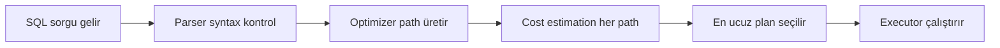
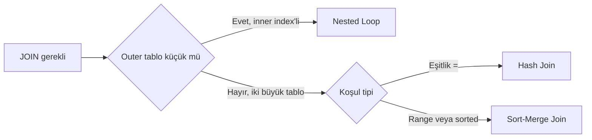
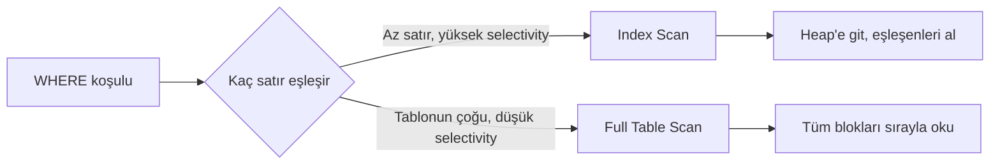
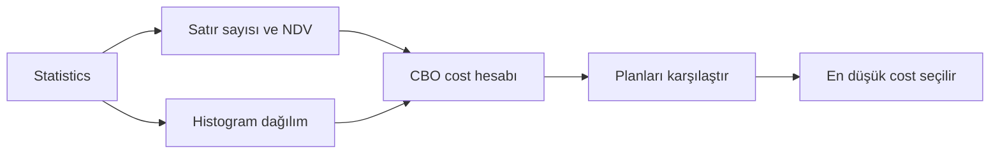

# Topic 4.2 — Execution Plan & Query Tuning

```admonish info title="Bu bölümde"
- Bir SQL sorgusunun DB tarafından nasıl çalıştırıldığını okumak: EXPLAIN (PostgreSQL) ve EXPLAIN PLAN / DBMS_XPLAN (Oracle)
- Üç join algoritması — Nested Loop, Hash Join, Sort-Merge — ve CBO'nun hangisini neden seçtiği
- Cost-Based Optimizer'ın yakıtı: statistics, NDV, histogram; bayat statistics'in yanlış plan üretmesi
- Index Scan vs Full Table Scan kararı, selectivity ve mülakat klasiği "full scan neden bazen iyidir"
- Query hints, bind variable peeking, plan stability ve banking'in altın anti-pattern listesi
```

## Hedef

Bir SQL query'nin DB tarafından **nasıl çalıştırıldığını** okuyabilmek. EXPLAIN PLAN (Oracle) ve EXPLAIN ANALYZE (PostgreSQL) çıktısını yorumlamak. Join algoritmalarını (nested loop, hash, sort-merge) tanımak. CBO'nun kararlarını sorgulamak ve gerektiğinde **hint** ile yönlendirmek. Banking'de yavaş bir query'i 5 dakikada teşhis edebilen developer olmak.

## Süre

Okuma: 2 saat • Kendini Sına: 30 dk • Pratik (opsiyonel): 3-4 saat • Toplam: ~2.5 saat (+ pratik)

## Önbilgi

- Topic 4.1 (Index Internals) bitti
- Temel SQL (SELECT, JOIN, WHERE, GROUP BY) rahat
- PostgreSQL veya Oracle ile pratik var

---

## Kavramlar

### 1. Execution plan nedir, neden okurum

Prod'da bir rapor sorgusu sabah 200 ms sürerken öğleden sonra 10 saniyeye çıkıyor — kod değişmedi, veri de aynı. Cevap execution plan'da saklı. Bir SQL sorgusu DB'ye verildiğinde arkada şu zincir çalışır:



**Execution plan**, optimizer'ın "bu sorguyu şu adımlarla çalıştıracağım" kararıdır. Plan'ı okumak, DB'nin neyi neden yaptığını anlamaktır.

Aynı sorgu için birden fazla yol vardır. `owner_id` ve `status` üzerinden filtreleyen bir sorguyu düşün:

```sql
SELECT * FROM accounts WHERE owner_id = '...' AND status = 'ACTIVE';
```

Plan A `owner_id` index'ini kullanır, sonra `status` filtreler → 100 ms. Plan B iki koşulu da full table scan ile tarar → 5 saniye. Optimizer yanlış seçim yaparsa sorgu yavaş kalır; plan'ı okumak senin işin.

### 2. PostgreSQL EXPLAIN — tahmini plan

En temel araç `EXPLAIN`: sorguyu **çalıştırmadan** optimizer'ın planını gösterir.

```sql
EXPLAIN SELECT * FROM accounts WHERE owner_id = '...';
```

```
Index Scan using idx_accounts_owner_id on accounts  (cost=0.42..8.44 rows=1 width=72)
  Index Cond: (owner_id = '...'::uuid)
```

- `Index Scan` — index kullanılıyor (iyi)
- `cost=0.42..8.44` — startup cost ve total cost (DB-internal birim; küçük iyi, büyük kötü)
- `rows=1` — tahmin: 1 satır dönecek
- `width=72` — her satır ~72 byte

### 3. EXPLAIN ANALYZE — gerçekten çalıştır + ölç

`EXPLAIN` sadece tahmin eder. Gerçekte ne olduğunu görmek için `EXPLAIN ANALYZE` sorguyu çalıştırır ve gerçek süreleri ölçer.

```sql
EXPLAIN ANALYZE SELECT * FROM accounts WHERE owner_id = '...';
```

```
Index Scan using idx_accounts_owner_id on accounts
  (cost=0.42..8.44 rows=1 width=72)
  (actual time=0.025..0.026 rows=1 loops=1)
  Index Cond: (owner_id = '...'::uuid)
Planning Time: 0.123 ms
Execution Time: 0.045 ms
```

`actual time` gerçek startup ve total süredir (ms), `rows=1 loops=1` gerçek satır sayısıdır. İşin sırrı karşılaştırmada: **estimated rows** (`rows=1`) ile **actual rows** uyuyor mu?

<mark>EXPLAIN sadece tahmin eder; EXPLAIN ANALYZE sorguyu gerçekten çalıştırıp ölçer.</mark> Buradaki sapma, teşhisin en güçlü sinyalidir:

```
Seq Scan on accounts  (cost=0.00..18.24 rows=100 width=72)
  (actual time=0.012..1234.567 rows=1000000 loops=1)
```

Cost 100 satır tahmin etti, gerçekte 1M satır geldi. Optimizer kör uçuyor demektir — statistics bayat, `ANALYZE` çalıştır.

```admonish warning title="EXPLAIN ANALYZE gerçekten çalıştırır"
`EXPLAIN ANALYZE` sorguyu fiilen icra eder. Bir `SELECT` için zararsız ama `INSERT / UPDATE / DELETE` sorgusunda **veriyi değiştirir**. Production'da yazma sorgusunu analiz edeceksen `BEGIN; EXPLAIN ANALYZE ...; ROLLBACK;` sarmalıyla çalıştır.
```

### 4. EXPLAIN options

`EXPLAIN` çıktısını zenginleştiren seçenekler var:

```sql
EXPLAIN (ANALYZE, BUFFERS, VERBOSE, FORMAT JSON) SELECT ...
```

- `ANALYZE` — gerçek çalıştır
- `BUFFERS` — buffer hit/miss (cache verimi)
- `VERBOSE` — kolonları detayla
- `FORMAT JSON|YAML|XML` — makine-okur yapısal output (test assertion'ları için ideal)

`BUFFERS` satırı disk mi cache mi okunduğunu söyler:

```
Buffers: shared hit=10 read=5
```

`hit` cache'ten geldi (ucuz), `read` disk'ten okundu (pahalı). Yüksek `read` = sorgu I/O-bound.

### 5. Oracle EXPLAIN PLAN

Oracle'da plan iki adımdır: önce plan tabloya yazılır, sonra `DBMS_XPLAN` ile okunur.

```sql
EXPLAIN PLAN FOR
SELECT * FROM accounts WHERE owner_id = '...';

SELECT * FROM TABLE(DBMS_XPLAN.DISPLAY);
```

```
--------------------------------------------------------------------------------
| Id  | Operation                   | Name              | Rows  | Cost  |
--------------------------------------------------------------------------------
|   0 | SELECT STATEMENT            |                   |     1 |     2 |
|*  1 |  INDEX RANGE SCAN           | IDX_ACC_OWNER_ID  |     1 |     2 |
--------------------------------------------------------------------------------
```

Plan bir **ağaçtır**: en içteki (en sağa girintili) operation önce çalışır, sonuç yukarı doğru akar. `AUTOTRACE` ile hem sorguyu çalıştırıp hem plan + stats görebilirsin:

```sql
SET AUTOTRACE ON
SELECT * FROM accounts WHERE owner_id = '...';
```

PostgreSQL'in `EXPLAIN ANALYZE`'ının Oracle karşılığı budur: gerçek çalıştırma artı gerçek satır sayıları.

### 6. Join algoritmaları

İki tabloyu birleştirmenin tek yolu yok; DB üç farklı algoritma arasından seçer. Hangisinin seçildiğini plan'da görmek, yavaş join'i teşhis etmenin kalbidir.

CBO seçimini şöyle yapar:



#### a) Nested Loop Join

Outer tablonun her satırı için inner tabloda eşleşme aranır:

```
for each row R in outer table:
    for each row S in inner table where condition:
        output (R, S)
```

**Nested Loop Join**, outer tablo küçük ve inner tablo index'li olduğunda parlar. Maliyeti O(outer × log(inner)) — outer küçükse hızlı. Banking'de account → owner join'i, hesap sayısı azsa idealdir.

```
Nested Loop  (cost=0.42..16.46 rows=1 width=144)
  ->  Index Scan using idx_accounts_owner_id on accounts a
        Index Cond: (owner_id = '...'::uuid)
  ->  Index Scan using owners_pkey on owners o
        Index Cond: (id = a.owner_id)
```

#### b) Hash Join

İki fazlı çalışır: önce inner tablodan hash table kurulur, sonra outer tablonun her satırı bu hash'te aranır:

```
1. Build phase: inner table'ın hash table'ını yap (memory)
2. Probe phase: outer table'ın her satırı için hash'e bak
```

**Hash Join** büyük tablolar için idealdir ama iki şart ister: yeterli memory (yoksa diske döker, yavaşlar) ve equi-join (`=` koşulu). Banking'de 1M transaction × 100k account join'i buraya oturur.

```
Hash Join  (cost=27.50..68.42 rows=1000 width=144)
  Hash Cond: (t.account_id = a.id)
  ->  Seq Scan on transactions t  (cost=...)
  ->  Hash  (cost=...)
        ->  Seq Scan on accounts a  (cost=...)
```

#### c) Sort-Merge Join

Her iki tablo join kolonuna göre sıralanır, sonra sıralı akışlar birleştirilir:

```
1. Sort both tables on join column
2. Merge sorted tables, output matches
```

**Sort-Merge Join** çok büyük tablolarda ve girdi zaten sıralıysa (index sayesinde) veya range join gerektiğinde tercih edilir. Memory açısından hash join'den daha nazik olabilir.

```
Merge Join  (cost=...)
  Merge Cond: (a.id = t.account_id)
  ->  Index Scan using accounts_pkey on accounts a
  ->  Sort
        ->  Seq Scan on transactions t
```

#### Banking için seçim

| Senaryo | Optimal Join |
|---|---|
| Küçük outer + büyük inner index | Nested Loop |
| İki büyük table, eşitlik koşulu | Hash Join |
| İki büyük table, range koşulu veya sorted | Sort-Merge |
| Outer tablonun çok küçük olduğu durumlar | Nested Loop |

CBO genelde doğru seçer **ama** statistics güncel değilse veya complex query'lerde yanılır — o zaman devreye sen girersin.

### 7. Index access methods

Plan'da bir index'in nasıl kullanıldığını gösteren birkaç erişim tipi var; hangisini gördüğün, sorgunun ne kadar iyi optimize edildiğini söyler.

**`Index Scan`:** Index üzerinden gidilir, eşleşen leaf'lerden table row'a (heap) atlanır. En sık göreceğin tip.

**`Index Only Scan` (PostgreSQL) / `INDEX FAST FULL SCAN` (Oracle):** Sorgu sadece index'teki kolonları istiyorsa heap'e hiç gidilmez — **covering index**. En hızlısı budur.

```sql
CREATE INDEX idx_acc_owner_curr ON accounts(owner_id, currency);

SELECT currency FROM accounts WHERE owner_id = '...';
-- Plan: Index Only Scan — heap'e gitmedi, hızlı
```

**`Bitmap Index Scan`:** Birden fazla index'ten OR/AND birleştirir.

```sql
SELECT * FROM transactions WHERE status = 'PENDING' OR source = 'BATCH';
```

**`Seq Scan` (PostgreSQL) / `TABLE ACCESS FULL` (Oracle):** Full table scan. Küçük tablolarda sorun değil, büyüklerde ölümcül olabilir — ama her zaman değil; sıradaki konu bu nüansı açıyor.

### 8. Full Table Scan bazen neden iyidir — selectivity

"Full scan = kötü" refleksi yanlıştır. Kararın anahtarı **selectivity**: sorgunun tablonun ne kadarını döndürdüğü.



Bir index scan her eşleşme için heap'e ayrı bir random I/O yapar. Sorgu tablonun %90'ını döndürüyorsa, milyonlarca random atlama yerine tabloyu baştan sona **sequential** okumak (full scan) daha ucuzdur. CBO bunu selectivity'e bakarak hesaplar — bu yüzden `status = 'ACTIVE'` gibi düşük-selective bir filtrede full scan görmen normaldir. Küçük tablolarda da index kurmanın maliyeti okumaktan pahalı olduğu için full scan tercih edilir.

### 9. CBO ve statistics

**Cost-Based Optimizer (CBO)** her plan için bir maliyet hesaplar ve en ucuzunu seçer. Bu hesabın yakıtı **statistics**'tir:

- Tablo satır sayısı
- Her kolonun unique value sayısı (NDV)
- Histogram (kolon değer dağılımı)
- Index istatistiği



Statistics'i toplamak DBA'nın (veya cron'un) işidir:

```sql
-- PostgreSQL
ANALYZE accounts;
ANALYZE accounts(owner_id, status);   -- spesifik kolon

-- Oracle
EXEC DBMS_STATS.GATHER_TABLE_STATS('SCHEMA', 'ACCOUNTS');
EXEC DBMS_STATS.GATHER_TABLE_STATS('SCHEMA', 'ACCOUNTS', cascade => TRUE);  -- + index stats
```

Banking pratiği: production'da her gece EOD sonrası `ANALYZE` çalıştır. Statistics bayatsa CBO kör uçar.

```admonish warning title="Bayat statistics = yanlış plan"
Gece 1M yeni transaction yüklendi ama `ANALYZE` çalışmadı. CBO tabloyu hâlâ küçük sanıyor, nested loop seçiyor — ve her satır için index'e dalarken sorgu saatlerce sürüyor. Sabah çalışan sorgunun öğleden sonra çökmesinin bir numaralı sebebi budur.
```

### 10. Histograms

Statistics tek başına yetmez; kolonun değer **dağılımı** eşit değilse (skewed) CBO yine yanılır. `status` kolonunu düşün:

```
status = 'CLOSED' → %1
status = 'ACTIVE' → %95
status = 'FROZEN' → %4
```

**Histogram** olmadan CBO "eşit dağılım" varsayar — 3 değer varsa her biri %33 sanır. `status = 'ACTIVE'` için %33 (full scan mantıklı) yerine %33'lük yanlış tahminle index scan seçebilir; `status = 'CLOSED'` için ise tam tersi. Histogram gerçek dağılımı öğretir.

```sql
-- PostgreSQL — ANALYZE otomatik histogram üretir
ANALYZE accounts;

-- Dağılımı incele
SELECT * FROM pg_stats WHERE tablename = 'accounts' AND attname = 'status';
```

```sql
-- Oracle — histogram explicit
EXEC DBMS_STATS.GATHER_TABLE_STATS('SCHEMA', 'ACCOUNTS',
     method_opt => 'FOR COLUMNS SIZE 254 status');
```

### 11. Bind variable peeking & cursor sharing (Oracle)

Aynı sorgu farklı parametrelerle çağrıldığında ne olur? Oracle bir tuzak barındırır:

```sql
SELECT * FROM accounts WHERE owner_id = :owner_id;
```

Oracle ilk çağrıda `:owner_id`'nin **gerçek değerini peek eder**, ona göre plana karar verir ve planı cache'ler. Sonraki çağrılar aynı planı kullanır.

Tuzak şurada: ilk çağrıda value nadir bir owner (1 satır beklenir) → nested loop seçilir. Sonraki çağrıda value çok yaygın bir owner (1M satır) → aynı nested loop plan **felaket** yavaş çalışır.

Çözüm: Oracle 11g+ **Adaptive Cursor Sharing** ile runtime'da farklı plan seçebilir; modern Oracle'da genelde otomatik. PostgreSQL'de benzer durum prepared statement'lerde olur; `plan_cache_mode = force_custom_plan` veya `force_generic_plan` ile davranışı ayarlarsın.

### 12. Query hints

CBO'yu **zorla** yönlendirmek için hint kullanılır — ama en son çare olarak.

#### Oracle

```sql
SELECT /*+ INDEX(a idx_acc_owner_id) */ *
FROM accounts a
WHERE owner_id = '...';
```

```sql
SELECT /*+ USE_HASH(a t) */ ...
FROM accounts a JOIN transactions t ON a.id = t.account_id;
```

```sql
SELECT /*+ NO_INDEX(a) */ ...   -- index kullanma, full scan yap
```

#### PostgreSQL

PostgreSQL'de resmi hint **yoktur**. Alternatifler: `enable_seqscan = off` (session level, kaba) veya `pg_hint_plan` extension (Oracle benzeri).

<mark>Hint son çaredir; önce statistics güncelle, query'i rewrite et, gerekirse index ekle.</mark> Hint kalıcı bir bağımlılık yaratır: DB versiyonu değişince veya veri dağılımı kayınca patlar. Kullanıyorsan mutlaka "neden" açıklayan bir comment bırak.

### 13. Window function execution

Reporting'de sık gördüğün window function'lar plan'da ayrı bir operator olarak belirir:

```sql
SELECT id, balance,
       SUM(balance) OVER (PARTITION BY owner_id ORDER BY opened_at) AS running_balance
FROM accounts;
```

```
WindowAgg  (cost=...)
  Sort Key: owner_id, opened_at
  ->  Sort
        ->  Seq Scan on accounts
```

Window function bir `WindowAgg` üretir ve **sort gerektirir** — uygun sıralı index yoksa açık bir `Sort` adımı görürsün. Banking'de transaction history / running balance raporlarında yaygındır; detayı Topic 4.3'te.

### 14. Banking örnekleri — yavaş query analizi

#### Vaka 1: Transaction history yavaş

```sql
SELECT * FROM transactions
WHERE account_id = '...' AND occurred_at > '2024-01-01'
ORDER BY occurred_at DESC LIMIT 50;
```

Yavaş plan full scan + sort yapar — 10M satır için katastrof:

```
Sort  (cost=10000)
  ->  Seq Scan on transactions
        Filter: account_id = '...' AND occurred_at > '2024-01-01'
```

Çözüm, `ORDER BY` yönünü de içeren composite index:

```sql
CREATE INDEX idx_tx_acc_time ON transactions(account_id, occurred_at DESC);
```

Yeni plan index'i sıralı okur, `LIMIT 50` ilk 50 satırda durur:

```
Limit (cost=0.42..50.42 rows=50)
  ->  Index Scan using idx_tx_acc_time on transactions
        Index Cond: account_id = '...' AND occurred_at > '2024-01-01'
```

Index zaten DESC sıralı olduğu için `LIMIT` early termination yapar — **1000x hızlanma**.

#### Vaka 2: Owner-balance reporting yavaş

```sql
SELECT o.name, SUM(a.balance_amount) total
FROM owners o
JOIN accounts a ON a.owner_id = o.id
WHERE a.status = 'ACTIVE'
GROUP BY o.id, o.name;
```

Yavaş plan accounts'u full tarar; %90'ı ACTIVE ise filtre yardımcı olmaz:

```
HashAggregate (cost=...)
  ->  Hash Join
        ->  Seq Scan on owners
        ->  Seq Scan on accounts
              Filter: status = 'ACTIVE'
```

Üç çözüm yolu var: (1) `status` skewed ise ANALYZE + histogram ile CBO'yu doğru karara ittir, (2) `(status, owner_id)` composite index ile sadece ACTIVE'leri oku, (3) çok ağırsa materialized view ile pre-aggregate (Topic 4.5).

### 15. Plan stability — production tuzakları

Production'da plan **aniden** değişebilir ve dün hızlı olan sorgu bugün çöker. Sebepler: statistics değişti (ANALYZE çalıştı), veri dağılımı kaydı, index eklendi/silindi veya DB versiyonu upgrade edildi.

Önlemler: kritik sorguların planını monitor et, plan değişimini alert'le yakala. Oracle'da SQL Plan Baseline ile planı sabitleyebilir, PostgreSQL'de `pg_stat_statements` ile sorgu davranışını izleyebilirsin.

```admonish tip title="Composite index kolon sırası"
Composite index'te selektivitesi yüksek kolonu (eşitlik koşulu olanı) başa, range/sıralama kolonunu sona koy. `WHERE account_id = ? AND occurred_at > ?` için doğru sıra `(account_id, occurred_at)` — önce eşitlikle daralt, sonra range'i sıralı oku. Sırayı ters kurarsan index yarı yarıya işe yaramaz.
```

### 16. Banking anti-pattern'leri

Mülakatta "bu sorgu neden yavaş" sorusunun cephaneliği burası. Altı klasik:

**Anti-pattern 1: `SELECT *`** — Tüm kolonları çekmek daha fazla I/O ve network demek; covering index avantajını da kaybedersin. Sadece gerekli kolonları yaz.

**Anti-pattern 2: Function on indexed column**

```sql
SELECT * FROM accounts WHERE UPPER(currency) = 'TRY';
-- ❌ idx_accounts_currency kullanılmaz
```

<mark>Indexli bir kolonu fonksiyona sararsan index devre dışı kalır.</mark> B-tree ham kolon değerini saklar, `UPPER(currency)` değerini değil. Çözüm ya function-based index ya da sorguyu düzeltmek:

```sql
SELECT * FROM accounts WHERE currency = 'TRY';   -- ✓ doğrudan index
```

**Anti-pattern 3: `OR` ile farklı kolonlar** — İki ayrı index olsa bile `OR` ikisinden birden yararlanmayı zorlaştırır. `UNION` çoğu zaman daha iyi:

```sql
SELECT * FROM accounts WHERE owner_id = '...'
UNION
SELECT * FROM accounts WHERE customer_reference = '...';
```

**Anti-pattern 4: Implicit type cast** — `WHERE id = 123` ama `id` UUID kolonu ise implicit cast index'i devre dışı bırakabilir. Doğru tiple sorgula.

**Anti-pattern 5: `LIKE '%xyz'`** — Wildcard başta olunca B-tree işe yaramaz. Trigram index (`pg_trgm`) veya full-text search gerekir.

**Anti-pattern 6: Statistics güncellenmiyor** — EOD sonrası ANALYZE çalışmıyorsa CBO yanlış karar verir. Düzenli cron job şart.

---

## Önemli olabilecek araştırma kaynakları

- "SQL Performance Explained" (Markus Winand) — kısa, paha biçilmez
- "Use The Index, Luke" (Markus Winand — ücretsiz online kitap)
- PostgreSQL official docs — EXPLAIN section
- Oracle Database Performance Tuning Guide
- "Troubleshooting Oracle Performance" (Christian Antognini)
- Tom Kyte (asktom.oracle.com) — Oracle tuning altın kaynak
- "PostgreSQL High Performance" (Gregory Smith)

---

## Kendini Sına

Aşağıdaki soruları önce **cevaba bakmadan** kendi cümlelerinle yanıtlamayı dene — hepsi banking mülakatlarında karşına çıkabilecek tarzda. Takıldığın soruda ilgili Kavramlar başlığına dön, sonra tekrar dene.

**S1. `EXPLAIN` ile `EXPLAIN ANALYZE` arasındaki fark nedir? `estimated rows` ile `actual rows` arasındaki sapma sana ne söyler?**

<details>
<summary>Cevabı göster</summary>

`EXPLAIN` sorguyu çalıştırmadan optimizer'ın seçtiği planı ve **tahmini** maliyet/satır sayısını gösterir. `EXPLAIN ANALYZE` ise sorguyu **fiilen çalıştırır** ve gerçek süreleri (`actual time`), gerçek satır sayısını (`actual rows`) ve loop sayısını ölçer.

Kritik teşhis, iki değerin karşılaştırılmasıdır. `rows=100` tahmin edilip `actual rows=1000000` geliyorsa optimizer kör uçuyor demektir: statistics bayat, `ANALYZE` çalıştırmalısın. Bu sapma nested loop yerine hash join gerektiren bir durumu ıskalamanın ve saatlerce süren sorguların bir numaralı sebebidir. Not: `EXPLAIN ANALYZE` yazma sorgularını da çalıştırır, o yüzden `BEGIN ... ROLLBACK` ile sar.

</details>

**S2. "Full table scan her zaman kötüdür" doğru mu? Full scan'in index scan'den daha iyi olduğu durumu selectivity ile açıkla.**

<details>
<summary>Cevabı göster</summary>

Yanlış. Karar **selectivity**'e, yani sorgunun tablonun ne kadarını döndürdüğüne bağlıdır. Index scan her eşleşen satır için heap'e ayrı bir random I/O yapar; sorgu tablonun büyük bir kısmını (örneğin %90'ı ACTIVE olan `status = 'ACTIVE'`) döndürüyorsa, milyonlarca random atlama yerine tabloyu baştan sona **sequential** okumak çok daha ucuzdur.

Bu yüzden düşük-selective filtrelerde ve küçük tablolarda CBO bilinçli olarak full scan seçer — index kurmanın maliyeti okumaktan pahalıdır. Full scan'i sadece yüksek-selective bir sorguda (birkaç satır dönerken) görüyorsan endişelen; o zaman muhtemelen eksik index veya bayat statistics vardır.

</details>

**S3. Nested Loop join ile Hash join ne zaman seçilir? Banking'de birer örnek ver.**

<details>
<summary>Cevabı göster</summary>

Nested Loop, **outer tablo küçük ve inner tablo index'li** olduğunda idealdir: outer'ın her satırı için inner'da index üzerinden hızlı arama yapılır, maliyet O(outer × log(inner)). Banking örneği: tek bir owner'ın hesaplarını çekip owner tablosuna join — outer küçük, inner PK index'li.

Hash join **iki büyük tablo eşitlik koşuluyla (`=`) join edildiğinde** seçilir: inner'dan memory'de hash table kurulur, outer o hash'te aranır. Yeterli memory ve equi-join şarttır. Banking örneği: 1M transaction × 100k account join'i. Sort-merge ise çok büyük tablolarda, girdi zaten sıralıysa veya range join gerektiğinde devreye girer.

</details>

**S4. Bayat (stale) statistics CBO'yu nasıl yanlış plana sürükler? Histogram bu resimde nerede durur?**

<details>
<summary>Cevabı göster</summary>

CBO maliyeti statistics'e (satır sayısı, NDV, dağılım) bakarak hesaplar. Statistics bayatsa — örneğin gece 1M satır yüklendi ama `ANALYZE` çalışmadı — CBO tabloyu hâlâ küçük sanır, nested loop seçer ve her satır için index'e dalarken sorgu saatlerce sürer. "Sabah hızlı, öğleden sonra çöken sorgu" tablosunun bir numaralı sebebi budur.

Histogram, statistics'in bir adım incesidir: kolonun değer **dağılımını** öğretir. Statistics güncel olsa bile, kolon skewed ise (örneğin %95 ACTIVE, %1 CLOSED) CBO histogram yoksa "eşit dağılım" varsayar ve her değere aynı satır sayısını atar — yanlış selectivity, yanlış plan. Histogram gerçek yüzdeleri verir, böylece CBO ACTIVE için full scan, CLOSED için index scan gibi doğru kararlar verir.

</details>

**S5. Indexli bir kolonu bir fonksiyona (`UPPER(currency) = 'TRY'`) sardığında index neden kullanılmaz? İki çözüm yolu nedir?**

<details>
<summary>Cevabı göster</summary>

B-tree index kolonun **ham** değerini saklar, üzerine uygulanan fonksiyonun sonucunu değil. `UPPER(currency)` her satırda runtime'da hesaplanan yeni bir ifadedir; index'te `UPPER(...)` değerleri bulunmadığı için optimizer index'i kullanamaz ve full scan'e düşer. Aynı sorun implicit type cast'te de görülür — `id = 123` UUID kolonda cast tetikler.

İki çözüm: (1) sorguyu değiştir, fonksiyonu kaldır — `WHERE currency = 'TRY'` doğrudan index'i kullanır; (2) fonksiyonu kaldıramıyorsan **function-based index** kur (`CREATE INDEX ... ON accounts(UPPER(currency))`), böylece index tam da aranan ifadeyi saklar.

</details>

**S6. Composite index'te kolon sırasını neye göre belirlersin? `WHERE account_id = ? AND occurred_at > ? ORDER BY occurred_at DESC` için doğru sıra nedir?**

<details>
<summary>Cevabı göster</summary>

Eşitlik koşulu olan, yüksek-selective kolonu başa; range veya sıralama kolonunu sona koyarsın. Index önce eşitlikle veriyi daraltır, sonra kalan aralığı zaten sıralı olarak okur. Bu sorguda doğru sıra `(account_id, occurred_at)` — hatta `ORDER BY occurred_at DESC` için `(account_id, occurred_at DESC)`.

Bu sırayla index önce tek account'a iner, sonra `occurred_at` üzerinden hem range filtresini hem sıralamayı bedavaya çözer; `LIMIT 50` early termination yaparak ilk 50 satırda durur. Sırayı ters kurarsan (`occurred_at, account_id`) index eşitlikle daralamaz ve yarı yarıya işe yaramaz — tam da 1000x hızlanmayı kaybettiğin nokta.

</details>

**S7. Query hint ne zaman kullanılır ve neden "son çare" sayılır? Kullanmadan önce hangi adımları denersin?**

<details>
<summary>Cevabı göster</summary>

Hint CBO'yu belirli bir plana (belirli bir index, join algoritması, full scan) zorlar. Son çare sayılmasının sebebi kalıcı bir bağımlılık yaratmasıdır: DB versiyonu değiştiğinde, veri dağılımı kaydığında veya tablo büyüdüğünde bugün doğru olan hint yarın CBO'yu daha iyi bir plandan alıkoyar ve sorgu patlar.

Hint'ten önce sırasıyla: (1) statistics'i güncelle (`ANALYZE` / `DBMS_STATS`, gerekiyorsa histogram) — vakaların çoğu buradadır; (2) sorguyu rewrite et (fonksiyonu kaldır, `OR`'u `UNION`'a çevir, `SELECT *`'ı daralt); (3) doğru composite index'i ekle. Bunların hiçbiri çözmezse ve kanıtın varsa hint kullan — ama mutlaka "neden" açıklayan bir comment bırak. PostgreSQL'de zaten resmi hint yok, `pg_hint_plan` extension gerekir.

</details>

---

## Tamamlama kriterleri

- [ ] `EXPLAIN` ile `EXPLAIN ANALYZE` arasındaki farkı biliyorum
- [ ] Plan output'unu okuyup Index Scan vs Seq Scan / Full Scan ayırt edebiliyorum
- [ ] `estimated rows` vs `actual rows` karşılaştırmasıyla bayat statistics'i teşhis edebiliyorum
- [ ] Nested loop / hash join / sort-merge algoritmalarını ve seçim kriterlerini tanıyorum
- [ ] Full table scan'in selectivity düşükken neden iyi olduğunu açıklayabiliyorum
- [ ] Banking yavaş query'i composite index ekleyerek 1000x hızlandırma mantığını biliyorum
- [ ] Function on indexed column tuzağını ve iki çözümünü biliyorum
- [ ] Histogram'ın skewed kolonlarda neden gerektiğini biliyorum
- [ ] Query hint'in neden son çare olduğunu ve öncesinde ne denendiğini biliyorum
- [ ] Plan stability / monitoring kavramına aşinayım

---

## Defter notları

1. "`EXPLAIN ANALYZE`'ın `actual rows` vs `estimated rows` farkı bana ne söyler: ____."
2. "Nested loop, hash join, sort-merge — banking için karar matrisim: ____."
3. "Full table scan hangi durumda index scan'den iyidir (selectivity): ____."
4. "`ANALYZE` / `DBMS_STATS.GATHER` neden gerekli (CBO için yakıt): ____."
5. "Histogram skewed kolonda neden gerekli: ____."
6. "`WHERE UPPER(col) = 'X'` neden index'i kullanmaz, iki çözüm: ____."
7. "Composite index'te kolon sırası seçimi (selectivity + range): ____."
8. "Bind variable peeking tuzağı ve çözümü (Adaptive Cursor Sharing): ____."
9. "Hint kullanımı için 'son çare' demek ne demek, öncesinde ne denenir: ____."
10. "PostgreSQL `EXPLAIN` vs Oracle `DBMS_XPLAN` farkı: ____."

```admonish success title="Bölüm Özeti"
- Execution plan optimizer'ın kararıdır; `EXPLAIN` tahmin eder, `EXPLAIN ANALYZE` gerçekten çalıştırıp ölçer — teşhisin kalbi `estimated rows` ile `actual rows` sapmasıdır
- Üç join algoritması: Nested Loop (küçük outer + index'li inner), Hash Join (iki büyük tablo + equi-join), Sort-Merge (çok büyük veya sıralı/range girdi)
- Full table scan her zaman kötü değildir — düşük selectivity ve küçük tablolarda sequential okuma random index I/O'sundan ucuzdur
- CBO'nun yakıtı statistics'tir; bayat statistics ve eksik histogram, skewed kolonlarda yanlış plan üretir — EOD sonrası düzenli `ANALYZE` şart
- Yavaş query reçetesi: doğru sıralı composite index (`account_id, occurred_at`) + `LIMIT` early termination ile 1000x hızlanma
- Hint son çaredir; önce statistics güncelle, query rewrite et, index ekle. Anti-pattern'lerden kaçın: `SELECT *`, function on column, `OR`, implicit cast, `LIKE '%x'`
```

---

## Pratik yapmak istersen

Kavramları koda dökmek istersen aşağıdaki iki ek hazır: test yazma rehberi plan analizi, timing assertion ve stats etkisi için örnek testler içerir; Claude-verify prompt'u ile yazdığın tuning çalışmasını banking-grade perspektiften denetletebilirsin.

<details>
<summary>Test yazma rehberi</summary>

Süre: ~45 dk. Amaç: plan çıktısını programatik olarak assert etmek ve tuning'in ölçülebilir olduğunu kanıtlamak. `EXPLAIN (FORMAT JSON)` çıktısını Java'dan okuyup içinde Index Scan / Seq Scan aradığında, plan davranışını CI'da kilitlemiş olursun.

### Test 4.2.1 — Plan analysis test

```java
@Test
@Sql("/test-data/100k-accounts.sql")
void ownerIdQueryShouldUseIndex() {
    List<Map<String, Object>> plan = jdbcTemplate.queryForList(
        "EXPLAIN (FORMAT JSON) SELECT * FROM accounts WHERE owner_id = ?",
        UUID.randomUUID()
    );

    String planJson = plan.get(0).get("QUERY PLAN").toString();
    assertThat(planJson).contains("Index Scan");
    assertThat(planJson).doesNotContain("Seq Scan");
}

@Test
void unindexedQueryShouldFallBackToSeqScan() {
    // customer_reference üzerinde index yok
    List<Map<String, Object>> plan = jdbcTemplate.queryForList(
        "EXPLAIN (FORMAT JSON) SELECT * FROM accounts WHERE customer_reference = ?",
        "TEST-001"
    );

    String planJson = plan.get(0).get("QUERY PLAN").toString();
    assertThat(planJson).contains("Seq Scan");
    // Index gerektiğini CI'da zorlamak için: assertThat(planJson).contains("Index Scan");
}
```

### Test 4.2.2 — Query timing assertion

```java
@Test
@Sql("/test-data/1m-transactions.sql")
void transactionHistoryQueryShouldRunUnder100ms() {
    UUID accountId = knownAccountId();
    long start = System.currentTimeMillis();

    List<Transaction> result = jdbcTemplate.query("""
        SELECT * FROM transactions
        WHERE account_id = ? AND occurred_at > ?
        ORDER BY occurred_at DESC LIMIT 50
        """, txRowMapper(),
        accountId, Instant.now().minus(30, ChronoUnit.DAYS));

    long elapsed = System.currentTimeMillis() - start;
    assertThat(elapsed).isLessThan(100L);
}
```

Banking pratiği: performance regression testlerini CI'da tut. Plan aniden değişip (bayat statistics, silinen index) timing eşiği patlarsa, sorunu production'dan önce yakalarsın.

### Bonus — Stats güncelleme deneyi

`1M` transaction insert et, `ANALYZE` çalıştırmadan `EXPLAIN ANALYZE` al ve planı not et. Sonra `ANALYZE transactions;` çalıştır, aynı sorguyu tekrar `EXPLAIN ANALYZE` ile ölç. Nested loop → hash join gibi bir plan değişimi ve `estimated rows`'un gerçeğe yaklaşmasını gözlemle — bayat statistics'in etkisini canlı görmüş olursun.

### Bonus — Function on column tuzağı

`CREATE INDEX idx_currency ON accounts(currency);` kur, sonra iki sorguyu `EXPLAIN ANALYZE` ile karşılaştır: `WHERE UPPER(currency) = 'TRY'` (index kullanılmaz, Seq Scan) ve `WHERE currency = 'TRY'` (Index Scan). İki planı yan yana koyup farkı defterine yaz.

</details>

<details>
<summary>Claude-verify prompt</summary>

Süre: ~15 dk. Aşağıdaki prompt'u yazdığın tuning çalışmasıyla (sorgular, planlar, index kararları) birlikte Claude'a ver; her maddeyi PASS / FAIL / EKSIK olarak işaretlemesini iste. Tamamlanmış sayılman için 8 başlığın en az 6'sında PASS almış olmalısın.

> SQL execution plan ve query tuning çalışmamı banking-grade kriterlere göre değerlendir. Sadece eksikleri ve yanlışları işaretle, kod yazma:
>
> 1. EXPLAIN kullanımı: `EXPLAIN ANALYZE` (gerçek timing) mı kullanılmış sadece `EXPLAIN` değil? `BUFFERS` ile cache hit/miss görülmüş mü? `VERBOSE` ile detaylı output incelenmiş mi?
>
> 2. Plan analizi: Index Scan vs Seq Scan / Full Scan ayrımı yapılıyor mu? `estimated rows` vs `actual rows` karşılaştırılmış mı (stats güncelliği)? Cost yorumlama bilinçli mi?
>
> 3. Join algorithm: Nested Loop, Hash Join, Sort-Merge ayrımları biliniyor mu? Banking senaryosunda doğru algoritmanın seçildiği plan'da doğrulanıyor mu?
>
> 4. Statistics: `ANALYZE` düzenli çalıştırılıyor mu (EOD cron)? Histogram gereken skewed kolonlarda var mı? `pg_stats` / `DBA_TAB_COL_STATISTICS` ile sorgulanıyor mu?
>
> 5. Hints: Production'da gereksiz hint var mı (olmamalı, son çare)? Hint kullanılıyorsa neden açıklayan bir comment var mı?
>
> 6. Banking yavaş query analizi: `SELECT * FROM transactions ...` tipi yavaş query optimize edilmiş mi? Composite index doğru kolon sırasıyla mı (selectivity yüksek + eşitlik önce)? `LIMIT` + `ORDER BY` ile early termination yapılıyor mu?
>
> 7. Anti-pattern'ler: `SELECT *`, function on indexed column, `OR` ile farklı kolonlar (UNION'a uygunsa), `LIKE '%xxx'`, implicit type cast — bunlardan hangileri var?
>
> 8. Plan stability: Production'da plan değişimi monitoring var mı? Kritik query'lerin planları snapshot olarak saklanıyor mu?
>
> Her madde için PASS / FAIL / EKSIK işaretle, kanıt göster, kod yazma.

</details>
