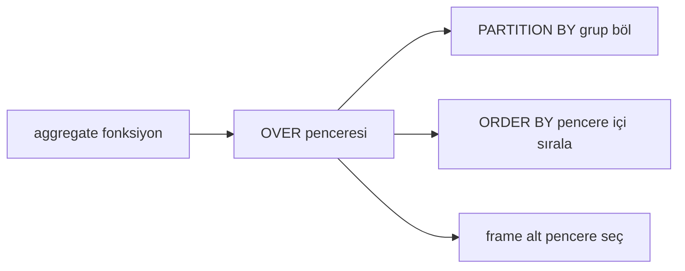
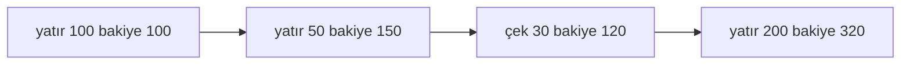
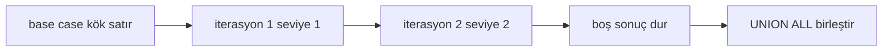
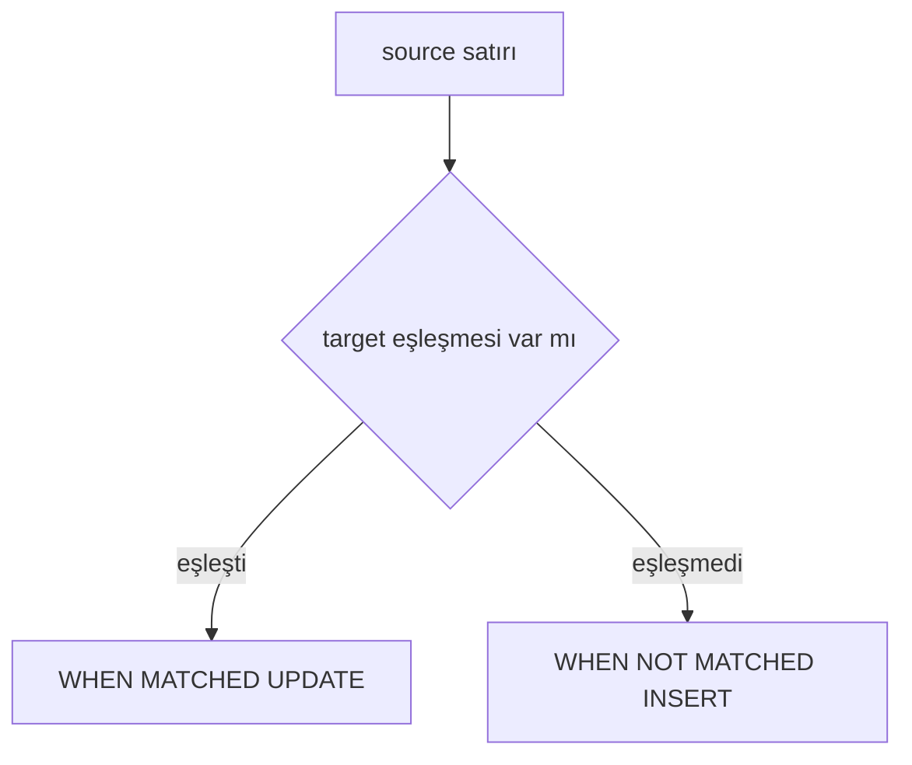

# Topic 4.3 — Window Functions & Advanced SQL

```admonish info title="Bu bölümde"
- Window function'ın GROUP BY'dan farkı: satır kaybetmeden aggregate — PARTITION BY, ORDER BY, frame anatomisi
- Sıralama üçlüsü ROW_NUMBER vs RANK vs DENSE_RANK ve temporal analiz için LEAD / LAG
- Banking'in killer app'i: window function ile self-join'suz running balance
- ROWS vs RANGE frame farkı ve mülakatın favori tuzağı LAST_VALUE default frame
- CTE, recursive CTE (şube hiyerarşisi), Oracle CONNECT BY çevirisi ve MERGE ile atomik upsert
```

## Hedef

SQL'in en güçlü ama az kullanılan özelliklerini banking örnekleriyle öğrenmek: **window functions** (ROW_NUMBER, RANK, LEAD, LAG, NTILE), **CTE** (Common Table Expression), **recursive CTE**, **MERGE** (upsert) ve Oracle hierarchical query (`CONNECT BY`). Amaç ezber değil sebep-sonuç: reporting'de aggregate ile yapılamayan ama window function ile şık çözülen senaryoları — running balance, top-N, day-over-day, quartile segmentation, şube hiyerarşisi — kavramak.

## Süre

Okuma: 1.5 saat • Kendini Sına: 30 dk • Pratik (opsiyonel): 2-3 saat • Toplam: ~2 saat (+ pratik)

## Önbilgi

- Topic 4.1-4.2 bitti
- Temel `GROUP BY` ve aggregate function'lar (SUM, AVG, COUNT) rahat
- JOIN tipleri biliniyor

---

## Kavramlar

### 1. Window function nedir, neden GROUP BY yetmiyor

Hesap ekstresini düşün: her satırın yanında sahibinin **toplam** bakiyesini de görmek istersin. GROUP BY bunu tek sorguda veremez — işte window function tam bu boşluğu doldurur.

**GROUP BY** satırları gruplar, her grup için tek agregat satır döner; detay kaybolur.

```sql
SELECT owner_id, SUM(balance_amount) FROM accounts GROUP BY owner_id;
-- owner_id başına tek satır, hesapların kendisi görünmez
```

**Window function** aynı agregatı hesaplar ama **her satır yerinde kalır** — her satır kendi grubunun agregat değerini taşır.

```sql
SELECT
    id, owner_id, balance_amount,
    SUM(balance_amount) OVER (PARTITION BY owner_id) AS owner_total
FROM accounts;
-- Her hesap satırı + sahibinin toplam bakiyesi, aynı sorguda
```

Tuzak: "her satır + agregat" isteyip GROUP BY'a sarılırsan kendini self-join veya subquery yığınında bulursun. Bu ihtiyaç geldiğinde refleksin `OVER (...)` olsun.

### 2. OVER clause — pencereyi tanımla

Window function'ın tüm gücü `OVER` parantezinin içindeki üç parçadan gelir; anatomiyi bir kez oturt, gerisi bunun türevi.



```sql
func() OVER (
    PARTITION BY col1, col2     -- pencere grupları, opsiyonel
    ORDER BY col3 DESC          -- pencere içi sıralama, opsiyonel
    ROWS BETWEEN ... AND ...    -- frame, opsiyonel
)
```

- **PARTITION BY** window'u her grup için bağımsız hesaplar — GROUP BY gibi ama satır kaybetmez.
- **ORDER BY** pencere içi sıralama — LEAD/LAG ve running sum için kritik.
- **frame** (ROWS/RANGE) pencere içinde bir alt-pencere seçer. ORDER BY varsa default frame `UNBOUNDED PRECEDING AND CURRENT ROW`'dur — bu default ileride başını ağrıtacak, aklında kalsın.

### 3. ROW_NUMBER — benzersiz sıra numarası

En sık kullanılan window function budur: her partition içinde satırlara 1, 2, 3, ... verir. **ROW_NUMBER** eşitlikleri de ayırır (tie-breaking), yani sıra her zaman unique'tir.

```sql
SELECT
    id, owner_id, balance_amount,
    ROW_NUMBER() OVER (PARTITION BY owner_id ORDER BY balance_amount DESC) AS rn
FROM accounts;
-- Her owner için hesaplar bakiyeye göre sıralı, en zengini rn=1
```

Klasik banking pattern'i "top N per group" bunun üstüne kurulur — her owner'ın en yüksek 3 hesabı:

```sql
WITH ranked AS (
    SELECT a.*,
           ROW_NUMBER() OVER (PARTITION BY owner_id ORDER BY balance_amount DESC) rn
    FROM accounts a
)
SELECT * FROM ranked WHERE rn <= 3;
```

Tuzak: ROW_NUMBER'ı `WHERE rn <= 3` ile aynı SELECT'te kullanamazsın — window function `WHERE`'den sonra hesaplanır. O yüzden CTE veya subquery'ye sarıp dışarıdan filtrelersin.

### 4. RANK ve DENSE_RANK — eşitlikli sıralama

Eşit değerler olduğunda "aynı sırada olsunlar" istersin; ROW_NUMBER bunu yapamaz, **RANK** ve **DENSE_RANK** yapar. Farkları eşitlikten sonraki sırada ortaya çıkar.

```sql
SELECT
    name, score,
    RANK()       OVER (ORDER BY score DESC) AS r,
    DENSE_RANK() OVER (ORDER BY score DESC) AS dr,
    ROW_NUMBER() OVER (ORDER BY score DESC) AS rn
FROM scoreboard;
```

| name | score | r | dr | rn |
|---|---|---|---|---|
| A | 100 | 1 | 1 | 1 |
| B | 100 | 1 | 1 | 2 |
| C | 90  | 3 | 2 | 3 |
| D | 80  | 4 | 3 | 4 |

- **RANK**: eşitlik aynı sıra, sonraki atlanır (1, 1, 3, 4)
- **DENSE_RANK**: eşitlik aynı sıra, sonraki atlanmaz (1, 1, 2, 3)
- **ROW_NUMBER**: tüm sıralar unique (1, 2, 3, 4)

Banking pratiği: aynı bakiyeli müşteriler için "fair ranking" istiyorsan (2. sırayı boş bırakmadan) DENSE_RANK; leaderboard'ta gerçek sıra atlaması istiyorsan RANK.

### 5. LEAD ve LAG — bir önceki / sonraki satır

Temporal analizin kalbi bu ikilidir: **LAG** aynı pencerede bir önceki satırın değerini, **LEAD** bir sonrakini getirir. "Bu işlemle bir öncekinin farkı" tipi sorular bununla çözülür.

```sql
SELECT
    id, occurred_at, amount,
    LAG(amount)  OVER (PARTITION BY account_id ORDER BY occurred_at) AS prev_amount,
    LEAD(amount) OVER (PARTITION BY account_id ORDER BY occurred_at) AS next_amount
FROM transactions;
```

Ama en güçlü kullanım running balance: `SUM() OVER (ORDER BY ...)` her transaction'ın o ana kadarki kümülatif bakiyesini verir.

```sql
SELECT
    occurred_at, amount,
    SUM(amount) OVER (PARTITION BY account_id ORDER BY occurred_at) AS running_balance
FROM transactions;
```

| occurred_at | amount | running_balance |
|---|---|---|
| 2025-01-01 | +100 | 100 |
| 2025-01-02 | +50  | 150 |
| 2025-01-03 | -30  | 120 |
| 2025-01-04 | +200 | 320 |

Bu tabloyu satır satır biriktirmeyi düşün — her satır önceki toplamın üstüne kendi tutarını ekler:



<mark>Running balance için asla correlated subquery veya self-join kullanma — `SUM() OVER (ORDER BY ...)` aynı işi O(n²) yerine tek geçişte, O(n) yapar.</mark>

### 6. NTILE — eşit gruplara böl

Müşterileri "en zengin %25, sonraki %25 ..." diye segmentlere ayırmak istersin; **NTILE(n)** tüm satırları n eşit kovaya böler ve her satıra kova numarasını verir.

```sql
SELECT
    id, balance_amount,
    NTILE(4) OVER (ORDER BY balance_amount DESC) AS quartile
FROM accounts;
-- quartile=1: en yüksek %25, quartile=4: en düşük %25
```

Banking pratiği: gelir/bakiye quartile'ına göre customer segmentation, kampanya hedefleme. Tuzak: satır sayısı n'e tam bölünmezse ilk kovalar bir fazla satır alır — beklediğin eşit dağılım milimetrik olmayabilir.

### 7. FIRST_VALUE, LAST_VALUE, NTH_VALUE — penceredeki belirli satır

Pencerenin ilk, son veya n'inci satırının değerini istersin — örneğin "bu hesabın ilk ve son işlem tutarı". **FIRST_VALUE** ilkini, **LAST_VALUE** sonuncusunu verir; ama LAST_VALUE'da frame kritiktir.

```sql
SELECT
    id, occurred_at, amount,
    FIRST_VALUE(amount) OVER (
        PARTITION BY account_id ORDER BY occurred_at
        ROWS BETWEEN UNBOUNDED PRECEDING AND CURRENT ROW
    ) AS first_transaction_amount,
    LAST_VALUE(amount) OVER (
        PARTITION BY account_id ORDER BY occurred_at
        ROWS BETWEEN CURRENT ROW AND UNBOUNDED FOLLOWING
    ) AS last_transaction_amount
FROM transactions;
```

`LAST_VALUE`'nun default frame'i `UNBOUNDED PRECEDING AND CURRENT ROW`'dur, yani "şu ana kadarki son" — her satırda kendisini döner, işe yaramaz. Doğru sonuç için frame'i açıkça ileriye uzatman gerekir.

```admonish warning title="LAST_VALUE default frame tuzağı"
`LAST_VALUE(amount) OVER (ORDER BY occurred_at)` beklediğin gibi "grubun son değerini" vermez; default frame `CURRENT ROW`'da bittiği için her satırda o satırın kendi değerini görürsün. Gerçek son değer için frame'i mutlaka `ROWS BETWEEN UNBOUNDED PRECEDING AND UNBOUNDED FOLLOWING` (veya `CURRENT ROW AND UNBOUNDED FOLLOWING`) diye açık yaz. Mülakatta en çok bununla sınarlar.
```

### 8. Frame clause — ROWS vs RANGE

Frame, pencere içinde "hangi komşu satırlar dahil" sorusunun cevabıdır. İki mod var ve farkları banking'de doğrudan sonucu değiştirir: **ROWS** fiziksel satır sayar, **RANGE** mantıksal değer aralığı kullanır.

```sql
SUM(amount) OVER (
    PARTITION BY account_id ORDER BY occurred_at
    ROWS BETWEEN 6 PRECEDING AND CURRENT ROW   -- son 7 satır
)
```

Aynı sorgu RANGE ile "son 7 gün" der — satır sayısı değil, değer aralığı:

```sql
SUM(amount) OVER (
    PARTITION BY account_id ORDER BY occurred_at
    RANGE BETWEEN INTERVAL '7 days' PRECEDING AND CURRENT ROW   -- son 7 gün
)
```

- **ROWS**: satır bazlı (fiziksel pencere) — "son 7 işlem"
- **RANGE**: değer bazlı (mantıksal pencere) — "son 7 gün", araya kaç işlem girerse girsin

Banking pratiği: "son 7 günün toplam işlemi" gibi tarih pencereleri RANGE ister; "son 7 işlem" ROWS ister. Karıştırırsan rakamlar sessizce yanlış çıkar.

### 9. CTE — WITH clause ile adlandırılmış adımlar

Karmaşık bir sorguyu iç içe subquery yığını yerine okunur adımlara bölmek istersin; **CTE** (Common Table Expression) tam bunu yapar — sorgunun başına adlandırılmış geçici sonuç kümeleri koyar.

```sql
WITH owner_totals AS (
    SELECT owner_id, SUM(balance_amount) AS total
    FROM accounts
    GROUP BY owner_id
),
top_owners AS (
    SELECT owner_id FROM owner_totals WHERE total > 1000000
)
SELECT a.* FROM accounts a
WHERE a.owner_id IN (SELECT owner_id FROM top_owners);
```

Faydaları: okunabilirlik (subquery yığını yerine adlı adımlar), aynı CTE'ye birden fazla referans ve recursive query'lerin kapısı. Ama CTE'nin performans davranışı DB versiyonuna göre değişir.

```admonish tip title="CTE materialization vs inlining"
Eski PostgreSQL'de (< 12) CTE her zaman **materialize** edilirdi: optimizer CTE'yi ayrı hesaplayıp sonucu geçici tutar, dıştaki filtreyi içeri itemez — bu bazen plan'ı ciddi pessimize eder. PostgreSQL 12+ ile CTE default olarak **inline** edilir (subquery gibi optimize edilir). Davranışı kilitlemek istersen `WITH x AS MATERIALIZED (...)` veya `AS NOT MATERIALIZED` diyerek açıkça seçebilirsin.
```

### 10. Recursive CTE — hiyerarşi ve tekrarlı hesap

Ağaç yapıları (org şeması, şube hiyerarşisi) veya adım adım biriken hesaplar için tek bir SQL yetmez; **recursive CTE** kendini referans ederek satırları katman katman genişletir. İki parçası vardır: base case (başlangıç) ve `UNION ALL` ile bağlı recursive case.

```sql
WITH RECURSIVE org_chart AS (
    -- Base case: kökler
    SELECT id, name, manager_id, 0 AS level
    FROM employees WHERE manager_id IS NULL

    UNION ALL

    -- Recursive case: bir alt katman
    SELECT e.id, e.name, e.manager_id, oc.level + 1
    FROM employees e
    JOIN org_chart oc ON e.manager_id = oc.id
)
SELECT * FROM org_chart ORDER BY level, name;
```

Motoru şöyle çalışır: base case ilk satırları üretir, recursive case her turda önceki turun sonucuna JOIN'lenir, yeni satır gelmeyince durur ve `UNION ALL` hepsini birleştirir:



Banking'in tipik örneği şube hiyerarşisi — genel müdürlük → bölge → şube:

```sql
WITH RECURSIVE branch_tree AS (
    SELECT id, name, parent_branch_id, 0 AS depth
    FROM branches WHERE parent_branch_id IS NULL
    UNION ALL
    SELECT b.id, b.name, b.parent_branch_id, bt.depth + 1
    FROM branches b JOIN branch_tree bt ON b.parent_branch_id = bt.id
)
SELECT * FROM branch_tree;
```

İkinci örnek balance reconstruction: bir hesabın geçmiş bakiyesini her gün için yeniden hesapla (event sourcing mantığı). Her tur bir gün ilerler ve o günün net değişimini önceki güne ekler:

```sql
WITH RECURSIVE daily_balance AS (
    -- Başlangıç durumu
    SELECT account_id, opened_at::date AS day, initial_balance AS balance
    FROM accounts WHERE id = '...'

    UNION ALL

    -- Her günün değişimi
    SELECT account_id, day + 1,
           balance + COALESCE((
               SELECT SUM(amount) FROM transactions
               WHERE account_id = '...' AND occurred_at::date = day + 1
           ), 0)
    FROM daily_balance
    WHERE day < CURRENT_DATE     -- termination koşulu
)
SELECT * FROM daily_balance;
```

<mark>Recursive CTE'ye her zaman bir termination koşulu koy (`WHERE depth < limit` veya `day < CURRENT_DATE`), yoksa sorgu sonsuz döner ve DB'yi patlatır.</mark>

```admonish warning title="Sonsuz recursion"
Stop condition unutulan bir recursive CTE (`SELECT n+1 FROM infinite` ama `WHERE n < limit` yok) sonsuza kadar satır üretir. PostgreSQL'de bu bağlantıyı ve belleği tüketir; production'da bir hesabın hatalı döngüsel `parent_id`'si (kendi kendinin parent'ı) aynı tuzağı tetikleyebilir. Hiyerarşik veride cycle koruması için `UNION` (DISTINCT) veya PostgreSQL'in `CYCLE` clause'unu düşün.
```

### 11. Oracle CONNECT BY — hierarchical query

Oracle kodu okuyorsan recursive CTE yerine bunu görürsün: **CONNECT BY**, recursive CTE'den önce var olan Oracle'a özgü hiyerarşi sözdizimidir.

```sql
SELECT id, name, LEVEL
FROM employees
START WITH manager_id IS NULL
CONNECT BY PRIOR id = manager_id;
```

- `START WITH` — base case
- `CONNECT BY PRIOR` — recursive joining yönü
- `LEVEL` — derinlik (built-in pseudo-column)

Banking pratiği: PostgreSQL'de CONNECT BY **yoktur**. Oracle'dan PostgreSQL'e migrasyonda her `CONNECT BY`'ı elle recursive CTE'ye çevirmen gerekir — `START WITH` base case olur, `CONNECT BY PRIOR` recursive case'in JOIN koşuluna, `LEVEL` de manuel `depth + 1` sayacına dönüşür.

### 12. MERGE statement — atomik upsert

"Varsa güncelle, yoksa ekle" (upsert) ihtiyacı FX rate feed'i, referans veri sync'i gibi her günlük işte çıkar. **MERGE** bunu tek atomik statement'ta yapar — matched/not matched dallarıyla.



```sql
MERGE INTO accounts target
USING (
    SELECT '...' AS id, '...' AS owner_id, 'TRY' AS currency, 0 AS balance
) source
ON (target.id = source.id)
WHEN MATCHED THEN
    UPDATE SET owner_id = source.owner_id, currency = source.currency
WHEN NOT MATCHED THEN
    INSERT (id, owner_id, currency, balance_amount)
    VALUES (source.id, source.owner_id, source.currency, source.balance);
```

PostgreSQL 9.5+ aynı işi `ON CONFLICT` ile yapar; PostgreSQL 15+ ise gerçek `MERGE`'ü de destekler:

```sql
INSERT INTO accounts (id, owner_id, currency, balance_amount)
VALUES ('...', '...', 'TRY', 0)
ON CONFLICT (id) DO UPDATE SET
    owner_id = EXCLUDED.owner_id,
    currency = EXCLUDED.currency;
```

Banking örneği — günlük FX rate update: TCMB feed'i günde bir çekilir, rates tablosu MERGE ile sync edilir.

```sql
MERGE INTO fx_rates t
USING daily_fx_feed s
    ON (t.from_currency = s.from_currency AND t.to_currency = s.to_currency)
WHEN MATCHED THEN UPDATE SET rate = s.rate, updated_at = s.feed_date
WHEN NOT MATCHED THEN
    INSERT VALUES (s.from_currency, s.to_currency, s.rate, s.feed_date);
```

<mark>Upsert'i her zaman atomik tek statement ile yap — MERGE veya ON CONFLICT DO UPDATE — "önce SELECT, yoksa INSERT" mantığı iki eşzamanlı istekte race condition'a düşer ve çift kayıt veya unique violation üretir.</mark>

### 13. PIVOT — satırı kolona çevir

Aylık raporda para birimlerini yan yana kolon olarak istersin; **PIVOT** bir kategorinin değerlerini kolonlara açar. PostgreSQL'de `crosstab` extension'ı ile:

```sql
SELECT * FROM crosstab(
    'SELECT month, currency, SUM(amount) FROM transactions GROUP BY 1,2 ORDER BY 1,2',
    'SELECT DISTINCT currency FROM transactions ORDER BY 1'
) AS ct(month TEXT, USD NUMERIC, EUR NUMERIC, TRY NUMERIC);
```

| month | USD | EUR | TRY |
|---|---|---|---|
| 2025-01 | 1000 | 500 | 100000 |
| 2025-02 | 1200 | 600 | 110000 |

crosstab kurulu değilse veya kolonlar sabitse, `SUM(CASE WHEN ...)` ile manuel pivot her DB'de çalışır — bunu bir sonraki bölümde göreceğiz.

### 14. JSON support — PostgreSQL gücü

ISO 20022 mesajları, işlem metadata'sı gibi yarı-yapılı veriyi JSONB kolonda saklayıp gerektiğinde alan çıkarmak istersin. PostgreSQL'in operatörleri bunu SQL içinde yapar:

```sql
SELECT
    id,
    metadata->>'channel' AS channel,            -- text olarak çıkar
    (metadata->'fee'->>'amount')::numeric AS fee
FROM transactions;
```

`->>` text döner, `->` yine JSON döner; ayrıca `@>` (contains), `?` (key var mı), `jsonb_path_query` (path lookup) operatörleri filtreleme ve indexleme için kullanılır. Banking pratiği: değişken mesaj formatlarını rijit kolonlara sıkıştırmadan sakla, sık sorgulanan alanları expression index ile hızlandır.

### 15. CASE — conditional logic

Bakiyeyi "tier"lara bölmek veya manuel pivot yapmak gibi satır içi koşullu mantık için **CASE** kullanılır. Tek başına etiketleme yapar:

```sql
SELECT
    id,
    CASE
        WHEN balance_amount < 0     THEN 'NEGATIVE'
        WHEN balance_amount = 0     THEN 'ZERO'
        WHEN balance_amount < 1000  THEN 'LOW'
        WHEN balance_amount < 10000 THEN 'MEDIUM'
        ELSE 'HIGH'
    END AS balance_tier
FROM accounts;
```

Aggregate ile birleşince güçlenir — PIVOT operatörü olmayan DB'lerde standart manuel pivot budur:

```sql
SELECT
    owner_id,
    SUM(CASE WHEN currency = 'TRY' THEN balance_amount ELSE 0 END) AS try_total,
    SUM(CASE WHEN currency = 'USD' THEN balance_amount ELSE 0 END) AS usd_total
FROM accounts
GROUP BY owner_id;
```

### 16. Banking pattern'leri

Bu bölümde öğrendiklerin, mülakatta ve production'da tekrar tekrar karşına çıkacak beş kalıba oturur. Kısa ve ezberlik:

**Pattern 1 — Top N per group** (her owner'ın en yüksek 3 hesabı):

```sql
WITH ranked AS (
    SELECT a.*,
           ROW_NUMBER() OVER (PARTITION BY owner_id ORDER BY balance_amount DESC) rn
    FROM accounts a
)
SELECT * FROM ranked WHERE rn <= 3;
```

**Pattern 2 — Running balance / cumulative sum:**

```sql
SELECT occurred_at, amount,
       SUM(amount) OVER (PARTITION BY account_id ORDER BY occurred_at) AS running_balance
FROM transactions;
```

**Pattern 3 — Day-over-day / month-over-month change** (LAG ile fark ve yüzde):

```sql
SELECT
    day, daily_revenue,
    LAG(daily_revenue) OVER (ORDER BY day) AS prev_day,
    daily_revenue - LAG(daily_revenue) OVER (ORDER BY day) AS change,
    (daily_revenue - LAG(daily_revenue) OVER (ORDER BY day)) * 100.0 /
        NULLIF(LAG(daily_revenue) OVER (ORDER BY day), 0) AS change_pct
FROM daily_revenue_summary;
```

**Pattern 4 — Gap detection** (bir hesapta 1 günden uzun işlemsiz dönem):

```sql
WITH numbered AS (
    SELECT occurred_at,
           occurred_at - LAG(occurred_at)
               OVER (PARTITION BY account_id ORDER BY occurred_at) AS gap
    FROM transactions
)
SELECT * FROM numbered WHERE gap > INTERVAL '1 day';
```

**Pattern 5 — Median / percentile** (`PERCENTILE_CONT(0.5)` median, `0.25` Q1, `0.75` Q3):

```sql
SELECT DISTINCT owner_id,
       PERCENTILE_CONT(0.5) WITHIN GROUP (ORDER BY balance_amount)
           OVER (PARTITION BY owner_id) AS median_balance
FROM accounts;
```

### 17. Anti-pattern'ler

"Bu sorguda ne yanlış?" sorusunun cephaneliği. Dördü de production'da ya yavaşlık ya yanlış sonuç üretir.

**Anti-pattern 1 — Self-JOIN / subquery ile running sum:**

```sql
SELECT t1.id, t1.amount,
       (SELECT SUM(t2.amount) FROM transactions t2
        WHERE t2.account_id = t1.account_id AND t2.occurred_at <= t1.occurred_at) AS running
FROM transactions t1;
```

Her satır için subquery → O(n²). `SUM() OVER (...)` çok daha hızlı ve okunur.

**Anti-pattern 2 — Her şeyi CTE'ye bölmek:** CTE okunabilirlik verir ama aşırı derinleştirince optimizer'ı zorlar; bazen tek düz query daha hızlıdır. Ölçmeden bölme.

**Anti-pattern 3 — Recursive CTE'de termination unutmak:** Bölüm 10'da gördün; stop condition yoksa sorgu sonsuz döner. Her recursive CTE'de `WHERE ... < limit` zorunlu refleks olsun.

**Anti-pattern 4 — LAST_VALUE default frame:** `LAST_VALUE(amount) OVER (ORDER BY occurred_at)` default frame yüzünden "son" değil "şu ana kadarki son"u verir. Explicit `ROWS BETWEEN UNBOUNDED PRECEDING AND UNBOUNDED FOLLOWING` koy.

---

## Önemli olabilecek araştırma kaynakları

- "SQL Cookbook" (Anthony Molinaro) — gerçek SQL örnekleri
- PostgreSQL Documentation — Window Functions ve WITH Queries (recursive)
- "Modern SQL" — Markus Winand (modern-sql.com)
- Oracle SQL Reference — Analytic Functions, Hierarchical Queries
- "SQL Performance Explained" — Markus Winand (CTE ve window function performansı)
- Use The Index, Luke — Pagination chapter (window function ile pagination)

---

## Kendini Sına

Aşağıdaki soruları önce **cevaba bakmadan** kendi cümlelerinle yanıtlamayı dene — hepsi SQL/banking mülakatlarında karşına çıkabilecek tarzda. Takıldığında ilgili Kavramlar başlığına dön, sonra tekrar dene.

**S1. ROW_NUMBER, RANK ve DENSE_RANK arasındaki fark nedir? Aynı bakiyeli iki müşteri olduğunda her biri ne üretir?**

<details>
<summary>Cevabı göster</summary>

Üçü de ORDER BY'a göre sıra numarası verir ama eşitlikte ayrışırlar. ROW_NUMBER eşitliği umursamaz, her satıra unique numara verir (1, 2, 3, 4). RANK eşitleri aynı sıraya koyar ama sonraki numarayı atlar (1, 1, 3, 4) — yani "kaçıncısın" mantığı. DENSE_RANK eşitleri aynı sıraya koyar ama atlama yapmaz (1, 1, 2, 3) — "kaçıncı seviyedesin" mantığı.

Aynı bakiyeli iki müşteri: ROW_NUMBER birine 1 birine 2 verir (hangisi keyfi, tie-breaking için ORDER BY'a ikinci kolon ekle); RANK ikisine de 1 verir, sonraki müşteri 3'ten başlar; DENSE_RANK ikisine de 1 verir, sonraki müşteri 2'den başlar. "Top 3 hesap" gibi kesin limit için ROW_NUMBER, "fair leaderboard" için DENSE_RANK tercih edilir.

</details>

**S2. Running balance'ı window function ile mi yoksa correlated subquery ile mi yazmalısın? Neden?**

<details>
<summary>Cevabı göster</summary>

Window function ile: `SUM(amount) OVER (PARTITION BY account_id ORDER BY occurred_at)`. ORDER BY olan bir SUM() OVER, default frame `UNBOUNDED PRECEDING AND CURRENT ROW` sayesinde her satırda o ana kadarki kümülatif toplamı tek geçişte hesaplar — karmaşıklık O(n).

Correlated subquery (`SELECT SUM(...) FROM transactions t2 WHERE t2.occurred_at <= t1.occurred_at`) her satır için tüm önceki satırları yeniden tarar → O(n²). Milyon satırlık transaction tablosunda bu fark saniyelerle dakikalar arasındaki farktır. Kural: cumulative/running hesap gördüğün an refleksin `SUM() OVER (ORDER BY ...)` olsun.

</details>

**S3. ROWS ve RANGE frame arasındaki fark nedir? "Son 7 gün" ve "son 7 işlem" için hangisi doğru?**

<details>
<summary>Cevabı göster</summary>

ROWS fiziksel satır sayar: `ROWS BETWEEN 6 PRECEDING AND CURRENT ROW` içinde bulunduğun satır + önceki 6 satır = 7 satır alır, aradaki değerler ne olursa olsun. RANGE mantıksal değer aralığı kullanır: `RANGE BETWEEN INTERVAL '7 days' PRECEDING AND CURRENT ROW` ORDER BY kolonunun değerine bakar ve son 7 günü alır — o aralıkta kaç satır olduğu önemsizdir.

"Son 7 işlem" → ROWS (satır sayısı sabit). "Son 7 gün toplam işlem" → RANGE (tarih aralığı sabit, gün içinde 0 veya 50 işlem olabilir). Karıştırmak sessiz yanlış sonuç üretir: 7 günde sadece 3 işlem varsa ROWS 3 gün öncesine kadar uzanır, RANGE tam 7 günde kalır.

</details>

**S4. `LAST_VALUE(amount) OVER (ORDER BY occurred_at)` neden grubun son değerini vermez? Nasıl düzeltirsin?**

<details>
<summary>Cevabı göster</summary>

Çünkü ORDER BY varken default frame `UNBOUNDED PRECEDING AND CURRENT ROW`'dur — pencere her satırda "şu ana kadar" ile sınırlıdır. LAST_VALUE bu pencerenin son satırını döner, o da her zaman içinde bulunduğun satırdır; yani her satırda kendi değerini görürsün, işe yaramaz.

Düzeltmek için frame'i açıkça ileriye uzatırsın: `ROWS BETWEEN UNBOUNDED PRECEDING AND UNBOUNDED FOLLOWING` (veya `CURRENT ROW AND UNBOUNDED FOLLOWING`) eklersin — böylece pencere tüm grubu kapsar ve gerçek son değer gelir. FIRST_VALUE default frame ile zaten doğru çalışır çünkü ilk satır her zaman `UNBOUNDED PRECEDING`'de kalır; asimetri buradan gelir.

</details>

**S5. Recursive CTE nasıl çalışır? Base case, recursive case ve termination'ın rolü nedir?**

<details>
<summary>Cevabı göster</summary>

Recursive CTE iki parçadan oluşur, `UNION ALL` ile bağlanır. Base case (anchor) sabit başlangıç satırlarını üretir — örneğin `parent_id IS NULL` olan kök şubeler. Recursive case CTE'nin kendisine JOIN yapar: her turda bir önceki turun çıktısını girdi alır ve bir katman daha ekler (`depth + 1`).

Motor şöyle döner: base case çalışır, sonucu recursive case'e beslenir, yeni satırlar üretilir, bu satırlar tekrar beslenir — ta ki recursive case boş sonuç dönene kadar. Termination işte bu boş sonucu garanti eder: hiyerarşide yaprak node'a ulaşınca JOIN eşleşme bulamaz ve durur, ama döngüsel veri (kendi parent'ı olan satır) veya sayaç tipli CTE'lerde bunu elle koymalısın (`WHERE depth < limit`), yoksa sonsuza gider ve DB'yi tüketir.

</details>

**S6. Atomik upsert nasıl yazılır? "Önce SELECT, yoksa INSERT" yaklaşımının sorunu nedir?**

<details>
<summary>Cevabı göster</summary>

Atomik upsert tek statement'ta yapılır: Oracle/PostgreSQL 15+'ta `MERGE ... WHEN MATCHED THEN UPDATE WHEN NOT MATCHED THEN INSERT`, PostgreSQL 9.5+'ta `INSERT ... ON CONFLICT (key) DO UPDATE SET ...`. DB bu kararı (var mı yok mu → update/insert) satır kilidi altında tek işlemde verir.

"Önce SELECT et, kayıt varsa UPDATE yoksa INSERT" yaklaşımı race condition'a açıktır: iki eşzamanlı istek aynı anda SELECT eder, ikisi de "yok" görür, ikisi de INSERT'e gider → biri unique constraint violation alır veya (constraint yoksa) çift kayıt oluşur. FX feed gibi günlük sync işlerinde bu sessiz veri bozulması demektir. Doğru çözüm hep atomik statement; alternatifi ise en sıkı isolation + retry ki o da daha pahalıdır.

</details>

**S7. Oracle `CONNECT BY` sorgusunu PostgreSQL'e nasıl taşırsın? Karşılıkları nedir?**

<details>
<summary>Cevabı göster</summary>

PostgreSQL'de CONNECT BY yoktur, yerine `WITH RECURSIVE` CTE yazarsın. Çeviri birebir eşlenir: Oracle'ın `START WITH manager_id IS NULL` koşulu recursive CTE'nin base case'i olur; `CONNECT BY PRIOR id = manager_id` ifadesi recursive case'in JOIN koşuluna (`JOIN cte ON e.manager_id = cte.id`) dönüşür; `LEVEL` pseudo-column'u ise base case'te `0`, recursive case'te `level + 1` diye elle taşıdığın bir sayaca dönüşür.

Ek olarak Oracle'a özgü `SYS_CONNECT_BY_PATH` gibi fonksiyonları PostgreSQL'de string concat ile (`path || '/' || name`) manuel kurarsın, ve döngüsel veri riskine karşı `UNION` (DISTINCT) veya `CYCLE` clause eklersin — CONNECT BY bunu built-in cycle detection ile yaparken recursive CTE'de bilinçli koruman gerekir.

</details>

**S8. PostgreSQL 12 öncesi ve sonrasında CTE performans davranışı nasıl değişti? Bunu neden bilmelisin?**

<details>
<summary>Cevabı göster</summary>

PostgreSQL 12 öncesinde CTE her zaman bir "optimization fence"di: materialize edilir, ayrı hesaplanıp geçici sonuç olarak tutulur ve dıştaki `WHERE`/JOIN koşulları CTE'nin içine itilemezdi. Bu okunabilirlik için yazılmış bir CTE'yi bazen ciddi yavaşlatırdı — özellikle dışarıda selektif bir filtre varsa.

PostgreSQL 12+ ile CTE default olarak inline edilir (subquery gibi optimize edilir), yani filtre pushdown çalışır. Bunu bilmelisin çünkü eski bir sistemde CTE'yi "sadece okunabilirlik için" ekleyip beklenmedik yavaşlama görebilirsin; ya da davranışı kilitlemek için açıkça `AS MATERIALIZED` / `AS NOT MATERIALIZED` yazman gerekebilir (örneğin volatile fonksiyonu bir kez çalıştırmak istiyorsan MATERIALIZED gerekir).

</details>

---

## Tamamlama kriterleri

- [ ] "Kendini Sına" bölümündeki tüm soruları cevaba bakmadan açıklayabiliyorum
- [ ] ROW_NUMBER, RANK, DENSE_RANK farkını ve tie davranışlarını biliyorum
- [ ] LEAD / LAG ile temporal (day-over-day) değişim sorgusu yazabiliyorum
- [ ] Running balance'ı `SUM() OVER (ORDER BY ...)` ile self-join'suz yazabiliyorum
- [ ] ROWS vs RANGE frame farkını ve LAST_VALUE default frame tuzağını biliyorum
- [ ] Recursive CTE ile şube hiyerarşisi yazabiliyor, termination'ı unutmuyorum
- [ ] MERGE veya ON CONFLICT DO UPDATE ile atomik upsert yazabiliyorum
- [ ] Oracle CONNECT BY'ı recursive CTE'ye çevirebiliyorum
- [ ] NTILE ile quartile segmentation yapabiliyorum
- [ ] (Opsiyonel) "Pratik yapmak istersen" bölümündeki testleri yazdım ve Claude-verify prompt'uyla doğrulattım

---

## Defter notları

1. "Window function vs GROUP BY farkı: ____."
2. "ROW_NUMBER, RANK, DENSE_RANK üçü arasında ne zaman hangisi: ____."
3. "LEAD/LAG kullanarak running balance'tan farklı temporal analiz örnekleri: ____."
4. "ROWS vs RANGE frame farkı (banking örneği): ____."
5. "Recursive CTE termination'sız bırakırsam ne olur: ____."
6. "MERGE / ON CONFLICT DO UPDATE atomicity garantisi, race condition'da neyi çözer: ____."
7. "LAST_VALUE default frame tuzağı ve düzeltmesi: ____."
8. "CTE inlining (PostgreSQL 12+) ile materialize farkı: ____."
9. "Oracle CONNECT BY → PostgreSQL recursive CTE çevirisi (START WITH, PRIOR, LEVEL): ____."
10. "NTILE(4) ile customer segmentation banking kullanımı: ____."

```admonish success title="Bölüm Özeti"
- Window function GROUP BY'ın satır kaybettiği yerde devreye girer: `func() OVER (PARTITION BY ... ORDER BY ... frame)` her satırı koruyarak agregat taşır
- Sıralama üçlüsü — ROW_NUMBER (unique), RANK (atlar), DENSE_RANK (atlamaz) — ve temporal ikili LEAD/LAG day-over-day analizin bel kemiği
- Running balance banking'in killer app'i: `SUM() OVER (ORDER BY ...)` self-join'suz, O(n²) yerine O(n)
- Frame'de ROWS (satır sayısı) ile RANGE (değer aralığı) farkı sonucu değiştirir; LAST_VALUE default frame "şu ana kadarki son"u verir — explicit `UNBOUNDED FOLLOWING` şart
- Recursive CTE hiyerarşi ve tekrarlı hesap için (base case + UNION ALL + recursive case), termination koşulu olmadan sonsuza döner
- Upsert her zaman atomik olmalı — MERGE veya ON CONFLICT DO UPDATE; Oracle CONNECT BY PostgreSQL'de recursive CTE'ye çevrilir
```

---

## Pratik yapmak istersen

Kavramları koda dökmek istersen aşağıdaki iki ek hazır: test yazma rehberi running balance, top-N ve recursive CTE için örnek testler içerir; Claude-verify prompt'u ile yazdığın SQL/window function çalışmanı banking-grade perspektiften denetletebilirsin. Küçük bir çalışma seti hedefle — 10 transaction, 100 owner × 5 hesap ve 3 seviyelik bir şube ağacı çoğu senaryoyu doğrulamaya yeter.

<details>
<summary>Test yazma rehberi</summary>

### Test 4.3.1 — Running balance correctness

10 transaction oluştur, running balance'ı elle hesapladığın değerlerle karşılaştır. `direction` alanına göre CREDIT/DEBIT işaretini SQL içinde çevir:

```java
@Test
void runningBalanceShouldMatchManualCalculation() {
    UUID accountId = createAccountWithTransactions(
        new BigDecimal("100"),    // CREDIT
        new BigDecimal("50"),     // CREDIT
        new BigDecimal("-30"),    // DEBIT
        new BigDecimal("200")     // CREDIT
    );

    List<BigDecimal> runningBalances = jdbcTemplate.queryForList("""
        SELECT SUM(CASE WHEN direction = 'CREDIT' THEN amount ELSE -amount END)
                   OVER (ORDER BY occurred_at) AS running
        FROM journal_lines WHERE account_id = ?
        ORDER BY occurred_at
        """, BigDecimal.class, accountId);

    assertThat(runningBalances).containsExactly(
        new BigDecimal("100"),
        new BigDecimal("150"),
        new BigDecimal("120"),
        new BigDecimal("320")
    );
}
```

### Test 4.3.2 — Top N per group

Bir owner'a 4 hesap aç, en yüksek 3'ün döndüğünü ve 4.'nün elendiğini doğrula:

```java
@Test
void topThreeAccountsPerOwnerShouldBeReturned() {
    UUID owner = createOwner();
    createAccountWithBalance(owner, "1000");
    createAccountWithBalance(owner, "500");
    createAccountWithBalance(owner, "200");
    createAccountWithBalance(owner, "50");      // 4. — bu kalmamalı

    List<BigDecimal> top3 = jdbcTemplate.queryForList("""
        WITH ranked AS (
            SELECT balance_amount,
                   ROW_NUMBER() OVER (PARTITION BY owner_id ORDER BY balance_amount DESC) rn
            FROM accounts WHERE owner_id = ?
        )
        SELECT balance_amount FROM ranked WHERE rn <= 3 ORDER BY balance_amount DESC
        """, BigDecimal.class, owner);

    assertThat(top3).hasSize(3);
    assertThat(top3.get(0)).isEqualByComparingTo("1000");
    assertThat(top3.get(2)).isEqualByComparingTo("200");
}
```

### Test 4.3.3 — Recursive CTE branch tree

3 seviyeli hiyerarşi kur (HQ → bölge → şube), recursive CTE'nin her node için doğru `depth` ürettiğini doğrula:

```java
@Test
void branchTreeShouldShowHierarchy() {
    UUID hq = createBranch("HQ", null);
    UUID region = createBranch("Marmara", hq);
    UUID branch = createBranch("Beşiktaş", region);

    List<Map<String, Object>> tree = jdbcTemplate.queryForList("""
        WITH RECURSIVE branch_tree AS (
            SELECT id, name, 0 AS depth FROM branches WHERE parent_branch_id IS NULL
            UNION ALL
            SELECT b.id, b.name, bt.depth + 1
            FROM branches b JOIN branch_tree bt ON b.parent_branch_id = bt.id
        )
        SELECT name, depth FROM branch_tree ORDER BY depth
        """);

    assertThat(tree).hasSize(3);
    assertThat((Integer) tree.get(0).get("depth")).isEqualTo(0);
    assertThat((Integer) tree.get(2).get("depth")).isEqualTo(2);
}
```

### Bonus — MERGE / UPSERT idempotency

`fx_rates` tablosuna bir feed satırını iki kez MERGE et (ilkinde INSERT, ikincisinde UPDATE beklenir). Satır sayısının 1'de kaldığını ve `rate`'in ikinci feed değerine güncellendiğini doğrula. Ardından NTILE ile owner'ları quartile'a bölüp her quartile'ın ortalama bakiyesini kontrol et.

</details>

<details>
<summary>Claude-verify prompt</summary>

```
SQL window function ve advanced SQL çalışmamı banking-grade kriterlere göre
değerlendir. Eksikleri işaretle, kod yazma:

1. Window function kullanımı:
   - PARTITION BY, ORDER BY, frame clause doğru kullanılmış mı?
   - ROW_NUMBER, RANK, DENSE_RANK farkı bilinçli mi?
   - LEAD, LAG ile temporal analiz yapılmış mı?

2. Running balance:
   - SUM() OVER (PARTITION BY ... ORDER BY ...) ile self-join'suz implement mi?
   - DEBIT/CREDIT direction handling doğru mu?

3. CTE:
   - Karmaşık query CTE ile okunabilirlik için parçalanmış mı?
   - Recursive CTE'de termination koşulu var mı?
   - PostgreSQL CTE inlining (12+) davranışı bilinçli mi?

4. MERGE / UPSERT:
   - Atomik upsert için MERGE veya ON CONFLICT DO UPDATE kullanılmış mı?
   - "önce SELECT sonra INSERT" gibi race condition'a açık kod var mı?

5. Frame clause:
   - LAST_VALUE'da default frame tuzağı bilinçli mi?
   - ROWS vs RANGE arası karar doğru mu (satır sayısı vs değer aralığı)?

6. Banking-specific:
   - Top N per owner pattern kullanılmış mı?
   - Day-over-day change LAG ile yapılmış mı?
   - Quartile segmentation NTILE ile mi?
   - Hierarchy (branch tree) recursive CTE ile mi?

7. Anti-pattern:
   - Self-JOIN / correlated subquery ile running sum yapılmış mı? (Olmamalı)
   - Recursive CTE termination eksik mi?
   - LAST_VALUE default frame yanlış kullanılmış mı?

Her madde için PASS / FAIL / EKSIK işaretle, kanıt göster, kod yazma.
```

</details>
