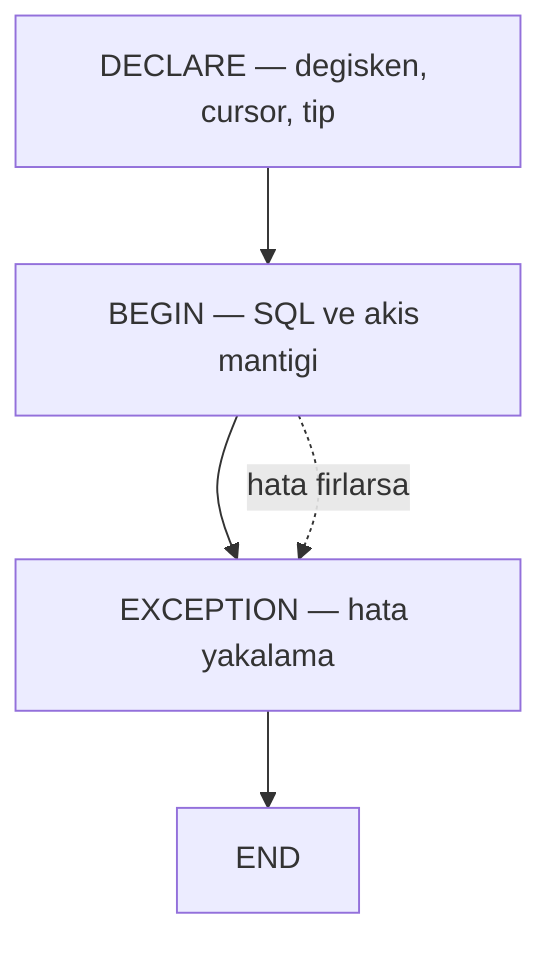
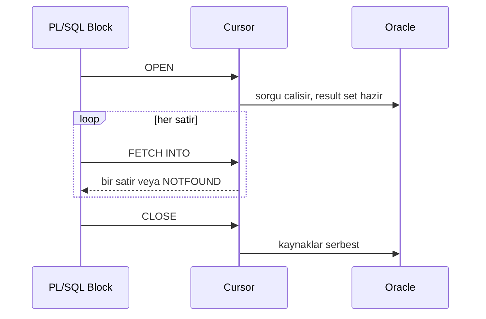
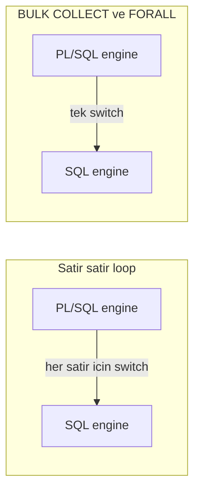
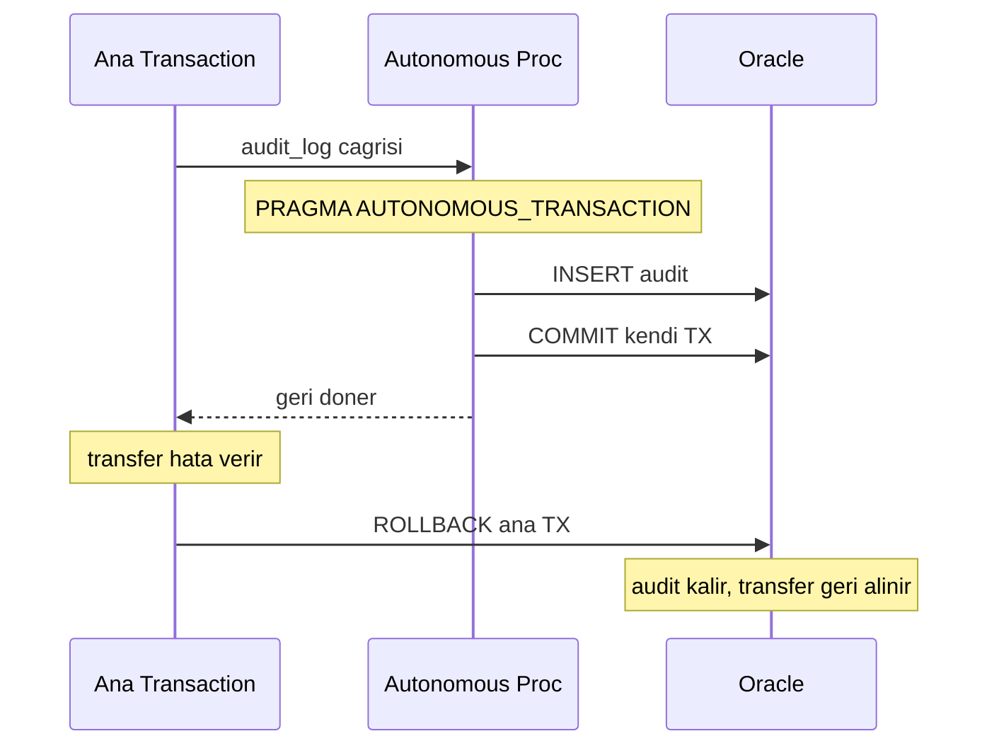

# Topic 4.4 — PL/SQL Programming

```admonish info title="Bu bölümde"
- PL/SQL blok yapısı (DECLARE / BEGIN / EXCEPTION / END), değişken tipleri ve `%TYPE` / `%ROWTYPE` disiplini
- Cursor yaşam döngüsü, `BULK COLLECT` + `FORALL` ile context switch'i tek sefere indirme
- Procedure, function ve banking standardı olan **package** (spec + body + session state)
- Exception handling, custom exception, `RAISE_APPLICATION_ERROR` ve autonomous transaction ile audit log
- TR bankalarının core banking'inde canlı olan mülakat klasikleri: `WHEN OTHERS THEN NULL`, trigger'da business logic, procedure içinde COMMIT
```

## Hedef

Oracle'ın procedural extension'ı PL/SQL'i banking-grade seviyede öğrenmek. Procedure, function, **package**, cursor, **BULK COLLECT + FORALL**, exception handling, autonomous transaction. TR bankalarında milyonlarca satırlık production PL/SQL kodu var — bunu okuyabilen ve yazabilen developer olmak.

## Süre

Okuma: 2.5 saat • Kendini Sına: 45 dk • Pratik (opsiyonel): 4 saat • Toplam: ~3 saat (+ pratik)

## Önbilgi

- Topic 4.1-4.3 bitti
- Oracle XE Docker'da çalışıyor
- SQL Developer veya `sqlplus` ile bağlanabiliyorsun

---

## Kavramlar

### 1. PL/SQL nedir, neden TR bankacılığında bu kadar yaygın

TR bankasının core banking'ine ilk gün girdiğinde seni karşılayan şey genelde 90'lardan kalma, hâlâ üretimde çalışan PL/SQL kodudur — o yüzden bu dili okumak seçenek değil, zorunluluk.

**PL/SQL** = Procedural Language / SQL, Oracle'ın SQL'e eklediği procedural katman. Yaygın olmasının çekirdek sebebi **veri ile logic'in aynı yerde** olması: data DB'de, hesaplama DB'de, arada network round-trip yok.

Bunun yanında üç sebep daha var. Tüm operasyon tek transaction'da atomik kalır; stored procedure bir API gibi davranır (Java sadece `interest_pkg.compute_daily(:date)` çağırır, karmaşık logic DB'de); ve erişim DBA tarafından sıkı kontrol edilir.

Madalyonun diğer yüzü de gerçek: PL/SQL Oracle'a kilitler (cross-DB taşınamaz), test framework'ü eskidir, version control'a sokmak zordur, modern Spring entegrasyonu daha çekicidir. Banking gerçeği şu: eski core PL/SQL ağırlıklı, yeni microservices Java ağırlıklı — **her iki dili de bilmek gerekiyor**.

### 2. PL/SQL blok yapısı

Her şeyin temeli blok: PL/SQL'de yazdığın her şey bir bloktur, o yüzden dört bölümünü ezberden değil refleksle bilmelisin.

Bir blok dört bölümden oluşur: **DECLARE** (değişken/cursor/tip tanımları), **BEGIN** (çalışan kod), **EXCEPTION** (hata yakalama), **END**. DECLARE ve EXCEPTION opsiyoneldir, BEGIN/END zorunludur.



Aşağıda bir **anonymous block** — adsız, tek seferlik çalışan blok. Sonundaki `/` SQL*Plus'a "bu bloğu derle ve çalıştır" der.

```sql
DECLARE
    v_balance NUMBER;
BEGIN
    SELECT balance_amount INTO v_balance
    FROM accounts WHERE id = :acc_id;

    IF v_balance < 100 THEN
        DBMS_OUTPUT.PUT_LINE('Low balance: ' || v_balance);
    END IF;
EXCEPTION
    WHEN NO_DATA_FOUND THEN
        DBMS_OUTPUT.PUT_LINE('Account not found');
    WHEN OTHERS THEN
        DBMS_OUTPUT.PUT_LINE('Unexpected error: ' || SQLERRM);
END;
/
```

### 3. Variable types — `%TYPE` ve `%ROWTYPE`

Tablo `NUMBER(15,4)`'ten `NUMBER(18,2)`'ye geçtiğinde elle senkronlanan onlarca değişken bulmak istemezsin — çözüm tipi tablodan türetmek.

```sql
DECLARE
    v_count    NUMBER(10);
    v_today    DATE := SYSDATE;
    v_balance  accounts.balance_amount%TYPE;     -- column tipi
    r_account  accounts%ROWTYPE;                  -- tüm row tipi

    TYPE acc_rec_type IS RECORD (                 -- custom record
        id RAW(16),
        balance NUMBER
    );
    r_custom acc_rec_type;
BEGIN
    NULL;
END;
/
```

**`%TYPE`** bir column'un tipini türetir; tip değişirse değişken otomatik adapte olur. **`%ROWTYPE`** tüm satırın tipini alır — `r_account.balance_amount`, `r_account.currency` gibi field'lara erişirsin. **RECORD** ise kendi yapını tanımlamana izin verir.

```admonish tip title="%TYPE bir stil değil, disiplin"
Banking kodunda tip her zaman `%TYPE` / `%ROWTYPE` ile türetilir, asla `NUMBER(15,4)` gibi hard-code edilmez. Aksi halde tablo şeması değiştiğinde sessizce yanlış hesaplayan ya da overflow atan kod kalır geriye.
```

Bu yüzden <mark>banking kodunda değişken tipleri hard-code edilmez, her zaman tablodan `%TYPE` ile türetilir</mark>.

### 4. SQL içinde — implicit cursor

Tek satır çekmek için cursor açıp kapatmak gereksiz; Oracle bunu `SELECT ... INTO` ile senin yerine yapar.

```sql
BEGIN
    SELECT balance_amount INTO v_balance
    FROM accounts WHERE id = '...';
    -- v_balance kullan
END;
/
```

`SELECT ... INTO` tam **bir satır** bekler. 0 satır dönerse `NO_DATA_FOUND`, birden fazla dönerse `TOO_MANY_ROWS` exception'ı fırlar — ikisini de handle etmeye hazır ol.

### 5. Explicit cursor — birden fazla satır

Birden fazla satır dolaşman gerektiğinde explicit cursor'ı sen açar, satır satır FETCH eder, kapatırsın. Yaşam döngüsü hep aynıdır: OPEN → FETCH (döngüde) → CLOSE.



```sql
DECLARE
    CURSOR c_active IS
        SELECT id, owner_id, balance_amount
        FROM accounts WHERE status = 'ACTIVE';
    r_acc c_active%ROWTYPE;
BEGIN
    OPEN c_active;
    LOOP
        FETCH c_active INTO r_acc;
        EXIT WHEN c_active%NOTFOUND;
        DBMS_OUTPUT.PUT_LINE(r_acc.id || ': ' || r_acc.balance_amount);
    END LOOP;
    CLOSE c_active;
END;
/
```

Aynı işi **cursor FOR LOOP** çok daha kısa yazar — Oracle OPEN/FETCH/CLOSE'u senin için yönetir:

```sql
BEGIN
    FOR r_acc IN (SELECT id, balance_amount FROM accounts WHERE status = 'ACTIVE') LOOP
        DBMS_OUTPUT.PUT_LINE(r_acc.id || ': ' || r_acc.balance_amount);
    END LOOP;
END;
/
```

Kolay ama tuzağı var: her satır için PL/SQL engine ile SQL engine arasında gidip gelinir. **Büyük dataset'te bu yavaştır** — çözümü sıradaki iki konu.

### 6. BULK COLLECT — toplu fetch

Satır satır FETCH etmek yerine tüm sonucu tek hamlede bir collection'a doldurursun; 100k satırda cursor loop'tan 10-100x hızlı.

```sql
DECLARE
    TYPE acc_ids_type IS TABLE OF accounts.id%TYPE;
    v_ids acc_ids_type;
BEGIN
    SELECT id BULK COLLECT INTO v_ids
    FROM accounts WHERE status = 'ACTIVE';

    FOR i IN 1 .. v_ids.COUNT LOOP
        DBMS_OUTPUT.PUT_LINE(v_ids(i));
    END LOOP;
END;
/
```

Tek round-trip'te tüm satırlar memory'ye gelir — hız buradan. Ama aynı yerde tehlike de var: **milyonlarca satır tek seferde memory'yi doldurur**. Çözüm `LIMIT` ile sayfalamak:

```sql
DECLARE
    TYPE acc_table IS TABLE OF accounts%ROWTYPE;
    v_accs acc_table;
    CURSOR c IS SELECT * FROM accounts;
BEGIN
    OPEN c;
    LOOP
        FETCH c BULK COLLECT INTO v_accs LIMIT 1000;
        EXIT WHEN v_accs.COUNT = 0;

        FOR i IN 1 .. v_accs.COUNT LOOP
            NULL;  -- her satır için iş
        END LOOP;
    END LOOP;
    CLOSE c;
END;
/
```

```admonish warning title="BULK COLLECT ve memory"
Sınırsız `BULK COLLECT` büyük tabloda PGA memory'yi tüketir ve session'ı düşürür. Milyon satırlık işlerde her zaman `LIMIT` ile batch'le (tipik 500-1000). LIMIT hem memory'yi sabit tutar hem de fetch/işle döngüsünü pipeline gibi çalıştırır.
```

### 7. FORALL — toplu DML

BULK COLLECT okumayı toplarken FORALL yazmayı toplar: bir collection'daki tüm INSERT/UPDATE/DELETE'i tek SQL round-trip'te gönderir.

```sql
DECLARE
    TYPE id_list_type IS TABLE OF accounts.id%TYPE;
    v_ids id_list_type := id_list_type();
BEGIN
    v_ids.EXTEND(1000);
    -- v_ids doldurulur...

    FORALL i IN 1 .. v_ids.COUNT
        UPDATE accounts SET balance_amount = balance_amount + 100
        WHERE id = v_ids(i);
END;
/
```

Neden bu kadar hızlı? Satır satır loop'ta her DML için PL/SQL engine, SQL engine'e ayrı bir **context switch** yapar. FORALL bin UPDATE'i tek switch'te gönderir. Aşağıdaki diyagram farkı gösteriyor:



Pratikte kural nettir: <mark>BULK COLLECT + FORALL, context switch'i satır sayısından bağımsız olarak tek sefere indirir — günsonu bulk işlerinde loop+DML kullanma</mark>.

### 8. Procedure ve Function

Tekrar eden logic'i isimlendirilmiş, yeniden kullanılabilir birimlere koymak istersin: iş yapan ama değer döndürmeyen **procedure**, hesaplayıp değer döndüren **function**.

Procedure iş yapar, sonucu OUT parametreyle geri verir:

```sql
CREATE OR REPLACE PROCEDURE close_inactive_accounts(
    p_inactive_days NUMBER,
    p_closed_count OUT NUMBER
) AS
BEGIN
    UPDATE accounts
    SET status = 'CLOSED', closed_at = SYSTIMESTAMP
    WHERE status = 'ACTIVE'
      AND opened_at < SYSTIMESTAMP - INTERVAL '1' DAY * p_inactive_days;

    p_closed_count := SQL%ROWCOUNT;
END;
/
```

Parametre modları üç tanedir: **IN** (default, readonly), **OUT** (caller'a değer döndürür), **IN OUT** (hem alır hem değiştirir).

Function ise `RETURN` ile tek değer döndürür ve SQL içinde çağrılabilir:

```sql
CREATE OR REPLACE FUNCTION calculate_interest(
    p_balance NUMBER, p_rate NUMBER, p_days NUMBER
) RETURN NUMBER AS
    v_interest NUMBER;
BEGIN
    v_interest := p_balance * p_rate * p_days / 365 / 100;
    RETURN ROUND(v_interest, 2);
END;
/

-- SQL içinde kullanım
SELECT id, calculate_interest(balance_amount, 8.5, 30) AS monthly_interest
FROM accounts;
```

Function SQL'den çağrılacaksa yan etkisiz olmalı; aynı input'a aynı output veriyorsa `DETERMINISTIC` işaretle (bkz. Performance tips).

### 9. Package — banking standardı

Tek tek serbest procedure/function yerine banking'de ilgili her şeyi bir **package** içine toplarsın — Spring'deki Service class'ın PL/SQL karşılığı.

Package iki parçadan oluşur: **specification** (public interface — dışarının gördüğü) ve **body** (implementation — private helper'lar dahil). Önce spec, yani sözleşme:

```sql
CREATE OR REPLACE PACKAGE interest_pkg AS
    DEFAULT_RATE CONSTANT NUMBER := 8.5;             -- public constant

    PROCEDURE accrue_daily(p_business_date DATE);    -- public procedure

    FUNCTION calculate_interest(                      -- public function
        p_balance NUMBER,
        p_rate NUMBER DEFAULT DEFAULT_RATE,
        p_days NUMBER
    ) RETURN NUMBER;
END interest_pkg;
/
```

Body implementasyonu tutar. Spec'te görünmeyen `compound_rate` **private helper**'dır — sadece package içinden çağrılabilir:

```sql
CREATE OR REPLACE PACKAGE BODY interest_pkg AS

    FUNCTION compound_rate(p_rate NUMBER, p_periods NUMBER) RETURN NUMBER AS
    BEGIN
        RETURN POWER(1 + p_rate/100/365, p_periods) - 1;
    END;
```

Public `accrue_daily` aktif hesapları dolaşır, her biri için faizi hesaplayıp posting yazar ve bakiyeyi günceller:

```sql
    PROCEDURE accrue_daily(p_business_date DATE) IS
        v_interest NUMBER;
    BEGIN
        FOR r IN (SELECT id, balance_amount FROM accounts WHERE status = 'ACTIVE') LOOP
            v_interest := calculate_interest(r.balance_amount, DEFAULT_RATE, 1);

            INSERT INTO interest_postings(account_id, business_date, amount)
            VALUES (r.id, p_business_date, v_interest);

            UPDATE accounts SET balance_amount = balance_amount + v_interest
            WHERE id = r.id;
        END LOOP;
    END accrue_daily;
```

Package'ın public function'ı body'de de tanımlanır; spec'teki imzayla eşleşmelidir. Aşağıda hem body'nin tam hali hem de çağrım örnekleri katlanmış duruyor:

<details>
<summary>Tam kod: interest_pkg body + çağrım (~35 satır)</summary>

```sql
CREATE OR REPLACE PACKAGE BODY interest_pkg AS

    -- private helper — spec'te yok, dışarıdan çağrılamaz
    FUNCTION compound_rate(p_rate NUMBER, p_periods NUMBER) RETURN NUMBER AS
    BEGIN
        RETURN POWER(1 + p_rate/100/365, p_periods) - 1;
    END;

    PROCEDURE accrue_daily(p_business_date DATE) IS
        v_interest NUMBER;
    BEGIN
        FOR r IN (SELECT id, balance_amount FROM accounts WHERE status = 'ACTIVE') LOOP
            v_interest := calculate_interest(r.balance_amount, DEFAULT_RATE, 1);

            INSERT INTO interest_postings(account_id, business_date, amount)
            VALUES (r.id, p_business_date, v_interest);

            UPDATE accounts SET balance_amount = balance_amount + v_interest
            WHERE id = r.id;
        END LOOP;
    END accrue_daily;

    FUNCTION calculate_interest(p_balance NUMBER, p_rate NUMBER, p_days NUMBER)
        RETURN NUMBER IS
    BEGIN
        RETURN ROUND(p_balance * p_rate * p_days / 365 / 100, 2);
    END;

END interest_pkg;
/

-- Çağrım
BEGIN
    interest_pkg.accrue_daily(SYSDATE);
END;
/

SELECT interest_pkg.calculate_interest(10000, 8.5, 30) FROM dual;
```

</details>

#### Package state — session-level tuzak

Package değişkenleri sıradan lokal değişken değildir: bir session boyunca **kalıcı state** tutarlar. Bu güçlü ama tuzaklı bir özellik.

```sql
CREATE OR REPLACE PACKAGE config_pkg AS
    g_active_currency VARCHAR2(3) := 'TRY';
END;
/

-- Aynı session'da yapılan değişiklik o session boyunca kalır
BEGIN config_pkg.g_active_currency := 'USD'; END;
/
```

Tuzak connection pool'da patlar: <mark>package state session'a bağlıdır, iki farklı session (veya pool'daki iki farklı connection) birbirinin state'ini görmez</mark>. Aynı user'ın iki isteği farklı connection'a düşerse farklı state okur — bu yüzden banking'de request'e özgü değeri package variable'da tutma.

### 10. Exception handling

Faili sadece görmezden gelmek değil, doğru yakalamak, log'lamak ve gerektiğinde yeniden fırlatmak istersin — banking'de yutulan bir hata kaybolan paradır.

```sql
DECLARE
    insufficient_funds EXCEPTION;
    PRAGMA EXCEPTION_INIT(insufficient_funds, -20001);   -- error code map
BEGIN
    IF v_balance < p_amount THEN
        RAISE_APPLICATION_ERROR(-20001, 'Insufficient funds');
    END IF;
EXCEPTION
    WHEN NO_DATA_FOUND THEN
        RAISE_APPLICATION_ERROR(-20002, 'Account not found');
    WHEN insufficient_funds THEN
        ROLLBACK;
        RAISE;   -- üst seviyeye aynen fırlat
    WHEN OTHERS THEN
        DBMS_OUTPUT.PUT_LINE('Unexpected: ' || SQLERRM
            || ' ' || DBMS_UTILITY.FORMAT_ERROR_BACKTRACE);
        RAISE;
END;
/
```

En sık gördüğün **built-in exception'lar**: `NO_DATA_FOUND` (SELECT INTO 0 satır), `TOO_MANY_ROWS` (>1 satır), `DUP_VAL_ON_INDEX` (UNIQUE ihlali), `INVALID_NUMBER` (dönüşüm hatası), `ZERO_DIVIDE`.

**Custom exception** kendi hatanı tanımlamana izin verir: `EXCEPTION_INIT` ile bir error code'a map'lersin, `RAISE_APPLICATION_ERROR(code, message)` ile fırlatırsın. User-defined range `-20001..-20999`'dur; banking pratiğinde bu code'ları bir `error_codes_pkg` içinde organize etmek bakımı kolaylaştırır.

`FORMAT_ERROR_BACKTRACE` hatanın hangi satırdan geldiğini verir — production'da altın değerinde, `RAISE` ise hatayı bilgisini kaybetmeden yukarı taşır.

### 11. Autonomous transaction

Bazı kayıtlar ana işlem geri alınsa bile hayatta kalmalıdır — klasik örnek audit log: transfer rollback olsa da "denendi" kaydı regülatör için kalmalı.

`PRAGMA AUTONOMOUS_TRANSACTION` procedure'ü ana transaction'dan tamamen bağımsız, kendi transaction'ında çalıştırır:

```sql
CREATE OR REPLACE PROCEDURE audit_log(p_action VARCHAR2, p_user VARCHAR2) IS
    PRAGMA AUTONOMOUS_TRANSACTION;
BEGIN
    INSERT INTO audit_log(action, "user", logged_at)
    VALUES (p_action, p_user, SYSTIMESTAMP);
    COMMIT;   -- kendi TX'inde commit, ana TX'i etkilemez
END;
/
```

Ana transaction rollback olsa bile autonomous procedure çoktan kendi COMMIT'ini yapmıştır, kayıt kalır. Akışı diyagramda gör:



Bu Spring'deki `@Transactional(propagation = REQUIRES_NEW)` ile birebir aynı pattern — TR banking'de audit ve failed-attempt log'ları için standarttır.

### 12. Banking örneği — EOD Reconciliation Package

Günsonunda (EOD) her hesabın kayıtlı bakiyesi ile journal'dan yeniden hesaplanan bakiyesi tutmalı; tutmayanları bulup yazan bir package, öğrendiğin her aracı tek yerde birleştirir.

Procedure önce mismatch'leri tutacak record tipini tanımlar:

```sql
    PROCEDURE reconcile_balances(p_business_date DATE) IS
        TYPE mismatch_record IS RECORD (
            account_id RAW(16),
            stored_balance NUMBER,
            calculated_balance NUMBER,
            diff NUMBER
        );
        TYPE mismatch_table IS TABLE OF mismatch_record;
        v_mismatches mismatch_table;
    BEGIN
```

Kalbi tek `BULK COLLECT`: journal_lines üzerinden hesaplanan bakiye ile stored bakiyeyi karşılaştırıp tutmayanları tek round-trip'te collection'a doldurur:

```sql
        SELECT account_id, stored_balance, calculated_balance,
               (stored_balance - calculated_balance) AS diff
        BULK COLLECT INTO v_mismatches
        FROM ( /* accounts LEFT JOIN journal_lines özet sorgusu */ )
        WHERE stored_balance != calculated_balance;
```

Sonra tek `FORALL` ile tüm mismatch'leri mismatch tablosuna yazar ve autonomous audit log düşer. Exception handler ROLLBACK + log + `RAISE` yapar — asla hatayı yutmaz. Tam listing katlanmış:

<details>
<summary>Tam kod: eod_reconciliation_pkg (~75 satır)</summary>

```sql
CREATE OR REPLACE PACKAGE eod_reconciliation_pkg AS
    PROCEDURE reconcile_balances(p_business_date DATE);
    FUNCTION get_mismatch_count(p_business_date DATE) RETURN NUMBER;
END eod_reconciliation_pkg;
/

CREATE OR REPLACE PACKAGE BODY eod_reconciliation_pkg AS

    PROCEDURE reconcile_balances(p_business_date DATE) IS
        TYPE mismatch_record IS RECORD (
            account_id RAW(16),
            stored_balance NUMBER,
            calculated_balance NUMBER,
            diff NUMBER
        );
        TYPE mismatch_table IS TABLE OF mismatch_record;
        v_mismatches mismatch_table;
    BEGIN
        -- Journal üzerinden hesaplanan bakiye vs stored bakiye
        SELECT account_id, stored_balance, calculated_balance,
               (stored_balance - calculated_balance) AS diff
        BULK COLLECT INTO v_mismatches
        FROM (
            SELECT
                a.id AS account_id,
                a.balance_amount AS stored_balance,
                NVL(SUM(CASE
                    WHEN jl.direction = 'CREDIT' THEN jl.amount
                    WHEN jl.direction = 'DEBIT'  THEN -jl.amount
                END), 0) AS calculated_balance
            FROM accounts a
            LEFT JOIN journal_lines jl ON jl.account_id = a.id
            LEFT JOIN journal_entries je ON je.id = jl.journal_entry_id
                AND TRUNC(je.occurred_at) <= p_business_date
            GROUP BY a.id, a.balance_amount
        )
        WHERE stored_balance != calculated_balance;

        -- Tek FORALL ile tüm mismatch'leri yaz
        FORALL i IN 1 .. v_mismatches.COUNT
            INSERT INTO reconciliation_mismatches(
                account_id, business_date, stored_balance,
                calculated_balance, diff_amount, created_at
            ) VALUES (
                v_mismatches(i).account_id, p_business_date,
                v_mismatches(i).stored_balance, v_mismatches(i).calculated_balance,
                v_mismatches(i).diff, SYSTIMESTAMP
            );

        audit_pkg.log('EOD_RECONCILE', 'Mismatches: ' || v_mismatches.COUNT);
        COMMIT;
    EXCEPTION
        WHEN OTHERS THEN
            ROLLBACK;
            audit_pkg.log('EOD_RECONCILE_ERROR', SQLERRM);
            RAISE;
    END reconcile_balances;

    FUNCTION get_mismatch_count(p_business_date DATE) RETURN NUMBER IS
        v_count NUMBER;
    BEGIN
        SELECT COUNT(*) INTO v_count
        FROM reconciliation_mismatches
        WHERE business_date = p_business_date;
        RETURN v_count;
    END;

END eod_reconciliation_pkg;
/
```

</details>

### 13. Java'dan PL/SQL çağırma

Bu package'ları TR bankalarında çoğu zaman Java tarafı tetikler; `JdbcTemplate` ve `SimpleJdbcCall` bunun standart iki yoludur.

```java
@Repository
public class InterestRepository {

    private final JdbcTemplate jdbc;

    public BigDecimal calculateInterest(BigDecimal balance, BigDecimal rate, int days) {
        return jdbc.queryForObject(
            "SELECT interest_pkg.calculate_interest(?, ?, ?) FROM dual",
            BigDecimal.class, balance, rate, days);
    }

    public void runEodReconciliation(LocalDate businessDate) {
        SimpleJdbcCall call = new SimpleJdbcCall(jdbc)
            .withCatalogName("eod_reconciliation_pkg")
            .withProcedureName("reconcile_balances");
        call.execute(Map.of("p_business_date", java.sql.Date.valueOf(businessDate)));
    }
}
```

Function'ı `SELECT ... FROM dual` ile çağırırsın; package procedure'ünü `SimpleJdbcCall` ile `withCatalogName` (package adı) + `withProcedureName` vererek.

### 14. Triggers — neden DİKKATLİ olmalısın

Trigger, bir DML olayına otomatik tepki veren gizli koddur; gücü kadar tehlikelidir, çünkü çağıran onu görmez.

```sql
CREATE OR REPLACE TRIGGER trg_account_status_audit
AFTER UPDATE OF status ON accounts
FOR EACH ROW
BEGIN
    INSERT INTO account_status_audit(account_id, old_status, new_status, changed_at)
    VALUES (:OLD.id, :OLD.status, :NEW.status, SYSTIMESTAMP);
END;
/
```

Üç klasik trigger tuzağı: business logic'i trigger'a koymak (gizli, debug'ı imkânsız), trigger içinde DML (cascade trigger fire), cross-row mantık (mutating table error riski).

```admonish warning title="Trigger'ı sadece audit için kullan"
Business logic trigger'da saklanınca kimse nereden çağrıldığını bulamaz; production incident'te saatler kaybettirir. Banking pratiği net: trigger'ı yalnızca audit/history kaydı için kullan, business logic application ya da procedure'da yaşasın.
```

### 15. Performance tips

Doğru araçla PL/SQL'in yavaş kısımları hızlanır; en çok işe yarayanlar:

1. **BULK COLLECT + FORALL** — satır satır loop yerine
2. **Cursor variable (ref cursor)** — generic, tekrar kullanılabilir sonuç kümesi
3. **NOLOGGING** — direct-path insert için (redo azaltır, dikkatli kullan)
4. **PARALLEL hint** — çok büyük tablo taramaları
5. **PRAGMA UDF** — function SQL'den çağrılırken hızlanır
6. **DETERMINISTIC** — aynı input → aynı output ise işaretle
7. **Result Cache** — `RESULT_CACHE` clause ile sonucu cache'le

### 16. Anti-pattern'ler

Mülakatta "bu kodda ne yanlış?" sorusunun cephaneliği burasıdır; beşi klasik.

**Anti-pattern 1 — `WHEN OTHERS THEN NULL`.** Tüm hataları sessizce yutar:

```sql
EXCEPTION
    WHEN OTHERS THEN NULL;   -- her hata görünmez olur
END;
```

```admonish warning title="WHEN OTHERS THEN NULL — en zararlı anti-pattern"
`WHEN OTHERS THEN NULL` her exception'ı yakalayıp hiçbir şey yapmadan yutar. Yarım kalmış bir transfer, bozuk bir hesaplama ya da constraint ihlali sessizce kaybolur; sistem "başarılı" der ama data tutarsızdır. Production'da bu hatayı bulmak günler alır. En azından log + `RAISE` yap; hatayı gördün, bilerek yut demiyorsan asla susturma.
```

**Anti-pattern 2 — loop içinde tek satır DML.** `FOR r IN c LOOP` içinde `UPDATE ... WHERE id = r.id` 100k round-trip demektir; toplu collection + FORALL kullan.

**Anti-pattern 3 — `%TYPE` kullanmamak.** `v_balance NUMBER(15,4)` hard-code'dur; tablo değişince elle sync gerekir. Hep `accounts.balance_amount%TYPE`.

**Anti-pattern 4 — procedure içinde COMMIT/ROLLBACK.** Procedure kim tarafından çağrıldığını bilmez; içeride COMMIT edersen caller'ın açık transaction'ını kaza ile sonlandırırsın.

```admonish warning title="Transaction sınırına caller karar verir"
Genel procedure kendi içinde COMMIT/ROLLBACK yapmamalı — transaction boundary'sini use case'i başlatan caller belirler. Tek istisna autonomous transaction'dır: kendi bağımsız TX'inde olduğu için içinde COMMIT etmek zorunludur ve caller'ı etkilemez.
```

Bu yüzden <mark>autonomous transaction dışında procedure kendi içinde COMMIT/ROLLBACK yapmaz — transaction sınırına caller karar verir</mark>.

**Anti-pattern 5 — trigger'da business logic.** Konu 14'te anlatıldı: trigger sadece audit için.

---

## Önemli olabilecek araştırma kaynakları

- "Oracle PL/SQL Programming" (Steven Feuerstein) — referans kitap
- Oracle PL/SQL Language Reference (official docs)
- Tom Kyte (asktom.oracle.com) — altın kaynak
- "Effective Oracle by Design" (Tom Kyte)
- Steven Feuerstein YouTube serisi
- "Oracle SQL Recipes" (kötü duruma çare)

---

## Kendini Sına

Aşağıdaki soruları önce **cevaba bakmadan** kendi cümlelerinle yanıtlamayı dene — hepsi TR bank mülakatlarında karşına çıkabilecek tarzda. Takıldığın soruda ilgili Kavramlar başlığına dön, sonra tekrar dene.

**S1. PL/SQL TR bankacılığında neden bu kadar yaygın? İki teknik sebep say.**

<details>
<summary>Cevabı göster</summary>

Çekirdek sebep veri ile logic'in aynı yerde olması: data DB'de, hesaplama DB'de, arada network round-trip yok — performans buradan gelir. İkincisi atomicity: tüm operasyon tek transaction'da kalır. Buna ek olarak stored procedure bir API gibi davranır (Java sadece `interest_pkg.compute_daily(:date)` çağırır, karmaşık logic DB'de saklı) ve erişim DBA tarafından sıkı kontrol edilir.

Tarihsel gerçek de var: TR bankalarının 90'larda yazdığı core banking PL/SQL hâlâ üretimde. Bedeli Oracle'a kilitlenmek, zor test ve zor version control; bu yüzden yeni sistemler Java/Spring'e kayıyor ama eskisi yerinde duruyor.

</details>

**S2. `BULK COLLECT` + `FORALL` neden satır satır loop + DML'den çok daha hızlı?**

<details>
<summary>Cevabı göster</summary>

Sebep **context switch**'tir. PL/SQL kodu PL/SQL engine'de, SQL cümleleri SQL engine'de çalışır; her SQL çağrısı iki engine arasında bir switch demektir. Satır satır loop'ta 100k UPDATE = 100k context switch, bu maliyet toplamda devasadır.

`BULK COLLECT` tüm satırları tek fetch'te bir collection'a doldurur, `FORALL` ise collection'daki bin DML'i tek round-trip'te SQL engine'e gönderir — switch sayısı satır sayısından bağımsız olarak neredeyse tek'e iner. Tek uyarı: `BULK COLLECT`'i çok büyük dataset'te `LIMIT` ile batch'le, yoksa memory tükenir.

</details>

**S3. Autonomous transaction ne işe yarar, banking'de ne zaman kullanılır?**

<details>
<summary>Cevabı göster</summary>

`PRAGMA AUTONOMOUS_TRANSACTION` bir procedure'ü ana transaction'dan tamamen bağımsız, kendi transaction'ında çalıştırır. İçindeki COMMIT sadece kendi işini kalıcılaştırır, ana TX'i etkilemez; ana TX sonradan rollback olsa bile autonomous kayıt kalır.

Klasik banking kullanımı audit / failed-attempt log'dur: transfer başarısız olup rollback olsa bile "denendi" kaydı regülatör için yazılı kalmalı. Spring'deki `@Transactional(propagation = REQUIRES_NEW)` ile birebir aynı pattern. Autonomous procedure içinde COMMIT etmek zorunludur ve tek meşru "procedure içinde COMMIT" senaryosudur.

</details>

**S4. `WHEN OTHERS THEN NULL` neden bu kadar zararlı bir anti-pattern?**

<details>
<summary>Cevabı göster</summary>

Çünkü her exception'ı yakalayıp hiçbir şey yapmadan yutar. Yarım kalmış bir transfer, sıfıra bölme, constraint ihlali — hepsi sessizce kaybolur; kod "başarılı" döner ama data tutarsız kalır. Hiçbir log, hiçbir stack trace olmadığından production'da kök nedeni bulmak günler alır.

Doğrusu: hatayı en azından `SQLERRM` + `DBMS_UTILITY.FORMAT_ERROR_BACKTRACE` ile log'la ve `RAISE` ile yukarı fırlat. Belirli bir exception'ı bilerek görmezden geleceksen onu ismiyle yakala (`WHEN NO_DATA_FOUND THEN ...`), asla `WHEN OTHERS` ile toptan susturma.

</details>

**S5. Package state nedir, connection pool'da hangi tuzağı doğurur?**

<details>
<summary>Cevabı göster</summary>

Package değişkenleri lokal değişken gibi çağrı bitince ölmez; bir session boyunca **kalıcı state** tutarlar. Bir session'da `config_pkg.g_active_currency := 'USD'` yaparsan o değer aynı session'daki sonraki çağrılarda da görünür.

Tuzak: bu state session'a bağlıdır, session'lar birbirinin state'ini görmez. Connection pool'da her istek farklı bir fiziksel connection'a (dolayısıyla farklı session'a) düşebilir; aynı user'ın iki isteği farklı package state okuyabilir. Bu yüzden request'e özgü değeri (aktif kullanıcı, seçili currency) package variable'da tutma — parametre olarak geçir ya da tabloda tut.

</details>

**S6. `%TYPE` / `%ROWTYPE` kullanmak, tipi hard-code etmekten neden daha iyi?**

<details>
<summary>Cevabı göster</summary>

`%TYPE` bir column'un tipini, `%ROWTYPE` tüm satırın tipini tablodan türetir. Tablo şeması değişince (ör. `NUMBER(15,4)` → `NUMBER(18,2)`) değişkenler otomatik adapte olur; hiçbir yeri elle güncellemen gerekmez.

Hard-code tip (`v_balance NUMBER(15,4)`) ise tablo değiştiğinde sessizce yanlış hesaplayan ya da overflow atan kod bırakır ve bunu bulmak zordur. Banking'de tip her zaman tablodan türetilir — hem doğruluk hem bakım için standarttır.

</details>

**S7. Genel bir procedure kendi içinde COMMIT/ROLLBACK yapmalı mı? İstisnası var mı?**

<details>
<summary>Cevabı göster</summary>

Genel kural: hayır. Procedure kim tarafından hangi transaction içinde çağrıldığını bilmez. İçeride COMMIT edersen caller'ın henüz bitmemiş transaction'ını kaza ile sonlandırır, ROLLBACK edersen onun yaptığı işi silersin. Transaction boundary'sini use case'i başlatan caller belirlemeli; procedure sadece işini yapıp dönmeli.

Tek istisna autonomous transaction'dır (`PRAGMA AUTONOMOUS_TRANSACTION`). O procedure kendi bağımsız transaction'ında çalıştığından içinde COMMIT etmek zorunludur ve ana TX'i etkilemez. Audit log tam bu yüzden autonomous yazılır.

</details>

**S8. 500k aktif hesabı işlemen gerekiyor; belleği patlatmadan nasıl fetch edersin?**

<details>
<summary>Cevabı göster</summary>

Sınırsız `BULK COLLECT` 500k satırı tek seferde PGA memory'ye doldurur ve session'ı düşürebilir. Çözüm `LIMIT` ile sayfalamak: cursor'ı açıp `FETCH c BULK COLLECT INTO v_accs LIMIT 1000` ile 1000'erlik batch'ler halinde çek, her batch'i işle, `v_accs.COUNT = 0` olunca çık.

Böylece memory sabit kalır (her an ~1000 satır), context switch avantajını kaybetmezsin ve fetch/işle döngüsü pipeline gibi akar. DML tarafında da her batch'i `FORALL` ile toplu yazarsın — satır satır loop'a asla dönme.

</details>

---

## Tamamlama kriterleri

- [ ] Anonymous block ile balance check yazıp `NO_DATA_FOUND` handle edebiliyorum
- [ ] Procedure ile function arasındaki farkı ve parametre modlarını (IN/OUT/IN OUT) biliyorum
- [ ] Package spec + body ayrımını ve public/private metot mantığını yazabiliyorum
- [ ] `BULK COLLECT` + `FORALL` ile bulk DML yazıyor, `LIMIT` ile memory'yi kontrol ediyorum
- [ ] Autonomous transaction ile audit log yazıp caller rollback'ine rağmen kaldığını doğrulayabiliyorum
- [ ] Custom exception + `RAISE_APPLICATION_ERROR` + `FORMAT_ERROR_BACKTRACE` kullanabiliyorum
- [ ] `interest_pkg` ve `eod_reconciliation_pkg`'i uçtan uca implemente edebiliyorum
- [ ] Java tarafından `SimpleJdbcCall` ile package çağırabiliyorum
- [ ] `WHEN OTHERS THEN NULL` anti-pattern'inden ve procedure içinde COMMIT'ten kaçınıyorum
- [ ] Trigger'ı sadece audit için kullanmaya razıyım

---

## Defter notları

1. "PL/SQL TR bankacılığında neden bu kadar yaygın: ____."
2. "`BULK COLLECT` + `FORALL` context switch'i nasıl azaltır: ____."
3. "Package state (session-level) connection pool tuzağı: ____."
4. "Autonomous transaction (PRAGMA) banking kullanımı: ____."
5. "`WHEN OTHERS THEN NULL` neden tehlikeli: ____."
6. "`%TYPE` / `%ROWTYPE` ile hard-code tip karşılaştırması: ____."
7. "Procedure içinde COMMIT — ne zaman OK, ne zaman değil: ____."
8. "Trigger banking'de sadece ne için kullanılır: ____."
9. "Java tarafından PL/SQL package çağırma (`SimpleJdbcCall`): ____."
10. "`RAISE_APPLICATION_ERROR` error code range (-20001..-20999): ____."

```admonish success title="Bölüm Özeti"
- Her PL/SQL kodu bir bloktur (DECLARE / BEGIN / EXCEPTION / END); tip her zaman `%TYPE` / `%ROWTYPE` ile tablodan türetilir, hard-code edilmez
- Tek satır için `SELECT ... INTO` (implicit cursor), çok satır için explicit cursor ya da cursor FOR LOOP; büyük dataset'te ikisi de yavaştır
- `BULK COLLECT` + `FORALL` context switch'i satır sayısından bağımsız tek sefere indirir — günsonu bulk işlerinin belkemiği; `BULK COLLECT`'i `LIMIT` ile batch'le
- Banking standardı package'tır: spec (public interface) + body (implementation, private helper), session-level state connection pool'da paylaşılmaz
- Exception yut ma — log + `RAISE`; custom exception için `EXCEPTION_INIT` + `RAISE_APPLICATION_ERROR` (-20001..-20999)
- Autonomous transaction ana TX'ten bağımsızdır (audit log klasiği); bunun dışında procedure içinde COMMIT/ROLLBACK yok, trigger sadece audit için
```

---

## Pratik yapmak istersen

Kavramları koda dökmek istersen aşağıdaki iki ek hazır: test yazma rehberi `interest_pkg`, autonomous transaction ve reconciliation için örnek testler içerir; Claude-verify prompt'u ile yazdığın PL/SQL kodunu banking-grade perspektiften denetletebilirsin.

<details>
<summary>Test yazma rehberi</summary>

Aşağıdaki sıra öğreten bir yol izler: önce basit block, sonra procedure/function, en sonda tam package ve reconciliation. Her adımı çalışır hale getirip bir sonrakine geç; tahmini toplam ~4 saat.

### Adım 1 — Anonymous block: balance check

Bir account ID için bakiyeyi ekrana yazdıran anonymous block yaz, `NO_DATA_FOUND` handle et. Amaç: block yapısı ve implicit cursor refleksi.

### Adım 2 — Procedure + function

`close_inactive_accounts(p_inactive_days, p_closed_count OUT)` procedure'ünü yaz; `SQL%ROWCOUNT` ile kapanan sayısını OUT parametreyle dön. Ardından `calculate_interest(balance, rate, days)` function'ını yaz ve SQL içinde çağırarak account'ların aylık faizini listele.

### Adım 3 — Package: interest_pkg (spec + body)

Tam package yaz. `accrue_daily`'yi aktif hesaplarda faiz posting'i üretecek şekilde kur; private `compound_rate` helper'ını body'de sakla. Java tarafından çağrılabilirliği için basit bir smoke test:

```java
@Test
void shouldCallInterestPackage() {
    BigDecimal result = repo.calculateInterest(
        new BigDecimal("10000"), new BigDecimal("8.5"), 30);
    assertThat(result).isEqualByComparingTo("69.86");
}
```

### Adım 4 — Autonomous transaction: audit_log

`audit_log` procedure'ünü `PRAGMA AUTONOMOUS_TRANSACTION` ile yaz. Caller içinde audit çağır, sonra bilinçli `ROLLBACK` yap; audit kaydının kaldığını doğrula. utPLSQL kuruluysa test paketiyle otomatikleştir:

```sql
CREATE OR REPLACE PACKAGE test_interest_pkg AS
    --%suite(Interest Calculation Tests)
    --%test(Calculates simple interest)
    PROCEDURE test_simple_interest;
END;
/

CREATE OR REPLACE PACKAGE BODY test_interest_pkg AS
    PROCEDURE test_simple_interest IS
        v_result NUMBER;
    BEGIN
        v_result := interest_pkg.calculate_interest(10000, 8.5, 30);
        ut.expect(v_result).to_equal(69.86);
    END;
END;
/

EXEC ut.run('test_interest_pkg');
```

### Adım 5 — EOD reconciliation package

`eod_reconciliation_pkg`'i yaz. 100 hesap + 1000 transaction test verisi üret, çalıştır. Bir hesabın bakiyesini elle boz, package'ın mismatch'i yakalayıp `reconciliation_mismatches`'e yazdığını doğrula.

### Adım 6 — Java integration test

Package'ı Spring tarafından tetikle ve sonucu DB'den doğrula:

```java
@Test
@Sql("/sql/interest-test-data.sql")
void interestPackageShouldAccrueCorrectly() {
    LocalDate today = LocalDate.now();
    interestRepo.runDailyAccrual(today);

    BigDecimal posted = jdbc.queryForObject(
        "SELECT SUM(amount) FROM interest_postings WHERE business_date = ?",
        BigDecimal.class, java.sql.Date.valueOf(today));

    assertThat(posted).isPositive();
}
```

> Tamamlama kriteri: altı adımın hepsi çalışıyor; autonomous audit caller rollback'ine rağmen kalıyor, reconciliation elle bozulan bakiyeyi yakalıyor ve package Java tarafından çağrılabiliyor.

</details>

<details>
<summary>Claude-verify prompt</summary>

```
PL/SQL kodumu banking-grade kriterlere göre değerlendir. Eksikleri işaretle,
kod yazma:

1. Yapı:
   - Package spec + body ayrımı yapılmış mı?
   - Public/private metot ayrımı doğru mu (spec'te sadece public)?
   - %TYPE / %ROWTYPE kullanılmış mı (hard-code tip yok)?

2. Performans:
   - Loop içinde tek-satır DML yerine BULK COLLECT + FORALL var mı?
   - Implicit cursor kullanımı verimli mi?
   - BULK COLLECT LIMIT ile memory tüketimi kontrol altında mı?

3. Exception handling:
   - WHEN OTHERS THEN NULL var mı? (Olmamalı)
   - Custom exception ile RAISE_APPLICATION_ERROR yapılmış mı?
   - DBMS_UTILITY.FORMAT_ERROR_BACKTRACE ile stack trace logging?

4. Transaction:
   - Genel procedure içinde COMMIT/ROLLBACK var mı? (Sadece autonomous'ta OK)
   - Autonomous transaction audit_log için kullanılmış mı?

5. Banking specific:
   - interest_pkg faizi doğru hesaplıyor mu?
   - eod_reconciliation_pkg mismatch'leri bulup yazıyor mu?
   - Java tarafından SimpleJdbcCall ile çağrılabilir mi?

6. Anti-pattern:
   - Trigger'da business logic var mı?
   - Hard-code literal'lar (rate, day) magic number mu?
   - Loop'larda satır satır DML felaketi var mı?

Her madde için PASS / FAIL / EKSIK işaretle, kanıt göster, kod yazma.
```

</details>
