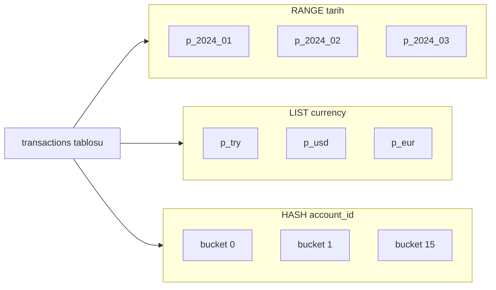
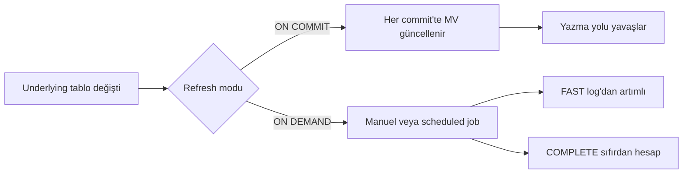
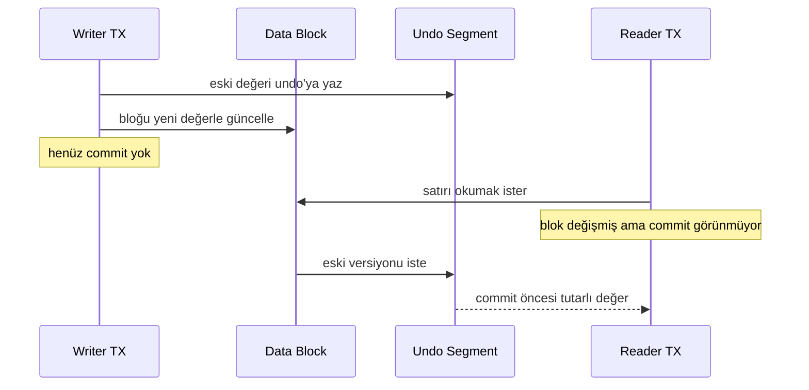
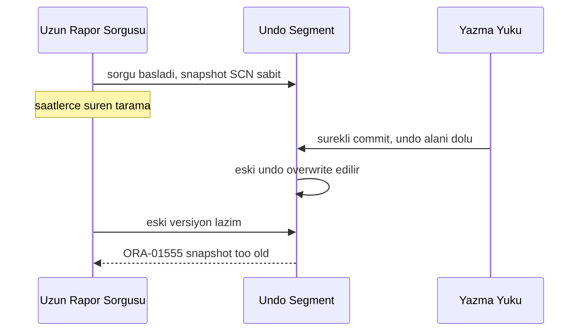

# Topic 4.5 — Oracle-Specific Features

```admonish info title="Bu bölümde"
- Sequence, IDENTITY ve `SYS_GUID()` ile Oracle ID üretimi — `CACHE`'in performans etkisi ve `NOCYCLE`'ın banking zorunluluğu
- Partitioning üç stratejisi (RANGE / LIST / HASH) + `INTERVAL` otomasyonu, partition pruning ve aylık archive-drop akışı
- Materialized view ile pre-computed reporting: `FAST` vs `COMPLETE`, `ON COMMIT` vs `ON DEMAND` refresh — bilinçli seçim
- Oracle MVCC'nin undo segment mantığı, `AS OF TIMESTAMP` time travel ve klasik ORA-01555 "snapshot too old" incident'i
- Tablespace, redo/archivelog, ROWID/ROWNUM tuzakları ve production banking anti-pattern'leri
```

## Hedef

Oracle DB'nin **kendine özgü özelliklerini** banking-grade seviyede öğrenmek: sequences, partitioning (range/list/hash), materialized views, MVCC ve undo segments, ORA-01555 hatası, tablespaces, archivelog mode. Production banking Oracle ortamında DBA ile aynı dili konuşabilmek.

## Süre

Okuma: 2 saat • Kendini Sına: 45 dk • Pratik (opsiyonel): 2-3 saat • Toplam: ~3 saat (+ pratik)

## Önbilgi

- Topic 4.1-4.4 bitti
- Oracle XE Docker'da çalışıyor
- PL/SQL temelleri biliniyor

---

## Kavramlar

### 1. Sequences — Oracle ID üretimi

`transactions` tablosuna saniyede binlerce satır giriyorsun; her birine çakışmayan bir ID lazım. Oracle'da bunu üreten yapı **sequence**'tir — thread-safe, gap'e izin veren bir sayaç.

```sql
CREATE SEQUENCE seq_account_id
    START WITH 1
    INCREMENT BY 1
    CACHE 50              -- 50'şer cache, sequence call'ları azalt
    NOORDER               -- RAC'te order garanti yok (perf için)
    NOCYCLE;              -- max'a ulaşınca dön mü?

-- Kullanım
INSERT INTO accounts(id, ...) VALUES (seq_account_id.NEXTVAL, ...);

-- Mevcut değeri okumadan
SELECT seq_account_id.NEXTVAL FROM dual;   -- artırır
SELECT seq_account_id.CURRVAL FROM dual;   -- current (aynı session'da NEXTVAL sonrası)
```

Üç parametre production'da fark yaratır. **`CACHE 50`** 50 değeri memory'de tutar, her INSERT için disk roundtrip'i keser — banking'de minimum 20-50. **`NOORDER`**, RAC (Real Application Clusters) node'ları arası sıralama garantisi gerekmiyorsa default `ORDER`'dan hızlıdır.

<mark>Banking için NOCYCLE zorunludur — cycle yapan bir sequence er ya da geç ID collision üretir.</mark>

#### Oracle 12c+: IDENTITY column

Sequence'i elle yönetmek yerine kolonu doğrudan otomatik doldurabilirsin — PostgreSQL `SERIAL` benzeri:

```sql
CREATE TABLE accounts(
    id NUMBER GENERATED ALWAYS AS IDENTITY 
       (START WITH 1 INCREMENT BY 1 CACHE 50),
    ...
);
```

Arkada yine bir sequence vardır ama Oracle onu implicit yönetir.

#### `SYS_GUID()` — distributed alternatif

Sıralı ID yerine global benzersizlik istiyorsan (multi-region, offline üretim) UUID daha iyidir:

```sql
SELECT SYS_GUID() FROM dual;   -- 16-byte RAW UUID
```

PostgreSQL karşılığı `gen_random_uuid()` extension'ıdır.

### 2. Partitioning — büyük tablolar için

Partitioning **bir mantıksal tabloyu fiziksel olarak birden fazla parçaya** böler; her partition kendi I/O ve index'ine sahip olabilir. <mark>100M+ satırlık bir transactions tablosu partition'sız pratikte yönetilemez.</mark>

Faydası dört başlıkta toplanır: partition pruning (sorgu sadece ilgili partition'ları okur), archive (eski partition'ı saniyeler içinde drop), maintenance (partition bazlı rebuild/stats), parallel processing (partition başına worker).

Üç temel strateji ile bir tabloyu farklı eksenlerde bölebilirsin:



#### RANGE partitioning — tarih için

Zaman serisi verisinin doğal bölümü tarihtir; her ay ayrı bir partition olur:

```sql
CREATE TABLE transactions(
    id RAW(16),
    account_id RAW(16),
    amount NUMBER(19, 4),
    occurred_at TIMESTAMP WITH TIME ZONE,
    direction VARCHAR2(6)
)
PARTITION BY RANGE (occurred_at) (
    PARTITION p_2024_01 VALUES LESS THAN (TIMESTAMP '2024-02-01 00:00:00 UTC'),
    PARTITION p_2024_02 VALUES LESS THAN (TIMESTAMP '2024-03-01 00:00:00 UTC'),
    PARTITION p_2024_03 VALUES LESS THAN (TIMESTAMP '2024-04-01 00:00:00 UTC'),
    -- ...
    PARTITION p_max VALUES LESS THAN (MAXVALUE)
);
```

Kazanç sorguda görünür: bir aylık aralık istediğinde Oracle sadece o partition'ı tarar (partition pruning).

```sql
SELECT * FROM transactions WHERE occurred_at BETWEEN '2024-02-01' AND '2024-02-28';
-- Oracle SADECE p_2024_02'yi okur (partition pruning)
```

Partition'ları elle eklemek istemezsin. **Interval partitioning** (11g+) yeni ay geldiğinde partition'ı otomatik yaratır — banking standardı:

```sql
CREATE TABLE transactions(...)
PARTITION BY RANGE (occurred_at)
INTERVAL (NUMTOYMINTERVAL(1, 'MONTH'))   -- her ay yeni partition
(PARTITION p_initial VALUES LESS THAN (TIMESTAMP '2024-01-01 00:00:00 UTC'));
```

#### LIST partitioning — kategori için

Bölümleme ekseni sürekli değil, sonlu bir kategori kümesiyse LIST kullanılır:

```sql
CREATE TABLE accounts(...)
PARTITION BY LIST (currency) (
    PARTITION p_try VALUES ('TRY'),
    PARTITION p_usd VALUES ('USD'),
    PARTITION p_eur VALUES ('EUR'),
    PARTITION p_other VALUES (DEFAULT)
);
```

Sadece TRY hesaplarını arayan sorgu yalnızca `p_try`'yi okur.

#### HASH partitioning — dağıtım için

Doğal bir tarih/kategori ekseni yoksa ama yükü eşit dağıtmak istiyorsan hash kullanılır:

```sql
CREATE TABLE journal_lines(...)
PARTITION BY HASH (account_id) PARTITIONS 16;
```

`account_id`'nin hash'ine göre 16 partition'a eşit dağıtır — hot spot (popüler account) yükünü paralelize eder.

#### Composite partitioning — RANGE + HASH

En güçlüsü ikisini birleştirir: dış eksende tarih, iç eksende hash dağıtımı:

```sql
CREATE TABLE transactions(...)
PARTITION BY RANGE (occurred_at)
SUBPARTITION BY HASH (account_id) SUBPARTITIONS 8
(PARTITION p_2024_01 VALUES LESS THAN (TIMESTAMP '2024-02-01 UTC'),
 PARTITION p_2024_02 VALUES LESS THAN (TIMESTAMP '2024-03-01 UTC'));
```

Her aylık partition içinde 8 hash subpartition — time-based query + account-based dağıtım, ideal banking kombinasyonu.

### 3. Partition operations

Partitioning'in asıl banking değeri operasyonlarda ortaya çıkar: eski veriyi milyonlarca satır silmeden, tek DDL ile boşaltmak.

```sql
-- Eski partition'ı drop et (archive sonrası)
ALTER TABLE transactions DROP PARTITION p_2020_01;   -- saniyeler, milyonlarca satır gider

-- Partition'ı boşalt
ALTER TABLE transactions TRUNCATE PARTITION p_2020_01;

-- Yeni partition ekle (interval olmayan tablolar için)
ALTER TABLE transactions ADD PARTITION p_2024_04 VALUES LESS THAN (TIMESTAMP '2024-05-01 UTC');

-- Partition başına stats topla
EXEC DBMS_STATS.GATHER_TABLE_STATS('SCHEMA', 'TRANSACTIONS', PARTNAME => 'P_2024_02');

-- Sadece bir partition'ı sorgula
SELECT * FROM transactions PARTITION (p_2024_02);
```

Banking pattern'i aylık rolling archive'dır: 24 aydan eski partition'ları S3'e export et, sonra `DROP PARTITION` ile saniyeler içinde temizle.

### 4. Materialized Views — pre-computed aggregate

Bir ekran "müşterinin son 12 ayı" için her açılışta 10M satır aggregate ederse yavaştır. Normal bir view her çağrıda yeniden hesaplar; **materialized view** sonucu **disk'te** tutar ve hazır okutur.

```sql
CREATE MATERIALIZED VIEW mv_daily_summary
BUILD IMMEDIATE
REFRESH FAST ON DEMAND
ENABLE QUERY REWRITE
AS
SELECT TRUNC(occurred_at) AS business_date,
       account_id,
       COUNT(*) AS tx_count,
       SUM(amount) AS total_amount
FROM transactions
GROUP BY TRUNC(occurred_at), account_id;
```

Parametrelerin her biri refresh davranışını belirler:

- `BUILD IMMEDIATE`: yarat ve hemen doldur. Alternatif `DEFERRED` — yaratır, doldurmaz
- `REFRESH FAST ON DEMAND`: manuel refresh, sadece değişen satırlar (MV log gerekir)
- `REFRESH COMPLETE`: tüm view'i sıfırdan hesapla
- `REFRESH ON COMMIT`: underlying tabloya her commit'te güncellenir (yazmaları yavaşlatır)
- `ENABLE QUERY REWRITE`: Oracle uygun query'leri otomatik MV'ye yönlendirir

Refresh modu iki eksende karar verilir — ne zaman (`ON COMMIT` / `ON DEMAND`) ve ne kadar (`FAST` / `COMPLETE`):



Manuel refresh iki harfle tetiklenir:

```sql
EXEC DBMS_MVIEW.REFRESH('mv_daily_summary', 'F');   -- F = fast
EXEC DBMS_MVIEW.REFRESH('mv_daily_summary', 'C');   -- C = complete
```

Banking örneği daily/monthly reporting'dir: EOD job MV'yi refresh eder, gün boyu reporting endpoint'i hazır aggregate'ten okur.

### 5. Materialized view log — fast refresh için

`REFRESH FAST` sıfırdan hesaplamaz, sadece **değişen satırları** uygular — ama bunun için değişiklikleri bir yerde biriktirmesi gerekir. O yer materialized view log'dur:

```sql
CREATE MATERIALIZED VIEW LOG ON transactions
WITH ROWID, SEQUENCE (account_id, amount, occurred_at)
INCLUDING NEW VALUES;
```

Underlying tablonun her değişikliği log'a yazılır; refresh yalnızca **log'daki delta'yı** MV'ye taşır.

```admonish warning title="MV log disk tuzağı"
Çok sık yazılan bir tabloda MV log hızla büyür ve disk yer. Log boyutunu ve refresh sıklığını izlemeyen bir kurulum, fark etmeden tablespace doldurur. FAST refresh'in bedeli her zaman bu log'un maliyetidir.
```

### 6. Oracle MVCC — undo segments

Reader'ların writer'ları, writer'ların reader'ları bloklamaması banking concurrency'sinin temelidir. PostgreSQL bunu satır versiyonlarını tabloda tutarak yapar; **Oracle MVCC undo segment'lerini kullanır**.

Mekanizma üç adımdır. UPDATE yaptığında Oracle eski değeri önce **undo segment**'e yazar. Senin commit'inden önce aynı satırı okuyan başka bir transaction, blok değişmiş görünse bile undo'dan commit-öncesi tutarlı değeri okur — buna read consistency denir. Commit ettiğinde undo'nun o kısmı serbest kalır.



Aynı undo mekanizması **time travel**'i de mümkün kılar — geçmiş bir andaki snapshot'ı sorgulayabilirsin:

```sql
SELECT * FROM accounts AS OF TIMESTAMP (SYSTIMESTAMP - INTERVAL '1' HOUR);
-- 1 saat önceki snapshot
```

### 7. ORA-01555 — "snapshot too old"

Klasik banking incident'i: saatlerce süren bir rapor sorgusu eski bir satır versiyonuna ihtiyaç duyar, ama o versiyonu tutan undo alanı bu arada **overwrite** edilmiştir.

```
ORA-01555: snapshot too old: rollback segment number XX with name "..." too small
```

Üç faktör bir araya gelir: uzun süren query, yüksek yazma yükü (undo hızla dolar), yetersiz `UNDO_RETENTION`. Sorgu başladığındaki SCN'e sabitlenmiş snapshot'a artık ulaşılamaz.



Birincil önlem retention süresini uzatmaktır:

```sql
-- Production tipik:
ALTER SYSTEM SET UNDO_RETENTION = 21600;   -- 6 saat
```

Ama `UNDO_RETENTION` bir garanti değil, sadece **hint**'tir — yer yoksa Oracle yine de overwrite eder. <mark>Uzun raporlama sorgularını asla production transactional DB'de değil, read-only replica'da çalıştır.</mark>

### 8. Tablespaces

Bir tablo fiziksel olarak nerede yaşar? **Tablespace** = veri dosyalarının mantıksal grubu; tablolar tablespace'lerde durur.

```sql
CREATE TABLESPACE banking_data 
    DATAFILE '/u01/oradata/banking.dbf' SIZE 10G
    AUTOEXTEND ON NEXT 1G MAXSIZE 100G;

CREATE TABLE accounts(...) TABLESPACE banking_data;
```

Banking'de tablespace ayrımı I/O stratejisidir: hot data (transactions) fast SSD'ye, cold data (archive) yavaş diske, index'ler ayrı tablespace'e (I/O paralelize), temp ayrı (sort/aggregate).

### 9. Redo log ve archivelog

Durability'nin kalbi redo log'dur. Her DML değişikliği önce **redo log**'a yazılır (sıralı, çok hızlı), data file'a yazma (random I/O) sonra gelir:

```
COMMIT → log buffer flush → redo log write → ACK to caller
```

Server çakılırsa restart'ta redo log'dan committed transaction'lar replay edilir — crash recovery budur. **Archivelog mode** ise eski redo log'ları silmeden arşivler; point-in-time recovery için şarttır:

```sql
SELECT log_mode FROM v$database;   -- ARCHIVELOG veya NOARCHIVELOG
```

<mark>Production banking'de ARCHIVELOG mode olmadan point-in-time recovery imkânsızdır.</mark> Senaryo: "Saat 10:23'teki yedek + 10:23-12:45 redo log'ları → 12:45'e geri dön."

### 10. ROWID & ROWNUM

İkisi de junior'ı karıştırır ama tamamen farklıdır. **ROWID** bir satırın **fiziksel adresidir** (datafile, block, row); satır taşınana kadar sabit ve biriciktir — aynı satırı tekrar fetch etmenin en hızlı yolu.

```sql
SELECT ROWID, id FROM accounts WHERE owner_id = '...';
-- ROWID: AAAVAVAAEAAAB7CAAA
```

**ROWNUM** ise sorgu sonucundaki **sıra numarasıdır** (1, 2, 3, ...) ve tuzak buradadır: `WHERE`'den sonra, `ORDER BY`'dan önce değerlendirilir.

```sql
-- ❌ Yanlış: random 10 satır, sorted değil
SELECT * FROM accounts WHERE ROWNUM <= 10 ORDER BY balance_amount DESC;

-- ✓ Doğru: top 10
SELECT * FROM (
    SELECT * FROM accounts ORDER BY balance_amount DESC
) WHERE ROWNUM <= 10;

-- veya Oracle 12c+
SELECT * FROM accounts ORDER BY balance_amount DESC FETCH FIRST 10 ROWS ONLY;
```

```admonish tip title="Top-N için 12c+ syntax'ı tercih et"
Oracle 12c ve sonrasında `OFFSET ... FETCH` sadece pagination'ı değil, top-N sorgularını da temizler: niyet doğrudan okunur, iç içe subquery'ye gerek kalmaz ve optimizer'a "sadece ilk N satır lazım" bilgisini net verir. Eski `WHERE ROWNUM` kalıbını yalnızca 11g ve öncesiyle uğraşırken kullan.
```

### 11. Optimizer hints (kısa)

Optimizer nadiren yanılır; yanıldığında ona parmakla yol gösterebilirsin:

```sql
SELECT /*+ INDEX(a idx_acc_owner) */ * FROM accounts a WHERE owner_id = '...';

SELECT /*+ PARALLEL(t, 8) */ * FROM transactions t WHERE occurred_at > SYSDATE - 7;

SELECT /*+ NO_INDEX(a) */ * FROM accounts a WHERE ...;

SELECT /*+ FIRST_ROWS(10) */ ...;   -- ilk 10 satır için optimize
```

Topic 4.2'de detaylandırıldı. Production'da hint **son çaredir** — önce stats ve index'i düzelt.

### 12. Oracle text ve number data types

Banking'de tip seçimi para ve zaman doğruluğu demektir:

| Type | Açıklama |
|---|---|
| CHAR(n) | Fixed-length, padded with spaces |
| VARCHAR2(n) | Variable-length (banking standard) |
| NVARCHAR2(n) | Unicode variable-length |
| CLOB | Character large object (>4000 bytes) |
| BLOB | Binary large object |
| RAW(n) | Binary (UUID için RAW(16)) |
| NUMBER(p, s) | Precision + scale (banking money: NUMBER(19, 4)) |
| DATE | Date + time, second precision |
| TIMESTAMP | Microsecond precision |
| TIMESTAMP WITH TIME ZONE | TZ aware |

Pratik kararlar: money için `NUMBER(19, 4)` (PostgreSQL `NUMERIC(19, 4)` ile aynı), tarihler için `TIMESTAMP WITH TIME ZONE` (multi-region banking), ID için `RAW(16)` (UUID) veya `NUMBER` (sequence).

### 13. AWR ve ASH report (DBA dünyası, junior'a tanıtım)

Performans problemi çıktığında "ne oldu" sorusunun cevabı bu iki repository'dedir. **AWR (Automatic Workload Repository)** her saat snapshot alır — performans analizinin altın madeni:

```sql
-- AWR snapshot al
EXEC DBMS_WORKLOAD_REPOSITORY.CREATE_SNAPSHOT();

-- AWR rapor üret (DBA permissions gerekir)
@?/rdbms/admin/awrrpt.sql
```

**ASH (Active Session History)** ise saniye-bazlı session aktivitesini tutar:

```sql
SELECT * FROM v$active_session_history WHERE sample_time > SYSDATE - 1/24;
```

Banking gerçeği: AWR/ASH'i DBA çalıştırır; senin ürettiği raporu okuyabilmen yeterlidir, ama senior dev'lik için tanıman gerekir.

### 14. Banking örnekleri — production scenarios

Öğrendiğin parçaları iki gerçek senaryoda birleştirelim. Önce yıllar boyu büyüyen transactions tablosu — interval partitioning + local index:

```sql
CREATE TABLE transactions(
    id RAW(16) DEFAULT SYS_GUID(),
    account_id RAW(16) NOT NULL,
    amount NUMBER(19, 4),
    direction VARCHAR2(6),
    occurred_at TIMESTAMP WITH TIME ZONE NOT NULL
)
PARTITION BY RANGE (occurred_at)
INTERVAL (NUMTOYMINTERVAL(1, 'MONTH'));

-- Index local olarak (her partition kendi index'i)
CREATE INDEX idx_tx_account ON transactions(account_id) LOCAL;
```

Otomatik aylık partition oluşur; 24 aydan eski partition'lar archive job ile S3'e gider ve drop edilir. İkinci senaryo daily reporting MV'sidir:

```sql
CREATE MATERIALIZED VIEW mv_daily_balance_summary
REFRESH FORCE ON DEMAND
AS
SELECT 
    TRUNC(je.occurred_at) AS business_date,
    a.currency,
    COUNT(*) AS tx_count,
    SUM(CASE WHEN jl.direction = 'CREDIT' THEN jl.amount ELSE 0 END) AS total_credit,
    SUM(CASE WHEN jl.direction = 'DEBIT' THEN jl.amount ELSE 0 END) AS total_debit
FROM journal_entries je
JOIN journal_lines jl ON jl.journal_entry_id = je.id
JOIN accounts a ON a.id = jl.account_id
GROUP BY TRUNC(je.occurred_at), a.currency;
```

EOD job sonrası refresh edilir; reporting endpoint'i doğrudan MV'den okur.

### 15. Anti-pattern'ler

Mülakatta "bu tasarımda ne yanlış" sorusunun cephaneliği:

**Partitioning'siz büyük tablo:** transaction'ları aylık partition'sız tek tabloda tutmak. Bir gün archive/drop imkânsız hale gelir.

**ROWNUM ile pagination:** aşağıdaki kod hiç satır döndürmez, çünkü ROWNUM `WHERE` ile incremental atanır ve `>` kontrolü hep false olur:

```sql
-- ❌ Yanlış pagination
SELECT * FROM accounts WHERE ROWNUM > 100 AND ROWNUM <= 200;
```

Çözüm subquery veya 12c+ `OFFSET ... FETCH`:

```sql
SELECT * FROM accounts ORDER BY id 
OFFSET 100 ROWS FETCH NEXT 100 ROWS ONLY;
```

**MV refresh ON COMMIT ağır query:** her commit'te refresh production'ı yavaşlatır — çözüm `ON DEMAND` + scheduled job. **NOARCHIVELOG production:** sıfır recovery imkânı, mutlaka ARCHIVELOG. **Sequence CACHE 0 veya çok küçük:** `CACHE 1` high-volume INSERT'te bottleneck yaratır; banking standardı 20-100.

```sql
CREATE SEQUENCE seq_x CACHE 1;   -- her INSERT'te disk, bottleneck
```

---

## Önemli olabilecek araştırma kaynakları

- Oracle Database Concepts (official docs)
- Oracle Partitioning Guide
- "Expert Oracle Database Architecture" (Tom Kyte)
- Oracle Materialized View tutorial
- Oracle Performance Tuning Guide
- Tom Kyte (asktom.oracle.com)
- "Oracle 19c New Features"
- AWR/ASH report interpretation guides

---

## Kendini Sına

Aşağıdaki soruları önce **cevaba bakmadan** kendi cümlelerinle yanıtlamayı dene — hepsi Oracle çalışan bir banking ekibinin mülakatında karşına çıkabilir. Takıldığın soruda ilgili Kavramlar başlığına dön, sonra tekrar dene.

**S1. ORA-01555 "snapshot too old" hatasının kök nedeni nedir ve nasıl çözersin?**

<details>
<summary>Cevabı göster</summary>

Uzun süren bir sorgu, başladığı andaki SCN'e sabitlenmiş bir snapshot ister. Bu sırada yoğun yazma yükü undo segment'i sürekli doldurur ve sorgunun ihtiyaç duyduğu eski satır versiyonları `UNDO_RETENTION` yetmediği için overwrite edilir — Oracle tutarlı okumayı sağlayamayınca ORA-01555 fırlatır.

Çözüm iki katmanlıdır. Birincisi `UNDO_RETENTION`'ı production'da 6 saat gibi bir değere çıkarmak, ama bu bir hint'tir, yer yoksa Oracle yine ihlal eder. Asıl doğru pratik uzun raporlama sorgularını production transactional DB yerine read-only replica'da çalıştırmaktır; böylece uzun sorgu ile yazma yükü aynı undo'yu paylaşmaz.

</details>

**S2. Partitioning'i ne zaman kullanırsın ve RANGE / LIST / HASH arasında nasıl seçersin?**

<details>
<summary>Cevabı göster</summary>

Tablo o kadar büyüdüğünde (transaction'larda milyonlarca-milyarlarca satır) tek parça yönetim, archive ve sorgu performansı zorlaştığında kullanırsın. Kazanç partition pruning (sorgu tek partition okur), saniyeler süren `DROP PARTITION` archive'ı ve partition bazlı maintenance'tır.

Seçim bölme eksenine bağlıdır: sürekli bir değer, özellikle tarih varsa RANGE (interval ile otomatik aylık partition — banking standardı); sonlu bir kategori kümesi varsa LIST (currency gibi); doğal eksen yok ama yükü eşit dağıtmak ve hot spot'u kırmak istiyorsan HASH. En güçlüsü composite'tir: dış RANGE (tarih) + iç HASH (account_id).

</details>

**S3. Oracle MVCC nasıl çalışır? PostgreSQL'den farkı nedir?**

<details>
<summary>Cevabı göster</summary>

Oracle bir satırı UPDATE ettiğinde eski değeri önce undo segment'e yazar, sonra bloğu günceller. Senin commit'inden önce aynı satırı okuyan başka bir transaction, blok değişmiş görünse bile undo'dan commit-öncesi tutarlı değeri okur — read consistency. Sonuç: reader writer'ı, writer reader'ı bloklamaz; ayrıca `AS OF TIMESTAMP` ile geçmiş snapshot'a time travel yapılabilir.

Fark: PostgreSQL satır versiyonlarını tablonun içinde tutar (her satırın eski kopyaları tabloda kalır, VACUUM temizler); Oracle ise eski versiyonları ayrı bir undo segment'te tutar. Oracle'ın modeli tabloyu şişirmez ama undo'nun taşması ORA-01555'e yol açar.

</details>

**S4. Materialized view refresh stratejisini nasıl seçersin? FAST vs COMPLETE, ON COMMIT vs ON DEMAND ne zaman?**

<details>
<summary>Cevabı göster</summary>

İki bağımsız eksen var. Zaman ekseni: `ON COMMIT` MV'yi underlying tablonun her commit'inde günceller — anlık tutarlılık verir ama yazma yolunu yavaşlatır, yüksek-volume banking tablolarında anti-pattern'dir. `ON DEMAND` refresh'i manuel veya scheduled job'a bırakır; reporting için doğru tercih budur (örneğin EOD job).

Miktar ekseni: `FAST` sadece MV log'daki delta'yı uygular, hızlıdır ama MV log gerektirir ve log'un disk maliyeti vardır. `COMPLETE` view'i sıfırdan hesaplar, log gerektirmez ama pahalıdır. Banking pratiği genelde `REFRESH FAST ON DEMAND` + scheduled job; log yönetilemiyorsa `COMPLETE`.

</details>

**S5. Sequence tanımlarken `CACHE` ve `NOCYCLE` neden önemli? IDENTITY column ne getirir?**

<details>
<summary>Cevabı göster</summary>

`CACHE`, sequence değerlerini memory'de tutarak her `NEXTVAL` için disk roundtrip'ini keser; `CACHE 1` veya `NOCACHE` high-volume INSERT'te ciddi bir bottleneck olur, banking standardı 20-100'dür. Bedeli: instance crash'te cache'teki değerler kaybolur, yani ID'lerde gap oluşabilir — banking'de gap sorun değildir, çakışma sorundur.

`NOCYCLE` zorunludur çünkü cycle yapan sequence maksimuma ulaşınca başa döner ve ID collision üretir. Oracle 12c+ `GENERATED ALWAYS AS IDENTITY` ise arkada bir sequence'i implicit yönetir — PostgreSQL `SERIAL` gibi, elle `NEXTVAL` yazmadan otomatik ID.

</details>

**S6. `SELECT * FROM accounts WHERE ROWNUM > 100` neden hiç satır döndürmez? Doğru pagination nasıl yapılır?**

<details>
<summary>Cevabı göster</summary>

ROWNUM, sonuç kümesine satır eklendikçe artan bir sayaçtır ve ilk satıra 1 atanır. Ama `WHERE ROWNUM > 100` ilk satırı ele alırken ROWNUM henüz 1'dir, koşul false olur, satır elenir — dolayısıyla ROWNUM asla 1'in ötesine geçemez ve sorgu hep boş döner. ROWNUM `WHERE`'de değerlendirilir, `ORDER BY`'dan önce atanır; bu yüzden `WHERE ROWNUM <= 10 ORDER BY ...` da yanlıştır (önce rastgele 10, sonra sıralama).

Doğrusu ya sıralamayı bir subquery içinde yapıp dışarıda ROWNUM ile sınırlamak, ya da Oracle 12c+ `OFFSET 100 ROWS FETCH NEXT 100 ROWS ONLY` kullanmaktır — okunur ve doğru pagination sağlar.

</details>

**S7. Production banking'de ARCHIVELOG mode neden zorunludur? NOARCHIVELOG ile ne kaybedersin?**

<details>
<summary>Cevabı göster</summary>

Her DML önce redo log'a yazılır; crash olduğunda restart'ta committed transaction'lar redo'dan replay edilir (crash recovery). ARCHIVELOG mode, dolan redo log'ları silmeden arşivler ve böylece point-in-time recovery'yi mümkün kılar: "saat 10:23'teki full backup + 10:23-12:45 arası arşivlenmiş redo → tam 12:45'e geri dön".

NOARCHIVELOG'da eski redo log'lar üzerine yazılır; elinde sadece son full backup kalır, iki backup arasındaki committed işlemleri kurtaramazsın. Banking'de bu kabul edilemez bir veri kaybı riskidir, bu yüzden production'da ARCHIVELOG mutlaka açıktır.

</details>

---

## Tamamlama kriterleri

- [ ] Sequence `CACHE` değerinin performans etkisini ve `NOCYCLE`'ın neden zorunlu olduğunu açıklayabiliyorum
- [ ] RANGE / LIST / HASH partitioning arasında bir banking senaryosuna göre seçim yapabiliyorum
- [ ] `INTERVAL` partitioning'in ve local index'in neden standart olduğunu anlatabiliyorum
- [ ] Partition pruning'i ve `DROP PARTITION` archive akışını açıklayabiliyorum
- [ ] Materialized view refresh stratejisini (FAST/COMPLETE, ON COMMIT/ON DEMAND) bilinçli seçebiliyorum
- [ ] Oracle MVCC'nin undo segment mantığını ve PostgreSQL'den farkını anlatabiliyorum
- [ ] ORA-01555'in kök nedenini ve iki katmanlı çözümünü söyleyebiliyorum
- [ ] `AS OF TIMESTAMP` time travel'ın hangi senaryoda işe yaradığını biliyorum
- [ ] ROWNUM pagination tuzağını ve 12c+ `OFFSET ... FETCH` alternatifini biliyorum
- [ ] ARCHIVELOG mode'un production zorunluluğunu ve point-in-time recovery'yi anlıyorum

---

## Defter notları

1. "Sequence CACHE değerinin performans etkisi: ____."
2. "RANGE INTERVAL partitioning'in banking'de neden standart: ____."
3. "Partition pruning'i EXPLAIN PLAN'de nasıl tanırım: ____."
4. "Materialized view fast refresh ile complete refresh farkı: ____."
5. "ORA-01555 hatasının kök nedeni (undo + uzun query): ____."
6. "UNDO_RETENTION ne işe yarar, banking için ideal değer: ____."
7. "AS OF TIMESTAMP time travel kullanım senaryosu: ____."
8. "ARCHIVELOG mode olmadan recovery imkânı: ____."
9. "ROWNUM `WHERE ROWNUM > 100` neden çalışmaz: ____."
10. "Oracle 12c+ OFFSET ... FETCH alternatifi neden tercih: ____."

```admonish success title="Bölüm Özeti"
- Sequence ID üretiminde `CACHE 20-100` ve `NOCYCLE` banking standardıdır; 12c+ `IDENTITY` column arkadaki sequence'i implicit yönetir, `SYS_GUID()` distributed alternatiftir
- Büyük transactions tablosu `RANGE INTERVAL` ile aylık otomatik partition'lanır; partition pruning sorguyu tek partition'a indirir, eski partition drop saniyeler sürer — RANGE/LIST/HASH ekseni veriye göre seçilir
- Materialized view reporting aggregate'ini disk'te tutar; `REFRESH FAST` MV log ile artımlıdır, `ON DEMAND` + scheduled job production tercihidir, `ON COMMIT` yüksek-volume'da anti-pattern
- Oracle MVCC eski satır versiyonlarını undo segment'te tutar; reader writer'ı bloklamaz, `AS OF TIMESTAMP` time travel sağlar — undo taşması ORA-01555'e yol açar
- ORA-01555 uzun sorgu + undo overwrite çakışmasıdır; çözüm `UNDO_RETENTION` artırmak ve uzun raporları read-only replica'ya taşımaktır
- Production'da ARCHIVELOG mode point-in-time recovery için zorunludur; ROWNUM pagination tuzağına karşı 12c+ `OFFSET ... FETCH` kullan
```

---

## Pratik yapmak istersen

Kavramları Oracle üzerinde çalıştırmak istersen aşağıdaki iki ek hazır: test yazma rehberi partition pruning ve materialized view refresh için örnek testler içerir; Claude-verify prompt'u ile yazdığın Oracle şemasını banking-grade perspektiften denetletebilirsin. Küçük bir laboratuvar akışı olarak şunları da sırayla deneyebilirsin — `seq_account_id` yarat `CACHE 50` ile ve `NEXTVAL`/`CURRVAL` kullan; `transactions`'ı aylık `INTERVAL` ile partition'la ve `user_tab_partitions`'tan partition'ları listele; `EXPLAIN PLAN` + `DBMS_XPLAN.DISPLAY` ile pruning kanıtını gör; bir MV yaratıp `REFRESH FAST` dene; `UNDO_RETENTION`'ı 60 saniyeye çekip uzun bir cursor ile ORA-01555'i canlı reproduce et; `AS OF TIMESTAMP` ile time travel sorgusu çalıştır; son olarak bir aylık partition'ı `DROP PARTITION` ile saniyeler içinde sil.

<details>
<summary>Test yazma rehberi</summary>

### Test 4.5.1 — Partition pruning verification

```java
@Test
@Sql("/sql/transactions-3-months.sql")
void monthRangeQueryShouldPruneToSinglePartition() {
    String plan = jdbc.queryForObject("""
        SELECT operation_type FROM (
            EXPLAIN PLAN FOR
            SELECT * FROM transactions 
            WHERE occurred_at BETWEEN ? AND ?
        )
        """, String.class, ...);
    
    // Plan'da partition pruning evidence
    assertThat(plan).contains("PARTITION RANGE");
}
```

### Test 4.5.2 — Materialized view refresh

```java
@Test
void mvShouldUpdateOnRefresh() {
    // Insert new transaction
    jdbc.update("INSERT INTO transactions ...");
    
    // MV stale, refresh et
    jdbc.execute("BEGIN DBMS_MVIEW.REFRESH('mv_daily_balance_summary', 'F'); END;");
    
    // MV'den oku
    BigDecimal todayTotal = jdbc.queryForObject(
        "SELECT total_credit FROM mv_daily_balance_summary WHERE business_date = TRUNC(SYSDATE)",
        BigDecimal.class
    );
    
    assertThat(todayTotal).isPositive();
}
```

### Test 4.5.3 — ORA-01555 reproduction

> `UNDO_RETENTION`'ı çok düşük tut (60 saniye). Bir cursor aç (`OPEN c FOR SELECT * FROM accounts`), arka planda yoğun UPDATE + COMMIT yükü çalıştırırken 2 dakika bekle, sonra fetch'le. Undo overwrite edildiği için `ORA-01555` görmen gerekir. Bu testi asla shared bir ortamda çalıştırma; izole bir XE instance'ında dene.

### Test 4.5.4 — Time travel query

```java
@Test
void asOfTimestampShouldReturnOldValue() {
    jdbc.update("UPDATE accounts SET balance_amount = 0 WHERE id = ?", accountId);
    jdbc.execute("COMMIT");
    
    BigDecimal past = jdbc.queryForObject("""
        SELECT balance_amount FROM accounts
        AS OF TIMESTAMP (SYSTIMESTAMP - INTERVAL '1' MINUTE)
        WHERE id = ?
        """, BigDecimal.class, accountId);
    
    // Güncellemeden önceki değer okunur
    assertThat(past).isNotEqualByComparingTo(BigDecimal.ZERO);
}
```

</details>

<details>
<summary>Claude-verify prompt</summary>

```
Oracle-specific çalışmamı banking-grade kriterlere göre değerlendir. 
Eksikleri işaretle, kod yazma:

1. Sequence:
   - CACHE değeri 1'den büyük mü (20-100 banking standardı)?
   - NOCYCLE banking için zorunlu mu?
   - IDENTITY column kullanılmış mı (Oracle 12c+)?

2. Partitioning:
   - Büyük tablolarda partitioning var mı (transactions)?
   - INTERVAL partitioning ile otomatik partition oluşturma mı?
   - Local index'ler partition'lı tablolarda mı?
   - Eski partition drop akışı (archive) net mi?

3. Materialized view:
   - Reporting için MV kullanılmış mı?
   - Refresh strategy (ON DEMAND vs ON COMMIT) bilinçli mi?
   - Materialized view log fast refresh için yaratılmış mı?

4. MVCC ve undo:
   - UNDO_RETENTION production'da yeterli mi (6+ saat)?
   - Long-running query'ler read-only replica'ya yönlendirilmiş mi?
   - AS OF TIMESTAMP ile time travel deneyimi var mı?

5. Tablespaces:
   - Hot/cold data ayrımı yapılmış mı?
   - Index'ler ayrı tablespace'te mi?

6. Archive log:
   - Production'da ARCHIVELOG mode mu?
   - Point-in-time recovery strateji?

7. ROWNUM/ROWID:
   - ROWNUM ile yanlış pagination var mı? (Olmamalı)
   - Oracle 12c+ FETCH FIRST kullanılmış mı?

8. Anti-pattern:
   - Partitioning'siz büyük tablo?
   - NOARCHIVELOG production?
   - CACHE 0 sequence?
   - MV refresh ON COMMIT yüksek-volume tabloda?

Her madde için PASS / FAIL / EKSIK işaretle, kanıt göster, kod yazma.
```

</details>
