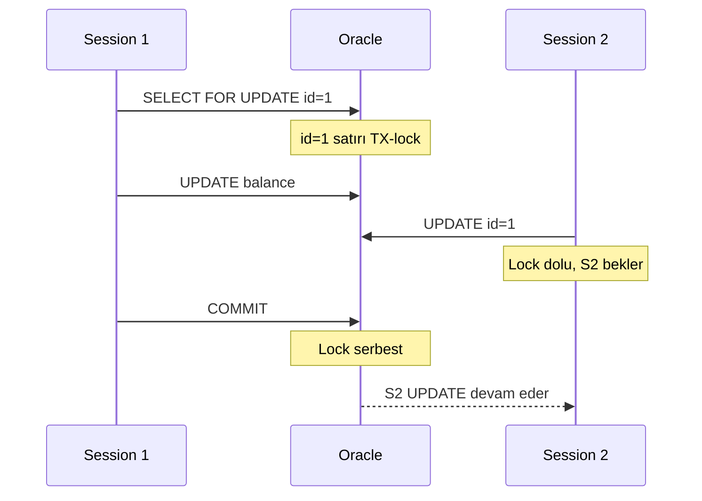
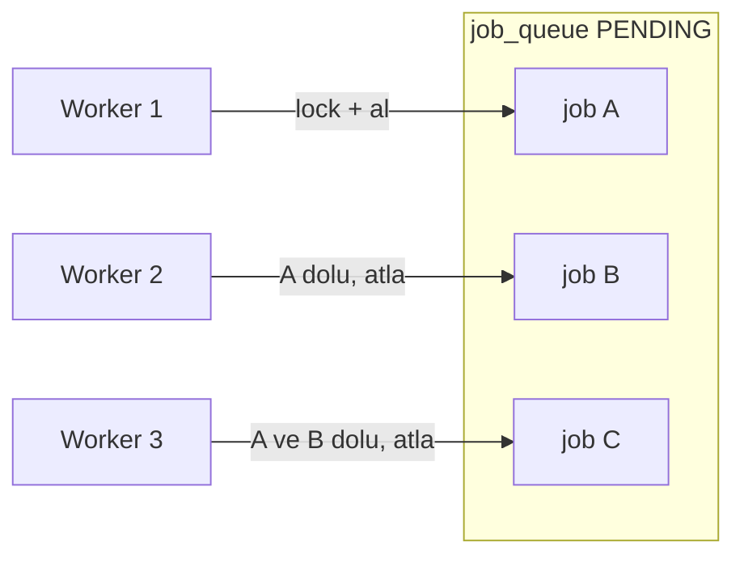
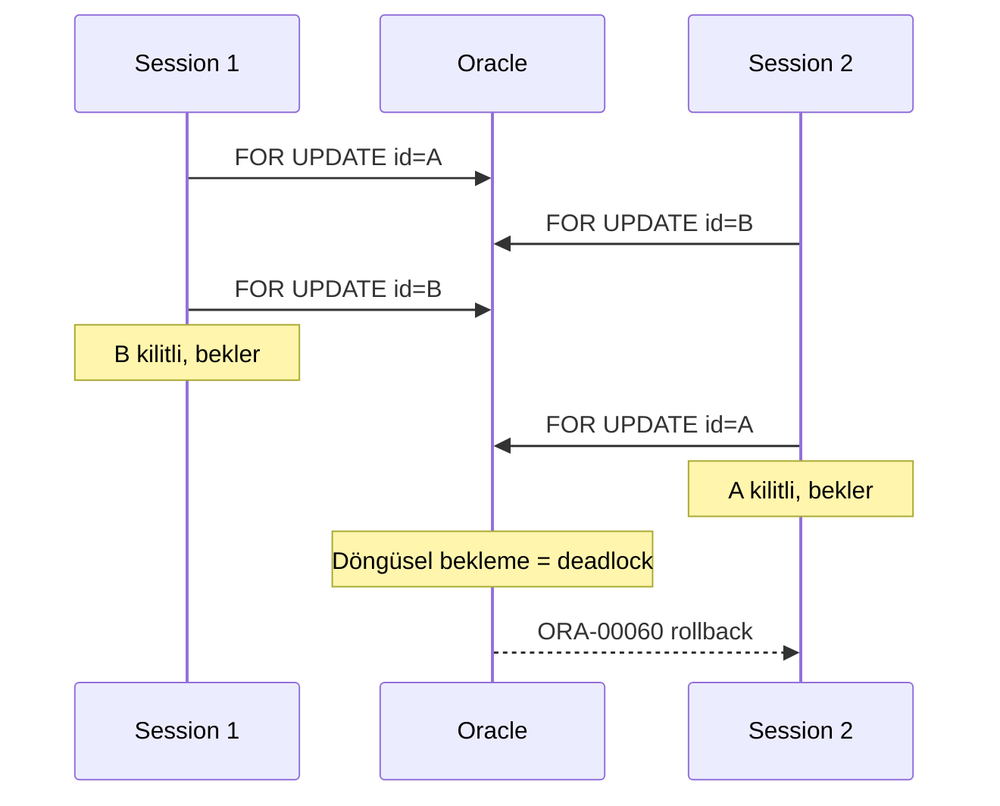

# Topic 4.6 — DB Concurrency & Locking

```admonish info title="Bu bölümde"
- SELECT FOR UPDATE ve varyantları — NOWAIT, WAIT n, SKIP LOCKED: hangisi hangi banking senaryosunda
- MVCC neden reader-writer çakışmasını ortadan kaldırır, Oracle'ın read consistency garantisi
- SKIP LOCKED ile lock kavgası olmayan paralel worker queue — banking'in altın job pattern'i
- Deadlock nasıl oluşur, lock ordering ile nasıl önlenir, Oracle'ın otomatik detection'ı
- DBMS_LOCK / pg_advisory_lock ile distributed singleton — EOD job'un tek instance garantisi
```

## Hedef

Oracle ve PostgreSQL'in concurrency mekaniklerini banking-grade seviyede öğrenmek. SELECT FOR UPDATE varyantları (NOWAIT, WAIT n, SKIP LOCKED), enqueue lock'lar, MVCC ile locking ilişkisi, deadlock detection ve banking için queue worker pattern'i sebep-sonuç olarak kavramak. Faz 2'de JPA tarafını (pessimistic/optimistic lock, `@Lock`) gördün; burada aynı hikâyenin **DB motoru** tarafını tamamlıyoruz.

## Süre

Okuma: 1.5 saat • Kendini Sına: 30 dk • Pratik (opsiyonel): 2-3 saat • Toplam: ~2 saat (+ pratik)

## Önbilgi

- Topic 4.1-4.5 bitti
- Faz 2'deki locking topic'i (JPA tarafı — pessimistic/optimistic) bitti
- Concurrent transaction kavramına aşinasın

---

## Kavramlar

### 1. Isolation level'lar — DB perspektifinden

Aynı hesaba iki eşzamanlı işlem düştüğünde kimin neyi gördüğünü **isolation level** belirler. Faz 2'de JPA tarafından baktık; şimdi motoru, yani DB'nin kendisini açıyoruz.

#### Oracle default: READ COMMITTED

- Reader'lar yalnızca commit edilmiş veriyi görür — dirty read yoktur
- **MVCC** sayesinde read-without-blocking: writer reader'ı bloklamaz
- Non-repeatable read olabilir: aynı sorgu iki kez = farklı sonuç

#### Oracle SERIALIZABLE

```sql
ALTER SESSION SET ISOLATION_LEVEL = SERIALIZABLE;
```

Transaction izolasyonu tam, phantom read yok. Ama çakışma anında Oracle şu hatayı fırlatır:

```
ORA-08177: can't serialize access for this transaction
```

Bu hatayı **retry** etmek senin işin — DB otomatik denemez.

#### PostgreSQL — 3 isolation level

- **READ COMMITTED** (default): her statement kendi snapshot'ını alır
- **REPEATABLE READ**: snapshot transaction başında alınır, sonra değişmez
- **SERIALIZABLE**: true serializable, **SSI** (Serializable Snapshot Isolation) algoritması

PostgreSQL SERIALIZABLE, concurrent transaction'lar arası dependency tespit eder ve çakışma olunca birini reddeder:

```
ERROR: could not serialize access due to read/write dependencies among transactions
```

İzolasyon merdiveni yükseldikçe daha çok anomali engellenir ama concurrency düşer:


**Banking pratiği:** Çoğunluk READ COMMITTED. Kritik senaryolar (eşzamanlı bakiye check + withdraw) için SERIALIZABLE veya explicit lock tercih edilir.

### 2. MVCC vs locking — temel fark

Eski nesil DB'lerde reader writer'ı bloklar; bu banking için felakettir çünkü tek bir uzun rapor tüm yazımları durdurur. **MVCC** (Multi-Version Concurrency Control) bu problemi kökten çözer.

MVCC'de her satırın kısa süreliğine **birden fazla versiyonu** yaşar; reader kendi snapshot'ına uygun versiyonu görür, writer'ı beklemez. <mark>MVCC'de reader writer'ı, writer reader'ı bloklamaz; yalnızca aynı satıra yazan iki writer birbirini bloklar</mark>.

```
T1: BEGIN; SELECT balance FROM accounts WHERE id = 1;   -- 100 görür
T2: BEGIN; UPDATE accounts SET balance = 200 WHERE id = 1; COMMIT;
T1: SELECT balance FROM accounts WHERE id = 1;          -- READ COMMITTED: 200 (her stmt yeni snapshot)
                                                        -- REPEATABLE READ: 100 (snapshot başta sabitlendi)
```

Oracle'da bu davranış "read consistency" adını alır: bir sorgu başladığı andaki tutarlı görüntüyü döndürür, sorgu sürerken başkasının commit'i onu bozmaz.

### 3. SELECT FOR UPDATE — explicit row lock

MVCC yazımı bloklamaz ama bazen "bu satırı okudum, kimse değiştirmeden ben yazacağım" garantisi istersin — işte **SELECT FOR UPDATE** tam bunun için row-level lock alır.

```sql
BEGIN;
SELECT * FROM accounts WHERE id = '...' FOR UPDATE;
-- Bu satır TX-lock — başka transaction UPDATE/DELETE/SELECT FOR UPDATE bekler
UPDATE accounts SET balance_amount = balance_amount - 100 WHERE id = '...';
COMMIT;
```

Lock, `SELECT FOR UPDATE` anında alınır ve **transaction commit veya rollback olana kadar** tutulur. Sıra akışı:



**Banking örneği — concurrent transfer:**

```sql
BEGIN;
SELECT * FROM accounts WHERE id = :from_id FOR UPDATE;   -- lock from
SELECT * FROM accounts WHERE id = :to_id FOR UPDATE;     -- lock to
UPDATE accounts SET balance_amount = balance_amount - :amount WHERE id = :from_id;
UPDATE accounts SET balance_amount = balance_amount + :amount WHERE id = :to_id;
COMMIT;
```

**Tuzak:** İki concurrent transfer A→B ve B→A ters sırada lock alırsa **deadlock** doğar. Çözümü Bölüm 7'deki lock ordering'dir.

### 4. SELECT FOR UPDATE varyantları

Klasik `FOR UPDATE` lock doluysa **süresiz bekler** — bir web isteğinde bu kabul edilemez. Üç varyant bekleme davranışını kontrol eder.

#### NOWAIT

```sql
SELECT * FROM accounts WHERE id = '...' FOR UPDATE NOWAIT;
```

Lock available değilse **anında hata** (ORA-00054 / SQLSTATE 55P03), beklemez. Optimistic check için idealdir: doluysa "şu an meşgul, sonra dene" cevabı üretirsin.

#### WAIT n

```sql
SELECT * FROM accounts WHERE id = '...' FOR UPDATE WAIT 5;
```

5 saniye bekle, alınmazsa hata. Banking timeout pattern'inin temelidir. <mark>Web request akışında SELECT FOR UPDATE'i asla süresiz bekletme; NOWAIT veya WAIT n ile mutlaka bir timeout koy</mark>.

#### SKIP LOCKED

```sql
SELECT * FROM job_queue WHERE status = 'PENDING'
ORDER BY created_at
FOR UPDATE SKIP LOCKED
FETCH FIRST 1 ROWS ONLY;
```

Kilitli satırları **atlar**, sıradaki available olanı alır. Worker pool için altın pattern budur.

**Banking örneği — job queue worker:**

```sql
-- Worker 1, Worker 2, ... aynı queue'dan iş çekiyor
BEGIN;
SELECT id FROM transfer_jobs
WHERE status = 'PENDING'
ORDER BY priority DESC, created_at
FOR UPDATE SKIP LOCKED
FETCH FIRST 1 ROWS ONLY;

UPDATE transfer_jobs SET status = 'PROCESSING' WHERE id = :selected_id;
COMMIT;
```

10 worker, 10 ayrı job alır ve <mark>SKIP LOCKED sayesinde aynı satır için hiç kavga etmezler; lock contention sıfırdır</mark>. Her worker, başkalarının kilitlediği satırları görmezden gelip sonrakine geçer:



```admonish tip title="Worker crash recovery"
SKIP LOCKED'da bir worker PROCESSING'e çekip crash olursa job asılı kalabilir. Banking'de `status='PROCESSING' AND updated_at < SYSTIMESTAMP - INTERVAL '5' MINUTE` gibi bir timeout sorgusuyla stuck job'ları tekrar PENDING'e almak (reaper) standart tamamlayıcıdır.
```

### 5. Lock modes ve granularity

Bir lock'un kimi ne kadar süreyle bloklayacağını **lock mode** ve **granularity** belirler; banking'de yanlış granularity tüm tabloyu serialize edip sistemi durdurabilir.

**Oracle lock tipleri:**

- **TM (table-level):** DDL veya foreign key doğrulaması sırasında alınır
- **TX (transaction-level):** Row lock — SELECT FOR UPDATE, UPDATE, DELETE
- **UL (user-level):** DBMS_LOCK ile manuel, application-defined

Granularity tarafında Oracle default'u **row-level**'dir: yalnızca etkilenen satır kilitlenir, page-level lock Oracle'da yoktur. Table-level lock'a ancak explicit `LOCK TABLE` veya DDL ile çıkarsın:

```sql
LOCK TABLE accounts IN EXCLUSIVE MODE;
-- Tüm accounts tablosu lock
```

```admonish warning title="Table-level lock = felaket"
`LOCK TABLE ... IN EXCLUSIVE MODE` tüm tabloyu tek transaction'a kilitler; diğer tüm operasyonlar serial hale gelir. Banking'de neredeyse hiçbir zaman doğru cevap değildir — row-level lock ile aynı sonucu contention olmadan alırsın.
```

### 6. DBMS_LOCK — application-level lock

Bazen kilitlemek istediğin şey bir satır değil, bir **iş akışıdır**: "EOD reconciliation aynı anda iki kez çalışmasın." Oracle'ın **DBMS_LOCK** paketi tam da bu named, application-defined lock'ları sağlar.

```sql
DECLARE
    v_lock_handle VARCHAR2(128);
    v_result NUMBER;
BEGIN
    DBMS_LOCK.ALLOCATE_UNIQUE('EOD_RECONCILIATION', v_lock_handle);
    v_result := DBMS_LOCK.REQUEST(v_lock_handle, DBMS_LOCK.X_MODE, 0, FALSE);
    -- v_result = 0 → lock alındı,  1 → timeout

    IF v_result = 0 THEN
        eod_reconciliation_pkg.reconcile_balances(SYSDATE);
        DBMS_LOCK.RELEASE(v_lock_handle);
    ELSE
        RAISE_APPLICATION_ERROR(-20100, 'EOD already running');
    END IF;
END;
/
```

Bu, Spring dünyasındaki ShedLock pattern'inin DB-native karşılığıdır: scheduled bir job'un cluster'da tek instance çalışmasını garanti eder. PostgreSQL karşılığı `pg_advisory_lock`'tur (Bölüm 8).

### 7. Deadlock detection ve lock ordering — Oracle

İki transaction birbirinin tuttuğu lock'u beklerse **deadlock** oluşur: ne biri ne öteki ilerleyebilir. Oracle bunu otomatik yönetir; senin işin oluşmasını en baştan engellemektir.

Oracle **otomatik deadlock detection** yapar (~saniyelik poll), tespit edince transaction'lardan birini rollback eder:

```
ORA-00060: deadlock detected while waiting for resource
```

Deadlock, iki session'ın satırları **ters sırada** kilitlemesiyle doğar:



Çözüm basittir: <mark>iki hesabı kilitlerken her zaman aynı sırayla (küçük ID önce) kilitle; döngüsel bekleme oluşamaz, deadlock imkânsızlaşır</mark>. Production'da aktif lock'ları `v$lock` ve `dba_blockers/dba_waiters` view'larıyla sorgularsın:

```sql
SELECT s1.username AS waiting_user, s2.username AS blocking_user, l1.lock_type
FROM v$lock l1, v$lock l2, v$session s1, v$session s2
WHERE l1.id1 = l2.id1
  AND l1.id2 = l2.id2
  AND l1.request > 0
  AND l2.request = 0
  AND l1.sid = s1.sid
  AND l2.sid = s2.sid;
```

```admonish warning title="Retry olmadan lock çözümü eksiktir"
Lock ordering deadlock ihtimalini düşürür ama sıfırlamaz; ayrıca ORA-08177 (serialization) ve 55P03 (NOWAIT) de retry ister. Application katmanında deadlock/serialization hatalarını yakalayıp backoff ile yeniden deneyen bir retry mantığı olmadan hiçbir concurrency tasarımı banking-grade değildir.
```

### 8. PostgreSQL'de locking

PostgreSQL'in locking'i Oracle'a çok benzer; aynı `FOR UPDATE` varyantları geçerlidir (SKIP LOCKED 9.5+).

```sql
SELECT * FROM accounts WHERE id = '...' FOR UPDATE;              -- standard
SELECT * FROM accounts WHERE id = '...' FOR UPDATE NOWAIT;       -- NOWAIT
SELECT * FROM accounts WHERE id = '...' FOR UPDATE SKIP LOCKED;  -- 9.5+
```

Oracle DBMS_LOCK'un karşılığı **advisory lock**'lardır:

```sql
SELECT pg_advisory_lock(12345);     -- named lock, session boyu
-- ... critical section ...
SELECT pg_advisory_unlock(12345);
```

Deadlock tarafında da davranış aynıdır: PostgreSQL otomatik detect eder ve döngüdeki transaction'lardan birini rollback eder.

### 9. Banking pattern'ler

Yukarıdaki primitive'leri banking'de en sık gördüğün dört somut pattern'e bağlayalım.

#### Pattern 1: Job queue with SKIP LOCKED

Worker'lar paralel çalışsın, lock kavgası olmasın:

```sql
BEGIN;
SELECT id, payload FROM transfer_jobs
WHERE status = 'PENDING' AND scheduled_at <= SYSTIMESTAMP
ORDER BY priority DESC, created_at
FOR UPDATE SKIP LOCKED
FETCH FIRST 1 ROWS ONLY;

UPDATE transfer_jobs SET status = 'PROCESSING', worker_id = :worker_id WHERE id = :id;
COMMIT;
```

#### Pattern 2: Distributed singleton (DBMS_LOCK)

EOD job'unun cluster'da tek instance çalışması; lock alınamazsa sessizce çık:

```sql
DECLARE
    v_handle VARCHAR2(128);
    v_result NUMBER;
BEGIN
    DBMS_LOCK.ALLOCATE_UNIQUE('EOD_DAILY_JOB', v_handle);
    v_result := DBMS_LOCK.REQUEST(v_handle, DBMS_LOCK.X_MODE, 0, FALSE);

    IF v_result != 0 THEN
        DBMS_OUTPUT.PUT_LINE('EOD already running');
        RETURN;
    END IF;

    BEGIN
        eod_pkg.run_full_cycle();
        DBMS_LOCK.RELEASE(v_handle);
    EXCEPTION
        WHEN OTHERS THEN
            DBMS_LOCK.RELEASE(v_handle);
            RAISE;
    END;
END;
/
```

#### Pattern 3: Optimistic check (NOWAIT)

Meşgul hesapta bekletme yerine kullanıcıya anında geri bildirim:

```sql
BEGIN;
SELECT * FROM accounts WHERE id = '...' FOR UPDATE NOWAIT;
EXCEPTION
    WHEN OTHERS THEN
        IF SQLCODE = -54 THEN
            RAISE_APPLICATION_ERROR(-20200, 'Account busy, try again');
        END IF;
        RAISE;
END;
```

#### Pattern 4: Transfer with lock ordering

Deadlock'u kökten önleyen deterministik kilit sırası:

```sql
PROCEDURE transfer(p_from RAW, p_to RAW, p_amount NUMBER) IS
    v_first RAW(16);
    v_second RAW(16);
BEGIN
    -- Küçük ID önce, deadlock önleme
    IF p_from < p_to THEN
        v_first := p_from; v_second := p_to;
    ELSE
        v_first := p_to; v_second := p_from;
    END IF;

    SELECT * FROM accounts WHERE id = v_first FOR UPDATE;
    SELECT * FROM accounts WHERE id = v_second FOR UPDATE;

    UPDATE accounts SET balance_amount = balance_amount - p_amount WHERE id = p_from;
    UPDATE accounts SET balance_amount = balance_amount + p_amount WHERE id = p_to;
END;
/
```

### 10. Lock contention monitoring

Production'da "sistem yavaş" şikâyeti çoğu zaman lock contention'dır; hangi session kimi beklettiğini görmek şarttır.

**Oracle** — `enq:` ile başlayan wait event'ler row lock için bekleyenleri gösterir:

```sql
SELECT event, sid, wait_time, seconds_in_wait
FROM v$session_wait
WHERE event LIKE 'enq:%'
ORDER BY seconds_in_wait DESC;
```

`enq: TX - row lock contention` satırları = row lock için bekleyen session'lar.

**PostgreSQL** — `pg_locks`'ta `granted = false` satırlar bekleyenlerdir:

```sql
SELECT relation::regclass, mode, pid, granted
FROM pg_locks
WHERE NOT granted;
```

### 11. SSI (Serializable Snapshot Isolation) — PostgreSQL

PostgreSQL SERIALIZABLE, klasik locking'den farklı çalışır: **snapshot isolation + dependency tracking**. Çakışma yokken optimistic ve hızlıdır; çakışma çıkarsa **runtime'da birini reddeder**.

```
T1: BEGIN; SELECT SUM(balance) FROM accounts;     -- 1000
T2: BEGIN; SELECT SUM(balance) FROM accounts;     -- 1000
T1: UPDATE accounts SET balance = balance + 100;
T2: UPDATE accounts SET balance = balance - 100;
T1: COMMIT;
T2: COMMIT;   -- ERROR: could not serialize
```

**Banking örneği:** "Tüm hesapların toplamı sabit kalsın" gibi bir invariant'ı, explicit lock koymadan SSI ile garanti edersin. Maliyeti: dependency tracking overhead'i ve reddedilen transaction'ları retry etme yükü.

### 12. Read replicas — write-read separation

Ağır reporting query'leri primary'de lock ve CPU tutar; bunları **read-only replica**'ya yönlendirip primary'yi serbest bırakırsın.

```yaml
spring:
  datasource:
    primary:
      url: jdbc:oracle:thin:@primary-host:1521:ORCL
    replica:
      url: jdbc:oracle:thin:@replica-host:1521:ORCL
```

```java
@Service
@Transactional(readOnly = true)   // routing decision
class ReportingService {
    @ReadOnly
    public List<DailySummary> dailyReport(LocalDate date) { ... }
}
```

Reader transaction primary'yi hiç etkilemez. Bedeli replica lag'idir (~saniyeler) — analytical query'ler için genelde kabul edilebilir, gerçek zamanlı bakiye için değil.

### 13. Anti-pattern'ler

Mülakatta "bu concurrency kodunda ne yanlış?" sorusunun cephaneliği burasıdır.

**Anti-pattern 1 — Table-level lock:** `LOCK TABLE accounts IN EXCLUSIVE MODE` tüm tabloyu serialize eder. Row-level lock kullan.

**Anti-pattern 2 — Long transaction:** Lock'u 5 dakika tutan bir transaction, o süre boyunca başka thread'leri bekletir. Transaction'ı kısa tut; lock tutma süresi = başkasının bekleme süresidir.

**Anti-pattern 3 — Süresiz bekleme:** Web akışında çıplak `SELECT FOR UPDATE` — kullanıcı 30 saniye bekleyemez. NOWAIT veya WAIT n ile timeout koy.

**Anti-pattern 4 — Lock ordering yok:** İki hesabı rastgele sırada kilitlemek deadlock üretir. Her zaman deterministik sıra (küçük ID önce).

**Anti-pattern 5 — Application-level retry yok:** ORA-00060 (deadlock), ORA-08177 (serialization), 55P03 (NOWAIT) — hepsi retry ister:

```java
@Retryable(value = {DeadlockLoserDataAccessException.class}, maxAttempts = 3,
           backoff = @Backoff(delay = 100, multiplier = 2))
public Transfer execute(...) { ... }
```

---

## Önemli olabilecek araştırma kaynakları

- Oracle Concurrency Control documentation
- PostgreSQL Concurrency Control documentation (SSI section)
- "Designing Data-Intensive Applications" (Kleppmann) — Chapter 7 (Transactions)
- Tom Kyte — Oracle locking deep dives
- PostgreSQL wiki — SSI explanation
- "Use The Index, Luke" — concurrent updates section

---

## Kendini Sına

Aşağıdaki soruları önce **cevaba bakmadan** kendi cümlelerinle yanıtlamayı dene — hepsi TR bank mülakatlarında karşına çıkabilecek tarzda. Takıldığın soruda ilgili Kavramlar başlığına dön, sonra tekrar dene.

**S1. SKIP LOCKED, paralel worker queue için neden bu kadar ideal? Onsuz aynı queue'yu 10 worker'a nasıl dağıtırdın ve sorunu ne olurdu?**

<details>
<summary>Cevabı göster</summary>

SKIP LOCKED, `FOR UPDATE` sırasında başka bir transaction'ın kilitlediği satırları görmezden gelip sıradaki available satıra geçer. Böylece 10 worker aynı queue'ya baksa bile her biri farklı bir job kilitler; lock contention sıfırdır, worker'lar birbirini beklemez.

Onsuz iki kötü seçenek kalır: ya çıplak `FOR UPDATE FETCH FIRST 1 ROW` ile hepsi aynı ilk satırı beklemeye başlar (contention, seri çalışma), ya da uygulama katmanında karmaşık "her worker'a ID aralığı ata" mantığı kurarsın (kırılgan, dengesiz dağılım). SKIP LOCKED bunu tek satır SQL ile, DB-native ve tıkanmadan çözer.

</details>

**S2. SELECT FOR UPDATE ile alınan bir lock ne zaman alınır ve ne zaman bırakılır? Bir web request'inde bu neden tehlikeli olabilir?**

<details>
<summary>Cevabı göster</summary>

Lock, `SELECT ... FOR UPDATE` statement'ı çalıştığı anda alınır ve transaction commit ya da rollback olana kadar tutulur — statement bittiğinde değil, TX bittiğinde bırakılır. Yani transaction ne kadar uzun sürerse lock o kadar uzun tutulur.

Web request'inde tehlikelidir çünkü çıplak `FOR UPDATE` lock doluysa süresiz bekler; kullanıcı 30 saniye asılı kalır, bu sırada connection ve lock tutulur, yük altında pool tükenir. Çözüm: web akışında NOWAIT (anında "meşgul" cevabı) veya WAIT n (kısa timeout) kullanmak ve transaction'ı olabildiğince kısa tutmak.

</details>

**S3. İki concurrent transfer A→B ve B→A deadlock üretiyor. Kök sebep nedir ve lock ordering ile nasıl çözersin?**

<details>
<summary>Cevabı göster</summary>

Kök sebep ters sıralı kilitleme: Transfer 1 önce A'yı sonra B'yi, Transfer 2 önce B'yi sonra A'yı kilitlemeye çalışır. Her ikisi de karşının tuttuğu ikinci satırı bekler — döngüsel bekleme, yani deadlock. Oracle bunu detect edip birini ORA-00060 ile rollback eder.

Çözüm lock ordering: kilit sırasını iş yönüne değil, deterministik bir kritere (örneğin küçük ID önce) bağlarsın. Her iki transfer de her zaman aynı sırayla kilitlediği için döngü hiç oluşamaz. Yine de tam güvenlik için application katmanında deadlock'a karşı retry bulundurulur.

```sql
IF p_from < p_to THEN v_first := p_from; v_second := p_to;
ELSE v_first := p_to; v_second := p_from; END IF;
SELECT * FROM accounts WHERE id = v_first FOR UPDATE;
SELECT * FROM accounts WHERE id = v_second FOR UPDATE;
```

</details>

**S4. Oracle'ın read consistency garantisi nedir? READ COMMITTED'da uzun süren bir SELECT, ortada başkası commit ederse ne görür?**

<details>
<summary>Cevabı göster</summary>

Oracle MVCC ile "statement-level read consistency" sağlar: bir sorgu, **başladığı andaki** tutarlı DB görüntüsünü döndürür. Sorgu sürerken başka transaction'lar commit etse bile, o sorgu kendi başlangıç snapshot'ındaki versiyonları okumaya devam eder — undo/rollback segment'lerinden eski versiyonu görür.

Bu yüzden reader hiçbir zaman writer'ı beklemez ve dirty read olmaz. Farklı statement'lar farklı snapshot alır: aynı transaction içinde aynı satırı iki SELECT ile okursan (arada başkası commit ettiyse) READ COMMITTED'da farklı değer görebilirsin — non-repeatable read. Bunu engellemek istiyorsan SERIALIZABLE gerekir.

</details>

**S5. NOWAIT, WAIT n ve SKIP LOCKED arasındaki farkı, her biri için bir banking senaryosuyla açıkla.**

<details>
<summary>Cevabı göster</summary>

Üçü de lock doluyken bekleme davranışını değiştirir. NOWAIT: lock alınamazsa anında hata (ORA-00054); optimistic check için — meşgul hesapta kullanıcıya hemen "sonra dene" der. WAIT n: n saniye bekler, alınamazsa hata; kısa bir tolerans tanıyan para hareketleri için timeout garantisi.

SKIP LOCKED: kilitli satırları atlar, sıradaki available olanı alır; job queue worker'ları için — bekleme yok, her worker farklı bir iş çeker. Kural: tekil bir kaydı işleyeceksen NOWAIT/WAIT n, bir kuyruktan sıradaki işlenmemiş kaydı çekeceksen SKIP LOCKED.

</details>

**S6. DBMS_LOCK ile distributed singleton pattern'i nasıl kurulur? PostgreSQL'de karşılığı nedir ve tipik banking kullanımı hangisidir?**

<details>
<summary>Cevabı göster</summary>

`DBMS_LOCK.ALLOCATE_UNIQUE` ile named bir lock handle alırsın, `DBMS_LOCK.REQUEST(..., X_MODE, 0, FALSE)` ile talep edersin. Sonuç 0 ise lock senindir ve critical section'ı çalıştırırsın; 0 değilse başkası tutuyordur, sessizce çıkarsın. Bittiğinde `DBMS_LOCK.RELEASE` ile bırakırsın.

PostgreSQL karşılığı `pg_advisory_lock(key)` / `pg_advisory_unlock(key)`. Tipik banking kullanımı EOD (end-of-day) reconciliation veya scheduled batch gibi cluster'da tek instance çalışması gereken job'lardır — Spring'deki ShedLock'un DB-native versiyonu. İki instance aynı anda tetiklenirse yalnızca lock'u alan çalışır, diğeri atlar.

</details>

**S7. Oracle SERIALIZABLE ile PostgreSQL SSI arasındaki fark nedir? Her ikisi çakışmada nasıl davranır?**

<details>
<summary>Cevabı göster</summary>

İkisi de en sıkı izolasyon seviyesidir ama mekanizma farklıdır. Oracle SERIALIZABLE snapshot-based çalışır; bir transaction, başladığı snapshot'ta olmayan bir değişiklikle çakışırsa ORA-08177 ("can't serialize access") fırlatır. PostgreSQL SSI (Serializable Snapshot Isolation) ise snapshot isolation üstüne concurrent transaction'lar arası read/write **dependency tracking** ekler; gerçek bir serialization ihlali tespit ederse birini `could not serialize` ile reddeder.

Pratikte ikisi de aynı sözleşmeyi verir: çakışma anında DB transaction'ı reddeder ve **retry senin sorumluluğundur**. SSI daha az yanlış-pozitif üretecek kadar zekidir ama tracking overhead'i taşır. Banking'de kritik para hareketlerinde çoğu zaman explicit locking tercih edilir.

</details>

**S8. Long transaction ve table-level lock neden banking için tehlikelidir? Doğru alternatifleri nedir?**

<details>
<summary>Cevabı göster</summary>

Her ikisi de aynı sorunu büyütür: gereğinden fazla ve gereğinden uzun kilitleme. Long transaction, tuttuğu row lock'ları ve connection'ı transaction boyu elde tutar; lock tutma süresi doğrudan başka thread'lerin bekleme süresine dönüşür, connection pool ve PC memory şişer. Table-level lock (`LOCK TABLE ... EXCLUSIVE`) ise tek satır yerine tüm tabloyu kilitler; tüm operasyonlar serial olur, throughput çöker.

Doğrusu: transaction'ları kısa tut (para hareketi < 1-2 sn), batch'i parçala ve her parçayı ayrı TX'te işle, external call'ları TX dışına çıkar, tablo yerine yalnızca ilgili satırı `FOR UPDATE` ile kilitle. Uzun raporları ise read replica'ya yönlendir.

</details>

---

## Tamamlama kriterleri

- [ ] MVCC ile klasik locking farkını (reader/writer bloklama matrisi) açıklayabiliyorum
- [ ] SELECT FOR UPDATE'in NOWAIT, WAIT n, SKIP LOCKED varyantlarını ve hangisinin ne zaman kullanılacağını biliyorum
- [ ] SKIP LOCKED'ın paralel worker queue için neden ideal olduğunu anlatabiliyorum
- [ ] Deadlock'un nasıl oluştuğunu ve lock ordering (küçük ID önce) ile nasıl önlendiğini biliyorum
- [ ] Oracle otomatik deadlock detection (ORA-00060) ve serialization (ORA-08177) sonrası retry gerektiğini biliyorum
- [ ] DBMS_LOCK / pg_advisory_lock ile distributed singleton pattern'ini açıklayabiliyorum
- [ ] Oracle SERIALIZABLE ile PostgreSQL SSI farkını ve read consistency'i biliyorum
- [ ] v$session_wait / pg_locks ile blocking session analizini biliyorum
- [ ] Long transaction ve table-level lock'un banking için neden tehlikeli olduğunu biliyorum
- [ ] (Opsiyonel) "Pratik yapmak istersen" bölümündeki testleri yazdım ve Claude-verify prompt'uyla doğrulattım

---

## Defter notları

1. "MVCC ile traditional locking farkı (reader blocked vs not): ____."
2. "SELECT FOR UPDATE varyantları (NOWAIT/WAIT n/SKIP LOCKED) ne zaman hangisi: ____."
3. "SKIP LOCKED job queue pattern'inin banking için neden ideal: ____."
4. "Deadlock'u lock ordering ile nasıl önlerim: ____."
5. "DBMS_LOCK / pg_advisory_lock distributed singleton: ____."
6. "Oracle SERIALIZABLE vs PostgreSQL SSI: ____."
7. "Long transaction'ın banking için yarattığı sorunlar: ____."
8. "v$session_wait / pg_locks ile blocking analysis: ____."
9. "Application retry stratejisi (deadlock + serialization fail): ____."
10. "Read replica routing strategy banking için ne zaman değer: ____."

```admonish success title="Bölüm Özeti"
- MVCC'de reader writer'ı, writer reader'ı bloklamaz; yalnızca aynı satıra yazan iki writer birbirini bloklar — Oracle bunu read consistency ile garanti eder
- SELECT FOR UPDATE row-level lock'u TX commit/rollback'e kadar tutar; web akışında NOWAIT veya WAIT n ile timeout koymak şarttır
- SKIP LOCKED, paralel worker'ların aynı satır için kavga etmesini sıfırlar — banking job queue'sunun altın pattern'idir
- Deadlock ters sıralı kilitlemeden doğar; lock ordering (küçük ID önce) ile önlenir, ORA-00060 sonrası retry yine de gerekir
- DBMS_LOCK / pg_advisory_lock ile distributed singleton (EOD tek instance); Oracle SERIALIZABLE ve PostgreSQL SSI çakışmada transaction'ı reddeder ve retry ister
- Anti-pattern'ler: table-level lock, long transaction, süresiz bekleme, lock ordering'siz ve retry'siz kod — hepsi production'da contention veya para kaybı üretir
```

---

## Pratik yapmak istersen

Kavramları koda dökmek istersen aşağıdaki iki ek hazır: test yazma rehberi concurrent SELECT FOR UPDATE ve SKIP LOCKED worker dağılımı için örnek testler içerir; Claude-verify prompt'u ile yazdığın concurrency/locking kodunu banking-grade perspektiften denetletebilirsin. İstersen önce iki SQL session açıp bölümdeki SELECT FOR UPDATE, NOWAIT, SKIP LOCKED ve deadlock senaryolarını elle deneyimle, sonra testleştir.

<details>
<summary>Test yazma rehberi</summary>

Süre: ~2-3 saat. Tamamlama sinyali: concurrent SELECT FOR UPDATE'in serialize olduğunu ve SKIP LOCKED worker'larının job'ları çakışmadan dağıttığını test ile kanıtladıysan bu bölümü içselleştirmişsin demektir.

### Test 4.6.1 — Concurrent SELECT FOR UPDATE serialize olur

```java
@Test
void concurrentSelectForUpdateShouldSerialize() throws InterruptedException {
    UUID accId = createAccount("1000");

    AtomicLong session2WaitMs = new AtomicLong();
    CountDownLatch session1Holding = new CountDownLatch(1);
    CountDownLatch session1Released = new CountDownLatch(1);

    Thread session1 = new Thread(() -> {
        transactionTemplate.execute(status -> {
            jdbc.queryForObject("SELECT id FROM accounts WHERE id = ? FOR UPDATE",
                String.class, accId.toString());
            session1Holding.countDown();
            try {
                session1Released.await();
            } catch (InterruptedException e) {}
            return null;
        });
    });

    Thread session2 = new Thread(() -> {
        try {
            session1Holding.await();
            long start = System.currentTimeMillis();
            transactionTemplate.execute(status -> {
                jdbc.queryForObject("SELECT id FROM accounts WHERE id = ? FOR UPDATE",
                    String.class, accId.toString());
                return null;
            });
            session2WaitMs.set(System.currentTimeMillis() - start);
        } catch (InterruptedException e) {}
    });

    session1.start();
    session2.start();
    Thread.sleep(500);              // session 2 beklesin
    session1Released.countDown();   // session 1 commit
    session1.join();
    session2.join();

    assertThat(session2WaitMs.get()).isGreaterThan(400);   // session 1'in commit'ine bekledi
}
```

### Test 4.6.2 — SKIP LOCKED parallel workers job'ları dağıtır

```java
@Test
void skipLockedWorkersShouldDistributeJobs() throws InterruptedException {
    insertJobs(100);

    ExecutorService exec = Executors.newFixedThreadPool(10);
    AtomicInteger processed = new AtomicInteger();
    CountDownLatch done = new CountDownLatch(100);

    for (int i = 0; i < 10; i++) {
        exec.submit(() -> {
            while (true) {
                Optional<UUID> jobId = takeNextJob();
                if (jobId.isEmpty()) break;
                processJob(jobId.get());
                processed.incrementAndGet();
                done.countDown();
            }
        });
    }

    done.await(30, TimeUnit.SECONDS);

    assertThat(processed).hasValue(100);
    // 10 worker ~10 job/worker dağılmış olmalı, çakışma olmamalı
}

private Optional<UUID> takeNextJob() {
    return jdbc.query("""
        SELECT id FROM transfer_jobs WHERE status = 'PENDING'
        FOR UPDATE SKIP LOCKED FETCH FIRST 1 ROWS ONLY
        """, rs -> rs.next() ? Optional.of(UUID.fromString(rs.getString(1))) : Optional.empty());
}
```

### Elle denenecek senaryolar

İki SQL session açıp aşağıdakileri gözlemle, akışı defterine yaz:

- **SELECT FOR UPDATE + NOWAIT:** Session 1 satırı `FOR UPDATE` ile kilitle, Session 2'de `FOR UPDATE NOWAIT` dene → anında ORA-00054.
- **SKIP LOCKED job queue:** `transfer_jobs` tablosuna 10 job insert et, 3 session aynı anda `FOR UPDATE SKIP LOCKED FETCH FIRST 1 ROW` çalıştırsın → hepsi farklı job almalı.
- **Deadlock reproduction:** Session 1 A'yı, Session 2 B'yi kilitlesin; sonra Session 1 B'yi, Session 2 A'yı istesin → ORA-00060. Ardından lock ordering (küçük ID önce) uygulayıp deadlock'un kaybolduğunu doğrula.
- **DBMS_LOCK singleton:** EOD job'unu DBMS_LOCK ile koru, iki paralel çağrıdan ikincisi "already running" almalı.

</details>

<details>
<summary>Claude-verify prompt</summary>

```
DB concurrency ve locking kodumu banking-grade kriterlere göre değerlendir.
Eksikleri işaretle, kod yazma:

1. Isolation level:
   - Default READ COMMITTED tercih edilmiş mi?
   - SERIALIZABLE'a geçilen yerlerde retry logic var mı?
   - PostgreSQL SSI semantics anlaşılmış mı?

2. SELECT FOR UPDATE:
   - Web request flow'da NOWAIT veya WAIT n ile timeout konulmuş mu?
   - SKIP LOCKED job queue pattern'i kullanılmış mı?
   - Lock ordering ile deadlock prevention var mı?

3. Job queue:
   - SKIP LOCKED ile paralel worker desteği var mı?
   - Worker crash sonrası job recovery (timeout-based reaper) var mı?

4. Distributed singleton:
   - DBMS_LOCK (Oracle) veya pg_advisory_lock (PostgreSQL) ile job mutex var mı?
   - EOD/scheduled job'lar tek instance garantisi alıyor mu?

5. Lock contention:
   - v$session_wait veya pg_locks ile monitoring var mı?
   - Long transaction varsayılan değil, kısa transaction patterned mi?

6. Deadlock handling:
   - Application-level retry logic (ORA-00060, ORA-08177) var mı?
   - Lock ordering (deterministic order by ID) var mı?
   - Spring @Retryable veya manual loop kullanılmış mı?

7. Anti-pattern:
   - Table-level lock (LOCK TABLE) var mı? (Olmamalı)
   - Long transaction (5+ saniye) var mı?
   - Application retry eksik mi?

8. Read replica:
   - Heavy reporting query'leri replica'ya yönlendirilmiş mi?
   - @Transactional(readOnly = true) routing açık mı?

Her madde için PASS / FAIL / EKSIK işaretle, kanıt göster, kod yazma.
```

</details>
