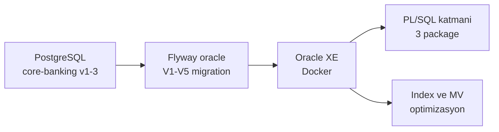
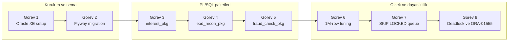
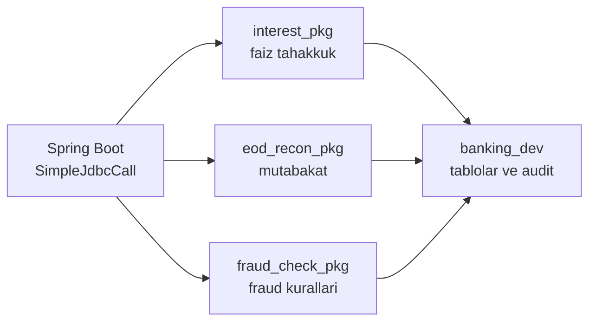
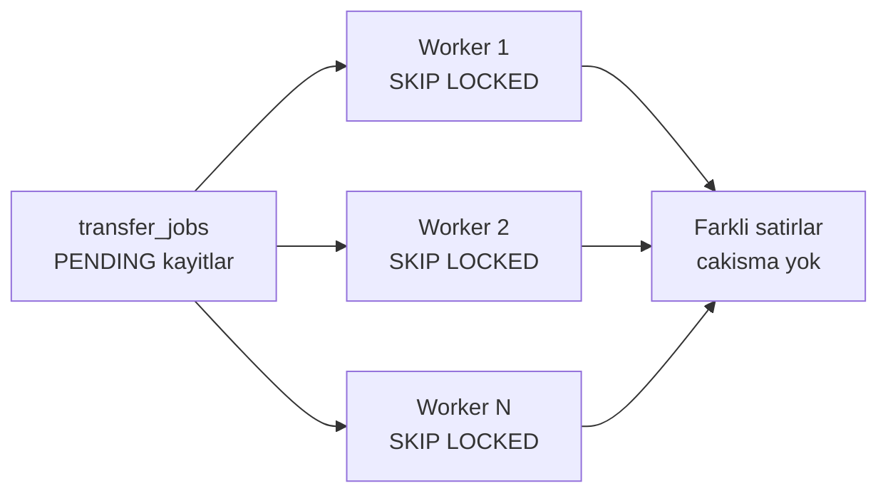

# Phase 4 Mini-Project — `core-banking` Oracle Migration & PL/SQL

```admonish info title="Bu projede"
- Phase 1-3'ten gelen `core-banking` projesini PostgreSQL'den **Oracle**'a taşıyor, Flyway ile 5 Oracle-native migration yazıyorsun
- 3 production-grade PL/SQL package (interest, EOD reconciliation, fraud check) yazıp Java'dan `SimpleJdbcCall` ile çağırıyorsun
- 1M-satır raporlama sorgusunu partition + composite index + materialized view ile **50x+** hızlandırıyorsun
- SKIP LOCKED ile distributed job worker queue kurup 10 worker × 100 job fair distribution'ı doğruluyorsun
- Deadlock ve ORA-01555 hatalarını **canlı reproduce** edip fix ediyorsun
```

## Hedef

Phase 4'ün 6 topic'inde index, EXPLAIN, window functions, PL/SQL, Oracle-specific feature'lar ve locking çalıştın. Bu projede hepsini tek serviste birleştirip `core-banking`'i Postgres'ten Oracle'a taşıyorsun. Bu mini-project Phase 4'ün **synthesis**'i — yeni teori yok, **uygulama** var; bir adımda takılırsan ilgili topic'e dön, oku, düzelt.

Projenin sonunda elinde şunlar olacak:

- Oracle XE Docker'da çalışan, Flyway migration'lı tam Oracle banking servisi
- Business logic'in bir kısmı DB'de yaşayan 3 PL/SQL package
- Partitioned + materialized view + optimize index'li raporlama katmanı
- SKIP LOCKED job queue, canlı deadlock + ORA-01555 reproduction'ları
- JaCoCo coverage Phase 1 seviyesinin altına düşmemiş test seti

```admonish tip title="Süre ve önbilgi"
7-10 gün ayır (günde 2-3 saat ciddi çalışma). Başlamadan önce: Phase 4'ün 6 topic'i (4.1-4.6) bitmiş, Phase 1-2-3'teki `core-banking` projen Postgres'te çalışıyor ve `mvn test` yeşil olmalı. Buradaki işin çoğu **migrasyon + birleştirme** + birkaç kasten kırma görevi.
```

Migrasyonun büyük resmi: mevcut Postgres projeni Flyway'in Oracle dialect'iyle yeniden şemalaştırıp, business logic'in bir kısmını PL/SQL'e taşıyor, üstüne performans ve dayanıklılık katmanı ekliyorsun.



---

## Build plan

Sekiz görev var: ilk ikisi Oracle'ı ve şemayı kuruyor, ortadaki üçü PL/SQL paketlerini yazıyor, son üçü ölçek ve dayanıklılığı ekliyor.



---

## Görev 1 — Oracle XE Docker setup (yarım gün)

**Ne yapacaksın:** Oracle XE'yi Docker'da ayağa kaldırıp `banking_dev` schema'sını yaratacak, Spring Boot'u `oracle` profile ile bağlayacaksın. **Neden:** Sonraki her görev çalışan bir Oracle instance'ına yaslanıyor — önce zemin, sonra bina.

### 1.1 Docker compose

Container image'ı, healthcheck ve persistent volume ile `core-banking/docker-compose.oracle.yml` içine tanımla. Healthcheck `sqlplus` ile `select 1 from dual` çalıştırıp instance'ın hazır olduğunu doğrular:

```yaml
services:
  oracle:
    image: container-registry.oracle.com/database/express:21.3.0-xe
    container_name: banking-oracle
    environment:
      ORACLE_PWD: BankingDev2024!
      ORACLE_CHARACTERSET: AL32UTF8
    ports:
      - "1521:1521"
    volumes:
      - oracle_data:/opt/oracle/oradata
    healthcheck:
      test: ["CMD-SHELL", "echo 'select 1 from dual;' | sqlplus -s sys/${ORACLE_PWD}@//localhost:1521/XE as sysdba"]
      interval: 30s
      timeout: 20s
      retries: 10

volumes:
  oracle_data:
```

Ayağa kaldır ve bağlantıyı test et:

```bash
docker compose -f docker-compose.oracle.yml up -d

# Bağlantı testi
docker exec -it banking-oracle bash -c "sqlplus sys/BankingDev2024!@//localhost:1521/XE as sysdba"
```

### 1.2 Banking schema yaratma

İlk girişte `sys` olarak pluggable database'e geçip `banking_dev` kullanıcısını gerekli grant'larla yarat. Materialized view ve `DBMS_LOCK` grant'ları ilerideki görevler için şart:

```sql
-- as sys
ALTER SESSION SET CONTAINER = XEPDB1;

CREATE USER banking_dev IDENTIFIED BY "BankingDev2024!";
GRANT CREATE SESSION, CREATE TABLE, CREATE SEQUENCE, CREATE PROCEDURE, 
      CREATE TRIGGER, CREATE VIEW, CREATE MATERIALIZED VIEW,
      UNLIMITED TABLESPACE TO banking_dev;
GRANT EXECUTE ON DBMS_LOCK TO banking_dev;
GRANT EXECUTE ON DBMS_MVIEW TO banking_dev;
```

### 1.3 Spring Boot config

Oracle JDBC driver'ı `pom.xml`'a ekle, ardından `application-oracle.yml`'da datasource + JPA + Flyway'i Oracle'a göre ayarla. Kritik noktalar: `OracleDialect`, `default_schema: BANKING_DEV` ve Flyway'in Oracle migration klasörünü göstermesi.

```xml
<dependency>
    <groupId>com.oracle.database.jdbc</groupId>
    <artifactId>ojdbc11</artifactId>
    <version>23.3.0.23.09</version>
</dependency>
```

<details>
<summary>Tam kod: application-oracle.yml (~25 satır)</summary>

```yaml
spring:
  datasource:
    url: jdbc:oracle:thin:@//localhost:1521/XEPDB1
    username: banking_dev
    password: ${DB_PASSWORD:BankingDev2024!}
    driver-class-name: oracle.jdbc.OracleDriver
    hikari:
      maximum-pool-size: 20
      connection-timeout: 30000
      leak-detection-threshold: 30000
  jpa:
    database-platform: org.hibernate.dialect.OracleDialect
    properties:
      hibernate:
        default_schema: BANKING_DEV
        jdbc:
          batch_size: 50
        order_inserts: true
  flyway:
    locations: classpath:db/migration/oracle
    default-schema: BANKING_DEV
```

</details>

```admonish warning title="Oracle XE ilk giriş tuzakları"
Oracle XE'de servis adı önemli: `sys` bağlantısı `XE` (CDB) üzerinden, uygulama bağlantısı `XEPDB1` (PDB) üzerinden gider. Kullanıcıyı yanlış container'da yaratırsan Spring Boot bağlanamaz. Şifreyi çift tırnakla (`"BankingDev2024!"`) yaz — ünlem işareti aksi halde shell/SQL tarafından yorumlanır.
```

**Kontrol noktası:** `docker-compose.oracle.yml` çalışıyor, `banking_dev` schema oluştu, Spring Boot `oracle` profile ile bağlanıyor. Defterine: Oracle XE versiyonu, ek konfigürasyon notları ve ilk girişte çözdüğün problemleri yaz.

---

## Görev 2 — Flyway Oracle migrations (1 gün)

**Ne yapacaksın:** 5 Flyway migration ile şemayı Oracle-native olarak yeniden kuracaksın — RAW(16) UUID, INTERVAL partitioning, sequence ve IDENTITY dahil. **Neden:** PostgreSQL DDL'i Oracle'da birebir çalışmaz; migrasyonun asıl öğretici kısmı iki veritabanının feature farklarını satır satır görmek.

### 2.1 V1: accounts table

`V1__create_accounts_table.sql`'in kalbi: UUID'i `RAW(16) DEFAULT SYS_GUID()` ile sakla, para/durum invariant'larını CHECK constraint'lerle garanti et. `chk_acc_balance` bakiyenin negatif olmasını yalnızca kapalı hesapta serbest bırakır:

```sql
CREATE TABLE accounts (
    id              RAW(16) DEFAULT SYS_GUID() PRIMARY KEY,
    owner_id        RAW(16) NOT NULL,
    currency        CHAR(3) NOT NULL,
    balance_amount  NUMBER(19, 4) DEFAULT 0 NOT NULL,
    status          VARCHAR2(20) DEFAULT 'ACTIVE' NOT NULL,
    version         NUMBER(19) DEFAULT 0 NOT NULL,
    -- ... audit kolonları
    CONSTRAINT chk_acc_status CHECK (status IN ('ACTIVE', 'FROZEN', 'CLOSED')),
    CONSTRAINT chk_acc_currency CHECK (REGEXP_LIKE(currency, '^[A-Z]{3}$')),
    CONSTRAINT chk_acc_balance CHECK (balance_amount >= 0 OR status = 'CLOSED')
);
```

Account ID sequence'i `CACHE 50` ile yaratılır (banking standardı — allocation overhead'ini düşürür), status için partial index ile kapalı hesaplar dışarıda tutulur.

<details>
<summary>Tam kod: V1__create_accounts_table.sql (~30 satır)</summary>

```sql
-- Account ID için sequence (CACHE 50 banking standardı)
CREATE SEQUENCE seq_account_id 
    START WITH 1 INCREMENT BY 1 
    CACHE 50 NOORDER NOCYCLE;

CREATE TABLE accounts (
    id              RAW(16) DEFAULT SYS_GUID() PRIMARY KEY,
    owner_id        RAW(16) NOT NULL,
    currency        CHAR(3) NOT NULL,
    balance_amount  NUMBER(19, 4) DEFAULT 0 NOT NULL,
    status          VARCHAR2(20) DEFAULT 'ACTIVE' NOT NULL,
    opened_at       TIMESTAMP WITH TIME ZONE DEFAULT SYSTIMESTAMP NOT NULL,
    closed_at       TIMESTAMP WITH TIME ZONE,
    version         NUMBER(19) DEFAULT 0 NOT NULL,
    created_by      VARCHAR2(100) DEFAULT 'system' NOT NULL,
    updated_by      VARCHAR2(100) DEFAULT 'system' NOT NULL,
    
    CONSTRAINT chk_acc_status CHECK (status IN ('ACTIVE', 'FROZEN', 'CLOSED')),
    CONSTRAINT chk_acc_currency CHECK (REGEXP_LIKE(currency, '^[A-Z]{3}$')),
    CONSTRAINT chk_acc_balance CHECK (balance_amount >= 0 OR status = 'CLOSED')
);

CREATE INDEX idx_acc_owner ON accounts(owner_id);
CREATE INDEX idx_acc_status_owner ON accounts(status, owner_id) WHERE status != 'CLOSED';

COMMENT ON TABLE accounts IS 'Customer bank accounts with double-entry ledger';
COMMENT ON COLUMN accounts.id IS 'UUID stored as RAW(16)';
COMMENT ON COLUMN accounts.balance_amount IS 'Maintained balance, authoritative from journal_lines';
COMMENT ON COLUMN accounts.version IS 'Optimistic locking via @Version';
```

</details>

### 2.2 V2: journal tables (partitioned)

`journal_entries` ve `journal_lines` aya göre **INTERVAL partitioning** kullanır — Oracle her yeni ay için partition'ı otomatik yaratır, elle bakım gerekmez. Partition key'i primary key'e dahil etmek zorundasın:

```sql
CREATE TABLE journal_entries (
    id              RAW(16) DEFAULT SYS_GUID() NOT NULL,
    transaction_id  RAW(16) NOT NULL,
    occurred_at     TIMESTAMP WITH TIME ZONE DEFAULT SYSTIMESTAMP NOT NULL,
    -- ...
    CONSTRAINT pk_journal_entries PRIMARY KEY (id, occurred_at)
)
PARTITION BY RANGE (occurred_at)
INTERVAL (NUMTOYMINTERVAL(1, 'MONTH'))
(PARTITION p_initial VALUES LESS THAN (TIMESTAMP '2024-01-01 00:00:00 UTC'));
```

`journal_lines` aynı partition stratejisini taşır, index'leri `LOCAL` (her partition kendi index'i) tanımlanır ve fast refresh için materialized view log kurulur.

<details>
<summary>Tam kod: V2__create_journal_tables.sql (~44 satır)</summary>

```sql
-- Journal entries — INTERVAL partitioned by month
CREATE TABLE journal_entries (
    id              RAW(16) DEFAULT SYS_GUID() NOT NULL,
    transaction_id  RAW(16) NOT NULL,
    description     VARCHAR2(500),
    occurred_at     TIMESTAMP WITH TIME ZONE DEFAULT SYSTIMESTAMP NOT NULL,
    created_by      VARCHAR2(100) NOT NULL,
    
    CONSTRAINT pk_journal_entries PRIMARY KEY (id, occurred_at),
    CONSTRAINT uk_journal_tx UNIQUE (transaction_id, occurred_at)
)
PARTITION BY RANGE (occurred_at)
INTERVAL (NUMTOYMINTERVAL(1, 'MONTH'))
(PARTITION p_initial VALUES LESS THAN (TIMESTAMP '2024-01-01 00:00:00 UTC'));

-- Journal lines — partitioned same as parent
CREATE TABLE journal_lines (
    id                  RAW(16) DEFAULT SYS_GUID() NOT NULL,
    journal_entry_id    RAW(16) NOT NULL,
    journal_occurred_at TIMESTAMP WITH TIME ZONE NOT NULL,  -- partition key
    account_id          RAW(16) NOT NULL,
    direction           VARCHAR2(6) NOT NULL,
    amount              NUMBER(19, 4) NOT NULL,
    currency            CHAR(3) NOT NULL,
    
    CONSTRAINT pk_journal_lines PRIMARY KEY (id, journal_occurred_at),
    CONSTRAINT chk_jl_direction CHECK (direction IN ('DEBIT', 'CREDIT')),
    CONSTRAINT chk_jl_amount CHECK (amount > 0)
)
PARTITION BY RANGE (journal_occurred_at)
INTERVAL (NUMTOYMINTERVAL(1, 'MONTH'))
(PARTITION p_initial VALUES LESS THAN (TIMESTAMP '2024-01-01 00:00:00 UTC'));

-- Local indexes (her partition kendi index'i)
CREATE INDEX idx_jl_account ON journal_lines(account_id) LOCAL;
CREATE INDEX idx_jl_entry ON journal_lines(journal_entry_id) LOCAL;

-- Materialized view log (fast refresh için)
CREATE MATERIALIZED VIEW LOG ON journal_lines 
    WITH ROWID, SEQUENCE (account_id, direction, amount, currency, journal_occurred_at)
    INCLUDING NEW VALUES;
```

</details>

### 2.3 V3-V5: idempotency, reconciliation, fraud tabloları

Kalan üç migration destekleyici tabloları kurar: idempotency key'ler (CLOB response body + 24 saatlik expiry), reconciliation/interest/audit tabloları ve fraud alert tablosu. Audit tablosu Oracle 12c+ `IDENTITY` kolonu kullanır (sequence yerine).

<details>
<summary>Tam kod: V3-V5 migration'lar (~55 satır)</summary>

```sql
-- V3__create_idempotency_keys.sql
CREATE TABLE idempotency_keys (
    key             RAW(16) PRIMARY KEY,
    transfer_id     RAW(16) NOT NULL,
    request_hash    VARCHAR2(64) NOT NULL,
    response_status NUMBER(3) NOT NULL,
    response_body   CLOB NOT NULL,
    created_at      TIMESTAMP WITH TIME ZONE DEFAULT SYSTIMESTAMP NOT NULL,
    expires_at      TIMESTAMP WITH TIME ZONE DEFAULT (SYSTIMESTAMP + INTERVAL '24' HOUR) NOT NULL
);

CREATE INDEX idx_idempotency_expires ON idempotency_keys(expires_at);

-- V4__create_reconciliation_tables.sql
CREATE TABLE reconciliation_mismatches (
    id                  RAW(16) DEFAULT SYS_GUID() PRIMARY KEY,
    business_date       DATE NOT NULL,
    account_id          RAW(16) NOT NULL,
    stored_balance      NUMBER(19, 4) NOT NULL,
    calculated_balance  NUMBER(19, 4) NOT NULL,
    diff_amount         NUMBER(19, 4) NOT NULL,
    detected_at         TIMESTAMP WITH TIME ZONE DEFAULT SYSTIMESTAMP NOT NULL,
    resolved_at         TIMESTAMP WITH TIME ZONE,
    resolution_note     VARCHAR2(500),
    
    CONSTRAINT uk_recon_unique UNIQUE (business_date, account_id)
);

CREATE INDEX idx_recon_unresolved ON reconciliation_mismatches(business_date) 
    WHERE resolved_at IS NULL;

CREATE TABLE interest_postings (
    id              RAW(16) DEFAULT SYS_GUID() PRIMARY KEY,
    account_id      RAW(16) NOT NULL,
    business_date   DATE NOT NULL,
    amount          NUMBER(19, 4) NOT NULL,
    rate            NUMBER(7, 4) NOT NULL,
    days            NUMBER(5) NOT NULL,
    posted_at       TIMESTAMP WITH TIME ZONE DEFAULT SYSTIMESTAMP NOT NULL,
    
    CONSTRAINT uk_interest_unique UNIQUE (account_id, business_date)
);

CREATE TABLE audit_log (
    id          NUMBER GENERATED ALWAYS AS IDENTITY PRIMARY KEY,
    event_type  VARCHAR2(50) NOT NULL,
    event_data  VARCHAR2(4000),
    logged_at   TIMESTAMP WITH TIME ZONE DEFAULT SYSTIMESTAMP NOT NULL,
    logged_by   VARCHAR2(100) DEFAULT USER NOT NULL
);

CREATE INDEX idx_audit_logged_at ON audit_log(logged_at);

-- V5__create_fraud_tables.sql
CREATE TABLE fraud_alerts (
    id              RAW(16) DEFAULT SYS_GUID() PRIMARY KEY,
    transaction_id  RAW(16) NOT NULL,
    account_id      RAW(16) NOT NULL,
    rule_code       VARCHAR2(50) NOT NULL,
    severity        VARCHAR2(10) NOT NULL,
    score           NUMBER(5, 2) NOT NULL,
    evidence        CLOB,
    detected_at     TIMESTAMP WITH TIME ZONE DEFAULT SYSTIMESTAMP NOT NULL,
    
    CONSTRAINT chk_fraud_severity CHECK (severity IN ('LOW', 'MEDIUM', 'HIGH', 'CRITICAL'))
);

CREATE INDEX idx_fraud_account ON fraud_alerts(account_id, detected_at);
```

</details>

### 2.4 Validation

Uygulamayı `oracle` profile ile çalıştırıp `flyway_schema_history` tablosunda 5 başarılı kayıt olduğunu doğrula:

```bash
mvn spring-boot:run -Dspring.profiles.active=oracle

docker exec -it banking-oracle sqlplus banking_dev/BankingDev2024!@//localhost:1521/XEPDB1
SQL> SELECT version, description, success FROM flyway_schema_history ORDER BY installed_rank;
```

**Kontrol noktası:** V1-V5 dosyaları yazıldı, hepsi Flyway tarafından uygulandı, `flyway_schema_history`'de 5 success kaydı var. Defterine: PostgreSQL → Oracle'da değişen 8+ şeyi yaz (UUID handling, currency CHECK, INTERVAL partitioning, sequence vs IDENTITY vs SYS_GUID, vb.).

---

## PL/SQL paketlerinin rolü

Sonraki üç görevde business logic'in bir kısmını DB'ye taşıyorsun. Java tarafı `SimpleJdbcCall` ile package procedure'larını çağırır; paketler tablolar üzerinde çalışıp audit log yazar.



```admonish warning title="FORALL şart, WHEN OTHERS THEN NULL yasak"
Üç paketin de iki demir kuralı var: <mark>bulk DML'i FORALL ile yaz, döngü içinde tek-satır INSERT/UPDATE yazma</mark> — aksi halde her satır ayrı SQL round-trip olur. Ve <mark>`WHEN OTHERS THEN NULL` asla yazma</mark>; her handler hatayı audit'e loglayıp `RAISE` etmeli, yoksa hatalar sessizce yutulur.
```

---

## Görev 3 — `interest_pkg` PL/SQL package (1 gün)

**Ne yapacaksın:** Günlük faiz tahakkukunu BULK COLLECT + FORALL pattern'iyle yapan bir package yazacaksın; compound + simple interest fonksiyonları ve idempotency içerir. **Neden:** EOD faiz milyonlarca hesapta koşar — satır satır DML kabul edilemez; bulk pattern Topic 4.4'ün merkezi tekniği.

### 3.1 Package specification

Spec, public arayüzü tanımlar: sabitler, custom exception'lar (`PRAGMA EXCEPTION_INIT` ile ORA koduna bağlanır), record type'lar ve procedure/function imzaları.

```sql
CREATE OR REPLACE PACKAGE banking_dev.interest_pkg AS
    DEFAULT_RATE CONSTANT NUMBER := 8.5;  -- Default annual rate
    MIN_BALANCE_FOR_ACCRUAL CONSTANT NUMBER := 100;
    
    insufficient_balance EXCEPTION;
    PRAGMA EXCEPTION_INIT(insufficient_balance, -20100);
    
    PROCEDURE accrue_daily(p_business_date IN DATE);
    FUNCTION calculate_compound_interest(
        p_balance NUMBER, p_rate NUMBER DEFAULT DEFAULT_RATE, p_days NUMBER DEFAULT 1
    ) RETURN NUMBER;
    -- ... simple_interest, get_accrual_summary
END interest_pkg;
/
```

<details>
<summary>Tam kod: interest_pkg_spec.sql (~40 satır)</summary>

```sql
CREATE OR REPLACE PACKAGE banking_dev.interest_pkg AS
    -- Constants
    DEFAULT_RATE CONSTANT NUMBER := 8.5;  -- Default annual rate
    MIN_BALANCE_FOR_ACCRUAL CONSTANT NUMBER := 100;
    
    -- Custom exceptions
    insufficient_balance EXCEPTION;
    PRAGMA EXCEPTION_INIT(insufficient_balance, -20100);
    
    invalid_business_date EXCEPTION;
    PRAGMA EXCEPTION_INIT(invalid_business_date, -20101);
    
    -- Public types
    TYPE accrual_summary IS RECORD (
        accounts_processed NUMBER,
        total_interest_posted NUMBER,
        skipped_accounts NUMBER,
        elapsed_seconds NUMBER
    );
    
    -- Public procedures
    PROCEDURE accrue_daily(p_business_date IN DATE);
    
    -- Public functions
    FUNCTION calculate_compound_interest(
        p_balance NUMBER,
        p_rate NUMBER DEFAULT DEFAULT_RATE,
        p_days NUMBER DEFAULT 1
    ) RETURN NUMBER;
    
    FUNCTION calculate_simple_interest(
        p_balance NUMBER,
        p_rate NUMBER DEFAULT DEFAULT_RATE,
        p_days NUMBER DEFAULT 1
    ) RETURN NUMBER;
    
    FUNCTION get_accrual_summary(p_business_date IN DATE) RETURN accrual_summary;
    
END interest_pkg;
/
```

</details>

### 3.2 Package body — BULK COLLECT + FORALL

Body'nin öğretici çekirdeği `accrue_daily`: cursor'ı `BULK COLLECT ... LIMIT 1000` ile parça parça çeker (memory kontrolü), her batch'i FORALL ile toplu insert/update eder. `LIMIT 1000` olmadan 1M satır tek seferde PGA'yı şişirir:

```sql
OPEN c;
LOOP
    FETCH c BULK COLLECT INTO v_accounts LIMIT 1000;
    EXIT WHEN v_accounts.COUNT = 0;

    -- Bulk insert interest postings (loop değil, FORALL)
    FORALL i IN 1 .. v_accounts.COUNT
        INSERT INTO interest_postings(account_id, business_date, amount, rate, days)
        VALUES (v_accounts(i).id, p_business_date,
                calculate_compound_interest(v_accounts(i).balance, DEFAULT_RATE, 1),
                DEFAULT_RATE, 1);
END LOOP;
CLOSE c;
```

İki koruma kritik: future date reddi (`RAISE_APPLICATION_ERROR -20101`) ve <mark>aynı business_date için accrual yalnızca bir kez çalışır</mark> — mevcut posting varsa `-20102` fırlatır. Exception handler hatayı audit'e yazıp `RAISE` eder.

<details>
<summary>Tam kod: interest_pkg_body.sql (~170 satır)</summary>

```sql
CREATE OR REPLACE PACKAGE BODY banking_dev.interest_pkg AS
    
    -- Private helper
    FUNCTION daily_rate(p_annual_rate NUMBER) RETURN NUMBER IS
    BEGIN
        RETURN p_annual_rate / 100 / 365;
    END;
    
    -- Simple interest: P * R * T (no compounding within period)
    FUNCTION calculate_simple_interest(
        p_balance NUMBER, 
        p_rate NUMBER, 
        p_days NUMBER
    ) RETURN NUMBER IS
    BEGIN
        IF p_balance IS NULL OR p_balance <= 0 THEN
            RETURN 0;
        END IF;
        IF p_rate IS NULL OR p_rate <= 0 THEN
            RETURN 0;
        END IF;
        IF p_days IS NULL OR p_days <= 0 THEN
            RETURN 0;
        END IF;
        
        RETURN ROUND(p_balance * (p_rate / 100) * (p_days / 365), 4);
    END;
    
    -- Compound interest: P * ((1 + r)^n - 1)
    FUNCTION calculate_compound_interest(
        p_balance NUMBER, 
        p_rate NUMBER, 
        p_days NUMBER
    ) RETURN NUMBER IS
        v_daily_rate NUMBER;
        v_compound_factor NUMBER;
    BEGIN
        IF p_balance IS NULL OR p_balance <= 0 THEN RETURN 0; END IF;
        IF p_rate IS NULL OR p_rate <= 0 THEN RETURN 0; END IF;
        IF p_days IS NULL OR p_days <= 0 THEN RETURN 0; END IF;
        
        v_daily_rate := daily_rate(p_rate);
        v_compound_factor := POWER(1 + v_daily_rate, p_days);
        
        RETURN ROUND(p_balance * (v_compound_factor - 1), 4);
    END;
    
    -- Main accrual procedure
    PROCEDURE accrue_daily(p_business_date IN DATE) IS
        TYPE acc_rec_type IS RECORD (
            id RAW(16),
            balance NUMBER,
            currency CHAR(3)
        );
        TYPE acc_table IS TABLE OF acc_rec_type;
        v_accounts acc_table;
        
        v_interest NUMBER;
        v_count_processed NUMBER := 0;
        v_total_posted NUMBER := 0;
        v_count_skipped NUMBER := 0;
        v_start_time TIMESTAMP := SYSTIMESTAMP;
        
        CURSOR c IS 
            SELECT id, balance_amount, currency 
            FROM accounts 
            WHERE status = 'ACTIVE'
              AND balance_amount >= MIN_BALANCE_FOR_ACCRUAL
              AND TRUNC(opened_at) < p_business_date
            ORDER BY id;
    BEGIN
        -- Pre-check: business date validation
        IF p_business_date > SYSDATE THEN
            RAISE_APPLICATION_ERROR(-20101, 'Cannot accrue for future date: ' || p_business_date);
        END IF;
        
        -- Idempotency: bu tarih için zaten posting var mı?
        DECLARE
            v_existing NUMBER;
        BEGIN
            SELECT COUNT(*) INTO v_existing 
            FROM interest_postings 
            WHERE business_date = p_business_date;
            
            IF v_existing > 0 THEN
                RAISE_APPLICATION_ERROR(-20102, 
                    'Accrual for date ' || p_business_date || ' already processed: ' || v_existing || ' postings');
            END IF;
        END;
        
        -- BULK COLLECT + FORALL pattern (Topic 4.4)
        OPEN c;
        LOOP
            FETCH c BULK COLLECT INTO v_accounts LIMIT 1000;
            EXIT WHEN v_accounts.COUNT = 0;
            
            -- Calculate interest per account
            FOR i IN 1 .. v_accounts.COUNT LOOP
                v_interest := calculate_compound_interest(
                    v_accounts(i).balance, 
                    DEFAULT_RATE, 
                    1
                );
                
                IF v_interest > 0 THEN
                    v_total_posted := v_total_posted + v_interest;
                    v_count_processed := v_count_processed + 1;
                ELSE
                    v_count_skipped := v_count_skipped + 1;
                END IF;
            END LOOP;
            
            -- Bulk insert interest postings
            FORALL i IN 1 .. v_accounts.COUNT
                INSERT INTO interest_postings(account_id, business_date, amount, rate, days)
                VALUES (
                    v_accounts(i).id,
                    p_business_date,
                    calculate_compound_interest(v_accounts(i).balance, DEFAULT_RATE, 1),
                    DEFAULT_RATE,
                    1
                );
            
            -- Bulk update account balances
            FORALL i IN 1 .. v_accounts.COUNT
                UPDATE accounts 
                SET balance_amount = balance_amount + 
                    calculate_compound_interest(v_accounts(i).balance, DEFAULT_RATE, 1),
                    updated_by = 'INTEREST_PKG'
                WHERE id = v_accounts(i).id;
        END LOOP;
        CLOSE c;
        
        -- Audit
        INSERT INTO audit_log(event_type, event_data)
        VALUES ('INTEREST_ACCRUED', 
                'Date: ' || p_business_date || 
                ', Processed: ' || v_count_processed || 
                ', Total: ' || v_total_posted ||
                ', Skipped: ' || v_count_skipped ||
                ', Elapsed: ' || ROUND(EXTRACT(SECOND FROM (SYSTIMESTAMP - v_start_time)), 2) || 's');
        
        COMMIT;
    EXCEPTION
        WHEN OTHERS THEN
            IF c%ISOPEN THEN CLOSE c; END IF;
            ROLLBACK;
            INSERT INTO audit_log(event_type, event_data)
            VALUES ('INTEREST_ERROR', 
                    'Date: ' || p_business_date || 
                    ', Error: ' || SQLERRM || 
                    ', Stack: ' || DBMS_UTILITY.FORMAT_ERROR_BACKTRACE);
            COMMIT;
            RAISE;
    END accrue_daily;
    
    FUNCTION get_accrual_summary(p_business_date IN DATE) RETURN accrual_summary IS
        v_summary accrual_summary;
    BEGIN
        SELECT COUNT(*), NVL(SUM(amount), 0), 0, 0
        INTO v_summary.accounts_processed, v_summary.total_interest_posted,
             v_summary.skipped_accounts, v_summary.elapsed_seconds
        FROM interest_postings 
        WHERE business_date = p_business_date;
        
        RETURN v_summary;
    END;
    
END interest_pkg;
/
```

</details>

### 3.3 Java entegrasyonu

Java tarafı package'i `SimpleJdbcCall` ile çağırır. Kritik detay: ORA-20102'yi yakalayıp domain exception'a (`AlreadyProcessedException`) çevirmek — böylece idempotency ihlali temiz bir tipe map olur:

```java
try {
    call.execute(params);
} catch (DataAccessException e) {
    if (e.getMessage().contains("ORA-20102")) {
        throw new AlreadyProcessedException("Accrual already done for " + businessDate);
    }
    throw e;
}
```

<details>
<summary>Tam kod: InterestRepository.java (~50 satır)</summary>

```java
@Repository
public class InterestRepository {
    
    private final JdbcTemplate jdbc;
    
    public InterestRepository(JdbcTemplate jdbc) {
        this.jdbc = jdbc;
    }
    
    public void runDailyAccrual(LocalDate businessDate) {
        SimpleJdbcCall call = new SimpleJdbcCall(jdbc)
            .withCatalogName("INTEREST_PKG")
            .withProcedureName("ACCRUE_DAILY")
            .withSchemaName("BANKING_DEV");
        
        Map<String, Object> params = Map.of(
            "P_BUSINESS_DATE", java.sql.Date.valueOf(businessDate)
        );
        
        try {
            call.execute(params);
        } catch (DataAccessException e) {
            if (e.getMessage().contains("ORA-20102")) {
                throw new AlreadyProcessedException("Accrual already done for " + businessDate);
            }
            throw e;
        }
    }
    
    public BigDecimal calculateCompoundInterest(BigDecimal balance, BigDecimal rate, int days) {
        return jdbc.queryForObject(
            "SELECT BANKING_DEV.INTEREST_PKG.CALCULATE_COMPOUND_INTEREST(?, ?, ?) FROM DUAL",
            BigDecimal.class, balance, rate, days
        );
    }
    
    public AccrualSummary getSummary(LocalDate businessDate) {
        return jdbc.queryForObject("""
            SELECT 
                COUNT(*) AS accounts_processed,
                NVL(SUM(amount), 0) AS total_interest
            FROM BANKING_DEV.interest_postings 
            WHERE business_date = ?
            """, (rs, n) -> new AccrualSummary(
                rs.getInt("accounts_processed"),
                rs.getBigDecimal("total_interest")
            ), java.sql.Date.valueOf(businessDate));
    }
}
```

</details>

### 3.4 Test

4 integration test yaz: happy path (100 hesap tahakkuk), duplicate reddi, compound formül doğruluğu ve future date reddi. Compound testi SQL fonksiyonunun sonucunu bilinen bir değerle (10000 @ %8.5, 30 gün ≈ 70.04) karşılaştırır.

<details>
<summary>Tam kod: InterestRepositoryIT.java (~54 satır)</summary>

```java
@SpringBootTest
@ActiveProfiles("oracle")
@Testcontainers
class InterestRepositoryIT {
    
    @Autowired InterestRepository interestRepo;
    @Autowired AccountRepository accountRepo;
    
    @Test
    @Sql("/test-data/100-active-accounts.sql")
    void shouldAccrueInterestForActiveAccounts() {
        LocalDate businessDate = LocalDate.now().minusDays(1);
        
        interestRepo.runDailyAccrual(businessDate);
        
        AccrualSummary summary = interestRepo.getSummary(businessDate);
        assertThat(summary.accountsProcessed()).isEqualTo(100);
        assertThat(summary.totalInterest()).isPositive();
    }
    
    @Test
    @Sql("/test-data/100-active-accounts.sql")
    void shouldRejectDuplicateAccrual() {
        LocalDate businessDate = LocalDate.now().minusDays(1);
        
        interestRepo.runDailyAccrual(businessDate);
        
        assertThatThrownBy(() -> interestRepo.runDailyAccrual(businessDate))
            .isInstanceOf(AlreadyProcessedException.class);
    }
    
    @Test
    void calculateCompoundInterestShouldMatchExpected() {
        // 10000 * (1 + 0.085/365)^30 - 10000 ≈ 70.04
        BigDecimal result = interestRepo.calculateCompoundInterest(
            new BigDecimal("10000.00"), 
            new BigDecimal("8.5"), 
            30
        );
        
        assertThat(result).isCloseTo(new BigDecimal("70.04"), 
            within(new BigDecimal("0.10")));
    }
    
    @Test
    void shouldRejectFutureBusinessDate() {
        LocalDate future = LocalDate.now().plusDays(1);
        
        assertThatThrownBy(() -> interestRepo.runDailyAccrual(future))
            .isInstanceOf(DataAccessException.class)
            .hasMessageContaining("ORA-20101");
    }
}
```

</details>

**Kontrol noktası:** `interest_pkg` spec + body deploy edildi, Java'dan `SimpleJdbcCall` ile çağrılıyor, aynı businessDate iki kere → exception, bulk DML FORALL ile yapılıyor, 4 test geçiyor. Defterine: BULK COLLECT LIMIT 1000 ile memory yönetimi ve audit için autonomous transaction kullanıp kullanmama kararını yaz.

---

## Görev 4 — `eod_reconciliation_pkg` (1 gün)

**Ne yapacaksın:** Gün sonu mutabakat package'ini yazacaksın: her hesabın stored balance'ını `journal_lines`'tan hesaplanan authoritative balance ile karşılaştırıp mismatch'leri toplu kaydeder. **Neden:** Bankada "kayıtlı bakiye" ile "hareketlerden hesaplanan bakiye" ayrışabilir; mutabakat bu farkı yakalayan güvenlik ağıdır.

Reconcile procedure'ün özü: bir subquery `journal_lines`'tan CREDIT-DEBIT toplamını hesaplar, stored balance ile eşitsizleri `BULK COLLECT` eder, ardından FORALL ile `reconciliation_mismatches`'e yazar. `DUP_VAL_ON_INDEX` handler'ı aynı günün iki kez reconcile edilmesini idempotent kılar.

```sql
SELECT account_id, stored_balance, calculated_balance
BULK COLLECT INTO v_mismatches
FROM ( /* stored vs SUM(CASE direction) from journal_lines */ )
WHERE stored_balance != calculated_balance;

FORALL i IN 1 .. v_mismatches.COUNT
    INSERT INTO reconciliation_mismatches(business_date, account_id, ...)
    VALUES (p_business_date, v_mismatches(i).account_id, ...);
```

```admonish tip title="Authoritative source kararı senin"
Mutabakatta sormanı istediğim asıl soru: hangisi doğru — `accounts.balance_amount` mı yoksa `SUM(journal_lines)` mı? Double-entry sistemde journal genelde authoritative'dir (append-only, düzeltilmez); stored balance ise performans için tutulan türevdir. Kararını ve gerekçeni defterine yaz — mülakatta bu tartışma sorulur.
```

<details>
<summary>Tam kod: eod_reconciliation_pkg (spec + body, ~113 satır)</summary>

```sql
CREATE OR REPLACE PACKAGE banking_dev.eod_reconciliation_pkg AS
    
    PROCEDURE reconcile_balances(p_business_date IN DATE);
    
    FUNCTION get_mismatch_count(p_business_date IN DATE) RETURN NUMBER;
    
    PROCEDURE resolve_mismatch(
        p_mismatch_id IN RAW, 
        p_note IN VARCHAR2
    );
    
END eod_reconciliation_pkg;
/

CREATE OR REPLACE PACKAGE BODY banking_dev.eod_reconciliation_pkg AS
    
    PROCEDURE reconcile_balances(p_business_date IN DATE) IS
        TYPE mismatch_record IS RECORD (
            account_id          RAW(16),
            stored_balance      NUMBER,
            calculated_balance  NUMBER
        );
        TYPE mismatch_table IS TABLE OF mismatch_record;
        v_mismatches mismatch_table;
        v_count NUMBER;
        v_start TIMESTAMP := SYSTIMESTAMP;
    BEGIN
        -- Authoritative balance from journal_lines vs stored balance
        SELECT account_id, stored_balance, calculated_balance
        BULK COLLECT INTO v_mismatches
        FROM (
            SELECT 
                a.id AS account_id,
                a.balance_amount AS stored_balance,
                NVL((
                    SELECT SUM(CASE 
                        WHEN jl.direction = 'CREDIT' THEN jl.amount 
                        WHEN jl.direction = 'DEBIT' THEN -jl.amount 
                    END)
                    FROM journal_lines jl
                    WHERE jl.account_id = a.id
                      AND jl.journal_occurred_at <= p_business_date + INTERVAL '1' DAY
                ), 0) AS calculated_balance
            FROM accounts a
            WHERE a.status != 'CLOSED'
        )
        WHERE stored_balance != calculated_balance;
        
        v_count := v_mismatches.COUNT;
        
        -- Bulk insert mismatches
        FORALL i IN 1 .. v_count
            INSERT INTO reconciliation_mismatches(
                business_date, account_id, stored_balance, 
                calculated_balance, diff_amount
            ) VALUES (
                p_business_date,
                v_mismatches(i).account_id,
                v_mismatches(i).stored_balance,
                v_mismatches(i).calculated_balance,
                v_mismatches(i).stored_balance - v_mismatches(i).calculated_balance
            );
        
        -- Audit
        INSERT INTO audit_log(event_type, event_data)
        VALUES ('EOD_RECONCILIATION',
                'Date: ' || p_business_date || 
                ', Mismatches: ' || v_count ||
                ', Elapsed: ' || ROUND(EXTRACT(SECOND FROM (SYSTIMESTAMP - v_start)), 2));
        
        COMMIT;
    EXCEPTION
        WHEN DUP_VAL_ON_INDEX THEN
            ROLLBACK;
            INSERT INTO audit_log(event_type, event_data)
            VALUES ('EOD_RECONCILIATION_DUPLICATE', 'Date already reconciled: ' || p_business_date);
            COMMIT;
        WHEN OTHERS THEN
            ROLLBACK;
            INSERT INTO audit_log(event_type, event_data)
            VALUES ('EOD_RECONCILIATION_ERROR', SQLERRM || ' Stack: ' || DBMS_UTILITY.FORMAT_ERROR_BACKTRACE);
            COMMIT;
            RAISE;
    END reconcile_balances;
    
    FUNCTION get_mismatch_count(p_business_date IN DATE) RETURN NUMBER IS
        v_count NUMBER;
    BEGIN
        SELECT COUNT(*) INTO v_count
        FROM reconciliation_mismatches
        WHERE business_date = p_business_date
          AND resolved_at IS NULL;
        RETURN v_count;
    END;
    
    PROCEDURE resolve_mismatch(p_mismatch_id IN RAW, p_note IN VARCHAR2) IS
    BEGIN
        UPDATE reconciliation_mismatches 
        SET resolved_at = SYSTIMESTAMP, resolution_note = p_note
        WHERE id = p_mismatch_id;
        
        IF SQL%ROWCOUNT = 0 THEN
            RAISE_APPLICATION_ERROR(-20200, 'Mismatch not found: ' || RAWTOHEX(p_mismatch_id));
        END IF;
        
        INSERT INTO audit_log(event_type, event_data)
        VALUES ('MISMATCH_RESOLVED', 'ID: ' || RAWTOHEX(p_mismatch_id) || ', Note: ' || p_note);
        
        COMMIT;
    END;
    
END eod_reconciliation_pkg;
/
```

</details>

### Test: kasten boz, yakala

Testin fikri basit ve güçlü: 5 hesabın stored balance'ını manuel boz, EOD recon çalıştır, tam 5 mismatch beklendiğini doğrula.

<details>
<summary>Tam kod: reconciliation testi (~20 satır)</summary>

```java
@Test
@Sql("/test-data/1000-accounts.sql")
void shouldDetectIntentionalBalanceMismatch() {
    // 5 hesabın stored balance'ını manuel boz
    jdbc.update("""
        UPDATE BANKING_DEV.accounts 
        SET balance_amount = balance_amount + 1000 
        WHERE ROWNUM <= 5
        """);
    
    // EOD recon çalıştır
    eodRecon.run(LocalDate.now());
    
    // 5 mismatch beklenir
    Integer count = jdbc.queryForObject(
        "SELECT COUNT(*) FROM BANKING_DEV.reconciliation_mismatches WHERE business_date = ?",
        Integer.class, java.sql.Date.valueOf(LocalDate.now())
    );
    assertThat(count).isEqualTo(5);
}
```

</details>

**Kontrol noktası:** `eod_reconciliation_pkg` deploy edildi, kasten yaratılan 5 mismatch'in 5'i de yakalandı, bulk insert FORALL ile yapılıyor, resolve workflow (operator manuel fix) çalışıyor. Defterine: authoritative source kararını (stored vs calculated) gerekçesiyle yaz.

---

## Görev 5 — `fraud_check_pkg` (1 gün)

**Ne yapacaksın:** Window/aggregate function pattern'iyle çalışan fraud kuralları yazacaksın — en az 2 kural: aynı hesaptan 1 dakikada 5+ işlem (high frequency) ve 24 saatte 10000+ kümülatif debit (large cumulative). **Neden:** Fraud detection Topic 4.3'teki aggregate + window function'ların gerçek dünya uygulaması; kurallar SQL'de en verimli ifade edilir.

`rule_high_frequency` dakika penceresine göre grupla-say yapar, `HAVING COUNT(*) >= 5` ile tetiklenir ve severity'i işlem sayısına göre CASE ile derecelendirir. `NOT EXISTS` bloğu aynı alert'in tekrar üretilmesini engeller (idempotency):

```sql
INSERT INTO fraud_alerts(...)
SELECT SYS_GUID(), account_id, 'HIGH_FREQUENCY',
       CASE WHEN tx_count >= 10 THEN 'CRITICAL'
            WHEN tx_count >= 7 THEN 'HIGH' ELSE 'MEDIUM' END,
       LEAST(tx_count * 10, 100), 'Tx count: ' || tx_count
FROM ( /* GROUP BY account_id, TRUNC(occurred_at,'MI') HAVING COUNT(*)>=5 */ )
WHERE NOT EXISTS ( /* aynı hesapta zaten aktif HIGH_FREQUENCY alert */ );
```

<details>
<summary>Tam kod: fraud_check_pkg (spec + body, ~100 satır)</summary>

```sql
CREATE OR REPLACE PACKAGE banking_dev.fraud_check_pkg AS
    PROCEDURE run_rules(p_lookback_minutes IN NUMBER DEFAULT 60);
    FUNCTION get_high_risk_count RETURN NUMBER;
END fraud_check_pkg;
/

CREATE OR REPLACE PACKAGE BODY banking_dev.fraud_check_pkg AS
    
    -- Rule 1: Same account 5+ transactions in 1 minute
    PROCEDURE rule_high_frequency(p_since IN TIMESTAMP) IS
    BEGIN
        INSERT INTO fraud_alerts(transaction_id, account_id, rule_code, severity, score, evidence)
        SELECT 
            SYS_GUID(),
            account_id,
            'HIGH_FREQUENCY',
            CASE 
                WHEN tx_count >= 10 THEN 'CRITICAL'
                WHEN tx_count >= 7 THEN 'HIGH'
                ELSE 'MEDIUM'
            END,
            LEAST(tx_count * 10, 100),
            'Tx count: ' || tx_count || ' in 1 min window'
        FROM (
            SELECT 
                jl.account_id,
                COUNT(*) AS tx_count,
                MIN(je.occurred_at) AS first_tx,
                MAX(je.occurred_at) AS last_tx
            FROM journal_lines jl
            JOIN journal_entries je ON je.id = jl.journal_entry_id 
                AND je.occurred_at = jl.journal_occurred_at
            WHERE je.occurred_at > p_since
              AND jl.direction = 'DEBIT'
            GROUP BY jl.account_id, 
                     TRUNC(je.occurred_at, 'MI')
            HAVING COUNT(*) >= 5
        )
        WHERE NOT EXISTS (
            SELECT 1 FROM fraud_alerts fa 
            WHERE fa.account_id = account_id 
              AND fa.rule_code = 'HIGH_FREQUENCY'
              AND fa.detected_at > p_since
        );
    END;
    
    -- Rule 2: Cumulative debit > 10000 in 24h
    PROCEDURE rule_large_cumulative(p_since IN TIMESTAMP) IS
    BEGIN
        INSERT INTO fraud_alerts(transaction_id, account_id, rule_code, severity, score, evidence)
        SELECT 
            SYS_GUID(),
            account_id,
            'LARGE_CUMULATIVE_24H',
            'HIGH',
            70,
            'Total debit 24h: ' || total_debit
        FROM (
            SELECT 
                jl.account_id,
                SUM(jl.amount) AS total_debit
            FROM journal_lines jl
            JOIN journal_entries je ON je.id = jl.journal_entry_id
            WHERE je.occurred_at > SYSTIMESTAMP - INTERVAL '24' HOUR
              AND jl.direction = 'DEBIT'
            GROUP BY jl.account_id
            HAVING SUM(jl.amount) >= 10000
        );
    END;
    
    -- Rule 3-4: ATM rapid withdraw, first foreign transfer (Skipped for brevity)
    
    PROCEDURE run_rules(p_lookback_minutes IN NUMBER) IS
        v_since TIMESTAMP := SYSTIMESTAMP - NUMTODSINTERVAL(p_lookback_minutes, 'MINUTE');
        v_alert_count NUMBER;
    BEGIN
        rule_high_frequency(v_since);
        rule_large_cumulative(v_since);
        
        SELECT COUNT(*) INTO v_alert_count 
        FROM fraud_alerts 
        WHERE detected_at > v_since;
        
        INSERT INTO audit_log(event_type, event_data)
        VALUES ('FRAUD_RULES_RUN', 'Window: ' || p_lookback_minutes || 'm, Alerts: ' || v_alert_count);
        
        COMMIT;
    END;
    
    FUNCTION get_high_risk_count RETURN NUMBER IS
        v_count NUMBER;
    BEGIN
        SELECT COUNT(*) INTO v_count 
        FROM fraud_alerts 
        WHERE severity IN ('HIGH', 'CRITICAL')
          AND detected_at > SYSTIMESTAMP - INTERVAL '24' HOUR;
        RETURN v_count;
    END;
END;
/
```

</details>

```admonish tip title="Fraud kuralının kaçınılmaz gerilimi"
Fraud kuralını ne kadar agresif ayarlarsan false positive ↑ (masum müşteri bloklanır), ne kadar gevşetirsen kaçırılan dolandırıcılık ↑. Sihirli bir eşik yok; bu bir risk iştahı kararı. Kendi eşiklerinin (5 işlem/dk, 10000/24h) neden o değerde olduğunu defterine gerekçelendir.
```

**Kontrol noktası:** 2 kural (high frequency + large cumulative) implement edildi, window/aggregate function pattern kullanıldı, `NOT EXISTS` idempotency check var. Test: aynı karttan 1 dakikada 100 işlem yarat → `HIGH_FREQUENCY` alert tetiklenmeli. Defterine: false positive vs missed fraud trade-off'unu yaz.

---

## Görev 6 — 1M-row reporting optimization (1 gün)

**Ne yapacaksın:** 1M satırlık test verisi yükleyip yavaş bir raporlama sorgusunu üç adımda hızlandıracaksın: baseline (index'siz) → composite index → materialized view. **Neden:** "50x hızlanma" lafla değil, EXPLAIN PLAN + timing ile kanıtlanır; bu görev optimizasyonun ölçülebilir olduğunu öğretir.

### 6.1 Test data + yavaş sorgu

`CONNECT BY LEVEL` ile 100 hesap ve 1M journal line üret, `DBMS_STATS.GATHER_TABLE_STATS` ile istatistik topla (CBO'nun doğru plan üretmesi için şart). Hedef sorgu: müşterilerin son 30 günlük net hareketi.

<details>
<summary>Tam kod: test data yükleme + yavaş sorgu (~35 satır)</summary>

```sql
-- 100 owner, 10000 transaction her birinde
INSERT INTO accounts(id, owner_id, currency, balance_amount, status)
SELECT SYS_GUID(), SYS_GUID(), 'TRY', DBMS_RANDOM.VALUE(1000, 100000), 'ACTIVE'
FROM DUAL CONNECT BY LEVEL <= 100;

-- 1M transaction
INSERT /*+ APPEND */ INTO journal_lines(id, journal_entry_id, journal_occurred_at, account_id, direction, amount, currency)
SELECT 
    SYS_GUID(), SYS_GUID(),
    SYSTIMESTAMP - DBMS_RANDOM.VALUE(0, 365),
    (SELECT id FROM (SELECT id FROM accounts ORDER BY DBMS_RANDOM.VALUE) WHERE ROWNUM = 1),
    CASE WHEN DBMS_RANDOM.VALUE(0, 1) > 0.5 THEN 'DEBIT' ELSE 'CREDIT' END,
    DBMS_RANDOM.VALUE(10, 5000),
    'TRY'
FROM DUAL CONNECT BY LEVEL <= 1000000;

COMMIT;

EXEC DBMS_STATS.GATHER_TABLE_STATS('BANKING_DEV', 'JOURNAL_LINES', cascade => TRUE);

-- Yavaş sorgu: müşterilerin son 30 günlük net hareketi
SELECT 
    a.owner_id,
    SUM(CASE WHEN jl.direction = 'CREDIT' THEN jl.amount ELSE -jl.amount END) AS net_movement
FROM accounts a
JOIN journal_lines jl ON jl.account_id = a.id
JOIN journal_entries je ON je.id = jl.journal_entry_id
WHERE je.occurred_at > SYSDATE - 30
GROUP BY a.owner_id;
```

</details>

### 6.2 Üç adımda hızlandır

Her adımda `EXPLAIN PLAN FOR ...` + `DBMS_XPLAN.DISPLAY` ile planı, `SET TIMING ON` ile süreyi ölç:

- **Adım 1 — Baseline:** Index yok. Plan'da **Full Table Scan** görürsün, ~30-60 sn.
- **Adım 2 — Composite index:** `CREATE INDEX idx_jl_acc_date ON journal_lines(account_id, journal_occurred_at) LOCAL;` → plan'da **INDEX RANGE SCAN**, ~5-10 sn.
- **Adım 3 — Materialized view:** `BUILD IMMEDIATE + REFRESH FAST ON DEMAND + ENABLE QUERY REWRITE` ile aylık özeti önceden hesapla; reporting endpoint MV'den okur, **<100ms**.

```sql
CREATE MATERIALIZED VIEW mv_owner_monthly_summary
BUILD IMMEDIATE
REFRESH FAST ON DEMAND
ENABLE QUERY REWRITE
AS
SELECT a.owner_id, TRUNC(je.occurred_at, 'MONTH') AS month,
       SUM(CASE WHEN jl.direction = 'CREDIT' THEN jl.amount ELSE -jl.amount END) AS net_amount,
       COUNT(*) AS tx_count
FROM accounts a
JOIN journal_lines jl ON jl.account_id = a.id
JOIN journal_entries je ON je.id = jl.journal_entry_id
GROUP BY a.owner_id, TRUNC(je.occurred_at, 'MONTH');

EXEC DBMS_MVIEW.REFRESH('mv_owner_monthly_summary', 'C');
```

Defterine karşılaştırma tablosunu kendi ölçümlerinle doldur:

| Adım | Plan | Süre |
|---|---|---|
| Baseline | Full Table Scan | __ sn |
| +Index | Index Range Scan | __ sn |
| +MV | MView Query Rewrite | __ ms |

**Kontrol noktası:** Üç adımın da EXPLAIN PLAN'ı incelendi, tablo kendi ölçümlerinle dolu, hızlanma çarpanı 50x+. Defterine: en şaşırtıcı EXPLAIN bulgunu ve fast refresh için MV log'unun neden gerektiğini yaz.

---

## Görev 7 — SKIP LOCKED job worker (1 gün)

**Ne yapacaksın:** `FOR UPDATE SKIP LOCKED` ile distributed job queue kuracak, 10 worker'ın 100 job'ı çakışmadan fair paylaştığını doğrulayacaksın. **Neden:** SKIP LOCKED, kilitli satırları atlayıp bir sonrakine geçerek worker'ların birbirini beklemeden aynı kuyruğu tüketmesini sağlar — modern job queue'ların temeli.

Her worker aynı kuyruğa bakar ama farklı satırları kilitler; kimse kimseyi beklemez:



Önce `transfer_jobs` tablosu (status + priority + partial index), sonra Java worker. Worker'ın kalbi: pending job'u `FOR UPDATE SKIP LOCKED FETCH FIRST 1 ROW ONLY` ile al, hemen `PROCESSING`'e çevir. <mark>SKIP LOCKED olmadan worker'lar aynı satırı işler</mark> ve duplicate processing doğar:

```sql
CREATE INDEX idx_jobs_pending 
    ON BANKING_DEV.transfer_jobs(status, priority DESC, created_at) 
    WHERE status = 'PENDING';
```

```java
jdbc.query("""
    SELECT id, payload FROM BANKING_DEV.transfer_jobs 
    WHERE status = 'PENDING'
    ORDER BY priority DESC, created_at
    FOR UPDATE SKIP LOCKED 
    FETCH FIRST 1 ROWS ONLY
    """, rs -> { /* PROCESSING'e çevir, worker_id yaz */ });
```

Worker `REQUIRES_NEW` propagation kullanır — her job kendi transaction'ında alınıp işaretlenir, biri hata alsa diğerlerini etkilemez.

<details>
<summary>Tam kod: transfer_jobs tablosu + TransferJobWorker.java (~70 satır)</summary>

```sql
CREATE TABLE BANKING_DEV.transfer_jobs (
    id          RAW(16) DEFAULT SYS_GUID() PRIMARY KEY,
    payload     CLOB NOT NULL,
    status      VARCHAR2(20) DEFAULT 'PENDING' NOT NULL,
    priority    NUMBER(2) DEFAULT 5,
    created_at  TIMESTAMP DEFAULT SYSTIMESTAMP,
    started_at  TIMESTAMP,
    completed_at TIMESTAMP,
    worker_id   VARCHAR2(100),
    
    CONSTRAINT chk_job_status CHECK (status IN ('PENDING', 'PROCESSING', 'COMPLETED', 'FAILED'))
);

CREATE INDEX idx_jobs_pending 
    ON BANKING_DEV.transfer_jobs(status, priority DESC, created_at) 
    WHERE status = 'PENDING';
```

```java
@Component
public class TransferJobWorker {
    
    private final JdbcTemplate jdbc;
    private final String workerId;
    private final TransactionTemplate txTemplate;
    
    public TransferJobWorker(JdbcTemplate jdbc, PlatformTransactionManager txManager) {
        this.jdbc = jdbc;
        this.workerId = "worker-" + UUID.randomUUID().toString().substring(0, 8);
        this.txTemplate = new TransactionTemplate(txManager);
        this.txTemplate.setPropagationBehavior(TransactionDefinition.PROPAGATION_REQUIRES_NEW);
    }
    
    public Optional<TransferJob> takeNext() {
        return txTemplate.execute(status -> {
            return jdbc.query("""
                SELECT id, payload FROM BANKING_DEV.transfer_jobs 
                WHERE status = 'PENDING'
                ORDER BY priority DESC, created_at
                FOR UPDATE SKIP LOCKED 
                FETCH FIRST 1 ROWS ONLY
                """, rs -> {
                    if (!rs.next()) return Optional.<TransferJob>empty();
                    
                    UUID jobId = UUID.nameUUIDFromBytes(rs.getBytes("id"));
                    String payload = rs.getString("payload");
                    
                    jdbc.update("""
                        UPDATE BANKING_DEV.transfer_jobs 
                        SET status = 'PROCESSING', started_at = SYSTIMESTAMP, worker_id = ?
                        WHERE id = ?
                        """, workerId, rs.getBytes("id"));
                    
                    return Optional.of(new TransferJob(jobId, payload));
                });
        });
    }
    
    public void markCompleted(UUID jobId) {
        jdbc.update("""
            UPDATE BANKING_DEV.transfer_jobs 
            SET status = 'COMPLETED', completed_at = SYSTIMESTAMP 
            WHERE id = ?
            """, idToRaw(jobId));
    }
}
```

</details>

### Test: 100 job + 10 worker

10 worker thread aynı kuyruğu tüketir; test 100 job'ın hepsinin işlendiğini ve her worker'ın yaklaşık eşit pay (5-20 job) aldığını doğrular.

<details>
<summary>Tam kod: fair distribution testi (~40 satır)</summary>

```java
@Test
void tenWorkersShouldDistributeJobsFairly() throws InterruptedException {
    // Insert 100 jobs
    for (int i = 0; i < 100; i++) {
        jdbc.update("INSERT INTO BANKING_DEV.transfer_jobs(payload) VALUES (?)", 
            "{\"job\": " + i + "}");
    }
    
    // 10 worker thread
    ExecutorService pool = Executors.newFixedThreadPool(10);
    AtomicInteger processed = new AtomicInteger(0);
    Map<String, AtomicInteger> perWorker = new ConcurrentHashMap<>();
    
    CountDownLatch done = new CountDownLatch(100);
    
    for (int i = 0; i < 10; i++) {
        pool.submit(() -> {
            while (true) {
                Optional<TransferJob> job = worker.takeNext();
                if (job.isEmpty()) break;
                
                String wId = currentWorkerId();
                perWorker.computeIfAbsent(wId, k -> new AtomicInteger()).incrementAndGet();
                
                processJob(job.get());
                processed.incrementAndGet();
                done.countDown();
            }
        });
    }
    
    done.await(30, TimeUnit.SECONDS);
    pool.shutdown();
    
    assertThat(processed).hasValue(100);
    
    // Her worker yaklaşık eşit pay (5-15 job arası)
    perWorker.values().forEach(count -> 
        assertThat(count.get()).isBetween(5, 20));
}
```

</details>

**Kontrol noktası:** SKIP LOCKED job queue çalışıyor, 10 worker × 100 job fair distribute ediliyor, `REQUIRES_NEW` propagation kullanılıyor. Defterine: SKIP LOCKED ile distributed lock (`DBMS_LOCK`) arasındaki farkı yaz.

---

## Görev 8 — Kasten kırma: Deadlock + ORA-01555 (yarım gün)

**Ne yapacaksın:** İki klasik Oracle hatasını kontrollü ortamda canlı reproduce edip fix edeceksin. **Neden:** Bankada deneyim = bug'la dans; production'da göreceğin bu hataları önce güvenli ortamda üretip teşhis etmek en hızlı öğrenme yolu.

```admonish warning title="Bu görevleri izole ortamda koştur"
Deadlock ve ORA-01555 reproduction'ları shared DB'de değil, kendi Docker XE instance'ında çalıştır. `ALTER SYSTEM SET UNDO_RETENTION` gibi sistem seviyesi değişiklikleri paylaşımlı ortamda yaparsan başkalarının işini bozarsın.
```

### Deadlock reproduction

İki SQL session ters kilit sırasıyla döngüsel bekleme yaratır — Oracle bunu tespit edip bir kurbanı `ORA-00060` ile iptal eder. Kilit sırasını ters kur:

```sql
-- Session 1: A'yı kilitle, sonra B iste
SELECT * FROM accounts WHERE id = (SELECT id FROM accounts WHERE ROWNUM = 1) FOR UPDATE;
-- Session 2: B'yi kilitle, sonra A iste
SELECT * FROM accounts WHERE id = (SELECT id FROM accounts WHERE ROWNUM = 2) FOR UPDATE;
-- Session 1: B iste → bekler; Session 2: A iste → ORA-00060 deadlock detected
```

Defterine: hangi session ölür (Oracle kurbanı hangi kritere göre seçer) ve lock graph nasıl çözüldü? Fix: lock ordering — iki hesabı her zaman ID sırasıyla kilitle (Phase 2 mini-project'teki pattern).

### ORA-01555 reproduction

`UNDO_RETENTION`'ı çok kısa ayarla, uzun bir cursor aç, paralel bir massive update ile undo segment'i overwrite ettir; cursor'ın sonraki fetch'i `ORA-01555 snapshot too old` atar:

<details>
<summary>Tam kod: ORA-01555 reproduction (~25 satır)</summary>

```sql
-- as sys
ALTER SYSTEM SET UNDO_RETENTION = 30;  -- 30 sn (çok düşük)

-- Session 1: long cursor
DECLARE
    CURSOR c IS SELECT * FROM journal_lines;   -- 1M satır
    v_record journal_lines%ROWTYPE;
BEGIN
    OPEN c;
    DBMS_LOCK.SLEEP(60);  -- 60 sn bekle, undo segment overwrite olsun
    LOOP
        FETCH c INTO v_record;
        EXIT WHEN c%NOTFOUND;
    END LOOP;
    CLOSE c;
END;
/

-- Session 2: massive update (undo segment doluyor)
UPDATE journal_lines SET amount = amount + 1;
COMMIT;

-- Session 1 fetch'i ORA-01555 atar
```

</details>

Defterine: ORA-01555'i önlemek için `UNDO_RETENTION` banking için ne kadar olmalı ve long-running query'lerle nasıl başa çıkılır?

**Kontrol noktası:** Deadlock canlı görüldü (Oracle `v$lock` veya jstack ile), lock ordering fix uygulandı; ORA-01555 canlı reproduce edildi, `UNDO_RETENTION` ayarı düzeltildi.

---

## Kasten kırma görevleri özeti

Bu beş görev bilerek bug'lı durum üretip düzelttiğini ispatlar:

1. **Index'siz 1M-row scan** → süreyi ölç → index + MV ekle → 50x+ (Görev 6)
2. **Deadlock** → ters lock order ile zorla → lock ordering fix (Görev 8)
3. **ORA-01555** → kısa UNDO_RETENTION + long cursor → retention fix (Görev 8)
4. **Worker race** → SKIP LOCKED olmadan duplicate processing reproduce → SKIP LOCKED fix (Görev 7)
5. **MV refresh skip** → uzun query açıkken STALE behavior gör → fast refresh doğrula (Görev 6)

---

## Acceptance criteria

Başlamadan bir kez oku, bitince tek tek işaretle.

- [ ] Oracle XE çalışıyor, Flyway migration'lar uygulandı
- [ ] `interest_pkg`, `eod_reconciliation_pkg`, `fraud_check_pkg` implement edildi
- [ ] Java tarafı 3 package'i `SimpleJdbcCall` ile çağırıyor
- [ ] Idempotency: aynı businessDate iki kere accrual → exception
- [ ] Reconciliation: kasten 5 mismatch → 5/5 detect
- [ ] Fraud: 100 tx 1 dk → `HIGH_FREQUENCY` alert
- [ ] 1M-row query optimization: baseline → +index → +MV (defterde tablo)
- [ ] SKIP LOCKED job queue: 10 worker × 100 job fair distribute
- [ ] Deadlock canlı reproduction + jstack/Oracle session view'lar
- [ ] ORA-01555 canlı reproduction + UNDO_RETENTION fix
- [ ] Integration test'ler %95+ geçiyor, JaCoCo Phase 1 seviyesinin altında değil
- [ ] Defterde 50+ not (aşağıdaki 15 soru dahil)

---

## Pratik desteği

Projeyi bitirdiğin an, aşağıdaki prompt'la Claude'a kapsamlı bir audit yaptır — kör noktalarını böyle yakalarsın.

<details>
<summary>Claude-verify prompt (mini-project bütünü için)</summary>

```
Phase 4 mini-project'imi banking-grade kriterlere göre değerlendir. Eksiklerimi 
söyle, kod yazma:

1. Oracle migration:
   - Flyway oracle dialect 5 migration tam mı?
   - RAW(16) UUID + SYS_GUID() doğru kullanım?
   - Sequence cache 50 banking standardı?
   - INTERVAL partitioning (transactions, journal) var mı?
   - CHECK constraint'ler (status, direction, amount > 0) var mı?
   - Local index'ler partitioned tablolarda?
   - Materialized view log fast refresh için?

2. PL/SQL packages:
   - `interest_pkg`: BULK COLLECT + FORALL pattern uygulanmış mı?
   - `interest_pkg`: idempotency check (business_date duplicate) var mı?
   - `interest_pkg`: compound interest formülü doğru mu?
   - `eod_reconciliation_pkg`: stored vs calculated balance comparison?
   - `eod_reconciliation_pkg`: bulk insert mismatch'ler?
   - `fraud_check_pkg`: window function ile rule logic?
   - Tüm package'larda exception handler + audit log?
   - WHEN OTHERS THEN NULL anti-pattern yok mu?

3. Java integration:
   - SimpleJdbcCall ile package çağrılıyor mu?
   - Custom exception (AlreadyProcessedException) mapping?
   - Integration test TestContainers + Oracle XE ile?

4. Performance optimization:
   - 1M-row query EXPLAIN PLAN incelenmiş mi?
   - Composite index (account_id, occurred_at) eklenmiş mi?
   - Materialized view + query rewrite çalışıyor mu?
   - Öncesi/sonrası timing tablosu defterimde mi?

5. Job queue:
   - FOR UPDATE SKIP LOCKED pattern doğru mu?
   - REQUIRES_NEW transaction worker take için?
   - 10 worker fair distribution doğrulanmış mı?

6. Concurrency reproduction:
   - Deadlock canlı görüldü mü (Oracle v$lock veya jstack)?
   - Lock ordering fix uygulandı mı?
   - ORA-01555 canlı reproduce edildi mi?
   - UNDO_RETENTION ayarı düzeltildi mi?

7. Anti-pattern:
   - Loop içinde tek-satır DML var mı? (Olmamalı, FORALL)
   - WHEN OTHERS THEN NULL var mı? (Olmamalı)
   - SELECT * FROM ... WHEN/HAVING karmaşıklığı?
   - Hardcoded magic numbers (rate 8.5 anywhere)?

Her madde için PASS / FAIL / EKSIK işaretle.
```

</details>

<details>
<summary>Defter notları (15 soru — kendi cümlelerinle cevapla)</summary>

> 1. Oracle XE + Spring Boot bağlantısında karşılaştığım 3 sorun ve çözümler.
> 2. PostgreSQL → Oracle migration: değişen 5+ syntax/feature.
> 3. RAW(16) UUID vs SYS_GUID() vs sequence: hangi senaryoda hangisi.
> 4. INTERVAL partitioning yokken vs varken accounts/journal tablosunun yıllık büyümesi.
> 5. BULK COLLECT LIMIT 1000 ile loop+single DML arasındaki performans farkı (rakam).
> 6. Autonomous transaction `interest_pkg`'de audit için kullansaydım hangi sorunu çözerdim.
> 7. Compound interest formülünün SQL vs Java implementasyonu farkı.
> 8. EOD reconciliation: authoritative source kararı (stored vs calculated) + sebep.
> 9. Fraud rule false positive vs missed fraud trade-off banking için.
> 10. 1M-row sorgusunda baseline → index → MV speedup factor (rakam).
> 11. Materialized view fast refresh için log neden gerekli.
> 12. SKIP LOCKED job queue ile distributed lock (DBMS_LOCK) farkı.
> 13. Deadlock reproduction sırasında Oracle hangi session'ı öldürür ve kriterler.
> 14. ORA-01555 önleme: UNDO_RETENTION ne kadar olmalı banking için.
> 15. Çalıştırdığım EXPLAIN PLAN'da en şaşırtıcı bulgu.

</details>

---

```admonish success title="Proje Tamamlama Kriterleri"
- Oracle XE Docker'da çalışıyor; Flyway 5 migration uygulandı; Spring Boot `oracle` profile ile bağlanıyor
- `interest_pkg`, `eod_reconciliation_pkg`, `fraud_check_pkg` deploy edildi ve Java'dan `SimpleJdbcCall` ile çağrılıyor; idempotency (duplicate accrual → exception) ve kasten 5 mismatch → 5/5 detect doğrulandı
- Fraud kuralı 100 tx / 1 dk senaryosunda `HIGH_FREQUENCY` alert üretiyor; tüm paketlerde exception handler + audit var, `WHEN OTHERS THEN NULL` yok
- 1M-row sorgusu baseline → composite index → materialized view ile 50x+ hızlandı; timing tablosu defterde
- SKIP LOCKED job queue 10 worker × 100 job'ı fair distribute ediyor; deadlock ve ORA-01555 canlı reproduce edilip fix edildi
- Integration test'ler %95+ geçiyor, JaCoCo Phase 1 seviyesinin altına düşmedi; defterde 50+ not (15 soru dahil)
```

Hepsi onaylı → Faz 4 PHASE_TEST'e geç → [PHASE_TEST.md](../PHASE_TEST.md)
