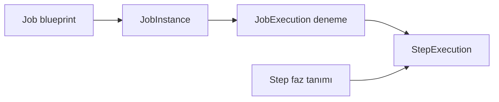
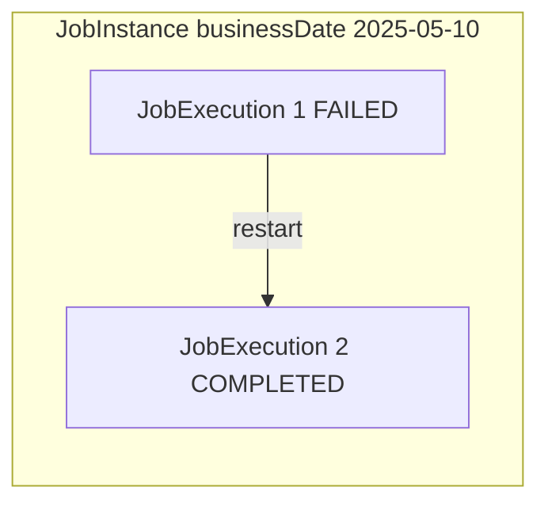
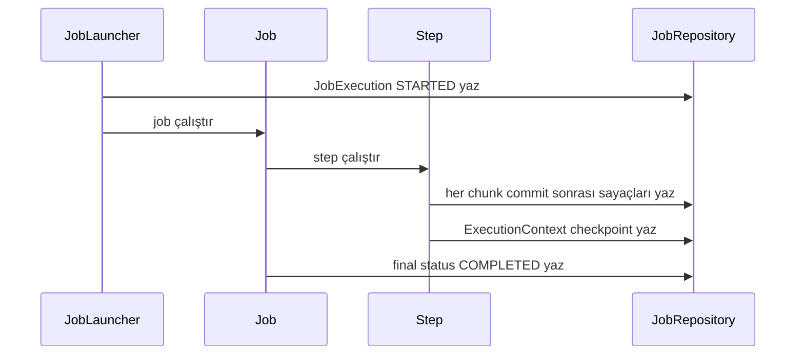

# Topic 5.1 — Spring Batch Mimarisi: Job, Step, JobRepository

```admonish info title="Bu bölümde"
- `JobInstance` vs `JobExecution` ayrımı ve bunun üstüne kurulan restart semantiği
- `JobParameters`'ın identifying flag'i: bir JobInstance'ın kimliğini ne belirler
- `JobRepository` ve `BATCH_*` tabloları — restart'ı mümkün kılan state katmanı
- `JobLauncher` vs `JobOperator`, synchronous vs async tetikleme farkı
- Spring Batch 5 API değişiklikleri ve banking discipline (`initialize-schema=never`)
```

## Hedef

Spring Batch'in **temel yapı taşlarını** oturtmak: `Job`, `Step`, `JobInstance`, `JobExecution`, `StepExecution`, `JobRepository`, `JobLauncher`, `JobOperator`, `JobParameters`. Bir TR bankasındaki "EOD job'u" kavramının arkasındaki teknik makinayı görmek.

Bu topic'te kod yazma odağı zayıf — kavramları sindirir, sonraki topic'lerde uygularsın. Ama buradaki zemin olmadan diğer topic'ler havada kalır.

## Süre

Okuma: ~1.5 saat • Kendini Sına: 30 dk • Pratik (opsiyonel): 2-3 saat • Toplam: ~2 saat (+ pratik)

## Önbilgi

- Faz 1-4 tamam (`core-banking` çalışıyor, PostgreSQL bağlı, JPA biliyorsun)
- "Cron job" kavramına aşinasın (Linux'ta `crontab -e` gördüysen yeter)
- Online API endpoint'i ile batch job'un farkını sezgisel biliyorsun

---

## Kavramlar

### 1. Spring Batch nedir, ne değildir?

Gece 02:14'te EOD job'un crash oluyorsa ve "kaldığı yerden nasıl devam ederim" diye terliyorsan, doğru framework'ü kullanmıyorsun demektir. **Spring Batch** = büyük hacimli, tekrar eden, deterministik veri işleme job'ları için framework. 2008'de Accenture + SpringSource ortaklığında çıktı; DNA'sı finansal kurumların EOD/EOM/EOY job'larına göre şekillendi. Bu yüzden banking'e doğal oturur.

**Spring Batch'i seç:**

- Periyodik (gece / ay sonu / yıl sonu) toplu işleme
- Çok büyük veri (DB tablosu, CSV/Excel, XML, JSON)
- Resilient: hata olursa kaldığı yerden devam
- Auditable: ne zaman çalıştı, ne kadar sürdü, ne sonuç verdi
- Long-running: dakikalar / saatler süren işler; transaction discipline kritik

**Spring Batch'i seçme:**

- Real-time stream processing (Kafka Streams / Flink)
- Saniye altı low-latency API
- Tek seferlik küçük script ("100 müşteriye email at" — `for` loop yeter)
- Reactive event-driven workflow (Camel / temporal.io)
- Cron + bash ile çözülen 5 dakikalık iş

Kural şudur: bir iş **periyodik, büyük ve restartable** olması gerekiyorsa Spring Batch; **real-time, request-scoped veya async messaging** ise değil.

| İş | Spring Batch? | Sebep |
|----|---------------|-------|
| Müşterinin EFT'sini gerçek zamanlı yapma | Hayır | Online, sub-second; REST + sync TX |
| 10M müşteri için günlük faiz tahakkuku | Evet | Büyük, periyodik, restartable |
| Para çekiminde anti-fraud kontrolü | Hayır | Real-time, request-scoped |
| Gün sonu MASAK STR raporu üretme | Evet | EOD, dosya output, restart önemli |
| Müşteriye SMS atma | Hayır | Async messaging (Kafka/RabbitMQ) yeter |
| Aylık ekstre PDF üretimi | Evet | Toplu, idempotent, restartable |

### 2. Domain modeli: Job, Step, JobInstance, JobExecution

Bu beş kavramı kafanda net ayırmadan ilerlersen, sonraki her topic'te tökezlersin — çünkü restart, audit ve idempotency hepsi bu ayrımların üstüne kurulu. İlişkileri önce bir bütün olarak gör:



#### 2.1 Job

**Job** bir batch işin **tasarımı / template'i**. "Günsonu mutabakat işi" gibi bir konsepttir.

```java
@Bean
public Job eodReconciliationJob(JobRepository jobRepository, Step reconcileStep) {
    return new JobBuilder("eodReconciliationJob", jobRepository)
        .start(reconcileStep)
        .build();
}
```

`Job` bir **bean**, uygulama başlangıcında bir kez tanımlanır, sonsuz kez çalıştırılır. Kendisinde state yoktur — her çalıştırılış yeni bir `JobExecution` üretir. Job reusable bir blueprint'tir.

#### 2.2 JobInstance

**JobInstance** = bir Job'un belirli **JobParameters seti ile mantıksal çalıştırılışı**. Kritik nokta: JobInstance parametrelere göre tanımlanır. Aynı Job + aynı parametreler → aynı JobInstance (DB'de aynı row); farklı parametreler → farklı JobInstance.

```
Job: "eodReconciliationJob"

JobInstance 1: eodReconciliationJob + {businessDate=2025-05-10}
JobInstance 2: eodReconciliationJob + {businessDate=2025-05-11}  ← farklı param, farklı instance
JobInstance 3: eodReconciliationJob + {businessDate=2025-05-12}
```

Bunun önemi idempotency: <mark>bir JobInstance yalnızca bir kez başarıyla çalışabilir</mark>. 2025-05-10 mutabakatını başarıyla bitirdiysen, aynı parametrelerle tekrar tetikleyemezsin (default davranış) — "ya iki kez çalışırsa balance iki kez güncellenir mi" derdi ortadan kalkar.

Tekrar denersen: `JobInstanceAlreadyCompleteException`.

#### 2.3 JobExecution

**JobExecution** = bir JobInstance'ı çalıştırma **denemesi**. Bir JobInstance birden fazla JobExecution'a sahip olabilir: ilki fail oldu, ikincide restart edip başarıyla bitirdin.

```
JobInstance: eodReconciliationJob + {businessDate=2025-05-10}
    JobExecution 1: 23:30 başladı → 23:42 FAILED (DB connection drop)
    JobExecution 2: 23:45 restart → 23:55 COMPLETED
```

Aynı JobInstance'ın iki execution'ı olması işte tam da **restart** demektir:



`JobExecution` içinde bulunanlar: `id`, `jobInstance`, `status` (BatchStatus: STARTING, STARTED, COMPLETED, FAILED, STOPPED, ABANDONED), `exitStatus`, `startTime`/`endTime`/`createTime`, `executionContext` (restart checkpoint), `failureExceptions`, `stepExecutions`.

**BatchStatus vs ExitStatus:** `BatchStatus` framework'ün gözünden state'i tutan bir enum. `ExitStatus` ise framework dışı tüketim için bir string — "COMPLETED", "FAILED" veya custom "COMPLETED_WITH_SKIPS", "DATA_MISSING". Conditional flow'da (Topic 4) "step bitti ama exit status NOT_FOUND ise farklı yola git" gibi kararlar `ExitStatus` üzerinden verilir.

#### 2.4 Step

**Step** = Job'un içindeki **bağımsız faz**. Bir Job N tane Step içerir; sırayla, conditional veya paralel çalışabilirler.

```java
@Bean
public Job dailyEodJob(JobRepository jobRepository,
                       Step reconcileStep,
                       Step accrueInterestStep,
                       Step generateReportStep) {
    return new JobBuilder("dailyEodJob", jobRepository)
        .start(reconcileStep)
        .next(accrueInterestStep)
        .next(generateReportStep)
        .build();
}
```

İki ana Step türü var:

1. **Tasklet step**: Tek bir `execute` method'u çağrılır, bir TX içinde bir iş yapar. (Topic 2'de detay)
2. **Chunk-oriented step**: Reader → Processor → Writer döngüsü, bigdata için. (Topic 2'nin ana konusu)

```
Job: monthlyInterestAccrualJob
  Step 1 (tasklet): "lock all accounts"     → bir SQL update
  Step 2 (chunk):   "read/calc/write interest" → milyonlar
  Step 3 (chunk):   "read postings, notify"     → milyonlar
  Step 4 (tasklet): "unlock all accounts"    → bir SQL update
```

#### 2.5 StepExecution

**StepExecution** = bir Step'in bir JobExecution içindeki çalıştırılışı. İçinde: `id`, `jobExecution` (parent), `stepName`, `status`, `exitStatus`, chunk metrikleri (`readCount`, `writeCount`, `commitCount`, `rollbackCount`, `skipCount`, ayrıca `filterCount`, `readSkipCount`, `processSkipCount`, `writeSkipCount`), `startTime`/`endTime` ve step-level `executionContext`.

Bu sayaçlar **DB'de persist edilir**. `BATCH_STEP_EXECUTION` tablosunu sorgulayarak "dün gece reconciliation step'i kaç satır okudu, kaç yazdı, kaç skip etti" sorusuna cevap alırsın — banking audit'inde kritik.

---

### 3. JobRepository — state'in tutulduğu yer

Restart'ı mümkün kılan tek şey, framework'ün "nerede kaldığımı" bir yere yazmasıdır; o yer `JobRepository`'dir. **JobRepository** = batch state'inin persistence katmanı. Çalışma boyunca her şey buraya yazılır: Job'un başladığı an, Step'in commit ettiği her chunk, skip edilen item'lar, ExecutionContext (restart checkpoint) ve final status.

Bu yazma akışını bir bütün olarak gör — restart'ın neden "bedava" geldiğini burada anlarsın:



Spring Batch ilk başladığında configure edilmiş `DataSource`'ta `BATCH_*` tablolarını arar; bulamazsa schema kurulması gerekir. Banking projende PostgreSQL kullanıyorsun; şemayı oluşturan tablolar şunlar:

```sql
-- Sadece tablo adları; full schema Flyway ile gelir.
BATCH_JOB_INSTANCE
BATCH_JOB_EXECUTION
BATCH_JOB_EXECUTION_PARAMS
BATCH_JOB_EXECUTION_CONTEXT
BATCH_STEP_EXECUTION
BATCH_STEP_EXECUTION_CONTEXT
BATCH_JOB_SEQ
BATCH_JOB_EXECUTION_SEQ
BATCH_STEP_EXECUTION_SEQ
```

Spring Boot Batch starter, `org/springframework/batch/core/schema-postgresql.sql` dosyasını jar içinde taşır. <mark>Production'da bu şemayı `initialize-schema=always` ile Spring Boot'a kurdurmaz, kendi Flyway migration'ına koyarsın</mark> — banking'de tüm DDL kontrolü Flyway'de olmalı.

```yaml
spring:
  batch:
    jdbc:
      initialize-schema: never   # production'da NEVER. Flyway kursun.
    job:
      enabled: false             # app start'ta job'ları auto-run ETME
                                 # senin JobLauncher / @Scheduled tetiklesin
```

`spring.batch.job.enabled=false` neden? Default'ta Spring Boot başlarken classpath'teki tüm `Job` bean'lerini otomatik çalıştırmaya kalkar. Banking'de bu felakettir; scheduling ayrı bir konudur (Topic 6).

```admonish warning title="En sık düşülen iki tuzak"
`initialize-schema=always` bırakmak DDL kontrolünü framework'e kaptırır — banking'de kabul edilemez. `spring.batch.job.enabled=true` ise app her restart'ta job tetikler; "günsonu mutabakat" 14:23'te çalışır. İkisini de kapat.
```

#### 3.1 BATCH_JOB_INSTANCE

```
JOB_INSTANCE_ID | VERSION | JOB_NAME              | JOB_KEY (hash of params)
----------------+---------+-----------------------+------------------------
1               | 0       | eodReconciliationJob  | a4f9c2...
2               | 0       | eodReconciliationJob  | b5g0d3...
3               | 0       | interestAccrualJob    | c6h1e4...
```

`JOB_KEY`, JobParameters'ın **identifying** olanlarından üretilen bir hash. "Aynı Job + aynı params = aynı JobInstance" eşliğini işte bu sağlar.

#### 3.2 BATCH_JOB_EXECUTION

```
JOB_EXECUTION_ID | JOB_INSTANCE_ID | START_TIME | END_TIME | STATUS    | EXIT_CODE
-----------------+-----------------+------------+----------+-----------+-----------
1                | 1               | 23:30      | 23:42    | FAILED    | FAILED
2                | 1               | 23:45      | 23:55    | COMPLETED | COMPLETED
3                | 2               | 23:30      | 23:50    | COMPLETED | COMPLETED
```

Aynı `JOB_INSTANCE_ID` (1) için iki execution → restart oldu.

#### 3.3 BATCH_STEP_EXECUTION

```
STEP_EXECUTION_ID | JOB_EXECUTION_ID | STEP_NAME     | STATUS    | READ_COUNT | WRITE_COUNT | COMMIT_COUNT | ROLLBACK_COUNT
------------------+------------------+---------------+-----------+------------+-------------+--------------+----------------
1                 | 1                | reconcileStep | FAILED    | 45000      | 44000       | 44           | 1
2                 | 2                | reconcileStep | COMPLETED | 100000     | 100000      | 100          | 0
```

Okuma: JobExecution 1'de step 45K okudu, 44K yazdı (1K skip), 44 commit + 1 rollback → bir chunk rollback ettikten sonra patladı. JobExecution 2'de restart ile 100K temiz tamamlandı.

#### 3.4 ExecutionContext

`BATCH_JOB_EXECUTION_CONTEXT` ve `BATCH_STEP_EXECUTION_CONTEXT` birer **key-value store** — restart içindir. Reader'ın "kaçıncı satırdayım", writer'ın "kaçıncı kayda kadar yazdım" gibi state'i tutar. (Topic 3'te ayrıntı.)

```
"reader.position": 45000
"reader.currentResource": "transactions_2025_05_10.csv"
```

Restart anında framework bu context'i okur ve reader'a "45000'den devam" der.

---

### 4. JobParameters: kimlik ve identifying flag

Aynı EOD'nin yanlışlıkla iki kez tetiklenip bakiyeyi iki kez güncellemesini engelleyen mekanizma, JobParameters'ın kimlik rolüdür. `JobParameters` = Job'a runtime'da geçirilen key-value parametreler.

```java
JobParameters params = new JobParametersBuilder()
    .addString("businessDate", "2025-05-10")
    .addString("reportFormat", "CSV", false)   // false = non-identifying
    .toJobParameters();

jobLauncher.run(eodReconciliationJob, params);
```

Fark burada: `addString("businessDate", "2025-05-10")` default olarak **identifying=TRUE**; üçüncü argümana `false` verirsen **non-identifying** olur. <mark>JobInstance'ın JOB_KEY hash'ine yalnızca identifying parametreler girer</mark>.

```
Run 1: businessDate=2025-05-10, reportFormat=CSV  → JobInstance 1
Run 2: businessDate=2025-05-10, reportFormat=XML  → JobInstance 1 (aynı!)
Run 3: businessDate=2025-05-11, reportFormat=CSV  → JobInstance 2
```

Yani identifying olan `businessDate` değişince yeni instance; `reportFormat` değişince değil. **Banking pratiği:** `businessDate` her zaman identifying; `traceId`, `triggeredBy` gibi audit alanları non-identifying. Böylece aynı gün için yanlışlıkla iki kez tetiklenmez.

Tipler: `addString`, `addLong`, `addDouble`, `addDate`, `addLocalDate` (Spring Batch 5+). Banking'de tarihler için her zaman `addLocalDate`.

Restart davranışı üç kurala oturur:

- Aynı Job + aynı params, son execution **COMPLETED** → `JobInstanceAlreadyCompleteException`
- Aynı Job + aynı params, son execution **FAILED** → **restart edilir** (kaldığı yerden)
- Aynı Job + farklı params → yeni JobInstance, yeni execution

Bu deterministik davranış banking güveninin temelidir. "EOD job'unu iki kez çalıştırdım, balance iki kez güncellendi" senaryosu oluşamaz.

```admonish warning title="Anti-pattern: timestamp'i identifying yapmak"
JobParameters'a `System.currentTimeMillis()` koyup identifying bırakırsan her run yeni JobInstance üretir; aynı businessDate için 5 ayrı instance oluşur ve restart imkânsızlaşır. Timestamp'i ya non-identifying yap ya hiç koyma; "her tetikleme yeni instance" istiyorsan `RunIdIncrementer` kullan.
```

**Spring Batch 5 notları:** `JobParameters` artık `Object` map'i tutuyor (önceden yalnızca String/Long/Double/Date); type-safe erişim için `JobParametersBuilder` converter'lar sağlıyor. Ayrıca cron job'da gün bilgisi yoksa `RunIdIncrementer` her run'a artan `run.id` ekleyerek "her tetikleme yeni instance" sağlıyor.

---

### 5. JobLauncher vs JobOperator

Job'u tahtaya nasıl koyup çalıştıracağın iki API'ye bağlı; ikisini karıştırırsan operasyon ekibine restart butonu veremezsin. **JobLauncher** programatik tetikleme yapar: `Job` + `JobParameters` alır, çalıştırır.

```java
@Service
class EodTrigger {
    private final JobLauncher jobLauncher;
    private final Job eodReconciliationJob;

    @Scheduled(cron = "0 55 23 * * *")
    public void runEod() throws Exception {
        var params = new JobParametersBuilder()
            .addLocalDate("businessDate", LocalDate.now())
            .toJobParameters();
        jobLauncher.run(eodReconciliationJob, params);
    }
}
```

**Synchronous vs Async:** Default `JobLauncher` **synchronous** — `run()` çağrısı job bitene kadar bloklar. Banking'de bu, `@Scheduled` thread'ini saatlerce bloklar ve yan job tetiklemelerini geciktirir. Çözüm: bir `TaskExecutor` set et; job ayrı thread'de çalışır, `run()` hemen `JobExecution`'ı (henüz STARTED state'inde) döner.

```java
@Bean
public JobLauncher asyncJobLauncher(JobRepository jobRepository) {
    var launcher = new TaskExecutorJobLauncher();
    launcher.setJobRepository(jobRepository);
    launcher.setTaskExecutor(new SimpleAsyncTaskExecutor("batch-"));
    try {
        launcher.afterPropertiesSet();
    } catch (Exception e) {
        throw new IllegalStateException(e);
    }
    return launcher;
}
```

Spring Batch 5'te `SimpleJobLauncher` deprecate oldu; `TaskExecutorJobLauncher` kullanılıyor.

```admonish tip title="Async'i seçtiysen status'ü nasıl izlersin"
Async launcher `run()` çağrısından hemen STARTED state'inde bir JobExecution döner — yani "bitti mi" cevabını orada alamazsın. Job'un gerçek sonucunu `BATCH_JOB_EXECUTION` tablosundan veya `JobExplorer` üzerinden polling ile izlersin. Enterprise scheduler (Control-M vb.) tetikliyorsa, status endpoint'ini scheduler poll eder.
```

**JobOperator** ise daha yüksek seviye, **operasyonel** bir API. Job'u name ile başlatma, restart, stop, abandon işlemleri buradadır:

```java
@Service
class EodOperatorService {
    private final JobOperator jobOperator;

    public Long start(String jobName, String params) throws Exception {
        return jobOperator.start(jobName, params);  // "businessDate=2025-05-10"
    }

    public Long restart(Long executionId) throws Exception {
        return jobOperator.restart(executionId);
    }

    public boolean stop(Long executionId) throws Exception {
        return jobOperator.stop(executionId);
    }

    public Set<Long> findRunningExecutions(String jobName) {
        return jobOperator.getRunningExecutions(jobName);
    }
}
```

`JobOperator` "operasyon ekibi job'ları yönetsin" diye tasarlandı; genelde bir REST endpoint'in arkasında yaşar:

```java
@PostMapping("/admin/batch/jobs/{name}/restart/{execId}")
public ResponseEntity<Long> restart(@PathVariable String name, @PathVariable Long execId) {
    return ResponseEntity.ok(jobOperator.restart(execId));
}
```

Banking'de operatör paneli (Operations Center) bu API'leri kullanır. Faz 8'de security ile koruyacaksın.

---

### 6. Job tetiklemenin yolları

Bir Job'u başlatmanın altı yolu var; hangisini seçtiğin scheduling'i execution'dan ne kadar ayırdığını belirler.

1. **CommandLineJobRunner** (Spring Batch 5'te deprecated ama klasik): `java -jar app.jar --spring.batch.job.name=eodReconciliationJob businessDate=2025-05-10`. Cron + jar.
2. **@Scheduled + JobLauncher.run()**: aynı uygulama içinden cron-style. (Topic 6)
3. **REST endpoint + JobLauncher/JobOperator**: operatör tetikler. Banking'de yaygın.
4. **Message-driven** (Kafka consumer + JobLauncher): event'le tetikleme. (Topic 6 ile birleşir)
5. **Quartz scheduler**: enterprise, cluster-aware scheduling. (Topic 6)
6. **Airflow / Kubernetes CronJob / external orchestrator**: en yaygın modern setup — Spring Batch sadece "executor".

**TR bankalarında en yaygın setup:** Control-M (BMC) / Autosys / AppWorx gibi bir enterprise scheduler `curl` ile REST endpoint çağırır (`POST /admin/batch/eod/start?businessDate=...`), Spring Batch app'i job'u çalıştırır, status DB'den veya response'tan polling ile izlenir. Bu, scheduling ile execution'ı **decouple eder** — orchestration external, Spring Batch sadece job runner. Modern bulutta Kubernetes CronJob aynı rolü oynar.

---

### 7. Sequential, Conditional ve Parallel flow (giriş)

`Job`'da step'ler sırayla, conditional veya paralel akabilir. Detayı Topic 4'te; burada özet.

**Sequential:**

```java
new JobBuilder("eodJob", repo)
    .start(reconcileStep)
    .next(accrueInterestStep)
    .next(generateReportStep)
    .build();
```

**Conditional (exit status'e göre):**

```java
new JobBuilder("eodJob", repo)
    .start(reconcileStep)
        .on("COMPLETED").to(accrueInterestStep)
        .from(reconcileStep).on("FAILED").to(alertStep)
    .end()
    .build();
```

**Parallel (split):**

```java
new JobBuilder("eodJob", repo)
    .start(prepareStep)
    .split(new SimpleAsyncTaskExecutor())
        .add(fraudReportFlow, masakReportFlow, bddkReportFlow)
    .next(finalizeStep)
    .build();
```

Bu konseptler Topic 4'ün ana konusu.

---

### 8. Banking örneği — eodReconciliationJob mimari taslağı

Şimdiye kadarki her kavramın tek bir job'da nasıl toplandığını görmek istersen: `core-banking` projende kuracağın EOD Reconciliation job'unun taslağı aşağıda. Mini-project'te bunu **gerçekten** yazacaksın.

<details>
<summary>Tam taslak: eodReconciliationJob (~30 satır)</summary>

```
Job: eodReconciliationJob
JobParameters: businessDate (identifying), traceId (non-identifying), triggeredBy (non-identifying)

Step 1 (tasklet): "snapshotAccountBalancesStep"
  - Tüm hesapların bakiyelerini bir snapshot tablosuna yaz
  - Kısa, hızlı step
  - SELECT id, balance FROM accounts → INSERT INTO eod_snapshot

Step 2 (chunk): "recalculateBalancesFromLedgerStep"
  - journal_entries + journal_lines'tan her hesap için balance recompute et
  - 10M+ satır olabilir → chunk-oriented + paging reader
  - chunk size 1000
  - INSERT INTO recomputed_balances

Step 3 (chunk): "findMismatchesStep"
  - eod_snapshot vs recomputed_balances → SELECT JOIN WHERE diff != 0
  - mismatch bulunanları → INSERT INTO reconciliation_report

Step 4 (tasklet): "cleanupTemporaryTablesStep"
  - TRUNCATE eod_snapshot, recomputed_balances
  - Yalnızca status=COMPLETED ise (decider ile conditional)

Listener:
  - JobExecutionListener: başladı/bitti audit log
  - SkipListener: skip edilen item'ları dlq_journal_lines tablosuna yaz
  - StepExecutionListener: her step'in metrics'ini Prometheus'a push et
```

</details>

Bu taslakta her topic'ten bir parça var: tasklet + chunk step karışımı, identifying/non-identifying parametreler, conditional cleanup ve üç tip listener.

---

### 9. JobRepository transaction izolasyonu (banking için kritik)

JobRepository, batch state'i ile iş verisini nerede tuttuğuna dair önemli bir karar barındırır. **Same DataSource (default):** batch state + business data aynı PostgreSQL. Avantaj: chunk commit hem business data'yı hem state'i tek TX'te yazar — exactly-once semantik. **Separate DataSource:** bazı bankalar `BATCH_*` tablolarını ayrı bir "ops" DB'ye koyar (prod DB'de şema temizliği için); dezavantaj: chunk commit artık atomik değil (XA olmadan). Banking pratiği: aynı DB, `schema=batch` ile ayrım.

**Isolation level:** JobRepository default `SERIALIZABLE` çalışır — bu, iki concurrent JobLauncher'ın aynı JobInstance'ı yaratmasını engeller. PostgreSQL'de bu yüksek izolasyon deadlock riski taşır; `READ_COMMITTED`'a düşürmek mümkün ama duplicate JobInstance race condition'ı doğar.

```java
@Bean
public JobRepository jobRepository(DataSource ds, PlatformTransactionManager tm) throws Exception {
    var factory = new JobRepositoryFactoryBean();
    factory.setDataSource(ds);
    factory.setTransactionManager(tm);
    factory.setIsolationLevelForCreate("ISOLATION_SERIALIZABLE");
    factory.setTablePrefix("BATCH_");
    factory.afterPropertiesSet();
    return factory.getObject();
}
```

Bunu Spring Boot otomatik yapar; Spring Batch 5'te `@EnableBatchProcessing` genelde gereksiz — Boot otomatik enable eder.

---

### 10. Anti-pattern'ler — ne yapma

Aşağıdaki beş hata banking batch'inde gerçek para veya gerçek audit kaybına dönüşür.

**Anti-pattern 1: Job'u her başlangıçta çalıştırmak.** `spring.batch.job.enabled=true` bırakırsan app restart'ında günsonu mutabakat 14:23'te çalışır. Doğrusu: `enabled=false` + scheduling'i ayrı ele al.

**Anti-pattern 2: Timestamp'i identifying yapmak.** Yukarıda anlatıldı — restart kaybolur, aynı businessDate için onlarca instance. Timestamp non-identifying olmalı veya hiç olmamalı.

**Anti-pattern 3: Business logic'i orchestration'a karıştırmak.** Step içinde "if today is weekend, skip" yazma; business calendar check'i **scheduler / decider** seviyesinde olur. Job çalıştıysa "iş yapacaktır" varsayımı geçerli olmalı.

**Anti-pattern 4: Non-restartable kod.** Processor'da `UUID.randomUUID()` ile output yazarsan, restart'ta aynı kayıt farklı ID ile iki kez yazılır:

```java
class FraudReportProcessor implements ItemProcessor<...> {
    public ... process(...) {
        report.setReportId(UUID.randomUUID());   // her execution'da farklı → idempotent değil
    }
}
```

Doğrusu: deterministik ID (`businessDate + customerId` hash).

**Anti-pattern 5: JobRepository tablolarını elle update etmek.** FAILED kalan bir job'u SQL ile COMPLETED'e çevirmek restart davranışını kırar. Doğrusu: `JobOperator.abandon()` veya programatik `setStatus`/`setExitStatus`.

---

### 11. Spring Batch'in Spring Boot 3 + Java 21 ile durumu

| Spring Boot | Spring Batch | Notlar |
|-------------|--------------|--------|
| 2.x | 4.x | LTS değil, Java 8/11 |
| 3.0-3.2 | 5.0-5.1 | Java 17+, EE9 (jakarta.*) |
| 3.3+ | 5.1+ | Java 21 destekli, virtual threads opsiyon |

**Spring Batch 5'in önemli değişiklikleri:**

- `jakarta.*` namespace (Spring 6)
- `@EnableBatchProcessing` artık opsiyonel (Boot otomatik enable eder)
- `JobBuilderFactory` / `StepBuilderFactory` deprecate → `JobBuilder` / `StepBuilder` direkt
- `JobRepository` artık `JobBuilder` constructor'ına geçirilir
- `JobParameters` artık any-type (önceden 4 tip)
- `SimpleJobLauncher` deprecate → `TaskExecutorJobLauncher`
- Virtual thread executor desteği (Java 21)

Senin projende Spring Boot 3.3.x olduğu için Spring Batch 5.1+'te olacaksın; bu README'deki tüm API'ler Spring Batch 5 syntax'ıdır.

---

## Önemli olabilecek araştırma kaynakları

- Spring Batch reference documentation (docs.spring.io/spring-batch)
- Spring Batch 5 migration guide (4 → 5 geçiş notları)
- "Spring Batch JobRepository schema postgresql" — DDL referansı
- "JobInstance vs JobExecution" Stack Overflow tartışmaları
- "JobParameters identifying flag" — restart davranışı
- "Spring Batch BatchStatus ExitStatus difference"
- Michael Minella — "The Definitive Guide to Spring Batch" (3rd ed.)
- Spring IO YouTube — Mahmoud Ben Hassine (Spring Batch lead) konuşmaları
- Baeldung "Spring Batch Tutorial" serisi (giriş için)
- `spring-projects/spring-batch` GitHub — issues & releases

---

## Kendini Sına

Aşağıdaki soruları önce **cevaba bakmadan** kendi cümlelerinle yanıtlamayı dene — hepsi TR bank mülakatlarında bu tarzda çıkar. Takıldığında ilgili Kavramlar başlığına dön, sonra tekrar dene.

**S1. JobInstance ile JobExecution arasındaki fark nedir? Banking'de bu ayrım neden önemli?**

<details>
<summary>Cevabı göster</summary>

`JobInstance` bir Job'un belirli bir JobParameters seti ile **mantıksal** çalıştırılışıdır — DB'de tek bir row (`BATCH_JOB_INSTANCE`), kimliği JOB_KEY hash'i ile belirlenir. `JobExecution` ise o instance'ı çalıştırma **denemesidir**; bir JobInstance birden fazla JobExecution'a sahip olabilir.

Banking'de önemi restart semantiği: 2025-05-10 EOD job'u 23:42'de FAILED oldu (JobExecution 1), 23:45'te restart edip 23:55'te COMPLETED bitti (JobExecution 2). İkisi de **aynı** JobInstance'a bağlıdır — yani "aynı işi ikinci kez denedim", "yeni bir iş başlattım" değil. Bu ayrım sayesinde audit'te "bu businessDate kaç kez denendi, hangi denemede başarılı oldu" sorusu yanıtlanır.

</details>

**S2. JobParameters'ta identifying vs non-identifying flag ne işe yarar? businessDate neden her zaman identifying olmalı?**

<details>
<summary>Cevabı göster</summary>

Bir JobInstance'ın kimliği (JOB_KEY hash'i) yalnızca **identifying** parametrelerden üretilir; non-identifying olanlar hash'e girmez. Yani `businessDate=2025-05-10 + reportFormat=CSV` ile `businessDate=2025-05-10 + reportFormat=XML` (reportFormat non-identifying ise) aynı JobInstance'a düşer, ama businessDate değişirse farklı instance olur.

`businessDate` her zaman identifying olmalı çünkü bir günün işi mantıksal olarak tektir: aynı gün için yanlışlıkla iki kez tetiklenirse ikincisi `JobInstanceAlreadyCompleteException` alır ve balance iki kez güncellenmez. `traceId`, `triggeredBy` gibi audit alanları non-identifying yapılır — kimliği değiştirmeden log'a düşer.

</details>

**S3. Restart neden mümkün? Bunun anahtarı hangi bileşendir ve nasıl çalışır?**

<details>
<summary>Cevabı göster</summary>

Anahtar `JobRepository`'dir — batch state'inin persistence katmanı. Job çalışırken framework her şeyi `BATCH_*` tablolarına yazar: JobExecution status'ü, her chunk commit'inden sonraki sayaçlar, skip edilen item'lar ve en kritiği `ExecutionContext` (reader/writer'ın "nerede kaldım" checkpoint'i).

Bir JobExecution FAILED olduğunda bu state DB'de durur. Aynı Job + aynı params ile tekrar tetiklenince framework son execution'ın FAILED olduğunu görür, ExecutionContext'ten "45000. satırdaydım" bilgisini okur ve reader'a oradan devam ettirir. JobRepository olmasa restart olmaz — framework "nerede kaldığını" bilemez, her seferinde baştan başlamak zorunda kalır.

</details>

**S4. Aynı Job + aynı parametrelerle ikinci kez tetiklersen ne olur? Cevap son execution'ın durumuna göre nasıl değişir?**

<details>
<summary>Cevabı göster</summary>

Son execution COMPLETED ise: `JobInstanceAlreadyCompleteException` — o JobInstance başarıyla bitmiş, tekrar çalıştırılamaz (idempotency garantisi). Son execution FAILED ise: framework restart eder, ExecutionContext'ten kaldığı yerden devam eder. Parametreler farklıysa (identifying olan değişmişse): yepyeni bir JobInstance ve yeni execution oluşur.

Bu üç kural banking'in "EOD iki kez çalışıp bakiyeyi iki kez güncelledi" korkusunu ortadan kaldıran deterministik davranıştır. "Her tetikleme yeni instance olsun" istiyorsan bilinçli olarak `RunIdIncrementer` eklersin.

</details>

**S5. `spring.batch.job.enabled=false` ve `initialize-schema=never` neden banking'de zorunlu ayarlardır?**

<details>
<summary>Cevabı göster</summary>

`spring.batch.job.enabled` default `true`'dur ve Spring Boot başlarken classpath'teki tüm `Job` bean'lerini otomatik çalıştırır. Banking'de bu felakettir: app her restart'ında (deploy, crash recovery, ölçekleme) günsonu mutabakat gündüz 14:23'te tetiklenir. `false` yaparsın; tetiklemeyi `@Scheduled`/REST/external scheduler'a bırakırsın.

`initialize-schema=never` ise DDL kontrolünü framework'ten alır. Banking'de tüm şema değişiklikleri Flyway migration olarak versiyonlanır, review edilir, audit edilir. `always` bırakmak Spring Boot'un `BATCH_*` tablolarını sessizce oluşturmasına izin verir — production'da kontrolsüz DDL kabul edilemez.

</details>

**S6. Default JobLauncher synchronous mudur async mı? Banking'de `@Scheduled` ile bunun etkisi ne?**

<details>
<summary>Cevabı göster</summary>

Default `JobLauncher` **synchronous**'tur: `run()` çağrısı job bitene kadar bloklar. `@Scheduled` bir method'dan synchronous launcher çağırırsan, saatler süren bir EOD job'u scheduler thread'ini saatlerce meşgul eder; aynı scheduler'daki diğer job'ların tetiklenmesi gecikir.

Çözüm: launcher'a bir `TaskExecutor` (örneğin `SimpleAsyncTaskExecutor`) set etmek. Böylece job ayrı bir thread'de çalışır, `run()` hemen STARTED state'indeki `JobExecution`'ı döner ve scheduler thread'i serbest kalır. Spring Batch 5'te `SimpleJobLauncher` deprecate olduğu için `TaskExecutorJobLauncher` kullanılır. Async'i banking'de bilinçli seçmek gerekir — status'ü artık DB'den polling ile izlersin.

</details>

**S7. JobLauncher ile JobOperator arasındaki fark nedir? Hangisini nerede kullanırsın?**

<details>
<summary>Cevabı göster</summary>

`JobLauncher` düşük seviyeli, programatik tetikleme API'sidir: elinde `Job` bean'i ve `JobParameters` nesnesi varken `run(job, params)` dersin. `@Scheduled` veya event-driven tetikleyicilerde tipik olarak budur.

`JobOperator` ise operasyonel, yüksek seviyeli API'dir: job'u **name ve string parametre** ile başlatır (`start("eodJob", "businessDate=...")`), ayrıca `restart(executionId)`, `stop`, `abandon`, `getRunningExecutions` gibi yönetim işlemleri sunar. Operations Center paneli veya admin REST endpoint'lerinin arkasında bu kullanılır — çünkü operatörün elinde Job bean referansı değil, sadece isim ve execution ID vardır. Faz 8'de bu endpoint'ler role-based olarak korunmalı.

</details>

**S8. BatchStatus ile ExitStatus arasındaki fark nedir? Conditional flow'da hangisi kullanılır?**

<details>
<summary>Cevabı göster</summary>

`BatchStatus` framework'ün iç state'ini tutan bir **enum**'dur: STARTING, STARTED, COMPLETED, FAILED, STOPPED, ABANDONED. Framework kararlarını (restart edilebilir mi, vb.) buna göre verir. `ExitStatus` ise dışa dönük, **string** tabanlı bir sonuç kodudur: "COMPLETED", "FAILED", ya da custom "COMPLETED_WITH_SKIPS", "DATA_MISSING".

Conditional flow'da `ExitStatus` kullanılır çünkü custom değerlerle dallanma yapabilirsin: `.on("COMPLETED").to(nextStep)` veya `.on("DATA_MISSING").to(alertStep)`. Step'in kendi tanımladığı özel exit code'lara göre farklı yollara gitmek ancak string tabanlı ExitStatus ile mümkündür; enum olan BatchStatus'ün sabit değer kümesi buna elvermez.

</details>

---

## Tamamlama kriterleri

- [ ] JobInstance vs JobExecution farkını ve restart'ın neden aynı JobInstance üstünde ikinci execution olduğunu anlatabiliyorum
- [ ] Identifying vs non-identifying JobParameter farkını ve businessDate'in neden identifying olduğunu açıklayabiliyorum
- [ ] JobRepository'nin restart'ın anahtarı olduğunu, ExecutionContext'in checkpoint rolünü açıklayabiliyorum
- [ ] Aynı Job + aynı params ikinci tetiklemede COMPLETED / FAILED durumlarına göre ne olacağını biliyorum
- [ ] `spring.batch.job.enabled=false` ve `initialize-schema=never`'ın banking gerekçesini sayabiliyorum
- [ ] JobLauncher synchronous vs async farkını ve `@Scheduled` context'indeki etkisini biliyorum
- [ ] JobLauncher vs JobOperator ayrımını ve nerede hangisini kullandığımı söyleyebiliyorum
- [ ] `BATCH_JOB_INSTANCE`, `BATCH_JOB_EXECUTION`, `BATCH_STEP_EXECUTION` tablolarının ne tuttuğunu biliyorum
- [ ] Beş anti-pattern'i (auto-run, timestamp identifying, calendar in step, non-restartable ID, manuel tablo update) tanıyorum
- [ ] (Opsiyonel) "Pratik yapmak istersen" bölümündeki testleri yazdım ve Claude-verify prompt'uyla doğrulattım

Hepsi net ise → Topic 2'ye geç → [02-chunk-oriented/](../02-chunk-oriented/index.md)

---

## Defter notları

1. "JobInstance ile JobExecution farkı: ____. Banking'de önemi: ____."
2. "JobRepository tabloları PostgreSQL'de neyi tutar: ____. Restart için en kritik olan: ____."
3. "Identifying vs non-identifying JobParameter farkı: ____. businessDate her zaman identifying çünkü ____."
4. "JobLauncher synchronous vs async farkı, `@Scheduled` context'inde önemi: ____."
5. "Spring Batch'i ne zaman seçerim, ne zaman seçmem: ____."
6. "Spring Batch 5 + Spring Boot 3'te major API değişiklikleri: ____."

```admonish success title="Bölüm Özeti"
- `Job` durumsuz bir blueprint'tir; her çalıştırılış yeni bir `JobExecution` üretir — `JobInstance` ise parametrelerle tanımlanan mantıksal iştir
- Restart'ın tamamı `JobRepository` üstüne kurulu: `BATCH_*` tabloları status, sayaç ve `ExecutionContext` checkpoint'ini persist eder
- Identifying JobParameters (özellikle `businessDate`) JobInstance'ın kimliğini belirler; aynı instance başarıyla yalnızca bir kez çalışır → idempotency
- İkinci tetikleme: son execution COMPLETED ise `JobInstanceAlreadyCompleteException`, FAILED ise kaldığı yerden restart, farklı params ise yeni instance
- `JobLauncher` programatik tetikleme (sync default, banking'de async tercih); `JobOperator` operasyonel yönetim (restart/stop/abandon)
- Banking discipline: `spring.batch.job.enabled=false`, `initialize-schema=never` + Flyway; timestamp'i identifying yapma, JobRepository tablolarını elle güncelleme
```

---

## Pratik yapmak istersen

Kavramları koda dökmek istersen aşağıdaki iki ek hazır: test yazma rehberi `helloBatchJob` üstünden job çalıştırma, JobRepository state assert'i ve identifying flag davranışı için örnek testler içerir; Claude-verify prompt'u ile kurduğun batch konfigürasyonunu banking-grade perspektiften denetletebilirsin.

<details>
<summary>Test yazma rehberi</summary>

Bu topic'te asıl test = **smoke test**: job'un çalıştığını ve JobRepository'nin state yazdığını gör. Üst düzey unit test'ler Topic 2'de gelecek. Testler `helloBatchJob` adında basit bir tasklet job'una göre yazılmıştır (bir `@Configuration` içinde `StepBuilder` tasklet + `JobBuilder`).

### Test 5.1.1 — Job çalıştırma integration test

```java
@SpringBootTest
@SpringBatchTest
@Testcontainers
class HelloBatchJobIntegrationTest {

    @Container
    static PostgreSQLContainer<?> postgres = new PostgreSQLContainer<>("postgres:16");

    @DynamicPropertySource
    static void props(DynamicPropertyRegistry r) {
        r.add("spring.datasource.url", postgres::getJdbcUrl);
        r.add("spring.datasource.username", postgres::getUsername);
        r.add("spring.datasource.password", postgres::getPassword);
    }

    @Autowired
    private JobLauncherTestUtils jobLauncherTestUtils;

    @Test
    void helloBatchJob_shouldCompleteSuccessfully() throws Exception {
        var params = new JobParametersBuilder()
            .addString("businessDate", "2025-05-10")
            .addLong("run.id", System.currentTimeMillis())
            .toJobParameters();

        var execution = jobLauncherTestUtils.launchJob(params);

        assertThat(execution.getStatus()).isEqualTo(BatchStatus.COMPLETED);
        assertThat(execution.getExitStatus().getExitCode()).isEqualTo("COMPLETED");
    }

    @Test
    void helloBatchJob_shouldFailOnDuplicateInstance() throws Exception {
        var params = new JobParametersBuilder()
            .addString("businessDate", "2025-05-11")
            .toJobParameters();

        jobLauncherTestUtils.launchJob(params);   // ilk run

        assertThatThrownBy(() -> jobLauncherTestUtils.launchJob(params))
            .isInstanceOf(JobInstanceAlreadyCompleteException.class);
    }
}
```

`@SpringBatchTest` annotation'ı `JobLauncherTestUtils` ve `JobRepositoryTestUtils` bean'lerini sağlar. Banking'de test için gerçek PostgreSQL (Testcontainers) kullan, H2 değil.

### Test 5.1.2 — JobRepository state assert

```java
@Autowired
private JobRepository jobRepository;

@Test
void afterRun_jobRepositoryShouldHaveExecutionRecord() throws Exception {
    var params = new JobParametersBuilder()
        .addString("businessDate", "2025-05-12")
        .toJobParameters();

    var execution = jobLauncherTestUtils.launchJob(params);

    var found = jobRepository.getLastJobExecution("helloBatchJob", params);
    assertThat(found).isNotNull();
    assertThat(found.getId()).isEqualTo(execution.getId());
    assertThat(found.getStatus()).isEqualTo(BatchStatus.COMPLETED);
    assertThat(found.getStepExecutions()).hasSize(1);
}
```

### Test 5.1.3 — Parameters identifying flag davranışı

```java
@Test
void nonIdentifyingParam_shouldNotCreateNewInstance() throws Exception {
    var params1 = new JobParametersBuilder()
        .addString("businessDate", "2025-05-13")
        .addString("traceId", "trace-a", false)
        .toJobParameters();
    var params2 = new JobParametersBuilder()
        .addString("businessDate", "2025-05-13")
        .addString("traceId", "trace-b", false)
        .toJobParameters();

    jobLauncherTestUtils.launchJob(params1);

    assertThatThrownBy(() -> jobLauncherTestUtils.launchJob(params2))
        .isInstanceOf(JobInstanceAlreadyCompleteException.class);
}
```

Sadece non-identifying `traceId` değişti; businessDate aynı olduğu için ikinci run yeni instance üretmez ve `JobInstanceAlreadyCompleteException` alır.

### Test 5.1.4 — JobOperator ile execution sorgulama (Topic 3 ön-tat)

```java
@Autowired
private JobOperator jobOperator;

@Test
void jobOperator_canQueryExecutions() throws Exception {
    var params = new JobParametersBuilder()
        .addString("businessDate", "2025-05-14")
        .toJobParameters();
    jobLauncherTestUtils.launchJob(params);

    var executions = jobOperator.getExecutions(
        jobOperator.getJobInstances("helloBatchJob", 0, 10).get(0)
    );
    assertThat(executions).hasSize(1);
}
```

> İpucu: `psql` ile `SELECT * FROM batch_job_instance;`, `batch_job_execution;`, `batch_step_execution;`, `batch_job_execution_params;` sorgularını da çalıştır. JOB_KEY hash'ini, STATUS/EXIT_CODE değerlerini, tasklet'te READ_COUNT/WRITE_COUNT'un 0 olduğunu ve params tablosunda businessDate'i gözlemle. (PostgreSQL default case-folding tabloları küçük harfe çevirir.)

### Tamamlama kriterleri (pratik)

- [ ] `spring-boot-starter-batch` dependency eklendi
- [ ] `spring.batch.job.enabled=false`, `initialize-schema=never` ayarlı
- [ ] Spring Batch şeması Flyway migration olarak eklendi (`V100__add_spring_batch_tables.sql`)
- [ ] `helloBatchJob` çalıştı, `@SpringBatchTest` ile en az 3 integration test yazıldı
- [ ] `JobInstanceAlreadyCompleteException` kasten tetiklendi
- [ ] Identifying vs non-identifying parameter farkı test ile gözlendi
- [ ] `BATCH_JOB_INSTANCE`, `BATCH_JOB_EXECUTION`, `BATCH_STEP_EXECUTION` tabloları psql ile incelendi

</details>

<details>
<summary>Claude-verify prompt</summary>

```
Aşağıdaki Spring Batch konfigürasyonumu Spring Batch 5 + Spring Boot 3
+ banking EOD job context'inde DEĞERLENDİR ve EKSİKLERİ söyle, KOD YAZMA:

1. pom.xml'de spring-boot-starter-batch var mı?

2. application.yml:
   - spring.batch.jdbc.initialize-schema: never mı?
   - spring.batch.job.enabled: false mı?
   Yoksa banking discipline kaybı.

3. Spring Batch schema:
   - Flyway migration olarak mı eklendi (V100__add_spring_batch_tables.sql)?
   - Yoksa Spring Boot'a otomatik kurdurma açık mı?

4. Job/Step config:
   - JobBuilder (Spring Batch 5) mu, JobBuilderFactory (deprecated) mı?
   - StepBuilder ve tasklet düzgün mü?
   - PlatformTransactionManager tasklet'e geçirilmiş mi?

5. JobParameters:
   - businessDate identifying mi?
   - traceId / triggeredBy non-identifying mi (3. arg false)?
   - RunIdIncrementer bilinçli mi eklendi/eklenmedi?

6. JobLauncher:
   - SimpleJobLauncher (deprecated) mı yoksa TaskExecutorJobLauncher mı?
   - Synchronous mu — banking için bilinçli bir seçim mi?

7. Test'ler:
   - @SpringBatchTest kullanıldı mı?
   - JobLauncherTestUtils ile mi launch ediliyor?
   - JobInstanceAlreadyComplete test edildi mi?
   - Testcontainers ile gerçek PostgreSQL mü, H2 mi (banking'de H2 kaçınılmalı)?

8. Banking discipline:
   - Job app startup'ta otomatik tetikleniyor mu (olmamalı)?
   - JobOperator endpoint'i güvenliksiz açık mı (Faz 8'e not düşüldü mü)?
   - JobRepository tablolarını elle update eden kod var mı (olmamalı)?

Her madde için PASS / FAIL / EKSİK olarak işaretle, kanıt göster. KOD YAZMA.
```

</details>
