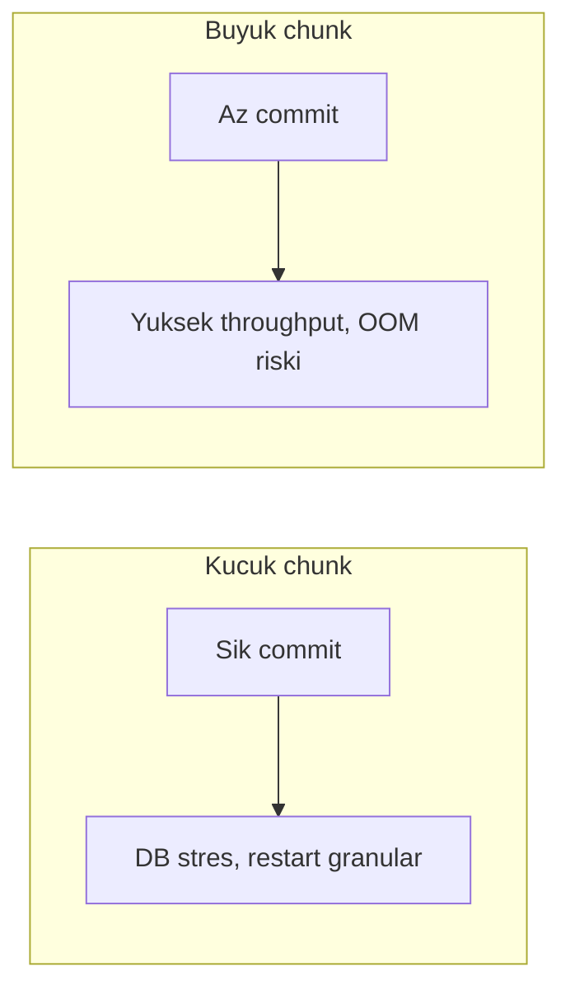
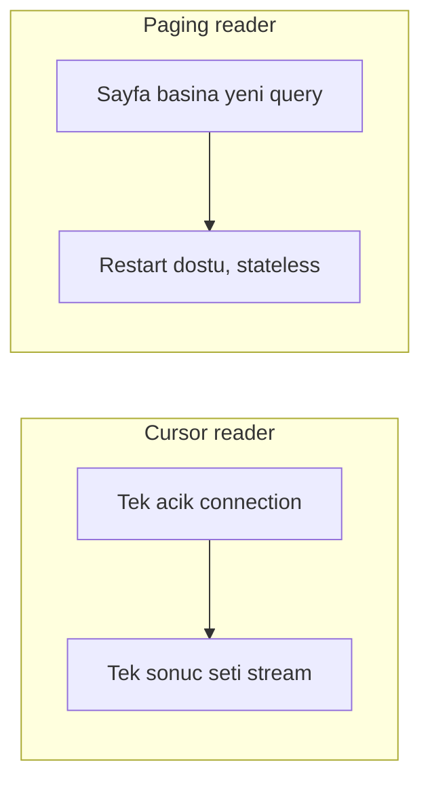

# Topic 5.2 — Chunk-Oriented Processing

```admonish info title="Bu bölümde"
- Chunk-oriented step'in kalbi: `ItemReader` → `ItemProcessor` → `ItemWriter` üçlüsü ve chunk-by-chunk lifecycle
- Chunk size'ın memory / throughput / restart trade-off'u ve transaction boundary'sinin chunk düzeyinde olması
- Paging vs cursor reader farkı; `JpaPagingItemReader`, `JdbcPagingItemReader`, `FlatFileItemReader` hangi banking job'unda hangisi
- `ItemProcessor` null return ile filter pattern'i ve `JdbcBatchItemWriter` ile batch insert
- Banking klasikleri: interest accrual ve EOD reconciliation job tasarımı, en sık 5 anti-pattern
```

## Hedef

Spring Batch'in en yaygın step tipi — **chunk-oriented step**'i derinlemesine öğrenmek. `ItemReader`, `ItemProcessor`, `ItemWriter` üçlüsünün lifecycle'ını, chunk size'ın memory/performance trade-off'unu, transaction boundary'nin chunk düzeyinde olmasını ve banking örnekleriyle pratik uygulamayı kavramak. `JpaPagingItemReader`, `JdbcPagingItemReader`, `FlatFileItemReader` gibi reader tiplerini banking job'larında doğru yerde kullanmak.

## Süre

Okuma: 2 saat • Kendini Sına: 45 dk • Pratik (opsiyonel): 3-4 saat • Toplam: ~3 saat (+ pratik)

## Önbilgi

- Topic 5.1 (Batch Architecture) bitti
- `Job`, `Step`, `JobRepository`, `JobLauncher` kavramları aşinasın
- Banking domain (account, transaction, journal) Phase 1'den biliniyor

---

## Kavramlar

### 1. Chunk-oriented vs Tasklet

1 milyon satırlık faiz tahakkukunu tek seferde memory'ye çekemezsin; Spring Batch bunun için iki step tipi sunar ve seçim işin boyutuna göre değişir.

**Chunk-oriented step:** Reader → Processor → Writer üçlüsü, veriyi chunk-by-chunk işler. Döngü hep aynı: N satır oku, her birini işle, toptan yaz, commit, sonraki chunk.


**Tasklet:** Tek bir method execute eder — Reader/Processor/Writer yok. Basit, tek-adımlık işler için (file delete, DB cleanup):

```java
@Bean
public Step cleanupStep() {
    return new StepBuilder("cleanupStep", jobRepository)
        .tasklet((contribution, chunkContext) -> {
            jdbcTemplate.update("DELETE FROM temp_data WHERE created_at < ?",
                Instant.now().minus(30, ChronoUnit.DAYS));
            return RepeatStatus.FINISHED;
        }, transactionManager)
        .build();
}
```

**Banking pratiği:** Çoğu EOD job chunk-oriented (büyük data set). Setup/cleanup adımları için tasklet. Tuzak: tasklet'in tek transaction'ı vardır — içine uzun iş koyarsan lock contention doğar.

### 2. Chunk-oriented step yapısı

Bir step'i "kaç item bir chunk" ve "hangi reader/processor/writer" olarak tanımlarsın; iskelet şudur:

```java
@Bean
public Step interestAccrualStep() {
    return new StepBuilder("interestAccrualStep", jobRepository)
        .<Account, InterestPosting>chunk(1000, transactionManager)
        .reader(activeAccountReader())
        .processor(interestProcessor())
        .writer(interestPostingWriter())
        .build();
}
```

**`<Account, InterestPosting>`:** Reader `Account` üretir, Processor `InterestPosting`'e çevirir, Writer `InterestPosting` yazar — generic tipler pipeline'ın girdi/çıktısını sabitler.

**`chunk(1000, transactionManager)`:** 1000 item bir chunk'tır ve <mark>her chunk kendi transaction'ında commit olur</mark> — bu yüzden transaction manager tam burada verilir.

### 3. ItemReader — veri okuma

Pipeline'ın girişi reader'dır; sözleşmesi tek method kadar basittir ama `null`'ın anlamı kritiktir.

```java
public interface ItemReader<T> {
    T read() throws Exception, UnexpectedInputException, ParseException, NonTransientResourceException;
    // null dönerse "veri kalmadı" anlamında
}
```

Her chunk için `read()`, chunk size kadar (N kez) çağrılır. `read()` **`null`** dönerse "veri bitti" demektir ve step biter. Spring çoğu reader'ı hazır verir; sık kullanılanları görelim.

#### `JpaPagingItemReader` — JPA ile sayfa sayfa okuma

JPA entity'lerini sayfa sayfa çeker; ORM avantajı ister ama JPA overhead'i taşırsın.

```java
@Bean
public JpaPagingItemReader<Account> activeAccountReader() {
    return new JpaPagingItemReaderBuilder<Account>()
        .name("activeAccountReader")
        .entityManagerFactory(entityManagerFactory)
        .queryString("SELECT a FROM Account a WHERE a.status = 'ACTIVE' ORDER BY a.id")
        .pageSize(1000)
        .build();
}
```

**`pageSize`:** Her DB roundtrip'inde 1000 satır çeker; genelde **chunk size ile aynı** yapılır ki her chunk tek fetch'e denk gelsin.

**`ORDER BY`:** Deterministic sıra şart. <mark>ORDER BY olmayan bir paging reader satır kaçırır veya tekrar okur</mark> — çünkü pagination `OFFSET`'e dayanır ve sırasız sonuç seti sayfalar arası kayar.

#### `JdbcPagingItemReader` — daha hızlı, JPA yok

1M+ satırda JPA overhead'i pahalıdır; direkt JDBC ile 2-3x hız kazanırsın (entity yerine düz `rowMapper`).

```java
@Bean
public JdbcPagingItemReader<Account> jdbcAccountReader() {
    return new JdbcPagingItemReaderBuilder<Account>()
        .name("jdbcAccountReader")
        .dataSource(dataSource)
        .selectClause("SELECT id, owner_id, balance_amount, currency")
        .fromClause("FROM accounts")
        .whereClause("WHERE status = 'ACTIVE'")
        .sortKeys(Map.of("id", Order.ASCENDING))
        .pageSize(1000)
        .rowMapper((rs, n) -> new Account(
            UUID.fromString(rs.getString("id")),
            UUID.fromString(rs.getString("owner_id")),
            rs.getBigDecimal("balance_amount"),
            rs.getString("currency")
        ))
        .build();
}
```

`sortKeys` burada `ORDER BY`'ın karşılığıdır — yine deterministic sıra zorunlu.

#### `FlatFileItemReader` — CSV dosya okuma

Toplu havale dosyası gibi flat dosyaları satır satır okuyup nesneye map eder.

```java
@Bean
public FlatFileItemReader<TransferRequest> csvReader() {
    return new FlatFileItemReaderBuilder<TransferRequest>()
        .name("csvReader")
        .resource(new FileSystemResource("/data/transfers.csv"))
        .delimited()
        .delimiter(",")
        .names("fromAccountId", "toAccountId", "amount", "currency")
        .targetType(TransferRequest.class)
        .linesToSkip(1)   // header
        .build();
}
```

Banking örneği: bankalar arası toplu havale dosyası. `linesToSkip(1)` ile header satırı atlanır.

#### `MultiResourceItemReader` — birden fazla dosya

Bir günde onlarca dosya gelirse hepsini tek reader gibi birleştirir; asıl okumayı bir delegate reader yapar.

```java
@Bean
public MultiResourceItemReader<TransferRequest> multiCsvReader() {
    return new MultiResourceItemReaderBuilder<TransferRequest>()
        .name("multiCsvReader")
        .resources(new PathMatchingResourcePatternResolver().getResources("file:/data/transfers-*.csv"))
        .delegate(csvReader())
        .build();
}
```

`transfers-001.csv`, `transfers-002.csv` ... hepsi tek akışta okunur.

#### `StaxEventItemReader` — XML

ISO 20022 ödeme mesajları XML'dir; Spring'in StAX-based reader'ı fragment kök elementini dolaşarak stream eder.

```java
@Bean
public StaxEventItemReader<Payment> iso20022Reader() {
    return new StaxEventItemReaderBuilder<Payment>()
        .name("iso20022Reader")
        .resource(new FileSystemResource("/data/pacs.008.xml"))
        .addFragmentRootElements("CdtTrfTxInf")
        .unmarshaller(paymentUnmarshaller())
        .build();
}
```

```admonish tip title="pageSize = chunk size"
Paging reader'larda `pageSize`'ı chunk size ile eşitle. Eşit değilse her chunk birden fazla DB fetch tetikler veya buffer'da item birikir; eşitken bir chunk = bir sayfa = bir roundtrip olur, en öngörülebilir davranış budur.
```

### 4. ItemProcessor — transform + filter

Reader ham veri getirir; iş kuralı, hesap ve filtre buraya gelir. Processor iki iş yapar: **transform** (tipi/değeri değiştir) veya **filter** (`null` dönerek eleme).

```java
public interface ItemProcessor<I, O> {
    O process(I item) throws Exception;
}
```

Örnek — bakiyeden günlük faiz hesaplayan, sıfır/negatif bakiyeyi eleyen processor:

```java
@Bean
public ItemProcessor<Account, InterestPosting> interestProcessor() {
    return account -> {
        if (account.getBalance().compareTo(BigDecimal.ZERO) <= 0) {
            return null;   // filter — bu item Writer'a gitmez
        }

        BigDecimal interest = account.getBalance()
            .multiply(new BigDecimal("0.085"))
            .divide(new BigDecimal("365"), 4, RoundingMode.HALF_EVEN);

        return new InterestPosting(account.getId(), interest, LocalDate.now());
    };
}
```

<mark>Processor `null` dönerse o item Writer'a gönderilmez</mark> — sadece o satır filtrelenir, chunk'ın geri kalanı normal akar. Bu, "işleme sok ama bazılarını yaz-dışı bırak" ihtiyacının standart yoludur.

#### `CompositeItemProcessor` — pipeline

Tek processor'a birden çok sorumluluk yüklemek yerine zincirleme kur: her adım tek iş yapsın.

```java
@Bean
public CompositeItemProcessor<Account, InterestPosting> composite() {
    return new CompositeItemProcessorBuilder<Account, InterestPosting>()
        .delegates(validationProcessor(), interestCalculator(), auditTagger())
        .build();
}
```

Önce validate, sonra hesapla, sonra audit tag ekle. Zincirdeki bir delegate `null` dönerse item orada elenir, sonrakiler çalışmaz.

### 5. ItemWriter — yazma

Writer chunk'ı **toplu** yazar; tek tek değil, chunk size kadar item'ı tek batch olarak persist eder — throughput'un ana kaynağı budur.

```java
public interface ItemWriter<T> {
    void write(Chunk<? extends T> chunk) throws Exception;
}
```

**`Chunk<T>`** bir listedir (chunk size kadar item). Writer bunu tek seferde yazmalı.

#### `JdbcBatchItemWriter` — JDBC batch insert

JDBC `addBatch` + `executeBatch` ile tek roundtrip'te çok satır INSERT eder; per-item save'e göre dramatik hızlıdır.

```java
@Bean
public JdbcBatchItemWriter<InterestPosting> interestWriter() {
    return new JdbcBatchItemWriterBuilder<InterestPosting>()
        .dataSource(dataSource)
        .sql("INSERT INTO interest_postings(account_id, amount, business_date) VALUES (:accountId, :amount, :businessDate)")
        .beanMapped()
        .build();
}
```

#### `JpaItemWriter` — JPA entity yazma

Entity yazacaksan JPA writer kullanılır, ama batching otomatik gelmez.

```java
@Bean
public JpaItemWriter<InterestPostingEntity> jpaWriter() {
    return new JpaItemWriterBuilder<InterestPostingEntity>()
        .entityManagerFactory(entityManagerFactory)
        .build();
}
```

**Tuzak:** JPA batching için `hibernate.jdbc.batch_size` config'i şart; yoksa "batch writer" adı altında tek tek INSERT atarsın.

#### `FlatFileItemWriter` — CSV yaz

Reconciliation raporu gibi çıktıları dosyaya yazar.

```java
@Bean
public FlatFileItemWriter<ReconciliationReport> reportWriter() {
    return new FlatFileItemWriterBuilder<ReconciliationReport>()
        .name("reportWriter")
        .resource(new FileSystemResource("/data/reconciliation-report.csv"))
        .delimited()
        .delimiter(",")
        .names("accountId", "expectedBalance", "actualBalance", "difference")
        .build();
}
```

#### `CompositeItemWriter` — birden fazla writer

Aynı item'ı hem DB'ye hem CSV'ye yazman gerekirse writer'ları zincirle.

```java
@Bean
public CompositeItemWriter<InterestPosting> composite() {
    return new CompositeItemWriterBuilder<InterestPosting>()
        .delegates(jdbcWriter(), csvWriter())
        .build();
}
```

```admonish warning title="Writer'da save loop yapma"
`JpaItemWriter`/`JdbcBatchItemWriter` yerine `for (item : chunk) repo.save(item)` yazmak batch'i öldürür — her item ayrı INSERT olur. 1000'lik chunk'ta bu 1 batch yerine 1000 roundtrip demek. Batch writer kullan, JPA ise `hibernate.jdbc.batch_size`'ı ayarla.
```

### 6. Chunk size — performance trade-off

Chunk size tek sayı ama üç ekseni birden ayarlar: memory, throughput ve restart granülaritesi. Doğru değer işin item boyutuna bağlıdır.

**Küçük chunk (örn. 10):**
- Memory az kullanır
- Sık transaction commit → DB stres
- Restart granular (crash'te kayıp az)
- Yavaş

**Büyük chunk (örn. 10000):**
- Memory çok kullanır (potansiyel OOM)
- Az transaction → throughput yüksek
- Restart kaba (chunk içinde kayıp daha fazla)
- Hızlı



**Banking sweet spot:** Genelde 100-1000 optimal. Mass insert için 1000-5000, memory-bound iş (büyük item) için 50-200.

```java
.<Account, InterestPosting>chunk(1000, transactionManager)
```

### 7. Transaction boundary — chunk düzeyinde

Chunk-oriented step'in en çok mülakat sorulan yanı: transaction sınırı **chunk düzeyindedir**, item düzeyinde değil.

```
Read chunk (1000) → Process all → Write all → COMMIT
```

Bir chunk'ın **read + process + write hepsi tek transaction**tır. İçeriden bir hata atarsa tüm chunk rollback olur.


**Banking impact:** 999 başarılı + 1 fail → 1000 satır birden geri alınır. Bu davranışı skip/retry policy ile değiştirebilirsin (Topic 5.3). Chunk size seçimi aynı zamanda "bir hatada kaç satır geri alınır"ı belirler.

### 8. Reader/Processor/Writer lifecycle

Step başlarken reader açılır, sonra chunk döngüsü döner, sonunda reader kapanır. Bu lifecycle restartability'nin de temelidir.

```
Step start
├── Reader.open() (varsa ItemStream)
├── Loop:
│   ├── For 1..chunkSize: Reader.read()
│   ├── For each item: Processor.process()
│   ├── Writer.write(chunk)
│   └── COMMIT
├── (No more items)
└── Reader.close()
```

**`ItemStream` interface** (opsiyonel) open/update/close lifecycle sağlar; reader'lar restart için durumlarını `ExecutionContext`'e yazar.

### 9. `ExecutionContext` ile restartability

Job crash olursa baştan başlamak istemezsin; reader ilerlemesini `ExecutionContext`'e yazarsa restart kaldığı yerden devam eder.

```java
public class CustomReader implements ItemReader<Account>, ItemStream {

    private int currentIndex;

    @Override
    public void open(ExecutionContext executionContext) {
        currentIndex = executionContext.getInt("currentIndex", 0);
    }

    @Override
    public Account read() {
        // process and increment currentIndex
        currentIndex++;
        return next;
    }

    @Override
    public void update(ExecutionContext executionContext) {
        executionContext.putInt("currentIndex", currentIndex);
    }

    @Override
    public void close() { }
}
```

Crash sonrası restart → `currentIndex` `ExecutionContext`'ten yüklenir → kaldığı yerden devam. İyi haber: default reader'lar (`JpaPagingItemReader`, `JdbcPagingItemReader`, `FlatFileItemReader`) bunu **otomatik** yapar; custom reader yazarken kendin uygularsın.

### 10. Banking job örneği — Interest Accrual

Şimdi parçaları tek job'da birleştirelim: ACTIVE hesapları oku, günlük faiz hesapla, `interest_postings`'e batch yaz. Job seviyesinde `RunIdIncrementer` her çalıştırmaya benzersiz id verir:

```java
@Bean
public Job interestAccrualJob(JobRepository jobRepository, Step interestStep) {
    return new JobBuilder("interestAccrualJob", jobRepository)
        .start(interestStep)
        .incrementer(new RunIdIncrementer())
        .build();
}
```

Step, reader/processor/writer'ı bean olarak enjekte alır ve chunk(1000) ile bağlar:

```java
@Bean
public Step interestStep(JobRepository jobRepository,
                         PlatformTransactionManager transactionManager,
                         ItemReader<Account> reader,
                         ItemProcessor<Account, InterestPosting> processor,
                         ItemWriter<InterestPosting> writer) {
    return new StepBuilder("interestStep", jobRepository)
        .<Account, InterestPosting>chunk(1000, transactionManager)
        .reader(reader).processor(processor).writer(writer)
        .build();
}
```

Reader `@StepScope` ile işaretli çünkü `businessDate`'i runtime'da `jobParameters`'tan alır — bir sonraki başlıkta detayı var:

```java
@Bean
@StepScope
public JpaPagingItemReader<Account> reader(
        @Value("#{jobParameters['businessDate']}") LocalDate businessDate,
        EntityManagerFactory emf) {
    return new JpaPagingItemReaderBuilder<Account>()
        .name("activeAccountReader")
        .entityManagerFactory(emf)
        .queryString("SELECT a FROM Account a WHERE a.status = 'ACTIVE' AND a.openedAt <= :businessDate ORDER BY a.id")
        .parameterValues(Map.of("businessDate", businessDate))
        .pageSize(1000)
        .build();
}
```

Processor faizi hesaplar, writer ise `JdbcBatchItemWriter` ile toplu INSERT atar:

```java
@Bean
public ItemProcessor<Account, InterestPosting> processor() {
    return account -> {
        BigDecimal interest = compoundInterest(account.getBalance(), 8.5, 1);
        return new InterestPosting(account.getId(), interest, LocalDate.now());
    };
}

@Bean
public JdbcBatchItemWriter<InterestPosting> writer(DataSource dataSource) {
    return new JdbcBatchItemWriterBuilder<InterestPosting>()
        .dataSource(dataSource)
        .sql("INSERT INTO interest_postings(account_id, amount, business_date, created_at) " +
             "VALUES (:accountId, :amount, :businessDate, NOW())")
        .beanMapped()
        .build();
}
```

<details>
<summary>Tam kod: InterestAccrualJobConfig (~58 satır)</summary>

```java
@Configuration
public class InterestAccrualJobConfig {

    @Bean
    public Job interestAccrualJob(JobRepository jobRepository, Step interestStep) {
        return new JobBuilder("interestAccrualJob", jobRepository)
            .start(interestStep)
            .incrementer(new RunIdIncrementer())
            .build();
    }

    @Bean
    public Step interestStep(JobRepository jobRepository,
                             PlatformTransactionManager transactionManager,
                             ItemReader<Account> reader,
                             ItemProcessor<Account, InterestPosting> processor,
                             ItemWriter<InterestPosting> writer) {
        return new StepBuilder("interestStep", jobRepository)
            .<Account, InterestPosting>chunk(1000, transactionManager)
            .reader(reader)
            .processor(processor)
            .writer(writer)
            .build();
    }

    @Bean
    @StepScope
    public JpaPagingItemReader<Account> reader(
            @Value("#{jobParameters['businessDate']}") LocalDate businessDate,
            EntityManagerFactory emf) {
        return new JpaPagingItemReaderBuilder<Account>()
            .name("activeAccountReader")
            .entityManagerFactory(emf)
            .queryString("SELECT a FROM Account a WHERE a.status = 'ACTIVE' AND a.openedAt <= :businessDate ORDER BY a.id")
            .parameterValues(Map.of("businessDate", businessDate))
            .pageSize(1000)
            .build();
    }

    @Bean
    public ItemProcessor<Account, InterestPosting> processor() {
        return account -> {
            BigDecimal interest = compoundInterest(account.getBalance(), 8.5, 1);
            return new InterestPosting(account.getId(), interest, LocalDate.now());
        };
    }

    @Bean
    public JdbcBatchItemWriter<InterestPosting> writer(DataSource dataSource) {
        return new JdbcBatchItemWriterBuilder<InterestPosting>()
            .dataSource(dataSource)
            .sql("INSERT INTO interest_postings(account_id, amount, business_date, created_at) " +
                 "VALUES (:accountId, :amount, :businessDate, NOW())")
            .beanMapped()
            .build();
    }
}
```

</details>

### 11. `@StepScope` — runtime parameter binding

`jobParameters` step çalışırken belli olur, container startup'ta değil; bu yüzden parametre bağlayan bean'ler lazy olmalı.

```java
@Bean
@StepScope
public JpaPagingItemReader<Account> reader(
        @Value("#{jobParameters['businessDate']}") LocalDate businessDate, ...) {
```

**`@StepScope`** lazy initialization sağlar — bean step çalışırken yaratılır ve `jobParameters` bind edilir. Yoksa Spring startup'ta yaratmaya çalışır, parametre henüz yokken fail eder.

**`@JobScope`** benzer ama job düzeyindedir; step'ler arası paylaşılan parametreler için kullanılır.

### 12. Banking pattern — EOD Reconciliation

Gün sonu mutabakatında amacın "her hesabı işle ama sadece uyumsuzları raporla"dır — burada `null` return filter pattern'i tam oturur.

```java
@Bean
public Step reconciliationStep(JobRepository jobRepository, ...) {
    return new StepBuilder("reconciliationStep", jobRepository)
        .<Account, ReconciliationMismatch>chunk(500, txManager)
        .reader(allActiveAccountsReader())
        .processor(reconciliationProcessor())   // null return → mismatch yok, skip
        .writer(mismatchWriter())
        .build();
}
```

Processor bakiyeyi journal toplamıyla karşılaştırır; eşleşiyorsa `null` döner (Writer'a gitmez), eşleşmiyorsa mismatch nesnesi üretir:

```java
@Bean
public ItemProcessor<Account, ReconciliationMismatch> reconciliationProcessor() {
    return account -> {
        BigDecimal calculatedBalance = journalLineRepo.sumBalanceByAccount(account.getId());
        if (account.getBalance().compareTo(calculatedBalance) == 0) {
            return null;   // mismatch yok, sonraki satır
        }
        return new ReconciliationMismatch(
            account.getId(),
            account.getBalance(),
            calculatedBalance,
            account.getBalance().subtract(calculatedBalance)
        );
    };
}
```

Sonuç: tüm hesaplar okunur ama sadece mismatch'ler Writer'a düşer, eşleşenler sessizce elenir.

### 13. Banking anti-pattern'leri

Mülakatta "bu batch kodunda ne yanlış?" sorusunun cephaneliği burasıdır. Beş klasik:

**Anti-pattern 1: Processor içinde per-item DB call (N+1)**

```java
return account -> {
    Owner owner = ownerRepo.findById(account.getOwnerId()).orElseThrow();   // ❌ N+1
    // ...
};
```

100k account × 1 DB call = 100k ekstra query. **Çözüm:** reader query'sinde `JOIN FETCH` ile owner'ı önden çek.

**Anti-pattern 2: Chunk size sabit, memory'e bakmadan** — Chunk 10000, item büyük → OOM. Memory profile'a göre seç.

**Anti-pattern 3: `ORDER BY` olmayan paging reader**

```java
.queryString("SELECT a FROM Account a WHERE status = 'ACTIVE'")   // ❌ ORDER BY yok
```

Paging reader sayfa kaçırır veya tekrar okur. Deterministic `ORDER BY` şart.

**Anti-pattern 4: Writer'da JPA save loop**

```java
public void write(Chunk<? extends Account> chunk) {
    for (Account a : chunk) {
        repo.save(a);   // ❌ batch yok
    }
}
```

`JdbcBatchItemWriter` veya `JpaItemWriter` ile batch et.

**Anti-pattern 5: Tasklet'te uzun iş** — Tasklet'in tek transaction'ı vardır; uzun iş = uzun transaction = lock contention. Böyle işleri chunk-oriented step'e taşı.

```admonish warning title="En sık ikili: N+1 ve ORDER BY"
Production'da batch job'ları yavaşlatan iki numaralı sebep processor içi per-item query'dir (N+1); bir numara ise sırasız paging reader'ın ürettiği sessiz veri kaybıdır. İkisi de test ortamında küçük veriyle görünmez, 1M satırda patlar. Reader'da her zaman deterministic ORDER BY, join'leri reader query'sine koy.
```

---

## Önemli olabilecek araştırma kaynakları

- Spring Batch reference documentation (chunk-oriented processing bölümü)
- "Spring Batch in Action" — Arnaud Cogoluègnes
- Spring Batch samples GitHub
- Vlad Mihalcea — JPA batching with Spring Batch
- Banking ETL pattern blog posts

---

## Kendini Sına

Aşağıdaki soruları önce **cevaba bakmadan** kendi cümlelerinle yanıtlamayı dene — hepsi batch/banking mülakatlarında karşına çıkabilecek tarzda. Takıldığında ilgili Kavramlar başlığına dön, sonra tekrar dene.

**S1. Chunk-oriented step'te transaction boundary nerededir? Chunk size'ı büyütmek/küçültmek bu açıdan neyi değiştirir?**

<details>
<summary>Cevabı göster</summary>

Transaction boundary chunk düzeyindedir: bir chunk'ın read + process + write'ı tek transaction'da çalışır ve chunk sonunda commit olur. İçeriden bir hata atarsa (skip policy yoksa) tüm chunk rollback olur — 999 başarılı + 1 fail → 1000 satır birden geri alınır.

Chunk size'ı büyütmek commit sayısını azaltır (throughput artar) ama bir hatada geri alınan satır sayısını ve memory kullanımını büyütür, restart granülaritesini kabalaştırır. Küçültmek tersine: sık commit, düşük memory, granular restart ama DB stresi ve düşük throughput. Yani chunk size aynı anda hem performans hem "bir hatada ne kadar iş kaybolur"u ayarlar.

</details>

**S2. `ItemProcessor` `null` dönerse ne olur? Banking'de bunu nerede kullanırsın?**

<details>
<summary>Cevabı göster</summary>

Processor `null` dönerse o item Writer'a gönderilmez — filter anlamına gelir. Önemli nokta: bu sadece o tek satırı eler, chunk'ın geri kalanı normal işlenir; tüm chunk'ı iptal etmez.

Banking'de klasik kullanımı EOD reconciliation: her hesabı işlersin ama bakiye journal toplamıyla eşleşiyorsa `null` dönüp o hesabı yaz-dışı bırakırsın, sadece mismatch'ler Writer'a düşer. Aynı şekilde sıfır/negatif bakiyeli hesapları faiz job'unda `null` ile eleyebilirsin. `CompositeItemProcessor` zincirinde bir delegate `null` dönerse sonraki delegate'ler de çalışmaz, item orada elenir.

</details>

**S3. Paging reader ile cursor-based reader arasındaki fark nedir? Banking batch'inde hangisini tercih edersin?**

<details>
<summary>Cevabı göster</summary>

Cursor-based reader tek bir açık connection üzerinde tek sonuç setini stream eder — satırları teker teker cursor'dan çeker. Paging reader ise her sayfa için ayrı query atar (`LIMIT/OFFSET` veya keyset), her sayfa arasında connection'ı serbest bırakabilir.



Banking'de genelde paging reader tercih edilir: uzun süren batch'te tek connection'ı saatlerce açık tutmak lock ve pool sorunu yaratır; paging reader restart'a daha dostudur ve `ExecutionContext`'e sayfa pozisyonunu yazabilir. Cursor daha az query ile hızlı olabilir ama uzun-açık connection ve fetch size ayarı riskini taşır.

</details>

**S4. `JpaPagingItemReader` ile `JdbcPagingItemReader` arasında ne fark var, ne zaman hangisini seçersin?**

<details>
<summary>Cevabı göster</summary>

`JpaPagingItemReader` JPQL çalıştırır ve managed entity döndürür — ORM avantajı (ilişkiler, tip güvenliği) var ama persistence context ve entity hydration overhead'i taşır. `JdbcPagingItemReader` düz SQL + `rowMapper` ile çalışır, JPA katmanı yoktur.

Seçim: entity davranışına, lazy ilişkilere veya JPA lifecycle'ına ihtiyacın varsa JPA reader. 1M+ satırlık salt-okuma raporlama/ETL işinde ise JDBC reader 2-3x daha hızlıdır çünkü entity yaratmaz. Banking mass-processing job'larında sıklıkla JDBC reader + JDBC batch writer kombinasyonu kullanılır. İkisinde de deterministic sıra (`ORDER BY` / `sortKeys`) zorunludur.

</details>

**S5. Paging reader'da `ORDER BY` (veya `sortKeys`) neden zorunlu? Olmazsa ne olur?**

<details>
<summary>Cevabı göster</summary>

Paging reader veriyi sayfa sayfa çeker ve ikinci sayfayı almak için "önceki sayfadan sonrası" mantığını (OFFSET veya son anahtardan büyük) kullanır. Bu ancak sonuç setinin sırası her query'de aynıysa doğru çalışır.

`ORDER BY` yoksa DB satır sırasını garanti etmez; iki sayfa çekimi arasında sıra değişebilir. Sonuç: bazı satırlar hiç okunmaz (kaçırılır), bazıları iki sayfada birden görünür (tekrar işlenir). Banking'de bu "bazı hesaplara faiz işlenmedi" veya "iki kez işlendi" demektir — sessiz ve tehlikeli bir bug. Bu yüzden benzersiz, deterministic bir kolonla (genelde primary key / UUID) sıralamak şart.

</details>

**S6. `JdbcBatchItemWriter` tek tek `repo.save()` loop'undan neden çok daha hızlı?**

<details>
<summary>Cevabı göster</summary>

`JdbcBatchItemWriter` chunk'taki tüm item'ları JDBC `addBatch` ile biriktirip tek `executeBatch` çağrısında gönderir — 1000 item için pratikte tek DB roundtrip. Tek tek `save()` loop'u ise her item için ayrı INSERT ve ayrı roundtrip demektir; network ve statement overhead'i item sayısı kadar çarpılır.

JPA tarafında `JpaItemWriter` de benzer batching yapabilir ama sadece `hibernate.jdbc.batch_size` set edilmişse; aksi halde adı "batch" olsa da tek tek INSERT atar. Yani writer seçmek yetmez, batching konfigürasyonunu da doğrulaman gerekir.

</details>

**S7. `@StepScope` neden gerekli? Kullanmazsan ne olur?**

<details>
<summary>Cevabı göster</summary>

`jobParameters` (örn. `businessDate`) job/step çalıştırılırken belli olur, Spring context startup anında değil. Reader bean'i `#{jobParameters['businessDate']}` ile bu değere bağlıysa ve normal singleton olarak yaratılırsa, Spring onu startup'ta oluşturmaya çalışır — parametre henüz yokken bind fail eder.

`@StepScope` bean'i lazy yapar: gerçek nesne step çalışırken, parametreler hazırken yaratılır. Böylece runtime parametre binding çalışır. `@JobScope` benzer ama job düzeyindedir; step'ler arasında paylaşılan bir parametre için kullanılır.

</details>

**S8. 1000'lik bir chunk işlerken bir item exception atarsa ne olur? Bunu nasıl yönetirsin?**

<details>
<summary>Cevabı göster</summary>

Default davranışta chunk transaction'ı rollback olur — 999 başarılı item dahil tüm chunk geri alınır, çünkü commit chunk düzeyindedir. Step de hata durumuna geçer.

Bunu yönetmek için fault tolerance eklersin: `.faultTolerant().skip(SomeException.class).skipLimit(N)` ile belirli exception'ları atlayıp devam edebilir, `.retry(...).retryLimit(N)` ile geçici hataları (örn. deadlock) yeniden deneyebilirsin. Skip devreye girdiğinde Spring chunk'ı yeniden işleyip sorunlu item'ı ayıklar. Bu politikaların detayı Topic 5.3'te; buradaki kilit fikir, chunk boundary yüzünden "tek hata = tüm chunk rollback"in default olduğudur.

</details>

---

## Tamamlama kriterleri

- [ ] "Kendini Sına" sorularını cevaba bakmadan açıklayabiliyorum
- [ ] Chunk-oriented ile tasklet'i ne zaman hangisi diye ayırt edebiliyorum
- [ ] Transaction boundary'nin chunk düzeyinde olmasının restart ve rollback anlamını biliyorum
- [ ] `JpaPagingItemReader` vs `JdbcPagingItemReader` ve paging vs cursor farkını anlatabiliyorum
- [ ] `ItemProcessor` null return ile filter pattern'ini açıklayabiliyorum
- [ ] `JdbcBatchItemWriter` batch insert ile save loop farkını biliyorum
- [ ] `@StepScope` ile job parameter binding'in neden gerektiğini biliyorum
- [ ] Chunk size'ın memory/throughput/restart trade-off'unu söyleyebiliyorum
- [ ] Reader'da N+1 ve ORDER BY anti-pattern'lerini tanıyorum
- [ ] (Opsiyonel) "Pratik yapmak istersen" bölümündeki testleri yazdım ve Claude-verify prompt'uyla doğrulattım

---

## Defter notları

1. "Chunk-oriented vs tasklet ne zaman hangisi: ____."
2. "ItemReader, ItemProcessor, ItemWriter sorumlulukları: ____."
3. "Chunk transaction boundary'sinin restart ve rollback için anlamı: ____."
4. "JpaPagingItemReader vs JdbcPagingItemReader performans farkı: ____."
5. "Paging vs cursor reader farkı, banking'de tercih: ____."
6. "Chunk size küçük/büyük trade-off (memory vs throughput vs restart): ____."
7. "ItemProcessor null return'ün anlamı ve reconciliation kullanımı: ____."
8. "JdbcBatchItemWriter ile save loop batching farkı: ____."
9. "@StepScope neden gerekli, @JobScope farkı: ____."
10. "Reader'da N+1 problemi ve ORDER BY zorunluluğu: ____."

```admonish success title="Bölüm Özeti"
- Chunk-oriented step üç parçadır: `ItemReader` okur, `ItemProcessor` transform/filter eder, `ItemWriter` toplu yazar — döngü read N → process each → write batch → commit
- Transaction boundary chunk düzeyindedir: bir chunk tek TX'te commit olur, içeriden bir hata (skip policy yoksa) tüm chunk'ı rollback eder
- Chunk size aynı anda memory, throughput ve restart granülaritesini ayarlar; banking sweet spot 100-1000, mass insert 1000-5000
- Reader seçimi: paging reader restart-dostu ve stateless; `JpaPagingItemReader` ORM için, `JdbcPagingItemReader` 1M+ satırda 2-3x hız için — ikisinde de deterministic ORDER BY şart
- `ItemProcessor` null dönerse o item filtrelenir (Writer'a gitmez); EOD reconciliation'da mismatch dışını elemenin standart yolu
- Anti-pattern'ler: processor içi per-item DB call (N+1), ORDER BY'sız paging, writer'da save loop, memory'e bakmadan sabit chunk size, tasklet'te uzun iş
```

---

## Pratik yapmak istersen

Kavramları koda dökmek istersen aşağıdaki iki ek hazır: test yazma rehberi interest accrual job'unu, processor filter davranışını, reader pagination'ı ve chunk size benchmark'ını kapsar; Claude-verify prompt'u ile yazdığın chunk-oriented kodu banking-grade perspektiften denetletebilirsin.

<details>
<summary>Test yazma rehberi</summary>

### Test 5.2.1 — Job parameters ile integration test

Interest accrual job'unu Testcontainers ile uçtan uca çalıştır; ACTIVE hesapların okunup CLOSED'ların atlandığını read/write count ile doğrula.

```java
@SpringBatchTest
@SpringBootTest
@Testcontainers
class InterestAccrualJobTest {

    @Container
    @ServiceConnection
    static PostgreSQLContainer<?> postgres = new PostgreSQLContainer<>("postgres:16");

    @Autowired JobLauncherTestUtils jobLauncher;
    @Autowired AccountRepository accountRepo;

    @Test
    void shouldAccrueInterestForActiveAccounts() throws Exception {
        createAccount("1000", "ACTIVE");
        createAccount("2000", "ACTIVE");
        createAccount("3000", "CLOSED");   // skip

        JobParameters params = new JobParametersBuilder()
            .addLocalDate("businessDate", LocalDate.now())
            .toJobParameters();

        JobExecution exec = jobLauncher.launchJob(params);

        assertThat(exec.getStatus()).isEqualTo(BatchStatus.COMPLETED);
        var step = exec.getStepExecutions().iterator().next();
        assertThat(step.getReadCount()).isEqualTo(2);    // ACTIVE'ler
        assertThat(step.getWriteCount()).isEqualTo(2);
    }
}
```

### Test 5.2.2 — Processor unit test (transform + filter)

Processor'ı Spring olmadan tek başına test et: hesaplama doğru mu, sıfır bakiye `null` dönüyor mu (filter).

```java
@Test
void shouldCalculateDailyInterest() {
    InterestProcessor processor = new InterestProcessor(new BigDecimal("8.5"));
    Account account = new Account(UUID.randomUUID(), UUID.randomUUID(),
        new BigDecimal("10000.00"), "TRY");

    InterestPosting result = processor.process(account);

    // 10000 * 0.085 / 365 = 2.3287... ≈ 2.3288 (HALF_EVEN)
    assertThat(result.getAmount()).isEqualByComparingTo("2.3288");
}

@Test
void shouldFilterZeroBalanceAccounts() {
    InterestProcessor processor = new InterestProcessor(new BigDecimal("8.5"));
    Account zeroBalance = new Account(UUID.randomUUID(), UUID.randomUUID(), BigDecimal.ZERO, "TRY");

    assertThat(processor.process(zeroBalance)).isNull();   // filter
}
```

### Test 5.2.3 — Reader pagination

Reader'ı doğrudan aç-oku-kapat; 5000 ACTIVE + 1000 CLOSED içinden tam 5000 okuduğunu ve sayfaların doğru dolaştığını doğrula.

```java
@Test
void shouldReadAllActiveAccountsInPages() throws Exception {
    createAccounts(5000, "ACTIVE");
    createAccounts(1000, "CLOSED");

    JpaPagingItemReader<Account> reader = /* builder, pageSize=1000, ORDER BY id */;
    reader.open(new ExecutionContext());

    int count = 0;
    Account a;
    while ((a = reader.read()) != null) {
        count++;
    }
    reader.close();

    assertThat(count).isEqualTo(5000);
}
```

### Bonus — Chunk size benchmark

Aynı job'u chunk size = 10, 100, 1000, 10000 ile çalıştır. Her koşuda süreyi ve peak memory'yi ölç, SQL log'da commit sayısını say. Önce tahmin et, sonra doğrula: küçük chunk → çok commit + düşük memory + yavaş; büyük chunk → az commit + yüksek memory + hızlı. Sonuçları tablo halinde defterine yaz.

| Chunk size | Süre | Peak memory | Commit sayısı |
|---|---|---|---|
| 10 | ? | ? | ? |
| 100 | ? | ? | ? |
| 1000 | ? | ? | ? |
| 10000 | ? | ? | ? |

### Bonus — JdbcBatchItemWriter vs JPA save loop

Aynı 10000 satırı iki writer ile yaz: `JdbcBatchItemWriter` ve elle `for (item) repo.save(item)` loop'u. SQL log'da INSERT/roundtrip sayısını karşılaştır — batch writer'da chunk başına ~1 batch, loop'ta chunk başına chunk-size kadar INSERT görmelisin.

</details>

<details>
<summary>Claude-verify prompt</summary>

```
Aşağıdaki Spring Batch chunk-oriented kodumu banking-grade kriterlere göre
değerlendir. Eksikleri işaretle, kod yazma:

1. Reader:
   - JpaPagingItemReader veya JdbcPagingItemReader kullanılmış mı (uzun-açık cursor değil)?
   - pageSize chunk size ile uyumlu mu?
   - ORDER BY / sortKeys deterministic mi (unique ID / UUID)?
   - @StepScope ile job parameter binding doğru mu?

2. Processor:
   - Reader'dan ayrı, sadece transform/filter yapıyor mu?
   - null return ile filter pattern'i uygulanmış mı?
   - Processor içinde per-item DB call var mı? (Olmamalı — reader query'sinde join/pre-load et)

3. Writer:
   - JdbcBatchItemWriter veya JpaItemWriter ile batch insert mi?
   - Tek tek save() loop'u var mı? (Olmamalı)
   - JPA ise hibernate.jdbc.batch_size ayarlı mı?
   - CompositeWriter ile multi-destination var mı (gerekirse)?

4. Chunk size ve transaction:
   - Memory ile uyumlu seçilmiş mi (1000 banking sweet spot)?
   - Chunk transaction boundary'si ve "bir hatada tüm chunk rollback" bilinçli mi?

5. Banking specific:
   - Interest accrual job mantıksal olarak doğru mu?
   - EOD reconciliation null return ile mismatch dışını eliyor mu?
   - Bulk insert için JdbcBatchItemWriter mı?

6. Anti-pattern:
   - Processor içinde per-item DB call (N+1) var mı?
   - ORDER BY olmayan paging var mı?
   - Tasklet uzun iş yapıyor mu?

7. ExecutionContext / restartability:
   - Custom reader'da ItemStream interface'i uygulanmış mı?
   - Default reader'ların otomatik restart desteği biliniyor mu?

Her madde için PASS / FAIL / EKSIK işaretle, kanıt göster, kod yazma.
```

</details>
