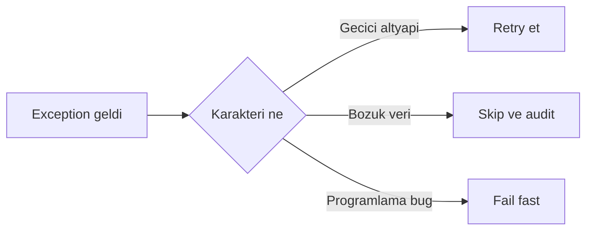
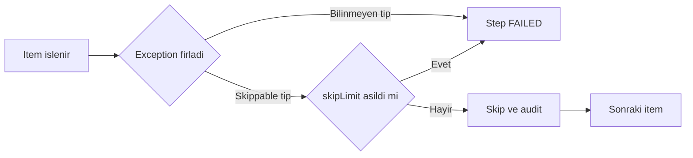
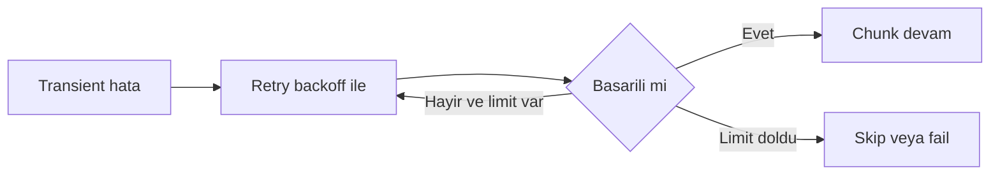
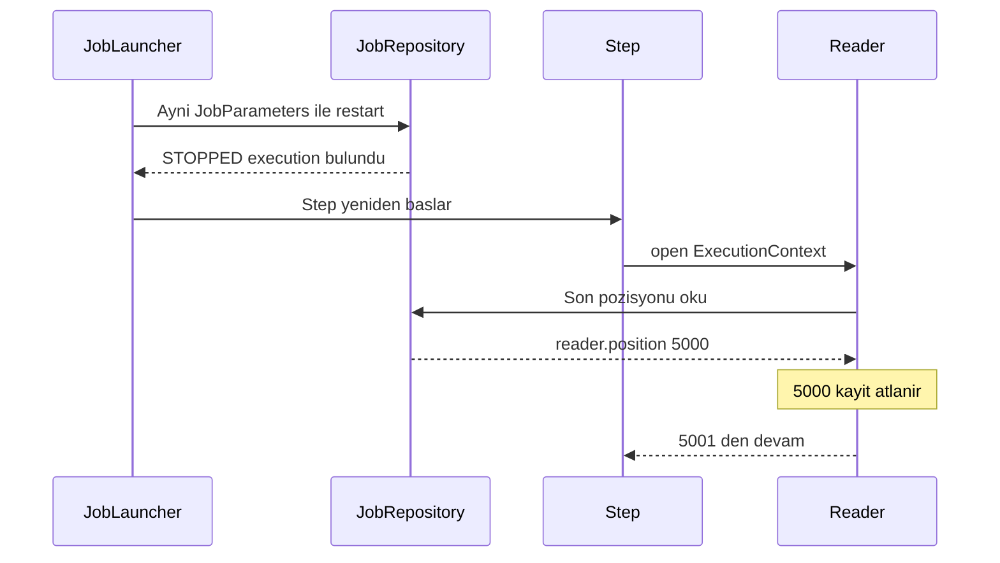

# Topic 5.3 — Skip, Retry, Restart

```admonish info title="Bu bölümde"
- Banking batch failure taxonomy: data quality → skip, transient infra → retry, crash → restart
- `SkipPolicy` + `SkipListener` ile bozuk kaydı atlarken audit trail'i koruma
- `RetryPolicy` + exponential backoff ile transient DB/network hatalarını emme
- Restartability: `ExecutionContext` checkpoint + `saveState`, kesilen job'un kaldığı yerden devamı
- Idempotent writer, skip/retry composition order ve klasik restart anti-pattern'leri
```

## Hedef

Spring Batch'in **hata yönetimi** mekanizmalarını banking-grade derinlikte öğrenmek: `SkipPolicy` (data quality hatalarını atla), `RetryPolicy` (network/DB transient hataları), **restartability** (kesilen job kaldığı yerden devam), `ExecutionContext` state, idempotency ve banking EOD job pattern. İki kural: bir hata tüm job'u patlatmamalı, restart kayıpsız olmalı.

## Süre

Okuma: ~2 saat • Kendini Sına: 45 dk • Pratik (opsiyonel): 3-4 saat • Toplam: ~2.5 saat (+ pratik)

## Önbilgi

- Topic 5.1, 5.2 bitti (architecture + chunk-oriented processing)
- Spring transaction kavramı (Phase 3) — commit boundary'yi biliyorsun
- Java exception hierarchy (checked vs unchecked)

---

## Kavramlar

### 1. Failure modes — banking batch

EOD job'un 1M record işliyor ve saat gece yarısı. <mark>Tek bir bozuk kayıt tüm gece EOD job'unu patlatmamalı</mark> — ama her hataya aynı tepkiyi de veremezsin. Önce hatayı sınıflandır, sonra stratejiyi seç.

| Type | Anlam | Strategy |
|---|---|---|
| **Data quality** | Single record bozuk (eksik field, parse hatası) | Skip |
| **Transient infra** | DB connection hiccup, network timeout | Retry |
| **Business rule violation** | Limit exceeded, sanctions hit | Skip + log |
| **Programming bug** | NullPointerException | Fail fast |
| **System crash** | JVM/pod restart | Restart |
| **Poison pill** | Always-failing record | Skip after N retries |

Karar tek cümlede: hata geçici mi, veri mi bozuk, yoksa kod mu hatalı?



Banking batch tasarımının özü: **graceful degradation** + audit + recovery.

### 2. Skip policy — single record drop

Bozuk bir CSV satırı yüzünden 1M kaydın hepsini kaybetmek istemezsin; **skip** o tek kaydı atlar, gerisi akar. Ama banking'de atlamak "unutmak" değildir — <mark>skip edilen her kayıt mutlaka audit'e yazılmalı</mark>, yoksa compliance açığı doğar.

Önce step'i fault-tolerant yap ve hangi exception'ların skippable olduğunu bildir:

```java
@Bean
public Step processTransactions(JobRepository jobRepo, PlatformTransactionManager tm,
                                ItemReader<Transaction> reader,
                                ItemProcessor<Transaction, Posting> processor,
                                ItemWriter<Posting> writer) {
    return new StepBuilder("processTransactions", jobRepo)
        .<Transaction, Posting>chunk(100, tm)
        .reader(reader).processor(processor).writer(writer)
        .faultTolerant()
        .skipPolicy(bankingSkipPolicy())
        .skipLimit(100)
        .skip(InvalidIbanException.class)
        .skip(ParseException.class)
        .noSkip(NullPointerException.class)
        .listener(skipListener())
        .build();
}
```

`skipLimit` bir emniyet supabı: eşik aşılırsa "tek tük bozuk kayıt" değil "upstream bozuk" demektir, o zaman fail etmek daha doğru. Custom `SkipPolicy` bu kararı exception tipine göre inceltir:

```java
@Bean
public SkipPolicy bankingSkipPolicy() {
    return (Throwable t, long skipCount) -> {
        if (t instanceof InvalidIbanException || t instanceof ParseException) {
            if (skipCount > 100) {
                log.error("Too many skips ({}); likely upstream issue", skipCount);
                return false;   // eşik aşıldı → fail
            }
            return true;
        }
        if (t instanceof BusinessValidationException) return skipCount < 50;
        return false;   // Bilinmeyen → fail fast
    };
}
```

Kritik parça `SkipListener`: skip anında kaydı audit tablosuna yazar. Okuma, process ve write fazlarının üçü için ayrı callback var:

```java
@Override
public void onSkipInProcess(Transaction tx, Throwable t) {
    log.warn("Skipped tx={} during process", tx.getId(), t);
    skipAuditRepo.save(SkipAudit.builder()
        .transactionId(tx.getId()).phase("PROCESS")
        .reason(t.getMessage()).occurredAt(Instant.now())
        .build());
}
```



<details>
<summary>Tam kod: SkipPolicy + SkipListener (~55 satır)</summary>

```java
@Bean
public SkipPolicy bankingSkipPolicy() {
    return new SkipPolicy() {
        @Override
        public boolean shouldSkip(Throwable t, long skipCount) {
            if (t instanceof InvalidIbanException || t instanceof ParseException) {
                if (skipCount > 100) {
                    log.error("Too many skips ({}); likely upstream issue", skipCount);
                    return false;
                }
                return true;
            }
            if (t instanceof BusinessValidationException) {
                return skipCount < 50;
            }
            return false;   // Fail fast on unknown
        }
    };
}

@Bean
public SkipListener<Transaction, Posting> skipListener() {
    return new SkipListenerSupport<>() {
        @Override
        public void onSkipInRead(Throwable t) {
            log.warn("Skipped record during read", t);
            skipMetrics.recordReadSkip();
        }

        @Override
        public void onSkipInProcess(Transaction tx, Throwable t) {
            log.warn("Skipped tx={} during process", tx.getId(), t);
            skipAuditRepo.save(SkipAudit.builder()
                .transactionId(tx.getId())
                .phase("PROCESS")
                .reason(t.getMessage())
                .occurredAt(Instant.now())
                .build());
        }

        @Override
        public void onSkipInWrite(Posting posting, Throwable t) {
            log.warn("Skipped posting during write", t);
            skipAuditRepo.save(SkipAudit.builder()
                .postingId(posting.getId())
                .phase("WRITE")
                .reason(t.getMessage())
                .build());
        }
    };
}
```

</details>

```admonish warning title="Skip = unutmak değil"
Skipped record asla sessizce kaybolmamalı: skip audit table (compliance + investigation) + daily skip count metric + eşik aşılırsa alert. `skipLimit(1_000_000)` gibi devasa bir limit "tüm bozuk veri sessizce atlandı" demektir — bilinçli, makul bir eşik koy.
```

### 3. Retry — transient failures

DB connection bir an koptu, bir sonraki denemede düzelecek. Böyle **transient** hatalarda kaydı atlamak yazık olur — birkaç kez daha dene, çoğu zaman tutar. Kritik nüans: <mark>retry yalnızca transient hatalar için anlamlıdır, bir programlama bug'ına retry anlamsızdır</mark>.

Fault-tolerant step'e retryable exception tiplerini ve backoff'u bildirirsin:

```java
return new StepBuilder("processWithRetry", repo)
    .<Transaction, Posting>chunk(100, tm)
    .reader(reader).processor(processor).writer(writer)
    .faultTolerant()
    .retryLimit(3)
    .retry(DeadlockLoserDataAccessException.class)
    .retry(CannotAcquireLockException.class)
    .retry(TransientDataAccessException.class)
    .backOffPolicy(exponentialBackoff())
    .listener(retryListener())
    .build();
```

Backoff olmadan retry, düşmüş bir DB'yi tight loop ile daha da yorar. Exponential backoff her denemede bekleme süresini katlar:

```java
@Bean
public BackOffPolicy exponentialBackoff() {
    ExponentialBackOffPolicy policy = new ExponentialBackOffPolicy();
    policy.setInitialInterval(500);      // 500 ms
    policy.setMaxInterval(10_000);       // cap 10 sec
    policy.setMultiplier(2.0);
    return policy;
}
```

Denemeler: 500ms → 1s → 2s → 4s ... 10s'te sabitlenir.



### 4. Restartability — Spring Batch'in killer feature'ı

Job gece 3'te pod evict oldu diye baştan başlamamalı. Spring Batch, her chunk commit'inde ilerlemeyi `JobRepository`'ye (DB) yazar; aynı `JobParameters` ile tekrar başlatınca kaldığı yerden devam eder.

```java
JobExecution execution = jobLauncher.run(eodJob, jobParameters);

// Ortada kesilirse (kill -9, pod evict) state DB'de kalır:
//  BATCH_JOB_EXECUTION       (status=FAILED veya STOPPED)
//  BATCH_STEP_EXECUTION      (read_count, write_count, ...)
//  BATCH_EXECUTION_CONTEXT   (chunk position, last processed ID)

// Aynı parametrelerle restart → son commit'li chunk'tan devam:
JobExecution restart = jobLauncher.run(eodJob, sameJobParameters);
```

Restart'ın aynı **JobInstance**'ı bulmasının anahtarı `JobParameters`: identifying parametreler instance'ı tanımlar, non-identifying'ler her çalıştırmada değişir.

```java
JobParameters params = new JobParametersBuilder()
    .addString("eodDate", "2024-05-12", true)          // identifying
    .addLong("runId", System.currentTimeMillis(), false) // non-identifying
    .toJobParameters();
```

Aynı `eodDate` → aynı instance (restart mümkün); farklı `eodDate` → yeni instance. `runId` non-identifying olduğu için aynı instance'ı defalarca çalıştırabilirsin.



### 5. ExecutionContext — checkpoint state

Restart'ın "kaldığı yer"i bilmesi sihir değil: reader pozisyonunu her chunk commit'inde `ExecutionContext`'e yazar. Anahtar switch `saveState(true)`:

```java
@Bean
@StepScope
public ItemReader<Transaction> partitionedReader(
    @Value("#{stepExecutionContext['minId']}") Long minId,
    @Value("#{stepExecutionContext['maxId']}") Long maxId) {
    JdbcCursorItemReader<Transaction> reader = new JdbcCursorItemReader<>();
    reader.setDataSource(ds);
    reader.setSql("SELECT * FROM transaction WHERE id BETWEEN ? AND ? ORDER BY id");
    reader.setPreparedStatementSetter(ps -> { ps.setLong(1, minId); ps.setLong(2, maxId); });
    reader.setRowMapper(new TransactionRowMapper());
    reader.setSaveState(true);   // ← pozisyonu ExecutionContext'e persist et
    return reader;
}
```

Restart'ta akış: state oku (son pozisyon 12500) → o pozisyona kadar atla → chunk işlemeye devam et.

Custom reader/writer yazacaksan `ItemStream` interface'i save/restore kancalarını verir — `open` state'i yükler, `update` state'i yazar:

```java
public class BankingReader implements ItemStreamReader<Transaction> {
    private long position = 0;

    @Override
    public void open(ExecutionContext ctx) {
        if (ctx.containsKey("reader.position")) {
            this.position = ctx.getLong("reader.position");
        }
    }
    @Override
    public void update(ExecutionContext ctx) {
        ctx.putLong("reader.position", this.position);
    }
    @Override
    public Transaction read() { position++; return fetchNext(); }
    @Override
    public void close() {}
}
```

```admonish warning title="saveState(false) tuzağı"
Reader `saveState(false)` ile yapılandırılmışsa restart pozisyonu kaydetmez — job baştan okumaya başlar. Idempotent writer'ın yoksa bu, işlenmiş kayıtların ikinci kez yazılması demektir. saveState default `true`'dur; bilinçli bir sebep yoksa kapatma.
```

### 6. Idempotency — restart-safe writer

Restart sırasında bir chunk'ın **aynı kaydı iki kez yazması** mümkündür (son commit ile crash arasındaki iş). Bu yüzden <mark>restart ihtimali olan writer idempotent olmak zorunda</mark>. Çözüm: deterministic ID + UPSERT.

```java
@Bean
public ItemWriter<Posting> idempotentWriter() {
    return chunk -> {
        for (Posting p : chunk) {
            jdbcTemplate.update("""
                INSERT INTO ledger_entry (id, account_id, debit, credit, currency, posted_at)
                VALUES (?, ?, ?, ?, ?, ?)
                ON CONFLICT (id) DO NOTHING
                """,
                p.getId(), p.getAccountId(), p.getDebit(), p.getCredit(),
                p.getCurrency(), p.getPostedAt());
        }
    };
}
```

Banking pratiği: ID'yi `hash(transactionId + accountSide)` gibi **deterministic** üret. Böylece aynı mantıksal kayıt her seferinde aynı ID'yi alır, `ON CONFLICT DO NOTHING` ikinciyi sessizce yutar — duplicate ledger entry yok.

### 7. Banking — restart senaryoları

Teoriyi dört somut EOD senaryosuyla oturtalım.

**Senaryo 1 — Pod evict mid-job:**

```
T0: Job baslar, 1M transaction isleniyor
T1 (chunk 5000/10000): Pod evicted (node maintenance)
  State persisted: chunk 5000 committed, status STOPPED
T2: Pod restarts, restart-trigger STOPPED job'u tespit eder
  Resume chunk 5001, ayni JobInstance yeni JobExecution
  Completion: 10000 chunk tamam
```

**Senaryo 2 — DB transient failure:**

```
Chunk 500: read 100 OK, process 100 OK, write → DB connection lost
Retry 1 (500ms): write hala fail
Retry 2 (1s): write succeeds → chunk 501 devam
```

**Senaryo 3 — Bad data record:**

```
Chunk 100, record 56: read → ParseException (corrupt CSV)
Skip policy: skippable → audit log → diger 99 record devam
Job sonu: skip count 1, status COMPLETED (with skips)
```

**Senaryo 4 — Job stuck, manual abort:**

```
Job 6 saattir ilerlemedi, ops abort karari verir:
  jobOperator.stop(executionId)
  → setTerminateOnly() → current chunk commit sonrasi durur
  → status STOPPED (FAILED degil)
Ertesi sabah: restart → son commit'ten devam
```

### 8. Job parameters strategy

Identifying/non-identifying ayrımı restart'ın kalbidir; banking'de bunu bir factory'de standartlaştır:

```java
public static JobParameters forEodOnDate(LocalDate eodDate) {
    return new JobParametersBuilder()
        // Identifying — instance'ı tanımlar
        .addString("eodDate", eodDate.toString(), true)
        .addString("environment", System.getenv("ENV"), true)
        // Non-identifying — her run'da değişir
        .addLong("runId", System.currentTimeMillis(), false)
        .addString("triggeredBy", "scheduler", false)
        .toJobParameters();
}
```

`eodDate` identifying → aynı tarih = aynı instance (restart-able). `runId` non-identifying → aynı instance birden çok kez çalıştırılabilir. Aynı `eodDate` ile ikinci run yalnızca öncekinin FAILED/STOPPED olması hâlinde mümkündür.

```admonish tip title="Restart'ı sihre bağlama, parametreye bağla"
Restart-ability tamamen doğru identifying parametre seçimine dayanır. `runId`'yi identifying yaparsan her çalıştırma yeni instance açar ve restart imkânsızlaşır. Kural: iş anlamında "aynı çalıştırma" olan her şey (banking'de EOD tarihi) identifying, teknik varyasyon (timestamp, tetikleyen) non-identifying.
```

### 9. Stop + restart workflow

Ops'un job'u zarifçe durdurup sonra devam ettirebilmesi gerekir. `JobOperator` + `JobExplorer` bu operasyonel yüzeyi verir. Önce çalışan execution'ları bul ve graceful stop iste:

```java
public void stopRunning(String jobName) {
    Set<Long> running = jobExplorer.findRunningJobExecutions(jobName)
        .stream().map(JobExecution::getId).collect(toSet());
    for (Long id : running) {
        try {
            jobOperator.stop(id);   // graceful — current chunk commit sonrasi durur
            log.info("Stop requested for execution {}", id);
        } catch (Exception e) {
            log.error("Failed to stop execution {}", id, e);
        }
    }
}
```

Restart ise tek satır. Bir de tipik banking pattern: sabah 05:00'te dünkü FAILED job'ları otomatik resume eden scheduler:

```java
@Scheduled(cron = "0 0 5 * * *")   // 05:00 daily
public void resumeStalledJobs() {
    LocalDate yesterday = LocalDate.now().minusDays(1);
    Set<JobExecution> failed = jobExplorer.findJobExecutionsByStatus(
        "eodJob", BatchStatus.FAILED);
    for (JobExecution exec : failed) {
        LocalDate execDate = LocalDate.parse(exec.getJobParameters().getString("eodDate"));
        if (execDate.equals(yesterday)) {
            log.warn("Resuming failed job execution {}", exec.getId());
            jobOperator.restart(exec.getId());
        }
    }
}
```

<details>
<summary>Tam kod: BankingJobOperator (~40 satır)</summary>

```java
@Component
public class BankingJobOperator {

    private final JobOperator jobOperator;
    private final JobExplorer jobExplorer;

    public void stopRunning(String jobName) {
        Set<Long> runningExecutions = jobExplorer.findRunningJobExecutions(jobName)
            .stream().map(JobExecution::getId).collect(toSet());

        for (Long id : runningExecutions) {
            try {
                jobOperator.stop(id);   // Graceful stop
                log.info("Stop requested for execution {}", id);
            } catch (Exception e) {
                log.error("Failed to stop execution {}", id, e);
            }
        }
    }

    public Long restart(Long previousExecutionId) throws Exception {
        return jobOperator.restart(previousExecutionId);
    }

    @Scheduled(cron = "0 0 5 * * *")   // 05:00 daily
    public void resumeStalledJobs() {
        LocalDate yesterday = LocalDate.now().minusDays(1);
        Set<JobExecution> failed = jobExplorer.findJobExecutionsByStatus(
            "eodJob", BatchStatus.FAILED);

        for (JobExecution exec : failed) {
            LocalDate execDate = LocalDate.parse(
                exec.getJobParameters().getString("eodDate"));
            if (execDate.equals(yesterday)) {
                log.warn("Resuming failed job execution {}", exec.getId());
                jobOperator.restart(exec.getId());
            }
        }
    }
}
```

</details>

### 10. Skip + Retry composition order

İkisi aynı step'te tanımlıysa Spring Batch'in sırası bellidir ve mülakatta sorulur: **önce retry, sonra skip**.

```java
.faultTolerant()
.retryLimit(3)
.retry(TransientDataAccessException.class)
.skipLimit(100)
.skip(InvalidIbanException.class)
.skip(ParseException.class)
```

Akış: item exception fırlatır → exception retryable mı? → limit içinde retry → retry'lar tükendi → exception skippable mı? → skip + audit → değilse step FAILED. Yani transient bir hata önce N kez denenir; kalıcı olarak fail ederse ve skippable ise atlanır. Mantık nettir: geçici olabilecek şeyi önce dene, hâlâ bozuksa veriyi at.

### 11. Banking — restart anti-pattern'leri

Mülakatta "bu restart neden duplicate üretti?" sorusunun cephaneliği burasıdır.

**1 — Non-deterministic IDs:** `post.setId(UUID.randomUUID())` → restart aynı mantıksal kaydı yeni UUID ile yazar, duplicate. Fix: `hash(transactionId + side)` deterministic.

**2 — saveState(false):** Reader state kaydetmez → restart baştan okur.

**3 — Processor'da external side effect:** `emailService.sendNotification(tx)` → restart aynı müşteriye tekrar email atar. Side effect'i outbox + dedupe ile dışarı çıkar.

**4 — Non-idempotent writer:** Düz `INSERT` → restart duplicate. UPSERT / `ON CONFLICT DO NOTHING`.

**5 — Skip without audit:** Skipped record kaybolur; banking'de audit critical.

**6 — Skip limit too high:** `skipLimit(1_000_000)` → tüm bozuk veri sessizce atlanır. Makul eşik koy.

**7 — Retry on non-transient:** `.retry(NullPointerException.class)` → NPE bir bug, retry anlamsız.

**8 — No backoff:** Tight loop retry DB'yi ezer. Exponential backoff şart.

**9 — Yanlış identifying parametre:** `.addLong("runId", ..., true)` → her run yeni instance, restart imkânsız.

**10 — Data fix sonrası restart:** Bazen restart doğru değildir; veri düzeltildiyse tam re-run daha güvenli (banking idempotency-safe olduğu için mümkün).

---

## Önemli olabilecek araştırma kaynakları

- Spring Batch reference — Skip + Retry + Restart
- "Pro Spring Batch" — Michael Minella
- Spring Retry library
- Banking EOD operations patterns

---

## Kendini Sına

Aşağıdaki soruları önce **cevaba bakmadan** kendi cümlelerinle yanıtlamayı dene — hepsi TR bank mülakatlarında karşına çıkabilecek tarzda. Takıldığında ilgili Kavramlar başlığına dön, sonra tekrar dene.

**S1. Aynı hata için ne zaman skip, ne zaman retry kullanırsın? İkisini birbirinden nasıl ayırırsın?**

<details>
<summary>Cevabı göster</summary>

Ayrım hatanın karakterinde: **transient** (geçici) mı, yoksa **kalıcı bir veri/kod problemi** mi? Retry, tekrar denendiğinde düzelme ihtimali olan geçici hatalar içindir — DB connection hiccup, deadlock, lock timeout, network glitch. Skip, retry'ın çözemeyeceği kalıcı problemler içindir — bozuk CSV satırı, invalid IBAN, business rule violation gibi o kaydın kendisinden kaynaklanan sorunlar.

Pratik test: "aynı işlemi 2 saniye sonra tekrar yapsam düzelir mi?" Cevap evet ise retry, hayır ise skip. NullPointerException gibi bug'lar hiçbirine girmez — fail fast, çünkü ne retry ne skip kodu düzeltmez.

</details>

**S2. Restart neden `ExecutionContext`'e bağımlıdır? `saveState(false)` olsaydı ne olurdu?**

<details>
<summary>Cevabı göster</summary>

Spring Batch restart'ta "kaldığı yeri" `ExecutionContext`'ten okur. Reader her chunk commit'inde son pozisyonunu (ör. `reader.position`) `ExecutionContext`'e yazar; bu context `BATCH_EXECUTION_CONTEXT` tablosunda persist edilir. Restart'ta reader `open(ctx)` içinde bu değeri yükleyip oradan devam eder. Yani restart'ın kayıpsızlığı tamamen bu checkpoint state'e dayanır.

`saveState(false)` olsaydı reader pozisyonunu hiç kaydetmezdi; restart job'u baştan okumaya başlardı. Writer idempotent değilse bu, zaten işlenmiş kayıtların ikinci kez yazılması ve duplicate demektir. saveState default `true`'dur ve bilinçli bir sebep olmadan kapatılmamalıdır.

</details>

**S3. Idempotency ile restart arasındaki ilişki nedir? Writer neden idempotent olmak zorunda?**

<details>
<summary>Cevabı göster</summary>

Restart, son başarılı commit ile crash anı arasındaki işi yeniden yapabilir; bu da bir chunk'ın **aynı kaydı iki kez yazma** ihtimalini doğurur. Writer idempotent değilse ikinci yazım duplicate ledger entry üretir — banking'de kabul edilemez.

Çözüm iki parçalı: (1) **deterministic ID** — kaydın ID'sini `hash(transactionId + side)` gibi girdiden türet, `UUID.randomUUID()` kullanma; böylece aynı mantıksal kayıt her seferinde aynı ID'yi alır. (2) **UPSERT / `ON CONFLICT DO NOTHING`** — ikinci yazım sessizce yutulur. Bu ikisi olmadan restart-safety yoktur; saveState'i doğru yapsan bile son chunk'ta duplicate riski kalır.

</details>

**S4. Skip ve retry aynı step'te tanımlıysa Spring Batch hangisini önce uygular?**

<details>
<summary>Cevabı göster</summary>

Sıra: **önce retry, sonra skip**. Bir item exception fırlattığında Spring Batch önce exception'ın retryable olup olmadığına bakar; öyleyse `retryLimit` içinde (backoff ile) tekrar dener. Retry'lar tükendikten sonra hâlâ fail ediyorsa exception'ın skippable olup olmadığına bakar; öyleyse skip + audit yapar. Skippable değilse step FAILED olur.

Mantık: geçici olabilecek bir hatayı önce birkaç kez dene (transient DB hiccup çözülebilir); kalıcı olarak fail ederse ve veri sorunu olarak atlanabilirse skip et. Böylece transient bir DB hatası yüzünden sağlam bir kaydı boş yere atlamamış olursun.

</details>

**S5. Identifying vs non-identifying JobParameters farkı nedir? Restart bu ayrıma nasıl bağlı?**

<details>
<summary>Cevabı göster</summary>

Identifying parametreler bir **JobInstance**'ı tanımlar; Spring Batch aynı identifying parametre setini gördüğünde onu aynı instance sayar. Non-identifying parametreler instance kimliğine girmez, her çalıştırmada serbestçe değişebilir. Banking'de `eodDate` identifying (EOD tarihi işi tanımlar), `runId` (timestamp) non-identifying olur.

Restart tam bu ayrıma dayanır: aynı `eodDate` ile tekrar başlatırsan Spring Batch aynı instance'ı bulur ve — önceki execution FAILED/STOPPED ise — kaldığı yerden devam eder. `runId`'yi identifying yaparsan her çalıştırma yeni instance açar ve restart imkânsızlaşır; COMPLETED bir instance'ı aynı parametrelerle tekrar başlatmaya çalışırsan `JobInstanceAlreadyCompleteException` alırsın.

</details>

**S6. `jobOperator.stop()` ile `kill -9` arasında ne fark var? STOPPED ile FAILED status'u ne anlatır?**

<details>
<summary>Cevabı göster</summary>

`jobOperator.stop()` **graceful**'dır: step'e `setTerminateOnly()` işaretini koyar, mevcut chunk commit olduktan sonra job temiz bir şekilde durur ve status STOPPED olur. State tutarlıdır, restart son commit'ten devam eder. `kill -9` veya pod evict ise anî kesintidir — süreç ortada ölür; Spring Batch bunu tespit ederse execution FAILED (veya STOPPED) olarak işaretlenir ama commit sınırında durmanın garantisi process seviyesinde yoktur.

İkisi de restart-able state bırakır çünkü chunk commit boundary'sindeki ilerleme zaten DB'ye yazılıdır. Fark, graceful stop'ın current chunk'ı temiz bitirmesi; anî kill'in ise en son commit'li chunk'a geri düşmesidir. Her iki durumda da restart son committed chunk'tan devam eder.

</details>

**S7. Processor içinde müşteriye email göndermek neden restart açısından bir anti-pattern? Nasıl çözersin?**

<details>
<summary>Cevabı göster</summary>

Processor (veya writer) içinde `emailService.sendNotification(tx)` gibi bir external side effect varsa, restart o chunk'ı yeniden işlediğinde aynı müşteriye **ikinci kez email** gider. DB yazımını UPSERT ile idempotent yapabilirsin ama gönderilmiş bir email'i geri alamazsın; side effect DB transaction'ının rollback/replay semantiğine tabi değildir.

Çözüm: side effect'i batch akışından çıkar. Processor sadece DB'ye bir **outbox** kaydı yazar (aynı idempotent writer mantığıyla); ayrı bir süreç outbox'ı okuyup email'i **dedupe** ederek (deterministic key ile "bu bildirim gönderildi mi?") gönderir. Böylece restart outbox'ta duplicate üretmez, dedupe da ikinci gönderimi engeller.

</details>

---

## Tamamlama kriterleri

- [ ] Banking failure mode'larını (data quality / transient / bug / crash / poison pill) doğru stratejiyle eşleştirebiliyorum
- [ ] Skip vs retry ayrımını "transient mi kalıcı mı" testiyle 1 dakikada anlatabilirim
- [ ] `SkipPolicy` + `SkipListener` + audit table tasarımını ve neden audit'in kritik olduğunu açıklayabiliyorum
- [ ] `RetryPolicy` + exponential backoff'u ve neden backoff'un şart olduğunu anlatabilirim
- [ ] Restart'ın `ExecutionContext` + `saveState` checkpoint'ine bağımlılığını çizebiliyorum
- [ ] Idempotent writer'ı (deterministic ID + UPSERT) ve restart ile ilişkisini anlatabiliyorum
- [ ] Identifying vs non-identifying `JobParameters` ayrımını ve restart'a etkisini biliyorum
- [ ] Skip + retry composition order'ını (önce retry, sonra skip) sebebiyle söyleyebiliyorum
- [ ] 10 restart anti-pattern'inden en az 5'ini örnekle sayabiliyorum
- [ ] (Opsiyonel) "Pratik yapmak istersen" bölümündeki testleri yazdım ve Claude-verify prompt'uyla doğrulattım

---

## Defter notları

1. "Banking batch failure modes (data quality / transient / business / bug / crash): ____."
2. "SkipPolicy specific exception + audit table + threshold alert: ____."
3. "RetryPolicy + exponential backoff + transient-only banking pattern: ____."
4. "Restartability ExecutionContext + saveState + checkpoint: ____."
5. "Identifying (eodDate) vs non-identifying (runId) JobParameters: ____."
6. "Idempotent writer UPSERT / ON CONFLICT DO NOTHING banking: ____."
7. "Composition order: retry first → skip → propagate: ____."
8. "JobOperator stop/restart workflow + 05:00 morning recovery: ____."
9. "External side effect (email) externalize via outbox + dedupe: ____."
10. "Anti-pattern (random ID, no saveState, no audit, retry NPE): ____."

```admonish success title="Bölüm Özeti"
- Banking batch her hataya aynı tepkiyi vermez: transient → retry, bozuk veri → skip, bug → fail fast, crash → restart; ayrımın testi "tekrar denesem düzelir mi?"
- Skip tek bozuk kaydı atlar ama banking'de skip = unutmak değil — `SkipListener` + audit table + makul `skipLimit` şart
- Retry transient hataları emmek içindir; exponential backoff olmadan düşmüş DB'yi tight loop ile ezersin, NPE gibi bug'lara retry anlamsız
- Restart'ın kayıpsızlığı `ExecutionContext` checkpoint'ine dayanır: `saveState(true)` her chunk commit'inde pozisyonu yazar, restart oradan devam eder
- Restart aynı kaydı iki kez yazabilir → writer idempotent olmalı: deterministic ID (UUID değil) + UPSERT / `ON CONFLICT DO NOTHING`
- Composition order "önce retry, sonra skip"; restart-ability tamamen doğru identifying (`eodDate`) vs non-identifying (`runId`) parametre seçimine bağlı
```

---

## Pratik yapmak istersen

Kavramları koda dökmek istersen aşağıdaki iki ek hazır: test yazma rehberi skip, retry, restart ve idempotency davranışları için örnek testler içerir; Claude-verify prompt'u ile yazdığın skip/retry/restart kodunu banking-grade perspektiften denetletebilirsin.

Süre (opsiyonel): rehberdeki testleri baştan sona uygulaman ~3-4 saat sürer; sadece okuyup mantığını kavramak ~30 dk. Tamamlama ölçütün: skip audit, retry+backoff, restart-from-checkpoint ve idempotent writer testlerinin dördünü de yeşile boyayabiliyor ve neden geçtiklerini anlatabiliyorsan bu bölüm oturmuş demektir.

<details>
<summary>Test yazma rehberi</summary>

```java
@SpringBatchTest
@SpringBootTest
class SkipRetryRestartTest {

    @Autowired JobLauncherTestUtils launcher;
    @Autowired JobRepository jobRepo;

    @Test
    void shouldSkipParseError() throws Exception {
        seedDataWithParseErrors(100, 5);   // 100 records, 5 bad

        JobExecution exec = launcher.launchJob();

        StepExecution step = exec.getStepExecutions().iterator().next();
        assertThat(step.getStatus()).isEqualTo(BatchStatus.COMPLETED);
        assertThat(step.getReadCount()).isEqualTo(100);
        assertThat(step.getProcessSkipCount()).isEqualTo(5);
        assertThat(step.getWriteCount()).isEqualTo(95);
    }

    @Test
    void shouldRetryThenSucceedOnTransientFailure() throws Exception {
        AtomicInteger callCount = new AtomicInteger();
        when(externalService.call(any())).thenAnswer(inv -> {
            int count = callCount.incrementAndGet();
            if (count < 3) throw new TransientDataAccessException("transient");
            return success();
        });

        JobExecution exec = launcher.launchJob();

        assertThat(exec.getStatus()).isEqualTo(BatchStatus.COMPLETED);
        verify(externalService, times(3)).call(any());
    }

    @Test
    void shouldRestartFromLastCommittedChunk() throws Exception {
        seedData(10_000);

        JobExecution failed = launcher.launchJob();
        killAtChunk(50);   // force fail mid-job

        assertThat(failed.getStatus()).isEqualTo(BatchStatus.FAILED);
        long processed = failed.getStepExecutions().iterator().next().getWriteCount();

        JobExecution restart = launcher.launchJob();   // resume

        long total = restart.getStepExecutions().iterator().next().getWriteCount();
        assertThat(total).isEqualTo(10_000 - processed);

        long dbCount = jdbcTemplate.queryForObject("SELECT COUNT(*) FROM ledger_entry", Long.class);
        assertThat(dbCount).isEqualTo(10_000);   // no duplicates
    }

    @Test
    void shouldNotRestartCompletedInstance() throws Exception {
        JobParameters params = new JobParametersBuilder()
            .addString("eodDate", "2024-05-12", true)
            .toJobParameters();

        JobExecution first = launcher.launchJob(params);
        assertThat(first.getStatus()).isEqualTo(BatchStatus.COMPLETED);

        assertThatThrownBy(() -> launcher.launchJob(params))
            .isInstanceOf(JobInstanceAlreadyCompleteException.class);
    }
}
```

> Idempotency testi için ipucu: restart senaryosunu iki kez tetikle (kill → restart → kill → restart) ve her seferinde `SELECT COUNT(*)` ile ledger tablosunun beklenen satır sayısında kaldığını doğrula. Deterministic ID + `ON CONFLICT DO NOTHING` doğru kurulmuşsa sayım hiç şişmez.

</details>

<details>
<summary>Claude-verify prompt</summary>

```
Skip+Retry+Restart setup'ımı banking-grade kriterlere göre değerlendir.
Eksikleri işaretle, kod yazma:

1. Skip:
   - SkipPolicy specific exception types (broad Exception değil)?
   - skipLimit reasonable (banking: 100-1000)?
   - SkipListener audit table'a yazıyor mu?
   - Daily skip threshold alert var mı?

2. Retry:
   - retry only TransientDataAccessException / deadlock / lock timeout?
   - retryLimit 3-5?
   - Exponential backoff (initial 500ms, multiplier 2, cap)?
   - NPE / non-transient üzerinde retry YOK?

3. Restart:
   - identifying eodDate parametresi?
   - runId non-identifying?
   - Reader saveState(true)?
   - ExecutionContext checkpoint doğru?

4. Idempotency:
   - Deterministic ID (random YOK)?
   - UPSERT / ON CONFLICT DO NOTHING?
   - Processor'da external side effect YOK (veya outbox + dedupe)?

5. Banking EOD:
   - Skip audit table + retention?
   - Daily skip metric?
   - Pod evict recovery otomatik?
   - Failed job re-run scheduler (05:00)?

6. Composition + operations:
   - Retry first, then skip order doğru mu?
   - skipPolicy + retryPolicy ikisi de configured?
   - JobOperator.stop() graceful, restart() resume?

7. Anti-pattern:
   - Non-deterministic ID YOK?
   - saveState(false) YOK?
   - Side effects in processor YOK?
   - Non-idempotent writer YOK?
   - Skip without audit YOK?
   - Retry on bug / no backoff YOK?
   - Yanlış identifying params YOK?

Her madde için PASS / FAIL / EKSIK işaretle, kanıt göster, kod yazma.
```

</details>
