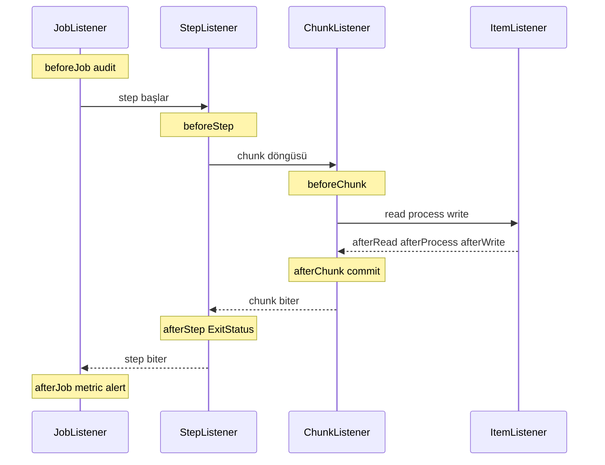
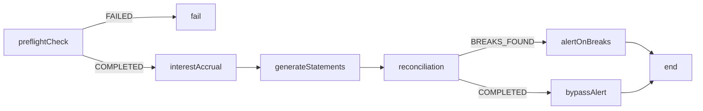
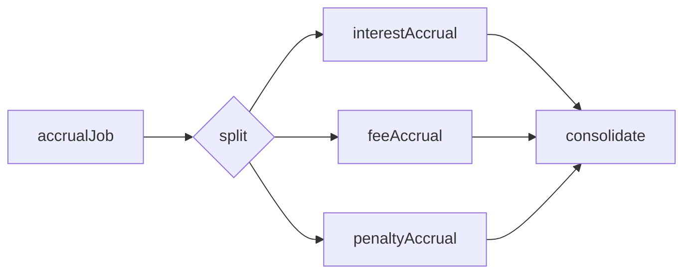
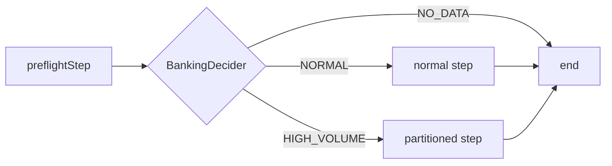

# Topic 5.4 — Listeners & Flow Control

```admonish info title="Bu bölümde"
- Listener hiyerarşisi (Job / Step / Chunk / Item) ve her seviyenin banking'de ne için kullanıldığı
- `JobExecutionListener` ile audit + metric + Slack alert; `StepExecutionListener` ile conditional `ExitStatus`
- Conditional flow (`on(...).to(...)`) ile step sonucuna göre dallanma ve `JobExecutionDecider` ile arasındaki fark
- `split` ile paralel accrual, `JobStep` ile modüler EOD kompozisyonu
- 10 listener/flow anti-pattern'i ve gerçekçi banking EOD master orchestration
```

## Hedef

Spring Batch event listener mekanizmasını ve flow control'ü banking derinliğinde kavramak: dört listener seviyesi, conditional flow (`on(...).to(...)`), parallel flow (`split`), nested job (`JobStep`), decision pattern ve banking EOD master orchestration. Amaç ezber değil; hangi lifecycle noktasına neden kod astığını ve step sonucuna göre nasıl dallandığını sebep-sonuç olarak anlatabilmek.

## Süre

Okuma: 2 saat • Kendini Sına: 30 dk • Pratik (opsiyonel): 2.5-3 saat • Toplam: ~2.5 saat (+ pratik)

## Önbilgi

- Topic 5.1-5.3 bitti — job, step, chunk, reader/processor/writer rahat
- Spring'in event/listener pattern'ini gördün

---

## Kavramlar

### 1. Listener hierarchy — lifecycle'a kod asmak

Bir job bittiğinde audit yazmak, metric üretmek, Slack'e alert atmak istersin — ama bu cross-cutting kaygıları reader/processor/writer içine gömmek pisliktir. **Listener**, business logic'e hiç dokunmadan lifecycle noktalarına kod asmanı sağlayan mekanizmadır.

Dört seviye var ve her biri içteki bir sonrakini kapsar: job → step → chunk → item. Her seviye kendi `before/after` (ve `onError`) callback'lerini sunar:

```
JobExecutionListener      beforeJob / afterJob
  StepExecutionListener   beforeStep / afterStep
    ChunkListener         beforeChunk / afterChunk / afterChunkError
      ItemReadListener    beforeRead / afterRead / onReadError
      ItemProcessListener beforeProcess / afterProcess / onProcessError
      ItemWriteListener   beforeWrite / afterWrite / onWriteError
```

Zaman ekseninde akış şöyle ilerler — dıştan içe girer, içten dışa çıkar:



Banking'de en çok üç seviyeyi kullanırsın: **JobExecutionListener** (audit + notification), **StepExecutionListener** (metric + duration) ve **ChunkListener** (incremental progress). Item seviyesi yüksek hacimde pahalıdır — bunu az sonra tuzak olarak göreceğiz.

```admonish tip title="Listener'ı nereye kaydedersin"
Bir listener'ı yazmak yetmez, doğru builder'a bağlaman gerekir: job listener'ı `JobBuilder.listener(...)`, step listener'ı `StepBuilder.listener(...)`, chunk/item listener'ları da yine `StepBuilder.listener(...)` ile. Listener'ı yanlış seviyeye bağlarsan (örneğin chunk listener'ı job'a) callback'ler hiç tetiklenmez ve sessizce "çalışmıyor" görünür.
```

### 2. JobExecutionListener — banking audit

Regülatör "hangi batch ne zaman başladı, ne zaman bitti, kaç kayıt işledi?" diye sorar; bu cevabı `JobExecutionListener` üretir. Önce bağımlılıklar — audit, notification ve metric servisleri:

```java
@Component
public class BankingJobExecutionListener implements JobExecutionListener {
    private final AuditService auditService;
    private final SlackNotifier slackNotifier;
    private final MeterRegistry meterRegistry;
```

`beforeJob` job başlarken audit'e bir "JOB_STARTED" satırı yazar — execution id ve parametrelerle birlikte:

```java
    @Override
    public void beforeJob(JobExecution exec) {
        String jobName = exec.getJobInstance().getJobName();
        log.info("Starting job: {} (id={})", jobName, exec.getId());
        auditService.log(AuditEvent.builder()
            .action("JOB_STARTED").resourceType("batch_job").resourceId(jobName)
            .details(Map.of("executionId", exec.getId()))
            .build());
    }
```

`afterJob` işin kalbidir: step execution'lardan read/write/skip toplar, duration hesaplar, **metric** üretir ve `FAILED` durumunda Slack'e alert atar. Aşırı skip de ayrı bir uyarı tetikler:

```java
    @Override
    public void afterJob(JobExecution exec) {
        Duration duration = Duration.between(exec.getStartTime(), exec.getEndTime());
        long writeCount = exec.getStepExecutions().stream()
            .mapToLong(StepExecution::getWriteCount).sum();
        long skipCount = exec.getStepExecutions().stream()
            .mapToLong(StepExecution::getSkipCount).sum();

        meterRegistry.timer("banking.batch.duration", "job", jobName).record(duration);

        if (exec.getStatus() == BatchStatus.FAILED) {
            slackNotifier.alert(Severity.HIGH, "Batch job FAILED: " + jobName,
                "Execution " + exec.getId() + " — " + exec.getAllFailureExceptions());
        }
        if (skipCount > 1000) {
            slackNotifier.alert(Severity.MEDIUM, "High skip count: " + jobName,
                skipCount + " records skipped");
        }
    }
```

<mark>Listener hızlı ve yan etkisiz olmalı; audit/notification gibi işleri fire-and-forget ya da async retry ile yap, listener içinde bloklayan ağır iş yapma.</mark>

<details>
<summary>Tam kod: BankingJobExecutionListener (~73 satır)</summary>

```java
@Component
public class BankingJobExecutionListener implements JobExecutionListener {
    
    private final AuditService auditService;
    private final SlackNotifier slackNotifier;
    private final MeterRegistry meterRegistry;
    
    @Override
    public void beforeJob(JobExecution exec) {
        String jobName = exec.getJobInstance().getJobName();
        log.info("Starting job: {} (id={}, params={})", 
            jobName, exec.getId(), exec.getJobParameters());
        
        auditService.log(AuditEvent.builder()
            .action("JOB_STARTED")
            .resourceType("batch_job")
            .resourceId(jobName)
            .details(Map.of(
                "executionId", exec.getId(),
                "params", exec.getJobParameters().getParameters()))
            .build());
    }
    
    @Override
    public void afterJob(JobExecution exec) {
        String jobName = exec.getJobInstance().getJobName();
        Duration duration = Duration.between(exec.getStartTime(), exec.getEndTime());
        
        long readCount = exec.getStepExecutions().stream()
            .mapToLong(StepExecution::getReadCount).sum();
        long writeCount = exec.getStepExecutions().stream()
            .mapToLong(StepExecution::getWriteCount).sum();
        long skipCount = exec.getStepExecutions().stream()
            .mapToLong(StepExecution::getSkipCount).sum();
        
        log.info("Job {} {}: duration={}, read={}, write={}, skip={}",
            jobName, exec.getStatus(), duration, readCount, writeCount, skipCount);
        
        auditService.log(AuditEvent.builder()
            .action("JOB_FINISHED")
            .resourceType("batch_job")
            .resourceId(jobName)
            .details(Map.of(
                "status", exec.getStatus().toString(),
                "duration_ms", duration.toMillis(),
                "read_count", readCount,
                "write_count", writeCount,
                "skip_count", skipCount))
            .build());
        
        // Metrics
        meterRegistry.timer("banking.batch.duration", "job", jobName, 
            "status", exec.getStatus().toString())
            .record(duration);
        meterRegistry.counter("banking.batch.records_processed", "job", jobName)
            .increment(writeCount);
        
        // Alert on failure
        if (exec.getStatus() == BatchStatus.FAILED) {
            slackNotifier.alert(Severity.HIGH, 
                "Batch job FAILED: " + jobName,
                "Execution " + exec.getId() + " — " + exec.getAllFailureExceptions());
        }
        
        // Alert on excessive skips
        if (skipCount > 1000) {
            slackNotifier.alert(Severity.MEDIUM,
                "High skip count: " + jobName,
                skipCount + " records skipped in execution " + exec.getId());
        }
    }
}
```

</details>

### 3. StepExecutionListener — per-step audit ve custom ExitStatus

Step seviyesinde iki şey istersin: her step'in süresini/metriğini kaydetmek ve step'in sonucuna göre bir **ExitStatus** üretmek. `beforeStep` job context'ten step context'e bir anahtarı taşıyabilir:

```java
@Override
public void beforeStep(StepExecution stepExec) {
    log.info("Starting step: {}", stepExec.getStepName());
    Map<String, Object> jobCtx = stepExec.getJobExecution().getExecutionContext().toMap();
    if (jobCtx.containsKey("eodDate")) {
        stepExec.getExecutionContext().put("eodDate", jobCtx.get("eodDate"));
    }
}
```

`afterStep`'in gücü, döndürdüğü `ExitStatus`'un flow dallanmasını sürmesidir. Banking kuralına göre "çok skip → DEGRADED", "hiç kayıt yok → NO_DATA" gibi custom kodlar üretirsin:

```java
@Override
public ExitStatus afterStep(StepExecution stepExec) {
    if (stepExec.getSkipCount() > 100) {
        return new ExitStatus("DEGRADED", "Too many skips: " + stepExec.getSkipCount());
    }
    if (stepExec.getReadCount() == 0) {
        return new ExitStatus("NO_DATA", "No input records");
    }
    return stepExec.getExitStatus();
}
```

Bu custom kod ile flow'daki `.on("DEGRADED")` birebir eşleşmeli — yoksa dallanma sessizce kırılır (Anti-pattern 9). Sıradaki iki bölüm bu bağlantıyı kuruyor.

<details>
<summary>Tam kod: BankingStepListener (~37 satır)</summary>

```java
@Component
public class BankingStepListener implements StepExecutionListener {
    
    @Override
    public void beforeStep(StepExecution stepExec) {
        String stepName = stepExec.getStepName();
        log.info("Starting step: {}", stepName);
        
        // Promote ExecutionContext key from job to step
        Map<String, Object> jobCtx = stepExec.getJobExecution().getExecutionContext().toMap();
        if (jobCtx.containsKey("eodDate")) {
            stepExec.getExecutionContext().put("eodDate", jobCtx.get("eodDate"));
        }
    }
    
    @Override
    public ExitStatus afterStep(StepExecution stepExec) {
        Duration duration = Duration.between(stepExec.getStartTime(), stepExec.getEndTime());
        
        log.info("Step {} status={} duration={} read={} write={} skip={}",
            stepExec.getStepName(), stepExec.getStatus(), duration,
            stepExec.getReadCount(), stepExec.getWriteCount(), stepExec.getSkipCount());
        
        // Conditional ExitStatus based on banking rules
        if (stepExec.getSkipCount() > 100) {
            return new ExitStatus("DEGRADED", 
                "Too many skips: " + stepExec.getSkipCount());
        }
        
        if (stepExec.getReadCount() == 0) {
            return new ExitStatus("NO_DATA", "No input records");
        }
        
        return stepExec.getExitStatus();
    }
}
```

</details>

### 4. ChunkListener — incremental progress

Uzun süren bir step'te kullanıcı "%kaç bitti?" diye merak eder; her kaydı loglamak yerine chunk commit'lerinde ilerleme yazmak doğru granülaritedir. **ChunkListener** tam bu noktaya oturur — `afterChunk` her commit'ten sonra çalışır:

```java
@Override
public void afterChunk(ChunkContext ctx) {
    StepExecution stepExec = ctx.getStepContext().getStepExecution();
    long writeCount = stepExec.getWriteCount();
    long commitCount = stepExec.getCommitCount();

    progressRepo.update(stepExec.getId(), writeCount, commitCount);   // UI poll eder
    if (commitCount % 100 == 0) {
        log.info("{}: {} records ({} chunks)", stepExec.getStepName(), writeCount, commitCount);
    }
}
```

`afterChunkError` ise rollback anını yakalar — bir chunk patlayıp geri alındığında hangi commit noktasında olduğunu loglayabilirsin:

```java
@Override
public void afterChunkError(ChunkContext ctx) {
    StepExecution stepExec = ctx.getStepContext().getStepExecution();
    log.warn("Chunk error in {}: rollback at commit {}",
        stepExec.getStepName(), stepExec.getCommitCount());
}
```

Progress'i chunk seviyesinde tutmak, item seviyesinde tutmaktan çok daha ucuzdur; 1M kayıtta 100'er satırlık chunk = 10 bin güncelleme, item bazlı olsa 1M güncelleme olurdu.

<details>
<summary>Tam kod: ChunkProgressListener (~32 satır)</summary>

```java
@Component
public class ChunkProgressListener implements ChunkListener {
    
    private final ProgressRepository progressRepo;
    
    @Override
    public void beforeChunk(ChunkContext ctx) {}
    
    @Override
    public void afterChunk(ChunkContext ctx) {
        StepExecution stepExec = ctx.getStepContext().getStepExecution();
        String stepName = stepExec.getStepName();
        long writeCount = stepExec.getWriteCount();
        long commitCount = stepExec.getCommitCount();
        
        // Persist progress for UI / monitoring
        progressRepo.update(stepExec.getId(), writeCount, commitCount);
        
        // Periodic metric
        if (commitCount % 100 == 0) {
            log.info("{}: {} records processed ({} chunks)", stepName, writeCount, commitCount);
        }
    }
    
    @Override
    public void afterChunkError(ChunkContext ctx) {
        StepExecution stepExec = ctx.getStepContext().getStepExecution();
        log.warn("Chunk error in {}: rollback at commit {}",
            stepExec.getStepName(), stepExec.getCommitCount());
    }
}
```

</details>

### 5. Conditional flow — step sonucuna göre dallanma

Bir job her zaman düz bir hat değildir: "validasyon boşsa hiç çalışma, hata varsa temizlik yap" gibi dallanmalar gerekir. **Conditional flow** `on(exitCode).to(step)` zinciriyle bu statik dallanmayı kurar:

```java
return new JobBuilder("conditionalFlowJob", repo)
    .start(validateStep)
        .on("NO_DATA").end()                       // yapacak iş yok
        .on("COMPLETED").to(processStep)
        .from(processStep)
            .on("COMPLETED").to(skipReportStep)
            .on("DEGRADED").to(skipReportStep)
            .on("FAILED").to(failureCleanupStep)
        .from(skipReportStep).on("*").end()
        .from(failureCleanupStep).on("*").fail()
    .end()
    .build();
```

`end()` job'ı `COMPLETED` bitirir, `fail()` ise `FAILED` bitirir — ikisi çok farklı sonuçtur. Banking EOD akışı da aynı iskelettir; preflight geçmezse durur, reconciliation'da kırık bulunursa alert step'ine dallanır:



```admonish warning title="FAILED dalını unutma"
`.on("FAILED").fail()` (veya bir hata dalına `.to(...)`) yazmayı unutursan, bir step patladığında job olası bir sonraki dala düşüp sessizce devam edebilir (Anti-pattern 4). Banking'de bu, hatalı preflight'a rağmen accrual'ın çalışması demektir. Her step için başarısızlık yolunu açıkça tanımla.
```

<details>
<summary>Tam kod: eodMasterJob conditional flow (~32 satır)</summary>

```java
@Bean
public Job eodMasterJob(JobRepository repo,
                       Step preflightCheck,
                       Step interestAccrual,
                       Step generateStatements,
                       Step reconciliation,
                       Step alertOnBreaks,
                       Step bypassAlertStep) {
    return new JobBuilder("eodMasterJob", repo)
        .start(preflightCheck)
            .on("FAILED").fail()           // Stop if precondition not met
            .on("COMPLETED").to(interestAccrual)
            
        .from(interestAccrual)
            .on("*").to(generateStatements)
            
        .from(generateStatements)
            .on("*").to(reconciliation)
            
        .from(reconciliation)
            .on("BREAKS_FOUND").to(alertOnBreaks)
            .on("COMPLETED").to(bypassAlertStep)
            
        .from(alertOnBreaks)
            .on("*").end()
            
        .from(bypassAlertStep)
            .on("*").end()
        .end()
        .build();
}
```

</details>

### 6. Parallel flow — split

Birbirinden bağımsız işleri (faiz, ücret, ceza tahakkuku) sırayla çalıştırmak zaman kaybıdır; **split** bunları ayrı `Flow`'lara koyup paralel koşturur. Önce her bağımsız işi bir `Flow` yaparsın:

```java
Flow accrualFlow1 = new FlowBuilder<Flow>("interestFlow").start(interestAccrual).build();
Flow accrualFlow2 = new FlowBuilder<Flow>("feeFlow").start(feeAccrual).build();
Flow accrualFlow3 = new FlowBuilder<Flow>("penaltyFlow").start(penaltyAccrual).build();

return new JobBuilder("accrualJob", repo)
    .start(new FlowBuilder<Flow>("parallelAccruals")
        .split(taskExecutor())              // paralel koştur
        .add(accrualFlow1, accrualFlow2, accrualFlow3)
        .build())
    .next(consolidateStep)                  // hepsi bitince birleştir
    .end()
    .build();
```

Paralelliğin kalbi verdiğin `TaskExecutor`'dır — thread pool'u olan gerçek bir executor lazım:

```java
@Bean
public TaskExecutor taskExecutor() {
    ThreadPoolTaskExecutor executor = new ThreadPoolTaskExecutor();
    executor.setCorePoolSize(3);
    executor.setMaxPoolSize(5);
    executor.setQueueCapacity(10);
    executor.setThreadNamePrefix("batch-");
    executor.initialize();
    return executor;
}
```

Akış şöyle: split üç flow'u aynı anda başlatır, üçü de bitince `consolidateStep` tek noktada birleştirir:



<mark>split'e mutlaka ThreadPoolTaskExecutor ver; SyncTaskExecutor verirsen flow'lar tek thread'de sırayla çalışır ve paralellik hiç oluşmaz.</mark>

### 7. JobStep — nested job

Bir alt-job'ı (örneğin bağımsız bir reconciliation job'ı) başka bir job'ın step'i gibi kullanmak istersen **JobStep** kullanırsın — modüler kompozisyon budur. Kritik nokta `JobParametersExtractor`: dış job'ın parametrelerini alt-job'a taşır:

```java
@Bean
public Step nestedJobStep(JobRepository repo, Job innerJob, JobLauncher launcher) {
    JobStep step = new JobStep();
    step.setJobLauncher(launcher);
    step.setJob(innerJob);
    step.setJobRepository(repo);
    step.setJobParametersExtractor(jobParametersExtractor());
    return step;
}

@Bean
public JobParametersExtractor jobParametersExtractor() {
    DefaultJobParametersExtractor extractor = new DefaultJobParametersExtractor();
    extractor.setKeys(new String[]{"eodDate", "batchSize"});
    return extractor;
}
```

Extractor'ı unutursan alt-job context'siz çalışır (Anti-pattern 6) — `eodDate` gitmez, alt-job hangi güne çalıştığını bilemez. Banking master job'ı böylece hazır sub-job'ları yeniden kullanır.

### 8. Decision pattern — JobExecutionDecider

Conditional flow statik kodlara (`COMPLETED`, `DEGRADED`) dallanır; ama bazen dallanma kararını runtime'da hesaplaman gerekir — "bugünün işlem hacmi neyse ona göre strateji seç" gibi. **JobExecutionDecider** bu hesaplanmış kararı üretir:

```java
public class BankingDecider implements JobExecutionDecider {
    private final TransactionVolumeRepository volumeRepo;

    @Override
    public FlowExecutionStatus decide(JobExecution jobExec, StepExecution stepExec) {
        LocalDate eodDate = LocalDate.parse(jobExec.getJobParameters().getString("eodDate"));
        long txCount = volumeRepo.countByDate(eodDate);

        if (txCount == 0) return new FlowExecutionStatus("NO_DATA");
        if (txCount > 1_000_000) return new FlowExecutionStatus("HIGH_VOLUME");
        return new FlowExecutionStatus("NORMAL");
    }
}
```

Decider'ın döndürdüğü `FlowExecutionStatus`, tıpkı bir step'in ExitStatus'u gibi flow'u dallandırır:

```java
return new JobBuilder("dynamicJob", repo)
    .start(preflightStep)
        .next(decider)
            .on("NO_DATA").end()
            .on("NORMAL").to(normal)
            .on("HIGH_VOLUME").to(highVolumePartitioned)
    .from(normal).on("*").end()
    .from(highVolumePartitioned).on("*").end()
    .end()
    .build();
```

<mark>Decider saf bir karar mekanizması olmalı; içinde e-posta/notification gibi yan etki üretme, sadece durum hesaplayıp döndür.</mark> Küçük gün → single-thread, büyük gün → partitioned: dinamik strateji burada doğar.



Conditional flow ile decider farkı özdür: conditional flow **step'in çalışmasının sonucuna** dallanır (`ExitStatus`), decider ise **hiç iş step'i çalıştırmadan hesaplanan bir karara** dallanır.

### 9. Banking EOD orchestration — tam örnek

Şimdi hepsini birleştirelim: bir gerçek EOD master job'ı listener + conditional flow + parallel recon içerir. Önce paralel reconciliation bloğu — kart, EFT ve SWIFT mutabakatı bağımsızdır, aynı anda koşar:

```java
Flow reconParallel = new FlowBuilder<Flow>("reconParallel")
    .split(taskExecutor())
    .add(
        new FlowBuilder<Flow>("cardRecon").start(cardReconJobStep).build(),
        new FlowBuilder<Flow>("eftRecon").start(eftReconJobStep).build(),
        new FlowBuilder<Flow>("swiftRecon").start(swiftReconJobStep).build())
    .build();
```

Sonra ana hat: preflight geçerse accrual → vergi → statement → MASAK → paralel recon → regulatory → final audit; preflight patlarsa incident notify step'ine dallanıp `fail()` ile biter:

```java
return new JobBuilder("bankingEodMasterJob", repo)
    .listener(new BankingJobExecutionListener(...))
    .start(preflightStep)
        .on("FAILED").to(incidentNotifyStep)
        .on("COMPLETED").to(interestAccrualJobStep)
    .from(interestAccrualJobStep).on("*").to(bsmvKkdfCalcJobStep)
    .from(bsmvKkdfCalcJobStep).on("*").to(statementGenJobStep)
    // ... masak → reconParallel → regulatory → finalAudit
    .from(incidentNotifyStep).on("*").fail()
    .end()
    .build();
```

Tam listing'te ara adımların hepsi ve zincirin kapanışı var:

<details>
<summary>Tam kod: bankingEodMasterJob (~57 satır)</summary>

```java
@Bean
public Job bankingEodMasterJob(JobRepository repo, JobLauncher launcher,
                                Step preflightStep,
                                Step interestAccrualJobStep,
                                Step bsmvKkdfCalcJobStep,
                                Step statementGenJobStep,
                                Step masakReportJobStep,
                                Step cardReconJobStep,
                                Step eftReconJobStep,
                                Step swiftReconJobStep,
                                Step regulatoryReportStep,
                                Step finalAuditStep,
                                Step incidentNotifyStep) {
    
    Flow reconParallel = new FlowBuilder<Flow>("reconParallel")
        .split(taskExecutor())
        .add(
            new FlowBuilder<Flow>("cardRecon").start(cardReconJobStep).build(),
            new FlowBuilder<Flow>("eftRecon").start(eftReconJobStep).build(),
            new FlowBuilder<Flow>("swiftRecon").start(swiftReconJobStep).build()
        )
        .build();
    
    return new JobBuilder("bankingEodMasterJob", repo)
        .listener(new BankingJobExecutionListener(...))
        
        .start(preflightStep)
            .on("FAILED").to(incidentNotifyStep)
            .on("COMPLETED").to(interestAccrualJobStep)
            
        .from(interestAccrualJobStep)
            .on("*").to(bsmvKkdfCalcJobStep)
            
        .from(bsmvKkdfCalcJobStep)
            .on("*").to(statementGenJobStep)
            
        .from(statementGenJobStep)
            .on("*").to(masakReportJobStep)
            
        .from(masakReportJobStep)
            .on("*").to(reconParallel)
            
        .next(reconParallel)
            .on("*").to(regulatoryReportStep)
            
        .from(regulatoryReportStep)
            .on("*").to(finalAuditStep)
            
        .from(finalAuditStep)
            .on("*").end()
            
        .from(incidentNotifyStep)
            .on("*").fail()
        .end()
        .build();
}
```

</details>

### 10. Banking — listener & flow anti-pattern'leri

Mülakatta "bu kodda ne yanlış?" cephaneliği burasıdır. On klasik tuzak:

**1 — Listener içinde ağır iş:** `afterChunk`'ta `bigDataAggregation()` chunk'ı bloklar. Listener hızlı olmalı, ağır işi async'e at.

**2 — Listener'da state mutasyonu:** `afterStep` içinde `executionContext.put("counter", ...)` yazmak. Listener side-effect free olmalı; context'i promotion listener ile düzgün yönet.

**3 — Listener exception'ını yutmak:** `afterJob`'ta external API çağrısını `catch (Exception e) {}` ile susturmak. Banking'de audit + log + metric ihmal edilemez; async + retry ile yaz.

**4 — Conditional flow'da `.on("FAILED").fail()` unutmak:** Eksik başarısızlık yolu → job istemeden devam eder.

**5 — TaskExecutor'suz split:** `.split(new SyncTaskExecutor())` paralellik vermez. `ThreadPoolTaskExecutor` kullan.

**6 — ParametersExtractor'suz nested job:** Alt-job context'siz kalır. `DefaultJobParametersExtractor` şart.

**7 — Yan etkili decider:** `decide()` içinde `sendEmail()` çağırmak. Decider saf olmalı; yan etki step'e ait.

**8 — Yüksek hacimde per-record listener:** `afterRead`'de her işlemi loglamak → 1M log satırı. ChunkListener çok daha pratik.

**9 — ExitStatus uyuşmazlığı:** Listener `new ExitStatus("DEGRADED")` döner ama flow `.on("WARNING")` bekler — dallanma sessizce çalışmaz. Kodlar birebir eşleşmeli.

**10 — Ack'siz async notification:** Notification kuyruğa atıldı ama hiç gönderilmedi. Banking audit'inde retry ve teyit mekanizması gerekir.

---

## Önemli olabilecek araştırma kaynakları

- Spring Batch Reference — Listeners
- Spring Batch Reference — Controlling Flow (conditional flow, split, decider)
- "Pro Spring Batch" — Michael Minella

---

## Kendini Sına

Aşağıdaki soruları önce **cevaba bakmadan** kendi cümlelerinle yanıtlamayı dene — hepsi TR bank mülakatlarında karşına çıkabilecek tarzda. Takıldığında ilgili Kavramlar başlığına dön, sonra tekrar dene.

**S1. Spring Batch'in dört listener seviyesi nedir ve banking'de her birini tipik olarak ne için kullanırsın?**

<details>
<summary>Cevabı göster</summary>

Dört seviye iç içedir: `JobExecutionListener` (beforeJob/afterJob), `StepExecutionListener` (beforeStep/afterStep), `ChunkListener` (beforeChunk/afterChunk/afterChunkError) ve item seviyesi (`ItemReadListener`/`ItemProcessListener`/`ItemWriteListener`, her biri before/after/onError).

Banking'de: JobExecutionListener → job start/finish audit + metric + FAILED alert; StepExecutionListener → per-step süre/metric ve custom ExitStatus; ChunkListener → incremental progress (UI için). Item seviyesini yüksek hacimde kullanmazsın çünkü her kayıt için çalışıp devasa overhead yaratır — o granülariteyi chunk seviyesinde tutarsın.

</details>

**S2. `JobExecutionListener`'da neden `afterJob` audit ve metric için doğru yerdir? FAILED durumunda ne yaparsın?**

<details>
<summary>Cevabı göster</summary>

`afterJob` job bittikten sonra çalışır, dolayısıyla tüm step execution'lar tamamlanmıştır: read/write/skip count'ları toplayabilir, `startTime`-`endTime` ile duration hesaplayabilir ve `BatchStatus`'u okuyabilirsin. Bu veriyi audit tablosuna "JOB_FINISHED" olarak yazar, `MeterRegistry` ile timer/counter metric üretirsin.

FAILED durumunda Slack'e HIGH severity alert atarsın (`getAllFailureExceptions()` ile birlikte), aşırı skip'te de ayrı bir MEDIUM uyarı. Kritik kural: listener hızlı ve yan etkisiz olmalı — notification/audit'i fire-and-forget ya da async retry ile yap, listener içinde bloklama.

</details>

**S3. `StepExecutionListener.afterStep`'in döndürdüğü custom `ExitStatus` neden önemli, ve bununla ilgili en sık yapılan hata nedir?**

<details>
<summary>Cevabı göster</summary>

`afterStep` bir `ExitStatus` döndürür ve bu exit kodu conditional flow'un hangi dala gideceğini belirler. Banking kuralıyla "skipCount > 100 → DEGRADED", "readCount == 0 → NO_DATA" gibi anlamlı kodlar üretirsin; flow da `.on("DEGRADED").to(...)` ile buna göre dallanır.

En sık hata ExitStatus uyuşmazlığıdır (Anti-pattern 9): listener `new ExitStatus("DEGRADED")` döner ama flow `.on("WARNING")` bekler. Kodlar birebir eşleşmezse dallanma sessizce çalışmaz — job beklenmedik dala düşer. Custom kod ürettiğin her yerde flow tarafındaki string'i aynen kullan.

</details>

**S4. Conditional flow (`on(...).to(...)`) ile `JobExecutionDecider` arasındaki fark nedir? Hangi banking senaryosunda hangisini seçersin?**

<details>
<summary>Cevabı göster</summary>

Conditional flow, bir **step çalıştıktan sonra** onun `ExitStatus`'una göre dallanır — dallanma girdisi step'in gerçek sonucudur (COMPLETED/DEGRADED/FAILED). Decider ise **hiç iş step'i çalıştırmadan**, runtime'da hesapladığı bir `FlowExecutionStatus` döndürerek dallanır.

Seçim: "step'in sonucuna göre temizlik/alert dalına git" (reconciliation → BREAKS_FOUND) → conditional flow. "İşin hacmine/tarihine göre stratejiyi baştan seç" (bugün 0 kayıt → atla, >1M → partitioned) → decider. Decider'ın kritik kuralı saf olmasıdır: içinde yan etki (e-posta, DB yazma) üretme, sadece repository'den okuyup durum döndür.

</details>

**S5. `split` ile paralel flow nasıl kurulur ve neden `SyncTaskExecutor` ile paralellik oluşmaz?**

<details>
<summary>Cevabı göster</summary>

Her bağımsız işi bir `Flow`'a sararsın, sonra `FlowBuilder.split(taskExecutor()).add(flow1, flow2, flow3)` ile bunları tek bir paralel bloğa koyarsın; blok bitince `.next(consolidateStep)` ile sonuçları birleştirirsin. Paralelliğin motoru verdiğin `TaskExecutor`'dır.

`SyncTaskExecutor` görevi çağıran thread'de senkron çalıştırır — yani flow'lar aslında sırayla koşar, hiçbir paralellik oluşmaz (Anti-pattern 5). Gerçek paralellik için `ThreadPoolTaskExecutor` verip corePoolSize/maxPoolSize'ı akış sayısına göre ayarlaman gerekir; aksi halde "split kullandım ama hâlâ yavaş" tuzağına düşersin.

</details>

**S6. `JobStep` (nested job) ne işe yarar ve `JobParametersExtractor`'ı atlarsan ne olur?**

<details>
<summary>Cevabı göster</summary>

`JobStep`, hazır bir alt-job'ı başka bir job'ın step'i gibi çalıştırmanı sağlar — modüler kompozisyon için. Örneğin bağımsız bir reconciliation job'ını EOD master job'ının içinde bir adım olarak yeniden kullanırsın; alt-job kendi step/chunk yapısını korur.

`JobParametersExtractor` dış job'ın parametrelerini (örneğin `eodDate`, `batchSize`) alt-job'a taşır. Atlarsan alt-job bu context'i alamaz (Anti-pattern 6) — hangi güne çalışacağını bilmez, yanlış ya da eksik parametreyle koşar. `DefaultJobParametersExtractor.setKeys(...)` ile taşınacak anahtarları açıkça belirtirsin.

</details>

**S7. Listener'larda en tehlikeli üç anti-pattern nedir ve doğrusu nasıl olur?**

<details>
<summary>Cevabı göster</summary>

Bir: listener içinde ağır iş — `afterChunk`'ta büyük bir aggregation chunk'ı bloklar ve tüm step'i yavaşlatır; ağır işi async'e çıkar. İki: listener'da state mutasyonu — `afterStep` içinde execution context'e yazmak beklenmedik yan etki üretir; listener side-effect free olmalı, context'i promotion listener ile yönet.

Üç: yüksek hacimde per-record listener — `afterRead`'de her işlemi loglamak 1M satır log ve devasa overhead demektir; aynı ilerlemeyi ChunkListener ile commit başına yazarsın. Ortak ilke: listener hızlı, saf ve idempotent olmalı; kritik yan etkiler (audit, notification) için ise ack/retry mekanizması kur, sessiz `catch` ile exception yutma.

</details>

---

## Tamamlama kriterleri

- [ ] Dört listener seviyesini ve her birinin banking kullanımını sayabiliyorum
- [ ] `JobExecutionListener` afterJob ile audit + metric + FAILED alert akışını anlatabiliyorum
- [ ] `StepExecutionListener` custom `ExitStatus` üretimini ve flow ile eşleşmesini biliyorum
- [ ] ChunkListener incremental progress'in neden per-record'dan üstün olduğunu açıklayabiliyorum
- [ ] Conditional flow `on(...).to(...)` ile `end()`/`fail()` farkını çizebiliyorum
- [ ] Conditional flow ile `JobExecutionDecider` arasındaki farkı ve seçim kriterini söyleyebiliyorum
- [ ] `split` + `ThreadPoolTaskExecutor` ile paralel akışı ve Sync tuzağını biliyorum
- [ ] `JobStep` + `JobParametersExtractor` ile modüler EOD kompozisyonunu anlatabiliyorum
- [ ] Banking EOD master orchestration'ı (preflight → accrual → recon parallel → regulatory) tahtada çizebiliyorum
- [ ] 10 listener/flow anti-pattern'inin en az yarısını örnekle sayabiliyorum

---

## Defter notları

1. "Listener hierarchy (Job/Step/Chunk/Item) banking seviyeleri: ____."
2. "JobExecutionListener afterJob audit + metric + FAILED Slack alert: ____."
3. "StepExecutionListener custom ExitStatus + flow eşleşmesi (mismatch tuzağı): ____."
4. "ChunkListener per-100 progress vs per-record overhead farkı: ____."
5. "Conditional flow `on(...).to(...)`, `end()` vs `fail()`: ____."
6. "Parallel split + ThreadPoolTaskExecutor (Sync değil) paralel accrual: ____."
7. "JobStep nested + JobParametersExtractor modüler EOD kompozisyonu: ____."
8. "JobExecutionDecider (pure) vs conditional flow farkı, volume-based strateji: ____."
9. "Banking EOD master orchestration (preflight → accrual → recon parallel → regulatory): ____."
10. "Anti-pattern (ağır listener, eksik FAILED dalı, Sync split, per-record listener): ____."

```admonish success title="Bölüm Özeti"
- Listener, business logic'e dokunmadan lifecycle noktalarına kod asma mekanizmasıdır; dört seviye iç içedir: Job → Step → Chunk → Item
- `JobExecutionListener` afterJob'da audit + metric + FAILED alert üretir; listener hızlı ve yan etkisiz olmalı, ağır iş async'e gider
- `StepExecutionListener` afterStep'te custom `ExitStatus` döndürür; flow'daki `on(...)` kodu birebir eşleşmezse dallanma sessizce kırılır
- Conditional flow step sonucuna (`ExitStatus`) statik dallanır; `JobExecutionDecider` ise runtime'da hesaplanan pure bir karara dallanır
- `split` + `ThreadPoolTaskExecutor` bağımsız akışları paralel koşturur; `SyncTaskExecutor` paralellik vermez
- Banking EOD master: preflight → accrual → vergi → statement → paralel recon → regulatory → final audit; preflight patlarsa incident notify + `fail()`
```

---

## Pratik yapmak istersen

Kavramları koda dökmek istersen aşağıdaki iki ek hazır: test yazma rehberi conditional flow, parallel split, listener metric ve decider davranışları için örnek testler içerir; Claude-verify prompt'u ile yazdığın listener + flow kodunu banking-grade perspektiften denetletebilirsin. Rahat bir tempoda ~2.5-3 saat sürer; bittiğinde yukarıdaki "Tamamlama kriterleri" maddelerini işaretleyebiliyor olmalısın.

<details>
<summary>Test yazma rehberi</summary>

Aşağıdaki testler `@SpringBatchTest` altyapısıyla listener ve flow davranışını doğrular. Amaç: conditional flow'un doğru dallandığını, split'in gerçekten paralel koştuğunu, listener'ın metric ürettiğini ve decider'ın hacme göre yönlendirdiğini kanıtlamak.

```java
@SpringBatchTest
class FlowControlTest {
    
    @Test
    void conditionalFlowSkipsOnNoData() {
        // Setup empty input
        seedTransactions(0);
        
        JobExecution exec = launcher.launchJob();
        
        assertThat(exec.getStatus()).isEqualTo(BatchStatus.COMPLETED);
        // Only preflight step ran
        assertThat(exec.getStepExecutions()).hasSize(1);
        assertThat(exec.getStepExecutions().iterator().next().getExitStatus())
            .isEqualTo(ExitStatus.NOOP);
    }
    
    @Test
    void parallelSplitRunsConcurrently() {
        Instant start = Instant.now();
        JobExecution exec = launcher.launchJob();
        Duration totalDuration = Duration.between(start, Instant.now());
        
        // If serial each step takes 2 sec, parallel should be < 4 sec for 3 steps
        assertThat(totalDuration).isLessThan(Duration.ofSeconds(4));
    }
    
    @Test
    void listenerCapturesJobMetrics() {
        launcher.launchJob();
        
        Timer timer = meterRegistry.find("banking.batch.duration")
            .tag("job", "eodJob")
            .timer();
        assertThat(timer.count()).isEqualTo(1);
    }
    
    @Test
    void deciderRoutesByVolume() {
        seedTransactions(2_000_000);   // High volume
        
        JobExecution exec = launcher.launchJob();
        
        assertThat(exec.getStepExecutions().stream()
            .map(StepExecution::getStepName))
            .contains("highVolumePartitioned");
    }
}
```

> İpucu: `parallelSplitRunsConcurrently` testinde eşiği bilinçli seç — 3 flow serial olsa toplam ~6 sn, paralel olsa ~2 sn sürmeli; eşiği 4 sn koymak flaky olmayan ama Sync/paralel farkını yakalayan bir aralıktır. `conditionalFlowSkipsOnNoData` ise `ExitStatus.NOOP` ile "NO_DATA dalı end()'e gitti" durumunu doğrular.

</details>

<details>
<summary>Claude-verify prompt</summary>

```
Listener + Flow control kodumu banking-grade kriterlere göre değerlendir. 
Eksikleri işaretle, kod yazma:

1. Listeners:
   - JobExecutionListener audit + metric + alert var mı?
   - StepExecutionListener duration + conditional ExitStatus var mı?
   - ChunkListener progress var mı?
   - SkipListener / RetryListener audit var mı?

2. Banking listener içeriği:
   - Job start/end audit log?
   - Metrics (Topic 9.2)?
   - FAILED'da Slack notify?
   - Skip count threshold alert?

3. Conditional flow:
   - on("FAILED").fail() explicit mi?
   - on("COMPLETED").to(...) standart mı?
   - Custom ExitStatus flow'da birebir eşleşiyor mu?
   - end() vs fail() doğru kullanım?

4. Parallel:
   - split() ThreadPoolTaskExecutor ile mi (Sync değil)?
   - Bağımsız flow'lar mı?
   - Sonrasında aggregation step var mı?

5. JobStep:
   - Context propagation için JobParametersExtractor var mı?
   - Modüler kompozisyon mu?

6. Decider:
   - Pure karar mı (yan etki yok)?
   - Repository-based banking kararı mı?

7. Banking EOD:
   - Master job orchestration?
   - Recon parallel?
   - Failure'da notification step?
   - Audit + regulatory step?

8. Performance:
   - Listener hızlı mı (ağır iş yok)?
   - Per-chunk progress (per-record değil)?

9. Audit + compliance:
   - Job start/finish audit?
   - Step metric?
   - Failure incident workflow?

10. Anti-pattern:
    - Listener'da ağır iş YOK?
    - Listener yan etkisi (mutation) YOK?
    - Eksik FAILED dalı YOK?
    - Per-record listener YOK?
    - ExitStatus mismatch YOK?
    - Split'te Sync TaskExecutor YOK?

Her madde için PASS / FAIL / EKSIK işaretle, kanıt göster, kod yazma.
```

</details>
