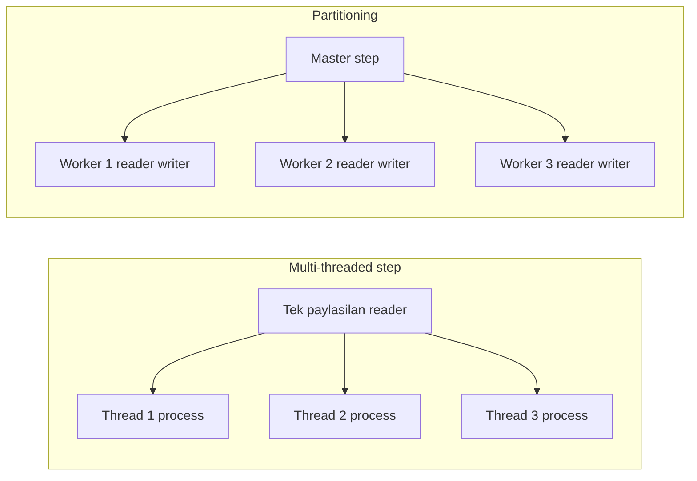
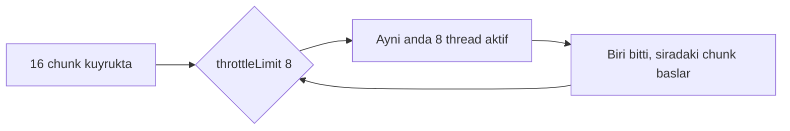
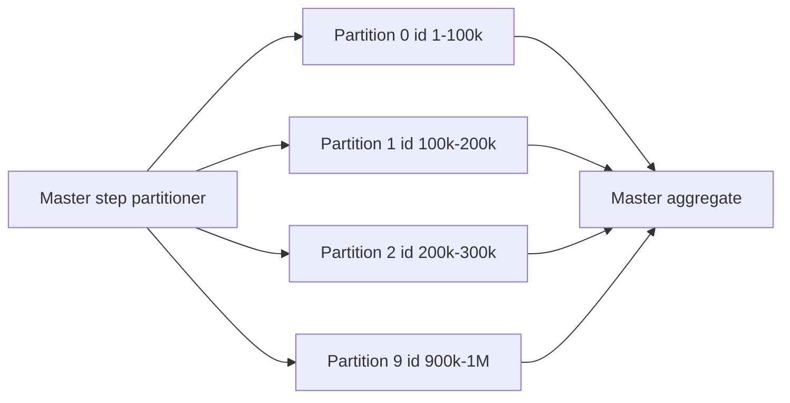
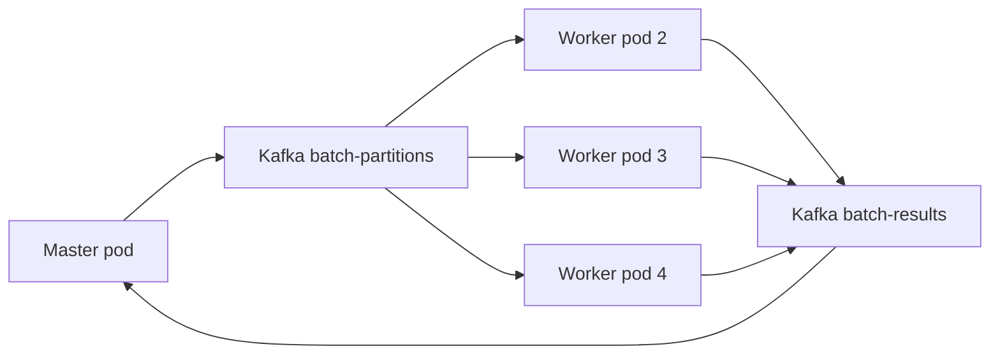

# Topic 5.5 — Partitioning & Parallel Execution

```admonish info title="Bu bölümde"
- 4 parallel strateji ve banking dataset boyutuna göre hangisini seçeceğin
- Multi-threaded step'in tek-reader bottleneck'i vs partitioning'in bağımsız worker'ları
- Local partitioning master-slave mekaniği: partitioner, `@StepScope` reader, `PartitionHandler`
- Banking partition stratejileri: ID range, customer segment, branch, date backfill
- Remote partitioning (Kafka + K8s), ShedLock cluster coordination, throughput tuning ve straggler monitoring
```

## Hedef

Spring Batch'te büyük dataset'i paralel işleme stratejilerini banking derinliğinde kavramak: multi-threaded step, parallel step, local ve remote partitioning arasındaki farkı sebep-sonuç olarak bilmek. 1M müşterilik faiz hesabını tek thread'de 10 saat yerine 10 partition ile ~1 saatte bitirebilmek; hangi stratejinin hangi dataset boyutuna uyduğunu, reader thread-safety'nin neden kritik olduğunu, `gridSize`'ı DB'ye göre nasıl seçeceğini, ShedLock ile K8s multi-pod duplicate'ini nasıl engelleyeceğini ve straggler'ı monitoring ile nasıl yakalayacağını anlatabilmek.

## Süre

Okuma: ~2 saat • Kendini Sına: 45 dk • Pratik (opsiyonel): 2-3 saat • Toplam: ~3 saat (+ pratik)

## Önbilgi

- Topic 5.1-5.4 bitti — chunk-oriented step, reader/processor/writer biliyorsun
- Phase 3 (concurrency) — thread pool, `TaskExecutor` rahat
- Postgres partition query'leri, `BETWEEN`, index kullanımı

---

## Kavramlar

### 1. Dört parallel strateji — hangisi ne zaman

10M müşterinin gün sonu faizini tek thread'de saatlerce beklemek yerine dakikalara indirmek istiyorsun; işin ilk kararı doğru **parallel strateji**yi seçmek. Spring Batch dört seçenek sunar ve seçim neredeyse tamamen dataset boyutuyla belirlenir.

| Strategy | Anlam | Banking use |
|---|---|---|
| **Single-threaded chunk** | Default, tek thread | Küçük dataset (< 10k) |
| **Multi-threaded step** | Çok thread, tek reader | Orta throughput (10k-100k) |
| **Parallel steps** | Bağımsız step'ler eşzamanlı | Birbirinden bağımsız işler |
| **Partitioning (master-slave)** | Veriyi böl, paralel worker | Büyük dataset (100k-100M+) |

Aralarındaki en temel ayrım şudur: multi-threaded step tek reader'ı birçok thread'e paylaştırır, partitioning ise her worker'a kendi reader'ını verir.



Tuzak: strateji seçimini "en hızlısı hangisi" diye yapma. Multi-threaded step 5 dakikada kurulur ama reader bottleneck'e takılır; partitioning ölçeklenir ama kurulum ve monitoring maliyeti getirir. Dataset boyutu kararı verir.

### 2. Multi-threaded step — en ucuz paralelizm

Elindeki tek step'i minimum kodla hızlandırmak istiyorsan ilk durak budur: aynı reader/processor/writer'a bir `TaskExecutor` takıp chunk'ları paralel thread'lerde çalıştırırsın.

```java
@Bean
public Step multiThreadedStep(JobRepository repo, PlatformTransactionManager tm) {
    return new StepBuilder("processTransactions", repo)
        .<Transaction, Posting>chunk(100, tm)
        .reader(reader())
        .processor(processor())
        .writer(writer())
        .taskExecutor(taskExecutor())   // ← multi-threaded
        .throttleLimit(8)
        .build();
}

@Bean
public TaskExecutor taskExecutor() {
    ThreadPoolTaskExecutor exec = new ThreadPoolTaskExecutor();
    exec.setCorePoolSize(8);
    exec.setMaxPoolSize(16);
    exec.setQueueCapacity(50);
    exec.setThreadNamePrefix("batch-worker-");
    exec.initialize();
    return exec;
}
```

`throttleLimit` aynı anda kaç chunk'ın uçuşta olacağını sınırlar; pool 16 thread'e çıkabilse bile throttle 8 ise DB'ye aynı anda en fazla 8 chunk basılır. Bu, connection pool'u koruyan gaz kelebeğidir.



Kritik kısıt reader'da saklı: chunk'lar paralel çalışırken hepsi aynı reader instance'ından `read()` çağırır. <mark>Çoğu `JpaPagingItemReader` thread-safe değildir; multi-threaded step'te sarmadan kullanırsan sessizce kayıt atlar veya çift işlersin</mark>. Kural listesi:

- Reader **thread-safe** olmalı
- Writer thread-safe olmalı (`JdbcBatchItemWriter` OK)
- Processor **stateless** olmalı

Thread-safe olmayan reader'ı `SynchronizedItemStreamReader` ile sararsın; her `read()` çağrısı senkronize edilir:

```java
SynchronizedItemStreamReader<Transaction> safeReader = new SynchronizedItemStreamReader<>();
safeReader.setDelegate(originalReader);
```

```admonish warning title="Reader senkronizasyonu bedava değil"
`SynchronizedItemStreamReader` doğruluğu garanti eder ama read'i seri hale getirir: 8 thread process/write'ı paralel yapar, okuma ise tek kuyruktan sırayla akar. Sonuç: read bottleneck olur, gerçek hızlanma çoğu zaman 8x değil ~4-6x'tir. Reader kendisi yavaşsa multi-threaded step seni kurtarmaz — o zaman partitioning düşün.
```

Banking trade-off: kolay hızlanma, ama okuma darboğaza dönüşür. 100k'nın üstündeki işlerde partitioning'e geç.

### 3. Local partitioning — böl ve fethet

Reader bottleneck'ini tamamen ortadan kaldırmanın yolu, veriyi baştan bölüp her parçaya kendi reader'ını vermektir. **Local partitioning**'de bir master step veriyi N aralığa böler, her aralık kendi worker step instance'ında paralel çalışır.



<mark>Her worker kendi reader ve writer instance'ına sahip olduğu için hiçbir senkronizasyona gerek kalmaz</mark> — multi-threaded step'in tüm thread-safety derdi burada buharlaşır.

Master step iki şeyi bağlar: bölme mantığını (`partitioner`) ve worker'ı çalıştıran handler'ı.

```java
@Bean
public Step masterStep(JobRepository repo, Step workerStep, PartitionHandler handler) {
    return new StepBuilder("masterStep", repo)
        .partitioner("worker", partitioner())
        .step(workerStep)
        .partitionHandler(handler)
        .build();
}
```

`Partitioner` işin kalbi: her partition için bir `ExecutionContext` üretir ve içine o worker'ın işleyeceği ID aralığını koyar. `gridSize` kaç partition istediğini söyler.

```java
@Bean
public Partitioner partitioner() {
    return gridSize -> {
        Map<String, ExecutionContext> partitions = new HashMap<>();
        long min = customerRepo.minId();
        long max = customerRepo.maxId();
        long range = (max - min) / gridSize;

        for (int i = 0; i < gridSize; i++) {
            ExecutionContext ctx = new ExecutionContext();
            ctx.putLong("minId", min + (range * i));
            ctx.putLong("maxId", min + (range * (i + 1)) - 1);
            ctx.putInt("partitionIndex", i);
            partitions.put("partition-" + i, ctx);
        }
        // Son partition kalanı toparlar
        partitions.get("partition-" + (gridSize - 1)).putLong("maxId", max);
        return partitions;
    };
}
```

`PartitionHandler` worker step'i hangi executor'da, kaç grid ile çalıştıracağını bilir. `TaskExecutorPartitionHandler` local (aynı JVM) çalıştırır.

```java
@Bean
public PartitionHandler partitionHandler(Step workerStep, TaskExecutor taskExecutor) {
    TaskExecutorPartitionHandler handler = new TaskExecutorPartitionHandler();
    handler.setStep(workerStep);
    handler.setGridSize(10);
    handler.setTaskExecutor(taskExecutor);
    return handler;
}
```

Worker step sıradan bir chunk step'tir; farkı reader'ının `@StepScope` olması ve aralığı `ExecutionContext`'ten alması.

```java
@Bean
public Step workerStep(JobRepository repo, PlatformTransactionManager tm) {
    return new StepBuilder("workerStep", repo)
        .<Customer, Accrual>chunk(500, tm)
        .reader(partitionReader(null, null))   // partition başına inject edilir
        .processor(processor())
        .writer(writer())
        .build();
}
```

`@StepScope` sayesinde her partition kendi reader instance'ını alır; `#{stepExecutionContext['minId']}` ile o partition'ın aralığı SpEL üzerinden enjekte edilir.

```java
@Bean
@StepScope
public JdbcCursorItemReader<Customer> partitionReader(
    @Value("#{stepExecutionContext['minId']}") Long minId,
    @Value("#{stepExecutionContext['maxId']}") Long maxId
) {
    JdbcCursorItemReader<Customer> reader = new JdbcCursorItemReader<>();
    reader.setDataSource(ds);
    reader.setSql("SELECT * FROM customer WHERE id BETWEEN ? AND ? ORDER BY id");
    reader.setPreparedStatementSetter(ps -> {
        ps.setLong(1, minId);
        ps.setLong(2, maxId);
    });
    reader.setRowMapper(new CustomerRowMapper());
    return reader;
}
```

<details>
<summary>Tam kod: local partitioning master + worker (~70 satır)</summary>

```java
@Bean
public Step masterStep(JobRepository repo, Step workerStep, PartitionHandler handler) {
    return new StepBuilder("masterStep", repo)
        .partitioner("worker", partitioner())
        .step(workerStep)
        .partitionHandler(handler)
        .build();
}

@Bean
public Partitioner partitioner() {
    return gridSize -> {
        Map<String, ExecutionContext> partitions = new HashMap<>();
        long min = customerRepo.minId();
        long max = customerRepo.maxId();
        long range = (max - min) / gridSize;

        for (int i = 0; i < gridSize; i++) {
            ExecutionContext ctx = new ExecutionContext();
            ctx.putLong("minId", min + (range * i));
            ctx.putLong("maxId", min + (range * (i + 1)) - 1);
            ctx.putInt("partitionIndex", i);
            partitions.put("partition-" + i, ctx);
        }
        partitions.get("partition-" + (gridSize - 1)).putLong("maxId", max);
        return partitions;
    };
}

@Bean
public PartitionHandler partitionHandler(Step workerStep, TaskExecutor taskExecutor) {
    TaskExecutorPartitionHandler handler = new TaskExecutorPartitionHandler();
    handler.setStep(workerStep);
    handler.setGridSize(10);
    handler.setTaskExecutor(taskExecutor);
    return handler;
}

@Bean
public Step workerStep(JobRepository repo, PlatformTransactionManager tm) {
    return new StepBuilder("workerStep", repo)
        .<Customer, Accrual>chunk(500, tm)
        .reader(partitionReader(null, null))
        .processor(processor())
        .writer(writer())
        .build();
}

@Bean
@StepScope
public JdbcCursorItemReader<Customer> partitionReader(
    @Value("#{stepExecutionContext['minId']}") Long minId,
    @Value("#{stepExecutionContext['maxId']}") Long maxId
) {
    JdbcCursorItemReader<Customer> reader = new JdbcCursorItemReader<>();
    reader.setDataSource(ds);
    reader.setSql("SELECT * FROM customer WHERE id BETWEEN ? AND ? ORDER BY id");
    reader.setPreparedStatementSetter(ps -> {
        ps.setLong(1, minId);
        ps.setLong(2, maxId);
    });
    reader.setRowMapper(new CustomerRowMapper());
    return reader;
}
```

</details>

Banking'de 1M müşteri faiz hesabında etkisi net görülür:

- Single thread: ~10 saat
- 10 partition paralel: ~1 saat
- 20 partition paralel: ~30 dakika (DB I/O tavana vurur)

### 4. Range partitioning — banking stratejileri

Veriyi nasıl böleceğin işine göre değişir; yanlış bölme dengesiz partition'a (straggler) yol açar. Dört pratik strateji var.

**Strateji 1 — ID range** (yukarıdaki örnek): basit, uniform tablolarda eşit dağılım. En çok kullanılan.

**Strateji 2 — Customer segment:** domain'e göre böl, iş doğal olarak hizalanır.

```java
partitioner = gridSize -> Map.of(
    "premium", contextFor("premium"),
    "retail", contextFor("retail"),
    "corporate", contextFor("corporate"));
```

**Strateji 3 — Geographic / Branch:** her worker bir şubenin verisini işler.

```java
partitioner = gridSize -> branches.stream()
    .collect(toMap(b -> "branch-" + b.getCode(), b -> contextFor(b)));
```

**Strateji 4 — Date range:** 30 günlük backfill'de her güne bir partition.

```java
for (int day = 0; day < 30; day++) {
    ctx.putString("processingDate", today.minusDays(day).toString());
    partitions.put("day-" + day, ctx);
}
```

Tuzak: ID range hash-dağılımı düzensizse yanılır (silinmiş kayıtlar, aralıklı ID'ler). Dağılımın belirsizse domain-aware strateji (segment/branch) daha dengeli olur.

### 5. Remote partitioning — distributed

Tek JVM'in CPU/connection kapasitesi tükendiğinde worker'ları farklı pod'lara dağıtmak istersin. **Remote partitioning**'de master partition mesajlarını bir message broker'a (Kafka, RabbitMQ) yollar, worker'lar farklı JVM/pod'larda tüketip sonucu geri gönderir.



Master tarafında handler `TaskExecutorPartitionHandler` yerine `MessageChannelPartitionHandler` olur:

```java
@Bean
public MessageChannelPartitionHandler partitionHandler(
    MessagingTemplate messagingTemplate
) {
    MessageChannelPartitionHandler handler = new MessageChannelPartitionHandler();
    handler.setMessagingOperations(messagingTemplate);
    handler.setStepName("workerStep");
    handler.setGridSize(20);   // 20 worker pod
    handler.setPollInterval(10_000);
    return handler;
}
```

Messaging için Spring Integration / Spring Cloud Stream kullanılır. Banking'de 1M+ kayıt + multi-pod K8s cluster olduğunda remote partitioning gerçek anlamda ölçeklenir; ama ağ, retry ve monitoring karmaşıklığı ekler — ihtiyaç yoksa local'de kal.

### 6. ShedLock — cluster coordination

K8s'te aynı batch job'u N pod'da deploy edersin ve scheduler her pod'da tetiklenir; hiçbir şey yapmazsan aynı EOD job'u 3 kez başlar. **ShedLock** bir DB lock'u ile "bu job'u aynı anda yalnızca bir pod çalıştırsın" garantisi verir.

```xml
<dependency>
    <groupId>net.javacrumbs.shedlock</groupId>
    <artifactId>shedlock-spring</artifactId>
</dependency>
<dependency>
    <groupId>net.javacrumbs.shedlock</groupId>
    <artifactId>shedlock-provider-jdbc-template</artifactId>
</dependency>
```

`@SchedulerLock` ile scheduled method'u lock'la; ilk pod lock'u alır, diğerleri atlar.

```java
@Component
public class BankingJobScheduler {

    @Scheduled(cron = "0 0 23 * * *")
    @SchedulerLock(name = "eodMasterJob", lockAtMostFor = "PT6H", lockAtLeastFor = "PT30M")
    public void runEodMasterJob() throws Exception {
        jobLauncher.run(eodMasterJob, BankingJobParameters.forEodOnDate(LocalDate.now()));
    }
}
```

`lockAtMostFor = 6h` → ilk pod çalışırken çökerse bile lock en fazla 6 saat tutulur, sonra serbest kalır (deadlock koruması). `lockAtLeastFor` ise saat farkı olan pod'ların hemen ardından tekrar tetiklemesini engeller.

```admonish warning title="ShedLock olmadan multi-pod = duplicate job"
K8s'te 3 replica'lı bir deployment'ta ShedLock yoksa `@Scheduled` her pod'da ayrı ayrı ateşlenir: aynı gün sonu faizi 3 kez hesaplanır, müşteriye 3 kat faiz yazılır. Bu bir para/regülasyon olayıdır. Multi-pod ortamda scheduled batch trigger'ı **her zaman** ShedLock (veya eşdeğer bir distributed lock) ile koru.
```

### 7. Banking — partitioning örnekleri

Stratejileri somut job'lara dökelim. Önce klasik: 1M müşteri faiz hesabı. Job tek bir master step'le başlar.

```java
@Bean
public Job interestAccrualJob(JobRepository repo) {
    return new JobBuilder("interestAccrualJob", repo)
        .start(masterStep())
        .build();
}

@Bean
public Step masterStep(JobRepository repo) {
    return new StepBuilder("masterStep", repo)
        .partitioner("worker", customerPartitioner())
        .step(workerStep())
        .gridSize(10)
        .taskExecutor(taskExecutor())
        .build();
}
```

Partitioner tavan bölme (`ceil`) ile son partition'daki kalanı da güvenle toparlar:

```java
@Bean
public Partitioner customerPartitioner() {
    return gridSize -> {
        long min = customerRepo.minId();
        long max = customerRepo.maxId();
        long total = max - min + 1;
        long perPartition = (total + gridSize - 1) / gridSize;

        Map<String, ExecutionContext> partitions = new HashMap<>();
        for (int i = 0; i < gridSize; i++) {
            ExecutionContext ctx = new ExecutionContext();
            ctx.putLong("minId", min + (i * perPartition));
            ctx.putLong("maxId", Math.min(min + ((i + 1) * perPartition) - 1, max));
            partitions.put("partition-" + i, ctx);
        }
        return partitions;
    };
}
```

**Örnek 2 — Multi-branch reconciliation:** her worker bir şubenin günlük hareketlerini mutabakatlar; partition adedi aktif şube sayısıyla belirlenir.

```java
@Bean
public Partitioner branchPartitioner(BranchRepository branchRepo) {
    return gridSize -> {
        List<String> branches = branchRepo.findAllActiveBranchCodes();
        Map<String, ExecutionContext> partitions = new HashMap<>();
        for (String branchCode : branches) {
            ExecutionContext ctx = new ExecutionContext();
            ctx.putString("branchCode", branchCode);
            partitions.put("branch-" + branchCode, ctx);
        }
        return partitions;
    };
}
```

**Örnek 3 — 30 günlük backfill:** güne bir partition; 30 gün paralel işlenir.

```java
@Bean
public Partitioner backfillPartitioner() {
    return gridSize -> {
        LocalDate start = LocalDate.now().minusDays(30);
        Map<String, ExecutionContext> partitions = new HashMap<>();
        for (int i = 0; i < 30; i++) {
            ExecutionContext ctx = new ExecutionContext();
            ctx.putString("date", start.plusDays(i).toString());
            partitions.put("day-" + i, ctx);
        }
        return partitions;
    };
}
```

### 8. Throughput tuning

Paralelizmi artırmak lineer hızlanma vermez; bir yerde donanım tavana vurur. Tipik banking rakamları:

```
Single-threaded:
  100 records/sec
  → 1M records = 10000 sec = 2.78 saat

Multi-threaded step (8 thread):
  600 records/sec (synchronized reader = bottleneck)
  → 1M = 1667 sec = 28 dk

10-partition local:
  900 records/sec
  → 1M = 1111 sec = 18 dk

20-partition remote (10 pod):
  4000 records/sec
  → 1M = 250 sec = 4 dk
```

Bir noktadan sonra darboğaz kod değil altyapıdır:

- DB connection pool (HikariCP size)
- DB IOPS (storage)
- Ağ (worker ↔ DB)
- CPU (processor-bound iş)

<mark>`gridSize`'ı DB connection pool boyutuna göre seç; banking'de gerçekçi aralık 5-50'dir</mark>. `gridSize = 1000` demek 1000 eşzamanlı connection isteği demektir — pool tükenir, işler kuyrukta bekler, hızlanma yerine yavaşlama alırsın.

### 9. Partitioning monitoring

Paralel çalışan 10 worker'dan biri diğerlerinin 5 katı sürerse (straggler), işi o yavaş partition belirler. Bunu görmek için partition başına süre ve throughput metriklemelisin.

```java
@Bean
public StepExecutionListener partitionListener() {
    return new StepExecutionListener() {
        @Override
        public ExitStatus afterStep(StepExecution exec) {
            log.info("Partition {} finished: {} records in {}",
                exec.getStepName(), exec.getWriteCount(),
                Duration.between(exec.getStartTime(), exec.getEndTime()));

            meterRegistry.timer("banking.batch.partition.duration",
                "step", exec.getStepName())
                .record(Duration.between(exec.getStartTime(), exec.getEndTime()));

            return exec.getExitStatus();
        }
    };
}
```

Grafana dashboard'da izlemen gerekenler: partition başına süre, partition başına throughput, skip/retry sayıları.

```admonish tip title="Straggler'ı erken yakala"
Bir partition sürekli diğerlerinin çok üstünde sürüyorsa bölme stratejin dengesizdir: muhtemelen ID range hash dağılımına denk gelmiyor ya da bir segment (ör. corporate) ötekilerden çok daha ağır. Çözüm partition sayısını körlemesine artırmak değil, bölme kriterini veri dağılımına oturtmaktır (domain-aware partition, veya ağır segmenti daha ince böl).
```

### 10. Banking — partitioning anti-pattern'leri

Mülakatta "bu partitioning setup'ında ne yanlış?" sorusunun cephaneliği. On klasik:

**1 — Unbalanced partitions:** bir partition 5 kayıt, diğeri 1M → straggler. Domain-aware böl.

```java
// Partition 1: 100k records
// Partition 2: 5 records
// Partition 3: 1M records   ← straggler
```

**2 — Non-thread-safe reader without sync:** multi-threaded step'te thread-safe olmayan reader.

```java
.taskExecutor(taskExecutor)
.reader(jpaPagingItemReader())   // thread-safe DEĞİL!
```

`SynchronizedItemStreamReader` ile sar veya partitioning'e geç.

**3 — Shared mutable state in processor:** paylaşılan sayaç = race condition.

```java
public class StatefulProcessor implements ItemProcessor<...> {
    private int counter = 0;   // ❌ race condition
}
```

Processor stateless olmalı.

**4 — Partition writer contention:** 10 partition aynı tabloda aynı satıra yazıyorsa lock kavgası olur. Primary key aralığını partition aralığıyla hizala.

**5 — gridSize too high:** `gridSize = 1000` → connection pool tükenir. Banking gerçekçi: 5-50.

**6 — Master step heavy work:** master yalnızca böler ve dispatch eder; ağır iş worker'da olmalı.

**7 — No ShedLock:** K8s multi-pod scheduler → duplicate job trigger.

**8 — Worker timeout misconfig:** yavaş partition → master timeout → sahte failure. `pollInterval` + `timeout` ayarla.

**9 — No retry on remote:** ağ kesintisi → partition fail. Remote partition mesajlarına retry policy koy.

**10 — Distributed without monitoring:** partition takıldı ama görünürlük yok. Her worker step'e metric + heartbeat.

---

## Önemli olabilecek araştırma kaynakları

- Spring Batch reference — partitioning bölümü
- "Pro Spring Batch" — Michael Minella
- Spring Cloud Task / Stream — remote partitioning
- ShedLock GitHub (net.javacrumbs.shedlock)

---

## Kendini Sına

Aşağıdaki soruları önce **cevaba bakmadan** kendi cümlelerinle yanıtlamayı dene — hepsi TR bank mülakatlarında partitioning konusunda karşına çıkabilecek tarzda. Takıldığında ilgili Kavramlar başlığına dön, sonra tekrar dene.

**S1. Multi-threaded step ile partitioning arasındaki fark nedir? Hangi dataset boyutunda hangisini seçersin?**

<details>
<summary>Cevabı göster</summary>

Multi-threaded step tek reader/processor/writer'ı bir `TaskExecutor` ile birçok thread'e paylaştırır: chunk'lar paralel işlenir ama okuma tek reader instance'ından yapılır — bu reader bottleneck'e dönüşür ve gerçek hızlanma ~4-6x'te takılır. Partitioning ise master step veriyi N aralığa böler ve her worker kendi reader/writer instance'ıyla çalışır; senkronizasyon yok, ölçeklenme çok daha iyi.

Seçim boyuta göre: 10k-100k arası orta işler için multi-threaded step (5 dakikada kurulur, yeterli). 100k-100M+ için partitioning (kurulum ve monitoring maliyeti var ama tek yol). Küçük (< 10k) işlerde ise paralelizme hiç girme, single-threaded chunk yeter.

</details>

**S2. Multi-threaded step'te reader thread-safe olmalı deniyor. Neden, ve `JpaPagingItemReader` gibi thread-safe olmayan bir reader'ı nasıl kullanırsın?**

<details>
<summary>Cevabı göster</summary>

Multi-threaded step'te tüm thread'ler aynı reader instance'ından `read()` çağırır. Reader iç durum tutuyorsa (page cursor, okunan pozisyon) ve bu durum senkronize değilse, iki thread aynı anda okuyunca durum bozulur: kayıt atlanır veya çift işlenir — banking'de çift faiz veya kayıp posting demek. `JpaPagingItemReader` tam olarak böyle durum tutar ve thread-safe değildir.

Çözüm reader'ı `SynchronizedItemStreamReader` ile sarmak: her `read()` çağrısı senkronize edilir, doğruluk garanti olur. Bedeli okumanın seri hale gelmesidir (bottleneck). Reader'ın kendisi yavaşsa bu yaklaşım yeterli hızlanma vermez; o durumda partitioning'e geç, çünkü orada her worker kendi reader'ına sahiptir ve senkronizasyona hiç gerek yoktur.

</details>

**S3. Partitioning ile 10 partition'ı paralel işledin. İşlenen kayıtların global sırası (ordering) korunur mu? Bunun banking'de sonucu ne?**

<details>
<summary>Cevabı göster</summary>

Hayır, korunmaz. Partition'lar paralel ve bağımsız çalışır; hangi partition'ın önce biteceği, hangi kaydın önce yazılacağı belirsizdir. Tek bir partition içinde `ORDER BY` ile sıra tutabilirsin ama partition'lar arası global bir sıralama garantisi yoktur — partition 3 partition 1'den önce bitebilir.

Banking'de sonucu: global ordering'e bağımlı işler partitioning'e uygun değildir. Örneğin bir hesabın hareketlerini kronolojik sırayla işlemen gerekiyorsa (running balance hesabı gibi), o hesabın tüm hareketleri aynı partition'a düşmeli — yani ID/tarih değil, hesaba göre partition'la. Genel kural: partitioning kayıt-bağımsız (idempotent, sırasız) işler için idealdir; sıraya bağımlı iş varsa ya bölme kriterini ona göre seç ya da partitioning kullanma.

</details>

**S4. Local partitioning ile remote partitioning arasındaki fark nedir? Hangi durumda remote'a geçersin?**

<details>
<summary>Cevabı göster</summary>

Local partitioning'de tüm worker'lar aynı JVM içinde, bir `TaskExecutor` üzerinde thread olarak çalışır (`TaskExecutorPartitionHandler`). Remote partitioning'de master partition mesajlarını bir message broker'a (Kafka/RabbitMQ) yollar, worker'lar farklı JVM/pod'larda tüketip sonucu geri gönderir (`MessageChannelPartitionHandler`).

Remote'a geçme sebebi tek JVM'in kapasitesinin tükenmesidir: CPU çekirdekleri, connection pool veya memory tek pod'da yetmiyorsa iş yükünü birden fazla pod'a yaymak gerekir. Ama remote ağ gecikmesi, mesaj retry, reply timeout ve dağıtık monitoring karmaşıklığı ekler. Kural: 1M kaydı tek pod local partitioning ile makul sürede bitirebiliyorsan remote'a girme; gerçekten multi-pod throughput'a ihtiyacın olduğunda geç.

</details>

**S5. `gridSize`'ı nasıl seçersin? `gridSize = 1000` vermek neden kötü fikir?**

<details>
<summary>Cevabı göster</summary>

`gridSize` partition (dolayısıyla eşzamanlı worker) sayısını belirler ve her worker en az bir DB connection tutar. Bu yüzden `gridSize`'ı DB connection pool boyutu ve DB'nin IOPS/CPU kapasitesine göre seçersin; banking'de gerçekçi aralık 5-50'dir.

`gridSize = 1000` connection pool'u (ör. HikariCP 20-50) anında tüketir: worker'ların çoğu connection beklerken kuyrukta kalır, paralellik sahte olur ve context-switch/lock overhead yüzünden tek thread'den bile yavaşlayabilirsin. Ayrıca çok küçük partition'lar (her biri birkaç yüz kayıt) master orchestration overhead'ini kayıt başına maliyette baskın hale getirir. Doğru yaklaşım: partition sayısını donanım tavanına (connection pool, IOPS) göre kalibre et, körlemesine artırma.

</details>

**S6. K8s'te 3 replica'lı bir batch deployment'ında `@Scheduled` job'un aynı gün sonu işini 3 kez çalıştırıyor. Neden ve nasıl çözersin?**

<details>
<summary>Cevabı göster</summary>

`@Scheduled` her pod'un kendi Spring context'inde bağımsız ateşlenir; koordinasyon yoksa 3 pod da cron zamanı gelince aynı job'u başlatır. Sonuç aynı EOD faizinin 3 kez hesaplanması, müşteriye 3 kat yazılması gibi bir para/regülasyon olayıdır.

Çözüm distributed lock: ShedLock ile scheduled method'a `@SchedulerLock(name = "eodMasterJob", lockAtMostFor = "PT6H", lockAtLeastFor = "PT30M")` koyarsın. İlk pod DB'de lock satırını alır ve job'u çalıştırır; diğer pod'lar lock'u alamayınca çalıştırmayı atlar. `lockAtMostFor` çalışan pod çökerse lock'un sonsuza kadar takılı kalmasını engeller (deadlock koruması), `lockAtLeastFor` ise saat kayması olan pod'ların hemen ardından tekrar tetiklemesini önler.

</details>

**S7. Partitioning worker reader'ı neden `@StepScope` olmalı ve partition aralığını (minId/maxId) nasıl alır?**

<details>
<summary>Cevabı göster</summary>

`@StepScope` reader bean'inin her step execution için ayrı instance oluşturulmasını sağlar. Partitioning'de her partition ayrı bir step execution'dır; `@StepScope` olmadan tek bir singleton reader paylaşılır ve partition aralıkları birbirine karışır. `@StepScope` ile her partition kendi reader instance'ını alır — bu aynı zamanda partitioning'in senkronizasyon gerektirmemesinin de sebebidir.

Aralığı `Partitioner` üretir: her partition için bir `ExecutionContext`'e `minId`/`maxId` koyar. Worker reader bunları SpEL ile enjekte eder: `@Value("#{stepExecutionContext['minId']}") Long minId`. Reader'ın SQL'i `WHERE id BETWEEN ? AND ?` ile bu aralığı kullanır. Böylece partition 0 id 1-100k'yı, partition 1 100k-200k'yı okur — üst üste binme olmadan.

</details>

---

## Tamamlama kriterleri

- [ ] "Kendini Sına" bölümündeki tüm soruları cevaba bakmadan açıklayabiliyorum
- [ ] 4 parallel stratejiyi ve hangi dataset boyutunda hangisini seçeceğimi söyleyebiliyorum
- [ ] Multi-threaded step'te reader thread-safety'nin neden kritik olduğunu ve `SynchronizedItemStreamReader` çözümünü anlatabiliyorum
- [ ] Local partitioning master-slave akışını (partitioner + `PartitionHandler` + `@StepScope` reader) tahtada çizebilirim
- [ ] 4 banking partition stratejisini (ID range / segment / branch / date) örnekle sayabiliyorum
- [ ] Partitioning'in global ordering garantisini kaybettirdiğini ve sonucunu açıklayabiliyorum
- [ ] Local vs remote partitioning farkını ve ne zaman remote'a geçeceğimi biliyorum
- [ ] `gridSize`'ı neye göre seçtiğimi ve `gridSize = 1000`'in neden kötü olduğunu anlatabiliyorum
- [ ] ShedLock'un K8s multi-pod duplicate job'u nasıl engellediğini açıklayabiliyorum
- [ ] Straggler'ı per-partition metric ile nasıl yakalayıp bölme stratejisini nasıl düzelttiğimi biliyorum

---

## Defter notları

1. "4 parallel strateji (single / multi-threaded / parallel steps / partitioning) banking dataset boyutuna göre seçim: ____."
2. "Multi-threaded step tek reader = bottleneck; thread-safety için ____ (reader/writer/processor kuralı)."
3. "`SynchronizedItemStreamReader` ne zaman ve neden kullanılır: ____."
4. "Local partitioning master-slave: partitioner + `PartitionHandler` + `@StepScope` reader + `ExecutionContext` per partition: ____."
5. "Partition stratejileri (ID range / customer segment / branch / date) hangi durumda hangisi: ____."
6. "Partitioning global ordering'i garanti ETMEZ — sonucu ve çözümü: ____."
7. "Local vs remote partitioning farkı ve remote'a geçme kriteri: ____."
8. "`gridSize` seçimi connection pool + IOPS'a göre; `gridSize = 1000` neden kötü: ____."
9. "ShedLock `@SchedulerLock` K8s multi-pod duplicate-prevention, `lockAtMostFor` / `lockAtLeastFor`: ____."
10. "Straggler detection per-partition metric + repartition stratejisi; anti-pattern (unbalanced + non-thread-safe reader + shared state + no ShedLock): ____."

```admonish success title="Bölüm Özeti"
- 4 parallel strateji dataset boyutuyla seçilir: single (< 10k), multi-threaded step (10k-100k), partitioning (100k-100M+); "en hızlısı" değil "boyuta uygunu" doğru sorudur
- Multi-threaded step tek reader'ı paylaştırır — reader thread-safe olmalı (`SynchronizedItemStreamReader`), yoksa kayıt atlar/çift işler ve okuma bottleneck olur
- Local partitioning'de her worker kendi reader/writer'ına sahiptir: senkronizasyon yok, `@StepScope` reader + `ExecutionContext` ile partition aralığı SpEL üzerinden enjekte edilir
- Partitioning global ordering'i garanti etmez; sıraya bağımlı işlerde bölme kriterini (ör. hesaba göre) buna göre seç ya da partitioning kullanma
- `gridSize`'ı connection pool + IOPS'a göre 5-50 aralığında tut; `gridSize = 1000` pool'u tüketir ve paralelliği sahte yapar
- K8s multi-pod'da scheduled batch'i ShedLock ile koru (duplicate job = para/regülasyon olayı); straggler'ı per-partition metric ile yakala ve bölmeyi düzelt
```

---

## Pratik yapmak istersen

Kavramları koda dökmek istersen aşağıdaki iki ek hazır: test yazma rehberi partition sayımı, serial vs paralel süre ve ShedLock single-execution için örnek testler içerir; Claude-verify prompt'u ile yazdığın partitioning + parallel setup'ını banking-grade perspektiften denetletebilirsin. Bir oturuşta ~2-3 saat sürer; tamamlandığını şu kriterlerle anlarsın: multi-threaded step + `SynchronizedItemStreamReader` çalışıyor, local partitioning ID range 10 worker'ı doğru bölüyor, domain (branch/segment) ve date backfill partition'ları var, ShedLock 2 instance'ta tek execution'ı kanıtlıyor, `gridSize` sweep ile bottleneck (DB/CPU/I/O) tespit edildi ve straggler per-partition metric ile görünüyor.

<details>
<summary>Test yazma rehberi</summary>

### Test 5.5.1 — Partition işi eşit böler

```java
@SpringBatchTest
class PartitioningTest {

    @Test
    void partitionedJobSplitsWorkEvenly() {
        seedCustomers(10_000);

        JobExecution exec = launcher.launchJob();

        assertThat(exec.getStatus()).isEqualTo(BatchStatus.COMPLETED);

        // 10 partition = 10 worker step execution
        List<StepExecution> workerExecs = exec.getStepExecutions().stream()
            .filter(s -> s.getStepName().startsWith("worker:"))
            .toList();
        assertThat(workerExecs).hasSize(10);

        // Read count toplamı = total
        long totalRead = workerExecs.stream().mapToLong(StepExecution::getReadCount).sum();
        assertThat(totalRead).isEqualTo(10_000);
    }
}
```

### Test 5.5.2 — Paralel serial'den hızlı

```java
@Test
void parallelFasterThanSerial() {
    seedCustomers(50_000);

    long serialStart = System.currentTimeMillis();
    launcher.launchJob(BatchStatus.serialJob);
    long serialTime = System.currentTimeMillis() - serialStart;

    long parallelStart = System.currentTimeMillis();
    launcher.launchJob(BatchStatus.partitionedJob);
    long parallelTime = System.currentTimeMillis() - parallelStart;

    assertThat(parallelTime).isLessThan(serialTime / 2);
}
```

### Test 5.5.3 — ShedLock duplicate'i engeller

```java
@Test
void shedLockPreventsDuplicateExecution() throws Exception {
    AtomicInteger actualRuns = new AtomicInteger();

    ExecutorService pool = Executors.newFixedThreadPool(2);
    pool.submit(() -> {
        scheduler.runEodMasterJob();
        actualRuns.incrementAndGet();
    });
    pool.submit(() -> {
        scheduler.runEodMasterJob();   // atlanmalı
        actualRuns.incrementAndGet();
    });
    pool.shutdown();
    pool.awaitTermination(60, TimeUnit.SECONDS);

    assertThat(actualRuns.get()).isEqualTo(1);
}
```

### Bonus — throughput sweep

`gridSize`'ı 1, 2, 4, 8, 16 ile çalıştır, her koşunun süresini ölç ve bir noktadan sonra hızlanmanın durduğu (hatta düştüğü) grid değerini bul. Orası donanım tavanındır (connection pool / IOPS / CPU). Hangi kaynağın doyduğunu HikariCP active-connection ve DB CPU metrikleriyle doğrula.

### Bonus — straggler reprodüksiyonu

Bir partition'a kasten çarpık (skewed) veri koy (ör. bir ID aralığına 10x kayıt), `partitionListener` metriklerini aç ve Grafana'da (veya log'da) bir partition'ın diğerlerinden belirgin uzun sürdüğünü gözlemle. Sonra bölme kriterini domain-aware yapıp straggler'ın kaybolduğunu doğrula.

</details>

<details>
<summary>Claude-verify prompt</summary>

```
Partitioning + parallel setup'ımı banking-grade kriterlere göre değerlendir.
Eksikleri işaretle, kod yazma:

1. Strateji seçimi:
   - Dataset boyutu + partitioning gerekçesi net mi?
   - Multi-threaded step vs partitioning trade-off'u doğru mu?
   - Local vs remote kararı gerekçeli mi?

2. Local partitioning:
   - Partitioner her partition için ExecutionContext üretiyor mu?
   - @StepScope reader + SpEL parametre injection var mı?
   - PartitionHandler gridSize gerçekçi mi (5-50)?

3. Partition stratejileri:
   - ID range / customer segment / branch / date backfill uygun seçilmiş mi?
   - Bölme veri dağılımına oturuyor mu (unbalanced riski)?

4. Reader thread safety:
   - Multi-threaded step'te reader thread-safe mi?
   - Değilse SynchronizedItemStreamReader ile sarılmış mı?
   - Partition'da her worker kendi reader instance'ını alıyor mu?

5. Ordering:
   - Global ordering'e bağımlı iş var mı? Varsa bölme kriteri buna uygun mu?

6. Cluster coordination:
   - ShedLock @SchedulerLock var mı?
   - lockAtMostFor / lockAtLeastFor makul mu?
   - K8s multi-pod duplicate senaryosu test edilmiş mi?

7. Throughput:
   - Per-partition metric var mı?
   - Bottleneck tespit edilmiş mi (DB pool / IOPS / CPU / network)?
   - Connection pool gridSize'a yetiyor mu?

8. Monitoring:
   - Per-partition duration + throughput metriği var mı?
   - Straggler detection mekanizması var mı?

9. Remote (varsa):
   - MessageChannelPartitionHandler + Spring Cloud Stream/Kafka doğru mu?
   - Reply/poll timeout ve retry policy konfigüre mi?

10. Anti-pattern:
    - Unbalanced partition YOK mu?
    - Non-thread-safe reader without sync YOK mu?
    - Processor'da shared mutable state YOK mu?
    - gridSize 1000+ YOK mu?
    - Master'da heavy work YOK mu?
    - Multi-pod'da ShedLock eksikliği YOK mu?

Her madde için PASS / FAIL / EKSIK işaretle, kanıt göster, kod yazma.
```

</details>
