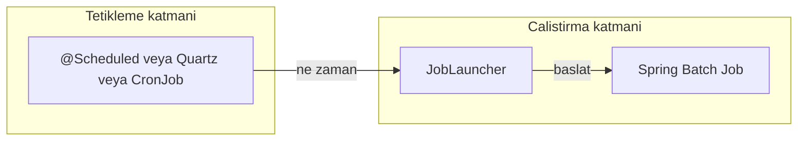
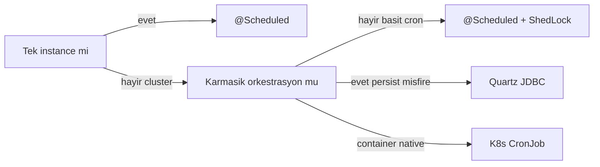
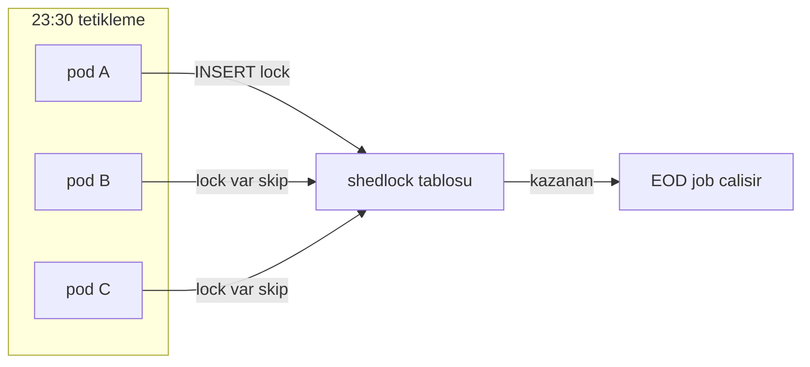

# Topic 5.6 — Scheduling: @Scheduled, Quartz, ShedLock, K8s CronJob

```admonish info title="Bu bölümde"
- Scheduling seçenek matrisi: `@Scheduled`, ShedLock, Quartz, K8s CronJob — hangisi hangi banking senaryosunda
- Cluster'da duplicate execution problemi ve ShedLock ile "3 instance tetikler, job 1 kez çalışır" garantisi
- Cron ifadesinin anatomisi ve banking için hayati time zone (`Europe/Istanbul`) meselesi
- Quartz misfire handling, TR holiday calendar entegrasyonu ve morning recovery scheduler
- Scheduling observability + 10 klasik anti-pattern (no ShedLock, no zone, hardcoded holiday)
```

## Hedef

Banking EOD job tetikleme stratejilerini banking-grade derinlikte kavramak: Spring `@Scheduled` (basit), ShedLock (multi-instance tek run), Quartz Scheduler (cluster-aware, persistent), K8s CronJob (cloud-native). Bunlara ek olarak time zone handling, banking holiday calendar entegrasyonu, misfire ve failure recovery, ve scheduling observability'yi hatasız anlatabilmek.

## Süre

Okuma: 1.5 saat • Kendini Sına: 45 dk • Pratik (opsiyonel): 2.5-3 saat • Toplam: ~2.5 saat (+ pratik)

## Önbilgi

- Topic 5.1-5.5 bitti — `JobLauncher`, `Job`, restart/recovery biliyorsun
- Cron syntax'ına aşinasın
- TR business calendar (Topic 10.4) — `isBusinessDay`, holiday listesi

---

## Kavramlar

### 1. Scheduling — iki ayrı katman

Scheduling'i çözmeden önce en sık karıştırılan noktayı ayıralım: **tetikleme** (ne zaman) ile **çalıştırma** (ne) iki farklı katmandır. `@Scheduled`, Quartz veya K8s CronJob sadece "23:30 oldu, başlat" der; işi asıl yapan `JobLauncher` üzerinden koşan Spring Batch `Job`'dur.



Bu ayrım önemli çünkü aracı seçerken sorduğun soru "hangi tetikleme mekanizması cluster'da güvenli?" olur — çalıştırma tarafı (Batch restart, listener) çoğu zaman aynı kalır.

Seçim matrisi banking bağlamında şöyle:

| Option | Cluster-aware | Persistence | Banking use |
|---|---|---|---|
| `@Scheduled` | ❌ no | ❌ in-memory | Single instance only |
| `@Scheduled` + ShedLock | ✓ via DB lock | ❌ | Multi-instance Spring Boot |
| Quartz | ✓ cluster | ✓ JDBC store | Complex schedules, persistent |
| K8s CronJob | ✓ K8s | ✓ K8s API | Container-native |
| Airflow / Dagster | ✓ | ✓ | Complex DAG, banking ETL |

Karar akışı sadeleştirilmiş haliyle:



### 2. Spring `@Scheduled` — en basit yol

En düşük giriş bariyerli seçenek: `@EnableScheduling` aç, method'a `@Scheduled` koy. Önce scheduler'ın thread pool'unu ayarlayan config — default tek thread olduğu için banking'de kendi pool'unu tanımlaman iyi olur:

```java
@Configuration
@EnableScheduling
public class BatchSchedulingConfig {

    @Bean
    public TaskScheduler taskScheduler() {
        ThreadPoolTaskScheduler scheduler = new ThreadPoolTaskScheduler();
        scheduler.setPoolSize(5);
        scheduler.setThreadNamePrefix("banking-scheduler-");
        scheduler.initialize();
        return scheduler;
    }
}
```

Sonra tetikleyici component. Kritik nokta: scheduler'ın kendisi iş yapmaz, sadece business-day kontrolü yapıp `JobLauncher`'ı çağırır:

```java
@Component
public class BankingScheduler {

    private final JobLauncher jobLauncher;
    private final Job eodMasterJob;
    private final TrBusinessCalendar calendar;

    @Scheduled(cron = "0 30 23 * * *", zone = "Europe/Istanbul")
    public void runEodMasterJob() throws Exception {
        LocalDate today = LocalDate.now(ZoneId.of("Europe/Istanbul"));

        if (!calendar.isBusinessDay(today)) {
            log.info("Today {} is not a business day; skipping EOD", today);
            return;
        }
        JobParameters params = BankingJobParameters.forEodOnDate(today);
        JobExecution exec = jobLauncher.run(eodMasterJob, params);
        log.info("EOD master job {}: {}", exec.getId(), exec.getStatus());
    }
}
```

Aynı component'e recovery scheduler, sanctions refresh ve monthly close gibi diğer cron'ları da eklersin; tam listing katlanmış duruyor:

<details>
<summary>Tam kod: BankingScheduler tüm cron method'ları (~40 satır)</summary>

```java
@Component
public class BankingScheduler {

    private final JobLauncher jobLauncher;
    private final Job eodMasterJob;
    private final TrBusinessCalendar calendar;

    @Scheduled(cron = "0 30 23 * * *", zone = "Europe/Istanbul")
    public void runEodMasterJob() throws Exception {
        LocalDate today = LocalDate.now(ZoneId.of("Europe/Istanbul"));

        if (!calendar.isBusinessDay(today)) {
            log.info("Today {} is not a business day; skipping EOD", today);
            return;
        }

        JobParameters params = BankingJobParameters.forEodOnDate(today);
        JobExecution exec = jobLauncher.run(eodMasterJob, params);

        log.info("EOD master job {}: {}", exec.getId(), exec.getStatus());
    }

    @Scheduled(cron = "0 0 5 * * MON-FRI", zone = "Europe/Istanbul")
    public void checkFailedJobs() {
        // Recovery scheduler (Topic 5.3)
        scheduler.resumeStalledJobs();
    }

    @Scheduled(cron = "0 0 6 * * *", zone = "Europe/Istanbul")
    public void refreshSanctionsLists() {
        sanctionsService.downloadAndRefresh();
    }

    @Scheduled(cron = "0 0 7 1 * *", zone = "Europe/Istanbul")   // 1. of month, 07:00
    public void monthlyClose() throws Exception {
        jobLauncher.run(monthlyCloseJob, BankingJobParameters.forMonthEnd(LocalDate.now()));
    }
}
```

</details>

Spring cron formatı altı alandır: `second minute hour day month day-of-week`. Alanları görselleştir:


Sık kullanılan ifadeler:

- `0 30 23 * * *` — her gün 23:30
- `0 0 5 * * MON-FRI` — hafta içi 05:00
- `0 0 7 1 * *` — her ayın 1'i 07:00
- `0 */15 * * * *` — 15 dakikada bir
- `0 0 22 ? * SAT` — sadece cumartesi 22:00

Şimdi banking'in en kritik detayı: **time zone**. Cron'a `zone` vermezsen sunucunun JVM default'una (genelde UTC) göre çalışır:

```java
@Scheduled(cron = "0 30 23 * * *", zone = "Europe/Istanbul")
```

<mark>zone belirtmezsen `0 30 23` ifadesi UTC 23:30 = TR 02:30'da tetiklenir ve EOD yanlış güne kayar.</mark> TR yıl boyunca UTC+3 (DST yok) ama yine de zone'u her zaman explicit yaz — sunucu taşındığında kod aynı davransın.

```admonish warning title="Time zone tuzağı"
Banking'de EOD job'un gün sınırını (day boundary) belirler: 23:30 TR ile 23:30 UTC farklı takvim günlerine düşer. Zone eksikse job doğru saatte çalışsa bile "hangi güne ait EOD" hesabı bozulur, muhasebe yanlış tarihe yazar. Kural: her cron'da `zone = "Europe/Istanbul"`.
```

### 3. ShedLock — multi-instance güvenliği

`@Scheduled`'ın tek başına Achilles topuğu: production'da servisi tek pod çalıştırmazsın. 3 replica varsa 3 pod da 23:30'da tetiklenir ve **ShedLock** yoksa EOD üç kez koşar — üç kat side effect (üç mükerrer faiz tahakkuku, üç bildirim).



<mark>ShedLock olmadan cluster'da 3 pod aynı `@Scheduled` method'u tetikler ve job 1 kez değil 3 kez çalışır — duplicate execution.</mark> ShedLock bunu bir DB lock ile çözer: pod'lar aynı satıra yazmaya çalışır, ilki kazanır, diğerleri "already locked" görüp atlar.

Önce iki bağımlılık ve lock tablosu:

```xml
<dependency>
    <groupId>net.javacrumbs.shedlock</groupId>
    <artifactId>shedlock-spring</artifactId>
    <version>5.10.2</version>
</dependency>
<dependency>
    <groupId>net.javacrumbs.shedlock</groupId>
    <artifactId>shedlock-provider-jdbc-template</artifactId>
    <version>5.10.2</version>
</dependency>
```

```sql
CREATE TABLE shedlock(
    name VARCHAR(64) NOT NULL,
    lock_until TIMESTAMP NOT NULL,
    locked_at TIMESTAMP NOT NULL,
    locked_by VARCHAR(255) NOT NULL,
    PRIMARY KEY (name)
);
```

Lock provider'ı DB time ile kur — clock skew'a karşı app time yerine DB saati kullanmak kritik:

```java
@Configuration
@EnableSchedulerLock(defaultLockAtMostFor = "PT6H")
public class ShedLockConfig {

    @Bean
    public LockProvider lockProvider(DataSource dataSource) {
        return new JdbcTemplateLockProvider(
            JdbcTemplateLockProvider.Configuration.builder()
                .withJdbcTemplate(new JdbcTemplate(dataSource))
                .withTableName("shedlock")
                .usingDbTime()   // Use DB time (not app time)
                .build());
    }
}
```

Method'a `@SchedulerLock` ekle; `lockAtMostFor` ve `lockAtLeastFor` ikilisi işin sigortası:

```java
@Component
public class BankingScheduler {

    @Scheduled(cron = "0 30 23 * * *", zone = "Europe/Istanbul")
    @SchedulerLock(name = "eodMasterJob",
                   lockAtMostFor = "PT6H",       // Max lock 6 hours
                   lockAtLeastFor = "PT1H")      // Min lock 1 hour
    public void runEodMasterJob() throws Exception {
        // ... only one instance executes
    }
}
```

Davranışı adım adım: 3 pod 23:30'da tetiklenir, hepsi DB lock almaya çalışır, ilki kazanır ve çalışır, diğerleri "already locked" görüp skip eder. İki parametrenin rolü farklıdır:

- `lockAtMostFor` → **safety net**: lock sahibi pod crash olursa lock bu süre sonunda otomatik expire olur (yoksa iş sonsuza kadar kilitli kalır).
- `lockAtLeastFor` → **clock skew savunması**: iş çok hızlı biterse bile lock en az bu süre tutulur, saati kaymış başka pod'un aynı işi tekrar tetiklemesini engeller.

```admonish warning title="lockAtMostFor'u kısa tutma"
`lockAtMostFor` her zaman job'un en uzun koşma süresinden büyük olmalı. EOD 6 saat sürüyorsa ve `lockAtMostFor = "PT5M"` verdiysen, lock 5 dakikada expire olur — job hâlâ koşarken ikinci pod aynı işe başlar. Banking'de realist değer job süresinin üstünde (örn. 6 saatlik EOD için `PT6H`+).
```

```admonish tip title="Banking pratiği"
Spring Boot uygulamanı K8s'te multi-replica çalıştırıyorsan (production'da neredeyse her zaman) ShedLock şarttır. Basit cron ihtiyaçları için `@Scheduled` + ShedLock, Quartz'ın karmaşıklığına gerek kalmadan cluster-safe scheduling verir.
```

### 4. Quartz Scheduler — karmaşık ihtiyaçlar

ShedLock lock verir ama trigger'ı persist etmez, misfire yönetmez, "geçmişi yakala" diyemez. Bunlara ihtiyaç varsa **Quartz** devreye girer — JDBC job store ile trigger'lar DB'de yaşar ve restart'tan sağ çıkar.

```xml
<dependency>
    <groupId>org.springframework.boot</groupId>
    <artifactId>spring-boot-starter-quartz</artifactId>
</dependency>
```

Cluster mode için `isClustered: true` ve JDBC store zorunlu — Quartz node'ları DB üzerinden koordine olur:

```yaml
spring:
  quartz:
    job-store-type: jdbc
    properties:
      org:
        quartz:
          scheduler:
            instanceName: BankingScheduler
            instanceId: AUTO
          jobStore:
            class: org.quartz.impl.jdbcjobstore.JobStoreTX
            driverDelegateClass: org.quartz.impl.jdbcjobstore.PostgreSQLDelegate
            tablePrefix: QRTZ_
            isClustered: true
            clusterCheckinInterval: 10000
          threadPool:
            threadCount: 10
```

Java tarafında JobDetail + Trigger bean'leri tanımlarsın; misfire policy trigger üzerinde ayarlanır:

```java
@Configuration
public class QuartzConfig {

    @Bean
    public JobDetail eodJobDetail() {
        return JobBuilder.newJob(EodQuartzJob.class)
            .withIdentity("eodMasterJob")
            .storeDurably()
            .build();
    }

    @Bean
    public Trigger eodTrigger(JobDetail eodJobDetail) {
        return TriggerBuilder.newTrigger()
            .forJob(eodJobDetail)
            .withIdentity("eodTrigger")
            .withSchedule(CronScheduleBuilder
                .cronSchedule("0 30 23 * * ?")
                .inTimeZone(TimeZone.getTimeZone("Europe/Istanbul"))
                .withMisfireHandlingInstructionFireAndProceed())
            .build();
    }
}
```

Job class'ı `@DisallowConcurrentExecution` ile aynı job'un üst üste binmesini engeller; içeride yine `JobLauncher`'ı çağırır:

```java
@DisallowConcurrentExecution
@PersistJobDataAfterExecution
public class EodQuartzJob extends QuartzJobBean {

    @Autowired private JobLauncher jobLauncher;
    @Autowired private Job eodMasterJob;

    @Override
    protected void executeInternal(JobExecutionContext context) {
        try {
            JobParameters params = BankingJobParameters.forEodOnDate(LocalDate.now());
            jobLauncher.run(eodMasterJob, params);
        } catch (Exception e) {
            throw new JobExecutionException(e);
        }
    }
}
```

Quartz'ın ShedLock'a göre kazandırdıkları:

- Persistent triggers (restart'tan sağ çıkar)
- Misfire handling (kaçan job'u yakalar)
- Listener API (job lifecycle event'leri)
- Calendar (belirli tarihleri hariç tut)
- Pause / resume API

Özet karar: **karmaşık orkestrasyon** → Quartz; basit cron → `@Scheduled` + ShedLock.

### 5. Misfire handling — kaçan tetiklemeler

Pod 23:30'da down ise scheduled job kaçar (misfire). Quartz "geri geldiğinde ne yapayım?" sorusunu üç politikayla cevaplar:

```java
.withMisfireHandlingInstructionFireAndProceed()    // Run ASAP when back
// OR
.withMisfireHandlingInstructionDoNothing()         // Skip; next schedule
// OR
.withMisfireHandlingInstructionIgnoreMisfires()    // Stack up missed
```

Banking EOD için tipik seçim `DoNothing`'dir: kaçan bir EOD'yi otomatik "geç saatte" koşturmak yerine, operatörün bilinçli olarak recovery çalıştırması tercih edilir. Auto-misfire para hareketinde öngörülemeyen zamanlamaya yol açar.

### 6. K8s CronJob — cloud-native

App-level scheduler altyapısı istemiyorsan **K8s CronJob** işi container'a devreder: her tetiklemede izole bir pod açılır, iş biter, temizlenir. Önce schedule ve concurrency policy:

```yaml
apiVersion: batch/v1
kind: CronJob
metadata:
  name: banking-eod
  namespace: banking-batch
spec:
  schedule: "30 23 * * *"
  timeZone: "Europe/Istanbul"
  concurrencyPolicy: Forbid   # No overlap
  successfulJobsHistoryLimit: 3
  failedJobsHistoryLimit: 5
  startingDeadlineSeconds: 600   # Try for 10 min if controller down
```

<mark>K8s CronJob'da `concurrencyPolicy: Forbid` yoksa önceki koşu bitmemişse yeni tetikleme onunla çakışır.</mark> Banking'de bu iki EOD'nin aynı anda koşması demektir; `Forbid` bir sonraki tetiklemeyi atlar.

`jobTemplate` tarafında banking için kritik ayarlar `backoffLimit: 0` (retry yok — idempotency riski) ve `activeDeadlineSeconds` (timeout):

```yaml
  jobTemplate:
    spec:
      backoffLimit: 0    # No retry — banking idempotency concern
      activeDeadlineSeconds: 21600   # 6 hour timeout
      ttlSecondsAfterFinished: 86400
      template:
        spec:
          restartPolicy: Never
          serviceAccountName: banking-batch
          containers:
            - name: eod
              image: banking/eod-job:1.0.0
              command: ["java", "-jar", "/app.jar", "eodMasterJob"]
```

Kaynak istekleri ve env ile tam manifest:

<details>
<summary>Tam kod: banking-eod CronJob manifest (~37 satır)</summary>

```yaml
apiVersion: batch/v1
kind: CronJob
metadata:
  name: banking-eod
  namespace: banking-batch
spec:
  schedule: "30 23 * * *"
  timeZone: "Europe/Istanbul"
  concurrencyPolicy: Forbid   # No overlap
  successfulJobsHistoryLimit: 3
  failedJobsHistoryLimit: 5
  startingDeadlineSeconds: 600   # Try for 10 min if controller down
  jobTemplate:
    spec:
      backoffLimit: 0    # No retry — banking idempotency concern
      activeDeadlineSeconds: 21600   # 6 hour timeout
      ttlSecondsAfterFinished: 86400
      template:
        spec:
          restartPolicy: Never
          serviceAccountName: banking-batch
          containers:
            - name: eod
              image: banking/eod-job:1.0.0
              command: ["java", "-jar", "/app.jar", "eodMasterJob"]
              env:
                - name: JOB_DATE
                  value: "$(date -d 'today' +%Y-%m-%d)"
              resources:
                requests:
                  memory: 2Gi
                  cpu: 1
                limits:
                  memory: 4Gi
                  cpu: 4
```

</details>

Banking trade-off: K8s CronJob daha basittir ama Spring Batch native değildir. Batch'in restart/listener özellikleri gerekiyorsa yaygın kalıp K8s CronJob'un içinde Spring Boot one-shot job koşturmaktır — cluster koordinasyonu K8s'te, batch feature'ları Spring'de.

### 7. Banking calendar entegrasyonu

EOD'nin tatil günü koşmaması gerekir. En basit yol scheduler içinde `isBusinessDay` kontrolü — job tetiklenir ama iş yapmadan döner:

```java
@Component
public class CalendarAwareScheduler {

    @Scheduled(cron = "0 30 23 * * *", zone = "Europe/Istanbul")
    @SchedulerLock(name = "eodMasterJob", lockAtMostFor = "PT6H")
    public void runIfBusinessDay() throws Exception {
        LocalDate today = LocalDate.now(ZoneId.of("Europe/Istanbul"));

        if (!calendar.isBusinessDay(today)) {
            log.info("Skip EOD — non-business day: {}", today);
            return;
        }
        jobLauncher.run(eodMasterJob, BankingJobParameters.forEodOnDate(today));
    }
}
```

Quartz kullanıyorsan alternatif daha zariftir: tatilleri `Calendar` olarak trigger'a bağla, Quartz o tarihlerde hiç tetiklemez:

```java
@Bean
public Calendar bankHolidayCalendar() {
    HolidayCalendar cal = new HolidayCalendar();
    trCalendar.allHolidays(2024, 2025).forEach(date ->
        cal.addExcludedDate(Date.from(date.atStartOfDay(zone).toInstant())));
    return cal;
}

@Bean
public Trigger eodTrigger(JobDetail eodJobDetail, Calendar bankHolidayCalendar) {
    return TriggerBuilder.newTrigger()
        .forJob(eodJobDetail)
        .modifiedByCalendar("bankHolidayCalendar")   // Skip holidays
        .withSchedule(CronScheduleBuilder.cronSchedule("0 30 23 * * ?"))
        .build();
}
```

Her iki yolda da tatil listesi **dynamic** olmalı (Topic 10.4) — bayram tarihleri yıldan yıla değişir, kodda hardcode edilmez.

### 8. Misfire + recovery pattern'leri

Pod 23:30'da evict oldu, hiç job başlamadı. Bu senaryoda üç recovery seçeneğin var:

```
23:30: Scheduled
23:30 (real): Pod evicted, no job started

Recovery options:
1. Misfire fire-and-proceed (Quartz): Run when pod back up
2. Morning recovery scheduler: 05:00 check pending dates
3. Manual operator runbook
```

Banking pratiğinde seçim işin kritikliğine bağlıdır:

- Critical EOD → manual confirm + run (otomatik geç koşu istenmez)
- Sanctions refresh → auto-misfire OK
- Statement generation → ertesi sabah catch-up

### 9. Scheduling observability

Bir scheduled job'un "sessizce çalışmaması" en tehlikeli hatadır — kimse fark etmez. O yüzden her tetiklemeyi ve süreyi metric'e yaz:

```java
@Component
public class SchedulerMetrics {

    private final MeterRegistry registry;

    public void recordJobTrigger(String jobName, LocalDate date, boolean executed, String reason) {
        registry.counter("banking.scheduler.triggers",
            "job", jobName,
            "executed", String.valueOf(executed),
            "skip_reason", reason != null ? reason : "")
            .increment();
    }

    public void recordJobDuration(String jobName, Duration duration, String status) {
        registry.timer("banking.scheduler.job.duration",
            "job", jobName,
            "status", status)
            .record(duration);
    }
}
```

Bu metric'ler üzerine alert kur:

- Scheduled job X saattir koşmadı → alert
- Failed scheduler retry threshold aşıldı
- Holiday calendar bayatladı (staleness)

### 10. Scheduling anti-pattern'leri

Mülakatta "bu setup'ta ne yanlış?" sorusunun cephaneliği. On klasik:

**1 — @Scheduled multi-instance without ShedLock:** 3 pod → 3x execution = duplicate side effect. Bölüm 3'teki temel problem.

**2 — No time zone:**

```java
@Scheduled(cron = "0 30 23 * * *")   // ❌ UTC default
```

EOD UTC 23:30 = TR 02:30'da koşar — yanlış gün sınırı.

**3 — Hardcoded holiday calendar:**

```java
if (date.equals(LocalDate.of(2024, 1, 1))) skip();   // ❌
```

Dynamic calendar kullan (Topic 10.4).

**4 — lockAtMostFor too short:**

```java
@SchedulerLock(name = "...", lockAtMostFor = "PT5M")
```

Job 6 saat koşar, lock 5 dakikada expire → ikinci pod da başlar.

**5 — lockAtLeastFor unset:** Clock skew. Pod A koşar, 23:35'te biter; pod B saati 23:30'da → aynı işi tekrar koşar.

**6 — K8s concurrencyPolicy: Allow:** Önceki koşu bitmemişse overlap.

**7 — No failure alerting:** Job sessizce fail oldu. Scheduler heartbeat + duration metric ile izle.

**8 — Quartz tablePrefix conflict:** Birden fazla app aynı DB → app başına ayrı table prefix.

**9 — @Scheduled fixedRate without @Async:** Scheduled method'lar tek thread'de. Uzun süren job diğerlerini bloklar; `@Async` veya `ThreadPoolTaskScheduler` kullan.

**10 — Trigger non-business day no skip:** EOD pazar koşar → boş data, ama ops alert + audit kirliliği.

---

## Önemli olabilecek araştırma kaynakları

- Spring Boot `@Scheduled` docs
- ShedLock GitHub
- Quartz Scheduler docs
- K8s CronJob reference
- Apache Airflow (advanced DAG)

---

## Kendini Sına

Aşağıdaki soruları önce **cevaba bakmadan** kendi cümlelerinle yanıtlamayı dene — hepsi TR bank mülakatlarında karşına çıkabilecek tarzda. Takıldığın soru olursa ilgili Kavramlar başlığına dön, sonra tekrar dene.

**S1. Spring Boot uygulamanı K8s'te 3 replica çalıştırıyorsun ve EOD job'u `@Scheduled(cron = "0 30 23 * * *")` ile tetikliyorsun. Ne olur, nasıl çözersin?**

<details>
<summary>Cevabı göster</summary>

Üç pod da 23:30'da aynı anda tetiklenir ve EOD job üç kez koşar — duplicate execution. Banking'de bu üç kat side effect demektir: üç mükerrer faiz tahakkuku, üç bildirim, üç muhasebe kaydı. `@Scheduled` tek başına cluster-aware değildir.

Çözüm ShedLock: method'a `@SchedulerLock(name = "eodMasterJob")` ekle ve bir `LockProvider` (JDBC) tanımla. Pod'lar `shedlock` tablosunda aynı satıra yazmaya çalışır, ilki lock'u alır ve çalışır, diğerleri "already locked" görüp skip eder. Böylece 3 tetikleme olsa da job 1 kez koşar.

</details>

**S2. ShedLock'ta `lockAtMostFor` ve `lockAtLeastFor` ne işe yarar? Yanlış ayarlanırsa ne olur?**

<details>
<summary>Cevabı göster</summary>

`lockAtMostFor` bir safety net'tir: lock'u tutan pod crash olursa lock bu süre sonunda otomatik expire olur, yoksa iş sonsuza kadar kilitli kalırdı. Kritik kural: bu değer job'un en uzun koşma süresinden büyük olmalı. 6 saatlik EOD'ye `PT5M` verirsen lock 5 dakikada expire olur, job hâlâ koşarken ikinci pod da başlar.

`lockAtLeastFor` clock skew savunmasıdır: iş çok hızlı bitse bile lock en az bu süre tutulur. Pod A 23:30'da başlayıp 23:35'te bitirir, saati 23:30'da kalmış pod B lock'u serbest bulup aynı işi tekrar tetiklemesin diye lock minimum süre boyunca elde tutulur.

</details>

**S3. `@Scheduled` + ShedLock ne zaman yeterlidir, ne zaman Quartz'a geçmen gerekir?**

<details>
<summary>Cevabı göster</summary>

`@Scheduled` + ShedLock basit cron ihtiyaçları için idealdir: sabit saatte tetikle, cluster'da tek instance koştur. Multi-replica Spring Boot'ta duplicate execution'ı DB lock ile çözer ve Quartz'ın kurulum karmaşıklığını getirmez.

Quartz'a şu ihtiyaçlar için geçersin: persistent triggers (restart'tan sağ çıkan schedule'lar), misfire handling (kaçan job'u yakalama), listener API, Calendar ile tarih exclusion, ve runtime pause/resume. Yani karmaşık orkestrasyon ve DB'de yaşayan durum gerekiyorsa Quartz JDBC job store; sadece "her gün 23:30'da bir kez koş" istiyorsan `@Scheduled` + ShedLock.

</details>

**S4. `@Scheduled` cron ifadesine `zone` vermezsen ne olur? Banking'de neden felakettir?**

<details>
<summary>Cevabı göster</summary>

Zone verilmezse cron JVM default time zone'una göre çalışır — çoğu container/sunucuda bu UTC'dir. `0 30 23 * * *` UTC 23:30'da tetiklenir, bu da TR saatiyle 02:30 eder. Yani job hem yanlış saatte koşar hem de ertesi takvim gününe kaymış olur.

Banking'de EOD'nin en kritik özelliği gün sınırını (day boundary) doğru belirlemesidir; hangi güne ait muhasebe kapanışı olduğu buna bağlıdır. Zone kayması "bugünün EOD'si dünün tarihine yazıldı" gibi hatalar üretir. Çözüm basit: her cron'da `zone = "Europe/Istanbul"` explicit yaz.

</details>

**S5. Misfire nedir? Banking EOD için hangi misfire policy'yi seçersin, neden?**

<details>
<summary>Cevabı göster</summary>

Misfire, scheduled bir tetiklemenin zamanında çalışamamasıdır — örneğin pod 23:30'da down olduğu için EOD hiç başlamaz. Quartz "geri geldiğimde ne yapayım?" sorusunu üç politikayla cevaplar: `fireAndProceed` (mümkün olan en kısa sürede koş), `doNothing` (atla, bir sonraki schedule'ı bekle), `ignoreMisfires` (kaçanları biriktir).

Banking EOD için tipik seçim `doNothing`'dir. Kaçan bir EOD'yi otomatik olarak geç bir saatte koşturmak öngörülemeyen zamanlama ve risk yaratır; para hareketinde operatörün bilinçli olarak recovery çalıştırması (manual confirm) tercih edilir. Sanctions refresh gibi daha az kritik işlerde auto-misfire kabul edilebilir.

</details>

**S6. K8s CronJob ile banking EOD tanımlarken hangi ayarları özellikle dikkatli seçersin?**

<details>
<summary>Cevabı göster</summary>

`concurrencyPolicy: Forbid` — önceki koşu bitmemişse yeni tetiklemeyi atlar; iki EOD'nin çakışmasını engeller. `backoffLimit: 0` — retry yok, çünkü otomatik retry banking'de idempotency olmayan işlerde mükerrer side effect üretir. `activeDeadlineSeconds` — job için timeout (örn. 6 saat), takılan bir job'u sonlandırır.

Ek olarak `timeZone: "Europe/Istanbul"` (gün sınırı için), `startingDeadlineSeconds` (controller kısa süre down kalırsa yakalama penceresi), ve history retention (`successfulJobsHistoryLimit` / `failedJobsHistoryLimit`) ile debug için geçmiş koşuları saklarsın.

</details>

**S7. Bir EOD job'un tatil ve hafta sonu koşmamasını nasıl sağlarsın? Kaç farklı yaklaşım var?**

<details>
<summary>Cevabı göster</summary>

İki yaklaşım var. Birincisi scheduler içinde `isBusinessDay` kontrolü: cron yine tetiklenir ama method işin başında `calendar.isBusinessDay(today)` false ise iş yapmadan `return` eder. Basit ve her scheduling aracıyla çalışır. İkincisi Quartz Calendar exclusion: tatilleri bir `HolidayCalendar`'a ekleyip trigger'a `modifiedByCalendar` ile bağlarsın, Quartz o tarihlerde hiç tetiklemez.

Her iki yaklaşımda da altın kural tatil listesinin dynamic olmasıdır (Topic 10.4). Bayram tarihleri yıldan yıla değişir, dini bayramlar kaydığı için `if (date.equals(LocalDate.of(2024,1,1)))` gibi hardcode etmek anti-pattern'dir — takvimi bir servisten oku.

</details>

---

## Tamamlama kriterleri

- [ ] "Kendini Sına" bölümündeki tüm soruları cevaba bakmadan açıklayabiliyorum
- [ ] Scheduling seçenek matrisini (@Scheduled / ShedLock / Quartz / K8s CronJob) banking'e göre seçebiliyorum
- [ ] Cluster'da duplicate execution problemini ve ShedLock çözümünü anlatabiliyorum
- [ ] `lockAtMostFor` + `lockAtLeastFor`'un ne işe yaradığını ve yanlış ayarın sonucunu biliyorum
- [ ] Cron ifadesini ve `zone = "Europe/Istanbul"`'un neden kritik olduğunu açıklayabiliyorum
- [ ] Quartz misfire handling ve banking calendar exclusion'ı biliyorum
- [ ] K8s CronJob banking ayarlarını (concurrencyPolicy Forbid, backoffLimit 0, activeDeadlineSeconds) söyleyebiliyorum
- [ ] 10 anti-pattern'den en az 6'sını sayabiliyorum
- [ ] (Opsiyonel) "Pratik yapmak istersen" testlerini yazdım ve Claude-verify prompt'uyla doğrulattım

---

## Defter notları (10 madde)

1. "Scheduling options (@Scheduled / Quartz / K8s CronJob) banking selection matrix: ____."
2. "Spring @Scheduled cron + zone=Europe/Istanbul critical: ____."
3. "ShedLock @SchedulerLock multi-instance duplicate-prevention: ____."
4. "Quartz JDBC store cluster persistent misfire handling: ____."
5. "K8s CronJob concurrencyPolicy + backoffLimit + activeDeadlineSeconds banking: ____."
6. "Banking calendar isBusinessDay check (TR holidays + bayram): ____."
7. "lockAtMostFor + lockAtLeastFor clock skew + crash defense: ____."
8. "Morning recovery scheduler (05:00) failed/stopped job resume: ____."
9. "Misfire handling (fire-and-proceed vs DoNothing) banking pratik: ____."
10. "Anti-pattern (multi-instance no ShedLock + no zone + hardcoded holiday): ____."

```admonish success title="Bölüm Özeti"
- Scheduling iki katmandır: tetikleme (@Scheduled / Quartz / K8s CronJob) + çalıştırma (`JobLauncher` → Spring Batch `Job`); aracı seçerken sorduğun soru "cluster'da güvenli mi"
- Cluster'da `@Scheduled` tek başına duplicate execution üretir (3 pod → 3 koşu) — ShedLock `@SchedulerLock` ile DB lock alan tek instance çalışır
- Cron her zaman `zone = "Europe/Istanbul"` ile; zone'suz UTC'ye kayar, EOD'nin gün sınırı ve muhasebe tarihi bozulur
- `lockAtMostFor` crash safety net'tir (job süresinden uzun olmalı), `lockAtLeastFor` clock skew savunmasıdır
- Quartz persist + misfire + Calendar exclusion ister; basit cron için `@Scheduled` + ShedLock yeter, banking EOD misfire tipik `DoNothing`
- K8s CronJob banking ayarı: `concurrencyPolicy: Forbid` + `backoffLimit: 0` (idempotency) + non-business day skip + dynamic holiday calendar
```

---

## Pratik yapmak istersen

Kavramları koda dökmek istersen aşağıdaki iki ek hazır: test yazma rehberi business-day skip, ShedLock concurrent execution ve holiday davranışları için örnek testler içerir; Claude-verify prompt'u ile yazdığın scheduling setup'ını banking-grade perspektiften denetletebilirsin. Süre: rehberdeki testler ~2 saat, Claude-verify ~20 dk. Tamamlandı sayılır: business-day skip + ShedLock tek-instance testleri yeşil ve Claude-verify çıktısındaki FAIL/EKSIK maddeleri giderilmiş.

<details>
<summary>Test yazma rehberi</summary>

Scheduler'ı `@SpringBootTest` ile ayağa kaldır, `JobLauncher` ve `TrBusinessCalendar`'ı mock'la; business-day/holiday davranışını ve ShedLock'un concurrent execution'ı engellemesini doğrula:

```java
@SpringBootTest
@ImportAutoConfiguration(SchedulingAutoConfiguration.class)
class SchedulerTest {

    @MockBean JobLauncher jobLauncher;
    @MockBean TrBusinessCalendar calendar;

    @Test
    void shouldRunOnBusinessDay() throws Exception {
        when(calendar.isBusinessDay(any())).thenReturn(true);

        scheduler.runEodMasterJob();

        verify(jobLauncher).run(any(), any());
    }

    @Test
    void shouldSkipOnHoliday() throws Exception {
        when(calendar.isBusinessDay(any())).thenReturn(false);

        scheduler.runEodMasterJob();

        verify(jobLauncher, never()).run(any(), any());
    }

    @Test
    void shedLockShouldPreventConcurrentExecution() throws Exception {
        ExecutorService pool = Executors.newFixedThreadPool(3);
        AtomicInteger executions = new AtomicInteger();

        for (int i = 0; i < 3; i++) {
            pool.submit(() -> {
                scheduler.runEodMasterJob();
                executions.incrementAndGet();
            });
        }

        pool.shutdown();
        pool.awaitTermination(60, TimeUnit.SECONDS);

        // Only one execution (others see lock + skip)
        assertThat(executions.get()).isLessThanOrEqualTo(1);
    }
}
```

Genişletme fikirleri: Quartz JDBC cluster mode'u iki scheduler instance ile test et (tek trigger fire olmalı); K8s CronJob manifest'ini `kubectl apply --dry-run=server` ile doğrula; morning recovery scheduler'ın dünden kalan `STOPPED` job'ları resume ettiğini bir integration test ile göster.

</details>

<details>
<summary>Claude-verify prompt</summary>

```
Scheduling setup'ımı banking-grade kriterlere göre değerlendir:

1. Option selection:
   - @Scheduled + ShedLock simple banking?
   - Quartz complex orchestration?
   - K8s CronJob cloud-native?

2. Time zone:
   - Europe/Istanbul explicit?
   - No UTC implicit?

3. Cluster safety:
   - ShedLock @SchedulerLock?
   - K8s CronJob concurrencyPolicy: Forbid?
   - Quartz isClustered: true?

4. Banking calendar:
   - isBusinessDay check?
   - Holiday skip?
   - Dynamic calendar (Topic 10.4)?

5. Lock config:
   - lockAtMostFor banking realistic (6 hours)?
   - lockAtLeastFor clock skew defense?

6. Misfire handling:
   - Misfire policy explicit?
   - Recovery scheduler morning?
   - Manual operator workflow?

7. Observability:
   - Scheduler trigger metric?
   - Duration metric?
   - Failure alert?
   - Grafana panel?

8. K8s native:
   - CronJob backoffLimit: 0 (banking idempotency)?
   - activeDeadlineSeconds set?
   - History retention?

9. Quartz specific:
   - JDBC job store?
   - Calendar exclusion banking holidays?
   - Listener API?

10. Anti-pattern:
    - Multi-instance without ShedLock YOK?
    - No time zone YOK?
    - Hardcoded holiday YOK?
    - Short lockAtMostFor YOK?
    - K8s concurrencyPolicy: Allow YOK?
    - Silent failure YOK?

Her madde için PASS / FAIL / EKSIK işaretle.
```

</details>
