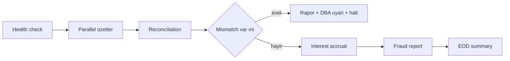
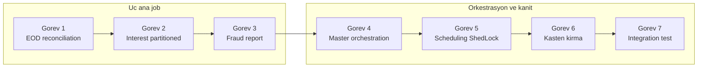
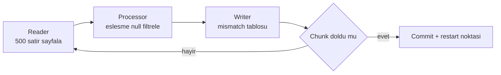
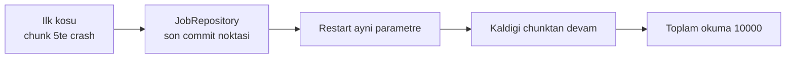

# Phase 5 Mini-Project — Banking EOD Job Suite

```admonish info title="Bu projede"
- `core-banking`'e 3 production-grade Spring Batch job ekliyorsun: EOD Reconciliation, Monthly Interest Accrual, Daily Fraud Report
- Hepsini restartable, idempotent, ShedLock-korumalı ve skip/retry + DLQ pattern'li kuruyorsun
- Interest job'ı 10 partition'a bölüp 1M account'u paralel işliyorsun
- Master orchestration job ile conditional flow + decider pattern'ini uyguluyorsun
- @Scheduled + @SchedulerLock ile multi-instance güvenli EOD pipeline'ı zamanlıyor, 13+ integration test ile kanıtlıyorsun
```

## Hedef

Bu projede Phase 5'in 6 topic'ini tek bir suite'te birleştiriyorsun. Sonunda elinde TR bankalarındaki gerçek EOD pipeline'a benzer, **scheduled + multi-instance safe + restartable** bir batch takımı olacak.

Üç job'un tümü şu özellikleri taşıyacak: restartable (kesilse kaldığı yerden devam), idempotent (duplicate run safe), ShedLock ile multi-instance tek run, skip/retry pattern, DLQ tablosuna failed item, listener'larla observable.

```admonish tip title="Süre ve önbilgi"
7-10 gün ayır (günde 2-3 saat). Başlamadan önce Phase 5'in 6 topic'i bitmiş olmalı: Spring Batch architecture, chunk-oriented processing, skip/retry/restart, listeners, partitioning, scheduling. Phase 4'teki Oracle migration tamam ve PL/SQL package'lar deploy edilmiş olmalı — bu projede onları çağıracaksın.
```

Master orchestration job'un yöneteceği günsonu akışı, tek yönlü bir zincir olarak akıyor: önce sistem sağlığı, sonra reconciliation, mismatch yoksa interest, ardından fraud ve özet.



## Build planı

Yedi görev var: ilk üçü ana job'ları kuruyor, son dördü orkestrasyonu, zamanlamayı ve kanıtı ekliyor.



---

## Görev 1 — EOD Reconciliation Job (2 gün)

**Ne yapacaksın:** Her hesabın stored balance'ını, journal'lardan yeniden hesaplanan balance ile karşılaştıran ve tutmayanları `reconciliation_mismatches` tablosuna yazan bir chunk-oriented job kuracaksın. **Neden:** Bir bankada muhasebe defteri ile hesap bakiyesi arasındaki her sapma bir hatanın kanıtıdır; bu job o sapmayı her gün otomatik yakalar.

### 1.1 Spec

| Özellik | Değer |
|---|---|
| Trigger | Cron her gün 23:55 (Europe/Istanbul) |
| Chunk size | 500 |
| Reader | JdbcPagingItemReader, ACTIVE account'lar |
| Processor | balance comparison, mismatch ise return |
| Writer | JdbcBatchItemWriter → reconciliation_mismatches |
| Skip | `InvalidJournalDataException` → DLQ |
| Retry | `DeadlockLoserDataAccessException` 3x exponential |
| ShedLock | `lockAtMostFor = 2h` |
| Idempotency | `(account_id, business_date)` UNIQUE |
| Restart | Default reader restartable |
| Listener | StepExecutionListener → success/failure metric + Slack |

```admonish warning title="Idempotency ile identifying parameter beraber çalışır"
Job'un iki kez aynı gün için çalışması duplicate mismatch üretmemeli. Bunu iki katman garantiler: `(account_id, business_date)` UNIQUE constraint DB seviyesinde, `businessDate` ise identifying job parameter olarak Spring Batch seviyesinde. Kural net: <mark>aynı businessDate ikinci kez çalıştırılırsa job yeni instance açmaz, exception atar</mark> — re-run istiyorsan `runTimestamp` gibi ikinci bir parametre ekle.
```

### 1.2 Domain model

Mismatch'i temsil eden record, compact constructor içinde `diffAmount`'ı kendisi hesaplar — çağıran hesaplamayı unutamaz:

```java
public record ReconciliationMismatch(
    UUID accountId,
    LocalDate businessDate,
    BigDecimal storedBalance,
    BigDecimal calculatedBalance,
    BigDecimal diffAmount
) {
    public ReconciliationMismatch {
        Objects.requireNonNull(accountId);
        Objects.requireNonNull(businessDate);
        Objects.requireNonNull(storedBalance);
        Objects.requireNonNull(calculatedBalance);
        diffAmount = storedBalance.subtract(calculatedBalance);
    }
}
```

### 1.3 Reader

Reader'ın kalbi `calculated_balance`'ı hesaplayan correlated subquery: her hesap için journal line'ları CREDIT/DEBIT yönüne göre toplar. Bu sayede <mark>reader tek query ile veriyi getirir; processor içinde per-item DB call yapmazsın</mark> (N+1'in batch versiyonu):

```java
.selectClause("""
    SELECT a.id AS account_id, a.balance_amount AS stored_balance,
        NVL((SELECT SUM(CASE WHEN jl.direction = 'CREDIT' THEN jl.amount ELSE -jl.amount END)
             FROM journal_lines jl
             WHERE jl.account_id = a.id
               AND jl.journal_occurred_at <= :businessDate + INTERVAL '1' DAY), 0) AS calculated_balance
    """)
```

`@StepScope` sayesinde `businessDate` job parametresi late binding ile enjekte olur — bu, restart'ta doğru gün için okumanın anahtarıdır.

<details>
<summary>Tam kod: reconciliationReader (~32 satır)</summary>

```java
@Bean
@StepScope
public JdbcPagingItemReader<AccountReconciliationData> reconciliationReader(
        @Value("#{jobParameters['businessDate']}") LocalDate businessDate,
        DataSource dataSource) {

    return new JdbcPagingItemReaderBuilder<AccountReconciliationData>()
        .name("reconciliationReader")
        .dataSource(dataSource)
        .selectClause("""
            SELECT
                a.id AS account_id,
                a.balance_amount AS stored_balance,
                NVL((
                    SELECT SUM(CASE WHEN jl.direction = 'CREDIT' THEN jl.amount ELSE -jl.amount END)
                    FROM journal_lines jl
                    WHERE jl.account_id = a.id
                      AND jl.journal_occurred_at <= :businessDate + INTERVAL '1' DAY
                ), 0) AS calculated_balance
            """)
        .fromClause("FROM accounts a")
        .whereClause("WHERE a.status != 'CLOSED'")
        .sortKeys(Map.of("account_id", Order.ASCENDING))
        .pageSize(500)
        .parameterValues(Map.of("businessDate", java.sql.Date.valueOf(businessDate)))
        .rowMapper((rs, n) -> new AccountReconciliationData(
            UUID.fromString(rs.getString("account_id")),
            rs.getBigDecimal("stored_balance"),
            rs.getBigDecimal("calculated_balance")
        ))
        .build();
}
```

</details>

### 1.4 Processor — null return ile filter

Processor'ın öğrettiği kritik davranış: **eşleşen hesap için `null` döndürmek**. Spring Batch `null` gelen item'ı writer'a hiç göndermez, yani sadece mismatch'ler yazılır:

```java
return data -> {
    // Eşleşiyor → null return → Writer'a gitmez
    if (data.storedBalance().compareTo(data.calculatedBalance()) == 0) {
        return null;
    }
    return new ReconciliationMismatch(
        data.accountId(), businessDate,
        data.storedBalance(), data.calculatedBalance(),
        data.storedBalance().subtract(data.calculatedBalance())
    );
};
```

### 1.5 Writer

Writer `JdbcBatchItemWriter` ile chunk'taki tüm mismatch'leri tek batch insert eder; `detected_at` DB tarafında `SYSTIMESTAMP` ile damgalanır:

```java
@Bean
public JdbcBatchItemWriter<ReconciliationMismatch> reconciliationWriter(DataSource dataSource) {
    return new JdbcBatchItemWriterBuilder<ReconciliationMismatch>()
        .dataSource(dataSource)
        .sql("""
            INSERT INTO reconciliation_mismatches(
                account_id, business_date, stored_balance,
                calculated_balance, diff_amount, detected_at
            ) VALUES (?, ?, ?, ?, ?, SYSTIMESTAMP)
            """)
        .itemPreparedStatementSetter((item, ps) -> {
            ps.setObject(1, item.accountId());
            ps.setDate(2, java.sql.Date.valueOf(item.businessDate()));
            ps.setBigDecimal(3, item.storedBalance());
            ps.setBigDecimal(4, item.calculatedBalance());
            ps.setBigDecimal(5, item.diffAmount());
        })
        .build();
}
```

### 1.6 Step + Job

Step'in öğrettiği parça `faultTolerant` bloğu: spesifik exception'ları skip/retry et, asla `Exception.class` genelini yakalama:

```java
.faultTolerant()
    .skip(InvalidJournalDataException.class)
    .skipLimit(1000)
    .retry(DeadlockLoserDataAccessException.class)
    .retry(TransientDataAccessException.class)
    .retryLimit(3)
.listener(skipListener)
```

Bu step 500'lük chunk'lar halinde okur, işler ve yazar; her chunk commit'i aynı zamanda bir restart noktasıdır:



Job tarafında `TimestampJobParametersIncrementer` re-run'ı güvenli kılar.

<details>
<summary>Tam kod: EodReconciliationJobConfig (~35 satır)</summary>

```java
@Configuration
public class EodReconciliationJobConfig {

    @Bean
    public Job eodReconciliationJob(JobRepository jobRepo, Step reconciliationStep) {
        return new JobBuilder("eodReconciliationJob", jobRepo)
            .start(reconciliationStep)
            .listener(jobNotificationListener())
            .incrementer(new TimestampJobParametersIncrementer())   // re-run safe
            .build();
    }

    @Bean
    public Step reconciliationStep(JobRepository jobRepo,
                                    PlatformTransactionManager txManager,
                                    ItemReader<AccountReconciliationData> reader,
                                    ItemProcessor<AccountReconciliationData, ReconciliationMismatch> processor,
                                    ItemWriter<ReconciliationMismatch> writer,
                                    SkipListener skipListener) {
        return new StepBuilder("reconciliationStep", jobRepo)
            .<AccountReconciliationData, ReconciliationMismatch>chunk(500, txManager)
            .reader(reader)
            .processor(processor)
            .writer(writer)
            .faultTolerant()
                .skip(InvalidJournalDataException.class)
                .skipLimit(1000)
                .retry(DeadlockLoserDataAccessException.class)
                .retry(TransientDataAccessException.class)
                .retryLimit(3)
            .listener(skipListener)
            .listener(stepExecutionListener())
            .build();
    }
}
```

</details>

### 1.7 Listener'lar

İki listener projeyi observable yapar. `JobNotificationListener` iş bitince süreyi hesaplar, COMPLETED/FAILED durumuna göre Slack'e mesaj atar ve metric sayar:

```java
@Override
public void afterJob(JobExecution exec) {
    if (exec.getStatus() == BatchStatus.COMPLETED) {
        notifier.sendSlack("✓ " + exec.getJobInstance().getJobName() + " completed");
        registry.counter("batch.job.success", "job", jobName(exec)).increment();
    } else {
        notifier.sendSlackUrgent("✗ " + exec.getJobInstance().getJobName() + " FAILED");
        registry.counter("batch.job.failure", "job", jobName(exec)).increment();
    }
}
```

`ReconciliationSkipListener` ise **DLQ pattern**'in kalbidir: skip edilen her item'ı sebebiyle birlikte `failed_reconciliations` tablosuna yazar, böylece operatör sonradan inceleyebilir.

<details>
<summary>Tam kod: JobNotificationListener + ReconciliationSkipListener (~43 satır)</summary>

```java
@Component
public class JobNotificationListener implements JobExecutionListener {

    private final NotificationService notifier;
    private final MeterRegistry registry;

    @Override
    public void beforeJob(JobExecution exec) {
        log.info("Job starting: {}", exec.getJobInstance().getJobName());
    }

    @Override
    public void afterJob(JobExecution exec) {
        long duration = exec.getEndTime().toEpochSecond(ZoneOffset.UTC) -
                       exec.getStartTime().toEpochSecond(ZoneOffset.UTC);

        if (exec.getStatus() == BatchStatus.COMPLETED) {
            notifier.sendSlack("✓ " + exec.getJobInstance().getJobName() +
                " completed in " + duration + "s");
            registry.counter("batch.job.success", "job", exec.getJobInstance().getJobName()).increment();
        } else {
            notifier.sendSlackUrgent("✗ " + exec.getJobInstance().getJobName() + " FAILED");
            registry.counter("batch.job.failure", "job", exec.getJobInstance().getJobName()).increment();
        }
    }
}

@Component
public class ReconciliationSkipListener implements SkipListener<AccountReconciliationData, ReconciliationMismatch> {

    private final FailedReconciliationRepository dlqRepo;

    @Override
    public void onSkipInProcess(AccountReconciliationData item, Throwable t) {
        dlqRepo.save(new FailedReconciliation(
            item.accountId(),
            t.getClass().getName(),
            t.getMessage(),
            Instant.now()
        ));
    }
}
```

</details>

```admonish tip title="Chunk size'ı ölçerek seç"
500 bir başlangıç değeri, dogma değil. Küçük chunk = sık commit + düşük memory ama yüksek overhead; büyük chunk = az commit ama rollback maliyeti ve memory baskısı yüksek. Defterine yaz: 500 yerine 5000 yaparsan süre ve memory nasıl değişir? Aynı 100k satırı üç boyutta koştur, rakamı gör.
```

### 1.8 Test

Dört integration test, Phase 1-2 derinliğinde davranışı kanıtlar: kasıtlı mismatch tespiti, midway crash sonrası restart, duplicate run reddi ve skip + DLQ akışı. Restart testi kritiktir — ilk koşu chunk 5'te çökse bile aynı parametrelerle yeniden başlatınca toplam okuma 10000 kalır, 15000 değil:



<details>
<summary>Tam kod: EodReconciliationJobTest — 4 test (~90 satır)</summary>

```java
@SpringBatchTest
@SpringBootTest
@Testcontainers
@ActiveProfiles("oracle")
class EodReconciliationJobTest {

    @Container @ServiceConnection
    static OracleContainer oracle = new OracleContainer("gvenzl/oracle-xe:21-slim-faststart");

    @Autowired JobLauncherTestUtils jobLauncher;
    @Autowired JdbcTemplate jdbc;
    @Autowired AccountRepository accountRepo;

    @Test
    void shouldDetectIntentionalMismatches() throws Exception {
        // Setup: 100 accounts, hepsi consistent
        seedAccountsAndJournals(100);

        // Kasten 5'inin balance'ını boz
        jdbc.update("UPDATE accounts SET balance_amount = balance_amount + 1000 WHERE ROWNUM <= 5");

        // Run
        JobParameters params = new JobParametersBuilder()
            .addLocalDate("businessDate", LocalDate.now())
            .addLong("runTimestamp", System.currentTimeMillis())
            .toJobParameters();

        JobExecution exec = jobLauncher.launchJob(params);

        assertThat(exec.getStatus()).isEqualTo(BatchStatus.COMPLETED);

        StepExecution step = exec.getStepExecutions().iterator().next();
        assertThat(step.getReadCount()).isEqualTo(100);
        assertThat(step.getWriteCount()).isEqualTo(5);   // 5 mismatch
    }

    @Test
    void shouldBeRestartableAfterMidwayCrash() throws Exception {
        seedAccountsAndJournals(10000);

        JobParameters params = ...;

        // First run — fail at chunk 5
        JobExecution firstRun = simulateCrashAt(params, 5);
        assertThat(firstRun.getStatus()).isEqualTo(BatchStatus.FAILED);

        // Restart with SAME parameters
        JobExecution secondRun = jobLauncher.launchJob(params);
        assertThat(secondRun.getStatus()).isEqualTo(BatchStatus.COMPLETED);

        // Total read should be 10000 (not 15000)
        long totalRead = firstRun.getStepExecutions().iterator().next().getReadCount()
                       + secondRun.getStepExecutions().iterator().next().getReadCount();
        assertThat(totalRead).isEqualTo(10000);
    }

    @Test
    void duplicateRunWithSameParametersShouldFail() throws Exception {
        seedAccountsAndJournals(10);

        JobParameters params = new JobParametersBuilder()
            .addLocalDate("businessDate", LocalDate.now())
            .toJobParameters();

        JobExecution first = jobLauncher.launchJob(params);
        assertThat(first.getStatus()).isEqualTo(BatchStatus.COMPLETED);

        assertThatThrownBy(() -> jobLauncher.launchJob(params))
            .isInstanceOf(JobInstanceAlreadyCompleteException.class);
    }

    @Test
    void shouldSkipInvalidJournalDataAndContinue() throws Exception {
        // Corrupt 3 journal entries
        seedCorruptedJournals(3);
        seedValidJournals(100);

        JobExecution exec = jobLauncher.launchJob(...);

        StepExecution step = exec.getStepExecutions().iterator().next();
        assertThat(step.getProcessSkipCount()).isEqualTo(3);

        // DLQ tablosunda 3 kayıt
        Integer dlqCount = jdbc.queryForObject(
            "SELECT COUNT(*) FROM failed_reconciliations", Integer.class);
        assertThat(dlqCount).isEqualTo(3);
    }
}
```

</details>

**Kontrol noktası:** 4 integration test yeşil; restart'ı bir de canlı dene — job'u ortasında durdur (`-Dspring.batch.enabled=false`), tekrar başlat, kaldığı yerden devam ettiğini gör.

### Deliverables Görev 1

- [ ] Job + Step + Reader + Processor + Writer kodu
- [ ] Skip + Retry + ShedLock entegrasyonu
- [ ] 4 integration test geçiyor
- [ ] Idempotency UNIQUE constraint test edildi
- [ ] Restart canlı denendi (ortasında durdur)
- [ ] DLQ pattern uygulandı
- [ ] Slack notification entegrasyonu
- [ ] Defterine: chunk size 500'ü neden seçtin, 5000 yapsam ne olur?

---

## Görev 2 — Monthly Interest Accrual (partitioned, 2 gün)

**Ne yapacaksın:** Aylık faiz tahakkukunu 10 partition'a bölünmüş, paralel çalışan bir job olarak yazacaksın; her account için Phase 4'teki `interest_pkg.calculate_compound_interest` PL/SQL'ini çağırıp sonucu hem audit tablosuna hem de bakiyeye yazacaksın. **Neden:** 1M account'u tek thread'le işlemek EOD penceresine sığmaz; partitioning ile işi 10 worker'a bölüp süreyi kabaca 10'a bölersin.

### 2.1 Spec

- Trigger: Cron her ayın 1'inde 00:30
- **Partitioned: 10 partition** (`AccountIdRangePartitioner`)
- Worker step chunk size: 1000
- Phase 4'teki `interest_pkg.calculate_compound_interest` PL/SQL'i çağır
- Writer 2 destination: `interest_postings` (audit) + `accounts` balance update (composite)
- Idempotency: `interest_postings(account_id, business_date)` UNIQUE
- ShedLock: `lockAtMostFor = 4h`

```admonish warning title="gridSize ile connection pool birlikte boyutlanır"
10 partition paralel koşarken her worker en az bir DB connection tutar. HikariCP `maximum-pool-size` en az `gridSize + buffer` olmalı — aksi halde worker'lar connection açlığından timeout yer ve job kilitlenir. Kaba formül: `pool >= gridSize + eşzamanlı app trafiği payı`. Defterine bu formülle seçtiğin sayıyı ve gerekçesini yaz.
```

### 2.2 Partitioner

Partitioner'ın işi tek: toplam ACTIVE account sayısını `gridSize`'a bölüp her partition'a bir `offset`/`limit` aralığı vermek. `ExecutionContext`'e yazılan bu değerler worker reader'a late binding ile geçer:

```java
long pageSize = (totalCount + gridSize - 1) / gridSize;
Map<String, ExecutionContext> partitions = new HashMap<>();
for (int i = 0; i < gridSize; i++) {
    ExecutionContext ctx = new ExecutionContext();
    ctx.putLong("offset", i * pageSize);
    ctx.putLong("limit", pageSize);
    ctx.putString("partitionName", "partition-" + i);
    partitions.put("partition-" + i, ctx);
}
return partitions;
```

<details>
<summary>Tam kod: AccountIdRangePartitioner (~28 satır)</summary>

```java
@Component
public class AccountIdRangePartitioner implements Partitioner {

    private final JdbcTemplate jdbc;

    @Override
    public Map<String, ExecutionContext> partition(int gridSize) {
        // Min/max account count
        Long totalCount = jdbc.queryForObject(
            "SELECT COUNT(*) FROM accounts WHERE status = 'ACTIVE'", Long.class);

        if (totalCount == 0) {
            return Map.of();
        }

        long pageSize = (totalCount + gridSize - 1) / gridSize;

        Map<String, ExecutionContext> partitions = new HashMap<>();
        for (int i = 0; i < gridSize; i++) {
            ExecutionContext ctx = new ExecutionContext();
            ctx.putLong("offset", i * pageSize);
            ctx.putLong("limit", pageSize);
            ctx.putString("partitionName", "partition-" + i);
            partitions.put("partition-" + i, ctx);
        }
        return partitions;
    }
}
```

</details>

### 2.3 Worker step

Worker step 1000'lik chunk'larla çalışır, `InvalidAccountException`'ı skip eder ve deadlock'ta retry yapar. Reader ise `@StepScope` ile partition'ın `offset`/`limit`'ini alıp sadece kendi aralığını okur:

```java
@Bean
@StepScope
public JdbcPagingItemReader<Account> partitionedReader(
        @Value("#{stepExecutionContext['offset']}") Long offset,
        @Value("#{stepExecutionContext['limit']}") Long limit,
        DataSource dataSource) {
    // ... WHERE rn BETWEEN :start AND :end, parameterValues offset+1 / offset+limit
}
```

<details>
<summary>Tam kod: workerStep + partitionedReader (~38 satır)</summary>

```java
@Bean
public Step workerStep(JobRepository jobRepo, PlatformTransactionManager tm,
                       ItemReader<Account> reader,
                       ItemProcessor<Account, InterestPosting> processor,
                       CompositeItemWriter<InterestPosting> writer) {
    return new StepBuilder("workerStep", jobRepo)
        .<Account, InterestPosting>chunk(1000, tm)
        .reader(reader)
        .processor(processor)
        .writer(writer)
        .faultTolerant()
            .skip(InvalidAccountException.class)
            .skipLimit(500)
            .retry(DeadlockLoserDataAccessException.class)
            .retryLimit(3)
        .build();
}

@Bean
@StepScope
public JdbcPagingItemReader<Account> partitionedReader(
        @Value("#{stepExecutionContext['offset']}") Long offset,
        @Value("#{stepExecutionContext['limit']}") Long limit,
        DataSource dataSource) {

    return new JdbcPagingItemReaderBuilder<Account>()
        .name("partitionedReader")
        .dataSource(dataSource)
        .selectClause("SELECT id, balance_amount, currency")
        .fromClause("FROM (SELECT id, balance_amount, currency, ROWNUM rn FROM accounts WHERE status = 'ACTIVE' ORDER BY id)")
        .whereClause("WHERE rn BETWEEN :start AND :end")
        .sortKeys(Map.of("id", Order.ASCENDING))
        .pageSize(1000)
        .parameterValues(Map.of("start", offset + 1, "end", offset + limit))
        .rowMapper(...)
        .build();
}
```

</details>

### 2.4 Composite writer (2 destination)

`CompositeItemWriter` aynı chunk'ta iki yazma yapar: önce `interest_postings`'e audit kaydı, sonra `accounts` bakiye güncellemesi. <mark>İkisi tek transaction'da commit olduğu için audit ile bakiye asla ayrışamaz</mark> — bir chunk fail olursa ikisi birlikte rollback olur:

```java
@Bean
public CompositeItemWriter<InterestPosting> compositeInterestWriter(
        JdbcBatchItemWriter<InterestPosting> postingWriter,
        JdbcBatchItemWriter<InterestPosting> balanceUpdateWriter) {
    return new CompositeItemWriterBuilder<InterestPosting>()
        .delegates(postingWriter, balanceUpdateWriter)
        .build();
}
```

<details>
<summary>Tam kod: postingWriter + balanceUpdateWriter (~38 satır)</summary>

```java
@Bean
public JdbcBatchItemWriter<InterestPosting> postingWriter(DataSource dataSource) {
    return new JdbcBatchItemWriterBuilder<InterestPosting>()
        .dataSource(dataSource)
        .sql("INSERT INTO interest_postings(account_id, business_date, amount, rate, days) " +
             "VALUES (?, ?, ?, ?, ?)")
        .itemPreparedStatementSetter((item, ps) -> {
            ps.setObject(1, item.accountId());
            ps.setDate(2, java.sql.Date.valueOf(item.businessDate()));
            ps.setBigDecimal(3, item.amount());
            ps.setBigDecimal(4, item.rate());
            ps.setInt(5, item.days());
        })
        .build();
}

@Bean
public JdbcBatchItemWriter<InterestPosting> balanceUpdateWriter(DataSource dataSource) {
    return new JdbcBatchItemWriterBuilder<InterestPosting>()
        .dataSource(dataSource)
        .sql("UPDATE accounts SET balance_amount = balance_amount + ?, updated_by = 'INTEREST_JOB' WHERE id = ?")
        .itemPreparedStatementSetter((item, ps) -> {
            ps.setBigDecimal(1, item.amount());
            ps.setObject(2, item.accountId());
        })
        .build();
}
```

</details>

### 2.5 Master step + Job

Master step partitioner'ı worker step'e bağlar; `gridSize(10)` ve 10 thread'lik `ThreadPoolTaskExecutor` ile 10 partition gerçekten paralel koşar (`queueCapacity(0)` sayesinde iş kuyruğa girmez, doğrudan thread'e gider):

```java
@Bean
public Step partitionedMasterStep(JobRepository jobRepo, Step workerStep,
                                   Partitioner partitioner, TaskExecutor taskExecutor) {
    return new StepBuilder("partitionedMasterStep", jobRepo)
        .partitioner("workerStep", partitioner)
        .step(workerStep)
        .gridSize(10)
        .taskExecutor(taskExecutor)
        .build();
}
```

<details>
<summary>Tam kod: masterStep + batchTaskExecutor (~24 satır)</summary>

```java
@Bean
public Step partitionedMasterStep(JobRepository jobRepo,
                                    Step workerStep,
                                    Partitioner partitioner,
                                    TaskExecutor taskExecutor) {
    return new StepBuilder("partitionedMasterStep", jobRepo)
        .partitioner("workerStep", partitioner)
        .step(workerStep)
        .gridSize(10)
        .taskExecutor(taskExecutor)
        .build();
}

@Bean
public TaskExecutor batchTaskExecutor() {
    ThreadPoolTaskExecutor executor = new ThreadPoolTaskExecutor();
    executor.setCorePoolSize(10);
    executor.setMaxPoolSize(10);
    executor.setQueueCapacity(0);
    executor.setThreadNamePrefix("interest-partition-");
    executor.initialize();
    return executor;
}
```

</details>

**Kontrol noktası:** 1M account ile end-to-end koştur; sequential vs partitioned süreyi defterine yaz. 10 partition'ın gerçekten paralel çalıştığını thread name prefix'lerinden (`interest-partition-*`) log'da doğrula.

### Deliverables Görev 2

- [ ] `AccountIdRangePartitioner` çalışıyor
- [ ] 10 partition paralel, her biri ~100k account
- [ ] `CompositeItemWriter` ile audit + balance update atomic chunk
- [ ] Phase 4 `interest_pkg.calculate_compound_interest` Java tarafından kullanılıyor
- [ ] 1M account ile end-to-end: defterimde sequential vs partitioned süre
- [ ] Idempotency UNIQUE constraint test
- [ ] Restart: ortasında durdur, kalanları işle

---

## Görev 3 — Daily Fraud Report (1 gün)

**Ne yapacaksın:** Son 24 saatteki transaction'ları 4 fraud kuralından geçirip alert üreten ve sonucu hem DB'ye hem CSV dosyasına yazan bir job kuracaksın. **Neden:** Fraud ekibi hem sorgulanabilir bir tabloya hem de dışa aktarılabilir bir rapora ihtiyaç duyar — composite writer bu iki hedefi tek geçişte doldurur.

### 3.1 Spec

- Trigger: Cron her gün 01:00
- Reader: Son 24 saat transaction
- Processor: 4 fraud rule (Topic 4.4 `fraud_check_pkg` ile uyumlu)
- Writer: 2 destination — `fraud_alerts` table + CSV `/data/fraud-report-{date}.csv`
- ShedLock: `lockAtMostFor = 1h`

### 3.2 Composite writer (DB + CSV)

Görev 2'deki composite pattern burada DB + dosya olarak tekrarlanır. CSV writer `@StepScope` ile dosya adına `businessDate`'i gömer ve `headerCallback` ile başlık satırını yazar:

```java
@Bean
public CompositeItemWriter<FraudAlert> fraudWriter(
        JdbcBatchItemWriter<FraudAlert> jdbcWriter,
        FlatFileItemWriter<FraudAlert> csvWriter) {
    return new CompositeItemWriterBuilder<FraudAlert>()
        .delegates(jdbcWriter, csvWriter)
        .build();
}
```

<details>
<summary>Tam kod: csvWriter FlatFileItemWriter (~14 satır)</summary>

```java
@Bean
@StepScope
public FlatFileItemWriter<FraudAlert> csvWriter(
        @Value("#{jobParameters['businessDate']}") LocalDate businessDate) {
    return new FlatFileItemWriterBuilder<FraudAlert>()
        .name("csvWriter")
        .resource(new FileSystemResource("/data/fraud-report-" + businessDate + ".csv"))
        .delimited()
        .delimiter(",")
        .names("transactionId", "accountId", "ruleCode", "severity", "score", "evidence", "detectedAt")
        .headerCallback(writer -> writer.write("TransactionId,AccountId,RuleCode,Severity,Score,Evidence,DetectedAt"))
        .build();
}
```

</details>

**Kontrol noktası:** Job'u koştur; `/data/fraud-report-YYYY-MM-DD.csv` dosyası oluşuyor ve `fraud_alerts` tablosuyla aynı satırları içeriyor. Notification'ın CSV'yi attachment olarak gönderdiğini doğrula.

### Deliverables Görev 3

- [ ] 4 fraud rule processor pipeline
- [ ] CSV + DB composite output
- [ ] CSV file generation `/data/fraud-report-YYYY-MM-DD.csv`
- [ ] Email/Slack notification with CSV attachment
- [ ] Phase 4 `fraud_check_pkg` ile entegre

---

## Görev 4 — Master Orchestration Job (1 gün)

**Ne yapacaksın:** Üç job'u tek bir günsonu akışında zincirleyen master job'u yazacaksın: health check → paralel özetler → reconciliation → decider → interest → fraud → summary. **Neden:** Job'ları ayrı ayrı zamanlamak yerine tek akışta yönetmek, mismatch bulunca faizi durdurmak gibi conditional kararları mümkün kılar.

Akışın kritik parçası `ReconciliationDecider`: reconciliation'dan sonra çözülmemiş mismatch var mı diye bakar; varsa akışı `MISMATCH_FOUND` dalına (rapor + DBA uyarısı + halt), yoksa `OK` dalına (interest) yönlendirir:

```java
@Override
public FlowExecutionStatus decide(JobExecution jobExec, StepExecution stepExec) {
    LocalDate businessDate = jobExec.getJobParameters().getLocalDate("businessDate");
    Integer count = jdbc.queryForObject(
        "SELECT COUNT(*) FROM reconciliation_mismatches WHERE business_date = ? AND resolved_at IS NULL",
        Integer.class, java.sql.Date.valueOf(businessDate)
    );
    return count > 0 ? new FlowExecutionStatus("MISMATCH_FOUND") : new FlowExecutionStatus("OK");
}
```

<details>
<summary>Tam kod: eodMasterOrchestrationJob + parallelSummariesFlow + ReconciliationDecider (~46 satır)</summary>

```java
@Bean
public Job eodMasterOrchestrationJob(JobRepository jobRepo) {
    return new JobBuilder("eodMasterOrchestration", jobRepo)
        .start(systemHealthCheckStep())
            .on("FAILED").to(alertOpsStep()).end()
        .from(systemHealthCheckStep()).on("COMPLETED").to(parallelSummariesFlow())
        .next(reconciliationDecider())
            .on("MISMATCH_FOUND").to(mismatchReportStep()).next(notifyDbaStep()).next(haltStep())
            .from(reconciliationDecider()).on("OK").to(interestAccrualStep())
        .next(fraudReportStep())
        .next(eodSummaryReportStep())
        .end()
        .build();
}

@Bean
public Flow parallelSummariesFlow() {
    return new FlowBuilder<Flow>("parallelSummaries")
        .split(taskExecutor())
        .add(
            new FlowBuilder<Flow>("accountSummary").start(accountSummaryStep()).build(),
            new FlowBuilder<Flow>("transactionSummary").start(transactionSummaryStep()).build(),
            new FlowBuilder<Flow>("cardSummary").start(cardSummaryStep()).build()
        )
        .build();
}

@Component
public class ReconciliationDecider implements JobExecutionDecider {

    private final JdbcTemplate jdbc;

    @Override
    public FlowExecutionStatus decide(JobExecution jobExec, StepExecution stepExec) {
        LocalDate businessDate = jobExec.getJobParameters().getLocalDate("businessDate");

        Integer count = jdbc.queryForObject(
            "SELECT COUNT(*) FROM reconciliation_mismatches WHERE business_date = ? AND resolved_at IS NULL",
            Integer.class, java.sql.Date.valueOf(businessDate)
        );

        return count > 0 ? new FlowExecutionStatus("MISMATCH_FOUND") : new FlowExecutionStatus("OK");
    }
}
```

</details>

**Kontrol noktası:** İki senaryoyu da test et — mismatch yokken akış interest'e geçiyor (happy path); mismatch varken `MISMATCH_FOUND` dalına sapıp halt oluyor.

---

## Görev 5 — Scheduling + ShedLock (yarım gün)

**Ne yapacaksın:** Her job'u cron ile zamanlayıp `@SchedulerLock` ile multi-instance'a karşı koruyacaksın. **Neden:** 3 app instance aynı cron'u tetiklerse job üç kez çalışır — faiz üç kez tahakkuk eder. ShedLock DB'de tek bir lock satırıyla bunu engeller: sadece kilidi alan instance koşar.

Her scheduled method aynı iskeleti izler — cron timezone'lu, `@SchedulerLock` isim + süre limitli:

```java
@Scheduled(cron = "0 55 23 * * *", zone = "Europe/Istanbul")
@SchedulerLock(name = "eodReconciliation", lockAtMostFor = "2h", lockAtLeastFor = "5m")
public void runEodReconciliation() throws Exception {
    run(eodReconciliationJob, LocalDate.now());
}
```

```admonish warning title="lockAtMostFor'u doğru boyutla"
`lockAtMostFor`, kilidi tutan instance çökerse kilidin ne kadar sonra otomatik serbest kalacağını belirler. Kural: <mark>lockAtMostFor job'un tipik süresinin 2-3 katı olmalı</mark> — çok kısa olursa job biterken kilit düşer ve ikinci instance devreye girer; 24h+ gibi çok uzun olursa çöken instance'ın kilidi saatlerce takılı kalır. `lockAtLeastFor` ise çok hızlı biten job'larda kilidin hemen serbest kalıp double-run'a yol açmasını önler.
```

<details>
<summary>Tam kod: BankingEodScheduler (~36 satır)</summary>

```java
@Component
public class BankingEodScheduler {

    private final JobLauncher jobLauncher;
    private final Job eodReconciliationJob;
    private final Job interestAccrualJob;
    private final Job fraudReportJob;
    private final Job eodMasterOrchestrationJob;

    @Scheduled(cron = "0 55 23 * * *", zone = "Europe/Istanbul")
    @SchedulerLock(name = "eodReconciliation", lockAtMostFor = "2h", lockAtLeastFor = "5m")
    public void runEodReconciliation() throws Exception {
        run(eodReconciliationJob, LocalDate.now());
    }

    @Scheduled(cron = "0 30 0 1 * *", zone = "Europe/Istanbul")   // her ayın 1'i 00:30
    @SchedulerLock(name = "monthlyInterest", lockAtMostFor = "4h", lockAtLeastFor = "10m")
    public void runMonthlyInterest() throws Exception {
        run(interestAccrualJob, LocalDate.now().minusDays(1));
    }

    @Scheduled(cron = "0 0 1 * * *", zone = "Europe/Istanbul")
    @SchedulerLock(name = "dailyFraud", lockAtMostFor = "1h", lockAtLeastFor = "5m")
    public void runFraudReport() throws Exception {
        run(fraudReportJob, LocalDate.now());
    }

    private void run(Job job, LocalDate businessDate) throws Exception {
        JobParameters params = new JobParametersBuilder()
            .addLocalDate("businessDate", businessDate)
            .addLong("runTimestamp", System.currentTimeMillis())   // re-run safe
            .toJobParameters();
        jobLauncher.run(job, params);
    }
}
```

</details>

**Kontrol noktası:** 3 app instance'ı lokal başlat; cron tetiklendiğinde sadece birinin job'u çalıştırdığını, diğer ikisinin kilidi alamayıp geçtiğini log'dan gör.

---

## Görev 6 — Kasten kırma (yarım gün)

Bu görevlerde bilerek sınır ihlalleri üretip davranışı gözlemliyorsun — banking'de deneyim, bug'ı kontrollü ortamda görmekle gelir. Her senaryonun sonucunu defterine yaz.

1. **Chunk size 1 vs 1000:** Aynı 100k satırı iki boyutla işle, süreyi karşılaştır.
2. **Skip limit ihlal:** 10000 satırda 1001 invalid item → job fail olmalı.
3. **Idempotency test:** Aynı `businessDate` iki kez → ikinci çağrı exception.
4. **Multi-instance:** 3 app instance lokal start → sadece 1'i job çalıştırmalı (ShedLock).
5. **Partition imbalance:** 100 account'un 99'u partition 1'e düşerse → partitioner bug'ını fark et ve düzelt.

---

## Görev 7 — Integration test suite (1 gün)

**Ne yapacaksın:** `@SpringBatchTest + TestContainers + Oracle XE` ile 13+ integration test'i toplayacaksın. **Neden:** Bir batch suite'in "çalışıyor" kanıtı, gerçek Oracle'a karşı koşan restart/idempotency/partition testleridir — mock DB bu davranışları yakalayamaz.

- `EodReconciliationJob`: 4 test (Görev 1.8 yukarıda)
- `MonthlyInterestJob`: 3 test (10k account, partitioning, idempotency)
- `FraudReportJob`: 3 test (rule detection, CSV output, DLQ)
- `MasterOrchestrationJob`: 2 test (happy path, mismatch branch)
- `ShedLock`: 1 test (multi-thread, sadece bir tane lock alır)

**Kontrol noktası:** `mvn verify` ile toplam 13+ integration test yeşil.

---

## Acceptance criteria

Başlamadan bir kez oku, bitince tek tek işaretle.

- [ ] 3 ana job + 1 master orchestration job
- [ ] Hepsi @Scheduled + @SchedulerLock korumalı
- [ ] Restartable (default reader + idempotent writer)
- [ ] Skip + Retry pattern
- [ ] DLQ pattern (`FailedReconciliation`, `FailedInterest` tabloları)
- [ ] Partitioned (interest 10 worker)
- [ ] Listener'lar (Slack, metric, audit)
- [ ] Phase 4 PL/SQL package'larla entegre (`interest_pkg`, `eod_reconciliation_pkg`, `fraud_check_pkg`)
- [ ] Conditional flow (master orchestration mismatch branch)
- [ ] Multi-instance simulation (3 app) test edildi
- [ ] 13+ integration test geçiyor
- [ ] 1M account ile partitioned interest job < 10 dakika
- [ ] Kasten kırma 5 senaryosu defterimde

---

## Pratik desteği

Projeyi bitirdiğin an, aşağıdaki prompt'la Claude'a banking-grade bir audit yaptır — kör noktalarını böyle yakalarsın.

<details>
<summary>Claude-verify prompt (mini-project bütünü için)</summary>

```
Phase 5 banking batch project'imi banking-grade kriterlere göre değerlendir:

1. Job structure:
   - 3 ana job + master orchestration ayrımı doğru mu?
   - Master orchestration conditional flow + decider pattern?
   - @StepScope ile job parameter binding doğru mu?

2. Restartability:
   - Default reader'lar (JdbcPagingItemReader) restartable mı?
   - Idempotent writer (UNIQUE constraint) garantili mi?
   - Restart canlı denendi mi (ortasında durdur, restart)?
   - JobParameters identifying parameter (businessDate) doğru mu?

3. Skip + Retry:
   - Specific exception'lar skip ediliyor mu (Exception.class değil)?
   - SkipListener DLQ tablosuna yazıyor mu?
   - Retry policy makul (3-5 attempt)?
   - DeadlockLoserDataAccessException + TransientDataAccessException coverage?

4. Partitioning:
   - Interest job 10 partition'a bölünmüş mü?
   - AccountIdRangePartitioner doğru implement (offset/limit pattern)?
   - DB connection pool partitioning'e uygun (HikariCP max ≥ gridSize + buffer)?
   - Sequential vs partitioned süre defterimde mi?

5. Scheduling + ShedLock:
   - Cron expression timezone'lu (Europe/Istanbul)?
   - @SchedulerLock her schedule'da var mı?
   - lockAtMostFor job süresinin 2-3x'i mi?
   - Multi-instance test yapıldı mı (3 instance, 1'i lock)?

6. PL/SQL integration:
   - Phase 4 interest_pkg, eod_reconciliation_pkg, fraud_check_pkg Java'dan çağrılıyor mu?
   - SimpleJdbcCall pattern doğru mu?

7. Banking domain:
   - EOD reconciliation double-entry invariant (sum debit = sum credit)?
   - Interest accrual compound formülü Phase 4'tekiyle aynı sonuç?
   - Fraud rules 4'ü implement edildi mi?

8. Composite writer:
   - Interest job audit + balance update atomic chunk?
   - Fraud job DB + CSV output?

9. Listeners:
   - JobExecutionListener success/failure notification + metric?
   - SkipListener DLQ pattern?
   - StepExecutionListener post-step ExitStatus override?

10. Anti-pattern:
    - Reader içinde per-item DB call var mı? (Olmamalı, JOIN ile pre-fetch)
    - skip(Exception.class) yok mu?
    - Non-idempotent writer yok mu?
    - Multi-instance ShedLock olmadan @Scheduled?
    - lockAtMostFor 24h+ (overly long)?

Her madde için PASS / FAIL / EKSIK işaretle.
```

</details>

<details>
<summary>Defter notları (15 madde)</summary>

1. "Chunk size 100, 1000, 5000 ile karşılaştırma (sürede, memory'de): ____."
2. "JdbcPagingItemReader vs JpaPagingItemReader banking için karar: ____."
3. "@StepScope late binding'in restart için kritikliği: ____."
4. "Skip + Retry kombinasyonunda Retry CB içinde mi dışında mı: ____."
5. "DLQ tablosunda saklanan info — başarısız neden, retry mi yapılır operator karar: ____."
6. "Partitioning: ID range vs modulo vs date — banking için seçim: ____."
7. "gridSize = HikariCP pool size - app traffic buffer formülü: ____."
8. "Composite writer atomic chunk semantic (audit + balance birlikte): ____."
9. "PL/SQL package'i Java'dan SimpleJdbcCall ile çağırma tradeoff (vs JPA): ____."
10. "ShedLock lockAtMostFor = job süresi × 2-3 — rationale: ____."
11. "RunIdIncrementer vs TimestampJobParametersIncrementer banking için: ____."
12. "Master orchestration conditional flow vs separate scheduled jobs trade-off: ____."
13. "1M account partitioned interest job sürede (rakam): ____."
14. "Multi-instance ShedLock test'i lokal yaparken karşılaştığım sorun: ____."
15. "Banking EOD pencere (23:55-02:00) içine 3 job sığdırma planlaması: ____."

</details>

---

```admonish success title="Proje Tamamlama Kriterleri"
- 3 ana job + 1 master orchestration job çalışıyor; hepsi @Scheduled + @SchedulerLock korumalı
- Tüm job'lar restartable (default reader + idempotent writer) ve skip/retry + DLQ pattern'li
- Interest job 10 partition'a bölünmüş; 1M account partitioned interest job < 10 dakika
- Phase 4 PL/SQL package'larıyla (interest_pkg, eod_reconciliation_pkg, fraud_check_pkg) entegre
- Master orchestration conditional flow (mismatch branch) + multi-instance ShedLock simülasyonu test edildi
- 13+ integration test geçiyor; 5 kasten kırma senaryosu defterinde
```

Hepsi onaylı → Faz 5 PHASE_TEST'e geç → [Faz Testi](../PHASE_TEST.md)
