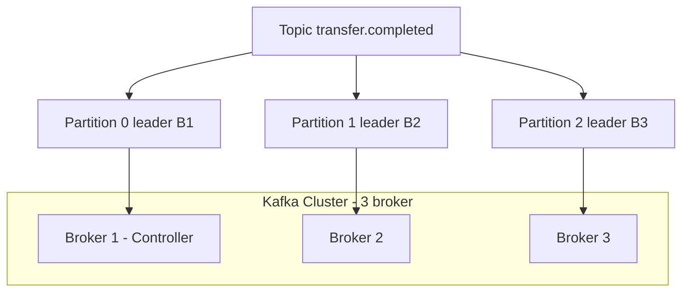
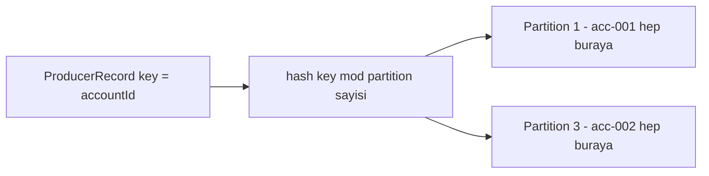
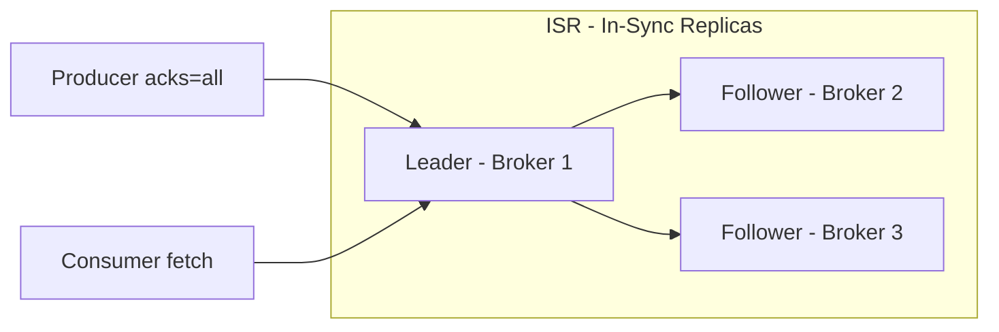
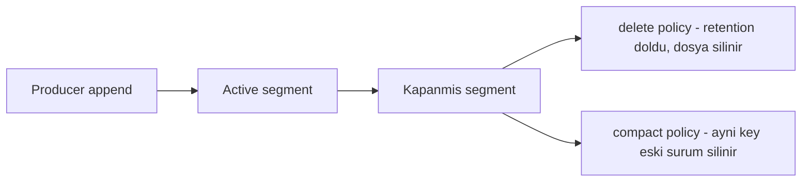

# Topic 6.1 — Kafka Mimarisi: Broker, Topic, Partition, Replica

```admonish info title="Bu bölümde"
- Kafka neden bir mesaj kuyruğu değil, **distributed commit log** — ve bu farkın banking'de neye mal olduğu
- Partition: sıra garantisi, paralellik ve scale birimi; partition key seçiminin transfer sırasını nasıl belirlediği
- Replication, leader/follower ve ISR — `acks=all` + `min.insync.replicas` ile veri kaybını sıfıra indirmek
- Offset, LEO, lag ve pull model: consumer'ın mesajı nasıl "kendi hızında" okuduğu
- Retention vs log compaction, KRaft vs ZooKeeper ve `TransferCompleted` için production topic tasarımı
```

## Hedef

Kafka'nın **distributed commit log** olarak nasıl çalıştığını, bir mesajın disk'e nasıl yazıldığını, kümede nasıl replicate edildiğini ve partition'ın neden Kafka'nın can damarı olduğunu derinlemesine kavramak. Banking projende `TransferCompleted` topic'ini doğru partition'layıp doğru replicate edecek kararları — RF, `min.insync.replicas`, partition sayısı, key — gerekçesiyle verebilecek seviyeye gelmek.

## Süre

Okuma: 2 saat • Kendini Sına: 45 dk • Pratik (opsiyonel): 3-4 saat • Toplam: ~2.5 saat (+ pratik)

## Önbilgi

- Docker compose temel (Faz 2'de PostgreSQL container'ı çalıştırdın)
- TCP/IP ve disk I/O hakkında genel fikir
- Java application'ın network'e nasıl bağlandığı

---

## Kavramlar

### 1. Kafka nedir — kuyruk değil, commit log

Kart işlemlerinde saniyede 100K event akarken "mesajı consumer aldı, sildim" mantığı çöker; replay, audit ve çoklu consumer aynı veriye aynı anda ihtiyaç duyar. Kafka bu ihtiyaç için doğdu.

LinkedIn 2011'de Jay Kreps liderliğinde başlattı, 2012'de Apache'ye devretti. Resmi tanımı **distributed event streaming platform**'dur ve üç işi yapar: event stream'lerine publish/subscribe, event'leri durable + fault-tolerant şekilde store, ve real-time process (Kafka Streams).

Junior'ın en sık yaptığı hata Kafka'yı klasik bir mesaj kuyruğu sanmaktır. Oysa <mark>Kafka bir mesaj kuyruğu değil, distributed, append-only commit log'dur</mark>. Aradaki fark akademik değil, mimari kararlarını doğrudan değiştirir:

| Klasik queue | Kafka topic |
|---|---|
| Consumer mesajı alınca silinir | Mesaj retention period kadar diskte kalır |
| FIFO sırası tek bir queue içinde | Sıra sadece partition içinde garanti |
| Bir mesajı sadece bir consumer alır | Aynı mesaj her consumer group'a teslim edilir |
| Broker mesaj sırasını yönetir | Consumer offset'i kendi yönetir |
| Acknowledge → silinme | Acknowledge yok, offset commit var |

Tuzak: "consumer okudu, mesaj gitti" beklentisiyle kod yazarsan, aynı `transfer.completed` event'ini hem notification hem audit hem fraud servisinin okuduğunu göremezsin. Kafka'da veri okununca kaybolmaz; herkes kendi offset'inden okur.

### 2. Topic — mantıksal kanal

Event'lerini isimlendirip gruplamak istiyorsun; işte bunun birimi topic'tir. Bir **topic**, ilgili event'lerin yayınlandığı isimlendirilmiş kanaldır.

Banking'de tipik topic'ler: `transfer.completed` (başarılı transfer'ler), `transfer.failed`, `account.opened`, `account.frozen`, `card.transaction.attempted` (fraud'a beslenir).

**Naming convention** TR bank'larda genelde `<domain>.<entity>.<verb-past-tense>` biçiminde: `core.account.opened`, `payments.transfer.completed`. Schema evolution için versiyon eklenir: `transfer.completed.v1`. Ayırıcı olarak underscore da kabul edilir ama nokta görsel olarak daha temizdir.

Topic seviyesinde şunları yapılandırırsın: partition sayısı, replication factor, retention period, cleanup policy (delete vs compact), `min.insync.replicas`.

### 3. Partition — Kafka'nın can damarı

Bir topic tek bir dosya olsaydı tüm yük tek diske, tek consumer'a düşerdi; partition tam da bu darboğazı kırar. Bir topic bir veya birden fazla **partition**'a bölünür ve her partition bir **append-only log file**'dır — her mesaj sırayla disk'e yazılır.

```
Topic: transfer.completed (4 partition)

Partition 0:  [msg0][msg1][msg2][msg3][msg4]...
Partition 1:  [msg0][msg1][msg2][msg3][msg4]...
Partition 2:  [msg0][msg1][msg2][msg3][msg4]...
Partition 3:  [msg0][msg1][msg2][msg3][msg4]...
              ↑
              Offset 0 (her partition'da bağımsız)
```

Dört kritik özellik:

1. **Sıra garantisi.** <mark>Kafka sıra garantisini yalnızca tek bir partition içinde verir</mark>; `partition 0 msg2` ile `partition 1 msg2` arasında zamansal ilişki garanti değildir.
2. **Paralellik birimi.** 4 partition'lı topic'i bir consumer group içinde en fazla 4 consumer paralel okur; 1 partition = 1 consumer.
3. **Scale birimi.** Throughput arttıkça partition sayısını artırırsın (10 yerine 100).
4. **Dağıtım birimi.** Partition'lar broker'lara yayılır; 3 broker + 6 partition → her broker 2 partition'a lider olur.

Cluster içinde topic, partition ve broker'ların ilişkisi şöyle görünür:



### 4. Partition key — sıra ve dağıtım kontrolü

Aynı hesabın iki transfer event'inin farklı partition'lara düşüp sıra dışı işlenmesi, fraud servisinde yanlış skora yol açar; partition key bunu engeller. Producer mesaj gönderirken bir **partition key** verebilir ve Kafka şu kuralı uygular:

```
partition = hash(key) % num_partitions
```

Sonucu tek cümleyle: <mark>aynı key her zaman aynı partition'a düşer</mark>. Böylece aynı hesabın tüm transfer'leri tek partition'da, kesin sırayla işlenir.



`TransferCompleted` için iki seçenek var. **Seçenek A — key yok (round-robin):**

```java
producer.send(new ProducerRecord<>("transfer.completed", null, event));
```

Yük eşit dağılır ama aynı hesabın iki event'i farklı partition'a düşebilir → consumer'da sıra dışı işleme. Banking için tehlikeli: önce transfer-2, sonra transfer-1 işlenirse fraud yanlış skor üretir.

**Seçenek B — key = accountId:**

```java
producer.send(new ProducerRecord<>("transfer.completed", accountId.toString(), event));
```

Aynı hesabın tüm transfer'leri aynı partition'a → sırayla işlenir. Bedeli: "hot account" (örn. holding banka hesabı) o partition'ı aşırı yükler.

Banking'de yaygın çözüm `key = fromAccountId`'dir; hot account sorunu varsa custom partitioner (`key = fromAccountId + branchId`). Kullanıma göre karar matrisi:

| Kullanım | Partition key |
|---|---|
| Hesap event'leri (deposit, withdraw, transfer-out) | `accountId` |
| Kart işlemleri (fraud için kart bazlı sıralama) | `cardId` |
| Customer events (KYC update, blok) | `customerId` |
| Audit log (sıra önemsiz) | null (round-robin) |
| Cross-bank transfer | `correlationId` |

```admonish warning title="Hot account tuzağı"
Key = accountId sırayı garanti eder ama tek bir "hot account" tüm yükü tek partition'a taşıyabilir. O partition'ın lideri olan broker throughput'un tamamını yer, diğer broker'lar boş durur. Böyle bir hesap varsa custom partitioner veya bileşik key düşün — sıra garantisini kaybetmeden yükü dağıt.
```

### 5. Offset — mesajın partition içindeki adresi

Consumer'ın "nereye kadar okudum" bilgisini bir yerde tutması gerekir; Kafka bunu offset ile çözer. Her mesajın partition içinde artan bir **offset**'i vardır: 0, 1, 2, ...

```
Partition 0 of transfer.completed:
offset:  0    1    2    3    4    5    6
content: T0   T1   T2   T3   T4   T5   T6
                                       ↑
                                       LEO (Log End Offset)

Consumer A:           ↑ committed offset 3 (next read: 4)
Consumer B:                ↑ committed offset 4 (next read: 5)
```

Üç terim: **Log End Offset (LEO)** son yazılan mesajın offset'i + 1; **committed offset** consumer'ın "buraya kadar işledim" dediği nokta; **lag = LEO - committed offset** consumer'ın ne kadar geride olduğunu gösterir ve banking ops için kritik bir metriktir.

Önemli kavrayış: Kafka mesajı consumer'a "vermez", consumer Kafka'dan **fetch eder** (pull model) ve offset'i kendisi ilerletir. Bu yüzden crash sonrası restart committed offset'ten devam eder; aynı mesajı tekrar okumak için offset'i geri alırsın (offset reset), sadece yeni event'lerden başlamak için `auto.offset.reset=latest` ile LEO'ya getirirsin.

### 6. Broker — cluster'ın düğümü

Cluster'ın fiziksel işini yapan süreç broker'dır. Bir **broker**, Kafka cluster'ında bir JVM sürecidir; production'da tipik olarak 3, 5 veya 7 broker olur.

Her broker partition'ları lokal diskinde (log segment'ler halinde) tutar, producer'lardan mesaj alıp partition'a append eder, consumer'ların fetch isteklerini cevaplar ve diğer broker'larla replikasyon yapar. Her broker'ın unique bir integer ID'si vardır (`broker.id=1`) ve cluster bunu kullanır.

### 7. Replication — fault tolerance

Bir broker'ın diski öldüğünde o partition'daki transfer'lerin buharlaşmaması için Kafka her partition'ı birden çok broker'da kopyalar. Bu kopya sayısı **replication factor (RF)**'dür; RF=3 ise her partition 3 broker'da tutulur.

```
Topic: transfer.completed, partitions: 4, RF: 3
Cluster: 3 broker

Partition 0:  Leader=Broker1, Followers=[Broker2, Broker3]
Partition 1:  Leader=Broker2, Followers=[Broker3, Broker1]
Partition 2:  Leader=Broker3, Followers=[Broker1, Broker2]
Partition 3:  Leader=Broker1, Followers=[Broker2, Broker3]
```

Her partition'ın kopyalarından biri **leader**'dır: producer ve consumer sadece leader ile konuşur, tüm read/write leader'dan geçer. Diğerleri **follower**'dır ve leader'dan replicate eder (Kafka 2.4+ follower fetching opsiyonel ama varsayılan değil).



Avantajı: Broker 1 düşerse Partition 0'ın lideri otomatik olarak Broker 2 veya 3 olur ve (doğru ayarlarla) veri kaybı olmaz. Banking'de RF kararı nettir: production'da **RF=3** standarttır — bir broker düşse iki kopya kalır. <mark>RF=1 production'da kesinlikle yasaktır</mark>, çünkü tek broker düşünce data kaybolur.

```admonish warning title="RF=2 neden önerilmez"
RF=2 mantıklı görünür ama `min.insync.replicas=2` ile birlikte bir tuzak kurar: yazma için iki broker da gerekli olur, yani bir broker düştüğü an write tamamen durur. RF=3 + `min.insync.replicas=2` ise bir broker düşse bile yazmaya devam eder. Banking'de RF=3 standardını kırma.
```

### 8. ISR — In-Sync Replicas

Bir follower "kopya" olduğunu iddia edebilir ama leader'ın gerisinde kalmışsa güvenilmez; ISR tam olarak "güncel kopyalar" kümesidir. Bir replica **in-sync** demek, leader'a göre `replica.lag.time.max.ms` (default 30 sn) içinde kalmış demektir. Yavaş follower ISR'den çıkarılır ve ISR sayısı yazma garantisini belirler.

`min.insync.replicas` yazma için kaç ISR gerektiğini söyler:

```
RF=3, min.insync.replicas=2

İdeal durum: 3 ISR (1 lider + 2 follower). Write OK.
Bir follower düştü: 2 ISR. Write OK (min karşılandı).
İki follower düştü: 1 ISR. Write reddedilir (NotEnoughReplicasException).
```

Banking'de `transfer.completed` için `RF=3` + `min.insync.replicas=2` kombinasyonu kullanılır: iki broker hayatta olmadıkça transfer event'i kabul edilmez. Producer `acks=all` ile yazıyorsa mesaj tüm ISR'lere yazılana kadar ack alınmaz — veri kaybı riski böyle sıfıra iner. Tuzak: `acks=1` (sadece leader) hızlıdır ama leader ack'ten hemen sonra ölürse mesaj follower'a hiç ulaşmamış olabilir.

### 9. Controller — cluster'ın beyin broker'ı

Leader election ve metadata gibi cluster-çapı kararları birinin koordine etmesi gerekir; bu rol controller'dadır. Cluster içinde bir broker **controller** rolündedir ve partition leader election'ı yapar, broker katılım/çıkışını yönetir, topic metadata'sını tutar.

Controller düşerse otomatik olarak başka bir broker controller olur (ZooKeeper veya KRaft üzerinden seçim). Yani controller da tek nokta hatası değildir.

### 10. ZooKeeper vs KRaft

Kafka'nın metadata'yı nerede tuttuğu, operasyon karmaşasını doğrudan belirler. İki dünya var.

**ZooKeeper (eski yöntem):** Kafka 0.x–3.x boyunca cluster metadata'yı dış bir ZooKeeper cluster'ında tuttu. Bedeli: iki cluster yönetme (Kafka + ZK) ve leader election'da ekstra network round-trip.

**KRaft (Kafka Raft, modern yöntem):** Kafka 3.3+ ile production-ready, Kafka 4.0+ sadece KRaft. Metadata Kafka'nın kendi içinde bir internal topic'te tutulur → tek cluster, daha basit ops.

```admonish tip title="TR bankalarında durum"
Eski production cluster'lar hâlâ yaygın olarak ZooKeeper kullanıyor; yeni cluster'lar KRaft'a geçiyor. Junior olarak ikisini de göreceksin — temel kavramlar (broker, partition, ISR, offset) birebir aynıdır, tek fark metadata'nın nerede durduğudur. Bu projede yeni Docker imajlarıyla KRaft kullanacağız.
```

### 11. Log segment ve dosya yapısı

Kafka'nın hızının sırrı sıralı disk I/O'dur ve bu, partition'ın disk'te nasıl saklandığıyla ilgilidir. Partition disk'te birden fazla **log segment** dosyası halinde tutulur:

```
/var/kafka-logs/transfer.completed-0/
├── 00000000000000000000.log       (segment dosyası 1)
├── 00000000000000000000.index     (offset → byte position index)
├── 00000000000000000000.timeindex (timestamp → offset index)
├── 00000000000000150000.log       (segment dosyası 2, 150000 offset'inden başlar)
├── 00000000000000150000.index
└── 00000000000000150000.timeindex
```

Segment'ler `log.segment.bytes` (default 1GB) dolunca veya `log.roll.ms` (default 7 gün) geçince yenilenir; eski segment'ler retention policy'ye göre silinir ya da compact edilir.

Neden segment? Çünkü sıralı disk I/O hızlıdır, eski mesajları silmek için random delete yerine bütün dosyayı silmek yeterlidir, ve index'ler sayesinde offset → byte position lookup O(1)'dir.

### 12. Retention policy — mesaj ne kadar yaşar

Kafka'da mesaj "okununca" değil, retention kuralına göre silinir; bu kuralı seçmek audit ve maliyet dengesidir. İki ana cleanup policy var.

**(a) `cleanup.policy=delete` (default):** `retention.ms` ile mesajlar X süre sonra (default 7 gün), `retention.bytes` ile partition X byte'ı aşınca silinir.

Banking retention örnekleri: `transfer.completed` 30-90 gün (audit/replay için), `card.transaction` 7-30 gün (fraud retroactive analiz), regulatory event'ler 7-10 yıl (compliance — büyük bütçe).

**(b) `cleanup.policy=compact` — log compaction:** Aynı key için sadece en son değer tutulur, eski versiyonlar silinir.

```
Log compaction:
Önce:  (k1, v1) (k2, v2) (k1, v3) (k3, v4) (k2, v5)
Sonra: (k1, v3) (k3, v4) (k2, v5)
```

Bu, "her key'in son durumu" gereken yerler için idealdir: `account.balance.snapshot` (hesap başına son bakiye), `customer.kyc.status` (müşteri başına son KYC durumu). `value=null` gönderirsen bu bir **tombstone**'dur — Kafka onu "sil" işareti sayar ve compaction o key'i tamamen kaldırır. İkisi birlikte de kullanılır (`cleanup.policy=compact,delete`): compacted state + maksimum retention.

Append, segment ve iki retention modu birlikte:



### 13. Banking için topic tasarımı — `TransferCompleted`

Şimdi tüm kavramları tek bir gerçek karara döküyoruz: `core-banking` projendeki `TransferCompleted` event'i için production topic tasarımı.

```bash
kafka-topics --create \
  --topic transfer.completed.v1 \
  --bootstrap-server localhost:9092 \
  --partitions 12 \
  --replication-factor 3 \
  --config min.insync.replicas=2 \
  --config retention.ms=2592000000 \
  --config cleanup.policy=delete \
  --config compression.type=snappy
```

**Partition sayısı (12):** Beklenen peak 10K transfer/sec; bir partition ~10K msg/sec'i rahat işler, yani matematiksel olarak 1 partition yeter. Ama consumer paralelliği için 12 seçilir — notification 6 instance, audit 6, fraud 12 koşabilir. Ayrıca `12 = 2² × 3` olduğu için ileride 24 veya 36'ya temiz scale eder.

**Key:** `accountId` (transfer'in `fromAccountId`'si) — aynı hesabın transfer'leri sırayla işlenir. Schema (Avro veya JSON):

```json
{
  "transferId": "uuid",
  "fromAccountId": "uuid",
  "toAccountId": "uuid",
  "amount": "10000.50",
  "currency": "TRY",
  "executedAt": "2025-05-12T14:30:00Z",
  "occurredAt": "2025-05-12T14:30:00.123Z",
  "version": 1,
  "correlationId": "uuid"
}
```

Distributed tracing ve schema evolution için Kafka header'ları da eklenir:

```
traceId: abc-123-def
spanId: xyz-456
sourceService: transfer-service
schemaVersion: 1
```

### 14. Banking anti-pattern'leri

Aşağıdakiler mülakatta "bu tasarımda ne yanlış?" sorusunun cephaneliğidir.

**Anti-pattern 1 — Tek partition topic'i.** `--partitions 1` ile tüm yazma tek broker'a düşer, tek consumer alabilir, throughput bir diskin I/O'suyla sınırlanır. Doğrusu: beklenen throughput'a göre `min(brokers × 2, throughput / 10K)` civarı partition.

**Anti-pattern 2 — 1000 partition topic'i.** Metadata yükü artar, producer metadata cache büyür, rebalance uzar, file descriptor sayısı patlar. Doğrusu: topic başına 100'ün altında, cluster çapında toplamı binlerle sınırla.

**Anti-pattern 3 — Key olmadan transfer event'i.** Mesajlar round-robin dağılır, aynı hesabın iki event'i farklı partition'a düşer, consumer'da sıra bozulur → fraud false positive, balance inconsistency. Doğrusu: `key = fromAccountId.toString()`.

**Anti-pattern 4 — PII'yi payload'da plain text tutmak.** `customerTcNo`, `cardNumber`, `iban` gibi alanları düz metin göndermek Kafka log'larında, replication target'larında ve backup'larda kalıcı ihlaldir:

```json
{
  "customerTcNo": "12345678901",
  "cardNumber": "4242 4242 4242 4242",
  "iban": "TR330006100519786457841326"
}
```

```admonish warning title="PII payload'da plain text = KVKK/GDPR ihlali"
Kafka mesajı bir kez yazıldığında retention boyunca her replica'da, her backup'ta ve her downstream consumer'da durur — silmek pratikte imkânsızdır. Kart numarasını maskele (`**** **** **** 4326`), PII'yi hash'leyip secure store'da tut, PCI için tokenize et. Payload'a asla ham TC no / kart no / IBAN koyma.
```

**Anti-pattern 5 — Kafka'yı senkron request/response gibi kullanmak.** Request topic + response topic + correlation ID kurgusu genelde yanlıştır; Kafka high-latency ve built-in correlation'sızdır. Senkron için HTTP/gRPC doğru; Kafka asynchronous event broadcast içindir. İstisna: cross-system batch "fire and forget + later poll".

**Anti-pattern 6 — Her küçük olay için ayrı topic.** `transfer.completed.tl`, `transfer.completed.usd`, `transfer.completed.amount.over.10k` gibi patlama yerine tek `transfer.completed` + consumer'da filter yeterlidir. Topic sayısını kontrol altında tut.

---

## Önemli olabilecek araştırma kaynakları

- "Kafka: The Definitive Guide" 2nd edition (O'Reilly, Neha Narkhede et al.)
- "Designing Event-Driven Systems" Ben Stopford (free O'Reilly e-book)
- Apache Kafka resmi docs — `kafka.apache.org/documentation/`
- "Apache Kafka Internals" blog yazıları (Confluent)
- "Kafka Streams in Action" Bill Bejeck (kitap, Phase 6 Topic 5 için)
- "Kafka improvement proposals (KIP)" — özellikle KIP-500 (KRaft), KIP-98 (exactly-once)
- Confluent developer portal — `developer.confluent.io`
- "The Log: What every software engineer should know" Jay Kreps (manifesto niteliğinde blog yazısı)

---

## Kendini Sına

Aşağıdaki soruları önce **cevaba bakmadan** kendi cümlelerinle yanıtlamayı dene — hepsi TR bank mülakatlarında Kafka için sorulan klasiklerdir. Takıldığın soru olursa ilgili Kavramlar başlığına dön, sonra tekrar dene.

**S1. Kafka neden bir mesaj kuyruğu değildir? Bu farkın banking'de pratik sonucu nedir?**

<details>
<summary>Cevabı göster</summary>

Kafka distributed, append-only bir commit log'dur; klasik kuyruğun aksine mesaj consumer tarafından okununca silinmez, retention süresi boyunca diskte kalır. Kuyrukta bir mesajı tek consumer alır ve broker sırayı yönetir; Kafka'da aynı mesajı her consumer group ayrı ayrı okur ve offset'i consumer kendisi yönetir.

Banking sonucu: tek bir `transfer.completed` event'ini notification, audit ve fraud servisleri aynı anda ve birbirinden bağımsız hızda okuyabilir. Ayrıca bir bug'dan sonra event'leri baştan replay edebilir, audit için geçmişe dönük okuyabilirsin — çünkü veri okununca kaybolmaz.

</details>

**S2. Kafka'da mesaj sırası garantisi nereye kadar geçerlidir? `TransferCompleted` için bu neyi zorunlu kılar?**

<details>
<summary>Cevabı göster</summary>

Sıra garantisi yalnızca tek bir partition içinde geçerlidir. Bir partition append-only log olduğu için oraya yazılan mesajlar offset sırasıyla okunur; ama iki farklı partition arasında zamansal sıra garanti edilmez.

`TransferCompleted` için bu şunu zorunlu kılar: aynı hesabın transfer'leri kesinlikle sırayla işlenecekse hepsi aynı partition'a düşmeli. Bu da `key = fromAccountId` demektir — çünkü aynı key her zaman aynı partition'a gider. Key vermezsen round-robin dağılır, transfer-2 transfer-1'den önce işlenebilir ve fraud/balance hesabı bozulur.

</details>

**S3. `partition = hash(key) % num_partitions` kuralı ne işe yarar? "Hot account" problemi nedir, nasıl çözersin?**

<details>
<summary>Cevabı göster</summary>

Bu kural aynı key'e sahip tüm mesajların aynı partition'a düşmesini sağlar; böylece o key'e ait event'ler tek partition içinde kesin sırayla işlenir. `key = accountId` seçince bir hesabın bütün hareketleri sıralı kalır.

Hot account problemi: holding hesabı gibi çok yoğun bir hesap tüm yükü tek partition'a (ve o partition'ın lideri olan tek broker'a) taşır, diğer broker'lar boş kalır. Çözüm: sırayı bozmadan yükü dağıtan bileşik/custom key (`fromAccountId + branchId`) ya da o özel hesaplar için ayrı bir partitioning stratejisi.

</details>

**S4. Replication factor nedir? RF=1, RF=2 ve RF=3'ü banking için karşılaştır.**

<details>
<summary>Cevabı göster</summary>

Replication factor bir partition'ın kaç broker'da kopyalanacağını söyler; kopyalardan biri leader (tüm read/write), diğerleri follower'dır (leader'dan replicate eder). Amaç fault tolerance: leader'ın broker'ı ölürse follower'lardan biri lider olur ve veri kaybı olmaz.

RF=1: tek kopya, tek broker düşünce data gider — production'da kesinlikle yasak. RF=2: `min.insync.replicas=2` ile bir broker düşünce write durur, dayanıklılık marjı yok — önerilmez. RF=3: standart; bir broker düşse iki kopya kalır, `min.insync.replicas=2` ile yazma da devam eder. Banking'de production standardı RF=3'tür.

</details>

**S5. ISR nedir? `min.insync.replicas=2` ve `acks=all` birlikte transfer için ne garanti eder?**

<details>
<summary>Cevabı göster</summary>

ISR (In-Sync Replicas), leader'a göre `replica.lag.time.max.ms` (default 30 sn) içinde güncel kalmış replica'lar kümesidir; geride kalan follower ISR'den çıkarılır. ISR sayısı yazma garantisini belirler.

`min.insync.replicas=2` yazmanın kabul edilmesi için en az 2 ISR gerektiğini söyler; iki follower da düşüp ISR 1'e inerse write `NotEnoughReplicasException` ile reddedilir. `acks=all` ise producer'a "mesaj tüm ISR'lere yazılana kadar ack verme" der. İkisi birlikte transfer event'inin en az iki broker'ın diskine gitmeden onaylanmamasını sağlar — bir broker anında ölse bile event kaybolmaz. Karşıt tuzak: `acks=1` sadece leader'a yazıldığında ack verir; leader ack sonrası ölürse mesaj follower'a hiç gitmemiş olabilir.

</details>

**S6. Offset, LEO, committed offset ve lag arasındaki ilişkiyi açıkla. Pull model neden önemli?**

<details>
<summary>Cevabı göster</summary>

Offset bir mesajın partition içindeki artan adresidir (0, 1, 2, ...). LEO (Log End Offset) son yazılan mesajın offset'i + 1'dir, yani partition'ın "sonu". Committed offset consumer'ın "buraya kadar işledim" dediği noktadır. Lag = LEO − committed offset ve consumer'ın ne kadar geride kaldığını gösterir; banking ops'ta izlenmesi gereken kritik metriktir.

Pull model önemli çünkü Kafka mesajı consumer'a itmez, consumer fetch edip offset'i kendisi ilerletir. Bu sayede consumer crash olsa restart'ta committed offset'ten devam eder, aynı veriyi tekrar okumak için offset'i geri alır (reset), sadece yeni event'lerden başlamak için `auto.offset.reset=latest` kullanır. Yani okuma hızı ve konumu tamamen consumer'ın kontrolündedir.

</details>

**S7. Log compaction ne zaman `delete` retention'a tercih edilir? Tombstone nedir?**

<details>
<summary>Cevabı göster</summary>

`cleanup.policy=delete` zaman/boyut bazlıdır: mesajlar `retention.ms` süresi sonra veya `retention.bytes` aşılınca silinir — event geçmişi (transfer'ler, kart işlemleri) için doğrudur. `cleanup.policy=compact` ise her key için sadece en son değeri tutar, eski versiyonları temizler; "her anahtarın güncel durumu" gereken yerler için idealdir: `account.balance.snapshot` (hesap başına son bakiye), `customer.kyc.status` (müşteri başına son KYC).

Tombstone, `value=null` olan bir mesajdır; Kafka bunu "bu key'i sil" işareti olarak yorumlar ve compaction çalışınca o key log'dan tamamen kaldırılır. Compacted topic'te bir kaydı silmenin yolu budur. İkisi birlikte de kullanılabilir (`compact,delete`): compacted state + maksimum retention.

</details>

**S8. ZooKeeper ile KRaft arasındaki fark nedir? TR bankalarında hangisiyle karşılaşman muhtemel?**

<details>
<summary>Cevabı göster</summary>

Fark cluster metadata'nın (partition liderleri, topic config, broker üyeliği) nerede tutulduğudur. ZooKeeper modunda metadata dış bir ZooKeeper cluster'ında durur — iki ayrı sistem yönetmek ve leader election'da ekstra network round-trip demektir. KRaft modunda metadata Kafka'nın kendi internal topic'inde tutulur; tek cluster, daha basit ops, daha hızlı failover. KRaft Kafka 3.3+ ile production-ready, Kafka 4.0+ ise yalnızca KRaft.

TR bankalarında ikisini de görebilirsin: eski/olgun production cluster'lar hâlâ ZooKeeper kullanıyor, yeni kurulanlar KRaft'a geçiyor. Önemli nokta: broker, partition, ISR, offset gibi tüm temel kavramlar iki modda da birebir aynıdır — sadece metadata'nın adresi değişir.

</details>

---

## Tamamlama kriterleri

- [ ] "Kendini Sına" bölümündeki tüm soruları cevaba bakmadan açıklayabiliyorum
- [ ] Kafka'nın neden mesaj kuyruğu değil, distributed commit log olduğunu bir örnekle anlatabiliyorum
- [ ] Partition vs replica farkını ve sıra garantisinin nereye kadar geçerli olduğunu biliyorum
- [ ] Partition key seçimini (accountId) ve hot account problemini gerekçesiyle söyleyebiliyorum
- [ ] Leader, follower, ISR, controller terimlerini ve RF=3 + `min.insync.replicas=2` + `acks=all` kombinasyonunu açıklayabiliyorum
- [ ] Offset, LEO, committed offset ve lag ilişkisini kurabiliyorum
- [ ] Log compaction'ın ne zaman kullanılacağını ve tombstone'u biliyorum
- [ ] `TransferCompleted` için partition sayısı, RF, key ve retention kararlarını gerekçelendirebiliyorum
- [ ] Production vs local broker konfig farklarını (RF, min.insync) listeleyebiliyorum
- [ ] (Opsiyonel) "Pratik yapmak istersen" bölümündeki testleri yazdım ve Claude-verify prompt'uyla doğrulattım

---

## Defter notları

Aşağıdaki cümleleri kendi kelimelerinle doldur:

1. "Kafka mesaj kuyruğu değil, ____ olarak tanımlanmalı çünkü ____."
2. "Bir topic'in partition sayısını arttırmak ____ sağlar ama ____ riskini getirir."
3. "Partition key seçimi banking için kritik çünkü ____. Örnek: TransferCompleted için key = ____, sebep = ____."
4. "Replication factor 3 production'da standart çünkü ____. RF=1 yasak çünkü ____."
5. "ISR (In-Sync Replicas) şu kontrole hizmet eder: ____. min.insync.replicas=2 ne anlama gelir: ____."
6. "Offset, partition içinde mesajın ____. Consumer lag = ____."
7. "log compaction kullanım senaryosu: ____. Banking örneği: ____."
8. "ZooKeeper vs KRaft farkı: ____. TR bankalarında muhtemel durum: ____."
9. "TransferCompleted topic'i için seçtiğim partition sayısı: ____, sebep: ____."
10. "TransferCompleted event payload'unda PII tutmama sebebim: ____. Alternatif: ____."

```admonish success title="Bölüm Özeti"
- Kafka bir mesaj kuyruğu değil, distributed append-only commit log'dur: mesaj okununca silinmez, her consumer group kendi offset'inden okur ve geçmiş replay edilebilir
- Partition Kafka'nın can damarıdır — sıra garantisi yalnızca partition içindedir, aynı zamanda paralellik, scale ve dağıtım birimidir
- `partition = hash(key) % num_partitions`: aynı key hep aynı partition'a gider; banking'de `key = fromAccountId` aynı hesabın transfer'lerini sırada tutar (hot account'a dikkat)
- Dayanıklılık üçlüsü: RF=3 + `min.insync.replicas=2` + `acks=all` → event en az iki broker'ın diskine yazılmadan onaylanmaz; RF=1 production'da yasaktır
- Offset/LEO/lag pull model ile consumer'ın kontrolündedir; retention `delete` (event geçmişi) veya `compact` (key başına son durum + tombstone) olur
- `TransferCompleted` tasarımı ezberi: 12 partition (paralellik), RF=3, `min.insync.replicas=2`, `key=accountId`, `retention.ms=30 gün`, PII payload'da asla plain text
```

---

## Pratik yapmak istersen

Kavramları elle denemek istersen aşağıdaki iki ek hazır: test yazma rehberi `TransferCompletedEvent`'in JSON serialization'ını doğrulayan örnek testler içerir; Claude-verify prompt'u ile kurduğun Kafka cluster'ını ve topic tasarım kararlarını banking konteksinde denetletebilirsin. Not: yereldeki cluster tek broker + RF=1 ile çalışır (kaynak yetersizliği); production'da RF=3 olur — bu farkı bilinçli koru.

<details>
<summary>Test yazma rehberi</summary>

Bu topic konfigürasyon odaklıdır, kod testi azdır. Yine de `TransferCompletedEvent` record'unun JSON serialization'ını doğrula. Önce event tanımını `events` modülünde oluştur:

```java
public record TransferCompletedEvent(
    UUID transferId,
    UUID fromAccountId,
    UUID toAccountId,
    BigDecimal amount,
    String currency,
    @JsonFormat(shape = JsonFormat.Shape.STRING) Instant executedAt,
    @JsonFormat(shape = JsonFormat.Shape.STRING) Instant occurredAt,
    int version,
    UUID correlationId
) {
    public static final String TOPIC = "transfer.completed.v1";
    public static final int CURRENT_VERSION = 1;
}
```

### Test 6.1.1 — `TransferCompletedEventTest`

```java
class TransferCompletedEventTest {

    private final ObjectMapper objectMapper = new ObjectMapper()
        .registerModule(new JavaTimeModule());

    @Test
    void shouldSerializeToJson() throws Exception {
        var event = new TransferCompletedEvent(
            UUID.fromString("11111111-1111-1111-1111-111111111111"),
            UUID.fromString("22222222-2222-2222-2222-222222222222"),
            UUID.fromString("33333333-3333-3333-3333-333333333333"),
            new BigDecimal("100.00"),
            "TRY",
            Instant.parse("2025-05-12T14:30:00Z"),
            Instant.parse("2025-05-12T14:30:00.123Z"),
            1,
            UUID.fromString("44444444-4444-4444-4444-444444444444")
        );

        String json = objectMapper.writeValueAsString(event);

        assertThat(json).contains("\"transferId\":\"11111111-1111-1111-1111-111111111111\"");
        assertThat(json).contains("\"amount\":100.00");
        assertThat(json).contains("\"currency\":\"TRY\"");
        assertThat(json).contains("\"executedAt\":\"2025-05-12T14:30:00Z\"");
        assertThat(json).contains("\"version\":1");
    }

    @Test
    void shouldDeserializeFromJson() throws Exception {
        String json = """
            {
              "transferId": "11111111-1111-1111-1111-111111111111",
              "fromAccountId": "22222222-2222-2222-2222-222222222222",
              "toAccountId": "33333333-3333-3333-3333-333333333333",
              "amount": "100.00",
              "currency": "TRY",
              "executedAt": "2025-05-12T14:30:00Z",
              "occurredAt": "2025-05-12T14:30:00.123Z",
              "version": 1,
              "correlationId": "44444444-4444-4444-4444-444444444444"
            }
            """;

        var event = objectMapper.readValue(json, TransferCompletedEvent.class);

        assertThat(event.transferId())
            .isEqualTo(UUID.fromString("11111111-1111-1111-1111-111111111111"));
        assertThat(event.amount()).isEqualByComparingTo("100.00");
        assertThat(event.version()).isEqualTo(1);
    }

    @Test
    void topicNameIsConstant() {
        assertThat(TransferCompletedEvent.TOPIC).isEqualTo("transfer.completed.v1");
    }
}
```

> Publish/consume henüz yok — burada sadece event tanımı ve serialization sözleşmesi test edilir. Producer'ı Topic 6.2'de yazacağız.

**Tamamlanmış sayılırsın** eğer: `TransferCompletedEvent` record'u yazıldı, üç test (serialize, deserialize, topic sabiti) geçiyor, `amount` BigDecimal ve timestamp'ler ISO-8601 string olarak serialize oluyor, payload'da hiçbir PII alanı yok.

</details>

<details>
<summary>Claude-verify prompt</summary>

```
Aşağıdaki Kafka kurulum ve topic tasarım kararlarımı banking konteksi içinde
değerlendir. Kod yazma, sadece eksik/yanlış olanları söyle:

1. docker-compose.yml:
   - Kafka tek broker (local) ile kuruldu mu? Production için NOT yazıldı mı?
   - KRaft mode (ZooKeeper'sız) kullanılıyor mu?
   - Kafka UI veya benzer monitoring tool ekli mi?
   - Volume mount edilmiş mi (restart'ta veri kaybolmasın)?

2. Topic tasarımı (transfer.completed.v1):
   - Naming convention domain-prefix + entity + verb-past + version mi?
   - Partition sayısı throughput'a uygun mu (1 değil)?
   - Replication factor production için 3 olarak NOT edilmiş mi?
   - min.insync.replicas konfigüre edilmiş mi?
   - Retention period banking için makul mu (7+ gün)?

3. Event schema (TransferCompletedEvent):
   - Record kullanılmış mı (immutable)?
   - transferId, fromAccountId, toAccountId UUID mi?
   - amount BigDecimal mi (double değil)?
   - currency String mi, ISO 4217 olduğu açıklanmış mı?
   - timestamp field'lar Instant mi, JSON'da ISO-8601 string olarak mı serialize ediliyor?
   - version field'ı var mı (schema evolution için)?
   - correlationId distributed tracing için var mı?
   - PII (TC no, kart no) event payload'unda VAR MI (olmamalı)?

4. Partition key:
   - Key olarak accountId kullanılması planlanmış mı?
   - "Hot account" probleminin farkında mıyım (notlarda var mı)?

5. Topic configs:
   - retention.ms açıkça set edilmiş mi?
   - compression.type (snappy/lz4/zstd) düşünülmüş mü?

6. Kavrayış kontrolü (defter notlarına bakarak):
   - Partition vs replica farkını kendi cümlemle anlatabiliyorum.
   - ISR ne demek söyleyebiliyorum.
   - Offset, LEO, lag arasındaki ilişkiyi biliyorum.
   - log compaction ne zaman kullanılır söyleyebiliyorum.

Her madde için PASS / FAIL / EKSIK işaretle. Sadece eksik olanları işaret et,
düzeltme kodu yazma.
```

</details>

→ Sıradaki topic: [02-producer/](../02-producer/index.md)