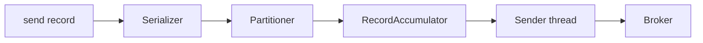
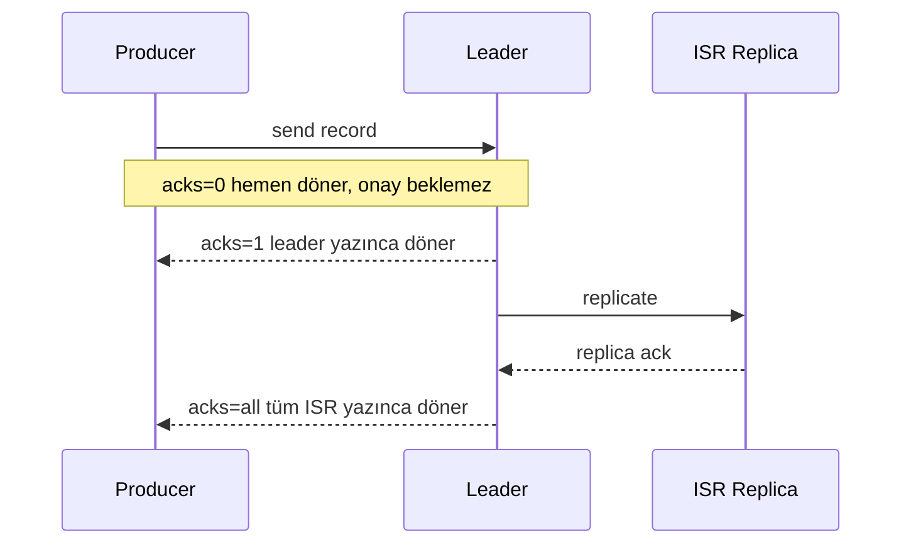
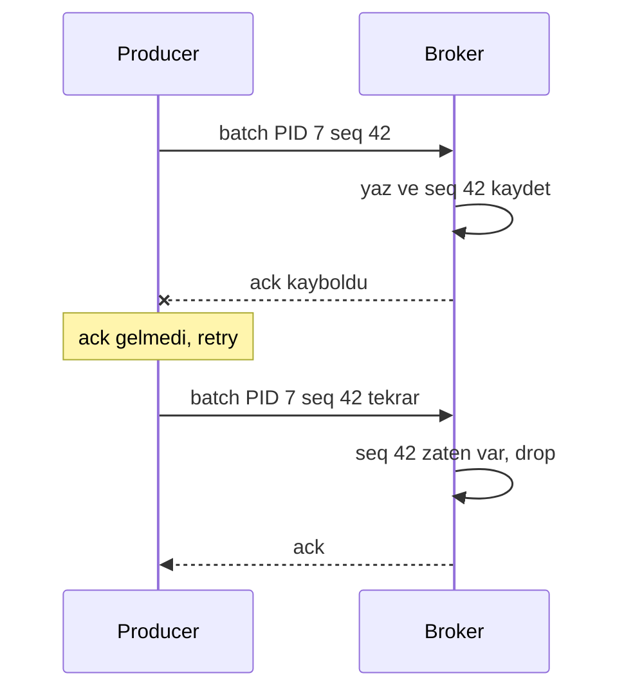
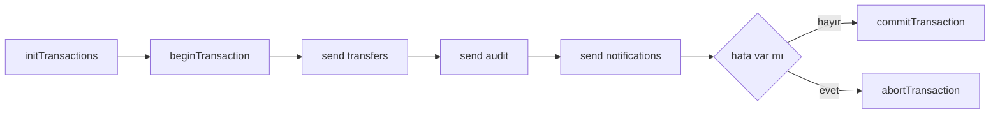

# Topic 6.2 — Kafka Producer Design

```admonish info title="Bu bölümde"
- `acks=0/1/all` durability farkı ve banking'in neden yalnızca `acks=all` + `min.insync.replicas=2` + `replication.factor=3` kullandığı
- `enable.idempotence`: broker'ın `(PID, sequence)` ile duplicate'i nasıl drop ettiği ve retry'ı neden güvenli yaptığı
- Transactional producer + `read_committed` consumer ile multi-topic atomic publish ve **exactly-once** semantics
- Batching, compression ve partition key stratejisi — throughput tuning ve per-key ordering
- Banking dayanıklılık kalıbı: async callback + outbox fallback, Avro + Schema Registry, error handling matrix ve anti-pattern'ler
```

## Hedef

Kafka producer'ı banking-grade seviyede konfigüre etmek. `acks`, `enable.idempotence`, transactional producer, batch tuning, compression, partition key stratejisi ve error handling. Banking event publishing (TransferCompleted, FraudDetected, AccountStatusChanged) için **veri kaybı olmayan** bir producer setup'ı yapabilmek.

## Süre

Okuma: 2 saat • Kendini Sına: 45 dk • Pratik (opsiyonel): 3-4 saat • Toplam: ~2.5 saat (+ pratik)

## Önbilgi

- Topic 6.1 (Kafka Architecture) bitti — broker, topic, partition, replica, ISR biliyorsun
- Spring Boot + KafkaTemplate'i basit seviyede kullandın
- BigDecimal money handling Phase 1'den hazır

---

## Kavramlar

### 1. Producer'ın iç çalışması

Bir transfer event'ini `send` ettin ama consumer görmüyor — nerede takıldı? Cevabı bilmek için producer'ın pipeline'ını görmen gerekir. KafkaProducer bir mesajı dört aşamada broker'a taşır:



**Serializer** value'yu `byte[]`'e çevirir (Avro/JSON/Protobuf), **partitioner** partition numarasını hesaplar (`hash(key) % partitions`), **RecordAccumulator** batch'i memory buffer'da biriktirir, **Sender thread** batch'i asenkron olarak network'e gönderir.

Kritik nokta asenkronluk: `producer.send(record)` **hemen** döner — sadece accumulator'a koyar, henüz ack almadı.

```java
Future<RecordMetadata> future = producer.send(record);
// future henüz ack almadı, mesaj kuyruğa konmuş olabilir
```

**Tuzak:** `send` döndü diye "yazıldı" diyemezsin. Ack'i callback veya `get()` ile beklemeden durability yoktur.

### 2. `acks` — durability vs latency

Bir transfer event'i yayınlanıp kaybolursa müşteri parası buharlaşmaz ama audit/notification zinciri kopar — regülatör bunu affetmez. Bu yüzden ilk karar: producer broker'dan **kaç onay** beklesin? Üç seçenek durability ile latency arasında farklı yerlerde durur:



**`acks=0` — fire-and-forget:** Producer broker'ın ack'ini beklemez. En yüksek throughput, en yüksek veri kaybı riski.

```yaml
spring:
  kafka:
    producer:
      acks: 0
```

**`acks=1` — leader ack:** Leader yazdığını ack eder, ama replica'lara kopyalanmadan önce. Leader fail olur, replica henüz almamışsa → mesaj kaybolur. Regulatory durability için yetersiz.

**`acks=all` (veya `-1`) — full ISR ack:** Leader + **tüm in-sync replica'lar (ISR)** yazdı dediğinde ack. En güvenli seçenek. Yanında iki topic config şart:

- `min.insync.replicas=2` — en az 2 replica ISR'da olmalı, yoksa producer fail eder
- `replication.factor=3` — tipik banking setup (1 leader + 2 replica)

<mark>Banking event'leri veri kaybını tolere edemez; production standardı her zaman acks=all + min.insync.replicas=2 + replication.factor=3'tür.</mark>

```yaml
spring:
  kafka:
    producer:
      acks: all
      properties:
        min.insync.replicas: 2
```

Topic'i bu garantiyle oluştur:

```bash
kafka-topics --bootstrap-server kafka:9092 \
  --create --topic banking.transfers \
  --partitions 10 --replication-factor 3 \
  --config min.insync.replicas=2
```

```admonish warning title="acks=0 ve acks=1 banking'de yasak"
`acks=0` audit/transaction/notification event'lerini sessizce düşürebilir. `acks=1` ise leader fail senaryosunda kayıp verir. İkisi de banking için kabul edilemez — tek doğru değer `acks=all`.
```

### 3. `enable.idempotence` — retry'a karşı duplicate koruması

`acks=all` durability'yi çözdü ama yeni bir problem doğuyor. Senaryo: broker yazdı, ack producer'a dönerken network glitch oldu. Producer "ack gelmedi" deyip retry eder → broker'a **ikinci kez** yazılır. Aynı transfer için iki notification demek.

Çözüm idempotent producer:

```yaml
spring:
  kafka:
    producer:
      acks: all
      properties:
        enable.idempotence: true
```

Nasıl çalıştığını bir duplicate senaryosunda izleyelim:



Mekanizma üç adımda işler:

1. Producer her batch'e `Producer ID (PID)` + `sequence number` ekler
2. Broker per-partition `(PID, sequence)` tracking yapar
3. Aynı `(PID, sequence)` ikinci kez gelirse broker **drop** eder

Garanti: per-partition **exactly-once-write** (per producer session). `enable.idempotence=true` aktivasyonu şu ayarları zorunlu kılar:

- `acks=all` (otomatik set olur)
- `retries >= 0` (default `Integer.MAX_VALUE`)
- `max.in.flight.requests.per.connection <= 5`

<mark>Banking'de enable.idempotence her zaman açıktır; network glitch gerçektir ve duplicate event, duplicate müşteri notification'ı demektir.</mark>

### 4. `max.in.flight.requests.per.connection` — ordering vs throughput

Producer bir broker connection'ında **kaç paralel request** uçurabilir? Default 5. Bu ayar masum görünür ama idempotence kapalıyken sıralama bozar.

```yaml
max.in.flight.requests.per.connection: 5   # default
```

**Tuzak:** `enable.idempotence=false` + `max.in.flight > 1` + `retries > 0` → **out-of-order delivery**. M1 ve M2'yi paralel gönderdin, M1 fail edip retry olunca broker'a sıra `M2, M1` olarak düşer.

Çözüm yine idempotence: broker sequence number ile mesajları yeniden sıralar, `max.in.flight=5` olsa bile ordering korunur.

```admonish tip title="Ordering + throughput birlikte"
`enable.idempotence=true` sayesinde `max.in.flight=5` bırakabilirsin: hem yüksek throughput hem per-partition ordering. Account event'lerinin sırası (`Opened` → `Deposited` → `Closed`) banking'de önemlidir; idempotence bu garantiyi throughput'tan feragat etmeden verir.
```

### 5. Batching — throughput optimization

Her mesajı tek tek göndermek network'ü boğar. Producer mesajları **per-partition** memory buffer'da batch'ler:

```yaml
spring:
  kafka:
    producer:
      batch-size: 16384      # 16KB — buffer dolunca gönder
      linger-ms: 10          # veya 10ms bekle, dolmasa bile gönder
      buffer-memory: 33554432  # 32MB total accumulator
```

Trade-off latency ile throughput arasındadır:

| Config | Throughput | Latency |
|---|---|---|
| `batch-size=16384`, `linger-ms=0` | Düşük | En düşük |
| `batch-size=16384`, `linger-ms=10` | Orta | +10ms |
| `batch-size=65536`, `linger-ms=50` | Yüksek | +50ms |

Banking pratiğinde seçim event tipine göre yapılır:

- **Low-volume critical events** (TransferCompleted): `batch-size=16384`, `linger-ms=0-5`
- **High-volume analytics events** (CustomerActivity): `batch-size=65536`, `linger-ms=20-50`

### 6. Compression

Batch'i sıkıştırmak network ve disk tasarrufu sağlar; küçük bir CPU maliyeti karşılığında büyük kazanç. Compression batch-level çalışır:

```yaml
spring:
  kafka:
    producer:
      compression-type: lz4   # snappy, gzip, zstd alternatives
```

| Codec | CPU | Ratio | Banking |
|---|---|---|---|
| `none` | 0 | 1x | ❌ |
| `lz4` | Düşük | 2-3x | ✓ default |
| `snappy` | Düşük | 2-3x | OK |
| `gzip` | Yüksek | 4-5x | High-volume analytics |
| `zstd` | Orta | 4-6x | Modern, banking trend |

```admonish tip title="Compression her zaman açık olsun"
Banking JSON payload'ları %50-70 sıkışır. `lz4` düşük CPU ile 2-3x kazanç verir, `zstd` modern setup'larda 4-6x. `none` bırakmak için sebep yok.
```

### 7. Transactional producer — multi-event atomicity

Bir transfer üç event üretir: `banking.transfers`, `banking.audit`, `banking.notifications`. Bunlardan biri yazılıp diğeri yazılmazsa audit tutarsız kalır. İhtiyaç: ya hepsi yazılsın ya hiçbiri. Transactional producer tam bunu verir.

```java
Properties props = new Properties();
props.put("bootstrap.servers", "kafka:9092");
props.put("acks", "all");
props.put("enable.idempotence", "true");
props.put("transactional.id", "transfer-producer-1");   // UNIQUE per producer instance

try (KafkaProducer<String, String> producer = new KafkaProducer<>(props)) {
    producer.initTransactions();

    try {
        producer.beginTransaction();

        producer.send(new ProducerRecord<>("banking.transfers", transferId, transferEvent));
        producer.send(new ProducerRecord<>("banking.audit", transferId, auditEvent));
        producer.send(new ProducerRecord<>("banking.notifications", recipientId, notificationEvent));

        producer.commitTransaction();
    } catch (Exception e) {
        producer.abortTransaction();
        throw e;
    }
}
```

Akış commit/abort dallanmasıyla ilerler:



Garanti: üç event ya **hepsi commit** olur ya **hiçbiri** consumer'a görünmez. Ama bu garanti consumer tarafının da doğru ayarlanmasına bağlı:

```yaml
spring:
  kafka:
    consumer:
      isolation-level: read_committed
```

`read_committed` consumer sadece commit edilmiş transaction event'lerini görür — abort edilmiş veya yarım kalan mesajlar filtrelenir.

**Exactly-once semantics** tam olarak buradan doğar: idempotent producer per-partition duplicate'i engeller (**exactly-once-write**), transactional producer bunu multi-partition atomicity'ye taşır, `read_committed` consumer da yarım transaction'ları görmez. Üçü birlikte **end-to-end exactly-once** verir.

#### Spring Kafka transactional

Spring'de aynı garantiyi iki bean ile kurarsın — bir transactional producer factory ve bir transaction manager:

```java
@Configuration
public class KafkaTransactionalConfig {

    @Bean
    public ProducerFactory<String, Object> transactionalProducerFactory(KafkaProperties props) {
        DefaultKafkaProducerFactory<String, Object> factory =
            new DefaultKafkaProducerFactory<>(props.buildProducerProperties());
        factory.setTransactionIdPrefix("tx-transfer-");
        return factory;
    }

    @Bean
    public KafkaTransactionManager<String, Object> kafkaTransactionManager(
            ProducerFactory<String, Object> producerFactory) {
        return new KafkaTransactionManager<>(producerFactory);
    }
}
```

Sonra `@Transactional("kafkaTransactionManager")` ile method'un tüm send'leri tek transaction'a girer:

```java
@Service
public class TransferEventPublisher {

    @Autowired KafkaTemplate<String, Object> template;

    @Transactional("kafkaTransactionManager")
    public void publishMultiple(Transfer transfer, AuditEvent audit, NotificationEvent notif) {
        template.send("banking.transfers", transfer.getId(), transfer);
        template.send("banking.audit", transfer.getId(), audit);
        template.send("banking.notifications", notif.recipient(), notif);
    }
}
```

**Tuzak:** DB + Kafka'yı **tek** transaction'a koyamazsın (farklı resource'lar). Dual-write problemini **Outbox pattern** (Topic 6.6) ile çözeriz.

### 8. Send modes

Event'i gönderdikten sonra hataları nasıl öğreneceğin, latency ile visibility arasındaki bir seçim. Üç mod var.

**Fire-and-forget** — future ignore edilir, hata feedback'i yok. Sadece durability gerekmeyen event'ler için (heartbeat, debug log). Banking'de nadiren.

```java
template.send(record);
```

**Synchronous** — ack gelene kadar bloklar; yavaş ama hata anında görünür.

```java
RecordMetadata metadata = template.send(record).get();
```

**Async with callback** — hot path bloklanmaz, hata callback'te yakalanır. Banking standardı budur:

```java
CompletableFuture<SendResult<String, Object>> future = template.send(record);

future.whenComplete((result, ex) -> {
    if (ex != null) {
        log.error("Failed to publish event: {}", record, ex);
        outboxFallback.save(record);   // eventual delivery garantisi
        meterRegistry.counter("kafka.send.failure").increment();
    } else {
        log.debug("Published: partition={}, offset={}",
            result.getRecordMetadata().partition(),
            result.getRecordMetadata().offset());
        meterRegistry.counter("kafka.send.success").increment();
    }
});
```

<mark>Banking hot path'i Kafka publish'i sync .get() ile bloklamaz; standart async + callback + outbox fallback'tir.</mark>

```admonish warning title="Sync .get() hot path'te tehlikeli"
API endpoint'inde `template.send(...).get()` çağırırsan, API latency'si doğrudan Kafka publish latency'sine bağlanır. Broker yavaşladığında tüm HTTP request'lerin yavaşlar. Critical bir transfer için nadiren sync kabul edilebilir, ama genel kural async'tir.
```

### 9. Partition key seçimi

Aynı hesabın event'leri yanlış sırada consume edilirse `Closed`, `Deposited`'dan önce görünebilir — hesap mantığı bozulur. Partition key bu sıralamayı belirler.

```java
template.send("banking.transfers", accountId.toString(), event);
```

Partition key mesajın partition'ını belirler (default partitioner: `hash(key) % partitions`). Faydası **per-key ordering**: aynı `accountId` ile gönderilen tüm event'ler aynı partition'a gider, consumer sıralı tüketir.

```
Partition 0: Acc-A.Opened → Acc-A.Deposited → Acc-A.Withdrawn
Partition 5: Acc-B.Opened → Acc-B.Deposited → Acc-B.Closed
```

`accountId=A` event'lerinin sırası garanti; farklı partition'daki `accountId=B` ile arasında sıra garantisi yok. Banking'de doğru key seçimi:

- **TransferCompleted:** key = `fromAccountId`
- **CardTransaction:** key = `cardId`
- **CustomerActivity:** key = `customerId`
- **FraudAlert:** key = `accountId`

<mark>Partition key mutlaka entity ID olmalı — accountId, cardId, customerId — asla random UUID veya timestamp değil, yoksa her event farklı partition'a düşer ve ordering kaybolur.</mark>

#### Custom partitioner

Bazı senaryolarda hash partitioning yetmez — örneğin premium müşterilere dedicated partition ayırmak istersin:

```java
public class TenantPartitioner implements Partitioner {

    @Override
    public int partition(String topic, Object key, byte[] keyBytes,
                         Object value, byte[] valueBytes, Cluster cluster) {
        TransferEvent event = (TransferEvent) value;
        String tenant = event.getTenant();

        // Premium müşteriler için dedicated partition 0-2
        if (event.isPremium()) {
            return Math.abs(tenant.hashCode()) % 3;
        }
        // Normal müşteriler 3-9
        return 3 + Math.abs(tenant.hashCode()) % 7;
    }
}
```

Banking use case: multi-tenant sistemlerde tenant başına partition isolation.

### 10. Schema Registry + Avro/Protobuf — banking-grade

JSON serialization çalışır ama üç problemi var: schema evolution yok, payload büyük, type-safe değil. Bir field'ı rename edersen consumer deploy sonrası sessizce kırılır.

**Avro / Protobuf** çözümü: generated Java class'lar (compile-time type safety), Schema Registry (Confluent veya Apicurio) ve backward/forward compatibility check.

```yaml
spring:
  kafka:
    producer:
      value-serializer: io.confluent.kafka.serializers.KafkaAvroSerializer
    properties:
      schema.registry.url: http://schema-registry:8081
```

Schema'yı `.avsc` olarak tanımlarsın — dikkat: `amount` bir `decimal` logical type, banking money handling için doğru tip:

```json
{
  "type": "record",
  "name": "TransferCompleted",
  "namespace": "com.mavibank.banking.events",
  "fields": [
    {"name": "transferId", "type": {"type": "string", "logicalType": "uuid"}},
    {"name": "fromAccountId", "type": {"type": "string", "logicalType": "uuid"}},
    {"name": "toAccountId", "type": {"type": "string", "logicalType": "uuid"}},
    {"name": "amount", "type": {"type": "bytes", "logicalType": "decimal", "precision": 19, "scale": 4}},
    {"name": "currency", "type": "string"},
    {"name": "occurredAt", "type": {"type": "long", "logicalType": "timestamp-millis"}}
  ]
}
```

Maven plugin `.avsc`'den Java class üretir:

```xml
<plugin>
    <groupId>org.apache.avro</groupId>
    <artifactId>avro-maven-plugin</artifactId>
    <version>1.11.3</version>
    <executions>
        <execution>
            <goals><goal>schema</goal></goals>
            <configuration>
                <sourceDirectory>${project.basedir}/src/main/avro/</sourceDirectory>
                <outputDirectory>${project.build.directory}/generated-sources/avro/</outputDirectory>
            </configuration>
        </execution>
    </executions>
</plugin>
```

Generated class type-safe builder ile kullanılır:

```java
TransferCompleted event = TransferCompleted.newBuilder()
    .setTransferId(transferId.toString())
    .setFromAccountId(fromId.toString())
    .setToAccountId(toId.toString())
    .setAmount(amount.unscaledValue().toByteArray())
    .setCurrency("TRY")
    .setOccurredAt(Instant.now().toEpochMilli())
    .build();

template.send("banking.transfers", fromId.toString(), event);
```

Banking adoption: modern projeler Avro'ya geçiyor; eski JSON-based sistemler migration trend'inde.

### 11. Banking örnek — full producer setup

Tüm katmanları bir araya getiren üretim seviyesi bir publisher nasıl görünür? İskeleti kur — Avro-typed template, metrics registry ve outbox repository enjekte edilir:

```java
@Component
@Slf4j
public class TransferEventPublisher {

    private static final String TOPIC = "banking.transfers";

    private final KafkaTemplate<String, TransferCompleted> template;
    private final MeterRegistry registry;
    private final OutboxRepository outboxRepo;
    // constructor injection...
```

`publish` method'unun kalbi: partition key olarak `fromAccountId` seçilir, async gönderilir:

```java
    public CompletableFuture<SendResult<String, TransferCompleted>> publish(TransferCompleted event) {
        String partitionKey = event.getFromAccountId();

        CompletableFuture<SendResult<String, TransferCompleted>> future =
            template.send(TOPIC, partitionKey, event);
```

Callback iki dallı: hata olursa outbox'a düşer (guaranteed eventual delivery) ve failure metric artar; başarıda success + latency metric'leri yazılır. Tam listing katlanmış duruyor:

<details>
<summary>Tam kod: TransferEventPublisher (~55 satır)</summary>

```java
@Component
@Slf4j
public class TransferEventPublisher {

    private static final String TOPIC = "banking.transfers";

    private final KafkaTemplate<String, TransferCompleted> template;
    private final MeterRegistry registry;
    private final OutboxRepository outboxRepo;

    public TransferEventPublisher(
            KafkaTemplate<String, TransferCompleted> template,
            MeterRegistry registry,
            OutboxRepository outboxRepo) {
        this.template = template;
        this.registry = registry;
        this.outboxRepo = outboxRepo;
    }

    public CompletableFuture<SendResult<String, TransferCompleted>> publish(TransferCompleted event) {
        String partitionKey = event.getFromAccountId();

        log.debug("Publishing transfer event: id={}, key={}", event.getTransferId(), partitionKey);

        CompletableFuture<SendResult<String, TransferCompleted>> future =
            template.send(TOPIC, partitionKey, event);

        future.whenComplete((result, ex) -> {
            if (ex != null) {
                log.error("Failed to publish transfer event: id={}", event.getTransferId(), ex);

                // Outbox fallback — guaranteed eventual delivery
                outboxRepo.save(new OutboxEvent(
                    event.getTransferId(),
                    "Transfer",
                    "TransferCompleted",
                    serializeAvro(event),
                    OutboxStatus.PENDING
                ));

                registry.counter("kafka.publish.failure", "topic", TOPIC).increment();
            } else {
                log.debug("Published successfully: id={}, partition={}, offset={}",
                    event.getTransferId(),
                    result.getRecordMetadata().partition(),
                    result.getRecordMetadata().offset());

                registry.counter("kafka.publish.success", "topic", TOPIC).increment();
                registry.summary("kafka.publish.latency", "topic", TOPIC)
                    .record(System.currentTimeMillis() - event.getOccurredAt());
            }
        });

        return future;
    }
}
```

</details>

Production config bu bölümdeki tüm kararları tek yerde toplar — `acks=all`, idempotence, batch/linger tuning, lz4 compression ve Schema Registry:

```yaml
spring:
  kafka:
    bootstrap-servers: kafka-1:9092,kafka-2:9092,kafka-3:9092
    producer:
      key-serializer: org.apache.kafka.common.serialization.StringSerializer
      value-serializer: io.confluent.kafka.serializers.KafkaAvroSerializer
      acks: all
      retries: 2147483647   # essentially infinite (idempotence handles dedup)
      batch-size: 16384
      linger-ms: 5
      buffer-memory: 33554432
      compression-type: lz4
      properties:
        enable.idempotence: true
        max.in.flight.requests.per.connection: 5
        delivery.timeout.ms: 120000   # 2 dakika total timeout
        request.timeout.ms: 30000
        schema.registry.url: http://schema-registry:8081
```

### 12. Error handling matrix

Publish fail edince ne yapacağın exception tipine bağlıdır — hepsini aynı şekilde ele alırsan ya event kaybedersin ya sonsuz retry'a girersin:

| Exception | Anlamı | Strateji |
|---|---|---|
| `RetriableException` | Geçici (network, leader change) | Auto-retry (producer içinde) |
| `TimeoutException` | `delivery.timeout.ms` aşıldı | Outbox fallback |
| `RecordTooLargeException` | Mesaj `max.request.size`'tan büyük | DLQ |
| `SerializationException` | Avro/JSON serialize fail | DLQ, code bug |
| `AuthenticationException` | mTLS/SASL fail | Alert ops |
| `AuthorizationException` | Topic ACL deny | Alert ops |

Callback'te bu matrix'i tipe göre uygularsın:

```java
future.whenComplete((result, ex) -> {
    if (ex instanceof TimeoutException) {
        outboxRepo.save(...);   // eventual delivery
    } else if (ex instanceof RecordTooLargeException) {
        dlqRepo.save(...);   // dev review
    } else if (ex != null) {
        log.error("Unexpected", ex);
        alerts.notifyOps(ex);
    } else {
        // success path
    }
});
```

### 13. Banking anti-pattern'leri

Mülakatta "bu producer kodunda ne yanlış?" sorusunun cephaneliği burası. Yedi klasik:

**Anti-pattern 1 — `acks=0`/`acks=1` banking event'inde:** Veri kaybı kabul edilemez, hep `acks=all`.

**Anti-pattern 2 — `enable.idempotence=false`:** Network glitch gerçek; duplicate event = duplicate notification = müşteri rahatsızlığı.

**Anti-pattern 3 — Sync send hot path'te:**

```java
@PostMapping("/transfers")
public Transfer transfer(@RequestBody TransferRequest req) {
    Transfer t = transferService.execute(req);
    kafkaTemplate.send("banking.transfers", t).get();   // ❌ blocks
    return t;
}
```

API latency Kafka publish latency'sine bağlanır. Doğrusu async + outbox.

**Anti-pattern 4 — Partition key = timestamp/UUID:** Per-key ordering kaybolur.

**Anti-pattern 5 — Producer per send:**

```java
public void publish(Event e) {
    KafkaProducer p = new KafkaProducer(props);   // pahalı obje
    p.send(...);
    p.close();
}
```

Producer **singleton** olmalı (Spring bean); KafkaTemplate'i yeniden kullan.

**Anti-pattern 6 — Outbox fallback yok:** Network down → publish fail → callback log'lu ama event kayboldu. Outbox eventual delivery garantisi verir.

**Anti-pattern 7 — Schema evolution check yok:** JSON ile field rename → consumer kırılır. Avro + Schema Registry backward compat'ı otomatik doğrular.

---

## Önemli olabilecek araştırma kaynakları

- Confluent producer config docs
- "Kafka: The Definitive Guide" (Narkhede, Shapira, Palino) — Chapter 3 (Producers)
- Apache Kafka KIP-98 (transactional producer)
- Confluent blog — exactly-once semantics deep dive
- Avro vs Protobuf vs JSON karşılaştırmaları
- Schema Registry documentation
- `librdkafka` (C client) docs — protocol detayları

---

## Kendini Sına

Aşağıdaki soruları önce **cevaba bakmadan** kendi cümlelerinle yanıtlamayı dene — hepsi Kafka producer mülakatlarında karşına çıkabilecek tarzda. Takıldığın soru olursa ilgili Kavramlar başlığına dön, sonra tekrar dene.

**S1. `acks=0`, `acks=1` ve `acks=all` arasındaki fark nedir? Banking neden yalnızca `acks=all` kullanır?**

<details>
<summary>Cevabı göster</summary>

`acks=0` fire-and-forget'tir: producer hiç onay beklemez, en yüksek throughput ama mesaj hiç yazılmasa da fark etmez — veri kaybı riski en yüksek. `acks=1` leader broker yazınca ack döner, ama replica'lara kopyalanmadan önce; leader fail olur ve replica henüz almamışsa mesaj kaybolur. `acks=all` leader + tüm in-sync replica'lar (ISR) yazdı dediğinde ack döner, en güvenlisi.

Banking event'leri (transfer, audit, notification) kaybolamaz — regulatory durability şart. Bu yüzden standart her zaman `acks=all`, yanında `min.insync.replicas=2` (en az 2 replica ISR'da olmalı, yoksa producer fail eder) ve `replication.factor=3`. Bu üçlü, tek broker düşse bile mesajın en az bir kopyada güvende kalmasını sağlar.

</details>

**S2. Idempotent producer duplicate'i nasıl engeller? `enable.idempotence=true` hangi ayarları zorunlu kılar?**

<details>
<summary>Cevabı göster</summary>

Producer her batch'e bir `Producer ID (PID)` ve artan bir `sequence number` ekler. Broker per-partition olarak son gördüğü `(PID, sequence)`'ı tutar. Bir batch'in ack'i network glitch yüzünden kaybolup producer retry ettiğinde, aynı `(PID, sequence)` tekrar gelir ve broker onu **drop** eder — diske ikinci kez yazmaz. Sonuç: per-partition exactly-once-write (per producer session).

Aktivasyon şunları zorunlu kılar: `acks=all` (otomatik set olur), `retries >= 0` (default `Integer.MAX_VALUE`) ve `max.in.flight.requests.per.connection <= 5`. Banking'de bu ayar her zaman açık tutulur çünkü retry kaçınılmazdır ve duplicate event duplicate müşteri notification'ı demektir.

</details>

**S3. `max.in.flight.requests.per.connection=5` ile idempotence açıkken ordering neden bozulmaz? Idempotence kapalıyken ne olur?**

<details>
<summary>Cevabı göster</summary>

Idempotence kapalıyken `max.in.flight > 1` + `retries > 0` kombinasyonu out-of-order delivery üretir: M1 ve M2 paralel gönderilir, M1 fail edip retry olunca broker'a `M2, M1` sırasıyla düşer — sıralama bozulur.

Idempotence açıkken broker her mesajın sequence number'ını görür ve beklediği sıradan sapan bir batch gelirse onu reddedip doğru sırayı zorlar. Bu yüzden `max.in.flight=5` bırakılsa bile per-partition ordering korunur — hem throughput hem sıralama garantisi. Account event'lerinin sırası (`Opened` → `Deposited` → `Closed`) banking'de kritik olduğu için bu kombinasyon idealdir.

</details>

**S4. Transactional producer nasıl çalışır ve exactly-once semantics'i nasıl sağlar? Consumer tarafında ne yapman gerekir?**

<details>
<summary>Cevabı göster</summary>

Transactional producer `transactional.id` alır, `initTransactions()` ile başlatılır ve `beginTransaction()` / `commitTransaction()` / `abortTransaction()` arasında birden fazla topic/partition'a atomic publish yapar. Üç event ya hepsi commit olur ya hiçbiri consumer'a görünür — multi-partition atomicity. Hata durumunda `abortTransaction()` çağrılır ve yazılanlar iptal edilir.

Exactly-once üç parçadan doğar: idempotent producer per-partition duplicate'i engeller (exactly-once-write), transactional producer bunu multi-partition atomicity'ye taşır, consumer'da `isolation-level: read_committed` yarım/abort edilmiş transaction event'lerini filtreler. Üçü birlikte end-to-end exactly-once verir. Consumer `read_committed` ayarlanmazsa (default `read_uncommitted`) abort edilmiş event'leri de görür ve garanti kırılır. Not: DB + Kafka'yı tek transaction'a koyamazsın; dual-write için Outbox pattern gerekir.

</details>

**S5. Partition key seçimi per-key ordering'i nasıl etkiler? Yanlış key seçmenin banking'deki bedeli nedir?**

<details>
<summary>Cevabı göster</summary>

Partition key mesajın partition'ını belirler (default `hash(key) % partitions`). Aynı key ile gönderilen tüm event'ler aynı partition'a gider ve Kafka bir partition içinde sıralamayı garanti eder — yani per-key ordering elde edersin. `accountId` key'i seçersen o hesabın tüm event'leri sıralı consume edilir; farklı partition'lardaki farklı account'lar arasında sıra garantisi yoktur (ama gerekmez de).

Yanlış key (random UUID veya timestamp) her event'i farklı partition'a dağıtır → aynı hesabın `Opened`, `Deposited`, `Closed` event'leri farklı partition'lara düşer ve yanlış sırada consume edilebilir. Doğru seçim entity ID'dir: TransferCompleted için `fromAccountId`, CardTransaction için `cardId`, CustomerActivity için `customerId`.

</details>

**S6. Async callback pattern'i sync `.get()`'e neden tercih edilir? Callback'te outbox fallback ne işe yarar?**

<details>
<summary>Cevabı göster</summary>

Sync `.get()` ack gelene kadar bloklar; bunu API hot path'inde yaparsan API latency'si doğrudan Kafka publish latency'sine bağlanır ve broker yavaşladığında tüm request'lerin yavaşlar. Async + callback ise hot path'i bloklamaz: `send()` hemen döner, sonuç `whenComplete` callback'inde işlenir — başarıda metric artar, hatada hata yakalanır.

Outbox fallback callback'in hata dalında devreye girer: publish fail ettiğinde (örneğin Kafka down) event'i bir DB tablosuna `PENDING` olarak yazarsın; ayrı bir relay process bunları sonradan Kafka'ya gönderir. Böylece event kaybolmaz — guaranteed eventual delivery. Fallback olmadan callback sadece log'lar ve event buharlaşır.

</details>

**S7. Avro + Schema Registry, JSON'a göre banking'de hangi avantajları sağlar? Compression'ı neden hep açık tutarsın?**

<details>
<summary>Cevabı göster</summary>

JSON'un üç zaafı var: schema evolution yok, payload büyük, type-safe değil — bir field'ı rename edersen consumer deploy sonrası sessizce kırılır. Avro + Schema Registry bunları çözer: generated Java class'lar compile-time type safety verir, Schema Registry schema'yı merkezi tutar ve backward/forward compatibility'yi otomatik kontrol eder (uyumsuz değişiklik publish'i engellenir), payload da binary olduğu için küçüktür. Banking'de `amount` gibi alanlar için `decimal` logical type kullanmak money handling'i doğru tutar.

Compression batch-level çalışır ve küçük bir CPU maliyeti karşılığında büyük network/disk tasarrufu sağlar. Banking JSON payload'ları %50-70 sıkışır; `lz4` düşük CPU ile 2-3x, `zstd` modern setup'larda 4-6x ratio verir. `none` bırakmak için pratik bir sebep yoktur, bu yüzden her zaman açık tutulur.

</details>

---

## Tamamlama kriterleri

- [ ] "Kendini Sına" bölümündeki tüm soruları cevaba bakmadan açıklayabiliyorum
- [ ] `acks=0/1/all` farkını ve banking'in neden `acks=all` + `min.insync.replicas=2` + `replication.factor=3` kullandığını anlatabiliyorum
- [ ] Idempotent producer'ın `(PID, sequence)` dedup mekanizmasını çizebiliyorum
- [ ] `max.in.flight=5` + idempotence ordering garantisini neden bozmadığını açıklayabiliyorum
- [ ] Transactional producer + `read_committed` ile exactly-once semantics'i anlatabiliyorum
- [ ] Partition key seçiminin per-key ordering'e etkisini (accountId örneği) biliyorum
- [ ] Async callback + outbox fallback pattern'ini ve sync `.get()`'in neden anti-pattern olduğunu açıklayabiliyorum
- [ ] Avro + Schema Registry'nin 3 avantajını ve error handling matrix'ini sayabiliyorum
- [ ] (Opsiyonel) "Pratik yapmak istersen" bölümündeki testleri yazdım ve Claude-verify prompt'uyla doğrulattım

---

## Defter notları

1. "Producer'ın 4 aşamalı pipeline'ı (serializer → partitioner → accumulator → sender): ____."
2. "`acks=0` / `1` / `all` farkları + banking için seçim: ____."
3. "`enable.idempotence=true` ile broker (PID, sequence) dedup mekanizması: ____."
4. "`max.in.flight=5` + idempotence ordering garantisini neden bozmaz: ____."
5. "Partition key seçiminin per-key ordering'e etkisi (accountId örneği): ____."
6. "Transactional producer + `read_committed` ile exactly-once semantics: ____."
7. "Async send + callback vs sync `.get()` banking hot path için: ____."
8. "Outbox fallback eventual delivery garantisi: ____."
9. "Avro + Schema Registry banking için 3 avantaj: ____."
10. "Compression (lz4) banking JSON payload için tipik ratio + CPU cost: ____."

```admonish success title="Bölüm Özeti"
- Producer async pipeline'dır: `send()` hemen döner, gerçek gönderim Sender thread'de olur — "yazıldı" demek için callback veya `get()` ile ack bekle
- Durability zinciri `acks=all` + `min.insync.replicas=2` + `replication.factor=3`; banking'de `acks=0`/`acks=1` yasaktır
- `enable.idempotence` broker'da `(PID, sequence)` ile per-partition exactly-once-write sağlar, retry duplicate yaratmaz; `max.in.flight<=5` ile ordering korunur
- Transactional producer + `read_committed` consumer = multi-topic atomic publish ve end-to-end exactly-once; DB+Kafka dual-write için outbox (Topic 6.6)
- Throughput katmanı: `batch-size`/`linger-ms` tuning + compression (lz4/zstd); partition key entity ID olmalı → per-key ordering
- Banking dayanıklılık kalıbı: async + callback + outbox fallback, Avro + Schema Registry, error handling matrix (Timeout→outbox, RecordTooLarge/Serialization→DLQ)
```

---

## Pratik yapmak istersen

Kavramları koda dökmek istersen aşağıdaki iki ek hazır: test yazma rehberi partition key, outbox fallback, transactional rollback ve idempotence için TestContainers örnekleri içerir; Claude-verify prompt'u ile yazdığın producer kodunu banking-grade perspektiften denetletebilirsin.

<details>
<summary>Test yazma rehberi</summary>

### Test 6.2.1 — Producer integration with TestContainers

```java
@SpringBootTest
@Testcontainers
@DirtiesContext
class TransferEventPublisherIT {

    @Container
    static KafkaContainer kafka = new KafkaContainer(
        DockerImageName.parse("confluentinc/cp-kafka:7.5.0"));

    @DynamicPropertySource
    static void kafkaProps(DynamicPropertyRegistry registry) {
        registry.add("spring.kafka.bootstrap-servers", kafka::getBootstrapServers);
    }

    @Autowired TransferEventPublisher publisher;
    @Autowired KafkaTemplate<String, String> template;

    @Test
    void shouldPublishWithCorrectPartitionKey() throws Exception {
        UUID accountId = UUID.randomUUID();
        TransferCompleted event = TransferCompleted.builder()
            .transferId(UUID.randomUUID())
            .fromAccountId(accountId)
            .toAccountId(UUID.randomUUID())
            .amount(new BigDecimal("100.00"))
            .currency("TRY")
            .build();

        SendResult<String, String> result = publisher.publish(event).get(5, TimeUnit.SECONDS);

        assertThat(result.getRecordMetadata().topic()).isEqualTo("banking.transfers");

        // Aynı partition key ile 10 daha gönder, hepsi aynı partition'a gitmeli
        Set<Integer> partitions = new HashSet<>();
        for (int i = 0; i < 10; i++) {
            event = event.toBuilder().transferId(UUID.randomUUID()).build();
            SendResult<String, String> r = publisher.publish(event).get(5, TimeUnit.SECONDS);
            partitions.add(r.getRecordMetadata().partition());
        }
        assertThat(partitions).hasSize(1);   // Hepsi aynı partition
    }

    @Test
    void shouldFallbackToOutboxWhenKafkaDown() throws Exception {
        kafka.stop();

        TransferCompleted event = createTestEvent();
        publisher.publish(event);

        await().atMost(10, TimeUnit.SECONDS).untilAsserted(() ->
            assertThat(outboxRepo.findByAggregateId(event.getTransferId())).isPresent()
        );

        kafka.start();
    }
}
```

### Test 6.2.2 — Transactional producer

```java
@Test
@Transactional("kafkaTransactionManager")
void transactionalSendShouldBeAtomic() {
    UUID transferId = UUID.randomUUID();

    try {
        publisher.publishMultiple(transfer, audit, notification);
        if (Math.random() < 0.5) throw new RuntimeException("Simulated failure");
    } catch (RuntimeException e) {
        // expected - transaction rolls back
    }

    // Consumer with isolation_level=read_committed should see all or nothing
    KafkaConsumer<String, String> consumer = ...;
    consumer.subscribe(List.of("banking.transfers", "banking.audit", "banking.notifications"));

    int found = 0;
    for (ConsumerRecord<String, String> record : consumer.poll(Duration.ofSeconds(5))) {
        if (record.key().equals(transferId.toString())) found++;
    }

    // Either 0 (rollback) or 3 (success), not 1 or 2
    assertThat(found).isIn(0, 3);
}
```

### Test 6.2.3 — Idempotence test

```java
@Test
void duplicateRetryShouldNotDuplicateInTopic() throws Exception {
    // Producer config'inde retries=10, idempotence=true

    UUID transferId = UUID.randomUUID();
    TransferCompleted event = createEvent(transferId);

    // Simulate network glitch — producer içinde retry otomatik olur
    publisher.publish(event).get();

    // Consume and count
    KafkaConsumer<String, String> consumer = ...;
    consumer.subscribe(List.of("banking.transfers"));

    int count = 0;
    for (ConsumerRecord<String, String> record : consumer.poll(Duration.ofSeconds(5))) {
        if (record.value().contains(transferId.toString())) count++;
    }

    assertThat(count).isEqualTo(1);   // not 2, idempotence working
}
```

### Bonus — Compression ratio ölçümü

Aynı 10000 transfer event'ini üç ayrı topic'e `compression-type=none`, `lz4` ve `gzip` ile gönder. Her topic'in partition size'ını `kafka-log-dirs --describe` ile ölç ve tabloya geçir: compression ratio + gözlemlenen CPU trade-off'u. Banking JSON payload'da lz4'ün 2-3x'i beklenir.

### Bonus — Error handling matrix testi

Her error case'i tetikle ve doğru stratejiye gittiğini doğrula: Kafka stop → `TimeoutException` → outbox; >1MB mesaj → `RecordTooLargeException` → DLQ; yanlış serializer → `SerializationException` → DLQ. `@SpringBootTest` ile mock `ProducerFactory` kullanıp callback davranışını verify et.

</details>

<details>
<summary>Claude-verify prompt</summary>

```
Kafka producer kodumu banking-grade kriterlere göre değerlendir. Eksiklerimi
söyle, kod yazma:

1. Durability config:
   - acks=all aktif mi?
   - enable.idempotence=true mu?
   - min.insync.replicas=2 topic config'inde mi?
   - replication-factor=3 mü?

2. Async pattern:
   - send() callback ile mi yapılıyor (sync get() değil)?
   - Hot path bloklanıyor mu?
   - Hata callback'inde outbox fallback var mı?

3. Idempotence + ordering:
   - max.in.flight.requests.per.connection <= 5 mi?
   - idempotence aktif olduğu için retry duplicate yaratmıyor mu?
   - Partition key entity ID mi (UUID random DEĞİL)?

4. Transactional producer:
   - Multi-topic atomic publish için transactional.id var mı?
   - Spring @Transactional("kafkaTransactionManager") doğru kullanılmış mı?
   - Consumer isolation_level=read_committed mi?

5. Performance:
   - compression-type aktif mi (lz4/zstd)?
   - batch-size + linger-ms event volume'a göre seçilmiş mi?
   - buffer-memory yeterli mi?

6. Avro / Schema Registry:
   - Avro generated class kullanılıyor mu (JSON DEĞİL)?
   - Schema Registry entegre mi?
   - Schema evolution backward compatible mi?

7. Error handling:
   - TimeoutException -> outbox fallback?
   - RecordTooLargeException -> DLQ?
   - SerializationException -> DLQ?
   - Authentication/Authorization -> alert ops?

8. Banking-specific:
   - Sensitive data (PAN, TC No) event payload'da YOK mu?
   - Partition key entity ID (accountId, cardId, customerId)?
   - Outbox pattern dual-write için entegre mi?

9. Anti-pattern:
   - acks=0 veya acks=1 banking event'inde?
   - Sync .get() hot path'te?
   - Producer per send (singleton DEĞİL)?
   - JSON without schema registry?

10. Test:
    - TestContainers KafkaContainer integration?
    - Partition key test (aynı key -> aynı partition)?
    - Idempotence test (duplicate retry -> tek mesaj)?
    - Transactional rollback test?

Her madde için PASS / FAIL / EKSIK işaretle, kanıt göster, kod yazma.
```

</details>
