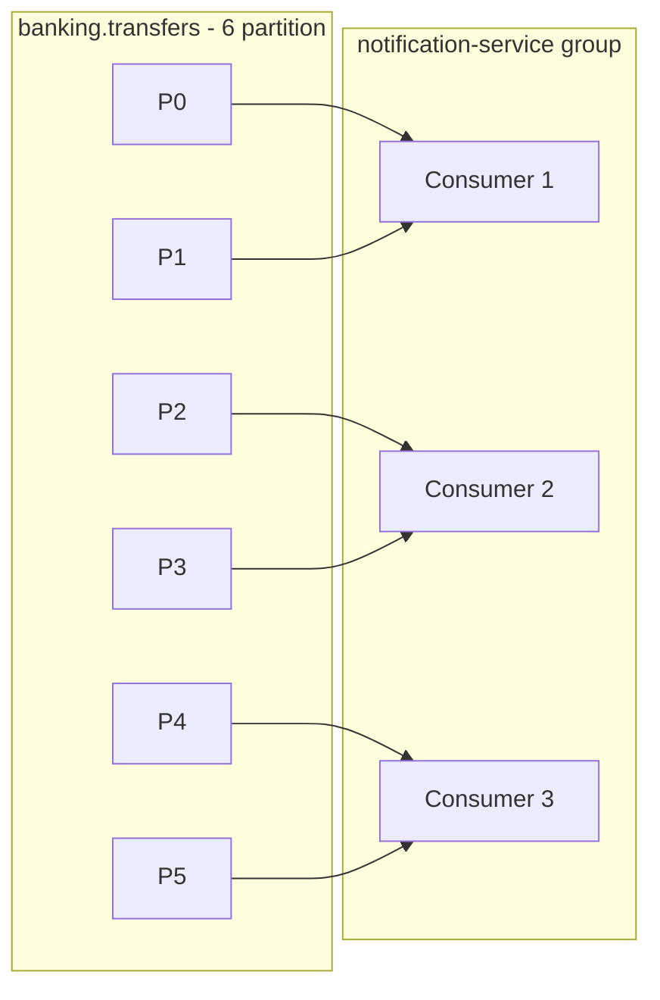
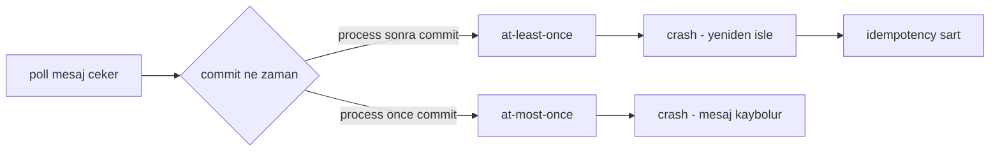
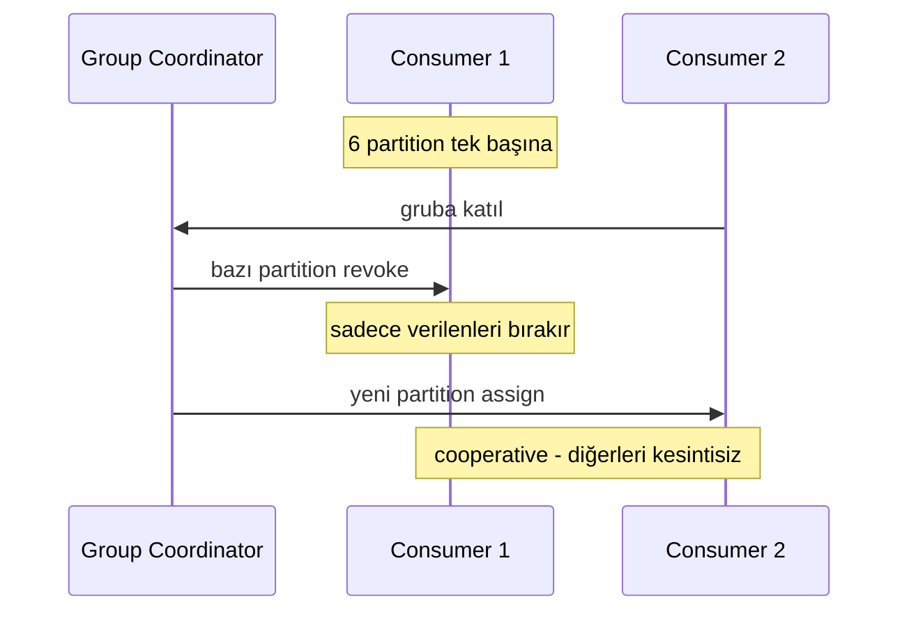
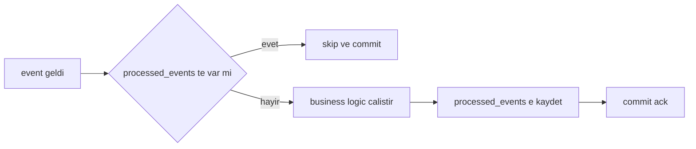

# Topic 6.3 — Kafka Consumer Design

```admonish info title="Bu bölümde"
- Consumer group'un partition'ları nasıl paylaştığı, offset kavramı ve `__consumer_offsets` mekanizması
- Auto vs manual commit, at-least-once vs at-most-once — ve banking için neden manual commit şart
- Rebalancing (eager vs cooperative): consumer eklenip çıkınca partition reassignment sırasında ne olur
- Idempotent consumer pattern ile aynı event'i restart/rebalance/retry'da tek kez işlemek
- Exactly-once üçlüsü, DefaultErrorHandler + DLT, concurrency kuralı ve poison message
```

## Hedef

Kafka consumer'ı banking-grade seviyede konfigüre etmek. Consumer group dynamics, offset management, rebalancing, exactly-once delivery, idempotent consumer pattern ve isolation level'ı sebep-sonuç olarak kavramak. Banking notification/audit/fraud consumer'larını **veri kaybı ve duplicate olmadan** çalıştırabilmek.

## Süre

Okuma: 2 saat • Kendini Sına: 45 dk • Pratik (opsiyonel): 3-4 saat • Toplam: ~2.5 saat (+ pratik)

## Önbilgi

- Topic 6.1 + 6.2 bitti — Kafka architecture + producer biliyorsun
- Spring Kafka `@KafkaListener` basic seviyede gördün
- Phase 1'in transfer/account domain'i hazır

---

## Kavramlar

### 1. Consumer ne yapar — poll döngüsü

Consumer'ın tüm hayatı tek bir döngüde geçer; bu döngüyü anlamadan offset ve rebalancing kavramları havada kalır. **Poll loop** consumer'ın kalp atışıdır:

```
Subscribe topics → broker'a "bu topic'leri tüketeceğim"
Group coordinator partition assignment yapar
poll() ile mesaj çek → process → commit offset → tekrar
```

Her `poll()` çağrısı hem mesaj çeker hem de "hâlâ hayattayım" sinyali taşır. Modern Kafka'da heartbeat ayrı bir background thread'den gider, ama poll'lar arası süre yine de canlılık ölçütüdür.

### 2. Consumer group — partition paylaşımı

Neden önemli: tek consumer 10 partition'lık bir topic'i kaldıramazsa, yükü nasıl bölersin? Cevap consumer group. **Group ID** aynı işi yapan consumer instance'larını bir takım yapar:

```yaml
spring:
  kafka:
    consumer:
      group-id: banking-notification-service
```

Aynı group içindeki consumer'lar partition'ları paylaşır; Kafka assignment'ı otomatik yapar. 6 partition'lık bir topic'i 3 instance şöyle böler:



<mark>Her partition aynı anda tek bir consumer'a atanır</mark> — bu kural hem load balancing'i hem de partition içi ordering garantisini sağlar.

Banking'de aynı topic'i 3 farklı service ayrı group olarak dinler; her event 3 yerde bağımsız işlenir:

```
Group "notification-service" → SMS gönderir
Group "audit-service"        → audit log yazar
Group "fraud-service"        → fraud score hesaplar
```

Her group kendi offset'ini tutar. Group A'nın nerede kaldığı Group B'yi hiç etkilemez.

### 3. Offset — consumer'ın yer imi

**Offset**, bir group'un belirli bir partition'da nereye kadar işlediğini gösteren yer imidir. Bu bilgi Kafka'da `__consumer_offsets` internal topic'inde saklanır:

```
banking.transfers / Partition 0:
  Messages: [m1, m2, m3, m4, m5, m6, m7]
  Group "notification-service" committed offset: 4
  → Bu group m5'ten devam eder
```

Kritik kural: consumer **commit etmediği sürece** restart'ta commit'li offset'ten yeniden başlar. Yani "işledim ama commit etmedim" durumu her zaman yeniden işleme (duplicate) riskidir.

### 4. Offset commit stratejileri — delivery semantics

Commit'i ne zaman yaptığın, sistemin at-least-once mi at-most-once mı olduğunu belirler; banking'de bu seçim doğrudan "duplicate mi kayıp mı" sorusudur.



#### Auto commit — banking için yetersiz

```yaml
enable-auto-commit: true
auto-commit-interval-ms: 5000
```

Consumer her 5 saniyede son consume edilen offset'i otomatik commit eder. Sorun timing'in belirsizliğidir: crash anında commit edilmiş ama işlenmemiş mesajlar **kaybolur**, işlenmiş ama commit edilmemiş mesajlar restart'ta **duplicate** olur.

<mark>Banking event'lerinde `enable-auto-commit` her zaman kapalı olmalı</mark> — commit'i sen kontrol edeceksin.

#### Manual commit — process başarılıysa commit

```yaml
enable-auto-commit: false
listener:
  ack-mode: MANUAL_IMMEDIATE
```

Kural basit: önce işle, başarılıysa `ack.acknowledge()`. Fail olursa commit etme ve exception fırlat — sonraki poll'da mesaj yeniden gelir.

```java
@KafkaListener(topics = "banking.transfers", groupId = "notification-service")
public void consume(ConsumerRecord<String, TransferEvent> record, Acknowledgment ack) {
    try {
        notificationService.sendSms(record.value());
        ack.acknowledge();          // sadece başarılı sonrası commit
    } catch (Exception e) {
        log.error("Process failed", e);
        throw e;                    // commit YOK → yeniden consume (at-least-once)
    }
}
```

Bu **at-least-once delivery**'dir: mesaj en az bir kez işlenir, garantili kaybolmaz. Bedeli duplicate ihtimalidir — onu da idempotency ile kapatacağız (Bölüm 8).

#### Batch ack vs per-record

```yaml
listener:
  ack-mode: BATCH   # chunk sonrası tek commit — hızlı ama partial recovery zor
```

`MANUAL_IMMEDIATE` per-record commit yapar: yavaş ama her event kritik olduğunda doğru seçim. `BATCH` yüksek hacimli non-critical event (audit log) için uygundur; critical transfer notification için per-record kalır.

```admonish tip title="Async commit tuzağı"
`commitSync` yavaş ama güvenlidir. Async commit hızlıdır ama failure handling karmaşıklaşır: commit sırası garanti değildir, geç gelen bir async commit eski offset'i geri yazabilir. Banking pratiğinde per-record `MANUAL_IMMEDIATE` (sync) tercih edilir.
```

### 5. `auto.offset.reset` — yeni consumer nereden başlar

Senaryo: yeni bir consumer group başlıyor, `__consumer_offsets`'te hiç kaydı yok. Nereden okumaya başlasın?

```yaml
auto-offset-reset: latest     # default — şu andan itibaren
auto-offset-reset: earliest   # topic'in başından, tüm tarih
auto-offset-reset: none       # kayıt yoksa exception fırlat
```

Banking'de seçim service'in doğasına bağlıdır:

- **Notification consumer** → `latest` (eski notification'ları tekrar gönderme)
- **Audit consumer** → `earliest` (her event mutlaka kaydedilmeli)
- **Production systems** → `none` (operator bilinçli karar versin)

```admonish warning title="Dikkat"
Production'da `earliest` ile yeni bir group başlatmak milyonlarca eski mesajı yeniden process eder: cost patlar, kullanıcılar spam alır. Yeni group açarken reset stratejisini bilinçli seç.
```

### 6. Consumer config — banking-grade

Parametreleri tek tek deşeceğiz ama önce tam yüzeyi bir kez gör:

```yaml
spring:
  kafka:
    consumer:
      group-id: banking-notification-service
      bootstrap-servers: kafka-1:9092,kafka-2:9092,kafka-3:9092
      key-deserializer: org.apache.kafka.common.serialization.StringDeserializer
      value-deserializer: org.springframework.kafka.support.serializer.JsonDeserializer
      enable-auto-commit: false
      auto-offset-reset: none
      max-poll-records: 100         # her poll'da max 100 mesaj
      max-poll-interval-ms: 300000  # 5 dk — bu süre içinde poll yoksa "dead"
      session-timeout-ms: 30000     # heartbeat timeout
      heartbeat-interval-ms: 10000  # heartbeat sıklığı (session/3)
      isolation-level: read_committed   # transactional producer için
      properties:
        spring.json.trusted.packages: "com.mavibank.banking.events"
        partition.assignment.strategy: org.apache.kafka.clients.consumer.CooperativeStickyAssignor
    listener:
      ack-mode: MANUAL_IMMEDIATE
      concurrency: 5                # 5 thread per @KafkaListener
```

Anahtar parametreler:

- **`max.poll.interval.ms`:** İki poll arası izin verilen max süre. Aşılırsa coordinator "consumer öldü" der ve **rebalance** tetiklenir. Listener method uzun sürüyorsa bu değeri artır ya da işi async'e taşı.
- **`session.timeout.ms`:** Heartbeat ile dead detection (background). Genelde `max.poll.interval.ms`'tan kısadır.
- **`heartbeat.interval.ms`:** Heartbeat sıklığı; `session.timeout.ms / 3` önerilir.
- **`max.poll.records`:** Tek poll'da kaç mesaj. Yüksek = throughput, düşük = daha ince recovery granularity.

### 7. Rebalancing — partition yeniden atama

Consumer eklenir, çıkar veya crash olursa partition'lar yeniden dağıtılır; bu **rebalancing**'dir. Nasıl yapıldığı, rebalance sırasında sistemin durup durmadığını belirler.

#### Eager rebalancing (eski default)

Coordinator "stop the world" sinyali verir, **tüm** consumer'lar partition'larını bırakır, reassign olur ve herkes yeniden başlar. Bu STW süresince hiçbir consumer process yapmaz — yüksek throughput'ta lag patlar.

#### Cooperative rebalancing (Kafka 2.4+)

```yaml
partition.assignment.strategy: org.apache.kafka.clients.consumer.CooperativeStickyAssignor
```

Yeni bir consumer katıldığında sadece **gereken** partition'lar revoke edilip yeniden atanır; geri kalanlar kesintisiz devam eder. Incremental rebalance:



**Banking standard:** Cooperative her zaman tercih edilir; STW'yi minimize eder. Rebalance sırasında işlenmekte olan mesaj commit edilmeden partition el değiştirirse yeni sahip onu yeniden işler — yani rebalance de bir duplicate kaynağıdır ve idempotency'yi zorunlu kılar.

### 8. Idempotent consumer pattern — banking şart

Motivasyon net: aynı transfer event'i iki kez işlenirse müşteriye iki SMS gider, ya da daha kötüsü çift kayıt oluşur. Restart, rebalance ve retry'ın üçü de duplicate üretir; çözüm **idempotency**'dir.

Çözümün özü bir "işlenmiş event" tablosu tutmak: event işlenmeden önce tabloya bak, işledikten sonra aynı transaction'da kaydet.



Tablo şeması `consumer_group` bazlı unique tutar; aynı event farklı group'larda ayrı ayrı işlenebilir ama her group'ta bir kez:

```sql
CREATE TABLE processed_events (
    event_id        UUID NOT NULL,
    consumer_group  VARCHAR(100) NOT NULL,
    processed_at    TIMESTAMP WITH TIME ZONE NOT NULL DEFAULT NOW(),
    UNIQUE (event_id, consumer_group)
);

CREATE INDEX idx_processed_cleanup ON processed_events(processed_at);
```

Consumer önce idempotency check yapar; event zaten işlenmişse business logic'e hiç girmeden commit edip çıkar:

```java
@KafkaListener(topics = "banking.transfers", groupId = "notification-service",
    containerFactory = "kafkaListenerContainerFactory")
@Transactional
public void consume(@Payload TransferEvent event, Acknowledgment ack) {
    UUID eventId = event.getId();
    if (processedRepo.existsByEventIdAndConsumerGroup(eventId, "notification-service")) {
        log.info("Duplicate event skipped: {}", eventId);
        ack.acknowledge();       // commit et, tekrar işleme
        return;
    }
```

Yeni event ise business logic çalışır ve **aynı transaction içinde** processed kaydı atılır; `@Transactional` sayesinde ya ikisi de olur ya hiçbiri:

```java
    try {
        notificationService.sendSms(event);
        processedRepo.save(new ProcessedEvent(eventId, "notification-service", Instant.now()));
        ack.acknowledge();
    } catch (Exception e) {
        log.error("Failed to process: {}", eventId, e);
        throw e;                 // commit YOK → sonraki poll'da retry
    }
}
```

Garanti: per consumer-group, her `event_id` **bir kez** işlenir. At-least-once delivery + idempotency = pratikte exactly-once processing.

<details>
<summary>Tam kod: TransferNotificationConsumer + cleanup (~45 satır)</summary>

```java
@Component
@Slf4j
public class TransferNotificationConsumer {

    private final ProcessedEventRepository processedRepo;
    private final NotificationService notificationService;

    @KafkaListener(
        topics = "banking.transfers",
        groupId = "notification-service",
        containerFactory = "kafkaListenerContainerFactory"
    )
    @Transactional
    public void consume(
        @Payload TransferEvent event,
        @Header(KafkaHeaders.RECEIVED_PARTITION) int partition,
        @Header(KafkaHeaders.OFFSET) long offset,
        Acknowledgment ack
    ) {
        log.debug("Received: id={}, partition={}, offset={}", event.getId(), partition, offset);

        UUID eventId = event.getId();
        if (processedRepo.existsByEventIdAndConsumerGroup(eventId, "notification-service")) {
            log.info("Duplicate event skipped: {}", eventId);
            ack.acknowledge();
            return;
        }

        try {
            notificationService.sendSms(event);
            processedRepo.save(new ProcessedEvent(eventId, "notification-service", Instant.now()));
            ack.acknowledge();
            log.debug("Processed: {}", eventId);
        } catch (Exception e) {
            log.error("Failed to process: {}", eventId, e);
            throw e;   // NO commit → retry on next poll
        }
    }
}

// Cleanup — eski kayıtları TTL ile temizle (7-30 gün)
@Scheduled(cron = "0 0 4 * * *")
public void cleanupOldProcessedEvents() {
    int deleted = processedRepo.deleteByProcessedAtBefore(
        Instant.now().minus(30, ChronoUnit.DAYS));
    log.info("Cleaned up {} old processed events", deleted);
}
```

</details>

### 9. Exactly-once delivery — 3 koşul

"Kafka exactly-once yapar" cümlesi eksiktir; exactly-once tek bir ayar değil, üç parçanın birlikte çalışmasıdır:

1. **Producer transactional** (Topic 6.2)
2. **Consumer `isolation.level=read_committed`** — abort edilmiş transaction'ın mesajlarını görme
3. **Idempotent consumer** (Bölüm 8 pattern'i)

<mark>Exactly-once end-to-end = producer transactional + read_committed + idempotent consumer, üçü birden</mark>. Banking'de bu kombinasyon şarttır.

```yaml
spring:
  kafka:
    producer:
      transactional-id-prefix: tx-
      acks: all
      properties:
        enable.idempotence: true
    consumer:
      isolation-level: read_committed
```

### 10. Error handling — DefaultErrorHandler + DLT

İşlenemeyen bir mesaj sonsuza retry edilirse consumer o partition'da takılır ve arkasındaki tüm mesajlar bekler. Çözüm **Dead Letter Topic (DLT)**: N retry sonrası mesajı ayrı bir topic'e at, akış devam etsin.

Önce recoverer ve backoff'u tanımla — recoverer başarısız mesajı `topic.DLT`'ye yollar:

```java
@Bean
public DefaultErrorHandler errorHandler(KafkaTemplate<String, Object> template) {
    DeadLetterPublishingRecoverer recoverer = new DeadLetterPublishingRecoverer(template,
        (record, ex) -> new TopicPartition(record.topic() + ".DLT", record.partition()));

    DefaultErrorHandler handler = new DefaultErrorHandler(
        recoverer,
        new ExponentialBackOffWithMaxRetries(3)   // 3 retry: 1s, 2s, 4s
    );
```

Sonra hangi exception'ın retry'lanıp hangisinin direkt DLT'ye gideceğini ayır. Bozuk veri (invalid event) retry'lamaya değmez, transient hata (DB timeout) değer:

```java
    handler.addNotRetryableExceptions(
        InvalidEventException.class,
        IllegalArgumentException.class,
        JsonProcessingException.class);
    handler.addRetryableExceptions(
        TransientDataAccessException.class,
        ResourceAccessException.class);
    return handler;
}
```

Handler'ı listener factory'e bağla:

```java
@Bean
public ConcurrentKafkaListenerContainerFactory<String, Object> kafkaListenerContainerFactory(
        ConsumerFactory<String, Object> consumerFactory, DefaultErrorHandler errorHandler) {
    var factory = new ConcurrentKafkaListenerContainerFactory<String, Object>();
    factory.setConsumerFactory(consumerFactory);
    factory.setConcurrency(5);
    factory.setCommonErrorHandler(errorHandler);
    factory.getContainerProperties().setAckMode(AckMode.MANUAL_IMMEDIATE);
    return factory;
}
```

DLT'ye düşen mesajlar boşa gitmemeli — bir monitoring consumer'ı bunları kaydeder ve operatörü uyarır:

```java
@KafkaListener(topics = "banking.transfers.DLT", groupId = "dlt-monitor")
public void onDlt(ConsumerRecord<String, String> record) {
    log.error("Message in DLT: topic={}, partition={}, offset={}",
        record.topic(), record.partition(), record.offset());
    dlqRepo.save(new DeadLetterRecord(record.topic(), record.partition(),
        record.offset(), record.value(), Instant.now()));
    notifier.alertOps("DLT message: " + record.topic());
}
```

### 11. Listener container concurrency

```yaml
listener:
  concurrency: 5   # tek @KafkaListener için 5 consumer thread
```

Her thread bir consumer instance'ıdır. <mark>concurrency değeri partition sayısını asla aşmamalı</mark> — fazla thread boşta bekler, kaynak israfı olur.

Banking örneği: 10 partition × concurrency 5 × 2 instance = 10 paralel consumer, her partition tam bir consumer'a düşer.

### 12. Production-grade consumer — tracing + metrics

Gerçek bir banking consumer'ı idempotency'ye ek olarak distributed tracing ve metrics taşır: her event'te `traceId` MDC'ye konur, success/duplicate/retry/dlt sayaçları tutulur, retryable ve non-retryable exception'lar ayrı ele alınır. Çekirdek mantık Bölüm 8 ile aynıdır; üstüne gözlemlenebilirlik eklenir.

<details>
<summary>Tam kod: production TransferNotificationConsumer (~60 satır)</summary>

```java
@Component
@Slf4j
public class TransferNotificationConsumer {

    private final ProcessedEventRepository processedRepo;
    private final NotificationService notificationService;
    private final MeterRegistry registry;

    @KafkaListener(
        topics = "banking.transfers",
        groupId = "notification-service",
        containerFactory = "transactionalKafkaListenerContainerFactory"
    )
    @Transactional
    public void consume(
        @Payload TransferEvent event,
        @Header(value = "X-Trace-Id", required = false) String traceId,
        @Header(KafkaHeaders.RECEIVED_PARTITION) int partition,
        @Header(KafkaHeaders.OFFSET) long offset,
        Acknowledgment ack
    ) {
        Timer.Sample sample = Timer.start(registry);
        MDC.put("traceId", traceId != null ? traceId : "no-trace");
        MDC.put("eventId", event.getId().toString());

        try {
            log.debug("Received transfer event: partition={}, offset={}", partition, offset);

            if (processedRepo.existsByEventIdAndConsumerGroup(event.getId(), "notification-service")) {
                log.warn("Duplicate event skipped: {}", event.getId());
                registry.counter("consumer.duplicate.skipped", "topic", "banking.transfers").increment();
                ack.acknowledge();
                return;
            }

            notificationService.sendTransferNotification(event);
            processedRepo.save(new ProcessedEvent(event.getId(), "notification-service", Instant.now()));

            ack.acknowledge();
            registry.counter("consumer.success", "topic", "banking.transfers").increment();

        } catch (RetryableException e) {
            log.warn("Retryable error: {}", e.getMessage());
            registry.counter("consumer.retry", "topic", "banking.transfers").increment();
            throw e;   // DefaultErrorHandler retry yapacak
        } catch (InvalidEventException e) {
            log.error("Invalid event, sending to DLT: {}", event.getId(), e);
            registry.counter("consumer.dlt", "topic", "banking.transfers").increment();
            throw e;   // Direkt DLT (NotRetryableException listesinde)
        } finally {
            sample.stop(registry.timer("consumer.processing.duration", "topic", "banking.transfers"));
            MDC.clear();
        }
    }
}
```

</details>

### 13. Header propagation — distributed tracing

Producer'da set edilen header'lar (`X-Trace-Id`, `X-User-Id`) consumer'da okunmalı ki loglar aggregation'da tek bir request olarak korele olsun. Consumer bunları `@Header` ile alır ve MDC'ye koyar:

```java
@KafkaListener(...)
public void consume(
    @Payload TransferEvent event,
    @Header("X-Trace-Id") String traceId,
    @Header(value = "X-Tenant-Id", required = false) String tenantId
) {
    MDC.put("traceId", traceId);
    try {
        // ...
    } finally {
        MDC.clear();
    }
}
```

Banking pratiği: `traceId` her event'te zorunludur, MDC her zaman `finally`'de temizlenir (thread pool'da sızmaması için).

### 14. Consumer lifecycle — pause/resume

Bakım penceresinde consumer'ı durdurmak istersin ama grubu terk edip rebalance tetiklemeden. `pause()` tam bunu yapar: poll devam eder (grup üyeliği korunur) ama listener tetiklenmez.

```java
@Autowired
private KafkaListenerEndpointRegistry registry;

public void pauseNotificationConsumer() {
    registry.getListenerContainer("transferListener").pause();
}

public void resumeNotificationConsumer() {
    registry.getListenerContainer("transferListener").resume();
}
```

Bu bir backpressure mekanizmasıdır: downstream sistem (SMS gateway) yorulduğunda consumer'ı geçici durdurup nefes aldırırsın.

### 15. Banking anti-pattern'leri

Mülakatta "bu consumer'da ne yanlış?" sorusunun cephaneliği:

**1 — `enable-auto-commit: true` banking event'inde:** Commit timing belirsiz, veri kaybı veya duplicate. Manual commit kullan.

**2 — Idempotency check yok:** Retry ve rebalance duplicate SMS/audit/notification üretir. `processed_events` şart.

**3 — Listener method'da uzun iş:** Aşağıdaki gibi zincirlenmiş external call'lar `max.poll.interval.ms`'ı aşar ve gereksiz rebalance tetikler:

```java
@KafkaListener(topics = "banking.transfers")
public void consume(TransferEvent event) {
    smsGateway.send(event);   // 10 sn external call
    callBack.notify(event);   // 10 sn external call
    auditLog.write(event);    // DB call → toplam 25 sn, limit aşılır
}
```

Fix: event'i async executor'a at, ya da `max.poll.interval.ms`'ı artır (riskli).

**4 — DLT yok:** İşlenemeyen mesaj sonsuza retry, consumer takılır.

**5 — Cross-partition ordering varsayımı:** Partition'lar arası ordering YOKTUR. "Account A'nın event'i B'ninkinden önce gelir" varsayma; ordering sadece aynı partition içinde garantidir.

**6 — SerializationException sonsuz retry (poison message):** Bozuk JSON default deserializer'ı sonsuza patlatır. `ErrorHandlingDeserializer` ile delegate et; bozuk mesaj null olarak gelir ve DLT'ye gider.

```yaml
spring:
  kafka:
    consumer:
      value-deserializer: org.springframework.kafka.support.serializer.ErrorHandlingDeserializer
      properties:
        spring.deserializer.value.delegate.class: org.springframework.kafka.support.serializer.JsonDeserializer
```

**7 — `concurrency > partition count`:** Boşta consumer thread'leri, kaynak israfı.

---

## Önemli olabilecek araştırma kaynakları

- "Kafka: The Definitive Guide" — Chapter 4 (Consumers)
- Confluent consumer documentation
- Spring Kafka reference (DefaultErrorHandler, DLT, retryable topics)
- KIP-429 (incremental cooperative rebalancing)
- "Exactly-once Semantics in Apache Kafka" — Confluent blog
- Idempotent consumer pattern (Microservices Patterns, Chris Richardson)

---

## Kendini Sına

Aşağıdaki soruları önce **cevaba bakmadan** kendi cümlelerinle yanıtlamayı dene — hepsi TR bank mülakatlarında karşına çıkabilecek tarzda. Takıldığın soruda ilgili Kavramlar başlığına dön, sonra tekrar dene.

**S1. Bir topic 6 partition'a sahip, aynı group'ta 8 consumer instance çalışıyor. Ne olur? Kaç consumer aktif iş yapar?**

<details>
<summary>Cevabı göster</summary>

Her partition aynı anda tek bir consumer'a atanır, dolayısıyla en fazla 6 consumer aktif iş yapar; kalan 2 instance partition alamaz ve boşta bekler (idle). Bu israftır çünkü paralellik partition sayısıyla sınırlıdır.

Kural: bir group içinde etkin paralellik = min(consumer sayısı, partition sayısı). Daha fazla throughput istiyorsan önce partition sayısını artırman gerekir. Boştaki 2 consumer yine de değersiz değildir: bir aktif consumer crash olursa rebalance ile bir yedek devreye girer (hot standby).

</details>

**S2. Manual commit + at-least-once seçtin ama restart/rebalance duplicate üretiyor. Bu duplicate'i nasıl zararsız hale getirirsin?**

<details>
<summary>Cevabı göster</summary>

At-least-once garantisi mesajın kaybolmamasını sağlar ama duplicate'i engellemez — restart, rebalance ve retry aynı event'i tekrar getirebilir. Çözüm idempotent consumer pattern: `processed_events` tablosunda `(event_id, consumer_group)` unique tutulur.

Consumer önce bu tabloya bakar; event zaten işlenmişse business logic'e girmeden commit edip çıkar. Yeni event ise business logic ile processed kaydı **aynı `@Transactional` içinde** yazılır, böylece ikisi atomik olur. Sonuç: at-least-once delivery + idempotency = effective exactly-once processing. Aynı event her group'ta bir kez işlenir.

</details>

**S3. Rebalancing sırasında tam olarak ne olur? İşlenmekte olan bir mesaj varsa ona ne olur?**

<details>
<summary>Cevabı göster</summary>

Rebalancing, consumer eklendiğinde/çıktığında/crash olduğunda partition'ların yeniden dağıtılmasıdır. Eager stratejide coordinator "stop the world" yapar — tüm consumer'lar partition'larını bırakır, reassign olur, herkes yeniden başlar; bu süre boyunca hiç process olmaz. Cooperative (CooperativeStickyAssignor) stratejisinde sadece gereken partition'lar revoke edilir, geri kalanlar kesintisiz devam eder.

Kritik nokta: bir partition, üzerindeki mesaj commit edilmeden el değiştirirse, yeni sahip o mesajı commit'li offset'ten yeniden işler — yani rebalance bir duplicate kaynağıdır. Bu yüzden idempotency rebalancing'de de zorunludur. Banking'de her zaman cooperative tercih edilir, STW'yi minimize eder.

</details>

**S4. Exactly-once delivery için hangi üç koşulun birlikte sağlanması gerekir?**

<details>
<summary>Cevabı göster</summary>

Üçü birden: (1) producer transactional (transactional-id + `enable.idempotence=true` + `acks=all`), (2) consumer `isolation.level=read_committed` — abort edilmiş transaction'ların mesajlarını görmez, (3) idempotent consumer — `processed_events` ile duplicate'i emer.

Tek başına hiçbiri yetmez: sadece producer transactional olursa consumer yine duplicate işleyebilir; sadece read_committed olursa retry duplicate'ini engellemez. Üçü birlikte end-to-end exactly-once verir. Banking'de bu kombinasyon standarttır.

</details>

**S5. `auto.offset.reset` üç değeri ne yapar? Notification ve audit consumer'ı için hangisini seçersin, neden?**

<details>
<summary>Cevabı göster</summary>

Değerler yalnızca group'un commit'li offset'i yokken devreye girer: `latest` şu andan itibaren okur (eski mesajları atlar), `earliest` topic'in başından tüm tarihi okur, `none` kayıt yoksa exception fırlatır.

Notification consumer için `latest`: eski notification'ları yeniden gönderip müşteriyi spam'lememek gerekir. Audit consumer için `earliest`: hiçbir event kaçmamalı, tüm tarih kaydedilmeli. Production'da genelde `none` tercih edilir ki yeni group yanlışlıkla milyonlarca eski mesajı işlemesin; reset kararını operator bilinçli versin.

</details>

**S6. Bir mesaj sürekli fail ediyor ve consumer o partition'da takıldı. Bu poison message problemini nasıl çözersin?**

<details>
<summary>Cevabı göster</summary>

İki ayrı senaryo var. Business logic sürekli fail ediyorsa DefaultErrorHandler + DeadLetterPublishingRecoverer kur: N retry (örn. 3, exponential backoff) sonrası mesaj `topic.DLT`'ye gider, akış devam eder. Retryable (DB timeout) ve non-retryable (invalid event) exception'ları ayır ki bozuk veri boşuna retry yemesin.

Deserialization fail ediyorsa (bozuk JSON) `ErrorHandlingDeserializer` kullan; delegate deserializer patlarsa mesaj null olarak listener'a gelir ve error handler DLT'ye atar. DLT'yi de bir monitoring consumer ile dinle, operatörü uyar. Aksi halde poison message consumer'ı sonsuza kilitler.

</details>

**S7. Listener method'un içinde 25 saniye süren external call'lar var ve consumer sürekli rebalance oluyor. Sebep ve çözüm nedir?**

<details>
<summary>Cevabı göster</summary>

Sebep `max.poll.interval.ms`'ın aşılması. İki poll arası bu süreyi (default 5 dk, ama uzun external call'larla dolabilir) geçerse coordinator consumer'ı "dead" sayar ve rebalance tetikler; consumer tekrar katılır, işlem yarım kalır, döngü tekrarlar.

En temiz çözüm ağır işi listener'dan çıkarmak: event'i bir async executor'a at, commit'i işe göre yönet. Alternatif olarak `max.poll.interval.ms`'ı artırmak veya `max.poll.records`'ı düşürmek (her poll'da daha az mesaj → döngü daha sık) yardımcı olur ama semptomu tedavi eder. Genel kural: listener kısa olmalı, uzun/external iş TX ve poll döngüsü dışında yapılmalı.

</details>

---

## Tamamlama kriterleri

- [ ] Consumer group'un partition'ları nasıl paylaştığını ve "partition başına tek consumer" kuralını anlatabiliyorum
- [ ] Offset kavramını, `__consumer_offsets`'i ve commit'siz restart'ın neden duplicate ürettiğini açıklayabiliyorum
- [ ] Auto vs manual commit farkını, at-least-once vs at-most-once'ı banking kararıyla söyleyebilirim
- [ ] Eager vs cooperative rebalancing farkını ve rebalance sırasında mesaja ne olduğunu biliyorum
- [ ] Idempotent consumer pattern'i (`processed_events` + same-TX kaydı) tahtada çizebilirim
- [ ] Exactly-once üçlüsünü (producer transactional + read_committed + idempotent) sayabiliyorum
- [ ] DefaultErrorHandler + DLT ve retryable/non-retryable ayrımını açıklayabiliyorum
- [ ] `concurrency <= partition count` kuralını ve poison message çözümünü biliyorum
- [ ] (Opsiyonel) "Pratik yapmak istersen" bölümündeki testleri yazdım ve Claude-verify prompt'uyla doğrulattım

---

## Defter notları

1. "Consumer group + partition assignment mekanizması (`__consumer_offsets` topic): ____."
2. "Auto-commit vs manual commit banking için karar: ____."
3. "At-least-once delivery + idempotent consumer → effective exactly-once: ____."
4. "Exactly-once için 3 koşul (producer tx + read_committed + idempotent): ____."
5. "Cooperative vs eager rebalancing STW impact: ____."
6. "max.poll.interval.ms processing süresine göre ayar: ____."
7. "DefaultErrorHandler retry + DLT pattern banking: ____."
8. "ErrorHandlingDeserializer poison message için: ____."
9. "processed_events tablosu + cleanup retention: ____."
10. "Header propagation (X-Trace-Id) distributed tracing rolü: ____."

```admonish success title="Bölüm Özeti"
- Consumer group partition'ları paylaşır; her partition tek consumer'a düşer, etkin paralellik partition sayısıyla sınırlıdır
- Offset her group için ayrı tutulur (`__consumer_offsets`); commit'siz restart daima yeniden işleme (duplicate) demektir
- Banking'de `enable-auto-commit=false` + `MANUAL_IMMEDIATE`: önce işle, başarılıysa commit — bu at-least-once verir
- Idempotent consumer (`processed_events` + same-TX kaydı) restart/rebalance/retry duplicate'lerini emer; at-least-once + idempotency = effective exactly-once
- End-to-end exactly-once üç parçadır: producer transactional + consumer read_committed + idempotent consumer
- Cooperative rebalancing STW'yi minimize eder; DLT + ErrorHandlingDeserializer poison message'ın consumer'ı kilitlemesini önler; `concurrency <= partition count`
```

---

## Pratik yapmak istersen

Kavramları koda dökmek istersen aşağıdaki iki ek hazır: test yazma rehberi idempotency, exactly-once, DLT ve header propagation için TestContainers tabanlı örnek testler içerir; Claude-verify prompt'u ile yazdığın consumer kodunu banking-grade perspektiften denetletebilirsin.

<details>
<summary>Test yazma rehberi</summary>

### Test 6.3.1 — Consumer integration with TestContainers

```java
@SpringBootTest
@Testcontainers
@DirtiesContext
class TransferNotificationConsumerIT {

    @Container
    static KafkaContainer kafka = new KafkaContainer(
        DockerImageName.parse("confluentinc/cp-kafka:7.5.0"));

    @Container @ServiceConnection
    static PostgreSQLContainer<?> postgres = new PostgreSQLContainer<>("postgres:16");

    @DynamicPropertySource
    static void kafkaProps(DynamicPropertyRegistry registry) {
        registry.add("spring.kafka.bootstrap-servers", kafka::getBootstrapServers);
    }

    @Autowired KafkaTemplate<String, TransferEvent> template;
    @MockBean NotificationService notificationService;
    @Autowired ProcessedEventRepository processedRepo;

    @Test
    void shouldProcessEventAndStoreIdempotencyRecord() throws Exception {
        TransferEvent event = new TransferEvent(...);
        template.send("banking.transfers", event.getId().toString(), event).get();

        await().atMost(10, TimeUnit.SECONDS).untilAsserted(() -> {
            assertThat(processedRepo.existsByEventIdAndConsumerGroup(
                event.getId(), "notification-service")).isTrue();
        });

        verify(notificationService, times(1)).sendTransferNotification(event);
    }

    @Test
    void shouldNotProcessDuplicateEvent() throws Exception {
        TransferEvent event = new TransferEvent(...);

        // İlk gönderim
        template.send("banking.transfers", event.getId().toString(), event).get();
        await().atMost(10, SECONDS).untilAsserted(() ->
            verify(notificationService).sendTransferNotification(event));

        // İkinci gönderim — aynı event ID
        template.send("banking.transfers", event.getId().toString(), event).get();
        Thread.sleep(2000);

        // Hâlâ tek çağrı (idempotency çalışıyor)
        verify(notificationService, times(1)).sendTransferNotification(event);
    }

    @Test
    void shouldRetryAndSendToDlt() throws Exception {
        TransferEvent event = ...;
        doThrow(new TransientDataAccessException("DB timeout"))
            .when(notificationService).sendTransferNotification(any());

        template.send("banking.transfers", event.getId().toString(), event).get();

        // 3 retry
        await().atMost(15, SECONDS).untilAsserted(() ->
            verify(notificationService, times(3)).sendTransferNotification(any()));

        // DLT'de mesaj var mı?
        KafkaConsumer<String, String> dltConsumer = createTestConsumer("banking.transfers.DLT");
        ConsumerRecords<String, String> records = dltConsumer.poll(Duration.ofSeconds(5));
        assertThat(records).isNotEmpty();
    }
}
```

### Test 6.3.2 — Exactly-once integration

```java
@Test
void exactlyOnceShouldWork() throws Exception {
    UUID transferId = UUID.randomUUID();
    transactionalPublisher.publishMultipleAtomic(transferId);

    // Consumer (read_committed) tüm event'leri görür
    await().atMost(10, SECONDS).untilAsserted(() ->
        assertThat(processedRepo.existsByEventId(transferId)).isTrue());
    verify(notificationService, times(1)).sendTransferNotification(any());
}

@Test
void abortedTransactionShouldNotBeSeen() throws Exception {
    UUID transferId = UUID.randomUUID();

    // Transactional producer with rollback
    try {
        transactionalPublisher.publishMultipleWithFailure(transferId);
    } catch (Exception e) {
        // expected
    }
    Thread.sleep(3000);

    // Consumer görmemeli (read_committed abort'u atlar)
    assertThat(processedRepo.existsByEventId(transferId)).isFalse();
    verify(notificationService, never()).sendTransferNotification(any());
}
```

### Test 6.3.3 — Header propagation

```java
@Test
void shouldPropagateTraceId() throws Exception {
    UUID transferId = UUID.randomUUID();
    String traceId = "trace-abc-123";

    ProducerRecord<String, TransferEvent> record = new ProducerRecord<>(
        "banking.transfers", transferId.toString(), createEvent(transferId));
    record.headers().add("X-Trace-Id", traceId.getBytes(StandardCharsets.UTF_8));

    template.send(record).get();
    await().atMost(5, SECONDS).until(() -> consumerInvoked.get());

    // İşleme sırasında MDC set edildi mi?
    assertThat(capturedTraceIds).contains(traceId);
}
```

### Bonus — Rebalancing gözlemi

10 partition'lık bir topic, `concurrency=5`, tek instance başlat; logdan hangi thread'in hangi partition'a atandığını gör. Sonra ikinci instance'ı başlat: cooperative rebalancing ile cluster logunda incremental partition reassignment görünür — hiçbir mevcut partition gereksiz yere revoke edilmez.

### Bonus — Poison message deneyi

Producer'dan bilerek bozuk JSON gönder. Önce default `JsonDeserializer` ile: `SerializationException` consumer'ı o partition'da kilitler. Sonra `ErrorHandlingDeserializer` + delegate ile: bozuk mesaj null olarak gelir ve DLT'ye düşer, akış devam eder — farkı SQL/consumer logunda gözlemle.

</details>

<details>
<summary>Claude-verify prompt</summary>

```
Kafka consumer kodumu banking-grade kriterlere göre değerlendir. Eksikleri
işaretle, kod yazma:

1. Offset management:
   - enable-auto-commit=false mu?
   - ack-mode MANUAL_IMMEDIATE mi (per-record commit)?
   - Process fail olunca commit YAPILMIYOR mu (rethrow)?

2. Idempotency:
   - processed_events tablosu var mı (event_id + consumer_group unique)?
   - Consumer'da check-before-process pattern uygulanmış mı?
   - @Transactional ile process + record same TX mi?
   - Cleanup scheduled job var mı (TTL)?

3. Error handling:
   - DefaultErrorHandler + DeadLetterPublishingRecoverer setup'lı mı?
   - 3-5 retry exponential backoff?
   - addNotRetryableExceptions specific class'larla ayrılmış mı?
   - DLT consumer ile alert var mı?
   - ErrorHandlingDeserializer poison message için kullanılmış mı?

4. Exactly-once:
   - Producer transactional + consumer read_committed + idempotent üçü birden mi?
   - isolation-level: read_committed config'de mi?

5. Rebalancing:
   - CooperativeStickyAssignor kullanılmış mı (eager DEĞİL)?
   - max.poll.interval.ms processing süresinden büyük mü?
   - session.timeout.ms / heartbeat.interval.ms doğru orantıda mı (~3:1)?

6. Concurrency:
   - concurrency partition count'tan küçük veya eşit mi?

7. Header propagation:
   - X-Trace-Id consumer'da okunup MDC'ye konuyor mu?
   - MDC finally'de temizleniyor mu (thread pool sızıntısı)?

8. Banking patterns:
   - 3 ayrı service için 3 ayrı group-id (notification, audit, fraud)?
   - PII consumer loglarında görünüyor mu? (Görünmemeli)
   - Metrics (success/failure/duplicate/dlt) sayılıyor mu?

9. Anti-pattern:
   - auto-commit=true banking event'inde?
   - Listener method'da uzun/external iş (max.poll.interval aşılır)?
   - DLT yok mu?
   - SerializationException sonsuz retry riski?
   - concurrency > partition count?
   - Cross-partition ordering varsayımı?

10. Test:
    - TestContainers KafkaContainer + PostgreSQLContainer?
    - Idempotency test (same event 2 kez → 1 process)?
    - Retry → DLT test?
    - Transactional rollback → consumer not see test?

Her madde için PASS / FAIL / EKSIK işaretle, kanıt göster, kod yazma.
```

</details>
