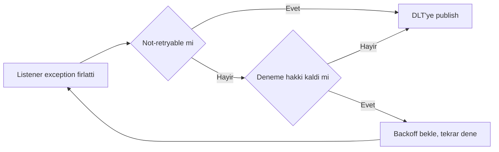
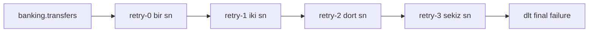
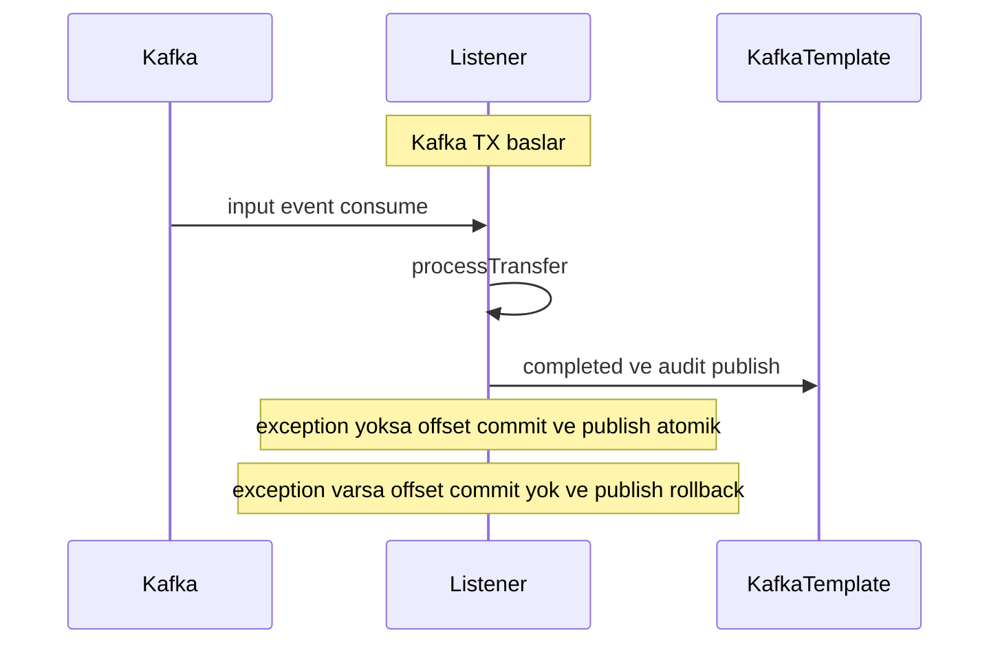

# Topic 6.4 — Spring Kafka Integration Deep

```admonish info title="Bu bölümde"
- Spring Kafka'nın katmanlı mimarisi: `@KafkaListener`, `KafkaTemplate`, `ConcurrentKafkaListenerContainerFactory` neyi soyutlar
- Manual vs auto ack, concurrency, batch listener — production-grade container config
- `DefaultErrorHandler` + `DeadLetterPublishingRecoverer` ile retry, backoff ve DLT (Dead Letter Topic) routing
- `@RetryableTopic` ile non-blocking retry: main consumer'ı bloklamadan hata yönetimi
- Transactional listener (read-process-write), lifecycle control ve banking anti-pattern'leri
```

## Hedef

Spring Kafka abstraction'ını derinlemesine öğrenmek: `@KafkaListener`, `ConcurrentKafkaListenerContainerFactory`, error handler, `@RetryableTopic`, batch listener, transactional listener ve lifecycle control. Banking event-driven mimaride production-grade Spring Kafka setup'ını hatasız kurabilmek.

## Süre

Okuma: 1.5 saat • Kendini Sına: 30 dk • Pratik (opsiyonel): 3 saat • Toplam: ~2 saat (+ pratik)

## Önbilgi

- Topic 6.1-6.3 bitti (Kafka arch, producer, consumer)
- Spring Boot + `KafkaTemplate` aşinasın
- `@KafkaListener`'ı temel seviyede gördün

---

## Kavramlar

### 1. Spring Kafka katmanları

Neden önemli: hangi sorunu Spring'in çözdüğünü, hangisini senin çözmen gerektiğini bilmeden config yazarsan ya çok az ya çok fazla kod yazarsın.

**Spring Kafka**, ham Apache Kafka client'ının üzerine bir soyutlama katmanıdır. Senin `@KafkaListener` yazdığın kodla broker arasında birkaç katman durur:


Spring bu katmanla şunları sağlar: container lifecycle (start/stop/pause), Spring transaction entegrasyonu, error handling + retry policy, annotation-based listener programlama, container concurrency ve DLT publishing. Senin işin bu mekanizmaları doğru **konfigüre** etmek.

### 2. Configuration deep

Neden önemli: banking'de default config veri kaybı veya duplicate demektir; her factory'yi bilinçli kurman gerekir.

`ProducerFactory` idempotence ve `acks=all` ile "kayıpsız + duplicate'siz" publish garantisi verir:

```java
@Bean
public ProducerFactory<String, Object> producerFactory(KafkaProperties properties) {
    Map<String, Object> props = properties.buildProducerProperties();
    props.put(ProducerConfig.ENABLE_IDEMPOTENCE_CONFIG, true);
    props.put(ProducerConfig.ACKS_CONFIG, "all");
    return new DefaultKafkaProducerFactory<>(props);
}
```

`ConsumerFactory`'de kritik iki ayar: auto-commit kapalı (offset'i biz yöneteceğiz) ve `read_committed` (yalnızca commit olmuş transactional mesajları oku):

```java
@Bean
public ConsumerFactory<String, Object> consumerFactory(KafkaProperties properties) {
    Map<String, Object> props = properties.buildConsumerProperties();
    props.put(ConsumerConfig.ENABLE_AUTO_COMMIT_CONFIG, false);
    props.put(ConsumerConfig.ISOLATION_LEVEL_CONFIG, "read_committed");
    return new DefaultKafkaConsumerFactory<>(props);
}
```

`ContainerFactory` her şeyi bir araya getirir: concurrency (kaç thread), ack mode ve error handler. **`AckMode.MANUAL_IMMEDIATE`** offset commit'i tamamen senin `ack.acknowledge()` çağrına bağlar.

```java
@Bean
public ConcurrentKafkaListenerContainerFactory<String, Object> kafkaListenerContainerFactory(
        ConsumerFactory<String, Object> cf, DefaultErrorHandler errorHandler) {
    ConcurrentKafkaListenerContainerFactory<String, Object> factory =
        new ConcurrentKafkaListenerContainerFactory<>();
    factory.setConsumerFactory(cf);
    factory.setConcurrency(5);
    factory.getContainerProperties().setAckMode(AckMode.MANUAL_IMMEDIATE);
    factory.setCommonErrorHandler(errorHandler);
    factory.getContainerProperties().setMicrometerEnabled(true);
    return factory;
}
```

<details>
<summary>Tam kod: KafkaConfig (~40 satır)</summary>

```java
@Configuration
@EnableKafka
public class KafkaConfig {

    @Bean
    public ProducerFactory<String, Object> producerFactory(KafkaProperties properties) {
        Map<String, Object> props = properties.buildProducerProperties();
        props.put(ProducerConfig.ENABLE_IDEMPOTENCE_CONFIG, true);
        props.put(ProducerConfig.ACKS_CONFIG, "all");
        return new DefaultKafkaProducerFactory<>(props);
    }

    @Bean
    public KafkaTemplate<String, Object> kafkaTemplate(ProducerFactory<String, Object> pf) {
        return new KafkaTemplate<>(pf);
    }

    @Bean
    public ConsumerFactory<String, Object> consumerFactory(KafkaProperties properties) {
        Map<String, Object> props = properties.buildConsumerProperties();
        props.put(ConsumerConfig.ENABLE_AUTO_COMMIT_CONFIG, false);
        props.put(ConsumerConfig.ISOLATION_LEVEL_CONFIG, "read_committed");
        return new DefaultKafkaConsumerFactory<>(props);
    }

    @Bean
    public ConcurrentKafkaListenerContainerFactory<String, Object> kafkaListenerContainerFactory(
            ConsumerFactory<String, Object> cf, DefaultErrorHandler errorHandler) {
        ConcurrentKafkaListenerContainerFactory<String, Object> factory =
            new ConcurrentKafkaListenerContainerFactory<>();
        factory.setConsumerFactory(cf);
        factory.setConcurrency(5);
        factory.getContainerProperties().setAckMode(AckMode.MANUAL_IMMEDIATE);
        factory.setCommonErrorHandler(errorHandler);
        factory.getContainerProperties().setMicrometerEnabled(true);
        return factory;
    }
}
```

</details>

<mark>Production'da container factory'yi default config ile bırakma; ack mode (BATCH default'tur) ve auto-commit'i her zaman explicit ver.</mark>

### 3. `@KafkaListener` annotation

Neden önemli: bu annotation Spring Kafka'nın kalbi; `id`, `containerFactory` ve header binding'ini bilmeyen runtime'da consumer'ı yönetemez.

`id` parametresi listener'ı runtime'da durdurup başlatmak için isim verir; `containerFactory` hangi config'in kullanılacağını seçer. Method parametrelerine `@Payload` ve `@Header` ile mesaj + metadata inject edilir:

```java
@Component
public class TransferConsumer {

    @KafkaListener(
        id = "transferListener",                            // runtime control için bean adı
        topics = "banking.transfers",
        groupId = "notification-service",
        containerFactory = "kafkaListenerContainerFactory",
        concurrency = "5",                                  // listener başına 5 thread
        autoStartup = "${kafka.consumer.autostartup:true}"  // env-based start
    )
    public void consume(
        @Payload TransferEvent event,
        @Header(KafkaHeaders.RECEIVED_TOPIC) String topic,
        @Header(KafkaHeaders.RECEIVED_PARTITION) int partition,
        @Header(KafkaHeaders.OFFSET) long offset,
        @Header(value = "X-Trace-Id", required = false) String traceId,
        Acknowledgment ack
    ) {
        // process
        ack.acknowledge();
    }
}
```

`Acknowledgment ack` parametresi yalnızca manual ack mode'da anlamlıdır — `ack.acknowledge()` çağrılmadan offset commit olmaz.

### 4. Multi-topic ve pattern listener

Bir listener birden çok topic dinleyebilir; audit gibi servisler için pratiktir:

```java
@KafkaListener(topics = {"banking.transfers", "banking.payments", "banking.refunds"},
    groupId = "audit-service")
public void auditMultiple(@Payload Object event, @Header("X-Source") String source) {
    auditService.log(source, event);
}
```

Ya da regex `topicPattern` ile tüm banking topic'lerini yakala:

```java
@KafkaListener(topicPattern = "banking\\..*", groupId = "global-audit")
public void wildcardConsumer(@Payload Object event) { }
```

```admonish warning title="Pattern listener tehlikesi"
`topicPattern` sonradan eklenen yeni topic'leri otomatik consume eder — farkında olmadan hassas bir topic'i global-audit'e sızdırabilirsin. Production'da explicit topic list tercih et; wildcard'ı yalnızca gerçekten "her şeyi dinle" istediğin altyapı servislerinde kullan.
```

### 5. Partition-specific listener

Neden önemli: banking'de VIP müşterileri belirli partition'lara yönlendirip özel consumer atamak yaygın bir izolasyon tekniğidir.

`topicPartitions` ile listener yalnızca seçili partition'lardan okur:

```java
@KafkaListener(
    groupId = "vip-customer-service",
    topicPartitions = @TopicPartition(
        topic = "banking.transfers",
        partitions = {"0", "1", "2"}   // sadece bu partition'lar
    )
)
public void vipTransfers(@Payload TransferEvent event) {
    // sadece partition 0-2'deki event'ler (VIP müşteriler)
}
```

Banking pattern: custom partitioner ile VIP customers → partition 0-2, normal → 3-9; specialized consumer.

### 6. Batch listener

Neden önemli: yüksek hacimli audit event'lerini tek tek işlemek DB roundtrip'ini katlar; batch listener throughput'u çarpar.

Container `batchListener = true` ile poll başına gelen tüm kayıtları `List` olarak verir; sen tek `saveAll` ile bulk insert yaparsın:

```java
@KafkaListener(topics = "banking.audit", groupId = "audit-service",
    containerFactory = "batchListenerContainerFactory")
public void batchConsume(
    List<AuditEvent> events,
    @Header(KafkaHeaders.RECEIVED_PARTITION) List<Integer> partitions,
    @Header(KafkaHeaders.OFFSET) List<Long> offsets,
    Acknowledgment ack
) {
    auditRepository.saveAll(events);   // tek batch'te 100 event
    ack.acknowledge();
}
```

Batch factory tek satır farkla ayrılır — `setBatchListener(true)`:

```java
@Bean
public ConcurrentKafkaListenerContainerFactory<String, Object> batchListenerContainerFactory(
        ConsumerFactory<String, Object> cf) {
    ConcurrentKafkaListenerContainerFactory<String, Object> factory =
        new ConcurrentKafkaListenerContainerFactory<>();
    factory.setConsumerFactory(cf);
    factory.setBatchListener(true);
    factory.setConcurrency(3);
    return factory;
}
```

Banking örnek: high-volume audit (100 event/poll) batch process → DB roundtrip azalır, throughput katlanır.

### 7. Reply — request/response over Kafka

Kafka üzerinden senkron istek/yanıt mümkündür: `@SendTo` ile listener'ın dönüş değeri otomatik response topic'ine gider.

```java
@KafkaListener(topics = "fraud.check.request", groupId = "fraud-service")
@SendTo("fraud.check.response")
public FraudResult check(@Payload FraudCheckRequest req) {
    return fraudService.calculate(req);
}
```

Client tarafı `ReplyingKafkaTemplate` ile gönderip yanıtı bekler:

```java
@Autowired ReplyingKafkaTemplate<String, FraudCheckRequest, FraudResult> template;

public FraudResult checkFraud(FraudCheckRequest req) throws Exception {
    ProducerRecord<String, FraudCheckRequest> record =
        new ProducerRecord<>("fraud.check.request", req);
    record.headers().add(KafkaHeaders.REPLY_TOPIC, "fraud.check.response".getBytes());
    RequestReplyFuture<String, FraudCheckRequest, FraudResult> future =
        template.sendAndReceive(record);
    return future.get(5, TimeUnit.SECONDS).value();
}
```

```admonish warning title="Sync request/response bir anti-pattern"
Kafka'da senkron istek/yanıt overhead ve ordering sorunu getirir: Kafka log-based bir sistemdir, RPC transport değil. Fraud check gibi gerçekten senkron ihtiyaçlar için HTTP veya gRPC daha doğrudur. `ReplyingKafkaTemplate`'i çok seyrek, bilinçli kullan.
```

### 8. `DefaultErrorHandler` — deep

Neden önemli: retry ve DLT mantığının merkezi burasıdır; yanlış kurulunca ya sonsuz retry ya sessiz veri kaybı olur.

**`DefaultErrorHandler`** iki parçadan oluşur: bir `DeadLetterPublishingRecoverer` (final failure'da mesajı nereye atacağı) ve bir backoff (retry aralıkları). Recoverer'a lambda vererek exception tipine göre custom DLT routing yaparsın:

```java
DeadLetterPublishingRecoverer recoverer = new DeadLetterPublishingRecoverer(template,
    (record, ex) -> {
        if (ex.getCause() instanceof JsonProcessingException) {
            return new TopicPartition("banking.poison", -1);   // poison mesajlar ayrı
        }
        return new TopicPartition(record.topic() + ".DLT", record.partition());
    });
```

Backoff exponential olur — 1s, 2s, 4s, 8s ve max 5 retry; `maxInterval` üst sınırı tutar:

```java
ExponentialBackOffWithMaxRetries backOff = new ExponentialBackOffWithMaxRetries(5);
backOff.setInitialInterval(1000L);
backOff.setMultiplier(2.0);
backOff.setMaxInterval(30000L);
DefaultErrorHandler handler = new DefaultErrorHandler(recoverer, backOff);
```

Hangi exception retry edilir, hangisi anında DLT'ye gider — bu ayrım hayatidir. Deserialization veya validation hataları retry edilmemeli (mesaj asla düzelmez), transient DB/network hataları retry edilmeli:

```java
handler.addNotRetryableExceptions(
    IllegalArgumentException.class, JsonProcessingException.class,
    InvalidEventException.class, DeserializationException.class);
handler.addRetryableExceptions(
    TransientDataAccessException.class, ResourceAccessException.class,
    TimeoutException.class);
```

Karar akışı özetle şöyle işler:



Bir `RetryListener` ile her denemeyi loglayıp metrik üretebilirsin — production observability için şart:

```java
handler.setRetryListeners((record, ex, deliveryAttempt) -> {
    log.warn("Retry attempt {} for record at offset {}", deliveryAttempt, record.offset());
    meterRegistry.counter("kafka.retry", "topic", record.topic()).increment();
});
```

<details>
<summary>Tam kod: errorHandler bean (~40 satır)</summary>

```java
@Bean
public DefaultErrorHandler errorHandler(KafkaTemplate<String, Object> template) {
    DeadLetterPublishingRecoverer recoverer = new DeadLetterPublishingRecoverer(template,
        (record, ex) -> {
            if (ex.getCause() instanceof JsonProcessingException) {
                return new TopicPartition("banking.poison", -1);   // poison mesajlar ayrı
            }
            return new TopicPartition(record.topic() + ".DLT", record.partition());
        });

    // Exponential backoff: 1s, 2s, 4s, 8s, max 5 retry
    ExponentialBackOffWithMaxRetries backOff = new ExponentialBackOffWithMaxRetries(5);
    backOff.setInitialInterval(1000L);
    backOff.setMultiplier(2.0);
    backOff.setMaxInterval(30000L);

    DefaultErrorHandler handler = new DefaultErrorHandler(recoverer, backOff);

    handler.addNotRetryableExceptions(
        IllegalArgumentException.class, JsonProcessingException.class,
        InvalidEventException.class, DeserializationException.class);

    handler.addRetryableExceptions(
        TransientDataAccessException.class, ResourceAccessException.class,
        TimeoutException.class);

    handler.setRetryListeners((record, ex, deliveryAttempt) -> {
        log.warn("Retry attempt {} for record at offset {}", deliveryAttempt, record.offset());
        meterRegistry.counter("kafka.retry", "topic", record.topic()).increment();
    });

    return handler;
}
```

</details>

### 9. `@RetryableTopic` — non-blocking retry

Neden önemli: `DefaultErrorHandler`'ın default retry'ı **blocking**'dir — listener thread'i retry süresi boyunca tıkanır. SMS gateway 30 sn timeout verirse main consumer 30 sn bekler ve consumer lag patlar.

**`@RetryableTopic`** bu sorunu çözer: başarısız mesajı ayrı bir retry topic'ine yazar, main consumer partition'ı okumaya devam eder. Retry, ayrı topic + ayrı consumer + ayrı thread'de gerçekleşir. `@DltHandler` de final failure'ı yakalar:

```java
@RetryableTopic(
    attempts = "4",
    backoff = @Backoff(delay = 1000, multiplier = 2.0, maxDelay = 30000),
    autoCreateTopics = "true",
    topicSuffixingStrategy = TopicSuffixingStrategy.SUFFIX_WITH_INDEX_VALUE,
    dltStrategy = DltStrategy.FAIL_ON_ERROR,
    exclude = {IllegalArgumentException.class, JsonProcessingException.class}
)
@KafkaListener(topics = "banking.transfers", groupId = "notification-service")
public void consume(@Payload TransferEvent event) {
    notificationService.sendSms(event);
}

@DltHandler
public void handleDlt(@Payload TransferEvent event,
        @Header(KafkaHeaders.ORIGINAL_TOPIC) String topic,
        @Header(KafkaHeaders.EXCEPTION_MESSAGE) String exMsg) {
    log.error("DLT: topic={}, event={}, error={}", topic, event, exMsg);
    dlqRepo.save(new DeadLetterRecord(event, topic, exMsg, Instant.now()));
}
```

Spring, retry ve DLT topic'lerini otomatik yaratır; mesaj başarısız oldukça zincirde ilerler:



```admonish tip title="Ne zaman @RetryableTopic"
External bağımlılığı olan (SMS, email, 3rd-party API) listener'larda non-blocking retry tercih et: main partition'ın consume'u hiç durmaz, retry ayrı topic'te sıra bekler. Saf DB retry'ı gibi kısa/hızlı işlerde blocking `DefaultErrorHandler` daha basit ve yeterlidir.
```

<mark>Blocking retry (DefaultErrorHandler) ile @RetryableTopic'i aynı listener'da karıştırma; overlapping retry kaotik olur, bir yöntem seç.</mark>

### 10. Transactional listener

Neden önemli: "input'u tüket, işle, output publish et" akışının atomik olması exactly-once stream processing'in temelidir.

`@Transactional("kafkaTransactionManager")` ile consume + publish tek Kafka transaction'ında birleşir. Exception fırlarsa input offset commit **olmaz** ve output publish **rollback** olur:

```java
@KafkaListener(topics = "banking.transfers", groupId = "transfer-orchestrator")
@Transactional("kafkaTransactionManager")
public void consume(@Payload TransferEvent event) {
    Transfer t = processTransfer(event);
    kafkaTemplate.send("banking.transfers.completed", t);   // aynı TX
    kafkaTemplate.send("banking.audit", t.toAudit());       // aynı TX
    // exception → input offset commit YOK + output publish ROLLBACK
}
```

Bu **read-process-write** deseni Kafka Streams'in (Topic 6.5) üzerine kurulduğu atomicity garantisidir:



### 11. Header propagation

Distributed tracing için trace/tenant/user id'leri header'dan alıp MDC'ye koyarsın; böylece log satırları context taşır. `finally` ile MDC temizliği şart, yoksa thread pool'da sızar:

```java
@KafkaListener(topics = "banking.transfers")
public void consume(@Payload TransferEvent event,
        @Header(value = "X-Trace-Id", required = false) String traceId,
        @Header(value = "X-Tenant-Id", required = false) String tenant,
        @Header(value = "X-User-Id", required = false) String userId) {
    MDC.put("traceId", traceId != null ? traceId : "no-trace");
    MDC.put("tenant", tenant);
    MDC.put("userId", userId);
    try {
        process(event);
    } finally {
        MDC.clear();
    }
}
```

Banking distributed tracing — Phase 1 traceId + Phase 9 OpenTelemetry entegrasyonu.

### 12. Listener lifecycle control

Neden önemli: bakım penceresi, incident response veya poison-message durumunda consumer'ı runtime'da durdurabilmen gerekir.

`KafkaListenerEndpointRegistry` ile `id`'si olan listener'ı bulup kontrol edersin. `pause()` poll'u sürdürür ama listener'ı çağırmaz; `stop()` tamamen durdurur:

```java
@Autowired KafkaListenerEndpointRegistry registry;

public void pauseTransferListener() {
    registry.getListenerContainer("transferListener").pause();
}
public void resumeTransferListener() {
    registry.getListenerContainer("transferListener").resume();
}
public void stopTransferListener() {
    registry.getListenerContainer("transferListener").stop();
}
```

Banking klasik senaryosu: gece bakım penceresinde scheduled task ile tüm consumer'ları duraklat, sonra devam ettir:

```java
@Component
public class MaintenanceWindowManager {

    @Autowired KafkaListenerEndpointRegistry registry;

    @Scheduled(cron = "0 0 3 * * *")   // 03:00
    public void enterMaintenance() {
        log.info("Entering maintenance window — pausing consumers");
        registry.getAllListenerContainers().forEach(c -> c.pause());
    }

    @Scheduled(cron = "0 0 4 * * *")   // 04:00
    public void exitMaintenance() {
        log.info("Exiting maintenance window — resuming consumers");
        registry.getAllListenerContainers().forEach(c -> c.resume());
    }
}
```

### 13. ContainerCustomizer

Container davranışını ince ayarlamak için `ContainerCustomizer` kullanılır — idle event aralığı, micrometer ve OpenTelemetry observation gibi cross-cutting ayarlar tek yerde:

```java
@Bean
public ContainerCustomizer<String, Object, ConcurrentMessageListenerContainer<String, Object>>
        containerCustomizer() {
    return container -> {
        ContainerProperties props = container.getContainerProperties();
        props.setIdleEventInterval(30000L);   // idle event her 30 sn
        props.setMicrometerEnabled(true);
        props.setObservationEnabled(true);     // OpenTelemetry tracing
    };
}
```

### 14. Banking pattern — full setup

Neden önemli: parçaları tek tek gördün; şimdi bir listener'da idempotency, header propagation, manual ack ve observability'nin birlikte nasıl durduğunu gör.

Consumer factory observability + manual ack ile kurulur:

```java
@Bean
public ConcurrentKafkaListenerContainerFactory<String, Object> kafkaListenerContainerFactory(
        ConsumerFactory<String, Object> cf, DefaultErrorHandler errorHandler) {
    ConcurrentKafkaListenerContainerFactory<String, Object> factory =
        new ConcurrentKafkaListenerContainerFactory<>();
    factory.setConsumerFactory(cf);
    factory.setConcurrency(5);
    factory.setCommonErrorHandler(errorHandler);
    ContainerProperties cp = factory.getContainerProperties();
    cp.setAckMode(AckMode.MANUAL_IMMEDIATE);
    cp.setObservationEnabled(true);
    cp.setMicrometerEnabled(true);
    return factory;
}
```

Listener'da **idempotent consumer** deseni: işlenmiş event'i `processed_events` tablosundan kontrol et, çift işlemeyi engelle, sonra ack ver:

```java
@KafkaListener(id = "transferListener", topics = "banking.transfers",
    groupId = "notification-service")
@Transactional
public void consume(@Payload TransferEvent event,
        @Header("X-Trace-Id") String traceId,
        @Header(KafkaHeaders.OFFSET) long offset, Acknowledgment ack) {
    MDC.put("traceId", traceId);
    try {
        if (processedRepo.existsByEventIdAndConsumerGroup(event.getId(), "notification-service")) {
            ack.acknowledge();
            return;   // duplicate — atla
        }
        notificationService.sendSms(event);
        processedRepo.save(new ProcessedEvent(event.getId(), "notification-service"));
        ack.acknowledge();
    } finally {
        MDC.clear();
    }
}
```

<details>
<summary>Tam kod: BankingKafkaConfig + TransferNotificationConsumer (~65 satır)</summary>

```java
@Configuration
@EnableKafka
public class BankingKafkaConfig {

    @Bean
    public KafkaTemplate<String, Object> kafkaTemplate(ProducerFactory<String, Object> pf) {
        KafkaTemplate<String, Object> template = new KafkaTemplate<>(pf);
        template.setObservationEnabled(true);   // Micrometer Tracing
        return template;
    }

    @Bean
    public ConcurrentKafkaListenerContainerFactory<String, Object> kafkaListenerContainerFactory(
            ConsumerFactory<String, Object> cf, DefaultErrorHandler errorHandler) {
        ConcurrentKafkaListenerContainerFactory<String, Object> factory =
            new ConcurrentKafkaListenerContainerFactory<>();
        factory.setConsumerFactory(cf);
        factory.setConcurrency(5);
        factory.setCommonErrorHandler(errorHandler);
        ContainerProperties cp = factory.getContainerProperties();
        cp.setAckMode(AckMode.MANUAL_IMMEDIATE);
        cp.setObservationEnabled(true);
        cp.setMicrometerEnabled(true);
        cp.setLogContainerConfig(true);
        return factory;
    }

    @Bean
    public ConcurrentKafkaListenerContainerFactory<String, Object> batchListenerContainerFactory(
            ConsumerFactory<String, Object> cf) {
        ConcurrentKafkaListenerContainerFactory<String, Object> factory =
            new ConcurrentKafkaListenerContainerFactory<>();
        factory.setConsumerFactory(cf);
        factory.setBatchListener(true);
        factory.setConcurrency(3);
        return factory;
    }
}

@Component
@Slf4j
public class TransferNotificationConsumer {

    private final NotificationService notificationService;
    private final ProcessedEventRepository processedRepo;

    @KafkaListener(id = "transferListener", topics = "banking.transfers",
        groupId = "notification-service")
    @Transactional
    public void consume(
        @Payload TransferEvent event,
        @Header("X-Trace-Id") String traceId,
        @Header(KafkaHeaders.RECEIVED_PARTITION) int partition,
        @Header(KafkaHeaders.OFFSET) long offset,
        Acknowledgment ack
    ) {
        MDC.put("traceId", traceId);
        try {
            if (processedRepo.existsByEventIdAndConsumerGroup(event.getId(), "notification-service")) {
                ack.acknowledge();
                return;
            }
            notificationService.sendSms(event);
            processedRepo.save(new ProcessedEvent(event.getId(), "notification-service"));
            ack.acknowledge();
        } finally {
            MDC.clear();
        }
    }
}
```

</details>

### 15. Banking anti-pattern'leri

Mülakatta "bu kodda ne yanlış?" cephaneliği burası.

**Anti-pattern 1 — Default container config production'da:** BATCH ack + auto-commit true → veri kaybı/duplicate. Banking için explicit config (Bölüm 2).

**Anti-pattern 2 — Listener'da exception swallow:**

```java
@KafkaListener(...)
public void consume(TransferEvent event) {
    try {
        process(event);
    } catch (Exception e) {
        log.error("error", e);   // swallow → error handler kapsamı dışında, DLT YOK
    }
}
```

```admonish warning title="Exception yutma = sessiz veri kaybı"
Exception'ı yutarsan `DefaultErrorHandler` hiç devreye girmez: ne retry olur ne DLT. Mesaj başarısız işlenmiş gibi görünür, offset commit olur ve olay kaybolur. Doğrusu: exception'ı rethrow et, error handler retry/DLT yapsın.
```

<mark>@KafkaListener method'unda exception'ı yutma; rethrow et ki error handler retry ve DLT yapabilsin.</mark>

**Anti-pattern 3 — Blocking + `@RetryableTopic` karışımı:** İkisi birden çalışır ama overlapping retry kaotiktir; bir yöntem seç.

**Anti-pattern 4 — Listener içinde uzun async başlatıp erken ack:**

```java
@KafkaListener
public void consume(TransferEvent event) {
    CompletableFuture.runAsync(() -> longTask(event));
    ack.acknowledge();   // commit before completion — future fail olursa kaybolur
}
```

<mark>Transaction veya async iş tamamlanmadan ack verme; işlem bittikten sonra commit et, yoksa fail eden mesaj sessizce kaybolur.</mark>

**Anti-pattern 5 — `ReplyingKafkaTemplate` (sync) HTTP yerine:** Overhead + ordering sorunu; HTTP/gRPC kullan.

**Anti-pattern 6 — Tüm topic'lere tek listener:** `@KafkaListener(topicPattern = ".*")` concurrency yönetimini karıştırır; topic group'ları için ayrı listener.

---

## Önemli olabilecek araştırma kaynakları

- Spring Kafka reference (current version 3.x)
- "Apache Kafka with Spring Boot 3" tutorial serisi
- Spring Kafka `@RetryableTopic` deep dive blog
- `ContainerProperties` ve `DefaultErrorHandler` JavaDoc + customization örnekleri
- Micrometer Tracing + Spring Kafka observation

---

## Kendini Sına

Aşağıdaki soruları önce **cevaba bakmadan** kendi cümlelerinle yanıtlamayı dene — hepsi TR bank mülakatlarında karşına çıkabilecek tarzda. Takıldığın soru olursa ilgili Kavramlar başlığına dön, sonra tekrar dene.

**S1. Spring Kafka'da manual ack ile auto ack arasındaki fark nedir? `AckMode.MANUAL_IMMEDIATE` ne zaman gerekir?**

<details>
<summary>Cevabı göster</summary>

Auto ack (default `BATCH` mode veya consumer'da `enable.auto.commit=true`) offset'i Spring/consumer'ın periyodik olarak, senin işleme mantığından bağımsız commit etmesi demektir — mesaj DB'ye yazılmadan offset ilerleyebilir, hata durumunda veri kaybı olur. Manual ack'te ise offset yalnızca sen `Acknowledgment.acknowledge()` çağırınca commit olur.

`AckMode.MANUAL_IMMEDIATE`, sen ack çağırdığın anda offset'i hemen commit eder (MANUAL, bir sonraki poll'a kadar bekletir). Banking'de "işi bitir, sonra ack ver" garantisi için manual mode şarttır: `enable.auto.commit=false` + `MANUAL_IMMEDIATE`. İşlem başarılıysa ack, exception fırlarsa ack verme → error handler devreye girer.

</details>

**S2. DLT (Dead Letter Topic) ne zaman devreye girer? Poison mesajı transient hatadan nasıl ayırırsın?**

<details>
<summary>Cevabı göster</summary>

DLT, bir mesaj tüm retry denemeleri tükendikten sonra hâlâ başarısızsa devreye girer — `DeadLetterPublishingRecoverer` mesajı `<topic>.DLT`'ye yazar. Ayrıca not-retryable olarak işaretlenmiş exception'lar hiç retry edilmeden anında DLT'ye gider.

Ayrım exception tipiyle yapılır: deserialization/validation hataları (JsonProcessingException, IllegalArgumentException) poison'dur — mesaj asla düzelmez, `addNotRetryableExceptions` ile anında DLT'ye (hatta ayrı bir `banking.poison` topic'ine) yönlendir. Transient hatalar (TransientDataAccessException, timeout) geçicidir — `addRetryableExceptions` ile backoff'lu retry, tükenince normal `.DLT`'ye. Recoverer'a lambda vererek bu custom routing'i yaparsın.

</details>

**S3. `DefaultErrorHandler`'da retry + backoff nasıl kurulur? Neden sabit değil de exponential backoff?**

<details>
<summary>Cevabı göster</summary>

`DefaultErrorHandler`'a bir `BackOff` verilir. `ExponentialBackOffWithMaxRetries(5)` ile initialInterval=1s, multiplier=2.0, maxInterval=30s vererek 1s→2s→4s→8s... şeklinde artan aralıklarla max 5 retry yaparsın. Recoverer da final failure'da DLT'ye yazar.

Exponential backoff, transient bir hatanın (örneğin geçici DB yükü veya network hiccup) toparlanması için giderek daha uzun süre tanır; sabit kısa aralıkla hemen tekrar denemek downstream'i daha da yorar (retry storm). `maxInterval` üst sınır koyar ki aralık sonsuza gitmesin. Not-retryable exception'lar bu döngüye hiç girmez, anında DLT'ye gider.

</details>

**S4. Default blocking retry ile `@RetryableTopic` non-blocking retry arasındaki fark nedir? Banking'de hangisini ne zaman seçersin?**

<details>
<summary>Cevabı göster</summary>

Default `DefaultErrorHandler` retry'ı **blocking**'dir: aynı listener thread'i retry aralıkları boyunca bekler, o partition'ın consume'u durur. External SMS gateway 30 sn timeout verirse main consumer 30 sn tıkanır ve consumer lag büyür.

`@RetryableTopic` **non-blocking**'dir: başarısız mesaj ayrı retry topic'lerine (`-retry-0`, `-retry-1`...) yazılır, main consumer partition'ı okumaya devam eder; retry ayrı topic + ayrı consumer + ayrı thread'de olur, tükenince `@DltHandler`'a düşer. External/yavaş bağımlılıklı listener'larda (SMS, email, 3rd-party) non-blocking tercih; kısa/hızlı saf-DB işlerinde blocking daha basit ve yeterlidir. İkisini aynı listener'da karıştırma.

</details>

**S5. Transactional listener (read-process-write) ne garanti eder? Exception fırlarsa ne olur?**

<details>
<summary>Cevabı göster</summary>

`@Transactional("kafkaTransactionManager")` ile listener, input mesajını tüketme (offset commit) ile işleme sonucu publish ettiği output mesajlarını tek Kafka transaction'ında birleştirir — read-process-write atomicity. Ya hem input offset commit olur hem output publish, ya ikisi de olmaz.

Exception fırlarsa: input offset commit **olmaz** (mesaj yeniden teslim edilir) ve output publish **rollback** olur (`read_committed` consumer'lar bu yarım mesajları hiç görmez). Bu exactly-once stream processing'in temelidir ve Kafka Streams bu desenin üzerine kuruludur. Consumer tarafında `isolation.level=read_committed` olmazsa garanti eksik kalır.

</details>

**S6. `@KafkaListener`'ın `id` parametresi ne işe yarar? Lifecycle'da `pause()` ile `stop()` farkı nedir?**

<details>
<summary>Cevabı göster</summary>

`id` listener container'a bir isim verir; `KafkaListenerEndpointRegistry.getListenerContainer("transferListener")` ile runtime'da o container'ı bulup kontrol edersin. `id` olmadan container'ı programatik olarak yönetemezsin.

`pause()` container'ı duraklatır ama poll döngüsü devam eder (heartbeat gider, rebalance tetiklenmez); listener metodu çağrılmaz, resume edilince kaldığı yerden devam. `stop()` container'ı tamamen durdurur, consumer group'tan çıkar ve rebalance tetiklenir. Bakım penceresi gibi kısa duraklamalarda `pause`/`resume` (rebalance maliyeti yok), kalıcı kapatmada `stop` tercih edilir.

</details>

**S7. Batch listener ne zaman kullanılır, tuzağı nedir?**

<details>
<summary>Cevabı göster</summary>

Batch listener (`setBatchListener(true)`), poll başına gelen tüm kayıtları tek `List` olarak verir; high-volume topic'lerde (audit, log, metrik) `saveAll` ile bulk insert yaparak DB roundtrip'ini büyük ölçüde azaltır ve throughput'u katlar. Method imzasında payload `List<T>`, header'lar da `List` olur.

Tuzak: hata yönetimi kayıt bazında değil batch bazında olur — batch'in ortasında bir kayıt patlarsa tüm batch etkilenir; kısmi başarı için `BatchListenerFailedException` ile hangi index'te patladığını bildirmen gerekir. Ayrıca çok büyük batch'ler memory baskısı ve uzun işleme süresi yaratır (rebalance riski). Düşük hacimli, kayıt-başı kritik işlemlerde per-record listener daha güvenlidir.

</details>

---

## Tamamlama kriterleri

- [ ] Container factory'yi full config'le (manual ack, concurrency, error handler) kurabiliyorum
- [ ] Batch listener'ın per-record'a göre ne zaman doğru olduğunu açıklayabiliyorum
- [ ] `DefaultErrorHandler` + backoff + retryable/not-retryable ayrımını anlatabiliyorum
- [ ] DLT'nin ne zaman devreye girdiğini ve custom routing'i biliyorum
- [ ] `@RetryableTopic` non-blocking retry avantajını (main consumer bloklanmaz) açıklayabiliyorum
- [ ] Transactional listener read-process-write atomicity'sini tahtada çizebiliyorum
- [ ] Manual vs auto ack ve `MANUAL_IMMEDIATE` farkını biliyorum
- [ ] Lifecycle pause/resume ile maintenance window pattern'ini kurabiliyorum
- [ ] 6 banking anti-pattern'inden en az 4'ünü sayabiliyorum
- [ ] (Opsiyonel) "Pratik yapmak istersen" bölümündeki testleri yazdım ve Claude-verify prompt'uyla doğrulattım

---

## Defter notları

1. "Spring Kafka layered architecture: ____."
2. "ContainerFactory ve ProducerFactory ayrımı: ____."
3. "`@KafkaListener` `id` parameter lifecycle control için: ____."
4. "Manual vs auto ack, `MANUAL_IMMEDIATE` ne zaman: ____."
5. "Batch listener vs per-record — banking ne zaman hangisi: ____."
6. "`@RetryableTopic` non-blocking retry avantajı (main consumer): ____."
7. "Transactional listener read-process-write atomicity: ____."
8. "`DefaultErrorHandler` + custom DLT routing (poison vs transient): ____."
9. "Lifecycle pause vs stop, maintenance window pattern: ____."
10. "`ReplyingKafkaTemplate` vs HTTP/gRPC anti-pattern: ____."

```admonish success title="Bölüm Özeti"
- Spring Kafka ham client üzerine soyutlama katmanıdır: sen `@KafkaListener`/`KafkaTemplate` yazarsın, o container lifecycle, error handling, transaction ve DLT'yi sağlar — senin işin bilinçli konfigürasyon
- Banking'de container factory asla default kalmaz: `enable.auto.commit=false` + `AckMode.MANUAL_IMMEDIATE` ile offset commit'i işleme mantığına bağlarsın
- `DefaultErrorHandler` exponential backoff'la retry eder; retryable/not-retryable ayrımı hayatidir — poison mesaj anında DLT'ye, transient hata backoff'lu retry sonrası DLT'ye gider
- `@RetryableTopic` non-blocking retry ile main consumer'ı bloklamaz — external/yavaş bağımlılıklı listener'larda tercih; `@DltHandler` final failure'ı yakalar
- Transactional listener (read-process-write) consume + publish'i atomik yapar; exception → offset commit yok + publish rollback (exactly-once temeli)
- Anti-pattern'ler para kaybettirir: exception yutma (DLT devre dışı), erken ack, default config, sync `ReplyingKafkaTemplate`, wildcard tek listener
```

---

## Pratik yapmak istersen

Kavramları koda dökmek istersen aşağıdaki iki ek hazır: test yazma rehberi `@KafkaListener`, batch ve `@RetryableTopic` için Testcontainers tabanlı örnek testler içerir; Claude-verify prompt'u ile yazdığın Spring Kafka kodunu banking-grade perspektiften denetletebilirsin.

<details>
<summary>Test yazma rehberi</summary>

### Test 6.4.1 — @KafkaListener integration

```java
@SpringBootTest
@Testcontainers
class KafkaListenerIT {

    @Container
    static KafkaContainer kafka = new KafkaContainer(...);

    @Autowired KafkaTemplate<String, TransferEvent> template;
    @MockBean NotificationService notificationService;

    @Test
    void shouldProcessAndAck() throws Exception {
        TransferEvent event = ...;
        template.send("banking.transfers", event.getId().toString(), event).get();

        await().atMost(10, SECONDS).untilAsserted(() ->
            verify(notificationService).sendSms(event)
        );
    }

    @Test
    void shouldRetryThenDlt() throws Exception {
        doThrow(new TransientDataAccessException("temp"))
            .when(notificationService).sendSms(any());

        TransferEvent event = ...;
        template.send("banking.transfers", event.getId().toString(), event).get();

        // 5 retry
        await().atMost(60, SECONDS).untilAsserted(() ->
            verify(notificationService, times(5)).sendSms(any())
        );

        // DLT'de mesaj
        KafkaConsumer<String, TransferEvent> dltConsumer = createTestConsumer("banking.transfers.DLT");
        ConsumerRecords<String, TransferEvent> records = dltConsumer.poll(Duration.ofSeconds(10));
        assertThat(records).isNotEmpty();
    }
}
```

### Test 6.4.2 — Batch listener

```java
@Test
void batchListenerShouldProcessInChunks() throws Exception {
    List<AuditEvent> events = createEvents(100);

    for (AuditEvent e : events) {
        template.send("banking.audit", e.getId(), e);
    }

    await().atMost(20, SECONDS).untilAsserted(() -> {
        assertThat(auditRepo.count()).isEqualTo(100);
    });

    // saveAll called fewer times (batching)
    verify(auditRepo, atMost(20)).saveAll(any());
}
```

### Test 6.4.3 — @RetryableTopic

```java
@Test
void retryableTopicShouldRouteThroughRetryTopics() throws Exception {
    AtomicInteger calls = new AtomicInteger();
    doAnswer(inv -> {
        if (calls.incrementAndGet() < 4) throw new TransientDataAccessException("retry");
        return null;
    }).when(notificationService).sendSms(any());

    TransferEvent event = ...;
    template.send("banking.transfers", event.getId().toString(), event).get();

    await().atMost(30, SECONDS).untilAsserted(() -> {
        assertThat(calls.get()).isEqualTo(4);
    });

    // Retry topic'leri yaratıldı mı?
    Set<String> topics = kafkaAdmin.listTopics().listings().get().stream()
        .map(TopicListing::name)
        .collect(Collectors.toSet());
    assertThat(topics).contains(
        "banking.transfers",
        "banking.transfers-retry-0",
        "banking.transfers-retry-1",
        "banking.transfers-retry-2"
    );
}
```

> Not: Testcontainers ile gerçek broker kullan; embedded Kafka retry topic timing'inde bazen kararsızdır. `await()` ile eventual assertion yap, sabit `sleep` kullanma. DLT ve retry topic'lerinin auto-create edildiğini `KafkaAdmin` üzerinden doğrula.

</details>

<details>
<summary>Claude-verify prompt</summary>

```
Spring Kafka integration kodumu banking-grade kriterlere göre değerlendir.
Eksikleri işaretle, kod yazma:

1. Container factory config:
   - ConsumerFactory: enable-auto-commit=false, isolation_level=read_committed?
   - ListenerContainerFactory: MANUAL_IMMEDIATE, concurrency, error handler?
   - Observability enabled (micrometer, tracing)?

2. @KafkaListener:
   - id parameter (lifecycle control için)?
   - groupId explicit (defaults yerine)?
   - containerFactory belirtilmiş?
   - Method exception swallow YAPMIYOR (rethrow)?

3. Error handling:
   - DefaultErrorHandler + DeadLetterPublishingRecoverer?
   - Exponential backoff (1s, 2s, 4s, 8s)?
   - addNotRetryableExceptions specific class'larla?
   - DLT consumer + alert?
   - Custom DLT routing (poison vs transient)?

4. @RetryableTopic:
   - Non-blocking retry pattern banking için kullanılmış mı?
   - @DltHandler ile final failure?

5. Batch listener:
   - High-volume topic'ler için batch=true?
   - saveAll bulk insert?

6. Transactional listener:
   - Read-process-write transaction (consume + publish atomic)?

7. Header propagation:
   - X-Trace-Id, X-Tenant-Id MDC'ye konuluyor mu, finally ile temizleniyor mu?

8. Lifecycle control:
   - KafkaListenerEndpointRegistry ile pause/resume?
   - Maintenance window pattern?

9. Banking patterns:
   - Idempotent consumer (processed_events) entegre mi?
   - Metrics counter (success/failure/duplicate)?

10. Anti-pattern:
    - Container factory default config?
    - Listener exception swallow?
    - Erken ack (async iş bitmeden)?
    - ReplyingKafkaTemplate sync HTTP yerine?
    - Topic pattern wildcard?

Her madde için PASS / FAIL / EKSIK işaretle, kanıt göster, kod yazma.
```

</details>
